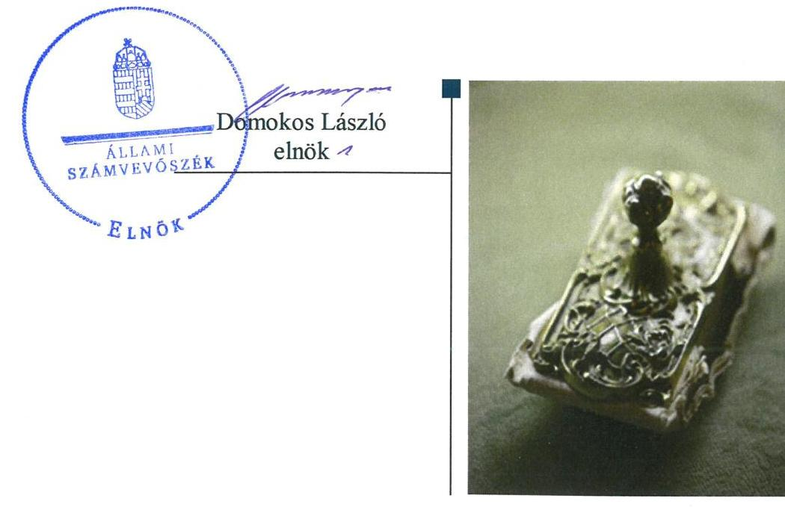
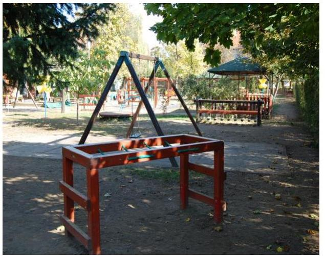
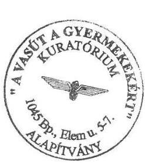
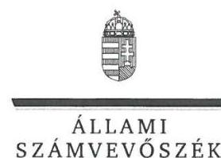
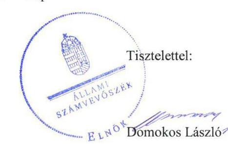

# Jelentés 

## Nem állami humánszolgáltatók ellenőrzése

A humánszolgáltatást nyújtó államháztartáson kívüli köznevelési és szociális intézmények, szolgáltatók fenntartói központi költségvetésből kapott támogatásai felhasználásának ellenőrzése - "A Vasút a gyermekekért" Alapítvány 2019.

---

# Jelentés 

## Nem állami humánszolgáltatók ellenőrzése

A humánszolgáltatást nyújtó államháztartáson kívüli köznevelési és szociális intézmények, szolgáltatók fenntartói központi költségvetésből kapott támogatásai felhasználásának ellenőrzése - "A Vasút a gyermekekért" Alapítvány
2019. 07. hó 04. nap

---

# AZ ELLENŐRZÉST FELÜGYELTE:

- KAKAS SÁNDOR felügyeleti vezető
- DR. NAGY IMRE felügyeleti vezető

# AZ ELLENŐRZÉST VEZETTE ÉS A VÉGREHAJTÁSÁÉRT FELELŐS:

- MOLNÁR ZSUZSANNA ellenőrzésvezető
- A PROGRAM ÖSSZEÁLLÍTÁSÁÉRT FELELŐS:
  - TÓTPÁL SZABOLCS osztályvezető

IKTATÓSZÁM: EL-1586-001/2019.

TÉMASZÁM: 2448

ELLENŐRZÉS-AZONOSÍTÓ SZÁM: V079425

Jelentéseink az Országgyűlés számítógépes hálózatán és az Interneten a www.asz.hu címen is olvashatóak.

---

# TARTALOMJEGYZÉK 

■ ÖSSZEGZÉS ..... 5
■ AZ ELLENŐRZÉS CÉLJA ..... 7
■ AZ ELLENŐRZÉS TERÜLETE ..... 8
■ AZ ELLENŐRZÉS HÁTTERE, INDOKOLTSÁGA ..... 9
■ A JELENTÉS LÉNYEGES KÉRDÉSKÖREI ..... 10
■ AZ ELLENŐRZÉS HATÓKÖRE ÉS MÓDSZEREI ..... 11
■ MEGÁLLAPÍTÁSOK ..... 13
■ JAVASLATOK ..... 17
■ MELLÉKLETEK ..... 19
I. sz. melléklet: Értelmező szótár ..... 19
■ FÜGGELÉKEK ..... 21
I. sz. függelék a Jelentéshez ..... 21
II. sz. függelék: Észrevételek ..... 22
■ RÖVIDÍTÉSEK JEGYZÉKE ..... 39

---

.

---

# ÖSSZEGZÉS 

"A Vasút a gyermekekért" Alapítvány a támogatások átlátható, elszámoltatható igénybevételének és felhasználásának feltételeit nem teremtette meg. 2014-2015. évekre, valamint a 2017. évre biztosított költségvetési támogatások cél szerinti felhasználását nem igazolta. Nem határozta meg a közszolgáltatás igénybevételének és a szociális alapon adható kedvezmények feltételeit.

## Az ellenőrzés társadalmi indokoltsága

Az Állami Számvevőszék stratégiájában hangsúlyos szerepet szán annak, hogy szilárd szakmai alapon álló, értékteremtő ellenőrzéseivel előmozdítsa a közpénzügyek átláthatóságát, rendezettségét, javaslataival a közpénzek és a közvagyon szabályos, gazdaságos, hatékony és eredményes felhasználását segítse. Stratégiájában az Állami Számvevőszék célul tűzte ki, hogy az államháztartáson kívülre nyújtott költségvetési támogatások ellenőrzésével hozzájárul ahhoz, hogy a közpénzeket az államháztartáson kívüli szervezetek is átlátható módon használják fel a közfeladatok szerződésben vállalt ellátása érdekében. Tekintettel az elmúlt években a köznevelés finanszírozását és a köznevelési intézmények fenntartását érintően végbement változásokra, a társadalom fokozott érdeklődéssel figyeli a köznevelési feladatok ellátására fordított források felhasználását. Fontos ezért az Állami Számvevőszéknek a közvéleményt biztosítani arról, hogy a közpénz államháztartáson kívüli felhasználása ezen a területen sem marad ellenőrizetlenül. Az ellenőrzés hozzájárul ahhoz is, hogy a nyilvánosság és a közszolgáltatást igénybevevők megfelelő tájékoztatást kapjanak az államháztartáson kívüli közfeladatot ellátók működéséről. „A Vasút a gyermekekért" Alapítványnál végzett ellenőrzést további társadalmi elvárás is indokolja tevékenységéből adódóan, mivel köznevelési közfeladat ellátására több mint 800 millió Ft központi költségvetési támogatásban részesült az Alapítvány az ellenőrzött időszakban.

## Főbb megállapítások, következtetések, javaslatok

"A Vasút a gyermekekért" Alapítvány, - mint intézményfenntartó - a jogszabályi előírások szerinti számviteli szabályozás hiányában nem alakította ki a szabályszerű működési és gazdálkodási környezetet, a költségvetési támogatások átlátható, elszámoltatható igénybevételének és felhasználásának feltételeit nem teremtette meg.

Nem határozta meg az intézmények által kérhető térítési díj és tandíj megállapításának szabályait, a szociális alapon adható kedvezmények feltételeit, ezzel nem biztosította az intézmények szabályszerű működési keretének feltételeit, továbbá a közszolgáltatás igénybevételének feltételei nem voltak átláthatóak a szolgáltatást igénybevevők számára.

A költségvetési támogatások felhasználásáról nem vezette a jogszabály előírása szerinti nyilvántartást, ezáltal nem biztosította a támogatások felhasználásának átláthatóságát, elszámoltathatóságát. Közfeladatot ellátó intézményeinek a 2014-2015. években és a 2017-ben át nem adott támogatások cél szerinti felhasználását nem igazolta.

Nem gondoskodott "A Vasút a gyermekekért" Alapítvány a 2017. évi beszámolójának a jogszabályi előírások szerinti könyvvezetéssel történő alátámasztásáról. Nem tett eleget a jogszabályban előírtak szerinti közzétételi kötelezettségének a 2014-2015. évi és 2017. évi beszámolókra vonatkozóan. A közérdekű adatok közzétételi kötelezettségét nem teljesítette.

Az Állami Számvevőszék a jelentésben foglalt megállapítások alapján "A Vasút a gyermekekért" Alapítvány kuratóriumi elnökének öt javaslatot fogalmazott meg. A javaslatokat megalapozó megállapításokra az érintettnek 30 napon belül intézkedési tervet kell készítenie.

---

# KÖVETKEZTETÉSEK 

„A Vasút a gyermekekért" Alapítvány intézményfenntartó a szabályszerű működési és gazdálkodási környezetet nem alakította ki. Ezért a központi költségvetésből kapott támogatás átlátható és elszámoltatható igénybevételének és felhasználásának feltételei nem voltak biztosítottak. A költségvetésből kapott támogatások felhasználásáról a jogszabályban előírt nyilvántartást nem vezették, így nem volt igazolt a 2014., 2015. és 2017. években a fenntartó által a köznevelési intézményei részére át nem adott támogatások köznevelési célokra történő felhasználása. Ez hatással lehet a közfeladatot ellátó intézmények működésére és végső soron az intézmények közfeladat ellátása is veszélybe kerülhet. Mindezek felvetik, hogy az elszámoltathatóság követelményének érvényre jutásához, a közfeladatok zavartalan, a jogszabályi előírások szerinti ellátásához az intézmények jelenlegi formában történő fenntartása közpénzügyi szempontból megfelelő-e.

---

# AZ ELLENŐRZÉS CÉLJA 

AZ ELLENŐRZÉS CÉLJA annak értékelése volt, hogy „A Vasút a gyermekekért" Alapítvány, mint köznevelési intézményfenntartó központi költségvetésből kapott támogatásainak felhasználása szabályszerű volt-e, a támogatások igénylése, évközi módosítása és év végi elszámolása megfelelt-e a jogszabályi előírásoknak.

---

# AZ ELLENŐRZÉS TERÜLETE

## "A Vasút a gyermekekért" Alapítvány, mint intézményfenntartó

"A Vasút a gyermekekért" Alapítványt 1993-ban a MÁV Zrt. alapította gyermekintézmények működtetésének céljából, mely intézmények a gyermekek óvodai nevelési feladatait látták el, illetve középiskolás tanulók kollégiumi elhelyezését biztosították. A Fenntartó¹ az ellenőrzött időszakban Dunakeszin és Székesfehérváron egy-egy óvodát, Szegeden egy óvodát és egy kollégiumot működtetett. Az intézmények önállóan gazdálkodó szervezetek voltak.

A Fenntartó nyílt, közhasznú jogállású szervezet volt, alaptevékenységén kívül vállalkozási tevékenységet is végzett.

Úgyvezető szerve a tizennégy főből álló kuratórium volt. A Fenntartó képviseletét a kuratórium elnöke látta el, akinek a személyében nem történt változás az ellenőrzött időszakban.

Az intézményekben ellátott gyermekek száma a 2014. évi 484 főről 2017. évre 496 főre nőtt.

A Fenntartó összes bevétele 2014-ben 356,4 M Ft volt, amely 2017-ben 378,6 M Ft-ra emelkedett. A költségvetési támogatás összes bevételhez viszonyított aránya 2014-ben 52,4 % volt, ami 2017-re 61,0 %-ra nőtt, így a támogatás összege elérte a 233,0 M Ft-ot.

---

# AZ ELLENŐRZÉS HÁTTERE, INDOKOLTSÁGA 

A köznevelési feladatokat ellátó nem állami intézményfenntartók részére közfeladataik ellátására évente jelentős összegű pénzügyi támogatást biztosítottak a mindenkori költségvetési törvények a bennük megfogalmazott feltételek mellett.

Az Országgyűlés elfogadta a nemzeti köznevelésről szóló 2011. évi CXC. törvényt, amely jelentősen átalakította a korábbi finanszírozási rendszert 2013 szeptemberétől. Új feladatfinanszírozási forma (átlagbéralapú támogatás) jelent meg, amely az államháztartáson kívüli intézményfenntartókra is vonatkozik. Az ellenőrzés a finanszírozási rendszerben bekövetkezett változásokra, azok közfeladat ellátásra gyakorolt hatására fókuszált a költségvetési támogatásokat felhasználó államháztartáson kívüli szervezetek körében. Az ellenőrzés indokoltságát az is alátámasztotta, hogy az ÁSZ² még nem ellenőrizte átfogóan e területet.

Az ÁSZ stratégiájában foglaltak alapján is indokolt az ellenőrzés, amely a társadalom számára jelzi, hogy a közpénz államháztartáson kívüli felhasználása sem maradhat ellenőrizetlenül. Az államháztartáson kívülre nyújtott költségvetési támogatások ellenőrzésével az ÁSZ hozzájárul ahhoz, hogy a közpénzeket a nem állami fenntartók átlátható módon használják fel a közfeladatok ellátására kötött szerződésekben vállalt kötelezettségek teljesítése érdekében. Az ÁSZ az ellenőrzés javaslataival hozzájárulhat az említett rendszerek szabályszerű támogatás-felhasználásához, javíthatja a társadalmi-gazdasági döntések megalapozottságát, amely a „jól irányított állam" működésének feltétele.

---

# A JELENTÉS LÉNYEGES KÉRDÉSKÖREI 

1.     - A Fenntartó szabályszerű működési - és gazdálkodási környezet kialakításával megteremtette-e a költségvetési támogatások átlátható, elszámoltatható igénybevételének, felhasználásának feltételeit?
2.     - A Fenntartó az átvállalt köznevelési közfeladathoz biztosított költségvetési támogatásokat szabályszerűen fordította-e a humánszolgáltató intézményei működtetésére?
3.     - A Fenntartó a köznevelési intézményei működtetéséhez felhasznált közpénzekre vonatkozó gazdálkodásával a nyilvánosság előtt elszámolt-e, ennek megalapozása érdekében ellenőrzési, értékelési és a külső ellenőrzésekkel kapcsolatos intézkedési feladatait szabályszerűen látta-e el?

---

# AZ ELLENŐRZÉS HATÓKÖRE ÉS MÓDSZEREI 

## Az ellenőrzés típusa

Megfelelőségi ellenőrzés.

## Az ellenőrzött időszak

A 2014. január 1-je és 2017. december 31-e közötti időszak. A helyszíni szemle tekintetében 2018. január 1-jétől az utolsó helyszíni szemle időpontjáig (2018. október 11-ig) tartó időszak.

## Az ellenőrzés tárgya

Az ellenőrzés a köznevelési közfeladatokat ellátó államháztartáson kívüli fenntartó közfeladatainak ellátásához a költségvetési törvényekben biztosított központi költségvetési támogatások igénylése, évközi módosítása és év végi elszámolása fenntartói feladatainak ellátása, illetve e központi költségvetésből kapott támogatásaik közfeladatokra való fenntartó általi felhasználása szabályszerűségének értékelésére terjedt ki.

Az ellenőrzés nem terjedt ki a költségvetési támogatás igénylése, módosítása, elszámolása valódiságának, megalapozottságának, helyességének értékelésére, valamint a források intézmény általi felhasználásának értékelésére.

## Az ellenőrzött szervezet

„A Vasút a gyermekekért" Alapítvány, mint intézményfenntartó.

## Az ellenőrzés jogalapja

Az ellenőrzés jogszabályi alapját az ÁSZ tv. 1. § (3) bekezdésében, az 5. § (3) bekezdésében foglalt előírások adták.

## Az ellenőrzés módszerei

Az ellenőrzést az ellenőrzési program kérdései, az adott időszakban hatályos jogszabályok, az ellenőrzés szakmai szabályok és módszertanok, valamint a nemzetközi standardok figyelembevételével végezte az ÁSZ.

A közpénzekkel való felelős gazdálkodás segítésére irányuló javaslatok kidolgozásakor a hatályos jogszabályok voltak az irányadóak.

---

Az ellenőrzés ideje alatt az ÁSZ a Fenntartóval történő kapcsolattartást az ÁSZ SZMSZ ${ }^{1}$-ének vonatkozó előírásai alapján biztosította.

Az ellenőrzési kérdések megválaszolásához szükséges bizonyítékok megszerzése az ellenőrzött által rendelkezésre bocsátott dokumentumokra, adatokra alapozva történt.

Az ellenőrzési bizonyítékként felhasznált adatforrások közé tartoztak egyrészt a szakmai program részletes szempontjainál felsorolt adatforrások, másrészt minden - az ellenőrzés folyamán feltárt, az ellenőrzés szempontjából információt tartalmazó - dokumentum.

Az ellenőrzés lefolytatásához a Fenntartó a kitöltött tanúsítványok, valamint az ÁSZ által kért dokumentumok átadásával szolgáltatott adatokat, információkat. Az így rendelkezésre bocsátott adatok, információk és a tanúsítványok adatai valódiságának kontrollja az ellenőrzés keretében történt.

A fenntartott intézményeknél helyszíni szemle keretében győződtünk meg a tényleges feladatellátásról. A köznevelési humánszolgáltatások központi költségvetési támogatásai igénylésével, módosításával, elszámolásával kapcsolatos, államháztartáson kívüli fenntartó jogszabályokban előírt feladatai betartását, továbbá a központi költségvetési támogatások szabályszerű kezelését, nyilvántartását ellenőriztük a Fenntartónál, az ott rendelkezésre álló határozatok, nyilvántartások, beszámolók és egyéb dokumentumok alapján.

---

# 1. A Fenntartó szabályszerű működési - és gazdálkodási környezet kialakításával megteremtette-e a költségvetési támogatások átlátható, elszámoltatható igénybevételének, felhasználásának feltételeit? 

Összegző megállapítás

1.1. számú megállapítás

A Fenntartó nem alakította ki a szabályszerű működési - és gazdálkodási környezet kialakításával a költségvetési támogatások átlátható, elszámoltatható igénybevételének, felhasználásának feltételeit.

A Fenntartó nem gondoskodott a jogszabályi előírások szerinti számviteli szabályozás kialakításáról, belső szabályozása nem felelt meg a jogszabályi előírásoknak.

A Fenntartó a Számv. tv. ${ }^{4}$ 14. § (5) bekezdés b) pontban foglaltak ellenére nem készítette el az eszközök és a források értékelési szabályzatát. 2017-ben a Számv. tv. 161. § (1) bekezdésében előírtak ellenére nem rendelkezett számlarenddel. Számviteli politikája ${ }^{5}$ nem felelt meg a Számv. tv. 14. § (4) bekezdésében 2015. július 4-től hatályos előírásnak, mert nem rögzítették benne azokat a gazdálkodóra jellemző szabályokat, előírásokat, módszereket, amelyekkel a Fenntartó meghatározza, hogy mit tekint a számviteli elszámolás az értékelés szempontjából kivételes nagyságú vagy előfordulású bevételnek, költségnek, ráfordításnak.

A
 Fenntartó rendelkezett a Ptk. ${ }^{6}$ előírásainak megfelelő alapító okirattal${ }^{7}$. Szervezeti felépítése, a működés rendje, a felelősségi- és hatáskörök, valamint ezek gyakorlásának módja a Fenntartó SZMSZ-ében${ }^{8}$ meghatározásra kerültek.

A Fenntartó Kincstár felé történő elszámolása a 2015. és 2016. évi költségvetési támogatásokkal nem volt szabályszerű. Támogatás igénylési, módosítási feladatait szabályszerűen látta el.

A Fenntartó a 2015. és 2016. évi költségvetési támogatásokkal a Kincstár felé történő elszámolás - Nkt. vhr. 37/L. § (1) bekezdése szerinti - benyújtását nem igazolta.

A költségvetési támogatásokra vonatkozó kérelmét a Fenntartó az Nkt. vhr. ${ }^{9}$ szerint benyújtotta a Kincstárhoz${ }^{10}$.

A Fenntartó az Nkt. vhr.-ben előírt határidőre eleget tett a Kincstár felé a költségvetési támogatás igényléséhez kötődő létszám adatokban bekövetkezett változással kapcsolatos bejelentési kötelezettségének.

---

# 2. A Fenntartó az átvállalt köznevelési közfeladathoz biztosított költségvetési támogatásokat szabályszerűen fordította-e a humánszolgáltató intézményei működtetésére? 

Összegző megállapítás

A Fenntartó nem igazolta - 2016. év kivételével - a köznevelési feladathoz biztosított költségvetési támogatásoknak az intézmények működtetésére történő szabályszerű felhasználását az ellenőrzött időszakra vonatkozóan.
2.1. számú megállapítás

A Fenntartó az intézmények szabályszerű működési kereteit nem határozta meg. A személyi és tárgyi feltételek meglétét igazoló működési engedélyekkel rendelkezett a Fenntartó.

A Fenntartó nem határozta meg az Nkt.${ }^{11}$ 83. § (2) bekezdés c) pont előírása ellenére az intézmény által kérhető térítési díj és tandíj megállapításának szabályait, valamint a szociális alapon adható kedvezmények feltételeit.

Az intézmények 2015. évi költségvetései - az Nkt. 83. § (2) bekezdés c) pontjában foglalt előírás ellenére - nem kerültek megállapításra.

A Fenntartó az - az Nkt. előírásainak megfelelő - intézményi alapító okiratokban${ }^{12}$ meghatározta intézményei alapfeladatait. Az intézmények nyilvántartásba vétele megtörtént, az Nkt. vhr.-ben meghatározott OM azonosítóval${ }^{13}$ rendelkeztek. A Fenntartó rendelkezett az intézmények működéséhez szükséges - személyi és tárgyi feltételek meglétét igazoló - működési engedélyekkel.
2.2. számú megállapítás

A köznevelési feladat ellátásra kapott, át nem adott támogatások Fenntartó által történő cél szerinti felhasználása - 2016. év kivételével - szabályszerű nyilvántartás hiányában nem volt igazolt.

A Fenntartó nem vezette - az Nkt. vhr. 37/G. § (1) bekezdésének előírása ellenére - a költségvetési támogatások felhasználásáról a jogszabály által előírt, alapfeladatonként elkülönített nyilvántartást, amelyből megállapítható lett volna, hogy a támogatások milyen célra kerültek felhasználásra.

A Kincstár által köznevelési feladatok ellátására utalt és a Fenntartó által a 2014-2015. és 2017. években át nem adott támogatások cél szerinti felhasználása - a jogszabályi előírás szerinti támogatás felhasználás nyilvántartásának hiányában - nem volt igazolt.

---

# 3. A Fenntartó a köznevelési intézményei működtetéséhez felhasznált közpénzekre vonatkozó gazdálkodásával a nyilvánosság előtt elszámolt-e, ennek megalapozása érdekében ellenőrzési, értékelési és a külső ellenőrzésekkel kapcsolatos intézkedési feladatait szabályszerűen látta-e el? 

Összegző megállapítás

### 3.1. számú megállapítás

A Fenntartó köznevelési intézményei működtetésére biztosított közpénzekkel való gazdálkodását a nyilvánosság számára nem tette átláthatóvá, ellenőrzési és szakmai értékelési feladatokat nem végzett. A külső ellenőrzéshez kapcsolódó intézkedési kötelezettségének eleget tett.

A Fenntartó ellenőrzési és szakmai értékelési feladatokat nem végzett, a külső ellenőrzéshez kapcsolódó intézkedési kötelezettségének eleget tett.

A Fenntartó a Civil tv.${ }^{14}$ előírása szerint működésének és gazdálkodásának ellenőrzésére felügyelő bizottságot${ }^{15}$ hozott létre, amely ellenőrzést nem végzett az ellenőrzött időszakban.

Nem végzett ellenőrzést a Fenntartó - az Nkt. 83. § (2) bekezdés i) pontjában foglaltak alapján - az intézmények pedagógiai programja, házirendje, továbbá két intézmény${ }^{16}$ esetében az intézmények SZMSZ-e vonatkozásában az ellenőrzött időszakban. Az ellenőrzött időszakban négyből egy intézménye vonatkozásában élt az - Nkt.-ban biztosított - intézmény gazdálkodásának ellenőrzési jogával.

A Dunakeszi Óvoda${ }^{17}$ és a Szegedi Kollégium${ }^{18}$ vonatkozásában nem látott el - az Nkt. 83. § (2) bekezdés h) pontjában meghatározott - szakmai értékelési feladatokat a Fenntartó az ellenőrzött időszakban.

A Fenntartó eleget tett a Kormányhivatal${ }^{19}$ által lefolytatott helyszíni hatósági ellenőrzéshez kapcsolódó intézkedési kötelezettségének.

A Fenntartó nem gondoskodott 2017. évi beszámolójának a jogszabályi előírások szerinti könyvvezetéssel történő alátámasztásáról és - a 2016. évi beszámoló kivételével - beszámolói jogszabályban előírtak szerinti közzétételéről. A felhasznált közpénzekre vonatkozó közzétételi kötelezettségét a Fenntartó nem teljesítette.

A Fenntartó 2017. évre - a Számv. tv. 4. § (1) bekezdésében foglaltak ellenére - nem a Számv. tv. előírásainak megfelelő könyvvezetéssel alátámasztott beszámolót készített, mert a 2017. február havi támogatások beérkezését és továbbadását könyvviteli nyilvántartásába a - Számv. tv 165. § (2) bekezdésében foglaltak ellenére - számviteli bizonylat hiányában jegyezte be.

A Fenntartó a 2014. évi beszámoló vonatkozásában nem tett eleget a Cnytv.${ }^{20}$ 39. § (1) és 40. § (2) bekezdésében foglalt letétbe helyezési és közzétételi kötelezettségének. Nem teljesítette - a Civil tv. 30. § (1) bekezdésében meghatározott -közzétételi kötelezettségét a Fenntartó a 2015. és 

---

a 2017. évi beszámolók vonatkozásában, mert beszámolóit az üzleti év fordulónapját követő május 31-ei határidő után, 2016. június 10-én, illetve 2018. június 16-án tette közzé.

A Fenntartó belső szabályzatban nem határozta meg - az Info. tv. 7. § (2) és (3) bekezdésekben foglalt előírások ellenére - az informatikai rendszer szabályozása során az adatok biztonságának, védelmének érvényre juttatásához szükséges eljárási szabályokat. A közérdekű adatok megismerésére irányuló igények teljesítésének a rendjét a Fenntartó az Info tv.${ }^{21}$ 30. § (6) bekezdésében előírtak ellenére nem szabályozta.

Az Info tv.-ben meghatározott közzétételi listákon szereplő adatok pontos, naprakész és folyamatos közzétételének, a közzétételi kötelezettség teljesítésének a részletes szabályait az Info tv. 35. § (3) bekezdésben foglalt előírások ellenére nem alakították ki.

Nem gondoskodott a Fenntartó az Info tv. 37. § (1) bekezdésében foglaltak ellenére - a 2015. évi, a 2016. évi és a 2017. évi beszámolók kivételével - az Info tv. 1. melléklet szerinti általános közzétételi listában felsorolt Fenntartóra vonatkozó adatok közzétételéről.

---

# JAVASLATOK 

Az ÁSZ tv. 33. § (1) bekezdésében foglaltak értelmében az ellenőrzött szervezet vezetője köteles a jelentésben foglalt megállapításokhoz kapcsolódó intézkedési tervet összeállítani és azt a jelentés kézhezvételétől számított 30 napon belül az ÁSZ részére megküldeni. Amennyiben az ellenőrzött szervezet vezetője nem küldi meg határidőben az intézkedési tervet, vagy továbbra sem elfogadható intézkedési tervet küld, az Állami Számvevőszék elnöke az ÁSZ tv. 33. § (3) bekezdés a) és b) pontjaiban foglaltakat érvényesítheti.

## "A Vasút a gyermekekért" Alapítvány kuratóriuma elnökének

1. Intézkedjen az eszközök és források értékelési szabályzata és a számlarend elkészítéséről a Számv. tv. előírásai szerint.
(1.1. sz. megállapítás 1. bekezdésének 1. és 2. mondata alapján)
2. Intézkedjen arra, hogy a számviteli politika megfeleljen a jogszabályi előírásoknak.
(1.1. sz. megállapítás 1. bekezdésének 3. mondata alapján)
3. Határozza meg az intézmények által kérhető térítési díj és tandíj megállapításának szabályait, a szociális alapon adható kedvezmények feltételeit a jogszabályi előírás szerint.
(2.1. sz. megállapítás 1. bekezdése alapján)
4. Intézkedjen arra, hogy a költségvetési támogatások felhasználásának nyilvántartása megfeleljen a jogszabályban előírtaknak.
(2.2. sz. megállapítás 1. bekezdése alapján)
5. Intézkedjen arra vonatkozóan, hogy a Számv. tv. előírásai szerint a számviteli (könyvviteli) nyilvántartásokba csak szabályszerűen kiállított bizonylat alapján jegyezzenek be adatokat.
(3.2. sz. megállapítás 1. bekezdése alapján)

---

.

---

# MELLÉKLETEK 

- I. SZ. MELLÉKLET: ÉRTELMEZŐ SZÓTÁR
humánszolgáltatás
költségvetési támogatás
köznevelési közfeladat

Külön törvényben meghatározott szociális, gyermekjóléti, gyermekvédelmi, közoktatási, felsőoktatási, kulturális közfeladatok (2014. évi Kvtv. 34. § (1), (4) bekezdés, 1. számú melléklet XX/20/2. alcím, 19. alcím, 2015. évi Kvtv. 43. § (1), (4) bekezdés, 1. számú melléklet XX/20/2/3. jogcím csoport, 19. alcím, 2016. évi Kvtv. 41. § (1), (4) bekezdés, 1. számú melléklet XX/20/2/3. jogcím csoport, 19. alcím).
a társadalombiztosítás pénzügyi alapjai kivételével az államháztartás központi alrendszeréből ellenérték nélkül, pénzben nyújtott támogatások (Áht. 1. § 14. pont)
A Kvtv-ekben (2013. évi CCXXX. törvény 33-34. §, 2014. évi C. törvény 42-43. §, 2015. évi C. törvény 40-41. §) megállapított támogatás. Például a 2015. évi C. törvény 40-41. § szerint többek között: Az Országgyűlés a köznevelési feladat ellátására átlagbéralapú támogatást állapít meg. A nevelési-oktatási, valamint pedagógiai szakszolgálati intézményt fenntartó nemzetiségi önkormányzat, az egyházi és magán köznevelési intézményfenntartója részére az általuk fenntartott nevelési-oktatási intézményben, továbbá pedagógiai szakszolgálati intézményben pedagógus és - a b) pont kivételével -nevelő-oktató munkát közvetlenül segítő munkakörben foglalkoztatottak után a 7. melléklet I. pontja, valamint az óvoda, egységes óvoda-bölcsőde esetében a 2. melléklet II. pont 1. alpontja szerint és az 5. alpontjában meghatározott jogosultak után, az őket ott megillető mértékek szerint. Működési támogatást állapít meg a nemzetiségi önkormányzat vagy az egyházi jogi személy által fenntartott nevelési-oktatási intézményekben ellátott, továbbá a pedagógiai szakszolgálati intézményekben gyógypedagógiai tanácsadásban, korai fejlesztésben, oktatásban és gondozásban, valamint a fejlesztő nevelésben részt vevő gyermekekre, tanulókra tekintettel a nemzetiségi önkormányzat és a bevett egyház részére a 7. melléklet II. pontja szerint.
Az Országgyűlés a szociális, gyermekjóléti, gyermekvédelmi közfeladatot ellátó intézményt, szolgáltatást fenntartó egyházi jogi személy, civil szervezet, közalapítvány, országos nemzetiségi önkormányzat, települési vagy területi nemzetiségi önkormányzat, gazdasági társaság, és a humánszolgáltatást alaptevékenységként végző, az Szja tv. hatálya alá tartozó egyéni vállalkozó (a továbbiakban együtt: nem állami szociális fenntartó) részére támogatást állapít meg a következők szerint: a támogatás a nem állami szociális fenntartót a települési önkormányzatok 2. melléklet III. pont 3. alpont c)-k) pontjában és III. pont 5. alpont a) pontjában meghatározott támogatásaival azonos jogcímeken, összegben és feltételek mellett illeti meg.
A köznevelési intézmény alapító okiratában foglalt feladat: óvodai nevelés, nemzetiséghez tartozók óvodai nevelése, általános iskolai nevelés-oktatás, nemzetiséghez tartozók általános iskolai nevelése-oktatása, kollégiumi ellátás, nemzetiségi kollégiumi ellátás, gimnáziumi nevelés-oktatás, szakközépiskolai nevelés-oktatás, szakiskolai nevelés-oktatás, nemzetiség gimnáziumi nevelés-oktatása, nemzetiség szakközépiskolai nevelés-oktatása, nemzetiség szakiskolai nevelés-oktatása, Köznevelési Hidprogramok keretében folyó nevelés-oktatás, felnőttoktatás, alapfokú művészetoktatás, fejlesztő nevelés, fejlesztő nevelés-oktatás, pedagógiai szakszolgálati feladat, a többi gyermekkel, tanulóval együtt nevelhető, oktatható sajátos nevelési igényű gyermekek, tanulók óvodai nevelése és iskolai nevelése-oktatása, azoknak a sajátos nevelési igényű gyermekeknek, tanulóknak az óvodai, iskolai, kollégiumi ellátása, akik a többi gyermekkel, tanulóval nem foglalkoztathatók együtt, a gyermekgyógyüdülőkben, egészségügyi intézményekben, rehabilitációs intézményekben tartós gyógykezelés alatt álló gyermekek tankötelezettségének teljesítéséhez szükséges oktatás, pedagógiai-szakmai szolgáltatás.

---

# Mellékletek 

köznevelési intézmény
nem állami, nem önkormányzati (államháztartáson kívüli) intézményfenntartó

A nevelési- oktatási intézmény, pedagógiai szakszolgálati intézmény, pedagógiai-szakmai szolgáltatást nyújtó intézmény.
A köznevelési és szociális, gyermekjóléti és gyermekvédelmi közfeladatokat/humánszolgáltatásokat ellátó intézményt fenntartó egyházi jogi személy, társadalmi szervezet, alapítvány, közalapítvány, civil szervezet, országos nemzetiségi önkormányzat, nonprofit gazdasági társaság, gazdasági társaság és a humánszolgáltatást alaptevékenységként végző, Szja tv. hatálya alá tartozó egyéni vállalkozó. (2013. évi Kvtv. 35. § (1), (3) bekezdés, 2014. évi Kvtv. 33. §, 34. § (1), (4) bekezdés, 2015. évi Kvtv. 42. §, 43. § (1), (4) bekezdés, 2016. évi Kvtv. 40.
 §, 41. § (1), (4) bekezdés)

---

# FÜGGELÉKEK 

- I. SZ. FÜGGELÉK A JELENTÉSHEZ

Az Állami Számvevőszék az ellenőrzés során feltárt tényekhez kapcsolódó további körülmények tisztázására eszközrendszerrel nem rendelkezik. Amennyiben az ellenőrzésen túlmutatóan indokoltnak látszik az ellenőrzés során feltárt körülmények további vizsgálata, az Állami Számvevőszék törvényi felhatalmazás alapján az ellenőrzés által feltárt körülményeket továbbítja a hatáskörrel rendelkező szervnek a szükséges intézkedések megtétele, eljárások lefolytatása érdekében.

Az ellenőrzés feltárta, hogy a Fenntartó a Magyar Államkincstár által a köznevelési feladat ellátására biztosított támogatás összegéből a 2014. évben 1,2 M Ft-ot, a 2015. évben 2,8 M Ft-ot, a 2017. évben 18,8 M Ft-ot nem adott át a köznevelési intézményeinek.
A Fenntartó - az Nkt. vhr. 37/G. § (1) bekezdésének előírása ellenére - a költségvetési támogatások felhasználásáról nem vezette az alapfeladatonkénti bontásban elkülönített és naprakész nyilvántartást, amelyből megállapítható, hogy a támogatások milyen célra kerültek felhasználásra.
Mindebből következően nem igazolt, hogy a Fenntartó a köznevelési közfeladat ellátására kapott támogatásokat a köznevelési feladat ellátására fordította.
További körülményként feltárta az ellenőrzés, hogy a Fenntartó a 2017. február havi támogatások beérkezését és továbbadását - Számv. tv. 165. § (2) bekezdésében foglaltak ellenére - számviteli bizonylat hiányában jegyezte be könyvviteli nyilvántartásába. A Fenntartó nem tett eleget a Számv. tv.-ben előírt kötelezettségének, amely szerint a könyvvitelében rögzített és a beszámolójában szereplő tételeknek a valóságban is megtalálhatóaknak, bizonyíthatóknak, kívülállók által is megállapíthatóaknak kell lenniük. Ezáltal nem igazolt, hogy a Fenntartó éves beszámolója megbízható és valós képet mutat.
Az eset konkrét körülményeinek felderítésére a Magyar Államkincstár rendelkezik hatáskörrel.

A költségvetésből származó köznevelési támogatás cél szerinti felhasználása nem igazolt, így nem zárható ki, hogy a fenti eljárással a költségvetésben vagyoni hátrány keletkezett. Az eset konkrét körülményének felderítése az ügyészség hatásköre.

---

A jelentéstervezetet a Számvevőszék 15 napos észrevételezésre megküldte az ellenőrzött szervezet vezetőjének az ÁSZ tv. 29. § (1) bekezdés előírásának megfelelően.

"A Vasút a gyermekekért" Alapítvány kuratóriuma elnöke a jelentéstervezet megállapításaira írásban észrevételt tett.
Az ÁSZ tv. 29. § (3) bekezdésével összhangban az ÁSZ a Függelékben feltünteti az ellenőrzés megállapításaival kapcsolatban tett, figyelembe nem vett észrevételeket, és megindokolja, hogy azokat miért nem fogadta el.

A „Nem állami humánszolgáltatók ellenőrzése - A humánszolgáltatást nyújtó államháztartáson kívüli köznevelési és szociális intézmények, szolgáltatók fenntartói központi költségvetésből kapott támogatásai felhasználásának ellenőrzése - "A Vasút a gyermekekért" Alapítvány" címmel készített számvevőszéki jelentéstervezet megállapításaival kapcsolatban a kuratórium elnöke által 2019. május 8-án tett (az Állami Számvevőszékhez 2019. május 16-án érkezett) észrevételek - mellékletek nélkül - és azok kezelésének indokolása.

[^0]
[^0]:    * 29. § (1) Az Állami Számvevőszék az ellenőrzési megállapításait megküldi az ellenőrzött szervezet vezetőjének vagy az általa megbízott személynek, és annak, akinek személyes felelősségét állapította meg.
    (2) Az ellenőrzött szervezet vezetője és a felelősként megjelölt személy az ellenőrzés megállapításaira tizenöt napon belül írásban észrevételt tehet.
    (3) Az Állami Számvevőszék az észrevételre a beérkezésétől számított harminc napon belül írásban válaszol. A figyelembe nem vett észrevételeket köteles a jelentésben feltüntetni, és megindokolni, hogy azokat miért nem fogadta el.

---

# „A Vasút a gyermekekért" Alapítvány 

1045 Budapest, Elem u. 5-7.
Telefon/fax: 06-1-3225-450
Üzemi telefon: 01-41-70
Iktatószám: 2-K/185/2019.
Hiv.sz.: EL-0740-075/2019.
Állami Számvevőszék
Domokos László
elnök

## 1364 Budapest,

Pf. 54

## Tisztelt Elnök Úr!

„A Vasút a gyermekekért" Alapítvány Kuratóriuma megkapta az Alapítványunknál folytatott ellenőrzés Jelentéstervezetét.

Az ellenőrzés megállapításaira tett megjegyzéseinket a mellékletben szereplő dokumentumokkal támasztottuk alá.

Egyúttal elkészítettük a jelentésben foglalt megállapításokhoz kapcsolódó Intézkedési tervet, amit csatoltan megküldünk.

Az Alapítvány kuratóriuma köszönetét fejezi ki, hogy az alapítvány működésében rejlő hiányosságok feltárásával, javaslataikkal segítik szervezetünk kötelezettségeinek teljesítését, döntéseink megalapozottságát és a hatékony és szabályozásoknak megfelelő működését.

Tisztelettel kérjük a Jelentéstervezetre tett Megjegyzéseink és Intézkedési tervünk elfogadását.

Budapest, 2019. május 8.

Üdvözlettel:

Neuschl Gyula
„A Vasút a gyermekekért" Alapítvány
Kuratóriumának elnöke
az Alapítvány képviselője

---

# Megjegyzések a Számvevőszéki Jelentéstervezethez 

### 1.1. számú megállapítás

A fenntartó a Számviteli tv. 14§ (5) bekezdés (1) pontban foglaltak alapján a Számviteli politika részeként elkészítette az Eszközök és források értékelési szabályzatát. A szabályzatot a vizsgálat során beküldtük, a 2018. augusztus 8-án beküldött dokumentum jegyzékünk 14. sz. tételeként (01010202. pont). Jelen anyagunkhoz mellékeljük a beküldött szabályzatot (1.1.1 sz. melléklet).

### 1.2. számú megállapítás

A 2015. és 2016. évi támogatások elszámolásának Kincstár felé benyújtását, a beküldés tényét a 2018. szeptember 12-i dokumentum jegyzék 2-15. pontjában feltüntetett dokumentumokkal igazoltuk.

Jelen anyagunkhoz mellékeljük a 2015., 2016. évek Kincstár felé benyújtott fenntartói elszámolási dokumentumait, a kapcsolódó fenntartói nyilatkozatokkal együtt. (1.2.1. sz. melléklet). A Kincstárnak benyújtott anyagok kísérő jegyzékében felsorolt: intézményi adatlapokat, gyermekek/tanulók névszerinti jegyzékét, minősített pedagógusok jegyzékét és egyéb intézményi nyilatkozatokat - az anyag nagy terjedelme miatt - nem másoltuk le, azok az alapítvány székhelyén hiánytalanul rendelkezésre állnak.

### 2.1. számú megállapítás

Az Nkt. 83.§ (2) bekezdés c. pontjában előírtak alapján készítettük el az alapítvány Térítési díj szabályzatát, amelynek 2015. évi és 2017. évi módosított, kuratórium által elfogadott változatát a vizsgálat során benyújtottuk, a 2018. szeptember 12-én beküldött dokumentum jegyzék 2-22 és 3-28 sorszámú tételeként.

Jelen anyagunkhoz mindkét változatot mellékeljük. Mindkettőben részletezzük a térítési díj fizetésének szabályait, és a szociális alapon adható kedvezmények feltételeit, külön az óvodákban és külön a diákotthonban. 2017-ben a kedvezményeket az óvodavezetők kérésére szűkítettük, kimaradt a MÁV-os nagyszülők részére nyújtható kedvezmény, az igazolás nehézségei miatt. (2.1.1. sz. és 2.1.2. sz. mellékletek). Az intézményeknél a szülők tájékoztatása céljából a Térítési díj szabályzat közzétételre és szülői értekezleteken ismertetésre került.

Az intézmények 2015. évi költségvetései megállapításra, a kuratórium által 6/2015 (02.25). számú határozattal elfogadásra kerültek. A 2015. évi költségvetést, amelyet a kért évekre vonatkozó többi költségvetéssel együtt megküldtünk, (a 2018. szeptember 12-i jegyzékünk 02-29. sz. tételeként), jelen anyagunkhoz csatoljuk (2.1.3. sz. melléklet).

### 2.2. számú megállapítás

A Kincstár által köznevelési feladat ellátására utalt támogatásokat minden hónapban a beérkezést követően, haladéktalanul kiutaltuk az intézményeknek. Ennek alátámasztására az utalásokat igazoló banki bizonylatokat a vizsgálat során beküldtük, a 2018. szeptember 12-i dokumentum jegyzék 10, 11, 12. sorszámú tételeiként.

---

Jelen anyagunkhoz mellékeljük a 2014-2015-2017. évek banki bizonylatainak feldolgozása alapján vezetett kimutatásainkat, amelyek táblázatos formában mutatják be Kincstárból érkezett havi támogatási összegeket és az intézményeknek történt továbbutalások összegét.
(2.2.1, 2.2.2, 2.2.3 számú mellékletek)

A fenti mellékletek táblázataiból látható, hogy 2014-ben 187109601 Ft összeget, 2015-ben 194236322 Ft összeget, 2017-ben 225464457 Ft összeget utalt ki az Államkincstár a fenntartónak. Ebből 2014-ben 187472976 Ft, 2015-ben 193638018 Ft, 2017-ben 225294436 Ft-ot utaltunk tovább az intézményeknek. Ki nem utalt összeg 2014-ben nem volt, sőt 363375 Ft-tal többet utaltunk, mivel a 2014. decemberi elszámolásnál a Szegedi Óvoda drasztikus létszámcsökkenése miatt az Államkincstár 2.371.018 Ft-ot levont a támogatásból (a 2014. októberi létszámmódosításunk alapján). A ki nem utalt támogatás 2015-ben 598304 Ft volt, 2017-ben pedig 170021 Ft volt. A ki nem utalt összegek az év közbeni adatszolgáltatás során, az év elején beadott tervezett létszám és a tényleges létszámok év közbeni alakulásának eltérései miatt, a Kincstár által kimutatott év közbeni normatíva korrekciókból kiindulva, a normatíva visszafizetési kötelezettség teljesítését szolgálták. A Kincstár részére a 2014. évi normatívából 1.934.209 Ft-ot, 2015-ben 667.140 Ft-ot, 2017-ben 1.181.370 Ft-ot kellett visszafizetnünk.

A 2018. szeptember 12-i beküldött dokumentumok jegyzékének 56. és 57. sorszámú táblázataiban a 2015-17. évek vonatkozásában feltüntettük, hogy a Kincstártól kapott támogatásokat az alapítvány munkavállalóinak személyi jellegű ráfordításaira használtuk fel. A személyi jellegű ráfordítások összege 2014-ben 208700 e Ft volt, 2015-ben 227920 e Ft, 2017-ben 280456 e Ft volt.

# 3.1. számú megállapítás 

Az Alapítvány Felügyelőbizottsága a Kuratóriumi ülésekre meghívót kapott, azokon tanácskozási joggal részt vett, melyet a jelenléti ívek és jegyzőkönyvek alátámasztanak.
Az ellenőrzési feladatainak oly módon tett eleget, hogy a kuratórium elé terjesztett anyagokat áttanulmányozta, az adott anyaggal kapcsolatosan információt, szóbeli
tájékoztatást, felvilágosítást kért a szervezet vezető tisztségviselőitől, a munkavállalóitól, álláspontját a Kuratórium tagjai megismerték, és mérlegelték annak figyelembe vételét a döntések meghozatalában.
A Felügyelőbizottság 2017-ben áttekintette a 2016-2017. évi szakhatósági, felügyeleti szervek által végzett vizsgálatokról, ellenőrzésekről megküldött dokumentumokat. Az ellenőrzések intézkedésre okot adó eltéréseket nem tártak fel, így a Felügyelőbizottság részéről sem vált szükségessé intézkedést kezdeményezni.

A fenntartó az intézmények alapdokumentumait megvizsgálta, kuratóriumi ülésen megtárgyalta, s ezt követően fogadta el azokat.

Intézményi szakmai értékelési feladatot elláttunk - a leírtakhoz képest - a Szegedi Kollégiumban is, továbbá értékeltük a vezetők szakmai munkáját. (3.1.2. sz. 3.1.3. sz. 3.1.4. sz. melléklet)

Pénzügyi-gazdasági ellenőrzést elláttunk - a beküldött jegyzőkönyvek mellett - a Dunakeszi óvodában és a Szegedi Kollégiumban.

Ezek Jegyzőkönyveit jelen anyag 3.1.5., 3.1.6., 3.1.7. sz. mellékletében csatoljuk.

---

# 3.2. számú megállapítás 

Éves beszámolónk közzétételi kötelezettségét az alábbiak szerint teljesítettük:
2015. 05. 21-én küldtük be a 2014. évi beszámolót az Országos Bírósági Hivatalnak. (a 3.2.1. számú mellékletben csatoljuk a beérkezés visszaigazolását.) Egyéb visszajelzést nem kaptunk. Most, az Önök jelzésére ellenőriztük, hogy fent van-e a honlapon. Mivel ott hiányzott, a beküldést megismételtük. (A visszaigazolást csatoljuk a 3.2.2. számú mellékletben.)

A 2015. és 2017. évi beszámolókat a kuratóriumi elfogadást követően, határidőre szintén beküldtük. (3.2.3., 3.2.4. sz. melléklet) A beszámolóhoz mellékelt Meghatalmazást azonban nem fogadták el, így meg kellett ismételni a beküldést, a határidőt túllépve. (A beszámolót ugyanis nem a képviselő nyújtotta be, hanem a meghatalmazottja, a gazdasági vezető, aki az Ügyfélkapu kezelője is, meghatalmazással.)

Megjegyezzük, hogy a beszámolókat a közérdekű adatokkal együtt, minden intézményünk a saját honlapján közzéteszi. Ezen kívül - az alapítvány Alapító okiratának alapján - az alapítvány székhelyén is közzétesszük.

Az adatok biztonsága, védelme érvényre juttatásához szükséges eljárásokat a Számítógépes rendszer adatvédelmi szabályzatában foglaltuk össze, amelyet a vizsgálat során megküldtük. (03-25-ös tétel a szeptember 12-i jegyzékben.) A vizsgált időszakon kívül esik, 2018. május 25-én fogadta el a Kuratórium a Belső adatkezelési és adatbiztonsági szabályzatunkat, amely részletesen szabályozza az adatkezelés, védelem, hozzáférési jog, közérdekű adatok megismerésére vonatkozó igények teljesítésének rendjét.

## Az 1. sz. Függelékben foglaltakra vonatkozó megjegyzéseink:

A Függelékben szereplő megállapítás szerint a fenntartó a Magyar Államkincstár által köznevelési feladat ellátására biztosított támogatás összegéből a 2014-ben 1,2 M Ft-ot, 2015-ben 2,8 M Ft-ot, 2017-ben 18,8 M Ft-ot nem adott át a köznevelési intézményeinek.

Először a legnagyobb, 2017. évi összeggel kapcsolatos megállapítással foglalkozunk.
A. A Függelékben megállapítást nyert, hogy 2017-ben 18,8 millió Ft-ot nem adott át a fenntartó a Magyar Államkincstár által a köznevelési feladat ellátására biztosított támogatás összegéből.

Ehhez az alábbi érveink figyelembe vételét kérjük:
A. Normatíva járandóság és utalása
2017. évben az Államkincstár - ezt határozatában is megerősítette - 225464457 Ft-t biztosított az alapítvány számára. Ebből ténylegesen, banki utalással 223591460 Ft-ot folyósított az alapítvány számlájára, mivel szeptemberben és márciusban 1870120 Ft és 2877 Ft köztartozás címén levonásra került. (Székesfehérvári óvodánk járulékfizetése
 a bank téves utalása miatt hiányt mutatott, így 2017. szeptember 6-án az adóhatóság részére a normatívából visszatartásra és a NAV részére átutalásra került ez az összeg). Ezt természetesen kiutalt támogatásként vettük figyelembe a számviteli nyilvántartásainkban. A banki rendezést követően az óvoda a fenti összeget visszakapta.

---

(Így ezt az összeget az intézménynek kiutalt összegek között is számba vettük). Az összes, az intézmények rendelkezésére álló normatíva, az előbbiek figyelembe vételével, 2017. évben: 225294436 Ft volt. A ki nem utalt normatíva összesen 170021 Ft volt.

Az Államkincstár fenti köztartozás-levonással kapcsolatos levelét az F/1.sz. mellékletben csatoljuk, a téves, banki hibából eredő utalást, ill. annak rendezését pedig az F/2. sz. mellékletben. Hasonló, köztartozással kapcsolatos levonás történt 2017. márciusában is. (F/3. melléklet)

A 2017. évi Államkincstári utalásokat és az intézmények részére történt továbbutalásokat a 2.2.3.sz. mellékletben mutatjuk be havi részletezésben 2017. évre vonatkozóan.

A fenntartó 2017-ben a normatíván kívül a költségvetéstől közvetlenül csak az adózók által felajánlott 708.475 Ft 1% SZJA támogatást kapta. Az intézmények részére 60000 Ft-ot tovább utaltunk, ezt az F/4.1.1. és F/4.1.2. sz. alatt mellékelt Banki bizonylaton mutatjuk be. A fennmaradó összeget a központi dolgozók járulékfizetésére használtuk fel.

Megjegyezzük, hogy a költségvetési támogatások többi része nem a fenntartóhoz érkezett, hanem közvetlenül az intézményekhez. 2017-ben ezek a következők voltak:
a. A Szegedi Felsőoktatási Diákotthon 2008. május 9-én az Oktatási és Kulturális Minisztériummal Támogatási szerződést írt alá, amelynek alapján a felsőoktatásban tanuló hallgatók létszáma alapján normatív támogatásban részesül. Az összeg közvetlenül a diákotthon számlájára kerül átutalásra. Ennek összege 2017-ben 10252000 Ft volt. Az előző évi elszámolást követően - a létszámcsökkenés miatt - ebből 2017-ben 407750 Ft-ot vissza kellett utalnia a Szegedi Diákotthonnak. (F/5.1. és F/5.2. mellékletek).
b. A Dunakeszi Város Önkormányzatával 2006. december 8-án kötött Együttműködési megállapodás alapján az Önkormányzat támogatást biztosít a Dunakeszi Óvoda számára. 2017. évben ennek összege 5 millió Ft volt, amelyet az önkormányzat rendelkezése értelmében a gázüzemeltetésű konyha elektromos áramra való átállítására és a szükséges berendezések beszerzésére fordítottak. A támogatás -mint minden előző évben is- közvetlenül az Óvoda számlájára érkezett. (F/6. sz. melléklet).
c. A Csongrád megyei Munkaügyi Központ mindkét szegedi intézményünkben a közcélú foglalkoztatottak alkalmazását támogatásban részesíti. Ennek összege 2017-ben 3.207.305 Ft volt, amely közvetlenül az intézmények elkülönített számlájára érkezett. (F/13. és F/14. sz. mellékletek)
d. A Szegedi Óvoda részt vesz az Erasmus+ programban, s erre a Tempus Közalapítványtól 2017-ben 2.249.355 Ft pályázati pénzt kapott, amelyet a pályázati kiíró közvetlenül az óvoda számlájára utalt.

Összefoglalóan: 2017-ben az Államkincstártól 225464457 Ft-ot kaptunk, ebből az intézményeknek tovább utalt összeg 225294436 Ft volt. A ki nem utalt normatíva 170021 Ft volt, amelyet - az előző évvel kapcsolatos normatíva túlfizetés (1181370 Ft) részeként - visszafizettük az Államkincstárnak.

Az egyéb költségvetési támogatások közvetlenül az intézményekhez érkeztek be. Az előbbiekben, az a-c. pontokban bemutatott helyekről és célokra összesen 18.459.305 Ft érkezett be, amelyet 407.750 Ft visszafizetési kötelezettség terhelt. A 18.051.555 Ft összeg felhasználásával az intézmények mind az EMMI-vel, mind a Dunakeszi Önkormányzattal, mind a Csongrád Megyei Munkaügyi Központtal

---

tételesen elszámoltak. A d. pontban jelzett Erasmus + pályázati pénz felhasználásáról a Szegedi Óvoda számolt be a pályázat kiírójának.

A Függelékben kifogásolt 2017. évi 18,8 millió Ft - az előbbiekben megjelölt, normatívából ki nem utalt 170021 Ft kivételével - a fenntartóhoz nem került, azt nem is utalhattuk ki. A fentiekben részletezett összegeket az előbbiekben megjelölt támogatók az érintett intézmények számláira közvetlenül utalták át. A támogatások felhasználásáról az intézmények beszámolót/pénzügyi elszámolást készítettek és a kuratórium által felülvizsgált beszámolókat megküldték a támogatóknak.
B. A Függelékben 2014. évben a kérdéses összeg 1,2 millió Ft volt.

A következő két összeg igazolását tartjuk itt fontosnak:
a. 1% SZJA átutalások. A kapott összeg 2014-ben 1.059.650 Ft volt. Az intézményeknek egyenlő arányban utaltuk (-250 eFt mindenkinek-), a fennmaradó összeget -59.650 Ft-ot a központi dolgozók járulékának befizetésére használtuk fel. A banki bizonylatot a beérkezett összegről és az intézmények részére történt továbbutalásáról a korábbi vizsgálat során nem csatoltuk, s ezt most az F/9.1, F/9.2, F/9.3 sz. mellékletben pótoljuk.
b. A kapott állami normatívát a bankkivonatok alapján éves szinten teljes mértékben kiutaltuk az intézményeknek, sőt 363.375 Ft-tal többet utaltunk, mint a kapott összeg.
C. 2015. évben a kérdéses összeg 2,8 millió Ft volt.

Banki bizonylatokkal a korábbi vizsgálat során nem igazoltuk az 1% SZJA átutalását az intézményeknek, valamint a Csongrád megyei Kormányhivatal közvetlenül a szegedi két intézményünknek történt átutalásait sem.
a. 1% SZJA átutalások az intézményeknek. A kapott összeg 2014-ben 1.034.638 Ft volt. Az intézményeknek egyenlő arányú felosztásról döntött a kuratórium, így 250 eFt-ot utaltunk mindenkinek. A fennmaradó összeget, 34.638 Ft-ot a központi dolgozók járulékának befizetésére használtuk fel. A banki bizonylatot a beérkezett összegről és az intézmények részére történt továbbutalásáról az F/10. mellékletben csatoljuk.
b. 2015. évben a Csongrád megyei Kormányhivatal 2.443.787 Ft-ot utalt ki közvetlenül a két szegedi intézményünk elkülönített számlájára. Az összeg alátámasztására mellékeljük a banki bizonylatok másolatait. (F/11. és F/12. melléklet)
c. A normatív támogatásból ki nem utalt összeg 598304 Ft volt. Ebből fedeztük 2015. évben a normatíva visszafizetési kötelezettségünk (1.934.209 Ft) egy részét, a többit saját forrásból fizettük vissza.

Budapest, 2019. május 8.

---

ELNÖK

Ikt. szám: EL-0740-080/2019.

# Neuschl Gyula 

kuratórium elnöke
„A Vasút a gyermekekért" Alapítvány

## Budapest

## Tisztelt Elnök úr!

A „Nem állami humánszolgáltatók ellenőrzése - A humánszolgáltatást nyújtó államháztartáson kívüli köznevelési és szociális intézmények, szolgáltatók fenntartói központi költségvetésből kapott támogatásai felhasználásának ellenőrzése - „A Vasút a gyermekekért" Alapítvány" címmel készített számvevőszéki jelentéstervezetre tett észrevételét megkaptam.
Az Állami Számvevőszék észrevételekre vonatkozó álláspontjáról a felügyeleti vezető által készített részletes tájékoztatást csatoltan megküldöm.
Tájékoztatom Elnök urat, hogy a számvevőszéki jelentésben - az Állami Számvevőszékről szóló 2011. évi LXVI. törvény 29. § (3) bekezdése alapján - a figyelembe nem vett észrevételeket szerepeltetjük az elutasítás indokának feltüntetésével.

Budapest, 2019. 06. hó 07. nap

Melléklet: Tájékoztatás az észrevételek kezeléséről

---

# Tájékoztatás az észrevételek kezeléséről 

Az „Nem állami humánszolgáltatók ellenőrzése - A humánszolgáltatást nyújtó államháztartáson kívüli köznevelési és szociális intézmények, szolgáltatók fenntartói központi költségvetésből kapott támogatásai felhasználásának ellenőrzése - „A Vasút a gyermekekért" Alapítvány" című jelentéstervezetre (továbbiakban: jelentéstervezet) a 2019. május 8-án kelt levélben megküldött észrevételeit áttekintettem. Az észrevételek kezeléséről az alábbi tájékoztatást adom.

1) Az 1.1. számú megállapítás 1. bekezdés 1. mondatához tett észrevétel:

Elnök úr észrevételében jelezte, hogy a Számviteli politika részeként az eszközök és források értékelési szabályzatát elkészítették, és azt az adatszolgáltatás során az Állami Számvevőszék (továbbiakban: ÁSZ) rendelkezésére bocsátották. Az észrevételhez mellékletként csatolta az adatszolgáltatás alkalmával korábban már megküldött értékelési szabályzatot.

Az észrevételt nem fogadtuk el. Az ÁSZ az ellenőrzési megállapításait az adatszolgáltatás során a részére törvényi határidőben rendelkezésre bocsátott dokumentumokra alapozva fogalmazza meg. Az ellenőrzési dokumentumok ismételt felülvizsgálatát követően megállapítást nyert, hogy - az észrevételben tévesen feltüntetve 2018. augusztus 8-ai, azonban a dokumentumok alapján - 2018. augusztus 23-án kelt teljességi és hitelességi nyilatkozat 14. pontjában megnevezett, eszközök és források értékelési szabályzata keltezést, aláírást és oldalszámozást nem tartalmazott, így ellenőrzési bizonyítékként nem értékelhető. Az észrevételhez csatolt, aláírást, hitelesítést is tartalmazó, 2014. január 1-től hatályos szabályzatot „A Vasút a gyermekekért" Alapítvány (továbbiakban: Fenntartó) utólag küldte meg az ÁSZ részére. Az adatszolgáltatáson kívül rendelkezésre bocsátott dokumentumokat az ÁSZ nem értékeli, ezért a jelentéstervezet módosítása nem indokolt.

## 2) Az 1.2. számú megállapítás 1. bekezdéséhez tett észrevétel:

Elnök úr észrevételében foglaltak szerint a Fenntartó a 2015. és 2016. évi támogatások elszámolásának a Magyar Államkincstár (továbbiakban: Kincstár) felé történő benyújtását, a beküldés tényét a 2018. szeptember 12-ei dokumentumjegyzék 2.15. pontjában feltüntetett dokumentumokkal igazolta. Az észrevételhez a Kincstárhoz benyújtott 2015. és 2016. évi normatív állami támogatások hitelesített (keltezést, aláírást, pecsétet tartalmazó) elszámolási dokumentációját csatolta, a kapcsolódó nyilatkozatokkal együtt.
Az észrevételt nem fogadtuk el. Az ÁSZ az ellenőrzési megállapításait az adatszolgáltatás során a részére törvényi határidőben rendelkezésre bocsátott dokumentumokra alapozva

---

fogalmazza meg. A 2018. szeptember 12-én kelt teljességi és hitelességi nyilatkozat szerint az ÁSZ részére átadott dokumentumok, adatok megbízhatóak, és a bekért adatokra, dokumentumokra vonatkozóan teljes körű információt tartalmaznak. A hivatkozott nyilatkozat 2.15. pontjában feltüntetett ellenőrzési dokumentumok felülvizsgálata során megállapítást nyert, hogy a Fenntartó nem bocsátott az ellenőrzés rendelkezésére olyan dokumentumokat, amelyek a 2015. és 2016. évi támogatásoknak a Kincstár felé történő, a nemzeti köznevelésről szóló törvény végrehajtásáról szóló 229/2012. (VIII. 28.) Korm. rendelet (Nkt. vhr.) 37/L. § (1) bekezdése szerinti benyújtását igazolták volna.
A Fenntartó az adatszolgáltatás során a 2015. évi elszámolások vonatkozásában excel formátumban küldte meg a 2015. évi elszámoló adatlapok fenntartói összesítőjét és a „2014. évi elszámoláskor kötelezettségvállalással terhelt maradványként kimutatott központosított támogatások elszámolása a 2015. évi elszámoláshoz" megnevezésű dokumentumot, továbbá word formátumban a „költségvetési támogatást igénybe vevő részéről az államháztartásról szóló 2011. évi CXCV. törvényben meghatározott feltételeknek való megfelelésről" című fenntartói nyilatkozatot, valamint a 2015. évi adatlapot. Az ellenőrzés rendelkezésére bocsátott fenti dokumentumok aláírást, hitelesítést nem tartalmaztak, így ellenőrzési bizonyítékként nem értékelhetők. A 2016. évi elszámolások vonatkozásában a „2016. évi elszámoló adatlapok (FENNTARTÓI)Májusimód.pdf" megnevezésű dokumentum aláírást, hitelesítést nem tartalmazott, így ellenőrzési bizonyítékként nem értékelhető. A 2018. szeptember 12-én kelt teljességi és hitelességi nyilatkozat 2.15. pontjában felsorolt, a 2016. évre vonatkozó további elszámolási dokumentumok között szereplő „Nyilatkozat (fenntartók részére) (30).doc" megnevezésű fájl egy kitöltetlen, adatok és aláírás nélküli dokumentumot tartalmazott. A 2015. és 2016. évre vonatkozóan a Kincstárhoz benyújtott - aláírt és mellékleteket is tartalmazó - dokumentációt a Fenntartó utólag, az észrevétel mellékleteként küldte meg az ÁSZ részére. Az adatszolgáltatáson kívül rendelkezésre bocsátott dokumentumokat az ÁSZ nem értékeli, ezért a jelentéstervezet módosítása nem indokolt.

# 3) A 2.1. számú megállapítás 1. bekezdéséhez tett észrevétel: 

Elnök úr észrevételében jelezte, hogy az Nkt. 83. § (2) bekezdés c) pont előírtak alapján a térítési díj szabályzatot elkészítették, a 2015. évi és a 2017. évi módosított, az alapítvány kuratóriuma által elfogadott szabályzatokat az ellenőrzési dokumentumok között csatolták. Elnök úr az észrevételéhez a korábban teljesített adatszolgáltatás során, az ÁSZ Elektronikus Adatszolgáltatási Rendszerébe feltöltött szabályzatokat mellékelte.
Az észrevételt nem fogadtuk el. Az ÁSZ az ellenőrzési megállapításait az adatszolgáltatás során a részére törvényi határidőben rendelkezésre bocsátott dokumentumokra alapozva fogalmazza meg. Az ellenőrzési dokumentumok ismételt felülvizsgálata során megállapítást nyert, hogy a 2018. szeptember 12-én kelt teljességi és hitelességi nyilatkozat 2.22. pontjában szereplő 2015. április 2-án kelt Térítési díj szabályzat, valamint a 3.28. pontjában szereplő, 2017. január 12-én kelt, a Kuratórium 9/2017. (02.23.) sz.
 határozatával módosított Térítési díj szabályzat aláírást, hitelesítést nem tartalmazott, ezért a dokumentumok ellenőrzési bizonyítékként nem értékelhetők. A Fenntartó nem bocsátott az ellenőrzés rendelkezésére

---

olyan hiteles dokumentumokat, amelyek a szabályzatok jóváhagyását alátámasztották volna. Az adatszolgáltatáson kívül megküldött dokumentumokat az ÁSZ nem értékeli, ezért a jelentéstervezet módosítása nem indokolt.

# 4) A 2.1. számú megállapítás 2. bekezdéséhez tett észrevétel: 

Az észrevétel szerint a 2015. évi költségvetést a Fenntartó megállapította, és azt a kuratórium a 6/2015. (02.25.) sz. határozatával elfogadta. Elnök úr észrevételében jelezte, hogy a 2015. évi költségvetést az ellenőrzés rendelkezésére bocsátotta, továbbá mellékletként az észrevételéhez is csatoltan megküldte.
Az észrevételt nem fogadtuk el. Az ÁSZ az ellenőrzési megállapításait az adatszolgáltatás során a részére törvényi határidőben rendelkezésre bocsátott dokumentumokra alapozva fogalmazza meg. A dokumentumok felülvizsgálatát követően megállapítást nyert, hogy a 2018. szeptember 12-én kelt teljességi és hitelességi nyilatkozat - észrevételben is hivatkozott - 2.29. pontjában szereplő „2015. évi költségvetés.xls" című dokumentum aláírást és hitelesítést nem tartalmazott, ezért ellenőrzési bizonyítékként nem értékelhető. Az ellenőrzési dokumentumok alapján a Fenntartó nem bocsátott az ellenőrzés rendelkezésére olyan dokumentumot, amely az intézmények 2015. évi költségvetéseinek megállapítását és elfogadását hitelesen alátámasztotta volna. Az észrevételhez mellékletként csatolt, az adatszolgáltatáson kívül megküldött, utólag rendelkezésre bocsátott dokumentumokat az ÁSZ nem értékeli, ezért a jelentéstervezet módosítása nem indokolt

## 5) A 2.2. számú megállapításhoz tett észrevétel:

Az észrevétel szerint a Fenntartó a Kincstár által a köznevelési feladatok ellátására utalt normatív támogatásokat minden hónapban a beérkezést követően, haladéktalanul kiutalta az intézményeknek, az intézmények felé történő utalásokat igazoló banki bizonylatok az adatszolgáltatás során az ÁSZ részére megküldésre kerültek. Elnök úr az észrevételéhez a 2014., a 2015. és a 2017. évi banki bizonylatok feldolgozása alapján készített, a Kincstártól érkezett havi támogatási összegeket és az intézményeknek történt továbbutalások összegeit bemutató táblázatokat csatolt. Az észrevételben Elnök úr ismertette a megküldött összesítő kimutatások adatait, továbbá jelezte, hogy az adatszolgáltatás során korábban már megküldött táblázatok alapján a 2015-2017. évre vonatkozóan a Kincstártól kapott támogatásokat a Fenntartó munkavállalóinak személyi jellegű ráfordításaira használta fel.
Az észrevételt nem fogadtuk el. Az ÁSZ az ellenőrzési megállapításait az adatszolgáltatás során a részére törvényi határidőben rendelkezésre bocsátott dokumentumokra alapozva fogalmazza meg. A 2018. szeptember 12-én kelt teljességi és hitelességi nyilatkozat észrevételben is hivatkozott - 2.26. és 3.30. pontjaiban felsorolt, 2014-2017. évi banki bizonylatok megtalálhatók voltak az ellenőrzési dokumentumok között. A jelentéstervezetben szereplő megállapítás arra vonatkozott, hogy a Fenntartó nem vezette a költségvetési támogatások felhasználásáról az Nkt. vhr. 37/G. § (1) bekezdésének előírása szerinti, alapfeladatonként elkülönített nyilvántartást, amelyből megállapítható lett volna, hogy a

---

támogatások milyen célra kerültek felhasználásra. A megállapítás szerint a Kincstár által köznevelési feladatok ellátására utalt és a Fenntartó által a 2014., 2015. és 2017. években át nem adott támogatások cél szerinti felhasználása - a jogszabályi előírás szerinti támogatás felhasználás nyilvántartásának hiányában - nem volt igazolt. Az ÁSZ a 2018. augusztus 18-án kelt EL-0740-005/2018. iktatószámú adatbekérő levél 2.28. és 3.31. pontjaiban a költségvetési támogatások elkülönített nyilvántartását igazoló dokumentumok, főkönyvi és analitikus nyilvántartások megküldését kérte a Fenntartótól. Az ellenőrzési dokumentumok alapján a Fenntartó nem bocsátott az ellenőrzés rendelkezésére olyan dokumentumot, amely a költségvetési támogatások felhasználásáról az Nkt. vhr. 37/G. § (1) bekezdésének előírása szerinti, alapfeladatonként elkülönített nyilvántartás vezetését alátámasztotta volna. Az észrevételhez mellékletként csatolt, az adatszolgáltatáson kívül megküldött, utólag rendelkezésre bocsátott dokumentumokat az ÁSZ nem értékeli, ezért a jelentéstervezet módosítása nem indokolt.

Elnök úr észrevételében hivatkozott továbbá a 2018. szeptember 12-ei teljességi és hitelességi nyilatkozat 56. és 57. sorszámú táblázataira, amelyekben a Kincstártól kapott támogatásoknak személyi jellegű ráfordításokra történő felhasználása feltüntetésre került. A Fenntartó 2018. október 10-én postára adott levelében a 2018. szeptember 12-ei teljességi és hitelességi nyilatkozatát kiegészítette, pontosította, azonban a nyilatkozat az észrevételben hivatkozott 56. és 57. sorszámú dokumentumokat nem tartalmazott. Erre tekintettel az észrevételben hivatkozott dokumentumok nem voltak beazonosíthatók. A Fenntartó adatszolgáltatása során megküldött 2014., 2015. és 2017. évi beszámolói az észrevételben hivatkozott kiutalt támogatási összegeket, valamint a 2015. és 2017. évi személyi jellegű ráfordítások összegeit nem támasztják alá. Fentiekre tekintettel a jelentéstervezet módosítása nem indokolt.

# 6) A 3.1. számú megállapításhoz tett észrevételek: 

Az észrevételben foglaltak szerint a Fenntartó Felügyelő Bizottsága ellenőrzési feladatainak a kuratórium elé terjesztett anyagok áttanulmányozásával, szóbeli tájékoztatás kérésével, valamint a kuratóriumi üléseken tanácskozási joggal történő részvétellel tett eleget. A Felügyelő Bizottság a 2017. év folyamán a szakhatósági, felügyeleti szervek által végzett 2016-2017. évi ellenőrzések dokumentumait áttekintette, azok alapján intézkedés kezdeményezése nem vált szükségessé. Elnök úr észrevételében jelezte, hogy a Fenntartó az intézmények dokumentumait a kuratóriumi üléseken megtárgyalta, ezt követően fogadta el azokat. Az észrevétel szerint a Fenntartó a szakmai értékelési feladatait a Szegedi Kollégiumban is ellátta, továbbá értékelte a vezetők szakmai munkáját, és pénzügyi-szakmai ellenőrzést végzett a Dunakeszi Óvodában és a Szegedi Kollégiumban is. Elnök úr észrevételéhez mellékletként két intézményvezető értékelését (2016. november), a Szegedi Kollégiumnál végzett szakmai tevékenységének értékelését és a 2017. évi fenntartói ellenőrzés jegyzőkönyvét, valamint a Dunakeszi Óvodánál végzett fenntartói ellenőrzések (2014. június 20., 2015. augusztus 31.) jegyzőkönyveit csatolta.

---

Az észrevételt nem fogadtuk el. A Fenntartó Alapító Okirata 18.9. pontja a Felügyelő Bizottság részére előírta a Fenntartó működésének és gazdálkodásának ellenőrzését. Az ellenőrzési dokumentumok ismételt felülvizsgálata alapján megállapítás nyert, hogy a Fenntartó nem bocsátott az ellenőrzés részére olyan dokumentumokat, amelyek a Felügyelő Bizottság által - a belső szabályozásban meghatározottak szerint - a Fenntartó feladatellátásának, a költségvetési támogatás felhasználásának ellenőrzését alátámasztotta volna az ellenőrzött időszakra vonatkozóan. Fentiekre tekintettel a jelentéstervezet módosítása nem indokolt.

A jelentéstervezetben foglalt megállapítás arra vonatkozott, hogy a Fenntartó a nemzeti köznevelésről szóló 2011. évi CXC. törvény (Nkt.) 83. § (2) bekezdés i) pontjában foglaltak alapján az intézmények pedagógiai programja, házirendje, továbbá két intézmény - a Szegedi Kollégium és a Dunakeszi Óvoda - esetében az intézmények szervezeti és működési szabályzata (SZMSZ) vonatkozásában nem végzett ellenőrzést az ellenőrzött időszakban. Az ellenőrzési dokumentumok ismételt felülvizsgálatát követően megállapítást nyert, hogy Szegedi Kollégium vonatkozásában a 2018. szeptember 12-én kelt teljességi és hitelességi nyilatkozat 2.32., 2.34. és 3.37. pontjában szereplő dokumentumok aláírást, hitelesítést nem tartalmaztak, ezért ellenőrzési bizonyítékként nem értékelhetők. A 2018. szeptember 12-én kelt teljességi és hitelességi nyilatkozat 2.34. pontjában szereplő aláírást, hitelesítést szintén nem tartalmazó dokumentumok a Dunakeszi Óvodánál végzett fenntartói ellenőrzéseket nem támasztották alá.
A nyilatkozat 2.34. pontjában megnevezett „T5-14-16.pdf" című dokumentum tartalmazta a dunakeszi, a szegedi és a székesfehérvári óvodáknál a 2016. évben végzett fenntartói ellenőrzések hitelesített dokumentumait, valamint a 3.34. pontban megnevezett „T5147.pdf" című dokumentum a Székesfehérvári Óvoda vezetőjével készített interjút a tanfelügyeleti ellenőrzés kapcsán. Az adatszolgáltatás során az ÁSZ rendelkezésére bocsátott, a fentiekben megnevezett dokumentumok általános jelleggel tartalmaztak az óvodai nevelési-oktatási tevékenység ellátásra, a személyi és tárgyi feltételekre, valamint az elvégzett felújítási és karbantartási munkák ellenőrzésére vonatkozó megállapításokat, azonban az intézmények pedagógiai programjának és házirendjének fenntartó általi - jogszabályban előírt ellenőrzését nem támasztották alá. Az ellenőrzési dokumentumok alapján a Fenntartó nem bocsátott az ellenőrzés rendelkezésre olyan dokumentumokat, amely a nevelési/pedagógiai program, illetve a házirend jóváhagyását, tudomásul vételét igazolták volna.
Az adatszolgáltatás során az ÁSZ rendelkezésére bocsátott, a 2018. szeptember 12-én kelt teljességi és hitelességi nyilatkozat 2.32. pontjában megnevezett vezetői értékelés (Szegedi Óvoda, Szegedi Kollégium) aláírást, hitelesítést nem tartalmazott, ezért ellenőrzési bizonyítékként nem értékelhető. Fentiek miatt az adatszolgáltatás során az ellenőrzés rendelkezésére bocsátott dokumentumok ellenőrzési bizonyítékként nem értékelhetők, a fenntartói ellenőrzéseket nem támasztották alá. Az észrevételhez mellékletként csatolt, az adatszolgáltatáson kívül megküldött, utólag rendelkezésre bocsátott dokumentumokat az ÁSZ nem értékeli, ezért a jelentéstervezet módosítása nem indokolt.

---

# 7) A 3.2. számú megállapítás 2. bekezdéséhez tett észrevételek: 

Elnök úr észrevételében jelezte, hogy a 2014. évi beszámolót 2015. május 21-én megküldte az Országos Bírósági Hivatalnak, ennek ellenére a beszámoló bíróság honlapján nem volt megtalálható. A jelentéstervezet megállapítása alapján a Fenntartó a beszámoló megküldését 2019. május 6-án megismételte. Az észrevétel szerint a 2015. évi és a 2017. évi beszámolók késedelmes megküldésének oka a beszámolók benyújtójának meghatalmazásával kapcsolatos probléma volt. Elnök úr az észrevételben jelezte továbbá, hogy az intézményi beszámolókat minden intézmény a saját honlapján közzé teszi. Észrevételéhez a 2014. évi, a 2015. és 2017. évi beszámolók megküldését tartalmazó dokumentumokat, valamint a beszámoló benyújtójának előterjesztési jogosultságára vonatkozó értesítést csatolta.
Az észrevételt nem fogadtuk el. Elnök észrevételében elismerte a 2014. évi beszámoló közzétételének hiányát, és azt a tájékoztatást adta, hogy a jogosan kifogásolt hiányosságot 2019. május 5-én a beszámoló ismételt megküldésével megszüntették. Tekintettel arra, hogy az ellenőrzési megállapítások a 2014-2017 közötti ellenőrzött időszakra vonatkoznak, és a megtett intézkedés az ellenőrzött időszakon túli, az észrevétel az ellenőrzött időszakra vonatkozó megállapítást nem érinti, a jelentéstervezet módosítása nem indokolt. Elnök úr az észrevételében elismerte a 2015. és 2017. évi beszámolók késedelmes közzétételét, ezért a jelentéstervezet módosítást nem igényel. A jelentéstervezet a Fenntartó beszámolóinak, nem az intézmények beszámolóinak közzétételére vonatkozóan tartalmazott megállapítást, ezért az észrevétel figyelembe vétele nem indokolt. Az észrevételhez mellékletként csatolt, az adatszolgáltatáson kívül megküldött, utólag rendelkezésre bocsátott dokumentumokat az ÁSZ nem értékeli, ezért a jelentéstervezet módosítása nem indokolt.

## 8) A 3.2. számú megállapítás 3. bekezdéséhez tett észrevételek:

Az észrevételben foglaltak szerint az adatok biztonsága, védelmének érvényre jutásához szükséges eljárásokat a Fenntartó a Számítógépes rendszer adatvédelmi szabályzatában foglalta össze, az adatvédelmi szabályzatot az adatszolgáltatás során az ÁSZ rendelkezésére bocsátotta. Elnök úr az észrevételében jelezte továbbá, hogy a közérdekű adatok megismerésére irányuló igények teljesítésének a rendjét is tartalmazó Belső adatkezelési és adatbiztonsági szabályzatot a Fenntartó kuratóriuma 2018. május 25-én fogadta el.
Az észrevételt nem fogadtuk el. Az ÁSZ az ellenőrzési megállapításait az adatszolgáltatás során a részére törvényi határidőben rendelkezésre bocsátott dokumentumokra alapozva fogalmazza meg. A 2018. szeptember 12-én kelt teljességi és hitelességi nyilatkozat - az észrevételben tévesen 3.25-ként hivatkozott - 3.15. pontjában megnevezett, ,,Az Alapítvány Belső adatvédelmi és adatkezelési szabályzata - X. Adatbiztonsági rendelkezések" dokumentum, valamint a nyilatkozat 2.7. pontjában megnevezett, ,,Számítógépes rendszer adatvédelmi szabályzata" dokumentum aláírást, hitelesítést, oldalszámozást nem tartalmaztak, ezért ellenőrzési bizonyítékként nem értékelhetők.
Elnök úr az észrevételében a jelentéstervezet - közérdekű adatok megismerésére irányuló igények teljesítésének rendjére vonatkozó - megállapítását nem vitatta. Az észrevételben

---

jelzett megtett intézkedés az ellenőrzött időszakon túli, ezért az észrevétel az ellenőrzött időszakra vonatkozó megállapítást nem érinti, a jelentéstervezet módosítása nem indokolt.

# 9) A jelentéstervezet I.
 sz. Függelék 2. bekezdéséhez tett észrevételek: 

Köszönettel vettem Elnök úrnak a jelentéstervezet I. sz. Függelék 2. bekezdéséhez a 2014., 2015. és 2017. évekre vonatkozóan fűzött tájékoztatását. A jelentéstervezet megállapításaihoz kapcsolódóan a Függelékben leírtakra vonatkozó megjegyzéseiben foglaltakat értékeltem, valamint a Függelékben szereplő számadatok megalapozottságát felülvizsgáltam.
Az ellenőrzés feltárta, hogy a Fenntartó a Magyar Államkincstár által a köznevelési feladat ellátására biztosított támogatás összegéből a 2014. évben 1,2 M Ft-ot, a 2015. évben 2,8 M Ft-ot, a 2017. évben 18,8 M Ft-ot nem adott át a köznevelési intézményeinek.
Elnök úr tájékoztatása szerint a Fenntartó a 2014. évben személyi jövedelemadó 1%-ának felajánlásaiból támogatásban részesült, amelyet az intézmények között egyenlő arányban osztott fel, valamint a központi dolgozók járulékainak befizetésére használta fel. Jelezte továbbá, hogy a Fenntartó a költségvetési normatív támogatásokat teljes mértékben továbbutalta az intézményeknek, a 2014. évben az intézmények felé az utalás a Fenntartó által kapott összegnél 0,4 M Ft-tal (363 375 Ft) nagyobb volt.
A köznevelési feladat ellátására biztosított, Kincstár által a Fenntartónak utalt normatív állami támogatások intézmények felé történő továbbutalására vonatkozó megállapítást a személyi jövedelemadó felajánlásokból származó további bevételekkel kapcsolatos tájékoztatás nem módosítja. Az adatszolgáltatás során törvényi határidőben rendelkezésre bocsátott ellenőrzési dokumentumok alapján megállapítást nyert, hogy a Fenntartó nem bocsátott az ellenőrzés részére olyan dokumentumokat, amelyek az észrevételben hivatkozott 0,4 M Ft többlet utalást alátámasztotta volna. A Fenntartó az Nkt. vhr. 37/G. § (1) bekezdése szerinti, a költségvetési támogatások felhasználásáról alapfeladatonként elkülönített nyilvántartást nem vezetett. A Függelékben szereplő számadatok megalapozottságának felülvizsgálata során megállapítást nyert továbbá, hogy a 2014. évi bankkivonatok alapján a Kincstár a 2014. évben összesen 187,1 M Ft normatív állami támogatást utalt a Fenntartó részére, amelyből a Fenntartó az intézmények részére összesen 184,0 M Ft-ot utalt tovább. A bankbizonylatok 2014. július hónapra vonatkozóan a Szegedi Diákotthon részére történő átutalást nem támasztották alá. A Magyar Államkincstár Budapesti és Pest Megyei Igazgatóság 15335/2015. iktatószámú határozata alapján a Fenntartót megillető 2014. évi támogatás összege a 2014. évi elszámolás alapján 185,2 M Ft, a visszafizetési kötelezettség 1,9 M Ft volt. Fentiek alapján a köznevelési intézményeknek át nem adott összeg a 2014. évben (185,2-184=) 1,2 M Ft volt, ezért a jelentéstervezet módosítást nem igényel.
Elnök úr tájékoztatása alapján a Fenntartó a 2015. évben is támogatásban részesült a személyi jövedelemadó 1%-ának felajánlásaiból, amelyet az intézmények között egyenlő arányban osztott fel, valamint a központi dolgozók járulékainak befizetésére használt fel.

---

Levelében foglaltak szerint a 2015. évben a Csongrád Megyei Kormányhivatal 2,4 M Ft-ot utalt ki közvetlenül a két szegedi intézmény elkülönített számlájára. Észrevételében jelezte továbbá, hogy a költségvetési normatív támogatásokból ki nem utalt összeg a 2015. évben 0,6 M Ft (598 304 Ft) volt, amelyet normatíva visszafizetési kötelezettség teljesítésére fordított.
A köznevelési feladat ellátására biztosított normatív állami támogatások intézmények felé történő továbbutalására vonatkozó megállapítást a Csongrád Megyei Kormányhivataltól közvetlenül az intézményeknek utalt, a személyi jövedelemadó felajánlásokból származó további bevételekkel kapcsolatos tájékoztatás nem módosítja. Az ellenőrzési dokumentumok ismételt felülvizsgálatát követően megállapítást nyert, hogy a Fenntartó nem bocsátott az ellenőrzés részére olyan dokumentumot, amely a tájékoztatásban hivatkozott, a költségvetési támogatás 0,6 M Ft ki nem utalt összegét alátámasztotta volna. A Fenntartó az Nkt. vhr. 37/G. § (1) bekezdése szerinti, a költségvetési támogatások felhasználásáról alapfeladatonként elkülönített nyilvántartást nem vezetett. A 2015. évi bankkivonatok alapján a Kincstár a 2015. évben összesen 193,9 M Ft normatív állami támogatást utalt a Fenntartó részére, amelyből a Fenntartó az intézmények részére összesen 190,8 M Ft-ot utalt tovább. A bankbizonylatok 2015. június hónapra vonatkozóan a Szegedi Óvoda részére történő átutalást nem támasztották alá. A Magyar Államkincstár Budapesti és Pest Megyei Igazgatóság BPM-ÁHI/1202-14/2016. iktatószámú határozata alapján a Fenntartó megillető 2015. évi támogatás összege a 2015. évi elszámolás alapján 193,6 M Ft volt. Az ellenőrzési dokumentumok alapján tehát a köznevelési intézményeknek át nem adott összeg a 2015. évben (193,6-190,8=) 2,8 M Ft volt, ezért a jelentéstervezet módosítást nem igényel.
Elnök úr tájékoztatásában jelezte, hogy a 2017. évben a Fenntartó köztartozás címén történt levonás miatt a megállapított költségvetési támogatáshoz képest 1,9 M Ft-tal kevesebb támogatásban részesült. A téves járulékfizetés miatt levont összeget a banki rendezést követően a Székesfehérvári Óvoda visszakapta. A tájékoztatásban foglaltak szerint a 2017. évben az intézmények részére át nem adott költségvetési támogatás összege 170 021 Ft volt. Az ellenőrzési dokumentumok ismételt felülvizsgálatát követően azonban megállapítást nyert, hogy a Fenntartó nem bocsátott az ellenőrzés részére olyan dokumentumokat, amelyek a tájékoztatásban hivatkozott gazdasági eseményeket és az összegszerű eltérést alátámasztották volna. Az adatszolgáltatáson kívül megküldött, utólag rendelkezésre bocsátott dokumentumokat az ÁSZ nem értékeli. A köznevelési feladat ellátására biztosított normatív állami támogatások intézmények felé történő továbbutalására vonatkozó megállapítást a személyi jövedelemadó felajánlásokból származó további bevételekkel kapcsolatos tájékoztatás, valamint a közvetlenül az intézményekhez érkezett bevételekre vonatkozó tájékoztatás nem módosítja.
Az ellenőrzés rendelkezésére bocsátott 2017. évi - a februáriak kivételével - bankbizonylatok alapján a Kincstár a 2017. évben összesen 225 464 457 Ft normatív állami támogatást utalt a Fenntartó részére, amelyből a Fenntartó az intézmények részére összesen 205 462 502 Ft-ot utalt tovább. A Magyar Államkincstár Budapesti és Pest Megyei Igazgatóság BPM-ÁHI/2400-3/2018. iktatószámú határozata alapján a Fenntartót megillető 2017.

---

évi normatív támogatás összege a 2017. évi elszámolás alapján 224 283 087 Ft, a visszafizetési kötelezettség 1 181 370 Ft volt. A dokumentumok alapján nem igazolt, hogy a Fenntartó a 2017. évben (224 283 087-205 462 502=) 18 820 585 Ft összeget a köznevelési intézményeknek tovább utalta.

Jelen ellenőrzés során kizárólag a Fenntartó részére a Kincstár által a központi költségvetésből a köznevelési közfeladatainak ellátásához folyósított normatív (átlagbéralapú és a gyermek-, tanulólétszám alapú működési) támogatással kapcsolatos igénylés, év végi elszámolás, illetve annak közfeladatokra való felhasználásának szabályszerűségét értékeltük. Az észrevételben felsorolt egyéb, közvetlenül intézményekhez érkező költségvetési támogatások összegét a Kincstár hivatkozott határozata nem tartalmazta, ezért a jelentéstervezet módosítást nem igényel.

Elnök úr észrevételében tájékoztatást adott továbbá az ellenőrzés javaslatokat megalapozó megállapításaival összefüggésben tervezett intézkedésekről.

Az Állami Számvevőszékről szóló 2011. évi LXVI. törvény (továbbiakban: ÁSZ tv.) 29. § (2) bekezdése alapján az ellenőrzött szervezet vezetője az ellenőrzés megállapításaira tehet észrevételt.

Tekintettel arra, hogy a tájékoztatás nem tartalmazott konkrét megállapításra vonatkozó észrevételt, a jelentéstervezet módosítása nem indokolt. A tervezett vagy megtett intézkedésekről - a kiadmányozott jelentés megállapításaira az ÁSZ tv. 33.§ (1) bekezdése alapján összeállított - intézkedési tervben indokolt számot adni.

Budapest, 2019. 06. hó 0 f. nap

Kakas Sándor felügyeleti vezető

---

# RÖVIDÍTÉSEK JEGYZÉKE 

${ }^{1}$ Fenntartó
${ }^{2}$ ÁSZ
${ }^{3}$ ÁSZ SZMSZ
${ }^{4}$ Számv. tv.
${ }^{5}$ számviteli politika 1,2
${ }^{6}$ Ptk.
${ }^{7}$ alapító okirat 1
${ }^{8}$ SZMSZ 1,2
${ }^{9}$ Nkt. vhr.
${ }^{10}$ Kincstár
${ }^{11}$ Nkt.
${ }^{12}$ intézményi alapító okiratok 1-8

[^0]„A Vasút a gyermekekért" Alapítvány
Állami Számvevőszék
Az Állami Számvevőszék elnökének 4/2017. (XII.29.) ÁSZ utasítása az Állami Számvevőszék Szervezeti és Működési Szabályzatáról (hatályos: 2017. január 1-jétől)
2000. évi C. törvény - a számvitelről (hatályos: 2001. január 1-től)

1: „A Vasút a gyermekekért" Alapítvány - Számviteli Politika (hatályos: 2013. május 22-től)
2: „A Vasút a gyermekekért" Alapítvány - Számviteli Politika (hatályos: 2016. január 1-től)
2013. évi V. törvény a Polgári Törvénykönyvről (hatályos: 2014. március 15-től)
1: „A Vasút a gyermekekért" Alapítvány - Alapító Okirat (hatályos: 1993. december 13-tól)
2: „A Vasút a gyermekekért" Alapítvány - Alapító Okirat (hatályos: 2015. szeptember 9-től)
1: „A Vasút a gyermekekért" Alapítvány - Szervezeti Működési Szabályzat (hatályos: 2010. november 10-től)
2: „A Vasút a gyermekekért" Alapítvány - Szervezeti Működési Szabályzat (hatályos: 2015. december 15-től)
229/2012. (VIII. 28.) Korm. rendelet a nemzeti köznevelésről szóló törvény végrehajtásáról (hatályos 2012. szeptember 1-jétől)
Magyar Államkincstár
2011. évi CXC. törvény a nemzeti köznevelésről (hatályos: 2012. szeptember 1-jétől)
1: „A Vasút a gyermekekért" Alapítvány Dunakeszi Óvodája - Alapító Okirata (hatályos 2012. november 28-tól)
2: „A Vasút a gyermekekért" Alapítvány Dunakeszi Óvodája - Alapító Okirata (hatályos 2016. május 24-től)
3: „A Vasút a gyermekekért" Alapítvány Szegedi Óvodája - Alapító Okirata (hatályos 2012. november 28-tól)
4: „A Vasút a gyermekekért" Alapítvány Szegedi Óvodája - Alapító Okirata (hatályos 2015. szeptember 1-től)
5: „A Vasút a gyermekekért" Alapítvány Székesfehérvári Óvodája - Alapító Okirata (hatályos 2012. november 28-tól)
6: „A Vasút a gyermekekért" Alapítvány Székesfehérvári Óvodája - Alapító Okirata (hatályos 2015. szeptember 1-től)
7: „A Vasút a gyermekekért" Alapítvány Középiskolai Kollégiuma - Alapító Okirata (hatályos 2012. november 28-tól)
8: „A Vasút a gyermekekért" Alapítvány Középiskolai Kollégiuma - Alapító Okirata (hatályos 2015. szeptember 1-től)
oktatási azonosító szám
2011. évi CLXXV. törvény az egyesülési jogról, a közhasznú jogállásról, valamint a civil szervezetek működéséről és támogatásáról (hatályos: 2011. december 22-től)
„A Vasút a gyermekekért" Alapítvány Felügyelő Bizottsága

[^0]:    ${ }^{13}$ OM azonosító
    ${ }^{14}$ Civil tv.

---

${ }^{16}$ két intézmény
${ }^{17}$ Dunakeszi Óvoda
${ }^{18}$ Szegedi Kollégium
${ }^{19}$ Kormányhivatal
${ }^{20}$ Cnytv.
${ }^{21}$ Info tv.
„A Vasút a gyermekekért" Alapítvány Szegedi Kollégiuma és "A Vasút a gyermekekért" Alapítvány Dunakeszi Óvodája
"A Vasút a gyermekekért" Alapítvány Dunakeszi Óvodája
„A Vasút a gyermekekért" Alapítvány Szegedi Kollégiuma
Fejér Megyei Kormányhivatal Székesfehérvári Járási Hivatala
2011. évi CLXXXI. törvény a civil szervezetek bírósági nyilvántartásáról és az ezzel összefüggő eljárási szabályokról (hatályos: 2011. december 23-tól)
2011. évi CXII. törvény az információs önrendelkezési jogról és az információszabadságról (hatályos: 2011. július 27-től)

---

ÁLLAMI SZÁMVEVŐSZÉK
1052 Budapest, Apáczai Csere János utca 10.
Levélcím: 1364 Budapest 4. Pf. 54
Telefon: +36 1 484 9100 Telefax: +36 1 484 9200
www.asz.hu

