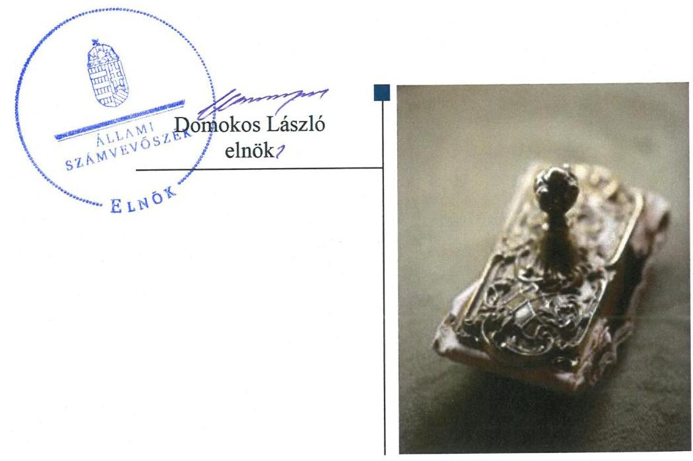
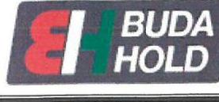
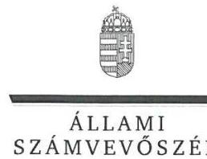
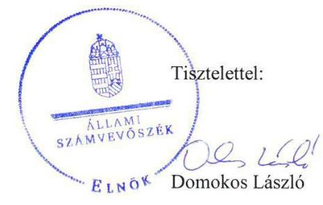
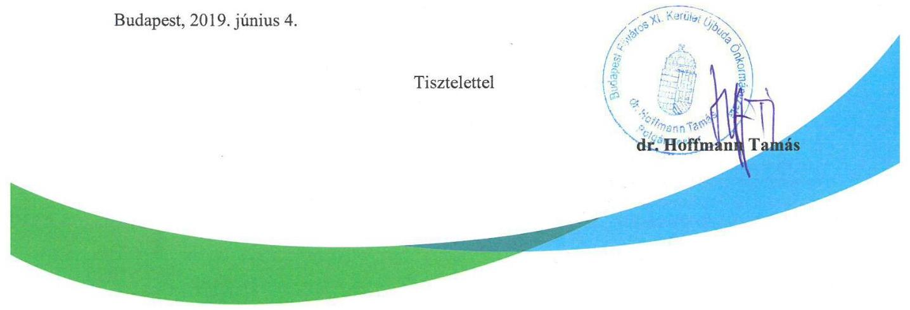
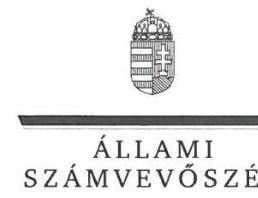
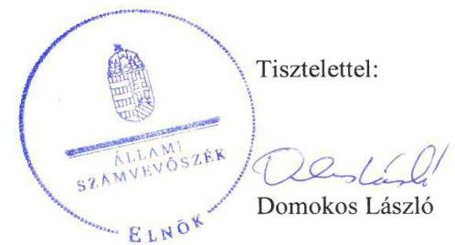

# Jelentés

## Nemzeti tulajdonú gazdasági társaságok ellenőrzése

BUDA-HOLD Vállalkozás Szervezési és Szolgáltató Kft.

2019.

19106 www.asz.hu

---

# Jelentés 

## Nemzeti tulajdonú gazdasági társaságok ellenőrzése

BUDA-HOLD Vállalkozás Szervezési és Szolgáltató Kft.
2019. C4. hó 03. nap

---

# AZ ELLENŐRZÉST FELÜGYELTE:

DR. PULAY GYULA felügyeleti vezető

## AZ ELLENŐRZÉST VEZETTE ÉS A VÉGREHAJTÁSÁÉRT FELELŐS:

- JÁNOSI ISTVÁN ellenőrzésvezető
- SALAMIN VIKTOR ellenőrzésvezető

## A PROGRAM ÖSSZEÁLLÍTÁSÁÉRT FELELŐS:

- TÓTPÁL SZABOLCS osztályvezető

IKTATÓSZÁM: EL-1589-001/2019.

TÉMASZÁM: 2478

ELLENŐRZÉS-AZONOSÍTÓ SZÁM: V082221

Jelentéseink az Országgyűlés számítógépes hálózatán és az Interneten a www.asz.hu címen is olvashatóak.

---

# TARTALOMJEGYZÉK 

■ ÖSSZEGZÉS ..... 5
■ AZ ELLENŐRZÉS CÉLJA ..... 6
■ AZ ELLENŐRZÉS TERÜLETE ..... 7
■ AZ ELLENŐRZÉS HÁTTERE, INDOKOLTSÁGA ..... 8
■ A JELENTÉS LÉNYEGES KÉRDÉSKÖREI ..... 9
■ AZ ELLENŐRZÉS HATÓKÖRE ÉS MÓDSZEREI ..... 10
■ MEGÁLLAPÍTÁSOK ..... 12
■ JAVASLATOK ..... 14
■ MELLÉKLETEK ..... 15
I. sz. melléklet: Értelmező szótár ..... 15
■ FÜGGELÉKEK ..... 17
I. sz. függelék a Jelentéshez ..... 17
II. sz. függelék: Észrevételek ..... 18
■ RÖVIDÍTÉSEK JEGYZÉKE ..... 31

---

.

---

# ÖSSZEGZÉS 

A BUDA-HOLD Vállalkozás Szervezési és Szolgáltató Kft. vagyongazdálkodása nem volt szabályszerű, számviteli beszámolóit 2015-2017. években nem támasztotta alá leltárral, beszámolója nem volt megalapozott, ezért működésének átláthatósága és elszámoltathatósága nem volt biztosított.

## Az ellenőrzés társadalmi indokoltsága

Az Állami Számvevőszék kiemelt célja, hogy a helyi önkormányzatok gazdálkodásában rejlő pénzügyi kockázatok feltárásával, az államháztartáson kívülre nyújtott költségvetési támogatások és ingyenes vagyonjuttatások, valamint az államháztartáson kívül működő feladat-ellátó rendszerek ellenőrzéseivel hozzájáruljon ahhoz, hogy a közpénzeket az államháztartáson kívül működő szervezetek is átlátható, rendezett módon használják fel.

Magyarországon az önkormányzatok kötelező és önként vállalt feladataik vonatkozásában is egyre szélesebb körben alkalmazzák a költségvetésen kívüli feladatellátást, ezáltal - a nonprofit szervezetek mellett - az önkormányzati tulajdonú gazdasági társaságok is kiemelt fontosságú szerephez jutottak.

## Főbb megállapítások, következtetések, javaslatok

Budapest Főváros XI. Kerület Újbuda Önkormányzata a tulajdonosi jogok gyakorlásának rendjét kialakította, a javadalmazással összefüggő szabályzatát elkészítette, tulajdonosi jogait szabályszerűen gyakorolta.

A BUDA-HOLD Vállalkozás Szervezési és Szolgáltató Kft. vagyongazdálkodási tevékenysége nem volt szabályszerű, 2015-2017. években mérlege alátámasztásához nem készített a jogszabályi előírásoknak megfelelő leltárt, ezért az éves beszámolói nem voltak megalapozottak.

Az Állami Számvevőszék a jelentésben foglalt megállapítások alapján a BUDA-HOLD Vállalkozás Szervezési és Szolgáltató Kft. ügyvezetőjének egy javaslatot fogalmazott meg. A javaslatokat megalapozó megállapításokra az érintettnek 30 napon belül intézkedési tervet kell készítenie.

---

# AZ ELLENŐRZÉS CÉLJA 

AZ ELLENŐRZÉS CÉLJA annak megítélése volt, hogy a tulajdonosi joggyakorló a gazdasági társaságai feletti tulajdonosi joggyakorlás kereteit kialakította-e, tulajdonosi jogait megfelelően gyakorolta-e és kötelezettségeit teljesítette-e. A gazdasági társaság biztosította-e a vagyon védelmét a nyilvántartások szabályszerű vezetése és a mérleg tételeinek leltárral történő alátámasztása útján, valamint szabályszerűen gondoskodott-e a társaság használatában, kezelésében lévő nemzeti vagyon értékének megőrzéséről, gyarapításáról, hasznosításáról.

---

# **AZ ELLENŐRZÉS TERÜLETE**

## **Budapest Főváros XI. Kerület Újbuda Önkormányzata, BUDA-HOLD Vállalkozás Szervezési és Szolgáltató Kft.**

Az Önkormányzat¹ a Társaságot² 1991. február 2-án alapította, alapításkori jegyzett tőkéje 1529,2 M Ft, mely az ellenőrzött időszak végére 2668,6 M Ft-ra nőtt. A társaság az Önkormányzat kizárólagos tulajdonában volt.

A Társaság fő tevékenysége az ellenőrzött időszakban saját tulajdonú ingatlanok értékesítése, valamint bérbeadása volt.

Az Önkormányzattal kötött Vagyonkezelési szerződés³ keretében a Társaság feladata az Albertfalvai Kispiac működtetése volt, melyhez vagyonkezelésbe kapta az Albertfalvai piac elnevezésű ingatlant 123,0 M Ft bekerülési értéken, mely egy 95,0 M Ft értékű telekből és egy 28,0 M Ft értékű épületből állt. A vagyonkezelt vagyon állománya az ellenőrzött időszakban nem változott.

Az ellenőrzött időszakban a polgármester⁴ és az ügyvezető⁵ személyében nem történt változás, a jegyző⁶ személye 2016 szeptemberében változott. A Társaság az ellenőrzött időszakban nem tartozott kormányzati szektorba sorolt gazdasági társaságok közé.

---

# AZ ELLENŐRZÉS HÁTTERE, INDOKOLTSÁGA 

Az Alaptörvény 38. cikke alapján az állam és a helyi önkormányzatok tulajdona nemzeti vagyon. A nemzeti vagyon megőrzése, megóvása érdekében kiemelten fontos ezen nemzeti tulajdonú gazdasági társaságok ellenőrzése. Gazdálkodásuk jellemzően a közérdeklődés és a média figyelmének középpontjában áll, amihez hozzájárul a gazdálkodásuk körébe tartozó - a nemzeti vagyon részét képező - vagyon nagysága, illetve az általuk ellátott közszolgáltatások minősége és hatékonysága. Ellenőrzéseink feltárhatják, hogy a tulajdonosi felügyelet hozzájárult-e a szabályszerű gazdálkodáshoz és feladatellátáshoz.

Az ellenőrzés eredményeként meghatározhatóvá válnak a szervezet vagyongazdálkodást érintő kockázatai, ezzel lehetővé téve a kockázatok csökkentését. A megállapítások alapján megfogalmazott számvevőszéki javaslatok hasznosítása elősegítheti a meglévő hibák megszüntetését. A jó gyakorlatok bemutatásával az ÁSZ hozzájárulhat a követendő megoldások megismertetéséhez, terjesztéséhez.

---

# A JELENTÉS LÉNYEGES KÉRDÉSKÖREI 

1. A Társaság feletti tulajdonosi joggyakorlás megfelelt-e a jogszabályi és belső előírásoknak?
2. A Társaság vagyongazdálkodási tevékenysége szabályszerű volt-e?

---

# AZ ELLENŐRZÉS HATÓKÖRE ÉS MÓDSZEREI 

## Az ellenőrzés típusa

Megfelelőségi ellenőrzés.

## Az ellenőrzött időszak

A tulajdonosi joggyakorlás vonatkozásában az ellenőrzött időszak 2017. január 1-től az ellenőrzés megkezdésének napjáig terjedt ki az éves beszámolók elfogadása és a vagyonkezelésbe adott vagyonnal való gazdálkodás tulajdonosi ellenőrzése kivételével, amelyeknél az ellenőrzött időszak 2015. január 1-től az ellenőrzés megkezdésének napjáig - 2018. október 5-ig - tartott.

A Társaság vagyongazdálkodása vonatkozásában az ellenőrzött időszak 2015-2017. évek, a 2017. évi beszámoló jóváhagyása tekintetében 2018. június elsejéig tartó időszak.

## Az ellenőrzés tárgya

Az önkormányzati tulajdonban lévő gazdasági társaság feletti tulajdonosi joggyakorlás kialakítása és működtetése.

Önkormányzati tulajdonban lévő gazdasági társaság vagyongazdálkodása keretében a társaság használatában, kezelésében lévő nemzeti vagyon, illetve a saját vagyon tekintetében a vagyonnyilvántartások vezetése, leltára. A társaság használatában, vagyonkezelésében lévő nemzeti vagyon tekintetében a vagyon értékének megőrzése, gyarapítása, hasznosítása.

## Az ellenőrzött szervezet

Budapest Főváros XI. Kerület Újbuda Önkormányzata, valamint a BUDAHOLD Vállalkozás Szervezési és Szolgáltató Kft.

## Az ellenőrzés jogalapja

Az ellenőrzés jogalapját az ÁSZ tv. ${ }^{7}$ 1. § (3) bekezdése és 5. § (3)-(5) bekezdései képezték.

---

# Az ellenőrzés módszerei 

Az ellenőrzést az ellenőrzési program ellenőrzési kérdései, az ellenőrzött időszakban hatályos jogszabályok, az ellenőrzés szakmai szabályok és módszertanok alapján, a nemzetközi standardok figyelembe vételével végeztük.

Az ellenőrzés ideje alatt az ellenőrzött szervezettel történő kapcsolattartást az ÁSZ Szervezeti és Működési Szabályzatának vonatkozó előírásai alapján biztosítottuk.
2017. január 1-től az ellenőrzés megkezdésének napjáig ellenőriztük a tulajdonosi joggyakorlás kereteinek kialakítását, a tulajdonosi joggyakorló tevékenységét a felügyelő bizottság és a független könyvvizsgáló működéséhez kapcsolódóan, valamint azt, hogy a tulajdonosi joggyakorló - amennyiben a gazdasági társaság feladatellátásához és vagyonkezeléséhez kapcsolódóan határozott meg követelményeket, elvárásokat - a nemzeti vagyon értékének megőrzése érdekében monitorozta-e azok teljesülését. 2015. január 1-től az ellenőrzés megkezdésének napjáig ellenőriztük a tulajdonosi joggyakorló részvételét az éves beszámoló elfogadására vonatkozó döntéshozatalban, valamint amennyiben adott a társaságainak vagyonkezelésbe nemzeti vagyont, akkor azt, hogy az azzal történő gazdálkodást a tulajdonosi joggyakorló ellenőrizte-e.

Az ellenőrzési kérdések megválaszolásához szükséges bizonyítékok megszerzése a Társaság vagyongazdálkodása vonatkozásában a következő ellenőrzési eljárások alkalmazásával történt: megfigyelés, információkérés, összehasonlítás, elemző eljárás. Az ellenőrzési bizonyítékként felhasználható adatforrások közé tartoznak az ellenőrzési programban felsorolt adatforrások, továbbá minden - az ellenőrzés folyamán - feltárt, az ellenőrzés szempontjából információkat tartalmazó dokumentum.

Az ellenőrzést a kérdésekre adott válaszok kiértékelésével, valamint a megjelölt adatforrások, a csatolt tanúsítványok felhasználásával, továbbá az adott időszakban hatályos jogszabályok figyelembe vételével folytattuk le.

A vagyonnyilvántartások szabályszerűsége esetében az ellenőrzés azokra a legnagyobb értékű tételekre - a lényeges sokaságra - terjedt ki, melyek összértéke eléri a teljes sokaság összértékének 50%-át. A lényeges sokaságot tételesen ellenőriztük. A 2015-2017. évekre történt meg a lényeges dokumentumok, ennek keretében a leltározáshoz kapcsolódó dokumentumok, valamint a mérleg tételeit alátámasztó leltár értékelése.

---

# MEGÁLLAPÍTÁSOK 

## 1. A Társaság feletti tulajdonosi joggyakorlás megfelelt-e a jogszabályi és belső előírásoknak?

Összegző megállapítás Az Önkormányzat tulajdonosi joggyakorlása szabályszerű volt.
1.1. számú megállapítás Az Önkormányzat a tulajdonosi joggyakorlás kereteit a jogszabályi előírások szerint alakította ki.

A TULAJDONOSI JOGOK GYAKORLÁSÁNAK
RENDJÉT az Önkormányzat a Vagyonrendelet ${ }^{8}$-ében, az önkormányzati SZMSZ ${ }^{9}$-ben, valamint a Társasági Alapító Okirat¹⁰-ben a jogszabályi előírásokkal összhangban kialakította.

A tulajdonosi joggyakorló a Taktv. ${ }^{11}$ 5. § (3) bekezdésének előírása szerint megalkotta a vezető tisztségviselők, a felügyelőbizottsági tagok, az Mt. ${ }^{12}$ 208. §-ának hatálya alá eső munkavállalók javadalmazásáról, valamint a jogviszony megszűnése esetére biztosított juttatások módjának, mértékének elveiről, annak rendszeréről szóló szabályzatot.
1.2. számú megállapítás

A Társaság feletti tulajdonosi joggyakorlás szabályszerű volt.
A SZÁMVITELI BESZÁMOLÓ ELFOGADÁSÁRA, az
eredmény felosztására vonatkozó döntéshozatalban a tulajdonosi joggyakorló a jogszabályi előírásoknak megfelelően részt vett. A döntéshez a Felügyelő bizottság és a Könyvvizsgáló jelentése rendelkezésre állt.

A FELÜGYELŐ BIZOTTSÁG ÉS A KÖNYVVIZSGÁLÓ tevékenységéhez kapcsolódóan a tulajdonosi joggyakorlás szabályszerű volt. A Felügyelő bizottság létrehozása megfelelt a Ptk. ${ }^{13}$ és a Taktv. előírásainak, működése szabályszerű volt, ügyrenddel rendelkezett. A könyvvizsgáló megválasztása megfelelt a Ptk. és a Számv. tv. ${ }^{14}$ előírásainak. A tulajdonosi joggyakorló a vagyonkezelésbe adott vagyonnal való gazdálkodást ellenőrizte.

## 2. A Társaság vagyongazdálkodási tevékenysége szabályszerű volt-e?

Összegző megállapítás A Társaság vagyongazdálkodási tevékenysége nem volt szabályszerű.

LELTÁRKÉSZÍTÉSI ÉS LELTÁROZÁSI SZABÁLYZATTAL a Társaság rendelkezett az ellenőrzött időszakban a Számv. tv előírásainak megfelelően.

---

# A MÉRLEG TÉTELEINEK ALÁTÁMASZTÁSÁHOZ a 

Társaság a Számv. tv. 69. § (1) bekezdésének előírása ellenére 2015-2017. évekre vonatkozóan nem állított össze olyan leltárt, amely tételesen, ellenőrizhető módon tartalmazta volna a mérleg fordulónapján meglévő eszközöket és forrásokat mennyiségben és értékben. Szabályszerű leltár hiányában a mérleg nem volt alátámasztott, a 2015-2017. évi beszámolók nem voltak megalapozottak. A Társaság könyvvizsgálója a 2015-2017. évi beszámolókról korlátozás nélküli véleményt adott.

A nem szabályszerűen összeállított leltárak következtében az egyszerűsített éves beszámolók vonatkozásában nem érvényesült a Számv. tv. 15. § (3) bekezdésében foglalt valódiság elve.

A Társaság a vagyonkezelt vagyonhoz kapcsolódó visszapótlási kötelezettségének eleget tett. A vagyonkezelt eszközök hasznosítása a jogszabályi előírások és a Vagyonkezelési szerződés előírásai szerint történt.

---

# JAVASLATOK 

Az ÁSZ tv. 33. § (1) bekezdésében foglaltak értelmében az ellenőrzött szervezet vezetője köteles a jelentésben foglalt megállapításokhoz kapcsolódó intézkedési tervet összeállítani és azt a jelentés kézhezvételétől számított 30 napon belül az ÁSZ részére megküldeni. Amennyiben az intézkedési tervet határidőre nem küldi meg a szervezet, vagy amennyiben az nem elfogadható, az ÁSZ elnöke az ÁSZ tv. 33. § (3) bekezdés a)-b) pontjaiban foglaltakat érvényesítheti.

## BUDA-HOLD Vállalkozás Szervezési és Szolgáltató Kft. ügyvezetőjének

1. Intézkedjen a Számv.tv. előírásának megfelelő leltár összeállításáról.
(2. sz. megállapítás 2. bekezdés első mondata alapján)

---

# MELLÉKLETEK 

- I. SZ. MELLÉKLET: ÉRTELMEZŐ SZÓTÁR
gazdasági társaság
közszolgáltatás
közfeladat
nemzeti vagyon
nemzeti vagyon hasznosítása
nemzeti vagyon használója
vagyonkezelő

Ptk. 3:88. § (1) bekezdése szerint „a gazdasági társaságok üzletszerű közös gazdasági tevékenység folytatására, a tagok vagyoni hozzájárulásával létrehozott, jogi személyiséggel rendelkező vállalkozások, amelyekben a tagok a nyereségből közösen részesednek, és a veszteséget közösen viselik".
Az Ebktv. ${ }^{15}$ 3. § d) pontja a következőképpen határozza meg a közszolgáltatást: „szerződéskötési kötelezettség alapján a lakosság alapvető szükségleteinek ellátására irányuló szolgáltatás, így különösen a villamos energia-, gáz-, hő-, víz-, szennyvíz- és hulladékkezelési, köztisztasági, postai

 és távközlési szolgáltatás, továbbá a menetrend alapján közlekedő járművekkel végzett közforgalmú személyszállítás".
Az Áht. ${ }^{16}$ 3/A. § (1) bekezdése alapján közfeladat a jogszabályban meghatározott állami vagy önkormányzati feladat
Nvtv. ${ }^{17}$ 1. § (2) bekezdése szerint nemzeti vagyonba tartozik többek között:
„az állam vagy a helyi önkormányzat kizárólagos tulajdonában álló dolgok,
az a) pont hatálya alá nem tartozó, állam vagy a helyi önkormányzat tulajdonában lévő dolog,
az állam vagy a helyi önkormányzat tulajdonában lévő pénzügyi eszközök, továbbá az államot vagy a helyi önkormányzatot megillető társasági részesedések,
az államot vagy a helyi önkormányzatot megillető bármely vagyoni értékkel rendelkező jogosultság, amelyet jogszabály vagyoni értékű jogként nevesít
A tulajdonosi joggyakorló vagy a nemzeti vagyon használója által a nemzeti vagyon birtoklásának, használatának, hasznok szedése jogának bármely - a tulajdonjog átruházását nem eredményező - jogcímen történő átengedése, ide nem értve a vagyonkezelésbe adást, valamint a haszonélvezeti jog alapítását.
Forrás: Nvtv. 3. § (1) bekezdés 4. pont
Azon természetes személy, jogi személy vagy jogi személyiséggel nem rendelkező szervezet, aki vagy amely állami vagyon tekintetében törvény vagy szerződés alapján, a helyi önkormányzat vagyona tekintetében törvény, a helyi önkormányzat rendelete vagy szerződés alapján bármely jogcímen nemzeti vagyont birtokol, használ, szedi annak hasznait, kivéve a tulajdonosi joggyakorló.
Forrás: Nvtv. 3. § (1) bekezdés 11. pont
Aki a nemzeti vagyon felett az államot vagy a helyi önkormányzatot megillető tulajdonosi jogok és kötelezettségek összességének gyakorlására jogosult. (Forrás: Nvtv. 3. § (1) bekezdés 17. pontja)
az állam tulajdonában álló nemzeti vagyon tekintetében:
aa) költségvetési szerv,
ab) helyi önkormányzat, nemzetiségi önkormányzat, valamint ezek társulásai,
ac) az ab) alpontban felsoroltak fenntartása vagy irányítása alá tartozó intézmény,
ad) köztestület,
ae) az állam, az aa)-ac) alpontban meghatározott személyek együtt vagy külön-külön 100%-os tulajdonában álló gazdálkodó szervezet,
af) az ae) alpont szerinti gazdálkodó szervezet 100%-os tulajdonában álló gazdálkodó szervezet,
ag) a törvény által kijelölt egyedileg meghatározott jogi személy.
b) a helyi önkormányzat tulajdonában álló nemzeti vagyon tekintetében:
ba) nemzetiségi önkormányzat, helyi vagy nemzetiségi önkormányzati társulás, valamint ezek fenntartása vagy irányítása alá tartozó intézmény,
bb) költségvetési szerv,
bc) köztestület,

---

b
vagyongazdálkodás
bd) az állam, a helyi önkormányzat, a ba) alpontban meghatározott személyek együtt vagy külön-külön 100%-os tulajdonában álló gazdálkodó szervezet,
be) a bd) alpont szerinti gazdálkodó szervezet 100%-os tulajdonában álló gazdálkodó szervezet.
Forrás: Nvtv. 3. § (1) bekezdés 19. pont
A nemzeti vagyongazdálkodás feladata a nemzeti vagyon rendeltetésének megfelelő, az állam, az önkormányzat mindenkori teherbíró képességéhez igazodó, elsődlegesen a közfeladatok ellátásához és a mindenkori társadalmi szükségletek kielégítéséhez szükséges, egységes elveken alapuló, átlátható, hatékony és költségtakarékos működtetése, értékének megőrzése, állagának védelme, értéknövelő használata, hasznosítása, gyarapítása, továbbá az állam vagy a helyi önkormányzat feladatának ellátása szempontjából feleslegessé váló vagyontárgyak elidegenítése. (Forrás: Nvtv. 7. § (2) bekezdése).

---

# FÜGGELÉKEK 

- I. SZ. FÜGGELÉK A JELENTÉSHEZ

Az Állami Számvevőszék az ellenőrzések során feltárt tényekhez kapcsolódó további körülmények tisztázására eszközrendszerrel nem rendelkezik. Amennyiben az ellenőrzésen túlmutatóan indokoltnak látszik az ellenőrzés során feltárt körülmények további vizsgálata, az Állami Számvevőszék törvényi felhatalmazás alapján az ellenőrzés által feltárt körülményeket továbbítja a hatáskörrel rendelkező szervnek a szükséges intézkedések megtétele, eljárások lefolytatása érdekében.
Az Állami Számvevőszék feltárta, hogy a Társaság 2015-2017. években nem készítette el a Számv. tv. 69. § (1) bekezdése szerinti leltárt. Szabályszerű leltár hiányában a mérleg nem volt alátámasztott, a 2015-2017. évi beszámolók nem voltak megalapozottak.
A mérleget alátámasztó leltár hiánya miatt sérült a Számv. tv. 15. §. (3) bekezdése szerinti valódiság elve, így nem igazolt, hogy a Társaság 2015-2017. évi beszámolói megbízható és valós összképet mutatnak.
Az eset konkrét körülményeinek feltárására a Nemzeti Adó- és Vámhivatal rendelkezik hatáskörrel.

---

A jelentéstervezetet a Számvevőszék 15 napos észrevételezésre megküldte az ellenőrzött szervezet vezetőjének az ÁSZ tv. 29. § (1) bekezdése előírásának megfelelően.

A BUDA-HOLD Vállalkozás Szervezési és Szolgáltató Nonprofit Kft. ügyvezetője és Budapest Főváros XI. kerület Újbuda Önkormányzata polgármestere éltek az ÁSZ törvény 29. § (2) bekezdésében foglalt észrevételezési lehetőséggel, a törvényes határidőn belül észrevételt tettek. Az észrevételeket és az arra adott válaszokat a függelék tartalmazza.

[^0]
[^0]:    * 29. § (1) Az Állami Számvevőszék az ellenőrzési megállapításait megküldi az ellenőrzött szervezet vezetőjének vagy az általa megbízott személynek, és annak, akinek személyes felelősségét állapította meg.
    (2) Az ellenőrzött szervezet vezetője és a felelősként megjelölt személy az ellenőrzés megállapításaira tizenöt napon belül írásban észrevételt tehet.
    (3) Az Állami Számvevőszék az észrevételre a beérkezésétől számított harminc napon belül írásban válaszol. A figyelembe nem vett észrevételeket köteles a jelentésben feltüntetni, és megindokolni, hogy azokat miért nem fogadta el.

---

#  

Állami Számvevőszék
Domokos László
elnök úr részére

1364 Budapest, 4.
Pf. 54

Tárgy: megküldött jelentéstervezettel kapcsolatos észrevételek megküldése iktató szám: EL-0877-084/2019

Tisztelt Domokos László Elnök Úr!
Hivatkozva 2019. május 20.-án kelt, a tárgyban megjelölt iktatószámú jelentéstervezetre, ezúton jelzem, hogy a jelentéstervezet összegzésében szereplő megállapítással - a könyvvizsgálótól kért írásos véleménnyel összhangban - nem értek egyet.

A társaság könyvvizsgálója által a jelentéstervezetben írt megállapításra megküldött írásos válasz az alábbi volt:
„Az ÁSZ jelentés-tervezetére a következő észrevételt teszem:
A 2015-2017. évi beszámoló könyvvizsgálatát cégünk végezte. Ennek keretében a könyvvizsgálati standardok szerint végeztük el a könyvvizsgálatot, melyről a standardok szerint készítettük el a dokumentációnkat, és fogalmaztuk meg könyvvizsgálói jelentésünket. Az Önöktől kapott dokumentumok alapján elkészített dokumentációnkban rendelkezésre áll a Számviteli törvény 69.§. (1)-nak megfelelő leltár, melyet könyvvizsgálatunk során ellenőriztünk is. Ez alapján megállapítottuk, hogy a beszámoló mérlege a Számviteli törvény 69.§. (1)-nak megfelelő leltárral alátámasztott, a beszámoló megalapozott. Mindezek alapján fogalmaztuk meg könyvvizsgálói jelentésünket, amelyben a fentiekre alapozva korlátozás nélküli véleményt, tiszta jelentést adtunk. Továbbá a könyvvizsgálatunk során szerzett adatok, információk alapján nyilatkozom, hogy a Számviteli törvény 15.§.(3) bekezdésében megfogalmazott valódiság elve a BUDA-HOLD Kft. beszámolóiban érvényesül."

1117 Budapest, Hunyadi János út 14.
BB Rt. 10103805-03015036-00000008
Cégjegyzékszám: 01-09-075505
Adószám: 10523447-2-43
Tel./Fax: 203-6092
E-mail: iroda@budahold.hu
www.budahold.hu

---

#  

Vállalkozás Szervezési és Szolgáltató Kft.

Részletes indoklásom:
A leltározás megkezdése előtt minden évben elkészültek a leltári ütemtervek.
Miután a leltározandó anyagot a Társaság a leltárfelvételhez előkészítette, kezdődött meg az ütemtervnek megfelelő leltározás.

Valamennyi - az ÁSZ ellenőrzés rendelkezésére bocsátott - leltár tartalmazta az eszköz megnevezését, a leltárfelvétel helyét, a leltárkészítés időpontját és amennyiben a leltározás mennyiségi felvétellel történt, úgy a leltározott eszközök és források ténylegesen talált mennyiségét és értékét a számviteli törvényben előírt módon. Amennyiben a leltározás csak egyeztetéssel volt lehetséges, úgy a leltárdokumentum a főkönyvi számlák és analitikus nyilvántartások egybevetésének és összehasonlításának eredményét mutatta be.

A tárgyi eszközök esetében azon évben, ahol a leltárt módosítani szükséges könyvvizsgálói észrevétel volt (2015. év), leltárértékelő jegyzőkönyv feltöltésre került, illetőleg a vagyonkezelt eszköz leltárjával egy fájlban a Tulajdonos Újbuda Önkormányzatának leltározási szabályzatában előírt leltározási jegyzőkönyv is feltöltésre került a 2016. és 2017. évre vonatkozóan. A 7. számú tanúsítvány szerinti mintatétel dokumentumai pénzügyi leltárak néven szintén feltöltésre kerültek, az alábbiak szerint:

## Befektetett eszközök leltározása:

A vagyoni értékű jogokat és a befejezetlen beruházások állományát évente a számlákkal és az analitikus nyilvántartásokkal egyeztetve leltározzuk, a leltározás eredményét 2015, 2016, 2017 évekre vonatkozóan az ellenőrzés rendelkezésére bocsátottuk.

A tárgyi eszközöket szintén évente leltározzuk, megszámlálással, a nyilvántartásoktól függetlenül, azokkal csak utólagos összehasonlítással. A leltárfelvétel eredményét 2015, 2016, 2017 évekre vonatkozóan az ellenőrzés rendelkezésére bocsátottuk.

A befektetett pénzügyi eszközök leltározása analitikus nyilvántartás alapján történik, a könyveinkben kimutatott adott kölcsönök kölcsönszerződésekkel alátámasztottak, ezek megléte dokumentálva van, a kölcsönök következő évben esedékes része minden évben átvezetésre kerül az egyéb követelések közé. Az egyeztetések összegzését tartalmazó következtetéseket 2015, 2016, 2017 évekre vonatkozóan az ellenőrzés rendelkezésére bocsátottuk.

## Forgóeszközök leltározása:

Készleteket évente leltározzuk mennyiségi felvétellel, december 31.-ei fordulónappal.

---

# 1 BUDA   HOLD 

## Vállalkozás Szervezési és Szolgáltató Kft.

A készleten lévő ingatlanokhoz évente lekérjük a tulajdoni lapokat. Az ellenőrzés rendelkezésére bocsátottuk a készletek leltárát, mely tartalmazza az ingatlanok megnevezését és értékét 2015, 2016, 2017 évekre.

A közvetített szolgáltatásokat év közben értékben folyamatosan nyilvántartjuk az analitikákban, a főkönyvben azonban a beszerzéseket azonnal költségként számoljuk el, ezért az analitikában kimutatott és egyeztetett december 31.-ei állapotot a főkönyvben a készletek (közvetített szolgáltatások) állományváltozásának egyösszegű könyvelésével rögzítjük. Minden esetben egyeztetésre kerül a készleten lévő szolgáltatások következő évi kiszámlázásának ténye is, amennyiben az megtörténik a mérlegkészítésig. Az összegző leltárakat 2015, 2016, 2017 évekre vonatkozóan az ellenőrzés rendelkezésére bocsátottuk.

A követelések egyeztető leltározása az analitikus nyilvántartások alapján történt. A kintlévőségeket a december 31.-én meglévő állapot szerint értesítés útján egyeztettük a vevőkkel, egyéb kötelezettekkel. Csak az elismert követeléseket tartjuk nyilván a könyveinkben, az ügyvédi levelek alapján a követelés megtérüléséhez kapcsolódó bizonytalanságot értékvesztés elszámolásával mutatjuk ki. Az értékvesztések elszámolásának leltárát 2015, 2016, 2017 évekre vonatkozóan az ellenőrzés rendelkezésére bocsátottuk.

A pénzeszközök leltározását december 31-i fordulónappal, a számlapénzek esetében a főkönyv és a bankkivonatok egyeztetésével végzi a társaság, a készpénz esetében a pénztárnaplóval történő egyeztetésen túl a készpénz megszámlálását követően rovancsolást végeztünk. A pénzeszközök összesítő leltárát az ellenőrzés rendelkezésére bocsátottuk 2015, 2016, 2017 évekre vonatkozóan.

## Források leltározása

A jegyzett tőke, tőketartalék, lekötött tartalék leltározására vonatkozó összesítő kimutatásokat 2015, 2016, 2017 évekre vonatkozóan az ellenőrzés rendelkezésére bocsátottuk. A saját tőke többi elemének leltározása a könyv szerinti érték figyelembevételével, egyeztetéssel történt. A vagyonkezelésbe kapott eszközökkel kapcsolatos kötelezettséget külön főkönyvi soron tartjuk nyilván, és a tulajdonostól minden évben visszaigazolást kérünk az egyezőség kimutatása érdekében.

A szállítókkal szembeni tartozásokat az általuk küldött közlés alapján egyeztettük az analitikus nyilvántartásainkkal.

A társaság a költségvetéssel kapcsolatos tartozásait a NAV által küldött kivonat alapján egyeztette.

---

# Vállalkozás Szervezési és Szolgáltató Kft. 

A kötelezettségek összesített leltáráról szóló dokumentumokat mind a hosszú lejáratú, mind a rövidlejáratú kötelezettségek vonatkozásában az ellenőrzés rendelkezésére bocsátottuk 2015, 2016, 2017. évekre vonatkozóan.

Az időbeli elhatárolások összegeit bizonylatokkal - számla, számítások - kell alátámasztani, amelyek azok jogszerűségét és okszerűségét megfelelően bizonyítják.
Az időbeli elhatárolások összesítő leltárát, mind az aktív, mind a passzív elhatárolásokra tekintettel az ellenőrzés rendelkezésére bocsátottuk 2015, 2016, 2017. évekre vonatkozóan.

A sikeresen feltöltött dokumentumokról az ABR rendszer visszaigazolást küldött, illetve részletezésük a megküldött teljességi nyilatkozatban is szerepel.

Elismerjük azon körülményt, mely szerint egy adott létesítményre vonatkozó egyes leltározási ütemtervek az adott tárgyi eszköz leltárral egy fájlban történő feltöltésének tényét a teljességi nyilatkozatban nem tüntettük fel, azonban ettől még ezen ütemtervek a tárgyi eszköz leltárokkal együtt feltöltésre kerültek, és az ellenőrzés rendelkezésére állnak.

Az Önök által küldött felhívásban a mérleget alátámasztó leltárakat kérték be, amelyek maradéktalanul feltöltésre is kerültek. Fentiek alapján szeretném kérni, hogy ismételten vizsgálják meg a feltöltött anyagokat, feltételezve, hogy nem került minden anyag teljeskörűen áttekintésre. Megjegyezni kívánom, hogy amennyiben nem került feltöltésre minden olyan anyag, mely álláspontunk szerint kellő
 mélységben lehetővé teszi az anyagok teljes mértékű áttekintését, az még nem tekinthető akként, és nem jelenthető ki, melyet a jelentéstervezetben megfogalmaztak, hogy társaságunk vagyongazdálkodása nem volt szabályszerű.

Mindezeknek megfelelően - tekintettel könyvvizsgálónk által tett, fentebb idézett észrevételére is - kérem Önt, hogy a jelentéstervezetben szereplő összegzést helyesbíteni szíveskedjenek. Amennyiben fenntartják a jelentésükben foglalt megállapításaikat, akkor kérjük részletes és pontos leírásukat arra vonatkozóan, hogy mit hiányolnak az anyagban, melyet a 2018. év augusztusában megkezdődött 3 hónapos adatbekérési folyamat alatt erre irányuló felhívásuk alapján, soron kívüli hiánypótlás vagy újabb adatszolgáltatás keretében teljesíthettünk volna. Önkormányzati gazdasági társaságként, még hatékonyabb működésünk elősegítéseként részletes megállapításaik szükségesek lennének. Álláspontunk szerint, hogyha alapvető dokumentációk hiánya merült fel, akkor ebben az esetben a végeredményt is befolyásolóan előnyös lett volna, ha az Állami Számvevőszék jelzi azon igényét, hogy melyek azok a dokumentumok, melyek egy megalapozott állásfoglalás kiadásához elengedhetetlenül szükségesek.

---

# BUDA   HOLD Vállalkozás Szervezési és Szolgáltató Kft. 

Fentiek alapján fenntartjuk azon álláspontunkat, hogy a társaság beszámolói a Számviteli törvény 69.§. (1)-nek megfelelő leltárral alátámasztottak, beszámolóink megalapozottak, működésünk átlátható és elszámoltatható. Minden olyan dokumentum megküldésre került, ami a BUDAHOLD Kft. álláspontja szerint megfelelő alapot szolgáltatott az ellenőrzéshez. Az ABR rendszerbe feltöltött anyagok határidőben és a kért formában kerültek benyújtásra.

Amennyiben a Nemzeti Adó és Vámhivatal előtti vizsgálat szükségessége merül fel, készek vagyunk álláspontunkat szakmailag is alátámasztani.

Budapest, 2019. június 4.

Tisztelettel

Kiss-Leizer Gábor ügyvezető

---

# Kiss-Leizer Gábor úr 

ügyvezető

## BUDA-HOLD Vállalkozás Szervezési és Szolgáltató Kft.

## Budapest

## Tisztelt Ügyvezető Úr!

A ,,Nemzeti tulajdonú gazdasági társaságok ellenőrzése - BUDA-HOLD Vállalkozás Szervezési és Szolgáltató Kft." - címmel készített számvevőszéki jelentéstervezetre a 211/2019. iktatószámú levelében megküldött észrevételét köszönettel megkaptam.
Az Állami Számvevőszék észrevételre vonatkozó álláspontjáról a felügyeleti vezető által készített részletes tájékoztatást csatoltan megküldöm.
Tájékoztatom Ügyvezető urat, hogy a számvevőszéki jelentésben - az Állami Számvevőszékről szóló 2011. évi LXVI. törvény 29. § (3) bekezdése alapján - a figyelembe nem vett észrevételeket szerepeltetjük az elutasítás indokának feltüntetésével.

Budapest, 2019. június 10.

Melléklet: Tájékoztatás az észrevételek kezeléséről

---

# Tájékoztatás az észrevételek kezeléséről 

„Nemzeti tulajdonú gazdasági társaságok ellenőrzése - BUDA-HOLD Vállalkozás Szervezési és Szolgáltató Kft." című jelentéstervezetre a 211/2019. iktatószámú levelében megküldött észrevételét áttekintettem. Az észrevétel kezeléséről az alábbi tájékoztatást adom.

## A jelentéstervezet összegző megállapítását érintő észrevételre adott válasz

A BUDA-HOLD Vállalkozás Szervezési és Szolgáltató Kft. (továbbiakban: a Társaság) ellenőrzése tekintetében elkészített jelentéstervezet „ÖSSZEGZÉS" részben megfogalmazott megállapítására - ennek megfelelően az azt alátámasztó 2. számú a Társaság vagyongazdálkodási tevékenysége szabályszerűségére vonatkozó megállapítására - tett észrevételét nem fogadtuk el.
A Társaság által készített Leltározási és selejtezés szabályzat 4. oldal 1.5 pontjában meghatározta az egyeztetéssel történő leltározás szabályait, amely szerint a főkönyvi számláknak az analitikus nyilvántartással-, vagy a könyvelés alapjául szolgáló okmányokkal történő összehasonlítással kell eljárni. A rendelkezésre álló dokumentumok alapján megállapítható, hogy a Társaság nem rendelkezett a 2015. évi egyszerűsített éves beszámolójának B.I. Készletek - közvetített szolgáltatások, B.II. Követelések - belföldi követelések (vevők), E. Céltartalékok, F.III. Rövid lejáratú kötelezettségek (szállítók) és G. Passzív időbeli elhatárolások (halasztott bevétel), mérlegsorainak alátámasztását biztosító leltárakkal, ezért a leltár összességében nem felelt meg a számvitelről szóló 2000. évi C. törvény (a továbbiakban: Számv.tv.) 69. § (1) bekezdés előírásainak.

A „2015. évi egyeztetés dokumentumai" nevű fájl tartalmazza a Készletek mérlegsorhoz kapcsolódó főkönyvi számok egyenlegeit, részletezését, azonban a 27. Közvetített szolgáltatások főkönyvi szám 2210 E Ft összegű egyenlegénél - Leltár szerint szöveg szerepel, de a részletezés hiányzik.
A Követelések mérlegsort nem igazolták megfelelően a követelésekről rendelkezésre álló leltári dokumentumok, mert a „Beszámolót alátámasztó leltár 2015" elnevezésű fájl dokumentumai között csak a vevőkövetelések értékvesztésének leltára került megküldésre. Fenti gyakorlat nem felelt meg a Társaság által készített Leltározási és selejtezési szabályzat I.1.3 pontjában (10. oldal 2 bekezdés) részletezett vevőtartozások leltározására vonatkozó előírásoknak, és a Számv. tv. 69.§ (1) bekezdésének. A hiányos leltár miatt nem volt igazolt a mérlegben a követelések között szereplő 3111 Belföldi követelések főkönyvi számon kimutatott 14 566,4 E Ft összege.
A Társaság a 7 000,0 E Ft összegű Céltartalék mérlegsorhoz nem készített leltárt.
A passzív időbeli elhatárolások mérlegsort nem igazolta teljes körűen az elkészített leltár, mert a 40230,0 E Ft összegű halasztott bevételhez nem készült leltár. Ez a gyakorlat nem felelt meg a Társaság által készített Leltározási és selejtezési szabályzat I.1.3 pontjában (11. oldal 2 bekezdés) részletezett, az időbeli elhatárolások leltárára vonatkozó előírásnak, és a Számv. tv. 69.§ (1) bekezdésének.

---

A Társaság által készített Leltározási és selejtezési szabályzat I.1.3 pontjában (10. oldal 3 bekezdés) szerint a szállítókkal (hitelezőkkel) szembeni tartozásokat az általuk küldött közlés alapján egyeztetik. A szállítói kötelezettségek megküldött leltára csak összevont értéket tartalmazott, nem került sor a mérlegsort alkotó elemek tételes bemutatására, mely gyakorlat nem felelt meg a Számv. tv. 69.§ (1) bekezdés előírásának.
A megküldött dokumentumok alapján megállapítható, hogy a Társaság nem rendelkezett a 2016. évi egyszerűsített éves beszámolójának B.I. Készletek - közvetített szolgáltatások, B.II. Követelések - belföldi követelések (vevők), F.III. Rövid lejáratú kötelezettségek (szállítók) mérlegsorainak alátámasztását biztosító leltárakkal, ezért a leltár összességében nem felelt meg a számvitelről szóló 2000. évi C. törvény (a továbbiakban: Számv.tv.) 69. § (1) bekezdés előírásainak.

A „2016. évi egyeztetés dokumentumai" nevű fájl tartalmazza a Készletek mérlegsorhoz kapcsolódó főkönyvi számok egyenlegeit, részletezését, azonban a 27. Közvetített szolgáltatások főkönyvi szám 2210 E Ft összegű egyenlegénél - Leltár szerint szöveg szerepel, de a részletezés hiányzik.

A 2016. évi analitikus nyilvántartásokból nem volt megállapítható, hogy a Társaság a Leltározási és selejtezési szabályzat 1. oldal, 5. bekezdés - 1.1 előírása szerint folyamatosan mennyiségi nyilvántartást vezetett-e a mennyiségi felvétellel leltározandó mérlegtételeiről (tárgyi eszközök, készletek), nem volt megállapítható, hogy a gyakorlatban használt nyilvántartások alapján a Számv. tv. 69. § (3) vagy (4) bekezdésnek megfelelő mennyiségi felvétellel történő leltározás szabályait kellett alkalmaznia.
A „Beszámolót alátámasztó leltár 2016" elnevezésű fájl dokumentumai között csak a 315 vevőkövetelések értékvesztésének leltára került megküldésre. A 2016. évi főkönyvi kivonat 3111 Belföldi követelések 15 309,6 E Ft és 3112 Belföldi követelések 13 178,5 E Ft egyenlegű főkönyvi számok analitikája nem került megküldésre, ennek megfelelően a mérlegsort tételesen nem igazolták a követelésekről rendelkezésre álló leltári dokumentumok. A rövidlejáratú kötelezettségek 4541 Belföldi anyag- és áruszállítók főkönyvi számla 17871 E Ft egyenlegét alátámasztó analitika nem került bemutatásra, megküldésre. A Társaság ezzel megsértette a Számv. tv. 69.§ (1) bekezdésének, valamint a Leltározási és selejtezési szabályzat vevőtartozások és szállítók leltározására vonatkozó előírásait.
A megküldött leltárdokumentáció a 2017. évi leltár tekintetében nem tartalmazta a tárgyi eszközök (kivéve vagyonkezelt eszközök) analitikáját. Megállapítható továbbá, hogy a készleteken belül a 27 Közvetített szolgáltatások 717,5 E Ft; a követeléseken belül a 3111 Belföldi követelések (egyenlegét a főkönyvi kivonat szerint a 3111 és a 3112 főkönyvi számlák együttes egyenlegei adják) 30277,4 E Ft; a rövid lejáratú kötelezettségeken belül a 4541 Belföldi anyag- és áruszállítók 16 684,3 E Ft; a passzív időbeli elhatároláson belül a 483 Halasztott bevételek főkönyvi számlák esetében csak összevont értékek szerepeltek, a leltárakban nem került sor a mérlegsorokat alkotó elemek tételes bemutatására. A Társaság által készített Leltározási szabályzat I. 1 pontjában részletezett szabálytól eltérően a leltárként figyelembe vehető analitikus nyilvántartások nem álltak rendelkezésre.

---

Fentiek figyelembe vételével helytálló a jelentéstervezet megállapítása, mely szerint a leltár nem felelt meg a Számv. tv. 69.§ (1) bekezdés szerinti előírásnak.
A Társaság által a 2015-2017. évekre készített 7. tanúsítvány mérlegsor szerinti érték adatai megfelelőek voltak, azonban a fentiekben részletezett leltárak hiánya miatt a tanúsítványokon szereplő leltár szerinti összegek és a leltározás megjelölt módja nem minden esetben voltak igazoltak. A 2015-2017 évi egyszerűsített éves beszámolók mérlegei esetében a leltárral alá nem támasztott összevont összegek minden esetben jelentősnek minősültek, mivel meghaladták az adott évi mérlegfőösszeg 2%-át.
Megjegyzés: A Társaság által készített Leltározási szabályzat 3. oldal - 1.2 pont - Leltározás menete 2. felsorolás első francia bekezdése alatt előírja, hogy az ,,analitika kartonokat naprakészen le kell zárni (számítógépes nyilvántartás esetén ki kell nyomtatni) és elektronikus mentés is szükséges. " A Társaság által beküldött 2015-2017. évi december 31. fordulónappal felvett leltárak kartonjainak nyomtatási dátuma: 2018.09.18 - amely alapján megállapítható, hogy a szabályzatban foglalt előírást nem tartották be.
A mérlegtételeket alátámasztó leltárdokumentáció hiánya a 2015-2017. évi éves beszámolók vonatkozásában sértette a Számv. tv. 4. § (2) és a 15. § (3) bekezdésében előírt megbízható és valós összkép bemutatását a gazdálkodó vagyonáról, összetételéről.
A Társaság könyvvizsgálója a 2015-2017. évi beszámolókról korlátozás nélküli véleményt adott. A Társaság ügyvezetője által megküldött könyvvizsgálói észrevétel (Levél - 1. oldal „Az ÁSZ jelentés-tervezetére a következő észrevételt teszem: "- második mondat) tanúsága szerint a könyvvizsgálatra a könyvvizsgálati standardok szerint került sor. Megjegyezzük, hogy az ÁSZ a könyvvizsgáló tevékenységét nem vizsgálta, nem értékelte. Az ÁSZ az ellenőrzést az ellenőrzési program alapján folytatta le, a Társaság által az ÁSZ rendelkezésére bocsátott dokumentumok tételes vizsgálatával.
Ügyvezető úr kifogásolta, hogy az ÁSZ nem hívta fel hiánypótlásra a Társaságot a hiányzó leltár dokumentumok tekintetében, ugyanakkor észrevételében (Levél - 4. oldal ötödik bekezdés) kijelentette, hogy az ÁSZ által kért, a mérleget alátámasztó dokumentumokat maradéktalanul feltöltötték. Megjegyezzük, hogy az adatbekérés során Ügyvezető úr az adatszolgáltatásokkal összefüggésben „Teljességi és hitelességi nyilatkozat"-ot állított ki, amelyekben rögzítette, hogy az adatszolgáltatás teljes körű és hiteles, ennek okán az ÁSZ további adatbekérést, hiánypótlást nem kezdeményezett, az ellenőrzést a Társaság által beküldött dokumentumok alapján folytatta le.

Budapest, 2019. június 20.

Dr. Pulay Gyula
felügyeleti vezető

---

# 792 

Állami Számvevőszék
ÜGYVITELI IRDA
J.C. - SEFOS/200/1
20190613
E-0877-085/2019

Ügyiratszám: XII-331-2/2019.
Ügyintéző: Sz.Lukács Éva
Telefon: 381-1309
E-mail: lukacs.gyorgyne@ujbuda.hu

Tárgy: ÁSZ jelentéstervezet
Hiv.szám: EL-0877-085/2019.

## Állami Számvevőszék   Domonkos Lajos elnök részére

Budapest
Apáczai Csere János u. 10.
1052

## Tisztelt Elnök Úr!

Az Állami Számvevőszékről szóló 2011. évi LXVI. tv 29.§. (1) bekezdésében foglaltak alapján a „Nemzeti tulajdonú gazdasági társaságok ellenőrzése - BUDA-HOLD Vállalkozás Szervezési és Szolgáltató Kft." című Állami Számvevőszék által elkészített jelentéstervezetre a Budapest Főváros XI. Kerület Újbuda Önkormányzata észrevételt kíván tenni.
Az Önkormányzat szabályszerű tevékenységét megállapító jelentésrésszel egyetért, azonban a Cég nem szabályos működését kimondó megállapítással nem ért egyet a Buda-Hold Kft. által a jelentéstervezetre adott válaszban leírtak alapján.

Budapest, 2019. június 4.

---

ELNÖK

# dr. Hoffmann Tamás úr 

polgármester
Budapest Főváros XI. kerület Újbuda Önkormányzata

## Budapest

## Tisztelt Polgármester Úr!

A „Nemzeti tulajdonú gazdasági társaságok ellenőrzése - BUDA-HOLD Vállalkozás Szervezési és Szolgáltató Kft." - címmel készített számvevőszéki jelentéstervezetre a XII.-331-2/2019. iktatószámú levelében megküldött észrevételét köszönettel megkaptam. Az észrevételében Polgármester úr jelezte, hogy a Budapest Főváros XI. kerület Újbuda
 Önkormányzata szabályszerű tevékenységét megállapító jelentésrésszel egyetértett, azonban a BUDA-HOLD Kft. tevékenységével kapcsolatos megállapításokkal - a Társaság ügyvezetője által megküldött, levél mellékleteként csatolt észrevételnek megfelelően - nem értett egyet.

Tájékoztatom Polgármester urat, hogy a BUDA-HOLD Kft. ügyvezetőjének észrevételére az Állami Számvevőszék az észrevételre vonatkozó álláspontjáról a felügyeleti vezető által készített részletes tájékoztatást adott, melyet levelem mellékleteként másolatban megküldök.

Tájékoztatom Polgármester urat, hogy a számvevőszéki jelentésben - az Állami Számvevőszékről szóló 2011. évi LXVI. törvény 29. § (3) bekezdése alapján - a figyelembe nem vett észrevételeket szerepeltetjük az elutasítás indokának feltüntetésével.

Budapest, 2019. június …

Melléklet: Tájékoztatás a BUDA-HOLD Kft. ügyvezetőjének megküldött észrevételek kezeléséről

---

.

---

# RÖVIDÍTÉSEK JEGYZÉKE 

${ }^{1}$ Önkormányzat
${ }^{2}$ Társaság
${ }^{3}$ Vagyonkezelési szerződés
${ }^{4}$ Polgármester
${ }^{5}$ Ügyvezető
${ }^{6}$ Jegyző
${ }^{7}$ ÁSZ tv.
${ }^{8}$ Vagyonrendelet
${ }^{9}$ önkormányzati SZMSZ
${ }^{10}$ Társasági Alapító Okirat ${ }_{1}$
${ }^{11}$ Taktv.
${ }^{12} \mathrm{Mt}$.
${ }^{13}$ Ptk.
${ }^{14}$ Számv. tv.
${ }^{15}$ Ebktv.
${ }^{16}$ Áht.
${ }^{17}$ Nvtv.

Budapest Főváros XI. Kerület Újbuda Önkormányzata
BUDA-HOLD Vállalkozás Szervezési és Szolgáltató Kft.
Budapest Főváros XI. Kerület Újbuda Önkormányzata és a BUDA-HOLD
Vállalkozás Szervezési és Szolgáltató Kft. között 2013. április 12-én létrejött, 2013. december 13-án, 2015. március 9-én és 2017. november 22-én módosított Vagyonkezelési szerződés
Budapest Főváros XI. Kerület Újbuda Önkormányzata Polgármestere
BUDA-HOLD Vállalkozás Szervezési és Szolgáltató Kft. ügyvezetője
Budapest Főváros XI. Kerület Újbuda Önkormányzata Jegyzője
az Állami Számvevőszékről szóló 2011. évi LXVI. törvény
Budapest Főváros XI. Kerület Újbuda Önkormányzata Képviselőtestülete 33/2012. (VI.6.) önkormányzati rendelete a Budapest Főváros XI. Kerület Újbuda Önkormányzata tulajdonában álló vagyonnal való rendelkezés szabályairól
Budapest Főváros XI. Kerület Újbuda Önkormányzata Képviselőtestülete 34/2014. (XII.22.) önkormányzati rendelete a Képviselőtestület és szervei Szervezeti és Működési Szabályzatáról (hatályos 2015. január 1-jétől)
BUDA-HOLD Vállalkozás Szervezési és Szolgáltató Kft. Alapító okirata
2009. évi CXXII. törvény a köztulajdonban álló gazdasági társaságok takarékosabb működéséről (hatályos: 2009. december 4-től)
2012. évi I. törvény a munka törvénykönyvéről (hatályos: 2012. július 1-jétől)
2013. évi V. törvény a Polgári Törvénykönyvről (hatályos: 2014. március 15-étől)
2000. évi C. törvény a számvitelről (hatályos: 2001. január 1-jétől)
egyenlő bánásmódról és az esélyegyenlőség előmozdításáról szóló 2003. évi CXXV. törvény
2011. évi CXCV. törvény az államháztartásról
2011. évi CXCVI. törvény a nemzeti vagyonról

---

ÁLLAMI SZÁMVEVŐSZÉK
1052 Budapest, Apáczai Csere János utca 10.
Levélcím: 1364 Budapest 4. Pf. 54
Telefon: +36 14849100 Telefax: +36 14849200
www.asz.hu
