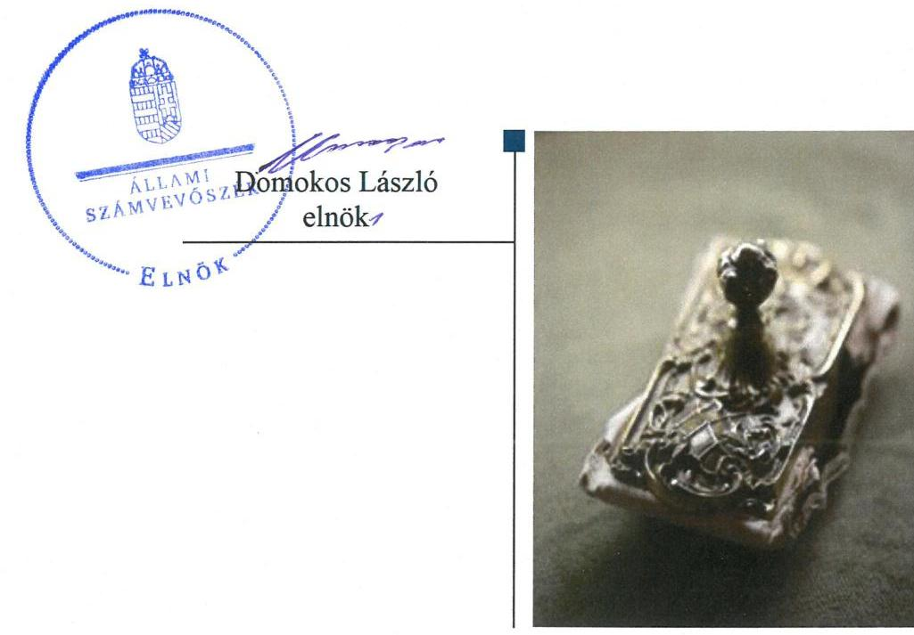

# Jelentés

## Nemzeti tulajdonú gazdasági társaságok ellenőrzése

Józsefvárosi Gazdálkodási Központ Zrt. 2019.

19107 www.asz.hu

---

# Jelentés 

## Nemzeti tulajdonú gazdasági társaságok ellenőrzése

Józsefvárosi Gazdálkodási Központ Zrt.
2019. 07. hó 03. nap

---

# AZ ELLENŐRZÉST FELÜGYELTE:

DR. PULAY GYULA felügyeleti vezető

# AZ ELLENŐRZÉST VEZETTE ÉS A VÉGREHAJTÁSÁÉRT FELELŐS:

JÁNOSI ISTVÁN ellenőrzésvezető

SALAMIN VIKTOR ellenőrzésvezető

A PROGRAM ÖSSZEÁLLÍTÁSÁÉRT FELELŐS:

TÓTPÁL SZABOLCS osztályvezető

IKTATÓSZÁM: EL-1590-001/2019

TÉMASZÁM: 2478

TÉMASZÁM: 2478

Jelentéseink az Országgyűlés számítógépes hálózatán és az Interneten a www.asz.hu címen is olvashatóak.

---

# TARTALOMJEGYZÉK 

■ ÖSSZEGZÉS ..... 5
■ AZ ELLENŐRZÉS CÉLJA ..... 6
■ AZ ELLENŐRZÉS TERÜLETE ..... 7
■ AZ ELLENŐRZÉS HÁTTERE, INDOKOLTSÁGA ..... 8
■ A JELENTÉS LÉNYEGES KÉRDÉSKÖREI ..... 9
■ AZ ELLENŐRZÉS HATÓKÖRE ÉS MÓDSZEREI ..... 10
■ MEGÁLLAPÍTÁSOK ..... 12
■ JAVASLATOK ..... 14
■ MELLÉKLETEK ..... 15
I. sz. melléklet: Értelmező szótár ..... 15
■ FÜGGELÉK: ÉSZREVÉTELEK ..... 17
■ RÖVIDÍTÉSEK JEGYZÉKE ..... 19

---

.

---

# ÖSSZEGZÉS 

A Józsefvárosi Gazdálkodási Központ Zrt. felett tulajdonosi jogokat gyakorló Budapest Főváros VIII. kerület Józsefvárosi Önkormányzat tulajdonosi joggyakorlása szabályszerű volt. A Józsefvárosi Gazdálkodási Központ Zrt. vagyongazdálkodása szabályszerű volt.

## Az ellenőrzés társadalmi indokoltsága

Az Állami Számvevőszék kiemelt célja, hogy a helyi önkormányzatok gazdálkodásában rejlő pénzügyi kockázatok feltárásával, az államháztartáson kívülre nyújtott költségvetési támogatások és ingyenes vagyonjuttatások, valamint az államháztartáson kívül működő feladatellátó rendszerek ellenőrzéseivel hozzájáruljon ahhoz, hogy a közpénzeket az államháztartáson kívül működő szervezetek is átlátható, rendezett módon használják fel.

Magyarországon az önkormányzatok kötelező és önként vállalt feladataik vonatkozásában is egyre szélesebb körben alkalmazzák a költségvetésen kívüli feladatellátást, ezáltal - a nonprofit szervezetek mellett - az önkormányzati tulajdonú gazdasági társaságok is kiemelt fontosságú szerephez jutottak.

## Főbb megállapítások, következtetések, javaslatok

Budapest Főváros VIII. kerület Józsefvárosi Önkormányzat a tulajdonosi jogok gyakorlásának rendjét rendeletében kialakította, a javadalmazással összefüggő szabályzatát elkészítette, tulajdonosi jogait szabályszerűen gyakorolta.

A Józsefvárosi Gazdálkodási Központ Zrt. vagyongazdálkodási tevékenysége szabályszerű volt, 2015-2017. években mérlegét a leltárral alátámasztotta, éves beszámolói megalapozottak voltak.

A Józsefvárosi Gazdálkodási Központ Zrt.-nek a kormányzati szektor hiányára befolyással bíró eleme, adósságot keletkeztető ügylete nem volt, a Társaság a kapcsolódó adatszolgáltatási kötelezettségének nem tett eleget.

Az Állami Számvevőszék a jelentésben foglalt megállapítások alapján a Józsefvárosi Gazdálkodási Központ Zrt.-nek egy javaslatot fogalmazott meg. A javaslatokat megalapozó megállapításokra az érintettnek 30 napon belül intézkedési tervet kell készítenie.

---

# AZ ELLENŐRZÉS CÉLJA 

AZ ELLENŐRZÉS CÉLJA annak megítélése volt, hogy a tulajdonosi joggyakorló a gazdasági társaságai feletti tulajdonosi joggyakorlás kereteit kialakította-e, tulajdonosi jogait megfelelően gyakorolta-e és kötelezettségeit teljesítette-e. A gazdasági társaság biztosította-e a vagyon védelmét a nyilvántartások szabályszerű vezetése és a mérleg tételeinek leltárral történő alátámasztása útján, valamint szabályszerűen gondoskodott-e a társaság használatában, kezelésében lévő nemzeti vagyon értékének megőrzéséről, gyarapításáról, hasznosításáról. Az ellenőrzés célja továbbá annak megítélése, hogy a kormányzati szektorba sorolt nemzeti tulajdonban lévő gazdasági társaság gazdálkodásának a kormányzati szektor hiányára és az államadósságra befolyással bíró elemei a jogszabályi előírásoknak megfeleltek-e és a gazdasági társaság az adatszolgáltatási kötelezettségének eleget tett-e.

---

# AZ ELLENŐRZÉS TERÜLETE

## Budapest Főváros VIII. kerület Józsefvárosi Önkormányzat, Józsefvárosi Gazdálkodási Központ Zrt.

Az Önkormányzat¹ a Társaságot² 2015. április 17-ei döntésével a KISFALU Józsefvárosi Vagyongazdálkodó Kft. általános jogutódjaként 2015. július 1-jével átalakulással hozta létre, amelynek kizárólagos tulajdonosi joggyakorlója. A Társaság egyszemélyes, zártkörűen működő gazdasági társaság, legfőbb szerve a taggyűlés, melynek hatáskörét az Alapító Önkormányzat gyakorolja. A Társaság ügyvezető szerve az öt tagú Igazgatóság, az igazgatóság elnökének személye az ellenőrzött időszakban változott.

A Társaság jegyzett tőkéje 162,0 M Ft készpénzbetétből állt, mely az átalakulást követően az ellenőrzött időszakban nem változott. A Társaság az ingatlanokkal, a lakás- és helyiséggazdálkodással, a piac üzemeltetésével, a közterületi várakozóhelyek üzemeltetésével, karbantartásával kapcsolatos feladatokat a 2015. évben a Józsefvárosi Önkormányzattal kötött megbízási szerződés, 2016. évtől kezdődően Közszolgáltatási keretszerződés és annak keretében az Éves Közszolgáltatási Keretszerződés melléklete alapján végezte. A Társaság feladatai ellátásához nemzeti vagyont vagyonkezelésbe nem vett át, vagyonkezelésbe vett eszközzel az ellenőrzött időszakban nem rendelkezett.

Az ellenőrzött időszakban a polgármester³ és a jegyző⁴ személyében nem történt változás. A Társaság által foglalkoztatottak száma a 2015. év végi 504 főről 2017. év végére 361 főre csökkent.

A Társaság 2017. június 15-én került a kormányzati szektorba sorolt egyéb szervezetek közé.

---

# AZ ELLENŐRZÉS HÁTTERE, INDOKOLTSÁGA 

Az Alaptörvény 38. cikke alapján az állam és a helyi önkormányzatok tulajdona nemzeti vagyon. A nemzeti vagyon megőrzése, megóvása érdekében kiemelten fontos ezen nemzeti tulajdonú gazdasági társaságok ellenőrzése. Gazdálkodásuk jellemzően a közérdeklődés és a média figyelmének középpontjában áll, amihez hozzájárul a gazdálkodásuk körébe tartozó - a nemzeti vagyon részét képező - vagyon nagysága, illetve az általuk ellátott közszolgáltatások minősége és hatékonysága. Ellenőrzéseink feltárhatják, hogy a tulajdonosi felügyelet hozzájárult-e a szabályszerű gazdálkodáshoz és feladatellátáshoz.

Az ellenőrzés eredményeként meghatározhatóvá válnak a szervezet vagyongazdálkodást érintő kockázatai, ezzel lehetővé téve a kockázatok csökkentését. A megállapítások alapján megfogalmazott számvevőszéki javaslatok hasznosítása elősegítheti a meglévő hibák megszüntetését. A jó gyakorlatok bemutatásával az ÁSZ hozzájárulhat a követendő megoldások megismertetéséhez, terjesztéséhez.

---

# A JELENTÉS LÉNYEGES KÉRDÉSKÖREI 

1. A Társaság feletti tulajdonosi joggyakorlás megfelelt-e a jogszabályi és belső előírásoknak?
2. A Társaság vagyongazdálkodási tevékenysége szabályszerű volt-e?
3. A Társaság gazdálkodásának a kormányzati szektor hiányára és az államadósságra befolyással bíró elemei megfeleltek-e a jogszabályi előírásoknak, az adatszolgáltatási kötelezettségének eleget tett-e?

---

# AZ ELLENŐRZÉS HATÓKÖRE ÉS MÓDSZEREI 

## Az ellenőrzés típusa

Megfelelőségi ellenőrzés.

## Az ellenőrzött időszak

A tulajdonosi joggyakorlás vonatkozásában az ellenőrzött időszak 2017. január 1-től az ellenőrzés megkezdésének napjáig terjedt ki az éves beszámolók elfogadása és a vagyonkezelésbe adott vagyonnal való gazdálkodás tulajdonosi ellenőrzése kivételével, amelyeknél az ellenőrzött időszak 2015. január 1-től az ellenőrzés megkezdésének napjáig - 2018. szeptember 28-ig - tartott.

A Társaság vagyongazdálkodása vonatkozásában az ellenőrzött időszak 2015-2017. évek, a 2017. évi beszámoló jóváhagyása tekintetében 2018. június elsejéig tartó időszak.

A társaság gazdálkodásának a kormányzati szektor hiányára és az államadósságra befolyással bíró elemei tekintetében az ellenőrzött időszak 2017. június 15-től 2017. december 31-ig, a 2017. évi beszámoló jóváhagyása és közzététele tekintetében a 2018. június elsejéig tartó időszak.

## Az ellenőrzés tárgya

Az önkormányzati tulajdonban lévő gazdasági társaság feletti tulajdonosi joggyakorlás kialakítása és működtetése.

Önkormányzati tulajdonban lévő gazdasági társaság vagyongazdálkodása keretében a társaság használatában, kezelésében lévő nemzeti vagyon, illetve a saját vagyon tekintetében a vagyonnyilvántartások vezetése, leltára. A társaság használatában, vagyonkezelésében lévő nemzeti vagyon tekintetében a vagyon értékének megőrzése, gyarapítása, hasznosítása.

A gazdasági társaság gazdálkodásának a kormányzati szektor hiányára és az államadósságra befolyással bíró elemei és a jogszabályi előírásoknak megfelelő adatszolgáltatási kötelezettség teljesítése.

## Az ellenőrzött szervezet

Budapest Főváros VIII. kerület Józsefvárosi Önkormányzat, valamint a Józsefvárosi Gazdálkodási Központ Zrt.

---

# Az ellenőrzés jogalapja 

Az ellenőrzés jogalapját az ÁSZ tv. ${ }^{5} 1$. § (3) bekezdése és 5. § (3)-(5) bekezdései képezték.

## Az ellenőrzés módszerei

Az ellenőrzést az ellenőrzési program ellenőrzési kérdései, az ellenőrzött időszakban hatályos jogszabályok, az ellenőrzés szakmai szabályok és módszertanok alapján, a nemzetközi standardok figyelembe vételével végeztük.

Az ellenőrzés ideje alatt az ellenőrzött szervezettel történő kapcsolattartást az ÁSZ Szervezeti és Működési Szabályzatának vonatkozó előírásai alapján biztosítottuk.
2017. január 1-től az ellenőrzés megkezdésének napjáig ellenőriztük a tulajdonosi joggyakorlás kereteinek kialakítását, a tulajdonosi joggyakorló tevékenységét a felügyelő bizottság és a független könyvvizsgáló működéséhez kapcsolódóan, valamint azt, hogy a tulajdonosi joggyakorló - amennyiben a gazdasági társaság feladatellátásához és vagyonkezeléséhez kapcsolódóan határozott meg követelményeket, elvárásokat - a nemzeti vagyon értékének megőrzése érdekében monitorozta-e azok teljesülését. 2015. január 1-től az ellenőrzés megkezdésének napjáig ellenőriztük a tulajdonosi joggyakorló részvételét az éves beszámoló elfogadására vonatkozó döntéshozatalban.

Az ellenőrzési kérdések megválaszolásához szükséges bizonyítékok megszerzése a Társaság vagyongazdálkodása vonatkozásában a következő ellenőrzési eljárások alkalmazásával történt: megfigyelés, információkérés, összehasonlítás, elemző eljárás. Az ellenőrzési bizonyítékként felhasználható adatforrások közé tartoznak az ellenőrzési programban felsorolt adatforrások, továbbá minden - az ellenőrzés folyamán - feltárt, az ellenőrzés szempontjából információkat tartalmazó dokumentum.

Az ellenőrzést a kérdésekre adott válaszok kiértékelésével, valamint a megjelölt adatforrások, a csatolt tanúsítványok felhasználásával, továbbá az adott időszakban hatályos jogszabályok figyelembe vételével folytattuk le.

A vagyonnyilvántartások szabályszerűsége esetében az ellenőrzés azokra a legnagyobb értékű tételekre - a lényeges sokaságra - terjedt ki, melyek összértéke eléri a teljes sokaság összértékének 50%-át. A lényeges sokaságot tételesen ellenőriztük. A 2015-2017. évekre történt meg a lényeges dokumentumok, ennek keretében a leltározáshoz kapcsolódó dokumentumok, valamint a mérleg tételeit alátámasztó leltár értékelése.

Az ellenőrzés során az ellenőrzött kormányzati szektorba sorolt gazdasági társaság gazdálkodásának az államadósságra továbbá a kormányzati szektor hiányára befolyással bíró gazdasági eseményei elszámolásának megfelelősége 2015. és 2017. évek tekintetében került ellenőrzésre. Míg a kormányzati szektorba sorolt gazdasági társaságok adatszolgáltatási kötelezettségére vonatkozó jogszabályi előírások betartását a teljes ellenőrzött időszakra vonatkozóan értékeltük.

---

# MEGÁLLAPÍTÁSOK 

## 1. A Társaság feletti tulajdonosi joggyakorlás megfelelt-e a jogszabályi és belső előírásoknak?

Összegző megállapítás Az Önkormányzat tulajdonosi joggyakorlása szabályszerű volt.
1.1. számú megállapítás Az Önkormányzat a tulajdonosi joggyakorlás kereteit a jogszabályi előírások szerint alakította ki.

A TULAJDONOSI JOGOK GYAKORLÁSÁNAK
RENDJÉT az Önkormányzat a vagyongazdálkodási rendelet ${ }^{6}$-ben és SZMSZ ${ }^{7}$-ben, valamint a Társaság Alapszabály ${ }^{8}$-ában kialakította. A Társaság tevékenységével kapcsolatos elvárásokat és követelményeket Közszolgáltatási Keretszerződés ${ }^{9}$ határozta meg.

A tulajdonosi joggyakorló Önkormányzat a Taktv. ${ }^{10}$ 5. § (3) bekezdésének előírása szerint megalkotta a vezető tisztségviselők, a felügyelőbizottsági tagok, az Mt. ${ }^{11}$ 208. §-ának hatálya alá eső munkavállalók javadalmazásáról, valamint a jogviszony megszűnése esetére biztosított juttatások módjának, mértékének elveiről, annak rendszeréről szóló szabályzatot.
1.2. számú megállapítás

A Társaság feletti tulajdonosi joggyakorlás szabályszerű volt.
A SZÁMVITELI BESZÁMOLÓ ELFOGADÁSÁRA, az
eredmény felosztására vonatkozó döntéshozatalban a tulajdonosi joggyakorló Önkormányzat a jogszabályi előírásoknak megfelelően részt vett. A döntéshez a Felügyelő bizottság és a Könyvvizsgáló jelentése rendelkezésre állt.

A FELÜGYELŐ BIZOTTSÁG és a könyvvizsgáló tevékenységéhez kapcsolódóan a tulajdonosi joggyakorlás szabályszerű volt. A Felügyelő bizottság létrehozása megfelelt a Ptk. ${ }^{12}$ és a Taktv. előírásainak, működése szabályszerű volt, ügyrenddel rendelkezett. A Társaság rendelkezett könyvvizsgálóval a Ptk. és a Számv. tv. ${ }^{13}$ előírásai szerint.

## 2. A Társaság vagyongazdálkodási tevékenysége szabályszerű volt-e?

Összegző megállapítás A Társaság vagyongazdálkodási tevékenysége szabályszerű volt.

LELTÁRKÉSZÍTÉSI ÉS LELTÁROZÁSI SZABÁLYZATTAL a Társaság rendelkezett az ellenőrzött időszakban a Számv. tv előírásainak megfelelően.

---

A TÁRSASÁG 2015-2017. ÉVI BESZÁMOLÓINAK összeállítása szabályszerű volt. A mérleg tételeinek alátámasztásához a Társaság a Számv. tv.-ben előírt leltárt összeállította.

A Társaság vagyonhoz kapcsolódó nyilvántartásait a Számv. tv. és a Leltárkészítési és leltározási szabályzatban foglaltak szerint vezette.

# 3. A Társaság gazdálkodásának a kormányzati szektor hiányára és az államadósságra befolyással bíró elemei megfeleltek-e a jogszabályi előírásoknak, az adatszolgáltatási kötelezettségének eleget tett-e? 

Összegző megállapítás

A Társaság nem tartotta be az adatszolgáltatási kötelezettségére vonatkozó jogszabályi előírásokat.

A TÁRSASÁGNAK a kormányzati szektor hiányára befolyással bíró eleme, az államadósságra befolyással bíró gazdasági eseménye, adósságot keletkeztető ügylete az
 ellenőrzött időszakban nem volt.

A Társaság a 2017. évi beszámolóját nem küldte meg az államháztartásért felelős miniszter részére, adatszolgáltatási kötelezettségének nem tett eleget, ezzel megsértette az Áht. ${ }^{14}$ 107. § (1) bekezdését, az Ávr. ${ }^{15}$ 167/M. § (1) bekezdését, valamint 5. mellékletének 23. pontját.

---

# JAVASLATOK 

Az ÁSZ tv. 33. § (1) bekezdésében foglaltak értelmében az ellenőrzött szervezet vezetője köteles a jelentésben foglalt megállapításokhoz kapcsolódó intézkedési tervet összeállítani és azt a jelentés kézhezvételétől számított 30 napon belül az ÁSZ részére megküldeni. Amennyiben az intézkedési tervet határidőre nem küldi meg a szervezet, vagy amennyiben az nem elfogadható, az ÁSZ elnöke az ÁSZ tv. 33. § (3) bekezdés a)-b) pontjaiban foglaltakat érvényesítheti.

## Józsefvárosi Gazdálkodási Központ Zrt. az Igazgatósági Elnöknek

1. Intézkedjen az Áht. kormányzati szektorba sorolt társaságokra vonatkozó előírásainak megfelelő adatszolgáltatás teljesítéséről.
(3. sz. megállapítás 2. bekezdés alapján)

---

# MELLÉKLETEK 

- I. SZ. MELLÉKLET: ÉRTELMEZŐ SZÓTÁR
gazdasági társaság
koncessziós szerződés
közszolgáltatás
közfeladat
nemzeti vagyon
nemzeti vagyon használója
tulajdonosi jogok gyakorlója
vagyonkezelő

Ptk. 3:88. § (1) bekezdése szerint „a gazdasági társaságok üzletszerű közös gazdasági tevékenység folytatására, a tagok vagyoni hozzájárulásával létrehozott, jogi személyiséggel rendelkező vállalkozások, amelyekben a tagok a nyereségből közösen részesednek, és a veszteséget közösen viselik".
Az 1991. évi XVI. tv. alapján a kizárólagos állami, önkormányzati vagy önkormányzati társulási tulajdon hatékony működtetésének, valamint a kizárólagosan az állam vagy az önkormányzat hatáskörébe utalt tevékenységek gyakorlásának egyik lehetséges útja mindezek koncessziós szerződés alapján való átengedése.
Az Ebktv. ${ }^{16}$ 3. § d) pontja a következőképpen határozza meg a közszolgáltatást: „szerződéskötési kötelezettség alapján a lakosság alapvető szükségleteinek ellátására irányuló szolgáltatás, így különösen a villamos energia-, gáz-, hő-, víz-, szennyvíz- és hulladékkezelési, köztisztasági, postai és távközlési szolgáltatás, továbbá a menetrend alapján közlekedő járművekkel végzett közforgalmú személyszállítás".
Az Áht. 3/A. § (1) bekezdése alapján közfeladat a jogszabályban meghatározott állami vagy önkormányzati feladat.
Nvtv. 1. § (2) bekezdése szerint nemzeti vagyonba tartozik többek között:
„az állam vagy a helyi önkormányzat kizárólagos tulajdonában álló dolgok,
az a) pont hatálya alá nem tartozó, állam vagy a helyi önkormányzat tulajdonában lévő dolog,
az állam vagy a helyi önkormányzat tulajdonában lévő pénzügyi eszközök, továbbá az államot vagy a helyi önkormányzatot megillető társasági részesedések,
az államot vagy a helyi önkormányzatot megillető bármely vagyoni értékkel rendelkező jogosultság, amelyet jogszabály vagyoni értékű jogként nevesít."
A tulajdonosi joggyakorló vagy a nemzeti vagyon használója által a nemzeti vagyon birtoklásának, használatának, hasznok szedése jogának bármely - a tulajdonjog átruházását nem eredményező - jogcímen történő átengedése, ide nem értve a vagyonkezelésbe adást, valamint a haszonélvezeti jog alapítását.
Forrás: Nvtv. 3. § (1) bekezdés 4. pont
Azon természetes személy, jogi személy vagy jogi személyiséggel nem rendelkező szervezet, aki vagy amely állami vagyon tekintetében törvény vagy szerződés alapján, a helyi önkormányzat vagyona tekintetében törvény, a helyi önkormányzat rendelete vagy szerződés alapján bármely jogcímen nemzeti vagyont birtokol, használ, szedi annak hasznait, kivéve a tulajdonosi joggyakorlót.
Forrás: Nvtv. 3. § (1) bekezdés 11. pont
Aki a nemzeti vagyon felett az államot vagy a helyi önkormányzatot megillető tulajdonosi jogok és kötelezettségek összességének gyakorlására jogosult. (Forrás: Nvtv. 3. § (1) bekezdés 17. pontja)
az állam tulajdonában álló nemzeti vagyon tekintetében:
aa) költségvetési szerv,
ab) helyi önkormányzat, nemzetiségi önkormányzat, valamint ezek társulásai,
ac) az ab) alpontban felsoroltak fenntartása vagy irányítása alá tartozó intézmény,
ad) köztestület,
ae) az állam, az aa)-ac) alpontban meghatározott személyek együtt vagy külön-külön 100\%-os tulajdonában álló gazdálkodó szervezet,
af) az ae) alpont szerinti gazdálkodó szervezet 100\%-os tulajdonában álló gazdálkodó szervezet,
ag) a törvény által kijelölt egyedileg meghatározott jogi személy.
b) a helyi önkormányzat tulajdonában álló nemzeti vagyon tekintetében:

---

ba) nemzetiségi önkormányzat, helyi vagy nemzetiségi önkormányzati társulás, valamint ezek fenntartása vagy irányítása alá tartozó intézmény,
bb) költségvetési szerv,
bc) köztestület,
bd) az állam, a helyi önkormányzat, a ba) alpontban meghatározott személyek együtt vagy külön-külön 100\%-os tulajdonában álló gazdálkodó szervezet,
be) a bd) alpont szerinti gazdálkodó szervezet 100\%-os tulajdonában álló gazdálkodó szervezet.
Forrás: Nvtv. 3. § (1) bekezdés 19. pont
vagyongazdálkodás
A nemzeti vagyongazdálkodás feladata a nemzeti vagyon rendeltetésének megfelelő, az állam, az önkormányzat mindenkori teherbíró képességéhez igazodó, elsődlegesen a közfeladatok ellátásához és a mindenkori társadalmi szükségletek kielégítéséhez szükséges, egységes elveken alapuló, átlátható, hatékony és költségtakarékos működtetése, értékének megőrzése, állagának védelme, értéknövelő használata, hasznosítása, gyarapítása, továbbá az állam vagy a helyi önkormányzat feladatának ellátása szempontjából feleslegessé váló vagyontárgyak elidegenítése. (Forrás: Nvtv. 7. § (2) bekezdése).

---

# FÜGGELÉK: ÉSZREVÉTELEK 

A jelentéstervezetet a Számvevőszék 15 napos észrevételezésre megküldte az ellenőrzött szervezet vezetőjének az ÁSZ tv. 29. § (1) bekezdése előírásának megfelelően.

A jelentéstervezetre a Józsefvárosi Gazdálkodási Központ Zrt. igazgatósági elnöke az ÁSZ törvény 29.§ (2) bekezdésében foglalt határidőn belül nemleges észrevételt tett.

[^0]
[^0]:    * 29. § (1) Az Állami Számvevőszék az ellenőrzési megállapításait megküldi az ellenőrzött szervezet vezetőjének vagy az általa megbízott személynek, és annak, akinek személyes felelősségét állapította meg.
    (2) Az ellenőrzött szervezet vezetője és a felelősként megjelölt személy az ellenőrzés megállapításaira tizenöt napon belül írásban észrevételt tehet.
    (3) Az Állami Számvevőszék az észrevételre a beérkezésétől számított harminc napon belül írásban válaszol. A figyelembe nem vett észrevételeket köteles a jelentésben feltüntetni, és megindokolni, hogy azokat miért nem fogadta el.

---

.

---

# RÖVIDÍTÉSEK JEGYZÉKE 

${ }^{1}$ Önkormányzat
${ }^{2}$ Társaság
${ }^{3}$ Polgármester
${ }^{4}$ Jegyző
${ }^{5}$ ÁSZ tv.
${ }^{6}$ vagyongazdálkodási rendelet
${ }^{7}$ önkormányzati SZMSZ
${ }^{8}$ Alapszabály
${ }^{9}$ Közszolgáltatási Keretszerződés
${ }^{10}$ Taktv.
${ }^{11}$ Mt.
${ }^{12}$ Ptk.
${ }^{13}$ Számv. tv.
${ }^{14}$ Áht.
${ }^{15}$ Ávr.
${ }^{16}$ Ebktv.

Budapest Főváros VIII. kerület Józsefvárosi Önkormányzat
Józsefvárosi Gazdálkodási Központ Zrt.
Budapest Főváros VIII. kerület Józsefvárosi Önkormányzat Polgármestere
Budapest Főváros VIII. kerület Józsefvárosi Önkormányzat Jegyzője
az Állami Számvevőszékről szóló 2011. évi LXVI. törvény
Budapest Főváros VIII. Kerület Józsefvárosi Önkormányzat Képviselőtestületének 66/2012. (XII.13.) önkormányzati rendelete a Budapest Józsefvárosi Önkormányzat vagyonáról és a vagyon feletti tulajdonosi jogok gyakorlásáról
Budapest Főváros VIII. Kerület Józsefváros Önkormányzata Képviselőtestület 36/2014. (XI.06.) önkormányzati rendelete a Képviselő-testület és szervei Szervezeti és Működési Szabályzatáról
Józsefvárosi Gazdálkodási Központ Zártkörűen Működő Részvénytársaság Alapszabálya
Budapest Főváros VIII. kerület Józsefvárosi Önkormányzat és a KISFALU Józsefvárosi Vagyongazdálkodó Kft. (általános jogutód: Józsefvárosi Gazdálkodási Központ Zrt.) között 2015. június 15-én kötött Közszolgáltatási Keretszerződés
2009. évi CXXII. törvény a köztulajdonban álló gazdasági társaságok takarékosabb működéséről (hatályos: 2009. december 4-től)
2012. évi I. törvény a munka törvénykönyvéről (hatályos: 2012. július 1-jétől)
2013. évi V. törvény a Polgári Törvénykönyvről (hatályos: 2014. március 15-étől)
2000. évi C. törvény a számvitelről (hatályos: 2001. január 1-jétől)
2011. évi CXCV. törvény az államháztartásról (hatályos: 2011. december 31-től)

368/2011. (XII. 31.) Korm. rendelet az államháztartásról szóló törvény végrehajtásáról (hatályos: 2012. január 1-jétől)
egyenlő bánásmódról és az esélyegyenlőség előmozdításáról szóló 2003. évi CXXV. törvény

---

ÁLLAMI SZÁMVEVŐSZÉK
1052 Budapest, Apáczai Csere János utca 10.
Levélcím: 1364 Budapest 4. Pf. 54
Telefon: +36 14849100 Telefax: +36 14849200
www.asz.hu
