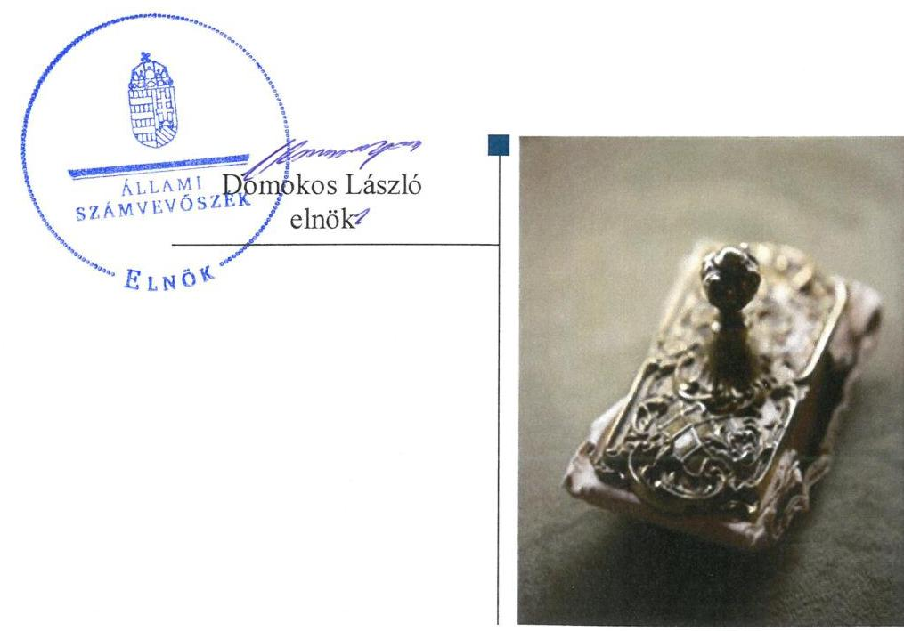
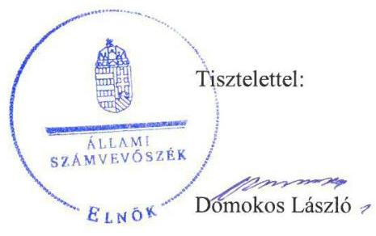
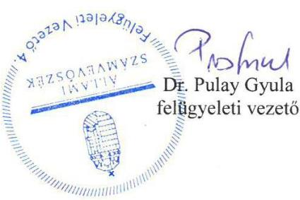

# Jelenetés 

## Nemzeti tulajdonú gazdasági társaságok ellenőrzése

EVIN Erzsébetvárosi
Ingatlangazdálkodási Nonprofit Zrt.
2019.

---

# J elentés 

## Nemzeti tulajdonú gazdasági társaságok ellenőrzése

EVIN Erzsébetvárosi
Ingatlangazdálkodási N onprofit Zrt.
2019. C7. hó 03. nap

---

# AZ ELLENŐRZÉST FELÜGYELTE:

DR. PULAY GYULA felügyeleti vezető

# AZ ELLENŐRZÉST VEZETTE ÉS A VÉGREHAJTÁSÁÉRT FELELŐS:

VALASTYÁNNÉ DR. VÍZHÁNYÓ JÚLIA ellenőrzésvezető

SALAMIN VIKTOR ellenőrzésvezető

A PROGRAM ÖSSZEÁLLÍTÁSÁÉRT FELELŐS:

TÓTPÁL SZABOLCS osztályvezető

IKTATÓSZÁM: EL-1591-001/2019.

|  Jelentéseink az Országgyűlés számítógépes hálózatán és az Interneten a www.asz.hu címen is olvashatóak. | TÉMASZÁM: 2478  |
| --- | --- |
|   | ELLENŐRZÉS-AZONOSÍTÓ SZÁM: V082210  |

---

# TARTALOMJEGYZÉK 

■ ÖSSZEGZÉS ..... 5
■ AZ ELLENŐRZÉS CÉLJA ..... 6
■ AZ ELLENŐRZÉS TERÜLETE ..... 7
■ AZ ELLENŐRZÉS HÁTTERE, INDOKOLTSÁGA ..... 8
■ A JELENTÉS LÉNYEGES KÉRDÉSKÖREI ..... 9
■ AZ ELLENŐRZÉS HATÓKÖRE ÉS MÓDSZEREI ..... 10
■ MEGÁLLAPÍTÁSOK ..... 12
■ JAVASLATOK ..... 14
■ MELLÉKLETEK ..... 15
I. sz. melléklet: Értelmező szótár ..... 15
■ FÜGGELÉKEK ..... 17
I. sz. függelék a jelentéshez ..... 17
II. sz. függelék: Észrevételek ..... 18
■ RÖVIDÍTÉSEK JEGYZÉKE ..... 25

---

.

---

# ÖSSZEGZÉS 

Az EVIN Erzsébetvárosi Ingatlangazdálkodási Nonprofit Zrt. vagyongazdálkodása nem volt szabályszerű, számviteli beszámolóit 2015-2017. években nem támasztotta alá leltárral, beszámolója nem volt megalapozott, ezért müködésének átláthatósága és elszámoltathatósága nem volt biztosított.

## Az ellenőrzés társadalmi indokoltsága

Az Állami Számvevőszék kiemelt célja, hogy a helyi önkormányzatok gazdálkodásában rejlő pénzügyi kockázatok feltárásával, az államháztartáson kívülre nyújtott költségvetési támogatások és ingyenes vagyonjuttatások, valamint az államháztartáson kívül múködő feladat-ellátó rendszerek ellenőrzéseivel hozzájáruljon ahhoz, hogy a közpénzeket az államháztartáson kívül múködő szervezetek is átlátható, rendezett módon használják fel.

Magyarországon az önkormányzatok kötelező és önként vállalt feladataik vonatkozásában is egyre szélesebb körben alkalmazzák a költségvetésen kívüli feladatellátást, ezáltal - a nonprofit szervezetek mellett - az önkormányzati tulajdonú gazdasági társaságok is kiemelt fontosságú szerephez jutottak.

## Főbb megállapítások, következtetések, javaslatok

Budapest VII. Kerület Erzsébetváros Önkormányzata tulajdonosi jogok gyakorlásának rendjét rendeletében kialakította, a javadalmazással összefüggő szabályzatát elkészítette, tulajdonosi jogait szabályszerűen gyakorolta.

Az EVIN Erzsébetvárosi Ingatlangazdálkodási Nonprofit Zrt. vagyongazdálkodási tevékenysége nem volt szabályszerű, 2015-2017. években mérlege alátámasztásához nem készített a jogszabályi előírásoknak megfelelő leltárt, ezért az éves beszámolói nem voltak megalapozottak. Számlarenddel a jogszabály előírása ellenére nem rendelkezett.

Az Állami Számvevőszék a jelentésben foglalt megállapítások alapján az EVIN Erzsébetvárosi Ingatlangazdálkodási Nonprofit Zrt. vezérigazgatójának 2 javaslatot fogalmazott meg. A javaslatokat megalapozó megállapításokra az érintettnek 30 napon belül intézkedési tervet kell készítenie.

---

# AZ ELLENŐRZÉS CÉLJA 

AZ ELLENŐRZÉS CÉLJA annak megítélése volt, hogy a tulajdonosi joggyakorló a gazdasági társaságai feletti tulajdonosi joggyakorlás kereteit kialakította-e, tulajdonosi jogait megfelelően gyakorolta-e és kötelezettségeit teljesítette-e. A gazdasági társaság biztosította-e a vagyon védelmét a nyilvántartások szabályszerű vezetése és a mérleg tételeinek leltárral történő alátámasztása útján, valamint szabályszerűen gondoskodott-e a társaság használatában, kezelésében lévő nemzeti vagyon értékének megőrzéséről, gyarapításáról, hasznosításáról.

---

# **A2 ELLENŐRZÉS TERÜLETE**

## **Budapest VII. Kerület Erzsébetváros Önkormányzata, EVIN Erzsébetvárosi Ingatlangazdálkodási Nonprofit Zrt.**

Az Önkormányzat¹ a Társaságot² 1996. október 17-én alapította, jegyzett tőkéje 20 M Ft. A társaság az Önkormányzat kizárólagos tulajdonában volt.

A Társaság tulajdonosa 2013. január 24. és 2016. január 29. között az EVIKVÁR Kft. volt. A Képviselőtestület határozata alapján a Társaság részvényeit névértéken, részvény átruházási szerződés útján szerezte meg, az EVIKVÁR Kft. jogutód nélküli végelszámolásával.

A Társaság cégneve 2017. május 8-ig ERVA Erzsébetvárosi Önkormányzati Vagyonkezelő Nonprofit Zártkörűen Működő Részvénytársaság volt, amely a Képviselő testület 2017. évi határozata alapján változott Erzsébetvárosi Ingatlangazdálkodási Nonprofit Zártkörűen Működő Részvénytársaságra, majd 2017. november 6-tól EVIN Erzsébetvárosi Ingatlangazdálkodási Nonprofit Zártkörűen Működő Részvénytársaságra.

A Társasággal az Önkormányzat Megbízási szerződést kötött, mely alapján a Társaság feladatkörébe tartozott az Önkormányzat tulajdonát képező lakások, nem lakás céljára szolgáló helyiségek, egyéb ingatlanok elidegenítésével, hasznosításával kapcsolatos tulajdonosi kötelezettségek teljesítése. Ezen túl a Társaság feladata volt a hulladékgazdálkodás, az állami köznevelési intézmények tanórán kívüli üzemeltetése, a piacok üzemeltetése, bérbeadása, az önkormányzati tulajdonú ingatlanok felújítása, beruházás, bontás lebonyolításával, üzemeltetésével, hasznosításával, az Önkormányzatot terhelő hatósági kötelezettségek teljesítésével és az ingatlanok nyilvántartásával kapcsolatos feladatok ellátása. Az Önkormányzat 2017-ben az önkormányzati tulajdonú társaságok tevékenységeinek átszervezéséről, ésszerűsítéséről döntött, mellyel kapcsolatosan a Társaság tevékenységének egy része átadásra került. Ilyen tevékenységek a hulladékkezelés, a társasházkezelés és piacüzemeltetési feladatok ellátása. A Társaság 2017. szeptember 1-jétől tevékenységét az Önkormányzattal kötött feladatellátási szerződés alapján végzi.

Az ellenőrzött időszakban a polgármester³ és a jegyző⁴ személyében nem történt változás, a Társaság vezérigazgatójának személye 2017 áprilisában változott. A Társaság az ellenőrzött időszakban nem rendelkezett vagyonkezelésbe vett vagyonnal, továbbá nem tartozott kormányzati szektorba sorolt gazdasági társaságok közé.

---

# AZ ELLENŐRZÉS HÁTTERE, INDOKOLTSÁGA 

Az Alaptörvény 38. cikke alapján az állam és a helyi önkormányzatok tulajdona nemzeti vagyon. A nemzeti vagyon megőrzése, megóvása érdekében kiemelten fontos ezen nemzeti tulajdonú gazdasági társaságok ellenőrzése. Gazdálkodásuk jellemzően a közérdeklődés és a média figyelmének középpontjában áll, amihez hozzájárul a gazdálkodásuk körébe tartozó - a nemzeti vagyon részét képező - vagyon nagysága, illetve az általuk ellátott közszolgáltatások minősége és hatékonysága. Ellenőrzéseink feltárhatják, hogy a tulajdonosi felügyelet hozzájárult-e a szabályszerű gazdálkodáshoz és feladatellátáshoz.

Az ellenőrzés eredményeként meghatározhatóvá válnak a szervezet vagyongazdálkodást érintő kockázatai, ezzel lehetővé téve a kockázatok csökkentését. A megállapítások alapján megfogalmazott számvevőszéki javaslatok hasznosítása elősegítheti a meglévő hibák megszüntetését. A jó gyakorlatok bemutatásával az ÁSZ hozzájárulhat a követendő megoldások megismertetéséhez, terjesztéséhez.

---

# A JELENTÉS LÉNYEGES KÉRDÉSKÖREI 

1. A Társaság feletti tulajdonosi joggyakorlás megfelelt-e a jogszabályi és belső előírásoknak?
2. A Társaság vagyongazdálkodási tevékenysége szabályszerü volt-e?

---

# AZ ELLENŐRZÉS HATÓKÖRE ÉS MÓDSZEREI 

## Az ellenőrzés típusa

Megfelelőségi ellenőrzés.

## Az ellenőrzött időszak

A tulajdonosi joggyakorlás vonatkozásában az ellenőrzött időszak 2017. január 1-től az ellenőrzés megkezdésének napjáig terjedt ki az éves beszámolók elfogadása és a vagyonkezelésbe adott vagyonnal való gazdálkodás tulajdonosi ellenőrzése kivételével, amelyeknél az ellenőrzött időszak 2015. január 1-től az ellenőrzés megkezdésének napjáig - 2018. szeptember 28-ig - tartott.

A Társaság vagyongazdálkodása vonatkozásában az ellenőrzött időszak 2015-2017. évek, a 2017. évi beszámoló jóváhagyása tekintetében 2018. június elsejéig tartó időszak.

## Az ellenőrzés tárgya

Az önkormányzati tulajdonban lévő gazdasági társaság feletti tulajdonosi joggyakorlás kialakítása és múködtetése.

Önkormányzati tulajdonban lévő gazdasági társaság vagyongazdálkodása keretében a társaság használatában, kezelésében lévő nemzeti vagyon, illetve a saját vagyon tekintetében a vagyonnyilvántartások vezetése, leltára. A társaság használatában, vagyonkezelésében lévő nemzeti vagyon tekintetében a vagyon értékének megőrzése, gyarapítása, hasznosítása.

## Az ellenőrzött szervezet

Budapest VII. Kerület Erzsébetváros Önkormányzata, valamint az EVIN Erzsébetvárosi Ingatlangazdálkodási Nonprofit Zrt.

## Az ellenőrzés jogalapja

Az ellenőrzés jogalapját az ÁSZ tv. ${ }^{5} 1 . \S$ (3) bekezdése és 5. § (3)-(5) bekezdései képezték.

---

# Az ellenőrzés módszerei 

Az ellenőrzést az ellenőrzési program ellenőrzési kérdései, az ellenőrzött időszakban hatályos jogszabályok, az ellenőrzés szakmai szabályok és módszertanok alapján, a nemzetközi standardok figyelembe vételével végeztük.

Az ellenőrzés ideje alatt az ellenőrzött szervezettel történő kapcsolattartást az ÁSZ Szervezeti és Múködési Szabályzatának vonatkozó előírásai alapján biztosítottuk.
2017. január 1-től az ellenőrzés megkezdésének napjáig ellenőriztük a tulajdonosi joggyakorlás kereteinek kialakítását, valamint a tulajdonosi joggyakorló tevékenységét a felügyelő bizottság és a független könyvvizsgáló múködéséhez kapcsolódóan. 2015. január 1-től az ellenőrzés megkezdésének napjáig ellenőriztük a tulajdonosi joggyakorló részvételét az éves beszámoló elfogadására vonatkozó döntéshozatalban, valamint amennyiben adott a társaságainak vagyonkezelésbe nemzeti vagyont, akkor azt, hogy az azzal történő gazdálkodást a tulajdonosi joggyakorló ellenőrizte-e.

Az ellenőrzési kérdések megválaszolásához szükséges bizonyítékok megszerzése a Társaság vagyongazdálkodása vonatkozásában a következő ellenőrzési eljárások alkalmazásával történt: megfigyelés, információkérés, összehasonlítás, elemző eljárás. Az ellenőrzési bizonyítékként felhasználható adatforrások közé tartoznak az ellenőrzési programban felsorolt adatforrások, továbbá minden - az ellenőrzés folyamán - feltárt, az ellenőrzés szempontjából információkat tartalmazó dokumentum.

Az ellenőrzést a kérdésekre adott válaszok kiértékelésével, valamint a megjelölt adatforrások, a csatolt tanúsítványok felhasználásával, továbbá az adott időszakban hatályos jogszabályok figyelembe vételével folytattuk le.

A vagyonnyilvántartások szabályszerűsége esetében az ellenőrzés azokra a legnagyobb értékű tételekre - a lényeges sokaságra - terjedt ki, melyek összértéke eléri a teljes sokaság összértékének 50\%-át. A lényeges sokaságot tételesen ellenőriztük. A 2015-2017. évekre történt meg a lényeges dokumentumok, ennek keretében a leltározáshoz kapcsolódó dokumentumok, valamint a mérleg tételeit alátámasztó leltár értékelése.

---

# 1. A Társaság feletti tulajdonosi joggyakorlás megfelelt-e a jogszabályi és belső előírásoknak? 

Összegző megállapítás Az Önkormányzat tulajdonosi joggyakorlása szabályszerű volt.
1.1. számú megállapítás Az Önkormányzat a tulajdonosi joggyakorlás kereteit a jogszabályi előírások szerint alakította ki.

A TULAJDONOSI JOGOK GYAKORLÁSÁNAK
RENDJÉT az Önkormányzat a Vagyongazdálkodási rendelet ${ }_{1-4}{ }^{6}$-ben, az önkormányzati SZMSZ7-ben, valamint a Társasági Alapszabályban a jogszabályi előírásokkal összhangban kialakította.

A tulajdonosi joggyakorló a Taktv. ${ }^{8}$ 5. § (3) bekezdésének előírása szerint megalkotta a vezető tisztségviselők, a felügyelőbizottsági tagok, az Mt. ${ }^{9}$ 208. §-ának hatálya alá eső munkavállalók javadalmazásáról, valamint a jogviszony megszűnése esetére biztosított juttatások módjának, mértékének elveiről, annak rendszeréről szóló szabályzatot.
1.2. számú megállapítás

A Társaság feletti tulajdonosi joggyakorlás szabályszerű volt.
A SZÁMVITELI BESZÁMOLÓ ELFOGADÁSÁRA, az
eredmény felosztására vonatkozó döntéshozatalban a tulajdonosi joggyakorló a jogszabályi előírásoknak megfelelően részt vett. A döntéshez a Felügyelő bizottság és a Könyvvizsgáló jelentése rendelkezésre állt.

A FELÜGYELŐ BIZOTTSÁG és a könyvvizsgáló tevékenységéhez kapcsolódóan a tulajdonosi joggyakorlás szabályszerű volt. A Felügyelő bizottság létrehozása megfelelt a Ptk. ${ }^{10}$ és a Taktv. előírásainak, müködése szabályszerű volt, ügyrenddel rendelkezett. A könyvvizsgáló megválasztása megfelelt a Ptk. és a Számv. tv. ${ }^{11}$ előírásainak.

## 2. A Társaság vagyongazdálkodási tevékenysége szabályszerű volt-e?

Összegző megállapítás

A Társaság vagyongazdálkodási tevékenysége nem volt szabályszerű.

## LELTÁRKÉSZÍTÉSI ÉS LELTÁROZÁSI SZABÁLY-

ZATTAL a Társaság rendelkezett az ellenőrzött időszakban a Számv. tv előírásainak megfelelően.

A MÉRLEG TÉTELEINEK ALÁTÁMASZTÁSÁHOZ a Társaság a Számv. tv. 69. § (1) bekezdésének előírása ellenére 2015-2017.

---

évekre vonatkozóan nem állított össze leltárt, amely tételesen, ellenőrizhető módon tartalmazta volna a mérleg fordulónapján meglévő eszközöket és forrásokat mennyiségben és értékben. Szabályszerű leltár hiányában a mérleg nem volt alátámasztott, a 2015-2017. évi beszámolók nem voltak megalapozottak. A Társaság könyvvizsgálója a 2015. és 2017. évi beszámolóiról korlátozás nélküli, a 2016. évi beszámolóról korlátozott véleményt adott.

A nem szabályszerűen összeállított leltárak következtében az egyszerűsített éves beszámolók vonatkozásában nem érvényesült a Számv. tv. 15. § (3) bekezdésében foglalt valódiság elve.

SZÁMLARENDDEL a Társaság az ellenőrzött időszakban nem rendelkezett, ezzel megsértette a Számv. tv. 161. § (1) bekezdés előírását. Számlarend hiányában a vagyonhoz kapcsolódó nyilvántartások vezetése nem volt szabályszerű.

---

# JAVASLATOK 

Az ÁSZ tv. 33. § (1) bekezdésében foglaltak értelmében az ellenőrzött szervezet vezetője köteles a jelentésben foglalt megállapításokhoz kapcsolódó intézkedési tervet összeállítani és azt a jelentés kézhezvételétől számított 30 napon belül az ÁSZ részére megküldeni. Amennyiben az ellenőrzött szervezet vezetője nem küldi meg határidőben az intézkedési tervet, vagy továbbra sem elfogadható intézkedési tervet küld, az Állami Számvevőszék elnöke az ÁSZ tv. 33. § (3) bekezdése a) és b) pontjaiban foglaltakat érvényesítheti.

## EVIN Erzsébetvárosi Ingatlangazdálkodási Nonprofit Zrt. vezérigazgatójának

1. Intézkedjen a Számv.tv. előírásának megfelelő leltár összeállításáról.
(2. sz. megállapítás 2. bekezdése első mondata alapján)
2. Intézkedjen a Számv.tv. előírásainak megfelelő Számlarend készítéséről.
(2. sz. megállapítás 4. bekezdése alapján)

---

# MELLÉKLETEK 

- I. SZ. MELLÉKLET: ÉRTELMEZŐ SZÓTÁR
gazdasági társaság
közszolgáltatás
közfeladat
nemzeti vagyon
nemzeti vagyon hasznosítása
nemzeti vagyon használója
vagyonkezelő

Ptk. 3:88. § (1) bekezdése szerint „a gazdasági társaságok üzletszerű közös gazdasági tevékenység folytatására, a tagok vagyoni hozzájárulásával létrehozott, jogi személyiséggel rendelkező vállalkozások, amelyekben a tagok a nyereségből közösen részesednek, és a veszteséget közösen viselik".
Az Ebktv. ${ }^{12}$ 3. § d) pontja a következőképpen határozza meg a közszolgáltatást: „szerződéskötési kötelezettség alapján a lakosság alapvető szükségleteinek ellátására irányuló szolgáltatás, így különösen a villamos energia-, gáz-, hő-, víz-, szennyvíz- és hulladékkezelési, köztisztasági, postai és távközlési szolgáltatás, továbbá a menetrend alapján közlekedő járművekkel végzett közforgalmú személyszállítás".
Az Áht. 3/A. § (1) bekezdése alapján közfeladat a jogszabályban meghatározott állami vagy önkormányzati feladat
Nvtv. 1. § (2) bekezdése szerint nemzeti vagyonba tartozik többek között:
„az állam vagy a helyi önkormányzat kizárólagos tulajdonában álló dolgok,
az a) pont hatálya alá nem tartozó, állam vagy a helyi önkormányzat tulajdonában lévő do$\log$,
az állam vagy a helyi önkormányzat tulajdonában lévő pénzügyi eszközök, továbbá az államot vagy a helyi önkormányzatot megillető társasági részesedések,
az államot vagy a helyi önkormányzatot megillető bármely vagyoni érték-kel rendelkező jogosultság, amelyet jogszabály vagyoni értékű jogként nevesít
A tulajdonosi joggyakorló vagy a nemzeti vagyon használója által a nemzeti vagyon birtoklásának, használatának, hasznok szedése jogának bármely - a tulajdonjog átruházását nem eredményező - jogcímen történő átengedése, ide nem értve a vagyonkezelésbe adást, valamint a haszonélvezeti jog alapítását.
Forrás: Nvtv. 3. § (1) bekezdés 4. pont
Azon természetes személy, jogi személy vagy jogi személyiséggel nem rendelkező szervezet, aki vagy amely állami vagyon tekintetében törvény vagy szerződés alapján, a helyi önkormányzat vagyona tekintetében törvény, a helyi önkormányzat rendelete vagy szerződés alapján bármely jogcímen nemzeti vagyont birtokol, használ, szedi annak hasznait, kivéve a tulajdonosi joggyakorló.
Forrás: Nvtv. 3. § (1) bekezdés 11. pont
Aki a nemzeti vagyon felett az államot vagy a helyi önkormányzatot megillető tulajdonosi jogok és kötelezettségek összességének gyakorlására jogosult. (Forrás: Nvtv. 3. § (1) bekezdés 17. pontja)
az állam tulajdonában álló nemzeti vagyon tekintetében:
aa) költségvetési szerv,
ab) helyi önkormányzat, nemzetiségi önkormányzat, valamint ezek társulásai,
ac) az ab) alpontban felsoroltak fenntartása vagy irányítása alá tartozó intézmény,
ad) köztestület,
ae) az állam, az aa)-ac) alpontban meghatározott személyek együtt vagy külön-külön 100\%os tulajdonában álló gazdálkodó szervezet,
af) az ae) alpont szerinti gazdálkodó szervezet 100\%-os tulajdonában álló gazdálkodó szervezet,
ag) a törvény által kijelölt egyedileg meghatározott jogi személy.
b) a helyi önkormányzat tulajdonában álló nemzeti vagyon tekintetében:
ba) nemzetiségi önkormányzat, helyi vagy nemzetiségi önkormányzati társulás, valamint ezek fenntartása vagy irányítása alá tartozó intézmény,
bb) költségvetési szerv,
bc) köztestület,

---

b
vagyongazdálkodás
bd) az állam, a helyi önkormányzat, a ba) alpontban meghatározott személyek együtt vagy külön-külön 100\%-os tulajdonában álló gazdálkodó szervezet,
be) a bd) alpont szerinti gazdálkodó szervezet 100\%-os tulajdonában álló gazdálkodó szervezet.
Forrás: Nvtv. 3. § (1) bekezdés 19. pont
A nemzeti vagyongazdálkodás feladata a nemzeti vagyon rendeltetésének megfelelő, az állam, az önkormányzat mindenkori teherbíró képességéhez igazodó, elsődlegesen a közfeladatok ellátásához és a mindenkori társadalmi szükségletek kielégítéséhez szükséges, egységes elveken alapuló, átlátható, hatékony és költségtakarékos múködtetése, értékének megőrzése, állagának védelme, értéknövelő használata, hasznosítása, gyarapítása, továbbá az állam vagy a helyi önkormányzat feladatának ellátása szempontjából feleslegessé váló vagyontárgyak elidegenítése. (Forrás: Nvtv. 7. § (2) bekezdése).

---

# FÜGGELÉKEK 

- I. SZ. FÜGGELÉK A JELENTÉSHEZ

Az Állami Számvevőszék az ellenőrzések során feltárt tényekhez kapcsolódó további körülmények tisztázására eszközrendszerrel nem rendelkezik. Amennyiben az ellenőrzésen túlmutatóan indokoltnak látszik az ellenőrzés során feltárt körülmények további vizsgálata, az Állami Számvevőszék törvényi felhatalmazás alapján az ellenőrzés által feltárt körülményeket továbbítja a hatáskörrel rendelkező szervnek a szükséges intézkedések megtétele, eljárások lefolytatása érdekében.

Az Állami Számvevőszék feltárta, hogy a Társaság 2015-2017. években nem készítette el a Számv. tv. 69. § (1) bekezdése szerinti leltárt. Szabályszerü leltár hiányában a mérleg nem volt alátámasztott, a 2015-2017. évi beszámolók nem voltak megalapozottak.
A mérleget alátámasztó leltár hiánya miatt sérült a Számv. tv. 15. §. (3) bekezdése szerinti valódiság elve, így nem igazolt, hogy a Társaság 2015-2017. évi beszámolói megbízható és valós összképet mutatnak.
Az eset konkrét körülményeinek feltárására a Nemzeti Adó- és Vámhivatal rendelkezik hatáskörrel.

---

A jelentéstervezetet a Számvevőszék 15 napos észrevételezésre megküldte az ellenőrzött szervezetek vezetőinek az ÁSZ tv. 29. §̊ (1) bekezdése előirásának megfelelően.

Az EVIN Erzsébetvárosi Ingatlangazdálkodási Nonprofit Zrt. vezérigazgatója élt az ÁSZ törvény 29. § (2) bekezdésében foglalt észrevételezési lehetőséggel, a törvényes határidőn belül észrevételt tett. Az észrevételeket és az arra adott válaszokat a függelék tartalmazza.
Budapest VII. Kerület Erzsébetváros Önkormányzatának polgármestere a jelentéstervezetben szereplő megállapításokkal kapcsolatban levelében észrevételt nem tett.

[^0]
[^0]:    * 29. § (1) Az Állami Számvevőszék az ellenőrzési megállapításait megküldi az ellenőrzött szervezet vezetőjének vagy az általa megbízott személynek, és annak, akinek személyes felelősségét állapította meg.
    (2) Az ellenőrzött szervezet vezetője és a felelősként megjelölt személy az ellenőrzés megállapításaira tizenöt napon belül írásban észrevételt tehet.
    (3) Az Állami Számvevőszék az észrevételre a beérkezésétől számított harminc napon belül írásban válaszol. A figyelembe nem vett észrevételeket köteles a jelentésben feltüntetni, és megindokolni, hogy azokat miért nem fogadta el.

---

EVIN Erzsébetvárosi Ingatlangazdálkodási Nonprofit Zrt.
Állami Számvevöszék Ikt. sz.: K/0/0622
Domokos László Elnök Úr részére

Budapest 4.
Pf. 54.
1364
Tárgy: Észrevétel
Tisztelt Elnök Úr!

Az EVIN Erzsébetvárosi Ingatlangazdálkodási Nonprofit Zrt. képviseletében az EL-0861-069/2019 iktatószámon megküldött jelentéstervezet vonatkozásában az Állami Számvevőszékről szóló 2011. évi LXVI. tv. 29. § (2) bekezdésében biztosított jogomnál fogva az alábbi észrevételt teszem:

Az Állami Számvevőszék hivatkozott jelentéstervezetében megállapította, hogy az EVIN Erzsébetvárosi Ingatlangazdálkodási Nonprofit Zrt. vagyongazdálkodása nem volt szabályszerű, számviteli beszámolóit 2015-2017 években nem támasztotta alá leltárral, beszámolója nem volt megalapozott. Rögzítésre került továbbá, hogy az EVIN Erzsébetvárosi Ingatlangazdálkodási Nonprofit Zrt. számlarenddel a jogszabály előirása ellenére nem rendelkezett.

Álláspontunk szerint az ellenőrzés rendelkezésére bocsátott 2015-2017 évekre vonatkozó leltárak megfelelnek a számvitelről szóló 2000 . évi C. tv. 46. § (3) bekezdésében, 58. § (1) bekezdésében, valamint 69 . §-ban foglalt rendelkezéseknek.

Az Állami Számvevőszék részére átadott iratanyag áttanulmányozása közben észleltük, hogy adminisztrációs okból nem került csatolásra az eszközök tényleges megmérését és megszámlálást alátámasztó dokumentáció.

Jelen beadványomhoz mellékelem a 2016-2017. évre vonatkozó mennyiségi felvételről készült dokumentumok másolatát.

A számlarenddel kapcsolatosan tett megállapítás körében elő kívánom adni, hogy Társaságunk rendelkezik a számviteli tv. 161. § (1) bekezdésében meghatározott számlarenddel. Azonban tévedésből számviteli politikánkat adtuk át az ellenőrzés részére. Tévedésünkért elnézést kérve mellékeljük a Társaság 2011. szeptember 15. napján elfogadott vállalkozási számlarendjét, és azok mellékleteit.

---

Kérem a Tisztelt Elnök Urat, hogy a jelen észrevételben, ill. annak mellékleteiben foglaltakat a végleges jelentés elkészitésekor figyelembe venni szíveskedjék.

Budapest, 2019. június 5.

Üdvözlettel:

EVIN Erzsébetvárosi
Ingatlanazdálkodási Nonprofit Zrt.
Vezérigazgató

Mellékletek: a csatolt dokumentumok jegyzéke szerint

---

Az EL-0861-069/2019 iktatószámon megküldött jelentéstervezetük vonatkozásában az EVIN Erzsébetvárosi Ingatlangazdálkodási Nonprofit Zrt. részéről az Állami Számvevőszék részére megtett észrevételhez az alábbi dokumentumok kerülnek csatolásra:

|  Sorszám | A dokumentum tartalom szerinti megnevezése  |
| --- | --- |
|  1 | 2015. évi Vállalkozási számlarend  |
|  2 | 2016. évi vállalkozási számlarend  |
|  3 | 2017. évi vállalkozási számlarend  |
|  4 | 2016. évi TE leltár  |
|  5 | 2017. évi TE leltár  |
|  6 | 2016. évi készlet leltár  |
|  7 | 2017. évi készlet leltár  |
|  8 | 2016. évi vevő (nyitott) leltár  |
|  9 | 2017. évi vevő (nyitott) leltár  |
|  10 | 2016. évi szállító (nyitott) leltár  |
|  11 | 2017. évi szállító (nyitott) leltár  |

Budapest, 2019. június 5.

---

# Olajos János úr 

vezérigazgató

## EVIN Erzsébetvárosi Ingatlangazdálkodási Nonprofit Zrt.

## Budapest

## Tisztelt Vezérigazgató Úr!

A „Nemzeti tulajdonú gazdasági társaságok ellenőrzése - EVIN Erzsébetvárosi Ingatlangazdálkodási Nonprofit Zrt. " - címmel készített számvevőszéki jelentéstervezetre a K19/0622. iktatószámú levelében megküldött észrevételét köszönettel megkaptam.
Az Állami Számvevőszék észrevételre vonatkozó álláspontjáról a felügyeleti vezető által készített részletes tájékoztatást csatoltan megküldöm.
Tájékoztatom Vezérigazgató urat, hogy a számvevőszéki jelentésben - az Állami Számvevőszékről szóló 2011. évi LXVI. törvény 29. § (3) bekezdése alapján - a figyelembe nem vett észrevételeket szerepeltetjük az elutasítás indokának feltüntetésével.

Budapest, 2019. június „,.,,"

Melléklet: Tájékoztatás az észrevételek kezeléséről

---

# Tájékoztatás az észrevételek kezeléséről 

„Nemzeti tulajdonú gazdasági társaságok ellenörzése - EVIN Erzsébetvárosi Ingatlangazdálkodási Nonprofit Zrt." címủ jelentéstervezetre a K19/0622. iktatószámú levelében megküldött észrevételét áttekintettem. Az észrevétel kezeléséről az alábbi tájékoztatást adom.

## A jelentéstervezet összegző megállapítását érintő észrevételre adott válasz

Az EVIN Erzsébetvárosi Ingatlangazdálkodási Nonprofit Zrt. (továbbiakban: a Társaság) ellenőrzése tekintetében elkészített jelentéstervezet „ÖSSZEGZÉS" részben megfogalmazott megállapítására - valamint az azt alátámasztó 2. számú megállapítására - tett észrevételét nem fogadtuk el.
Az ellenőrzéshez beküldött dokumentumokból az volt megállapítható, hogy a Társaság által az ellenőrzés részére az adatszolgáltatás rendelkezésre álló időn belül átadott, ,,2015., 2016. és 2017 évi beszámolót alátámasztó feltár "címủ dokumentumok és azok mellékletei nem tartalmazták a Társaságnak a mérlegforduló napján meglévő eszközeit és forrásait mennyiségben és értékben, így nem feleltek meg a Számvitelről szóló 2000.évi C. törvény (továbbiakban Számv. tv.) 69. § (1)-(4) bekezdéseinek.

Vezérigazgató Úr észrevételében előadja, hogy az eszközök tényleges megmérését és megszámlálását alátámasztó dokumentáció adminisztrációs okból nem került csatolásra.
Az Állami Számvevőszékről szóló 2011. évi LXVI. törvény (továbbiakban ÁSZ tv.) 28. § (1) bekezdése alapján az ÁSZ ellenőrzéseinek lefolytatása érdekében az ellenőrzött szervezet közremüködésre köteles. Az ellenőrzött szervezet közremüködési kötelezettsége magában foglalja a (2) bekezdés szerinti kötelezettséget, amely szerint a közremüködésre felhívott szervezet az ÁSZ részére - annak kérésére soron kívül, de legkésőbb öt munkanapon belül - az ellenőrzés lefolytatása érdekében szükséges adatokat és dokumentumokat rendelkezésre bocsátja. Az ÁSZ tv. 28. § (2) bekezdése szerinti közremüködési kötelezettség törvényi határidőben történő teljesítése a rendelkezésre bocsátott adatok, dokumentumok ÁSZ általi befogadásának alapvető feltétele. Vezérigazgató úr a teljességi és hitelességi nyilatkozatával igazolta az ellenőrzésnek határidőben átadott dokumentumok teljes körüségét és hitelességét, hogy azokat az ellenőrzés bizonyítékként tudja értékelni és figyelembe venni a megbízható és szakszerű megállapítások megtételéhez.
A fentiekre figyelemmel, a Társaság észrevételéhez mellékelt, pótlólag megküldött dokumentumok ellenőrzési bizonyítékként nem vehetők figyelembe, a jelentéstervezet módosítása nem indokolt.

---

# A Főbb megállapítások, következtetések, javaslatok 2. bekezdésének utolsó mondatát érintő észrevételéhez adott válasz: 

Vezérigazgató úr észrevételében előadja, hogy a Társaság rendelkezik a Számv. tv. 161. § (1) bekezdésében meghatározott számlarenddel, mindazonáltal az adatbekérés során tévedésből számviteli politikát adtak át az ellenőrzés részére.
Az előző észrevételnél kifejtettekhez hasonlóan megjegyezzük, hogy Vezérigazgató úr az adatszolgáltatással összefüggésben „Teljességi és hitelességi nyilatkozat"-ot állított ki, amelyben rögzítette, hogy az adatszolgáltatás teljes körű és hiteles. E nyilatkozatra, valamint arra tekintettel arra, hogy az ÁSZ - ellenőrzési program alapján lefolytatott - ellenőrzésének megállapításai a Társaság által az adatbekérés során az ÁSZ rendelkezésére bocsátott dokumentumokon alapulnak, a jelentéstervezet észrevételezése során az ÁSZ részére pótlólag megküldött dokumentumot nem áll módunkban figyelembe venni.

Budapest, 2019. június 25.

---

# RÖVIDÍTÉSEK JEGYZÉKE 

${ }^{1}$ Önkormányzat ${ }^{2}$ Társaság ${ }^{3}$ Polgármester ${ }^{4}$ Jegyző ${ }^{5}$ ÁSZ tv. ${ }^{6}$ Vagyongazdálkodási rendelet ${ }_{1}$

Vagyongazdálkodási rendelet ${ }_{2}$

Vagyongazdálkodási rendelet ${ }_{3}$

Vagyongazdálkodási rendelet ${ }_{4}$

Budapest VII. Kerület Erzsébetváros Önkormányzata
EVIN Erzsébetvárosi Ingatlangazdálkodási Nonprofit Zrt.
Budapest VII. Kerület Erzsébetváros Önkormányzata Polgármestere
Budapest VII. Kerület Erzsébetváros Önkormányzata Jegyzője
az Állami Számvevőszékről szóló 2011. évi LXVI. törvény
Budapest Főváros VII. kerület Erzsébetváros Önkormányzata Képviselőtestületének a 29/2016. (XI. 28.) számú önkormányzati rendelettel módosított 11/2012. (III. 26.) önkormányzati rendelete Budapest Főváros VII. kerület Erzsébetváros Önkormányzatát megillető tulajdonosi jogok gyakorlása és a tulajdonában álló vagyonnal való gazdálkodás szabályairól (hatályos: 2016. december 1-től)
Budapest Főváros VII. kerület Erzsébetváros Önkormányzata Képviselőtestületének az 5/2017. (II. 17.) számú önkormányzati rendelettel módosított 11/2012. (III. 26.) önkormányzati rendelete Budapest Főváros VII. kerület Erzsébetváros Önkormányzatát megillető tulajdonosi jogok gyakorlása és a tulajdonában álló vagyonnal való gazdálkodás szabályairól (hatályos: 2017. február 20-tól)
Budapest Főváros VII. kerület Erzsébetváros Önkormányzata Képviselőtestületének a 22/2017. (X. 09.) számú önkormányzati rendelettel módosított 11/2012. (III. 26.) önkormányzati rendelete Budapest Főváros VII. kerület Erzsébetváros Önkormányzatát megillető tulajdonosi jogok gyakorlása és a tulajdonában álló vagyonnal való gazdálkodás szabályairól (hatályos: 2017. október 10-től)
Budapest Főváros VII. kerület Erzsébetváros Önkormányzata Képviselőtestületének a 32/2017. (XII. 20.) számú önkormányzati rendelettel módosított 11/2012. (III. 26.) önkormányzati rendelete Budapest Főváros VII. kerület Erzsébetváros Önkormányzatát megillető tulajdonosi jogok gyakorlása és a tulajdonában álló vagyonnal való gazdálkodás szabályairól (hatályos: 2017. december 21-től)
Budapest Főváros VII. kerület Erzsébetváros Önkormányzata Képviselőtestületének Szervezeti és Működési Szabályzatáról szóló 48/2012. (XII. 17.) számú önkormányzati rendelet (hatályos: 2013. január 1-től)
2009. évi CXXII. törvény a köztulajdonban álló gazdasági társaságok takarékosabb múködéséről (hatályos: 2009. december 4-től)
2012. évi I. törvény a munka törvénykönyvéről (hatályos: 2012. július 1-jétől)
2013. évi V. törvény a Polgári Törvénykönyvről (hatályos: 2014. március 15-étől)
2000. évi C. törvény a számvitelről (hatályos: 2001. január 1-jétől)
egyenlő bánásmódról és az esélyegyenlőség előmozdításáról szóló 2003. évi
CXXV. törvény

---

ÁLLAMI SZÁMVEVŐSZÉK
1052 Budapest, Apáczai Csere János utca 10.
Levélcím: 1364 Budapest 4. Pf. 54
Telefon: +36 14849100 Telefax: +36 14849200
www.asz.hu