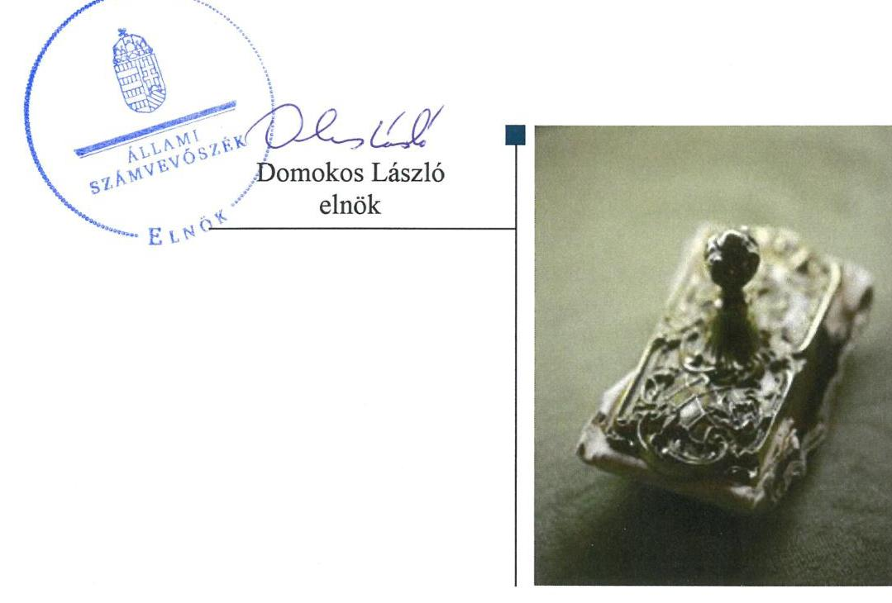
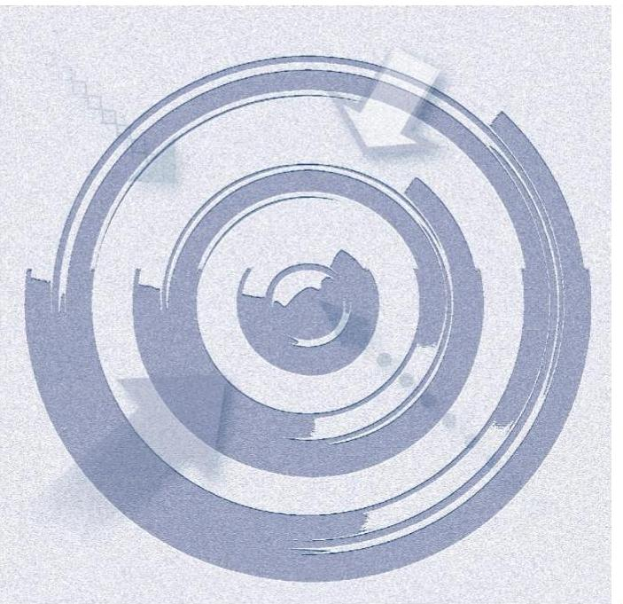

# Jelentés 

## Nem állami humánszolgáltatók ellenőrzése

A humánszolgáltatást nyújtó államháztartáson kívüli köznevelési és szociális intézmények, szolgáltatók fenntartói központi költségvetésből kapott támogatásai felhasználásának ellenőrzése - Gorsium Zeneiskoláért Alapítvány 2019.

19109
www.asz.hu

---

# Jelentés 

## Nem állami humánszolgáltatók ellenőrzése

A humánszolgáltatást nyújtó államháztartáson kívüli köznevelési és szociális intézmények, szolgáltatók fenntartói központi költségvetésből kapott támogatásai felhasználásának ellenőrzése - Gorsium Zeneiskoláért Alapítvány
2019. 04. hó 25. nap

---

# AZ ELLENŐRZÉST FELÜGYELTE:

- **PETŐ KRISZTINA** felügyeleti vezető
- **AZ ELLENŐRZÉST VEZETTE ÉS A VÉGREHAJTÁSÁÉRT FELELŐS:**
  - **KUSZINGER ANDREA** ellenőrzésvezető
  - **A PROGRAM ÖSSZEÁLLÍTÁSÁÉRT FELELŐS:**
    - **TÓTPÁL SZABOLCS** osztályvezető

**IKTATÓSZÁM:** EL-1597-001/2019

**TÉMASZÁM:** 2448

**ELLENŐRZÉS-AZONOSÍTÓ SZÁM:** V079420

Jelentéseink az Országgyűlés számítógépes hálózatán és az Interneta a www.asz.hu címen is olvashatóak.

---

# TARTALOMJEGYZÉK 

■ ÖSSZEGZÉS ..... 5
■ AZ ELLENŐRZÉS CÉLJA ..... 6
■ AZ ELLENŐRZÉS TERÜLETE ..... 7
■ AZ ELLENŐRZÉS HÁTTERE, INDOKOLTSÁGA ..... 8
■ A JELENTÉS LÉNYEGES KÉRDÉSKÖREI ..... 9
■ AZ ELLENŐRZÉS HATÓKÖRE ÉS MÓDSZEREI ..... 10
■ MEGÁLLAPÍTÁSOK ..... 12
■ JAVASLATOK ..... 14
■ MELLÉKLETEK ..... 15
I. sz. melléklet: Értelmező szótár ..... 15
■ FÜGGELÉKEK ..... 17
I. sz. függelék a jelentéshez ..... 17
II. sz. függelék: Észrevételek ..... 18
■ RÖVIDÍTÉSEK JEGYZÉKE ..... 19

---

.

---

# ÖSSZEGZÉS 

A Gorsium Zeneiskoláért Alapítvány belső szabályozottságának kialakítása nem volt szabályszerű, így nem biztositotta a szabályszerű gazdálkodás feltételeit. A köznevelési intézményei müködtetésére felhasznált közpénzekre vonatkozó gazdálkodásával a nyilvánosság előtt nem számolt el, így nem biztositotta az átláthatóságot.

## Az ellenőrzés társadalmi indokoltsága

Az Állami Számvevőszék stratégiájában hangsúlyos szerepet szán annak, hogy szilárd szakmai alapon álló, értékteremtő ellenőrzéseivel előmozdítsa a közpénzügyek átláthatóságát, rendezettségét és javaslataival a közpénzek és a közvagyon szabályos, gazdaságos, hatékony és eredményes felhasználását segítse. Az Állami Számvevőszék a stratégiájában célul tűzte ki, hogy az államháztartáson kívülre nyújtott költségvetési támogatások ellenőrzésével hozzájárul ahhoz, hogy a közpénzeket az államháztartáson kívüli szervezetek is átlátható módon használják fel a közfeladatok szerződésben vállalt ellátása érdekében. Az Állami Számvevőszék e stratégiai céljaival összhangban - az Állami Számvevőszékről szóló 2011. évi LXVI. törvény felhatalmazása alapján - végzi a központi költségvetésből származó források, nyújtott támogatások - kedvezményezett szervezetek közfeladat ellátásához való - felhasználásának az ellenőrzését.

## Főbb megállapítások, következtetések, javaslatok

A Gorsium Zeneiskoláért Alapítvány belső szabályozottságának kialakítása nem volt szabályszerű, mivel a számviteli politikát és a számlarendet nem a jogszabályokban foglaltak szerint készítették el. Ezzel a szabályszerű, közpénzekkel való gazdálkodás feltételeit nem teremtették meg.

A Gorsium Zeneiskoláért Alapítvány a köznevelési közfeladatot ellátó intézményei működtetéséhez felhasznált közpénzekre vonatkozó gazdálkodásával a nyilvánosság előtt nem számolt el, mivel a 2014-2017. években számviteli törvényben előírt beszámoló készítési kötelezettségének nem tett eleget, ezáltal nem biztosította gazdálkodásának átláthatóságát, elszámoltathatóságát.

A Gorsium Zeneiskoláért Alapítvány elszámolt a költségvetési támogatásokkal a Magyar Államkincstár felé.
Az Állami Számvevőszék a Gorsium Zeneiskoláért Alapítvány kuratóriumi elnökének 2 javaslatot fogalmazott meg.

---

# AZ ELLENŐRZÉS CÉLJA

**AZ ELLENŐRZÉS CÉLJA** annak értékelése, hogy a Gorsium Zeneiskoláért Alapítvány, mint Fenntartó¹ központi költségvetésből kapott támogatásainak felhasználása szabályszerű volt-e, a támogatások igénylése, évközi módosítása és év végi elszámolása megfelelte-e a jogszabályi előírásoknak.

---

# **AZ ELLENŐRZÉS TERÜLETE**

## **Gorsium Zeneiskoláért Alapítvány**

A székesfehérvári székhelyű Gorsium Zeneiskoláért Alapítványt a Fejér megyei Tácon, a Gorsium ÁFÉSZ, Tác Község Önkormányzata és a Magyar Táncművészek és Zeneművészek Szakszervezete hozta létre. A Gorsium Zeneiskoláért Alapítványt a Fejér Megyei Bíróság 1993. szeptember 20-i végzése alapján vette nyilvántartásba. A Gorsium Zeneiskoláért Alapítvány, mint intézményfenntartó a Gorsium Alapfokú Művészeti Iskolát és a Gorsium Gimnázium és Művészeti Szakgimnáziumot tartja fenn. A Gorsium Zeneiskoláért Alapítvány a 2014-2017. években nem volt közhasznú szervezet.

A Gorsium Zeneiskoláért Alapítvány célja az intézményei fenntartása és működtetése. A Gorsium Zeneiskoláért Alapítvány kezelő szerve a Kuratórium², mely a 2014-2016. években négy, 2017-ben hat tagból állt. Az ellenőrzött időszakban a Gorsium Zeneiskoláért Alapítványnál felügyelőbizottság nem működött és az intézményvezetők személyében változás nem történt. A Gorsium Zeneiskoláért Alapítvány a 2014-2017. években vállalkozási tevékenységet nem folytatott.

A 2014-2017. években a Gorsium Zeneiskoláért Alapítvány intézményei fenntartására és működtetésére 2014-ben 248 millió Ft, 2015-ben 252,9 millió Ft, 2016-ban 260,1 millió Ft, és 2017-ben 297,9 millió Ft központi költségvetési támogatást kapott. A 2017. év végén az engedélyezett maximális tanuló létszám az alapfokú oktatásban 1270 fő, a középfokú képzésben 590 fő volt.

A Gorsium Zeneiskoláért Alapítvány 2014-2017. években könyvvizsgálatra nem volt kötelezett és nem is vett igénybe könyvvizsgálói szolgáltatást.

---

# AZ ELLENŐRZÉS HÁTTERE, INDOKOLTSÁGA 

A köznevelési feladatokat ellátó nem állami intézményfenntartók részére közfeladataik ellátására a 2014-2017. években jelentős összegű pénzügyi támogatást biztosítottak a mindenkori költségvetési törvények a bennük megfogalmazott feltételek mellett.

Az ÁSZ ${ }^{3}$ stratégiájában célul tűzte ki, hogy az államháztartáson kívülre nyújtott költségvetési támogatások ellenőrzésével hozzájárul ahhoz, hogy a közpénzeket az államháztartáson kívüli szervezetek is átlátható módon használják fel közfeladatok ellátására kötött szerződésekben vállalt ellátása érdekében. Az ÁSZ stratégiájában foglaltak alapján is indokolt az ellenőrzés, amely a társadalom számára jelzi, hogy a közpénz államháztartáson kívüli felhasználása sem maradhat ellenőrizetlenül. Az államháztartáson kívülre nyújtott költségvetési támogatások ellenőrzésével az ÁSZ hozzájárul ahhoz, hogy a közpénzeket a nem állami humán fenntartók átlátható módon használják fel a közfeladatok ellátására kötött szerződésekben vállalt kötelezettségek teljesítése érdekében. Az ellenőrzés javaslataival hozzájárulhat az említett rendszerek szabályszerű támogatás felhasználásához, javíthatja a társadalmi-gazdasági döntések megalapozottságát, amely a „jó kormányzás" feltétele.

---

# A JELENTÉS LÉNYEGES KÉRDÉSKÖREI 

1. A köznevelési közfeladatot ellátó Fenntartó szabályszerű mükö-dési- és gazdálkodási környezet kialakításával megteremtette-e a költségvetési támogatások átlátható, elszámoltatható igénybevételének, felhasználásának feltételeit?
2. A Fenntartó az átvállalt köznevelési közfeladathoz biztosított költségvetési támogatásokat szabályszerűen fordította-e a humánszolgáltató intézményei müködtetésére?
3. A Fenntartó a köznevelési intézményei müködtetéséhez felhasznált közpénzekre vonatkozó gazdálkodásával a nyilvánosság előtt elszámolt-e?

---

# AZ ELLENŐRZÉS HATÓKÖRE ÉS MÓDSZEREI 

## Az ellenőrzés típusa

Megfelelőségi ellenőrzés.

## Az ellenőrzött időszak

A 2014. január 1-je és 2017. december 31-e közötti időszak. A helyszíni szemle tekintetében 2018. január 1-jétől 2019. január 22-ig tartó időszak.

## Az ellenőrzés tárgya

Az ellenőrzés a köznevelési közfeladatokat ellátó államháztartáson kívüli Fenntartó humánszolgáltatási közfeladatai ellátásához a költségvetési törvényekben biztosított központi költségvetési támogatások igénylése, évközi módosítása és év végi elszámolása fenntartói feladatainak ellátása, illetve e központi költségvetésből kapott támogatásaik humánszolgáltatási közfeladatokra való fenntartó általi felhasználása szabályszerűségének értékelésére terjedt ki.

Az ellenőrzés kiterjedt minden olyan körülményre és adatra, amely az ÁSZ jogszabályban meghatározott feladatainak teljesítéséhez, valamint a program végrehajtása folyamán felmerült újabb összefüggések feltárásához szükséges volt.

## Az ellenőrzött szervezet

Gorsium Zeneiskoláért Alapítvány

## Az ellenőrzés jogalapja

Az ellenőrzés jogszabályi alapját az ÁSZ tv4. 1. § (3) bekezdése, 5. § (3) bekezdésben foglalt előírások adták.

## Az ellenőrzés módszerei

Az ellenőrzést az ellenőrzési program szempontjai, kérdései, az ellenőrzött időszakban hatályos jogszabályok, a nemzetközi standardokat irányadónak tekintve, az ellenőrzés szakmai szabályok és módszertanok figyelembe vételével végezte az ÁSZ. A közpénzekkel való felelős gazdálkodás segítésére

---

irányuló javaslatok kidolgozásakor a hatályos jogszabályok voltak az irányadóak.

Az ellenőrzés ideje alatt az ellenőrzött szervezettel történő kapcsolattartást az ÁSZ SZMSZ ${ }^{5}$-ének vonatkozó előírásai alapján biztosította az ÁSZ.

Az ellenőrzési kérdések megválaszolásához szükséges bizonyítékok megszerzése az ellenőrzött által rendelkezésre bocsátott dokumentumokra, adatokra alapozva megfigyelés, szemle (szemrevételezés), kérdésfeltevés (információkérés), valamint elemző eljárással történt.

Az ellenőrzési bizonyítékként felhasználható adatforrások közé tartoztak egyrészt a szakmai program részletes szempontjainál felsorolt adatforrások, másrészt minden - az ellenőrzés folyamán feltárt, az ellenőrzés szempontjából információt tartalmazó - dokumentum.

Az ellenőrzés lefolytatásához az ellenőrzött szervezet a kitöltött tanúsítványok, valamint az ÁSZ által kért dokumentumok elektronikus úton való megküldésével szolgáltatott adatokat, információkat. Az így rendelkezésre bocsátott adatok, információk és a tanúsítványok adatai valódiságának kontrollja az ellenőrzés keretében történt.

A fenntartott köznevelési intézményeknél helyszíni szemle keretében győződött meg az ÁSZ a tényleges feladatellátásról (verifikáció).

A köznevelési humánszolgáltatások központi költségvetési támogatásai igénylésével, módosításával, elszámolásával kapcsolatos, államháztartáson kívüli fenntartó jogszabályokban előírt feladatai betartását, továbbá a központi költségvetési támogatások szabályszerű kezelését, nyilvántartását ellenőrizte az ÁSZ a Fenntartónál határozatok, nyilvántartások és egyéb dokumentumok alapján. Az ellenőrzés nem terjedt ki a köznevelési humánszolgáltatások központi költségvetési támogatásai igénylése, módosítása, elszámolása valódiságának, megalapozottságának, helyességének - sem a Fenntartónál, sem a székhely intézményeinél való - értékelésére. Továbbá nem terjedt ki az ellenőrzés e források, intézmények általi szabályszerű felhasználásának értékelésére.

---

# MEGÁLLAPÍTÁSOK 

## 1. A köznevelési közfeladatot ellátó Fenntartó szabályszerű mú-ködési- és gazdálkodási környezet kialakításával megterem-tette-e a költségvetési támogatások átlátható, elszámoltatható igénybevételének, felhasználásának feltételeit?

Összegző megállapítás

A Fenntartó köznevelési közfeladat ellátásának megszervezése szabályszerű volt, a belső szabályozottságának kialakítása nem a jogszabályi előírások szerint történt. A Fenntartó a költségvetési támogatások Kincstár ${ }^{6}$ felé történő igénylési, módosítási és elszámolási feladatait szabályszerűen látta el.

ALAPÍTÓ OKIRATTAL ${ }_{1-3}{ }^{7}$ a Ptk. ${ }^{8}$ előírásai szerint rendelkezett a Fenntartó. A Fenntartót a Bíróság ${ }^{9}$ nyilvántartásba vette.

A Fenntartó az Nkt. ${ }^{10}$ előírása szerint a köznevelési közfeladat ellátására vonatkozó megállapodással rendelkezett.

A SZÁMVITELI POLITIKA ${ }^{11}$ a Számv. tv. ${ }^{12}$ 14. § (4) és (11) bekezdésében foglaltak ellenére írásban nem rögzítette azokat a szabályokat, előírásokat, módszereket, amelyekkel a Fenntartó meghatározza, hogy a számviteli elszámolás, az értékelés szempontjából mit tekint lényegesnek, jelentősnek, nem lényegesnek, nem jelentősnek, 2015. októberétől kivételes nagyságú vagy előfordulású bevételnek, költségnek, ráfordításnak, továbbá, hogy a törvényben biztosított választási, minősítési lehetőségek közül melyeket, milyen feltételek fennállása esetén alkalmaz, az alkalmazott gyakorlatot milyen okok miatt kell megváltoztatni.

A SZÁMLARENDBEN ${ }^{13}$ a költségvetésből kapott, továbbutalási célú átlagbér alapú támogatás kimutatására kijelölt számla a 2014-2016. években a Civilszr. ${ }^{14} 16 . \S$ (6) bekezdésében és a 2017. évben a Civilszr. ${ }^{15}$ 13. § (4) bekezdésében foglaltak ellenére nem az egyéb bevételek között szerepelt.

A KÖLTSÉGVETÉSI TÁMOGATÁSOK Kincstár felé történő igénylése, módosítása és elszámolása az Nkt. vhr. ${ }^{16}$-ben előírtak szerint történt.

---

# 2. A Fenntartó az átvállalt köznevelési közfeladathoz biztosított költségvetési támogatásokat szabályszerűen fordította-e a humánszolgáltató intézményei működtetésére? 

Összegző megállapítás A Fenntartó az átvállalt köznevelési közfeladathoz biztosított költségvetési támogatásokat szabályszerűen fordította a humánszolgáltató intézményei múködtetésére.

A Fenntartó kiadta a köznevelési intézményei alapító okiratait, gondoskodott róla, hogy intézményei az Nkt. előírásai szerinti szervezeti és múködési szabályzattal rendelkezzenek, biztosította a köznevelési intézmények személyi és tárgyi feltételeit, meghatározta az intézmények költségvetését, az intézmények által kérhető térítési díj és tandíj megállapításának szabályait.

A Fenntartó a központi költségvetési támogatásokat szabályszerűen továbbutalta a köznevelési intézményei részére.

A TOVÁBBUTALT KÖZPONTI KÖLTSÉGVETÉSI TÁMOGATÁSOKAT a Fenntartó az Nkt. előírásai szerint alapfeladatonkénti bontásban, elkülönítetten, naprakészen tartotta nyilván.

## 3. A Fenntartó a köznevelési intézményei múködtetéséhez felhasznált közpénzekre vonatkozó gazdálkodásával a nyilvánosság előtt elszámolt-e?

Összegző megállapítás A Fenntartó a köznevelési intézményei múködtetéséhez felhasznált közpénzekre vonatkozó gazdálkodásával a nyilvánosság előtt nem számolt el.

A NYILVÁNOSSÁG ELŐTT a Fenntartó a közfeladatot ellátó intézményei múködtetéséhez felhasznált közpénzekre vonatkozó gazdálkodásával nem számolt el, mivel a Fenntartó a Civil tv. ${ }^{17}$ 28. § (1) bekezdésében foglaltak ellenére a 2014-2017. években beszámoló készítési kötelezettségének nem tett eleget.

---

# JAVASLATOK 

Az ÁSZ tv. 33. § (1) bekezdésében foglaltak értelmében az ellenőrzött szervezet vezetője köteles a jelentésben foglalt megállapításokhoz kapcsolódó intézkedési tervet összeállítani és azt a jelentés kézhezvételétől számított 30 napon belül az ÁSZ részére megküldeni. Amennyiben az ellenőrzött szervezet vezetője nem küldi meg határidőben az intézkedési tervet, vagy továbbra sem elfogadható intézkedési tervet küld, az Állami Számvevőszék elnöke az ÁSZ tv. 33. § (3) bekezdése a) és b) pontjaiban foglaltakat érvényesítheti.

## Gorsium Zeneiskoláért Alapítvány kuratóriumi elnökének

1. Intézkedjen a jogszabályi előirás szerinti számviteli politika és számlarend elkészitéséről.
(1. összegző megállapítás 3. és 4. bekezdése alapján)
2. Intézkedjen a jogszabály szerinti beszámolási kötelezettség teljesitése érdekében.
(3. összegző megállapítás 1. bekezdése alapján)

---

# MELLÉKLETEK 

- I. SZ. MELLÉKLET: ÉRTELMEZŐ SZÓTÁR
civil szervezet
humánszolgáltatás
költségvetési támogatás
köznevelési közfeladat
köznevelési intézmény
nem állami, nem önkormányzati (államháztartáson kívüli) intézmény fenntartó

A Civil tv. 2. § 6. pontja szerint civil szervezet a civil társaság, a Magyarországon nyilvántartásba vett egyesület (a párt, a szakszervezet és a kölcsönös biztosító egyesület kivételével), a közalapítvány és a pártalapítvány kivételével az alapítvány.
Külön törvényben meghatározott szociális, gyermekjóléti, gyermekvédelmi, közoktatási, felsőoktatási, kulturális közfeladatok (2014. évi Kvtv. 34. § (1), (4) bekezdés, 1. számú melléklet XX/20/2. alcím, 19. alcím, 2015. évi Kvtv. 43. § (1), (4) bekezdés, 1. számú melléklet XX/20/2/3. jogcím csoport, 19. alcím, 2016. évi Kvtv. 41. § (1), (4) bekezdés, 1. számú melléklet XX/20/2/3. jogcím csoport, 19. alcím).
a társadalombiztosítás pénzügyi alapjai kivételével az államháztartás központi alrendszeréből ellenérték nélkül, pénzben nyújtott támogatások (Áht. ${ }^{18}$ 1. § 14. pont)
A költségvetési törvényekben (2013. évi CCXXX. törvény 33-34. §, 2014. évi C. törvény 42-43. §, 2015. évi C. törvény 40-41. §) megállapított támogatás. A 2015. évi C. törvény 40-41. § szerint többek között: Az Országgyűlés a köznevelési feladat ellátására átlagbéralapú támogatást állapít meg. A nevelési-oktatási, valamint pedagógiai szakszolgálati intézményt fenntartó nemzetiségi önkormányzat, az egyházi és magán köznevelési intézmény fenntartója részére az általuk fenntartott nevelési-oktatási intézményben, továbbá pedagógiai szakszolgálati intézményben pedagógus és - a b) pont kivételével - nevelő-oktató munkát közvetlenül segítő munkakörben foglalkoztatottak után a 7. melléklet I. pontja, valamint az óvoda, egységes óvoda-bölcsőde esetében a 2. melléklet II. pont 1. alpontja szerint és az 5. alpontjában meghatározott jogosultak után, az őket ott megillető mértékek szerint. Múködési támogatást állapít meg a nemzetiségi önkormányzat vagy az egyházi jogi személy által fenntartott nevelésioktatási intézményekben ellátott, továbbá a pedagógiai szakszolgálati intézményekben gyógypedagógiai tanácsadásban, korai fejlesztésben, oktatásban és gondozásban, valamint a fejlesztő nevelésben részt vevő gyermekekre, tanulókra tekintettel a nemzetiségi önkormányzat és a b---evett egyház részére a 7. melléklet II. pontja szerint.
A köznevelési intézmény alapító okiratában foglalt feladat: óvodai nevelés, nemzetiséghez tartozók óvodai nevelése, általános iskolai nevelés-oktatás, nemzetiséghez tartozók általános iskolai nevelése-oktatása, kollégiumi ellátás, nemzetiségi kollégiumi ellátás, gimnáziumi neve-lés-oktatás, szakközépiskolai nevelés-oktatás, szakiskolai nevelés-oktatás, nemzetiség gimnáziumi nevelés-oktatása, nemzetiség szakközépiskolai nevelés-oktatása, nemzetiség szakiskolai nevelés-oktatása, Köznevelési Hídprogramok keretében folyó nevelés-oktatás, felnőttoktatás, alapfokú művészetoktatás, fejlesztő nevelés, fejlesztő nevelés-oktatás, pedagógiai szakszolgálati feladat, a többi gyermekkel, tanulóval együtt nevelhető, oktatható sajátos nevelési igényű gyermekek, tanulók óvodai nevelése és iskolai nevelése-oktatása, azoknak a sajátos nevelési igényű gyermekeknek, tanulóknak az óvodai, iskolai, kollégiumi ellátása, akik a többi gyermekkel, tanulóval nem foglalkoztathatók együtt, a gyermekgyógyüdülőkben, egészségügyi intézményekben, rehabilitációs intézményekben tartós gyógykezelés alatt álló gyermekek tankötelezettségének teljesítéséhez szükséges oktatás, pedagógiai-szakmai szolgáltatás.
A nevelési- oktatási intézmény, pedagógiai szakszolgálati intézmény, pedagógiai-szakmai szolgáltatást nyújtó intézmény.
A köznevelési és szociális, gyermekjóléti és gyermekvédelmi közfeladatokat/humánszolgáltatásokat ellátó intézményt fenntartó egyházi jogi személy, társadalmi szervezet, alapítvány, közalapítvány, civil szervezet, országos nemzetiségi önkormányzat, nonprofit gazdasági társaság, gazdasági társaság és a humánszolgáltatást alaptevékenységként végző, Szja tv. hatálya alá tartozó egyéni vállalkozó. (2013. évi Kvtv. 35. § (1), (3) bekezdés, 2014. évi Kvtv. 33. §, 34. § (1), (4) bekezdés, 2015. évi Kvtv. 42. §, 43. § (1), (4) bekezdés, 2016. évi Kvtv. 40. §, 41. § (1), (4) bekezdés)

---

.

---

# FÜGGELÉKEK 

- I. SZ. FÜGGELÉK A JELENTÉSHEZ

Az Állami Számvevőszék az ellenőrzések során feltárt tényekhez kapcsolódó további körülmények tisztázására eszközrendszerrel nem rendelkezik. Amennyiben az ellenőrzésen túlmutatóan indokoltnak látszik az ellenőrzés során feltárt körülmények további vizsgálata, az Állami Számvevőszék törvényi felhatalmazás alapján az ellenőrzés által feltárt körülményeket továbbítja a hatáskörrel rendelkező szervnek a szükséges intézkedések megtétele, eljárások lefolytatása érdekében.
A Fenntartó a Civil tv. 28. § (1) bekezdésében foglaltak ellenére a 2014-2017. években beszámoló készítési kötelezettségének nem tett eleget. A beszámolók hiányában nem igazolt, hogy a közhiteles nyilvántartásba érvényes, hiteles adatok kerültek. Ez alapján a közzétett beszámolók megtévesztőek, mivel nem hiteles és nem szabályszerű adatokat tartalmaznak.
Az eset körülményeinek felderítésére a Székesfehérvári Törvényszék rendelkezik hatáskörrel.

---

A jelentéstervezetet a Számvevőszék 15 napos észrevételezésre megküldte az ellenőrzött szervezet vezetőjének az ÁSZ tv. 29. §* (1) bekezdése előírásának megfelelően.

A Gorsium Zeneiskoláért Alapítvány kuratóriumi elnöke nem élt észrevételezési jogával.

[^0]
[^0]:    * 29. § (1) Az Állami Számvevőszék az ellenőrzési megállapításait megküldi az ellenőrzött szervezet vezetőjének vagy az általa megbízott személynek, és annak, akinek személyes felelősségét állapította meg.
    (2) Az ellenőrzött szervezet vezetője és a felelősként megjelölt személy az ellenőrzés megállapításaira tizenöt napon belül írásban észrevételt tehet.
    (3) Az Állami Számvevőszék az észrevételre a beérkezésétől számított harminc napon belül írásban válaszol. A figyelembe nem vett észrevételeket köteles a jelentésben feltüntetni, és megindokolni, hogy azokat miért nem fogadta el.

---

# RÖVIDÍTÉSEK JEGYZÉKE 

${ }^{1}$ Fenntartó
${ }^{2}$ Kuratórium
${ }^{3}$ ÁSZ
${ }^{4}$ ÁSZ tv.
${ }^{5}$ ÁSZ SZMSZ
${ }^{6}$ Kincstár
${ }^{7}$ Alapító Okirat ${ }_{1}$
Alapító Okirat ${ }_{2}$
Alapító Okirat ${ }_{3}$
${ }^{8}$ Ptk.
${ }^{9}$ Bíróság
${ }^{10} \mathrm{Nkt}$.
${ }^{11}$ Számviteli politika
${ }^{12}$ Számv. tv.
${ }^{13}$ Számlarend
${ }^{14}$ Civilszr. 1
${ }^{15}$ Civilsz. 2
${ }^{16} \mathrm{Nkt}$. vhr.
${ }^{17}$ Civil tv.
${ }^{18}$ Áht.

Gorsium Zeneiskoláért Alapítvány
Gorsium Zeneiskoláért Alapítvány kuratóriuma
Állami Számvevőszék
Az Állami Számvevőszékről szóló 2011. évi LXVI. törvény (hatályos: 2011. július 1-jétől)
Az Állami Számvevőszék Szervezeti és Működési Szabályzata
Magyar Államkincstár
Gorsium Zeneiskoláért Alapítvány alapító okirata (hatályos: 2001. február 12-től)
Gorsium Zeneiskoláért Alapítvány alapító okirata (hatályos: 2016. február 18-tól)
Gorsium Zeneiskoláért Alapítvány (hatályos: 2017. február 7-től)
a Polgári Törvénykönyvről szóló 2013 évi V. törvény (hatályos: 2014. március 15-től)
Fejér Megyei Bíróság
A nemzeti köznevelésről szóló 2011. évi CXC. törvény (hatályos: 2012. szeptember 1-jétől)
Gorsium Zeneiskoláért Alapítvány Számviteli politika (hatályos: 2014. január 1-jétől)
A számvitelről szóló 2000. évi C. törvény (hatályos: 2001. január 1-jétől)
Gorsium Zeneiskoláért Alapítvány Számlarend (hatályos: 2013. december 21-től) 224/2000. (XII. 19.) Korm. rendelet a számviteli törvény szerinti egyes egyéb szervezetek beszámolókészítési és könyvvezetési kötelezettségének sajátosságairól (hatályos: 2001. január 1-jétől 2016. december 31-ig) 479/2016. (XII. 28.) Korm. rendelet a számviteli törvény szerinti egyes egyéb szervezetek beszámoló készítési és könyvvezetési kötelezettségének sajátosságairól (hatályos: 2017. január 1-jétől)
229/2012. (VIII. 28.) Korm. rendelet - a nemzeti köznevelésről szóló törvény végrehajtásáról
az egyesülési jogról, a közhasznú jogállásról, valamint a civil szervezetek müködéséről és támogatásáról szóló 2011. évi CLXXV. törvény (hatályos: 2011. december 22-től)
az államháztartásról szóló 2011. évi CXCV. törvény (hatályos: 2012. január 1-jétől)

---

ÁLLAMI SZÁMVEVŐSZÉK
1052 Budapest, Apáczai Csere János utca 10.
Levélcím: 1364 Budapest 4. Pf. 54
Telefon: +36 14849100 Telefax: +36 14849200
www.asz.hu