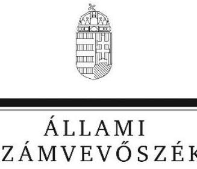

# Jelentés

## A „vészhelyzeti” betegellátás rendszerének ellenőrzése

2019.

19110 www.asz.hu

---

# Jelenetés 

## A „vészhelyzeti" betegellátás rendszerének ellenőrzése

2019. 07. hó 12. nap
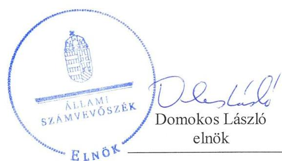
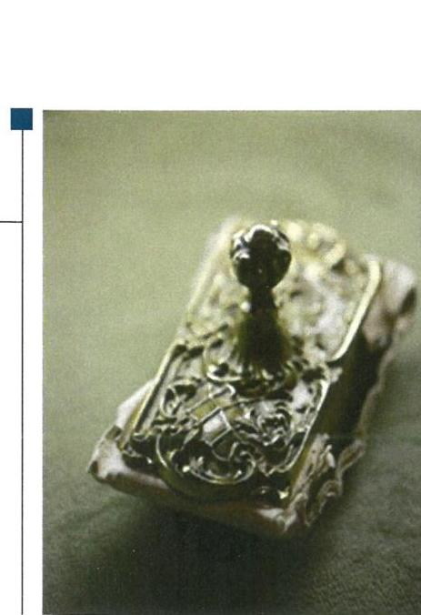

---

# AZ ELLENŐRZÉST FELÜGYELTE:

- **TÓTH MARIANNA** felügyeleti vezető
- **DR. NÉMETH ERZSÉBET** felügyeleti vezető

## AZ ELLENŐRZÉST VEZETTE ÉS A VÉGREHAJTÁSÁÉRT FELELŐS:

- **DR. SIMON JÓZSEF** ellenőrzésvezető

## A PROGRAM ÖSSZEÁLLÍTÁSÁÉRT FELELŐS:

- **TÓTPÁL SZABOLCS** osztályvezető

**IKTATÓSZÁM:** EL-1599-001/2019

**TÉMASZÁM:** 2484

**ELLENŐRZÉS-AZONOSÍTÓ SZÁM:** V0828

Jelentéseink az Országgyűlés számítógépes hálózatán és az Interneten a www.asz.hu címen is olvashatóak.

---

# TARTALOMJEGYZÉK 

■ ÖSSZEGZÉS ..... 5
■ AZ ELLENŐRZÉS CÉLJA ..... 7
■ AZ ELLENŐRZÉS TERÜLETE ..... 8
■ AZ ELLENŐRZÉS HÁTTERE, INDOKOLTSÁGA ..... 11
■ A JELENTÉS LÉNYEGES KÉRDÉSKÖREI ..... 12
■ AZ ELLENŐRZÉS HATÓKÖRE ÉS MÓDSZEREI ..... 13
■ MEGÁLLAPÍTÁSOK ..... 15
■ JAVASLATOK ..... 26
■ KÖVETKEZTETÉSEK ..... 27
■ MELLÉKLETEK ..... 29
I. sz. melléklet: Értelmező szótár ..... 29
II. sz. melléklet: A helyénvalósági ellenőrzés alapját jelentő célkitűzések a Semmelweis Tervben ..... 32
III. sz. melléklet: A vészhelyzeti betegellátással kapcsolatos kérdőíves felmérés válaszai ..... 35
■ FÜGGELÉK: ÉSZREVÉTELEK ..... 43
■ RÖVIDÍTÉSEK JEGYZÉKE ..... 53

---

.

---

# ÖSSZEGZÉS 

A vészhelyzeti betegellátó-rendszerre vonatkozó átfogó fejlesztési célok kialakításáról az ágazati irányításért felelős miniszter gondoskodott. Nem alakított ki azonban a nyomon követéshez és értékeléshez szükséges eszközöket és feltételeket, illetve nem értékelte a megvalósítás folyamatát. A vészhelyzeti betegellátás fejlesztése érdekében történtek intézkedések, azonban azok nem biztosították az ellátást igénybe vevők jogát, hogy sürgős szükség esetén az egészségi állapot által indokolt időn belül ellátást kapjanak.
A lakossági véleményfelmérés alapján a szolgáltatást igénybe vevők az ellátás szakmai színvonalával elégedettek voltak, ugyanakkor az ellátáshoz való hozzájutás időtartamát és a tájékoztatás elmaradását problémaként érzékelték.

## Az ellenőrzés társadalmi indokoltsága

Minden embernek deklarált joga van - a jogszabályban meghatározott keretek között - az egészségi állapota által indokolt, folyamatosan hozzáférhető és az egyenlő bánásmód követelményét kielégítő egészségügyi ellátáshoz. A vészhelyzeti ellátás panasz által indokolt időn belül történő nyújtása és minősége meghatározó a társadalom egészségügyi állapota és biztonsága szempontjából. A vészhelyzeti betegellátás finanszírozása emellett alapvetően közpénzekből történik, amely jelentős arányt képvisel az államháztartási kiadásokon belül.

A vészhelyzeti betegellátás egy komplex és összetett rendszerként működik, amelyben számos egészségügyi szereplő vesz részt. A vészhelyzeti betegellátás reformja hosszú idő óta az egészségügyi ágazat egyik kiemelt célkitűzése, amelynek megvalósulása társadalmi érdek. Az ellenőrzés hozzájárul az Állami Számvevőszék Stratégiájában megfogalmazott küldetése megvalósításához, a vészhelyzeti ellátásért felelős szervezetek számára visszajelzést ad az átalakítási folyamat előrehaladásáról és a célok időarányos megvalósulásáról. Emellett az ellenőrzés közvetetten hozzájárul a társadalom egészségügyi állapotának javítása érdekében meghatározott célkitűzések megvalósításához is.

## Főbb megállapítások, következtetések

A vészhelyzeti betegellátó-rendszerre vonatkozó átfogó fejlesztési célok kialakításáról az ágazati irányításért felelős miniszter gondoskodott. Az Egészségügyi Ágazati Stratégia és az ehhez kapcsolódó cselekvési terv célként fogalmazta meg a vészhelyzeti betegellátó-rendszer fejlesztését, azonban az ágazati irányító nem gondoskodott a tervezett fejlesztések pontos tartalmának, eszközeinek és egyéb feltételeinek meghatározásáról. Mindezek hiánya miatt nem volt egyértelműen meghatározott a stratégiai célkitűzések megvalósításának módja.

Az ágazati irányító az Egészségügyi Ágazati Stratégia megvalósítására vonatkozó nyomon követés és értékelés alapelveit kidolgozta. Ugyanakkor a nyomon követés és értékelés rendszerét az ágazati irányító nem alakította ki, nem határozta meg a kapcsolódó mutatók körét és nem dolgozta ki az intézkedések értékelésének módszertanát. Az Egészségügyi Ágazati Stratégia végrehajtására vonatkozó nyomon követési és értékelési rendszer hiányában a kitűzött célok megvalósulásának értékeléséhez szükséges feltételek nem álltak rendelkezésre.

A jogszabályi előírások ellenére az ágazati irányító nem gondoskodott a vészhelyzeti betegellátó-rendszer fejlesztése érdekében kitűzött célok megvalósításának nyomon követéséről és értékeléséről, illetve erre vonatkozó kötelezettsége ellenére nem számolt be az előrehaladásról.

A fejlesztési célkitűzések végrehajtását az ágazati irányító belső ellenőrzésének vizsgálatai nem érintették, a teljesítményértékelési felmérés a vészhelyzeti betegellátás jellemzőit csak érintőlegesen értékelte, a betegpanaszok tapasztalatai külön a vészhelyzeti betegellátó-rendszerre vonatkozóan nem álltak rendelkezésre. A vészhelyzeti ellá-

---

tással kapcsolatban megfogalmazott, nyilvánosan megjelent ellátási problémák kivizsgálása érdekében nem történtek intézkedések. Az illetékes hatóság a múködési minimumfeltételek vonatkozásában nem végezte el a jogszabályi előírás ellenére az egészségügyi szolgáltatók előre meghatározott ütemezés szerinti ellenőrzését, amelynek hiányában az ágazati irányító a minimumfeltételek folyamatos rendelkezésre állását nem tudta biztosítani.

A vészhelyzeti betegellátás intézményrendszere a betegek számára biztosította a folyamatos hozzáférhetőséget. A rendszerszintű, egységes szabályozás hiánya a betegosztályozási rendszerre és a vészhelyzeti ellátás folyamatára vonatkozóan azonban gátolta, hogy a betegek az állapotuk által indokolt időn belül ellátást kapjanak, függetlenül attól, hogy melyik vészhelyzeti betegellátó intézmény ellátását veszik igénybe.

A Semmelweis Tervben a mentésre vonatkozóan meghatározott célok megvalósítása érdekében történtek intézkedések, azonban az intézkedések ellenére a 15 percen belüli kiérkezés idejének aránya romlott. Az Országos Mentőszolgálat bővítette és fejlesztette a mentőállomás-hálózatát, növelte oktatási kapacitását, kialakította mentésirányítási rendszerét, valamint biztosította az ellátás során keletkező dokumentumok elektronikus bevitelét és rögzítését.

A prehospitális „egy kapu" ellátási modell és az orvosi ügyeletek fejlesztése érdekében meghatározott intézkedések időarányosan megvalósultak. Az Országos Mentőszolgálat képzéseket biztosított a prehospitális ellátást nyújtók számára, kialakította irányítási rendszerét, az integrált diszpécserszolgálatot és az egykapus hívásfogadást. Az új mentőállomások által megvalósult az ügyeleti telephelyek és a kórházi sürgősségi osztályok közelítése. Megkezdődött az egészségügyi ellátó hálózat közös informatikai rendszerének kialakítása.

A betegellátás biztonsága érdekében a kórházi sürgősségi osztályok átszervezése tekintetében az ágazati irányító nem értékelte a kitűzött alapelvek érvényesülését és nem hozott intézkedéseket ezek érvényesülése érdekében. Budapest és vonzáskörzete akut kórházi rendszerének átalakítása ugyanakkor megkezdődött.

A Semmelweis Tervben szereplő, nem teljesült célkitűzések továbbra is kockázatot jelentenek a vészhelyzeti be-tegellátó-rendszer működése szempontjából.

A lakossági kérdőíves felmérés értékelése azt mutatta, hogy a vészhelyzeti ellátást igénybe vevők többsége ismeri, milyen típusú panaszokkal fordulhat a vészhelyzeti betegellátó szervezetekhez. Az igénybevevők túlnyomó többsége elégedett volt az Országos Mentőszolgálat által végzett vészhelyzeti ellátással, míg a sürgősségi betegellátó intézményekben kapott ellátást a válaszadók mintegy fele ítélte elfogadhatónak. A mentésre vonatkozó 15 percen belüli kiérkezési idő a válaszadók szerint mindössze az esetek felében teljesült. A sürgősségi betegellátást nyújtó intézményekben az ellátás az esetek 57\%-ában történt elfogadható módon, de az esetek kevesebb, mint felénél történt a válaszadók elvárása szerinti időn belül. Az esetek többségében a sürgősségi betegellátó nem adott tájékoztatást a betegkategóriába való besorolás eredményéről, ennek jelentőségéről és a várakozási időről sem.

---

# AZ ELLENŐRZÉS CÉLJA 

Az ellenőrzés célja annak értékelése volt, hogy a megszervezett sürgősségi („vészhelyzeti") betegellátás mint közszolgáltatás fejlesztésére vonatkozó célok meghatározásra kerültek-e, a kapcsolódó nyomon követési rendszer kialakítása megtörtént-e, a vészhelyzeti betegellátó-rendszerrel kapcsolatban kitűzött célok elérését az ágazati irányító nyomon követte-e, az egyes célkitűzések időarányosan megvalósultak-e, illetve, hogy a társadalom tagjai számára sürgős szükség esetén az egészségi állapotuk által indokolt, folyamatosan hozzáférhető ellátás biztosított volt-e. Az ellenőrzés célja volt továbbá annak értékelése, hogy a vészhelyzeti ellátást igénybevevők elégedettek voltak-e a kapott sürgősségi ellátással.

---

# AZ ELLENŐRZÉS TERÜLETE 

## Emberi Erőforrások Minisztériuma, Országos Mentőszolgálat, Nemzeti Egészségbiztosítási Alapkezelő

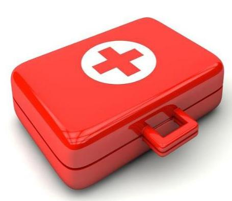

A vészhelyzeti betegellátó-rendszer az egészségügyi ellátórendszer azon szervezeti egységeiből áll, amelyeket a beteg heveny tünete, hirtelen fellépő fájdalma, egészségromlása miatt távközlési eszköz útján, vagy személyesen felkereshet, és elsődleges ellátásban részesülhet.

A vészhelyzeti betegellátás elemei közé tartozik a mentés, a fekvőbeteg gyógyintézet sürgősségi fogadóhelye, vagy osztálya, valamint az alapellátáshoz tartozó ügyelet.

A vészhelyzeti betegellátás területén az ágazati irányítást az Emberi Erőforrások Minisztériuma látja el. Ágazati irányítóként az egészségügyért felelős miniszter jogköre kiterjed minden egészségügyi tevékenységre, illetőleg - jogállásuktól függetlenül - minden egészségügyi szolgáltatóra. Az ágazati irányító feladatai közé tartozik többek között az egészségügy területén működő országos intézetek, valamint az állam tulajdonába, illetve fenntartásába tartozó fekvőbeteg-szakellátást, vagy fekvőbeteg- és hozzá kapcsolódó járóbeteg-szakellátást végző egészségügyi szolgáltatók irányítása; az egészségügyi rendszer teljesítményértékelésére vonatkozó részletes szabályok, a teljesítményértékelés intézményrendszerének, az egyes indikátorok meghatározásának és gyűjtésének, valamint az egészségpolitikai döntéshozatal során az értékelések felhasználási szabályainak meghatározása; az egészségügyi szakmai felügyelet gyakorlása körében módszertani és szakmai irányítási feladatok ellátása, valamint az egészségügyi szolgáltatások szakmai követelmény rendszerének megállapítása.

A mentés feladatait az ország egész területére kiterjedően az Emberi Erőforrások Minisztériuma irányítása alá tartozó központi költségvetési szervként az Országos Mentőszolgálat mint állami mentőszolgálat koordinálja és biztosítja. A mentési feladatokban egyéb mentésre feljogosított szervezetek is közreműködnek az Országos Mentőszolgálattal kötött együttműködési megállapodás alapján.

Az egészségügyi ágazat finanszírozásával kapcsolatos feladatokat - beleértve a vészhelyzeti betegellátást is - az Emberi Erőforrások Minisztériuma irányítása alá tartozó Országos Egészségbiztosítási Pénztár látta el 2016. december 31-ig. Ezt követően e feladatok ellátását a Nemzeti Egészségbiztosítási Alapkezelő végzi. A Nemzeti Egészségbiztosítási Alapkezelő a finanszírozással kapcsolatos feladatok mellett többek között gondoskodik a területi egészségügyi ellátás megszervezésére vonatkozó módszertan meghatározásáról, valamint felügyeli az egészségüggyel, az egészségügy finanszírozásával kapcsolatos fejlesztési, elemzési, értékelési, kutatási, szakértői és szakmai támogatási feladatokat.

Az Emberi Erőforrások Minisztériuma által 2011-ben készített Semmelweis Terv ${ }^{1}$ fogalmazta meg az egészségügyi rendszer komplex fejlesztési

---

céljait. A vészhelyzeti betegellátó-rendszer fejlesztésére vonatkozó általános fejlesztési célt és a megvalósítás érdekében javasolt célokat, intézkedéseket - mint egészségpolitikai szakmai koncepció - a Semmelweis Terv F jelű programterve tartalmazta. A Semmelweis Terv átfogóan bemutatta az egészségügyre - ezen belül a vészhelyzeti betegellátásra - vonatkozó helyzetértékelést és célkitűzéseket. A javasolt intézkedések végrehajtását a vészhelyzeti betegellátó-rendszer vonatkozásában 5-10 éves időtartamban jelölte meg.

A Semmelweis Terv a vészhelyzeti betegellátó-rendszer fejlesztése kapcsán egyetlen mutatót - a mentők 15 percen belüli kiérkezési idejének 7 százalékponttal történő javítását, és a fejlesztési időszak végéig a legalább 90,0\%-os arány elérése - tartalmazta.

A Semmelweis Terv átfogó célja egy fenntartható, hatékony, igazságos, országosan egységes elvek szerint működő, szükségletalapú és betegközpontú vészhelyzeti ellátás kialakítása. A Semmelweis Terv által megfogalmazott javaslatok négy fókuszterületre terjednek ki, amelyek a következők: a mentés, a prehospitális „egy kapu" ellátási modell - orvosi ügyelet, a kórházi vészhelyzeti ellátás és a betegszállítás.

A mentés fejlesztési céljai közé tartozik többek között a mentőállomáshálózat, a mentésirányítás, a szervezeti minőségirányítás, a szakmai minőség, az oktatás, a betegellátási adatok szakmai adatbázisának fejlesztése, továbbá a mentőorvosok helyének és szerepének megtartása.

A Semmelweis Terv országosan egységes ún. „prehospitális" sürgősségi rendszert kíván megvalósítani, amely egyetlen, azonban jól ismert, bárki számára elérhető belépési kaput biztosít az ellátási szükséglettel bíró betegek számára. E rendszer kialakítása és hatékony működése érdekében célként került megfogalmazásra többek között az egykapus hívásfogadási és irányítási lehetőség, az integrált diszpécserszolgálatok létrehozása, az ehhez kapcsolt ügyeleti rendszer megszervezése, a háziorvosok sürgősségi ellátáshoz köthető oktatása és a különböző sürgősségi ellátásban részt vevők közös informatikai rendszerének kiépítése.

A kórházi vészhelyzeti ellátás vonatkozásában két alapelv teljesülését tűzte ki célul a Semmelweis Terv. Ezek közül az egyik, hogy akut beteget ellátó kórház csak meghatározott feltételekkel rendelkező sürgősségi betegellátó osztállyal működhet. A másik alapelv szerint sürgősségi ellátást igénylő beteg csak az akut betegek ellátására felkészült sürgősségi betegellátó osztállyal rendelkező kórházba kerülhet. További célkitúzésként szerepelt többek között az „egy kapu" kialakítása, a fővárosi akut kórházi ellátás rendszerének átalakítása és a betegszállítás országosan egységes irányítási rendszerének megteremtése.

A Semmelweis Tervről szóló kormányhatározat² tartalmazta a struk-túra-átalakításhoz és a kiemelt jelentőségű feladatokhoz kapcsolódó intézkedések felsorolását, amelyek azonban - a budapesti sürgősségi centrumok kialakításának előkészítését kivéve - nem a vészhelyzeti ellátásra, hanem az egészségügyi ágazatra vonatkoztak.

A Semmelweis Terv kialakítását követően a 2015. évben készült el az Egészségügyi Ágazati Stratégia³. A Kormány által jóváhagyott stratégia a fejlesztési célok megvalósítását a 2014-2020. évig terjedő programozási időszakra vonatkozóan határozta meg.

---

A Kormány a 1534/2016. (X.13.) kormányhatározatban döntött a Nemzeti Népegészségügyi Stratégia 2017-2026 kidolgozásáról, amely azonban az ellenőrzött időszakon belül nem készült el.

---

# AZ ELLENŐRZÉS HÁTTERE, INDOKOLTSÁGA 

Magyarország Alaptörvénye ${ }^{4}$ XX. cikkének első bekezdése szerint minden állampolgárnak joga van a testi és lelki egészséghez. A népegészségügy a legszélesebb értelemben vett közügy, amely elsődlegesen az egészséget meghatározó tényezőkre irányul. Ezért nem egy ágazat, vagy szakma kizárólagos kompetenciája, hanem össztársadalmi feladat, melynek „motorja" az egészségügy.

Az egészségügyi ellátások, és ezen belül a vészhelyzeti betegellátórendszer az eltérő egészségi állapotú betegek differenciált ellátását szolgáló, a munkamegosztás és a fokozatosság elvén alapuló intézményrendszerre épül, amelyben az egyén egészségi állapotának összes jellemzője együttesen határozza meg a szükséges ellátási szintet.

Minden embernek törvényben deklarált joga van sürgős szükség esetén az életmentő, illetve a súlyos, vagy maradandó egészségkárosodás megelőzését biztosító ellátáshoz. A vészhelyzeti ellátás célja, hogy az emberek - éljenek, lakjanak bárhol is az országban - azonos eséllyel, azonos időn belül jussanak, azonos minőségű egészségügyi ellátáshoz.

A folyamatosan hozzáférhető egészségügyi ellátás megszervezése érdekében a megbetegedés, továbbá a beteg állapotromlásának időben történő megelőzésére, illetve ellátására az Országos Mentőszolgálat, valamint az egészségügyi szolgáltatók vészhelyzeti betegellátó és betegfelügyeleti rendszert működtetnek, amelynek feladata az úgynevezett „egykapus rendszerben" az optimális betegellátás és a jól múködő betegirányítás biztosítása a nap 24 órájában. A rendszer célja, hogy a beteg optimalizált állapotban és időpontban kerüljön a meghatározott ellátási helyre.

A vészhelyzeti betegellátás formái 2015-2017 közötti időszakban a korábbi évekhez hasonlóan az egészségügyi ellátórendszer különböző szintjein jelentek meg. A jogszabályok által meghatározott szakmai alapelvek megvalósulása érdekében a feladatellátásban résztvevők között összehangolt szakmai együttmúködés szükséges.

A vészhelyzeti betegellátás mint közszolgáltatás rendszerének teljesítmény ellenőrzésével az Állami Számvevőszék átfogó képet ad a társadalom, a közszolgáltatást végző szereplők, illetve a jogalkotók számára a vészhelyzeti ellátás fejlesztése érdekében meghatározott célok megvalósításáról, ennek nyomon követéséről, a társadalom tagjai számára sürgős szükség esetén az egészségi állapot által indokolt, folyamatosan hozzáférhető ellátás rendelkezésre állásáról, valamint az ellátást igénybe vevők elégedettségéről.

---

# A JELENTÉS LÉNYEGES KÉRDÉSKÖREI 

1.     - Az egészségügyi ágazat stratégiai fejlesztési tervében a sürgősségi betegellátó-rendszerrel kapcsolatban meghatározták-e a célokat, a megvalósításukhoz szükséges feltételeket és gondos-kodtak-e a nyomon követési és értékelési rendszer kialakításáról?
2.     - Az egészségügyi ágazat stratégiai fejlesztési tervében a sürgősségi betegellátó-rendszerrel kapcsolatos célok elérését az ágazati irányító nyomon követte-e?
3.     - A megszervezett sürgősségi ellátás biztositotta-e az ellátást igénybe vevő - jogszabályban meghatározott - jogát, hogy a sürgős szükség esetén az egészségi állapota által indokolt, folyamatosan hozzáférhető ellátást kapjon?
4.     - Az egészségügyi ágazat stratégiai fejlesztési terveiben a sürgősségi betegellátó-rendszerrel kapcsolatos célkitüzések (idő-arányosan) megvalósultak-e?
5.     - A sürgősségi ellátást igénybe vevők a kapott sürgősségi ellátással elégedettek voltak-e?

---

# AZ ELLENŐRZÉS HATÓKÖRE ÉS MÓDSZEREI 

## Az ellenőrzés típusa

Megfelelőségi és teljesítmény-ellenőrzés.

## Az ellenőrzött időszak

A 2015. január 1-jétől a 2017. december 31-ig terjedő időszak.

## Az ellenőrzés tárgya

A megfelelőségi ellenőrzésen belül szabályszerűségi ellenőrzés tárgyát képezte a vészhelyzeti betegellátó-rendszerrel szemben támasztott követelmények kialakítása, a célokhoz kapcsolódó nyomon követési rendszer kialakítása, a megvalósítás nyomon követése, a belső ellenőrzés, a panaszok kezelése, a teljesítményértékelés, a szakmai minimumfeltételek rendelkezésre állásának ellenőrzése és a vészhelyzeti betegellátó rendszer folyamatos elérhetőségének biztosítása.

A megfelelőségi ellenőrzésen belül másrészt helyénvalósági ellenőrzés tárgyát képezte a sürgősségi betegellátás fejlesztési koncepciójának értékelése. Az egészségügyért felelős minisztériummal történt egyeztetést követően a Semmelweis Terv F jelű programterv alapján három fókuszterület került kiválasztásra, amelyek közé a mentés, a prehospitális „egy kapu" ellátási modell kialakítása, valamint a kórházi sürgősségi ellátás tartozott. E fókuszterületeken belül az ÁSZ ${ }^{6}$ által, az ágazati irányításért felelős minisztériummal folytatott egyeztetés alapján kiválasztott célkitűzések képezték a helyénvalósági ellenőrzés alapját. E célkitűzéseket a II. számú melléklet tartalmazza. A helyénvalósági kritériumok alapján tett megállapítások dőlt betűvel kerültek kiemelésre.

Teljesítmény-ellenőrzés tárgyát képezte az igénybe vevők megítélése alapján a vészhelyzeti betegellátást igénybe vevők elégedettségének, tapasztalatainak mérése és értékelése.

Az ellenőrzés kiterjedt minden olyan körülményre és adatra, amely az ÁSZ jogszabályban meghatározott feladatainak teljesítéséhez, valamint a program végrehajtása folyamán felmerült újabb összefüggések feltárásához szükséges volt.

## Az ellenőrzött szervezet

Az egészségügyért felelős Emberi Erőforrások Minisztériuma, a mentés közfeladatát ellátó Országos Mentőszolgálat és a Nemzeti

---

Egészségbiztosítási Alapkezelő mint az ágazati finanszírozási feladatokért felelős államigazgatási szerv.

# Az ellenőrzés jogalapja 

Az ÁSZ tv. ${ }^{6} 1 . \S$ (3) bekezdése és az 5. § (3) bekezdése.

## Az ellenőrzés módszerei

Az ellenőrzést az ellenőrzési program szempontjai, az ellenőrzött időszakban hatályos jogszabályok, az ellenőrzés szakmai szabályai és a jelen ellenőrzésre irányadó ÁSZ módszertanok figyelembevételével végeztük.

A teljesítmény-ellenőrzés keretében - az adatbekérés eredményeként rendelkezésre álló - tanúsítványok és dokumentumok elemzésével vizsgáltuk a vonatkozó szakpolitika globális, rövid, valamint hosszú távú hatását a vészhelyzeti betegellátásban. Továbbá az evalváció - kérdőíves megkeresés - módszerével felmértük a vészhelyzeti ellátáson belül - a vészhelyzeti ellátást igénybe vevők, vészhelyzeti betegellátásra vonatkozó tapasztalatait, az ellátással való elégedettségüket.

Az ellenőrzés a tényleges és a tervezett eredmények (hatások) összevetésével azt értékelte, hogy az ágazati stratégia, a Semmelweis Tervnek, a 3. prioritása, F jelű programterv-részében kitűzött, vonatkozó célokat, és a szándékolt eredményeket (hatásokat) a megvalósítás során időarányosan elérték-e. Az ellenőrzés megközelítése eredmény, „kimenet" alapú volt, azt kívántuk megítélni, értékelni, hogy az eredményeket, a "kimeneteket" tervezett szinten időarányosan elérték-e, a szolgáltatások a tervezettek szerint működtek-e.

Az ellenőrzéshez kapcsolódóan az ÁSZ közvélemény-kutatást végeztetett - a vészhelyzeti ellátáson belül - a vészhelyzeti betegellátást 2015-2018-as időszakban igénybevevők, vészhelyzeti ellátásra vonatkozó tapasztalatai, percepciója, az ellátással való elégedettségének mérésére. Az adatfelvételre 2018 novemberében került sor. A felmérést a vészhelyzeti betegellátást a 2015-2018-as időszakban igénybe vevők körében végeztük, amelynek során 300 felnőtt korú személy válaszát rögzítettük CATI-módszerrel (számítógéppel támogatott, telefonos lekérdezéssel).

Az ellenőrzés lefolytatásához az ellenőrzöttek a tanúsítványok kitöltésével, hitelesítésével és azok, valamint az ÁSZ által kért dokumentumok megküldésével szolgáltattak adatokat. Az ellenőrzési bizonyítékként felhasználható adatforrások közé tartoztak egyrészt az ellenőrzési program részletes szempontjainál felsorolt adatforrások, másrészt minden egyéb az ellenőrzés folyamán feltárt, az ellenőrzés szempontjából információt tartalmazó - dokumentum.

Az ellenőrzési kérdések megválaszolásához szükséges bizonyítékok megszerzése az ellenőrzöttek által rendelkezésre bocsátott dokumentumokra, adatokra alapozva megfigyelés, szemle (szemrevételezés), kérdésfeltevés (információkérés), valamint elemző eljárás útján történt.

Az ellenőrzés ideje alatt az ellenőrzött szervezetekkel történő kapcsolattartást az ÁSZ SZMSZ ${ }_{1,2}{ }^{7}$-ének vonatkozó előírásai alapján biztosítottuk.

---

# MEGÁLLAPÍTÁSOK 

## 1. Az egészségügyi ágazat stratégiai fejlesztési tervében a sürgősségi betegellátó-rendszerrel kapcsolatban meghatározták-e a célokat, a megvalósításukhoz szükséges feltételeket és gondos-kodtak-e a nyomon követési és értékelési rendszer kialakításáról?

Összegző megállapítás

Az ágazati irányító nem határozta meg a sürgősségi betegel-látó-rendszer fejlesztési céljainak megvalósításához szükséges feltételeket és nem gondoskodott a nyomon követés és értékelés módszertanának kialakításáról.
1.1. számú megállapítás

A sürgősségi betegellátó-rendszerre vonatkozó általános fejlesztési célokat meghatározták, azonban az ágazati irányító nem gondoskodott a sürgősségi betegellátó-rendszer fejlesztésének pontos tartalmának, eszközeinek, ezek feltételeinek és ütemezésének meghatározásáról.

Az egészségügyi ágazat fejlesztési stratégiáját a 1657/2012. (XII.20.) kormányhatározat ${ }^{8}$ alapján az ágazati irányításért felelős miniszter 2015. január 27-én terjesztette a Kormány elé. Az Egészségügyi Ágazati Stratégiát a Kormány a 1039/2015. (II.10.) számú határozattal fogadta el.

Az Egészségügyi Ágazati Stratégia a sürgősségi betegellátással kapcsolatban prioritásként jelölte meg sürgősségi betegellátás feltételeinek megteremtését, megerősítését, valamint a háziorvosi ügyeletek kompetenciájának pontos meghatározását és a földrajzi adottságok szerint a sürgősségi ellátás összehangolt működési feltételeinek megteremtését az egyes működtetők, illetve szolgáltatók között.

Az Egészségügyi Ágazati Stratégia nem tartalmazta a sürgősségi betegellátásra vonatkozóan a beavatkozási terület és eszközeinek pontos meghatározását a Stratégiai irányításról szóló korm. rendelet ${ }^{9}$ 35. § (1) bekezdés c) pontjában, valamint a szükséges beavatkozások személyi, tárgyi és szakmai feltételeit a Stratégiai irányításról szóló korm. rendelet 35. § (1) bekezdés d) pontjában szereplő rendelkezés ellenére.

Az Egészségügyi Ágazati Stratégia 2017-2018. évekre elfogadott cselekvési tervét a 1886/2016. (XII. 28.) Korm. határozat rögzítette. Az ágazati irányító feladatai között szerepelt - az egészségügyi ágazaton belül a sürgősségi betegellátó-rendszerre is kiterjedően - a humánerőforrás területi egyenlőtlenségeinek csökkentése érdekében intézkedések meghozatala, az egészségügyi dolgozók megtartásának biztosítása, a térségi menedzsment kapacitások és kompetenciák pontosításának fejlesztése és támogatása térségi szintű egészségszervezés, várólista menedzsment és beutalási rend jogszabályi kereteinek kialakítása által, valamint a szolgáltatásokhoz

---

való hozzáférés egyenlőtlenségeinek csökkentését az egységes betegútszervezési módszertan és technikák alkalmazása révén. A cselekvési terv azonban nem tartalmazta a szükséges beavatkozások tárgyi, szakmai és anyagi feltételeit a Stratégiai irányításról szóló korm. rendelet 36. § (1) bekezdés c) pontjában szereplő rendelkezés ellenére.
1.2. számú megállapítás

Az Egészségügyi Ágazati Stratégia meghatározta a nyomon követés és értékelés alapelveit, illetve beszámolási kötelezettséget írt elő, ugyanakkor nem határozta meg az értékelés módszerét és a felhasználandó mutatók körét.

Az Egészségügyi Ágazati Stratégia meghatározta a nyomon követés és értékelés alapelveit a Stratégiai irányításról szóló korm. rendelet rendelkezése alapján.

Az Egészségügyi Ágazati Stratégia azonban nem tartalmazta a Stratégiai irányításról szóló korm. rendelet 35. § (1) bekezdés e) pontjában szereplő rendelkezés ellenére a nyomon követés és az értékelés rendszerét. Nem határozta meg az értékelés módszerét és a felhasználandó mutatók körét a sürgősségi betegellátás beavatkozási területre vonatkozóan.

Az ágazati irányító egyéb dokumentum keretében sem alakította ki a nyomon követés és értékelés rendszerét az Egészségügyi Ágazati Stratégiában szereplő célkitűzésekre vonatkozóan.

Az Egészségügyi Ágazati Stratégia éves jelentéskészítési kötelezettséget határozott meg, amely az egészségügyi ágazatra vonatkozó mutatók és a folyamatok monitoringjára és a célkitűzések végrehajtásának eredményességére vonatkozott. Továbbá meghatározta, hogy évente szükséges felülvizsgálni a megvalósulás ütemezését és a mutatókkal való kiegészítést.

# 2. Az egészségügyi ágazat stratégiai fejlesztési tervében a sürgősségi betegellátó-rendszerrel kapcsolatos célok elérését az ágazati irányító nyomon követte-e? 

Összegző megállapítás

## 2.1. számú megállapítás

A sürgősségi betegellátó-rendszerrel kapcsolatos célkitűzések megvalósítási folyamatát az ágazati irányító nem követte nyomon.

Az ágazati irányító nem gondoskodott az Egészségügyi Ágazati Stratégia esetén a fejlesztési célok végrehajtásának nyomon követéséről és nem teljesítette beszámolási kötelezettségét.

Az Egészségügyi Ágazati Stratégia kialakítása keretében a sürgősségi betegellátásra vonatkozó, Semmelweis Tervben megjelölt célok, intézkedések egy részének értékelése megtörtént.

Az ágazati irányító nem gondoskodott az Egészségügyi Ágazati Stratégia végrehajtásának nyomon követéséről a Stratégiai irányításról szóló korm. rendelet 20. § 1) bekezdésében szereplő rendelkezés ellenére.

Az ágazati irányító nem készített az előrehaladásról a Kormány számára az Egészségügyi Ágazati Stratégiában meghatározott tartalmú éves jelen-

---

### 2.2. számú megállapítás

tést, ezáltal nem teljesítette beszámolási kötelezettségét a Stratégiai irányításról szóló korm. rendelet 20. § (4) bekezdésében foglalt rendelkezés ellenére.

A sürgősségi betegellátó-rendszer átalakítási folyamatának nyomon követését az ágazati irányító által működtetett belső ellenőrzés, az egészségügy teljesítményértékelési gyakorlata, a betegpa-naszok-, illetve a nyilvánosan megjelent, ellátási zavarokról szóló tudósítások kezelési módja nem támogatta.

Az egészségügyért felelős minisztérium belső ellenőrzést végző szervezeti egysége által lefolytatott ellenőrzések nem érintették a sürgősségi beteg-ellátó-rendszer átalakítására vonatkozó célkitűzések végrehajtásának értékelését.

A Teljért. rendelet ${ }^{10}$ alapján a MÉRTÉK ${ }^{11}$ rendszer keretében készített felmérés az egészségügyi ágazat adatait és folyamatait vizsgálta. A felmérés az egyéb egészségügyi témakörökön belül a sürgősségi betegellátók elérési arányait, a mentők 15 percen belüli kiérkezési idejének arányát, továbbá három betegségcsoport halálozási arányát értékelte. A MÉRTÉK rendszer keretében készített elemzések a sürgősségi ellátórendszer teljesítményéről nem nyújtottak részletes információkat.

A MÉRTÉK rendszer keretében átfogó jelentés a 2014-2015 közötti időszakra, valamint időközi jelentés 2016-ra vonatkozóan állt rendelkezésre. A 2016-ra vonatkozó időközi jelentés egészségügyért felelős minisztérium honlapján való közzétételéről a Teljért. rendelet 7. §-ában szereplő rendelkezés ellenére az ágazati irányító nem gondoskodott.

Az Eütv. ${ }^{12}$ és az OBDK kormányrendelet ${ }^{13}$ alapján az egészségügyi szolgáltatók tevékenységével kapcsolatos panaszokkal a betegek a betegjogi képviselőkhöz fordulhatnak. Az országosan felmerült panaszok alapján az OBDK ${ }^{14}$ a 2015. és a 2016. évre vonatkozóan elkészítette szakmai beszámolóját, azonban a beszámoló a sürgősségi betegellátás területén felmerült betegpanaszokat elkülönítetten nem tartalmazta. Az OBDK feladatait a 2017. évtől ellátó IJSZ ${ }^{15}$ 2017. évi szakmai beszámolója szintén nem tartalmazta a sürgősségi ellátásra vonatkozó betegpanaszok adatait elkülönítetten.

Az ellenőrzött időszakban az Eühat. tv. ${ }^{16}$ 14/C §-a szerint az egészségügyi ellátás ügyében tett panasszal kapcsolatban az egészségügyi államigazgatási szerv volt illetékes, amely feladatot az EMMI OTFHAT ${ }^{17}$ látta el.

Az EMMI OTFHAT-hoz 2016-ban egy, 2017-ben négy darab írásbeli panasz érkezett. A panaszok kivizsgálása során az EMMI OTFHAT az Eühat. tv. felhatalmazása szerint és 96/2003. (VII.15.) kormányrendelet ${ }^{18}$ rendelkezése alapján járt el.

Az EMMI OTFHAT, a 96/2003. (VII.15.) kormányrendelet alapján a sürgősségi betegellátó intézmények által nyújtott egészségügyi szolgáltatások ellenőrzésére jogosult szervként nem indított vizsgálati eljárást a sürgősségi ellátással kapcsolatban megfogalmazott - nyilvánosan közzétett - ellátási problémák kapcsán.

---

# 2.3. számú megállapítás 

Az egészségügyi szolgáltatókat érintő ellenőrzések nem teljes körű lefolytatása akadályozta a múködési feltételek rendelkezésre állásával kapcsolatos kockázatok rendszerszintű feltárását.

A tárgyi és a szakmai környezeti feltételek folyamatos rendelkezésre állásának helyszíni ellenőrzésére az EMMI OTFHAT által a sürgősségi ellátást végző egészségügyi szolgáltatók adatszolgáltatása alapján került sor a múködési engedély módosítása érdekében új szervezeti egység létrehozása, vagy a progresszivitási szint emelése esetén.

Az ágazati irányító nem gondoskodott az egészségügyi szolgáltatók előre meghatározott ütemezés szerinti ellenőrzéséről a 96/2003. (VII.15.) kormányrendelet 16. § (1) bekezdésében szereplő rendelkezés ellenére a sürgősségi ellátás esetében a 60/2003. ESZCSM rendelet ${ }^{19}$-ben megállapított minimumfeltételek vonatkozásában.

## 3. A megszervezett sürgősségi ellátás biztosította-e az ellátást igénybe vevő - jogszabályban meghatározott - jogát, hogy a sürgős szükség esetén az egészségi állapota által indokolt, folyamatosan hozzáférhető ellátást kapjon?

Összegző megállapítás

### 3.1. számú megállapítás

A sürgősségi ellátás folyamatos hozzáférhetősége biztosított volt, azonban az nem biztosította az ellátást igénybe vevő azon jogát, hogy sürgős szükség esetén az egészségi állapota által indokolt időn belül ellátást kapjon.

A sürgősségi betegellátó-rendszer elérhetőségi feltételei biztosítottak voltak.

A sürgősségi betegellátó rendszer fekvőbeteg-ellátáson kívül szervezett formájaként a mentés - a mentésirányítási rendszer kialakítása által - 0-24 órában hozzáférhető volt az egységes sürgősségi hívószámon a 47/2004. ESZCSM rendelet ${ }^{20}$ 20. § (2) és (3) bekezdéseiben szereplő rendelkezések alapján.

A budapesti sürgősségi és akut ügyeleti beutalási rend folyamatosan rendelkezésre állt a 47/2004. ESZCSM rendelet 7. § (1) bekezdésében szereplő rendelkezéssel összhangban. A budapesti sürgősségi és akut ügyeleti beutalási rend szakma területi bontásban tartalmazta az ügyeleti rendet.

A NEAK a sürgősségi betegellátó osztályt múködtető egészségügyi szolgáltatókkal finanszírozási szerződéseket kötött, amelyek tartalmazták a sürgősségi betegellátás vonatkozásában a betegek folyamatos felvételére vonatkozó kötelezettséget a 47/2004. ESZCSM rendelet mellékletének I. fejezet 1. pontban szereplő rendelkezés alapján.

A sürgősségi betegellátó osztályok esetében nem voltak egységes és átlátható szabályok a betegosztályozási rendszerre és a sürgősségi ellátás folyamatára vonatkozóan.

A sürgősségi betegellátást végző sürgősségi betegellátó osztályok esetében nem volt előírás a betegosztályozási rendszer egységes elvek szerinti

---

alkalmazására. Ezáltal nem volt rendszerszerűen biztosított a 47/2004. ESZCSM rendelet 3. § 1) pontjában szereplő rendelkezés ellenére a sürgősségi ellátásban részesülő beteg állapotát veszélyeztető megbetegedés, illetve állapotromlásának időben történő megelőzése és ellátása a sürgősségi betegellátó osztályokon.

A sürgősségi ellátás folyamatával kapcsolatos tevékenységek rendszerezését tartalmazó átfogó szakmai protokollt, illetve irányelvet az ágazati irányító nem alakított ki, amely elősegítette volna a betegek számára az egészségi állapot által indokolt ellátáshoz való hozzájutást.

Az ágazati irányító és a sürgősségi betegellátó intézmények nem tettek lépéseket a sürgősségi ellátás folyamatával kapcsolatos tevékenységek rendszerezését tartalmazó átfogó és egységes szakmai protokoll, illetve irányelv kialakítása érdekében, amely biztosította volna a betegek számára a sürgősségi ellátás folyamatának áttekinthetőségét.

# 4. Az egészségügyi ágazat stratégiai fejlesztési terveiben a sürgősségi betegellátó-rendszerrel kapcsolatos célkitüzések (idöarányo-san) megvalósultak-e? 

Összegző megállapítás Az egészségügyi ágazat fejlesztési koncepciójában szereplő, a sürgősségi betegellátó-rendszerrel kapcsolatos egyes célok elérése érdekében történtek intézkedések, azonban a célok időarányosan nem teljesültek.

A helyénvalósági kritériumok alapján az ÁSZ a következőket állapította meg.
4.1. számú megállapítás

A mentés területén meghatározott intézkedések - a strukturális átalakításokat kivéve - időarányosan megvalósultak, azonban a 15 percen belüli kiérkezés idejének aránya romlott.

Az OMSZ a mentőállomás-hálózatát bővítette és fejlesztette.
A 2015-ben lezárult TIOP projekt ${ }^{21}$ keretében országosan 22 darab új mentőállomás jött létre. A mentőállomások létesítésénél alapvető szempontot jelentett a települések 15 percen belüli elérésének javítása a földrajzi elhelyezkedés figyelembe vételével. A TIOP projekt keretében továbbá 60 darab mentőállomás felújítására is sor került, amely által javult a mentési feladatok ellátására teljes körűen alkalmas mentőállomások aránya. Az ellenőrzött időszakban a mentőgépkocsik száma 12,9\%-kal növekedett, amelynek révén javult a 100 ezer lakosra jutó mentőgépkocsik száma mutató.

A mentők 15 percen belüli kiérkezési idejének aránya mutató alakulását a 2015-2017 közötti időszakban az 1. táblázat mutatja be.

---

1. táblázat

# A MENTŐK KIÉRKEZÉSI IDEJÉNEK ARÁNYA AZ AZONNALI „A" JELZÉSŰ FELADATOKNÁL (AZ ESETEK SZÁZALÉKÁBAN) 2015-2017. ÉVEKBEN 

| Megnevezés | 2015. |  |  | 2016. |  |  | 2017. |  |  |
| :--: | :--: | :--: | :--: | :--: | :--: | :--: | :--: | :--: | :--: |
|  | 15   percen   belül | 16-30   perc   között | 30   percen   túl | 15   percen   belül | 16-30   perc   között | 30   percen   túl | 15   percen   belül | 16-30   perc kö-   zött | 30   percen   túl |
| Országos átlag | 68,2 | 24,4 | 7,4 | 69,7 | 23,5 | 6,8 | 64,9 | 26,0 | 9,1 |

A mentők 15 percen belüli kiérkezési idejének aránya a 2015-2017 közötti időszakban a mentőállomás-hálózat bővítése és fejlesztése ellenére nem javult, ezáltal nem teljesült a Semmelweis Tervben szereplő célkitűzés.

A mentők 15 percen belüli kiérkezési idejének aránya 2010-ben - mint a Semmelweis Terv által meghatározott kezdő időpont - 77,6\%-os volt, amelyhez képest csökkenést mutat a 2015-ben mért érték. A 2016-ban történt - előző évhez képest - 1,5 százalékpontos javulás ellenére 2017-ben 4,8 százalékponttal romlott a mutató értéke a 2016-os értékhez képest.

Az OMSZ oktatási potenciáljának időarányos növelésével javította a mentődolgozók és a prehospitális ellátásban résztvevő szakemberek képzési rendszerét.

Kialakításra kerültek a decentralizált módszertani oktatóközpontok, amelynek keretében 18 darab megyei készségfejlesztő labor és 5 darab szimulációs központ jött létre. Az OMSZ rendszeresen tartott képzéseket a saját dolgozói számára. Emellett instruktori felkészítő kurzusokat tartott a képzési feladatok ellátásában résztvevő dolgozók részére. Az újonnan belépő munkavállalók számára mentorrendszer állt rendelkezésre, biztosítva ezáltal a munkavégzés szakmai támogatását.

A mentőorvosok bevetési hatékonyságának növelése érdekében nem történtek strukturális átalakítások a képzések szervezését és ösztöndíj lehetőségek biztosítását kivéve. Ugyanakkor a mentésirányítási rendszer bevezetése támogatta a mentőorvosok bevetési hatékonyságának növelését.

A mentési feladatokban résztvevők részére teljesítmény-arányos motivációs rendszer került bevezetésre 2017-ben, amely figyelembe vette a mentőállomások eltérő településszerkezeti elhelyezkedését és leterheltségét. A mentésirányítási rendszer alkalmazása hozzájárult a mentési feladatoknál az indulási késések, illetve a felesleges indítások részarányának csökkenéséhez.

A prehospitális sürgősségi ellátáshoz való hozzáférés egykapus belépési modellje keretében az időben meghozott döntéseket döntéstámogató algoritmusok és térinformatikai logisztikai rendszerek alkalmazása biztosította.

Az OMSZ 2015-ben üzembe helyezte új mentésirányítási rendszerét, amely integrált szervezetirányítási és vezetői információs rendszer kialakítását is magában foglalta.

Az OMSZ megvalósította a mentőellátás során keletkezett dokumentáció elektronikus bevitelét és rögzítését, valamint megkezdődött az ezen adatok átadását szolgáló informatikai rendszer kialakítása.

---

# 4.2. számú megállapítás 

A prehospitális „egy kapu" ellátási modell és az orvosi ügyeletek fejlesztése érdekében meghatározott intézkedések időarányosan megvalósultak.

A földrajzi elhelyezkedésből adódó területi egyenlőtlenségek csökkenése érdekében megvalósult az alapellátási ügyeletet biztosító háziorvosok sürgősségi ellátáshoz köthető oktatása és továbbképzése.

Az OMSZ rendszeresen tartott képzéseket a prehospitális ellátásban résztvevők számára. Az oktatáshoz szükséges feltételek biztosítását támogatta a decentralizált módszertani oktatóközpontok létrehozása és az instruktori képzések szervezése az oktatási feladatokat is ellátó OMSZ munkavállalók részére.

Az OMSZ az integrált diszpécserszolgálat, az egykapus hívásfogadás és irányítási rendszer múködtetésével hozzájárult a sürgősségi ellátás elérhetősége és hatékonysága javulásához. Az ellátási szükséglettel bíró betegek a prehospitális sürgősségi rendszer elérésekor az egy belépési kaput alkalmazhatták.

Az OMSZ által kialakított mentésirányítási rendszer keretében a mentésirányítási központok fogadták és kezelték a beérkező segélyhívásokat és továbbították a szükséges információkat. A mentésirányítási rendszer révén csökkent a segélyhívások esetén a hívásba lépés időtartama, amelynek következtében a korábbinál gyorsabban valósul meg a mentésirányító és a segélykérő közötti kommunikáció.

Az OMSZ együttmüködési megállapodásokat kötött egészségügyi szolgáltatókkal a 47/2004. ESzCsM rendelet alapján a központi orvosi ügyeletre vonatkozó közös diszpécserszolgálati feladatainak ellátására. Az együttműködési megállapodások alapján az OMSZ vállalta a beérkező segélyhívások fogadását, valamint a közös diszpécser szolgálat mentésirányítási feladatai ellátásához szükséges személyi és tárgyi feltételek biztosítását. A közös diszpécserszolgálatok megvalósítása hozzájárult a párhuzamos hívások számának csökkenéséhez, valamint az orvosi ügyeletek folyamatos elérhetőségének biztosításához.

Az országosan létesített új mentőállomások révén 2015. december 31ig megvalósult a mentőállomások és az ügyeleti telephelyek, valamint a sürgősségi betegellátó osztályok földrajzi közelítése.

A beteg biztonságát fokozandó, a különböző sürgősségi szereplők közös informatikai rendszerének kiépítése megkezdődött.

Az Eüak. tv. ${ }^{23}$ 2016. január 1-jétől hatályos módosítása, valamint az EESZT rendelet ${ }^{24}$ alapján került kialakításra az Elektronikus Egészségügyi Szolgáltatási Tér (EESZT), amely - a sürgősségi betegellátókat is magába foglaló - egészségügyi ellátó hálózat informatikai rendszereinek együttmüködését biztosítja. Az EESZT az EESZT rendelet alapján 2017. november 1jétől kezdte meg müködését, az Eüak. tv. által meghatározott valamennyi csatlakozásra köteles, közfinanszírozott egészségügyi szolgáltatóra kiterjedően. Az OMSZ számára az Eüak. tv. 2018. november 1-jét írta elő csatlakozási időpontként.

---

# 4.3. számú megállapítás 

A sürgősségi betegellátó osztályok kialakításának alapelveit az ágazati irányító nem értékelte és nem tett intézkedések ezek teljesülése érdekében, azonban megkezdődött a budapesti akut kórházi rendszer átalakítása.

A kórházi sürgősségi ellátás megszervezésekor nem volt biztosított, hogy akut beteget ellátó kórház a meghatározott feltételeket teljesitő SBO ${ }^{25}$-val müködjön, illetve - az egységes országos irányítási rendszer révén - az, hogy a sürgősségi ellátásra szoruló, akut betegek az ellátásra felkészült, SBO-val rendelkező kórházba kerüljenek.

A kórházi sürgősségi betegellátó osztályok müködése területén tervezett szervezési alapelvek érvényesülését az ágazati irányító nem értékelte és nem tett intézkedéseket ezek teljesülése érdekében.

A budapesti akut kórházi rendszer átalakítása az Egészséges Budapest Program keretében megkezdődött.

Az Egészséges Budapest Programról szóló kormányhatározat ${ }^{26}$ rendelkezése szerint a szolgáltatásokhoz való hozzáférés megkönnyitése, valamint kiemelten a sürgősségi esetek hatékonyabb ellátása érdekében célkitúzés volt, hogy négy központ kerüljön kialakításra a fővárosban. Az Egészséges Budapest Programról szóló kormányhatározat 1. pont b) pontja szerint az Észak-pesti, a Dél-pesti, a Dél-budai és az Észak-budai Centrum átfogó fejlesztési koncepcióját volt szükséges kidolgozni és a fejlesztések megvalósitását előkészíteni.

Az Egészséges Budapest Program végrehajtásáról szóló kormányhatározat ${ }^{27}$ szerint a Kormány biztosította a Dél-pesti, az Észak-pesti és a Délbudai Centrumok létrehozásával kapcsolatos 2017. évi forrásokat. Az Észak-pesti Centrum kialakítása az Észak-budai Egyesített Kórházak megnevezéssel szerepelt az Egészséges Budapest Program végrehajtásáról szóló kormányhatározatban.

## 5. A sürgősségi ellátást igénybe vevők a kapott sürgősségi ellátással elégedettek voltak-e?

Összegző megállapítás

Az igénybevevők elégedettek voltak a vészhelyzeti betegellátás szakmai színvonalával, de a kezeléshez való hozzájutás nem az elvárásaik szerinti időn belül történt, illetve a sürgősségi betegellátó nem adott tájékoztatást sem a betegkategóriába való besorolás eredményéről, sem a szükséges várakozási időről.

A sürgősségi ellátást igénybevevők többsége szerint az életet veszélyeztető, vagy maradandó egészségkárosodás veszélyével járó állapot szakszerú ellátása, illetve a hirtelen jelentkező panaszok, riasztó, de életet nem veszélyeztető állapotok, betegségek ellátása tartozik a sürgősségi ellátáshoz.

Az életet veszélyeztető, vagy maradandó egészségkárosodás veszélyével járó állapot szakszerú ellátása a lakosság 86,0\%-a, a hirtelen jelentkező panaszok, riasztó, de életet nem veszélyeztető állapotok, betegségek ellátása

---

58,3\%-uk, míg a régóta tartó kóros állapotok ellátása 16,7\%-uk szerint tartozik a sürgősségi betegellátáshoz.

A sürgősségi ellátást igénybe vevők 50,7\%-a szerint a kórházi sürgősségi betegellátó osztály, 30,7\%-a szerint az ügyeletet ellátó kórházi osztály, 42,7\%-a szerint az OMSZ mentési tevékenysége, illetve 22,0\%-a szerint a háziorvosi ügyelet tartozik a sürgősségi ellátáshoz.

A sürgősségi betegellátóhoz való bekerülés módjai közül az OMSZ általi beszállítást a sürgősségi ellátást igénybe vevők 91,0\%-a említette, míg 70,3\%-uk szerint mehet be személyesen, 53,7\%-a szerint háziorvosi beutalóval juthat a sürgősségi ellátókhoz.

A sürgősségi ellátást igénybe vevők 60,7\%-a baleseti sebesülés, 36,3\%uk hirtelen jelentkező, riasztó panasz miatt került a sürgősségi betegellátóhoz, 9,7\%-uk háziorvostól, 7,3\%-uk háziorvosi ügyeletről, 6,0\%-uk pedig szakrendelésről került tovább a sürgősségi betegellátó-rendszerbe.

# 5.2. számú megállapítás 

Az igénybevevők a mentési feladatok során kapott sürgősségi ellátással elégedettek voltak, azonban a kiérkezési idő az esetek közel felénél meghaladta a 15 percet.

Az OMSZ által végzett sürgősségi ellátással a sürgősségi ellátást igénybe vevők 91,5\%-a elégedett volt, 73,8\%-a kiválóra értékelte az ellátást, míg elfogadhatónak 6,1\%-uk értékelte a sürgősségi ellátást.

A mentők 15 percen belüli kiérkezése az esetek 50,4\%-ában teljesült az OMSZ által nyújtott sürgősségi ellátást igénybe vevők szerint. A válaszadók a kiérkezési időt az OMSZ statisztikai adataihoz képest hosszabbnak értékeltek.

A mentők kiérkezési idejére vonatkozó adatokat az 1. ábra szemlélteti.
1. ábra

## A mentő kiérkezési ideje a sürgősségi ellátást igénybe vevők megítélése szerint (\%)

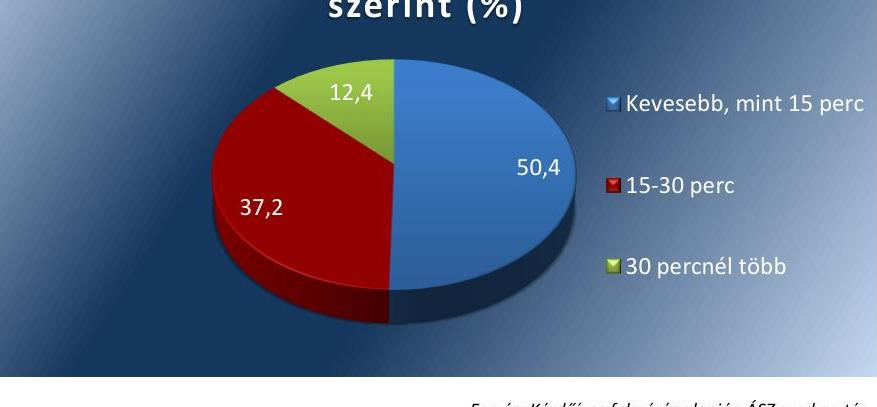

A mentő kiérkezésétől a sürgősségi betegellátóba történő megérkezésig eltelt idő az esetek 21,3\%-ában hosszabb volt, mint 30 perc, míg 47,2\%ában ezen időtartam 15 és 30 perc között alakult.

---

### 5.3. számú megállapítás

Az igénybevevők elégedettek voltak a sürgősségi betegellátókban dolgozók hozzáállásával. Az esetek 40,1\%-ában 30 percnél hoszszabb idő telt el a betegek sürgősség szerinti besorolásáig. A betegbesorolás eredményéről és a várakozási időről jellemzően nem kaptak tájékoztatást.

A sürgősségi betegellátóban az ellátás nyújtása a válaszadók 57,4\%-a szerint elfogadható, 17,6\%-a szerint inkább elfogadható módon történt. A sürgősségi ellátást igénybevevők véleményét az ellátás módjának elfogadhatóságáról a 2. ábra szemlélteti.
2. ábra

A sürgősségi ellátás nyújtása elfogadható módon történt-e? (\%)
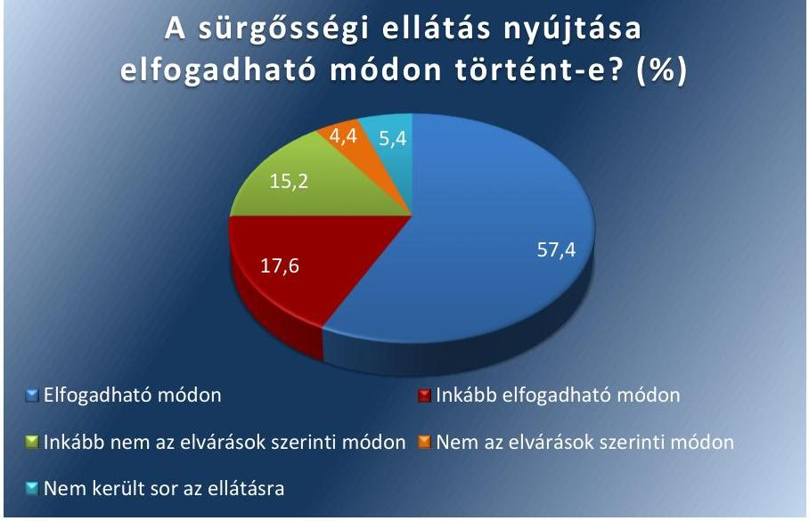

A sürgősségi betegellátóban a válaszadók 47,3\%-a szerint történt a panasza által indokolt időn belül az ellátás. A sürgősségi ellátást igénybevevők véleményét az ellátás elvárások szerinti időn belüli nyújtásáról a 3. ábra szemlélteti.
3. ábra

A sürgősségi ellátás nyújtása a panasza által indokolt időn belül történt-e? (\%)
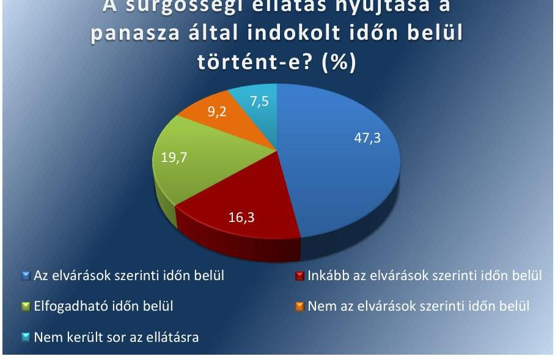

Forrás: Kérdölves felmérés alapján ÁSZ szerkesztés

---

A sürgősségi betegellátóba történő megérkezéstől a regisztrációig az esetek 27,3\%-ában 30 percnél hosszabb idő telt el, míg a válaszadók megítélése szerint az esetek 45,0\%-ában ez az idő 15 percnél rövidebb volt.

A sürgősségi ellátást igénybevevők 40,1\%-a szerint a betegbesorolás időtartam hosszabb volt 30 percnél, a válaszadók 33,8\%-a szerint történt meg 15 percen belül.

A sürgősségi betegellátóban történő regisztrációtól a vizsgálatok, a diagnosztizálás megkezdéséig eltelt idő a válaszadók megítélése szerint az esetek 54,7\%-ában meghaladta a 30 percet, ugyanakkor az esetek 21,1\%ában nem érte el a 15 percet.

A sürgősségi betegellátóban a panasz diagnosztizálásától a kezelés megkezdéséig eltelt idő a válaszadók szerint az esetek 40,8\%-ában 30 percnél hosszabb időt igényelt, míg a válaszadók 35,6\%-a szerint volt 15 percnél rövidebb.

A válaszadók 58,6\%-a szerint a sürgősségi ellátás hatásos és eredményes volt, míg 4,4\%-uk szerint a kezelés nem volt hatásos és eredményes, véleményük szerint állapotuk nem javult.

A sürgősségi ellátást végző orvosok hozzáállása a válaszadók 65,8\%-a szerint, a közremúködő egészségügyi szakdolgozók, ápolók hozzáállása 64,7\%-a szerint elfogadható volt.

A véleményfelmérés adatai arra a problémára hívják fel a figyelmet, hogy a sürgősségi ellátást igénybevevők szerint a sürgősségi betegellátó az esetek 68,8\%-ában nem adott tájékoztatást a sürgősségi betegellátó a betegkategóriába való besorolás eredményéről, valamint ennek jelentőségéről. A válaszadók 74,5\%-a szerint a sürgősségi betegellátó nem adott tájékoztatást a várakozási időről. Az Eütv. 13. § (2) bekezdés d) pontja előírja, hogy a betegnek joga van a vizsgálatok, beavatkozások elvégzésének tervezett időpontjáról szóló részletes tájékoztatáshoz.

---

# JAVASLATOK 

Az ÁSZ tv. 33. § (1) bekezdésében foglaltak értelmében az ellenőrzött szervezet vezetője köteles a jelentésben foglalt megállapításokhoz kapcsolódó intézkedési tervet összeállítani és azt a jelentés kézhezvételétől számított 30 napon belül az ÁSZ részére megküldeni. Amennyiben az ellenőrzött szervezet vezetője nem küldi meg határidőben az intézkedési tervet, vagy továbbra sem elfogadható intézkedési tervet küld, az Állami Számvevőszék elnöke az ÁSZ tv. 33. § (3) bekezdése a) és b) pontjaiban foglaltakat érvényesítheti.

## az egészségügyért felelős miniszternek

1. Intézkedjen a sürgősségi betegellátásra vonatkozó célokhoz kapcsolódó beavatkozási területek és eszközök, a szükséges beavatkozások személyi, tárgyi és szakmai feltételeinek, valamint a nyomon követés és az értékelés rendszerének pontos meghatározásáról, illetve határozza meg az értékelés módszerét és a felhasználandó mutatók körét.
(1.1. sz. megállapítás 3. bekezdése és a 1.2. sz. megállapítás 2. bekezdése alapján)
2. Intézkedjen a sürgősségi betegellátás rendszerére vonatkozó stratégiai célkitűzések megvalósításának nyomon követéséről, valamint a beszámolási kötelezettségek teljesítéséről.
(2.1. sz. megállapítás 2-3. bekezdése alapján)
3. Intézkedjen annak érdekében, hogy a sürgősségi betegellátás személyi és tárgyi minimumfeltételeinek rendelkezésre állásának ellenőrzése elöre meghatározott ütemezés szerinti ellenőrzése történjen meg.
(2.3. sz. megállapítás 2. bekezdése alapján)
4. Intézkedjen a beteg állapotát veszélyeztető megbetegedés, illetve állapotromlásának időben történő megelőzése, illetve ellátása érdekében a sürgősségi betegellátó osztályokon a betegosztályozási rendszer egységes elvek szerinti előírás: szakmai protokoll, illetve irányelv elkészítéséről.
(3.2. sz. megállapítás 1. és 2. bekezdése alapján)

---

# KÖVETKEZTETÉSEK 

## A jelentéstervezetben foglaltak alapján az egészségügyért felelős miniszter figyelmébe ajánljuk az alábbiakat*

1. A sürgősségi betegellátás fejlesztési céljai megvalósulásának nyomon követése és értékelése érdekében szükséges, hogy az ágazati irányító megismerje az érintettektől (betegek, egészségügyi dolgozók stb.) érkező panaszokat és, kockázatjelzéseket.

Ennek érdekében indokolt, hogy az ágazati irányító számára az országosan felmerült panaszok alapján az OBDK által készített szakmai beszámoló, ellátási területekre bontva mutassa be az betegpanaszok gyakoriságát és típusát. Szintén indokolt, hogy az ágazati irányító indítson vizsgálati eljárást, illetve ismerje meg a másutt elvégzett vizsgálatok eredményeit a sürgősségi ellátással kapcsolatban megfogalmazott ellátási problémák kapcsán.
(2.2. sz. megállapítás 4. és 7. bekezdése alapján)

[^0]
[^0]:    * Az ÁSZ tv. 32. § (1) bekezdésében foglaltak értelmében az ÁSZ jelentés tartalmazza a feltárt tényeket, az ezeken alapuló megállapításokat, következtetéseket, amelyeknek a 24. § (1) d) pontja szerint okszerúnek és megalapozottnak kell lenniük.

---

.

---

# MELLÉKLETEK 

- I. SZ. MELLÉKLET: ÉRTELMEZŐ SZÓTÁR

Alapvető ellátások
„A" jelzésű feladatok
Betegelégedettség

CATI módszer

Egészségügyi
közszolgáltatásért
felelős szerv

Egészségügyi szolgáltatátás

Egészségügyi szolgáltató

Evalváció

Hospitális szakasz

Központi ügyelet

Minimumfeltételek

Azok az egészségügyi ellátások, amelyek mindenkit megilletnek az ellátásra való általános jogosultságtól (pl.: biztosítottság) függetlenül. Ilyen ellátások: életmentés, illetve a sürgős szükség miatt nyújtandó ellátások, illetve a járványügyi célból nyújtott ellátások.
A mentési feladatok esetében az azonnal végrehajtandó feladatok.
A betegek véleményét jelenti az egészségügyi ellátásról. (Egyes megközelítések szerint maga a minőség.) A betegek elégedettségét elsősorban az ellátás során szerzett pozitív és negatív élményeik befolyásolják, az egészségi állapotban bekövetkezett változást nem mindig tudják minősíteni.
Computer Assisted Telephone Interviewing - számítógéppel támogatott telefonos lekérdezés. Az adatfelvétel programozott kérdőív segítségével telefonon keresztül történik, amelynek során a kérdezőbiztos a válaszokat a számítógépes rendszerben azonnal rögzíti.
Az egészségügyi alapellátásért felelős települési önkormányzat, továbbá az egészségügyi szakellátásért felelős települési és megyei önkormányzat, illetőleg központi államigazgatási szerv, mint közfinanszírozott egészségügyi szolgáltató fenntartója. [Az egészségügyi szolgáltatás gyakorlásának általános feltételeiről, valamint a múködési engedélyezési eljárásról szóló 96/2003. (VII. 15.) Korm. rendelet 2. § (1) c)]

Az egészségügyi hatóság által kiadott múködési engedély birtokában végezhető egészségügyi tevékenységek összessége, amely az egyén egészségének megőrzése, továbbá a megbetegedések megelőzése, korai felismerése, megállapítása, gyógykezelése, életveszély elhárítása, a megbetegedés következtében kialakult állapot javítása vagy a további állapotromlás megelőzése céljából a beteg vizsgálatára és kezelésére, gondozására, ápolására, egészségügyi rehabilitációjára, a fájdalom és a szenvedés csökkentésére, továbbá a fentiek érdekében a beteg vizsgálati anyagainak feldolgozására irányul.
A tulajdoni formától, fenntartótól függetlenül minden, egészségügyi szolgáltatás nyújtására az egészségügyi hatóság által kiadott múködési engedély alapján jogosult jogi személy, jogi személyiség nélküli szervezet és természetes személy, aki a szolgáltatást saját nevében nyújtja.
A vonatkozó szakpolitika globális, rövid, valamint hosszú távú hatásának vizsgálata, továbbá az igénybe vevőknek a közszolgáltatásra vonatkozó tapasztalatai alapján, az elégedettségüknek a mérése.
Kórházi szakasz a sürgősségi betegellátásban, sürgősségi fogadóhelyen, sürgősségi osztályon, sürgősségi centrumban, vagy regionális sürgősségi centrumban.
Önálló egységként, vagy az OMSZ-szel együttműködő ügyeleti szolgálat, amely alkalmas arra, hogy a prehospitális sürgősségi alapellátásban résztvevő két szakterület (mentő és háziorvos) racionális együttmúködésben tudja a betegellátást biztosítani, több háziorvosi körzetet ellátva.
Azon követelmények összessége, amelyek az egészségügyi szolgáltatás teljesítése során a betegek, az ellátást nyújtó személyzet és a környezet biztonsága szempontjából elengedhetetlenek (részletes követelményeit az egészségügyi szolgáltatások nyújtásához szükséges szakmai minimumfeltételekről szóló 60/2003. (X. 20.) ESzCsM rendelet tartalmazza).

---

| Prehospitális szakasz | Kórház előtti szakasz a sürgősségi betegellátás rendszerében. Két eleme: a házi-   orvosi ügyeleti ellátás és a mentés. |
| :--: | :--: |
| Progresszivitás | A betegségek gyakorisági eloszlásából fakadó ellátórendszeri sajátosság, miszerint   a gyakoribb - és többnyire egyszerűbb - eseteket az ellátórendszer alacsonyabb   szinten szervezett (a beteg lakóhelyéhez közeli) egységek látják el. |
| SO1 típusú sürgősségi osztály | Olyan betegellátó egység, amely az idegsebészet és teljes körű traumatológiai el-   látás biztosítása mellett köteles minden, a sürgősségi betegellátásához szükséges   szakmai és diagnosztikai feltételt teljes körűen és folyamatosan biztosítani. Döntő   többségében a betegek végleges ellátását végzi azokban az esetekben, amelyek-   ben nem rendelkezik a betegek ellátására alkalmas szakmai egységgel, a beteget   a sürgősségi centrumba irányítja. |
| SO2 típusú sürgősségi osztály | Olyan területi kórházakban múködő betegellátó egység, amely a végtag-trauma-   tológiai ellátás biztosítása mellett három alapszakma (sebészet, szülészet-nőgyó-   gyászat, kardiológiai belgyógyászat), valamint röntgen- és labordiagnosztika folya-   matos biztosítására kötelezett. Az ellátás tekintetében részben végleges ellátást   végez, a beteget hazabocsáthatja, részben az osztályozás után saját kórházának   osztályán helyezi el, vagy állapotstabilizálás után továbbküldi. |
| Speciális sürgősségi centrum | Egy-egy régió ellátására az egyetemek, egyes országos intézetek, illetve speciális   kórházi osztállyal rendelkező egészségügyi szolgáltatók múködtetik a jogszabály-   ban meghatározott szakterületeken (szívsebészet, toxikológia, égéssebészet,   idegsebészet, infektológia). |
| Sürgősségi állapot | Olyan kórfolyamat, ahol a mérhető idő és a kimeneti lehetőség fordítottan ará-   nyos - a megkezdett ellátás függvényében. |
| Sürgősségi betegellátók | A fekvőbeteg-ellátáson kívül szervezett (alapellátási) ügyelet. A fekvőbeteg-ellátás   keretében beteg-fogadóhely, sürgősségi betegellátó osztály (I., II., III. progresszi-   vitási szinten), ügyeleti szolgálat. A munkavégzés helyszínén kívül szervezett ké-   szenléti szolgálat. |
| Sürgősségi betegellátó-rendszer | Az egészségügyi ellátórendszer azon szervezeti egységeiből áll, amelyeket a beteg   heveny tünete, hirtelen fellépő fájdalma, illetve egészségromlása miatt távközlési   eszköz útján vagy személyesen felkereshet, és ott elsődleges ellátásban részesül,   ideértve, ha az alapellátási ügyelet az otthonában, illetve a tartózkodási helyén   látja el a beteget. A sürgősségi betegellátó-rendszer fekvőbeteg-ellátáson kívül   szervezett formája a mentés is. |
| Sürgősségi centrum | Olyan SO1 funkcióval rendelkező intézmény, amely azokban a kórházakban sze-   vezendő, ahol az SO1-el rendelkező kórházak szakterületein túl létezik idegsebé-   szeti, invazív kardiológiai, mellkas sebészeti ellátás. (Hazánkban szakmai, szakértői   vélemény alapján 11 sürgősségi centrum szervezése indokolt.) |
| Sürgősségi ellátás | Olyan ellátás, mely előre nem tervezhető, nem ütemezhető, azaz az ellátás elma-   radása, az ütemezett rendben történő nyújtása az egészségi állapot kockázatát   (állapotromlás, maradandó egészségkárosodás vagy tűrhetetlen fájdalom)   okozza. |
| Sürgősségi fogadóhely (SF) | Heveny tünetek vagy sürgősségi ellátást igénylő kórkép miatt jelentkező vagy be-   szállított beteg fogadására kialakított helyiség, vagy kórházi részleg. A progresszi-   vitási szint alapján a kellő diagnosztikai és konzíliumi háttérrel rendelkező (ezt ké-   szenléti ügyelet formájában is lehet biztosítani) részleg, amely az újraélesztési fel-   adatok elvégzésére képes bármely napszakban. A fogadóhelyet mentővel jól meg-   közelítő helyen, a diagnosztikai osztályok közelében kell kialakítani. |
| Sürgős szükség | Az egészségi állapotban bekövetkezett olyan változás, amelynek következtében   azonnali egészségügyi ellátás hiányában a beteg közvetlen életveszélybe kerülne,   illetve súlyos vagy maradandó egészségkárosodást szenvedne. (Forrás: Eütv. 3. §   i) pont, 7. §) |

---

Triázs (osztályozás)

A betegek állapotuk szerint osztályzásra kerülnek, egy arra kiképzett személy (triázs nővér, triázs orvos) részéről. Alkalmazási területei: segélyhívás fogadásakor, a beteg mellett a helyszínen, valamint a sürgősségi osztályon. A hospitális kategóriák: 5 percen belüli (újraélesztendő - azonnal), 15 percen belüli (kritikus), 30 percen belüli (sürgős), 60 percen belüli (kevésbé sürgős) és 120 percen belüli (halasztható) ellátást igénylők.

---

A Semmelweis Terv F jelű programterv tartalmazza a mentés, a prehospitális „egy kapu" ellátási modell, orvosi ügyelet és a kórházi sürgősségi ellátás fejlesztése érdekében kitűzött célokat. E célok részletesen a következők:

# 1. MENTÉS fejlesztése 

a. prehospitalis ellátásban résztvevők szakmaiságának fejlesztése - oktatás fejlesztése (4. pont)
Cél: a képzésekhez szükséges megfelelően felszerelt oktató központok megyénkénti létrehozása, továbbá ki kell alakítani és fel kell készíteni egy, a munkaidejük jelentős részében oktatói tevékenységgel foglalkozó - orvosokból, mentőtisztekből, szakképzett mentőápolókból álló - csapatot.
Indokoltság: a magas színvonalú mentőellátás biztosításához fontos az intézményi szinten bevezetendő professzionális képzés. A különböző munkaköri csoportok folyamatos, kompetencia központú képzésének érdekében fejleszteni kell az OMSZ oktatási tevékenységét.
b. szakmai minőség fejlesztése (4. pont)

Cél: szakmai minőségfejlesztési rendszer és teljesítményarányos motivációs rendszer megalkotása.
Indokoltság: az ellátás szakmai minőségét a szakmai minőségfejlesztési rendszer működtetése, és a teljesítményarányos motivációs rendszer megalkotása biztosítja.
c. mentésirányítás fejlesztése (5. pont)

Cél: Az időben meghozott megfelelő döntéseket elektronikus döntéstámogató algoritmusok, és térinformatikai-logisztikai rendszerek alkalmazása támogassák a közeljövőben.
Indokoltság: döntéstámogató rendszer használatával a költségek csökkenthetők, mert a magas költségű egységek bevetésének indokoltsága emelkedik, csökkennek a felesleges indítások. Ezáltal a kapacitás indokolt kihasználtsága emelkedik: kevesebb magas kompetenciájú egység is elegendő az összes felmerülő indokolt eset ellátásához. A „hasznos" munkaidő növekszik.
d. mentőállomás-hálózat fejlesztése (6. pont)

Cél: 15 percen belüli kiérkezési lehetőségének arányának 90\% fölé emelése.
Indokoltság: az OMSZ mentőállomás-hálózatát a 15 percen belüli kiérkezési lehetőség arányának 90\% fölé emelése érdekében bővíteni szükséges, ugyanis önmagukban a technikai feltételek (korszerű mentőjárművek, mentésirányítási döntéstámogató rendszer, járműfelügyeleti rendszer) javítása illetve a szervezési változtatások (mentőállomások ellátási területének módosítása) a fizikai korlátok miatt erre nem elegendőek.
e. OMSZ szakmai adatbázis fejlesztése (8. pont)

Cél: a „real-time", vagy az ellátást közvetlenül követő, formalizált adattartalmú elektronikus bevitel és rögzítés, az adatbázisban történő keresés/szűrés lehetőségeinek bővítése. Végcél az információk rögzítésének és kezelésének ágazati szintű egységes kezelése.
Indokoltság: az OMSZ szakmai adatbázisa az egész ország mentési szükségletének térképe, amelynek ismerete elengedhetetlen az egész ellátórendszer fejlesztéséhez.
f. szervezet- és szolgáltatásirányítás (döntéstámogató rendszer) fejlesztése (10. pont)

Cél: a megfelelő időben nyújtott ellátás okozta kedvező következmények pozitív társadalmi hatásainak növelése, ezáltal az alapvető társadalmi biztonság erősödése, a versenyképesség növekedése.
Indokoltság: az OMSZ szervezet- és szolgáltatás-irányítását végző menedzsment számára a megalapozott döntések meghozatalához nélkülözhetetlen a mentés- és vállaltirányítási, valamint minőségirányítási rendszerek bevezetése, a belőlük nyerhető adatok, információk.

---

g. mentőorvosok helyének és szerepének megtartása (12. pont)

Cél: a mentőorvosok bevetését - strukturális, illetve mentésirányítási átalakításokkal - azokra a betegcsoportokra kell összpontosítani, akiknél ez a járulékos haszon megalapozottan várható, továbbá a hazai mentőorvosok emberi erőforrás-krízise is megszüntethető, illetve enyhíthető.
Indokoltság: a korszerű mentésben a mentőorvosok bevetése meghatározott betegkörökben bizonyíthatóan járulékos hasznot eredményez az orvosok nélkül működő mentési rendszerekhez képest.

# 2. Prehospitális „egy kapu" ellátási modell, orvosi ügyelet fejlesztése 

a. háziorvosok sürgősségi oktatása (14. pont)

Cél: a háziorvosok sürgősségi oktatása szükséges a továbbképzési rendszeren belül.
Indokoltság: a földrajzi elhelyezkedés következtében azonban a háziorvos, mint aki helyben van és elérhető, gyakorta arra „kényszerül", hogy a sürgősségi ellátást megkezdje.
b. egységes prehospitalis sürgősségi rendszer kialakítása (15. pont)

Cél: egyetlen, ugyanakkor jól ismert, bárki számára megfelelően elérhető belépési kapu biztosítása az ellátási szükséglettel bíró betegek számára („prehospitalis egy kapu"-modell). A betegek a hirtelen jelentkező panaszok, riasztó tünetek kezdetét követően késedelem nélkül, közvetlenül a mentőszolgálatot értesítsék problémáikról.
Indokoltság: a betegek a hirtelen jelentkező panaszok, riasztó tünetek kezdetét követően késedelem nélkül, közvetlenül a mentőszolgálatot értesítsék a problémáikról.
c. az ügyeletek telephelyei és a mentőállomások elhelyezkedésének közelítése (17. pont)

Cél: az ügyeleti telephelyek és a mentőállomások közelítése egymáshoz.
Indokoltság: szakmailag is kívánatos, és egyben költségkímélő megoldás az ügyeleti telephelyek és a mentőállomások közelítése egymáshoz.
d. az orvosi ügyeleti szolgálatok folyamatos (az év minden napján 24 órában) történő müködésének megteremtése (18. pont)
Cél: az orvosi ügyeleti szolgálatok folyamatos működése.
Indokoltság: Az elérhetőség és a hatékonyság javítása.
e. egykapus hívásfogadási és irányítási lehetőség, az OMSZ-hez integrált diszpécserszolgálat létrehozása (18. pont)
Cél: egykapus hívásfogadási és irányítási lehetőség, az OMSZ-hez integrált diszpécserszolgálat létrehozása. Indokoltság: az elérhetőség és a hatékonyság javítása.
f. sürgősségi osztályok és alapellátási ügyeletek épületi integrációja (20. pont)

Cél: azon településeken, ahol van SBO, ott mindenképpen javasolt a legalább épületi integráció, amit az új SBOk befogadása során is figyelembe kell venni. Azokban a városokban, ahol SBO működik, az ott dolgozók forgó rendszerú foglalkoztatása kívánatos és célszerű a sürgősségi ellátás különböző elemei (SBO, mentők, „ügyelet") között.
Indokoltság: elérhetőség és hatékonyság növelése.
g. az orvosi ügyeletek országosan egységes adatbázisának kialakítása (21. pont)

Cél: a beteg biztonságát fokozandó, a különböző szereplők (alapellátás, ügyelet, OMSZ, kórház) közös informatikai rendszerének kiépülése szükséges.
Indokoltság: megfelelő kapcsolódási felület kialakításával lehetőség nyílik az ellátott, illetve gyógyintézetbe beszállított betegek releváns adatainak (pl. személyi adatok, a betegellátás adatai, a mért, monitorozott élettani paraméterek, beavatkozások stb.) a gyógyintézeti fogadóhelyen az intézményi betegadatbázisban való felhasználásra történő átadására.

---

# 3. Kórházi sürgősségi ellátás fejlesztése 

a. a kórházi sürgősségi ellátás szervezésének alapelveit érintő tervek (23-25. pont)
Cél: A kórházi sürgősségi ellátást két alapelv mentén kell megszervezni:
(1) akut beteget ellátó kórház nem működhet megfelelő sürgősségi betegellátó osztály (SBO) nélkül;
(2) sürgősségi ellátásra szoruló beteg csak megfelelő, akut betegek ellátására felkészült, SBO-val rendelkező kórházba kerülhet (2012-14.).
Indokoltság: az oxyológia-sürgősségi orvostan szemléletében hangsúlyos az ellátási rendszer idő-dependens, allokatív és integratív eleme, melynek kórházi része a sürgősségi osztályokon érvényesül.
b. a budapesti akut kórházi ellátás rendszerének átalakítása (32. pont)
Cél: a fővárosban csak néhány, akut ellátást biztosító központ létrehozása indokolt.
Indokoltság: a jelenlegi akut kórházi ellátás rendszere szinte áttekinthetetlen, ráadásul sok beteg nem, vagy csak kerülőutakkal, késve kerül a betegségének, állapotának megfelelő szintű ellátóhelyre.
c. a betegszállítás és az irányítási rendszer átalakítása (34-35. pont)

Cél: a betegszállítási rendszer transzparenciájának kialakítása és az országosan egységes irányítási rendszer megteremtése.
Indokoltság: a betegszállítók országosan egységes irányítása nem megoldott. Megfontolandó megoldás az OMSZ mentésirányítását és a betegszállításokat magába foglaló integrált irányítási rendszer.

---

## III. SZ. MELÉKLET: A VÉSZHELYZETI BETEGELLÁTÁSSAL KAPCSOLATOS KÉRDŐÍVES FELMÉRÉS VÁLASZAI

### A VÉSZHELYZETI BETEGELLÁTÁSSAL VALÓ ELÉGEDETTSÉG

#### 2018. NOVEMBER

### A VÁLASZOK ÖSSZEFOGLALÓ BEMUTATÁSA

- A válaszadék szerint elsősorban az életet veszélyeztető vagy mandandó egészségkárosodás vesztésével járó állapot/helyzet tartozik a sürgősségi betegelődéshez. Ezt 86 százalékuk említette, hogy a sürgősségi betegelődési hatáskíne alá tartozik. A felméen jelentősülő panaszok, rászóró, de életet nem veszélyeztető panaszok ellátása a válaszadék 58,3 százalékuk szerint tartozik a sürgősségi helyzetek közé, míg a régóta tartó káros állapotok ellátását csak 16,7 százalékuk semthe ide.

- A válaszadékat arról is megkérdezték, hogy a sürgősségi ellátások nyújtásában kik, mely egészségügyi szolgáltatók vesznek részt. A legítöbben a kórházi sürgősségi betegelődési osztássokat említettek, ezt minden második válaszadó időre a szolgáltató-csaporítja semda. A mentőszolgálatot a válaszadék 45,7, a sürgősségi betegelődési centrumokat 50,7, az ügyekben ellátó kórházi osztályokat 30,7 százalékuk említettek. A háziorvosi ügyeket a megkérdezettek körülbelül törölte 113 százalékul, a háziorvos pedig 12 százalékuk szerint szúzt részt a sürgősségi ellátásban. A megkérdezettek több mint harmaza (36 százalékul válaszolta, hogy mindegyik fent felsorolt szolgáltató részt vesz az ellátásban.

- A sürgősségi ellátást igénybe veszik 60,7 százalékuk felméen jelentőségű, rászóró panasz, 36,3 százalékuk baleseti sebesülés miatt került a sürgősségi betegelődéshez, míg 9,7 százalékuk háziorvostól, 7,3 százalékuk háziorvosi ügyeketről, 6 százalékuk pedig szakrendelésről került tovább az ellátórendszerbe.

### A VÁLASZOK ÖSSZEFOGLALÓ BEMUTATÁSA

- A válaszadék szerint elsősorban az életet veszélyeztető vagy mandandó egészségkárosodás vesztésével járó állapot/helyzet tartozik a sürgősségi betegelődéshez. Ezt 86 százalékuk említette, hogy a sürgősségi betegelődési hatáskíne alá tartozik. A felméen jelentősülő panaszok, rászóró, de életet nem veszélyeztető panaszok ellátása a válaszadék 58,3 százalékuk szerint tartozik a sürgősségi helyzetek közé, míg a régóta tartó káros állapotok ellátását csak 16,7 százalékuk semthe ide.

- A válaszadékat arról is megkérdezték, hogy a sürgősségi ellátások nyújtásában kik, mely egészségügyi szolgáltatók vesznek részt. A legítöbben a kórházi sürgősségi betegelődési osztássokat említettek, ezt minden második válaszadó időre a szolgáltató-csaporítja semda. A mentőszolgálatot a válaszadék 45,7, a sürgősségi betegelődési centrumokat 50,7, az ügyekben ellátó kórházi osztályokat 30,7 százalékuk említettek. A háziorvosi ügyeket a megkérdezettek körülbelül törölte 113 százalékul, a háziorvos pedig 12 százalékuk szerint szúzt részt a sürgősségi ellátásban. A megkérdezettek több mint harmaza (36 százalékul válaszolta, hogy mindegyik fent felsorolt szolgáltató részt vesz az ellátásban.

- A sürgősségi ellátáshoz való bekerülés módjai közül a legítöbben a mentőszolgálat által beszállítást ismerik, ezt 91 százalékuk említette. A válaszadék 70,3 százalékuk szerint mértetnek be személyesen, mikor annak szükségét tériik, míg a háziorvos vagy a háziorvosi ügyeket beutalóját 55,7 százalékuk jelölte meg.

### A VÁLASZOK ÖSSZEFOGLALÓ BEMUTATÁSA

- A válaszadék szerint elsősorban az életet veszélyeztető vagy mandandó egészségkárosodás vesztésével járó állapot/helyzet tartozik a sürgősségi betegelődéshez. Ezt 86 százalékuk említette, hogy a sürgősségi betegelődési hatáskíne alá tartozik. A felméen jelentősülő panaszok, rászóró, de életet nem veszélyeztető panaszok ellátása a válaszadék 58,3 százalékuk szerint tartozik a sürgősségi helyzetek közé, míg a régóta tartó káros állapotok ellátását csak 16,7 százalékuk semthe ide.

- A válaszadékat arról is megkérdezték, hogy a sürgősségi ellátások nyújtásában kik, mely egészségügyi szolgáltatók vesznek részt. A legítöbben a kórházi sürgősségi betegelődési osztássokat említettek, ezt minden második válaszadó időre a szolgáltató-csaporítja semda. A mentőszolgálatot a válaszadék 45,7, a sürgősségi betegelődési centrumokat 50,7, az ügyekben ellátó kórházi osztályokat 30,7 százalékuk említettek. A háziorvosi ügyeket a megkérdezettek körülbelül törölte 113 százalékul, a háziorvos pedig 12 százalékuk szerint szúzt részt a sürgősségi ellátásban. A megkérdezettek több mint harmaza (36 százalékul válaszolta, hogy mindegyik fent felsorolt szolgáltató részt vesz az ellátásban.

- A sürgősségi ellátáshoz való bekerülés módjai közül a legítöbben a mentőszolgálat által beszállítást ismerik, ezt 91 százalékuk említette. A válaszadék 70,3 százalékuk szerint mértetnek be személyesen, mikor annak szükségét tériik, míg a háziorvos vagy a háziorvosi ügyeket beutalóját 55,7 százalékuk jelölte meg.

### A VÁLASZOK ÖSSZEFOGLALÓ BEMUTATÁSA

- A betegelődésba való megkészítésről az adatfelvételig, regisztrációig szintén viszonylag gurnan jutottak a páciennek, 45,5 százalékuk 15 percen belül, 29,7 százalékuk 15-30 percen belül a regisztrációhoz került, míg 30 percenit többet 26,3 százalékuknak kellett várnia.

- A beteg beosztására már közel tovább kellett várni, ez a válaszadék 30,3 százalékuk esetén történő meg 15 percen belül, 23,3 százalékuk 15-30 percen várt rá, míg 30 százalékuk (fehér a többség) 30 percenit többet várakozott a beosztására.

- Arról, hogy mely kategóriába sorolták a beteget, és hogy ez mit jelent a számára csupán a sürgősségi betegelődést igénybe veszi válaszadék 28 százalékát tájékoztatták, 61,7 százalékát nem.

- Arról, hogy a beosztás mennyi várakozás időt jelent a válaszadék 24 százalékja kapott tájékoztatást.

- A betegetőátában való regisztrációitól a vizsgálatok megkezdéségi hosszabb várakozási idő jellemző, a válaszadék több mint fele (52,7 százalékú) 30 percenit többet várt a vizsgálatra, 25,5 százalékuk 15-30 perc alatt jutott el a dágnosztózásáig, míg 15 percen belül titolák jutott a vizsgálóba.

### A VÁLASZOK ÖSSZEFOGLALÓ BEMUTATÁSA

- A panasz dágnosztózásáitól a kezelés megkezdéséig minden harmadik válaszadó esetén csupán kevesebb, mint 10 perc tett el, 21,3 százalékuknál 15-30, 38,7 százalékuknál pedig 30 percenit több idő tett el a kezelésig.

- A válaszadék 62,3 százalékú szerint ellátására a panaszának többnyire megfelelő idős belül került sor, e téren teljes mértékben 46,5 százalékuk volt elégedett, 19,3 százalékuk közepes, 26,5 százalékuk pedig kedvezőtlen értékleket adott e téren.

- A kapott ellátással a válaszadék közel házormegvede elégedett volt, 56,7 százalékuk teljes mértékben, 17,3 százalékuk pedig inkább elégedett, 15 százalékuk közepesen értékelte az ellátást, 9,6 százalékuk szerint azonban inkább vagy egyáltalán nem megfelelő módon került sor az ellátására.

- A kapott kezelés hatásosságával 79 százalékuk volt elégedett, 57,7 százalékuk teljes mértékben, 11,5 százalékuk közepesen hatásosnak, 8 százalékuk pedig kevésbé hatásosnak vagy határidőannak ítélte az ellátás módját.

- A sürgősségi ellátást végül orvosokkal kapcsolatban a legítöbben, a válaszadék 65 százalékja nem érzékelt problémái, szakmai hozzátértsüket és az állatok végzett vizsgálatokat 4-4 százalékuk kifogásolta, az állatok végzett kezeléssel, beavatkozásuk 5 százalékuknak volt problémája, míg valamilyen egyéb kifogásolni valót 21,7 százalékuk említett, de többek között az orvosítónyit, az ekkelt adódó hosszú várakozási időt és az orvos viselkedését említették.

---

## A VÁLASZOK ÖSSZEFOGLALÓ BEMUTATÁSA

- A sürgősségi ellátásban segédkező egészségügyi szakdolgozókkal/ápolókkal kapcsolatban még nagyobb volt az elégedettség, a válaszadok 68,7 százaléka szerint nem volt probléma velük az ellátás során. Szakmai hozzátérlésüket 5,5 az állatok végzett kezelést 2, az állatok végzett vizsgálatokat 3,3 százalékuk kifogásolta, míg egyéb problémát (például a hozzájállásokat, viselkedésüket, leterhetségüket) 21,5 százalék jelölte meg.
- A sürgősségi ellátást végző orvos(ok) hozzájálásával a válaszadók 64,7 százaléka nagymértékben, 19,5 százaléka pedig inkább elégedett volt, minden tizedik válaszadó közepén értékeire a hozzájálásokat, 5,7 százaléka pedig kedvezőtlen véleménnyel volt.
- A sürgősségi ellátásában segédkező egészségügyi szakdolgozók/ápolók hozzájálása a válaszadók 63,7 százaléka szerint nagyon jó, 18 százalék szerint inkább jó, 32,5 százalék szerint közepén, 6,4 százalékuk szerint pedig inkább nem vagy egyáltalán nem volt elfogadható.
- A sürgősségi ellátás után zárójelentést a válaszadók 93,7 százaléka kapott, 4,5 százaléka azonban nem.
- Írásban betegségi panaszt a sürgősségi betegellátásban résztvevő válaszadók 1 százaléka tett. A panasztételetti beszámoló három válaszadóból ketten elégedettlenek voltak a panaszok kivizsgálásával kapcsolatban, míg egy válaszadó szerint megfelelően vizsgálták ki panaszti.

## A VÁLASZOK ÖSSZEFOGLALÓ BEMUTATÁSA

- A panaszai élő három válaszadóból egyikük szerint a sürgősségi ellátást biztosító szolgáltató nem megfelelő módon kezelte a panaszát, míg ketten elégedettek voltak a szolgáltató panaszkezelésével.
- Összességében a sürgősségi betegellátás színvonalát az azzal kapcsolatban személyes tapasztalatral rendelkező válaszadók kétharmada pozitívan értékeire, 57,7 százalékuk teljes mértékben, 29 százalékuk pedig inkább elégedett e téren, a válaszadók 24,7 százaléka közepén értékeire, 6,5 százaléka inkább, 2,5 százalékuk pedig teljes mértékben elégedetlen a sürgősségi ellátás színvonalát érintően.

## VÉSZHELYZETI BETEGELLÁTÁS MEGÍTÉLÉSE

Véleménye szerint milyen egészségügyi helyzetek tartoznak a vészhelyzeti (sürgősségi) betegellátáshoz? (\%)

|  Az életet veszélyezteti, vagy maradandó egészségkárosodás veszélyével járó állapot csereszefi ellátása |  |  |  |  |  |  |  |  |  |  |  |  |  |  |  |  |  |  |  |  |  |  |  |  |  |  |  |  |  |  |  |  |  |  |  |  |  |  |  |  |  |  |  |  |  |  |  |  |  |  |  |  |  |  |  |  |  |  |  |  |  |  |  |  |  |  |  |  |  |  |  |  |  |  |  |  |  |  |  |  |  |  |  |  |  |  |  |  |  |  |  |  |  |  |  |  |  |  |  |  | 

---

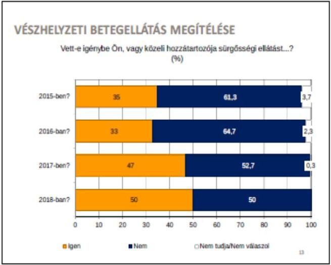

### VÉSZHELYZETI BETEGELLÁTÁS MEGÍTÉLÉSE

#### Kálik végezték a sürgősségi ellátást? (%)

|  Kórházi sürgősségi betegellátó osztály | 68 | 90  |
| --- | --- | --- |
|  Mertőszolgálat | 34,9 | 79,8  |
|  Ügyelelet ellátó kórházi osztály (pl.: szülészet, szemközel) | 35 | 78  |
|  Sürgősségi betegellátó centrum | 35,4 | 79,8  |
|  Háziovos | 33 | 66  |
|  Szakrendelés (SZTK) | 8,7 | 90,8  |
|  Háziovosi ügyelet | 8,7 | 90,8  |
|  Nem tudja/nem válaszol | 0 | 90,8  |
|  0 | 10 | 20  |
|  0 | 10 | 20  |
|  0 | 10 | 20  |
|  0 | 10 | 20  |

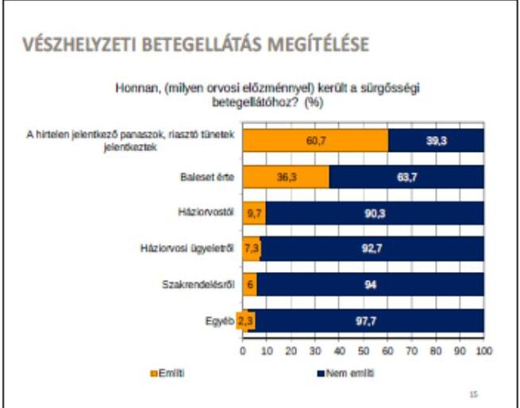

### VÉSZHELYZETI BETEGELLÁTÁS MEGÍTÉLÉSE

#### Hogyan került a sürgősségi betegellátóhoz? - Baleset érte (Azok körében, akik baleset miatt kerültek a sürgősségi betegellátóhoz, n=109) (%)

|  Mertőszolgálat segítségével | 31,2  |
| --- | --- |
|  Nem a mertőszolgálat (génybevételével) | 58,8  |
|  0 | 10  |
|  0 | 10  |

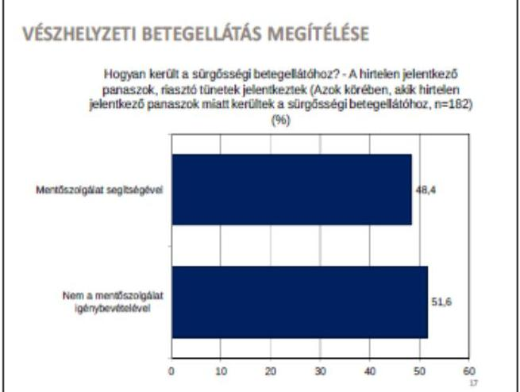

### VÉSZHELYZETI BETEGELLÁTÁS MEGÍTÉLÉSE

#### Hogyan került a sürgősségi betegellátóhoz? - Háziovostól (Azok körében, akik a háziovostól kerültek a sürgősségi betegellátóhoz, n=29) (%)

|  Mertőszolgálat segítségével | 41,4  |
| --- | --- |
|  Nem a mertőszolgálat (génybevételével) | 51,6  |
|  0 | 10  |
|  0 | 10  |

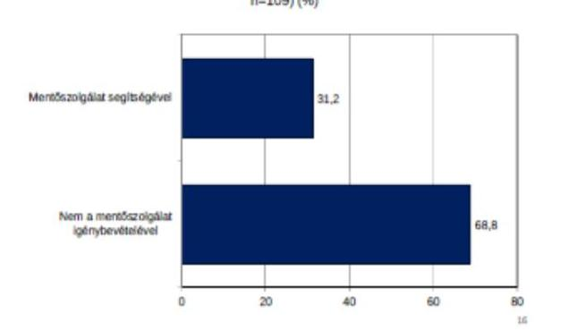

### VÉSZHELYZETI BETEGELLÁTÁS MEGÍTÉLÉSE

#### Hogyan került a sürgősségi betegellátóhoz? - Háziovostól (Azok körében, akik a háziovostól kerültek a sürgősségi betegellátóhoz, n=29) (%)

|  Mertőszolgálat segítségével | 41,4  |
| --- | --- |
|  Nem a mertőszolgálat (génybevételével) | 51,6  |
|  0 | 10  |
|  0 | 10  |

---

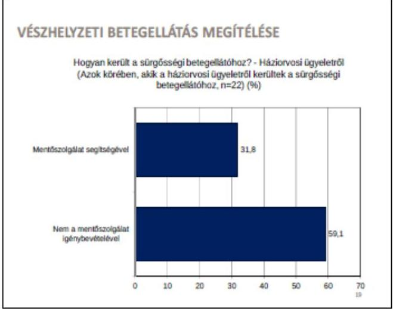

### VÉSZHELYZETI BETEGELLÁTÁS MEGÍTÉLÉSE

Hogyan került a sürgősségi betegellátóhoz? - Házinovó úgyeletről (Azok körében, akik a házinovó úgyeletről kerültek a sürgősségi betegellátóhoz, n=22) (%)

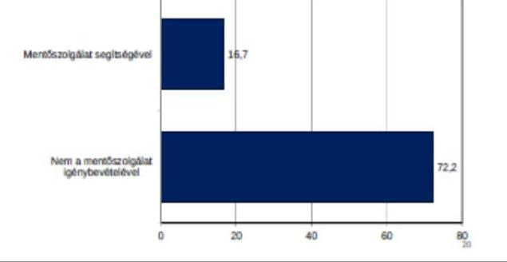

### VÉSZHELYZETI BETEGELLÁTÁS MEGÍTÉLÉSE

Hogyan került a sürgősségi betegellátóhoz? - Szakinnóelőstről (Azok körében, akik szakinnóelőstről kerültek a sürgősségi betegellátóhoz, n=18) (%)

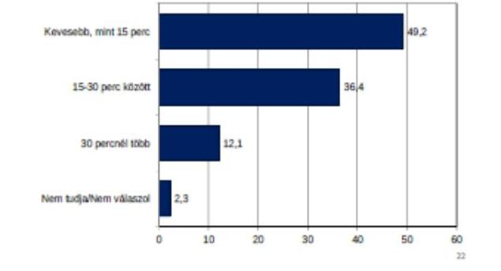

### VÉSZHELYZETI BETEGELLÁTÁS MEGÍTÉLÉSE

Hogyan került a sürgősségi betegellátóhoz? - Egyéb (Azok körében, akik valamilyen egyéb orvosi előzménnyel kerültek a sürgősségi betegellátóhoz, n=7) (%)

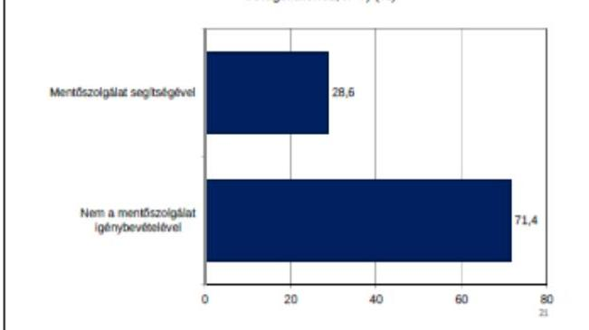

### VÉSZHELYZETI BETEGELLÁTÁS MEGÍTÉLÉSE

Megítélése szerint mennyi idő tett el a mentőszolgálat értesítéséről annak kérésejével (Azok körében, akiket a mentőszolgálat szállított a sürgősségi betegellátóhoz, n=132) (%)

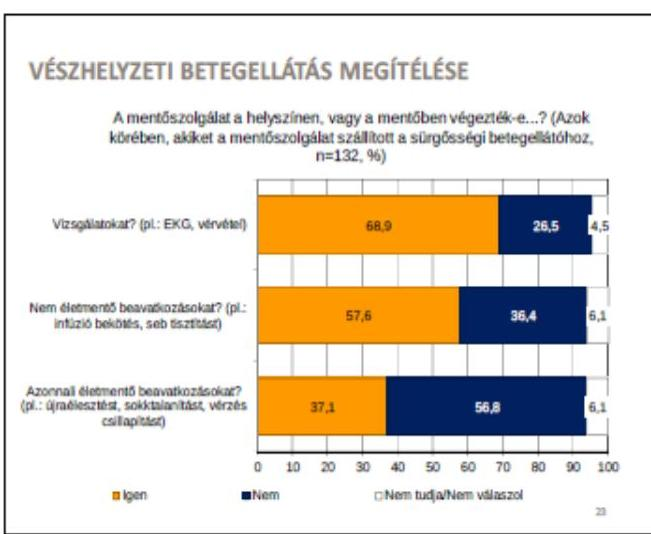

### VÉSZHELYZETI BETEGELLÁTÁS MEGÍTÉLÉSE

A mentőszolgálat a helyszínen, vagy a mentőben végezték-e...? (Azok körében, akiket a mentőszolgálat szállított a sürgősségi betegellátóhoz, n=132, %)

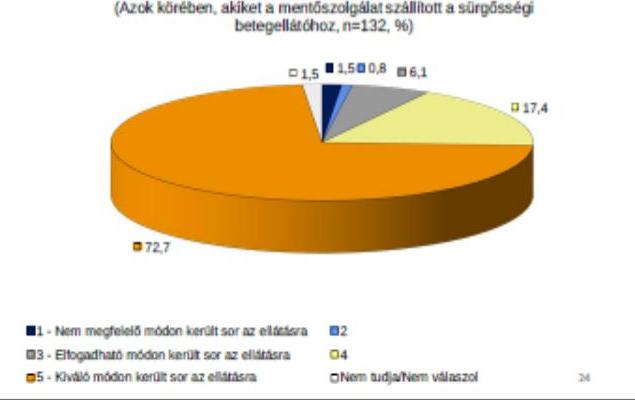

### VÉSZHELYZETI BETEGELLÁTÁS MEGÍTÉLÉSE

Elégedett volt-e a mentőszolgálat által végzett sürgősségi ellátással? (Azok körében, akiket a mentőszolgálat szállított a sürgősségi betegellátóhoz, n=132, %)

|  Végélet | 0 | 10 | 20 | 30 | 40 | 50 | 60 | 70 | 80 | 90 | 100  |
| --- | --- | --- | --- | --- | --- | --- | --- | --- | --- | --- | --- |
|  0 | 12.7 | 11.8 | 12.8 | 12.9 | 12.8 | 12.9 | 12.9 | 12.9 | 12.9 | 12.9 | 12.9  |
|  1 | 12.7 | 12.8 | 12.9 | 12.9 | 12.9 | 12.9 | 12.9 | 12.9 | 12.9 | 12.9 | 12.9  |
|  2 | 12.7 | 12.8 | 12.9 | 12.9 | 12.9 | 12.9 | 12.9 | 12.9 | 12.9 | 12.9 | 12.9  |
|  3 | 12.7 | 12.8 | 12.9 | 12.9 | 12.9 | 12.9 | 12.9 | 12.9 | 12.9 | 12.9 | 12.9  |
|  4 | 12.7 | 12.8 | 12.9 | 12.9 | 12.9 | 12.9 | 12.9 | 12.9 | 12.9 | 12.9 | 12.9  |
|  5 | 12.7 | 12.8 | 12.9 | 12.9 | 12.9 | 12.9 | 12.9 | 12.9 | 12.9 | 12.9 | 12.9  |
|  6 | 12.7 | 12.8 | 12.9 | 12.9 | 12.9 | 12.9 | 12.9 | 12.9 | 12.9 | 12.9 | 12.9  |
|  7 | 12.7 | 12.8 | 12.9 | 12.9 | 12.9 | 12.9 | 12.9 | 12.9 | 12.9 | 12.9 | 12.9  |
|  8 | 12.7 | 12.8 | 12.9 | 12.9 | 12.9 | 12.9 | 12.9 | 12.9 | 12.9 | 12.9 | 12.9  |
|  9 | 12.7 | 12.8 | 12.9 | 12.9 | 12.9 | 12.9 | 12.9 | 12.9 | 12.9 | 12.9 | 12.9  |
|  10 | 12.7 | 12.8 | 12.9 | 12.9 | 12.9 | 12.9 | 12.9 | 12.9 | 12.9 | 12.9 | 12.9  |
|  11 | 12.7 | 12.8 | 12.9 | 12.9 | 12.9 | 12.9 | 12.9 | 12.9 | 12.9 | 12.9 | 12.9  |
|  12 | 12.7 | 12.8 | 12.9 | 12.9 | 12.9 | 12.9 | 12.9 | 12.9 | 12.9 | 12.9 | 12.9  |
|  13 | 12.7 | 12.8 | 12.9 | 12.9 | 12.9 | 12.9 | 12.9 | 12.9 | 12.9 | 12.9 | 12.9  |
|  14 | 12.7 | 12.8 | 12.9 | 12.9 | 12.9 | 12.9 | 12.9 | 12.9 | 12.9 | 12.9 | 12.9  |
|  15 | 12.7 | 12.8 | 12.9 | 12.9 | 12.9 | 12.9 | 12.9 | 12.9 | 12.9 | 12.9 | 12.9  |
|  16 | 12.7 | 12.8 | 12.9 | 12.9 | 12.9 | 12.9 | 12.9 | 12.9 | 12.9 | 12.9 | 12.9  |
|  17 | 12.7 | 12.8 | 12.9 | 12.9 | 12.9 | 12.9 | 12.9 | 12.9 | 12.9 | 12.9 | 12.9  |
|  18 | 12.7 | 12.8 | 12.9 | 12.9 | 12.9 | 12.9 | 12.9 | 12.9 | 12.9 | 12.9 | 12.9  |
|  19 | 12.7 | 12.8 | 12.9 | 12.9 | 12.9 | 12.9 | 12.9 | 12.9 | 12.9 | 12.9 | 12.9  |
|  20 | 12.7 | 12.8 | 12.9 | 12.9 | 12.9 | 12.9 | 12.9 | 12.9 | 12.9 | 12.9 | 12.9  |
|  21 | 12.7 | 12.8 | 12.9 | 12.9 | 12.9 | 12.9 | 12.9 | 12.9 | 12.9 | 12.9 | 12.9  |
|  22 | 12.7 | 12.8 | 12.9 | 12.9 | 12.9 | 12.9 | 12.9 | 12.9 | 12.9 | 12.9 | 12.9  |
|  23 | 12.7 | 12.8 | 12.9 | 12.9 | 12.9 | 12.9 | 12.9 | 12.9 | 12.9 | 12.9 | 12.9  |
|  24 | 12.7 | 12.8 | 12.9 | 12.9 | 12.9 | 12.9 | 12.9 | 12.9 | 12.9 | 12.9 | 12.9  |
|  25 | 12.7 | 12.8 | 12.9 | 12.9 | 12.9 | 12.9 | 12.9 | 12.9 | 12.9 | 12.9 | 12.9  |
|  26 | 12.7 | 12.8 | 12.9 | 12.9 | 12.9 | 12.9 | 12.9 | 12.9 | 12.9 | 12.9 | 12.9  |
|  27 | 12.7 | 12.8 | 12.9 | 12.9 | 12.9 | 12.9 | 12.9 | 12.9 | 12.9 | 12.9 | 12.9  |
|  28 | 12.7 | 12.8 | 12.9 | 12.9 | 12.9 | 12.9 | 12.9 | 12.9 | 12.9 | 12.9 | 12.9  |
|  29 | 12.7 | 12.8 | 12.9 | 12.9 | 12.9 | 12.9 | 12.9 | 12.9 | 12.9 | 12.9 | 12.9  |
|  30 | 12.7 | 12.8 | 12.9 | 12.9 | 12.9 | 12.9 | 12.9 | 12.9 | 12.9 | 12.9 | 12.9  |
|  31 | 12.7 | 12.8 | 12.9 | 12.9 | 12.9 | 12.9 | 12.9 | 12.9 | 12.9 | 12.9 | 12.9  |
|  32 | 12.7 | 12.8 | 12.9 | 12.9 | 12.9 | 12.9 | 12.9 | 12.9 | 12.9 | 12.9 | 12.9  |
|  33 | 12.7 | 12.8 | 12.9 | 12.9 | 12.9 | 12.9 | 12.9 | 12.9 | 12.9 | 12.9 | 12.9  |
|  34 | 12.7 | 12.8 | 12.9 | 12.9 | 12.9 | 12.9 | 12.9 | 12.9 | 12.9 | 12.9 | 12.9  |
|  35 | 12.7 | 12.8 | 12.9 | 12.9 | 12.9 | 12.9 | 12.9 | 12.9 | 12.9 | 12.9 | 12.9  |
|  36 | 12.7 | 12.8 | 12.9 | 12.9 | 12.9 | 12.9 | 12.9 | 12.9 | 12.9 | 12.9 | 12.9  |
|  37 | 12.7 | 12.8 | 12.9 | 12.9 | 12.9 | 12.9 | 12.9 | 12.9 | 12.9 | 12.9 | 12.9  |
|  38 | 12.7 | 12.8 | 12.9 | 12.9 | 12.9 | 12.9 | 12.9 | 12.9 | 12.9 | 12.9 | 12.9  |
|  39 | 12.7 | 12.8 | 12.9 | 12.9 | 12.9 | 12.9 | 12.9 | 12.9 | 12.9 | 12.9 | 12.9  |
|  40 | 12.7 | 12.8 | 12.9 | 12.9 | 12.9 | 12.9 | 12.9 | 12.9 | 12.9 | 12.9 | 12.9  |
|  41 | 12.7 | 12.8 | 12.9 | 12.9 | 12.9 | 12.9 | 12.9 | 12.9 | 12.9 | 12.9 | 12.9  |
|  42 | 12.7 | 12.8 | 12.9 | 12.9 | 12.9 | 12.9 | 12.9 | 12.9 | 12.9 | 12.9 | 12.9  |
|  43 | 12.7 | 12.8 | 12.9 | 12.9 | 12.9 | 12.9 | 12.9 | 12.9 | 12.9 | 12.9 | 12.9  |
|  44 | 12.7 | 12.8 | 12.9 | 12.9 | 12.9 | 12.9 | 12.9 | 12.9 | 12.9 | 12.9 | 12.9  |
|  45 | 12.7 | 12.8 | 12.9 | 12.9 | 12.9 | 12.9 | 12.9 | 12.9 | 12.9 | 12.9 | 12.9  |
|  46 | 12.7 | 12.8 | 12.9 | 12.9 | 12.9 | 12.9 | 12.9 | 12.9 | 12.9 | 12.9 | 12.9  |
|  47 | 12.7 | 12.8 | 12.9 | 12.9 | 12.9 | 12.9 | 12.9 | 12.9 | 12.9 | 12.9 | 12.9  |
|  48 | 12.7 | 12.8 | 12.9 | 12.9 | 12.9 | 12.9 | 12.9 | 12.9 | 12.9 | 12.9 | 12.9  |
|  49 | 12.7 | 12.8 | 12.9 | 12.9 | 12.9 | 12.9 | 12.9 | 12.9 | 12.9 | 12.9 | 12.9  |
|  50 | 12.7 | 12.8 | 12.9 | 12.9 | 12.9 | 12.9 | 12.9 | 12.9 | 12.9 | 12.9 | 12.9  |
|  51 | 12.7 | 12.8 | 12.9 | 12.9 | 12.9 | 12.9 | 12.9 | 12.9 | 12.9 | 12.9 | 12.9  |
|  52 | 12.7 | 12.8 | 12.9 | 12.9 | 12.9 | 12.9 | 12.9 | 12.9 | 12.9 | 12.9 | 12.9  |
|  53 | 12.7 | 12.8 | 12.9 | 12.9 | 12.9 | 12.9 | 12.9 | 12.9 | 12.9 | 12.9 | 12.9  |
|  54 | 12.7 | 12.8 | 12.9 | 12.9 | 12.9 | 12.9 | 12.9 | 12.9 | 12.9 | 12.9 | 12.9  |
|  55 | 12.7 | 12.8 | 12.9 | 12.9 | 12.9 | 12.9 | 12.9 | 12.9 | 12.9 | 12.9 | 12.9  |
|  56 | 12.7 | 12.8 | 12.9 | 12.9 | 12.9 | 12.9 | 12.9 | 12.9 | 12.9 | 12.9 | 12.9  |
|  57 | 12.7 | 12.8 | 12.9 | 12.9 | 12.9 | 12.9 | 12.9 | 12.9 | 12.9 | 12.9 | 12.9  |
|  58 | 12.7 | 12.8 | 12.9 | 12.9 | 12.9 | 12.9 | 12.9 | 12.9 | 12.9 | 12.9 | 12.9  |
|  59 | 12.7 | 12.8 | 12.9 | 12.9 | 12.9 | 12.9 | 12.9 | 12.9 | 12.9 | 12.9 | 12.9  |
|  60 | 12.7 | 12.8 | 12.9 | 12.9 | 12.9 | 12.9 | 12.9 | 12.9 | 12.9 | 12.9 | 12.9  |
|  61 | 12.7 | 12.8 | 12.9 | 12.9 | 12.9 | 12.9 | 12.9 | 12.9 | 12.9 | 12.9 | 12.9  |
|  62 | 12.7 | 12.8 | 12.9 | 12.9 | 12.9 | 12.9 | 12.9 | 12.9 | 12.9 | 12.9 | 12.9  |
|  63 | 12.7 | 12.8 | 12.9 | 12.9 | 12.9 | 12.9 | 12.9 | 12.9 | 12.9 | 12.9 | 12.9  |
|  64 | 12.7 | 12.8 | 12.9 | 12.9 | 12.9 | 12.9 | 12.9 | 12.9 | 12.9 | 12.9 | 12.9  |
|  65 | 12.7 | 12.8 | 12.9 | 12.9 | 12.9 | 12.9 | 12.9 | 12.9 | 12.9 | 12.9 | 12.9  |
|  66 | 12.7 | 12.8 | 12.9 | 12.9 | 12.9 | 12.9 | 12.9 | 12.9 | 12.9 | 12.9 | 12.9  |
|  67 | 12.7 | 12.8 | 12.9 | 12.9 | 12.9 | 12.9 | 12.9 | 12.9 | 12.9 | 12.9 | 12.9  |
|  68 | 12.7 | 12.8 | 12.9 | 12.9 | 12.9 | 12.9 | 12.9 | 12.9 | 12.9 | 12.9 | 12.9  |
|  69 | 12.7 | 12.8 | 12.9 | 12.9 | 12.9 | 12.9 | 12.9 | 12.9 | 12.9 | 12.9 | 12.9  |
|  70 | 12.7 | 12.8 | 12.9 | 12.9 | 12.9 | 12.9 | 12.9 | 12.9 | 12.9 | 12.9 | 12.9  |
|  71 | 12.7 | 12.8 | 12.9 | 12.9 | 12.9 | 12.9 | 12.9 | 12.9 | 12.9 | 12.9 | 12.9  |
|  72 | 12.7 | 12.8 | 12.9 | 12.9 | 12.9 | 12.9 | 12.9 | 12.9 | 12.9 | 12.9 | 12.9  |
|  73 | 12.7 | 12.8 | 12.9 | 12.9 | 12.9 | 12.9 | 12.9 | 12.9 | 12.9 | 12.9 | 12.9  |
|  74 | 12.7 | 12.8 | 12.9 | 12.9 | 12.9 | 12.9 | 12.9 | 12.9 | 12.9 | 12.9 | 12.9  |
|  75 | 12.7 | 12.8 | 12.9 | 12.9 | 12.9 | 12.9 | 12.9 | 12.9 | 12.9 | 12.9 | 12.9  |
|  76 | 12.7 | 12.8 | 12.9 | 12.9 | 12.9 | 12.9 | 12.9 | 12.9 | 12.9 | 12.9 | 12.9  |
|  77 | 12.7 | 12.8 | 12.9 | 12.9 | 12.9 | 12.9 | 12.9 | 12.9 | 12.9 | 12.9 | 12.9  |
|  78 | 12.7 | 12.8 | 12.9 | 12.9 | 12.9 | 12.9 | 12.9 | 12.9 | 12.9 | 12.9 | 12.9  |
|  79 | 12.7 | 12.8 | 12.9 | 12.9 | 12.9 | 12.9 | 12.9 | 12.9 | 12.9 | 12.9 | 12.9  |
|  80 | 12.7 | 12.8 | 12.9 | 12.9 | 12.9 | 12.9 | 12.9 | 12.9 | 12.9 | 12.9 | 12.9  |
|  81 | 12.7 | 12.8 | 12.9 | 12.9 | 12.9 | 12.9 | 12.9 | 12.9 | 12.9 | 12.9 | 12.9  |
|  82 | 12.7 | 12.8 | 12.9 | 12.9 | 12.9 | 12.9 | 12.9 | 12.9 | 12.9 | 12.9 | 12.9  |
|  83 | 12.7 | 12.8 | 12.9 | 12.9 | 12.9 | 12.9 | 12.9 | 12.9 | 12.9 | 12.9 | 12.9  |
|  84 | 12.7 | 12.8 | 12.9 | 12.9 | 12.9 | 12.9 | 12.9 | 12.9 | 12.9 | 12.9 | 12.9  |
|  85 | 12.7 | 12.8 | 12.9 | 12.9 | 12.9 | 12.9 | 12.9 | 12.9 | 12.9 | 12.9 | 12.9  |
|  86 | 12.7 | 12.8 | 12.9 | 12.9 | 12.9 | 12.9 | 12.9 | 12.9 | 12.9 | 12.9 | 12.9  |
|  87 | 12.7 | 12.8 | 12.9 | 12.9 | 12.9 | 12.9 | 12.9 | 12.9 | 12.9 | 12.9 | 12.9  |
|  88 | 12.7 | 12.8 | 12.9 | 12.9 | 12.9 | 12.9 | 12.9 | 12.9 | 12.9 | 12.9 | 12.9  |
|  89 | 12.7 | 12.8 | 12.9 | 12.9 | 12.9 | 12.9 | 12.9 | 12.9 | 12.9 | 12.9 | 12.9  |
|  90 | 12.7 | 12.8 | 12.9 | 12.9 | 12.9 | 12.9 | 12.9 | 12.9 | 12.9 | 12.9 | 12.9  |
|  91 | 12.7 | 12.8 | 12.9 | 12.9 | 12.9 | 12.9 | 12.9 | 12.9 | 12.9 | 12.9 | 12.9  |
|  92 | 12.7 | 12.8 | 12.9 | 12.9 | 12.9 | 12.9 | 12.9 | 12.9 | 12.9 | 12.9 | 12.9  |
|  93 | 12.7 | 12.8 | 12.9 | 12.9 | 12.9 | 12.9 | 12.9 | 12.9 | 12.9 | 12.9 | 12.9 | 12.9  |
|  94 | 12.7 | 12.8 | 12.9 | 12.9 | 12.9 | 12.9 | 12.9 | 12.9 | 12.9 | 12.9 | 12.9 | 12.9  |
|  95 | 12.7 | 12.8 | 12.9 | 12.9 | 12.9 | 12.9 | 12.9 | 12.9 | 12.9 | 12.9 | 12.9 | 12.9 | 12.9  |
|  96 | 12.7 | 12.8 | 12.9 | 12.9 | 12.9 | 12.9 | 12.9 | 12.9 | 12.9 | 12.9 | 12.9 | 12.9 | 12.9  |
|  97 | 12.7 | 12.8 | 12.9 | 12.9 | 12.9 | 12.9 | 12.9 | 12.9 | 12.9 | 12.9 | 12.9 | 12.9 | 12.9  |
|  98 | 12.7 | 12.8 | 12.9 | 12.9 | 12.9 | 12.9 | 12.9 | 12.9 | 12.9 | 12.9 | 12.9 | 12.9 | 12.9 | 12.9  |
|  99 | 12.7 | 12.8 | 12.9 | 12.9 | 12.9 | 12.9 | 12.9 | 12.9 | 12.9 | 12.9 | 12.9 | 12.9 | 12.9 | 12.9  |
|  100 | 12.7 | 12.8 | 12.9 | 12.9 | 12.9 | 12.9 | 12.9 | 12.9 | 12.9 | 12.9 | 12.9 | 12.9 | 12.9 | 12.9  |
|  101 | 12.7 | 12.8 | 12.9 | 12.9 | 12.9 | 12.9 | 12.9 | 12.9 | 12.9 | 12.9 | 12.9 | 12.9 | 12.9 | 12.9  |
|  102 | 12.7 | 12.8 | 12.9 | 12.9 | 12.9 | 12.9 | 12.9 | 12.9 | 12.9 | 12.9 | 12.9 | 12.9 | 12.9 | 12.9  |
|  103 | 12.7 | 12.8 | 12.9 | 12.9 | 12.9 | 12.9 | 12.9 | 12.9 | 12.9 | 12.9 | 12.9 | 12.9 | 12.9 | 12.9  |
|  104 | 12.7 | 12.8 | 12.9 | 12.9 | 12.9 | 12.9 | 12.9 | 12.9 | 12.9 | 12.9 | 12.9 | 12.9 | 12.9 | 12.9  |
|  105 | 12.7 | 12.8 | 12.9 | 12.9 | 12.9 | 12.9 | 12.9 | 12.9 | 12.9 | 12.9 | 12.9 | 12.9 | 12.9 | 12.9  |
|  106 | 12.7 | 12.8 | 12.9 | 12.9 | 12.9 | 12.9 | 12.9 | 12.9 | 12.9 | 12.9 | 12.9 | 12.9 | 12.9 | 12.9  |
|  107 | 12.7 | 12.8 | 12.9 | 12.9 | 12.9 | 12.9 | 12.9 | 12.9 | 12.9 | 12.9 | 12.9 | 12.9 | 12.9 | 12.9  |
|  108 | 12.7 | 12.8 | 12.9 | 12.9 | 12.9 | 12.9 | 12.9 | 12.9 | 12.9 | 12.9 | 12.9 | 12.9 | 12.9 | 12.9  |
|  109 | 12.7 | 12.8 | 12.9 | 12.9 | 12.9 | 12.9 | 12.9 | 12.9 | 12.9 | 12.9 | 12.9 | 12.9 | 12.9  |
|  110 | 12.7 | 12.8 | 12.9 | 12.9 | 12.9 | 12.9 | 12.9 | 12.9 | 12.9 | 12.9 | 12.9 | 12.9 | 12.9  |
|  111 | 12.7 | 12.8 | 12.9 | 12.9 | 12.9 | 12.9 | 12.9 | 12.9 | 12.9 | 12.9 | 12.9 | 12.9 | 12.9  |
|  111 | 12.7 | 12.8 | 12.9 | 12.9 | 12.9 | 12.9 | 12.9 | 12.9 | 12.9 | 12.9 | 12.9 | 12.9 | 12.9  |
|  112 | 12.7 | 12.8 | 12.9 | 12.9 | 12.9 | 12.9 | 12.9 | 12.9 | 12.9 | 12.9 | 12.9 | 12.9 | 12.9  |
|  113 | 12.7 | 12.8 | 12.9 | 12.9 | 12.9 | 12.9 | 12.9 | 12.9 | 12.9 | 12.9 | 12.9 | 12.9 | 12.9  |
|  114 | 12.7 | 12.8 | 12.9 | 12.9 | 12.9 | 12.9 | 12.9 | 12.9 | 12.9 | 12.9 | 12.9 | 12.9 | 12.9  |
|  115 | 12.7 | 12.8 | 12.9 | 12.9 | 12.9 | 12.9 | 12.9 | 12.9 | 12.9 | 12.9 | 12.9 | 12.9 | 12.9 | 12.9  |
|  116 | 12.9 | 12.9 | 12.9 | 12.9 | 12.9 | 12.9 | 12.9 | 12.9 | 12.9 | 12.9 | 12.9 | 12.9 | 12.9  |
|  117 | 12.9 | 12.9 | 12.9 | 12.9 | 12.9 | 12.9 | 12.9 | 12.9 | 12.9 | 12.9 | 12.9 | 12.9 | 12.9 | 12.9  |
|  118 | 12.9 | 12.9 | 12.9 | 12.9 | 12.9 | 12.9 | 12.9 | 12.9 | 12.9 | 12.9 | 12.9 | 12.9 | 12.9 | 12.9  |
|  119 | 12.9 | 12.9 | 12.9 | 12.9 | 12.9 | 12.9 | 12.9 | 12.9 | 12.9 | 12.9 | 12.9 | 12.9 | 12.9  |
|  120 | 12.9 | 12.9 | 12.9 | 12.9 | 12.9 | 12.9 | 12.9 | 12.9 | 12.9 | 12.9 | 12.9 | 12.9 | 12.9 | 12.9 | 12.9 | 12.9 | 12.9 | 12.9 | 12.9 | 12.9 | 12.9 | 12.9 | 12.9 | 12.9 | 12.9 | 12.9 | 12.9 | 12.9 | 12.9 | 12.9 | 12.9 | 12.9 | 12.9 | 12.9 | 12.9 | 12.9 | 12.9 | 12.9 | 12.9 | 12.9 | 12.9 | 12.9 | 12.9 | 12.9 | 12.9 | 12.9 | 12.9 | 12.9 | 12.9 | 12.9 | 12.9 | 12.9 | 12.9 | 12.9 | 12.9 | 12.9 | 12.9 | 12.9 | 12.9 | 12.9 | 12.9 | 12.9 | 12.9 | 12.9 | 12.9 | 12.9 | 12.9 | 12.9 | 12.9 | 12.9 | 12.9 | 12.9 | 12.9 | 12.9 | 12.9 | 12.9 | 12.9 | 12.9 | 12.9 | 12.9 | 12.9 | 12.9 | 12.9 | 12.9 | 12.9 | 12.9 | 12.9 | 12.9 | 12.9 | 12.9 | 12.9 | 12.9 | 12.9 | 12.9 | 12.9 | 12.9 | 12.9 | 12.9 | 12.9 | 12.9 | 12.9 | 12.9 | 12.9 | 12.9 | 12.9 | 12.9 | 12.9 | 12.9 | 12.9 | 12.9 | 12.9 | 12.9 | 12.9 | 12.9 | 12.9 | 12.9 | 12.9 | 12.9 | 12.9 | 12.9 | 12.9 | 12.9 | 12.9 | 12.9 | 12.9 | 12.9 | 12.9 | 12.9 | 12.9 | 12.9 | 12.9 | 12.9 | 12.9 | 12.9 | 12.9 | 12.9 | 12.9 | 12.9 | 12.9 | 12.9 | 12.9 | 12.9 | 12.9 | 12.9 | 12.9 | 12.9 | 12.9 | 12.9 | 12.9 | 12.9 | 12.9 | 12.9 | 12.9 | 12.9 | 12.9 | 12.9 | 12.9 | 12.9 | 12.9 | 12.9 | 12.9 | 12.9 | 12.9 | 12.9 | 12.9 | 12.9 | 12.9 | 12.9 | 12.9 | 12.9 | 12.9 | 12.9 | 12.9 | 12.9 | 12.9 | 12.9 | 12.9 | 12.9 | 12.9 | 12.9 | 12.9 | 12.9 | 12.9 | 12.9 | 12.9 | 12.9 | 12.9 | 12.9 | 12.9 | 12.9 | 12.9 | 12.9 | 12.9 | 12.9 | 12.9 | 12.9 | 12.9 | 12.9 | 12.9 | 12.9 | 12.9 | 12.9 | 12.9 | 12.9 | 12.9 | 12.9 | 12.9 | 12.9 | 12.9 | 12.9 | 12.9 | 12.9 | 12.9 | 12.9 | 12.9 | 12.9 | 12.9 | 12.9 | 12.9 | 12.9 | 12.9 | 12.9 | 12.9 | 12.9 | 12.9 | 12.9 | 12.9 | 12.9 | 12.9 | 12.9 | 12.9 | 12.9 | 12.9 | 12.9 | 12.9 | 12.9 | 12.9 | 12.9 | 12.9 | 12.9 | 12.9 | 12.9 | 12.9 | 12.9 | 12.9 | 12.9 | 12.9 | 12.9 | 12.9 | 12.9 | 12.9 | 12.9 | 12.9 | 12.9 | 12.9 | 12.9 | 12.9 | 12.9 | 12.9 | 12.9 | 12.9 | 12.9 | 12.9 | 12.9 | 12.9 | 12.9 | 12.9 | 12.9 | 12.9 | 12.9 | 12.9 | 12.9 | 12.9 | 12.9 | 12.9 | 12.9 | 12.9 | 12.9 | 12.9 | 12.9 | 12.9 | 12.9 | 12.9 | 12.9 | 12.9 | 12.9 | 12.9 | 12.9 | 12.9 | 12.9 | 12.9 | 12.9 | 12.9 | 12.9 | 12.9 | 12.9 | 12.9 | 12.9 | 12.9 | 12.9 | 12.9 | 12.9 | 12.9 | 12.9 | 12.9 | 12.9 | 12.9 | 12.9 | 12.9 | 12.9 | 12.9 | 12.9 | 12.9 | 12.9 | 12.9 | 12.9 | 12.9 | 12.9 | 12.9 | 12.9 | 12.9 | 12.9 | 12.9 | 12.9 | 12.9 | 12.9 | 12.9 | 12.9 | 12.9 | 12.9 | 12.9 | 12.9 | 12.9 | 12.9 | 12.9 | 12.9 | 12.9 | 12.9 | 12.9 | 12.9 | 12.9 | 12.9 | 12.9 | 12.9 | 12.9 | 12.9 | 12.9 | 12.9 | 12.9 | 12.9 | 12.9 | 12.9 | 12.9 | 12.9 | 12.9 | 12.9 | 12.9 | 12.9 | 12.9 | 12.9 | 12.9 | 12.9 | 12.9 | 12.9 | 12.9 | 12.9 | 12.9 | 12.9 | 12.9 | 12.9 | 12.9 | 12.9 | 12.9 | 12.9 | 12.9 | 12.9 | 12.9 | 12.9 | 12.9 | 12.9 | 12.9 | 12.9 | 12.9 | 12.9 | 12.9 | 12.9 | 12.9 | 12.9 | 12.9 | 12.9 | 12.9 | 12.9 | 12.9 | 12.9 | 12.9 | 12.9 | 12.9 | 12.9 | 12.9 | 12.9 | 12.9 | 12.9 | 12.9 | 12.9 | 12.9 | 12.9 | 12.9 | 12.9 | 12.9 | 12.9 | 12.9 | 12.9 | 12.9 | 12.9 | 12.9 | 12.9 | 12.9 | 12.9 | 12.9 | 12.9 | 12.9 | 12.9 | 12.9 | 12.9 | 12.9 | 12.9 | 12.9 | 12.9 | 12.9 | 12.9 | 12.9 | 12.9 | 12.9 | 12.9 | 12.9 | 12.9 | 12.9 | 12.9 | 12.9 | 12.9 | 12.9 | 12.9 | 12.9 | 12.9 | 12.9 | 12.9 | 12.9 | 12.9 | 12.9 | 12.9 | 12.9 | 12.9 | 12.9 | 12.9 | 12.9 | 12.9 | 12.9 | 12.9 | 12.9 | 12.9 | 12.9 | 12.9 | 12.9 | 12.9 | 12.9 | 12.9 | 12.9 | 12.9 | 12.9 | 12.9 | 12.9 | 12.9 | 12.9 | 12.9 | 12.9 | 12.9 | 12.9 | 12.9 | 12.9 | 12.9 | 12.9 | 12.9 | 12.9 | 12.9 | 12.9 | 12.9 | 12.9 | 12.9 | 12.9 | 12.9 | 12.9 | 12.9 | 12.9 | 12.9 | 12.9 | 12.9 | 12.9 | 12.9 | 12.9 | 12.9 | 12.9 | 12.9 | 12.9 | 12.9 | 12.9 | 12.9 | 12.9 | 12.9 | 12.9 | 12.9 | 12.9 | 12.9 | 12.9 | 12.9 | 12.9 | 12.9 | 12.9 | 12.9 | 12.9 | 12.9 | 12.9 | 12.9 | 12.9 | 12.9 | 12.9 | 12.9 | 12.9 | 12.9 | 12.9 | 12.9 | 12.9 | 12.9 | 12.9 | 12.9 | 12.9 | 12.9 | 12.9 | 12.9 | 12.9 | 12.9 | 12.9 | 12.9 | 12.9 | 12.9 | 12.9 | 12.9 | 12.9 | 12.9 | 12.9 | 12.9 | 12.9 | 12.9 | 12.9 | 12.9 | 12.9 | 12.9 | 12.9 | 12.9 | 12.9 | 12.9 |

---

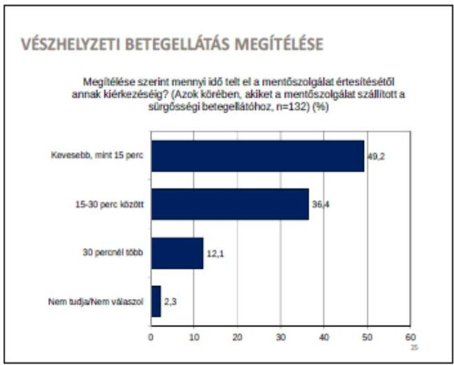

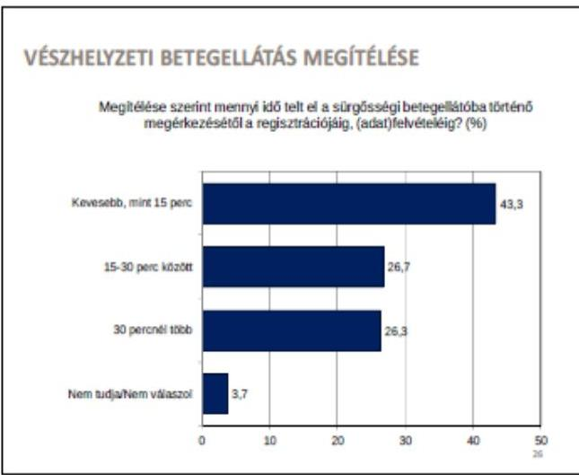

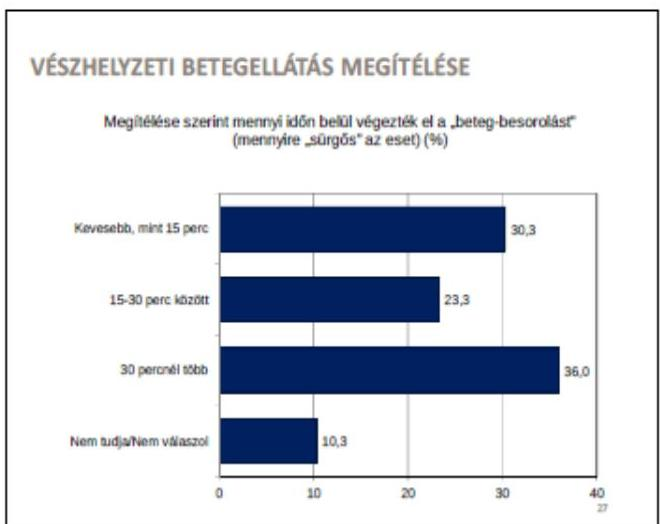

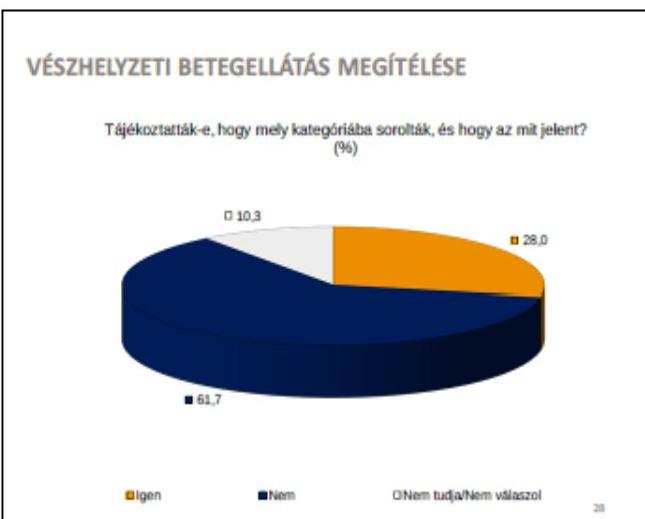

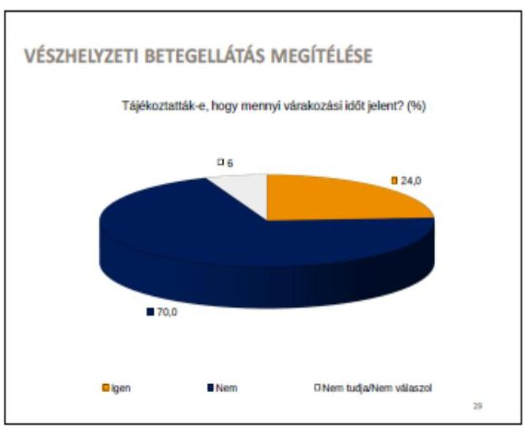

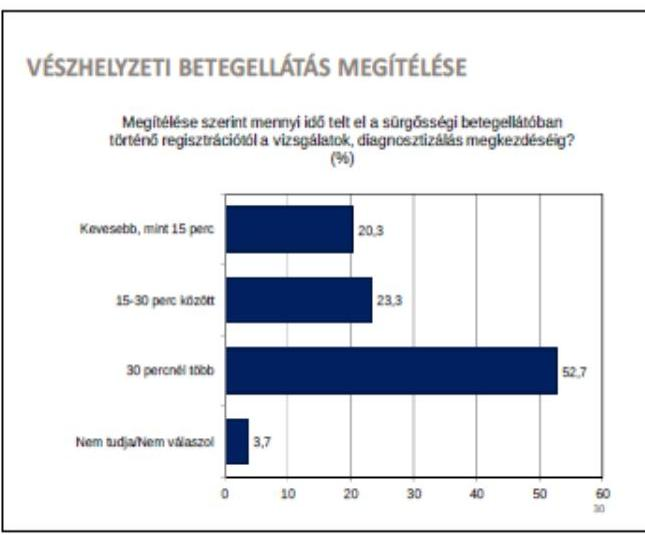

---

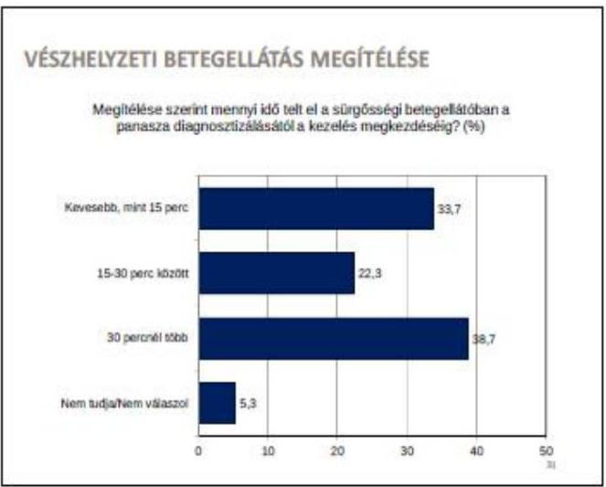

### VÉSZHELYZETI BETEGELLÁTÁS MEGÍTÉLÉSE

Megítélése szerint mennyi idő telt el a sürgősségi betegellátóban a panaszra diagnosztizálásától a kezelés megkezdéséig? (%)

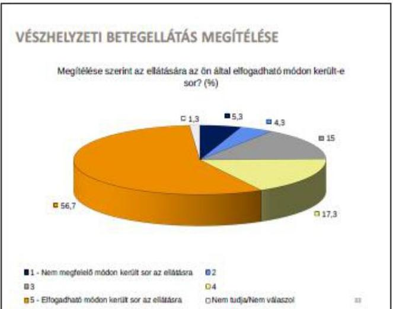

### VÉSZHELYZETI BETEGELLÁTÁS MEGÍTÉLÉSE

Megítélése szerint a sürgősségi betegellátóban az ellátására a panaszának megfelelő időn belül került-e sor? (%)

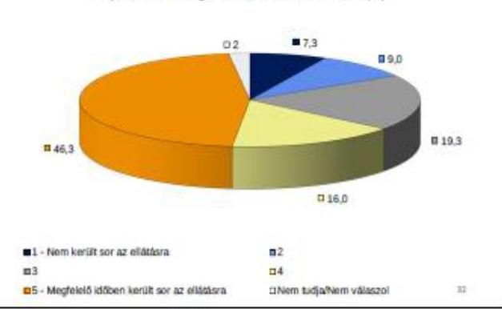

### VÉSZHELYZETI BETEGELLÁTÁS MEGÍTÉLÉSE

Megítélése szerint az ellátására az ön által elfogadható módon került-e sor? (%)

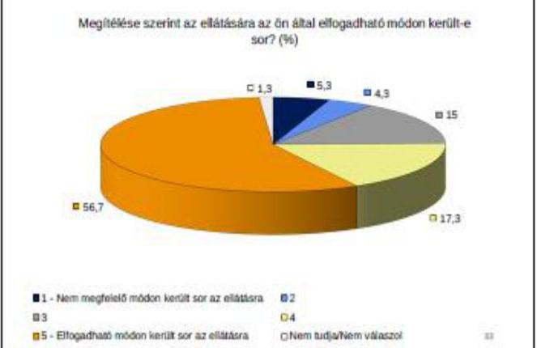

### VÉSZHELYZETI BETEGELLÁTÁS MEGÍTÉLÉSE

Megítélése szerint az ellátására az ön által hatásos módon került-e sor? (%)

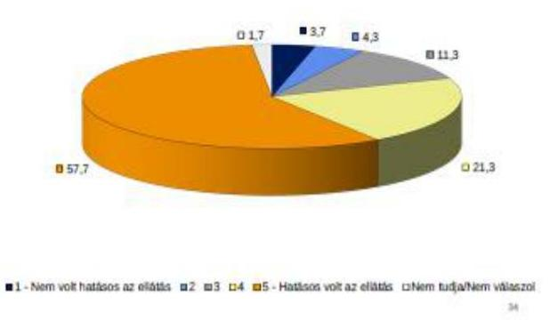

### VÉSZHELYZETI BETEGELLÁTÁS MEGÍTÉLÉSE

Véleménye szerint mi volt a probléma a sürgősségi ellátást végző onvosadóvocsokkal. (%)

|  A szakmai hozzátérése - diagnózis felállítása | 98  |
| --- | --- |
|  Az általa végzett vizsgálatok (hétáltalatos kellemetlenséget, fájdalmát okozok) | 98  |
|  Az általa végzett kezelés, beavatkozás | 97  |
|  Egyéb (pl. túl sokak kellett várni, olvashálny, orvós viselkedése) | 11,5  |
|  Nem volt probléma | 8,5  |
|  Nem tudja/nem válaszol | 98  |
|  0 10 20 30 40 50 60 70 80 90 100
=Emit | 98  |

### VÉSZHELYZETI BETEGELLÁTÁS MEGÍTÉLÉSE

Véleménye szerint mi volt a probléma a sürgősségi ellátást végző onvosadóvocsokkal. (%)

|  A szakmai hozzátérése - diagnózis felállítása | 98  |
| --- | --- |
|  Az általa végzett kezelés, beavatkozás | 98  |
|  Az általa végzett vizsgálatok | 97  |
|  Egyéb (pl. hozzáfála, viselkedés, kiderhettség) | 98  |
|  Nem volt probléma | 8,5  |
|  Nem tudja/nem válaszol | 98  |
|  0 10 20 30 40 50 60 70 80 90 100
=Emit | 98  |

### VÉSZHELYZETI BETEGELLÁTÁS MEGÍTÉLÉSE

Véleménye szerint mi volt a probléma a sürgősségi ellátásban segédkező egészségügyi szakdolgozókkalápolókkal. (%)

|  A szakmai hozzátérése - diagnózis felállítása | 98  |
| --- | --- |
|  Az általa végzett kezelés, beavatkozás | 98  |
|  Az általa végzett vizsgálatok | 97  |
|  Egyéb (pl. hozzáfála, viselkedés, kiderhettség) | 98  |
|  Nem volt probléma | 8,5  |
|  Nem tudja/nem válaszol | 98  |
|  0 10 20 30 40 50 60 70 80 90 100
=Emit | 98  |

### VÉSZHELYZETI BETEGELLÁTÁS MEGÍTÉLÉSE

Véleménye szerint mi volt a probléma a sürgősségi ellátásban segédkező egészségügyi szakdolgozókkalápolókkal. (%)

|  A szakmai hozzátérése - diagnózis felállítása | 98  |
| --- | --- |
|  Az általa végzett kezelés, beavatkozás | 98  |
|  Az általa végzett vizsgálatok | 97  |
|  Egyéb (pl. hozzáfála, viselkedés, kiderhettség) | 98  |
|  Nem volt probléma | 8,5  |
|  Nem tudja/nem válaszol | 98  |
|  0 10 20 30 40 50 60 70 80 90 100
=Emit | 98  |

### VÉSZHELYZETI BETEGELLÁTÁS MEGÍTÉLÉSE

Véleménye szerint mi volt a probléma a sürgősségi ellátásban segédkező egészségügyi szakdolgozókkalápolókkal. (%)

|  A szakmai hozzátérése - diagnózis felállítása | 98  |
| --- | --- |
|  Az általa végzett kezelés, beavatkozás | 98  |
|  Az általa végzett vizsgálatok | 97  |
|  Egyéb (pl. hozzáfála, viselkedés, kiderhettség) | 98  |
|  Nem volt probléma | 8,5  |
|  Nem tudja/nem válaszol | 98  |
|  0 10 20 30 40 50 60 70 80 90 100
=Emit | 98  |

### VÉSZHELYZETI BETEGELLÁTÁS MEGÍTÉLÉSE

Véleménye szerint mi volt a probléma a sürgősségi ellátásban segédkező egészségügyi szakdolgozókkalápolókkal. (%)

|  A szakmai hozzátérése - diagnózis felállítása | 98  |
| --- | --- |
|  Az általa végzett kezelés, beavatkozás | 98  |
|  Az általa végzett vizsgálatok | 97  |
|  Egyéb (pl. hozzáfála, viselkedés, kiderhettség) | 98  |
|  Nem volt probléma | 8,5  |
|  Nem tudja/nem válaszol | 98  |
|  0 10 20 30 40 50 60 70 80 90 100
=Emit | 98  |

### VÉSZHELYZETI BETEGELLÁTÁS MEGÍTÉLÉSE

Véleménye szerint mi volt a probléma a sürgősségi ellátásban segédkező egészségügyi szakdolgozókkalápolókkal. (%)

|  A szakmai hozzátérése - diagnózis felállítása | 98  |
| --- | --- |
|  Az általa végzett kezelés, beavatkozás | 98  |
|  Az általa végzett vizsgálatok | 97  |
|  Egyéb (pl. hozzáfála, viselkedés, kiderhettség) | 98  |
|  Nem volt probléma | 8,5  |
|  Nem tudja/nem válaszol | 98  |
|  0 10 20 30 40 50 60 70 80 90 100
=Emit | 98  |

### VÉSZHELYZETI BETEGELLÁTÁS MEGÍTÉLÉSE

Véleménye szerint mi volt a probléma a sürgősségi ellátásban segédkező egészségügyi szakdolgozókkalápolókkal. (%)

|  A szakmai hozzátérése - diagnózis felállítása | 98  |
| --- | --- |
|  Az általa végzett kezelés, beavatkozás | 98  |
|  Az általa végzett vizsgálatok | 97  |
|  Egyéb (pl. hozzáfála, viselkedés, kiderhettség) | 98  |
|  Nem volt probléma | 8,5  |
|  Nem tudja/nem válaszol | 98  |
|  0 10 20 30 40 50 60 70 80 90 100
=Emit | 98  |

### VÉSZHELYZETI BETEGELLÁTÁS MEGÍTÉLÉSE

Véleménye szerint mi volt a probléma a sürgősségi ellátásban segédkező egészségügyi szakdolgozókkalápolókkal. (%)

|  A szakmai hozzátérése - diagnózis felállítása | 98  |
| --- | --- |
|  Az általa végzett kezelés, beavatkozás | 98  |
|  Az általa végzett vizsgálatok | 97  |
|  Egyéb (pl. hozzáfála, viselkedés, kiderhettség) | 98  |
|  Nem volt probléma | 8,5  |
|  Nem tudja/nem válaszol | 98  |
|  0 10 20 30 40 50 60 70 80 90 100
=Emit | 98  |

### VÉSZHELYZETI BETEGELLÁTÁS MEGÍTÉLÉSE

Véleménye szerint mi volt a probléma a sürgősségi ellátásban segédkező egészségügyi szakdolgozókkalápolókkal. (%)

|  A szakmai hozzátérése - diagnózis felállítása | 98  |
| --- | --- |
|  Az általa végzett kezelés, beavatkozás | 98  |
|  Az általa végzett vizsgálatok | 97  |
|  Egyéb (pl. hozzáfála, viselkedés, kiderhettség) | 98  |
|  Nem volt probléma | 8,5  |
|  Nem tudja/nem válaszol | 98  |
|  0 10 20 30 40 50 60 70 80 90 100
=Emit | 98  |

### VÉSZHELYZETI BETEGELLÁTÁS MEGÍTÉLÉSE

Véleménye szerint mi volt a probléma a sürgősségi ellátásban segédkező egészségügyi szakdolgozókkalápolókkal. (%)

|  A szakmai hozzátérése - diagnózis felállítása | 98  |
| --- | --- |
|  Az általa végzett kezelés, beavatkozás | 98  |
|  Az általa végzett vizsgálatok | 97  |
|  Egyéb (pl. hozzáfála, viselkedés, kiderhettség) | 98  |
|  Nem volt probléma | 8,5  |
|  Nem tudja/nem válaszol | 98  |
|  0 10 20 30 40 50 60 70 80 90 100
=Emit | 98  |

### VÉSZHELYZETI BETEGELLÁTÁS MEGÍTÉLÉSE

Véleménye szerint mi volt a probléma a sürgősségi ellátásban segédkező egészségügyi szakdolgozókkalápolókkal. (%)

|  A szakmai hozzátérése - diagnózis felállítása | 98  |
| --- | --- |
|  Az általa végzett kezelés, beavatkozás | 98  |
|  Az általa végzett vizsgálatok | 97  |
|  Egyéb (pl. hozzáfála, viselkedés, kiderhettség) | 98  |
|  Nem volt probléma | 8,5  |
|  Nem tudja/nem válaszol | 98  |
|  0 10 20 30 40 50 60 70 80 90 100
=Emit | 98  |

### VÉSZHELYZETI BETEGELLÁTÁS MEGÍTÉLÉSE

Véleménye szerint mi volt a probléma a sürgősségi ellátásban segédkező egészségügyi szakdolgozókkalápolókkal. (%)

|  A szakmai hozzátérése - diagnózis felállítása | 98  |
| --- | --- |
|  Az általa végzett kezelés, beavatkozás | 98  |
|  Az általa végzett vizsgálatok | 97  |
|  Egyéb (pl. hozzáfála, viselkedés, kiderhettség) | 98  |
|  Nem volt probléma | 8,5  |
|  Nem tudja/nem válaszol | 98  |
|  0 10 20 30 40 50 60 70 80 90 100
=Emit | 98  |

### VÉSZHELYZETI BETEGELLÁTÁS MEGÍTÉLÉSE

Véleménye szerint mi volt a probléma a sürgősségi ellátásban segédkező egészségügyi szakdolgozókkalápolókkal. (%)

|  A szakmai hozzátérése - diagnózis felállítása | 98  |
| --- | --- |
|  Az általa végzett kezelés, beavatkozás | 98  |
|  Az általa végzett vizsgálatok | 97  |
|  Egyéb (pl. hozzáfála, viselkedés, kiderhettség) | 98  |
|  Nem volt probléma | 8,5  |
|  Nem tudja/nem válaszol | 98  |
|  0 10 20 30 40 50 60 70 80 90 100
=Emit | 98  |

### VÉSZHELYZETI BETEGELLÁTÁS MEGÍTÉLÉSE

Véleménye szerint mi volt a probléma a sürgősségi ellátásban segédkező egészségügyi szakdolgozókkalápolókkal. (%)

|  A szakmai hozzátérése - diagnózis felállítása | 98  |
| --- | --- |
|  Az általa végzett kezelés, beavatkozás | 98  |
|  Az általa végzett vizsgálatok | 97  |
|  Egyéb (pl. hozzáfála, viselkedés, kiderhettség) | 98  |
|  Nem volt probléma | 8,5  |
|  Nem tudja/nem válaszol | 98  |
|  0 10 20 30 40 50 60 70 80 90 100
=Emit | 98  |

### VÉSZHELYZETI BETEGELLÁTÁS MEGÍTÉLÉSE

Véleménye szerint mi volt a probléma a sürgősségi ellátásban segédkező egészségügyi szakdolgozókkalápolókkal. (%)

|  A szakmai hozzátérése - diagnózis felállítása | 98  |
| --- | --- |
|  Az általa végzett kezelés, beavatkozás | 98  |
|  Az általa végzett vizsgálatok | 97  |
|  Egyéb (pl. hozzáfála, viselkedés, kiderhettség) | 98  |
|  Nem volt probléma | 8,5  |
|  Nem tudja/nem válaszol | 98  |
|  0 10 20 30 40 50 60 70 80 90 100
=Emit | 98  |

### VÉSZHELYZETI BETEGELLÁTÁS MEGÍTÉLÉSE

Véleménye szerint mi volt a probléma a sürgősségi ellátásban segédkező egészségügyi szakdolgozókkalápolókkal. (%)

|  A szakmai hozzátérése - diagnózis felállítása | 98  |
| --- | --- |
|  Az általa végzett kezelés, beavatkozás | 98  |
|  Az általa végzett vizsgálatok | 97  |
|  Egyéb (pl. hozzáfála, viselkedés, kiderhettség) | 98  |
|  Nem volt problém | 8,5  |
|  Nem tudja/nem válaszol | 98  |
|  0 10 20 30 40 50 60 70 80 90 100
=Emit | 98  |

### VÉSZHELYZETI BETEGELLÁTÁS MEGÍTÉLÉSE

Véleménye szerint mi volt a problémá a sürgősségi ellátásban segédkező egészségügyi szakdolgozókkalápolókkal. (%)

|  A szakmai hozzátérése - diagnózis felállítása | 98  |
| --- | --- |
|  Az általa végzett kezelés, beavatkozás | 98  |
|  Az általa végzett vizsgálatok | 97  |
|  Egyéb (pl. hozzáfála, viselkedés, kiderhettség) | 98  |
|  Nem volt problém | 8,5  |
|  Nem tudja/nem válaszol | 98  |
|  0 10 20 30 40 50 60 70 80 90 100
=Emit | 98  |

### VÉSZHELYZETI BETEGELLÁTÁS MEGÍTÉLÉSE

Véleménye szerint mi volt a problémá a sürgősségi ellátásban segédkező egészségügyi szakdolgozókkalápolókkal. (%)

|  A szakmai hozzátérése - diagnózis felállítása | 98  |
| --- | --- |
|  Az általa végzett keszék | 98  |
|  Az általa végzett vizsgálatok | 97  |
|  Egyéb (pl. hozzáfála, viselkedés, kiderhettség) | 98  |
|  Nem volt problém | 8,5  |
|  Nem tudja/nem válaszol | 98  |
|  0 10 20 30 40 50 60 70 80 90 100
=Emit | 98  |

### VÉSZHELYZETI BETEGELLÁTÁS MEGÍTÉLÉSE

Véleménye szerint mi volt a problémá a sürgősségi ellátásban segédkező egészségügyi szakdolgozókkalápolókkal. (%)

|  A szakmai hozzátérése - diagnózis felállítása | 98  |
| --- | --- |
|  Az általa végzett keszék | 98  |
|  Az általa végzett vizsgálatok | 97  |
|  Egyéb (pl. hozzáfála, viselkedés, kiderhettség) | 98  |
|  Nem volt problém | 8,5  |
|  Nem tudja/nem válaszol | 98  |
|  0 10 20 30 40 50 60 70 80 90 100
=Emit | 98  |

### VÉSZHELYZETI BETEGELLÁTÁS MEGÍTÉLÉSE

Véleménye szerint mi volt a problémá a sürgősségi ellátásban segédkező egészségügyi szakdolgozókkalápolókkal. (%)

|  A szakmai hozzátérése - diagnózis felállítása | 98  |
| --- | --- |
|  Az általa végzett keszék | 98  |
|  Az általa végzett vizsgálatok | 97  |
|  Egyéb (pl. hozzáfála, viselkedés, kiderhettség) | 98  |
|  Nem volt problém | 8,5  |
|  Nem tudja/nem válaszol | 98  |
|  0 10 20 30 40 50 60 70 80 90 100
=Emit | 98  |

### VÉSZHELYZETI BETEGELLÁTÁS MEGÍTÉLÉSE

Véleménye szerint mi volt a problémá a sürgősségi ellátásban segédkező egészségügyi szakdolgozókkalápolókkal. (%)

|  A szakmai hozzátérése - diagnózis felállítása | 98  |
| --- | --- |
|  Az általa végzett keszék | 98  |
|  Az általa végzett vizsgálatok | 97  |
|  Egyéb (pl. hozzáfála, viselkedés, kiderhettség) | 98  |
|  Nem volt problém | 8,5  |
|  Nem tudja/nem válaszol | 98  |
|  0 10 20 30 40 50 60 70 80 90 100
=Emit | 98  |

### VÉSZHELYZETI BETEGELLÁTÁS MEGÍTÉLÉSE

Véleménye szerint mi volt a problémá a sürgősségi ellátásban segédkező egészségügyi szakdolgozókkalápolókkal. (%)

|  A szakmai hozzátérése - diagnózis felállítása | 98  |
| --- | --- |
|  Az általa végzett keszék | 98  |
|  Az általa végzett vizsgálatok | 97  |
|  Egyéb (pl. hozzáfála, viselkedés, kiderhettség) | 98  |
|  Nem volt problém | 8,5  |
|  Nem tudja/nem válaszol | 98  |
|  0 10 20 30 40 50 60 70 80 90 100
=Emit | 98  |

### VÉSZHELYZETI BETEGELLÁTÁS MEGÍTÉLÉSE

Véleménye szerint mi volt a problémá a sürgősségi ellátásban segédkező egészségügyi szakdolgozókkalápolókkal. (%)

|  A szakmai hozzátérése - diagnózis felállítása | 98  |
| --- | --- |
|  Az általa végzett keszék | 98  |
|  Az általa végzett vizsgálatok | 97  |
|  Egyéb (pl. hozzáfála, viselkedés, kiderhettség) | 98  |
|  Nem volt problém | 8,5  |
|  Nem tudja/nem válaszol | 98  |
|  0 10 20 30 40 50 60 70 80 90 100
=Emit | 98  |

### VÉSZHELYZETI BETEGELLÁTÁS MEGÍTÉLÉSE

Véleménye szerint mi volt a problémá a sürgősségi ellátásban segédkező egészségügyi szakdolgozókkalápolókkal. (%)

|  A szakmai hozzátérése - diagnózis felállítása | 98  |
| --- | --- |
|  Az általa végzett keszék | 98  |
|  Az általa végzett vizsgálatok | 97  |
|  Egyéb (pl. hozzáfála, visedett, kiderhettség) | 98  |
|  Nem volt problém | 8,5  |
|  Nem tudja/nem válaszol | 98  |
|  0 10 20 30 40 50 60 70 80 90 100
=Emit | 98  |

### VÉSZHELYZETI BETEGELLÁTÁS MEGÍTÉLÉSE

Véleménye szerint mi volt a problémá a sürgősségi ellátásban segédkező egészségügyi szakdolgozókkalápolókkal. (%)

|  A szakmai hozzátérése - diagnózis felállítása | 98  |
| --- | --- |
|  Az általa végzett vizsgálatok | 97  |
|  Az általa végzett vizsgálatok | 97  |
|  Egyéb (pl. hozzáfála, visedett, kiderhettség) | 98  |
|  Nem volt problém | 8,5  |
|  Nem tudja/nem válaszol | 98  |
|  0 10 20 30 40 50 60 70 80 90 100
=Emit | 98  |

### VÉSZHELYZETI BETEGELLÁTÁS MEGÍTÉLÉSE

Véleménye szerint mi volt a problémá a sürgősségi ellátásban segédkező egészségügyi szakdolgozókkalápolókkal. (%)

|  A szakmai hozzátérése - diagnózis felállítása | 98  |
| --- | --- |
|  Az általa végzett vizsgálatok | 97  |
|  Az általa végzett vizsgálatok | 97  |
|  Egyéb (pl. hozzáfála, visedett, kiderhettség) | 98  |
|  Nem volt problém | 8,5  |
|  Nem tudja/nem válaszol | 98  |
|  0 10 20 30 40 50 60 70 80 90 100
=Emit | 98  |

### VÉSZHELYZETI BETEGELLÁTÁS MEGÍTÉLÉSE

Véleménye szerint mi volt a problémá a sürgősségi ellátásban segédkező egészségügyi szakdolgozókkalápolókkal. (%)

|  A szakmai hozzátérése - diagnózis felállítása | 98  |
| --- | --- |
|  Az általa végzett vizsgálatok | 97  |
|  Az általa végzett vizsgálatok | 97  |
|  Egyéb (pl. hozzáfála, visedett, kiderhettség) | 98  |
|  Nem volt problém | 8,5  |
|  Nem tudja/nem válaszol | 98  |
|  0 10 20 30 40 50 60 70 80 90 100
=Emit | 98  |

### VÉSZHELYZETI BETEGELLÁTÁS MEGÍTÉLÉSE

Véleménye szerint mi volt a problémá a sürgősségi ellátásban segédkező egészségügyi szakdolgozókkalápolókkal. (%)

|  A szakmai hozzátérése - diagnózis felállítása | 98  |
| --- | --- |
|  Az általa végzett vizsgálatok | 97  |
|  Az általa végzett vizsgálatok | 97  |
|  Egyéb (pl. hozzáfála, visedett, kiderhettség) | 98  |
|  Nem volt problém | 8,5  |
|  Nem tudja/nem válaszol | 98  |
|  0 10 20 30 40 50 60 70 80 90 100
=Emit | 98  |

### VÉSZHELYZETI BETEGELLÁTÁS MEGÍTÉLÉSE

Véleménye szerint mi volt a problémá a sürgősségi ellátásban segédkező egészségügyi szakdolgozókkalápolókkal. (%)

|  A szakmai hozzátérése - diagnózis felállítása | 98  |
| --- | --- |
|  Az általa végzett vizsgálatok | 97  |
|  Az általa végzett vizsgálatok | 97  |
|  Egyéb (pl. hozzáfála, visedett, kiderhettség) | 98  |
|  Nem volt problém | 8,5  |
|  Nem tudja/nem válaszol | 98  |
|  0 10 20 30 40 50 60 70 80 90 100
=Emit | 98  |

### VÉSZHELYZETI BETEGELLÁTÁS MEGÍTÉLÉSE

Véleménye szerint mi volt a problémá a sürgősségi ellátásban segédkező egészségügyi szakdolgozókkalápolókkal. (%)

|  A szakmai hozzátérése - diagnózis felállítása | 98  |
| --- | --- |
|  Az általa végzett vizsgálatok | 97  |
|  Az általa végzett vizsgálatok | 97  |
|  Egyéb (pl. hozzáfála, visedett, kiderhettség) | 98  |
|  Nem volt problém | 8,5  |
|  Nem volt problém | 8,5  |
|  Nem tudja/nem válaszol | 98  |
|  0 10 20 30 40 50 60 70 80 90 100
=Emit | 98  |

### VÉSZHELYZETI BETEGELLÁTÁS MEGÍTÉLÉSE

Véleménye szerint mi volt a problémá a sürgősségi ellátásban segédkező egészségügyi szakdolgozókkalápolókkal. (%)

|  A szakmai hozzátérése - diagnózis felállítása | 98  |
| --- | --- |
|  Az általa végzett vizsgálatok | 97  |
|  Az általa végzett vizsgálatok | 97  |
|  Egyéb (pl. hozzáfála, visedett, kiderhettség) | 98  |
|  Nem volt problém | 8,5  |
|  Nem volt problém | 8,5  |
|  Nem volt problém | 8,5  |
|  Nem volt problém | 8,5  |
|  Nem volt problém | 8,5  |
|  Nem volt problém | 8,5  |
|  Nem volt problém | 8,5  |
|  Nem volt problém | 8,5  |
|  Nem volt problém | 8,5  |
|  Nem volt problém | 8,5  |
|  Nem volt problém | 8,5  |
|  Nem volt problém | 8,5  |
|  Nem volt problém | 8,5  |
|  Nem volt problém | 8,5  |
|  Nem volt problém | 8,5  |
|  Nem volt problém | 8,5  |
|  Nem volt problém | 8,5  |
|  Nem volt problém | 8,5  |
|  Nem volt problém | 8,5  |
|  Nem volt problém | 8,5  |
|  Nem volt problém | 8,5  |
|  Nem volt problém | 8,5  |
|  Nem volt problém | 8,5  |
|  Nem volt problém | 8,5  |
|  Nem volt problém | 8,5  |
|  Nem volt problém | 8,5  |
|  Nem volt problém | 8,5  |
|  Nem volt problém | 8,5  |
|  Nem volt problém | 8,5  |
|  Nem volt problém | 8,5  |
|  Nem volt problém | 8,5  |

---

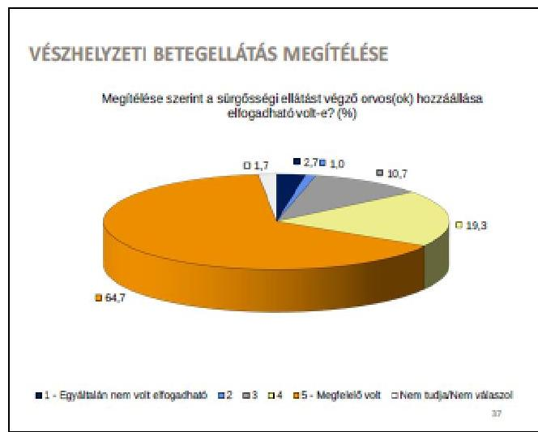

### VÉSZHELYZETI BETEGELLÁTÁS MEGÍTÉLÉSE

Megítélése szerint a sürgősségi ellátást végző envos(ok) hozzáállása elfogadható volt-e? (%)

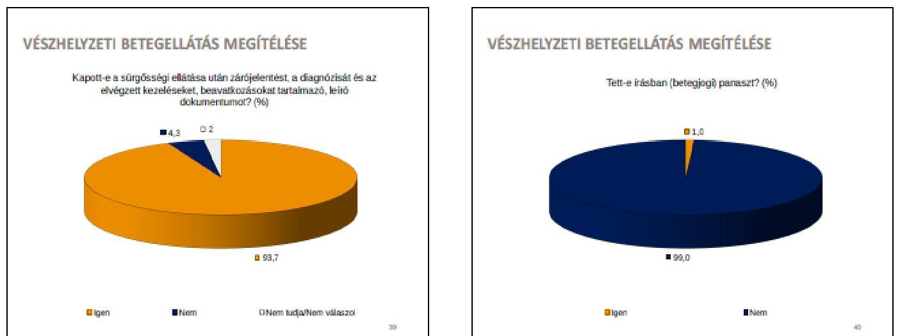

### VÉSZHELYZETI BETEGELLÁTÁS MEGÍTÉLÉSE

Megítélése szerint a sürgősségi ellátásában segédkező egészségügyi szakdolgozóképzék hozzáállása elfogadható volt-e? (%)

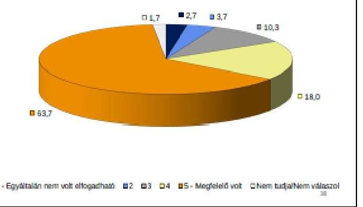

### VÉSZHELYZETI BETEGELLÁTÁS MEGÍTÉLÉSE

Kapott-e a sürgősségi ellátása után zárójelentést, a diagnózisát és az elvégzett kezeléseket, beavatkozásokra hatalmazó, leíró dokumentumot? (%)

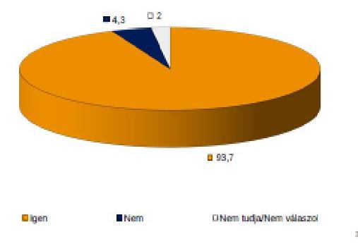

### VÉSZHELYZETI BETEGELLÁTÁS MEGÍTÉLÉSE

Tett-e írásban (betegjogi) panaszt? (%)

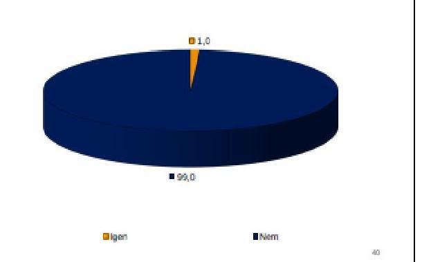

### VÉSZHELYZETI BETEGELLÁTÁS MEGÍTÉLÉSE

Amennyiben írásban (betegjogi) panaszt tett, a sürgősségi ellátást biztosító szolgáltató Ön szerint megfelelően kszelet-e a panaszt? (Azok körében, akik tettek írásban betegjogi panaszt, n=3, %)

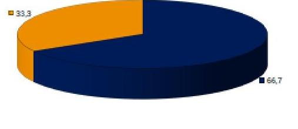

### VÉSZHELYZETI BETEGELLÁTÁS MEGÍTÉLÉSE

Amennyiben írásban (betegjogi) panaszt tett, a sürgősségi ellátást biztosító szolgáltató Ön szerint megfelelően kszelet-e a panaszt? (Azok körében, akik tettek írásban betegjogi panaszt, n=3, %)

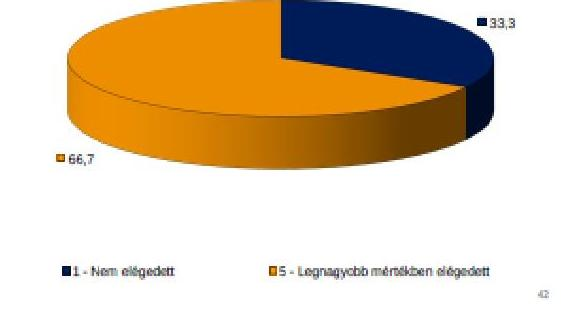

---

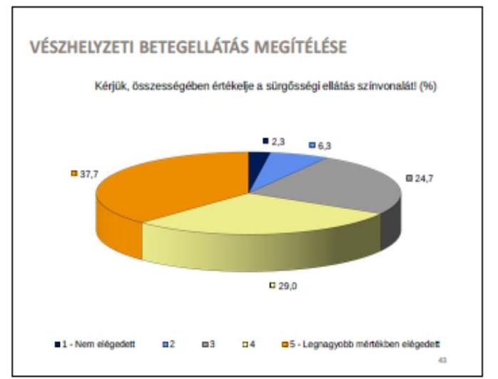

# VÉSZHELYZETI BETEGELLÁTÁS MEGÍTÉLÉSE 

Egyéb megjegyzések:
„Az ellátással tökéletesen elégedett, de ez a várakozási idő, a bürokrácia a problémás, ide-oda tologatják a beteget, nem tájékoztatják a beteget, de ez nem az orvosok hibája, hanem a kórháznak kellene megoldani ezt valahogyan"
„Nem adnak felvilágosítást, hogy miért kell várni. Ha rosszul van az illető, nem tud sehova a váróban lefeküdni (nincs úgy). Nem emberi módon bánnak a betegekkel. Tárgyként kezelik a betegeket."
„Szakmai elismerés hiánya, kevés az ember, kevés a pénz, és belefásulnak az egészbe az egészségügyi dolgozók. Túlhajszoltok az orvosok, az ápolók. Sok az elvándorlás is ezek miatt. Nincs megfelelő személyet ahhoz, hogy a sürgősségi ellátás mindig készenlétben legyen. Túl sok a regisztráció, és addig nincs a beteg ellátva."

A kérdőíves felmérésre adott válaszok értékelése az 5. lényeges kérdéskörnél szereplő adatokhoz képest több helyen eltér. Ennek indoka, hogy a III. sz. mellékletben az egyes válaszok adatai a válaszadókra, vagy a megkérdezettekre vonatkoznak, az 5. lényeges témakör megállapításai pedig minden esetben a válaszadók számán alapulnak.

---

# FÜGGELÉK: ÉSZREVÉTELEK 

A jelentéstervezetet a Számvevőszék 15 napos észrevételezésre megküldte az ellenőrzött szervezetek vezetőinek az ÁSZ tv. 29. $\xi^{7}$ (1) bekezdése előírásának megfelelően.

A jelentéstervezetre az Emberi Erőforrások Minisztériuma minisztere, valamint a Nemzeti Egészségbiztosítási Alapkezelő főigazgatója az ÁSZ tv. 29. § (2) bekezdésében foglalt határidőn belül észrevételezési jogával nem élt, a jelentéstervezetre észrevételt nem tett.
Az Országos Mentőszolgálat főigazgatója a jelentéstervezetre az ÁSZ tv. 29. § (2) bekezdésében foglalt 15 napos határidőn belül megküldött levelében észrevételt tett.
Az Országos Mentőszolgálat főigazgatójának észrevételét és a Számvevőszék arra adott válaszát a jelentés függeléke tartalmazza.

[^0]
[^0]:    ${ }^{7}$ 29. § (1) Az Állami Számvevőszék az ellenőrzési megállapításait megküldi az ellenőrzött szervezet vezetőjének vagy az általa megbízott személynek, és annak, akinek személyes felelősségét állapította meg.
    (2) Az ellenőrzött szervezet vezetője és a felelősként megjelölt személy az ellenőrzés megállapításaira tizenöt napon belül írásban észrevételt tehet.
    (3) Az Állami Számvevőszék az észrevételre a beérkezésétől számított harminc napon belül írásban válaszol. A figyelembe nem vett észrevételeket köteles a jelentésben feltüntetni, és megindokolni, hogy azokat miért nem fogadta el.

---

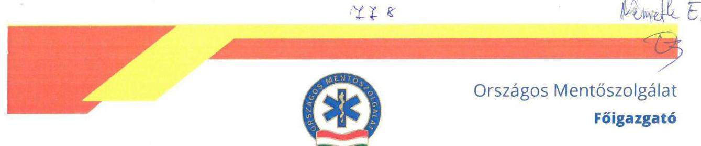

Iktatószám: OMSZ-01/495-2/2019.
Ügyintézőnk: Dr. Hőnyi Péter
Hivatkozási szám: EL-1012-065/2019.
Tárgy: Észrevételek „A „vészhelyzeti" betegellátás rendszerének ellenőrzése" tárgyú számvevőszéki jelentéstervezethez

Állami Számvevőszék
Domokos László úr
elnök részére
Budapest4,
Postafiók 54.
1364

Tisztelt Elnök Úr!

Az Országos Mentőszolgálat az EL-1012-062/2019 iktatószámú, „A „vészhelyzeti" betegellátás rendszerének ellenőrzése" tárgyú ellenőrzési jelentéstervezettel összefüggésben a következő észrevételeket teszi.

Az ellenőrzési programban megfogalmazott ellenőrzési tárgy alapján „a megfelelőségi ellenőrzésen belül a szabályszerűségi ellenőrzés tárgyát képezte (többek között) a vészhelyzeti betegellátó-rendszerrel szemben támasztott követelmények kialakítása, a célokhoz kapcsolódó nyomon követési rendszer kialakítása, a megvalósitás nyomon követése, a belső ellenőrzés, a panaszok kezelése".
„A megfelelőségi ellenőrzésen belül szabályszerűségi ellenőrzés tárgyát képezte a vészhelyzeti betegellátó-rendszerrel szemben támasztott követelmények kialakítása, a célokhoz kapcsolódó nyomon követési rendszer kialakítása, a megvalósitás nyomon követése, a belső ellenőrzés, a panaszok kezelése, a teljesítményértékelés, a szakmai minimumfeltételek rendelkezésre állásának ellenőrzése és a vészhelyzeti betegellátó rendszer folyamatos elérhetőségének biztosítása. " (11. oldal)

Az ellenőrzött szervezetek körébe a mentés közfeladatát ellátó Országos Mentőszolgálat is bevonásra került, fentieknek megfelelően az ellenőrzés tárgya szerinti témakörök az Országos Mentőszolgálat esetében is átvizsgálásra kerültek, illetőleg ehhez kapcsolódóan a jelentéstervezetben leírtak szerint jelentős mennyiségű - maradéktalanul teljesített - adatszolgáltatási kötelezettség terhelte az Országos Mentőszolgálatot az Állami Számvevőszék irányába.
„Az egészségügyért felelős Emberi Eröforrások Minisztériuma, a mentés közfeladatát ellátó Országos Mentőszolgálat és a ... " (11. oldal)

---

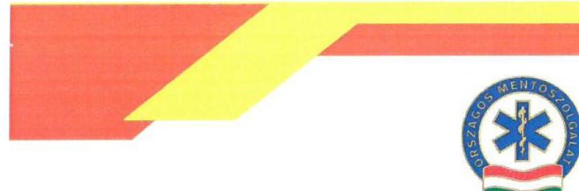

# Országos Mentőszolgálat 

Föigazgató
„Az ellenőrzés lefolytatásához az ellenőrzöttek a tanúsítványok kitöltésével, hitelesítésével és azok, valamint az ÁSZ által kéri dokumentumok megküldésével szolgáltattak adatokat. Az ellenőrzési bizonyitékként felhasználható adatforrások közté tartoztak egyrészt az ellenőrzési program részletes szempontjainál felsorolt adatforrások, másrészt minden egyéb - az ellenőrzés folyamán feltárt, az ellenőrzés szempontjából információt tartalmazó - dokumentum.

Az ellenőrzési kérdések megválaszolásához szükséges bizonyitékok megszerzése az ellenőrzöttek által rendelkezésre bocsátott dokumentumokra, adatokra alapozva megfigyelés, szemle (szemrevételezés), kérdés-felvetés (információkérés), valamint elemző eljárás útján történt. " (12. oldal)

Fentiek alapján a jelentéstervezet szövegezése kiegészítést igényel, figyelemmel arra, hogy az Országos Mentőszolgálat a monitoring rendszerének részét képező belső ellenőrzési szervezeti egységén keresztül több vizsgálatában is érintette a fejlesztési célkitűzések megvalósítását, ennek ellenére utóbbi tény a jelentéstervezetben nem került rögzítésre, illetőleg kizárólag az irányító szervi belső ellenőrzés által végzett nyomon követési tevékenységre történik utalás.
„A fejlesztési célkitüzések végrehajtását a belső ellenőrzés vizsgálatai nem érintették, a teljesitményértékelési felmérés a vészhelyzeti betegellátás jellemzőit csak érintőlegesen értékelte, a betegpanaszok tapasztalatai külön a vészhelyzeti betegellátó-rendszerre vonatkozóan nem álltak rendelkezésre. A vészhelyzeti ellátással kapcsolatban megfogalmazott, nyilvánosan megjelent ellátási problémák kivizsgálása érdekében nem történtek intézkedések. Az illetékes hatóság a müködési minimumfeltételek vonatkozásában nem végezte el a jogszabályi előirás ellenére az egészségügyi szolgáltatók előre meghatározott ütemezés szerinti ellenőrzését, amelynek hiányában az ágazati irányító a minimumfeltételek folyamatos rendelkezésre állását nem tudta biztositani. " (5-6. oldal)

Fentiekben részletezetteknek megfelelően, az egyes, a jelentéstervezet/vizsgálat tárgya szerinti, több helyen is említett fejlesztési célkitűzések (TIOP 2.2.1. projekt, integrált rendszer bevezetése) megvalósítását az Országos Mentőszolgálat belső ellenőrzési szervezeti egysége többek között az Állami Számvevőszék részére is továbbított, következő ellenőrzési jelentések keretében is ellenőrizte:

- 6/2014. Az EGIR alkalmazásának eredményessége figyelemmel a vizsgált szakterületekre vonatkozó jogszabályi előírások betartására (lezárás dátuma: 2015. január 28.),
- 1/2016. „Az EGIR alkalmazásának eredményessége figyelemmel a vizsgált szakterületekre vonatkozó jogszabályi előírások betartására" tárgyú ellenőrzési jelentés utóellenőrzése (lezárás dátuma: 2016. május 11.),
- 2/2016. A TIOP 2.2.1. program keretében létesített és dinamizált, kiemelten a minőségi kifogásokkal érintett mentőállomások műszaki átadás-átvételének,

---

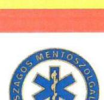

# Országos Mentőszolgálat 

Főigazgató
illetve a szakmai teljesítés igazolás rendszerének szabályszerűségi ellenőrzéséről (lezárás dátuma: 2016. augusztus 10.).

A fentiekben hivatkozott ellenőrzési jelentésekben a Belső Ellenőrzési Osztály javaslataira az érintett szervezeti egységek vezetői összesen 23 pontból álló intézkedési terveket készítettek. A Belső Ellenőrzési Osztály a költségvetési szervek belső kontrollrendszeréről és belső ellenőrzéséről szóló 370/2011. (XII. 31.) Korm. rendeletben (továbbiakban: Bkr.) rögzítetteknek megfelelően az OMSZ Főigazgatója által kialakított monitoring rendszer keretében az említett intézkedési tervekben foglaltak végrehajtását folyamatos jelleggel nyomon követte a Bkr. 47. §-ának megfelelően. A Belső Ellenőrzési Osztály az intézkedések végrehajtásáról az intézkedési tervekben meghatározott legutolsó határidők lejártát követően beszámoltatás alapján folyamatos, pontos információkkal rendelkezett, illetve a folyamatos nyomon követést biztosítva, az ellenőrzés az OMSZ Belső Ellenőrzési Kézikönyvében foglaltaknak megfelelően negyedéves rendszerességgel monitorig adatszolgáltatást kér be az OMSZ egyes szervezeti egységeitől, mely adatszolgáltatás keretében értesül a lejárt határidejű idejű - de még beszámolási kötelezettséggel nem érintett - intézkedések végrehajtásának státuszáról. Fentiekben részletezett dokumentumok az Állami Számvevőszék részére is átadásra került a kapcsolódó adatszolgáltatások során. A Bkr. rendelkezéseivel összhangban a Belső Ellenőrzési Osztály az intézkedési tervekben foglaltak végrehajtását az éves ellenőrzési terveinek megfelelően végrehajtott utóellenőrzések keretében is figyelemmel kezeli.

### 4.1. számú megállapítás

„Az OMSZ a mentőállomás-hálózatát bővítette és fejlesztette.
A 2015-ben lezárult TIOP projekt keretében országosan 22 darab új mentőállomás jött létre. A mentőállomások létesítésénél alapvető szempontot jelentett a települések 15 percen belüli elérésének javítása a földrajzi elhelyezkedés figyelembe vételével. A TIOP projekt keretében továbbá 60 darab mentőállomás felújítására is sor került, amely által javult a mentési feladatok ellátására teljes körűen alkalmas mentőállomások aránya. Az ellenőrzött időszakban a men tőgépkocsik száma 12,9\%-kal növekedett, amelynek révén javult a 100 ezer lakosra jutó mentőgépkocsik száma mutató."

Az OMSZ 2015-ben üzembe helyezte új mentésirányítási rendszerét, amely integrált szervezetirányítási és vezetői információs rendszer kialakítását is magában foglalta.

A korábbiakban részletezett tények alapján legalább az alábbi, tényszerű megállapítással szükséges a jelentéstervezetet korrigálni:
„Az Országos Mentőszolgálat a fejlesztési célkitűzések egyes területeinek a végrehajtását a monitoring rendszerének részét képező belső ellenőrzési szervezeti egységén keresztül nyomon követte a vizsgált időszakban."

---

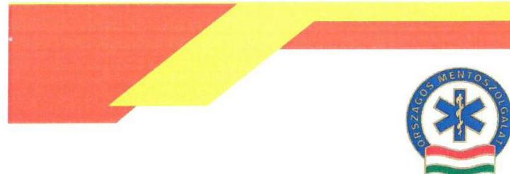

# Országos Mentőszolgálat

## Fölgazgató

A mentők 15 percen belüli kiérkezési idejének aránya a 2015-2017 közötti időszakban a mentőállomás-hálózat bővítése és fejlesztése ellenére nem javult, ezáltal nem teljesült a Semmelweis Tervben szereplő célkitűzés.

A mentők 15 percen belüli kiérkezési idejének aránya 2010-ben – mint a Semmelweis Terv által meghatározott kezdő időpont – 77,6 %-os volt, amelyhez képest csökkenést mutat a 2015-ben mért érték. A 2016-ban történt – előző évhez képest – 1,5 százalékpontos javulás ellenére 2017-ben 4,8 százalékponttal romlott a mutató értéke a 2016-os értékhez képest. (18. oldal)

A fenti megállapítással kapcsolatban az alábbi kiegészítés szerepeltetését tartjuk indokoltnak:

A 15 percen kiérkezési idő vizsgálatának tárgya a mentőegység mentésirányítás általi riasztásának ideje és a helyszínre érkező mentőegység által rögzített helyszínre érkezési idő.

Az adatrögzítés a vizsgált időszakban egyes mentőegységek esetében papíralapú dokumentáció alapján, míg ezzel párhuzamosan más mentőegységek esetében tablet használatával, azaz elektronikus formában történt, mely alapján a mentésirányítási rendszerben megjelenő elektronikusan naplózott adatok pontossága más jellegű, mint a papír alapon vezetett, az átmeneti időszak miatt esetlegesen pontatlan kitöltésből adódó adatokat tartalmazó dokumentációban.

A kimutatásokban szereplő, és szolgáltatott adatok nagy számban még olyan adatszolgáltatáson alapulnak, amely a mentőellátást végzők által kitöltött papír alapú menetlevél-adatlapok alapján került feldolgozásra.

Az a körülmény, hogy a vizsgált években még több helyen a papíralapú dokumentáció felhasználásával történő adatszolgáltatás történt, az egyes kiérkezési adatok összehasonlításának módszertani pontosságát is érinti, hiszen az eltérő metódussal rögzített adatok egymással nem összevethetők, így a kiérkezési adatok százalékos csökkenése a két féle módon rögzített adatok összevetéséből adódik.

A kizárólag a 15 percen belüli kiérkezés szempontjából fontos feladatokat tartalmazó teljesen pontos adatszolgáltatásra akkor kerülhet csak sor, ha csak a teljes körben és országosan használt mentésirányítási rendszer, és az elektronikusan naplózott adatok lekérésére kerül sor.

A feladatszámokból vizsgált „azonnali feladatok” a kimutatásban tartalmazzák a „prioritás I., II., III.” feladatokat is, ezért a 15 percen belüli kiérkezés szempontjából lényeges „prioritás I.” feladat ellátások tekintetében pontos adatok nem ismertek. Ennek oka, hogy az Országos Mentőszolgálat rendszerében a vizsgált időszakban kizárólag a feladat „azonnalisága” volt meghatározható a szűrés feltételeként mely nem csak a prioritás I., hanem a prioritás II. és a prioritás III. feladatokat is tartalmazza.

Fentiek alapján a valós és ellenőrizhető, nem módosítható és teljes körű digitális adatrögzítés bevezetése után lehetséges csak a 15 percen kiérkezési időre vonatkozó

---

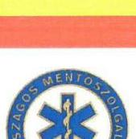

# Országos Mentőszolgálat 

Föigazgató
tényleges és pontos adatokat megismerni, azt nullpontnak tekinteni és azt összevetni a későbbi eredményekkel.

A 15 perces kiérkezési idővel kapcsolatos megállapításokkal összefüggésben álláspontunk szerint fentiekre tekintettel a jelentéstervezet 6. oldalán, a „Főbb megállapítások, következtetések" címben tett megállapítás (.. A Semmelweis Tervben a mentésre vonatkozóan meghatározott célok megvalósitása érdekében történtek intézkedések, azonban az intézkedések ellenére a 15 percen belüli kiérkezés idejének aránya romlott") úgyszintén pontosítandó.
A pontosításra tett szöveges javaslatunk az alábbi:
A Semmelweis Tervben a mentésre vonatkozóan meghatározott célok megvalósítása érdekében történtek intézkedések, azonban az intézkedések ellenére a 15 percen belüli kiérkezés idejének aránya romlott. Megállapítható azonban, hogy a vizsgált években még több helyen a papíralapú dokumentáció felhasználásával történő adatszolgáltatás történt, mely az egyes kiérkezési adatok összehasonlításának módszertani pontosságát is érinti, hiszen az eltérő metódussal rögzített adatok egymással nem összevethetők, így a kiérkezési adatok százalékos csökkenése a két féle módon rögzített adatok összevetéséből adódhat.

## 4.2 számú megállapítás

"Az OMSZ által kialakított mentésirányitási rendszer keretében a mentésirányitási központok fogadták és kezelték a beérkező segélyhívásokat és továbbitották a szükséges információkat az adott típusú és földrajzi elhelyezkedésủ mentésirányitóhoz. A mentésirányitási rendszer révén csökkent a segélyhívások esetén a hívásba lépés időtartama, amelynek következtében a korábbinál gyorsabban valósul meg a mentésirányitó és a segélykérő közötti kommunikáció."

További észrevétel a jelentéstervezettel összefüggésben, hogy a 4.2 számú megállapítás téveszti az Egységes Segélyhívó Rendszer (ESR-112) keretében megvalósult segélyhívás-átirányításokat a földrajzilag illetékes (megyei) mentésirányítókhoz és az OMSZ-hoz közvetlenül érkező orvosi ügyeleti hívásokat, illetőleg az orvosi ügyeleti hívásnak minősített megkeresések továbbítását a területileg illetékes orvosügyelethez, vagy orvosügyeleti szolgáltatóhoz.

Javítási javaslatunk:
„Az OMSZ által kialakított mentésirányítási rendszer keretében a mentésirányítási központok fogadták és kezeltték a beérkező segélyhívásokat és továbbították a szükséges információkat. Az OMSZ-hoz közvetlenül érkező orvosi ügyeleti hívások, vagy orvosi ügyeleti hívásnak minősített megkeresések tekintetében a területileg illetékes orvosügyelethez, vagy orvosügyeleti szolgáltatóhoz az OMSZ mentésirányítói adják át a feladatot, míg az Egységes Segélyhívó Rendszer (ESR-112) keretében megvalósult segélyhívás-

---

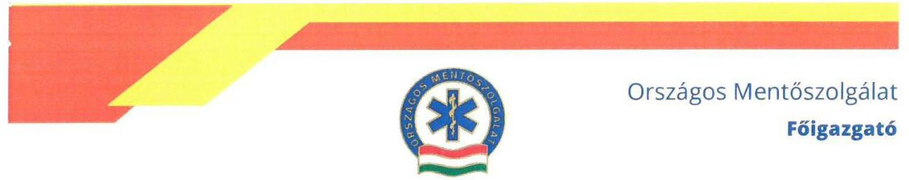
átirányításokat az ESR-112 Hívásfogadó Központjai közvetlenül kapcsolták a földrajzilag illetékes (megyei) mentésirányítókhoz. A mentésirányitási rendszer révén csökkent a segélyhívások esetén a hívásba lépés időtartama, amelynek következtében a korábbinál gyorsabban valósul meg a mentésirányitó és a segélykéró közötti kommunikáció."

A fentieken túl, egyéb észrevételt az Országos Mentőszolgálat nem kíván tenni.

Budapest, 2019. június 04.
Tisztelettel:
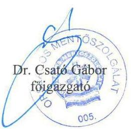

---

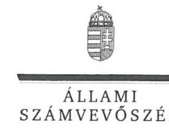

# Dr. Csató Gábor 

föigazgató
Országos Mentőszolgálat

## Budapest

## Tisztelt Föigazgató Úr!

Köszönettel megkaptam „A ,,vészhelyzeti" betegellátás rendszerének ellenörzése" címủ jelentéstervezetre tett észrevételét.

Az ellenőrzési megállapításokra vonatkozó észrevételét az Állami Számvevőszékről szóló 2011. évi LXVI. törvény (a továbbiakban: ÁSZ tv.) 29. § (2) bekezdésében meghatározott tizenöt napos határidőn belül küldte meg. Az Állami Számvevőszék észrevétellel kapcsolatos álláspontját a mellékletként csatolt, a felügyeleti vezető által készített indokolás tartalmazza.
Tájékoztatom, hogy az Állami Számvevőszék a figyelembe nem vett észrevételeket az ÁSZ tv. 29. § (3) bekezdésében előírtak szerint köteles a jelentésében feltüntetni és megindokolni, hogy azokat miért nem fogadta el.

Budapest, 2019. hó 0 nap
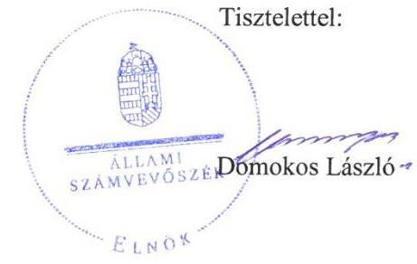

Melléklet: Észrevételre adott válasz

---

# „A „vészhelyzeti" betegellátás rendszerének ellenörzése" című jelentéstervezetre tett észrevételre adott válasz 

## Országos Mentőszolgálat

A jelentéstervezetre tett észrevételeket áttekintettem, annak kezelésével kapcsolatban a következő tájékoztatást adom.

1. A jelentéstervezet Összegzés fejezetének „Főbb megállapítások, következtetések" alcíme (5. oldal, utolsó bekezdés) úgy fogalmaz, hogy „A fejlesztési célkitűzések végrehajtását a belső ellenőrzés vizsgálatai nem érintették...". A Főigazgató észrevételében arra tett javaslatot, hogy az Állami Számvevőszék pontosítása a fent idézett összegző mondatrészt, tekintettel arra, hogy az Országos Mentőszolgálat a belső ellenőrzési szervezeti egységén keresztül több vizsgálatában is érintette a fejlesztési célkitűzések megvalósítását, ami alapján intézkedési tervek készültek, melyek végrehajtását folyamatos nyomon követéssel biztosította, utóellenőrzések keretében is figyelemmel kísérte.

Az ellenőrzött észrevétele a jelentéstervezet megállapításait nem érinti, azok megfelelőségét nem vitatja. A jelentés 2.2. számú megállapítása rögzíti, hogy „Az egészségügyért felelős minisztérium belső ellenőrzést végző szervezeti egysége által lefolytatott ellenőrzések nem érintették a sürgősségi betegellátó-rendszer átalakítására vonatkozó célkitűzések végrehajtásának értékelését". A ellenőrzött észrevételét elfogadjuk, és az összegző fejezet vonatkozó mondatrészét a 2.2. számú megállapítással összhangban pontosítjuk a következő módon: „A fejlesztési célkitűzések végrehajtását az ágazati irányító belső ellenőrzésének vizsgálatai nem érintették...".
2. A jelentéstervezet 4.1. számú megállapítása (18. oldal) rögzíti, hogy „Az OMSZ a men-tőállomás-hálózatát bővítette és fejlesztette. A 2015-ben lezárult TIOP projekt keretében országosan 22 darab új mentőállomás jött létre. A mentőállomások létesítésénél alapvető szempontot jelentett a települések 15 percen belüli elérésének javítása a földrajzi elhelyezkedés figyelembe vételével. A TIOP projekt keretében továbbá 60 darab mentőállomás felújítására is sor került, amely által javult a mentési feladatok ellátására teljes körűen alkalmas mentőállomások aránya. Az ellenőrzött időszakban a mentőgépkocsik száma $12,9 \%$-kal növekedett, amelynek révén javult a 100 ezer lakosra jutó mentőgépkocsik száma mutató." Főigazgató úr észrevételében arra tett javaslatot, hogy az Állami Számvevőszék korrigálja a jelentéstervezetet, miszerint az Országos Mentőszolgálat a fejlesztési célkitűzések egyes területeinek a végrehajtását a monitoring rendszerének részét képező belső ellenőrzési szervezeti egységén keresztül nyomon követte a vizsgált időszakban.

Az ellenőrzött észrevétele a jelentéstervezet megállapításait nem érinti, azok megfelelőségét nem vitatja. A megállapítás helytálló, annak a fejlesztési célkitűzések belső ellenőrzési nyomon követésével való kiegészítése nem indokolt.

---

3. A jelentéstervezet 4.1. számú megállapítása (18. oldal) rögzíti, hogy „A mentők 15 percen belüli kiérkezési idejének aránya 2010-ben - mint a Semmelweis Terv által meghatározott kezdő időpont - 77,6\%-os volt, amelyhez képest csökkenést mutat a 2015-ben mért érték. A 2016-ban történt - előző évhez képest - 1,5 százalékpontos javulás ellenére 2017-ben 4,8 százalékponttal romlott a mutató értéke a 2016-os értékhez képest." A Főigazgató észrevételében arról tájékoztatta az Állami Számvevőszéket, hogy a kiérkezési idő elemzéséhez alkalmazott adatrögzítés a vizsgált időszakban részben papíralapon, részben pedig tabletek alkalmazásával elektronikusan történt, és kérte a megállapítás a mérés módszertanának bemutatásával történő kiegészítését.

Az ellenőrzött a jelentéstervezet megállapítását nem vitatja. Az ellenőrzés az ellenőrzött által az Állami Számvevőszék számára biztosított mérési adatokat és dokumentumokat tényszerűen értékelte. A megállapítás helytálló, a mérési adatok felvételének módszertanával való kiegészítés nem indokolt.
4. A jelentéstervezet 4.2. számú megállapítás 4. bekezdése rögzíti, hogy „Az OMSZ által kialakított mentésirányítási rendszer keretében a mentésirányítási központok fogadták és kezelték a beérkező segélyhívásokat és továbbították a szükséges információkat az adott típusú és földrajzi elhelyezkedésű mentésirányítóhoz. A mentésirányítási rendszer révén csökkent a segélyhívások esetén a hívásba lépés időtartama, amelynek következtében a korábbinál gyorsabban valósul meg a mentésirányító és a segélykérő közötti kommunikáció." Főigazgató úr észrevételében jelezte, hogy megállapítás pontatlanul kezeli (téveszti) az Egységes Segélyhívó Rendszer (ESR-112) keretében megvalósuló, valamint az Országos Mentőszolgálathoz közvetlenül érkező orvosi ügyeleti hívásokat (és ennek minősülő megkereséseket). Főigazgató úr tájékoztatása szerint az ESR-112 esetén a Hívásfogadási Központ a beérkező hívást már közvetlenül a földrajzilag illetékes megyei mentésirányítóhoz kapcsolja, ezért az Országos Mentőszolgálat mentésirányítói csak az orvosi ügyeleti hívások (és ennek minősülő megkeresések) esetén adnak át feladatot.

A kapott észrevétel, a vonatkozó megállapítás vonatkozásában, annak ellentmondó tényt nem tartalmaz, ugyanakkor Főigazgató úr kérése alapján a 4.2. számú megállapítás 4. bekezdésének 1. mondatát pontosítjuk: „Az OMSZ által kialakított mentésirányítási rendszer keretében a mentésirányítási központok fogadták és kezelték a beérkező segélyhívásokat, és továbbították a szükséges információkat."

Budapest, 2019. 06. hó 25 nap

Tisztelettel:

Dr. Németh Erzsébet felügyeleti vezető g

---

# RÖVIDÍTÉSEK JEGYZÉKE 

${ }^{1}$ Semmelweis Terv
${ }^{2}$ Semmelweis Tervről szóló kormányhatározat
${ }^{3}$ Egészségügyi Ágazati Stratégia
${ }^{4}$ Magyarország Alaptörvénye
${ }^{5}$ ÁSZ
${ }^{6}$ ÁSZ tv.
${ }^{7}$ ÁSZ SZMSZ:
ÁSZ SZMSZ:
${ }^{8}$ 1657/2012. (XII.20.) kormányhatározat
${ }^{9}$ Stratégiai irányításról szóló korm. rendelet
${ }^{10}$ Teljért. rendelet
${ }^{11}$ MÉRTÉK
${ }^{12}$ Eútv.
${ }^{13}$ OBDK kormányrendelet
${ }^{14}$ OBDK
${ }^{15}$ IJSZ
${ }^{16}$ Eühat. tv.
${ }^{17}$ EMMI OTFHAT
${ }^{18}$ 96/2003. (VII. 15.) Korm. rendelet
${ }^{19}$ 60/2004 ESZCSM rendelet
${ }^{20}$ 47/2004 ESZCSM rendelet
${ }^{21}$ TIOP projekt
${ }^{22}$ OMSZ
${ }^{23}$ Eüak.
${ }^{24}$ EESZT rendelet
${ }^{25} \mathrm{SBO}$

Újraélesztett egészségügy - Gyógyuló Magyarország Semmelweis Terv az egészségügy megmentésére Szakmai koncepció. 2011. május 11.
A Semmelweis Terv végrehajtásáról szóló 1208/2011. (VI.28.) kormányhatározat
„Az Egészséges Magyarország 2014-2020." Egészségügyi Ágazati Stratégia Magyarország Alaptörvénye (hatályos 2011. április 25-től)
Állami Számvevőszék
az Állami Számvevőszékről szóló LXVI. törvény (hatályos 2011. július 1-jétől)
az Állami Számvevőszék Szervezeti és Múködési Szabályzata
(hatályos 2018. január 1-jétől 2018. december 31-ig)
az Állami Számvevőszék Szervezeti és Múködési Szabályzata
(hatályos 2019. január 1-jétől)
a kormányzati stratégiai dokumentumok felülvizsgálatával kapcsolatos feladatokról szóló 1657/2012. (XII.20.) kormányhatározat
a kormányzati stratégiai irányításról szóló 38/2012. (III.12.) Korm. rendelet (hatályos 2012. március 31-től)
az egészségügyi rendszer teljesítményértékelésének eljárásrendjére vonatkozó szabályokról szóló 36/2013. (V.24.) EMMI rendelet
a Magyar Egészségügyi Rendszer Teljesítményértékelése
az egészségügyről szóló 2007. évi CLIV. törvény (hatályos 1998. július 1-jétől)
az Országos Betegjogi, Ellátottjogi, Gyermekjogi és Dokumentációs Központról szóló 214/2012. (VII.30.) kormányrendelet
Országos Betegjogi, Ellátottjogi, Gyermekjogi és Dokumentációs Központ Integrált Jogvédő Szolgálat
az egészségügyi hatósági és igazgatási tevékenységről szóló 1991. évi XI. törvény (hatályos 1991. április 9-től)
Emberi Erőforrások Minisztériuma Országos Tisztifőorvosi Feladatokért Felelős Helyettes Államtitkárság
az egészségügyi szolgáltatás gyakorlásának általános feltételeiről, valamint a múködési engedélyezési eljárásról szóló 96/2003. (VII.15.) Korm. rendelet
az egészségügyi szolgáltatások nyújtásához szükséges szakmai minimumfeltételekről 60/2003. (X.20.) ESZCSM rendelet
az egészségügyi ellátás folyamatos múködtetésének egyes szervezési kérdéseiről szóló 47/2004. (V.11.) ESZCSM rendelet
a Társadalmi Infrastruktúra Operatív Program keretében meghirdetett „Sürgősségi ellátás fejlesztése - mentés" című kiemelt projekt (kódszám: TIOP 2.2.1./11/1)

Országos Mentőszolgálat
az egészségügyi és a hozzájuk kapcsolódó személyes adatok kezeléséről és védelméről szóló 1997. évi XLVII. törvény (hatályos 1998. január 1-jétől)
az Elektronikus Egészségügyi Szolgáltatási Térrel kapcsolatos részletes szabályokról szóló 39/2016. (XII. 21.) EMMI rendelet
sürgősségi betegellátó osztály

---

${ }^{26}$ Egészséges Budapest Programról
szóló kormányhatározat
${ }^{27}$ Egészséges Budapest Program végrehajtásáról szóló kormányhatározat

Egészséges Budapest Program előkészítéséről szóló 1333/2016. (VII.4.) kormányhatározat
Egészséges Budapest Program végrehajtásáról szóló 1425/2017. (VI.29.) kormányhatározat

---

ÁLLAMI SZÁMVEVŐSZÉK
1052 Budapest, Apáczai Csere János utca 10.
Levélcím: 1364 Budapest 4. Pf. 54
Telefon: +36 14849100 Telefax: +36 14849200
www.asz.hu