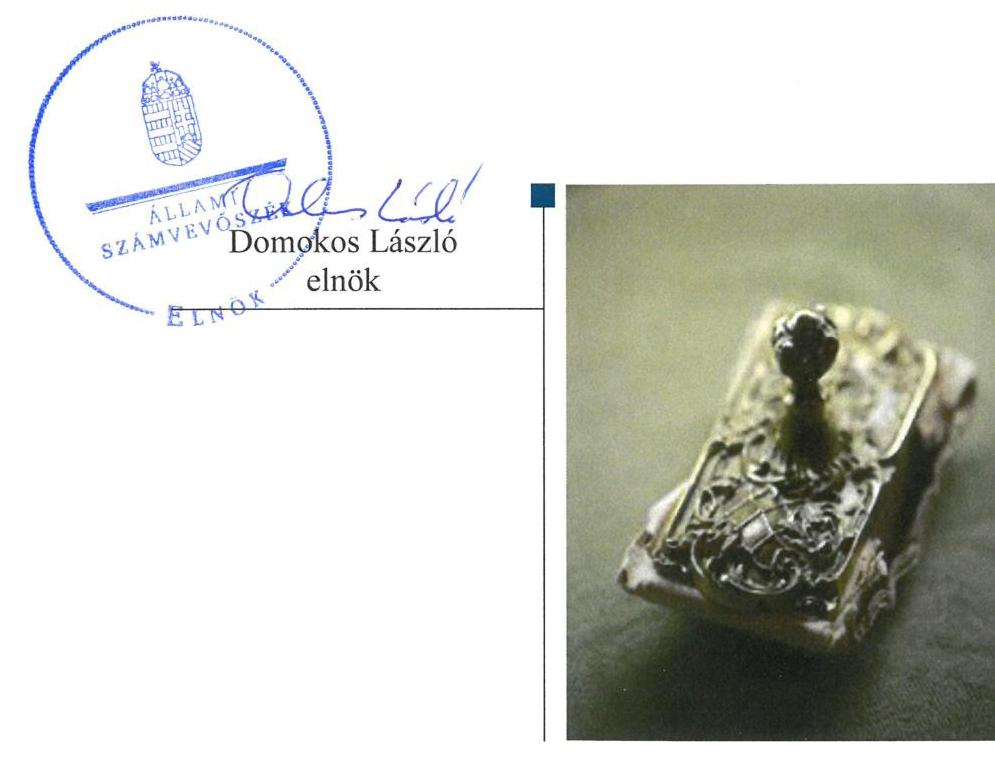
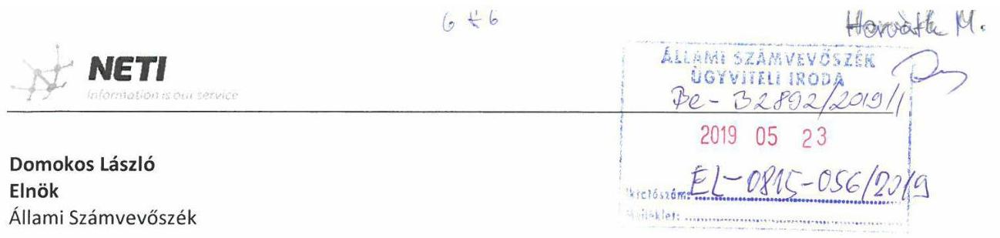
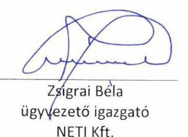
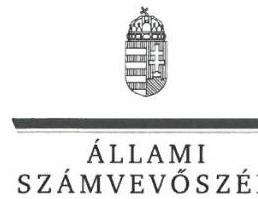
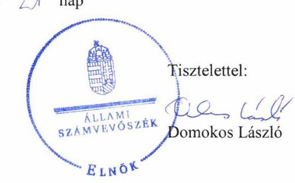

# Jelenetés 

## Az állami tulajdonú gazdasági társaságok ellenőrzése

NETI Informatikai Tanácsadó Korlátolt Felelősségű Társaság
2019.

---

# Jelentés 

## Az állami tulajdonú gazdasági társaságok ellenőrzése

NETI Informatikai Tanácsadó Korlátolt
Felelősségű Társaság
2019. 07. hó 30. nap

---

# AZ ELLENŐRZÉST FELÜGYELTE:

DR. HORVÁTH MARGIT felügyeleti vezető

## AZ ELLENŐRZÉST VEZETTE ÉS A VÉGREHAJTÁSÁÉRT FELELŐS:

- ÁRPÁSI TIBOR ellenőrzésvezető
- A PROGRAM ÖSSZEÁLLÍTÁSÁÉRT FELELŐS:
  - TÓTPÁL SZABOLCS osztályvezető

IKTATÓSZÁM: EL-0815-061/2019.

TÉMASZÁM: 2480

ELLENŐRZÉS-AZONOSÍTÓ SZÁM: V082401

Jelentéseink az Országgyűlés számítógépes hálózatán és az Interneten a www.asz.hu címen is olvashatóak.

---

# TARTALOMJEGYZÉK 

■ ÖSSZEGZÉS ..... 5
■ AZ ELLENŐRZÉS CÉLJA ..... 6
■ AZ ELLENŐRZÉS TERÜLETE ..... 7
■ AZ ELLENŐRZÉS HÁTTERE, INDOKOLTSÁGA ..... 8
■ A JELENTÉS LÉNYEGES KÉRDÉSKÖREI ..... 9
■ AZ ELLENŐRZÉS HATÓKÖRE ÉS MÓDSZEREI ..... 10
■ MEGÁLLAPÍTÁSOK ..... 12
■ JAVASLATOK ..... 15
■ MELLÉKLETEK ..... 17
I. sz. melléklet: fogalomtár ..... 17
■ FÜGGELÉKEK ..... 19
I. sz. függelék a jelentéshez ..... 19
II. sz. függelék: Észrevételek ..... 20
■ RÖVIDÍTÉSEK JEGYZÉKE ..... 37

---

.

---

# ÖSSZEGZÉS 

A NETI Informatikai Tanácsadó Korlátolt Felelősségű Társaság működésének szabályozottsága 2015-ben nem volt szabályszerű, 2017-ben már a jogszabályi előírásokkal összhangban állt. A NETI Informatikai Tanácsadó Korlátolt Felelősségű Társaság gazdálkodása és vagyongazdálkodása 2015-ben és 2017-ben nem volt szabályszerű, a vagyon megóvása nem volt biztosított. Beszámolási kötelezettségének a Társaság 2015-2017-ben nem szabályszerűen tett eleget, mérlegeit nem támasztotta alá leltárral, ezáltal nem volt biztosított a mérleg valódisága.

## Az ellenőrzés társadalmi indokoltsága

Az Állami Számvevőszék a stratégiáját megvalósítva ellenőrzéseivel segíti az átláthatóságot és az elszámoltathatóságot a közpénzekkel, a közvagyonnal való gazdálkodásban. Ellenőrzési témaválasztása során kiemelt figyelmet fordít a korábban ellenőrizetlen területekre.

Ellenőrzési tervének megfelelően a 2015-2017 közötti ellenőrzött időszakra az Állami Számvevőszék folytatja az állami tulajdonban (résztulajdonban) lévő gazdálkodó szervezetek vagyonmegőrzési és gazdálkodási tevékenységének ellenőrzését.

Az állami tulajdonú gazdasági társaságok a nemzeti vagyon részei. Az állami tulajdonú gazdasági társaságokra vonatkozó előírások betartásának ellenőrzése kiemelten fontos a vagyon megőrzése, megóvása érdekében, alapvető követelmény, hogy gazdálkodásuk, működésük szabályszerű legyen. Ennek a társadalmi igénynek megfelelve került sor a NETI Informatikai Tanácsadó Korlátolt Felelősségű Társaság ellenőrzésére. Az Állami Számvevőszék az ellenőrzése során arra kereste a választ, hogy 2015-2017. között a Társaság működésének szabályozottsága megfelelt-e az előírásoknak, szabályszerű volt-e gazdálkodása, vagyongazdálkodása.

## Főbb megállapítások, következtetések, javaslatok

A NETI Informatikai Tanácsadó Korlátolt Felelősségű Társaság működésének szabályozottsága 2015-ben a számviteli szabályozottság hiányosságai - számviteli politika, az eszközök és források értékelési szabályzat, a pénzkezelési szabályzat hiánya - miatt nem volt szabályszerű. 2017-ben a Társaság rendelkezett a gazdálkodási, vagyongazdálkodási felelősségi köröket meghatározó szervezeti és működési szabályzattal, a gazdálkodásának elszámoltathatóságát biztosító, a jogszabályi előírásokkal összhangban lévő számviteli szabályzatokkal.

A NETI Informatikai Tanácsadó Korlátolt Felelősségű Társaság gazdálkodása 2015-ben és 2017-ben nem volt szabályszerű, a bevételek és ráfordítások elszámolása nem a jogszabályi előírások szerint történt. Beszámolási kötelezettségét a Társaság 2015-2017-ben nem szabályszerűen teljesítette, az éves beszámolók mérlegét nem támasztotta alá leltárral, ezzel megsértette a valódiság elvét. Tervezési és adatszolgáltatási kötelezettségének a 2015-2017. években a Társaság szabályszerűen eleget tett.

A Társaság vagyongazdálkodása nem volt szabályszerű 2015-ben és 2017-ben, mivel a vagyon nyilvántartása, állományba vétele nem volt szabályszerű. A Társaság a leltárait nem szabályszerűen állította össze.

Az Állami Számvevőszék a jelentésben foglalt megállapítások alapján a NETI Informatikai Tanácsadó Korlátolt Felelősségű Társaság ügyvezetőjének négy javaslatot fogalmazott meg. A javaslatokat megalapozó megállapításokra az érintettnek 30 napon belül intézkedési tervet kell készítenie.

---

# AZ ELLENŐRZÉS CÉLJA 

Az ellenőrzés célja annak értékelése, hogy a gazdasági társaság szabályozottsága, gazdálkodása és vagyongazdálkodási tevékenysége megfelelt-e a jogszabályi és a tulajdonosi előírásoknak; biztosítva volt-e a közfeladatok átláthatósága és elszámoltathatósága érdekében a közszolgáltatás díjának megalapozottsága szabályszerű önköltségszámítással. A vagyonváltozást eredményező döntések esetében a gazdasági társaság szabályszerűen járt-e el.

---

# AZ ELLENŐRZÉS TERÜLETE 

## NETI Informatika Tanácsadó Korlátolt Felelősségű Társaság

A NETI Informatikai Tanácsadó Korlátolt Felelősségű Társaságot a Magyar Állam 1993. június 1-jén alapította 20 millió Ft törzstőkével. A Társaság ¹ kizárólagos tulajdonosa a Magyar Állam volt. Megbízási szerződés ² és meghatalmazás alapján az MNV Zrt. ³ helyett és nevében a Belügyminisztérium gyakorolta az alapítói és tulajdonosi jogokat, de az Alapító Okiratban ₁₋₃⁴ rögzített egyes döntésekhez előzetesen ki kellett kérnie az MNV Zrt. jóváhagyását.

A Társaság fő tevékenysége információ-technológiai szaktanácsadás, aminek keretében informatikai rendszerek tervezését, megvalósítását, támogatását végezte, szoftverfejlesztési, valamint informatikai biztonsági szolgáltatást nyújtott. A

Társaság kizárólagos jelleggel végzett tevékenységeit, termékeit és szolgáltatásait korlátozott megrendelői körnek értékesítette. Kiemelt ügyfele a Nemzetbiztonsági Szakszolgálat, az Alkotmányvédelmi Hivatal, illetve a Nemzeti Adó- és Vámhivatal volt. A Társaság közfeladatot nem látott el, közszolgáltatást nem végzett.

A Társaság irányítási feladatait az Ügyvezető⁵, ellenőrzését három tagú Felügyelőbizottság ⁶ látta el. Az ellenőrzött időszakban az Ügyvezető személyében nem történt változás, a Felügyelőbizottság összetétele két alkalommal változott. Az Alapító Okirat ₁₋₃ előírásai alapján választott Könyvvizsgáló ⁷ személye nem változott az ellenőrzött időszakban.

A Társaság a 2015-2017. években nyereségesen gazdálkodott, árbevétele, eredménye több mint kétszeresére nőtt, a létszám 49 főről 72 főre emelkedett. A Tulajdonosi joggyakorló ⁸ minden évben az adózott nyereség eredménytartalékba történő helyezéséről határozott.

A Társaság kapcsolt vállalkozásban nem vett részt, leányvállalata nem volt. A Társaság nem rendelkezett vagyonkezelési szerződés alapján átvett állami vagyonnal.

A Társaság nem tartozott a Bkr. ⁹ hatálya alá, az operatív tevékenységtől független belső ellenőrzés kialakítására nem volt kötelezett, azt nem működtette.

Az ellenőrzött időszakban a Társaság nem minősült kormányzati szektorba sorolt egyéb szervezetnek.

---

# AZ ELLENŐRZÉS HÁTTERE, INDOKOLTSÁGA 

A nemzeti vagyon megőrzésének, védelmének és a nemzeti vagyonnal való felelős gazdálkodásnak a követelményeit sarkalatos törvény határozza meg. Az állami tulajdonú gazdasági társaságokra vonatkozó előírások betartásának ellenőrzése kiemelten fontos a vagyon megőrzése, megóvása érdekében, valamint a kormányzati szektor elszámolásaiban megjelenő állami tulajdonú gazdasági társaságok esetében, amelyekkel szemben alapvető követelmény, hogy gazdálkodásuk, működésük szabályszerű, az általuk szolgáltatott adatok minél megbízhatóbbak legyenek. Gazdálkodásuk jellemzően a közérdeklődés és a média figyelmének középpontjában áll, amihez hozzájárul a gazdálkodásuk körébe tartozó - közvetlen vagy közvetett állami tulajdonú, tehát végső soron a nemzeti vagyon részét képező vagyon nagysága, illetve az általuk ellátott közszolgáltatások/közfeladatok minősége és hatékonysága.

Az ellenőrzés rámutathat az állami tulajdonú gazdasági társaságok gazdálkodási tevékenységével kapcsolatos jó gyakorlatokra és szabálytalanságokra. Felhívhatja a figyelmet a jogszabályi követelmények teljesítéséhez szükséges feltételek hiányosságaira, hozzájárulhat az államháztartáson kívüli, de (közvetlenül vagy közvetve) állami vagyont használó gazdasági társaságok tevékenységének átláthatóságához. Ellenőrzésünk eredményeképpen javaslatainkkal, megállapításainkkal hozzájárulhatunk a nemzeti vagyonnal való gazdálkodás átláthatóságának, elszámoltathatóságának javításához.

---

# A JELENTÉS LÉNYEGES KÉRDÉSKÖREI 

1. A NETI Informatika Tanácsadó Korlátolt Felelősségű Társaság működésének szabályozottsága megfelelt-e az előírásoknak?
2. A NETI Informatika Tanácsadó Korlátolt Felelősségű Társaságnál a pénzügyi-számviteli, adatszolgáltatási és ellenőrzési feladatok ellátása szabályszerű volt-e?
3. A NETI Informatika Tanácsadó Korlátolt Felelősségű Társaság vagyongazdálkodása szabályszerű volt-e?

---

# AZ ELLENŐRZÉS HATÓKÖRE ÉS MÓDSZEREI 

## Az ellenőrzés típusa

Megfelelőségi ellenőrzés.

## Az ellenőrzött időszak

Az ellenőrzött időszak 2015-2017. évek, valamint a 2017. évi beszámoló jóváhagyása és közzététele tekintetében a 2018. június elsejéig tartó időszak.

## Az ellenőrzés tárgya

Állami tulajdonban lévő gazdasági társaság gazdálkodása, kiemelten vagyongazdálkodási tevékenysége.

Az ellenőrzés kiterjedt minden olyan körülményre és adatra, amely az ÁSZ jogszabályban meghatározott feladatainak teljesítéséhez, valamint a program végrehajtása folyamán felmerült újabb összefüggések feltárásához szükséges volt.

## Az ellenőrzött szervezet

- NETI Informatikai Tanácsadó Korlátolt Felelősségű Társaság

## Az ellenőrzés jogalapja

Az ellenőrzés jogszabályi alapját az ÁSZ tv. ¹⁰ 1. § (3) bekezdése és 5. § (3) - (5) bekezdései képezték.

## Az ellenőrzés módszerei

Az ellenőrzést a nemzetközi standardokat irányadónak tekintve az ellenőrzési program ellenőrzési kérdései, az ellenőrzött időszakban hatályos jogszabályok, az ellenőrzés szakmai szabályok és módszertanok figyelembe vételével végeztük.

Az ellenőrzés ideje alatt az ellenőrzött szervezettel történő kapcsolattartást az ÁSZ Szervezeti és Működési Szabályzatának vonatkozó előírásai alapján biztosítottuk.

---

A Társaság szabályozottsága, gazdálkodása, vagyongazdálkodása, vagyonnyilvántartása értékelése során a 2015., illetve a 2017. éveket vizsgáltuk a tendenciák feltárása érdekében. A tervezési, beszámolási, közzétételi és adatszolgáltatási kötelezettség teljesítését a 2015-2017. évekre vonatkozóan ellenőriztük.

A 2015. és 2017. évi bevételek és a ráfordítások elszámolásának szabályszerűsége, valamint az értékcsökkenési leírás és a vagyonnyilvántartás szabályszerűsége esetében az ellenőrzés azokra a legnagyobb értékű tételekre - a lényeges sokaságra - terjedt ki, melyek összértéke eléri a teljes sokaság összértékének 50%-át. A lényeges sokaságot tételesen ellenőriztük.

A 2015. és 2017. évi személyi jellegű kifizetések esetében a vezető tisztségviselők részére teljesített kifizetések tételes ellenőrzésére került sor.

Az ellenőrzési kérdések megválaszolásához szükséges bizonyítékok megszerzése a következő ellenőrzési eljárások alkalmazásával történt: megfigyelés, kérdésfeltevés (információkérés), összehasonlítás, valamint elemző eljárás. Az ellenőrzési bizonyítékként felhasználható adatforrások közé tartoztak egyrészt az ellenőrzési programban felsorolt adatforrások, másrészt adatforrás lehetett még minden - az ellenőrzés folyamán - feltárt, az ellenőrzés szempontjából információkat tartalmazó dokumentum.

Az ellenőrzés a kérdésekre adott válaszok kiértékelésével, valamint a megjelölt adatforrások, a csatolt tanúsítványok felhasználásával, továbbá az adott időszakban hatályos jogszabályok figyelembe vételével folyt le.

---

# 1. A NETI Informatika Tanácsadó Korlátolt Felelősségű Társaság működésének szabályozottsága megfelelt-e az előírásoknak? 

Összegző megállapítás

A Társaság működésének szabályozottsága 2015-ben a számviteli szabályozottság hiányosságai miatt nem volt szabályszerű, azonban 2017-ben a jogszabályi előírásokkal összhangban állt.

A TÁRSASÁG hatályos SZMSZ-e ¹¹ az Alapító Okirat ₁₋₃ előírásaival összhangban szabályozta az Ügyvezető jogait és kötelezettségeit, meghatározta a működés és gazdálkodás feladat- és hatásköreit, felelősségi viszonyait, a szervezeti felépítést.

A Társaság 2015-ben és 2017-ben rendelkezett a Taktv. ¹² előírásaival összhangban elkészített, a vezető tisztségviselő, a Felügyelőbizottsági tagok és az Mt. ¹³ 208. § hatálya alá tartozó munkavállalók javadalmazására, valamint a jogviszony megszűnése esetére biztosított juttatások módjának, mértékének elveiről, annak rendszeréről szóló szabályzattal ₁,₂¹⁴.

A TÁRSASÁG SZÁMVITELI tevékenységének szabályozottsága 2015-ben nem volt szabályszerű, 2017-ben már összhangban volt a jogszabályi követelményekkel.

A Társaság 2015-ben nem rendelkezett a Számv. tv. ¹⁵ 14. § (3) bekezdésében foglalt előírás ellenére számviteli politikával, a Számv. tv. 14. § (5) bekezdésének b) és d) pontjában foglalt kötelezettség ellenére az eszközök és források értékelési szabályzatával, illetve pénzkezelési szabályzattal. A Társaság Számlarendje ₁¹⁶ a Számv. tv. 161. § (2) bekezdésének d) pontja előírása ellenére nem tartalmazta az abban foglaltakat alátámasztó bizonylati rendet.

A Társaság 2017-ben hatályos Számviteli politikája ¹⁷, Pénzkezelési szabályzata ¹⁸, Számlarendje ₂ összhangban volt a Számv. tv.-ben foglaltakkal. A Számviteli politika tartalmazta a Számv. tv. előírásai szerint az eszközök és források értékelésére vonatkozó szabályokat, 1. számú melléklete pedig a bizonylati rendet.

A Társaság 2015-ben és 2017-ben rendelkezett a Számv. tv. előírásai szerinti Leltározási és leltárkészítési szabályzattal ¹⁹, valamint Önköltségszámítási szabályzattal ₁,₂²⁰.

---

# 2. A NETI Informatika Tanácsadó Korlátolt Felelősségű Társaságnál a pénzügyi-számviteli, adatszolgáltatási és ellenőrzési feladatok ellátása
 szabályszerű volt-e? 

Összegző megállapítás

A Társaság gazdálkodása 2015-ben és 2017-ben nem volt szabályszerű. Beszámolási kötelezettségét a Társaság 2015-2017-ben nem szabályszerűen teljesítette, az éves beszámolók mérlegét nem támasztotta alá leltárral. Tervezési, adatszolgáltatási kötelezettségének a Társaság szabályszerűen tett eleget.

A bevételek elszámolása 2015-ben nem volt szabályszerű, mert azokat nem támasztották alá a Számv. tv. 166. § (1) bekezdésében meghatározott számviteli bizonylattal. A bevételek elszámolása 2017-ben szabályszerű volt. Szolgáltatási díjait a Társaság nem támasztotta alá önköltségszámítással az Önköltségszámítási szabályzat ${ }_{1,2} 4$. pontjában előírt kötelezettség ellenére.

A ráfordítások elszámolása - az értékcsökkenés kivételével - 2015-ben és 2017-ben szabályszerű volt. Az értékcsökkenés elszámolása 2015-ben és 2017-ben nem volt szabályszerű. A Számv. tv. 165.§ (1)-(2) bekezdéseiben foglaltak ellenére a beszerzett eszközök bekerülési értéke és az azon alapuló évenként elszámolandó értékcsökkenés összege nem volt bizonylattal alátámasztott.

ÜZLETI TERV ${ }^{21}$ készítési kötelezettségét az ellenőrzött időszakban a Társaság az Alapító Okiratban ${ }_{1-3}$ foglaltak alapján teljesítette, azokat a Felügyelőbizottság megtárgyalta, a Tulajdonosi joggyakorló jóváhagyta. A Társaság a gazdálkodására vonatkozó adatszolgáltatási kötelezettségének az MNV Zrt. Monitoring Szabályzatában ${ }_{1,2}{ }^{22}$ meghatározott követelmények szerint eleget tett.

Éves beszámolóit az ellenőrzött időszakban a Társaság elkészítette, azokat a Tulajdonosi joggyakorló a Felügyelőbizottság, a Könyvvizsgáló - korlátozásmentes hitelesítő záradékot tartalmazó - írásbeli jelentésének birtokában hagyta jóvá. A Társaság 2015-2017. évi éves beszámolói nem voltak szabályszerűek, mivel a mérlegtételeket nem támasztotta alá az eszközöket és forrásokat mennyiségben és értékben tartalmazó leltárral, megsértve a Számv. tv. 69 § (1) bekezdésében foglaltakat. Az éves beszámolók közzétételéről és letétbe helyezéséről a Társaság a Számv. tv. előírásai szerint gondoskodott.

---

# 3. A NETI Informatika Tanácsadó Korlátolt Felelősségű Társaság vagyongazdálkodása szabályszerű volt-e? 

Összegző megállapítás

A Társaság vagyongazdálkodása, a vagyon nyilvántartása, állományba vétele nem volt szabályszerű 2015-ben és 2017-ben. A vagyon változását eredményező döntések meghozatala megfelelt az előírásoknak.

A vagyon nyilvántartása nem volt szabályszerű 2015-ben és 2017-ben. A Számv. tv. 69. § (1) bekezdés előírásai ellenére a Társaság a könyvek üzleti év végi zárásához, a beszámoló elkészítéséhez, a mérleg tételeinek alátámasztásához nem állított össze szabályszerű leltárt.

A Társaság 2015-ben és 2017-ben a Számv. tv. 52. § (2) bekezdésében foglaltakat megsértve a tárgyi eszközök, immateriális javak üzembe helyezését nem dokumentálta hitelt érdemlő módon.

A vagyon értékének megőrzéséhez hozzájárult az, hogy a befektetett eszközök állományán belül az ellenőrzött időszakban a tárgyi eszközök aránya növekedett, miközben az immateriális javak értéke 2015-ről 2017-re 83,4%-kal, 3,2 M Ft-ra csökkent. Az eredményes működés következtében a saját tőke összege 2015-ről 2017-re jelentősen, 1044,1 M Ft-ról 1812,9 M Ft-ra emelkedett.

A saját vagyont érintő, egyéb beruházásokkal, felújításokkal kapcsolatos döntések az Alapító Okirat ${ }_{1-3}$ és az SZMSZ előírásainak megfelelően hozták meg. A Társaság 2015-ben 27,2 M Ft, 2017-ben 33,2 M Ft értékű fejlesztést hajtott végre, amely a tárgyi eszközök állományi értékének 5,5%-os növekedését eredményezte.

---

# JAVASLATOK 

Az ÁSZ tv. 33. § (1) bekezdésében foglaltak értelmében az ellenőrzött szervezet vezetője köteles a jelentésben foglalt megállapításokhoz kapcsolódó intézkedési tervet összeállítani és azt a jelentés kézhezvételétől számított 30 napon belül az ÁSZ részére megküldeni. Amennyiben az ellenőrzött szervezet vezetője nem küldi meg határidőben az intézkedési tervet, vagy továbbra sem elfogadható intézkedési tervet küld, az Állami Számvevőszék elnöke az ÁSZ tv. 33. § (3) bekezdése a) és b) pontjaiban foglaltakat érvényesítheti.
Javaslataink célja a NETI Informatikai Tanácsadó Korlátolt Felelősségű Társaság gazdálkodása szabályszerűségének és gyakorlatának javítása annak érdekében, hogy a szabályozási környezet és az alkalmazott gyakorlat megfelelően tudja támogatni az átlátható működést.

## A NETI Informatikai Tanácsadó Korlátolt Felelősségű Társaság ügyvezetőjének

1. Intézkedjen a Társaság szolgáltatási díjainak önköltségszámítással történő alátámasztásáról az Önköltség-számitási szabályzat előírásainak megfelelően.
(2. sz. megállapítás 1. bekezdés 3. mondata alapján)
2. Intézkedjen a beszerzett eszközök bekerülési értéke és a vonatkozó értékcsökkenési leírás Számv. tv. előírásainak megfelelő bizonylatolása érdekében.
(2. sz. megállapítás 2. bekezdés 2-3. mondatai alapján)
3. Intézkedjen az éves beszámolók mérlegtételeinek leltárral történő alátámasztásáról a Számv. tv. előírásainak megfelelően.
(2. sz. megállapítás 4. bekezdés 2. mondata, 3. sz. megállapítás 1. bekezdés 2. mondata alapján)
4. Intézkedjen a tárgyi eszközök, immateriális javak Számv. tv. előírásainak megfelelő üzembe helyezése hitelt érdemlő dokumentálásáról.
(3. sz. megállapítás 2. bekezdése alapján)

---

.

---

# MELLÉKLETEK 

- I. SZ. MELLÉKLET: FOGALOMTÁR
állami vagyon
állami vagyon hasznosítása
állami vagyon használója
állami vagyon kezelője/vagyonkezelő
állami vagyon értékesítése
gazdasági társaság
kapcsolt vállalkozás
kormányzati szektorba sorolt egyéb szervezet
a) Az állam tulajdonában lévő dolog, valamint a dolog módjára hasznosítható természeti erő,
b) az a) pont hatálya alá nem tartozó mindazon vagyon, amely vonatkozásában törvény az állam kizárólagos tulajdonjogát nevesíti,
c) az állam tulajdonában lévő tagsági jogviszonyt megtestesítő értékpapír, illetve az államot megillető egyéb társasági részesedés,
d) az államot megillető olyan immateriális, vagyoni értékkel rendelkező jogosultság, amelyet jogszabály vagyoni értékű jogként nevesít.
Forrás: Vtv. ${ }^{23} 1 . \S$ (2) bekezdése
e) az állam tulajdonában lévő pénzügyi eszközök
Forrás: Vtv. 1. § (2) bekezdése
Az állami vagyonnal a tulajdonosi joggyakorló maga gazdálkodik, vagy szerződés - így különösen bérlet, haszonbérlet, megbízás - alapján hasznosításra átengedi, illetőleg vagyonkezelésbe, haszonélvezetbe adja.
Forrás: Vtv. 23. § (1) bekezdése
Az a természetes vagy jogi személy, jogi személyiséggel nem rendelkező szervezet, aki, vagy amely törvény vagy szerződés alapján, bármely jogcímen (bérlet, haszonbérlet, használat stb.) állami vagyont birtokol, használ, szedi annak hasznait, hasznosít, ide nem értve a haszonélvezőt, a vagyonkezelőt és a tulajdonosi jogok gyakorlóját.
Forrás: Vtv.vhr. 1. § (7) a) pont
Az Nvtv.-ben vagyonkezelőként meghatározott azon személy, amellyel az állami vagyon vagyonkezelésére az MNV Zrt., valamint annak jogelődje, vagy az állami vagyon tulajdonosi joggyakorlója vagyonkezelési szerződést kötött, továbbá akit törvény vagyonkezelőnek kijelöl.
Forrás: Vtv.vhr. 1. § (7) d) pont
Állami vagyon tulajdonjogának bármely jogcímen történő, visszterhes átruházása. Forrás: Vtv.vhr. 1. § (7) d) pont
A Ptk. ${ }^{24}$ 3:88. § (1) bekezdése szerint „a gazdasági társaságok üzletszerű közös gazdasági tevékenység folytatására, a tagok vagyoni hozzájárulásával létrehozott, jogi személyiséggel rendelkező vállalkozások, amelyekben a tagok a nyereségből közösen részesednek, és a veszteséget közösen viselik".
Az anyavállalat és a leányvállalat és a közös vezetésű vállalkozások (fölérendelt anyavállalat esetében a minősítést a fölérendelt anyavállalat szempontjából kell elvégezni)
Forrás: Számv. tv. 3. § (2) 7. pont
Az a szervezet, amely az Áht. alapján nem része az államháztartásnak, azonban az Európai Közösséget létrehozó szerződéshez csatolt, a túlzott hiány esetén követendő eljárásról szóló jegyzőkönyv alkalmazásáról szóló 2009. május 25-i 479/2009/EK rendelet szerint a kormányzati szektorba tartozik.

---

közszolgáltatás
„szerződéskötési kötelezettség alapján a lakosság alapvető szükségleteinek ellátására irányuló szolgáltatás, így különösen a villamos energia-, gáz-, hő-, víz-, szenny-víz- és hulladékkezelési, köztisztasági, postai és távközlési szolgáltatás, továbbá a menetrend alapján közlekedő járművekkel végzett közforgalmú személyszállítás".
leányvállalat
nemzeti vagyon
nemzeti vagyon hasznosítása

Az Ebktv. ${ }^{25}$ 3. § d) pontja a következőképpen határozza meg a közszolgáltatást: „szerződéskötési kötelezettség alapján a lakosság alapvető szükségleteinek ellátására irányuló szolgáltatás, így különösen a villamos energia-, gáz-, hő-, víz-, szenny-víz- és hulladékkezelési, köztisztasági, postai és távközlési szolgáltatás, továbbá a menetrend alapján közlekedő járművekkel végzett közforgalmú személyszállítás".
Az a gazdasági társaság, amelyre az anyavállalat meghatározó befolyást képes gyakorolni
Forrás: Számv. tv. 3. § (2) 2. pont
a) az állam vagy a helyi önkormányzat kizárólagos tulajdonában álló dolgok,
b) az a) pont hatálya alá nem tartozó, állam vagy a helyi önkormányzat tulajdonában lévő dolog,
c) az állam vagy a helyi önkormányzat tulajdonában lévő pénzügyi eszközök, továbbá az államot vagy a helyi önkormányzatot megillető társasági részesedések,
d) az államot vagy a helyi önkormányzatot megillető bármely vagyoni értékkel rendelkező jogosultság, amelyet jogszabály vagyoni értékű jogként nevesít,
e) Magyarország határa által körbezárt terület feletti légtér,
f) az üvegházhatású gázok kibocsátási egységeinek kereskedelméről szóló törvény szerint kibocsátási egység és légiközlekedési kibocsátási egység, valamint az ENSZ Éghajlatváltozási Keretegyezménye és annak Kiotói Jegyzőkönyv végrehajtási keretrendszeréről szóló törvény szerinti kiotói egység,
g) állami vagy helyi önkormányzati fenntartású közgyűjtemény (muzeális intézmény, levéltár, közgyűjteményként működő kép- és hangarchívum, valamint könyvtár) saját gyűjteményében nyilvántartott kulturális javak körébe tartozó dolog, kivéve, ha az állami vagy önkormányzati tulajdon jogszerű létrejötte kétséget kizáró módon nem bizonyítható és a dologra nézve más a tulajdonjogát bizonyítja vagy a kulturális javakra vonatkozó jogszabályokban meghatározott eljárás keretében valószínűsíti (g. pont módosult 2013. december 7-től),
h) a régészeti lelet,
i) a nemzeti adatvagyon körébe tartozó állami nyilvántartások fokozottabb védelméről szóló törvény szerinti nemzeti adatvagyon.
Forrás: Nvtv. ${ }^{26}$ 1. § (2)
A tulajdonosi joggyakorló vagy a nemzeti vagyon használója által a nemzeti vagyon birtoklásának, használatának, hasznok szedése jogának bármely - a tulajdonjog átruházását nem eredményező - jogcímen történő átengedése, ide nem értve a vagyonkezelésbe adást, valamint a haszonélvezeti jog alapítását.
Forrás: Nvtv. 3. § (1) 4. pont

---

# FÜGGELÉKEK 

- I. SZ. FÜGGELÉK A JELENTÉSHEZ

Az Állami Számvevőszék az ellenőrzések során feltárt tényekhez, megállapításokhoz kapcsolódó további körülmények tisztázására eszközrendszerrel nem rendelkezik. Amennyiben az ellenőrzésen túlmutatóan indokoltnak látszik az ellenőrzés során feltárt körülmények további vizsgálata, az Állami Számvevőszék törvényi felhatalmazás alapján az ellenőrzés által feltárt körülményeket továbbítja a hatáskörrel rendelkező szervnek a szükséges intézkedések megtétele, eljárások lefolytatása érdekében.

1. A NETI Informatikai Tanácsadó Korlátolt Felelősségű Társaság a 2015-2017. évi éves beszámoló mérlegét a Számv. tv. 69. § (1) bekezdése ellenére az eszközöket és forrásokat mennyiségben és értékben tartalmazó leltárral nem támasztotta alá. A mérleg tételeit alátámasztó leltár hiányában a 2015-2017. évi éves beszámolókban a Számv. tv. 15. § (3) bekezdésében foglalt előírás ellenére nem érvényesült a valódiság elve és nem igazolt, hogy a Társaság beszámolója a valós, megbízható képet mutatta.
A Társaság éves beszámolói a leltárral történő alátámasztás hiánya miatt nem feleltek meg a törvényi előírásnak. A Társaság éves beszámolóinak a jogszabályi előírások szerint valós és megbízható képet kell mutatniuk. Mivel a Számv. tv. 170. § (3) bekezdésben foglaltak alapján a vállalkozások beszámolóit a Nemzeti Adó- és Vámhivatal ellenőrzi, ezért indokolt a Nemzeti Adó- és Vámhivatal értesítése a megfelelő hatósági eljárás lefolytatása érdekében.

---

A jelentéstervezetet a Számvevőszék 15 napos észrevételezésre megküldte az ellenőrzött szervezet vezetőjének az ÁSZ tv. 29. § (1) bekezdése előírásának megfelelően.

Az ellenőrzött szervezet vezetője az ellenőrzés megállapításaira írásban észrevételt tett. Az Állami Számvevőszék az észrevételre írásban válaszolt. Az észrevétel, a figyelembe nem vett észrevételek és azok indokai a következők voltak:

[^0]
[^0]:    * 29. § (1) Az Állami Számvevőszék az ellenőrzési megállapításait megküldi az ellenőrzött szervezet vezetőjének vagy az általa megbízott személynek, és annak, akinek személyes felelősségét állapította meg.
    (2) Az ellenőrzött szervezet vezetője és a felelősként megjelölt személy az ellenőrzés megállapításaira tizenöt napon belül írásban észrevételt tehet.
    (3) Az Állami Számvevőszék az észrevételre a beérkezésétől számított harminc napon belül

 írásban válaszol. A figyelembe nem vett észrevételeket köteles a jelentésben feltüntetni, és megindokolni, hogy azokat miért nem fogadta el.

---

Tárgy: Észrevételezés az EL-0815-052/2019. számú jelentéstervezetben foglaltakkal kapcsolatosan

# Tisztelt Elnök Úr! 

A 2019. május 21-én érkezett EL-0815-052/2019. iktatószámú levél mellékleteként megküldött jelentéstervezettel kapcsolatban az alábbi észrevételeket teszem:

Sajnálatos módon az ÁBR rendszerhez már nem biztosított a hozzáférésünk, így az utóbbi egy év alatti öt adatbekérés alatt feltöltött dokumentumokra nem látunk rá, azokat utólag ellenőrizni nincs lehetőségünk.

1. A jelentéstervezet kifogásolja, hogy a NETI Informatikai Tanácsadó Kft. (a továbbiakban: Társaság) 2015-ben nem rendelkezett a Számv. tv. 14. § (3) bekezdésében foglalt előírás ellenére számviteli politikával, a Számv. tv. 14. § (5) bekezdésének b) és d) pontjában foglalt kötelezettség ellenére az eszközök és források értékelési szabályzatával, illetve pénzkezelési szabályzattal. A Társaság Számlarendje a Számv. tv. 161.§ (2) bekezdésének d) pontja előírása ellenére nem tartalmazta az abban foglaltakat alátámasztó bizonylati rendet.

Észrevétel: Lehetséges, hogy a kérdéses időszakban érvényben lévő szabályzatok - a rendelkezésre álló szkennelési és feltöltési idő rövidsége kapcsán fellépő sietségben - nem kerültek feltöltésre.

Jelen levelemhez csatolom a 2015-ben érvényben lévő szabályzatokat:

- Házipénztár-kezelési szabályzat (1 példány, másolat)
- Számviteli politika (1 példány, másolat)
- Eszközök és Források értékelési szabályzata (1 példány, másolat)
- Bizonylati rend (1 példány, másolat)

2. A jelentéstervezet több pontban is megállapítja, hogy a Társaság mérlegét nem támasztotta alá leltárral, valamint a Társaság 2015-2017-ben a tárgyi eszközök, készletek mennyiségi felvételezését nem végezte el, így a Számv. tv. 69. § (3) bekezdésében és a Leltározási és leltárkészítési szabályzat 5. pont első bekezdésében előírt háromévenkénti mennyiségi felvételezéssel történő leltározás nem történt meg.

Észrevétel: Társaságunk a számviteli törvény előírásainak megfelelően három évenként készít mennyiségi felvételezéssel tárgyi eszköz leltárt, amely a vizsgált időszakban 2017. decemberében készült (előtte 2014-ben), viszont a leltárjegyek mennyisége miatt nem tudták kollégáim feltölteni az online rendszerbe. Kollégám úgy emlékszik - rögzített vonalon - telefonon egyeztetett is Önök kel,

---

# NETI 

mert a teljes leltár szkennelése és feltöltése az anyag méretére és a kapott rövid határidőre tekintettel nem volt lehetséges. Telefonon azt a tájékoztatást kapta, hogy ebben az esetben a leltárakról összesítő kimutatásokat, jegyzőkönyveket töltsön fel. A kapott iránymutatás alapján a tárgyi eszközök és immateriális javak, valamint a készlet leltárral kapcsolatban feltöltésre kerültek az alábbi dokumentumok: Csoportos leltár eredmény főkönyvi számlaszámokra, leltárkülönbözet jegyzőkönyvek (Leltárkül_jegyzőkönyvek.pdf, Eszköz_leltár.pdf, Készlet_leltárak.pdf) Leltározási ütemtervek, megbízólevelek (Készlet_leltár_ütemterv.pdf, Eszköz_leltár_ütemterv.pdf).

Jelen levelemhez csatolom az érintett évekre vonatkozóan a teljes leltározási dokumentációt:

- 2017. évi tárgyi eszköz és immateriális javak leltározási ütemterv (1 példány, másolat)
- 2017. évi tárgyi eszköz és immateriális javak leltározás Megbízólevél (1 példány, másolat)
- 2017. évi tárgyi eszköz és immateriális javak leltározás Jegyzőkönyv leltárkülönbözetről (1 példány, másolat)
- 2017. évi tárgyi eszköz és immateriális javak leltározás Leltárfelvételi jegyek (1 példány, másolat)
- 2015. készlet leltározási ütemterv (1 példány, másolat)
- 2015. évi készlet leltár megbízólevél (1 példány, másolat)
- 2015. évi készlet jegyzőkönyv leltárkülönbözetről (1 példány, másolat)
- 2015. év készletek leltárfelvételi íve (1 példány, másolat)
- 2015. év készlet leltár kiértékelés lekérdezés (1 példány, másolat)
- 2016. készlet leltározási ütemterv (1 példány, másolat)
- 2016. évi készlet leltár megbízólevél (1 példány, másolat)
- 2016. évi készlet jegyzőkönyv leltárkülönbözetről (1 példány, másolat)
- 2016. év készletek leltárfelvételi íve (1 példány, másolat)
- 2017. készlet leltározási ütemterv (1 példány, másolat)
- 2017. évi készlet leltár megbízólevél (1 példány, másolat)
- 2017. évi készlet jegyzőkönyv leltárkülönbözetről (1 példány, másolat)
- 2017. év készletek leltárfelvételi íve (1 példány, másolat)
- 2015. évi mérleget alátámasztó leltárak, főkönyv-analitika egyeztetések (1 példány, másolat)
- 2017. évi mérleget alátámasztó leltárak, főkönyv-analitika egyeztetések (1 példány, másolat)

3. A jelentéstervezet kifogásolja, hogy a bevételek elszámolása 2015-ben nem volt szabályszerű, mert azokat nem támasztották alá a Számv. tv. 166. § (1) bekezdésében meghatározott számviteli bizonylattal.

Észrevétel: A Társaság feltöltötte a mintavétel alapjául szolgáló kartonokat, melyek egyenlege pontosan egyezett a főkönyvi kivonattal, valamint az eredménykimutatással. A beküldött kimutatás maradéktalanul tartalmazta a kiállított bizonylatok számát is és számlasor mélységben került elkészítésre. Így amennyiben egy kiállított vevőszámla több soros volt, a könyvelt adatok is több sorban jelentek meg, természetesen az adott számlasorhoz tartozó nettó könyvelt összeggel. A kiválasztott bizonylat rögzítési tételszám mezője mutatja a kapcsolatot a számlával, vagyis hogy az adott bizonylat melyik sorának könyvelési tétele. Félreértésre adhatott okot, hogy az árbevételek kapcsán kiválasztott minta tételek között egy számla többször is kiválasztásra került, más-más sorának a könyvelése kapcsán és kolléganőim annyiszor szkenneltük és küldték be ugyanazt a számlát, ahányszor szerepelt a kapott mintatételek listájában. Az Önök által kért mintatételek:

---

számlák, bankszámla kivonat a kiegyenlítésről, főkönyvi karton, szerződés, feltöltésre kerültek 2015 évre vonatkozóan is, hasonlóan a 2017-es évhez.

A 2015-ös évben kiválasztott mintatétekben szerepelt 4 db számla (V15-00170; V15-00153, V1500093, V15-00040) melyekhez a szerződést nem tudtuk csatolni. Mindegyik számla egy olyan szerződéshez kapcsolódott, mely minősített volt és titkos ügykezelés alá esett (TÜK), majd a titokgazda belső eljárásrendje miatt, annak lejárta után vissza kellett küldenünk. A titokgazda tájékoztatása alapján tőlük kikérhető a kérdéses szerződés.
A visszaküldésről szóló dokumentumot mindegyik számla mögé csatoltuk, azt a feltöltött dokumentumok tartalmazzák.
4. A jelentéstervezet kifogásolja, hogy az értékcsökkenés elszámolása 2015-ben és 2017-ben nem volt szabályszerű. A Számv. tv. 165.§ (1)-(2) bekezdéseiben foglaltak ellenére a beszerzett eszközök bekerülési értéke és az azon alapuló évenként elszámolandó értékcsökkenés összege nem volt bizonylattal alátámasztott.

Észrevétel: A mintavételhez beküldött főkönyvi adatok a teljes 1-es számlaosztályt tartalmazták. Társaságunk minden eszközt a 1611-es főkönyvi számon futtat át. A számlák könyvelésekor a főkönyvi szám a 1611-es, majd az analitikában az eszköz nyilvántartásba, majd később aktiválásra kerül és ekkor az analitika egy összegben összevonva adja fel az adott napon aktivált összes eszköz bruttó növekedéseit és nem eszközönként, az ellenszámla pedig a 1611. A mintavételbe bekerültek olyan könyvelési sorok (ahol a főkönyvi számlaszám 1611), melyek egy számla beruházásra történő könyvelései voltak és így egy számla tartozott hozzájuk. Azonban olyan sorok is bekerültek, ahol az aktiválás könyvelése történt (főkönyvi szám 14 és az ellenszámla 1611). Ezen sorokban a megjegyzés mezőben a FORRÁS-SQL: bruttóvált. főkönyvi feladása szerepel. Ezek a sorok az előbbiek miatt több eszköz aktiválásának könyvelését is tartalmazhatták, melynek részletezése az analitikából lekéndezhető, így kolléganőim a mintavétel adott sorához tartozó feltöltött fájlba az összes érintett eszköz számláját, bizonylatait feltöltötték.

A mintavétel alapján feltöltésre került: számla, nyilvántartásba vételi okmány, állományba helyezési bizonylat, árajánlat, megrendelés, azonban az adott eszköz egyedi nyilvántartási kartonja nem került feltöltésre. A mintavétel alapján egy sorhoz egy pdf került feltöltésre, mely az előbbiek miatt több eszközhöz tartozó dokumentumot is tartalmazhat.
A feltöltött fájlok: V1_2015.pdf, V1_2017.pdf, V2_2015.pdf, V2_2017.pdf, V3_2015.pdf, V3_2017.pdf, V4_2015.pdf, V4_2017.pdf, V5_2015.pdf, V5_2017.pdf, V6_2017.pdf, V7_2017.pdf, V8_2017.pdf, V9_2017.pdf, V10_2017.pdf

Jelen levelemhez csatolom a mintavételben érintett eszközök egyedi nyilvántartási kartonját, mely tartalmazza az adott eszköz bruttó növekedését, annak dátumát, a növekedés bizonylatának (számla iktatószáma) az évek és azon belül a havonta elszámolt értékcsökkenés összegeit is. A jobb felső sarokban feltüntetésre került, hogy mely feltöltött fájlban található eszközökhöz kapcsolódik a karton.
5. A Társaság 2015-ben és 2017-ben a Számv. tv. 52.§ (2) bekezdésében foglaltakat megsértve a tárgyi eszközök, immateriális javak üzembe helyezését nem dokumentálta hitelt érdemlő módon.

---

# NETI 

Észrevétel: V1_2015.pdf, V1_2017.pdf, V2_2015.pdf, V2_2017.pdf, V3_2015.pdf, V3_2017.pdf, V4_2015.pdf, V4_2017.pdf, V5_2015.pdf, V5_2017.pdf, V6_2017.pdf, V7_2017.pdf, V8_2017.pdf, V9_2017.pdf, V10_2017.pdf dokumentumokban beküldésre kerültek a mintavételhez tartozó sorokhoz kapcsolódó eszközök számlái, valamint a hozzá tartozó nyilvántartásbavételi okmány és az állománybavételi bizonylat is. A társaságunk által használt FORRÁS-SQL ügyviteli rendszer eszköz analitika modulja a tárgyi eszközök, immateriális javak üzembe helyezésekor, az üzembehelyezési okmány pontban elkészíti a dokumentumot, melynek neve nyilvántartásba vételi okmány. Sajnos a megnevezés félrevezető lehet, azonban a dokumentum neve ellenére tartalmazza az üzembe helyezés dátumát a nyilvántartásba vétel dátuma mezőben. A kérdéses okmányok feltöltésre kerültek. A problémát jeleztük a szoftver fejlesztőjének és kértük a megjelenítendő okmány megnevezésének javítását, pontosítását.
6. A Társaság megsértette Számv. tv. 92.§ (2) bekezdésének előírását, amikor a jelentősebb összegű terven felüli értékcsökkenés elszámolásának indokait nem mutatta be a 2015. és 2017. évi beszámolók kiegészítő mellékleteiben.

Észrevétel: 2015-ben 18 darab tárgyi eszköz és 1 db szellemi termék tekintetében, összesen 313531 Ft, míg 2017-ben 19 darab tárgyi eszközt érintően összesen 452075 Ft terven felüli értékcsökkenés került elszámolásra. A kiegészítő mellékletek 2. számú mellékletei tartalmazzák az elszámolt terven felüli értékcsökkenés összegét. Mindkét évet érintően az elszámolt terven felüli értékcsökkenés nem volt jelentős, ezért annak indoka nem került bemutatásra.

Budapest, 2019. május 23.

---

ELNÖK

Ikt.szám: EL-0815-057/2019.

# Zsigrai Béla Csaba úr 

ügyvezető

NETI Informatikai Tanácsadó Korlátolt Felelősségű Társaság

## Budapest

## Tisztelt Ügyvezető Úr!

Köszönettel vettem „Az állami tulajdonú gazdasági társaságok ellenőrzése - NETI Informatikai Tanácsadó Korlátolt Felelősségű Társaság" címmel készített számvevőszéki jelentéstervezetre megküldött észrevételét.
Az Állami Számvevőszék észrevételre vonatkozó álláspontját a felügyeleti vezető által készített részletes tájékoztatás tartalmazza, amelyet levelemhez mellékeltem.
Tájékoztatom Ügyvezető urat, hogy az Állami Számvevőszék a figyelembe nem vett észrevételeket az Állami Számvevőszékről szóló 2011. évi LXVI. törvény 29. § (3) bekezdésében előírtak szerint köteles a jelentésében feltüntetni és megindokolni, hogy azokat miért nem fogadta el.

Budapest, 2019. 06 hó 2. nap

Melléklet: Tájékoztatás az észrevételek kezeléséről

---

# Tájékoztatás az észrevételek kezeléséről 

Megköszönöm Ügyvezető úrnak „Az állami tulajdonú gazdasági társaságok ellenőrzése - NETI Informatikai Tanácsadó Korlátolt Felelősségű Társaság" címmel készített jelentés-tervezetre tett észrevételeit. Az észrevételek kezeléséről az alábbi tájékoztatást adom.

## 1. számú észrevétel:

Az 1. számú észrevétel felvezetése szerint a „jelentéstervezet kifogásolja, hogy a NETI Informatikai Tanácsadó Kft. (a továbbiakban: Társaság) 2015-ben nem rendelkezett a Számv. tv. 14. § (3) bekezdésében foglalt előírás ellenére számviteli politikával, a Számv. tv. 14. § (5) bekezdésének b) és d) pontjában foglalt kötelezettség ellenére az eszközök és források értékelési szabályzatával, illetve pénzkezelési szabályzattal. A Társaság Számlarendje a Számv. tv. 161.§ (2) bekezdésének d) pontja előírása ellenére nem tartalmazta az abban foglaltakat alátámasztó bizonylati rendet".

Az 1. számú észrevétel a Jelentéstervezet Megállapítások rész 1. pont Összegző megállapítását és annak 3-4. bekezdéseiben tett megállapításokat érinti, amelyekhez javaslat nem kapcsolódott.

Ügyvezető úr a megállapításra a következő észrevételt tette:
„Lehetséges, hogy a kérdéses időszakban érvényben lévő szabályzatok - a rendelkezésre álló szkennelési és feltöltési idő rövidsége kapcsán fellépő sietségben - nem kerültek feltöltésre.
Jelen levelemhez csatolom a 2015-ben érvényben lévő szabályzatokat:
Házipénztár-kezelési szabályzat (1 példány, másolat)
Számviteli politika (1 példány, másolat)
Eszközök és Források értékelési szabályzata (1 példány, másolat)
Bizonylati rend (1 példány, másolat)"
Ügyvezető úr észrevételében leírtak alapján a Jelentéstervezet Megállapítások rész 1. pont Összegző megállapítását és annak 3-4. bekezdéseiben tett megállapításokat nem
 módosítom az alábbiak miatt:

Az 1. számú észrevétel a Jelentéstervezet Megállapítások rész 1. pont Összegző megállapítását és annak 3-4. bekezdéseiben leírtakat vitatja, azonban azok helytállósága változatlanul fennáll a következők miatt.

Az Állami Számvevőszék (továbbiakban: ÁSZ) az ellenőrzést az EL-0581-001/2018. iktatószámú ellenőrzési program, az ellenőrzött időszakban hatályos jogszabályok, az ellenőrzés szakmai szabályok és módszertanok figyelembe vételével végezte. A Társaság az EL-0815-028/2018. iktatószámú kiértesítő levélben kapott tájékoztatást arról, hogy az ellenőrzés a mellékelt ellenőrzési program alapján kerül lefolytatásra. Az ÁSZ EL-0815-005/2018. és EL-0815-010/2018. iktatószámú adatbekérő leveleiben kérte be a Társaság szabályzatait a teljes ellenőrzött időszakra vonatkozóan. Az ellenőrzés folyamán az ÁSZ megállapításait az adatbekérő levelek alapján, az adatszolgáltatás

---

folyamán a Társaság által az előírt adatszolgáltatási határidőre az ellenőrzés rendelkezésére bocsátott dokumentumokban szereplő adatok, információk alapján tette meg. Ellenőrzési dokumentumként csak az ÁSZ felhívására az ÁSZ tv. 28. § (2) bekezdésében meghatározott adatszolgáltatási időszakon belül megküldött és a teljességi és hitelességi nyilatkozatban szereplő dokumentumok vehetők figyelembe. Az ellenőrzés rendelkezésére bocsátott dokumentumok ismételt felülvizsgálata során megállapítottuk, hogy a Társaság által 2015. év vonatkozásában megküldött dokumentumok között Házipénztár-kezelési szabályzat, Számviteli politika, Eszközök és Források értékelési szabályzata, Bizonylati rend - azok bekérése ellenére - nem szerepel, ezért a Jelentéstervezet Megállapítások rész 1. pont Összegző megállapítása és annak 3-4. bekezdéseiben tett megállapítások továbbra is helytállók, tényszerűek, alátámasztottak.

Mivel az észrevételhez csatolt szabályzatok (Házipénztár-kezelési szabályzat, Számviteli politika, Eszközök és Források értékelési szabályzata, Bizonylati rend) az ÁSZ tv. 28. § (2) bekezdésében meghatározott jogvesztő határidőn túl kerültek megküldésre, ezért azok ellenőrzési dokumentumként nem vehetők figyelembe. Előbbiekben rögzítettekre tekintettel a jelentéstervezetet nem módosítom.

# 2. számú észrevétel 

A 2. számú észrevétel felvezetése szerint a „jelentéstervezet több pontban is megállapítja, hogy a Társaság mérlegét nem támasztotta alá leltárral, valamint a Társaság 2015-2017-ben a tárgyi eszközök, készletek mennyiségi felvételezését nem végezte el, így a Számv. tv. 69. § (3) bekezdésében és a Leltározási és leltárkészítési szabályzat 5. pont első bekezdésében előírt háromévenkénti mennyiségi felvételezéssel történő leltározás nem történt meg”.

Ügyvezető úr a megállapításra a következő észrevételt tette:
„Társaságunk a számviteli törvény előírásainak megfelelően három évenként készít mennyiségi felvételezéssel tárgyi eszköz leltárt, amely a vizsgált időszakban 2017. decemberében készült (előtte 2014-ben), viszont a leltárjegyek mennyisége miatt nem tudták kollégáim feltölteni az online rendszerbe. Kollégám úgy emlékszik - rögzített vonalon - telefonon egyeztetett is Önöknek, mert a teljes leltár szkennelése és feltöltése az anyag méretére és a kapott rövid határidőre tekintettel nem volt lehetséges. Telefonon azt a tájékoztatást kapta, hogy ebben az esetben a leltárakról összesítő kimutatásokat, jegyzőkönyveket töltsön fel. A kapott iránymutatás alapján a tárgyi eszközök és immateriális javak, valamint a készlet leltárral kapcsolatban feltöltésre kerültek az alábbi dokumentumok: Csoportos leltár eredmény főkönyvi számlaszámokra, leltárkülönbözet jegyzőkönyvek (Leltárkülönbözet_jegyzőkönyvek.pdf, Eszközleltár.pdf, Készletleltárak.pdf) Leltározási ütemtervek, megbízólevelek (Készlet_leltár_ütemterv.pdf, Eszköz_leltár_ütemterv.pdf).”

Az észrevételhez a következő leltározási dokumentációt csatolták az ellenőrzött évekre vonatkozóan:
„2017. évi tárgyi eszköz és immateriális javak leltározási ütemterv (1 példány, másolat)
2017. évi tárgyi eszköz és immateriális javak leltározás Megbízólevél (1 példány, másolat)
2017. évi tárgyi eszköz és immateriális javak leltározás Jegyzőkönyv leltárkülönbözetről (1 példány, másolat)
2017. évi tárgyi eszköz és immateriális javak leltározás Leltárfelvételi jegyek (1 példány, másolat)
2015. készlet leltározási ütemterv (1 példány, másolat)

---

2015. évi készlet leltár megbízólevél (1 példány, másolat)
2015. évi készlet jegyzőkönyv leltárkülönbözetről (1 példány, másolat)
2015. év készletek leltárfelvételi íve (1 példány, másolat)
2015. év készlet leltár kiértékelés lekérdezés (1 példány, másolat)
2016. készlet leltározási ütemterv (1 példány, másolat)
2016. évi készlet leltár megbízólevél (1 példány, másolat)
2016. évi készlet jegyzőkönyv leltárkülönbözetről (1 példány, másolat)
2016. év készletek leltárfelvételi íve (1 példány, másolat)
2017. készlet leltározási ütemterv (1 példány, másolat)
2017. évi készlet leltár megbízólevél (1 példány, másolat)
2017. évi készlet jegyzőkönyv leltárkülönbözetről (1 példány, másolat)
2017. év készletek leltárfelvételi íve (1 példány, másolat)
2015. évi mérleget alátámasztó leltárak, főkönyv-analitika egyeztetések (1 példány, másolat)
2017. évi mérleget alátámasztó leltárak, főkönyv-analitika egyeztetések (1 példány, másolat)”
A) Ügyvezető úr 2. számú észrevételében leírtak megemlítik a Jelentéstervezet Megállapítások rész 2. pont Összegző megállapításában és annak 5. bekezdés 2. mondatában és 3. pont 1. bekezdés 2. mondatában - a Társaság 2015-2017. évi éves beszámolói mérlegtételeinek leltárral történő alátámasztásával kapcsolatban - tett megállapításait, valamint a 4. számú javaslatot, azonban az észrevétel azokat vitató részt nem tartalmaz, ugyanakkor a 2015. és 2017. évi mérleget alátámasztó leltárak, főkönyv-analitika egyeztetések megnevezésű dokumentumokat mellékeltek az észrevételhez.

Az ÁSZ EL-0815-005/2018. és EL-0815-010/2018. iktatószámú adatbekérő leveleiben kérte be egyebek mellett - a Társaság leltározás elrendelését a 2015-2017. évek vonatkozásában, illetve a leltározáshoz kapcsolódó dokumentumokat (leltározási ütemterv, az éves beszámolót alátámasztó leltárak, mérlegsorokat alátámasztó leltárösszesítők, leltárkiértékelés a leltáreltérésekről, leltározási jegyzőkönyvek, személyi felelősség megállapítását tartalmazó dokumentum, egyeztetések, analitikák) az ellenőrzött időszakra vonatkozóan. Az ellenőrzés folyamán az ÁSZ megállapításait az adatbekérő levelek alapján, az adatszolgáltatás folyamán a Társaság által az előírt adatszolgáltatási határidőre az ellenőrzés rendelkezésére bocsátott dokumentumokban szereplő adatok, információk alapján tette meg, tekintettel arra, hogy ellenőrzési dokumentumként csak az ÁSZ felhívására az ÁSZ tv. 28. § (2) bekezdésében meghatározott adatszolgáltatási időszakon belül megküldött és a teljességi és hitelességi nyilatkozatban szereplő dokumentumok vehetők figyelembe. Az ellenőrzés rendelkezésére bocsátott dokumentumok között - a folyószámla kivonat és a pénzeszköz leltár, valamint az eszköz- és készlet leltározás dokumentumai kivételével - nem voltak megtalálhatók az éves beszámolót alátámasztó leltárak, mérlegsorokat alátámasztó leltárösszesítők, ezért a Jelentéstervezet Megállapítások rész 2. pont Összegző megállapítása és annak 5. bekezdés 2. mondatában és 3. pont 1. bekezdés 2. mondatában tett megállapítások, valamint a 4. számú javaslat továbbra is helytálló, tényszerű, alátámasztott.

Mindezek alapján a Jelentéstervezet Megállapítások rész 2. pont Összegző megállapítását és annak 5. bekezdés 2. mondatában és 3. pont 1. bekezdés 2. mondatában tett megállapításokat, valamint a 4. számú javaslatot változatlan formában fenntartom.

---

Mivel az észrevételhez csatolt 2015. és 2017. évi mérleget alátámasztó leltárak, főkönyv-analitika egyeztetések megnevezésű dokumentumok az ÁSZ tv. 28. § (2) bekezdésében meghatározott jogvesztő határidőn túl kerültek megküldésre, ezért azok ellenőrzési dokumentumként nem vehetők figyelembe. Előbbiekben rögzítettekre tekintettel a jelentéstervezetet nem módosítom.
B) A 2. számú észrevétel a Jelentéstervezet Megállapítások rész 3. pont 2. bekezdésében tett megállapításokat, valamint az 5. számú javaslatban leírtakat vitatja, indokai - az ellenőrzés során rendelkezésre bocsátott dokumentumok ismételt átvizsgálása után - részben megalapozottak voltak az alábbiak szerint.

Az ÁSZ EL-0815-005/2018. és EL-0815-010/2018. iktatószámú adatbekérő leveleiben kérte be egyebek mellett - a Társaság leltározás elrendelését a 2015-2017. évek vonatkozásában, illetve a leltározáshoz kapcsolódó dokumentumokat (leltározási ütemterv, az éves beszámolót alátámasztó leltárak, mérlegsorokat alátámasztó leltárösszesítők, leltárkiértékelés a leltáreltérésekről, leltározási jegyzőkönyvek, személyi felelősség megállapítását tartalmazó dokumentum, egyeztetések, analitikák) az ellenőrzött időszakra vonatkozóan. Az ellenőrzés folyamán az ÁSZ megállapításait az adatbekérő levelek alapján, az adatszolgáltatás folyamán a Társaság által az előírt adatszolgáltatási határidőre az ellenőrzés rendelkezésére bocsátott dokumentumokban szereplő adatok, információk alapján tette meg, tekintettel arra, hogy ellenőrzési dokumentumként csak az ÁSZ felhívására az ÁSZ tv. 28. § (2) bekezdésében meghatározott adatszolgáltatási időszakon belül megküldött és a teljességi és hitelességi nyilatkozatban szereplő dokumentumok vehetők figyelembe.

Az ellenőrzés rendelkezésére bocsátott dokumentumok között - a leltározási alapdokumentumok (leltárjegyek és leltár felvételi ívek) kivételével - megtalálhatók voltak a 2015-2017. évi készletek és 2017. évi tárgyi eszközök mennyiségi felvétellel történő leltározásának dokumentumai, így azok leltározási ütemtervei, leltárösszesítők, leltárkiértékelések a leltáreltérésekről, leltározási jegyzőkönyvek és a személyi felelősség megállapításával összefüggő dokumentum. Ennek alapján megállapítottuk, hogy a Számv. tv. 69. § (3) bekezdése és a Leltározási és leltárkészítési szabályzat 5. pont első bekezdésében előírt háromévenkénti mennyiségi felvételezéssel történő leltározás megtörtént a Társaságnál, ezért a 2017. év tekintetében nem megalapozott az ellenőrzés mennyiségi felvételezéssel történő leltározás elmaradására vonatkozó megállapítása, ami miatt a Jelentéstervezet Megállapítások rész 3. pont 2. bekezdésében tett megállapításokat, valamint az 5. számú javaslatban foglaltakat módosítani szükséges az alábbiak szerint:

A Jelentéstervezetből töröljük a Megállapítások rész 3. pont 2. bekezdését, valamint az 5. számú javaslatot a következők szerint.

Megállapítások rész 3. pont 2. bekezdés:
„A Társaság 2015-2017-ben a tárgyi eszközök, a készletek mennyiségi felvételezését nem végezte el, így a Számv. tv. 69. § (3) bekezdésében és a Leltározási és leltárkészítési szabályzat 5. pont első bekezdésében előírt háromévenkénti mennyiségi felvételezéssel történő leltározás nem történt meg.”
5. számú javaslat:

---

„5. Intézkedjen a Számv. tv. és a Leltározási szabályzat előírásainak megfelelő leltározás végrehajtásáról.
(3. sz. megállapítás 2. bekezdése alapján)”

Az előbbiek szerinti módosítások nem érintik a Jelentéstervezet Összegzését, Főbb megállapítások, következtetések, javaslatok részét és Megállapítások rész 3. pont Összegző megállapítását.

# 3. számú észrevétel 

A 3. számú észrevétel felvezetése szerint a „jelentéstervezet kifogásolja, hogy a bevételek elszámolása 2015-ben nem volt szabályszerű, mert azokat nem támasztották alá a Számv. tv. 166. § (1) bekezdésében meghatározott számviteli bizonylattal”.

A 3. számú észrevétel a Jelentéstervezet Megállapítások rész 2. pont Összegző megállapítását és annak 1. bekezdés 1. mondatában tett megállapításokat érinti, amelyekhez javaslat nem kapcsolódott.

Ügyvezető úr a megállapításra a következő észrevételt tette:
„A Társaság feltöltötte a mintavétel alapjául szolgáló kartonokat, melyek egyenlege pontosan egyezett a főkönyvi kivonattal, valamint az eredménykimutatással. A beküldött kimutatás maradéktalanul tartalmazta a kiállított bizonylatok számát is és számlasor mélységben került elkészítésre, így amennyiben egy kiállított vevőszámla több soros volt, a könyvelt adatok is több sorban jelentek meg, természetesen az adott számlasorhoz tartozó nettó könyvelt összeggel. A kiválasztott bizonylat rögzítési tételszám mezője mutatja a kapcsolatot a számlával, vagyis hogy az adott bizonylat melyik sorának könyvelési tétele. Félreértésre adhatott okot, hogy az árbevételek kapcsán kiválasztott minta tételek között egy számla többször is kiválasztásra került, más-más sorának a könyvelése kapcsán és kolléganőim annyiszor szkenneltük és küldték be ugyanazt a számlát, ahányszor szerepelt a kapott mintatételek listájában. Az Önök által kért mintatételek: számlák, bankszámla kivonat a kiegyenlítésről, főkönyvi karton, szerződés, feltöltésre kerültek 2015 évre vonatkozóan is, hasonlóan a 2017-es évhez.

A 2015-ös évben kiválasztott mintatételekben szerepelt 4 db számla (V15-00170; V15-00153, V15-00093, V15-00040), melyekhez a szerződést nem tudtuk csatolni. Mindegyik számla egy olyan szerződéshez kapcsolódott, mely minősített volt és titkos ügykezelés alá esett (TÜK), majd a titokgazda belső eljárásrendje miatt, annak lejárta után vissza kellett küldenünk. A titokgazda tájékoztatása alapján tőlük kikérhető a kérdéses szerződés. A visszaküldésről szóló dokumentumot mindegyik számla mögé csatoltuk, azt a feltöltött dokumentumok tartalmazzák.”

Ügyvezető úr 3. számú észrevételét, abban adott tájékoztatását tudomásul veszem, ugyanakkor a Jelentéstervezet Megállapítások rész 2. pont Összegző megállapítását és annak 1. bekezdés 1. mondatában megállapítottakat nem módosítom, mivel azok helytállósága - az alábbiakban részletezettek alapján - változatlanul fennáll a következők miatt.

---

Az ÁSZ EL-0815-035/2018.
 iktatószámú adatbekérő levelében kérte be - egyebek mellett - a Társaság bevételi mintatételeit alátámasztó bizonylatokat, ezek között a kapcsolódó szerződéseket, az ellenőrzött időszakra, így 2015. évre vonatkozóan is. Az ellenőrzés folyamán az ÁSZ megállapításait az adatbekérő levelek alapján, az adatszolgáltatás folyamán a Társaság által az előírt adatszolgáltatási határidőre az ellenőrzés rendelkezésére bocsátott dokumentumokban szereplő adatok, információk alapján tette meg, tekintettel arra, hogy ellenőrzési dokumentumként csak az ÁSZ felhívására az ÁSZ tv. 28. § (2) bekezdésében meghatározott adatszolgáltatási időszakon belül megküldött és a teljességi és hitelességi nyilatkozatban szereplő dokumentumok vehetők figyelembe. Az ellenőrzés rendelkezésére bocsátott dokumentumok ismételt felülvizsgálata során megállapítottuk, hogy a dokumentumok az észrevételben említett négy számla esetében, az azokban hivatkozott szerződést és teljesítés igazolást nem tartalmazták, csak azok Nemzetbiztonsági Szakszolgálat részére történt átadását rögzítették. Az észrevételhez csatoltan megküldött dokumentumok új tényt nem tartalmaztak, mivel azok adattartalma azonos az adatbekérés során - a Társaság 2015. évi bevételi mintatételeihez - beküldött dokumentumokéval. Az előbbiek alapján a Társaság által megküldött dokumentumok tartalmának értékelése eredményeképpen a Jelentéstervezetben Megállapítások rész 2. pont Összegző megállapítását és annak 1. bekezdés 1. mondatában tett megállapítások továbbra is helytállók, tényszerűek, dokumentumokkal alátámasztottak, ezért azokat nem módosítom.

# 4. számú észrevétel 

A 4. számú észrevétel felvezetése szerint a „jelentéstervezet kifogásolja, hogy az értékcsökkenés elszámolása 2015-ben és 2017-ben nem volt szabályszerű. A Számv. tv. 165.§ (1)-(2) bekezdéseiben foglaltak ellenére a beszerzett eszközök bekerülési értéke és az azon alapuló évenként elszámolandó értékcsökkenés összege nem volt bizonylattal alátámasztott".

A 4. számú észrevétel a Jelentéstervezet Megállapítások rész 2. pont Összegző megállapítását és annak 2. bekezdés 2-3. mondataiban tett megállapításokat, valamint a 2. számú javaslatot érinti.

Ügyvezető úr a megállapításra a következő észrevételt tette:
„A mintavételhez beküldött főkönyvi adatok a teljes 1-es számlaosztályt tartalmazták. Társaságunk minden eszközt a 1611-es főkönyvi számon futtat át. A számlák könyvelésekor a főkönyvi szám a 1611-es, majd az analitikában az eszköz nyilvántartásba, majd később aktiválásra kerül és ekkor az analitika egy összegben összevonva adja fel az adott napon aktivált összes eszköz bruttó növekedéseit és nem eszközönként, az ellenszámla pedig a 1611. A mintavételbe bekerültek olyan könyvelési sorok (ahol a főkönyvi számlaszám 1611), melyek egy számla beruházásra történő könyvelései voltak és így egy számla tartozott hozzájuk. Azonban olyan sorok is bekerültek, ahol az aktiválás könyvelése történt (főkönyvi szám 14 és az ellenszámla 1611). Ezen sorokban a megjegyzés mezőben a FORRÁS-SQL: bruttóvált. főkönyvi feladása szerepel. Ezek a sorok az előbbiek miatt több eszköz aktiválásának könyvelését is tartalmazhatták, melynek részletezése az analitikából lekérdezhető, így kolléganőim a mintavétel adott sorához tartozó feltöltött fájlba az összes érintett eszköz számláját, bizonylatait feltöltötték.

---

A mintavétel alapján feltöltésre került: számla, nyilvántartásba vételi okmány, állományba helyezési bizonylat, árajánlat, megrendelés, azonban az adott eszköz egyedi nyilvántartási kartonja nem került feltöltésre. A mintavétel alapján egy sorhoz egy pdf került feltöltésre, mely az előbbiek miatt több eszközhöz tartozó dokumentumot is tartalmazhat.

A feltöltött fájlok: Vl_2015.pdf, Vl_2017.pdf, V2_2015.pdf, V2_2017.pdf, V3_2015.pdf, V3_2017.pdf, V4_2015.pdf, V4_2017.pdf, V5_2015.pdf, V5_2017.pdf, V6_2017.pdf, V7_2017.pdf, V8_2017.pdf, V9_2017.pdf, V10_2017.pdf

Jelen levelemhez csatolom a mintavételben érintett eszközök egyedi nyilvántartási kartonját, mely tartalmazza az adott eszköz bruttó növekedését, annak dátumát, a növekedés bizonylatának (számla iktatószáma) az évek és azon belül a havonta elszámolt értékcsökkenés összegeit is. A jobb felső sarokban feltüntetésre került, hogy mely feltöltött fájlban található eszközökhöz kapcsolódik a karton."

A 4. számú észrevétel a Jelentéstervezet Megállapítások rész 2. pont Összegző megállapítását és annak 2. bekezdés 2-3. mondataiban tett megállapításokban, valamint a 2. számú javaslatban leírtakat vitatja, azonban azok helytállósága - az ellenőrzés részére adatbekérés keretében megküldött dokumentumok alapján - változatlanul fennáll a következők miatt.

Az ÁSZ EL-0815-035/2018. iktatószámú adatbekérő levelében kérte be - egyebek mellett - a Társaság beruházási, felújítási mintatételeit alátámasztó bizonylatokat - így egyebek mellett az adott eszköz egyedi eszköznyilvántartó kartonját is - az ellenőrzött időszakra vonatkozóan. Az ellenőrzés folyamán az ÁSZ megállapításait az adatbekérő levelek alapján, az adatszolgáltatás folyamán a Társaság által az előírt adatszolgáltatási határidőre az ellenőrzés rendelkezésére bocsátott dokumentumokban szereplő adatok, információk alapján tette meg, tekintettel arra, hogy ellenőrzési dokumentumként csak az ÁSZ felhívására az ÁSZ tv. 28. § (2) bekezdésében meghatározott adatszolgáltatási időszakon belül megküldött és a teljességi és hitelességi nyilatkozatban szereplő dokumentumok vehetők figyelembe. Az ellenőrzés rendelkezésére bocsátott dokumentumok ismételt felülvizsgálata során megállapítottuk, hogy a mintatételekhez kapcsolódó dokumentumok - a beszerzett eszközök vonatkozásában - egyedi eszköznyilvántartó kartonokat nem tartalmaznak. Az előbbiek következtében az ismételt felülvizsgálat során megállapítottuk, hogy a Jelentéstervezet Megállapítások rész 2. pont Összegző megállapítása és annak 2. bekezdés 2-3. mondataiban tett megállapítások, valamint a 2. számú javaslatban foglaltak továbbra is helytállók, tényszerűek és alátámasztottak.

Mivel az észrevételhez csatolt mintavétel szerinti eszközök egyedi eszköznyilvántartó kartonjai az ÁSZ tv. 28. § (2) bekezdésében meghatározott jogvesztő határidőn túl kerültek megküldésre, ezért azok ellenőrzési dokumentumként nem vehetők figyelembe. Előbbiekben rögzítettekre tekintettel a jelentéstervezetet nem módosítom.

---

# 5. számú észrevétel 

Az 5. számú észrevétel felvezetése szerint „a Társaság 2015-ben és 2017-ben a Számv. tv. 52.§ (2) bekezdésében foglaltakat megsértve a tárgyi eszközök, immateriális javak üzembe helyezését nem dokumentálta hitelt érdemlő módon".

Az 5. számú észrevétel a Jelentéstervezet Megállapítások rész 3. pont Összegző megállapítását és annak 3. bekezdésében tett megállapításokat, valamint a 6. számú javaslatot érinti.

Ügyvezető úr a megállapításra a következő észrevételt tette:
„V1_2015.pdf, V1_2017.pdf, V2_2015.pdf, V2_2017.pdf, V3_2015.pdf, V3_2017.pdf, V4_2015.pdf, V4_2017.pdf, V5_2015.pdf, V5_2017.pdf, V6_2017.pdf, V7_2017.pdf, V8_2017.pdf, V9_2017.pdf, V10_2017.pdf dokumentumokban beküldésre kerültek a mintavételhez tartozó sorokhoz kapcsolódó eszközök számlái, valamint a hozzá tartozó nyilvántartásbavételi okmány és az állománybavételi bizonylat is. A társaságunk által használt FORRÁS-SQL ügyviteli rendszer eszköz analitika modulja a tárgyi eszközök, immateriális javak üzembe helyezésekor, az üzembehelyezési okmány pontban elkészíti a dokumentumot, melynek neve nyilvántartásba vételi okmány. Sajnos a megnevezés félrevezető lehet, azonban a dokumentum neve ellenére tartalmazza az üzembe helyezés dátumát a nyilvántartásba vétel dátuma mezőben. A kérdéses okmányok feltöltésre kerültek. A problémát jeleztük a szoftver fejlesztőjének és kértük a megjelenítendő okmány megnevezésének javítását, pontosítását."

Ügyvezető úr 5. számú észrevételét, abban adott tájékoztatását tudomásul veszem, ugyanakkor a Jelentéstervezet Megállapítások rész 3. pont Összegző megállapítását és annak 3. bekezdésében tett megállapításokat, valamint a 6. számú javaslatot nem módosítom, mivel a megállapítások - mely szerint a Társaság a tárgyi eszközök, immateriális javak üzembe helyezését nem dokumentálta hitelt érdemlő módon - továbbra is helytállók, tényszerűek és alátámasztottak, azokkal kapcsolatban figyelembe vehető új tényt az észrevétel nem tartalmaz.

Az ÁSZ EL-0815-035/2018. iktatószámú adatbekérő levelében kérte be - egyebek mellett - a Társaság beruházási, felújítási mintatételeit alátámasztó bizonylatokat - így egyebek mellett a beszerzett eszköz üzembehelyezési okmányát is - az ellenőrzött időszakra vonatkozóan. Az ellenőrzés folyamán az ÁSZ megállapításait az adatbekérő levelek alapján, az adatszolgáltatás folyamán a Társaság által az előírt adatszolgáltatási határidőre az ellenőrzés rendelkezésére bocsátott dokumentumokban szereplő adatok, információk alapján tette meg, tekintettel arra, hogy ellenőrzési dokumentumként csak az ÁSZ felhívására az ÁSZ tv. 28. § (2) bekezdésében meghatározott adatszolgáltatási időszakon belül megküldött és a teljességi és hitelességi nyilatkozatban szereplő dokumentumok vehetők figyelembe. Az ellenőrzés rendelkezésére bocsátott dokumentumok ismételt felülvizsgálata során megállapítottuk, hogy a dokumentumok - a beszerzett eszközök vonatkozásában - üzembehelyezést igazoló okmányt nem tartalmaznak. A mintatételek dokumentumai között szereplő - az észrevételben említettek szerinti - „nyilvántartásba vételi okmány" megnevezésű, nyilvántartásba vétel dátumát rögzítő dokumentumok nem felelnek meg a

---

Számv. tv. 52. § (2) bekezdésében rögzítetteknek, mivel ott - nem nyilvántartásba vétel, hanem üzembe helyezés hitelt érdemlő módon történő dokumentálását írják elő.

A hiányosságok megszüntetésének kezdeményezésével összefüggő tájékoztatást tudomásul veszem, a tájékoztatás a Jelentéstervezet megállapításait nem befolyásolja.

# 6. számú észrevétel 

A 6. számú észrevétel felvezetése szerint a „Társaság megsértette Számv. tv. 92.§ (2) bekezdésének előírását, amikor a jelentősebb összegű terven felüli értékcsökkenés elszámolásának indokait nem mutatta be a 2015. és 2017. évi beszámolók kiegészítő mellékleteiben".

A 6. számú észrevétel a Jelentéstervezet Megállapítások rész 2. pont Összegző megállapítását és annak 3. bekezdésében tett megállapításokat, valamint a 3. számú javaslatot érinti.

Ügyvezető úr a megállapításra a következő észrevételt tette:
„2015-ben 18 darab tárgyi eszköz és 1 db szellemi termék tekintetében, összesen 313531 Ft, míg 2017-ben 19 darab tárgyi eszközt érintően összesen 452075 Ft terven felüli értékcsökkenés került elszámolásra. A kiegészítő mellékletek 2. számú mellékletei tartalmazzák az elszámolt terven felüli értékcsökkenés összegét. Mindkét évet érintően az elszámolt terven felüli értékcsökkenés nem volt jelentős, ezért annak indoka nem került bemutatásra."

A 6. számú észrevétel a Jelentéstervezet Megállapítások rész 2. pont 3. bekezdésében tett megállapításokat, valamint a 3. számú javaslatban leírtakat vitatja, indokai - az ellenőrzés során rendelkezésre bocsátott dokumentumok ismételt átvizsgálása után - részben megalapozottak voltak az alábbiak szerint.

Az ÁSZ EL-0815-005/2018. és EL-0815-010/2018. iktatószámú adatbekérő leveleiben kérte be egyebek mellett - a Társaság ellenőrzött időszakra vonatkozó éves beszámolóit és számviteli politikáit, illetve a beszámolóit alátámasztó zárás előtti főkönyvi kivonatait az ellenőrzött időszakra vonatkozóan. Az ellenőrzés rendelkezésére bocsátott dokumentumok ismételt felülvizsgálata során megállapítottuk, hogy a dokumentumok a Jelentéstervezet Megállapítások rész 2. pont 3. bekezdésében tett megállapításokat, valamint a 3. számú javaslatban leírtakat nem igazolják, mivel azok nem támasztják alá az ellenőrzés megállapítását, a Társaság által 2015. és 2017. évben elszámolt terven felüli értékcsökkenés jelentősebb összegű volta vonatkozásában. Az ellenőrzés rendelkezésére bocsátott - a 2015. és 2017. évi beszámoló készítésekor hatályos - Számviteli politika 4.3. pontja rögzítette, hogy a kiegészítő mellékletben ismertetni kell a jelentősebb összegű terven felüli értékcsökkenés elszámolásának indokait. Továbbá azt, hogy a Társaság jelentősnek minősítette a terven felüli értékcsökkenést, ha az eléri a terven felül értékcsökkentett eszköz értékének 20%-át.

Az ellenőrzés rendelkezésére bocsátott 2015. évi beszámolót alátámasztó zárás előtti főkönyvi kivonat négy eszközcsoport (ügyviteli gépek, számítástechnikai gépek, hiradástechnikai gépek,

---

konyhai eszközök) esetén rögzített terven felüli értékcsökkenést - a 2015. évi beszámoló adataival összhangban - összesen 451075 Ft összegben. A terven felüli értékcsökkenés összege egyik eszközcsoport esetén sem érte el az eszközcsoport értékének 20%-át. Az ellenőrzés - az egyedi eszköznyilvántartó kartonok hiánya miatt - nem rendelkezett egyedi eszközökre vonatkozóan elszámolt terven felüli értékcsökkenést, illetve annak eszközérték 20%-át meghaladó voltát igazoló adattal, ezért a 2015. év tekintetében nem megalapozott az ellenőrzés terven felüli értékcsökkenés jelentősebb összegű voltára vonatkozó megállapítása.

Az ellenőrzés rendelkezésére bocsátott 2017. évi beszámolót alátámasztó zárás előtti főkönyvi kivonat négy eszközcsoport (szellemi termékek, ügyviteli gépek, számítástechnikai gépek, hiradástechnikai gépek) esetén rögzített terven felüli értékcsökkenést
 - a 2017. évi beszámoló adataival összhangban - összesen 313 531 Ft összegben. A terven felüli értékcsökkenés összege egyik eszközcsoport esetén sem érte el az eszközcsoport értékének 20%-át. Az ellenőrzés - az egyedi eszköznyilvántartó kartonok hiánya miatt - nem rendelkezett egyedi eszközökre vonatkozóan elszámolt terven felüli értékcsökkenést, illetve annak eszközérték 20%-át meghaladó voltát igazoló adattal, ezért a 2017. év tekintetében nem megalapozott az ellenőrzés terven felüli értékcsökkenés jelentősebb összegű voltára vonatkozó megállapítása.

A terven felüli értékcsökkenés indokolásának kötelezettsége a Számv. tv. 92. § (2) bekezdése alapján csak annak jelentősebb összegű volta esetén áll fenn, ami miatt a felülvizsgálatot és a 6. számú észrevételben foglaltakat figyelembe véve a Jelentéstervezet alábbiak szerinti módosítása szükséges.

A Jelentéstervezetből töröljük a Megállapítások rész 2. pont 3. bekezdését, valamint a 3. számú javaslatot a következők szerint.

Megállapítások rész 2. pont 3. bekezdés:
„A Társaság megsértette a Számv. tv. 92. § (2) bekezdésének előírását, amikor a jelentősebb összegű terven felüli értékcsökkenés elszámolásának indokait nem mutatta be a 2015. és 2017. évi beszámolók kiegészítő mellékletében.”
3. számú javaslat:
„3. Intézkedjen az éves beszámolók kiegészítő mellékletének (értékcsökkenés elszámolás) Számv. tv. előírásainak megfelelő tartalommal történő elkészítéséről.
(2. sz. megállapítás 3. bekezdés alapján)”

Az előbbiek szerinti módosítások nem érintik a Jelentéstervezet Összegzését, Főbb megállapítások, következtetések, javaslatok részét és Megállapítások rész 2. pont Összegző megállapítását.

---

Az észrevételben felcserélve szerepelnek a 2015. és 2017. évi terven felüli értékcsökkenés adatok, ami az abban foglaltak figyelembe vételét nem befolyásolta.

Budapest, 2019. 06. hó 17. nap

Dr. Horváth Margit
felügyeleti vezető

---

# RÖVIDÍTÉSEK JEGYZÉKE 

${ }^{1}$ Társaság
${ }^{2}$ Megbízási szerződés
${ }^{3}$ MNV Zrt.
${ }^{4}$ Alapító Okirat ${ }_{1-3}$
${ }^{5}$ Ügyvezető
${ }^{6}$ Felügyelőbizottság
${ }^{7}$ Könyvvizsgáló
${ }^{8}$ Tulajdonosi joggyakorló
${ }^{9}$ Bkr.
${ }^{10}$ ÁSZ tv.
${ }^{11}$ SZMSZ
${ }^{12}$ Taktv.
${ }^{13} \mathrm{Mt}$.
${ }^{14}$ Javadalmazási szabályzat ${ }_{1,2}$
${ }^{15}$ Számv. tv.
${ }^{16}$ Számlarend ${ }_{1,2}$
${ }^{17}$ Számviteli politika
${ }^{18}$ Pénzkezelési szabályzat
${ }^{19}$ Leltározási és leltárkészítési szabályzat
${ }^{20}$ Önköltségszámítási szabályzat ${ }_{1,2}$
${ }^{21}$ Üzleti terv $_{1-3}$

NETI Informatikai Tanácsadó Korlátolt Felelősségű Társaság
Az MNV Zrt. és a Belügyminisztérium között létrejött Megbízási szerződés a társasági részesedéshez kapcsolódó tulajdonosi jogok gyakorlására (hatályos 2013. július 10-től)
Magyar Nemzeti Vagyonkezelő Zártkörűen Működő Részvénytársaság
a Társaság egységes szerkezetbe foglalt Alapító Okirata
Alapító Okirat ${ }_{1}$ (hatályos 2014. október 13-tól)
Alapító Okirat ${ }_{2}$ (hatályos 2015. július 23-tól)
Alapító Okirat ${ }_{3}$ (hatályos 2016. december 21-től)
a Társaság ügyvezetője
a Társaság felügyelőbizottsága
a Társaság könyvvizsgálója ("Hites Audit" Könyvvizsgáló és Adótanácsadó Korlátolt Felelősségű Társaság)
az MNV Zrt.-vel kötött megbízási szerződés alapján a Belügyminisztérium 370/2011. (XII. 31.) Korm. rendelet a költségvetési szervek belső kontrollrendszeréről és belső ellenőrzéséről (hatályos 2012. január 1-től)
2011. évi LXVI. törvény az Állami Számvevőszékről (hatályos 2011. július 1-től)
a Társaság Szervezeti és Működési Szabályzata (hatályos 2017. október 24-től)
2009. évi CXXII. törvény a köztulajdonban álló gazdasági társaságok takarékosabb működéséről (hatályos 2009. december 4-től)
2012. évi I. törvény a munka törvénykönyvéről (hatályos 2012. július 1-től)
a Társaság Javadalmazási szabályzata
szabályzat1: jóváhagyva a Tulajdonosi joggyakorló 8/2010. (2010. december 15.) számú határozatával (hatályos 2011. január 1-től)
szabályzat2: jóváhagyva a Tulajdonosi joggyakorló 4/2016. (V. 24.) számú határozatával (hatályos 2016. május 24-től)
2000. évi C. törvény a számvitelről (hatályos 2001. január 1-től)
a Társaság számlarendje
Számlarend ${ }_{1}$ (hatályos 2014. január 1-től)
Számlarend ${ }_{2}$ (hatályos 2016. január 1-től)
a Társaság Számviteli politikája (hatályos 2016. január 1-től)
a Társaság Pénzkezelési szabályzata (hatályos 2016. február 2-től)
a Társaság Eszközök és források leltározási és leltárkészítési szabályzata (hatályos 2015. január 1-től)
a Társaság Önköltségszámítási szabályzata
szabályzat ${ }_{1}$ (hatályos 2015. január 1-től)
szabályzat ${ }_{2}$ (hatályos 2017. január 1-től)
a Társaság elfogadott üzleti terve
Üzleti terv1: jóváhagyva a Tulajdonosi joggyakorló 3/2015. (V. 28.) számú határozatával
Üzleti terv2: jóváhagyva a Tulajdonosi joggyakorló 3/2016. (V. 24.) számú határozatával

---

${ }^{22}$ Monitoring Szabályzat ${ }_{1,2}$
${ }^{23}$ Vtv.
${ }^{24}$ Ptk.
${ }^{25}$ Ebktv.
${ }^{26} \mathrm{Nvtv}$.

---

ÁLLAMI SZÁMVEVŐSZÉK
1052 Budapest, Apáczai Csere János utca 10.
Levélcím: 1364 Budapest 4. Pf. 54
Telefon: +36 1 484 9100 Telefax: +36 1 484 9200
www.asz.hu

