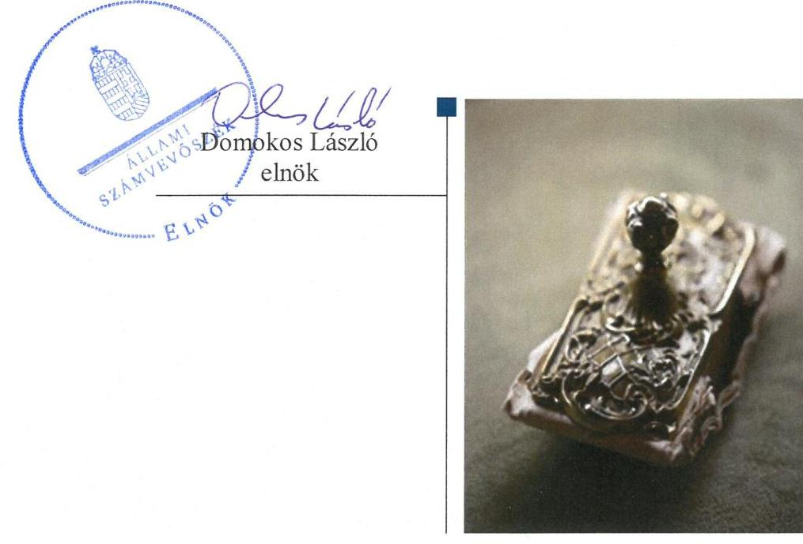
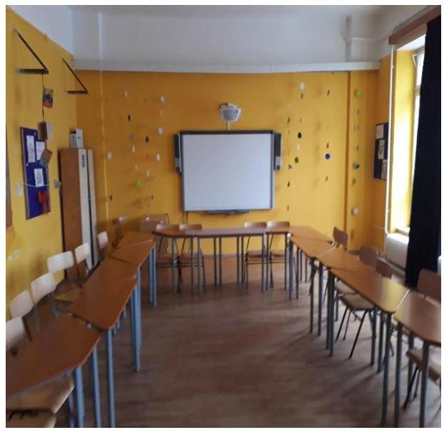

# Jelentés 

## Nem állami humánszolgáltatók ellenőrzése

A humánszolgáltatást nyújtó államháztartáson kívüli köznevelési és szociális intézmények, szolgáltatók fenntartói központi költségvetésből kapott támogatásai felhasználásának ellenőrzése - Mú-Hely Líceum Alapítvány

2019.

---

# Jelentés 

## Nem állami humánszolgáltatók ellenőrzése

A humánszolgáltatást nyújtó államháztartáson kívüli köznevelési és szociális intézmények, szolgáltatók fenntartói központi költségvetésből kapott támogatásai felhasználásának ellenőrzése - Mú-Hely Líceum Alapítvány
2019. 07. hó 25. nap

---

# AZ ELLENŐRZÉST FELÜGYELTE:

## MAROZSÁN LÁSZLÓNÉ felügyeleti vezető

## AZ ELLENŐRZÉST VEZETTE ÉS A VÉGREHAJTÁSÁÉRT FELELŐS:

### KUSZINGER ANDREA ellenőrzésvezető

### A PROGRAM ÖSSZEÁLLÍTÁSÁÉRT FELELŐS:

### TÓTPÁL SZABOLCS osztályvezető

---

**IKTATÓSZÁM:** EL-1600-001/2019

**TÉMASZÁM:** 2448

**ELLENŐRZÉS-AZONOSÍTÓ SZÁM:** V079422

---

Jelentéseink az Országgyűlés számítógépes hálózatán és az Interneten a www.asz.hu címen is olvashatóak.

---

# TARTALOMJEGYZÉK 

■ ÖSSZEGZÉS ..... 5
■ AZ ELLENŐRZÉS CÉLJA ..... 6
■ AZ ELLENŐRZÉS TERÜLETE ..... 7
■ AZ ELLENŐRZÉS HÁTTERE, INDOKOLTSÁGA ..... 8
■ A JELENTÉS LÉNYEGES KÉRDÉSKÖREI ..... 9
■ AZ ELLENŐRZÉS HATÓKÖRE ÉS MÓDSZEREI ..... 10
■ MEGÁLLAPÍTÁSOK ..... 12
■ JAVASLATOK ..... 15
■ MELLÉKLETEK ..... 17
I. sz. melléklet: Értelmező szótár ..... 17
■ FÜGGELÉKEK ..... 19
I. sz. függelék a Jelentéshez ..... 19
II. sz. függelék: Észrevételek ..... 20
■ RÖVIDÍTÉSEK JEGYZÉKE ..... 21

---

.

---

# ÖSSZEGZÉS 

A Mú-Hely Líceum Alapítvány belső szabályozottságának kialakítása nem biztosította a szabályszerű gazdálkodás feltételeit. A köznevelési közfeladathoz biztosított központi költségvetési támogatásokat nem szabályszerűen fordította köznevelési intézményei működtetésére.

## Az ellenőrzés társadalmi indokoltsága

Az Állami Számvevőszék stratégiájában hangsúlyos szerepet szán annak, hogy szilárd szakmai alapon álló, értékteremtő ellenőrzéseivel előmozdítsa a közpénzügyek átláthatóságát, rendezettségét, és javaslataival a közpénzek és a közvagyon szabályos, gazdaságos, hatékony és eredményes felhasználását segítse. Az Állami Számvevőszék a stratégiájában célul tűzte ki, hogy az államháztartáson kívülre nyújtott költségvetési támogatások ellenőrzésével hozzájárul ahhoz, hogy a közpénzeket az államháztartáson kívüli szervezetek is átlátható módon használják fel a közfeladatok szerződésben vállalt ellátása érdekében. Az Állami Számvevőszék e stratégiai céljaival összhangban - az Állami Számvevőszékről szóló 2011. évi LXVI. törvény felhatalmazása alapján - végzi a központi költségvetésből származó források, nyújtott támogatások - kedvezményezett szervezetek közfeladat ellátásához való - felhasználásának az ellenőrzését.

## Főbb megállapítások, következtetések, javaslatok

A Mú-Hely Líceum Alapítvány belső szabályozottságának kialakítása nem volt szabályszerű, mivel a számviteli politikát nem a jogszabályban foglalt tartalommal készítette el és számlarenddel nem rendelkezett, így nem teremtette meg a szabályszerű gazdálkodás feltételeit.

A Mú-Hely Líceum Alapítvány a központi költségvetési támogatásokat nem alapfeladatonkénti bontásban, elkülönítetten és naprakészen tartotta nyilván, az adatok valódiságát pénzügyi dokumentációval nem támasztotta alá, illetve nem gondoskodott a támogatások cél szerinti felhasználásának jogszabályi előírások szerinti nyilvántartásáról, ezáltal nem biztosította az elszámoltathatóságot.

A Mú-Hely Líceum Alapítvány a köznevelési közfeladatot ellátó intézményei működtetéséhez felhasznált közpénzekre vonatkozó gazdálkodásával a nyilvánosság előtt nem szabályszerűen számolt el, mivel a 2014-2017. években egyszerűsített éves beszámolóit saját honlapján nem tette közzé.

Az Állami Számvevőszék a Mú-Hely Líceum Alapítvány kuratóriumi elnökének 5 javaslatot fogalmazott meg.

---

# AZ ELLENŐRZÉS CÉLJA 

AZ ELLENŐRZÉS CÉLJA annak értékelése, hogy a Mú-Hely Líceum Alapítvány, mint Fenntartó ${ }^{1}$ központi költségvetésből kapott támogatásainak felhasználása szabályszerű volt-e, a támogatások igénylése, évközi módosítása és év végi elszámolása megfelelt-e a jogszabályi előírásoknak.

---

# **AZ ELLENŐRZÉS TERÜLETE**

## **Mú-Hely Líceum Alapítvány**

A Mú-Hely Líceum Alapítvány magánszemély által alapított, 1998-ban nyilvántartásba vett, közhasznú jogállású, nyílt alapítvány. Fő célja, az önhibájukon kívül veszélyeztetetté váló fiatalok, fiatal felnőttek számára köznevelési feladatokat ellátó intézmények működtetése, a sajátos nevelési igényű, hátrányos helyzetű, valamint halmozott problémákkal küzdő diákok általános és középfokú oktatása-nevelése.

A Mú-Hely Líceum Alapítvány ügyvezető szerve a Kuratórium², amelynek elnöke látta el a képviseleti feladatokat. Az elnök személye az ellenőrzött időszakban nem változott. Az alapító a Kuratórium munkájának ellenőrzése céljából felügyelő bizottságot hozott létre.

A Mú-Hely Líceum Alapítvány a 2014-2017. években két köznevelési intézmény, a Pentelei Mentálhigiénés Általános Iskola, Szakképző Iskola és Gimnázium, illetve a Zöld Kakas Líceum Mentálhigiénés Szakgimnázium, Gimnázium és Általános Iskola fenntartásával és működtetésével látta el közfeladatát.

A 2017. év végén a hatályos működési engedélyekben foglaltak szerint az engedélyezett maximális tanuló létszám a dunaújvárosi székhelyű Pentelei Mentálhigiénés Általános Iskola, Szakképző Iskola és Gimnáziumban, illetve a budapesti székhelyű Zöld Kakas Líceum Mentálhigiénés Szakgimnázium, Gimnázium és Általános Iskolában is 600 fő volt.

A Mú-Hely Líceum Alapítvány a 2014-2017. években a köznevelési közfeladat ellátásában az Emberi Erőforrások Minisztériumával kötött köznevelési szerződés és a Budapest Főváros Kormányhivatallal kötött szakképzési megállapodás alapján vett részt.

A Mú-Hely Líceum Alapítvány intézményei fenntartására és működtetésére 2014-ben 217,8 millió Ft, 2015-ben 238,1 millió Ft, 2016-ban 247,8 millió Ft, és 2017-ben 242,7 millió Ft központi költségvetési támogatást kapott.

---

# AZ ELLENŐRZÉS HÁTTERE, INDOKOLTSÁGA 

A köznevelési feladatokat ellátó nem állami intézményfenntartók részére közfeladataik ellátására a 2014-2017. években jelentős összegű pénzügyi támogatást biztosítottak a mindenkori költségvetési törvények a bennük megfogalmazott feltételek mellett. A 2013. évben jelentős változások következtek be a normatív finanszírozás rendszerében. Az Országgyűlés elfogadta a nemzeti köznevelésről szóló törvényt, amely jelentősen átalakította a korábbi finanszírozási rendszert 2013. szeptemberétől. Új feladatfinanszírozási forma (átlagbéralapú támogatás) jelent meg, amely az államháztartáson kívüli intézményfenntartókra is vonatkozik.

Az ÁSZ ${ }^{3}$ stratégiájában célul tűzte ki, hogy az államháztartáson kívülre nyújtott költségvetési támogatások ellenőrzésével hozzájárul ahhoz, hogy a közpénzeket az államháztartáson kívüli szervezetek is átlátható módon használják fel közfeladatok ellátására kötött szerződésekben vállalt kötelezettségek ellátása érdekében. Az ÁSZ stratégiájában foglaltak alapján is indokolt az ellenőrzés, amely a társadalom számára jelzi, hogy a közpénz államháztartáson kívüli felhasználása sem maradhat ellenőrizetlenül. Az államháztartáson kívülre nyújtott költségvetési támogatások ellenőrzésével az ÁSZ hozzájárul ahhoz, hogy a közpénzeket a nem állami humán fenntartók átlátható módon használják fel a közfeladatok ellátására kötött szerződésekben vállalt kötelezettségek teljesítése érdekében. Az ellenőrzés javaslataival hozzájárulhat az említett rendszerek szabályszerű támogatásfelhasználásához, javíthatja a társadalmi-gazdasági döntések megalapozottságát, amely a „jó kormányzás" feltétele.

---

# A JELENTÉS LÉNYEGES KÉRDÉSKÖREI 

1. A köznevelési közfeladatot ellátó Fenntartó szabályszerű működési- és gazdálkodási környezet kialakításával megteremtette-e a költségvetési támogatások átlátható, elszámoltatható igénybevételének, felhasználásának feltételeit?
2. A Fenntartó az átvállalt köznevelési közfeladathoz biztosított költségvetési támogatásokat szabályszerűen fordította-e a köznevelési intézményei működtetésére?
3. A Fenntartó a köznevelési intézményei működtetéséhez felhasznált közpénzekre vonatkozó gazdálkodásával a nyilvánosság előtt elszámolt-e, ennek megalapozása érdekében ellenőrzési, értékelési és a külső ellenőrzésekkel kapcsolatos intézkedési feladatait szabályszerűen látta-e el?

---

# AZ ELLENŐRZÉS HATÓKÖRE ÉS MÓDSZEREI 

## Az ellenőrzés típusa

Megfelelőségi ellenőrzés.

## Az ellenőrzött időszak

A 2014. január 1-je és 2017. december 31-e közötti időszak. A helyszíni szemle tekintetében 2018. január 1-jétől 2019. január 22-ig tartó időszak.

## Az ellenőrzés tárgya

Az ellenőrzés a köznevelési közfeladatokat ellátó államháztartáson kívüli Fenntartó humánszolgáltatási közfeladatai ellátásához a költségvetési törvényekben biztosított központi költségvetési támogatások igénylése, évközi módosítása és év végi elszámolása fenntartói feladatainak ellátása, illetve e központi költségvetésből kapott támogatásaik humánszolgáltatási közfeladatokra való fenntartó általi felhasználása szabályszerűségének értékelésére terjedt ki.

## Az ellenőrzött szervezet

Mú-Hely Líceum Alapítvány

## Az ellenőrzés jogalapja

Az ellenőrzés jogszabályi alapját az ÁSZ tv. 4. § (3) bekezdése, 5. § (3) bekezdésben foglalt előírások adták.

## Az ellenőrzés módszerei

Az ellenőrzést az ellenőrzési program szempontjai, kérdései, az ellenőrzött időszakban hatályos jogszabályok, a nemzetközi standardokat irányadónak tekintve, az ellenőrzés szakmai szabályok és módszertanok figyelembe vételével végezte az ÁSZ. A közpénzekkel való felelős gazdálkodás segítésére irányuló javaslatok kidolgozásakor a hatályos jogszabályok voltak az irányadóak.

Az ellenőrzés ideje alatt az ellenőrzött szervezettel történő kapcsolattartást az ÁSZ SZMSZ ${ }^{5}$-ének vonatkozó előírásai alapján biztosította az ÁSZ.

---

Az ellenőrzési kérdések megválaszolásához szükséges bizonyítékok megszerzése az ellenőrzött által rendelkezésre bocsátott dokumentumokra, adatokra alapozva, valamint elemző eljárással történt.

Az ellenőrzési bizonyítékként felhasználható adatforrások közé tartoztak egyrészt a szakmai program részletes szempontjainál felsorolt adatforrások, másrészt minden - az ellenőrzés folyamán feltárt, az ellenőrzés szempontjából információt tartalmazó - dokumentum.

Az ellenőrzés lefolytatásához az ellenőrzött szervezet a kitöltött tanúsítványok, valamint az ÁSZ által kért dokumentumok elektronikus úton való megküldésével szolgáltatott adatokat, információkat. Az így rendelkezésre bocsátott adatok, információk és a tanúsítványok adatai valódiságának kontrollja az ellenőrzés keretében történt.

A fenntartott köznevelési intézményeknél helyszíni szemle keretében győződött meg az ÁSZ a tényleges feladatellátásról (verifikáció).

A köznevelési humánszolgáltatások központi költségvetési támogatásai igénylésével, módosításával, elszámolásával kapcsolatos, államháztartáson kívüli fenntartó jogszabályokban előírt feladatai betartását, továbbá a központi költségvetési támogatások szabályszerű kezelését, nyilvántartását ellenőrizte az ÁSZ a Fenntartónál határozatok, nyilvántartások és egyéb dokumentumok alapján. Az ellenőrzés nem terjedt ki a köznevelési humánszolgáltatások központi költségvetési támogatásai igénylése, módosítása, elszámolása valódiságának, megalapozottságának, helyességének - sem a Fenntartónál, sem a székhely intézményeinél való - értékelésére. Továbbá nem terjedt ki az ellenőrzés e források, intézmények általi szabályszerű felhasználásának értékelésére.

---

# MEGÁLLAPÍTÁSOK 

## 1. A köznevelési közfeladatot ellátó Fenntartó szabályszerű működési- és gazdálkodási környezet kialakításával megteremtette-e a költségvetési támogatások átlátható, elszámoltatható igénybevételének, felhasználásának feltételeit?

Összegző megállapítás

A Fenntartó köznevelési közfeladat ellátásának megszervezése szabályszerű volt, a belső szabályozottságának kialakítása nem a jogszabályi előírások szerint történt. A Fenntartó a költségvetési támogatások igénylési, módosítási és elszámolási feladatait szabályszerűen látta el.

ALAPÍTÓ OKIRATTAL ${ }^{6}$ a jogszabályi előírások szerint rendelkezett a Fenntartó. A Fenntartót a Törvényszék ${ }^{7}$ nyilvántartásba vette.

A Fenntartó a Civilszr. ${ }^{8}$ szerinti kettős könyvvitellel alátámasztott egyszerűsített éves beszámolót, valamint közhasznúsági mellékletet készített.

A SZÁMVITELI POLITIKÁBAN ${ }^{9}$ a Számv. tv. ${ }^{10}$ 14. § (11) bekezdésében foglaltak ellenére a 2015. július 4-étől bekövetkezett törvénymódosítás miatti változást a Fenntartó nem vezette keresztül, így a Számv. tv. 14. § (4) bekezdésében foglaltak ellenére a számviteli politika 2015. októberétől írásban nem rögzítette azokat a Fenntartóra jellemző szabályokat, előírásokat, módszereket, amelyekkel meghatározza, hogy mit tekint a számviteli elszámolás, az értékelés szempontjából kivételes nagyságú vagy előfordulású bevételnek, költségnek, ráfordításnak.

SZÁMLARENDET a Fenntartó képviseletére jogosult személy a Számv. tv. 161. § (4) bekezdésében foglaltak ellenére a 2014-2017. években nem állította össze.

A KÖLTSÉGVETÉSI TÁMOGATÁSOK igénylése, módosítása és Kincstár ${ }^{11}$ felé történő elszámolása szabályszerű volt.

---

# 2. A Fenntartó az átvállalt köznevelési közfeladathoz biztosított költségvetési támogatásokat szabályszerűen fordította-e a köznevelési intézményei működtetésére? 

Összegző megállapítás

A Fenntartó az átvállalt köznevelési közfeladathoz biztosított költségvetési támogatásokat nem szabályszerűen fordította a köznevelési intézményei működtetésére.

A Fenntartó kiadta a köznevelési intézményei alapító okiratait, gondoskodott az intézmények nyilvántartásba vételéről és a működési engedélyeinek kiadásáról, biztosította a köznevelési intézmények tárgyi feltételeit.

A KÖZPONTI KÖLTSÉGVETÉSI TÁMOGATÁSOK felhasználását a Fenntartó az Nkt. vhr. ${ }^{12}$ 37/G. § (1) bekezdésében előírtak ellenére nem alapfeladatonkénti bontásban, elkülönítetten és naprakészen tartotta nyilván. Az általa vezetett nyilvántartás (a főkönyvi nyilvántartás) adatainak valódiságát az Nkt. vhr. 37/G. § (1) bekezdésében foglaltak ellenére pénzügyi dokumentációval nem támasztotta alá, illetve nem gondoskodott olyan nyilvántartás kialakításáról, amelyből megállapítható volt, hogy a támogatások milyen határnappal kerültek átadásra, és milyen célra kerültek felhasználásra.

A Fenntartó a központi költségvetési támogatásokat a 2014. évben teljes összegben átadta köznevelési intézményei
 részére, a 2015-2017. években a támogatást nem teljes összegben adta át a fenntartott köznevelési intézményeknek, ugyanakkor a támogatásokról az Nkt. vhr. 37/G. § (1) bekezdésében foglaltak ellenére nem vezetett olyan nyilvántartást, amelyből megállapítható volt, hogy az át nem adott támogatást milyen célra használta fel.

## 3. A Fenntartó a köznevelési intézményei működtetéséhez felhasznált közpénzekre vonatkozó gazdálkodásával a nyilvánosság előtt elszámolt-e, ennek megalapozása érdekében ellenőrzési, értékelési és a külső ellenőrzésekkel kapcsolatos intézkedési feladatait szabályszerűen látta-e el?

Összegző megállapítás

A Fenntartó a köznevelési intézményei működtetéséhez felhasznált közpénzekre vonatkozó gazdálkodásával a nyilvánosság előtt nem szabályszerűen számolt el. Az ellenőrzési feladatait ellátta, a külső ellenőrzésekkel kapcsolatos intézkedési kötelezettségének eleget tett.

EGYSZERŰSÍTETT ÉVES BESZÁMOLÓJÁT és közhasznúsági mellékletét a Fenntartó a 2014-2017. években határidőben letétbe helyezte, azonban a Civil tv. ${ }^{13} 30 . \S$ (4) bekezdésében foglaltak ellenére a 2014-2017. évekre vonatkozó beszámolóit és közhasznúsági mellékleteit saját honlapján nem tette közzé.

---

A Fenntartó az ellenőrzött időszakban több alkalommal ellenőrizte és értékelte az egyik fenntartott intézményének szakmai feladatellátását, azonban az Nkt. ${ }^{14}$ 85. § (3) bekezdésében foglaltak ellenére a honlapján nem hozta nyilvánosságra a nevelési-oktatási intézmény munkájával összefüggő értékelését.

TÖRVÉNYESSÉGI ÉS HATÓSÁGI ELLENŐRZÉS a Fenntartó intézményei feladatellátását érintette az ellenőrzött időszakban. Az ellenőrzések során tett javaslatokra meghatározott intézkedési kötelezettségének a Fenntartó eleget tett. A Fenntartót a 2014. évre vonatkozóan érintette a Kincstár által végzett költségvetési támogatás elszámolásának jogszerűségét vizsgáló helyszíni ellenőrzés, amely alapján a Fenntartónak visszafizetési kötelezettsége keletkezett, amelyet teljesített.

---

# JAVASLATOK 

Az ÁSZ tv. 33. § (1) bekezdésében foglaltak értelmében az ellenőrzött szervezet vezetője köteles a jelentésben foglalt megállapításokhoz kapcsolódó intézkedési tervet összeállítani és azt a jelentés kézhezvételétől számított 30 napon belül az ÁSZ részére megküldeni. Amennyiben az ellenőrzött szervezet vezetője nem küldi meg határidőben az intézkedési tervet, vagy továbbra sem elfogadható intézkedési tervet küld, az Állami Számvevőszék elnöke az ÁSZ tv. 33. § (3) bekezdése a) és b) pontjaiban foglaltakat érvényesítheti.

## Mü-Hely Líceum Alapítvány kuratóriuma elnökének

1. Intézkedjen arról, hogy a számviteli politika megfeleljen a Számv. tv. előírásainak.
(1. sz. megállapítás 3. bekezdése alapján)
2. Intézkedjen a Számv. tv. előírásának megfelelően, a számlarend elkészítéséről.
(1. sz. megállapítás 4. bekezdése alapján)
3. Gondoskodjon a jogszabályi előírásnak megfelelő nyilvántartás vezetéséről a költségvetési támogatás felhasználásáról.
(2. sz. megállapítás 2-3. bekezdése alapján)
4. Intézkedjen az éves beszámolójának és a közhasznúsági mellékletének a jogszabályi előírásnak megfelelő közzétételéről.
(3. sz. megállapítás 1. bekezdése alapján)
5. Intézkedjen a fenntartott nevelési-oktatási intézmények munkájával összefüggő értékelésének Nkt.-ban előírtaknak megfelelő nyilvánosságra hozásáról.
(3. sz. megállapítás 2. bekezdése alapján)

---

.

---

# MELLÉKLETEK 

- I. SZ. MELLÉKLET: ÉRTELMEZŐ SZÓTÁR
civil szervezet
humánszolgáltatás
költségvetési támogatás
köznevelési közfeladat
köznevelési intézmény

A Civil tv. 2. § 6. pontja szerint civil szervezet a civil társaság, a Magyarországon nyilvántartásba vett egyesület (a párt, a szakszervezet és a kölcsönös biztosító egyesület kivételével), a közalapítvány és a pártalapítvány kivételével az alapítvány.
Külön törvényben meghatározott szociális, gyermekjóléti, gyermekvédelmi, közoktatási, felsőoktatási, kulturális közfeladatok (2014. évi Kvtv. 34. § (1), (4) bekezdés, 1. számú melléklet XX/20/2. alcím, 19. alcím, 2015. évi Kvtv. 43. § (1), (4) bekezdés, 1. számú melléklet XX/20/2/3. jogcím csoport, 19. alcím, 2016. évi Kvtv. 41. § (1), (4) bekezdés, 1. számú melléklet XX/20/2/3. jogcím csoport, 19. alcím).
a társadalombiztosítás pénzügyi alapjai kivételével az államháztartás központi alrendszeréből ellenérték nélkül, pénzben nyújtott támogatások (Áht. ${ }^{15}$ 1. § 14. pont)
A költségvetési törvényekben (2013. évi CCXXX. törvény 33-34. §, 2014. évi C. törvény 4243. §, 2015. évi C. törvény 40-41. §) megállapított támogatás. A 2015. évi C. törvény 4041. § szerint többek között: Az Országgyűlés a köznevelési feladat ellátására átlagbéralapú támogatást állapít meg. A nevelési-oktatási, valamint pedagógiai szakszolgálati intézményt fenntartó nemzetiségi önkormányzat, az egyházi és magán köznevelési intézmény fenntartója részére az általuk fenntartott nevelési-oktatási intézményben, továbbá pedagógiai szakszolgálati intézményben pedagógus és - a b) pont kivételével - nevelő-oktató munkát közvetlenül segítő munkakörben foglalkoztatottak után a 7. melléklet I. pontja, valamint az óvoda, egységes óvoda-bölcsőde esetében a 2. melléklet II. pont 1. alpontja szerint és az 5. alpontjában meghatározott jogosultak után, az őket ott megillető mértékek szerint. Működési támogatást állapít meg a nemzetiségi önkormányzat vagy az egyházi jogi személy által fenntartott nevelési-oktatási intézményekben ellátott, továbbá a pedagógiai szakszolgálati intézményekben gyógypedagógiai tanácsadásban, korai fejlesztésben, oktatásban és gondozásban, valamint a fejlesztő nevelésben részt vevő gyermekekre, tanulókra tekintettel a nemzetiségi önkormányzat és a bevett egyház részére a 7. melléklet II. pontja szerint.

A köznevelési intézmény alapító okiratában, szakmai alapdokumentumában foglalt feladat: óvodai nevelés, nemzetiséghez tartozók óvodai nevelése, általános iskolai nevelés-oktatás, nemzetiséghez tartozók általános iskolai nevelése-oktatása, kollégiumi ellátás, nemzetiségi kollégiumi ellátás, gimnáziumi nevelés-oktatás, szakközépiskolai nevelés-oktatás, szakiskolai nevelés-oktatás, nemzetiség gimnáziumi nevelés-oktatása, nemzetiség szakközépiskolai nevelés-oktatása, nemzetiség szakiskolai nevelés-oktatása, Köznevelési Hídprogramok keretében folyó nevelés-oktatás, felnőttoktatás, alapfokú művészetoktatás, fejlesztő nevelés, fejlesztő nevelés-oktatás, pedagógiai szakszolgálati feladat, a többi gyermekkel, tanulóval együtt nevelhető, oktatható sajátos nevelési igényű gyermekek, tanulók óvodai nevelése és iskolai nevelése-oktatása, azoknak a sajátos nevelési igényű gyermekeknek, tanulóknak az óvodai, iskolai, kollégiumi ellátása, akik a többi gyermekkel, tanulóval nem foglalkoztathatók együtt, a gyermekgyógyüdülőkben, egészségügyi intézményekben, rehabilitációs intézményekben tartós gyógykezelés alatt álló gyermekek tankötelezettségének teljesítéséhez szükséges oktatás, pedagógiai-szakmai szolgáltatás. (Nkt. 4. § 1. pont)
A nevelési-oktatási intézmény, pedagógiai szakszolgálati intézmény, pedagógiai-szakmai szolgáltatást nyújtó intézmény.(Nkt. 7. § (1) bekezdés)

---

nem állami, nem önkormányzati (államháztartáson kívüli) intézmény fenntartó

A köznevelési és szociális, gyermekjóléti és gyermekvédelmi közfeladatokat/humánszolgáltatásokat ellátó intézményt fenntartó egyházi jogi személy, társadalmi szervezet, alapítvány, közalapítvány, civil szervezet, országos nemzetiségi önkormányzat, nonprofit gazdasági társaság, gazdasági társaság és a humánszolgáltatást alaptevékenységként végző, Szja tv. hatálya alá tartozó egyéni vállalkozó. (2013. évi Kvtv. 35. § (1), (3) bekezdés, 2014. évi Kvtv. 33. §, 34. § (1), (4) bekezdés, 2015. évi Kvtv. 42. §, 43. § (1), (4) bekezdés, 2016. évi Kvtv. 40. §, 41. § (1), (4) bekezdés)

---

# FÜGGELÉKEK 

- I. SZ. FÜGGELÉK A JELENTÉSHEZ

Az Állami Számvevőszék az ellenőrzések során feltárt tényekhez kapcsolódó további körülmények tisztázására eszközrendszerrel nem rendelkezik. Amennyiben az ellenőrzésen túlmutatóan indokoltnak látszik az ellenőrzés során feltárt körülmények további vizsgálata, az Állami Számvevőszék törvényi felhatalmazás alapján az ellenőrzés által feltárt körülményeket továbbítja a hatáskörrel rendelkező szervnek a szükséges intézkedések megtétele, eljárások lefolytatása érdekében.
I. A Fenntartó az Nkt. vhr. 37/G. § (1) bekezdésben előírtak ellenére a 2015-2017. években nem gondoskodott olyan nyilvántartás kialakításáról, amelyből megállapítható volt, hogy a támogatások milyen határnappal kerültek átadásra és milyen célra kerültek felhasználásra. Ebből következően a Fenntartó nem igazolta az át nem adott továbbutalási célú támogatások köznevelési intézmények fenntartásához és működtetéséhez történő cél szerinti felhasználását, és nem biztosította az át nem adott támogatások elszámoltathatóságát. Továbbá a 2014-2016. években a Fenntartó által készített nyilvántartás (főkönyvi nyilvántartás) adatainak valódiságát, a 2017. évben a támogatás intézményeknek történő továbbadását pénzügyi dokumentációval nem támasztotta alá, ebből következően a számviteli elszámolását (nyilvántartását) a Számv. tv. 166. § (1) bekezdésében foglaltaknak megfelelő számviteli bizonylattal (bankkivonattal, pénztárbizonylattal) nem támasztotta alá.
A számviteli bizonylatok hiánya miatt a Fenntartó nem biztosította a Számv. tv. 15. § (3) bekezdésében foglalt beszámoló valódisága elvének érvényesülését.
A pénzügyi dokumentációval alá nem támasztott, nem megbízható fenntartói beszámolók és a Fenntartó által az ellenőrzéshez rendelkezésre bocsátott intézményi beszámolók alapján a 2015. évben 18,1 millió Ft, a 2016. évben 8,8 millió Ft és a 2017. évben 5,9 millió Ft költségvetési támogatást nem adott át a Fenntartó az általa fenntartott intézmények részére.
Annak következtében, hogy az intézményeknek át nem adott költségvetési támogatásokról nem vezetett olyan nyilvántartást, amelyből megállapítható volt a támogatások cél szerinti felhasználása, nem zárható ki, hogy a Fenntartónál vagyoni hátrány keletkezhetett.
Az eset körülményeinek felderítésére az ügyészség rendelkezik hatáskörrel.

---

A jelentéstervezetet a Számvevőszék 15 napos észrevételezésre megküldte az ellenőrzött szervezet vezetőjének az ÁSZ tv. 29. § (1) bekezdése előírásának megfelelően.

A Mü-Hely Liceum Alapítvány kuratóriumi elnöke az ÁSZ tv. 29. § (2) bekezdésében foglalt határidőn belül nem tett észrevételt a jelentéstervezet megállapításaira.

[^0]
[^0]:    * 29. § (1) Az Állami Számvevőszék az ellenőrzési megállapításait megküldi az ellenőrzött szervezet vezetőjének vagy az általa megbízott személynek, és annak, akinek személyes felelősségét állapította meg.
    (2) Az ellenőrzött szervezet vezetője és a felelősként megjelölt személy az ellenőrzés megállapításaira tizenöt napon belül írásban észrevételt tehet.
    (3) Az Állami Számvevőszék az észrevételre a beérkezésétől számított harminc napon belül írásban válaszol. A figyelembe nem vett észrevételeket köteles a jelentésben feltüntetni, és megindokolni, hogy azokat miért nem fogadta el.

---

# RÖVIDÍTÉSEK JEGYZÉKE 

${ }^{1}$ Fenntartó
${ }^{2}$ Kuratórium
${ }^{3}$ ÁSZ
${ }^{4}$ ÁSZ tv.
${ }^{5}$ ÁSZ SZMSZ
${ }^{6}$ Alapító Okirat

[^0]Mü-Hely Líceum Alapítvány
Mü-Hely Líceum Alapítvány Kuratóriuma
Állami Számvevőszék
az Állami Számvevőszékről szóló 2011. évi LXVI. törvény (hatályos: 2011. július 1-jétől)
az Állami Számvevőszék Szervezeti és Működési Szabályzata
alapító okirat: Mü-Hely Líceum Alapítvány alapító okirata (hatályos: 2012. május 17-től)
alapító okirat: Mü-Hely Líceum Alapítvány alapító okirata (hatályos: 2014. október 20-tól)
alapító okirat: Mü-Hely Líceum Alapítvány alapító okirata (hatályos: 2016. február 18-tól)
alapító okirat: Mü-Hely Líceum Alapítvány alapító okirata (hatályos: 2016. május 5-től)
alapító okirat: Mü-Hely Líceum Alapítvány alapító okirata (hatályos: 2017. augusztus 22-től)
Fővárosi Törvényszék
Civilszr.: 224/2000. (XII. 19.) Korm. rendelet a számviteli törvény szerinti egyes egyéb szervezetek beszámolókészítési és könyvvezetési kötelezettségének sajátosságairól (hatályos: 2001. január 1-jétől 2016. december 31-ig)

Civilszr.: 479/2016. (XII. 28.) Korm. rendelet a számviteli törvény szerinti egyes egyéb szervezetek beszámoló készítési és könyvvezetési kötelezettségének sajátosságairól (hatályos: 2017. január 1-jétől)
számviteli politika: Mü-Hely Líceum Alapítvány Számviteli politika, Eszközök és források értékelési szabályzata, Eszközök és források leltárkészítési és leltározási szabályzata, Pénzkezelési szabályzat (hatályos: 2014. január 1-jétől)
számviteli politika: Mü-Hely Líceum Alapítvány Számviteli politika, Eszközök és források értékelési szabályzata, Eszközök és források leltárkészítési és leltározási szabályzata, Pénzkezelési szabályzat (hatályos: 2017. január 1-jétől)
a számvitelről szóló 2000. évi C. törvény (hatályos: 2001. január 1-jétől)
Magyar Államkincstár
229/2012. (VIII. 28.) Korm. rendelet a nemzeti köznevelésről szóló törvény végrehajtásáról az egyesülési jogról, a közhasznú jogállásról, valamint a civil szervezetek működéséről és támogatásáról szóló 2011. évi CLXXV. törvény (hatályos: 2011. december 22-től)
a nemzeti köznevelésről szóló 2011. évi CXC. törvény (hatályos: 2012. szeptember 1-jétől)
az államháztartásról szóló 2011. évi CXCV. törvény (hatályos: 2012. január 1-jétől)

[^0]:    ${ }^{9}$ Számviteli politika
    ${ }^{10}$ Számv. tv.
    ${ }^{11}$ Kincstár
    ${ }^{12}$ Nkt. vhr.
    ${ }^{13}$ Civil tv.
    ${ }^{14}$ Nkt
    ${ }^{15}$ Áht.

---

# ÁLLAMI SZÁMVEVŐSZÉK 

1052 Budapest, Apáczai Csere János utca

 10.
Levélcím: 1364 Budapest 4. Pf. 54
Telefon: +36 1 484 9100 Telefax: +36 1 484 9200
www.asz.hu
