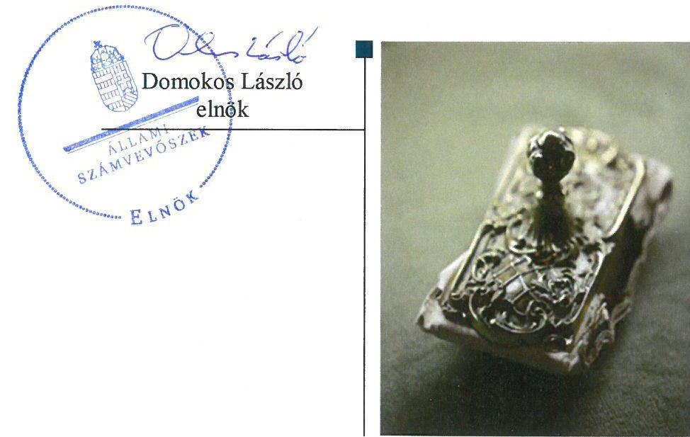
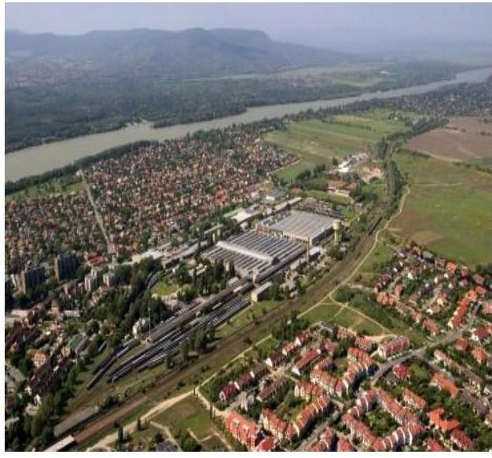
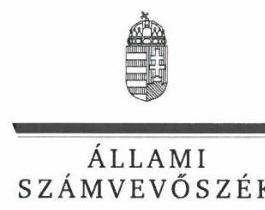
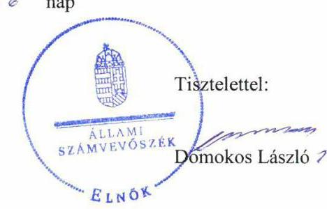
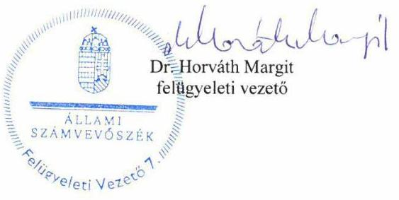

# Jellentés 

## Az állami tulajdonú gazdasági társaságok ellenőrzése

Dunakeszi Jármújavító Korlátolt
Felelősségű Társaság
2019.

---

# Jelentés 

## Az állami tulajdonú gazdasági társaságok ellenőrzése

Dunakeszi Jármújavító Korlátolt
Felelősségú Társaság
2019. Of. hó 30. nap

---

# AZ ELLENŐRZÉST FELÜGYELTE:

DR. HORVÁTH MARGIT felügyeleti vezető

## AZ ELLENŐRZÉST VEZETTE ÉS A VÉGREHAJTÁSÁÉRT FELELŐS:

SALI SÁNDORNÉ ellenőrzésvezető

A PROGRAM ÖSSZEÁLLÍTÁSÁÉRT FELELŐS:

TÓTPÁL SZABOLCS osztályvezető

IKTATÓSZÁM: EL-0818-099/2019.

TÉMASZÁM: 2480

ELLENŐRZÉS-AZONOSÍTÓ SZÁM: V082411

Jelentéseink az Országgyűlés számítógépes hálózatán és az Interneta a www.asz.hu címen is olvashatóak.

---

# TARTALOMJEGYZÉK 

■ ÖSSZEGZÉS ..... 5
■ AZ ELLENŐRZÉS CÉLJA ..... 6
■ AZ ELLENŐRZÉS TERÜLETE ..... 7
■ AZ ELLENŐRZÉS HÁTTERE, INDOKOLTSÁGA ..... 8
■ A JELENTÉS LÉNYEGES KÉRDÉSKÖREI ..... 9
■ AZ ELLENŐRZÉS HATÓKÖRE ÉS MÓDSZEREI ..... 10
■ MEGÁLLAPÍTÁSOK ..... 12
■ JAVASLATOK ..... 14
■ MELLÉKLETEK ..... 17
I. sz. melléklet: Fogalomtár ..... 17
■ FÜGGELÉKEK ..... 19
I. sz. függelék a jelentéshez ..... 19
II. sz. függelék: Észrevételek ..... 20
■ RÖVIDÍTÉSEK JEGYZÉKE ..... 33

---

.

---

# ÖSSZEGZÉS 

A Dunakeszi Jármújavító Korlátolt Felelősségű Társaság müködésének szabályozottsága a 2017. évre javult. A Társaság gazdálkodása, vagyongazdálkodása nem volt szabályszerű, a mérleg valódiság elve, az elszámoltathatóság, a vagyon védelme nem volt biztositott.

## Az ellenőrzés társadalmi indokoltsága

Az állami tulajdonú gazdálkodó szervezetek a nemzeti vagyon részét képezik. Gazdálkodásuk a közérdeklődés és a média figyelmének középpontjában áll. A közpénzt, közvagyont felhasználó állami tulajdonú gazdálkodó szervezetekkel szemben alapvető társadalmi igény, hogy müködésük, gazdálkodásuk szabályszerű, az általuk szolgáltatott adatok minél megbízhatóbbak legyenek. Az Állami Számvevőszék a közvagyon, a közpénzek szabályos, átlátható és elszámoltatható felhasználásának elősegítése érdekében, stratégiájával összhangban végzi az államháztartáson kívül működő szervezetek ellenőrzését.

A Dunakeszi Jármújavító Korlátolt Felelősségű Társaság megfelelő működése fontos az állami vagyon védelme szempontjából, emiatt került sor a Társaság ellenőrzésére.

## Főbb megállapítások, következtetések, javaslatok

A Dunakeszi Jármújavító Korlátolt Felelősségű Társaság szabályozottsága 2017-re javult, a számlarend kivételével a jogszabályi előírásokkal összhangban volt. A Társaság a jogszabályi előírás ellenére az ellenőrzött időszakban számlarenddel nem rendelkezett.

A gazdálkodás keretében a bevételek és ráfordítások elszámolása nem volt szabályszerű. A Társaság a bevételeket és a ráfordításokat a számviteli törvényben foglaltak ellenére bizonylattal nem támasztotta alá. A könyvvezetés - a számlarend hiányában - nem alapozta meg a számviteli törvényben előírt beszámoló készítését. A Társaság az általa nyújtott szolgáltatások díjtételeit számviteli törvényben, továbbá az önköltségszámítási szabályzatban foglaltakkal összhangban lévő önköltségszámítással nem alapozta meg.

A Társaság vagyongazdálkodása nem volt szabályszerű. A tárgyi eszközök esetében az üzembe helyezés hitelt érdemlő dokumentálása a jogszabály előírása ellenére elmaradt. A Társaság az ellenőrzött időszakban a törvényi előírás ellenére az éves beszámoló mérlegét - az eszközöket és forrásokat mennyiségben és értékben tartalmazó - leltárral nem támasztotta alá, továbbá a tárgyi eszközök esetében a leltárba bekerülő adatok valódiságáról mennyiségi felvétellel nem győződött meg. A mérleg tételeit alátámasztó leltárak hiányában az éves beszámolókban az előírás ellenére nem érvényesült a mérlegvalódiság elve.

A Társaságnál az adatszolgáltatási feladatok ellátása szabályszerű volt. A Társaság biztosította az előírásnak megfelelően a közérdekből nyilvános adatok közzétételét.

Az Állami Számvevőszék a jelentésben foglalt megállapítások alapján a Dunakeszi Jármújavító Korlátolt Felelősségű Társaság ügyvezetőjének hat javaslatot fogalmazott meg. A javaslatokat megalapozó megállapításokra az érintettnek 30 napon belül intézkedési tervet kell készítenie.

---

# AZ ELLENŐRZÉS CÉLJA 

Az ellenőrzés célja annak értékelése, hogy a gazdasági társaság szabályozottsága, gazdálkodása és vagyongazdálkodási tevékenysége megfelelt-e a jogszabályi és a tulajdonosi előírásoknak; biztosítva volt-e az ellátott feladatok átláthatósága és elszámoltathatósága érdekében a tevékenység dijának megalapozottsága szabályszerű önköltségszámítással. A vagyonváltozást eredményező döntések esetében a gazdasági társaság szabályszerűen járt-e el.

---

# **A2 ELLENŐRZÉS TERÜLETE**

## **Dunakeszi Járműjavító Korlátolt Felelősségű Társaság**

**A Dunakeszi Járműjavító korlátolt felelősségű társaság**

### **A Dunakeszi Járműjavító korlátolt felelősségű társaságot a Máy**

Dunakeszi Vagongyártó és Javító Kft. néven 1992. évben a Magyar Államvasutak alapította, elnevezése 2014-ben változott. A Magyar Állam a Társaság1 többségi tulajdonosává 2014-ben vált, a Bombardier GmbH üzletrészének megvásárlásával. A Társaság tulajdonosai az ellenőrzött időszakban a Magyar Állam (64,9%), a Magyar Államvasutak Zrt. (25,1%), a Munkavállalói Résztulajdonosi Program szervezet (4,7%), valamint magánszemélyek (5,3%) voltak. A Magyar Állam tulajdonosi jogait a Társaság felett a 2014. évtől a Magyar Nemzeti Vagyonkezelő Zrt. gyakorolta. A Társaság legfőbb szerve a Taggyűlés2 volt.

A Társaság jegyzett tőkéje az ellenőrzött időszakban 772,0 M Ft, saját tőkéje 2017. december 31-én 3251,8 M Ft, főtevékenysége a vasúti, kötöttpályás járműgyártás volt. Tevékenységét a Máy Zrt.3-től bérelt telephelyen végezte.

A Társaság nem tartozott kormányzati szektorba, saját vagyonát használta, vagyonkezelésbe nem vett vagyont, tulajdonosi részesedése más gazdasági társaságban nem volt. Közfeladatot, közszolgáltatást nem végzett, a Számv. tv.4 alapján könyvvizsgálatra kötelezett volt. A Társaság a Számv. tv. 14. § (5) bekezdés c) pontjában foglalt önköltségszámítás rendjére vonatkozó szabályzat készítésére kötelezett volt. A Bkr.5 alapján belső ellenőrzésre nem volt kötelezett a Társaság, azonban saját döntése alapján működtetett belső ellenőrzést az ellenőrzött időszakban.

A Társaság ügyvezetőjének6 személye az ellenőrzött időszakban egy alkalommal változott, a jelenlegi ügyvezető tevékenységét 2015. február 1-jétől látta el. A Társaságnál hattagú felügyelőbizottság működött. A Társaság 2017-ben 397 főt foglalkoztatott.

---

# AZ ELLENŐRZÉS HÁTTERE, INDOKOLTSÁGA 

Az Alaptörvény 38. cikke alapján az állam tulajdona a nemzeti vagyon része. A nemzeti vagyon megőrzésének, védelmének és a nemzeti vagyonnal való felelős gazdálkodásnak a követelményeit sarkalatos törvény határozza meg. Az állami tulajdonú gazdasági társaságokra vonatkozó előírások betartásának ellenőrzése kiemelten fontos a vagyon megőrzése, megóvása érdekében. Gazdálkodásuk jellemzően a közérdeklődés és a média figyelmének középpontjában áll, amihez hozzájárul a gazdálkodásuk körébe tartozó - közvetlen vagy közvetett állami tulajdonú, tehát végső soron a nemzeti vagyon részét képező - vagyon nagysága, illetve az általuk ellátott közszolgáltatások/közfeladatok minősége és hatékonysága. A közszolgáltatási árképzés megalapozottsága és a rendszeres elszámoltatás feltételeinek kialakítása az ellenőrzés során nagy hangsúlyt kap.

Az ellenőrzés rámutathat az állami tulajdonú gazdasági társaságok gazdálkodási tevékenységével kapcsolatos jó gyakorlatokra és szabálytalanságokra. Felhívhatja a figyelmet a jogszabályi követelmények teljesítéséhez szükséges feltételek hiányosságaira, hozzájárulhat az államháztartáson kívüli, de (közvetlenül vagy közvetve) állami vagyont használó gazdasági társaságok tevékenységének átláthatóságához. Ellenőrzésünk eredményeképpen javaslatainkkal, megállapításainkkal hozzájárulhatunk a nemzeti vagyonnal való gazdálkodás átláthatóságának, elszámoltathatóságának javításához.

---

# A JELENTÉS LÉNYEGES KÉRDÉSKÖREI 

1. A társaság müködésének szabályozottsága megfelelt-e az előírásoknak?
2. A társaság gazdálkodása, vagyongazdálkodása, valamint adatszolgáltatási feladatainak ellátása szabályszerü volt-e?

---

# AZ ELLENŐRZÉS HATÓKÖRE ÉS MÓDSZEREI 

## Az ellenőrzés típusa

Megfelelőségi ellenőrzés.

## Az ellenőrzött időszak

Az ellenőrzött időszak a 2015-2017. évek, valamint a 2017. évi beszámoló jóváhagyása és közzététele tekintetében a 2018. június elsejéig tartó időszak.

## Az ellenőrzés tárgya

Az állami tulajdonban (résztulajdonban) lévő gazdasági társaság gazdálkodása, kiemelten vagyongazdálkodási tevékenysége.

## Az ellenőrzött szervezet

Dunakeszi Jármújavító Korlátolt Felelősségű Társaság

## Az ellenőrzés jogalapja

Az ellenőrzés jogalapját az ÁSZ tv7. 1. § (3) bekezdése és 5. § (3)-(5) bekezdései képezték.

## Az ellenőrzés módszerei

Az ellenőrzést a nemzetközi standardokat irányadónak tekintve az ellenőrzési program ellenőrzési kérdései, az ellenőrzött időszakban hatályos jogszabályok, az ellenőrzés szakmai szabályok és módszertanok figyelembe vételével végezte el az ÁSZ8.

Az ellenőrzés ideje alatt az ellenőrzött szervezettel történő kapcsolattartást az ÁSZ Szervezeti és Múködési Szabályzatának vonatkozó előírásai alapján biztosította az ÁSZ.

A gazdasági társaságnál rétegzett mintavétel alkalmazásával ellenőrizte az ÁSZ a ráfordításokat és a bevételeket, ezen belül az anyagjellegú ráfordításokat, az egyéb ráfordításokat, a pénzügyi múveletek ráfordításait és a rendkívüli ráfordításokat, illetve az értékesítés nettó árbevételét, az egyéb

---

bevételeket, a pénzügyi műveletek bevételeit, valamint a rendkívüli bevételeket. Véletlen mintavétel történt továbbá a tárgyi eszközök növekedési tételeiből.

Az ellenőrzési kérdések megválaszolásához szükséges bizonyítékok megszerzése a következő ellenőrzési eljárások alkalmazásával történt: megfigyelés, kérdésfeltevés (információkérés), összehasonlítás, valamint elemző eljárás. Az ellenőrzési bizonyítékként felhasználható adatforrások közé tartoznak egyrészt az ellenőrzési programban felsorolt adatforrások, másrészt adatforrás lehet még minden - az ellenőrzés folyamán - feltárt, az ellenőrzés szempontjából információkat tartalmazó dokumentum.

Az ellenőrzést a kérdésekre adott válaszok kiértékelésével, valamint a megjelölt adatforrások felhasználásával, továbbá az adott időszakban hatályos jogszabályok figyelembe vételével kellett lefolytatni.

A 2015. és 2017. évi bevételek és a ráfordítások elszámolásának szabályszerűsége, valamint az értékcsökkenési leírás és a vagyonnyilvántartás szabályszerűsége esetében az ellenőrzés azokra a legnagyobb értékű tételekre - a lényeges sokaságra - terjedt ki, amelyek összértéke elérte a teljes sokaság összértékének 50\%-át. Az értékcsökkenési leírás és a vagyonnyilvántartás szabályszerűsége elszámolásának esetében a lényeges sokaságot tételesen ellenőriztük. A 2015. és 2017. évi személyi jellegű kifizetések esetében a vezető tisztségviselők részére teljesített kifizetések tételes ellenőrzésére került sor. A mintavétellel ellenőrzött területek esetében minden egyes tétel vonatkozásában a szabályszerűségre vonatkozó kérdéseket tettünk fel. „Szabályszerünek" értékeltünk egy ellenőrzött területet, amennyiben 95\%-os bizonyossággal az ellenőrzött sokaságban az átlagos hibaarány legfeljebb 10\%, „nem szabályszerűnek", amennyiben 10\%-nál magasabb arányt képviselt.

---

# 1. A társaság múködésének szabályozottsága megfelelt-e az előírásoknak? 

Összegző megállapítás

A Társaság múködésének szabályozottsága javult, a 2017. év végére - a számlarend kivételével - a jogszabályi előírásokkal összhangban volt.

A SZABÁLYOZÁS keretében a Társaság leltározási szabályzattal ${ }^{9}$ 2016. január 1-jétől, számviteli politikával ${ }^{10}$, értékelési szabályzattal ${ }^{11}$ 2016. január 5-étől, pénz- és értékkezelési szabályzattal ${ }^{12}$ 2016. július 1jétől rendelkezett, azok tartalma a Számv. tv. előírásaival összhangban volt. A Társaság a számviteli politikával és az értékelési szabályzattal 2015. január 1-jétől - 2016. január 4-éig, a leltározási szabályzattal 2015. január 1jétől - 2015. december 31-ig, valamint pénz- és értékkezelési szabályzattal 2015. január 1-jétől - 2016. június 30 -áig a Számv. tv. 14. § (3) bekezdésben, valamint az (5) bekezdés a), b) és d) pontjaiban foglalt előírások ellenére nem rendelkezett.

A Társaság a 2015-2017. évek tekintetében a Számv. tv. 161. § (1) bekezdésében előírtak ellenére számlarendet nem készített.

A Társaság a Számv. tv. 14. § (5) bekezdés c) pontjában foglalt önköltségszámítás rendjére vonatkozó szabályzat készítésére kötelezett volt, melynek eleget tett. Az önköltségszámítási szabályzat ${ }^{13}$ tartalmazta - többek között - az alkalmazandó kalkulációs módszereket, az elő- és utókalkuláció időszakát, készítésének határidejét.

A Társaságra vonatkozóan a Taktv. ${ }^{14}$ 5. § (3) bekezdésének előírása szerint 2016. január 1-jétől a vezető tisztségviselők, felügyelőbizottsági tagok, valamint az Mt. ${ }^{15}$ 208. § hatálya alá eső munkavállalók javadalmazásának, valamint a jogviszony megszűnése esetére biztosított juttatások módjának, mértéke elveinek, annak rendszerének kereteit kialakították. Ezt megelőzően a keretek kialakítása nem történt meg. A Társaságnál a javadalmazási szabályzat alapján kifizetések történtek az ellenőrzött időszakban. A javadalmazási szabályzatot a Taktv. előírása szerint 2016. március 30-án letétbe helyezték.

---

# 2. A társaság gazdálkodása, vagyongazdálkodása, valamint adatszolgáltatási feladatainak ellátása szabályszerű volt-e? 

Összegző megállapítás

A Társaság gazdálkodási feladatainak ellátása, vagyongazdálkodása nem volt szabályszerű. Az adatszolgáltatási feladatainak a Társaság szabályszerűen eleget tett.

A GAZDÁLKODÁS keretében a bevételek és a ráfordítások elszámolása nem volt szabályszerű. A Társaság a bevételeket és a ráfordításokat a Számv. tv. 165. § (2) bekezdésében foglaltak ellenére bizonylattal nem támasztotta alá. Továbbá a Számv. tv. 161. § (1) bekezdésében foglaltak ellenére a könyvvezetés - a számlarend hiányában - nem alapozta meg a Számv. tv.-ben előírt beszámoló készítését.

A Társaság nem tett eleget a Számv. tv. 14. § (7) bekezdésében, továbbá az önköltségszámítási szabályzatban foglaltaknak, mert az általa végzett tevékenységek önköltségét utókalkuláció módszerével nem állapította meg.

A VAGYONGAZDÁLKODÁS nem volt szabályszerű. A Társaságnál a tárgyi eszközök állományba vétele, nyilvántartása nem felelt meg a Számv. tv. 52. (2) bekezdésében, valamint az értékelési szabályzat 3.3. pontjában foglaltaknak, mivel az üzembe helyezést hitelt érdemlően nem dokumentálták. A Társaság a 2015-2017. években az éves beszámoló mérlegében a vagyontárgyak állományát - a Számv. tv. 69. § (1) bekezdésében és a leltározási szabályzat IV. pontjában foglaltak ellenére - leltárral nem támasztotta alá, mert a 2015. évben nem volt leltár, a 2016-2017. évi leltárak a tárgyi eszközöknél mennyiségi adatokat nem, csak értékbeni adatokat tartalmaztak. A Társaság a 2015-2017. években nem győződött meg továbbá a leltárba bekerülő adatok valódiságáról mennyiségi felvétellel, ezzel nem tartotta be a Számv. tv. 69. § (3) bekezdésének előírását. Mindezek miatt a Számv. tv. 15. § (3) bekezdésében foglalt valódiság elve az ellenőrzött időszakban nem érvényesült. A leltárak hiánya ellenére a könyvvizsgáló a 2015-2017. évi beszámolókat korlátozás nélküli hitelesítő záradékkal látta el.

A Társaság a vagyongazdálkodáshoz kapcsolódó feladat-és hatásköröket, felelősségi viszonyokat az SZMSZ ${ }^{16}$-ben és a Társasági szerződésben ${ }^{17}$ kialakította. A vagyonváltozást eredményező döntések összhangban voltak a Társasági szerződés előírásaival.

AZ ADATSZOLGÁLTATÁSI feladatok ellátása szabályszerű volt. A Társaság a Monitoring szabályzatban ${ }^{18}$ előírt adatszolgáltatási feladatokat teljesítette. A Taggyúlés az éves beszámolókról a Ptk. előírása szerint az FB és a könyvvizsgáló írásbeli jelentésének birtokában döntött. A Taktv.-ben előírt közérdekből nyilvános adatok közzétételének a Társaság eleget tett.

---

# JAVASLATOK 

Az ÁSZ tv. 33. § (1) bekezdésében foglaltak értelmében az ellenőrzött szervezet vezetője köteles a jelentésben foglalt megállapításokhoz kapcsolódó intézkedési tervet összeállítani és azt a jelentés kézhezvételétől számított 30 napon belül az ÁSZ részére megküldeni. Amennyiben az ellenőrzött szervezet vezetője nem küldi meg határidőben az intézkedési tervet, vagy továbbra sem elfogadható intézkedési tervet küld, az Állami Számvevőszék elnöke az ÁSZ tv. 33. § (3) bekezdése a) és b) pontjaiban foglaltakat érvényesítheti.

Javaslataink célja a Dunakeszi Jármújavító Korlátolt Felelősségű Társaság gazdálkodása szabályszerűségének és gyakorlatának javítása annak érdekében, hogy a szabályozási környezet és az alkalmazott gyakorlat megfelelően tudja támogatni az átlátható múködést.

## A Dunakeszi Jármújavító Korlátolt Felelősségű Társaság ügyvezetőjének

1. Intézkedjen a számlarend elkészítéséről a hatályos Számv. tv. előírásainak megfelelően.
(1. sz. megállapítás 2. bekezdés alapján)
2. Intézkedjen a bevételek és a ráfordítások - hiteles bizonylattal alátá-masztott-szabályszerü elszámolásáról a Számv. tv. előírásainak megfelelően.
(2. sz. megállapítás 1. bekezdés 2. mondata alapján)
3. Intézkedjen a végzett szolgáltatások önköltségének utókalkuláció módszerével történő megállapításától a Számv. tv. előírásainak és az önköltségszámítási szabályzatban foglaltaknak megfelelően.
(2. sz. megállapítás 2. bekezdés alapján)
4. Intézkedjen a tárgyi eszközök szabályszerű állományba vételéről és nyilvántartásáról a Számv. tv. előírásainak és az értékelési szabályzatban foglaltaknak megfelelően.
(2. sz. megállapítás 3. bekezdés 2. mondata alapján)

---

5. Intézkedjen az éves beszámoló mérlegtételeinek leltárral történő szabályszerú alátámasztásáról a Számv. tv. és a leltározásai szabályzat elöirásainak megfelelően.
(2. sz. megállapítás 3. bekezdés 3. mondata alapján)
6. Intézkedjen a leltárba bekerülő adatok valódiságának mennyiségi felvétellel történő megbizonyosodásáról a Számv. tv. előírásainak megfelelően.
(2. sz. megállapítás 3. bekezdés 4. mondata alapján)

---

.

---

# MELLÉKLETEK 

- I. SZ. MELLÉKLET: FOGALOMTÁR
állami vagyon
gazdasági társaság
nemzeti vagyon
a) Az állam tulajdonában lévő dolog, valamint a dolog módjára hasznosítható természeti erő,
b) az a) pont hatálya alá nem tartozó mindazon vagyon, amely vonatkozásában törvény az állam kizárólagos tulajdonjogát nevesíti,
c) az állam tulajdonában lévő tagsági jogviszonyt megtestesítő értékpapír, illetve az államot megillető egyéb társasági részesedés,
d) az államot megillető olyan immateriális, vagyoni értékkel rendelkező jogosultság, amelyet jogszabály vagyoni értékű jogként nevesít.
e) az állam tulajdonában lévő pénzügyi eszközök.

Forrás: Vtv. ${ }^{19}$ 1. § (2) bekezdése
A gazdasági társaságok üzletszerű közös gazdasági tevékenység folytatására, a tagok vagyoni hozzájárulásával létrehozott, jogi személyiséggel rendelkező vállalkozások, amelyekben a tagok a nyereségből közösen részesednek, és a veszteséget közösen viselik.
Forrás: Ptk. ${ }^{20}$ 3:88. § (1) bekezdése
a) az állam vagy a helyi önkormányzat kizárólagos tulajdonában álló dolgok,
b) az a) pont hatálya alá nem tartozó, állam vagy a helyi önkormányzat tulajdonában lévő dolog,
c) az állam vagy a helyi önkormányzatot tulajdonában lévő pénzügyi eszközök, továbbá az államot vagy a helyi önkormányzatot megillető társasági részesedések,
d) az államot vagy a helyi önkormányzatot megillető bármely vagyoni értékkel rendelkező jogosultság, amelyet jogszabály vagyoni értékű jogként nevesít,
e) Magyarország határa által körbezárt terület feletti légtér,
f) az üvegházhatású gázok kibocsátási egységeinek kereskedelméről szóló törvény szerint kibocsátási egység és légiközlekedési kibocsátási egység, valamint az ENSZ Éghajlat változási Keretegyezménye és annak Kiotói Jegyzőkönyve végrehajtási keretrendszeréről szóló törvény szerinti kiotói egység,
g) állami vagy helyi önkormányzati fenntartású közgyűjtemény (muzeális intézmény, levéltár, közgyűjteményként működő kép- és hangarchívum, valamint könyvtár) saját gyűjteményében nyilvántartott kulturális javak körébe tartozó dolog, kivéve, ha az állami vagy önkormányzati tulajdon jogszerű létrejötte kétséget kizáró módon nem bizonyítható és a dologra nézve más a tulajdonjogát bizonyítja vagy a kulturális javakra vonatkozó jogszabályokban meghatározott eljárás keretében valószínűsíti (g. pont módosult 2013. december 7-től),
h) a régészeti lelet,
i) a nemzeti adatvagyon körébe tartozó állami nyilvántartások fokozottabb védelméről szóló törvény szerinti nemzeti adatvagyon.
Forrás: Nvtv ${ }^{21}$. 1. § (2)

---

.

---

# FÜGGELÉKEK 

- I. SZ. FÜGGELÉK A JELENTÉSHEZ

Az Állami Számvevőszék az ellenőrzések során feltárt tényekhez kapcsolódó további körülmények tisztázására eszközrendszerrel nem rendelkezik. Amennyiben az ellenőrzésen túlmutatóan indokoltnak látszik az ellenőrzés során feltárt körülmények további vizsgálata, az Állami Számvevőszék törvényi felhatalmazás alapján az ellenőrzés által feltárt körülményeket továbbítja a hatáskörrel rendelkező szervnek a szükséges intézkedések megtétele, eljárások lefolytatása érdekében.
I./1. A Dunakeszi Jármújavitó Kft. a Számv. tv. 69. § (1) bekezdésében előirtak ellenére a 2015., 2016., 2017. évi éves beszámoló mérlegtételeit - az eszközöket és forrásokat mennyiségben és értékben tartalmazó - leltárral nem támasztotta alá.
A mérleg tételeit alátámasztó leltár hiányában az éves beszámolókban a Számv. tv. 15. § (3) bekezdésében foglalt előírás ellenére nem érvényesült a valódiság elve és nem igazolt, hogy a Dunakeszi Jármújavitó Kft. éves beszámolói megbízható, valós összképet mutatnak. Ennek ellenére a Taktv. szerinti javadalmazási szabályzat alapján az ellenőrzött időszak három évében kifizetés történt.
I./2. A Dunakeszi Jármújavitó Kft. az ellenőrzött időszakban a Számv. tv. 161. § (1) bekezdésében foglaltak ellenére számlarenddel nem rendelkezett, így a könyvvezetése nem alapozta meg a Számv. tv.-ben előírt beszámoló készítését, továbbá a Számv. tv. 165. § (2) bekezdésében foglaltakat megsértve a bevételeket és a ráfordításokat bizonylattal nem támasztotta alá.
Az esetek konkrét körülményeinek feltárására a Nemzeti Adó- és Vámhivatal rendelkezik hatáskörrel.

---

A jelentéstervezetet a Számvevőszék 15 napos észrevételezésre megküldte az ellenőrzött szervezetek vezetőinek az ÁSZ tv. 29. §̊ (1) bekezdése előírásának megfelelően.

Az ellenőrzött szervezet vezetője az ellenőrzés megállapításaira írásban észrevételt tett. Az Állami Számvevőszék az észrevételre írásban válaszolt. Az észrevétel, a figyelembe nem vett észrevételek és azok indokai a következők voltak:

[^0]
[^0]:    * 29. § (1) Az Állami Számvevőszék az ellenőrzési megállapításait megküldi az ellenőrzött szervezet vezetőjének vagy az általa megbízott személynek, és annak, akinek személyes felelősségét állapította meg.
    (2) Az ellenőrzött szervezet vezetője és a felelősként megjelölt személy az ellenőrzés megállapításaira tizenöt napon belül írásban észrevételt tehet.
    (3) Az Állami Számvevőszék az észrevételre a beérkezésétől számított harminc napon belül írásban válaszol. A figyelembe nem vett észrevételeket köteles a jelentésben feltüntetni, és megindokolni, hogy azokat miért nem fogadta el.

---

# 225 

## DUNAKESZI JARMÚJAVITÓKFT.

## Ügyvezetés

## Állami Számvevőszék Domokos László

1052 Budapest
Apáczai Csere János u. 10.

ÁLLAMI SZÁMVEVÖSZÉK
B.E. 34215120181

Érkszelt: 2019 MAJ 30.
Iktatószám: EL-0818-05512019
Melléklet:

Ügyintéző: Tóth Zsuzsanna
Beosztás: asszisztens
Telefon: +3627542136
E-mail: zsuzsanna.toth@dij.hu
Iktatószám: 12143/2019
Dátum: 2019. május 27.

Ikt. szám: EL-0818-091/2019.

Tisztelt Elnök Úr!

Az Állami Számvevőszék 2019. május 17.-én átvett (2019. 05. 14.-én keltezett) „Az állami tulajdonú gazdasági társaságok ellenőrzése, Dunakeszi Jármújavító Korlátolt Felelőségű Társaság 2019. jelentéstervezetére" tett észrevételek.

1. A jelentés tervezetben szereplő megállapítások minden bizonnyal ugyanazon okokra vezethetők vissza, melyeket már előző levelemben jeleztem Önök felé.
A Társaság folyamatosan és az Állami Számvevőszék által meghatározott, rendkívül szoros határidőben kísérelte meg a kért adatok feltöltését a Számvevőszék rendszerébe. Ez nem minden esetben volt lehetséges, (a Számvevőszék oldaláról jelentkező hibát több ízben jeleztük, ahhoz informatikai segítséget kértünk, ennek ellenére teljes mértékben nem volt lehetséges annak rendeltetésszerü használata).
A 2018. EL-0818-011/2018 iktatószámú levelükben megküldött dokumentumok az (1. számú melléklet) teljességi nyilatkozattal együtt, fentiekre tekintettel, DVD lemezen került átadásra (2. számú melléklet átvételi elismervény).
2018. szeptember 14.-én a Társaság székhelyén tartott helyszíni vizsgálat során a jelentésben hiányolt dokumentumok, illetve adatok ellenőrzése megtörténhetett volna az Önök részéről, azonban ezt nem kérték.
Az Állami Számvevőszék EL-0818-037/2018 számú, 2018. október 15. napján kelt levelében meghatározott mintavételek, illetve az ahhoz kapcsolódó dokumentumok, 2018. 10. 30.-án kerültek feltöltésre a Számvevőszék rendszerébe, melyhez csatolásra került a (3. számú mellékletben) található teljességi nyilatkozat.

---

Ezen dokumentumokban egyértelműen és hitelt érdemlően megtalálhatóak azon kifogásolt, illetve hiányolt és észrevételezett adatok, melyek ismeretében, nyilvánvalóan nem jutott volna a Számvevőszék a jelentésében megfogalmazott megállapításokra.

# Szabályozás 

A Társaság az Állami Számvevőszék részére szabályzataiból minden esetben az aktuális, érvényben lévőt küldte be. A 2016. január 5.-én átdolgozott, új Számvitel Politika a korábbi (2015. szeptember 14.) szabályzat mellékletét hagyta érvényben.

## A gazdálkodásról szóló megállapítások

A 2018. július 10.-én beküldött DVD lemezen felsorolásra került a Társaság 2015-2017. évi bevételei és ráfordításai a szükséges Főkönyvi kivonatokkal, illetve az azokat alátámasztó bizonylatokkal.

A Társaság Önköltség számítási szabályzata egyértelműen tartalmazza, hogy a vállalat által gyártott termékek (továbbiakban projektek) előállítására fordított élő és holt munka értékének pontos meghatározását, melyhez alkalmazza az előkalkuláció (előzetes önköltség), közbenső kalkuláció, (termelés közbeni önköltség), követő kalkuláció (várható önköltség), utókalkuláció (utólagos önköltség), elemzését. A költségek elszámolása egy segédprogram, az un. utókalkulációs szoftver, a főkönyvi analitika és a költséghely-esoportok által jelentett órák alapján történik excel táblázat formájában. Mivel Társaságunk integrált vállalat irányítási rendszerben dolgozik, ezért a közvetlen költségek közül az anyagköltségek és az egyéb közvetlen költségek automatikusan kinyerhetők a rendszerből minden könyvelési időszak végén, közvetlenül átkerülve az utókalkulációs adatbázisba. Ez azt jelenti, hogy havi részletességgel készül projektenként utókalkulációs elemzés. Megjegyezni kívánom, hogy a Számvevőszék által küldött kérdéslistában erre vonatkozó konkrét adatokat, elemzéseket nem kértek. A mellékelt DVD lemezen (tekintettel az adatok mennyiségére) megtalálhatóak az Önök által kért utókalkulációs számítások.

## Vagyongazdálkodás

A Dunakeszi Jármújavító Számvitel politikájában meghatározottak alapján készleteit évente, tárgyi eszközeit, immateriális javait két évente leltározza.

A készletek leltározása 2015-2016-2017. években megtörtént, melynek dokumentumai megküldésre kerültek az Önök részére. A táblázat tartalmazza, mint egy 12.585 sorban, egyenként feltüntetve a Társaság tulajdonában álló készletállományt, annak darabszámát, megnevezését, egységárát, értékét stb.

[^0]
[^0]:    Dunakeszi Jármújavító Kft., 2120 Dunakeszi. Állomás sétány 19.
    Tel.: +36 27542 100, Fax: +36 27342997
    Nyilvamartó cégbíróság: Budapest Környéki Törvényszék Cégbírósága
    Cégegydékszám: Cg. 13-09-066438
    Adószám: 10814440-2-13

---

2016. évben készült tárgyi eszköz leltár, ami közel 10.000 sorban egyenként, a szükséges tárgyi eszköz leltározási jegyzőkönyvekkel, valamint eltérési igazolási nyilatkozattal feltöltésre került a Számvevőszék által megnyitott oldalra. A következő tárgyi eszköz leltár 2018. év során készült az azonban nem képezte a Számvevőszék vizsgálati időszakát.

A Társaság könyvvizsgálójának képviselői minden évben személyesen részt vesznek a leltározáskor. Szúró próbaszerűen ellenőrzik annak szabályszerűségét. Jelen vannak a leltározási folyamatokban, nyomon követik a készletnyilvántartást és a tárgyi eszközök nyilvántartását, dokumentáltságát, ellenőrizve a számviteli törvényeknek való megfelelőségét.

Kérem, hogy a jelentés tervezetben tett megállapításokat - észrevételeink alapján - módosítsák, melyhez minden segítséget megadunk, akár újabb ismételt dokumentumok beküldésével, vagy a helyszínen bemutatva azokat.

Tisztelettel:

Szepessy Tamás
ügyvezető igazgató

---

ELNÖK

Ikt.szám: EL-0818-096/2019.

# Szepessy Tamás úr 

ügyvezető
Dunakeszi Jármújavító Korlátolt Felelősségủ Társaság

## Dunakeszi

## Tisztelt Ügyvezető Úr!

Köszönettel vettem a „Az állami tulajdonú gazdasági társaságok ellenőrzése - Dunakeszi Jármújavitó Korlátolt Felelösségü Társaság" címmel készített számvevőszéki jelentéstervezetre megküldött észrevételét.
Az Állami Számvevőszék észrevételre vonatkozó álláspontját a felügyeleti vezető által készített részletes tájékoztatás tartalmazza, amelyet levelemhez mellékeltem.
Tájékoztatom Ügyvezető urat, hogy az Állami Számvevőszék a figyelembe nem vett észrevételeket az Állami Számvevőszékről szóló 2011. évi LXVI. törvény 29. § (3) bekezdésében előírtak szerint köteles a jelentésében feltüntetni és megindokolni, hogy azokat miért nem fogadta el.

Budapest, 2019. 06
hó 亡̇ nap

Melléklet: Tájékoztatás az észrevételek kezeléséről

---

# Tájékoztatás az észrevételek kezeléséről 

Megköszönöm Ügyvezető úrnak a „Az állami tulajdonú gazdasági társaságok ellenörzése - Dunakeszi Jármüjavító Korlátolt Felelösségü Társaság" címmel készített jelentéstervezetre tett észrevételeit. Az észrevételek kezeléséről az alábbi tájékoztatást adom.

## 1. számú észrevétel:

Ügyvezető úr a következő észrevételt tette:
„1. A jelentés tervezetben szereplő megállapítások minden bizonnyal ugyanazon okokra vezethetők vissza, melyeket már előző levelemben jeleztem Önök felé.
A Társaság folyamatosan és az Állami Számvevőszék által meghatározott, rendkívïl szoros határidőben kísérelte meg a kért adatok feltöltését a Számvevőszék rendszerébe. Ez nem minden esetben volt lehetséges, (a Számvevőszék oldaláról jelentkező hibát több izben jeleztük, ahhoz informatikai segitséget kértünk, ennek ellenére teljes mértékben nem volt lehetséges annak rendeltetésszerü használata).
A 2018. EL-0818-011/2018 iktatószámú levelükben megküldött dokumentumok az (1. számú melléklet) teljességi nyilatkozattal együtt, fentiekre tekintettel, DVD lemezen került átadásra (2. számú melléklet átvételi elismervény)."
Az észrevételre az alábbi választ adom:
Az észrevétel a jelentéstervezet konkrét megállapításait, javaslatait nem vitatja, így az észrevétel jelen pontjában rögzítettek alapján a jelentéstervezet módosítása nem indokolt.
Az Állami Számvevőszék (ÁSZ) az ellenőrzést az EL-0581-001/2018. iktatószámú ellenőrzési program, az ellenőrzött időszakban hatályos jogszabályok, az ellenőrzés szakmai szabályok és módszertanok figyelembe vételével végezte. A Társaság az EL-0818-001/2018., EL-0818026/2018. iktatószámú kiértesítő levelekben, az EL-0818-003/2018., EL-0818-011/2018., EL-0818-025/2018., EL-0818-037/2018., EL-0818-056/2018. iktatószámú adatbekérő levelekben kapott tájékoztatást az ellenőrzés lefolytatásáról. Ellenőrzési dokumentumként csak az ÁSZ felhívására az Állami Számvevőszékről szóló 2011. évi LXVI. törvény (ÁSZ tv.) 28. § (2) bekezdésében meghatározott adatszolgáltatási időszakon belül megküldött és a teljességi és hitelességi nyilatkozatban szereplő dokumentumok vehetők figyelembe.

## 2. számú észrevétel:

Ügyvezető úr a következő észrevételt tette:
„2. 2018. szeptember 14.-én a Társaság székhelyén tartott helyszíni vizsgálat során a jelentésben hiányolt dokumentumok, illetve adatok ellenőrzése megtörténhetett volna az Önök részéről, azonban ezt nem kérték."
Az észrevételre az alábbi választ adom:
Az észrevétel a jelentéstervezet konkrét megállapításait, javaslatait nem vitatja, így az észrevétel jelen pontjában rögzítettek alapján a jelentéstervezet módosítása nem indokolt.

---

Az ÁSZ a megállapításait a Társaság által az előírt adatszolgáltatási határidőre az ellenőrzés rendelkezésére bocsátott, teljességi és hitelességi nyilatkozatban rögzített dokumentumok, adatok, információk alapján tette meg, tekintettel arra, hogy ellenőrzési dokumentumként csak az ÁSZ felhívására az ÁSZ tv. 28. § (2) bekezdésében meghatározott adatszolgáltatási időszakon belül megküldött és a teljességi és hitelességi nyilatkozatban szereplő dokumentumok vehetők figyelembe. A helyszíni adatbetekintésre az EL-0818-003/2018. és az EL-0818-011/2018. iktatószámú adatbekérő levelekben bekért, a Társaság által adott adatszolgáltatás kapcsán került sor azzal a céllal, hogy megtörténjen a beszámolóval kapcsolatos hitelességi kérdések tisztázása, továbbá a nem megfelelően kitöltött teljességi és hitelességi nyilatkozat pontosítása.

A helyszíni adatbetekintésről szóló EL-0818-023/2018. iktatószámú jegyzőkönyv szerint az ellenőrzést végzőknek az ellenőrzött az EL-0818-003/2018 iktatószámú levél dokumentum jegyzékének (2. sz. melléklet) 7. pontjához - legfőbb szerv éves beszámolót jóváhagyó döntései kivonatokat szolgáltatott. Továbbá az ellenőrzött szervezet által kiállított teljességi és hitelességi nyilatkozatok nem álltak összhangban az adatszolgáltatásokkal, ezért szükséges volt a teljességi és hitelességi nyilatkozatok adatbekérő levelekben kértnek megfelelő kiállítása. A megfelelő teljességi és hitelességi nyilatkozat elengedhetetlenül szükséges volt ahhoz, hogy az adatszolgáltatás az ÁSZ ellenőrzés szempontjából hitelesnek minősíthető és ezt követően megfelelően értékelhető legyen. A Társaság képviselői a helyszínen új teljességi és hitelességi nyilatkozatokat állítottak ki, ezzel a helyszíni adatbetekintés célja megvalósult.

# 3. a) számú észrevétel: 

Ügyvezető úr a következő észrevételt tette:
„3. Az Állami Számvevőszék EL-0818-037/2018 számú, 2018. október 15. napján kelt levélben meghatározott mintavételek, illetve az ahhoz kapcsolódó dokumentumok, 2018. 10. 30.-án kerültek feltöltésre a Számvevőszék rendszerébe, melyhez csatolásra került a (3. számú mellékletben) található teljességi nyilatkozat.
Ezen dokumentumokban egyértelmüen és hitelt érdemlően megtalálhatóak azon kifogásolt, illetve hiányolt és észrevételezett adatok, melyek ismeretében, nyilvánvalóan nem jutott volna a Számvevőszék a jelentésében megfogalmazott megállapításokra. "
Az észrevételre az alábbi választ adom:
Az észrevétel a jelentéstervezet konkrét megállapításait, javaslatait nem vitatja, így az észrevétel jelen pontjában rögzítettek alapján a jelentéstervezet módosítása nem indokolt.
A mintatételek, ezen belül a bevételek és a ráfordítások értékelésével kapcsolatos, a gazdálkodásról szóló megállapítások rész első mondatában tett észrevételének értékeléséről a jelen dokumentum 3. c) számú pontjában tájékoztatom Ügyvezető urat.

## 3. b) számú észrevétel:

Ügyvezető úr a következő észrevételt tette:
,, Szabályozás

---

A Társaság az Állami Számvevőszék részére szabályzataiból minden esetben az aktuális, érvényben lévôt küldte be. A 2016. január 5.-én átdolgozott, új Számvitel Politika a korábbi (2015. szeptember 14.) szabályzat mellékletét hagyta érvényben."
Az észrevételre az alábbi választ adom:
Ügyvezető úr észrevételében leírtak alapján a jelentéstervezet 1. sz. megállapítás 1. bekezdésben tett megállapításokat - a leltározási szabályzat hatályba lépésének dátumára vonatkozóan - módosítom. A megállapításhoz javaslat nem kapcsolódott.
Az ellenőrzés számára átadott dokumentumok ismételt áttekintése során megállapítottam, hogy a Társaság 2018. július 9-én CD-n átadott dokumentumai között átadásra került a számviteli politika, az eszközök és források értékelési szabályzata, a pénz- és értékkezelési szabályzat - az átadást igazoló teljességi és hitelességi nyilatkozat 3. és 5., 6. sorában jelzett dokumentumok -, amelyeket az EL-0818-011/2018. iktatószámú adatbekérő levél alapján tett adatszolgáltatás teljesítéseként adott át a Társaság. Az adatbekérő levélben - 2. sz. melléklet 7-8. bekezdés - jeleztük, hogy az ellenőrzött időszakban -2015. január 1. és 2017. december 31. között - hatályos szabályzatok, szabályozások átadása volt szükséges. Az átadott dokumentumok szerint a számviteli politika, és az eszközök és források értékelési szabályzata hatályba lépésének napja 2016. január 5. a pénz- és értékkezelési szabályzaté 2016. július 1. a leltározási szabályzaté 2016. január 1. volt. A 2015. január 1. és 2015. december 31., 2016. január 4. közötti, illetve 2016. július 1. időszakra vonatkozóan hatályos leltározási szabályzatot, számviteli politikát és eszközök és források értékelési szabályzatot, pénz- és értékkezelési szabályzatot a Társaság nem bocsátott az ellenőrzés rendelkezésére.
A jelentéstervezetet a leltározási szabályzat hatályba lépésének dátuma miatt pontosítom az alábbiak szerint:
Jelentéstervezet 1. sz. megállapítás 1. bekezdés:
„A szabályozás keretében a Társaság leltározási szabályzattal 2016. január 1-jétöl, számviteli politikával, értékelési szabályzattal 2016. január 5-étől, pénz- és értékkezelési szabályzattal 2016. július 1-jétől rendelkezett, azok tartalma a Számv. tv. elöirásaival összhangban volt. A Társaság a számviteli politikával és az értékelési szabályzattal 2015. január 1-jétől - 2016. január 4-éig, a leltározási szabályzattal 2015. január 1-jétől - 2015. december 31-ig, valamint pénz- és értékkezelési szabályzattal 2015. január 1-jétől - 2016. június 30 -áig a Számv. tv. 14. § (3) bekezdésben, valamint az (5) bekezdés a), b) és d) pontjaiban foglalt elöírások ellenére nem rendelkezett."
Ügyvezető úr észrevételében leírtak alapján a jelentéstervezet 1. sz. megállapítás 2. bekezdésben tett megállapítást, és az ügyvezetőnek címzett 1. számú javaslatot nem módosítom az alábbiak miatt:
Az EL-0818-003/2018. iktatószámú adatbekérő levél 2. sz. melléklete 1.1. pont, 2. alpontjában kértük az ellenőrzött időszakban hatályos számviteli politikát. Ügyvezető úr által adott, 2018. június 21 -én kelt, majd a 2018. július 10 -én kelt teljességi és hitelességi nyilatkozat szerint a Társaság egy Számviteli politika elnevezésű dokumentumot adott át az ellenőrzés számára. E dokumentum 2016. január 5-én lépett hatályba, tartalmában nem utal arra, hogy a korábbi szabályzat mellékletei hatályban maradtak, vagy sem. Az adatbekérés során a Társaság nem adott

---

át olyan számviteli politikát, amely - az észrevétel szerint - 2015. szeptember 15-én lépett hatályba, továbbá nem adott át más olyan dokumentumot, amely igazolta volna Ügyvezető úr azon észrevételét, mely szerint az ,,új Számvitel Politika a korábbi (2015. szeptember 14.) szabályzat mellékletét hagyta érvényben". Az EL-0818-11/2018. iktatószámú adatbekérő levél 2. sz. melléklete 1.3. pont, 4. alpontjában kértük a számlarendet. A rendelkezésre bocsátott dokumentumokból megállapítottam, hogy a Táraság számlarendet nem bocsátott az ellenőrzés rendelkezésére, annak hiányát, vagy meglétét az EL-0818-011/2018. iktatószámú adatbekérő levél alapján átadott dokumentumokról adott teljességi és hitelességi nyilatkozatban nem tüntette fel.
Erre tekintettel a jelentéstervezet 1. sz. megállapítás 2. bekezdésben tett megállapítás és az ügyvezetőnek címzett 1. számú javaslat továbbra is helytálló.

# 3. c) számú észrevétel: 

Ügyvezető úr a következő észrevételt tette:
,,A gazdálkodásról szóló megállapítások
A 2018. július 10.-én beküldött DVD lemezen felsorolásra került a Társaság 2015-2017. évi bevételei és ráfordításai a szükséges Fökönyvi kivonatokkal, illetve az azokat alátámasztó bizonylatokkal.
A Társaság Önköltség számítási szabályzata egyértelmüen tartalmazza, hogy a vállalat által gyártott termékek (továbbiakban projektek) elöállítására forditott élő és holt munka értékének pontos meghatározását, melyhez alkalmazza az elökalkuláció (előzetes önköltség), közbenső kalkuláció, (termelés közbeni önköltség), követő kalkuláció (várható önköltség), utókalkuláció (utólagos önköltség), elemzését. A költségek elszámolása egy segédprogram, az un. utókalkulációs szoftver, a fökönyvi analitika és a költséghely-csoportok által jelentett órák alapján történik excel táblázat formájában. Mivel Társaságunk integrált vállalatirányitási rendszerben dolgozik, ezért a közvetlen költségek közül az anyagköltségek és az egyéb közvetlen költségek automatikusan kinyerhetők a rendszerböl minden könyvelési időszak végén, közvetlenül átkerülve az utókalkulációs adatbázisba. Ez azt jelenti, hogy havi részletességgel készül projektenként utókalkulációs elemzés. Megjegyezni kivánom, hogy a Számvevőszék által küldött kérdéslistában erre vonatkozó konkrét adatokat, elemzéseket nem kértek. A mellékelt DVD lemezen (tekintettel az adatok menynyiségére) megtalálhatóak az Önök által kért utókalkulációs számítások."
Az észrevétel első részére az alábbi választ adom:
Ügyvezető úr észrevételében leírtak alapján a jelentéstervezet 2. sz. megállapítás 1. bekezdésben tett megállapítást, és az ügyvezetőnek címzett 2. számú javaslatot nem módosítom az alábbiak miatt:
A mintavétellel ellenőrzött területek esetében minden egyes tétel vonatkozásában a szabályszerűségre vonatkozó kérdéseket tettünk fel. „Szabályszerünek" értékeltünk egy ellenőrzött területet, amennyiben $95 \%$-os bizonyossággal az ellenőrzött sokaságban az átlagos hibaarány legfeljebb $10 \%$, ,nem szabályszerünek", amennyiben $10 \%$-nál magasabb arányt képviselt. Az ellenőrzés számára rendelkezésre bocsátott mintatételekhez kapcsolódó dokumentumok esetében a fenti eljárás alapján olyan nagyságrendű hiányos dokumentálást találtunk, amely szerint a bevételek és a ráfordítások elszámolása nem minősült szabályszerűnek.

---

Erre tekintettel a jelentéstervezet 2. sz. megállapítás 1. bekezdésben tett megállapítás és az ügyvezetőnek címzett 2. számú javaslat továbbra is helytálló.
Az észrevétel második részére az alábbi választ adom:
Ügyvezető úr észrevételében leírtak alapján a jelentéstervezet 2. sz. megállapítás 2. bekezdésben tett megállapítást, és az ügyvezetőnek címzett 3. számú javaslatot nem módosítom az alábbiak miatt:
Az EL-0818-11/2018. iktatószámú adatbekérő levél 2. sz. melléklete 1.3. pont, 34. alpontjában kértük az ellenőrzött évek szolgáltatási/közszolgáltatási díjmegállapítás előterjesztéséhez benyújtott önköltségszámítások és azokat megalapozó dokumentumokat, elő- és utókalkulációkat, az önköltségszámításhoz kapcsolódó egyéb dokumentumokat. A rendelkezésre bocsátott dokumentumokból megállapítottam, hogy a Társaság a fenti dokumentumokat nem bocsátotta az ellenőrzés rendelkezésére, annak hiányát, vagy meglétét az EL-0818-011/2018. iktatószámú adatbekérő levél alapján átadott dokumentumokról adott teljességi és hitelességi nyilatkozatban nem tüntette fel. (E dokumentum 2. oldal 15-18. sora szerint csak az árképzési folyamat szabályozása, az árajánlatadás folyamatábrája, kalkuláció útmutató, kalkulációs lap séma került átadásra)
Ellenőrzési dokumentumként csak az ÁSZ felhívására az Állami Számvevőszékről szóló 2011. évi LXVI. törvény 28. § (2) bekezdésében meghatározott adatszolgáltatási időszakon belül megküldött és a teljességi és hitelességi nyilatkozatban szereplő dokumentumok vehetők figyelembe.
Erre tekintettel a jelentéstervezet 2. sz. megállapítás 2. bekezdésben tett megállapítás és az ügyvezetőnek címzett 3. számú javaslat továbbra is helytálló.

# 3. d) számú észrevétel: 

Ügyvezető úr a következő észrevételt tette:
„Vagyongazdálkodás
A Dunakeszi Jármújavitó Számvitel politikájában meghatározottak alapján készleteit évente, tárgyi eszközeit, immateriális javait kétévente leltározza. A készletek leltározása 2015-2016-2017. években megtörtént, melynek dokumentumai megküldésre kerültek az Önök részére. A táblázat tartalmazza, mint egy 12.585 sorban, egyenként feltüntetve a Társaság tulajdonában álló készletállományt, annak darabszámát, megnevezését, egységárát, értékét stb.
2016. évben készült tárgyi eszköz leltár, ami közel 10.000 sorban egyenként, a szükséges tárgyi eszközleltározási jegyzőkönyvekkel, valamint eltérési igazolási nyilatkozattal feltöltésre került a Számvevőszék által megnyitott oldalra. A következő tárgyi eszköz leltár 2018. év során készült az azonban nem képezte a Számvevőszék vizsgálati időszakát.
A Társaság könyvvizsgálójának képviselői minden évben személyesen részt vesznek a leltározáskor. Szúró próbaszerüen ellenörzik annak szabályszerűségét. Jelen vannak a leltározási folyamatokban, nyomon követik a készletnyilvántartást és a tárgyi eszközök nyilvántartását, dokumentáltságát, ellenörizve a számviteli törvényeknek való megfelelőségét. "
Az észrevételre az alábbi választ adom:

---

Ügyvezető úr észrevételében leírtak alapján a jelentéstervezet 2. sz. megállapítás 3. bekezdés 36. mondataiban tett megállapításokat, és az ügyvezetőnek címzett 5. és 6. számú javaslatot nem módosítom az alábbiak miatt:
Az Állami Számvevőszék a Társaságtól az EL-0818-003/2018. iktatószámú adatbekérő levél 2. számú melléklet 1.1. pont 8. pontjában bekérte a leltározás elrendelésének dokumentumait a 2015-2017. évek vonatkozásában. Az Állami Számvevőszék számára átadott dokumentumok szerint a Társaság az ellenőrzött időszakban, 2017. március 20-án kelt dokumentumban rendelte el a tárgyi eszközök közé sorolt gépek, berendezések, felszerelések mennyiségi leltárfelvételét. (Leltár elrendelés 2017 elnevezésű dokumentum). A leltározási utasítás nem terjedt ki a Társaság egyéb eszközeinek és forrásainak - közöttük az észrevételben jelzett készletek, gépek, berendezések, felszereléseken kívüli tárgyi eszközök, immateriális javak - állományára, ezek leltározásának elrendelése dokumentumokkal nem volt igazolt.
Az Állami Számvevőszék az EL-0818-011/2018. iktatószámú adatbekérő levél IV. számú melléklet 1.3. pont 22. alpontjában kérte a leltározáshoz kapcsolódó dokumentumokat [leltározási ütemterv, az éves beszámolót alátámasztó leltárak, mérlegsorokat alátámasztó leltárösszesítők, leltárkiértékelés a leltáreltérésekről (amennyiben nem volt leltáreltérés nemleges nyilatkozat), leltározási jegyzőkönyvek, leltárhiány esetén a személyi felelősség megállapítását tartalmazó dokumentum, egyeztetések, analitikák].
Ügyvezető úr észrevételében jelezte, hogy a 2016. évben készült tárgyi eszköz leltár, amely a szükséges tárgyi eszköz leltározási jegyzőkönyvekkel, valamint elérési igazolási nyilatkozattal feltöltésre került. Az ellenőrzés számára átadott dokumentumok ismételt áttekintését követően megállapítható, hogy a tárgyi eszközök 2016. évben végrehajtott leltározásával kapcsolatos dokumentumot a Társaság nem adott át. A Társaság az EL-0818-011/2018. iktatószámú adatbekérő levélre adott teljességi és hitelességi nyilatkozata melléklete második rész 115. sorában rögzítettek szerint a Társaság egy 2017 tárgyi eszköz leltár kiértékelés elnevezésű fájlt adott át az ellenőrzés számára, amely tartalmában a tárgyi eszközök közé sorolt gépek, berendezések, felszerelések hiányát, többletét rögzítette, a leltárfelvétel végrehajtásának időpontját, a tárgyi eszközök teljes körének (ingatlanok, beruházások, beruházásokra adott előlegek), leltározásának folyamatát, kiértékelését nem tartalmazta.
Ügyvezető úr észrevételében jelezte, hogy a készletek leltározása a 2015-2016-2017. években megtörtént. Az ellenőrzés számára átadott dokumentumok ismételt áttekintését követően megállapítom, hogy a készletek leltározási dokumentuma nem volt teljes körű. Az EL-0818-011/2018. iktatószámú adatbekérő levélre adott teljességi és hitelességi nyilatkozata melléklete második rész 101., 102., 104-114. 116-128. sorában átadott, a készletek leltározásához kapcsolódó dokumentumok nem voltak teljes körűek, hiányoztak a mérlegsorokat alátámasztó leltárösszesítők, egyeztetések dokumentumai.
A Társaság 2015. január 1. és 2015. december 31. között leltározási szabályzattal nem rendelkezett, erre tekintettel a 2015. évre vonatkozóan szabályszerű leltárt sem tudott összeállítani. Továbbá az ellenőrzés számára átadott dokumentumok szerint a Társaság a 2016-2017. években a befektetett eszközök, a forgóeszközök (azon belül készletek), az aktív és passzív időbeli elhatárolások mérlegsorainak leltárát teljes körűen nem dokumentálta, a tárgyi eszközökön közé tartozó gépek, berendezések és felszerelések leltára csak értékbeni adatokat tartalmazott, a saját

---

tőke, céltartalékok, kötelezettségek egyeztetéssel végrehajtandó leltárát dokumentumokkal nem igazolta.
Az észrevételhez mellékletként benyújtott dokumentumokat az Állami Számvevőszék az ellenőrzés jelen szakaszában nem veszi figyelembe, tekintettel arra, hogy ellenőrzési dokumentumként csak az ÁSZ felhívására az Állami Számvevőszékről szóló 2011. évi LXVI. törvény 28. § (2) bekezdésében meghatározott adatszolgáltatási időszakon belül megküldött és a teljességi és hitelességi nyilatkozatban szereplő dokumentumok vehetők figyelembe.
Az észrevétel utolsó bekezdésében a könyvvizsgáló leltározásban való részvételével kapcsolatos tájékoztatást tudomásul veszem. A könyvvizsgáló munkájával kapcsolatos, a jelentéstervezet 2. sz. megállapítás 3. bekezdés 6. mondatában tett megállapítás az ellenőrzés számára átadott dokumentumok alapján tett megállapításokon alapul, azt Ügyvezető úr által adott tájékoztatás nem befolyásolja.
Mindezekre tekintettel a jelentéstervezet 2. sz. megállapítás 3. bekezdés 3-6. mondataiban tett megállapítás, valamint a Társaság ügyvezetőjének címzett 5. és 6 . számú javaslat továbbra is helytálló, megalapozott, ezért azokat nem módosítom.

Tájékoztatom Ügyvezető urat, hogy az észrevételhez 1., 2.,3. számú mellékletként csatolt - teljességi és hitelességi nyilatkozat a bekért adatokra vonatkozóan, kelt: 2018. július 10.; átvételi elismervény, kelt: 2018. július 10; teljességi és hitelességi nyilatkozat a bekért adatokra vonatkozóan, kelt: 2018. október 30. -, valamint a CD-n átadott dokumentumok tartalmát a jelen felügyeleti vezetői tájékoztatásban nem értékeltem.

Budapest, 2019. 06. hó" 26 ."nap

---

.

---

# RÖVIDÍTÉSEK JEGYZÉKE 

${ }^{1}$ Társaság
${ }^{2}$ Taggyúlés
${ }^{3}$ MÁV Zrt.
${ }^{4}$ Számv. tv.
${ }^{5}$ Bkr.
${ }^{6}$ ügyvezető
${ }^{7}$ ÁSZ tv.
${ }^{8}$ ÁSZ
${ }^{9}$ leltározási szabályzat
${ }^{10}$ számviteli politika
${ }^{11}$ értékelési szabályzat
${ }^{12}$ pénz- és értékkezelési szabályzat
${ }^{13}$ önköltségszámítási szabályzat
${ }^{14}$ Taktv.
${ }^{15} \mathrm{Mt}$.
${ }^{16}$ SZMSZ
${ }^{17}$ Társasági szerződés
${ }^{18}$ Monitoring szabályzat
${ }^{19}$ Vtv.
${ }^{20}$ Ptk.
${ }^{21}$ Nvtv.

Dunakeszi Jármújavító Korlátolt Felelősségű Társaság/Dunakeszi Jármújavító Kft. a Dunakeszi Jármújavító Kft. taggyűlése
Magyar Államvasutak Zrt.
a számvitelről szóló 2000. évi C. törvény
a költségvetési szervek belső kontrollrendszeréről és belső ellenőrzéséről szóló 370/2011. (XII. 31.) Korm. rendelet (hatályos 2012. január 1-jétől)
a Dunakeszi Jármújavító Kft. ügyvezetője
2011. évi LXVI. törvény az Állami Számvevőszékről, hatályos 2011. július 1-jétől) Állami Számvevőszék
a Dunakeszi Jármújavító Kft. leltározási szabályzata (hatályos 2016. április 5-étől)
a Dunakeszi Jármújavító Kft. számviteli politikája (hatályos 2016. január 5-étől)
a Dunakeszi Jármújavító Kft. értékelési szabályzata (hatályos 2016. január 5-étől)
a Dunakeszi Jármújavító Kft. pénz- és értékkezelési szabályzata (hatályos 2016. július 1-jétől)
a Dunakeszi Jármújavító Kft. önköltségszámítási szabályzata (hatályos 2015. január 1-jétől)
a köztulajdonban álló gazdasági társaságok takarékosabb müködéséről szóló 2009. évi CXXII. törvény (hatályos 2009. december 4-étől)
a Munka Törvénykönyvéről szóló 2012. I. törvény (hatályos 2012. július 1-jétől)
a Dunakeszi Jármújavító Kft. Szervezeti és Müködési Szabályzata (hatályos 2016. május 2-ától)
a Dunakeszi Jármújavító Kft. Társasági szerződése és módosításai
az MNV Zrt. 51/2013. (XII. 19.) VIG határozattal elfogadott Monitoring szabályzata (hatályos 2013. december 19-étől)
az állami vagyonról szóló 2007. évi CVI. törvény (hatályos 2007. szeptember 25étől)
a Polgári Törvénykönyvről szóló 2013. évi V. törvény (hatályos 2014. március 15étől)
a nemzeti vagyonról szóló 2011. évi CXCVI. törvény

---

ÁLLAMI SZÁMVEVŐSZÉK
1052 Budapest, Apáczai Csere János utca 10.
Levélcím: 1364 Budapest 4. Pf. 54
Telefon: +36 14849100 Telefax: +36 14849200
www.asz.hu