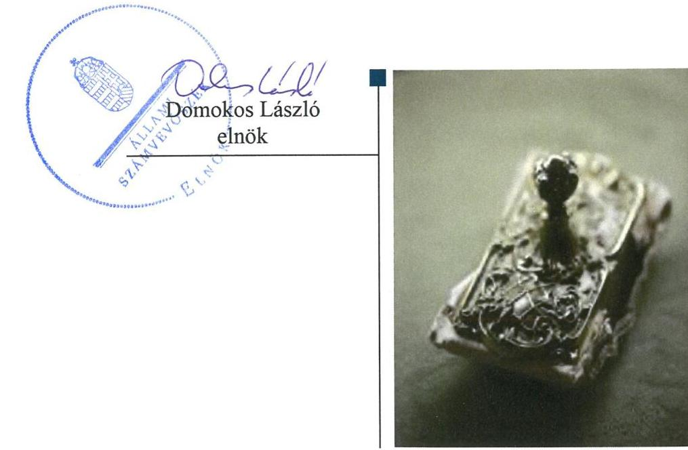
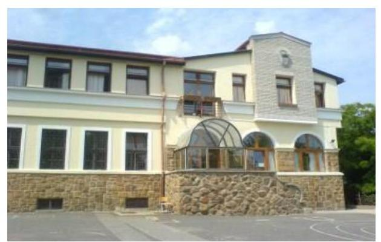
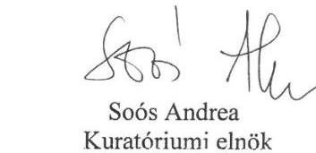
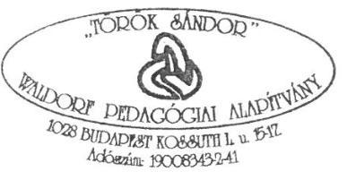
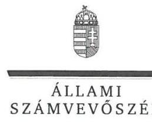
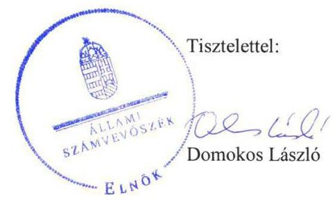
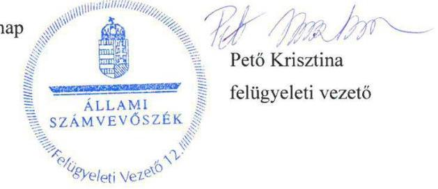

# Jelentés 

## Nem állami humánszolgáltatók ellenőrzése

A humánszolgáltatást nyújtó államháztartáson kívüli köznevelési és szociális intézmények, szolgáltatók fenntartói központi költségvetésből kapott támogatásai felhasználásának ellenőrzése - Török Sándor Waldorf-pedagógiai Alapítvány 2019.

---

# Jelentés 

## Nem állami humánszolgáltatók ellenőrzése

A humánszolgáltatást nyújtó államháztartáson kívüli köznevelési és szociális intézmények, szolgáltatók fenntartói központi költségvetésből kapott támogatásai felhasználásának ellenőrzése - Török Sándor Waldorf-pedagógiai Alapítvány 2019. 07. hó 25. nap

---

# AZ ELLENŐRZÉST FELÜGYELTE:

- PETŐ KRISZTINA felügyeleti vezető
- AZ ELLENŐRZÉST VEZETTE ÉS A VÉGREHAJTÁSÁÉRT FELELŐS:
  - HUDÁK KATALIN ellenőrzésvezető
  - DR. TÓTH LILI ellenőrzésvezetőként eljáró elemző számvevő
- A PROGRAM ÖSSZEÁLLÍTÁSÁÉRT FELELŐS:
  - TÓTPÁL SZABOLCS osztályvezető

**IKTATÓSZÁM:** EL-1604-001/2019.

**Jelentéseink az Országgyűlés számítógépes hálózatán és az Interneten a www.asz.hu címen is olvashatóak.**

**TÉMASZÁM:** 2448

**ELLENŐRZÉS-AZONOSÍTÓ SZÁM:** V079430

---

# TARTALOMJEGYZÉK 

■ ÖSSZEGZÉS ..... 5
■ AZ ELLENŐRZÉS CÉLJA ..... 6
■ AZ ELLENŐRZÉS TERÜLETE ..... 7
■ AZ ELLENŐRZÉS HÁTTERE, INDOKOLTSÁGA ..... 8
■ A JELENTÉS LÉNYEGES KÉRDÉSKÖREI ..... 9
■ AZ ELLENŐRZÉS HATÓKÖRE ÉS MÓDSZEREI ..... 10
■ MEGÁLLAPÍTÁSOK ..... 12
■ JAVASLATOK ..... 14
■ MELLÉKLETEK ..... 15
I. sz. melléklet: Értelmező szótár ..... 15
■ FÜGGELÉK: ÉSZREVÉTELEK ..... 17
■ RÖVIDÍTÉSEK JEGYZÉKE ..... 25

---

.

---

# ÖSSZEGZÉS 

A Török Sándor Waldorf-pedagógiai Alapítvány közfeladatot ellátó intézményei működtetésére biztosított közpénzekkel való gazdálkodása 2014-2016. években - az átlátható, elszámoltatható felhasználást biztosító feltételek hiányában - nem volt szabályszerű. A 2017. évben a köznevelési közfeladatokhoz biztosított központi költségvetési támogatásokat nem szabályszerűen tartotta nyilván, így a közpénzek felhasználásának átláthatóságát és az elszámoltathatóságát nem biztosította.

## Az ellenőrzés társadalmi indokoltsága

Az Állami Számvevőszék stratégiájában hangsúlyos szerepet szán annak, hogy szilárd szakmai alapon álló, értékteremtő ellenőrzéseivel előmozdítsa a közpénzügyek átláthatóságát, rendezettségét és javaslataival a közpénzek és a közvagyon szabályos, gazdaságos, hatékony és eredményes felhasználását segítse. Az Állami Számvevőszék a stratégiájában célul tűzte ki, hogy az államháztartáson kívülre nyújtott költségvetési támogatások ellenőrzésével hozzájárul ahhoz, hogy a közpénzeket az államháztartáson kívüli szervezetek is átlátható módon használják fel a közfeladatok szerződésben vállalt ellátása érdekében. Az Állami Számvevőszék e stratégiai céljaival összhangban - az Állami Számvevőszékről szóló 2011. évi LXVI. törvény felhatalmazása alapján - végzi a központi költségvetésből származó források, nyújtott támogatások - kedvezményezett szervezetek közfeladat ellátásához való - felhasználásának az ellenőrzését. Az Állami Számvevőszék hozzájárul ezzel ahhoz is, hogy a nyilvánosság és az igénybevevők megfelelő tájékoztatást kapjanak az államháztartáson kívüli közfeladatot ellátók működéséről.

## Főbb megállapítások, következtetések, javaslatok

A 2014-2016. években nem rendelkezett a Török Sándor Waldorf-pedagógiai Alapítvány a jogszabályban előírt számviteli politikával, így nem alakította ki a szabályszerű működési és gazdálkodási környezetet, nem biztosította a költségvetési támogatások átlátható, elszámoltatható igénybevételének, felhasználásának feltételeit.

A Török Sándor Waldorf-pedagógiai Alapítvány a 2017. évben a központi költségvetési támogatások alapfeladatok szerinti elkülönített nyilvántartásáról nem gondoskodott. Ennek következtében nem alakítottak ki olyan nyilvántartást, amelyből megállapítható, hogy a támogatások milyen határnappal kerültek átadásra és milyen célra kerültek felhasználásra a köznevelési intézményeknél. Ezzel a költségvetési támogatások felhasználásának átláthatóságát és elszámoltathatóságát nem biztosították. A Török Sándor Waldorf-pedagógiai Alapítvány 2017-ben a költségvetési támogatások teljes összegét szabályszerűen továbbította köznevelési intézményeinek. A közszolgáltatás igénybevételének feltételei nem voltak átláthatóak az óvodai nevelési szolgáltatást igénybevevők számára, mert az alapítvány nem határozta meg 2017-ben a kérhető térítési díj és tandíj megállapítás szabályait és a szociális alapon adható kedvezmények feltételeit.

Az Állami Számvevőszék a Török Sándor Waldorf-pedagógiai Alapítvány kuratóriumi elnökének kettő javaslatot fogalmazott meg.

---

# AZ ELLENŐRZÉS CÉLJA 

AZ ELLENŐRZÉS CÉLJA annak értékelése volt, hogy a Török Sándor Waldorf-pedagógiai Alapítvány, mint Fenntartó ${ }^{1}$ központi költségvetésből kapott támogatásainak felhasználása szabályszerű volt-e, a támogatások igénylése, évközi módosítása és év végi elszámolása meg-felelt-e a jogszabályi előírásoknak.

---

# AZ ELLENŐRZÉS TERÜLETE 

## Török Sándor Waldorf-pedagógiai Alapítvány, mint intézményfenntartó

A Török Sándor Waldorf-pedagógiai Alapítványt, mint fenntartót a Fővárosi Bíróság 1990. szeptember 6-án vette nyilvántartásba. A közhasznú tevékenységet végző, nyitott alapítvány felett az ellenőrzött időszakban Solymár Nagyközség Önkormányzata gyakorolta.

A Fenntartó ügyvezető, képviselő és vagyonkezelő szerve a kuratórium volt, amely 2015-ig öt, ezt követően négy főből állt. Az elnöki tisztséget a képviseleti joggal rendelkező tagok töltötték be évente váltakozva, meghatározott sorrend szerint.

A Fenntartó célkitűzése, hogy Magyarországon elterjedjen a Rudolf Steiner által kezdeményezett Waldorf-pedagógia, működjenek a teljes Waldorf-pedagógiai rendszert felölelő óvodák, a 12+1 osztályos iskolák és a Waldorf pedagógus-képzés.

A Fenntartó három köznevelési intézmény, a Pesthidegkúti Waldorf Általános Iskola Gimnázium és Alapfokú Művészeti Iskola, a Török Sándor Waldorf Óvoda és a Galagonya Waldorf Óvoda tekintetében látott el fenntartói feladatokat. A Fenntartó közvetlenül végzett pedagógusképzést az önálló jogi személyiséggel rendelkező szervezeti egységén, a Waldorf Pedagógiai Intézeten keresztül. A köznevelési intézmények közül az Óvoda ${ }_{1,2}{ }^{2}$ óvodai nevelési és oktatási, az Iskola ${ }^{3}$ általános iskolai és gimnáziumi nevelési és oktatási feladatot látott el. Az intézmények engedélyezett tanulói létszáma az Óvoda ${ }_{1-2}$ esetében 25 fő, az Iskola esetében 390 fő volt.

A Fenntartó 2014. évben 153,9 M Ft, 2015. évben 167,6 M Ft, 2016. évben 183,6 M Ft és 2017. évben 226,3 M Ft költségvetési támogatásban részesült. A köznevelési feladatai ellátására igényelt támogatásokkal a Magyar Államkincstár felé számolt el. A Fenntartó 2017-ben 40 M Ft kiegészítő költségvetési támogatásban részesült az Emberi Erőforrások Minisztériuma, a Fenntartó és az Iskola között létrejött köznevelési szerződés alapján. Az ellenőrzött időszakban a jegyzett tőke összege változatlanul 200 e Ft volt, a mérlegfőösszeg 235,7 M Ft-ról 425,1 M Ft-ra emelkedett. A Fenntartó az ellenőrzött időszakban vállalkozási tevékenységet nem folytatott.

Könyvvizsgálatra a Fenntartó jogszabály alapján nem, a szervezeti és működési szabályzatában foglaltak szerint kötelezett volt. Egyszerűsített éves beszámolót készítő szervezetként a Fenntartó önköltségszámításra nem volt kötelezett.

A köznevelési intézmények szakmai, törvényességi felügyeletét a Fenntartó látta el, a fenntartói tevékenységet Budapest Főváros Kormányhivatala felügyelte.

---

# AZ ELLENŐRZÉS HÁTTERE, INDOKOLTSÁGA 

A köznevelési feladatokat ellátó nem állami intézményfenntartók részére közfeladataik ellátására a 2014-2017. években jelentős összegű pénzügyi támogatást biztosítottak a mindenkori költségvetési törvények a bennük megfogalmazott feltételek mellett.

Az ÁSZ ${ }^{4}$ a stratégiájában célul tűzte ki, hogy az államháztartáson kívülre nyújtott költségvetési támogatások ellenőrzésével hozzájárul ahhoz, hogy a közpénzeket az államháztartáson kívüli szervezetek is átlátható módon használják fel a közfeladatok ellátására kötött szerződésekben vállalt ellátása érdekében. Az ÁSZ stratégiájában foglaltak alapján is indokolt az ellenőrzés, amely a társadalom számára jelzi, hogy a közpénzek államháztartáson kívüli felhasználása sem maradhat ellenőrizhetetlenül. Az államháztartáson kívülre nyújtott költségvetési támogatások ellenőrzésével az ÁSZ hozzájárul ahhoz, hogy a közpénzeket a nem állami humán fenntartók átlátható módon használják fel a közfeladatok ellátására kötött szerződésben vállalt kötelezettségek teljesítése érdekében. Az ellenőrzés javaslataival hozzájárul az említett rendszerek szabályszerű támogatás felhasználásához, javítja a társadalmi-gazdasági döntések megalapozottságát, ami a „jó kormányzás" feltétele.

---

# A JELENTÉS LÉNYEGES KÉRDÉSKÖREI 

1.     - A köznevelési közfeladatot ellátó Fenntartó szabályszerű működési és gazdálkodási környezet kialakításával megteremtette-e a költségvetési támogatások átlátható, elszámoltatható igénybevételének, felhasználásának feltételeit?
2.     - A Fenntartó az átvállalt köznevelési közfeladathoz biztosított költségvetési támogatásokat szabályszerűen fordította-e a humánszolgáltató intézménye működtetésére?
3.     - A Fenntartó a köznevelési intézménye működtetéséhez felhasznált közpénzekre vonatkozó gazdálkodásával a nyilvánosság előtt elszámolt-e, ennek megalapozása érdekében ellenőrzési, értékelési és a külső ellenőrzésekkel kapcsolatos intézkedési feladatait szabályszerűen látta-e el?

---

# AZ ELLENŐRZÉS HATÓKÖRE ÉS MÓDSZEREI 

## Az ellenőrzés típusa

Megfelelőségi ellenőrzés.

## Az ellenőrzött időszak

A 2014. január 1. és 2017. december 31-e közötti időszak. A helyszíni szemle tekintetében 2018. január 1-jétől 2019. január 15-ig tartó időszak.

## Az ellenőrzés tárgya

Az ellenőrzés a köznevelési közfeladatokat ellátó államháztartáson kívüli Fenntartó humánszolgáltatási közfeladatai ellátásához a költségvetési törvényekben biztosított központi költségvetési támogatások igénylése, évközi módosítása és év végi elszámolása fenntartói feladatainak ellátása, illetve e központi költségvetésből kapott támogatások humánszolgáltatási közfeladatokra való fenntartó általi felhasználása szabályszerűségének értékelésére terjedt ki.

Az ellenőrzés kiterjedt minden olyan körülményre és adatra, amely az ÁSZ jogszabályban meghatározott feladatainak teljesítéséhez, valamint a program végrehajtása folyamán felmerült újabb összefüggések feltárásához szükséges volt.

## Az ellenőrzött szervezet

Török Sándor Waldorf-pedagógiai Alapítvány.

## Az ellenőrzés jogalapja

Az ellenőrzés jogszabályi alapját az ÁSZ tv. ${ }^{5} 1 . \S$ (3) bekezdése, 5. § (3) bekezdésében foglalt előírások adták.

## Az ellenőrzés módszerei

Az ellenőrzést az ellenőrzési program szempontjai, kérdései, az ellenőrzött időszakban hatályos jogszabályok, a nemzetközi standardokat irányadónak tekintve, az ellenőrzés szakmai szabályok és módszertanok figyelembevételével végezte az ÁSZ. A közpénzekkel való felelős gazdálkodás segítésére

---

irányuló javaslatok kidolgozásakor a hatályos jogszabályok voltak az irányadóak.

Az ellenőrzés ideje alatt az ellenőrzött szervezettel történő kapcsolattartást az ÁSZ SZMSZ ${ }^{6}$-ének vonatkozó előírásai alapján biztosította az ÁSZ.

Az ellenőrzési kérdések megválaszolásához szükséges bizonyítékok megszerzése az ellenőrzött által rendelkezésre bocsátott dokumentumokra, adatokra alapozva elemző eljárással történt.

Az ellenőrzési bizonyítékként felhasználható adatforrások közé tartoztak egyrészt a szakmai program részletes szempontjainál felsorolt adatforrások, másrészt minden - az ellenőrzés folyamán feltárt, az ellenőrzés szempontjából információt tartalmazó - dokumentum.

Az ellenőrzés lefolytatásához az ellenőrzött szervezet a kitöltött tanúsítványok, valamint az ÁSZ által kért dokumentumok elektronikus úton való megküldésével szolgáltatott adatokat, információkat. Az így rendelkezésre bocsátott adatok, információk és a tanúsítványok adatai valódiságának kontrollja az ellenőrzés keretében történt.

A fenntartott köznevelési intézménynél helyszíni szemle keretében győződött meg az ÁSZ a tényleges feladatellátásról (verifikáció).

A köznevelési humánszolgáltatások központi költségvetési támogatásai igénylésével, módosításával, elszámolásával kapcsolatos, államháztartáson kívüli fenntartó jogszabályokban előírt feladatai betartását, továbbá a központi költségvetési támogatások szabályszerű kezelését, nyilvántartását ellenőrizte az ÁSZ a Fenntartónál határozatok, nyilvántartások, beszámolók és egyéb dokumentumok alapján. Az ellenőrzés nem terjedt ki a köznevelési humánszolgáltatások központi költségvetési támogatásai igénylése, módosítása, elszámolása valódiságának, megalapozottságának, helyességének - sem a Fenntartónál, sem a székhely intézménynél való - értékelésére. Továbbá nem terjedt ki az ellenőrzés e források köznevelési intézmény általi szabályszerű felhasználásának értékelésére.

A szabályosság megítélésének alapját képezte, hogy a központi költségvetési támogatások Fenntartó általi igénylése, módosítása és elszámolása a Kincstár ${ }^{7}$ felé megtörtént.

---

# MEGÁLLAPÍTÁSOK 

## 1. A köznevelési közfeladatot ellátó Fenntartó szabályszerű működési és gazdálkodási környezet kialakításával megterem-tette-e a költségvetési támogatások átlátható, elszámoltatható igénybevételének, felhasználásának feltételeit?

Összegző megállapítás A működési- és gazdálkodási környezet kialakítása a 2014-2016. években nem volt szabályszerű, 2017. évben szabályszerű volt.

SZÁMVITELI POLITIKÁVAL a Fenntartó a Számv. tv. ${ }^{8}$ 14. § (3) bekezdésében foglalt előírás ellenére 2014-2016. között nem rendelkezett. A 2017. évben a Fenntartó a Számv. tv. szerinti szabályzatokkal rendelkezett.

A FENNTARTÓ a Civil tv. ${ }^{9}$ és a Civilszr ${ }_{1,2}{ }^{10}$ szerinti kettős könyvvitellel alátámasztott egyszerűsített éves beszámolót, valamint közhasznúsági mellékletet készített. A számviteli beszámoló mérlegének és eredménykimutatásának tagolása a 2017. évben szabályszerű volt.

A PTK. ${ }^{11}$ SZERINTI ALAPÍTÓ OKIRATTAL a
 Fenntartó rendelkezett. A Fenntartó szervezeti és működési szabályzatban határozta meg szabályszerűen a felelősségi- és hatásköröket, azok gyakorlásának módját.

## 2. A Fenntartó az átvállalt köznevelési közfeladathoz biztosított költségvetési támogatásokat szabályszerűen fordította-e a humánszolgáltató intézménye működtetésére?

Összegző megállapítás A Fenntartó az átvállalt köznevelési feladathoz biztosított támogatásokat a 2017. évben - a támogatások felhasználása nyilvántartásának hiányossága miatt - nem szabályszerűen fordította köznevelési intézményei működtetésére.

A KÖLTSÉGVETÉSI TÁMOGATÁSOK FELHASZNÁLÁSÁT a Fenntartó az Nkt. vhr. ${ }^{12}$ 37/G. § (1) bekezdésében foglalt előírás ellenére a 2017. évben nem alapfeladatonkénti bontásban elkülönítetten és naprakészen tartotta nyilván.

A TÉRÍTÉSI DÍJ ÉS TANDÍJ megállapításának szabályait, továbbá a szociális alapon adható kedvezmények feltételét a Fenntartó a

---

2017. évben az Nkt. ${ }^{13}$ 83. § (2) bekezdés c) pontjában foglalt előírás ellenére nem határozta meg az Óvoda 1, 2 esetében.

A Fenntartó a 2017. évben gondoskodott az Iskola és az Óvoda 1, 2 Nkt. szerinti nyilvántartásba vételéről és működési engedélyeiről, továbbá arról, hogy rendelkezzenek az Nkt. szerinti szervezeti és működési szabályzattal, házirenddel és pedagógiai programmal. Az Iskola és az Óvoda 1, 2 rendelkezett a Fenntartó által szabályszerűen kiadott alapító okirattal a 2017. évben.

A KÖLTSÉGVETÉSI TÁMOGATÁSOK igénylése, módosítása és elszámolása a 2017. évben szabályszerű volt. A költségvetési támogatásokat a Fenntartó a 2017. évben szabályszerűen továbbította köznevelési intézményeinek.

# 3. A Fenntartó a köznevelési intézménye működtetéséhez felhasznált közpénzekre vonatkozó gazdálkodásával a nyilvánosság előtt elszámolt-e, ennek megalapozása érdekében ellenőrzési, értékelési és a külső ellenőrzésekkel kapcsolatos intézkedési feladatait szabályszerűen látta-e el? 

## Összegző megállapítás

A beszámolók közzétételével a Fenntartó közpénzekre vonatkozóan gazdálkodásával a nyilvánosság előtt elszámolt. A Fenntartó ellenőrzési, értékelési, és külső ellenőrzésekkel kapcsolatos intézkedési feladatait szabályszerűen ellátta.

A KURATÓRIUM által jóváhagyott 2014-2017. évi beszámolóit a Fenntartó a közhasznúsági melléklettel és könyvvizsgálói jelentéssel együtt a Civil. tv. előírásai szerint az Országos Bírósági Hivatal részére letétbe helyezés és közzététel céljából megküldte, saját honlapján közzétette.

A FENNTARTÓ az Nkt. 83. § (2) bekezdés e) pontjában foglalt lehetősséggel élve ellenőrizte 2015. évben az Óvoda ${ }_{1}$ gazdálkodását, működésének törvényességét, és a szakmai munka eredményességét; az Iskolánál a 2015. és 2016. években a működés törvényességét, 2017. évben az Iskola gazdálkodását; az Óvoda ${ }_{2}$-nél a 2015. évben a szakmai munka eredményességét.

A FENNTARTÓNÁL és köznevelési intézményeinél a Kincstár a 2015. évi költségvetési támogatások igénybevételének jogszerűségét ellenőrizte. A Kormányhivatal ${ }^{14}$ a Fenntartónál köznevelési intézményei vonatkozásában törvényességi ellenőrzést végzett.

---

# JAVASLATOK 

Az ÁSZ tv. 33. § (1) bekezdésében foglaltak értelmében az ellenőrzött szervezet vezetője köteles a jelentésben foglalt megállapításokhoz kapcsolódó intézkedési tervet összeállítani és azt a jelentés kézhezvételétől számított 30 napon belül az ÁSZ részére megküldeni. Amennyiben az ellenőrzött szervezet vezetője nem küldi meg határidőben az intézkedési tervet, vagy továbbra sem elfogadható intézkedési tervet küld, az Állami Számvevőszék elnöke az ÁSZ tv. 33. § (3) bekezdése a) és b) pontjaiban foglaltakat érvényesítheti.

## Török Sándor Waldorf-pedagógia Alapítvány kuratóriumi elnökének

1. Intézkedjen a támogatás felhasználásnak alapfeladatonkénti bontásban elkülönített naprakész nyilvántartásáról.
(2. sz. megállapítás 1. bekezdése alapján)
2. Intézkedjen a térítési díj és tandíj megállapítása szabályainak, valamint a szociális alapon adható kedvezmények feltételeinek meghatározásáról az óvodai nevelési feladatot ellátó intézmények tekintetében.
(2. sz. megállapítás 2. bekezdése alapján)

---

# MELLÉKLETEK 

- I. SZ. MELLÉKLET: ÉRTELMEZŐ SZÓTÁR
civil szervezet
humánszolgáltatás
költségvetési támogatás
köznevelési közfeladat

A Civil tv. 2. § 6. pontja szerint civil szervezet a civil társaság, a Magyarországon nyilvántartásba vett egyesület (a párt, a szakszervezet és a kölcsönös biztosító egyesület kivételével), a közalapítvány és a pártalapítvány kivételével az alapítvány.
Külön törvényben meghatározott szociális, gyermekjóléti, gyermekvédelmi, közoktatási, felsőoktatási, kulturális közfeladatok (2014. évi Kvtv. 34. § (1), (4) bekezdés, 1. számú melléklet XX/20/2. alcím, 19. alcím, 2015. évi Kvtv. 43. § (1), (4) bekezdés, 1. számú melléklet XX/20/2/3. jogcím csoport, 19. alcím, 2016. évi Kvtv. 41. § (1), (4) bekezdés, 1. számú melléklet XX/20/2/3. jogcím csoport, 19. alcím).
A társadalombiztosítás pénzügyi alapjai kivételével az államháztartás központi alrendszeréből ellenérték nélkül, pénzben nyújtott támogatások (Áht. ${ }^{15}$ 1. § 14. pont)
A költségvetési törvényekben (2013. évi CCXXX. törvény 33-34. §, 2014. évi C. törvény 42-43. §, 2015. évi C. törvény 40-41. §) megállapított támogatás. A 2015. évi C. törvény 40-41. § szerint többek között: Az Országgyűlés a köznevelési feladat ellátására átlagbéralapú támogatást állapít meg. A nevelési-oktatási, valamint pedagógiai szakszolgálati intézményt fenntartó nemzetiségi önkormányzat, az egyházi és magán köznevelési intézmény fenntartója részére az általuk fenntartott nevelési-oktatási intézményben, továbbá pedagógiai szakszolgálati intézményben pedagógus és - a b) pont kivételével - nevelő-oktató munkát közvetlenül segítő munkakörben foglalkoztatottak után a 7. melléklet I. pontja, valamint az óvoda, egységes óvoda-bölcsőde esetében a 2. melléklet II. pont 1. alpontja szerint és az 5. alpontjában meghatározott jogosultak után, az őket ott megillető mértékek szerint.
Az Országgyűlés a szociális, gyermekjóléti, gyermekvédelmi közfeladatot ellátó intézményt, szolgáltatást fenntartó egyházi jogi személy, civil szervezet, közalapítvány, országos nemzetiségi önkormányzat, települési vagy területi nemzetiségi önkormányzat, gazdasági társaság, és a humánszolgáltatást alaptevékenységként végző, az Szja tv. hatálya alá tartozó egyéni vállalkozó (a továbbiakban együtt: nem állami szociális fenntartó) részére támogatást állapít meg a következők szerint: a támogatás a nem állami szociális fenntartót a települési önkormányzatok 2. melléklet III. pont 3. alpont c)-k) pontjában és III. pont 5. alpont a) pontjában meghatározott támogatásaival azonos jogcímeken, összegben és feltételek mellett illeti meg.
A köznevelési intézmény alapító okiratában foglalt feladat: óvodai nevelés, nemzetiséghez tartozók óvodai nevelése, általános iskolai nevelés-oktatás, nemzetiséghez tartozók általános iskolai nevelése-oktatása, kollégiumi ellátás, nemzetiségi kollégiumi ellátás, gimnáziumi nevelés-oktatás, szakközépiskolai nevelés-oktatás, szakiskolai nevelés-oktatás, nemzetiség gimnáziumi nevelés-oktatása, nemzetiség szakközépiskolai nevelés-oktatása, nemzetiség szakiskolai nevelés-oktatása. Köznevelési Hídprogramok keretében folyó nevelés-oktatás, felnőttoktatás, alapfokú művészetoktatás, fejlesztő nevelés, fejlesztő nevelés-oktatás, pedagógiai szakszolgálati feladat, a többi gyermekkel, tanulóval együtt nevelhető, oktatható sajátos nevelési igényű gyermekek, tanulók óvodai nevelése és iskolai nevelése-oktatása. Azoknak a sajátos nevelési igényű

---

# Mellékletek 

köznevelési intézmény
nem állami, nem önkormányzati (államháztartáson kívüli) intézmény fenntartó
gyermekeknek, tanulóknak az óvodai, iskolai, kollégiumi ellátása, akik a többi gyermekkel, tanulóval nem foglalkoztathatók együtt, a gyermekgyógyüdülőkben, egészségügyi intézményekben, rehabilitációs intézményekben tartós gyógykezelés alatt álló gyermekek tankötelezettségének teljesítéséhez szükséges oktatás, pedagógiai-szakmai szolgáltatás.
A nevelési-oktatási intézmény, pedagógiai szakszolgálati intézmény, pedagógiai-szakmai szolgáltatást nyújtó intézmény.
A köznevelési és szociális, gyermekjóléti és gyermekvédelmi közfeladatokat/humánszolgáltatásokat ellátó intézményt fenntartó egyházi jogi személy, társadalmi szervezet, alapítvány, közalapítvány, civil szervezet, országos nemzetiségi önkormányzat, nonprofit gazdasági társaság, gazdasági társaság és a humánszolgáltatást alaptevékenységként végző, Szja tv. hatálya alá tartozó egyéni vállalkozó. (2013. évi Kvtv. 35. § (1), (3) bekezdés, 2014. évi Kvtv. 33. §, 34. § (1), (4) bekezdés, 2015. évi Kvtv. 42. §, 43. § (1), (4) bekezdés, 2016. évi Kvtv. 40. §, 41. § (1), (4) bekezdés)

---

# FÜGGELÉK: ÉSZREVÉTELEK 

A jelentéstervezetet a Számvevőszék 15 napos észrevételezésre megküldte az ellenőrzött szervezet vezetőjének az ÁSZ tv. 29. §* (1) bekezdése előírásának megfelelően.

A jelentéstervezet megállapításaira a Török Sándor Waldorf-pedagógiai Alapítvány Kuratóriumi elnöke a törvényes határidőben írásban észrevételt tett.
Az ÁSZ tv. 29. § (3) bekezdésével összhangban az ÁSZ a Függelékben feltünteti az ellenőrzés megállapításaival kapcsolatban tett, figyelembe nem vett észrevételeket, és megindokolja, hogy azokat miért nem fogadta el.

[^0]
[^0]:    * 29. § (1) Az Állami Számvevőszék az ellenőrzési megállapításait megküldi az ellenőrzött szervezet vezetőjének vagy az általa megbízott személynek, és annak, akinek személyes felelősségét állapította meg.
    (2) Az ellenőrzött szervezet vezetője és a felelősként megjelölt személy az ellenőrzés megállapításaira tizenöt napon belül írásban észrevételt tehet.
    (3) Az Állami Számvevőszék az észrevételre a beérkezésétől számított harminc napon belül írásban válaszol. A figyelembe nem vett észrevételeket köteles a jelentésben feltüntetni, és megindokolni, hogy azokat miért nem fogadta el.

---

# TAK - 05 

Állami Számvevőszék
Budapest
Pető Krisztina
felügyeleti vezető részére

Tárgy: Válasz a megküldött Számvevőszéki jelentéstervezetre
Hivatkozási számok: Ikt.szám: EL-0745-057/2019, Témaszám: 2448,
Ell.-azon.szám: V079430

Tisztelt Pető Krisztina!
Köszönettel kézhez kaptuk az Önök által megküldött Számvevőszéki jelentéstervezetet. Nagyon örülünk, hogy előzetesen lehetőséget biztosítottak számunkra az anyag véleményezésére, mert így módunk van pontosítani a működésünkkel kapcsolatban néhány olyan információt, mely az előzetes adatszolgáltatás során félreértésre adhatott okot.
Reméljük, hogy az alábbi megjegyzéseink hozzájárulnak ahhoz, hogy a Számvevőszék végső jelentése pontos és kedvező képet adjon alapítványunk működéséről!

A jelentéstervezet „Főbb megállapítások, következtetések, javaslatok" fejezetében említésre kerül, hogy alapítványunk a 2014-2016 időszakban nem rendelkezett számviteli politikával. Ezt a következtetést ellenőreik minden bizonnyal abból a tényből vonták le, hogy erre az időszakra vonatkozóan is a 2017. évi számviteli politika került feltöltésre. Tájékoztatni szeretnénk Önöket, hogy természetesen a vizsgált időszakban is rendelkezett alapítványunk a jogszabályoknak megfelelő számviteli politikával. Sajnálatos módon a nagy tömegű dokumentum feltöltése közbeni kavarodás okozta azt, hogy véletlenül a két különböző időszakra ugyanazt a dokumentumot töltöttük fel az adatszolgáltatási felületre. Reméljük, hogy ez a technikai hiba utólagosan, az érvényes dokumentum rendelkezésre bocsájtásával orvosolható, s így elkerülhető, hogy az e problémára vonatkozó szigorú és negatív megállapítások a végleges jelentésben maradjanak. Kérjük, biztosítsák annak lehetőségét, hogy a hivatkozott dokumentumot az ellenőrzési felületre feltölthessük.

A jelentéstervezetben ugyanitt szerepel az az észrevétel, hogy alapítványunk nem alakított ki „olyan nyilvántartást, amelyből megállapítható, hogy a támogatások milyen határnappal kerültek átadásra és milyen célra kerültek felhasználásra a köznevelési intézményeknél". Alapítványunk folyamatos és naprakész számviteli nyilvántartásokkal rendelkezik, amelyet az intézményekre elkülönítve vezetünk. Megítélésünk szerint a mindenkori főkönyvi kivonatok, mint nyilvántartások folyamatos és áttekinthető képet adnak a támogatások átadásának határnapjairól és a támogatások felhasználásáról. Ennek okán nem tartottuk szükségesnek, hogy párhuzamosan vezessünk más nyilvántartásokat ugyanazon információkról.

Szintén a jelentéstervezet hivatkozott fejezetében és az egyik megfogalmazott javaslatban is szerepel, hogy az alapítványunk fenntartásában működő óvodák tekintetében nem kerültek meghatározásra a 2017 évben kérhető térítési díj és tandíj megállapítási szabályai és a szociális alapon adható kedvezmények feltételei. Szeretnénk tájékoztatni Önöket, hogy az alapítványunkhoz tartozó egyik óvodai intézmény sem szed tandíjat, illetve térítési díjat az

---

óvoda szülői közösségétől, így ennek okán nem rendelkezünk ilyen szabályozással, valamint nem rendelkeztünk a szociális alapon adható kedvezmények feltételeiről.

Végül szeretnénk megjegyezni, hogy az Önök által vizsgált 2014-2016 időszak egy része vonatkozásában - 2015. január 1.- december 31. - a Magyar Államkincstár is vizsgálta működésünket és alapítványunk, valamint a fenntartásunkban működő intézmények pénzügyi kapcsolata vonatkozásában az ellenőrzés az alábbi megállapításra jutott:
„Az intézmények önállóan gazdálkodnak, és a rendelkezésre bocsátott 2015. évi számviteli nyilvántartások alapján a támogatások felhasználását alapfeladatonkénti bontásban elkülönítetten és naprakészen tartották nyilván."

Reméljük, hogy az előzőekben ismertetett megjegyzéseinket megalapozottnak találják, elfogadják és az általunk leírtak hozzájárulnak ahhoz, hogy a végleges Számvevőszéki jelentés számunkra kedvező
 megállapításokat és összegzést tartalmazzon. Természetesen amennyiben hasznosnak ítélik, szívesen állunk rendelkezésre személyes egyeztetés céljából is, ha ez segítséget nyújthat Önöknek az ellenőrzés lezárásában.

Bármilyen további kérdés esetén szívesen állunk rendelkezésükre!
Budapest, 2019. május 24.

Köszönettel:

Sóós Andrea
Kuratóriumi elnök
Török Sándor Waldorf Pedagógiai Alapítvány

---

ELNÖK

# Soós Andrea úrhölgy 

kuratóriumi elnök

Török Sándor Waldorf-pedagógiai Alapítvány

## Budapest

## Tisztelt Elnök Úrhölgy!

A ,,Nem állami humánszolgáltatók ellenőrzése - A humánszolgáltatást nyújtó államháztartáson kívüli köznevelési és szociális intézmények, szolgáltatók fenntartói központi költségvetésből kapott támogatásai felhasználásának ellenőrzése - Török Sándor Waldorf-pedagógiai Alapítvány" címmel készített számvevőszéki jelentéstervezetre tett, TSK/05. iktatószámú levelében megküldött észrevételeit köszönettel megkaptam.
Az Állami Számvevőszék észrevételekre vonatkozó álláspontjáról a felügyeleti vezető által készített részletes tájékoztatást csatoltan megküldöm.
Tájékoztatom Elnök úrhölgyet, hogy a számvevőszéki jelentésben - az Állami Számvevőszékről szóló 2011. évi LXVI. törvény 29. § (3) bekezdése alapján - a figyelembe nem vett észrevételeket szerepeltetjük az elutasítás indokának feltüntetésével.

Budapest, 2019. 06. hó 19. nap

Melléklet: Tájékoztatás az észrevételek kezeléséről

---

# Tájékoztatás   az észrevételek kezeléséről 

A „Nem állami humánszolgáltatók ellenőrzése - A humánszolgáltatást nyújtó államháztartáson kívüli köznevelési és szociális intézmények, szolgáltatók fenntartói központi költségvetésből kapott támogatásai felhasználásának ellenőrzése - Török Sándor Waldorf-pedagógiai Alapítvány" címü jelentéstervezetre (továbbiakban: jelentéstervezet) a TSK/05. iktatószámú levélben megküldött észrevételeit áttekintettem. Az észrevételek kezeléséről az alábbi tájékoztatást adom.

## 1. A jelentéstervezet számviteli politikával kapcsolatos megállapítására tett észrevétel (Jelentéstervezet 5. oldal 3. bekezdése):

Elnök úrhölgy észrevételében jelezte, hogy a Török Sándor Waldorf-pedagógiai Alapítvány (továbbiakban: Alapítvány) 2014-2016. években rendelkezett számviteli politikával, azonban az adatszolgáltatás során tévesen nem azokat, hanem a 2017. évi számviteli politikát töltötték fel.

Az Állami Számvevőszék (továbbiakban: ÁSZ) az ellenőrzését a megküldött ellenőrzési programnak megfelelően, a rendelkezésre bocsátott adatok és dokumentumok (bizonyítékok) alapján végezte. Az Állami Számvevőszékről szóló 2011. évi LXVI. törvény (továbbiakban: ÁSZ tv.) 28. § (1) bekezdése alapján a közreműködésre felhívott szervezet az ÁSZ részére - annak kérésére soron kívül, de legkésőbb öt munkanapon belül - az ellenőrzés lefolytatása érdekében a szükséges adatokat és dokumentumokat rendelkezésre bocsátja. Elnök úrhölgy a teljességi és hitelességi nyilatkozatában kijelentette, hogy az ÁSZ részére átadott dokumentumok, adatok megbízhatóak, és a bekért adatokra, dokumentumokra vonatkozóan teljes körű információt tartalmaznak. Elnök úrhölgy továbbá a teljességi és hitelességi nyilatkozatban az átadott dokumentumok, adatok hitelességéért, valódiságáért és hiánytalanságáért teljes felelősséget vállalt. Az előzőekben leírtakra tekintettel az ÁSZ azon dokumentumokat, amelyek az adatszolgáltatási időszakot követően bocsátott rendelkezésére, bizonyítékként nem veszi figyelembe. Elnök úrhölgy sem vitatja, hogy a hivatkozott dokumentum nem került megküldésre az ÁSZ részére az adatszolgáltatási időszakban.

A fentiekre tekintettel észrevételét nem fogadjuk el, a jelentéstervezet módosítása nem indokolt.

---

# 2. A jelentéstervezet nyilvántartással kapcsolatos megállapítására tett észrevétel (Jelentéstervezet 5. oldal 4. bekezdésének 2. mondata): 

Elnök úrhölgy tájékoztatást adott arról, hogy az Alapítvány folyamatos és naprakész számviteli nyilvántartásokkal rendelkezik, amelyet az intézményekre elkülönítve vezetnek. A főkönyvi kivonatok, mint nyilvántartások áttekinthető képet adnak a támogatások átadásának határnapjairól és a támogatások felhasználásáról.
A nemzeti köznevelésről szóló törvény végrehajtásáról szóló 229/2012. (VIII. 28.) Korm. rendelet (továbbiakban: Nkt. vhr.) 37/G. § (1) bekezdésében foglaltak szerint a fenntartó a támogatások felhasználását, az ingyenesség, tandíj, térítési díj megállapításával, beszedésével kapcsolatos rendelkezéseket, okiratokat alapfeladatonkénti bontásban elkülönítetten és naprakészen tartja nyilván. Az adatok valódiságát az egyes fenntartónál, köznevelési intézménynél megfelelő nyilvántartással, szakmai és pénzügyi dokumentációval kell alátámasztani. A fenntartónak olyan nyilvántartás kialakításáról szükséges gondoskodni, amelyből megállapítható, hogy a támogatások milyen határnappal kerültek átadásra és milyen célra kerültek felhasználásra.
Az ÁSZ rendelkezésére álló ellenőrzési bizonyítékok ismételt felülvizsgálata alapján megállapítható, hogy adatbekérés során megküldött főkönyvi kivonatokban szereplő adatok nem alapfeladatonkénti bontásban elkülönítetten állnak rendelkezésre, a támogatások cél szerinti felhasználására vonatkozóan nem tartalmaznak információt. Továbbá a megküldött bankkivonatok kizárólag a támogatások továbbutalásának számviteli bizonylatainak tekinthetőek, alapfeladatonkénti elkülönített és naprakész nyilvántartásnak azonban nem. Az ellenőrzés rendelkezésére bocsátott dokumentumok egyike sem felel meg az Nkt. vhr. 37/G. § (1) bekezdésében foglalt követelményeknek. Mindezekre tekintettel észrevételét nem fogadjuk el, a jelentéstervezet módosítása nem indokolt.
3. A jelentéstervezet térítési díj és tandíj megállapításának szabályaival kapcsolatos megállapításra tett észrevétel (Jelentéstervezet 5. oldal 4. bekezdésének 5. mondata és 12. oldal utolsó bekezdése):
Elnök úrhölgy észrevételében jelezte, hogy az Alapítványhoz tartozó óvodai intézmények sem tandíjat, illetve térítési díjat nem szednek, valamint a szociális alapon adható kedvezményeket sem nyújtanak, ezért nem rendelkeztek ezek szabályairól, feltételeiről sem.
A nemzeti köznevelésről szóló 2011. évi CXC. törvény 83. § (2) bekezdésének c) pontjában foglaltak szerint a Fenntartó meghatározza a köznevelési intézmény költségvetését, továbbá tankerületi központ által fenntartott köznevelési intézmény kivételével - a kérhető térítési díj és tandíj megállapításának szabályait, a szociális alapon adható kedvezmények feltételeit. A jogszabály kötelező jelleggel írja elő a kérhető térítési díj és tandíj megállapítása szabályainak, valamint a szociális alapon adható kedvezmények feltételeinek meghatározását. A rendelkezés szerint nem a kért, hanem a kérhető díjak megállapításának szabályait és a kedvezmények feltételeit szükséges meghatározni, amely független attól, hogy az intézmény szed-e díjakat vagy sem. Az óvodai intézmények szervezeti és működési szabályzatai, illetve egyéb, az ÁSZ rendelkezésére bocsátott dokumentumok sem tartalmaznak arra vonatkozóan rendelkezést, hogy

---

térítési díjat nem szednek, illetve a szociális alapon nyújtható kedvezmények adásával sem élnek. Az észrevételben foglaltak az óvodai intézmények térítési díj és tandíj megállapításának szabályaira, továbbá a szociális alapon adható kedvezmények feltételeire vonatkozó szabályozás hiányát nem cáfolták. Az előbbiekre tekintettel az észrevételt nem fogadjuk el, a jelentéstervezet módosítása nem indokolt.

# 4. A jelentéstervezet megállapításai és a Magyar Államkincstár vizsgálatának összefüggéseire vonatkozó megjegyzés kapcsán: 

Elnök úrhölgy észrevételében tájékoztatást adott arról, hogy a Magyar Államkincstár is vizsgálta az Alapítványt és a fenntartásában működő intézményeket. A Magyar Államkincstár a következő megállapításra jutott: „Az intézmények önállóan gazdálkodnak, és a rendelkezésre bocsátott 2015. évi számviteli nyilvántartások alapján a támogatások felhasználását alapfeladatonkénti bontásban elkülönítetten és naprakészen tartották nyilván. "
Az ÁSZ ellenőrzés célja annak értékelése volt, hogy a Török Sándor Waldorf-pedagógiai Alapítvány, mint Fenntartó központi költségvetésből kapott támogatásainak felhasználása szabályszerű volt-e, a támogatások igénylése, évközi módosítása és év végi elszámolása megfelelt-e a jogszabályi előírásoknak. Jelen ellenőrzés keretében az Alapítvány intézményei nem voltak ellenőrzött szervezetek, ezért a jelentéstervezet megállapítást sem tartalmaz az intézményekre vonatkozóan. A Magyar Államkincstár ellenőrzési tevékenysége eredményeként az Alapítvány intézményeire vonatkozóan tett megállapítást.
Megjegyezni kívánom, hogy az ÁSZ az ellenőrzését a számvevőszéki ellenőrzési program szempontjai, kérdései, az ellenőrzött időszakban hatályos jogszabályok, a nemzetközi standardokat irányadónak tekintve, az ellenőrzés szakmai szabályok és módszertanok figyelembevételével végezte a rendelkezésére bocsátott bizonyítékok alapján. A Magyar Államkincstár ellenőrzési megállapításai az előbbiekre tekintettel az ÁSZ megállapításait nem befolyásolják, ezért a jelentéstervezet módosítása nem indokolt.

Budapest, 2019. 06. hó 13. nap

---

.

---

# RÖVIDÍTÉSEK JEGYZÉKE 

${ }^{1}$ Fenntartó
${ }^{2}$ Óvoda ${ }_{1}$
Óvoda ${ }_{2}$
${ }^{3}$ Iskola
${ }^{4}$ ÁSZ
${ }^{5}$ ÁSZ tv.
${ }^{6}$ ÁSZ SZMSZ
${ }^{7}$ Kincstár
${ }^{8}$ Számv. tv.
${ }^{9}$ Civil. tv.
${ }^{10}$ Civilszr. 1

Civilszr. 2
${ }^{11}$ Ptk.
${ }^{12}$ Nkt. vhr.
${ }^{13}$ Nkt.
${ }^{14}$ Kormányhivatal
${ }^{15}$ Áht.

Török Sándor Waldorf-pedagógiai Alapítvány
Török Sándor Waldorf Óvoda
Galagonya Waldorf Óvoda
Pesthidegkúti Waldorf Általános Iskola Gimnázium és Alapfokú Művészeti Iskola
Állami Számvevőszék
2011. évi LXVI. törvény az Állami Számvevőszékről
Állami Számvevőszék Szervezeti és Működési Szabályzata
Magyar Államkincstár
2000. évi C. törvény a számvitelről
2011. évi CLXXV. törvény az egyesülési jogról, a közhasznú jogállásról, valamint a civil szervezetek működéséről és támogatásáról
224/2000. (XII. 19.) Korm. rendelet a számviteli törvény szerinti egyes egyéb szervezetek beszámoló készítési és könyvvezetési kötelezettségének sajátosságairól (hatályos 2016. december 31-ig)
479/2016. (XII. 28.) Korm. rendelet a számviteli törvény szerinti egyes egyéb szervezetek beszámoló készítési és könyvvezetési kötelezettségének sajátosságairól (hatályos 2017. január 1-jétől)
2013. évi V. törvény a Polgári törvénykönyvről

229/2012. (VIII. 28.) Korm. rendelet a nemzeti köznevelésről szóló törvény végrehajtásáról
2011. évi CXC. törvény a nemzeti köznevelésről

Budapest Főváros Kormányhivatala
2011. évi CXCV. törvény az államháztartásról

---

ÁLLAMI SZÁMVEVŐSZÉK
1052 Budapest, Apáczai Csere János utca 10.
Levélcím: 1364 Budapest 4. Pf. 54
Telefon: +36 14849100 Telefax: +36 14849200
www.asz.hu
