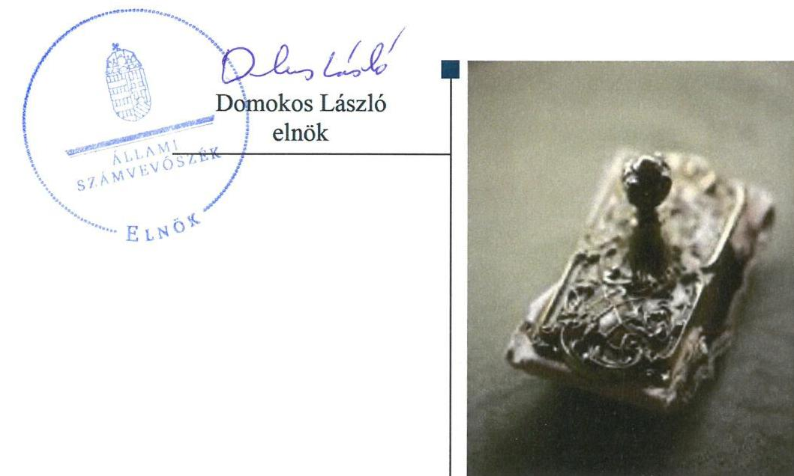
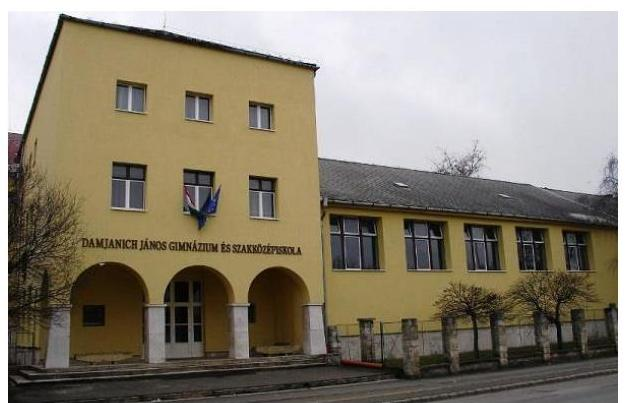

# Jelenetés 

## Központi költségvetési szervek ellenőrzése

Damjanich János Gimnázium és Mezőgazdasági Szakképző Iskola 2019.

19115
www.asz.hu

---

# Jelenetés 

## Központi költségvetési szervek ellenőrzése

Damjanich János Gimnázium és Mezőgazdasági Szakképző Iskola 2019. 10. hó 30. nap

---

# AZ ELLENŐRZÉST FELÜGYELTE:

## MAKKAI MÁRIA felügyeleti vezető

## AZ ELLENŐRZÉST VEZETTE ÉS A VÉGREHAJTÁSÁÉRT FELELŐS:

### DÉZSINÉ KIS HAJNALKA ellenőrzésvezető

## A PROGRAM ÖSSZEÁLLÍTÁSÁÉRT FELELŐS:

### TÓTHPÁL SZABOLCS osztályvezető

---

**IKTATÓSZÁM:** EL-1703-001/2019

**TÉMASZÁM:** 2450

**ELLENŐRZÉS-AZONOSÍTÓ SZÁM:** V079149

---

Jelentéseink az Országgyűlés számítógépes hálózatán és az Interneta a www.asz.hu címen is olvashatóak.

---

# TARTALOMJEGYZÉK 

■ ÖSSZEGZÉS ..... 5
■ AZ ELLENŐRZÉS CÉLJA ..... 6
■ AZ ELLENŐRZÉS TERÜLETE ..... 7
■ AZ ELLENŐRZÉS HÁTTERE, INDOKOLTSÁGA ..... 8
■ A JELENTÉS LÉNYEGES KÉRDÉSKÖREI ..... 9
■ AZ ELLENŐRZÉS HATÓKÖRE ÉS MÓDSZEREI ..... 10
■ MEGÁLLAPÍTÁSOK ..... 13
■ JAVASLATOK ..... 16
■ FÜGGELÉKEK ..... 17
I. sz. függelék a jelentéshez ..... 17
II. sz. függelék: Észrevételek ..... 18
■ RÖVIDÍTÉSEK JEGYZÉKE ..... 19

---

.

---

# ÖSSZEGZÉS 

A Damjanich János Gimnázium és Mezőgazdasági Szakképző Iskola belső kontrollrendszere, pénzügyi és vagyongazdálkodása nem volt szabályszerű, nem biztositotta a nemzeti vagyonnal való átlátható, elszámoltatható gazdálkodást. A korrupciós kockázatokkal arányos integritás kontrollokat nem építették ki.

## Az ellenőrzés társadalmi indokoltsága

Magyarország versenyképességének és a magyar gazdaság fejlődésének alapvető feltétele a magyar munkavállalók megfelelő szakmai képzettsége és felkészültsége, amelyben a szakképzési rendszernek döntő szerepe van. A mezőgazdaság vonatkozásában is kiemelten fontos ez, hiszen a magyar mezőgazdaság piaci versenyképességét és eredményességét nagymértékben befolyásolja az agrárszférában dolgozók képzettsége, felkészültsége. A szakképzés legjelentősebb színterei a szakképző iskolák. Az eredményes és célszerű szakképzés alapja és alapvető feltétele a szakképző intézmények közpénzekkel és a közvagyonnal való törvényes, átlátható és a korrupcióval szembeni védelmet biztosító múködése és gazdálkodása. Ezért ezen szervezetekkel szemben is alapvető társadalmi igény, hogy a rájuk bízott közpénzekkel, közvagyonnal szabályosan gazdálkodjanak. Emellett a szakképzésben részt vevő pedagógusok, tanulók és a szülők jogos elvárása, hogy a szakképző iskolák múködése átlátható és elszámoltatható legyen. Mindezen igényekkel összhangban, a közpénzügyek átláthatóságának előmozdítása, a közvagyon védelme érdekében került sor az agrárszakképző iskolák belső kontrollrendszerének és gazdálkodásának ellenőrzésére.

## Főbb megállapítások, következtetések, javaslatok

A Damjanich János Gimnázium és Mezőgazdasági Szakképző Iskola belső kontrollrendszerének múködtetése nem felelt meg a jogszabályi előírásoknak az integrált kockázatkezelési rendszer és a nyomon követési rendszer múködési hiányosságai miatt. Ezért a belső kontrollrendszer nem biztosította a nemzeti vagyonnal történő felelős gazdálkodást.

A Damjanich János Gimnázium és Mezőgazdasági Szakképző Iskola pénzügyi gazdálkodása nem felelt meg a jogszabályi előírásoknak, mert a költségvetési források szabályszerű felhasználásának feltételei nem álltak fenn a kötelezettségvállalások nyilvántartásának tartalmi hiányosságai miatt.

A Damjanich János Gimnázium és Mezőgazdasági Szakképző Iskola költségvetési beszámolójának mérlegtételei leltárral nem voltak alátámasztottak, így a mérlegben szereplő adatok valódisága nem volt igazolt, nem volt biztosított a vagyon védelme.

A Damjanich János Gimnázium és Mezőgazdasági Szakképző Iskola nem mérte fel az integritást veszélyeztető kockázatokat, nem megfelelően építette ki az integritás kontrollokat.

Az Állami Számvevőszék a jelentésben foglalt megállapítások alapján a Damjanich János Gimnázium és Mezőgazdasági Szakképző Iskola Igazgatója részére öt javaslatot fogalmazott meg.

---

# AZ ELLENŐRZÉS CÉLJA 

CÉLJA annak megállapítása volt, hogy a központi költségvetési szervre vonatkozó irányító szervi feladatellátás a jogszabályi előírások betartásával történt-e; a központi költségvetési szerv belső kontrollrendszere biztosította-e az átlátható, szabályszerű, gazdaságos, hatékony és eredményes gazdálkodás feltételeit; kiépítették és erősítették e a korrupciós kockázatok kezelését szolgáló integritás kontrollokat; megteremtették-e a teljesítményellenőrzés feltételeit. Továbbá annak megállapítása, hogy a szervezet gazdálkodása során elszámoltatható és megfelel-e annak az Alaptörvényben meghatározott alapvetésnek, hogy Magyarország a kiegyensúlyozott, átlátható és fenntartható költségvetési gazdálkodás elvét érvényesíti. Érvé-nyesül-e a nemzeti vagyon kezelésének és védelmének célja, azaz a szervezet vagyona a közérdeket szolgálja, a közös szükségletek kielégítése és a természeti erőforrások megóvása, valamint a jövő nemzedékek szükségleteinek figyelembevétele mellett.

---

# **AZ ELLENŐRZÉS TERÜLETE**

### **Damjanich János Gimnázium és Mezőgazdasági Szakképző Iskola**

A Nagykátán található Damjanich János Gimnázium és Mezőgazdasági Szakképző Iskola köznevelési intézmény.

Az Intézmény1 tevékenysége szakgimnáziumi, szakközépiskolai nevelés-oktatás, valamint felnőttoktatás.

Az Intézmény alapítója és irányító szerve a Földművelésügyi Minisztérium, jelenleg Agrárminisztérium.

Az Igazgató2 személye az ellenőrzött időszakban nem változott.

Az Intézmény gazdasági szervezeti feladatait a TM ÉSZSZK3 látta el együttműködési megállapodás alapján az ellenőrzött időszakban.

Az Intézmény a 2017. évben 493,5 millió Ft költségvetési bevétellel rendelkezett, költségvetési kiadása 273,8 millió Ft volt, és 424,8 millió Ft vagyonnal gazdálkodott. Az átlagos statisztikai állományi létszám 46 fő volt.

---

# AZ ELLENŐRZÉS HÁTTERE, INDOKOLTSÁGA 

Az ÁSZ ${ }^{4}$ ellenőrzi a költségvetési szervek gazdálkodását, működését, hogy megállapításaival támogassa az ellenőrzött szervezetek szabályszerű gazdálkodását, javaslataival elősegítse az Alaptörvényben ${ }^{5}$ megfogalmazott alapvetések érvényesülését a mindennapi életben a szervezetek szintjén. Az egyes ellenőrzések megállapításaival és egy időszak ellenőrzési eredményeinek elemzésével az ÁSZ ráirányíthatja a jogalkotók figyelmét a központi alrendszerben vagy annak egy ágazatában esetlegesen felmerülő pénzügyi, szabályozási feszültségekre.

Az elvégzett ellenőrzések során az ÁSZ „jó gyakorlatokat" is azonosíthat, melyeket tanácsadó funkciója keretében szélesebb körben is megismertethet az érintettekkel, ezáltal is hozzájárulva a költségvetési rendszer szabályozott, átlátható, kiegyensúlyozott és fenntartható működéséhez.

Az ellenőrzés a szervezet kockázatértékelése alapján, az egyedi és lényeges jellemzők figyelembevételével, az ellenőrzésre kiválasztott modullal történik.

Az integritás- és belső kontroll modul a központi költségvetési szerv múködésének irányítottságát, korrupció elleni védettségét értékeli.

A belső kontrollrendszer kialakítása és működtetése nélkül nem valósítható meg a közpénzek, a közvagyon átlátható, szabályos, gazdaságos, hatékony és eredményes felhasználása. A belső kontrollrendszer azt a célt szolgálja, hogy a költségvetési szervek múködésük és gazdálkodásuk során a tevékenységeket szabályszerűen hajtsák végre, teljesítsék elszámolási kötelezettségeiket és megvédjék az erőforrásokat a veszteségektől, a károktól és a nem rendeltetésszerű használattól.

Az államháztartás központi alrendszerébe tartozó szervezet vagyona a nemzeti vagyon része, és az Alaptörvény is rögzíti, hogy a vagyonnal való gazdálkodás célja a közérdek szolgálata.

---

# A JELENTÉS LÉNYEGES KÉRDÉSKÖREI 

1. Az irányító szerv ellenőrzött költségvetési szervre vonatkozó feladatellátása szabályszerű volt-e?
2. A belső kontrollrendszer kialakítása és müködtetése szabályszerűen történt-e?
3. A költségvetési szerv pénzügyi gazdálkodása szabályszerű volt-e?
4. A költségvetési szerv vagyongazdálkodása szabályszerű volt-e?

---

# AZ ELLENŐRZÉS HATÓKÖRE ÉS MÓDSZEREI 

## Az ellenőrzés típusa

Megfelelőségi ellenőrzés.

## Az ellenőrzött időszak

A belső kontroll rendszer és a vagyongazdálkodás tekintetében a 2016. és a 2017. év.

Az irányító szervi feladatellátás és a pénzügyi gazdálkodás tekintetében a 2016. év.

## Az ellenőrzés tárgya

Az ellenőrzött szervezetre vonatkozó irányító szervi feladatok ellátása. Az intézmény belső kontroll rendszerének kialakítása és működtetése. Az intézmény pénzügyi és vagyongazdálkodása. Az intézménynél az integritáskontrollok kiépítettsége, az integritás szemlélet érvényesülése, a teljesítményellenőrzés feltételei.

## Az ellenőrzött szervezet

Damjanich János Gimnázium és Mezőgazdasági Szakképző Iskola és irányítószerve az Agrárminisztérium, valamint a gazdasági szervezeti feladatokat ellátó Toldi Miklós Élelmiszeripari Szakgimnázium, Szakközépiskola és Kollégium.

## Az ellenőrzés jogalapja

Az ellenőrzés jogszabályi alapját az ÁSZ tv . 1. § (3) bekezdés, 5. § (2)-(3) és (6) bekezdései, (4) bekezdés a), pontja, valamint Áht. 61. § (2) bekezdésének előírásai képezik.

## Az ellenőrzés módszerei

Az ÁSZ az ellenőrzést az ellenőrzési program szempontjai, az ellenőrzött időszakban hatályos jogszabályok, az ellenőrzés szakmai szabályai, a jelen ellenőrzésre irányadó ÁSZ módszertanok figyelembevételével hajtja végre.

---

Az ellenőrzési kérdések megválaszolásához szükséges bizonyítékok megszerzése az ellenőrzött által rendelkezésre bocsátott dokumentumokra, adatokra alapozva megfigyelés, szemle (szemrevételezés), mintavételezés, valamint elemző eljárás útján történik. Az ellenőrzési bizonyítékként felhasználható adatforrások közé tartoznak az ellenőrzési program részletes szempontjainál felsorolt adatforrások, valamint minden egyéb az ellenőrzés folyamán feltárt, az ellenőrzés szempontjából információt tartalmazó - dokumentum.

Az ellenőrzés lefolytatásához az ellenőrzött szervezet tanúsítványok kitöltésével, valamint az ÁSZ által kért dokumentumok megküldésével szolgáltat adatokat, amelyek valódiságát és teljes körűségét az ellenőrzött szervezet vezetője által tett teljességi és hitelességi nyilatkozat igazolja. A rendelkezésre bocsátott adatok, információk kontrollja az ellenőrzés keretében történt.

A központi költségvetési szerv belső kontrollrendszere egyes pilléreinek kialakítására és működtetésére vonatkozó értékelés:
$\longrightarrow$ „szabályszerű", amennyiben az értékelt területen az elért „igen" válaszok százalékban kifejezett, egész számra kerekített aránya legalább $85 \%$,
$\longrightarrow$ „nem szabályszerű", ha nem éri el a $85 \%$-ot.
A kontrollrendszer egésze esetében a „szabályszerű" értékelésnek a százalékos értéken felül további feltétele, hogy egyik kontrollterület sem kaphat „nem szabályszerű" értékelést.

A kiadások és a bevételek ellenőrzésére a 2016-2017 év vonatkozásában került sor. A kiadások (külső személyi juttatások, felhalmozási kiadások, dologi kiadások) és bevételek (értékesítésből és bérbeadásból származó bevételek) esetében az ellenőrzés azokra a legnagyobb értékű tételekre - a lényeges sokaságra - terjedt ki, melyek összértéke eléri a teljes sokaság összértékének 50\%-át.

A 2016. évi bevételek esetében a lényeges sokaságot tételesen ellenőriztük.

2017-ben az ellenőrzött szervezet nem rendelkezett vagyontárgyak értékesítéséből származó bevétellel.

A 2016-2017. évi kiadások elszámolásának szabályszerűséget a lényeges sokaságból véletlen mintavételi eljárással kiválasztott tételek alapján ellenőriztük.

A 2017. évi pénzmozgáshoz nem kapcsolódó vagyonváltozásoknak, a beruházások, felújítások végrehajtásának valamint a feladatellátást szolgáló állami vagyontárgyak használatának és év végi értékelésének szabályszerűsége esetében tételes ellenőrzésre került sor.

A mintavétellel ellenőrzött területek esetében minden egyes tétel vonatkozásában a használat, elszámolás és értékelés szabályszerűségére vonatkozó kérdéseket tettünk fel. Szabályszerűnek értékeltünk egy ellenőrzött területet, amennyiben 95\%-os bizonyossággal az ellenőrzött sokaságban az átlagos hibaarány legfeljebb 10\%, nem szabályszerűnek, amennyiben 10\%-nál magasabb arányt képviselt.

Abban az esetben, ha az ellenőrzött sokaság tekintetében a 10\%-os hibaarányhoz való viszony megítélésnek megbízhatósága nem érte el a 95\%ot, annak elérése érdekében értékelésünket további szempontokkal egészítettük ki, és figyelembe vettük a feltárt hibák értékét.

---

Az ellenőrzés ideje alatt az ellenőrzött szervezettel történő kapcsolattartást az ÁSZ SZMSZ ${ }^{\text {® }}$-ének vonatkozó előírásai alapján biztosítottuk.

---

# 1. Az irányító szerv ellenőrzött költségvetési szervre vonatkozó feladatellátása szabályszerű volt-e? 

Összegző megállapítás Az Irányító szerv ${ }^{7}$ Intézményre vonatkozó feladatellátása a 2016. évben szabályszerű volt.

AZ IRÁNYÍTÓ SZERV ALAPÍTÓI jogosultságainak gyakorlása a 2016. évben a jogszabályi előírásoknak megfelelően történt.

Az Irányító szerv az Áht. ${ }^{8}$-ban foglalt jogkörében eljárva kiadmányozta az Intézmény alapító okiratának módosítását a szakképzés rendszerét érintő szabályozási környezet változása miatt.

Az alapító okirat tartalma megfelelt az Ávr. ${ }^{9}$ előírásainak.
AZ EGYÉB IRÁNYÍTÁSI, FELÜGYELETI ÉS ELLENÖRZÉSI JOGOSULTSÁGAIT az Irányító szerv a 2016. évben szabályszerűen gyakorlata.

Az Irányító szerv az Ávr.-nek megfelelően kiadta a kötelező tervezési követelményeket és jóváhagyta az Intézmény elemi költségvetését.

Az Irányító szerv az Áhsz.-ben ${ }^{10}$ foglaltaknak megfelelően jóváhagyta az Intézmény költségvetési beszámolóját és az Áht.-ben foglalt irányító szervi hatáskörében eljárva beszámoltatta az Intézményt az éves szakmai feladatellátásról.

Az Irányító szerv kijelölte a pénzügyi gazdasági feladatok ellátását végző költségvetési szervet és a feladatok ellátásáról szóló megállapodást jóváhagyta. Az együttműködési megállapodás 2015. szeptember 1-től lépett hatályba.

MUNKÁLTATÓI JOGOSULTSÁGAIT az Irányító szerv a 2016. évben szabályszerűen gyakorolta.

## 2. A belső kontrollrendszer kialakítása és múködtetése szabályszerűen történt-e?

Összegző megállapítás A 2016-2017. években a belső kontroll rendszer működtetése nem volt szabályszerű.

A KONTROLLKÖRNYEZET KIALAKÍTÁSA szabályszerű volt a 2016-2017. években.

Az Intézmény szabályszerűen kialakította működési és szervezeti kereteit.

---

Az Intézmény rendelkezett a jogszabályi előírások szerinti, a gazdálkodás részletes rendjét meghatározó, valamint az egyéb pénzügyi kihatással járó kérdéseket rendező szabályozással.

Az Intézmény rendelkezett a jogszabályi előírások szerinti pénzügyi számviteli szabályozással.

A KOCKÁZATKEZELÉSI RENDSZERT az Intézmény kialakította, azonban nem működtette szabályszerűen a 2016-2017. években.

Az Intézmény kialakította 2016. január 1-től 2016. szeptember 30-ig kockázatkezelési rendszerét, 2016. október 1-től integrált kockázatkezelési rendszerét, azonban a Bkr. ${ }^{11} 7$. § (2) bekezdésében előírtak ellenére nem mérte fel a költségvetési szerv tevékenységében rejlő és szervezeti célokkal összefüggő kockázatokat, valamint nem határozta meg az egyes kockázatokkal kapcsolatban szükséges intézkedéseket, valamint azok teljesítésének folyamatos nyomon követésének módját.

# A KONTROLLTEVÉKENYSÉGEK gyakorlása a 

2016-2017. években nem volt szabályszerű.

Az Intézmény az Ávr. 57. § (1) bekezdésében foglaltak ellenére a teljesítés igazolása során nem igazolta a kiadások teljesítésének összegszerűségét.

## AZ INFORMÁCIÓS ÉS KOMMUNIKÁCIÓS RENDSZER kialakítása és működtetése szabályszerű volt a 2016-2017. években.

Az Intézmény rendelkezett a jogszabályi előírások szerinti információs és kommunikációs rendszerre vonatkozó szabályozással.

Az Intézmény eleget tett a jogszabályokban előírt közzétételi és adatszolgáltatási kötelezettségének.

NYOMON KÖVETÉSI RENDSZERÉT az Intézmény kialakította, azonban nem működtette szabályszerűen a 2016-2017. években.

A TM ÉSZSZK által, az együttműködési megállapodás 9. § szerint megbízott belső ellenőrzési vezető a Bkr. 47. § (1) bekezdésében előírtak ellenére nem vezetett éves bontásban nyilvántartást, amellyel a belső ellenőrzési jelentésekben tett megállapításokat, javaslatokat, a vonatkozó intézkedési terveket és azok végrehajtását nyomon követte.

Az Intézmény Igazgatója eleget tett a Bkr. 11. § (1) bekezdésében előírt nyilatkozattételi kötelezettségének a belső kontrollrendszer értékelésére vonatkozóan. A nyilatkozat tartalmát az ellenőrzés nem igazolta.

## AZ INTEGRITÁS KONTROLLOK KIÉPÍTÉSE ÉS MŰKÖDTETÉSE nem volt megfelelő a 2016-2017. években.

Az Intézmény nem végzett integritás kockázatelemzést, integritást erősítő, de kötelezően nem előírt kontrollokat nem működtetett.

## A TELJESÍTMÉNY MÉRÉSÉRE ALKALMAS KÖVETELMÉNYEKET az Intézmény nem alakította ki a 2016-2017. években.

---

Az Intézmény nem képzett a szervezeti célok eléréséhez szükséges feladatok és folyamatok mérésére szolgáló indikátorokat, mérőszámokat, feladat és teljesítménymutatókat, így nem biztosították a teljesítménymérés feltételeit.

# 3. A költségvetési szerv pénzügyi gazdálkodása szabályszerű volt-e? 

## Összegző megállapítás

Az Intézmény pénzügyi gazdálkodása a 2016. évben nem volt szabályszerű.

A KÖTELEZETTSÉGVÁLLALÁSOK NYILVÁNTARTÁSA a 2016. évben nem volt szabályszerű.

A TM ÉSZSZK a 2016. évben az Áhsz. 39. § (3) bekezdésében foglaltak ellenére nem gondoskodott a kötelezettségvállalások részletező nyilvántartásának kötelező minimum tartalmáról, mert a nyilvántartás nem tartalmazta a jogosult azonosításához és a pénzügyi teljesítéshez szükséges adatokat az Áhsz. 14. melléklet II. 4. c) pontja ellenére, valamint nem tartalmazta a pénzügyi teljesítési határidőket az Áhsz. 14. melléklet II. 4. e) pontja ellenére.

## 4. A költségvetési szerv vagyongazdálkodása szabályszerű volt-e?

## Összegző megállapítás

Az Intézmény vagyongazdálkodása nem volt szabályszerű a 2016-2017. években.

A VAGYONTÁRGYAK KIMUTATÁSA nem volt szabályszerű a 2016-2017. években.

A TM ÉSZSZK a Számv.tv. ${ }^{12}$ 69. § (1) bekezdésében előírtak ellenére a 2016-2017. években nem támasztotta alá az Intézmény beszámolójának mérlegtételeit leltárral.

---

# JAVASLATOK 

Az ÁSZ tv. 33. § (1) bekezdésében foglaltak értelmében az ellenőrzött szervezet vezetője köteles a jelentésben foglalt megállapításokhoz kapcsolódó intézkedési tervet összeállítani és azt a jelentés kézhezvételétől számított 30 napon belül az ÁSZ részére megküldeni. Amennyiben az ellenőrzött szervezet vezetője nem küldi meg határidőben az intézkedési tervet, vagy továbbra sem elfogadható intézkedési tervet küld, az Állami Számvevőszék elnöke az ÁSZ tv. 33. § (3) bekezdése a) és b) pontjaiban foglaltakat érvényesítheti.

## Damjanich János Gimnázium és Mezőgazdasági Szakképző Iskola igazgatójának

1. Intézkedjen az integrált kockázatkezelési rendszer Bkr. előírásainak megfelelő müködtetéséről.
(2. sz. megállapítás 6. bekezdése alapján)
2. Intézkedjen a teljesítésigazolás jogszabályi előírásoknak megfelelő elvégzéséről.
(2. sz. megállapítás 8. bekezdése alapján)
3. Intézkedjen a belső ellenőrzési feladatok jogszabályi előírásoknak megfelelő ellátásáról.
(2. sz. megállapítás 13. bekezdése alapján)
4. Intézkedjen a kötelezettségvállalások részletező nyilvántartásának jogszabályi előírásoknak megfelelő vezetéséről.
(3. sz. megállapítás 1. és 2. bekezdései alapján)
5. Intézkedjen a jogszabályi előírásoknak megfelelően a mérleg tételeit alátámasztó leltár elkészítéséről, amely tételesen, ellenőrizhető módon tartalmazza a mérleg fordulónapján meglévő eszközöket és forrásokat mennyiségben és értékben.
(4. sz. megállapítás 2. bekezdése alapján)

---

# FÜGGELÉKEK 

- I. SZ. FÜGGELÉK A JELENTÉSHEZ

Az Állami Számvevőszék az ellenőrzések során feltárt tényekhez kapcsolódó további körülmények tisztázására eszközrendszerrel nem rendelkezik. Amennyiben az ellenőrzésen túlmutatóan indokoltnak látszik az ellenőrzés során feltárt körülmények további vizsgálata, az Állami Számvevőszék törvényi felhatalmazás alapján az ellenőrzés által feltárt körülményeket továbbítja a hatáskörrel rendelkező szervnek a szükséges intézkedések megtétele, eljárások lefolytatása érdekében.

A TM ÉSZSZK az Intézmény a 2016-2017. évi éves költségvetési beszámolójának alátámasztásához nem készített leltárt. Ezzel megsértette a Számv. tv. 69. § (1) bekezdésében foglaltakat. Leltár hiányában nem igazolt, hogy a beszámolóban szereplő tételek a valóságban is megtalálhatók.

A leltárral alá nem támasztott mérlegfőösszeg a 2016. évben 228,7 millió Ft, a 2017. évben 424,8 millió Ft volt.

Az eset konkrét körülményeinek feltárására a Nemzeti Adó- és Vámhivatal rendelkezik hatáskörrel.

---

A jelentéstervezetet a Számvevőszék 15 napos észrevételezésre megküldte az ellenőrzött szervezetek vezetőinek az ÁSZ tv. 29. §̊ (1) bekezdése előirásának megfelelően.

Az ÁSZ a jelentéstervezetet észrevételezésre megküldte a Damjanich János Gimnázium és Mezőgazdasági Szakképző Iskola igazgatójának, a Toldi Miklós Élelmiszeripai Szakgimnázium, Szakközépiskola és Kollégium igazgatójának és az agrárminiszternek.
A Damjanich János Gimnázium és Mezőgazdasági Szakképző Iskola igazgatója, a Toldi Miklós Élelmiszeripai Szakgimnázium, Szakközépiskola és Kollégium igazgatója és az agrárminiszter észrevételezési jogával nem élt.

[^0]
[^0]:    * 29. § (1) Az Állami Számvevőszék az ellenőrzési megállapításait megküldi az ellenőrzött szervezet vezetőjének vagy az általa megbízott személynek, és annak, akinek személyes felelősségét állapította meg.
    (2) Az ellenőrzött szervezet vezetője és a felelősként megjelölt személy az ellenőrzés megállapításaira tizenöt napon belül írásban észrevételt tehet.
    (3) Az Állami Számvevőszék az észrevételre a beérkezésétől számított harminc napon belül írásban válaszol. A figyelembe nem vett észrevételeket köteles a jelentésben feltüntetni, és megindokolni, hogy azokat miért nem fogadta el.

---

# RÖVIDÍTÉSEK JEGYZÉKE 

${ }^{1}$ Intézmény
${ }^{2}$ Igazgató
${ }^{3}$ TM ÉSZSZK
${ }^{4}$ ÁSZ
${ }^{5}$ Alaptörvény
${ }^{6}$ ÁSZ SZMSZ
${ }^{7}$ Irányító szerv
${ }^{8}$ Áht.
${ }^{9}$ Ávr.
${ }^{10}$ Áhsz.
${ }^{11}$ Bkr.
${ }^{12}$ Számv. tv.

Damjanich János Gimnázium és Mezőgazdasági Szakképző Iskola
Damjanich János Gimnázium és Mezőgazdasági Szakképző Iskola Igazgatója
Toldi Miklós Élelmiszeripari Szakgimnázium, Szakközépiskola és Kollégium
Állami Számvevőszék
Magyarország Alaptörvénye (2011. április 25.)
Az Állami Számvevőszék elnökének 2/2018. (XII.28.) utasítása az Állami
Számvevőszék Szervezeti és Müködési Szabályzatáról
Földművelésügyi Minisztérium, jelenleg Agrárminisztérium
az államháztartásról szóló 2011. évi CXCV. törvény
az államháztartási törvény végrehajtásáról szóló 368/2011 (XII.31.) Korm. rendelet
az államháztartás számviteléről szóló 4/2013. (I. 11.) Korm. rendelet
a költségvetési szervek belső kontrollrendszeréről és belső ellenőrzéséről szóló 370/2011. (XII.31.) Korm. rendelet
a számvitelről szóló 2000.évi C. törvény

---

# ÁLLAMI SZÁMVEVŐSZÉK 

1052 Budapest, Apáczai Csere János utca 10.
Levélcím: 1364 Budapest 4. Pf. 54
Telefon: +36 14849100 Telefax: +36 14849200
www.asz.hu