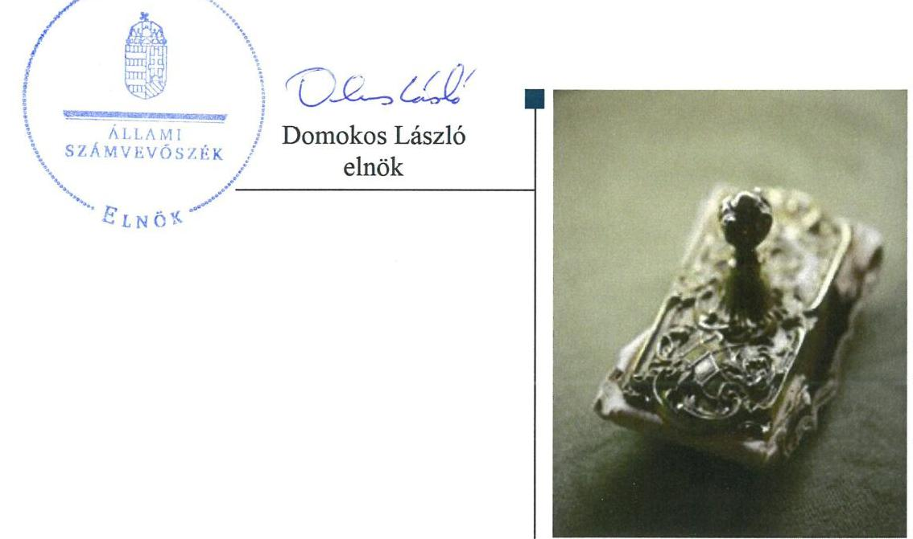
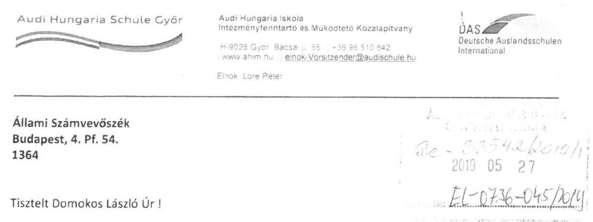
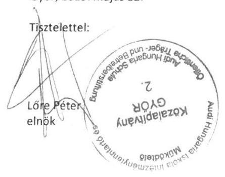
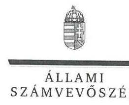
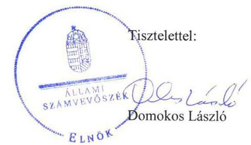
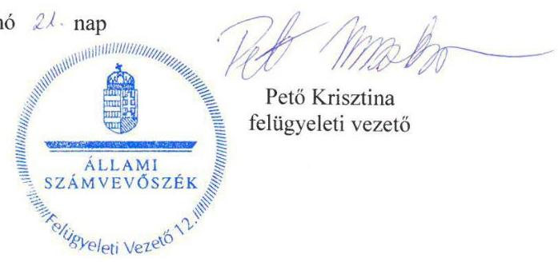

# Jelentés 

## Nem állami humánszolgáltatók ellenőrzése

A humánszolgáltatást nyújtó államháztartáson kívüli köznevelési és szociális intézmények, szolgáltatók fenntartói központi költségvetésből kapott támogatásai felhasználásának ellenőrzése - Audi Hungaria Iskola Intézményfenntartó és Működtető Közalapítvány
2019. 07. hó 25. nap

---

# AZ ELLENŐRZÉST FELÜGYELTE:

- PETŐ KRISZTINA felügyeleti vezető
- AZ ELLENŐRZÉST VEZETTE ÉS A VÉGREHAJTÁSÁÉRT FELELŐS:
  - HUDÁK KATALIN ellenőrzésvezető
  - DR. TÓTH LILI ellenőrzésvezetőként eljáró elemző számvevő
- A PROGRAM ÖSSZEÁLLÍTÁSÁÉRT FELELŐS:
  - TÓTPÁL SZABOLCS osztályvezető

**IKTATÓSZÁM:** EL-1603-001/2019.

**Jelentéseink az Országgyűlés számítógépes hálózatán és az Interneten a www.asz.hu címen is olvashatóak.**

**TÉMASZÁM:** 2448

**ELLENŐRZÉS-AZONOSÍTÓ SZÁM:** V079421

---

# TARTALOMJEGYZÉK 

■ ÖSSZEGZÉS ..... 5
■ AZ ELLENŐRZÉS CÉLJA ..... 6
■ AZ ELLENŐRZÉS TERÜLETE ..... 7
■ AZ ELLENŐRZÉS HÁTTERE, INDOKOLTSÁGA ..... 8
■ A JELENTÉS LÉNYEGES KÉRDÉSKÖREI ..... 9
■ AZ ELLENŐRZÉS HATÓKÖRE ÉS MÓDSZEREI ..... 10
■ MEGÁLLAPÍTÁSOK ..... 12
■ JAVASLATOK ..... 14
■ MELLÉKLETEK ..... 15
I. sz. melléklet: Értelmező szótár ..... 15
■ FÜGGELÉK: ÉSZREVÉTELEK ..... 17
■ RÖVIDÍTÉSEK JEGYZÉKE ..... 23

---

.

---

# ÖSSZEGZÉS 

Az Audi Hungaria Iskola Intézményfenntartó és Működtető Közalapítvány a köznevelési feladatokhoz biztosított központi költségvetési támogatásokat nem szabályszerűen tartotta nyilván, ezzel a közpénzek felhasználásának átláthatóságát és elszámoltathatóságát nem biztosította.

## Az ellenőrzés társadalmi indokoltsága

Az Állami Számvevőszék stratégiájában hangsúlyos szerepet szán annak, hogy szilárd szakmai alapon álló, értékteremtő ellenőrzéseivel előmozdítsa a közpénzügyek átláthatóságát, rendezettségét és javaslataival a közpénzek és a közvagyon szabályos, gazdaságos, hatékony és eredményes felhasználását segítse. Az Állami Számvevőszék a stratégiájában célul tűzte ki, hogy az államháztartáson kívülre nyújtott költségvetési támogatások ellenőrzésével hozzájárul ahhoz, hogy a közpénzeket az államháztartáson kívüli szervezetek is átlátható módon használják fel a közfeladatok szerződésben vállalt ellátása érdekében. Az Állami Számvevőszék e stratégiai céljaival összhangban - az Állami Számvevőszékről szóló 2011. évi LXVI. törvény felhatalmazása alapján - végzi a központi költségvetésből származó források, nyújtott támogatások - kedvezményezett szervezetek közfeladat ellátásához való - felhasználásának az ellenőrzését. Az Állami Számvevőszék hozzájárul ezzel ahhoz is, hogy a nyilvánosság és az igénybevevők megfelelő tájékoztatást kapjanak az államháztartáson kívüli közfeladatot ellátók működéséről.

Az Audi Hungaria Iskola Intézményfenntartó és Működtető Közalapítvány 2014-2017. évek között közel 1 milliárd forint költségvetési támogatásban részesült.

## Főbb megállapítások, következtetések, javaslatok

Az Audi Hungaria Iskola Intézményfenntartó és Működtető Közalapítvány, mint fenntartó a központi költségvetési támogatások alapfeladatok szerinti elkülönített nyilvántartásáról nem gondoskodott. A fenntartó nem alakított ki olyan nyilvántartást, amelyből megállapítható, hogy a támogatások milyen határnappal kerültek átadásra és milyen célra kerültek felhasználásra az Audi Hungaria Általános Művelődési Központnál. Ezzel a költségvetési támogatások felhasználásának átláthatóságát és elszámoltathatóságát nem biztosították. A közalapítvány az átvállalt köznevelési feladathoz biztosított költségvetési támogatásokat szabályszerűen továbbutalta az Audi Hungaria Általános Művelődési Központnak.

Az Állami Számvevőszék az Audi Hungaria Iskola Intézményfenntartó és Működtető Közalapítvány kuratóriumi elnökének egy javaslatot fogalmazott meg.

---

# AZ ELLENŐRZÉS CÉLJA 

AZ ELLENŐRZÉS CÉLJA annak értékelése volt, hogy az Audi Hungaria Iskola Intézményfenntartó és Működtető Közalapítvány, mint Fenntartó¹ központi költségvetésből kapott támogatásainak felhasználása szabályszerű volt-e, a támogatások igénylése, évközi módosítása és év végi elszámolása megfelelt-e a jogszabályi előírásoknak.

---

# **AZ ELLENŐRZÉS TERÜLETE**

## **Audi Hungaria Iskola Intézményfenntartó és Működtető Közalapítvány, mint intézményfenntartó**

Az Audi Hungaria Iskola Intézményfenntartó és Működtető Közalapítvány kiválás útján a Magyarországi Németek Általános Művelődési Központja Intézményfenntartó és Működtető Közalapítványból jött létre. A Fenntartót a Magyarországi Németek Országos Önkormányzata alapította, és a Győri Törvényszék 2014. szeptember 11-én kelt végzésével nyilvántartásba vette. 2015. október 22-től a Fenntartóhoz csatlakozott az alapítói joggal felruházott Audi Hungaria Motor Kft. (2017-től AUDI HUNGARIA Zrt.). A Fenntartó célja a Magyarországon élő német nemzetiség számára a nemzetiségi nevelés, oktatás és szakképzés biztosítása, továbbá a Magyarországon élő német nemzetiség kulturális életével kapcsolatos feladatok ellátása volt.

A Fenntartó nyitott, közhasznú tevékenységet végző közalapítvány, az ellenőrzött időszakban vállalkozási tevékenységet nem folytatott. Könyvvizsgálatra jogszabály alapján kötelezett volt. Egyszerűsített éves beszámolót készítő szervezetként önköltségszámításra nem volt kötelezett. Az ellenőrzött időszakban az induló/jegyzett tőke összege 6,0 M Ft-ról 7,5 M Ft-ra, a mérlegfőösszeg 1 057,8 M Ft-ról 5 188,1 M Ft-ra emelkedett.

A Fenntartó ügyvezető szerve a Kuratórium volt, amely 2014-ben öt főből, 2015-ben hat főből, 2016-ban hét, majd nyolc főből, 2017-ben pedig kilenc főből állt. A Fenntartó képviseletére a Kuratórium elnöke volt jogosult.

A Fenntartó egy köznevelési intézmény, az Audi Hungaria Általános Művelődési Központ tekintetében látott el fenntartói feladatokat. A győri székhelyű Intézmény² óvodai és nemzetiségi óvodai nevelési, általános iskolai és nemzetiségi általános iskolai nevelési és oktatási, gimnáziumi, nemzetiségi gimnáziumi és szakgimnáziumi nevelési és oktatási, továbbá közművelődési alapfeladatokat látott el.

Az Intézményben a tanulói létszám 2014. évben 447 fő, a 2015. évben 507 fő, a 2016. évben 560 fő, a 2017. évben 616 fő volt. Az Intézmény engedélyezett tanulólétszáma 1140 fő volt.

A Fenntartó 2014. évben 78,4 M Ft, 2015. évben 248,1 M Ft, 2016. évben 295,2 M Ft és 2017. évben 343,7 M Ft költségvetési támogatásban részesült. A költségvetési támogatásokkal a Fenntartó a Magyar Államkincstár felé számolt el. A törvényességi ellenőrzési feladatokat a Győr-Moson-Sopron Megyei Kormányhivatal végezte.

---

# AZ ELLENŐRZÉS HÁTTERE, INDOKOLTSÁGA 

A köznevelési feladatokat ellátó nem állami intézményfenntartók részére közfeladataik ellátására a 2014-2017. években jelentős összegű pénzügyi támogatást biztosítottak a mindenkori költségvetési törvények a bennük megfogalmazott feltételek mellett.

Az ÁSZ³ a stratégiájában célul tűzte ki, hogy az államháztartáson kívülre nyújtott költségvetési támogatások ellenőrzésével hozzájárul ahhoz, hogy a közpénzeket az államháztartáson kívüli szervezetek is átlátható módon használják fel a közfeladatok ellátására kötött szerződésekben vállalt ellátása érdekében. Az ÁSZ stratégiájában foglaltak alapján is indokolt az ellenőrzés, amely a társadalom számára jelzi, hogy a közpénzek államháztartáson kívüli felhasználása sem maradhat ellenőrizhetetlenül. Az államháztartáson kívülre nyújtott költségvetési támogatások ellenőrzésével az ÁSZ hozzájárul ahhoz, hogy a közpénzeket a nem állami humán fenntartók átlátható módon használják fel a közfeladatok ellátására kötött szerződésben vállalt kötelezettségek teljesítése érdekében. Az ellenőrzés javaslataival hozzájárul az említett rendszerek szabályszerű támogatás felhasználásához, javítja a társadalmi-gazdasági döntések megalapozottságát, ami a „jó kormányzás" feltétele.

---

# A JELENTÉS LÉNYEGES KÉRDÉSKÖREI 

1.     - A köznevelési közfeladatot ellátó Fenntartó szabályszerű működési és gazdálkodási környezet kialakításával megteremtette-e a költségvetési támogatások átlátható, elszámoltatható igénybevételének, felhasználásának feltételeit?
2.     - A Fenntartó az átvállalt köznevelési közfeladathoz biztosított költségvetési támogatásokat szabályszerűen fordította-e a humánszolgáltató intézménye működtetésére?
3.     - A Fenntartó a köznevelési intézménye működtetéséhez felhasznált közpénzekre vonatkozó gazdálkodásával a nyilvánosság előtt elszámolt-e, ennek megalapozása érdekében ellenőrzési, értékelési és a külső ellenőrzésekkel kapcsolatos intézkedési feladatait szabályszerűen látta-e el?

---

# AZ ELLENŐRZÉS HATÓKÖRE ÉS MÓDSZEREI 

## Az ellenőrzés típusa

Megfelelőségi ellenőrzés.

## Az ellenőrzött időszak

A 2014. szeptember 11. és 2017. december 31-e közötti időszak. A helyszíni szemle tekintetében 2018. január 1-jétől 2019. január 12-ig tartó időszak.

## Az ellenőrzés tárgya

Az ellenőrzés a köznevelési közfeladatokat ellátó államháztartáson kívüli Fenntartó humánszolgáltatási közfeladatai ellátásához a költségvetési törvényekben biztosított központi költségvetési támogatások igénylése, évközi módosítása és év végi elszámolása fenntartói feladatainak ellátása, illetve e központi költségvetésből kapott támogatások humánszolgáltatási közfeladatokra való fenntartó általi felhasználása szabályszerűségének értékelésére terjedt ki.

Az ellenőrzés kiterjedt minden olyan körülményre és adatra, amely az ÁSZ jogszabályban meghatározott feladatainak teljesítéséhez, valamint a program végrehajtása folyamán felmerült újabb összefüggések feltárásához szükséges volt.

## Az ellenőrzött szervezet

Audi Hungaria Iskola Intézményfenntartó és Működtető Közalapítvány.

## Az ellenőrzés jogalapja

Az ellenőrzés jogszabályi alapját az ÁSZ tv.⁴ 1. § (3) bekezdése, 5. § (3) bekezdésében foglalt előírások adták.

## Az ellenőrzés módszerei

Az ellenőrzést az ellenőrzési program szempontjai, kérdései, az ellenőrzött időszakban hatályos jogszabályok, a nemzetközi standardokat irányadónak tekintve, az ellenőrzés szakmai szabályok és módszertanok figyelembevételével végezte az ÁSZ. A közpénzekkel való felelős gazdálkodás segítésére

---

irányuló javaslatok kidolgozásakor a hatályos jogszabályok voltak az irányadóak.

Az ellenőrzés ideje alatt az ellenőrzött szervezettel történő kapcsolattartást az ÁSZ SZMSZ⁵-ének vonatkozó előírásai alapján biztosította az ÁSZ.

Az ellenőrzési kérdések megválaszolásához szükséges bizonyítékok megszerzése az ellenőrzött által rendelkezésre bocsátott dokumentumokra, adatokra alapozva elemző eljárással történt.

Az ellenőrzési bizonyítékként felhasználható adatforrások közé tartoztak egyrészt a szakmai program részletes szempontjainál felsorolt adatforrások, másrészt minden - az ellenőrzés folyamán feltárt, az ellenőrzés szempontjából információt tartalmazó - dokumentum.

Az ellenőrzés lefolytatásához az ellenőrzött szervezet a kitöltött tanúsítványok, valamint az ÁSZ által kért dokumentumok elektronikus úton való megküldésével szolgáltatott adatokat, információkat. Az így rendelkezésre bocsátott adatok, információk és a tanúsítványok adatai valódiságának kontrollja az ellenőrzés keretében történt.

A fenntartott köznevelési intézménynél helyszíni szemle keretében győződött meg az ÁSZ a tényleges feladatellátásról (verifikáció).

A köznevelési humánszolgáltatások központi költségvetési támogatásai igénylésével, módosításával, elszámolásával kapcsolatos, államháztartáson kívüli fenntartó jogszabályokban előírt feladatai betartását, továbbá a központi költségvetési támogatások szabályszerű kezelését, nyilvántartását ellenőrizte az ÁSZ a Fenntartónál határozatok, nyilvántartások, beszámolók és egyéb dokumentumok alapján. Az ellenőrzés nem terjedt ki a köznevelési humánszolgáltatások központi költségvetési támogatásai igénylése, módosítása, elszámolása valódiságának, megalapozottságának, helyességének - sem a Fenntartónál, sem a székhely intézménynél való - értékelésére. Továbbá nem terjedt ki az ellenőrzés e források köznevelési intézmény általi szabályszerű felhasználásának értékelésére.

A szabályosság megítélésének alapját képezte, hogy a központi költségvetési támogatások Fenntartó általi igénylése, módosítása és elszámolása a Kincstár⁶ felé megtörtént.

---

# MEGÁLLAPÍTÁSOK 

## 1. A köznevelési közfeladatot ellátó Fenntartó szabályszerű működési és gazdálkodási környezet kialakításával megterem-tette-e a költségvetési támogatások átlátható, elszámoltatható igénybevételének, felhasználásának feltételeit?

Összegző megállapítás

A Fenntartó a működési- és gazdálkodási környezetet szabályszerűen kialakította. Megteremtette a költségvetési támogatások átlátható, elszámoltatható igénybevételének és felhasználásának feltételeit.

A PTK.⁷ SZERINTI ALAPÍTÓ OKIRATTAL a Fenntartó a rendelkezett. A Fenntartó szervezeti és működési szabályzatban határozta meg szabályszerűen a felelősségi- és hatásköröket, azok gyakorlásának módját.

SZÁMVITELI POLITIKÁVAL⁸ és az annak keretében elkészítendő szabályzatokkal a Fenntartó - a Számv. tv.⁹ előírásai szerint - rendelkezett.

A Fenntartó a Civil tv. ¹⁰ és a Civilszr₁,₂¹¹ szerinti kettős könyvvitellel alátámasztott egyszerűsített éves beszámolót, valamint - közhasznúvá válását követően - közhasznúsági mellékletet készített. A Civilszr₁ 19. § és a Civilszr₂ 29. § előírásai szerinti könyvvizsgálati kötelezettségét a Fenntartó teljesítette, a számviteli beszámolóit könyvvizsgáló auditálta.

A SZÁMVITELI BESZÁMOLÓK mérlegének és eredménykimutatásának tagolása szabályszerű volt.

## 2. A Fenntartó az átvállalt köznevelési közfeladathoz biztosított költségvetési támogatásokat szabályszerűen fordította-e a humánszolgáltató intézménye működtetésére?

Összegző megállapítás

A Fenntartó az átvállalt köznevelési feladathoz biztosított támogatásokat nem szabályszerűen fordította az Intézmény működtetésére.

A KÖLTSÉGVETÉSI TÁMOGATÁSOK FELHASZNÁLÁSÁT a Fenntartó az Nkt. vhr. 37/G. § (1) bekezdésben
 foglalt előírás ellenére nem alapfeladatonkénti bontásban elkülönítetten és naprakészen tartotta nyilván.

A Fenntartó a nyilvántartási rendszerét a Civilszr 17. § (8) bekezdése és a Civilszr 14. § (1) bekezdése ellenére nem úgy alakította ki, hogy abból

---

a közpénzek felhasználásával, és a továbbutalási céllal kapott támogatásokkal kapcsolatos információk is rendelkezésre álljanak.

A FENNTARTÓ szabályszerűen kiadta az Intézmény alapító okiratát, gondoskodott arról, hogy az Intézmény rendelkezzen az Nkt. előírásai szerinti szervezeti és működési szabályzattal, házirenddel és pedagógiai programmal. A Fenntartó a jogszabályi előírások szerint határozta meg az Intézmény könyvvezetési és beszámoló készítési kötelezettségét. A Fenntartó az Nkt. előírásai szerint elfogadta az Intézmény éves költségvetését.

A KÖLTSÉGVETÉSI TÁMOGATÁSOKAT a Fenntartó a Kvtv. , az Nkt. és az Nkt. vhr. előírásai szerint utalta tovább az Intézménynek.

A KÖLTSÉGVETÉSI TÁMOGATÁSOK igénylése, módosítása és elszámolása a Kincstár felé szabályszerű volt.

# 3. A Fenntartó a köznevelési intézménye működtetéséhez felhasznált közpénzekre vonatkozó gazdálkodásával a nyilvánosság előtt elszámolt-e, ennek megalapozása érdekében ellenőrzési, értékelési és a külső ellenőrzésekkel kapcsolatos intézkedési feladatait szabályszerűen látta-e el? 

Összegző megállapítás

A beszámolók közzétételével a Fenntartó az Intézmény működtetéséhez felhasznált közpénzekre vonatkozóan gazdálkodásával a nyilvánosság előtt elszámolt. A Fenntartó ellenőrzési, értékelési feladatait szabályszerűen ellátta.

A KURATÓRIUM ÁLTAL JÓVÁHAGYOTT ÉVES BESZÁMOLÓIT a Fenntartó a közhasznúsági melléklettel és könyvvizsgálói jelentéssel együtt a Civil. tv. előírásai szerint az Országos Bírósági Hivatal részére letétbe helyezés és közzététel céljából megküldte, saját honlapján közzétette. A Fenntartó az Intézmény működtetési feladatainak nyilvánosságát az Nkt. szerint biztosította.

A FENNTARTÓ ÉRTÉKELTE az Nkt. szerint a pedagógiai programban meghatározott feladatok végrehajtását, és a pedagógiai szakmai munka eredményességét. A Fenntartó az Nkt. szerint ellenőrizte az Intézmény szervezeti és működési szabályzatát.

A Fenntartó az Nkt. 83. § (2) e) pontban foglalt lehetőséggel nem élt az ellenőrzött időszakban, az Intézménynél törvényességi és gazdálkodási ellenőrzést nem végzett.

A FENNTARTÓNÁL a Kincstár a költségvetési támogatás elszámolását és felhasználását, az EMMI a kiegészítő támogatás felhasználását ellenőrizte, a Kormányhivatal törvényességi ellenőrzést végzett. Az ellenőrzések során nem került megfogalmazásra intézkedést igénylő megállapítás.

---

# JAVASLATOK 

Az ÁSZ tv. 33. § (1) bekezdésében foglaltak értelmében az ellenőrzött szervezet vezetője köteles a jelentésben foglalt megállapításokhoz kapcsolódó intézkedési tervet összeállítani és azt a jelentés kézhezvételétől számított 30 napon belül az ÁSZ részére megküldeni. Amennyiben az ellenőrzött szervezet vezetője nem küldi meg határidőben az intézkedési tervet, vagy továbbra sem elfogadható intézkedési tervet küld, az Állami Számvevőszék elnöke az ÁSZ tv. 33. § (3) bekezdés a) és b) pontjaiban foglaltakat érvényesítheti.

## Audi Hungaria Iskola Intézményfenntartó és Működtető Közalapítvány kuratóriumi elnökének

1. Intézkedjen a támogatás felhasználásának alapfeladatonkénti bontásban elkülönített naprakész nyilvántartásáról.
(2. sz. megállapítás 1. bekezdése alapján)

---

# MELLÉKLETEK 

- I. SZ. MELLÉKLET: ÉRTELMEZŐ SZÓTÁR
civil szervezet
humánszolgáltatás
költségvetési támogatás
köznevelési közfeladat

A Civil tv. 2. § 6. pontja szerint civil szervezet a civil társaság, a Magyarországon nyilvántartásba vett egyesület (a párt, a szakszervezet és a kölcsönös biztosító egyesület kivételével), a közalapítvány és a pártalapítvány kivételével az alapítvány.
Külön törvényben meghatározott szociális, gyermekjóléti, gyermekvédelmi, közoktatási, felsőoktatási, kulturális közfeladatok (2014. évi Kvtv. 34. § (1), (4) bekezdés, 1. számú melléklet XX/20/2. alcím, 19. alcím, 2015. évi Kvtv. 43. § (1), (4) bekezdés, 1. számú melléklet XX/20/2/3. jogcím csoport, 19. alcím, 2016. évi Kvtv. 41. § (1), (4) bekezdés, 1. számú melléklet XX/20/2/3. jogcím csoport, 19. alcím).

A társadalombiztosítás pénzügyi alapjai kivételével az államháztartás központi alrendszeréből ellenérték nélkül, pénzben nyújtott támogatások (Áht. 1. § 14. pont)
A költségvetési törvényekben (2013. évi CCXXX. törvény 33-34. §, 2014. évi C. törvény 42-43. §, 2015. évi C. törvény 40-41. §) megállapított támogatás. A 2015. évi C. törvény 40-41. § szerint többek között: Az Országgyűlés a köznevelési feladat ellátására átlagbéralapú támogatást állapít meg. A nevelési-oktatási, valamint pedagógiai szakszolgálati intézményt fenntartó nemzetiségi önkormányzat, az egyházi és magán köznevelési intézmény fenntartója részére az általuk fenntartott nevelési-oktatási intézményben, továbbá pedagógiai szakszolgálati intézményben pedagógus és - a b) pont kivételével - nevelő-oktató munkát közvetlenül segítő munkakörben foglalkoztatottak után a 7. melléklet I. pontja, valamint az óvoda, egységes óvoda-bölcsőde esetében a 2. melléklet II. pont 1. alpontja szerint és az 5. alpontjában meghatározott jogosultak után, az őket ott megillető mértékek szerint.
Az Országgyűlés a szociális, gyermekjóléti, gyermekvédelmi közfeladatot ellátó intézményt, szolgáltatást fenntartó egyházi jogi személy, civil szervezet, közalapítvány, országos nemzetiségi önkormányzat, települési vagy területi nemzetiségi önkormányzat, gazdasági társaság, és a humánszolgáltatást alaptevékenységként végző, az Szja tv. hatálya alá tartozó egyéni vállalkozó (a továbbiakban együtt: nem állami szociális fenntartó) részére támogatást állapít meg a következők szerint: a támogatás a nem állami szociális fenntartót a települési önkormányzatok 2. melléklet III. pont 3. alpont c)-k) pontjában és III. pont 5. alpont a) pontjában meghatározott támogatásaival azonos jogcímeken, összegben és feltételek mellett illeti meg.
A köznevelési intézmény alapító okiratában foglalt feladat: óvodai nevelés, nemzetiséghez tartozók óvodai nevelése, általános iskolai nevelés-oktatás, nemzetiséghez tartozók általános iskolai nevelése-oktatása, kollégiumi ellátás, nemzetiségi kollégiumi ellátás, gimnáziumi nevelés-oktatás, szakközépiskolai nevelés-oktatás, szakiskolai nevelés-oktatás, nemzetiség gimnáziumi nevelés-oktatása, nemzetiség szakközépiskolai nevelés-oktatása, nemzetiség szakisko-lai nevelés-oktatása. Köznevelési Hídprogramok keretében folyó nevelés-oktatás, felnőttoktatás, alapfokú művészetoktatás, fejlesztő nevelés, fejlesztő nevelés-oktatás, pedagógiai szakszolgálati feladat, a többi gyermekkel, tanulóval együtt nevelhető, oktatható sajátos nevelési igényű gyermekek, tanulók óvodai

---

# Mellékletek 

köznevelési intézmény
nem állami, nem önkormányzati (államháztartáson kívüli) intézmény fenntartó
nevelése és iskolai nevelése-oktatása. Azoknak a sajátos nevelési igényű gyermekeknek, tanulóknak az óvodai, iskolai, kollégiumi ellátása, akik a többi gyermekkel, tanulóval nem foglalkoztathatók együtt, a gyermekgyógyüdülőkben, egészségügyi intézményekben, rehabilitációs intézményekben tartós gyógykezelés alatt álló gyermekek tankötelezettségének teljesítéséhez szükséges oktatás, pedagógiai-szakmai szolgáltatás.
A nevelési- oktatási intézmény, pedagógiai szakszolgálati intézmény, pedagó-giai-szakmai szolgáltatást nyújtó intézmény.
A köznevelési és szociális, gyermekjóléti és gyermekvédelmi közfeladatokat/humánszolgáltatásokat ellátó intézményt fenntartó egyházi jogi személy, társadalmi szervezet, alapítvány, közalapítvány, civil szervezet, országos nemzetiségi önkormányzat, nonprofit gazdasági társaság, gazdasági társaság és a humánszolgáltatást alaptevékenységként végző, Szja tv. hatálya alá tartozó egyéni vállalkozó. (2013. évi Kvtv. 35. § (1), (3) bekezdés, 2014. évi Kvtv. 33. §, 34. § (1), (4) bekezdés, 2015. évi Kvtv. 42. §, 43. § (1), (4) bekezdés, 2016. évi Kvtv. 40. §, 41. § (1), (4) bekezdés)

---

# FÜGGELÉK: ÉSZREVÉTELEK 

A jelentéstervezetet a Számvevőszék 15 napos észrevételezésre megküldte az ellenőrzött szervezet vezetőjének az ÁSZ tv. 29. § (1) bekezdése előírásának megfelelően.

Az Audi Hungaria Iskola Intézményfenntartó és Működtető Közalapítvány kuratóriumi elnöke a jelentéstervezet megállapításaira írásban észrevételt tett.
Az ÁSZ tv. 29. § (3) bekezdésével összhangban az ÁSZ a Függelékben feltünteti az ellenőrzés megállapításaival kapcsolatban tett, figyelembe nem vett észrevételeket, és megindokolja, hogy azokat miért nem fogadta el.

[^0]
[^0]:    * 29. § (1) Az Állami Számvevőszék az ellenőrzési megállapításait megküldi az ellenőrzött szervezet vezetőjének vagy az általa megbízott személynek, és annak, akinek személyes felelősségét állapította meg.
    (2) Az ellenőrzött szervezet vezetője és a felelősként megjelölt személy az ellenőrzés megállapításaira tizenöt napon belül írásban észrevételt tehet.
    (3) Az Állami Számvevőszék az észrevételre a beérkezésétől számított harminc napon belül írásban válaszol. A figyelembe nem vett észrevételeket köteles a jelentésben feltüntetni, és megindokolni, hogy azokat miért nem fogadta el.

---

2019.05.13. napján vettem kézhez az Audi Hungaria Iskola Intézményfenntartó és Működtető Közalapítvány számvevőszéki jelentéstervezetét, melyet észrevételezés céljából küldtek meg részünkre.

A Főbb megállapítások és javaslatok részben, Önök azt fogalmazták meg, hogy a Közalapítvány nem vezetett olyan nyilvántartást, melyből megállapítható lenne, hogy az állami támogatások milyen határnappal kerültek átadásra, és milyen célra kerültek felhasználásra.

- Közalapítványunk nyilvántartásából egyértelműen megállapítható a támogatások beérkezésének és átadásának időpontja. Ez főkönyvi karton és analitikus nyilvántartás formájában is rendelkezésre áll, és ezeket minden vizsgált év tekintetében az Önök rendelkezésére bocsátottuk.

Önök egy javaslatot fogalmaztak meg a Közalapítvány kuratóriumának:
Intézkedjen a támogatás felhasználásának alapfeladatonkénti bontásban elkülönített naprakész nyilvántartásáról.

- Az Audi Hungaria Általános Művelődési Központ a fenntartó Közalapítvány kuratóriuma által elfogadott éves költségvetés alapján önállóan gazdálkodik. Közalapítványunk az állami támogatásokat átadja az általa fenntartott intézmény részére. Az állami támogatás felhasználása, könyvelése az intézménynél történik. Az intézmény könyvelése -főkönyvi kivonata - naprakészen, alapfeladatonkénti bontásban tartalmazza a kiadásokat. Köznevelési megállapodás alapján folyósított támogatás esetében az alapfeladatonkénti támogatás felhasználásáról készített analitikus nyilvántartás és főkönyvikivonat az elszámolás időszakához igazodik. Ezen dokumentumok a fenntartónál rendelkezésre állnak, melyeket mellékletként csatolok is Önöknek.

Kérjük Önöket, hogy észrevételeinket szíveskedjenek elfogadni.
Nagyon köszönjük Önöknek a lefolytatott vizsgálatot.
Győr, 2019. május 22.

---

ELNÖK

Ikt.szám: EL-0736-046/2019.

# Lőre Péter úr 

kuratóriumi elnök
Audi Hungária Iskola Intézményfenntartó és Működtető Közalapítvány

Győr

## Tisztelt Elnök Úr!

A ,,Nem állami humánszolgáltatók ellenőrzése - A humánszolgáltatást nyújtó államháztartáson kívüli köznevelési és szociális intézmények, szolgáltatók fenntartói központi költségvetésből kapott támogatásai felhasználásának ellenőrzése - Audi Hungária Iskola Intézményfenntartó és Működtető Közalapítvány" címmel készített számvevőszéki jelentéstervezetre tett észrevételeit megkaptam.
Az Állami Számvevőszék észrevételekre vonatkozó álláspontjáról a felügyeleti vezető által készített részletes tájékoztatást csatoltan megküldöm.
Tájékoztatom Elnök urat, hogy a számvevőszéki jelentésben - az Állami Számvevőszékről szóló 2011. évi LXVI. törvény 29. § (3) bekezdése alapján - a figyelembe nem vett észrevételeket szerepeltetjük az elutasítás indokának feltüntetésével.

Budapest, 2019. 66. hó 21. nap

Melléklet: Tájékoztatás az észrevételek kezeléséről

---

# Tájékoztatás az észrevételek kezeléséről 

A „Nem állami humánszolgáltatók ellenőrzése - A humánszolgáltatást nyújtó államháztartáson kívüli köznevelési és szociális intézmények, szolgáltatók fenntartói központi költségvetésből kapott támogatásai felhasználásának ellenőrzése - Audi Hungária Iskola Intézményfenntartó és Működtető Közalapítvány" című jelentéstervezetre a 2019. május 22 -én kelt levelében megküldött észrevételeit áttekintettem. Az észrevételek kezeléséről az alábbi tájékoztatást adom.

## 1. A jelentéstervezet Főbb megállapítások, következtetések, javaslatok részére tett észrevétel

Elnök úr észrevételében vitatta a jelentéstervezet Főbb megállapítások, következtetések, javaslatok részének azon megállapítását, hogy nem vezettek olyan nyilvántartást, amelyből megállapítható lenne, hogy az állami támogatások milyen határnappal kerültek átadásra, és milyen célra kerültek felhasználásra. Ennek alátámasztására kifejtette, hogy az Audi Hungária Iskola Intézményfenntartó és Működtető Közalapítvány (továbbiakban: Közalapítvány) nyilvántartásából egyértelműen megállapítható a támogatások beérkezésének és átadásának időpontja. Ez a főkönyvi kartonok és analitikus számviteli nyilvántartások formájában rendelkezésre áll, és ezeket minden ellenőrzött év tekintetében az Állami Számvevőszék (továbbiakban: ÁSZ) rendelkezésére bocsátották.

Az ÁSZ rendelkezésére álló ellenőrzési bizonyítékok ismételt felülvizsgálata alapján megállapítható, hogy adatbekérés során megküldött főkönyvi kartonok és analitikus nyilvántartásokban szereplő adatok nem alapfeladatonkénti bontásban elkülönítetten állnak rendelkezésre, a támogatások cél szerinti felhasználására vonatkozóan nem tartalmaznak információt. Az ellenőrzés rendelkezésére bocsátott dokumentumok egyike sem felel meg a nemzeti köznevelésről szóló törvény végrehajtásáról szóló 229/2012. (VIII. 28.) Korm. rendelet (továbbiakban: Nkt. vhr.) 37/G. § (1) bekezdésében foglalt követelményeknek. Az
 Nkt. vhr. 37/G. § (1) bekezdésében előírt nyilvántartás hiányából következik, hogy a további tartalmi követelmények sem teljesültek, mivel alapfeladatonkénti bontásban a támogatások átadására, valamint cél szerinti felhasználására vonatkozó információk sem állnak rendelkezésre. Mindezekre tekintettel észrevételét nem fogadjuk el, a jelentéstervezet módosítása nem indokolt.

---

# 2. A jelentéstervezet kuratóriumi elnöknek címzett 1. számú javaslatára és a 2. sz. megállapítás 1. bekezdésére tett észrevétel 

Észrevételében vitatta a jelentéstervezet 1. számú javaslatát és az azt alátámasztó megállapítást, mivel álláspontja szerint az állami támogatás felhasználása, könyvelése a Közalapítvány által fenntartott, a Közalapítvány kuratóriuma által elfogadott éves költségvetés alapján az önállóan gazdálkodó intézménynél történik. Elmondása szerint az intézmény könyvelése - főkönyvi kivonata - naprakészen, alapfeladatonkénti bontásban tartalmazza a kiadásokat, amely dokumentumok a fenntartónál rendelkezésre állnak és mellékelten csatolja őket.
A Közalapítvány által készített és az adatbekérés során az ÁSZ részére átadott 2014-2017. évi nyilvántartásokban és főkönyvi kartonokban a költségvetési támogatásokat kizárólag „állami támogatás" és „köznevelési támogatás" kategóriákra bontották meg. Az Nkt. vhr. 37/G. § (1) bekezdése előírásainak az alkalmazott gyakorlat nem felelt meg, mivel a jogszabályi előírás szerint a készített nyilvántartást alapfeladatonkénti bontásban szükséges elkészíteni. Az Nkt. vhr. 37/G. § (1) bekezdése azt is egyértelműen előírja, hogy a nyilvántartást a fenntartónak, jelen esetben a Közalapítványnak kellett volna vezetnie, így nem helytálló az észrevétel azon felvetése, hogy a fenntartott intézménynél vezetett nyilvántartások kielégítik az alapfeladatonkénti megbontás követelményeit.
A fenntartott Audi Hungaria Általános Művelődési Központ (2016. március 17-i névváltozást megelőzően Audi Hungária Óvoda, Általános Iskola és Gimnázium) alapító okirata szerint többcélú közoktatási intézmény volt, amelynek alapfeladatai közé tartozott az óvodai nevelés, a nemzetiséghez tartozók óvodai nevelése, az általános iskolai nevelés-oktatás, a nemzetiséghez tartozók általános iskolai nevelés-oktatás, gimnáziumi nevelés-oktatás, a nemzetiségi gimnáziumi nevelés-oktatás, amely alapfeladatok közötti megbontást a Közalapítványnál vezetett nyilvántartások és főkönyvi kartonok nem igazolták.
Az Állami Számvevőszékről szóló 2011. évi LXVI. törvény (továbbiakban: ÁSZ tv.) 28. § (1) bekezdése alapján a közreműködésre felhívott szervezet az ÁSZ részére - annak kérésére soron kívül, de legkésőbb öt munkanapon belül - az ellenőrzés lefolytatása érdekében a szükséges adatokat és dokumentumokat rendelkezésre bocsátja. Elnök úr a teljességi és hitelességi nyilatkozataiban kijelentette, hogy az ÁSZ részére átadott dokumentumok, adatok megbízhatóak, és a bekért adatokra, dokumentumokra vonatkozóan teljes körű információt tartalmaznak. Elnök úr továbbá a teljességi és hitelességi nyilatkozatban az átadott dokumentumok, adatok hitelességéért, valódiságáért, hiánytalanságáért és hatályosságáért teljes felelősséget vállalt. Az előzőekben leírtakra tekintettel az ÁSZ azon dokumentumokat, amelyek az adatszolgáltatási időszakot követően, az észrevétel mellékleteként bocsátott az ÁSZ rendelkezésére, bizonyítékként nem veszi figyelembe. Az ÁSZ ellenőrzési megállapításait az adatszolgáltatás során a részére törvényi határidőben rendelkezésre bocsátott dokumentumokra alapozva fogalmazza meg.

---

Az előbbiekre tekintettel az észrevételt nem fogadjuk el, a jelentéstervezet módosítása nem indokolt.

Budapest, 2019.

---

# RÖVIDÍTÉSEK JEGYZÉKE 

${ }^{1}$ Fenntartó
${ }^{2}$ Intézmény
${ }^{3}$ ÁSZ
${ }^{4}$ ÁSZ tv.
${ }^{5}$ ÁSZ SZMSZ
${ }^{6}$ Kincstár
${ }^{7}$ Ptk.
${ }^{8}$ Számviteli politika 1
Számviteli politika 2
Számviteli politika 3
Számviteli politika 4
${ }^{9}$ Számv. tv.
${ }^{10}$ Civil tv.
${ }^{11}$ Civilszr. 1

Civilszr. 2
${ }^{12} \mathrm{Nkt}$.
${ }^{13} \mathrm{Kvtv} .1$
Kvtv. 2
Kvtv. 3
Kvtv. 4
${ }^{14} \mathrm{Nkt}$. vhr.
${ }^{15}$ Kormányhivatal
${ }^{16}$ Áht.

Audi Hungaria Iskola Intézményfenntartó és Működtető Közalapítvány
AUDI Hungaria Óvoda, Általános Iskola és Gimnázium 2016. március 16-ig, 2016. március 17-től AUDI Hungaria Általános Művelődési Központ
Állami Számvevőszék
2011. évi LXVI. törvény az Állami Számvevőszékről

Állami Számvevőszék Szervezeti és Működési Szabályzata
Magyar Államkincstár
2013. évi V. törvény a Polgári törvénykönyvről

Audi Hungaria Iskola Intézményfenntartó és Működtető Közalapítvány számviteli politikája (hatályos 2014. szeptember 20-tól)
Audi Hungaria Iskola Intézményfenntartó és Működtető Közalapítvány számviteli politikája (hatályos 2015. január 19-től)
Audi Hungaria Iskola Intézményfenntartó és Működtető Közalapítvány számviteli politikája (hatályos 2016. január 28-tól)
Audi Hungaria Iskola Intézményfenntartó és Működtető Közalapítvány számviteli politikája (hatályos 2017. január 23-tól)
2000. évi C. törvény a számvitelről
2011. évi CLXXV. törvény az egyesülési jogról, a közhasznú jogállásról, valamint a civil szervezetek működéséről és támogatásáról
224/2000. (XII. 19.) Korm. rendelet a számviteli törvény szerinti egyes egyéb szervezetek beszámoló készítési és könyvvezetési kötelezettségének sajátosságairól (hatályos 2016. december 31-ig)
479/2016. (XII. 28.) Korm. rendelet a számviteli törvény szerinti egyes egyéb szervezetek beszámoló készítési és könyvvezetési kötelezettségének sajátosságairól (hatályos 2017. január 1-jétől)
2011. évi CXC. törvény a nemzeti köznevelésről
2013. évi CCXXX. törvény Magyarország 2014. évi központi költségvetéséről
2014. évi C. törvény Magyarország 2015. évi központi költségvetéséről
2015. évi C. törvény Magyarország 2016. évi központi költségvetéséről
2016. évi XC. törvény Magyarország 2017. évi központi költségvetéséről 229/2012. (VIII. 28.) Korm. rendelet a nemzeti köznevelésről szóló törvény végrehajtásáról
Győr-Moson-Sopron Megyei Kormányhivatal
2011. évi CXCV. törvény az államháztartásról

---

ÁLLAMI SZÁMVEVŐSZÉK
1052 Budapest, Apáczai Csere János utca 10.
Levélcím: 1364 Budapest 4. Pf. 54
Telefon: +36 14849100 Telefax: +36 14849200
www.asz.hu
