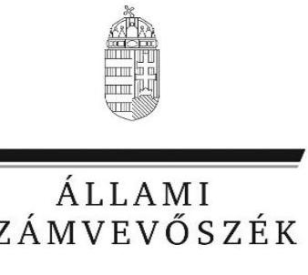
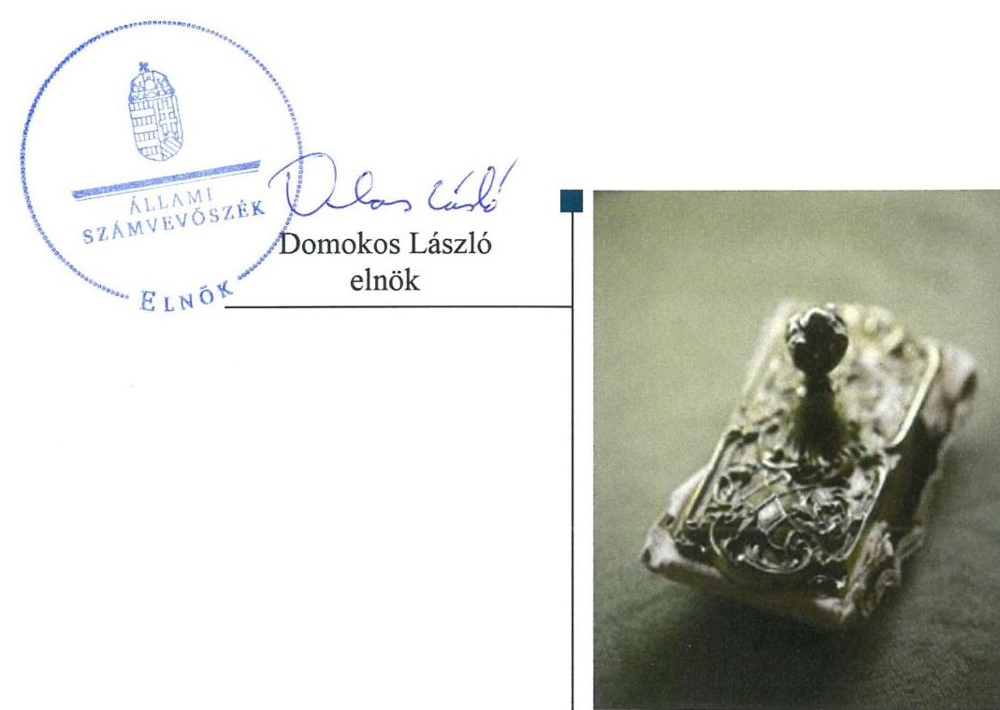
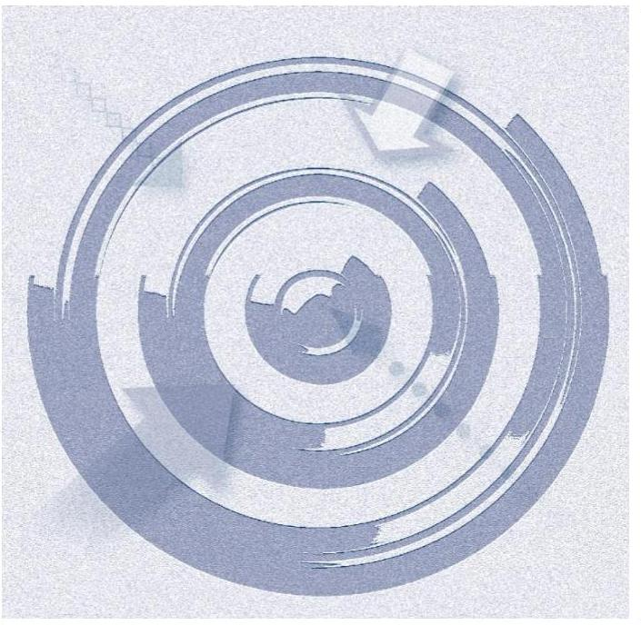
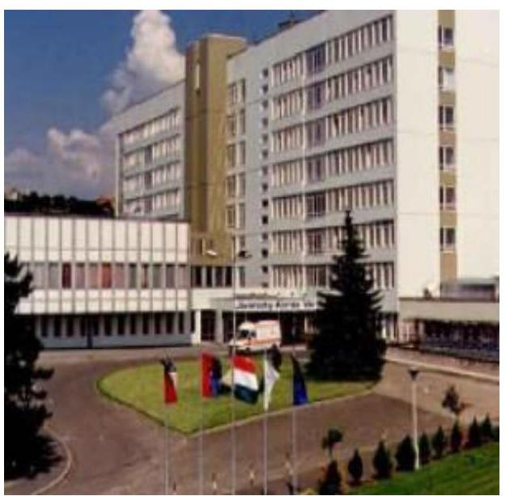
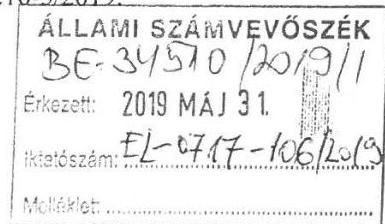
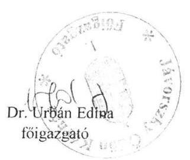
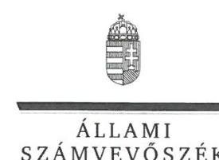
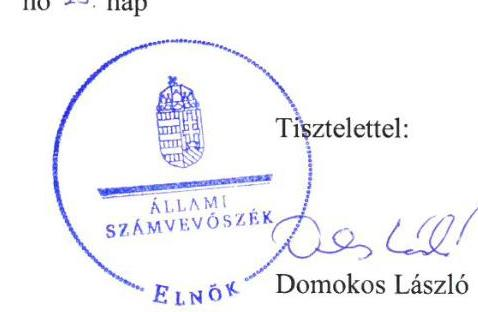

# Jelentés

## Központi költségvetési szervek ellenőrzése

Jávorszky Ödön Kórház
2019.

19117
www.asz.hu

---

# Jelenetés 

## Központi költségvetési szervek ellenőrzése

Jávorszky Ödön Kórház
2019. 04. hó 24. nap

---

|   | AZ ELLENŐRZÉST FELÜGYELTE:  |
| --- | --- |
|   | DR. NAGY IMRE felügyeleti vezető  |
|   | AZ ELLENŐRZÉST VEZETTE ÉS A VÉGREHAJTÁSÁÉRT FELELŐS:  |
|   | DR. KOVÁCS DIÁNA ellenőrzésvezető  |
|   | A PROGRAM ÖSSZEÁLLÍTÁSÁÉRT FELELŐS:  |
|   | TÓTPÁL SZABOLCS osztályvezető  |
|   | A TÉMÁHOZ KAPCSOLÓDÓ KORÁBBI SZÁMVEVŐSZÉKI JELENTÉSEK:  |
|   | - címe: Jelentés a kórházi ellátás működtetésére fordított pénzeszközök felhasználásának ellenőrzéséről  |
|   | - sorszáma: 13012  |
|  Jelentéseink az Országgyúlés számítógépes hálózatán és az Interneten a www.asz.hu címen is olvashatóak. | - címe: Jelentés az önkormányzatok pénzügyi és vagyongazdálkodása szabályszerűségének ellenőrzéséről - Vác  |
|   | - sorszáma: 15187  |
|  |   |
|   | IKTATÓSZÁM: EL-1606-001/2019  |
|   | TÉMASZÁM: 2450  |
|   | ELLENŐRZÉS-AZONOSÍTÓ SZÁM: V079134  |

---

# TARTALOMJEGYZÉK 

■ ÖSSZEGZÉS ..... 5
■ AZ ELLENŐRZÉS CÉLJA ..... 7
■ AZ ELLENŐRZÉS TERÜLETE ..... 8
■ AZ ELLENŐRZÉS HÁTTERE, INDOKOLTSÁGA ..... 9
■ A JELENTÉS LÉNYEGES KÉRDÉSKÖREI ..... 10
■ AZ ELLENŐRZÉS HATÓKÖRE ÉS MÓDSZEREI ..... 11
■ MEGÁLLAPÍTÁSOK ..... 14
■ JAVASLATOK ..... 18
■ MELLÉKLETEK ..... 21
I. sz. melléklet: Értelmező szótár ..... 21
■ FÜGGELÉKEK ..... 25
I. sz. függelék a Jelentéshez ..... 25
II. sz. függelék: Észrevételek ..... 26
■ RÖVIDÍTÉSEK JEGYZÉKE ..... 35

---

.

---

# ÖSSZEGZÉS 

A váci Jávorszky Ödön Kórház a költségvetési fegyelemre vonatkozó törvényi előírásokat nem tartotta be. Belső kontrollrendszere nem biztosította a közpénzekkel való átlátható és elszámoltatható gazdálkodás feltételeit. Pénzügyi- és vagyongazdálkodása nem volt szabályszerű. A Kórház vezetője nem építette ki a korrupciós helyzetek megelőzésére szolgáló integritási kontrollokat.

## Az ellenőrzés társadalmi indokoltsága

Az Állami Számvevőszék ellenőrzi a költségvetési szervek gazdálkodását, működését, hogy megállapításaival támogassa az ellenőrzött szervezetek szabályszerű gazdálkodását, javaslataival elősegítse az Alaptörvényben ${ }^{1}$ megfogalmazott alapvetések érvényesülését a mindennapi életben a szervezetek szintjén. A központi költségvetés rendszerében zajló folyamatok holisztikus elemzései, a kockázatok folyamatos figyelemmel kísérésének módszerével, az így kiválasztott szervezetek célzott, hatékony ellenőrzéseivel az Állami Számvevőszék betölti a legfőbb gazdasági ellenőrző szerv küldetését. Az ellenőrzések megállapításaival és egy adott időszak ellenőrzési eredményeinek elemzésével az Állami Számvevőszék ráirányíthatja a jogalkotók figyelmét a központi alrendszerben vagy annak egy ágazatában esetlegesen felmerülő pénzügyi, szabályozási feszültségekre. Az elvégzett ellenőrzések során az Állami Számvevőszék „jó gyakorlatokat" is azonosíthat, melyeket tanácsadó funkciója keretében szélesebb körben is megismertethet az érintettekkel, ezáltal is hozzájárulva a költségvetési rendszer szabályozott, átlátható, kiegyensúlyozott és fenntartható múködéséhez.

## Főbb megállapítások, következtetések, javaslatok

A Jávorszky Ödön Kórház belső kontrollrendszere nem biztosította a közpénzekkel való átlátható, szabályszerű, gazdaságos, felelős gazdálkodást. A Kórház a kockázatkezelési, és az integrált kockázatkezelési rendszert nem múködtette. A belső ellenőrzés múködtetése nem volt szabályszerű az ellenőrzött időszakban. Az integritás kontrollok kiépítése és múködtetése nem volt megfelelő, az nem biztosította a korrupció elleni védelmet. A Főigazgató nem küldte meg a Kórház belső kontrollrendszere minőségét értékelő nyilatkozatát az EMMI részére.

A Kórház pénzügyi gazdálkodása nem volt szabályszerű. A Kórház a bevételek beszedése és a kiadási előirányzatok felhasználása során nem tartotta be a jogszabályi előírásokat. A gazdálkodási jogkörgyakorlás nem volt szabályszerű az ellenőrzött időszakban, aminek következtében nem volt biztosított, hogy a közpénz felhasználására a közfeladat ellátása érdekében került sor. A Kórház a vagyonhasznosításból származó bevételek beszedésekor, valamint a kiadási előirányzatok felhasználása során nem tartotta be a jogszabályi előírásokat az átlátható szervezetekkel való szerződéskötésre vonatkozóan.

A Kórház az éves költségvetési maradvány megállapítása és az azt befolyásoló év végi kifizetetlen szállítói állomány tekintetében nem tartotta be a jogszabályi előírásokat. A Kórház gazdálkodása törvénysértő volt, mert a rendelkezésére álló forrásokon túl vállalt kötelezettséget.

A Kórház vagyongazdálkodása nem volt szabályszerű. A Kórháznál nem volt biztosított az állami vagyon védelme, nyilvántartásának átláthatóságát nem biztosították, mert a mérleg alátámasztására nem készült a jogszabályi előírások szerinti leltár.

A könyvelés, a kötelezettségvállalás-nyilvántartás, a maradvány megállapítás és a vagyongazdálkodás területén feltárt szabálytalanságok miatt a Kórház beszámolója nem mutatott valós és megbízható képet a Kórház pénzügyi és vagyoni helyzetéről.

---

A Kórháznál alakítottak ki a teljesítmény mérésére szolgáló követelményeket, de a belső kontrollrendszer, a pénz-ügyi- és a vagyongazdálkodás múködése során feltárt hiányosságok miatt a teljesítménymérés feltételei nem álltak fenn.

Az irányító szervi feladatellátás az EMMI részéről, valamint a középirányítói feladatok ellátása az ÁEEK részéről szabályszerű volt.

---

# AZ ELLENŐRZÉS CÉLJA 

AZ ELLENŐRZÉS CÉLJA annak megállapítása volt, hogy a Jávorszky Ödön Kórházra² vonatkozó irányító szervi feladatellátás a jogszabályi előírások betartásával történt-e, a Kórház belső kontrollrendszere biztosította-e az átlátható, szabályszerű, gazdaságos, hatékony és eredményes gazdálkodás feltételeit, szabályszerű volt-e a beszámolási és adatszolgáltatási kötelezettségek teljesítése, valamint az, hogy a Kórház pénzügyi és vagyongazdálkodása megfelelt-e a jogszabályi előírásoknak és belső szabályzatainak. Az ellenőrzés keretében értékeltük, hogy a Kórháznál kiépítették és erősítették-e a korrupciós kockázatok kezelését szolgáló integritási kontrollokat, továbbá megteremtették-e a teljesítményellenőrzés feltételeit.

Az ellenőrzés célja volt továbbá annak értékelése, hogy az államháztartás központi alrendszerébe tartozó Kórház gazdálkodása elszámoltatható-e és megfelelt-e annak az Alaptörvényben meghatározott alapvetésnek, hogy Magyarország a kiegyensúlyozott, átlátható és fenntartható költségvetési gazdálkodás elvét érvényesíti. Érvényesült-e a nemzeti vagyon kezelésének és védelmének célja, azaz az Intézet vagyona a közérdeket szolgálja, a közös szükségletek kielégítése és a természeti erőforrások megóvása, valamint a jövő nemzedékek szükségleteinek figyelembevétele mellett.

---

# **AZ ELLENŐRZÉS TERÜLETE**

## **Jávorszky Ödön Kórház**

A Kórház az ellenőrzött időszakban önálló jogi személy volt, saját gazdasági szervezettel rendelkező állami egészségügyi intézmény, a költségvetési gazdálkodás rendje szerint működött.

Az ellenőrzött időszakban a Kórház irányító szerve az EMMI3 volt, a középirányítói jogokat a GYEMSZI4, majd 2015. március 1-jétől jogutódja, az ÁEEK5 gyakorolta. Az ÁEEK feladata a miniszter6 hatáskörébe nem tartozó fenntartói, valamint a 27/2015. (II.25.) Korm. rendeletben7 meghatározott irányítói jogok gyakorlása volt.

A Kórház közfeladata a járó- és fekvőbetegek diagnosztikus és terápiás szakorvosi ellátása, a rehabilitáció és a követéses gondozás volt. A Kórház 399 aktív fekvőbeteg ellátást biztosító ágy működtetésével látta el fekvőbeteg ellátó tevékenységét, emellett a járóbeteg-szakellátási, valamint gondozási feladatokat összesen 39 településnek, közel 100 ezer lakosnak biztosította.

A Kórházat a Főigazgató8 vezette, munkáját gazdasági igazgató, orvos igazgató, valamint ápolási igazgató támogatta. Az ellenőrzött időszakban a Főigazgató és a gazdasági igazgató személyében nem történt változás.

A Kórház az ellenőrzött időszakban több mint 5 260 millió Ft mérleg szerinti vagyonnal gazdálkodott, az összes bevétele minden évben meghaladta a 6 200 millió Ft-ot.

A Kórház átlagos statisztikai állománya 2015-ben 710 fő, míg 2017-ben 840 fő volt.

---

# AZ ELLENŐRZÉS HÁTTERE, INDOKOLTSÁGA 

Az államháztartás központi alrendszerébe tartozó szervezet vagyona a nemzeti vagyon része, és az Alaptörvény is rögzíti, hogy a vagyonnal való gazdálkodás célja a közérdek szolgálata. Az ÁSZ ${ }^{9}$ ellenőrzi az éves költségvetési törvény végrehajtását, az ellenőrzés során feltárt kockázatok és a terület folyamatos kockázatelemzésével beazonosított kockázatok kezelése érdekében ráépülő ellenőrzésekkel ellenőrzi a költségvetési szervek gazdálkodását, múködését, hogy az ellenőrzések megállapításaival támogassa az ellenőrzött szervezetek szabályszerű gazdálkodását, javaslataival elősegítse az Alaptörvényben megfogalmazott alapvetések érvényesülését a mindennapi életben a szervezetek szintjén.

A belső kontrollrendszer kialakítása és múködtetése nélkül nem valósítható meg a közpénzek, a közvagyon átlátható, szabályos, gazdaságos, hatékony és eredményes felhasználása. A belső kontrollrendszer azt a célt szolgálja, hogy a költségvetési szervek múködésük és gazdálkodásuk során a tevékenységeket szabályszerűen hajtsák végre, teljesítsék elszámolási kötelezettségeiket és megvédjék az erőforrásokat a veszteségektől, a károktól és a nem rendeltetésszerű használattól. A belső kontrollrendszer magában foglalja mindazon elveket, eljárásokat és belső szabályzatokat, melyek biztosítják, hogy a költségvetési szerv valamennyi tevékenysége és célja összhangban legyen a szabályszerűséggel, szabályozottsággal, valamint a gazdaságosság, hatékonyság és eredményesség követelményeivel, az eszközökkel és forrásokkal való gazdálkodásban ne kerüljön sor pazarlásra, visszaélésre, rendeltetésellenes felhasználásra. Megfelelő, pontos és naprakész információk álljanak rendelkezésre a költségvetési szerv múködésével kapcsolatosan, és a belső kontrollrendszer harmonizációjára, öszszehangolására vonatkozó jogszabályok végrehajtásra kerüljenek. Az integritás kontrollok kiépítése, erősítése a szervezet korrupciós kockázatainak kezelését szolgálja. A teljesítménykövetelmények meghatározása és múködtetése megalapozhatja a központi költségvetési szervnél a teljesítményellenőrzés lefolytatását.

---

# A JELENTÉS LÉNYEGES KÉRDÉSKÖREI 

1.     - Az irányító szerv Kórházra vonatkozó feladatellátása szabályszerű volt-e?
2.     - A Kórház belső kontrollrendszerének kialakítása és müködtetése szabályszerű volt-e, az biztosította-e a közpénzfelhasználás és az állami vagyonnal való gazdálkodás szabályosságát?
3.     - A Kórház pénzügyi gazdálkodása szabályszerű volt-e?
4.     - A költségvetési maradvány megállapítása szabályszerűen tör-tént-e?
5.     - A Kórház vagyongazdálkodása szabályszerű volt-e?
6.     - A Kórháznál alakítottak-e ki a teljesítmény mérésére alkalmas követelményeket?

---

# AZ ELLENŐRZÉS HATÓKÖRE ÉS MÓDSZEREI 

## Az ellenőrzés típusa

Megfelelőségi ellenőrzés.

## Az ellenőrzött időszak

2015. január 1. és 2018. június 30. közötti időszak.

## Az ellenőrzés tárgya

A Kórházra vonatkozó irányító szervi feladatok ellátása a 2015-2016. években. A Kórház belső kontrollrendszerének kialakítása és működtetése 2015-2017-ben, valamint az integritás kontrollok kiépítettsége és a teljesítményellenőrzés feltételei a 2017. évben.

A Kórház pénzügyi és vagyongazdálkodása a 2015-2016. években.
A 2017. évre vonatkozóan a Kórház vagyongazdálkodási feltételeinek kialakítása, annak szabályszerűsége, az elszámoltathatóság biztosítása a szabályozás szintjén. A Kórháznál hozott vagyonváltozást eredményező döntések, a vagyonban bekövetkezett változások végrehajtásának, nyilvántartásba vételének, elszámolásának szabályszerűsége. Az állami vagyon kimutatásának szabályszerűsége, ennek keretében az állami vagyonnal történő rendelkezés, a vagyonmozgások, a vagyonnyilvántartásba vétele, értékelése és a mérleg alátámasztás szabályszerűsége. A költségvetési maradvány megállapításának szabályszerűsége 2017. év vonatkozásában.

## Az ellenőrzött szervezet

Jávorszky Ödön Kórház, Emberi Erőforrások Minisztériuma mint irányító szerv, Állami Egészségügyi Ellátó Központ mint középirányító szerv.

## Az ellenőrzés jogalapja

Az ellenőrzés jogszabályi alapját az ÁSZ tv. ${ }^{10}$ 1. § (3) bekezdése, 5. § (2)-(3) bekezdései, (4) bekezdés a) pontja és (6) bekezdése, valamint az Áht. ${ }^{11} 61$. § (2) bekezdésében foglalt előírások adták.

---

# Az ellenőrzés módszerei 

Az ÁSZ az ellenőrzést az ellenőrzési program szempontjai, az ellenőrzött időszakban hatályos jogszabályok, az ellenőrzés szakmai szabályai, a jelen ellenőrzésre irányadó ÁSZ módszertanok figyelembevételével hajtotta végre.

Az ellenőrzési kérdések megválaszolásához szükséges bizonyítékok megszerzése az ellenőrzött által rendelkezésre bocsátott dokumentumokra, adatokra alapozva megfigyelés, szemle (szemrevételezés), kérdésfeltevés (információkérés), mintavételezés, valamint elemző eljárás útján történt. Az ellenőrzési bizonyítékként felhasználható adatforrások közé tartoztak az ellenőrzési program részletes szempontjainál felsorolt adatforrások, valamint minden egyéb - az ellenőrzés folyamán feltárt, az ellenőrzés szempontjából információt tartalmazó - dokumentum.

Az ellenőrzés lefolytatásához az ellenőrzött szervezet tanúsítványok kitöltésével, valamint az ÁSZ által kért dokumentumok megküldésével szolgáltatott adatokat, amelyek valódiságát és teljes körűségét az ellenőrzött szervezet vezetője által tett teljességi és hitelességi nyilatkozat igazolta. A rendelkezésre bocsátott adatok, információk kontrollja az ellenőrzés keretében történt.

A Kórház belső kontrollrendszere egyes pilléreinek kialakítására és működtetésére vonatkozó értékelés:
$\longrightarrow$ „szabályszerü", amennyiben az értékelt területen az elért „igen" válaszok százalékban kifejezett, egész számra kerekített aránya legalább $85 \%$,
$\longrightarrow$ „nem szabályszerű", ha nem éri el a $85 \%$-ot.
A Kórház belső kontrollrendszerének összesített értékelése az egyes részterületek esetében kapott megfelelőségi arányok számtani átlaga alapján történt és megegyezik a pillérenként (kontrollterületenként) alkalmazott százalékos értékelésekkel, a következő eltérésekkel: a kontrollrendszer egésze esetében a „szabályszerű" értékelésnek a százalékos értéken felül további feltétele, hogy egyik kontrollterület sem kaphat „nem szabályszerű" értékelést.

A kiadások és bevételek ellenőrzésére a 2015-2017 év vonatkozásában került sor. A külső személyi juttatások, felhalmozási kiadások, dologi kiadások, valamint az értékesítésből és bérbeadásból származó bevételek esetében az ellenőrzés azokra a legnagyobb értékű tételekre - a lényeges sokaságra - terjedt ki, melyek összértéke eléri a teljes sokaság összértékének $50 \%$-át.

A 2015-2016. évi bevételek esetében a lényeges sokaságot tételesen ellenőriztük.

A 2017. évben a vagyontárgyak értékesítéséből származó bevétellel az ellenőrzött szervezet nem rendelkezett.

A 2015-2017. évi kiadások elszámolásának szabályszerűséget a lényeges sokaságból véletlen mintavételi eljárással kiválasztott tételek alapján ellenőriztük.

---

A 2017. évi beruházások, felújítások végrehajtásának, valamint a feladatellátást szolgáló állami vagyontárgyak felhasználásának és év végi értékelésének szabályszerűségét véletlen mintavétellel kiválasztott tételek alapján ellenőriztük.

A 2017. évi pénzmozgáshoz nem kapcsolódó vagyonváltozások szabályszerűségének esetében tételes ellenőrzésre került sor.

A 2017. évi év végi kifizetetlen szállítói tartozások tekintetében a kötelezettségvállalás, valamint annak nyilvántartásba vételének szabályszerűségét véletlen mintavétellel kiválasztott tételek alapján ellenőriztük.

A mintavétellel ellenőrzött területek esetében minden egyes tétel vonatkozásában a felhasználás, elszámolás és értékelés szabályszerűségére vonatkozó kérdéseket tettünk fel. Szabályszerűnek értékeltünk egy ellenőrzött területet, amennyiben 95\%-os bizonyossággal az ellenőrzött sokaságban az átlagos hibaarány legfeljebb 10\%, nem szabályszerűnek, amenynyiben 10\%-nál magasabb arányt képviselt. Abban az esetben, ha az ellenőrzött sokaság tekintetében a 10\%-os hibaarányhoz való viszony megítélésnek megbízhatósága nem érte el a 95\%-ot, annak elérése érdekében értékelésünket további szempontokkal egészítettük ki, és figyelembe vettük a feltárt hibák értékét.

Az ellenőrzés ideje alatt az ellenőrzött szervezettel történő kapcsolattartás az ÁSZ SZMSZ-ének vonatkozó előírásai alapján volt biztosított.

---

# 1. Az irányító szerv Kórházra vonatkozó feladatellátása szabályszerű volt-e? 

Összegző megállapítás

Az EMMI mint irányító szerv, valamint az ÁEEK mint középirányító szerv feladatellátása a Kórház vonatkozásában szabályszerű volt.

AZ EMMI szabályszerűen járt el a tervezési követelmények meghatározásakor, az elemi költségvetés és a beszámoló összeállításához készült tájékoztató kiadásakor, a Kórház költségvetésének, valamint az éves beszámolójának jóváhagyásakor.

AZ ÁEEK az ellenőrzött időszakban szabályszerűen végezte a középirányítói feladatait.

## 2. A Kórház belső kontrollrendszerének kialakítása és múködtetése szabályszerű volt-e, az biztosította-e a közpénzfelhasználás és az állami vagyonnal való gazdálkodás szabályosságát?

Összegző megállapítás

A Kórház belső kontrollrendszerének kialakítása és múködtetése nem volt szabályszerű, az nem biztosította a közpénzfelhasználás és az állami vagyonnal való gazdálkodás szabályosságát.

A KONTROLLKÖRNYEZET keretében a Kórház az Áht. előírásai szerint rendelkezett Alapító okirat ${ }^{12}$-tal, SZMSZ ${ }^{13}$-szel.

A Kórház az ellenőrzött időszakban rendelkezett az Áht. és az Ávr. ${ }^{14}$ előírásai szerint a gazdasági szervezetre vonatkozó ügyrend ${ }_{1-2}$-vel ${ }^{15}$, a gazdálkodás részletes rendjét meghatározó szabályzatokkal, a Számv. tv. ${ }^{16}$ szerinti pénzügyi-számviteli szabályozással.

A KOCKÁZATKEZELÉSI RENDSZERT 2016. szeptember 30-ig, az integrált kockázatkezelési rendszert 2016. október 1-jétől a Kórház nem múködtette a Bkr. ${ }^{17} 7 . \S$ (2) bekezdésekben foglaltak ellenére.

A Bkr. 7. § (4) bekezdésének előírása ellenére a Főigazgató az integrált kockázatkezelési rendszer koordinálásának felelősét nem jelölte ki 2016. október 1-jétől.

A KONTROLLTEVÉKENYSÉG gyakorlásához a Kórház az ellenőrzött időszakban az ellenőrzött időszakban az Ávr. 60. § (3) bekezdésében foglaltak ellenére a gazdálkodási jogkörök gyakorlására jogosult személyekről és aláírás-mintájukról nem vezetett naprakész nyilvántartást.

---

# AZ INFORMÁCIÓS ÉS KOMMUNIKÁCIÓS RENDSZER keretében a Kórház az Ltv. ${ }^{18}$ 10. § (1) bekezdés a) pontjában foglaltakat megsértve nem rendelkezett az illetékes közlevéltárral egyetértésben kiadott iratkezelési szabályzattal. 

A MONITORING RENDSZER múködtetése nem volt szabályszerű. A Bkr. 15. § (2) bekezdésében foglalt előírás ellenére a belső ellenőrzést végző személy feladatait az SZMSZ nem tartalmazta. A 2016. évben a Kórháznál a Bkr. 10. §-ában foglaltak ellenére a belső ellenőrzés nem múködött. A Bkr. 45. § (1) bekezdésében foglaltak ellenére a Kórházban az ellenőrzött szervek, szervezeti egységek vezetői nem készítettek intézkedési tervet. A Kórháznál a belső ellenőrzési vezető nem vezetett nyilvántartást a belső ellenőrzésekről, megsértve a Bkr. 50. §-át. A Főigazgató nem gondoskodott a külső ellenőrzések javaslatai alapján készült intézkedési tervek végrehajtásáról szóló nyilvántartás vezetéséről a Bkr. 14. § (1) bekezdésében foglaltak ellenére.

A Főigazgató nyilatkozatban értékelte a költségvetési szerv belső kontrollrendszerének minőségét. A Főigazgató a nyilatkozatában azt rögzítette, hogy az ellenőrzött években a költségvetési szerv belső kontrollrendszerét kiépítette és múködtette, amit a jelen ellenőrzés nem igazolt vissza.

A Bkr. 11. § (2) bekezdés ellenére a Főigazgató a Bkr. 1. számú melléklet szerinti nyilatkozatot a költségvetési beszámolóval egyidejűleg nem küldte meg az EMMI részére.

A Kórháznál a jogszabályok által előírt kontrollok kiépítettségének szintje nem támogatta a Kórház integritás elvű múködését. A Kórház az integritást erősítő kontrollokat alacsony szinten múködtette.

## 3. A Kórház pénzügyi gazdálkodása szabályszerű volt-e?

## Összegző megállapítás

### 3.1. számú megállapítás

## A Kórház pénzügyi gazdálkodása nem volt szabályszerű.

A bevételek beszedése, a kiadási előirányzatok felhasználása során nem tartották be a jogszabályi előírásokat.

A bevételek beszedése 2015-2016. években nem volt szabályszerű.
A Kórház 2015-ben a Számv. tv. 165. § (1) bekezdésében foglaltak ellenére a bevételek beszedését nem támasztotta alá bizonylattal.

- A Kórház a bevételek beszedése során nem rendelkezett az Nvtv. ${ }^{19}$ 11. § (10) bekezdésében, illetve a 3. § (2) bekezdésében foglaltak ellenére a szerződő fél nyilatkozatával arról, hogy az átlátható szervezetnek minősül.
A kiadási előirányzatok felhasználása 2015. évben szabályszerű volt a számviteli elszámolás tekintetében, 2016. évben nem volt szabályszerű. A kiadási előirányzatokhoz kapcsolódó gazdálkodási jogkörök gyakorlása nem volt szabályszerű 2015-2017. években:
- A Kórház megsértette az Ávr. 57. § (1) bekezdésében foglaltakat, mert nem került sor a teljesítés igazolására.
- A Kórház megsértette az Áht. 37. § (1) bekezdésében foglaltakat, mert nem került sor kötelezettségvállalásra.

---

- Az Ávr. 50. § (1a) bekezdés előírásait megsértve a kiadási előirányzatok terhére jogi személlyel, jogi személyiséggel nem rendelkező szervezettel kötött visszterhes szerződések (megrendelések) nem tartalmazták a szervezet képviselőjének nyilatkozatát arra vonatkozóan, hogy átlátható szervezetnek minősül.
3.2. számú megállapítás

A 2015-2016. évi előirányzat-maradvány megállapítása az azt alátámasztó nyilvántartás hiányosságai miatt nem volt szabályszerű.

A Kórház nem rendelkezett a 2015. és a 2016. években az Áhsz. 14. melléklet II. 4. a)-g) pontokban meghatározott minimum tartalomnak megfelelő, az előirányzat-maradvány szabályszerű megállapításához szükséges kötelezettségvállalások, más fizetési kötelezettségek részletező nyilvántartásával.

# 4. A költségvetési maradvány megállapítása szabályszerűen tör-tént-e? 

## Összegző megállapítás

### 4.1. számú megállapítás

### 4.2. számú megállapítás

A Kórház költségvetési maradványának megállapítása 2017. évben nem szabályszerűen történt.

A Kórház maradvány-kimutatása nem volt szabályszerű, a szabad előirányzat mértékét meghaladóan vállalt kötelezettséget.

A Kórház az Áhsz. ${ }^{20}$ 53. § (4) bekezdésében foglaltak ellenére az Áhsz. 17. mellékletében meghatározott kötelező egyezőségek vizsgálatát nem végezte el. A Kórház nem biztosította az Áhsz. 17. melléklete 1. a) pontjában előírt kötelező egyezőség fennállását, mert az előirányzatok nyilvántartására vezetett számlák egyenlegét meghaladta a költségvetési évben esedékes kötelezettségek nyilvántartására szolgáló számlák egyenlege. Így a Kórház az Áht. 36. § (1) bekezdését megsértve a szabad előirányzat mértékét meghaladóan vállalt kötelezettséget, emiatt a maradvány kimutatása nem volt szabályszerű.

A maradvány összegét befolyásoló év végi kifizetetlen szállítói állomány tekintetében az eljárásra vonatkozó jogszabályi előírásokat nem tartották be.

Az év végi kifizetetlen szállítói tartozások tekintetében a kötelezettségvállalás, valamint a nyilvántartásba vétel nem volt szabályszerű:
— Az Áht. 37. § (1) bekezdésében foglaltak ellenére nem került sor írásbeli kötelezettségvállalásra, valamint az Ávr. 57. § (1) bekezdése ellenére teljesítésigazolásra.
— Az Áhsz. 14. melléklet 4. II. a)-c) és e)-h) pontjában foglalt szerinti kötelezettségvállalási-nyilvántartással a Kórház nem rendelkezett.

---

# 5. A Kórház vagyongazdálkodása szabályszerű volt-e? 

## Összegző megállapítás

5.1. számú megállapítás
5.2. számú megállapítás

## A Kórház vagyongazdálkodása nem volt szabályszerű.

Az állami vagyon kimutatását nem szabályszerűen végezték, ezért annak átlátható, valóságnak megfelelő nyilvántartása nem volt biztosított.

A 2015-2017. a Kórház a Számv. tv. 69. § (1) és az Áhsz. 22. § (1) bekezdésében előírtak ellenére az éves költségvetési beszámoló elkészítéséhez, a mérleg tételeinek alátámasztásához nem állított össze leltárt. A Kórház 2015-2017. évi mérlege és beszámolója nem volt megalapozott.

A Kórház által végzett beruházások, felújítások elszámolása nem volt szabályszerű 2015-2017-ben. Az állami vagyonban bekövetkezett változások elszámolása szabályszerűen történt 2017-ben.

A Kórháznál a 2015-2017. évi beruházások, felújítások során az Ávr. 57. § (1) bekezdése ellenére nem történt teljesítésigazolás.

A vagyontárgyak térítésmentes átvétele során 2017-ben a térítés nélkül, ajándékként, adományként kapott eszközök értékét az Áhsz. szerint elszámolták.

A Kórháznál a feladatellátását szolgáló állami vagyontárgyak nyilvántartása nem volt szabályszerű.

A Kórház az állami vagyon használatát nem támasztotta alá a számviteli nyilvántartásba vételhez szükséges szabályszerűen kiállított bizonylattal, megsértve a Számv. tv. 165. § (2) bekezdésében foglaltakat.

## 6. A Kórháznál alakítottak-e ki a teljesítmény mérésére alkalmas követelményeket?

Összegző megállapítás

## A Kórháznál alakítottak ki a teljesítmény mérésére szolgáló követelményeket.

A 3/2016. számú Főigazgatói utasítás ${ }^{21}$ alapján 2016. október 15-től nyomon követték és értékelték a szakmai, és a pénzügyi, a vagyongazdálkodási tevékenység egyes mutatóinak alakulását, de az adatok megbízhatóságának hiánya miatt a valós teljesítmény mérésének feltételei nem álltak fenn.

---

# JAVASLATOK 

Az ÁSZ tv. 33. § (1) bekezdésében foglaltak értelmében az ellenőrzött szervezet vezetője köteles a jelentésben foglalt megállapításokhoz kapcsolódó intézkedési tervet összeállítani és azt a jelentés kézhezvételétől számított 30 napon belül az ÁSZ részére megküldeni. Amennyiben az ellenőrzött szervezet vezetője nem küldi meg határidőben az intézkedési tervet, vagy továbbra sem elfogadható intézkedési tervet küld, az Állami Számvevőszék elnöke az ÁSZ tv. 33. § (3) bekezdése a) és b) pontjaiban foglaltakat érvényesítheti.

## Jávorszky Ödön Kórház föigazgatója részére

1. Intézkedjen az integrált kockázatkezelési rendszer müködtetéséről a jogszabályi előírásnak megfelelően.
(2. sz. megállapítás 3. bekezdése alapján)
2. Intézkedjen az integrált kockázatkezelési rendszer felelősének kijelöléséről a jogszabályi előírásnak megfelelően.
(2. sz. megállapítás 4. bekezdése alapján)
3. Intézkedjen naprakész nyilvántartás vezetéséről a gazdálkodási jogkörök gyakorlására jogosult személyekről és aláírás-mintájukról a jogszabályi előírásnak megfelelően.
(2. sz. megállapítás 5. bekezdése alapján)
4. Intézkedjen az iratkezelési szabályzat kiadásáról a jogszabályi előírásnak megfelelően.
(2. sz. megállapítás 6. bekezdése alapján)
5. Intézkedjen a belső ellenőrzést végző személy feladatainak a szervezeti és müködési szabályzatában történő előírásáról a jogszabályi előírásnak megfelelően.
(2. sz. megállapítás 7. bekezdés 2. mondata alapján)
6. Kezdeményezze a belső ellenőrzésekre előírt nyilvántartás jogszabályi előírások szerinti vezetését.
(2. sz. megállapítás 7. bekezdés 5. mondata alapján)

---

7. Intézkedjen a külső ellenőrzések javaslatai alapján készült intézkedési tervek végrehajtásáról szóló nyilvántartás vezetéséről a jogszabályi előírásnak megfelelően.
(2. sz. megállapítás 7. bekezdés 6. mondata alapján)
8. Intézkedjen a belső kontrollrendszer minőségének értékeléséről szóló jogszabály szerinti nyilatkozat megküldéséről az irányító szerv részére a jogszabályi előírásnak megfelelően.
(2. sz. megállapítás 9. bekezdése alapján)
9. Intézkedjen, hogy a bevételek beszedését minden esetben bizonylattal támassza alá a jogszabályi előírásnak megfelelően.
(3.1. sz. megállapítás 1. bekezdés 1. francia bekezdése alapján)
10. Intézkedjen, hogy a jogszabályban előirtak szerint rendelkezzen a szerződő felek nyilatkozatával arról, hogy átlátható szervezetnek minősülnek.
(3.1. sz. megállapítás 1. bekezdés 2. francia bekezdése alapján)
11. Intézkedjen, hogy a kiadási előirányzatok felhasználása során minden esetben kerüljön sor teljesítésigazolásra a jogszabályi előírásnak megfelelően.
(3.1. sz. megállapítás 2. bekezdés 1. francia bekezdése és 4.2. megállapítás 1. bekezdés 1. francia bekezdése és 5.2. megállapítás 1. bekezdés 1. mondata alapján)
12. Intézkedjen, hogy a kiadási előirányzatok felhasználása során minden esetben kerüljön sor kötelezettségvállalásra a jogszabályi előírásnak megfelelően.
(3.1. sz. megállapítás 2. bekezdés 2. francia bekezdése és 4.2. megállapítás 1. bekezdés 1. francia bekezdése alapján)
13. Intézkedjen, hogy a jogi személlyel, jogi személyiséggel nem rendelkező szervezettel kötött visszterhes szerződések (megrendelések) jogszabályi előírás szerint tartalmazzák a szervezet képviselőjének nyilatkozatát arra vonatkozóan, hogy átlátható szervezetnek minősülnek.
(3.1. sz. megállapítás 2. bekezdés 3. francia bekezdése alapján)
14. Intézkedjen a kötelezettségvállalások jogszabályban előirt tartalmú nyilvántartásának vezetéséről.
(3.2. sz. megállapítás 1. bekezdése és 4.2. sz. megállapítás 1. bekezdés 2. francia bekezdése alapján)

---

15. 

Intézkedjen a jogszabályban előírt kötelező egyezőségek vizsgálatának elvégzéséről és gondoskodjon az egyezőség fennállásáról.
(4.1. sz. megállapítás 1. bekezdés 1. és 2. mondata alapján)
16. Intézkedjen, hogy kötelezettségvállalásra legfeljebb a jogszabályban előirt mértékig kerüljön sor.
(4.1. sz. megállapítás 1. bekezdés 3. mondata alapján)
17. Intézkedjen jogszabályi előírás szerint leltár készítéséről.
(5.1. sz. megállapítás 1. bekezdés 1. mondata alapján)
18. Intézkedjen, hogy a számviteli nyilvántartásba történő bejegyzésre minden esetben szabályszerűen kiállított bizonylat alapján kerüljön sor.
(5.3. sz. megállapítás 1. bekezdés alapján)

---

# MELLÉKLETEK 

- I. SZ. MELLÉKLET: ÉRTELMEZŐ SZÓTÁR
állami vagyon
állami vagyonnak minősül:
a) az állam tulajdonában lévő dolog, valamint a dolog módjára hasznosítható természeti erő,
b) az a) pont hatálya alá nem tartozó mindazon vagyon, amely vonatkozásában törvény az állam kizárólagos tulajdonjogát nevesíti,
c) az állam tulajdonában lévő tagsági jogviszonyt megtestesítő értékpapír, illetve az államot megillető egyéb társasági részesedés,
d) az államot megillető olyan immateriális, vagyoni értékkel rendelkező jogosultság, amelyet jogszabály vagyoni értékű jogként nevesít. (Forrás: Vtv. 1. § (2) bekezdése)
állami vagyon értékesítése
állami vagyon használója
állami vagyon hasznosítása
állami vagyon hasznosítása
állami vagyon kezelője /vagyonkezelő

ÁSZ Integritás Projekt

Állami vagyonnak minősül:
a) az állam tulajdonában lévő dolog, valamint a dolog módjára hasznosítható természeti erő,
b) az a) pont hatálya alá nem tartozó mindazon vagyon, amely vonatkozásában törvény az állam kizárólagos tulajdonjogát nevesíti,
c) az állam tulajdonában lévő tagsági jogviszonyt megtestesítő értékpapír, illetve az államot megillető egyéb társasági részesedés,
d) az államot megillető olyan immateriális, vagyoni értékkel rendelkező jogosultság, amelyet jogszabály vagyoni értékű jogként nevesít. (Forrás: Vtv. 1. § (2) bekezdése)
Állami vagyon tulajdonjogának bármely jogcímen történő, visszterhes átruházása. (Forrás: Vtvr. 1. § (7) bekezdés d) pontja)
Az a természetes vagy jogi személy, jogi személyiséggel nem rendelkező szervezet, aki, vagy amely törvény vagy szerződés alapján, bármely jogcímen (bérlet, haszonbérlet, használat stb.) állami vagyont birtokol, használ, szedi annak használt, hasznosít, ide nem értve a haszonélvezőt, a vagyonkezelőt és a tulajdonosi jogok gyakorlóját". (Forrás: Vtvr. 1. § (7) bekezdés a) pontja)
Az állami vagyont az MNV Zrt. maga kezeli, vagy szerződés - így különösen bérlet, haszonbérlet, megbízás - alapján központi költségvetési szervnek, természetes vagy jogi személynek, vagy jogi személyiséggel nem rendelkező gazdálkodó szervezetnek hasznosításra átengedi.
(Forrás: Vtv. 23. § (1) bekezdése, hatályos 2012. január 1-jétől)
Az állami vagyonnal a tulajdonosi joggyakorló maga gazdálkodik, vagy szerződés - így különösen bérlet, haszonbérlet, megbízás - alapján hasznosításra átengedi, illetőleg vagyonkezelésbe, haszonélvezetbe adja. (Forrás: Vtv. 23. § (1) bekezdése, hatályos 2013. június 28 -ától)
Az állami vagyon hasznosítására kötött szerződések elsődleges célja az állami vagyon hatékony működtetése, állagának védelme, értékének megőrzése, illetve gyarapítása, az állami és közfeladatok ellátásának elősegítése. (Forrás: Vtv. 23. § (2) bekezdése)
Az állami vagyont az MNV Zrt. maga kezeli, vagy szerződés - így különösen bérlet, haszonbérlet, megbízás - alapján központi költségvetési szervnek, természetes vagy jogi személynek, vagy jogi személyiséggel nem rendelkező gazdálkodó szervezetnek hasznosításra átengedi." Az állami vagyonra vonatkozóan az MNV Zrt. kizárólag az Nvtv-ben meghatározott személyekkel köthet vagyonkezelési szerződést. (Forrás: Vtv. 27. § (1) bekezdése, hatályos 2012. január 1-jétől)
Az Állami Számvevőszék 2009-ben indította el a „Korrupciós kockázatok feltérképezése - Integritás alapú közigazgatási kultúra terjesztése" című, európai uniós forrásból megvalósított kiemelt projektjét (Integritás Projekt). Az Integritás Projekt célja, hogy felmérje a közszféra intézményei korrupciós kockázatoknak való kitettségét, illetőleg az azok mérséklésére hivatott kontrollok szintjét. Az Állami Számvevőszék a projekt révén az integritás szemlélet minél szélesebb körrel történő megismertetését, gyakorlatba ültetését kívánja elérni. Az integritás követelményeinek megfelelő szervezeti múködést előnyben részesítő közigazgatási kultúra elterjesztését és a korrupció elleni fellépést az ÁSZ önmagára nézve is stratégiai jelentőségű célként fogalmazta meg. A projekt a felmérésben résztvevő intézmények számára helyzetükről

---

egyfajta „tükörképet" mutat be, ami alapot teremt a jövőbeni pozitív irányú elmozduláshoz. (Forrás: a http://integritas.asz.hu honlapon közzétett, a 2013. évi Integritás felmérés eredményeiről készült összefoglaló tanulmány)
belső ellenőrzés
belső kontrollrendszer
belső kontrollrendszer területei
felújítás
hasznosítás
információs és kommunikációs rendszer
integritás
irányító szerv
kincstári költségvetés
kockázat
Független, tárgyilagos bizonyosságot adó és tanácsadó tevékenység, amelynek célja, hogy az ellenőrzött szervezet működését fejlessze és eredményességét növelje, az ellenőrzött szervezet céljai elérése érdekében rendszerszemléletű megközelítéssel és módszeresen értékeli, illetve fejleszti az ellenőrzött szervezet irányítási és belső kontrollrendszerének hatékonyságát. (Forrás: Bkr. 2. § b) pontja)
A belső kontrollrendszer a kockázatok kezelése és tárgyilagos bizonyosság megszerzése érdekében kialakított folyamatrendszer, amely azt a célt szolgálja, hogy a múködés és gazdálkodás során a tevékenységeket szabályszerűen, gazdaságosan, hatékonyan, eredményesen hajtsák végre, az elszámolási kötelezettségeket teljesítsék, megvédjék az erőforrásokat a veszteségektől, károktól és nem rendeltetésszerű használattól. (Forrás: Áht. 69. § (1) bekezdése)
A kontrollkörnyezet, a kockázatkezelési rendszer, a kontrolltevékenységek, az információs és kommunikációs rendszer, valamint a nyomon követési (monitoring) rendszer. (Forrás: Bkr. 3. §-a)
Az elhasználódott tárgyi eszköz eredeti állaga (kapacitása, pontossága) helyreállítását szolgáló időszakonként visszatérő olyan tevékenység, melynek során az eszköz élettartama megnövekszik, minősége, használata jelentősen javul, így a pótlólagos ráfordításból a jövőben gazdasági előnyök származnak. (Forrás: Számv. tv. 3. § (4) bekezdés 8. pontja)
A nemzeti vagyon birtoklásának, használatának, hasznok szedése jogának bármely a tulajdonjog átruházását nem eredményező - jogcímen történő átengedése, ide nem értve a vagyonkezelésbe adást, valamint a haszonélvezeti jog alapítását. (Forrás: Nvtv. 3. § (1) bekezdés 4. pontja)
A költségvetési szerv vezetője által kialakított és működtetett olyan rendszer, mely biztosítja, hogy a megfelelő információk a megfelelő időben eljutnak az illetékes szervezethez, szervezeti egységhez, illetve személyhez. (Forrás: Bkr. 9. § (1) bekezdés)
Az integritás - egyik gyakran használt jelentése szerint - az elvek, értékek, cselekvések, módszerek, intézkedések konzisztenciáját jelenti, vagyis olyan magatartásmódot, amely meghatározott értékeknek megfelel. Integritás-irányítási rendszer bevezetése a szervezetben a szervezethez rendelt közfeladatok integritás szempontú ellátását, az érték alapú működéssel (integritással) összefüggő szervezeti követelmények következetes érvényesítését jelenti. (Forrás: Nemzetgazdasági Minisztérium: Államháztartási Belső Kontroll Standardok és Gyakorlati Útmutató 1.6. Etikai értékek és integritás 46. oldal, 2017. szeptember)
A költségvetési szerv tekintetében az Áht-ban meghatározott irányítási hatáskört gyakorló szerv. (Forrás: Áht. 1. § 9. pontja)
A központi költségvetésről szóló törvény elfogadását követően a fejezetet irányító szerv az államháztartás központi alrendszerébe tartozó költségvetési szerv és a fejezeti kezelésű előirányzat kiemelt előirányzatait, valamint az elkülönített állami pénzalapok és a társadalombiztosítás pénzügyi alapjai jogszabályi előírás szerinti bevételeit és kiadásait kincstári költségvetés kiadásával állapítja meg. (Forrás: Áht. 28. § (2) bekezdés)
A kockázat annak a valószínűségét jelenti, hogy egy vagy több esemény vagy intézkedés nem kívánt módon befolyásolja a rendszer múködését, céljainak megvalósulását. (Forrás: Javaslatok a korrupciós kockázatok kezelésére - Kockázatkezelési és ellenőrzési módszertan 35. oldal, ÁSZ)

---

kockázatkezelési rendszer
integrált kockázatkezelési rendszer
kontrollkörnyezet
kontrolltevékenységek
kommunikáció
középirányító szerv
közfeladat
monitoring
monitoring-rendszer
tulajdonosi joggyakorló
vagyongazdálkodás

Olyan irányítási eszközök és módszerek összessége, melynek elemei a szervezeti célok elérését veszélyeztető tényezők (kockázatok) azonosítása, elemzése, csoportosítása, nyomon követése, valamint szükség esetén a kockázati kitettség mérséklése.(Forrás: Bkr. 2. § m) pontja)
Olyan folyamatalapú kockázatkezelési rendszer, amely a szervezet minden tevékenységére kiterjed, egységes módszertan és eljárások alkalmazásával, a szervezet célkitűzéseinek és értékeinek figyelembevételével biztosítja a szervezet kockázatainak teljes körű azonosítását, azok meghatározott kritériumok szerinti értékelését, valamint a kockázatok kezelésére vonatkozó intézkedési terv elkészítését és az abban foglaltak nyomon követését. (Forrás: Bkr. 2. § m) pontja, 2016. október 1-jétől)
A költségvetési szerv vezetője által kialakított olyan elvek, eljárások, belső szabályzatok összessége, amelyben világos a szervezeti struktúra, a folyamatok átláthatók, egyértelműek a felelősségi, hatásköri viszonyok és feladatok, meghatározottak, ismertek és elfogadottak az etikai elvárások a szervezet minden szintjén, átlátható a humánerőforrás-kezelés. (Forrás: Bkr. 6. § (1) bekezdés)
A költségvetési szerv vezetője által a szervezeten belül kialakított (kontroll) tevékenységek, melyek biztosítják a kockázatok kezelését, hozzájárulnak a szervezet céljainak eléréséhez és erősítik a szervezet integritását. (Forrás: Bkr. 8. § (1) bekezdés)
Az a tevékenység, melynek során információ továbbítása valósul meg. A kommunikációs folyamat résztvevői között tájékoztatás történik, mely során tényeket, ezek magyarázatát közlik.
A költségvetési szerv tekintetében törvény vagy kormányrendelet alapján meghatározott, átruházott irányítási hatásköröket gyakorló szerv. (Forrás: Áht. 9. § (4) bekezdés)
Jogszabályban meghatározott állami vagy önkormányzati feladat, amit az arra kötelezett közérdekből, a jogszabályban meghatározott követelményeknek és feltételeknek megfelelve végez, ideértve a lakosság közszolgáltatásokkal való ellátását, továbbá az állam nemzetközi szerződésekben vállalt kötelezettségeiből adódó közérdekű feladatokat, valamint e feladatok ellátásakor szükséges infrastruktúra biztosítását is. (Forrás: Nvtv. 3. § (1) bekezdés 7. pontja)
A monitoring általánosságban a különböző szintű szervezeti célok megvalósításának folyamatát kíséri figyelemmel, melynek során a releváns eseményekről és tevékenységekről (együtt: folyamatokról) rendszeres jelleggel, strukturált, döntéstámogató információkhoz jutnak a szervezet vezetői. (Forrás: NGM Útmutató a költségvetési szervek monitoring rendszeréhez 2011. november)
A költségvetési szerv vezetője köteles kialakítani a szervezet tevékenységének a célok megvalósításának nyomon követését biztosító rendszert, amely az operatív tevékenységek keretében megvalósuló folyamatos és eseti nyomon követésből, valamint az operatív tevékenységektől függetlenül múködő belső ellenőrzésből áll. (Forrás: Bkr. 10. §)
Aki a nemzeti vagyon felett az államot vagy a helyi önkormányzatot megillető tulajdonosi jogok és kötelezettségek összességének gyakorlására jogosult. (Forrás: Nvtv. 3. § (1) bekezdés 17. pontja)

A nemzeti vagyongazdálkodás feladata a nemzeti vagyon rendeltetésének megfelelő, az állam, az önkormányzat mindenkori teherbíró képességéhez igazodó, elsődlegesen a közfeladatok ellátásához és a mindenkori társadalmi szükségletek kielégítéséhez szükséges, egységes elveken alapuló, átlátható, hatékony és költségtakarékos müködtetése, értékének megőrzése, állagának védelme, értéknövelő használata, hasznosítása, gyarapítása, továbbá az állam vagy a helyi önkormányzat feladatának ellátása szempontjából feleslegessé váló vagyontárgyak elidegenítése. (Forrás: Nvtv. 7. § (2) bekezdése)

---

.

---

# FÜGGELÉKEK 

- I. SZ. FÜGGELÉK A JELENTÉSHEZ

Az Állami Számvevőszék az ellenőrzések során feltárt tényekhez kapcsolódó további körülmények tisztázására eszközrendszerrel nem rendelkezik. Amennyiben az ellenőrzésen túlmutatóan indokoltnak látszik az ellenőrzés során feltárt körülmények további vizsgálata, az Állami Számvevőszék törvényi felhatalmazás alapján az ellenőrzés által feltárt körülményeket továbbítja a hatáskörrel rendelkező szervnek a szükséges intézkedések megtétele, eljárások lefolytatása érdekében.
I.

1. Az ellenőrzés feltárta, hogy a Kórház a bevételek beszedését 5052476 Ft értékben nem támasztotta alá számviteli bizonylattal, megsértve ezzel a Számv. tv. 165. § (1)-(2) bekezdésében foglalt előírásokat.
Így nem igazolta, hogy a bevétel beszedésére a Kórházat megillető összegben került sor. Mindez felveti annak a lehetőségét, hogy a Kórházat vagyoni hátrány érte.
2. A Kórház megsértette az Ávr. 57. § (1) bekezdésében foglaltakat, mert úgy teljesített kifizetést, hogy nem került sor a teljesítés igazolására 2015-2017. években összesen 420365 127,- Ft értékben. A Kórház megsértette az Áht. 37. § (1) bekezdésében foglaltakat, mert nem került sor kötelezettségvállalásra 109434 423,- Ft értékben.
A gazdálkodási jogkörgyakorlás szabályainak megsértése miatt nem igazolt, hogy a kifizetések a Kórház feladatellátását szolgálták, illetőleg, hogy azok valós teljesítésekhez kapcsolódtak, felvetődik, hogy a Kórházat vagyoni hátrány érte.
II.
3. Az ellenőrzés feltárta, hogy a Kórház nem készítette el a 2015-2017. évi mérleg tételeit alátámasztó leltárát, megsértve az Áhsz. 22. § (1) bekezdésében, valamint a Számv. tv. 69. § (1) bekezdésében előírtakat, továbbá a Számv. tv. 15. § (3) bekezdésében meghatározott valódiság elvét.
Az ellenőrzés feltárta továbbá azt is, hogy a Kórház a 2017. évben a Számv. tv. 165. § (2) bekezdésében foglaltak ellenére úgy vette nyilvántartásba az izotóp-diagnosztikán nyilvántartott monitort és a traumatológiai szakrendelésen nyilvántartott klimaberendezést, hogy ahhoz nem volt bizonylat.
A beszerzett eszközök nyilvántartásának hiányosságai és a leltár hiánya miatt a 2015-2017. évi beszámolóban nem érvényesül a valódiság elve és nem igazolt, hogy a Kórház beszámolói megbízható és valós összképet mutatnak, továbbá a vagyon védelme nem biztosított, felvetődik, hogy a Kórházat vagyoni hátrány érte.
Az I. és II. pontokban feltárt konkrét esetek körülményeinek felderítésére az ügyészség rendelkezik hatáskörrel.
A II.1. pontban feltárt eset konkrét körülményeinek felderítésére a Nemzeti Adó- és Vámhivatal rendelkezik hatáskörrel.

---

A jelentéstervezetet a Számvevőszék 15 napos észrevételezésre megküldte az ellenőrzött szervezetek vezetőinek az ÁSZ tv. 29. §̊ (1) bekezdése előirásának megfelelően.

Az Emberi Erőforrások Minisztériumának minisztere és az Állami Egészségügyi Ellátó Központ föigazgatója nem kívántak észrevételt tenni. A Jávorszky Ödön Kórház föigazgatója a jelentéstervezet megállapításaira írásban észrevételt tett.
Az ÁSZ tv. 29. § (3) bekezdésével összhangban az ÁSZ a Függelékben feltünteti az ellenőrzés megállapításaival kapcsolatban tett, figyelembe nem vett észrevételeket, és megindokolja, hogy azokat miért nem fogadta el.

[^0]
[^0]:    * 29. § (1) Az Állami Számvevőszék az ellenőrzési megállapításait megküldi az ellenőrzött szervezet vezetőjének vagy az általa megbízott személynek, és annak, akinek személyes felelősségét állapította meg.
    (2) Az ellenőrzött szervezet vezetője és a felelősként megjelölt személy az ellenőrzés megállapításaira tizenöt napon belül írásban észrevételt tehet.
    (3) Az Állami Számvevőszék az észrevételre a beérkezésétől számított harminc napon belül írásban válaszol. A figyelembe nem vett észrevételeket köteles a jelentésben feltüntetni, és megindokolni, hogy azokat miért nem fogadta el.

---

# Pro Urbe Vaciensi Jávorszky Ơdön Kórház 

2600 Vác, Argenti Dôme tér 1-3. $\cdot$ Telefon: (27) 620-620
Fax: (27) 314-693 $\cdot$ E-mail: vacikorhaz@javorszky.hu $\cdot$ Honlap: http://www.javorszky.hu

Domokos László elnök
Állami Számvevőszék

Budapest 4.
Pf. 54.

Hivatkozási szám: EL-0717-101/2019.
Iktatószám: Ig: 216-5/2019.

Köszönettel megkaptuk az Állami Számvevőszékről szóló 2011. évi LXVI. törvény 29. § (1) bekezdése alapján észrevételezés céljából a Jávorszky Ödön Kórház (továbbiakban: Kórház) részére 2019. május 16-án megküldött, a „Központi Költségvetési szervek ellenőrzése - Jávorszky Ödön Kórház" című számvevőszéki jelentés tervezetet, melyre a hivatkozott jogszabályi felhatalmazás alapján a Kórház észrevételeket kíván tenni.

Az észrevételek felsorolása előtt kiemelném, hogy 2018. január 1-től töltöm be a Kórház föigazgatói pozícióját. A 2018-as évben a munkakörömhöz kapcsolódó feladatok mellett egy külső gazdasági szakértő bevonásával több hónapos, az intézmény egészét érintő, részletes szervezetdiagnosztikát végeztem. A vizsgálat kiterjedt az intézmény kritikus működési területeire: külső környezet, infrastruktúra, tárgyi feltételek, emberi erőforrás menedzsment, gazdálkodás, szervezeti kultúra, működési folyamatok. A szervezetdiagnosztika mellett folyamatosan korrigáltuk a feltárt hibákat, pótoltuk a hiányosságokat. Az ellenőrzött időszakra vonatkozó - a számvevőszéki megállapításokban részletezett hiányosságok részben ismertek voltak számomra, melyek megszüntetésére, a szabályos működésre vonatkozóan számos intézkedést tettem. A felsővezetők és a gazdálkodási- törzskari szervezetben tevékenykedő középvezetők személye döntően kicserélődött az elmúlt, közel másfél évben. Ez azt jelenti, hogy az előző, az ellenőrzött időszakért (2015-2017) felelős menedzsment tagjai (föigazgató, gazdasági igazgató, ápolási igazgató, pénzügyi-számviteli osztályvezető, ellátási osztályvezető, humánpolitikai osztályvezető, belső ellenőr) már nem intézményünk munkatársai.

A 2. számú pontban a kockázatkezelési rendszerről tett megállapításukhoz kapcsolódóan megjegyezzük, hogy 2018. március 29-i dátummal kiadásra került az Integrált kockázatkezelési szabályzat, az abban foglaltak végrehajtása folyamatban van.

A 2. számú pontban a kontroll tevékenység gyakorlásának megítéléséhez tájékoztatjuk Önöket, hogy 2018-tól a gazdálkodási jogkörök gyakorlására jogosult személyekről és aláírás-mintájukról - beleértve a szignót is - naprakész nyilvántartást vezet a Kórház.

A 2. számú pontban az információs és kommunikációs rendszerről írt megállapításukhoz megjegyezni kívánjuk, hogy az iratkezelési szabályzat aktualizálása megtörtént, a közlevéltári egyeztetés folyamatban van.

---

A 2. számú pontban a monitoring rendszerröl kialakított véleményükhöz azt az információt tennénk hozzá, hogy az Állami Számvevőszék (továbbiakban: ÁSZ) által vizsgált időszakban a 2010-ben kiadott Szervezeti és Müködési Szabályzat (SzMSz) volt hatályban, mely 2018-ban - az ÁSZ vizsgálat időtartama alatt - a középirányító szervvel egyeztetés alatt állt és 2019. február 7 -én került elfogadásra. Az „új", jelenleg hatályos SzMSz részletesen tartalmazza a belső ellenőrzést végző személy feladatait, a költségvetési szervek belső kontrollrendszeréről és belső ellenőrzéséről szóló 370/2011. (XII.31.) Kormányrendeletben (Bkr.) foglaltakkal összhangban.

A Kórház szabályszerü pénzügyi gazdálkodásához kapcsolódó, a jelentés tervezetük 3.1. számú megállapításához, melyben az szerepel, hogy a Kórház a bevételek beszedése, valamint a kiadási elöirányzatok felhasználása során nem tartotta be a jogszabályi előirásokat, az alábbi észrevételt kívánjuk tenni:

A megállapításhoz az ÁSZ jelentés tervezet függelékének I.1. számú pontja tartalmaz számszaki információt, mely szerint 5.052 .476 Ft összértékủ bevétel nincs alátámasztva számviteli bizonylattal. A mintavétel alapján kiválasztott tételek az EL-0717-050/2018. iktatószámú, Adatbekérési projekt 2 címü, 2018. október 1-jén kelt ÁSZ levél alapján kerültek beküldésre. A jelentés tervezetben kifogásolt - a mintavétel alapján vizsgált tételekre vonatkozóan a szerződések, a számlák és a - megfelelő aláírásokkal ellátott utalványlapok az ÁSZ részére beküldésre kerültek.

A jelentés tervezet 3.1. pontjában szerepel, hogy a kiadási elöirányzatok felhasználása nem volt szabályszerü, mivel az előirányzatokhoz kapcsolódó gazdálkodási jogkörök gyakorlása nem volt szabályszerű 2015-2017-ben. A jelentés tervezet azt tartalmazza, hogy nem került sor teljesítés igazolására. Ehhez kapcsolódóan a függelékben az szerepel, hogy 2015-2017. években összesen 420.365 .127 Ft összegben nem került sort teljesítés igazolásra. A vitatott az ellenőrzés felügyeleti vezetőjének szóbeli - telefonos tájékoztatása alapján kerültek azonosításra. A teljesítés igazolására minden felsorolt tétel esetében sor került, a számlákon „az elvégzett munka, szolgáltatás jogosságát, mennyiségi és minőségi teljesítését és összegének helyességét igazolom" szövegezésü, a teljesítésigazoló aláírásával ellátott pecsét bizonyítja. A mintavételhez kapcsolódó számlák, utalványlapok, a bankbizonylatok a vizsgálat során beküldésre kerültek

A Kórház vagyongazdálkodása kapcsán a jelentés tervezetben az szerepel, hogy nem volt szabályszerű. Ezt - többek között - arra az 5.1. számú részmegállapításra alapozzák, hogy a 2015-2017. évi beszámoló mérleg tételeihez a Kórház nem állított össze leltárt. Kiegészítésként jegyeznénk meg, hogy a 2017. év vonatkozásában a mennyiségi felvétellel történő, valamint az egyeztetéssel leltározandó mérleg-tételek esetében megtörtént a leltározás, melynek dokumentumai az ÁSZ vizsgálat során beküldésre kerültek.

Az 5.2. számú megállapítás szerint a Kórház által végzett beruházások, felújítások elszámolása nem volt szabályszerű 2015-2017-ben. Ezt - a függelék alapján - arra alapozzák, hogy két eszközt (egy monitort és egy klímaberendezést), melyek összértéke a jelentés tervezet szerint bruttó 268.184 Ft volt, bizonylat nélkül vette nyilvántartásba a Kórház. A 178.000 Ft értékủ klímaberendezés esetében rendelkezésre állnak - és az ÁSZ

---

vizsgálat során beküldésre kerültek a beszerzés előkészítésének dokumentumai (árajánlat, ajánlatok összesítése), a kapcsolódó számla, az üzembehelyezési bizonylat, az állományba vételi bizonylat, valamint az egyedi nyilvántartó karton (a bizonylatok a CT Ecostat rendszerben készültek). A Belinea monitort a Kórház térítés nélkül vette át 2007ben, és nulla értéken tartotta nyilván. Az ÁSZ jelentés tervezetben szereplő 268.184 Ft-os összesített bruttó érték téves, a klímaberendezés 178.000 Ft-os összegéhez a Balea monitor egyedi azonosítószáma ( 90184 ) került hozzáadásra a számvevők részéről.

Az 5.3 számú megállapítás szerint a Kórház az állami vagyon használatát nem támasztotta alá a számviteli nyilvántartásba vételhez szükséges szabályszerűen kiállított bizonylattal, megsértve ezzel a számviteli törvény előírásait. Kiegészíteni szeretnénk, hogy a Kórház a CT Ecostat rendszerben vezetett analitikus és fókönyvi nyilvántartásaiba szabályszerű bizonylatok alapján veszi fel az eszközöket. A nyilvántartás szerződések, számlák és üzembe helyezési bizonylat alapján történik, melyről állományba vételi bizonylat készül.

Tisztelettel kérjük, hogy a végleges jelentésnél észrevételinket figyelembe venni szíveskedjenek.

Vác, 2019. május 29.

Tisztelettel:

---

ELNÖK

# Dr. Urbán Edina úrhölgy 

föigazgató
Jávorszky Ödön Kórház

## Vác

## Tisztelt Föigazgató Úrhölgy!

A ,,Központi költségvetési szervek ellenőrzése - Jávorszky Ödön Kórház" címmel készített számvevőszéki jelentéstervezetre tett, Ig:216-5/2019. számú észrevételeit köszönettel megkaptam.
Az Állami Számvevőszék észrevételekre vonatkozó álláspontjáról a felügyeleti vezető által készített részletes tájékoztatást csatoltan megküldöm.
Tájékoztatom Főigazgató úrhölgyet, hogy a számvevőszéki jelentésben - az Állami Számvevőszékről szóló 2011. évi LXVI. törvény 29. § (3) bekezdése alapján - a figyelembe nem vett észrevételeket szerepeltetjük annak indoklásával, hogy azokat miért nem fogadtuk el.

Budapest, 2019.

Melléklet: Tájékoztatás az észrevételek kezeléséről

---

# Tájékoztatás   az észrevételek kezeléséről 

A „Központi költségvetési szervek ellenőrzése - Jávorszky Ödön Kórház" címủ jelentéstervezetre az Ig:216-5/2019. iktatószámú levélben foglalt észrevételeit áttekintettem. Az észrevételek kezeléséről az alábbi tájékoztatást adom.

1. A kockázatkezelési rendszerrel kapcsolatos, a jelentéstervezet 2. megállapítás 3. bekezdésére vonatkozó észrevétel:

Főigazgató úrhölgy az észrevételében arról nyilatkozott, hogy 2018. március 29. napjával kiadásra került az Integrált kockázatkezelési szabályzat, az abban foglaltak végrehajtása folyamatban van.
Az észrevételhez kapcsolódó értékelés:
Az Állami Számvevőszék a belső kontrollrendszert (beleértve az integrált kockázatkezelési rendszert) a 2017. évre vonatkozóan ellenőrizte. Tekintettel arra, hogy az Állami Számvevőszék a megállapításait az ellenőrzött időszakra vonatkozóan fogalmazza meg, az integrált kockázatkezelési rendszer ellenőrzött időszakon túli működésével kapcsolatos észrevétel az ellenőrzött időszakra megfogalmazott megállapítást nem befolyásolja (EL-0659-001/2018 sz. Ellenőrzési program 4. oldal „Az ellenőrzött időszak" címủ része). A fentiek alapján az észrevétel elfogadása és a jelentéstervezet módosítása nem indokolt.
2. A kontrolltevékenységekkel kapcsolatos, a jelentéstervezet 2. megállapítás 5. bekezdésére vonatkozó észrevétel:
Főigazgató úrhölgy az észrevételében arról nyilatkozott, hogy 2018-tól a gazdálkodási jogkörök gyakorlására jogosult személyekről és aláírás-mintájukról a Kórház naprakész nyilvántartást vezet.
Az észrevételhez kapcsolódó értékelés:
Az Állami Számvevőszék a belső kontrollrendszert (beleértve a kontrolltevékenységeket) a 2017. évre vonatkozóan ellenőrizte. Tekintettel arra, hogy az Állami Számvevőszék a megállapításait az ellenőrzött időszakra vonatkozóan fogalmazza meg, a kontrolltevékenységek ellenőrzött időszakon túli müködésével kapcsolatos észrevétel az ellenőrzött időszakra megfogalmazott megállapítást nem befolyásolja. Az észrevétel nem vitatta a nyilvántartás hiányát a teljes ellenőrzési időszakra vonatkozóan, így az érintett megállapítás - amely szerint

---

a kontrolltevékenység gyakorlásához a Kórház az ellenőrzött időszakban az Ávr. 60. § (3) bekezdésében foglaltak ellenére a gazdálkodási jogkörök gyakorlására jogosult személyekről és aláírás-mintájukról nem vezetett naprakész nyilvántartást - helytálló. A fentiek alapján az észrevétel elfogadása és a jelentéstervezet módosítása nem indokolt.
3. Az információs és kommunikációs rendszerrel kapcsolatos, a jelentéstervezet 2. megállapítás 6. bekezdésére vonatkozó észrevétel:
Főigazgató úrhölgy az észrevételében az információs és kommunikációs rendszerről tett megállapítással kapcsolatban megjegyezte, hogy az iratkezelési szabályzat aktualizálása megtörtént, a közlevéltári egyeztetés folyamatban van.
Az észrevételhez kapcsolódó értékelés:
Az Állami Számvevőszék a belső kontrollrendszert (beleértve az információs és kommunikációs rendszert) a 2017. évre vonatkozóan ellenőrizte. Tekintettel arra, hogy az Állami Számvevőszék a megállapításait 2017. évre vonatkozóan fogalmazza meg, az iratkezelési szabályzat jelenleg is tartó egyeztetése alátámasztja, hogy az ellenőrzött időszakban a Kórház nem rendelkezett az illetékes közlevéltárral egyetértésben kiadott iratkezelési szabályzattal. Fentiekre tekintettel az észrevétel elfogadása és a jelentéstervezet módosítása nem indokolt.
4. A monitoring rendszerről, a jelentéstervezet 2. megállapítás 7. bekezdésére vonatkozó észrevétel:
Főigazgató úrhölgy az észrevételében kiegészítésként jelezte, hogy az Állami Számvevőszék által vizsgált időszakban a 2010-ben kiadott Szervezeti és müködési szabályzat volt hatályban, amely 2018-ban - az ÁSZ vizsgálata időtartama alatt - a középirányító szervvel egyeztetés alatt állt és 2019. február 7-én került elfogadásra. Az „új", jelenleg hatályos SZMSZ részletesen tartalmazza a belső ellenőrzést végző személy feladatait, a költségvetési szervek belső kontrollrendszeréről és belső ellenőrzéséről szóló 370/20111 (XII.31.) Kormány-rendeletben foglaltakkal összhangban.
Az észrevételhez kapcsolódó értékelés:
Az Állami Számvevőszék a belső kontrollrendszert (beleértve a monitoring rendszert) a 2017. évre vonatkozóan ellenőrizte. Tekintettel arra, hogy az Állami Számvevőszék a megállapításait az ellenőrzött időszakra vonatkozóan fogalmazza meg, a monitoring rendszer ellenőrzött időszakon túli működésével kapcsolatos észrevétel az ellenőrzött időszakra megfogalmazott megállapítást nem befolyásolja. A fenti indok alapján az észrevételt nem fogadjuk el, a jelentéstervezet módosítása nem indokolt.
5. A pénzügyi gazdálkodáshoz kapcsolódó, a jelentéstervezet 3.1 megállapítás 1. bekezdésére vonatkozó észrevétel:
Főigazgató úrhölgy észrevételében jelezte, hogy a bevételek beszedése során az ÁSZ jelentés tervezet függelékének I.1. pontjában számszerüsített 5052476 Ft bevétel alátámasztásához a kapcsolódó szerződések, számlák, utalványlapok beküldésre kerültek.

---

# Az észrevételhez kapcsolódó értékelés: 

A bevétel beszedését alátámasztó dokumentumok a 2015. évben 13 db mintatétel (5 052476 Ft) esetében hiányosan álltak rendelkezésre, így a 4. számú mintatétel esetében nem csatolták a bevétel pénzügyi teljesülését igazoló kincstári bizonylatot, 12 db (5-16. számú mintatételek) mintatétel esetében azt a szerződésmódosítást, ami az elszámolt bevételi egységárat alátámasztaná. A fenti indokok alapján az észrevételt nem fogadjuk el, a jelentéstervezet módosítása nem indokolt.
6. A kiadási előirányzatok felhasználásával kapcsolatos, a jelentéstervezet 3.1 megállapítás 2. bekezdésére vonatkozó észrevétel:
Főigazgató úrhölgy észrevételében jelezte, hogy a kiadási előirányzatok esetében a teljesítésigazolásokat - a jelentéstervezet függelékében összesítetten 420365127 Ft összegủ mintatételeknél - elvégezték. Ugyanakkor a jelentéstervezet azt tartalmazza, hogy a kiadási előirányzatokhoz kapcsolódó gazdálkodási jogkörök gyakorlása nem volt szabályszerű a 20152017. években, továbbá a Kórház úgy teljesített kifizetést, hogy nem került sor a teljesítés igazolására.
Az észrevételhez kapcsolódó értékelés:
A kiadások teljesítés igazolása azért nem volt szabályszerű, mert az Ávr. 57. § (4) bekezdésében foglaltak ellenére a teljesítés igazolására jogosult személyeket - az adott kötelezettségvállaláshoz, vagy a kötelezettségvállalások előre meghatározott csoportjaihoz kapcsolódóan - a kötelezettségvállaló írásban nem jelölte ki, továbbá a mintatételek egy részénél az Ávr. 57. § (3) bekezdésében foglaltakat megsértve nem tüntették fel a teljesítésigazolás dátumát. A fenti indokok alapján az észrevételt nem fogadjuk el, a jelentéstervezet módosítása nem indokolt.
7. A vagyongazdálkodással kapcsolatos, a jelentéstervezet 5.1 megállapítás 1. bekezdésére vonatkozó észrevétel:
Főigazgató úrhölgy észrevételében jelezte, hogy a 2017. év vonatkozásban a mennyiségi felvétellel történő, valamint az egyeztetéssel leltározandó mérlegtételek esetében megtörtént a leltározás, amelynek dokumentumait megküldték.
Az észrevételhez kapcsolódó értékelés:
A Kórház a 2017. évben a Számv. tv. 69. § (2) bekezdésében meghatározott főkönyvi könyvelés és az analitikus nyilvántartások adatai közötti egyeztetéses leltározása során a vevők értékét tételes leltárral nem támasztotta alá, továbbá a követelések esetében 20 163,7 ezer Ft összegről egyeztetéssel készült, aláirással hitelesített leltárt nem küldött meg az ellenőrzés számára. Az ingatlanoknál hiányosságként jelentkezett, hogy a Leltározási szabályzat ${ }_{2}$ az ingatlanoknál minden évben előírta a mennyiségben történő leltározást. Ennek ellenére a Mérlegleltár dokumentum azt igazolta, hogy a Leltározási szabályzat ${ }_{2}$-ban előírtak ellenére a leltározást az ingatlanok esetében nem mennyiségi felvétellel, hanem egyeztetéssel végezték el. A fenti indokok alapján az észrevételt nem fogadjuk el, a jelentéstervezet módosítása nem indokolt.

---

8. A beruházások, felújítások elszámolásával kapcsolatos, a jelentéstervezet 5.2. megállapítás 1. bekezdésére vonatkozó észrevétel:

Főigazgató úrhölgy észrevételében jelezte, hogy a Függelék II.1. pontja második mondatában meghatározott két eszköz nyilvántartásba vételéhez rendelkezésre állnak és a vizsgálat során beküldésre kerültek a beszerzés előkészítésének dokumentumai, a kapcsolódó számla az üzembe helyezési bizonylat, az állományba vételi bizonylat, valamint az egyedi nyilvántartó karton. Ugyanakkor a megállapítás azt tartalmazza, hogy a Kórház által végzett beruházások, felújítások elszámolása nem volt szabályszerű 2015-2017-ben. A Belinea monitort a Kórház térítés nélkül vette át 2017-ben és nulla értéken tartotta nyilván. Észrevétele szerint az ÁSZ jelentéstervezet I. számú Függelékében szereplő 268184 Ft-os összesített bruttó érték számszakilag téves, mivel a klímaberendezés 178000 Ft-os összege mellett a Belinea monitor érték nélkül szerepelt a Kórház által megküldött nyilvántartásban.
Az észrevételhez kapcsolódó értékelés:
A Főigazgató úrhölgy által jelzett, és az adatszolgáltatás során rendelkezésre bocsátott dokumentumokkal az eszközbeszerzéshez kapcsolódóan nem küldték meg a kötelezettségvállalás dokumentumát (szerződés, megrendelés). Amennyiben az eszköz térítésmentes átvétellel került a kórház tulajdonába, akkor az erre vonatkozó szerződést kell a Kórháznak megőriznie és az ellenőrzés rendelkezésére bocsátania, ami nem történt meg. A fenti indokok alapján az 5.2. megállapítás 1. bekezdésére vonatkozó észrevételt nem fogadjuk el, a jelentéstervezet módosítása nem indokolt. Ugyanakkor a számszaki elírásra vonatkozó észrevételét elfogadjuk, a rendelkezésünkre álló nyilvántartás adatai alapján a Jelentéstervezet I. sz. Függelék II. részének 2. bekezdéséből az „összesen 268.184,- Ft értékben" részt töröljük.
9. Az állami vagyon használatával kapcsolatos, a jelentéstervezet 5.3. megállapítás 1. bekezdésére vonatkozó észrevétel:
Főigazgató úrhölgy észrevételében kiegészítésképpen jelezte, hogy a Kórház a CT Ecostat rendszerben vezetett analitikus és főkönyvi nyilvántartásaiban szabályszerű bizonylatok alapján veszi fel az eszközöket. A nyilvántartás szerződések, számlák és üzembe helyezési bizonylat alapján történik, amelyről állományba vételi bizonylat készül.
Az észrevételhez kapcsolódó értékelés:
A 2017. évet érintő ellenőrzés során a Kórház által használt állami vagyon jogszerű használatának értékeléséhez bekért mintatételhez kapcsolódó dokumentumokat (6. számú mintatétel 90184 azonosító számmal) nem küldte meg az ellenőrzés részére, azt a Teljességi és hitelességi nyilatkozatban sem szerepeltette. A fenti indok alapján az észrevételt nem fogadjuk el, a jelentéstervezet módosítása nem indokolt.

Budapest, 2019. 06 hó 20 nap
Dr. Nagy Imre
felügyeleti vezető

---

# RÖVIDÍTÉSEK JEGYZÉKE 

${ }^{1}$ Alaptörvény
${ }^{2}$ Kórház
${ }^{3}$ EMMI
${ }^{4}$ GYEMSZI
${ }^{5}$ ÁEEK
${ }^{6}$ miniszter
${ }^{7}$ 27/2015. (II. 25.) Korm. rendelet
${ }^{8}$ Főigazgató
${ }^{9}$ ÁSZ
${ }^{10}$ ÁSZ tv.
${ }^{11}$ Áht.
${ }^{12}$ Alapító okirat
${ }^{13}$ SZMSZ
${ }^{14}$ Ávr.
${ }^{15}$ ügyrend ${ }_{1-2}$
${ }^{16}$ Számv. tv.
${ }^{17}$ Bkr.
${ }^{18}$ Ltv.
${ }^{19}$ Nvtv.
${ }^{20}$ Áhsz.
${ }^{21}$ 3./2016. számú Főigazgatói utasítás

Magyarország Alaptörvénye (2011. április 25.)
Jávorszky Ödön Kórház
Emberi Erőforrások Minisztériuma
Gyógyszerészeti és Egészségügyi Minőség- és Szervezetfejlesztési Intézet
Állami Egészségügyi Ellátó Központ
emberi erőforrások minisztere
az Állami Egészségügyi Ellátó Központról szóló 27/2015. (II. 25.) Korm. rendelet (hatályos: 2015. március 1-jétől)
a Jávorszky Ödön Kórház Főigazgatója
Állami Számvevőszék
az Állami Számvevőszékről szóló 2011. évi LXVI. törvény (hatályos: 2011. július 1-jétől)
az államháztartásról szóló 2011. évi CXCV. törvény (hatályos: 2011. december 31-től)
Jávorszky Ödön Kórház Alapító okirata
(hatályos: 2012. május 1-étől, kiegészítés: 2014. január 01.)
Jávorszky Ödön Kórház SZ01 Szervezeti és müködési szabályzat (hatályos: 2010. június 08.)
az államháztartásról szóló törvény végrehajtásáról szóló 368/2011. (XII.31.). Korm.rendelet (hatályos: 2012. január 1-jétől)
Jávorszky Ödön Kórház SZ17 Gazdasági igazgatóság ügyrendje (hatályos: 2013. július 23., új szabályzat hatályos: 2017. március 06.)
a számvitelről szóló 2000. évi C. törvény (hatályos: 2001. január 1-jétől)
a költségvetési szervek belső kontrollrendszeréről és belső ellenőrzéséről szóló 370/2011. (XII.31.) Korm. rendelet (hatályos: 2012. január 1-jétől)
a köziratokról, a közlevéltárakról és a magánlevéltári anyag védelméről szóló 1995. évi LXVI. törvény (hatályos: 1996. január 1-jétől)
a nemzeti vagyonról szóló 2011. évi CXCVI. törvény (hatályos: 2011. december 31-től)
az államháztartás számviteléről szóló 4/2013. (I. 11.) Korm. rendelet (hatályos: 2014. január 1-jétől)
a rendelkezésre álló források gazdaságos, hatékony és eredményes felhasználását biztosító monitoring rendszerről szóló, a Jávorszky Ödön Kórház Főigazgatói utasítása (hatályos: 2016. október 15-től)

---

# ÁLLAMI SZÁMVEVŐSZÉK 

1052 Budapest, Apáczai Csere János utca 10.
Levélcím: 1364 Budapest 4. Pf. 54
Telefon: +36 14849100 Telefax: +36 14849200
www.asz.hu