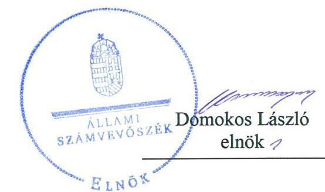
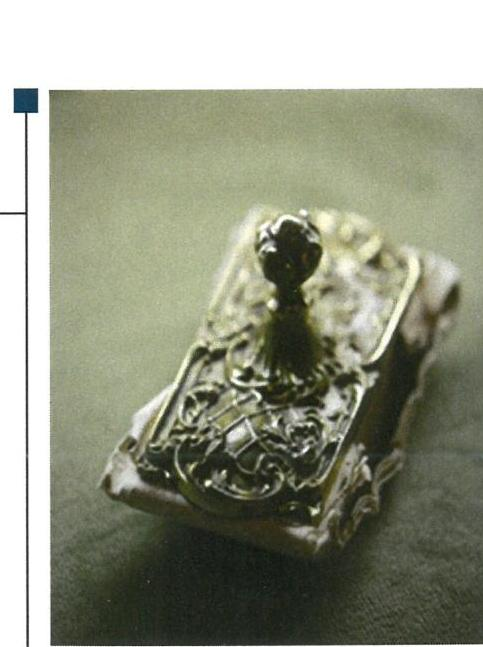
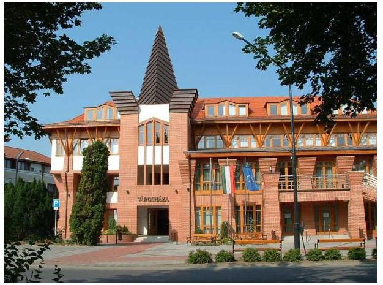

# Jelentés 

## Nemzeti tulajdonú gazdasági társaságok ellenőrzése

BONYCOM Bonyhádi Közüzemi Nonprofit Korlátolt Felelősségű Társaság
2019.

---

# Jelentés 

## Nemzeti tulajdonú gazdasági társaságok ellenőrzése

BONYCOM Bonyhádi Közüzemi Nonprofit Korlátolt Felelősségű Társaság
2019.  hó 15. nap

---

# AZ ELLENŐRZÉST FELÜGYELTE:

DR. HORVÁTH MARGIT felügyeleti vezető

## AZ ELLENŐRZÉST VEZETTE ÉS A VÉGREHAJTÁSÁÉRT FELELŐS:

- SIPOSNÉ DÓCZI KLÁRA ellenőrzésvezető
- A PROGRAM ÖSSZEÁLLÍTÁSÁÉRT FELELŐS:
  - TÓTPÁL SZABOLCS osztályvezető

IKTATÓSZÁM: EL-0855-092/2019.

TÉMASZÁM: 2478

ELLENŐRZÉS-AZONOSÍTÓ SZÁM: V082204

Jelentéseink az Országgyűlés számítógépes hálózatán és az Interneten a www.asz.hu címen is olvashatóak.

---

# TARTALOMJEGYZÉK 

■ ÖSSZEGZÉS ..... 5
■ AZ ELLENŐRZÉS CÉLJA ..... 6
■ AZ ELLENŐRZÉS TERÜLETE ..... 7
■ AZ ELLENŐRZÉS HÁTTERE, INDOKOLTSÁGA ..... 8
■ A JELENTÉS LÉNYEGES KÉRDÉSKÖREI ..... 9
■ AZ ELLENŐRZÉS HATÓKÖRE ÉS MÓDSZEREI ..... 10
■ MEGÁLLAPÍTÁSOK ..... 12
■ JAVASLATOK ..... 14
■ MELLÉKLETEK ..... 15
I. sz. melléklet: Értelmező szótár ..... 15
■ FÜGGELÉKEK ..... 17
I. sz. függelék a jelentéshez ..... 17
II. sz. függelék: Észrevételek ..... 18
■ RÖVIDÍTÉSEK JEGYZÉKE ..... 19

---

.

---

# ÖSSZEGZÉS 

Bonyhád Város Önkormányzata a Társaság feletti tulajdonosi jogait nem szabályszerűen gyakorolta, mivel nem biztosította a Társaság számviteli törvény szerinti beszámolóinak előírások szerinti jóváhagyását. A BONYCOM Bonyhádi Közüzemi Nonprofit Korlátolt Felelősségű Társaság vagyongazdálkodása szabályszerű volt, mellyel biztosította a nemzeti vagyon védelmét, megőrzését.

## Az ellenőrzés társadalmi indokoltsága

Az Állami Számvevőszék kiemelt célja, hogy ellenőrzéseivel hozzájáruljon ahhoz, hogy a közpénzeket, illetve az ingyenesen juttatott közvagyont az államháztartáson kívül működő szervezetek is átlátható, rendezett módon használják fel.

Az állam és a helyi önkormányzatok tulajdona nemzeti vagyon, melynek megőrzése érdekében kiemelten fontos a nemzeti tulajdonú gazdasági társaságok ellenőrzése. Ellenőrzésüket további társadalmi elvárás is indokolja, részben a gazdálkodásuk körébe tartozó vagyon nagysága, részben az általuk ellátott közszolgáltatások, sajátos feladatellátások, mivel tevékenységükön keresztül a lakosság széles köre kerül kapcsolatba a társaságokkal.

Az Állami Számvevőszék céljaival és a társadalmi igénnyel összhangban, a gazdasági társaságok kiemelt fontosságú szerepe miatt került sor a BONYCOM Bonyhádi Közüzemi Nonprofit Korlátolt Felelősségű Társaság vagyongazdálkodásának, illetve Bonyhád Város Önkormányzata tulajdonosi joggyakorlásának ellenőrzésére.

## Főbb megállapítások, következtetések, javaslatok

Bonyhád Város Önkormányzatának a Társaság feletti tulajdonosi joggyakorlása nem volt szabályszerű, mert a Társaság az ellenőrzött időszakban nem rendelkezett az Alapítói okirat előírásai szerint jóváhagyott számviteli törvény szerinti beszámolóval.

A BONYCOM Bonyhádi Közüzemi Nonprofit Korlátolt Felelősségű Társaság az eszközöket és a forrásokat szabályszerű leltározással vette számba, a számviteli beszámolók mérlegtételeit a számviteli törvény és a Leltározási és leltárkészítési szabályzatnak megfelelő leltárakkal támasztotta alá. A Társaság a vagyonához kapcsolódó nyilvántartásait a jogszabályi és a saját szabályzataiban meghatározott előírások szerint vezette, a nemzeti vagyon üzemeltetése során a vonatkozó előírásokat betartotta.

Az Állami Számvevőszék a jelentésbe foglalt megállapítások alapján Bonyhád Város Önkormányzata polgármesterének kettő javaslatot, a BONYCOM Bonyhádi Közüzemi Nonprofit Korlátolt Felelősségű Társaság ügyvezetőjének egy javaslatot fogalmazott meg. A javaslatokat megalapozó megállapításokra az érintetteknek 30 napon belül intézkedési tervet kell készíteniük.

---

# AZ ELLENŐRZÉS CÉLJA 

AZ ELLENŐRZÉS CÉLJA annak megállapítása volt, hogy a tulajdonosi joggyakorló a gazdasági társaságai feletti tulajdonosi joggyakorlás kereteit kialakította-e, tulajdonosi jogait megfelelően gyakorolta-e és kötelezettségeit teljesítette-e. Az ellenőrzés célja volt továbbá annak megállapítása, hogy a gazdasági társaság biztosította-e a vagyon védelmét a nyilvántartások szabályszerű vezetése és a mérleg tételeinek leltárral történő alátámasztása útján, valamint szabályszerűen gondoskodott-e a társaság használatában, kezelésében lévő nemzeti vagyon értékének megőrzéséről, gyarapításáról, hasznosításáról.

---

# **AZ ELLENŐRZÉS TERÜLETE**

## **BONYCOM Bonyhádi Közüzemi Nonprofit Korlátolt Felelősségű Társaság és a tulajdonosi jogokat gyakorló Bonyhád Város Önkormányzata**

A BONYCOM Bonyhádi Közüzemi Nonprofit Korlátolt Felelősségű Társaság 100 %-os tulajdonosa 2007.02.27-től Bonyhád Város Önkormányzata volt. Az ellenőrzött időszakban a Társaság¹ jegyzett tőkéje 226 M Ft volt.

Az Önkormányzat² a Társaságot a települési hulladék gyűjtésével, építési és karbantartási feladatok ellátásával, a városi tanuszoda üzemeltetésével, valamint városüzemeltetési feladatok ellátásával bízta meg. A városüzemeltetési feladatokon belül az Önkormányzat a Társasággal kötött Vállalkozási szerződés₁₋₅³-tel biztosította a Mötv.⁴ 13. § (1) bekezdésében meghatározott önkormányzati feladatok ellátását: a bonyhádi temetők fenntartási munkáit, a közhasználatú zöldterületek fenntartását, Bonyhád belterületi közterületeinek tisztán tartását, a csapadékvíz-elvezetésével kapcsolatos feladatokat, valamint az önkormányzat tulajdonában álló ingatlanokhoz kapcsolódó ingatlankezelési feladatok ellátásának feltételeit. A Társaság a Bonyhád Fürdő Korlátolt Felelősségű Társasággal kötött Megállapodás⁵ alapján üzemeltette a bonyhádi Termálfürdőt. A Társaság hulladékgazdálkodási közszolgáltatási tevékenysége 2017. április 30. napjával szűnt meg.

A Társaság az ellenőrzött időszakban a Völgység Ipari Park Nonprofit Korlátolt Felelősségű Társaságban 19%-os (könyv szerinti értéken 19 M Ft), a Bonyhádi Fürdő Korlátolt Felelősségű Társaságban 23%-os (könyv szerinti értéken 100 M Ft) üzletrésszel rendelkezett. A Társaság az ellenőrzött időszakban nem tartozott a kormányzati szektorba sorolt egyéb szervezetek közé, és nem rendelkezett vagyonkezelt vagyonnal.

A Társaság ügyvezetőjének a személye 2015. január 1-től nem változott. A Társaság háromtagú felügyelőbizottsággal és könyvvizsgálóval rendelkezett, kiknek személyében az ellenőrzött időszakban nem volt változás. A Társaságnál az átlagos statisztikai létszám 2015-ben és 2016-ban 52 fő, 2017-ben 42 fő volt. A Társaság a Számv. tv.⁶ szerint könyvvizsgálatra kötelezett volt.

A Társaság főbb pénzügyi adatait az 1. táblázat szemlélteti.

A Társaság bevételei⁷ az ellenőrzött időszakban 56%-kal csökkentek, melynek meghatározó oka a hulladékgazdálkodási közszolgáltatási tevékenység megszüntetése volt. A veszteséges gazdálkodás hatására a saját tőke 10%-kal csökkent az ellenőrzött időszakban.

A Polgármester⁸ 2014-óta töltötte be tisztségét, a Jegyző⁹ 2015-től vezette a Bonyhádi Közös Önkormányzati Hivatalt.

1. táblázat

|  A TÁRSASÁG FŐBB PÉNZÜGYI ADATAI (M FT) |  |  |   |
| --- | --- | --- | --- |
|   | 2015. | 2016. | 2017.  |
|  bevételek | 392 | 311 | 174  |
|  adózott eredmény | -4 | -12 | -43  |
|  saját tőke | 548 | 536 | 493  |
|  összes forrás | 634 | 611 | 684  |

*Forrás: A Társaság 2015-2017 évi éves beszámolói*

---

# AZ ELLENŐRZÉS HÁTTERE, INDOKOLTSÁGA 

Az Alaptörvény 38. cikke alapján az állam és a helyi önkormányzatok tulajdona nemzeti vagyon. A nemzeti vagyon megőrzése, megóvása érdekében kiemelten fontos ezen nemzeti tulajdonú gazdasági társaságok ellenőrzése. Gazdálkodásuk jellemzően a közérdeklődés és a médiafigyelmének középpontjában áll, amihez hozzájárul a gazdálkodásuk körébe tartozó - a nemzeti vagyon részét képező - vagyon nagysága, illetve az általuk ellátott közszolgáltatások minősége és hatékonysága.

Ellenőrzéseink feltárhatják, hogy a tulajdonosi felügyelet hozzájárult-e a szabályszerű gazdálkodáshoz és feladatellátáshoz.

Az ellenőrzés eredményeként meghatározhatóvá válnak a szervezet vagyongazdálkodást érintő kockázatai, ezzel lehetővé téve a kockázatok csökkentését.

A megállapítások alapján megfogalmazott számvevőszéki javaslatok hasznosítása elősegítheti a meglévő hibák megszüntetését. A jó gyakorlatok bemutatásával az ÁSZ hozzájárulhat a követendő megoldások megismertetéséhez, terjesztéséhez.

---

# A JELENTÉS LÉNYEGES KÉRDÉSKÖREI 

1. A tulajdonosi jogok gyakorlása szabályszerű volt-e?
2. A gazdasági társaság vagyongazdálkodási tevékenysége szabályszerű volt-e?

---

# AZ ELLENŐRZÉS HATÓKÖRE ÉS MÓDSZEREI 

## Az ellenőrzés típusa

Megfelelőségi ellenőrzés.

## Az ellenőrzött időszak

A tulajdonosi joggyakorlás tekintetében az ellenőrzött időszak 2017. január 1-től az ellenőrzés megkezdésének napjáig - 2018. október 15. - terjedt ki az éves beszámoló elfogadása kivételével, amelynél az ellenőrzött időszak 2015. január 1-től az ellenőrzés megkezdésének napjáig tartott.

A gazdasági társaság vagyongazdálkodása vonatkozásában az ellenőrzött időszak a 2015-2017 évek, a 2017. évi beszámoló jóváhagyása tekintetében a 2018. június elsejéig tartó időszak.

## Az ellenőrzés tárgya

Az önkormányzat tulajdonosi joggyakorlása, a 100%-os tulajdonában lévő gazdasági társaság feletti tulajdonosi joggyakorlás kialakítása és működtetése. A Társaság vagyongazdálkodása keretében a társaság használatában lévő nemzeti vagyon, illetve a saját vagyon tekintetébe a vagyonnyilvántartások vezetése, leltár.

## Az ellenőrzött szervezet

BONYCOM Bonyhádi Közüzemi Nonprofit Korlátolt Felelősségű Társaság és Bonyhád Város Önkormányzata

## Az ellenőrzés jogalapja

Az ellenőrzés jogalapját az ÁSZ tv ¹⁰ 1. § (3) bekezdése, 5. § (4) bekezdése képezi.

## Az ellenőrzés módszerei

Az ellenőrzést az ellenőrzési program ellenőrzési kérdései, az ellenőrzött időszakban hatályos jogszabályok, az ellenőrzés szakmai szabályok és módszertanok alapján, a nemzetközi standardok figyelembe vételével végeztük.

---

Az ellenőrzés ideje alatt az ellenőrzött szervezettel történő kapcsolattartást az ÁSZ Szervezeti és Működési Szabályzatának vonatkozó előírásai alapján biztosítottuk.

Az ellenőrzési kérdések megválaszolásához szükséges bizonyítékok megszerzése a következő ellenőrzési eljárások alkalmazásával történt: megfigyelés, információkérés, összehasonlítás, elemző eljárás. Az ellenőrzési bizonyítékként felhasználható adatforrások közé tartoztak az ellenőrzési programban felsorolt adatforrások, továbbá minden - az ellenőrzés folyamán - feltárt, az ellenőrzés szempontjából információkat tartalmazó dokumentum.

Az ellenőrzést a kérdésekre adott válaszok kiértékelésével, valamint a megjelölt adatforrások, a tanúsítványok felhasználásával, továbbá az adott időszakban hatályos jogszabályok figyelembe vételével folytattuk le.

A 2017. január 1-től az ellenőrzés megkezdésének napjáig ellenőriztük a tulajdonosi joggyakorlás kereteinek kialakítását, a tulajdonosi joggyakorló tevékenységét a felügyelőbizottság működéséhez kapcsolódóan, valamint azt, hogy a tulajdonosi joggyakorló - amennyiben a gazdasági társaság feladatellátásához kapcsolódóan határozott meg követelményeket, elvárásokat - a nemzeti vagyon értékének megőrzése érdekében monitorozta-e azok teljesülését. A 2015. január 1-től az ellenőrzés megkezdésének napjáig ellenőriztük a tulajdonosi joggyakorló részvételét az éves beszámoló elfogadására vonatkozó döntéshozatalban.

A gazdasági társaság vagyonhoz kapcsolódó nyilvántartásai vezetésének megfelelősége, valamint a nemzeti vagyon értéke megőrzésének, gyarapításának, hasznosításának szabályszerűsége 2015. és 2017. évek tekintetében került ellenőrzésre. A teljes ellenőrzött időszakot, 2015-2017 éveket érintően történt meg a lényeges dokumentumok és a mérleg tételeinek leltárral való alátámasztottságának az értékelése.

A vagyonnyilvántartások és a leltár szabályszerűsége esetében az ellenőrzés azokra a legnagyobb értékű tételekre - lényeges sokaságra - terjedt ki, melyek összértéke elérte a teljes sokaság összértékének 50%-át. A lényeges sokaságot tételesen ellenőriztük.

---

# 1. A tulajdonosi jogok gyakorlása szabályszerű volt-e? 

## Összegző megállapítás

A tulajdonosi jogok gyakorlása nem volt szabályszerű.

A TULAJDONOSI JOGGYAKORLÁS KERETEIT - a számviteli beszámoló elfogadása hatáskörének szabályozása kivételével az Önkormányzat Képviselő-testülete¹¹, mint a Társaság alapítója és annak legfőbb szerve az Mötv. és a Ptk.¹² vonatkozó előírásainak megfelelően a Társaság Alapító okirat₁₋₂¹³-ben határozta meg. Az Alapító¹⁴ a Ptk. 3:4. § (2) bekezdésében foglalt előírásoktól eltérően a számviteli beszámoló jóváhagyására nem az Alapító okiratban hatalmazta fel a Polgármestert. A Társaság feladat ellátásához kapcsolódó tulajdonosi követelmények a Megbízási szerződésben és a Vállalkozási szerződés₁₋₅-ben kerültek meghatározásra az Önkormányzati SZMSZ¹⁵ és a Vagyonrendelet¹⁶ előírásainak megfelelően. A Felügyelőbizottság¹⁷ az Alapító által elfogadott Ügyrend¹⁸-del rendelkezett.

Az Alapító a Taktv.¹⁹ 5.§ (3) bekezdésébe foglalt előírásoknak megfelelően Szabályzatban²⁰ rendelkezett a vezető tisztségviselők, a felügyelőbizottsági tagok, valamint az Mt.²¹ 208. § hatálya alá tartozó munkavállalók javadalmazásának, valamint jogviszonyuk megszűnése esetére biztosított juttatások módjának, mértékének elveiről, annak rendszeréről.

A TULAJDONOSI JOGOK GYAKORLÁSA nem volt szabályszerű. A Társaság Alapító okiratának 9. pontja szerint az ellenőrzött időszakban a Társaság számviteli törvény szerinti beszámolójának jóváhagyása az Alapító hatáskörébe tartozott. A Társaság ügyvezetője az
 ellenőrzött időszak egyik évében sem terjesztette be az Alapító részére a Társaság számviteli törvény szerinti beszámolóit jóváhagyásra, ezzel megsértette a Ptk. 3:21. § (2) bekezdés és a 3:112. § (2) bekezdés rendelkezéseit. Az ellenőrzött időszakban a Társaság nem rendelkezett az Alapító okirat szerint hatáskört gyakorló Alapító által jóváhagyott számviteli törvény szerinti beszámolóval.

A Társaság az ellenőrzött időszakban nem az Alapító okirat 9. pontjában meghatározott Alapító, mint jóváhagyásra jogosult testület által elfogadott számviteli törvény szerinti beszámolókat helyezte letétbe és tette közzé. Ezzel a Társaság megsértette a Számv. tv. 153. § (1) bekezdése, valamint a 154. § (1) bekezdése előírásait.

Az Alapító nem élt az Áht. ${ }^{22}$ 70. § (1) d pontban számára biztosított lehetőséggel, az ellenőrzött időszakban a Társaságnál ellenőrzést nem végzett.

---

# 2. A gazdasági társaság vagyongazdálkodási tevékenysége szabályszerű volt-e? 

## Összegző megállapítás

A Társaság vagyongazdálkodása szabályszerű volt.
A Társaság rendelkezett a Számv. tv. előírásainak megfelelő Leltározási szabályzattal ${ }_{1-2}{ }^{23}$. A szabályzat tartalmazta a leltározásra és leltárkészítésre vonatkozó általános szabályokat, számviteli előírásokat.

A Társaság a Számv. tv. előírásainak megfelelően az ellenőrzött időszak minden évében a Leltárkészítési és leltározási szabályzata ${ }_{1-2}$ szerinti leltározást követően elkészített leltárakkal támasztotta alá az éves beszámolójának mérlegtételeit, és biztosította az üzleti év mérleg-fordulónapjára vonatkozóan a főkönyvi könyvelés és az analitikus nyilvántartások adatai közötti egyeztetést. A 2015-2017. évi számviteli beszámolókat alátámasztó leltárak a Számv. tv. szabályozása szerint tételesen és ellenőrizhető módon tartalmazták a Társaságnak a mérleg fordulónapján fennálló eszközeit és forrásait mennyiségben és értékben.

A Társaság a vagyonhoz kapcsolódó nyilvántartásait a Számv. tv. vonatkozó előírásai és a Társaság Értékelési szabályzata ${ }^{24}$ szerint vezette.

A Társaság a nemzeti vagyon üzemeltetése során betartotta a Vállalkozási szerződés ${ }_{1-5}$-ben meghatározott követelményeket, a Vagyonrendelet szabályait, valamint a feladat ellátására vonatkozó önkormányzati Rendeletek ${ }_{1-5}{ }^{25}$ előírásait.

---

# JAVASLATOK 

Az ÁSZ tv. 33. § (1) bekezdésében foglaltak értelmében az ellenőrzött szervezet vezetője köteles a jelentésben foglalt megállapításokhoz kapcsolódó intézkedési tervet összeállítani és azt a jelentés kézhezvételétől számított 30 napon belül az ÁSZ részére megküldeni. Amennyiben az ellenőrzött szervezet vezetője nem küldi meg határidőben az intézkedési tervet, vagy továbbra sem elfogadható intézkedési tervet küld, az Állami Számvevőszék elnöke az ÁSZ tv. 33. § (3) bekezdése a) és b) pontjaiban foglaltakat érvényesítheti.
Javaslatunk célja a BONYCOM Bonyhádi Közüzemi Nonprofit Korlátolt Felelősségű Társaság gazdálkodása szabályszerűségének és gyakorlatának javítása annak érdekében, hogy a szabályozási környezet és az alkalmazott gyakorlat megfelelően tudja támogatni az átlátható működést.

## A BONYCOM Bonyhádi Közüzemi Nonprofit Korlátolt Felelősségű Társaság ügyvezetőjének

1. Intézkedjen, hogy a Társaság számviteli törvény szerinti beszámolóinak jóváhagyása a Ptk. és az Alapító okirat, továbbá azok nyilvánosságra hozatala és letétbe helyezése a Számv. tv. előírásainak megfelelően történjen.
(1. sz. megállapítás 3. és 4. bekezdései alapján)

Javaslataink célja a tulajdonosi joggyakorló Bonyhád Város Önkormányzata szabályszerű működésének elősegítése, továbbá a tulajdonosi joggyakorlás kontrolljainak erősítése.

## Bonyhád Város Önkormányzata polgármesterének

1. Kezdeményezze, hogy a Társaság számviteli beszámolóinak jóváhagyásával kapcsolatos tulajdonosi joggyakorlói hatáskört a Ptk.-ban előírtaknak megfelelően az Alapító okiratban határozzák meg.
(1. sz. megállapítás 1. bekezdés 2. mondata alapján)
2. Kezdeményezze, hogy a Társaság számviteli törvény szerinti beszámolóinak jóváhagyása a Ptk. és az Alapító okirat előírásainak megfelelően történjen.
(1. sz. megállapítás 3. bekezdése alapján)

---

# MELLÉKLETEK 

- I. SZ. MELLÉKLET: ÉRTELMEZŐ SZÓTÁR
gazdasági társaság
közfeladat
nemzeti vagyon
tulajdonosi jogok gyakorlója
nemzeti vagyon hasznosítása
nemzeti vagyon használója

A gazdasági társaságok üzletszerű közös gazdasági tevékenység folytatására, a tagok vagyoni hozzájárulásával létrehozott, jogi személyiséggel rendelkező vállalkozások, amelyekben a tagok a nyereségből közösen részesednek, és a veszteséget közösen viselik. Forrás: Ptk. 3:88. § (1) bekezdése Az Áht. 3/A. § (1) bekezdése alapján közfeladat a jogszabályban meghatározott állami vagy önkormányzati feladat.
Nvtv. ${ }^{26}$ 1. § (2) bekezdése szerint nemzeti vagyonba tartozik többek között: „az állam vagy a helyi önkormányzat kizárólagos tulajdonában álló dolgok, az a) pont hatálya alá nem tartozó, állam vagy a helyi önkormányzat tulajdonában lévő dolog,
az állam vagy a helyi önkormányzat tulajdonában lévő pénzügyi eszközök, továbbá az államot vagy a helyi önkormányzatot megillető társasági részesedések,
az államot vagy a helyi önkormányzatot megillető bármely vagyoni értékkel rendelkező jogosultság, amelyet jogszabály vagyoni értékű jogként nevesít." Aki a nemzeti vagyon felett az államot vagy a helyi önkormányzatot megillető tulajdonosi jogok és kötelezettségek összességének gyakorlására jogosult. Forrás: Nvtv. 3. § (1) 17. pontja
A tulajdonosi joggyakorló vagy a nemzeti vagyon használója által a nemzeti vagyon birtoklásának, használatának, hasznok szedése jogának bármely - a tulajdonjog átruházását nem eredményező - jogcímen történő átengedése, ide nem értve a vagyonkezelésbe adást, valamint a haszonélvezeti jog alapítását. Forrás: Nvtv. 3. § (1) bekezdés 4. pont
Azon természetes személy, jogi személy vagy jogi személyiséggel nem rendelkező szervezet, aki vagy amely állami vagyon tekintetében törvény vagy szerződés alapján, a helyi önkormányzat vagyona tekintetében törvény, a helyi önkormányzat rendelete vagy szerződés alapján bármely jogcímen nemzeti vagyont birtokol, használ, szedi annak hasznait, kivéve a tulajdonosi joggyakorló. Forrás: Nvtv. 3. § (1) bekezdés 11. pont

---

.

---

# FÜGGELÉKEK 

- I. SZ. FÜGGELÉK A JELENTÉSHEZ

Az Állami Számvevőszék az ellenőrzések során feltárt tényekhez, megállapításokhoz kapcsolódó további körülmények tisztázására eszközrendszerrel nem rendelkezik. Amennyiben az ellenőrzésen túlmutatóan indokoltnak látszik az ellenőrzés során feltárt körülmények további vizsgálata, az Állami Számvevőszék törvényi felhatalmazás alapján megállapításait továbbítja a hatáskörrel rendelkező szervnek a szükséges intézkedések megtétele, eljárások lefolytatása érdekében.
I. A Társaság 2015., 2016., és 2017. évre vonatkozóan olyan éves beszámolót helyezett letétbe és tett közzé, amely nem az Alapító okirat 9. pontjában meghatározott Alapító, mint jóváhagyásra jogosult testület által elfogadott számviteli törvény szerinti beszámoló volt. A Társaság ezzel megsértette a Számv. tv. 153. § (1) bekezdése, valamint a 154. § (1) bekezdése előírásait.
Az eset konkrét körülményeinek kivizsgálására a Cégbíróság rendelkezik hatáskörrel.

---

A jelentéstervezetet a Számvevőszék 15 napos észrevételezésre megküldte az ellenőrzött szervezetek vezetőinek az ÁSZ tv. 29. § (1) bekezdése előírása szerint.

A BONYCOM Bonyhádi Közüzemi Nonprofit Korlátolt Felelősségű Társaság ügyvezetője és Bonyhád Város Önkormányzata polgármestere a jelentéstervezet megállapításaira nem tett észrevételt.

[^0]
[^0]:    * 29. § (1) Az Állami Számvevőszék az ellenőrzési megállapításait megküldi az ellenőrzött szervezet vezetőjének vagy az általa megbízott személynek, és annak, akinek személyes felelősségét állapította meg.
    (2) Az ellenőrzött szervezet vezetője és a felelősként megjelölt személy az ellenőrzés megállapításaira tizenöt napon belül írásban észrevételt tehet.
    (3) Az Állami Számvevőszék az észrevételre a beérkezésétől számított harminc napon belül írásban válaszol. A figyelembe nem vett észrevételeket köteles a jelentésben feltüntetni, és megindokolni, hogy azokat miért nem fogadta el.

---

# RÖVIDÍTÉSEK JEGYZÉKE 

${ }^{1}$ Társaság
${ }^{2}$ Önkormányzat
${ }^{3}$ Vállalkozási szerződés ${ }_{1-5}$
${ }^{4}$ Mötv.
${ }^{5}$ Megállapodás
${ }^{6}$ Számv. tv./számviteli törvény
${ }^{7}$ bevételek
${ }^{8}$ Polgármester
${ }^{9}$ Jegyző
${ }^{10}$ ÁSZ tv.
${ }^{11}$ Képviselő-testület
${ }^{12}$ Ptk.
${ }^{13}$ Alapító okirat
${ }^{14}$ Alapító
${ }^{15}$ Önkormányzati SZMSZ
${ }^{16}$ Vagyonrendelet
${ }^{17}$ Felügyelőbizottság

BONYCOM Bonyhádi Közüzemi Nonprofit Korlátolt Felelősségű Társaság Bonyhád Város Önkormányzata
1: A Társaság és az Önkormányzat között létrejött Vállalkozási szerződés és módosításai temető-fenntartási feladatok ellátására (szerződés kelte: 2011. január 1.)
2: A Társaság és az Önkormányzat között létrejött Vállalkozási szerződés és módosításai zöldterület fenntartási feladatok ellátására (szerződés kelte: 2011. január 1.)
3: A Társaság és az Önkormányzat között létrejött Vállalkozási szerződés és módosításai közterület-tisztítási feladatok ellátására (szerződés kelte: 2011. január 1.)
4: A Társaság és az Önkormányzat között létrejött Vállalkozási szerződés és módosításai csapadékvíz elvezetéssel kapcsolatos feladatok ellátására (szerződés kelte: 2011. január 1.)
5: A Társaság és az Önkormányzat között létrejött Vállalkozási szerződés és módosításai ingatlankezelési feladatok ellátására (szerződés kelte: 2011. január 1.)
2011. évi CLXXXIX. törvény Magyarország helyi önkormányzatairól (hatályos: 2012. január 1-től)

A Társaság és a Bonyhád Fürdő Korlátolt Felelősségű Társaság között létrejött 2013/21. számú Megállapodás a Bonyhád Termálfürdő üzemeltetési feladatainak ellátásáról (szerződés kelte: 2013. december 30.)
2000. évi törvény a számvitelről (hatályos 2001. január 1-től)

A BONYCOM Bonyhádi Közüzemi Nonprofit Korlátolt Felelősségű Társaság éves beszámolóiban szereplő eredménykategóriák (értékesítés nettó árbevétele, egyéb bevételek, pénzügyi műveletek bevételei) összegezve
Bonyhád Város Önkormányzata polgármestere
Bonyhád Város Önkormányzata jegyzője
2011. évi LXVI. törvény az Állami Számvevőszékről (hatályos: 2011. július 1-től)

Bonyhád Város Önkormányzata Képviselő-testülete
2013. évi V. törvény a Polgári Törvénykönyvről szóló (hatályos 2014. március 15-től)
1: BONYCOM Bonyhádi Közüzemi Nonprofit Korlátolt Felelősségű Társaság Alapító okirata (hatályos: 2015. január 1-2018. június 29.)
2: BONYCOM Bonyhádi Közüzemi Nonprofit Korlátolt Felelősségű Társaság Alapító okirata (hatályos: 2018. június 30-tól)
Bonyhád Város Önkormányzata Képviselő-testülete
Bonyhád Város Önkormányzata Képviselő-testületének 5/2015 (III. 27.) önkormányzati rendelete a Szervezeti és Működési Szabályzatról
Bonyhád Város Önkormányzata Képviselő-testületének 14/2015 (VI.24.) önkormányzati rendelete az önkormányzat vagyonáról és vagyongazdálkodási szabályairól
BONYCOM Bonyhádi Közüzemi Nonprofit Korlátolt Felelősségű Társaság felügyelőbizottsága

---

${ }^{18}$ Ügyrend
${ }^{19}$ Taktv.
${ }^{20}$ Szabályzat
${ }^{21}$ Mt.
${ }^{22}$ Áht.
${ }^{23}$ Leltározási szabályzat ${ }_{1-2}$
${ }^{24}$ Értékelési szabályzat
${ }^{25}$ Rendeletek ${ }_{1-5}$

BONYCOM Bonyhádi Közüzemi Nonprofit Korlátolt Felelősségű Társaság Felügyelőbizottságának ügyrendje, melyet Bonyhád Város Önkormányzata Képviselő-testülete 1/2015. (V. 11.) számú Képviselő-testületi határozatával hagyott jóvá
2009. évi CXXII. törvény a köztulajdonban álló gazdasági társaságok takarékosabb működéséről (hatályos: 2009. december 4-től)
BONYCOM Bonyhádi Közüzemi Nonprofit Korlátolt Felelősségű Társaság Javadalmazási szabályzata (hatályos 2016. január 1-től)
2012. évi I. törvény a munka törvénykönyvéről (hatályos: 2012. július 1-jétől)
2011. évi CXCV. törvény az államháztartásról (hatályos: 2011. december 31-től)

1: BONYCOM Bonyhádi Közüzemi Nonprofit Korlátolt Felelősségű Társaság Eszközök és források leltározási szabályzata (hatályos: 2015.01.01-től)
2: BONYCOM Bonyhádi Közüzemi Nonprofit Korlátolt Felelősségű Társaság Eszközök és források leltározási szabályzata (hatályos: 2016.01.01-től)
BONYCOM Bonyhádi Közüzemi Nonprofit Korlátolt Felelősségű Társaság Eszközök és források értékelési szabályzata (hatályos: 2015.01.01-től)
1: Bonyhád Város Önkormányzatának 11/2013. (IV. 27.) sz. rendelete a települési szilárd hulladékkal kapcsolatos helyi közszolgáltatásról
2: Bonyhád Város Önkormányzatának 7/2016. (IV. 22.) sz. rendelete az önkormányzati lakások, helyiségek bérletéről és elidegenítéséről, a lakások bérleti díjáról, valamint a lakbértámogatás szabályairól
3: Bonyhád Város Önkormányzatának 13/2000. (IX. 1.) sz. rendelete a temetőkről
4: Bonyhád Város Önkormányzatának 11/2016. (VIII. 19.) sz. rendelete a temetőkről és a temetkezés rendjéről
5: Bonyhád Város Önkormányzatának 11/2008. (IV. 11.) sz. rendelete a helyi környezet védelméről, a település tisztaságáról
2011. évi CXCVI. törvény a nemzeti vagyonról (hatályos 2011. december 31-től)

---

ÁLLAMI SZÁMVEVŐSZÉK
1052 Budapest, Apáczai Csere János utca 10.
Levélcím: 1364 Budapest 4. Pf. 54
Telefon: +36 14849100 Telefax: +36 14849200
www.asz.hu
