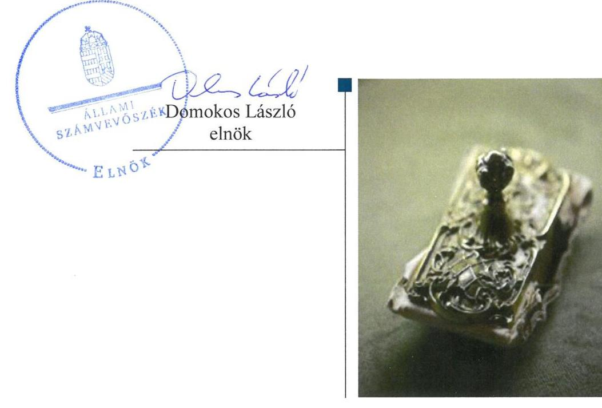
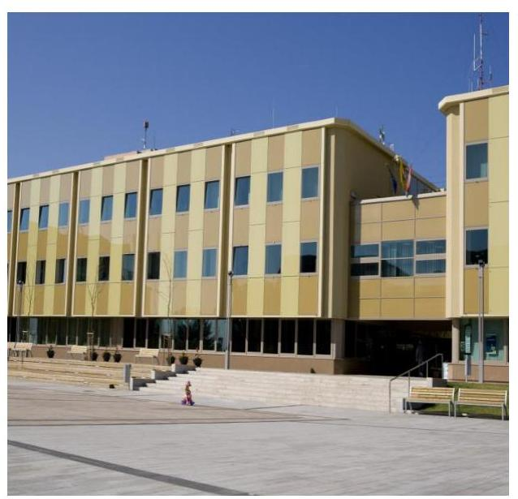
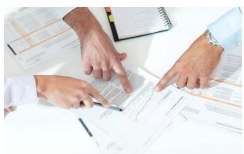
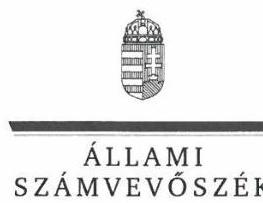
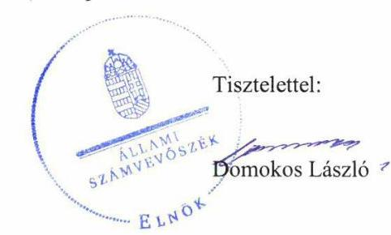
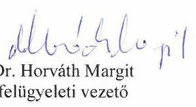

# Jelentés 

## Nemzeti tulajdonú gazdasági társaságok ellenőrzése

„SZÁKOM" Százhalombattai Kommunális Szolgáltató Nonprofit Korlátolt Felelősségű Társaság
2019.

---

# Jelentés 

## Nemzeti tulajdonú gazdasági társaságok ellenőrzése

„SZÁKOM" Százhalombattai Kommunális Szolgáltató Nonprofit Korlátolt Felelősségű Társaság
2019. 07. hó 15. nap

---

# AZ ELLENŐRZÉST FELÜGYELTE:

DR. HORVÁTH MARGIT felügyeleti vezető

## AZ ELLENŐRZÉST VEZETTE ÉS A VÉGREHAJTÁSÁÉRT FELELŐS:

SALI SÁNDORNÉ ellenőrzésvezető

A PROGRAM ÖSSZEÁLLÍTÁSÁÉRT FELELŐS:

TÓTPÁL SZABOLCS osztályvezető

IKTATÓSZÁM: EL-0886-081/2019.

TÉMASZÁM: 2478

ELLENŐRZÉS-AZONOSÍTÓ SZÁM: V082230

Jelentéseink az Országgyűlés számítógépes hálózatán és az Interneten a www.asz.hu címen is olvashatóak.

---

# TARTALOMJEGYZÉK 

■ ÖSSZEGZÉS ..... 5
■ AZ ELLENŐRZÉS CÉLJA ..... 6
■ AZ ELLENŐRZÉS TERÜLETE ..... 7
■ AZ ELLENŐRZÉS HÁTTERE, INDOKOLTSÁGA ..... 8
■ A JELENTÉS LÉNYEGES KÉRDÉSKÖREI ..... 9
■ AZ ELLENŐRZÉS HATÓKÖRE ÉS MÓDSZEREI ..... 10
■ MEGÁLLAPÍTÁSOK ..... 12
■ JAVASLATOK ..... 14
■ MELLÉKLETEK ..... 15
I. sz. melléklet: Értelmező szótár ..... 15
■ FÜGGELÉKEK ..... 17
I. sz. függelék a jelentéshez ..... 17
II. sz. függelék: Észrevételek ..... 18
■ RÖVIDÍTÉSEK JEGYZÉKE ..... 29

---

.

---

# ÖSSZEGZÉS 

A „SZÁKOM" Százhalombattai Kommunális Szolgáltató Nonprofit Korlátolt Felelősségű Társaság vagyongazdálkodása nem volt szabályszerű az éves beszámolók mérlegtételeinek leltárral való alátámasztása hiányában. A Társaságnál az elszámoltathatóság, a nemzeti vagyon védelme nem volt biztosított, a valódiság elve nem érvényesült.

## Az ellenőrzés társadalmi indokoltsága

Az Állami Számvevőszék stratégiájában megfogalmazta, hogy az államháztartáson kívül működő feladatellátó rendszerek ellenőrzéseivel hozzájárul ahhoz, hogy a közpénzeket, illetve az ingyenesen juttatott közvagyont az államháztartáson kívül működő szervezetek is átlátható, rendezett módon használják fel.

Az állam és a helyi önkormányzatok tulajdona nemzeti vagyon. A nemzeti vagyon megőrzése, megóvása érdekében kiemelten fontos a nemzeti tulajdonú gazdasági társaságok ellenőrzése.

A nemzeti tulajdonú gazdasági társaságok gazdálkodása jellemzően a közérdeklődés és a média figyelmének középpontjában áll, amihez hozzájárul a gazdálkodásuk körébe tartozó vagyon nagysága illetve az általuk ellátott közszolgáltatások minősége és hatékonysága is.

Az Állami Számvevőszék céljaival és a társadalmi igénnyel összhangban került sor a Százhalombatta Város Önkormányzatának kizárólagos tulajdonában álló „SZÁKOM" Százhalombattai Kommunális Szolgáltató Nonprofit Korlátolt Felelősségű Társaság vagyongazdálkodásának, illetve az Önkormányzat tulajdonosi joggyakorlásának ellenőrzésére.

## Főbb megállapítások, következtetések, javaslatok

A „SZÁKOM" Százhalombattai Kommunális Szolgáltató Nonprofit Korlátolt Felelősségű Társaság felett tulajdonosi jogokat gyakorló Százhalombatta Város Önkormányzatának tulajdonosi joggyakorlása szabályszerű volt. A tulajdonosi joggyakorló az előírással összhangban megalkotta a Társaság javadalmazási szabályzatát. Az Önkormányzat az FB és a könyvvizsgáló írásbeli jelentéseinek birtokában döntött a Társaság éves beszámolóinak elfogadásáról.

A Társaság vagyongazdálkodása nem volt szabályszerű. Az éves beszámolók mérlegtételeit a Társaság a számviteli törvény és a leltárkészítési és leltározási szabályzat előírásai ellenére leltárral nem támasztotta alá. A Társaság a tárgyi eszközök üzembe helyezését bizonylattal alátámasztotta, az eszközök besorolása, bekerülési értékének meghatározása, az értékcsökkenés elszámolása szabályszerű volt. A Társaság a vagyonhoz kapcsolódó nyilvántartásait a jogszabályi, illetve a belső szabályozás előírásai, valamint a Vagyonkezelési szerződésben foglaltak szerint vezette.

Az Állami Számvevőszék a jelentésben foglalt megállapítások alapján a „SZÁKOM" Százhalombattai Kommunális Szolgáltató Nonprofit Korlátolt Felelősségű Társaság ügyvezetőjének egy javaslatot fogalmazott meg. A javaslatokat megalapozó megállapításokra az érintettnek 30 napon belül intézkedési tervet kell készítenie.

---

# AZ ELLENŐRZÉS CÉLJA 

AZ ELLENŐRZÉS CÉLJA annak megállapítása volt, hogy a tulajdonosi joggyakorló a gazdasági társasága feletti tulajdonosi joggyakorlás kereteit kialakította-e, tulajdonosi jogait megfelelően gyakorolta-e és kötelezettségeit teljesítette-e. Az ellenőrzés célja továbbá annak megállapítása volt, hogy a gazdasági társaság biztosította-e a vagyon védelmét a nyilvántartások szabályszerű vezetése, és a mérleg tételeinek leltárral történő alátámasztása útján.

---

# AZ ELLENŐRZÉS TERÜLETE 

## A „SZÁKOM" Százhalombattai Kommunális Szolgáltató Nonprofit Korlátolt Felelősségű Társaság és a tulajdonosi jogokat gyakorló Százhalombatta Város Önkormányzata

A „SZÁKOM" Százhalombattai Kommunális Szolgáltató Nonprofit Korlátolt Felelősségű Társaság 1999-ben alakult BATTAINVEST Korlátolt Felelősségű Társaság néven. Alapítója Százhalombatta Város Önkormányzata volt, mely a Társaság ¹ 100\%-os tulajdonosa. A Társaság feletti tulajdonosi jogokat a Képviselő-testület² gyakorolta.

A Társaság közfeladatot, illetve közszolgáltatást látott el. Tevékenységi körébe létesítmények, csapadékvíz- és belvíz elvezető rendszer, locsolóvíz hálózat üzemeltetése, köztemető fenntartása, távhőszolgáltatás, közterületek tisztántartása, ipari park működtetése, ingatlankezelés, továbbá 2017. szeptember 30-áig hulladékgazdálkodási feladatok tartoztak. A Társaság tevékenységére elsősorban ágazati jogszabályként a hulladékról szóló 2012. évi CLXXX. törvény, valamint a távhőszolgáltatásról szóló 2005. évi XVIII. törvény vonatkozott.

A Társaság az Önkormányzattal kötött Vagyonkezelési szerződés ³ keretében átadott, a távhőszolgáltatáshoz kapcsolódó vagyonkezelésbe vett eszközökkel, valamint saját eszközökkel látta el a tevékenységét. Az Önkormányzat a Vagyonkezelési szerződésen túl a vagyongazdálkodási rendeletben ⁴ szabályozta a tulajdonában álló vagyon kezelésének, hasznosításának korlátait és feltételeit.

A Társaság jegyzett tőkéje 2017. december 31-én 3460,4 M Ft, saját tőkéje 4003,0 M Ft, az átlagos állományi létszáma 89 fő volt.

A Társaság a Számv. tv.⁵ előírása alapján az ellenőrzött időszakban könyvvizsgálatra kötelezett volt, tulajdonosi részesedéssel más gazdasági társaságban nem rendelkezett, nem minősült kormányzati szektorba sorolt egyéb szervezetnek.

A Társaságnál az ügyvezető⁶, a polgármester⁷ és a jegyző⁸ személye az ellenőrzött időszakban nem változott. Az FB⁹ létszáma hat fő volt.

---

# AZ ELLENŐRZÉS HÁTTERE, INDOKOLTSÁGA 

AZ ÁLLAM ÉS A HELYI ÖNKORMÁNYZATOK TULAJDONA NEMZETI VAGYON, az Alaptörvény 38. cikke alapján. A nemzeti vagyon megőrzése, megóvása érdekében kiemelten fontos ezen nemzeti tulajdonú gazdasági társaságok ellenőrzése. Gazdálkodásuk jellemzően a közérdeklődés és a média figyelmének középpontjában áll, amihez hozzájárul a gazdálkodásuk körébe tartozó vagyon nagysága, illetve az általuk ellátott közfeladatok, közszolgáltatások minősége és hatékonysága is.

Ellenőrzéseink feltárhatják, hogy a tulajdonosi felügyelet hozzájárult-e a szabályszerű gazdálkodáshoz és feladatellátáshoz. Az ellenőrzés eredményeként meghatározhatóvá válnak a gazdasági társaság vagyongazdálkodást érintő kockázatai, ezzel lehetővé téve a kockázatok csökkentését. A megállapítások alapján megfogalmazott számvevőszéki javaslatok hasznosítása elősegítheti a meglévő hibák megszüntetését. A jó gyakorlatok bemutatásával az ÁSZ ³¹ hozzájárulhat a követendő megoldások megismertetéséhez, terjesztéséhez.

---

# A JELENTÉS LÉNYEGES KÉRDÉSKÖREI 

1. A tulajdonosi jogok gyakorlása szabályszerű volt-e?
2. A társaság vagyongazdálkodása megfelelt-e az előírásoknak?

---

# AZ ELLENŐRZÉS HATÓKÖRE ÉS MÓDSZEREI 

## Az ellenőrzés típusa

Megfelelőségi ellenőrzés.

## Az ellenőrzött időszak

A Társaság feletti tulajdonosi joggyakorlás vonatkozásában az ellenőrzött időszak 2017. január 1-jétől 2018. október 10-éig, az ellenőrzés megkezdésének napjáig terjedt ki az éves beszámolók elfogadása és a tulajdonosi ellenőrzése kivételével, amelyeknél az ellenőrzött időszak 2015. január 1-jétől az ellenőrzés megkezdésének napjáig - 2018. október 10-éig - tartott. A Társaság vagyongazdálkodása vonatkozásában az ellenőrzött időszak a 2015-2017. évek, a 2017. évi beszámoló jóváhagyása tekintetében a 2018. június 1-jéig tartó időszak volt.

## Az ellenőrzés tárgya

A „SZÁKOM" Százhalombattai Kommunális Szolgáltató Nonprofit Korlátolt Felelősségű Társaság feletti tulajdonosi joggyakorlás kialakítása és működtetése. A „SZÁKOM" Százhalombattai Kommunális Szolgáltató Nonprofit Korlátolt Felelősségű Társaság vagyongazdálkodása keretében a társaság használatában, kezelésében lévő nemzeti vagyon, illetve a saját vagyona tekintetében a vagyonnyilvántartások vezetése, leltára.

## Az ellenőrzött szervezet

A „SZÁKOM" Százhalombattai Kommunális Szolgáltató Nonprofit Korlátolt Felelősségű Társaság, valamint a Százhalombatta Város Önkormányzata, mint a Társaság feletti tulajdonosi joggyakorló.

## Az ellenőrzés jogalapja

Az ellenőrzés jogalapját az ÁSZ tv. ¹¹ 1. § (3) bekezdése és 5. § (3)-(5) bekezdése képezte.

---

# Az ellenőrzés módszerei 

Az ellenőrzést az ellenőrzési program ellenőrzési kérdései, az ellenőrzött időszakban hatályos jogszabályok, az ellenőrzés szakmai szabályok és módszertanok alapján, a nemzetközi standardok figyelembe vételével végeztük.

Az ellenőrzés ideje alatt az ellenőrzött szervezettel történő kapcsolattartást az ÁSZ Szervezeti és Működési Szabályzatának vonatkozó előírásai alapján biztosítottuk.
2017. január 1-jétől 2018. október 10-éig, az ellenőrzés megkezdésének napjáig tartó időszakra ellenőriztük a tulajdonosi joggyakorlás kereteinek kialakítását, a tulajdonosi joggyakorló tevékenységét a felügyelő bizottság és a független könyvvizsgáló működéséhez kapcsolódóan, valamint azt, hogy a tulajdonosi joggyakorló - amennyiben a gazdasági társaság feladatellátásához és vagyonkezeléséhez kapcsolódóan határozott meg követelményeket, elvárásokat - a nemzeti vagyon értékének megőrzése érdekében monitorozta-e azok teljesülését. A teljes ellenőrzött időszakra 2015. január 1-jétől 2018. október 10-éig - ellenőriztük a tulajdonosi joggyakorló részvételét az éves beszámoló elfogadására vonatkozó döntéshozatalban, valamint a vagyonkezelésbe vett nemzeti vagyonnal történő gazdálkodás tulajdonosi joggyakorló általi ellenőrzését.

A vagyongazdálkodás ellenőrzése keretében a gazdasági társaság vagyonhoz kapcsolódó nyilvántartásai vezetésének megfelelőségét, a mérleg tételeinek leltárral való alátámasztottságát, valamint a nemzeti vagyon értéke megőrzésének, gyarapításának, hasznosításának szabályszerűségét a 2015-2017. évek tekintetében ellenőriztük. Továbbá a 2015-2017. évekre, a 2017. évi beszámoló jóváhagyása tekintetében a 2018. június 1-jéig tartó időszakra történt meg a lényeges dokumentumok értékelése.

A vagyonnyilvántartások és a leltár szabályszerűsége esetében az ellenőrzés azokra a legnagyobb értékű tételekre - a lényeges sokaságra - terjedt ki, melyek összértéke eléri a teljes sokaság összértékének 50\%-át. A lényeges sokaságot tételesen ellenőriztük.

---

# 1. A tulajdonosi jogok gyakorlása szabályszerű volt-e? 

Összegző megállapítás

Az Önkormányzat Társaság feletti tulajdonosi joggyakorlása szabályszerű volt.

A TULAJDONOSI JOGGYAKORLÁS kereteit a tulajdonosi joggyakorló ¹² a vagyongazdálkodási rendeletben, az SZMSZ ¹³-ben és az Alapító okiratban ¹⁴ - az Mt. ¹⁵, az Nvtv. ¹⁶ és a Ptk. ¹⁷ előírásaival összhangban - alakította ki. Az Alapító okiratban a Ptk., valamint a Taktv. ¹⁸ előírásaival összhangban álló FB létrehozásáról, továbbá a Számv. tv. előírásai alapján könyvvizsgálatról rendelkezett. A tulajdonosi joggyakorló a Taktv.-ben foglaltakkal összhangban megalkotta a Társaság vezető tisztségviselői, FB tagjai, valamint az Mt. ¹⁹ hatálya alá eső munkavállalók javadalmazása, jogviszonyuk megszűnése esetére biztosított juttatások módjának, mértékének elveiről, annak rendszeréről szóló javadalmazási szabályzatot ²⁰.

A tulajdonosi joggyakorló a Társaság tevékenységének nyomon követését az éves beszámolók, - a tulajdonosi előírásokkal összhangban lévő üzleti tervek elfogadása, valamint az FB ellenőrzései útján biztosította. Továbbá élt az Áht. ²¹-ban foglalt lehetőséggel, a Társaságnál a 2017. évben a szabad pénzeszközök lekötésével, illetve a szabályozási környezettel kapcsolatban végzett belső ellenőrzést. A Társaság éves beszámolóinak elfogadásáról a tulajdonosi joggyakorló az FB és a könyvvizsgáló írásbeli jelentéseinek birtokában döntött.

A Társaság a 2015. évben nyereséges volt, a 2016-2017. években veszteségesen gazdálkodott. A tulajdonosi joggyakorló a veszteség rendezésére 100,5 M Ft összegben pótbefizetést, 60,0 M Ft összegben tőkeemelést hajtott végre, az intézkedések a Ptk. előírásaival összhangban voltak.

A tulajdonosi joggyakorló a Társaság vagyonkezelésébe adott vagyonnal való gazdálkodást a negyedéves - a távhő közművagyon elszámolásáról szóló - tájékoztatók, az éves, féléves gazdálkodásról szóló beszámolók alapján ellenőrizte.

## 2. A társaság vagyongazdálkodása megfelelt-e az előírásoknak?

## Összegző megállapítás

A Társaság vagyongazdálkodása nem volt szabályszerű. Az éves beszámolókat az előírások ellenére leltárral a Társaság nem támasztotta alá.

A Társaság rendelkezett leltárkészítési és leltározási szabályzattal ²², amely a Számv. tv. előírásával összhangban volt.

A Társaság a vagyonhoz kapcsolódó nyilvántartásait a Számv. tv., illetve a számviteli politika ²³ előírásai, valamint a Vagyonkezelési szerződésben

---

foglaltak szerint vezette, a saját és a vagyonkezelésre átvett eszközök elkülönítéséről gondoskodott. A Társaság a tárgyi eszközök üzembe helyezését bizonylattal alátámasztotta, az eszközök besorolása, bekerülési értékének meghatározása, az értékcsökkenés elszámolása a Számv. tv. előírásaival összhangban volt.

A
 Társaság a vagyonkezelésében lévő eszközökön az ellenőrzött időszakban beruházást, felújítást nem végzett, azokat tovább nem hasznosította.

A VAGYONGAZDÁLKODÁS a 2015-2017. években nem volt szabályszerű. A Társaság az éves beszámolók mérlegtételeit – a mérleg fordulónapján meglévő eszközeit és forrásait mennyiségben és értékben tartalmazó – leltárral nem támasztotta alá, a Számv. tv. 69. § (1) bekezdése, valamint a leltárkészítési és leltározási szabályzat 1.5. pontjában foglaltak ellenére.

A mérleg tételeit alátámasztó leltár hiányában a Számv. tv. 15. § (3) bekezdésében foglalt előírás ellenére nem érvényesült a valódiság elve, emiatt a Társaság elszámoltathatósága, a nemzeti vagyon megőrzése nem volt biztosított.

A leltárak hiánya ellenére a könyvvizsgáló a 2015-2017. évi beszámolókat korlátozás nélküli hitelesítő záradékkal látta el.

---

# JAVASLATOK 

Az ÁSZ tv. 33. § (1) bekezdésében foglaltak értelmében az ellenőrzött szervezet vezetője köteles a jelentésben foglalt megállapításokhoz kapcsolódó intézkedési tervet összeállítani és azt a jelentés kézhezvételétől számított 30 napon belül az ÁSZ részére megküldeni. Amennyiben az ellenőrzött szervezet vezetője nem küldi meg határidőben az intézkedési tervet, vagy továbbra sem elfogadható intézkedési tervet küld, az Állami Számvevőszék elnöke az ÁSZ tv. 33. § (3) bekezdése a) és b) pontjaiban foglaltakat érvényesítheti.

Javaslatunk célja a „SZÁKOM" Százhalombattai Kommunális Szolgáltató Nonprofit Kft. gazdálkodása szabályszerűségének és gyakorlatának javítása annak érdekében, hogy az alkalmazott gyakorlat megfelelően tudja támogatni az átlátható működést.

## „SZÁKOM" Százhalombattai Kommunális Szolgáltató Nonprofit Kft." ügyvezetőjének

1. Intézkedjen az éves beszámoló mérlegtételeinek a Számv. tv.-ben és a leltárkészítési és leltározási szabályzatban előírtaknak megfelelő leltárral történő alátámasztásáról.
(2. sz. megállapítás 4. bekezdése alapján)

---

# MELLÉKLETEK 

- I. SZ. MELLÉKLET: ÉRTELMEZŐ SZÓTÁR
gazdasági társaság
közszolgáltatás
közfeladat
nemzeti vagyon
nonprofit gazdasági társaság
tulajdonosi jogok gyakorlója

A Ptk. 3:88. § (1) bekezdése szerint „a gazdasági társaságok üzletszerű közös gazdasági tevékenység folytatására, a tagok vagyoni hozzájárulásával létrehozott, jogi személyiséggel rendelkező vállalkozások, amelyekben a tagok a nyereségből közösen részesednek, és a veszteséget közösen viselik".
Az Ebktv. ${ }^{24}$ 3. § d) pontja a következőképpen határozza meg a közszolgáltatást: „szerződéskötési kötelezettség alapján a lakosság alapvető szükségleteinek ellátására irányuló szolgáltatás, így különösen a villamos energia-, gáz-, hő-, víz-, szennyvíz- és hulladékkezelési, köztisztasági, postai és távközlési szolgáltatás, továbbá a menetrend alapján közlekedő járművekkel végzett közforgalmú személyszállítás".
Az Áht. 3/A. § (1) bekezdése alapján közfeladat a jogszabályban meghatározott állami vagy önkormányzati feladat.
Nvtv. 1. § (2) bekezdése szerint nemzeti vagyonba tartozik többek között:
„az állam vagy a helyi önkormányzat kizárólagos tulajdonában álló dolgok,
az a) pont hatálya alá nem tartozó, állam vagy a helyi önkormányzat tulajdonában lévő dolog,
az állam vagy a helyi önkormányzat tulajdonában lévő pénzügyi eszközök, továbbá az államot vagy a helyi önkormányzatot megillető társasági részesedések,
az államot vagy a helyi önkormányzatot megillető bármely vagyoni értékkel rendelkező jogosultság, amelyet jogszabály vagyoni értékű jogként nevesít."
Civil tv. ${ }^{25}$ 9/F. § (2) bekezdése szerint „az a gazdasági társaság minősül nonprofit gazdasági társaságnak és cégnevében az a gazdasági társaság tüntetheti fel a nonprofit jelleget, amelynek létesítő okirata tartalmazza, hogy a gazdasági társaság tevékenységéből származó nyereség a tagok között nem osztható fel, hanem az a gazdasági társaság vagyonát gyarapítja." (hatályos 2014. március 15-étől)
Aki a nemzeti vagyon felett az államot vagy a helyi önkormányzatot megillető tulajdonosi jogok és kötelezettségek összességének gyakorlására jogosult.
Forrás: Nvtv. 3. § (1) 17. pontja

---

.

---

# FÜGGELÉKEK 

- I. SZ. FÜGGELÉK A JELENTÉSHEZ

Az Állami Számvevőszék az ellenőrzések során feltárt tényekhez kapcsolódó további körülmények tisztázására eszközrendszerrel nem rendelkezik. Amennyiben az ellenőrzésen túlmutatóan indokoltnak látszik az ellenőrzés során feltárt körülmények további vizsgálata, az Állami Számvevőszék törvényi felhatalmazás alapján az ellenőrzés által feltárt körülményeket továbbítja a hatáskörrel rendelkező szervnek a szükséges intézkedések megtétele, eljárások lefolytatása érdekében.
A „SZÁKOM" Százhalombattai Kommunális Szolgáltató Nonprofit Korlátolt Felelősségű Társaság a Számv. tv. 69. § (1) bekezdésében előírtak ellenére a 2015., 2016., 2017. évi éves beszámoló mérlegtételeit – az eszközöket és forrásokat mennyiségben és értékben tartalmazó – leltárral nem támasztotta alá.
A mérleg tételeit alátámasztó, Számv. tv. szerinti leltár hiányában az éves beszámolókban a Számv. tv. 15. § (3) bekezdésében foglalt előírás ellenére nem érvényesült a valódiság elve és nem igazolt, hogy a „SZÁKOM" Százhalombattai Kommunális Szolgáltató Nonprofit Korlátolt Felelősségű Társaság éves beszámolói megbízható, valós összképet mutatnak.
A konkrét körülmények feltárására a Nemzeti Adó- és Vámhivatal rendelkezik hatáskörrel.

---

A jelentéstervezetet a Számvevőszék 15 napos észrevételezésre megküldte az ellenőrzött szervezetek vezetőinek az ÁSZ tv. 29. § (1) bekezdése előírásának megfelelően.

Az Önkormányzat polgármestere az ellenőrzés megállapításaira nem tett észrevételt.
A Társaság ügyvezetője az ellenőrzés megállapításaira írásban észrevételt tett. Az Állami Számvevőszék az észrevételre írásban válaszolt. Az észrevétel, a figyelembe nem vett észrevételek és azok indokai a következők voltak:

[^0]
[^0]:    * 29. § (1) Az Állami Számvevőszék az ellenőrzési megállapításait megküldi az ellenőrzött szervezet vezetőjének vagy az általa megbízott személynek, és annak, akinek személyes felelősségét állapította meg.
    (2) Az ellenőrzött szervezet vezetője és a felelősként megjelölt személy az ellenőrzés megállapításaira tizenöt napon belül írásban észrevételt tehet.
    (3) Az Állami Számvevőszék az észrevételre a beérkezésétől számított harminc napon belül írásban válaszol. A figyelembe nem vett észrevételeket köteles a jelentésben feltüntetni, és megindokolni, hogy azokat miért nem fogadta el.

---

# SZÁKOM NONPROFIT KFT. 

2440 Százhalombatta, Hága László u. 2. (Cégjegyzékszám: 13-09-083194)
Telefon (06-23) 354-000 Telefax (+36-23) 358-644 E-mail: szakom@szakom.hu

Állami Számvevőszék
Domokos László
Elnök Úr

Budapest
Apáczai Csere János utca 10.
1052

Iktatószám: 223-3 12019.
Hivatkozási szám: EL-0886-072/2019.

ÁLLAMI SZÁMVEVŐSZÉK
36-3666610013/1
Érkezett: 2019. JÚNIUS 13.
Iktatószám: EL-086-072/2019
Mailáslat:

Tárgy: Nemzeti tulajdonú gazdasági társaságok ellenőrzése, a SZÁKOM Százhalombattai Kommunális Szolgáltató Nonprofit Korlátolt Felelősségű Társaság számvevőszéki jelentéstervezet észrevételezése

Tisztelt Elnök Úr!

A Nemzeti tulajdonú gazdasági társaságok – SZÁKOM Százhalombattai Kommunális Szolgáltató Nonprofit Kft. ellenőrzése tárgyában készített számvevőszéki jelentéstervezetet megkaptam, az Állami Számvevőszékről szóló 2011. évi LXVI. törvény (ÁSZ tv.) 29. § (2) bekezdésében biztosított észrevételezési jogommal élve a jelentéstervezetre az észrevételeimet az alábbiakban teszem meg:

Az Állami Számvevőszék (ÁSZ) azon megállapításaival, amelyek szerint – „A Társaság vagyongazdálkodása nem volt szabályszerű az éves beszámolók mérlegeit a Társaság a számviteli törvény és a leltározási szabályzat előírásai ellenére nem támasztotta alá. A 2015-2017. években a Társaság az éves beszámolók mérlegtételeit a mérleg fordulónapján meglévő eszközeit és forrásait mennyiségben és értékben tartalmazó leltárral nem támasztotta alá. A leltár hiánya ellenére a könyvvizsgáló a 2015-2017. évi beszámolókat korlátozás nélküli hitelesítő záradékkal látta el.” – nem értek egyet. Álláspontom szerint a számvevőszéki

---

jelentéstervezet részletes megállapításai nem alapozzák meg ezt az összegző véleményt, valamint azt sem, hogy „A SZÁKOM Nonprofit Kft. nem teremtette meg a vagyongazdálkodás átlátható és ellenőrizhető gazdálkodás alapját."

A SZÁKOM Nonprofit Kft. a leltározást, a leltár kiértékelését, a főkönyv és az analitika egyeztetését, a mérlegtételek alátámasztását a Számviteli törvény 69. §-ban és a Leltározási szabályzatban előírt módon és gyakoriságnak megfelelően a 2015-2017. években elvégezte. A vizsgált 2015-2017. évi beszámolók tartalmazzák a leltározás számszaki adatait a tárgyévek fordulónapjain, melyet leltározással támasztottunk alá, ez minden tárgyév fordulónapját követő év első munkanapján megtörtént. A 2015. évre vonatkozóan 2016. január 04-én, 2016. évre vonatkozóan 2017. január 02-án, a 2017. évre vonatkozóan 2018. január 02-án. Ezek minden esetben mennyiséget és értéket tartalmazó vagyonleltározások voltak, amelyek alapján kerültek a jegyzőkönyvek kiállításra. A könyvvizsgáló ezen részletes vagyonleltárívek ellenőrzése alapján látta el a beszámolókat korlátozás nélküli hitelesítő záradékkal.

Az fentiekre vonatkozó dokumentumokat az ÁSZ kérésére – a 2018. augusztus 17-én kelt az EL-0886-003/2018. iktatószámú adatbekérő levélben, illetve a 2018. szeptember 20-án kelt EL-0886-010/2018. iktatószámú adatbekérő levélben kért dokumentumokat illetően – az előírt határidőre csatoltuk a következők szerint:

| Sorszám | A kért dokumentum tartalom szerinti megnevezése* | Az Állami Számvevőszék részére megküldött dokumentum |  |
| :--: | :--: | :--: | :--: |
| 1. | Eszközök és a források leltárkészítési és leltározási szabályzata | 1.1. 2014. évi Leltározási, értékelési és selejtezési Szabályzat.pdf 1.2. 2017. évi Leltározási, értékelési és selejtezési Szabályzat.pdf |  |
| 2. | Mérleg tételeit alátámasztó leltár | 2.1. 2015. évi vagyonleltár.pdf   2.2. 2016. évi vagyonleltár.pdf   2.3. 2017. évi vagyonleltár.pdf |  |
| 3. | Ellenőrzött időszak számviteli törvény szerinti beszámolói | 3.1.   3.2.   3.3.   3.3.   3.3.   3.3.   Beszámoló 2015. évi gazdálkodási terv végrehajtásáról.pdf 3.1.1. Befogadás 2015. évi beszámoló közzétételről.pdf 3.1.2. FEB jegyzőkönyv 2015. évi beszámoló elfogadása.pdf 3.1.3. ÖK határozat 2015. évi beszámoló elfogadásáról.pdf Beszámoló 2016. évi gazdálkodási terv végrehajtásáról.pdf 3.2.1. Befogadás 2016. évi beszámoló közzétételről.pdf 3.2.2. FEB jegyzőkönyv 2016. évi beszámoló elfogadása.pdf 3.2.3. ÖK határozat 2016. évi beszámoló elfogadásáról.pdf Beszámoló 2017. évi gazdálkodási terv végrehajtásáról.pdf 3.3.1. Befogadás 2017. évi beszámoló közzétételről.pdf |  |

---

|  |  | 3.3.2. | FEB jegyzőkönyv 2017. évi beszámoló elfogadása.pdf 3.3.3. ÖK határozat 2017. évi beszámoló elfogadásáról.pdf |
| :--: | :--: | :--: | :--: |
| 4. | 1-8. számú   Tanúsítványok | 4.1.   4.2.   4.3.   4.4.   4.5.   4.6.   4.7.   4.8. | 1. sz. a befektetett eszközök állományának alakulásáról; 1_sz_tan.pdf   2. sz. a vagyonkezelési szerződésekről; 2_sz_tan.pdf   3. sz. a gazdasági társaság által ellátott feladatokról; 3_sz_tan.pdf   4. sz. az évenkénti visszapótlási kötelezettségről és teljesítéséről, annak forrásairól; 4_sz_tan.pdf   5. sz. a társaság által üzemeltetésre, bérbe, koncesszióba vett nemzeti vagyonról; 5_sz_tan.pdf   6. sz. a társaság használatában, kezelésében lévő, a társaság által továbbhasznosított nemzeti vagyonról; 6_sz_tan.pdf   7. sz. gazdasági társaság eszközeinek, forrásainak leltározására vonatkozó adatok; 7_sz_tan.pdf   8. sz. gazdasági társaság selejtezett eszközeire vonatkozó adatok; 8_sz_tan.pdf |
| 5. | Adatállományok | 5.1. Adatállományok 2015. év és 2017. év.xls |  |

| Sorszám | A kért dokumentum tartalom szerinti megnevezése* | Az Állami Számvevőszék részére megküldött dokumentum |
| :--: | :--: | :--: |
| 1 | Számviteli Politika és annak keretében elkészítendő szabályzatok | 1.1 Számviteli Politika 2015; 2015.07.01_SZP.pdf   1.2 Számviteli Politika 2016; 2016.03.30_SZP.pdf   1.2.1 2016.01.01_SZP.pdf   1.3 Számviteli Politika 2017; 2017.10.31_SZP.pdf   1.4 Értékelési Szabályzat 2015; 2015_ÉSZ.pdf   1.5 Pénzügyi és Pénzkezelési Szabályzat 2015; 2015_PPSZ.pdf   1.6 Pénzügyi és Pénzkezelési Szabályzat 2017; 2017_PPSZ.pdf |
| 2 | Számlarend | 2.1 Számlarendje és Számlakerete 2015; 2015_Szla.rend.pdf |
| 3 | Eszközök hasznosítási-selejtezési szabályozása | 3.1 Selejtezési Szabályzat 2017; 2017_SSZ.pdf |
| 4 | Vagyonkezelésre vonatkozó szerződés | 4.1 Vagyonkezelési Szerződés 2007; 2007_VSZ.pdf |
| 5 | Vagyon nyilvántartási szabályozás | 5.1 Vagyonkezelési Szerződés 2007; 2007_VSZ.pdf |
| 6 | Vagyongazdálkodási döntések előkészítésének rendjére vonatkozó szabályozás | 6.1 Vagyonkezelési Szerződés 2007;
 2007_VSZ.pdf |

---

|  7 | Vagyongazdálkodással kapcsolatos feladat-és hatásköröket, felelősségi viszonyokat meghatározó belső szabályozás | 7.1 Pénzügyi és Pénzkezelési Szabályzat 2012; 2012_PPSZ.pdf
7.2 Pénzügyi és Pénzkezelési Szabályzat 2015; 2015_PPSZ.pdf
7.3 Pénzügyi és Pénzkezelési Szabályzat 2017; 2017_PPSZ.pdf
7.4 Selejtezési Szabályzat 2014; 2014_SSZ.pdf
7.5 Selejtezési Szabályzat 2017; 2017_SSZ.pdf
7.6 Számviteli Politika 2011; 2011_SZP.pdf
7.7 Számviteli Politika 2015; 2015_SZP.pdf
7.8 Számviteli Politika 2016; 2016_SZP.pdf
7.9 Számviteli Politika 2017; 2017_SZP.pdf
7.10 Szervezeti és Működési Szabályzat 2009; 2009_SZMSZ.pdf
7.11 Szervezeti és Működési Szabályzat 2015; 2015_SZMSZ.pdf
7.12 Szervezeti és Működési Szabályzat 2016; 2016_SZMSZ.pdf |
| --- | --- | --- |
|  8 | Vagyongazdálkodási, felújítási terv | 8.1 Gazdálkodási terv 2015; 2015_GT.pdf
8.2 Gazdálkodási terv 2016; 2016_GT.pdf
8.3 Gazdálkodási terv 2017; 2017_GT.pdf |
|  9 | Jóváhagyott üzleti terv | 9.1 Gazdálkodási terv 2015; 2015_GT.pdf
9.2 Gazdálkodási terv 2016; 2016_GT.pdf
9.3 Gazdálkodási terv 2017; 2017_GT.pdf |
|  10 | Vagyonkezelői jog ingatlannyilvántartásba történő bejegyzést igazoló dokumentum | 10.1 Nyilatkozat; 10. Nyilatkozat.pdf |
|  11 | Beruházási, felújítási tervek | 11.1 Beruházási terv 2015; 2015_BT.pdf
11.2 Beruházási terv 2016; 2016_BT.pdf
11.3 Beruházási terv 2017; 2017_BT.pdf |
|  12 | Megvalósított fejlesztésekről, beruházásokról készített beszámolók | 12.1 Üzleti jelentés 2015; 2015_ÜJ.pdf
12.2 Üzleti jelentés 2016; 2016_ÜJ.pdf
12.3 Üzleti jelentés 2017; 2017_ÜJ.pdf |
|  13 | Fejlesztésekhez történő tulajdonosi hozzájárulások dokumentumai | 13.1 Határozat - Gépjármű parkoló létesítése; Hat_Gépjármű parkoló.PDF
13.2 Határozat - Hulladék elszállító autó; Hat_Hulladék elszállító autó.pdf
13.3 Határozat - Hulladéklerakó bővítése; Hat_hulladéklerakó bővítése.PDF |
|  14 | Vagyonváltozást eredményező döntések előkészítésének, tulajdonosi joggyakorló felé megküldésének dokumentumai | 14.1 Javaslat a kommunális hulladék elszállítási rendszerének átalakítására.pdf
14.2 Javaslat a kommunális hulladéklerakó bővítésére.PDF
14.3 Javaslat gépjármű parkoló létesítésére.PDF |
|  15 | Vagyonkezelésbe kapott vagyonhoz kapcsolódó főkönyvi számla tételes forgalma és a könyvelés alapjául szolgáló alapbizonylatok | 15.1 Főkönyvi forgalom; Főkönyvi forgalom.pdf |
|  16 | Vagyonkezelésbe vett nemzeti vagyon értéke megőrzésének szabályozása | 16.1 Nyilatkozat; 16. Nyilatkozat.pdf |
| 17 | Visszapótlási kötelezettség teljesítésével kapcsolatos előírások, elszámolások, dokumentumok | 17.1 Vagyonkezelés 2015. IV. negyedév elszámolás; 2015_VK.pdf
17.2 Vagyonkezelés 2016. IV. negyedév elszámolás; 2016_VK.pdf
17.3 Vagyonkezelés 2017. IV. negyedév elszámolás; 2017_VK.pdf |
| 18 | Vagyon értékének megőrzése, gyarapítása érdekében hozott intézkedések dokumentumai | 18.1 Vagyongazdálkodás irányelvei 2015; VG irányelv_2015.pdf
18.2 Vagyongazdálkodás irányelvei 2016; VG irányelv_2016.pdf
18.3 Vagyongazdálkodás irányelvei 2017; VG irányelv_2017.pdf |
| 19 | Beszámolót alátámasztó zárás előtti főkönyvi kivonatok | 19.1 Főkönyvi Kivonat 2015; Főkönyvi kivonat 2015.pdf
19.2 Főkönyvi Kivonat 2016; Főkönyvi kivonat 2016.pdf
19.3 Főkönyvi Kivonat 2017; Főkönyvi kivonat 2017.pdf |
| 20 | a. Leltározási ütemterv, leltározási elrendelő | 20.a.1 Leltározási ütemterv 2015; 2015_LÜ.pdf
20.a.2 Leltározási ütemterv 2016; 2016_LÜ.pdf
20.a.3 Leltározási ütemterv 2017; 2017_LÜ.pdf |

---

|  | b. | Leltáregyeztető, leltárkiértékelés a leltáreltérésekből | 20.b.1 Leltárértékelés 2015; 2015_LÉ.pdf 20.b.2 Leltárértékelés 2016; 2016_LÉ.pdf 20.b.3 Leltárértékelés 2017; 2017_LÉ.pdf |
| :--: | :--: | :--: | :--: |
|  | c. | Leltárhiány esetén a személyi felelősség megállapítását tartalmazó dokumentum | 20.c.1 Nyilatkozat; 20c Nyilatkozat.pdf |
|  | d. | Főkönyvi könyvelés és az analitikus nyilvántartások adatai közötti egyeztetés dokumentumai | $\begin{aligned} & \text { 20.d. } 1 \text { Vagyonleltár 2015; 2015_VL.pdf } \\ & \text { 20.d. } 2 \text { Vagyonleltár 2016; 2016_VL.pdf } \\ & \text { 20.d. } 3 \text { Vagyonleltár 2017; 2017_VL.pdf } \end{aligned}$ |
| 21 |  | Selejtezés dokumentumai, selejtezési jegyzőkönyv, selejtezésről szóló döntések | $\begin{aligned} & \text { 21.1 Selejtezési Jegyzőkönyv 2016; 2016_SJ.pdf } \\ & \text { 21.2 Selejtezési Jegyzőkönyv 2017; 2017_SJ.pdf } \end{aligned}$ |
| 22 |  | Közbeszerzési szabályozás | $\begin{aligned} & \text { 22.1 Közbeszerzési Szabályzat 2016; 2016_KSZ.pdf } \\ & \text { 22.2 Közbeszerzési Szabályzat 2017; 2017_KSZ.pdf } \end{aligned}$ |
| 23 |  | Bizonylati rend | 23.1 Bizonylati rend és Szabályzat 2015; 2015_BR.pdf |
| 24 |  | Saját és kezelt vagyonnal kapcsolatos elkülönített vagyon-nyilvántartás | 24.1 Nyilatkozat; 24. Nyilatkozat.pdf |
| 25 |  | Értékeléshez, értékvesztés elszámoláshoz kapcsolódó könyvviteli bizonylatok | 25.1 Nyilatkozat; 25. Nyilatkozat.pdf |
| 26 |  | Üzemeltetett, bérelt, koncesszió-köteles tevékenység folytatásához birtokba kapott, valamint vagyonkezelt nemzeti vagyon továbbhasznosításának dokumentumai | 26.1 Nyilatkozat; 26. Nyilatkozat.pdf |
| 27 |  | Nemzeti vagyon üzemeltetésére, bérlésére, koncessziójára kötött szerződés | 27.1 Nyilatkozat; 27. Nyilatkozat.pdf |
| 28 |  | Tulajdonosi joggyakorló döntése alapján az éves eredmény eszközpótlásra, felújításra történő felhasználásának dokumentumai | 28.1 Gépjármű parkoló - Dokumentumok; Gépjármű parkoló_Dokumentumok.pdf 28.2 Gépjármű parkoló - Határozat; Gépjármű parkoló_Hat.PDF 28.3 Hulladék elszállító autó - Dokumentumok 1; Hulladék elszállító autó_Dok_1.pdf 28.4 Hulladék elszállító autó - Dokumentumok 2;   Hulladék elszállító autó_Dok_2.pdf 28.5 Hulladék elszállító autó - Határozat; Hulladék elszállító autó_Hat.pdf 28.6 Hulladék elszállító autó - Jelentés teljesítésről;   Hulladék elszállító autó_jelentés teljesítésről.PDF 28.7 Hulladéklerakó bővítése - Dokumentumok 1. 1.rész;   Hulladéklerakó_Dok_1(1).pdf 28.8 Hulladéklerakó bővítése - Dokumentumok 1. 2.rész;   Hulladéklerakó_Dok_1(2).pdf 28.9 Hulladéklerakó bővítése - Dokumentumok 2; Hulladéklerakó_Dok_2.pdf 28.10 Hulladéklerakó bővítése - Dokumentumok 3; Hulladéklerakó_Dok_3.pdf 28.11 Hulladéklerakó bővítése - Határozat; Hulladéklerakó bővítése_Hat.PDF 28.12 Hulladéklerakó bővítése - Jelentés teljesítésről;   Hulladéklerakó bővítése_jelentés teljesítésről.PDF |
| 29 |  | Koncesszió-köteles tevékenység   folytatásához birtokba kapott nemzeti   vagyon leltározásának dokumentumai | 29.1 Nyilatkozat; 29. Nyilatkozat.pdf |

---

Tekintettel a csatolt dokumentumokra az ÁSZ azon megállapítását, amely szerint a mérleget a 2015-2017. évi beszámolókat egyetlen vizsgált évben sem támasztottuk alá leltárral, nem fogadjuk el. Az ellenőrzés lefolytatása érdekében a rendelkezésünkre álló rendkívül szűk határidő (5 nap) alatt a teljes körűségre törekedve csatoltuk a megadott felületre a 3 éves időszakot felölelő dokumentumokat. Az ellenőrzés során a leltározás dokumentációjának pótlására vonatkozó értesítés, hiánypótlásra felhívás nem érkezett.

Együttműködésünk az ellenőrzés során teljes körű volt, az ellenőrzés elvégzését nem akadályoztuk, továbbá eleget tettünk az ÁSZ tv. 28. §-ban előírt közreműködési kötelezettségünknek. Feltételezem, hogy a megállapításokhoz elegendő dokumentumot, bizonylatot bocsátottunk az ÁSZ rendelkezésére, ezért nem éltek további dokumentum bekéréssel, és az ÁSZ tv. 28. § (3) bekezdése szerinti helyszíni ellenőrzésre, adatbetekintésre nem került sor.

Az ÁSZ által feltárt hiányosságok, a fennálló hibák, a nem megfelelő gyakorlat megszüntetéséhez segítségünkre szolgálnának részletesebb megállapításaik, intézkedést igénylő pontos javaslataik, amelyek lehetővé teszik a jövőbeni javító intézkedések végrehajtását. A jelentéstervezetből nem ismerhető meg számunkra, hogy a megállapításokat mely dokumentumok alapján tették, milyen dokumentumok támasztják alá a jelentéstervezet súlyos megállapításait a SZÁKOM Nonprofit Kft-re nézve.

Tisztelettel kérem, hogy észrevételeimben részletezettek alapján, a vitatott megállapítások megalapozottságáról szíveskedjenek meggyőződni, a szükséges pontosításokat megtenni.

Százhalombatta, 2019. június 7.

Tisztelettel:

Janovszky Károly
ügyvezető igazgató

SZÁKOM Nonprofit Kft.
2440 Százhalombatta
Hága László u. 2.
Adószám: 11905428-2-13

---

ELKÖK

Ikt.szám: EL-0886-078/2019.

Janovszky Károly úr
ügyvezető
„SZÁKOM" Százhalombattai Kommunális Szolgáltató Nonprofit Korlátolt Felelősségű Társaság

# Százhalombatta 

## Tisztelt Ügyvezető Úr!

Köszönettel vettem a „Nemzeti tulajdonú gazdasági társaságok ellenőrzése - „SZÁKOM" Százhalombattai Kommunális Szolgáltató Nonprofit Korlátolt Felelősségű Társaság" címmel készített számvevőszéki jelentéstervezetre megküldött észrevételét.
Az Állami Számvevőszék észrevételre vonatkozó álláspontját a felügyeleti vezető által készített részletes tájékoztatás tartalmazza, amelyet levelemhez mellékeltem.
Tájékoztatom Ügyvezető urat, hogy az Állami Számvevőszék a figyelembe nem vett észrevételeket az Állami Számvevőszékről szóló 2011. évi LXVI. törvény 29. § (3) bekezdésében előírtak szerint köteles a jelentésében feltüntetni és megindokolni, hogy azokat miért nem fogadta el.

Budapest, 2019. 07. 07.

Melléklet: Tájékoztatás az észrevételek kezeléséről

---

# Tájékoztatás az észrevételek kezeléséről 

Megköszönöm Ügyvezető úrnak a „Nemzeti tulajdonú gazdasági társaságok ellenőrzése „,SZÁKOM" Százhalombattai Kommunális Szolgáltató Nonprofit Korlátolt Felelősségű Társaság" címmel készített jelentéstervezetre tett észrevételét. Az észrevétel kezeléséről az alábbi tájékoztatást adom.
Ügyvezető úr észrevételében jelezte, hogy nem ért egyet a jelentéstervezet azon megállapításaival, melyek szerint - „A Társaság vagyongazdálkodása nem volt szabályszerű; az éves beszámolók mérlegeit a Társaság a számviteli törvény és a leltározási szabályzat előírásai ellenére nem támasztotta alá. A 2015-2017. években a Társaság az éves beszámolók mérlegtételeit a mérleg fordulónapján meglévő eszközeit és forrásait mennyiségben és értékben tartalmazó leltárral nem támasztotta alá. A leltár hiánya ellenére a könyvvizsgáló a 2015-2017. évi beszámolókat korlátozás nélküli hitelesítő záradékkal látta el." Ügyvezető úr álláspontja szerint a számvevőszéki jelentéstervezet részletes megállapításai nem alapozzák meg a jelentéstervezet összegző véleményét, valamint azt sem, hogy „A SZÁKOM Nonprofit Kft. nem teremtette meg a vagyongazdálkodás átlátható és ellenőrizhető gazdálkodás alapját." Az észrevétel további részében Ügyvezető úr jelezte, hogy a Társaság a leltározást, a leltár kiértékelését, a főkönyv és az analitika egyeztetését, a mérlegtételek alátámasztását a 2015-2017. években szabályszerűen végezte el, az adatok az éves beszámolókat alátámasztják. Ügyvezető úr az észrevételben rögzítette az átadott dokumentumokról szóló teljességi és hitelességi nyilatkozatok tartalmát, majd ezekre hivatkozva kijelentette, hogy a beszámolókat alátámasztó leltárak hiányára vonatkozó megállapítást nem fogadja el. Rögzítette továbbá, hogy a rendelkezésre álló határidőben a teljes körűségre törekedve az ellenőrzéshez kért dokumentumokat feltöltötték, hiánypótlásra felhívást nem kaptak, helyszíni adatbetekintésre nem került sor, az ellenőrzés során közreműködési kötelezettségüket teljesítették. Ügyvezető úr az észrevétel utolsó részében részletesebb megállapítások, pontos javaslatok megtételét kérte a jövőbeni intézkedések végrehajtása érdekében.

## Az észrevételre az alábbi választ adom:

Ügyvezető úr észrevételében leírtak alapján a jelentéstervezet Összegzés részét, Főbb megállapítások, következtetések, javaslatok rész 2. bekezdés 1-2. mondatait, 2. sz. megállapítás 4-6. bekezdésben tett megállapításokat, és az ügyvezetőnek címzett 1. számú javaslatot nem módosítom az alábbiak miatt:
Az Állami Számvevőszék (ÁSZ) az ellenőrzést az EL-0552-004/2018. iktatószámú ellenőrzési program, az ellenőrzött időszakban hatályos jogszabályok, az ellenőrzés szakmai szabályok és módszertanok figyelembe vételével végezte. A Társaság az EL-0886-003/2018., EL-0886-010/2018. iktatószámú levelekben kapott tájékoztatást az ellenőrzés lefolytatásáról, illetve e levelek mellékletében történt meg azoknak a dokumentumoknak a felsorolása, amelyek szükségesek voltak a Társaság vagyongazdálkodásának, ezen belül a számviteli éves beszámolók mérlegtételei megfelelő alátámasztása megítéléséhez.
Mindkét adatbekérő levélben jelezte az ÁSZ, hogy az Állami Számvevőszékről szóló 2011. évi LXVI. törvény (ÁSZ tv.) 28. § (1)-(2) bekezdésében foglaltak alapján a bekért dokumentumokat, továbbá az adatszolgáltatásról szóló teljességi és hitelességi nyilatkozatot soron kívül, de legkésőbb öt munkanapon belül szükséges rendelkezésre bocsátani, továbbá, hogy a dokumentumok adatszolgáltatási rendszerünkbe való feltöltésére később nem lesz lehetőség. E dokumentumok

---

hívták fel a Társaság figyelmét továbbá arra, hogy a rendelkezésre bocsátott dokumentumok alapján tesz az ÁSZ megállapítást, vonja le a következtetéseit.
A Társaság a rendelkezésre álló határidőben a dokumentumokat az ellenőrzés számára átadta, az átadott dokumentumokról teljességi és hitelességi nyilatkozatot tett. Az EL-0886-003/2018. és EL-0886-010/2018. iktatószámú adatbekérő levelekben kért adatok kapcsán tett teljességi és hitelességi nyilatkozatokban Ügyvezető úr többek között az átadott dokumentumok teljes körűségéről, hiánytalanságáról nyilatkozott.
A fentiek okán az ÁSZ ellenőrzési dokumentumként csak az ÁSZ tv. 28. § (2)
 bekezdésében meghatározott adatszolgáltatási időszakon belül megküldött és a teljességi és hitelességi nyilatkozatban szereplő dokumentumokat vette figyelembe.
Az ÁSZ a Társaságtól az EL-0886-003/2018. iktatószámú adatbekérő levélben kérte - 2. sz. melléklet, dokumentumok felsorolása 2. pont - a mérleg tételeit alátámasztó leltárakat a 2015-2017. évekre vonatkozóan, az EL-0886-010/2018. iktatószámú adatbekérő levélben pedig - 2. sz. melléklet, dokumentumok felsorolása 20. a), b), c), d) pont - a leltározáshoz kapcsolódó dokumentumokat a 2015-2017. évekre vonatkozóan. A Társaság a mérleg tételeit alátámasztó leltárként három fájlt, a leltározáshoz kapcsolódóan tíz fájlt bocsátott rendelkezésre.
Az ellenőrzés rendelkezésére bocsátott dokumentumokat ismételten áttekintettük. Megállapítottuk, hogy a Társaság a 2015. évben az egyéb berendezések, felszerelések, járművek, a beruházások, felújítások, anyagok, bevételek aktív időbeli elhatárolása, egyéb rövid lejáratú kötelezettségek és a költségek, ráfordítások passzív időbeli elhatárolása mérlegsorok értékét szabályszerű leltárral nem támasztotta alá. A 2016. évben a beruházások, felújítások, a bevételek aktív időbeli elhatárolása, a költségek, ráfordítások aktív időbeli elhatárolása, egyéb rövid lejáratú kötelezettségek, költségek, ráfordítások passzív időbeli elhatárolása mérlegsorok értékét szabályszerű leltárral nem támasztotta alá a Társaság. A Társaság a 2017. évben a beruházások, felújítások, a bevételek aktív időbeli elhatárolása, a céltartalék a várható kötelezettségekre, az egyéb rövid lejáratú kötelezettségek, a bevételek passzív időbeli elhatárolása és a költségek, ráfordítások passzív időbeli elhatárolása mérlegsorok értékét szabályszerű leltárral nem támasztotta alá.
Az ellenőrzött időszakban nem volt leltár az egyéb berendezések, felszerelések, járművek körében a 145-1 Közművagyon víz, 145-2 Közművagyon távhő és a 145-3 Közművagyon szennyvíz elnevezésű főkönyvi számlák adatainak alátámasztásához, a beruházások esetében a 161-11 számú főkönyvi számla nyitó egyenlegének tartalma az azt részletező mennyiségi és értékadatokat tartalmazó dokumentummal nem alátámasztott. A 2015. évi leltár az anyagok esetében nem tartalmazta az eszközök tételes és ellenőrizhető felsorolását. Az ellenőrzött időszakban az aktív és passzív időbeli elhatárolások leltári összesítő dokumentumát a Társaság számításokkal, szerződésekkel, számlákkal nem támasztotta alá. A Társaság a 2017. évben a céltartalék mérlegsorát számításokkal nem támasztotta alá. Az egyéb rövid lejáratú kötelezettségek leltárában szereplő egyes főkönyvi számlák esetében (2016. évben 453, 463-464 és 476, 2017. évben 453, 463, 476 és 4793.) nem volt megállapítható, hogy a kötelezettség kivel szemben állt fenn, az adófizetési kötelezettségek esetében nem volt megállapítható, hogy milyen adónemben állt fenn.

---

A leltár valódisága mintegy előfeltétele a mérleg valódiságának, tehát minden leltárnak a valóságot, a tényleges mennyiségeket, a helyesen megállapított értéket kell tükröznie. A leltár hiánya miatt a beszámolóban a valódiság számviteli alapelve nem érvényesült, ez által a Társaság elszámoltathatósága, a nemzeti vagyon megőrzése sem volt biztosított.
Mindezekre tekintettel a jelentéstervezet összegző és részletes megállapításai, valamint az ügyvezetőnek címzett 1. számú javaslat továbbra is helytálló.

Budapest, 2019. 07 hó" 01 "nap

---

# RÖVIDÍTÉSEK JEGYZÉKE 

${ }^{1}$ Társaság
${ }^{2}$ Képviselő-testület
${ }^{3}$ Vagyonkezelési szerződés
${ }^{4}$ vagyongazdálkodási rendelet
${ }^{5}$ Számv. tv.
${ }^{6}$ ügyvezető
${ }^{7}$ polgármester
${ }^{8}$ jegyző
${ }^{9}$ FB
${ }^{10}$ ÁSZ
${ }^{11}$ ÁSZ tv.
${ }^{12}$ tulajdonosi joggyakorló
${ }^{13}$ SZMSZ
${ }^{14}$ Alapító okirat
${ }^{15}$ Mötv.
${ }^{16}$ Nvtv.
${ }^{17}$ Ptk.
${ }^{18}$ Taktv.
${ }^{19} \mathrm{Mt}$.
${ }^{20}$ javadalmazási szabályzat
${ }^{21}$ Áht.
${ }^{22}$ leltárkészítési és leltározási szabályzat
„SZÁKOM" Százhalombattai Kommunális Szolgáltató Nonprofit Korlátolt Felelősségű Társaság /„SZÁKOM" Nonprofit Kft.
Százhalombatta Város Önkormányzatának Képviselő-testülete
Százhalombatta Város Önkormányzata és a „SZÁKOM" Százhalombattai Kommunális Szolgáltató Nonprofit Korlátolt Felelősségű Társaság között 2007. június 30-án létrejött Vagyonkezelési szerződés (hatályos 2007. július 1-jétől)
a Százhalombatta Város Önkormányzata Képviselő-testületének 17/2012. (XI.6.) önkormányzati rendelete az Önkormányzat vagyonáról (hatályos 2012. november 7-étől)
a számvitelről szóló 2000. évi C. törvény (hatályos 2001. január 1-jétől)
a „SZÁKOM" Százhalombattai Kommunális Szolgáltató Nonprofit Korlátolt Felelősségű Társaság ügyvezetője
Százhalombatta Város Önkormányzatának polgármestere
Százhalombatta Város Önkormányzatának jegyzője
a „SZÁKOM" Százhalombattai Kommunális Szolgáltató Nonprofit Korlátolt Felelősségű Társaság felügyelőbizottsága
Állami Számvevőszék
az Állami Számvevőszékről szóló 2011. évi LXVI. törvény (hatályos 2011. július 1-jétől)
a Százhalombatta Város Önkormányzatának Képviselő-testülete
a Százhalombatta Város Önkormányzata Képviselő-testületének 3/2011. (II.14.) önkormányzati rendelete és módosításai Százhalombatta Város Önkormányzata Képviselő-testületének Szervezeti és Működési Szabályzatáról (hatályos 2011. február 14-étől)
a „SZÁKOM" Százhalombattai Kommunális Szolgáltató Nonprofit Korlátolt Felelősségű Társaság módosításokkal egységes szerkezetbe foglalt Alapító okirata (hatályos 2017. április 20-ától)
Magyarország helyi önkormányzatairól szóló 2011. évi CLXXXIX. törvény (hatályos 2012. január 1-jétől)
a nemzeti vagyonról szóló 2011. évi CXCVI. törvény (hatályos 2012. január 1-jétől)
a Polgári Törvénykönyvről szóló 2013. évi V. törvény (hatályos 2013. február 26-ától)
a köztulajdonban álló gazdasági társaságok takarékosabb működéséről szóló 2009. évi CXXII. törvény (hatályos 2009. december 4-étől)
a munka törvénykönyvéről szóló 2012. évi I. törvény (hatályos 2012. július 1-jétől)
a 224/2012. (VIII. 30.) számú képviselő-testületi határozattal elfogadott, „SZÁKOM" Százhalombattai Kommunális Szolgáltató Nonprofit Korlátolt Felelősségű Társaság szabályzata a Társaság vezető tisztségviselők, felügyelő bizottsági tagok és vezető állású munkavállalók javadalmazási elveiről (hatályos 2012. augusztus 30-ától)
az államháztartásról szóló 2011. évi CXCV. törvény (hatályos 2011. december 31-étől)
a „SZÁKOM" Százhalombattai Kommunális Szolgáltató Nonprofit Korlátolt Felelősségű Társaság Leltárkészítési és leltározási szabályzata és módosítása (hatályos 2014. június 24-étől, illetve 2017. január 1-jétől)

---

${ }^{23}$ számviteli politika
${ }^{24}$ Ebktv.
${ }^{25}$ Civil tv.
a „SZÁKOM" Százhalombattai Kommunális Szolgáltató Nonprofit Korlátolt Felelősségű Társaság Számviteli politikája és módosításai
(hatályos 2015. július 1-jétől, módosításai 2016. január 1-jétől, 2016. március 30-ától és 2017. október 31-étől)
az egyenlő bánásmódról és az esélyegyenlőség előmozdításáról szóló 2003. CXXV. törvény (hatályos 2004. január 27-étől)
az egyesülési jogról, a közhasznú jogállásról, valamint a civil szervezetek működéséről és támogatásáról szóló 2011. évi CLXXV. törvény (hatályos 2011. december 22-től)

---

# ÁLLAMI SZÁMVEVŐSZÉK 

1052 Budapest, Apáczai Csere János utca 10.
Levélcím: 1364 Budapest 4. Pf. 54
Telefon: +36 14849100 Telefax: +36 14849200
www.asz.hu
