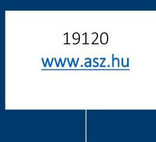
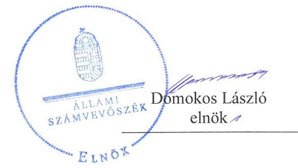
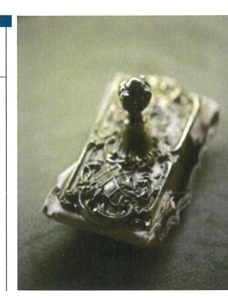
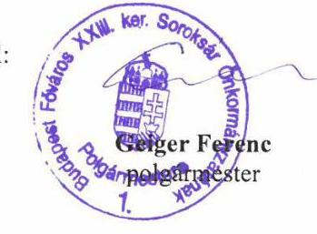
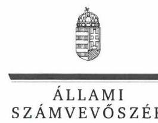
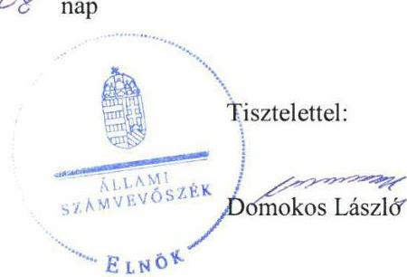
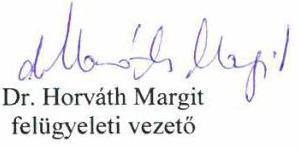

# Jelentés 

## Nemzeti tulajdonú gazdasági társaságok ellenőrzése

Soroksár Sport Club Korlátolt
Felelősségű Társaság
2019.

---

# Jelentés 

## Nemzeti tulajdonú gazdasági társaságok ellenőrzése

Soroksár Sport Club Korlátolt
Felelősségű Társaság
2019. év. hó (s. nap

---

# AZ ELLENŐRZÉST FELÜGYELTE:

DR. HORVÁTH MARGIT felügyeleti vezető

## AZ ELLENŐRZÉST VEZETTE ÉS A VÉGREHAJTÁSÁÉRT FELELŐS:

SIPOSNÉ DÓCZI KLÁRA ellenőrzésvezető

## A PROGRAM ÖSSZEÁLLÍTÁSÁÉRT FELELŐS:

TÓTPÁL SZABOLCS osztályvezető

IKTATÓSZÁM: EL-0885-081/2019

TÉMASZÁM: 2478

ELLENŐRZÉS-AZONOSÍTÓ SZÁM: V082229

Jelentéseink az Országgyűlés számítógépes hálózatán és az Interneten a www.asz.hu címen is olvashatóak.

---

# TARTALOMJEGYZÉK 

■ ÖSSZEGZÉS ..... 5
■ AZ ELLENŐRZÉS CÉLJA ..... 6
■ AZ ELLENŐRZÉS TERÜLETE ..... 7
■ AZ ELLENŐRZÉS HÁTTERE, INDOKOLTSÁGA ..... 8
■ A JELENTÉS LÉNYEGES KÉRDÉSKÖREI ..... 9
■ AZ ELLENŐRZÉS HATÓKÖRE ÉS MÓDSZEREI ..... 10
■ MEGÁLLAPÍTÁSOK ..... 12
■ JAVASLATOK ..... 14
■ MELLÉKLETEK ..... 17
I. sz. melléklet: Értelmező szótár ..... 17
■ FÜGGELÉKEK ..... 19
I. sz. függelék a jelentéshez ..... 19
II. sz. függelék: Észrevételek ..... 20
■ RÖVIDÍTÉSEK JEGYZÉKE ..... 25

---

.

---

# ÖSSZEGZÉS 

Budapest Főváros XXIII. kerület Soroksár Önkormányzatának a Soroksár Sport Club Korlátolt Felelősségű Társaság feletti tulajdonosi joggyakorlása nem volt szabályszerű, mivel nem biztosította a Társaság számviteli törvény szerinti beszámolóinak előírások szerinti jóváhagyását. A Soroksár Sport Club Korlátolt Felelősségű Társaság vagyongazdálkodása szabályszerű volt, mellyel biztosította az átláthatóságot és az elszámoltathatóságot.

## Az ellenőrzés társadalmi indokoltsága

Az Állami Számvevőszék kiemelt célja, hogy ellenőrzéseivel hozzájáruljon ahhoz, hogy a közpénzeket, illetve az ingyenesen juttatott közvagyont az államháztartáson kívül működő szervezetek is átlátható, rendezett módon használják fel.

Az állam és a helyi önkormányzatok tulajdona nemzeti vagyon, melynek megőrzése érdekében kiemelten fontos a nemzeti tulajdonú gazdasági társaságok ellenőrzése. Ellenőrzésüket további társadalmi elvárás is indokolja, részben a gazdálkodásuk körébe tartozó vagyon nagysága, részben az általuk ellátott közszolgáltatások, sajátos feladatellátások, mivel tevékenységükön keresztül a lakosság széles köre kerül kapcsolatba a társaságokkal.

Az Állami Számvevőszék céljaival és a társadalmi igénnyel összhangban, a gazdasági társaság szerepe miatt került sor a Soroksár Sport Club Korlátolt Felelősségű Társaság vagyongazdálkodásának, illetve Budapest Főváros XXIII. kerület Soroksár Önkormányzata tulajdonosi joggyakorlásának ellenőrzésére.

## Főbb megállapítások, következtetések, javaslatok

Budapest Főváros XXIII. kerület Soroksár Önkormányzatának a Társaság feletti tulajdonosi joggyakorlása nem volt szabályszerű, mert az ellenőrzött időszakban a Társaság számviteli törvény szerinti beszámolói jóváhagyásának elmulasztásával megsértette az Alapító okirat és a Ptk. előírásait.

A Soroksár Sport Club Korlátolt Felelősségű Társaság vagyongazdálkodása szabályszerű volt. A Társaság az ellenőrzött időszakban az eszközöket és forrásokat a Számviteli törvény és a Leltározási szabályzat előírásai szerinti leltározással vette számba, a számviteli beszámolók mérlegtételeit szabályszerű leltárakkal támasztotta alá. A Társaság a vagyonának nyilvántartásait a kapcsolódó törvényi előírásokban és saját szabályzataiban foglaltak szerint vezette, a vagyonkezelésben lévő vagyon hasznosítása során az előírásokat betartva járt el.

Az Állami Számvevőszék a jelentésbe foglalt megállapítások alapján Budapest Főváros XXIII. kerület Soroksár Önkormányzata polgármesterének három, a Soroksár Sport Club Korlátolt Felelősségű Társaság ügyvezetőjének kettő javaslatot fogalmazott meg. A javaslatokat megalapozó megállapításokra az érintetteknek 30 napon belül intézkedési tervet kell készíteniük.

---

# AZ ELLENŐRZÉS CÉLJA 

AZ ELLENŐRZÉS CÉLJA annak megállapítása volt, hogy a tulajdonosi joggyakorló a gazdasági társaságai feletti tulajdonosi joggyakorlás kereteit kialakította-e, tulajdonosi jogait megfelelően gyakorolta-e és kötelezettségeit teljesítette-e. Az ellenőrzés célja volt továbbá annak megállapítása, hogy a gazdasági társaság biztosította-e a vagyon védelmét a nyilvántartások szabályszerű vezetése és a mérleg tételeinek leltárral történő alátámasztása útján, valamint szabályszerűen gondoskodott-e a társaság használatában, kezelésében lévő nemzeti vagyon értékének megőrzéséről, gyarapításáról, hasznosításáról.

---

# AZ ELLENŐRZÉS TERÜLETE

## Soroksár Sport Club Korlátolt Felelősségű Társaság és a tulajdonosi jogokat gyakorló Budapest Főváros XXIII. kerület Soroksár Önkormányzata

A 2001-ben alakult Soroksár Sport Club Korlátolt Felelősségű Társaságot 2012-től 100%-ban tulajdonolta Budapest Főváros XXIII. kerület Soroksár Önkormányzata. A Társaság¹ jegyzett tőkéje az ellenőrzött időszakban 3 M Ft volt. Az Önkormányzat² az Mötv.³ szerinti sport és ifjúsági ügyek közfeladat-ellátását részben a Társaság működése által biztosította. A Társaság fő tevékenysége az egyéb sporttevékenység volt, amely magában foglalta az Önkormányzat kötelező feladataként részben ellátandó sport, ifjúsági ügyek, kerületi sport és szabadidő támogatását, valamint az önként vállalt feladatok keretében a sportpálya üzemeltetését, a helyi amatőr sport, utánpótlás nevelés, fogyatékosok sport tevékenységének ellátását. A Társaság vállalkozási tevékenység keretében felnőtt férfi futball csapatot működtetett.

A Társaság a tevékenységét saját vagyonával, valamint a 2013. január 15-én az Önkormányzattal kötött vagyonkezelési szerződésben meghatározott, a Budapest Haraszti út 26. szám alatti sportpálya megnevezésű ingatlannal látta el. A közfeladat ellátásra tekintettel az Önkormányzat az ingatlant a Társaság részére térítésmentesen adta vagyonkezelésbe, a vállalkozási tevékenységre jutó, szakértői becsléssel meghatározott értékű ingatlan használatot pedig határozattal biztosította.

A Társaság főbb pénzügyi adatait az 1. táblázat szemlélteti. A Társaság bevételei⁴ az ellenőrzött időszakban 66%-kal növekedtek, ugyanakkor a bevétel arányos adózott eredmény 2015-ben 20%, 2017-ben 1% volt. A Társaság az ellenőrzött időszakban a befektetett eszközök állományát a beruházások révén megkétszerezte. Az átlagos statisztikai létszám 2015-ben 28 fő, 2017-ben 40 fő volt.

Az ellenőrzött időszakban a Társaság irányítási feladatait Ügyvezető⁵, ellenőrzését három tagú Felügyelőbizottság⁶ végezte. A Társaság ügyvezetőjének személye 2015. május 1-én és 2017. április 01-én változott.

A Társaság az ellenőrzött időszakban az Önkormányzattól a vagyonkezelésen túl más jogcímen nem vett át vagyont, nem rendelkezett tulajdonosi részesedéssel más gazdasági társaságban és nem tartozott a kormányzati szektorba sorolt egyéb szervezetek közé, valamint a Számv.tv.⁷ szerint nem volt könyvvizsgálatra kötelezett.

A Polgármester⁸ és a Jegyző⁹ személye nem változott az ellenőrzött időszakban. A Polgármester 1994-től, a Jegyző 2011. évtől töltötte be tisztségét.

1. táblázat

|  A TÁRSASÁG FŐBB PÉNZÜGYI ADATAI (M FT) |  |  |   |
| --- | --- | --- | --- |
|   | 2015. | 2016. | 2017.  |
|  bevételek | 255 | 350 | 424  |
|  adózott eredmény | 49 | 8 | 3  |
|  befektetett eszközök | 98 | 136 | 193  |
|  saját tőke | 56 | 64 | 67  |
|  összes forrás | 178 | 257 | 225  |
|  Forrás: A Társaság egyszerűsített éves beszámolói 2015-2017 |  |  |   |

---

# AZ ELLENŐRZÉS HÁTTERE, INDOKOLTSÁGA 

Az Alaptörvény 38. cikke alapján az állam és a helyi önkormányzatok tulajdona nemzeti vagyon. A nemzeti vagyon megőrzése, megóvása érdekében kiemelten fontos ezen nemzeti tulajdonú gazdasági társaságok ellenőrzése. Gazdálkodásuk jellemzően a közérdeklődés és a médiafigyelmének középpontjában áll, amihez hozzájárul a gazdálkodásuk körébe tartozó - a nemzeti vagyon részét képező - vagyon nagysága, illetve az általuk ellátott közszolgáltatások minősége és hatékonysága.

Ellenőrzéseink feltárhatják, hogy a tulajdonosi felügyelet hozzájárult-e a szabályszerű gazdálkodáshoz és feladatellátáshoz.

Az ellenőrzés eredményeként meghatározhatóvá válnak a szervezet vagyongazdálkodást érintő kockázatai, ezzel lehetővé téve a kockázatok csökkentését.

A megállapítások alapján megfogalmazott számvevőszéki javaslatok hasznosítása elősegítheti a meglévő hibák megszüntetését. A jó gyakorlatok bemutatásával az ÁSZ hozzájárulhat a követendő megoldások megismertetéséhez, terjesztéséhez.

---

# A JELENTÉS LÉNYEGES KÉRDÉSKÖREI 

1. A tulajdonosi jogok gyakorlása szabályszerű volt-e?
2. A gazdasági társaság vagyongazdálkodási tevékenysége szabályszerű volt-e?

---

# AZ ELLENŐRZÉS HATÓKÖRE ÉS MÓDSZEREI 

## Az ellenőrzés típusa

Megfelelőségi ellenőrzés.

## Az ellenőrzött időszak

A tulajdonosi joggyakorlás tekintetében az ellenőrzött időszak 2017. január 1-től az ellenőrzés megkezdésének napjáig - 2018. október 15-ig - terjedt ki az éves beszámoló elfogadása kivételével, amelynél az ellenőrzött időszak 2015. január 1-től az ellenőrzés megkezdésének napjáig tartott.

A gazdasági társaság vagyongazdálkodása vonatkozásában az ellenőrzött időszak a 2015-2017 évek, a 2017. évi beszámoló jóváhagyása tekintetében a 2018. június elsejéig tartó időszak.

## Az ellenőrzés tárgya

Az önkormányzat tulajdonosi joggyakorlása, a 100%-os tulajdonában lévő gazdasági társaság feletti tulajdonosi joggyakorlás kialakítása és működtetése. A Társaság vagyongazdálkodása keretében a társaság vagyonkezelésében lévő nemzeti vagyon tekintetében a vagyon értékének megőrzése, gyarapítása, valamint a vagyonkezelésben lévő nemzeti vagyon és a saját vagyon tekintetében a vagyonnyilvántartások vezetése, leltár.

## Az ellenőrzött szervezet

Soroksár Sport Club Korlátolt Felelősségű Társaság és
Budapest Főváros XXIII. kerület Soroksár Önkormányzata

## Az ellenőrzés jogalapja

Az ellenőrzés jogalapját az ÁSZ tv ¹⁰. 1. § (3) bekezdése, 5. § (4) bekezdése képezi.

## Az ellenőrzés módszerei

Az ellenőrzést az ellenőrzési program ellenőrzési kérdései, az ellenőrzött időszakban hatályos jogszabályok, az ellenőrzés szakmai szabályok és módszertanok alapján, a nemzetközi standardok figyelembe vételével végeztük.

---

Az ellenőrzés ideje alatt az ellenőrzött szervezettel történő kapcsolattartást az ÁSZ Szervezeti és Működési Szabályzatának vonatkozó előírásai alapján biztosítottuk.

Az ellenőrzési kérdések megválaszolásához szükséges bizonyítékok megszerzése a következő ellenőrzési eljárások alkalmazásával történt: megfigyelés, információkérés, összehasonlítás, elemző eljárás. Az ellenőrzési bizonyítékként felhasználható adatforrások közé tartoztak az ellenőrzési programban felsorolt adatforrások, továbbá minden - az ellenőrzés folyamán - feltárt, az ellenőrzés szempontjából információkat tartalmazó dokumentum.

Az ellenőrzést a kérdésekre adott válaszok kiértékelésével, valamint a megjelölt adatforrások, a tanúsítványok felhasználásával, továbbá az adott időszakban hatályos jogszabályok figyelembe vételével folytattuk le.

A 2017. január 1-től az ellenőrzés megkezdésének napjáig ellenőriztük a tulajdonosi joggyakorlás kereteinek kialakítását, a tulajdonosi joggyakorló tevékenységét a felügyelőbizottság működéséhez kapcsolódóan, valamint azt, hogy a tulajdonosi joggyakorló - amennyiben a gazdasági társaság feladatellátásához kapcsolódóan határozott meg követelményeket, elvárásokat - a nemzeti vagyon értékének megőrzése érdekében monitorozta-e azok teljesülését. A 2015. január 1-től az ellenőrzés megkezdésének napjáig ellenőriztük a tulajdonosi joggyakorló részvételét az éves beszámoló elfogadására vonatkozó döntéshozatalban.

A gazdasági társaság vagyonhoz kapcsolódó nyilvántartásai vezetésének megfelelősége, valamint a nemzeti vagyon értéke megőrzésének, gyarapításának, hasznosításának szabályszerűsége 2015. és 2017. évek tekintetében került ellenőrzésre. A teljes ellenőrzött időszakot, 2015-2017 éveket érintően történt meg a lényeges dokumentumok és a mérleg tételeinek leltárral való alátámasztottságának az értékelése.

A vagyonnyilvántartások és a leltár szabályszerűsége esetében az ellenőrzés azokra a legnagyobb értékű tételekre - lényeges sokaságra - terjedt ki, melyek összértéke elérte a teljes sokaság összértékének 50%-át. A lényeges sokaságot tételesen ellenőriztük.

---

# 1. A tulajdonosi jogok gyakorlása szabályszerű volt-e? 

## Összegző megállapítás

A tulajdonosi jogok gyakorlása nem volt szabályszerű.

A TULAJDONOSI JOGGYAKORLÁS KERETEIT az Önkormányzat, mint a Társaság alapítója az Mötv. és a Ptk.¹¹ vonatkozó előírásai, valamint az önkormányzati SZMSZ¹² és a Vagyongazdálkodási rendelet¹³ előírásai szerint a Társaság Alapító okiratában¹⁴ határozta meg. A Társaság közfeladat ellátásának feltételeit a Vagyonkezelési szerződés¹⁵ tartalmazta a Vagyongazdálkodási rendeletben foglaltak szerint.

Az Alapító¹⁶ a Taktv.¹⁷-ben foglalt előírások szerint Szabályzatban¹⁸ rendelkezett a vezető tisztségviselők, a felügyelőbizottsági tagok, valamint az Mt.¹⁹ 208. § hatálya alá tartozó munkavállalók javadalmazásának, valamint jogviszonyuk megszűnése esetére biztosított juttatások módjának, mértékének elveiről, annak rendszeréről.

Az Alapító a Ptk. és a Taktv. előírásait betartva jelölte ki a felügyelőbizottság tagjait. A Felügyelőbizottság nem rendelkezett jóváhagyott ügyrenddel, ezzel megsértette az Alapító a Ptk.
 3:122. § (3) bekezdésében előírtakat.

## A TULAJDONOSI JOGOK GYAKORLÁSA NEM

VOLT SZABÁLYSZERŰ. A Társaság Alapító okiratának 10.2. pontja szerint az ellenőrzött időszakban a Társaság számviteli törvény szerinti beszámolójának jóváhagyása az Alapító kizárólagos hatáskörébe tartozott. A Társaság ügyvezetője az ellenőrzött időszak egyik évében sem terjesztette be az Alapító részére a Társaság számviteli törvény szerinti beszámolóit jóváhagyásra, ezzel megsértette a Ptk. 3:21. § (2) bekezdés rendelkezését.

A Társaság számviteli törvény szerinti beszámolói jóváhagyásának elmulasztásával az Alapító megsértette az Alapító okirat 10.2. pontjában és a Ptk. 3:109. § (2) és (4) bekezdéseiben előírtakat.

A Társaság az ellenőrzött időszakban olyan számviteli törvény szerinti beszámolót helyezett letétbe és tett közzé, amely nem tartalmazta az Alapító okirat 10.2. pontjában meghatározottak szerint az Alapító, mint jóváhagyásra jogosult testület jóváhagyását. A Társaság ezzel megsértette a Számv. tv. 153. § (1) bekezdés, valamint a 154. § (1) bekezdés előírásait.

Az Önkormányzat az Nvtv. ${ }^{20}$ 10. § (2) bekezdésébe foglalt előírások ellenére nem ellenőrizte a Társaságnál a vagyonkezelésbe adott nemzeti vagyonnal való gazdálkodást.

---

# 2. A gazdasági társaság vagyongazdálkodási tevékenysége szabályszerű volt-e? 

## Összegző megállapítás

A Társaság vagyongazdálkodása szabályszerű volt.
A Társaság rendelkezett a Számv. tv. előírásainak megfelelő Leltárkészítési és leltározási szabályzattal ${ }^{21}$. A szabályzat tartalmazta a leltározásra és leltárkészítésre vonatkozó általános szabályokat, számviteli előírásokat.

A Társaság vagyongazdálkodása a vagyonnyilvántartások és a leltárak tekintetében a Számv. tv. és a Nvtv. előírásai szerint szabályszerű volt.

A Társaság a Számv. tv. előírásait betartva az ellenőrzött időszak minden évében a Leltárkészítési és leltározási szabályzata szerinti leltározás során készített leltárakkal támasztotta alá az egyszerűsített éves beszámolójának mérlegtételeit, és biztosította az üzleti év mérleg-fordulónapjára vonatkozóan a főkönyvi könyvelés és az analitikus nyilvántartások adatai közötti egyeztetést. A számviteli beszámolókat alátámasztó leltárak a Számv. tv. szabályozása szerint tételesen és ellenőrizhető módon tartalmazták a Társaságnak a mérleg fordulónapján fennálló eszközeit és forrásait mennyiségben és értékben.

A Társaság a saját vagyonhoz kapcsolódó nyilvántartásait a Számv. tv. vonatkozó előírásai és az Értékelési szabályzat ${ }_{1-2}{ }^{22}$-be foglaltak szerint vezette. A Társaság a vagyonkezelt vagyont a vagyonkezelési szerződésben meghatározottak szerint tartotta nyilván, a rajta végrehajtott beruházásokat saját könyveiben elkülönítetten, az Nvtv. és a Számv. tv. vonatkozó előírásait betartva vezette. A vagyonkezelt vagyonon végrehajtott értéknövelő beruházásoknál a Társaság eleget tett az Nvtv.-ben, a Vagyonkezelési szerződésben és a Vagyongazdálkodási rendeletben előírt követelményeknek. A vagyonkezelt vagyon hasznosítására átlátható szervezettel kötött bérleti szerződés megkötésekor, valamint a bérbeadás során a Társaság betartotta az Nvtv. vonatkozó előírásait.

---

# JAVASLATOK 

Az ÁSZ tv. 33. § (1) bekezdésében foglaltak értelmében az ellenőrzött szervezet vezetője köteles a jelentésben foglalt megállapításokhoz kapcsolódó intézkedési tervet összeállítani és azt a jelentés kézhezvételétől számított 30 napon belül az ÁSZ részére megküldeni. Amennyiben az ellenőrzött szervezet vezetője nem küldi meg határidőben az intézkedési tervet, vagy továbbra sem elfogadható intézkedési tervet küld, az Állami Számvevőszék elnöke az ÁSZ tv. 33. § (3) bekezdés a) és b) pontjaiban foglaltakat érvényesítheti.

Javaslataink célja a Soroksár Sport Club Korlátolt Felelősségű Társaság gazdálkodása szabályszerűségének és gyakorlatának javítása annak érdekében, hogy a szabályozási környezet és az alkalmazott gyakorlat megfelelően tudja támogatni az átlátható működést.

## Soroksár Sport Club Korlátolt Felelősségű Társaság ügyvezetőjének

1. Intézkedjen a Társaság számviteli törvény szerinti beszámolóinak jóváhagyás céljából az Alapító, mint a Társaság legfőbb szerve számára történő előterjesztéséről a Ptk. előírásainak való megfelelés érdekében.
(1. sz. megállapítás 4. bekezdés 3. mondata alapján)
2. Intézkedjen a Társaság számviteli törvény szerinti beszámolóinak a Számv. tv előírásainak megfelelő nyilvánosságra hozataláról.
(1. sz. megállapítás 6. bekezdése alapján)

---

Javaslataink célja a tulajdonosi joggyakorló Budapest Főváros XXIII. Kerület Soroksár Önkormányzata szabályszerű működésének elősegítése, továbbá a tulajdonosi joggyakorlás kontrolljainak erősítése.

# Budapest Főváros XXIII. Kerület Soroksár Önkormányzata polgármesterének 

1. Kezdeményezze a Társaság felügyelőbizottsága ügyrendjének Alapító általi jóváhagyását a Ptk. előírásainak megfelelően.
(1. sz. megállapítás 3. bekezdés 2. mondata alapján)
2. Kezdeményezze, hogy a Társaság számviteli törvény szerinti beszámolóinak jóváhagyása a Ptk., és az Alapító okirat előírásainak megfelelően történjen.
(1. sz. megállapítás 4-5. bekezdései alapján)
3. Intézkedjen a vagyonkezelésbe adott nemzeti vagyonnal való gazdálkodás rendszeres tulajdonosi ellenőrzéséről a Társaságnál az Nvtv. rendelkezéseinek megfelelően.
(1. sz. megállapítás 7. bekezdése alapján)

---

.

---

# MELLÉKLETEK 

- I. SZ. MELLÉKLET: ÉRTELMEZŐ SZÓTÁR
gazdasági társaság
közfeladat
nemzeti vagyon
tulajdonosi jogok gyakorlója
nemzeti vagyon hasznosítása
nemzeti vagyon használója

A gazdasági társaságok üzletszerű közös gazdasági tevékenység folytatására, a tagok vagyoni hozzájárulásával létrehozott, jogi személyiséggel rendelkező vállalkozások, amelyekben a tagok a nyereségből közösen részesednek, és a veszteséget közösen viselik. Forrás: Ptk. 3:88. § (1) bekezdése Az Áht. ${ }^{23}$ 3/A. § (1) bekezdése alapján közfeladat a jogszabályban meghatározott állami vagy önkormányzati feladat.
Nvtv. 1. § (2) bekezdése szerint nemzeti vagyonba tartozik többek között:„az állam vagy a helyi önkormányzat kizárólagos tulajdonában álló dolgok,az a) pont hatálya alá nem tartozó, állam vagy a helyi önkormányzat tulajdonában lévő dolog,
az állam vagy a helyi önkormányzat tulajdonában lévő pénzügyi eszközök, továbbá az államot vagy a helyi önkormányzatot megillető társasági részesedések,
az államot vagy a helyi önkormányzatot megillető bármely vagyoni értékkel rendelkező jogosultság, amelyet jogszabály vagyoni értékű jogként nevesít. Aki a nemzeti vagyon felett az államot vagy a helyi önkormányzatot megillető tulajdonosi jogok és kötelezettségek összességének gyakorlására jogosult. Forrás: Nvtv. 3. § (1) 17. pontja
A tulajdonosi joggyakorló vagy a nemzeti vagyon használója által a nemzeti vagyon birtoklásának, használatának, hasznok szedése jogának bármely - a tulajdonjog átruházását nem eredményező - jogcímen történő átengedése, ide nem értve a vagyonkezelésbe adást, valamint a haszonélvezeti jog alapítását. Forrás: Nvtv. 3. § (1) bekezdés 4. pont
Azon természetes személy, jogi személy vagy jogi személyiséggel nem rendelkező szervezet, aki vagy amely állami vagyon tekintetében törvény vagy szerződés alapján, a helyi önkormányzat vagyona tekintetében törvény, a helyi önkormányzat rendelete vagy szerződés alapján bármely jogcímen nemzeti vagyont birtokol, használ, szedi annak hasznait, kivéve a tulajdonosi joggyakorló. Forrás: Nvtv. 3. § (1) bekezdés 11. pont

---

.

---

# FÜGGELÉKEK 

- I. SZ. FÜGGELÉK A JELENTÉSHEZ

Az Állami Számvevőszék az ellenőrzések során feltárt tényekhez kapcsolódó további körülmények tisztázására eszközrendszerrel nem rendelkezik. Amennyiben az ellenőrzésen túlmutatóan indokoltnak látszik az ellenőrzés során feltárt körülmények további vizsgálata, az Állami Számvevőszék törvényi felhatalmazás alapján az ellenőrzés által feltárt körülményeket továbbítja a hatáskörrel rendelkező szervnek a szükséges intézkedések megtétele, eljárások lefolytatása érdekében.
I. A Társaság 2015., 2016., és 2017. évre vonatkozóan olyan egyszerűsített éves beszámolót helyezett letétbe és tett közzé, amely nem az Alapító okirat 10.2. pontjában meghatározott Alapító, mint jóváhagyásra jogosult testület által elfogadott számviteli törvény szerinti beszámoló volt. A Társaság ezzel megsértette a Számv. tv. 153. § (1) bekezdés, valamint a 154. § (1) bekezdés előírásait.

Az eset konkrét körülményeinek feltárására a Cégbíróság rendelkezik hatáskörrel.

---

A jelentéstervezetet a Számvevőszék 15 napos észrevételezésre megküldte az ellenőrzött szervezetek vezetőinek az ÁSZ tv. 29. § (1) bekezdés előírásának megfelelően.

Az ellenőrzött Társaság nem tett észrevételt. A függelék tartalmazza az ellenőrzött Önkormányzat észrevételét, illetve az el nem fogadott észrevétel elutasításának indokolását.

[^0]
[^0]:    * 29. § (1) Az Állami Számvevőszék az ellenőrzési megállapításait megküldi az ellenőrzött szervezet vezetőjének vagy az általa megbízott személynek, és annak, akinek személyes felelősségét állapította meg.
    (2) Az ellenőrzött szervezet vezetője és a felelősként megjelölt személy az ellenőrzés megállapításaira tizenöt napon belül írásban észrevételt tehet.
    (3) Az Állami Számvevőszék az észrevételre a beérkezésétől számított harminc napon belül írásban válaszol. A figyelembe nem vett észrevételeket köteles a jelentésben feltüntetni, és megindokolni, hogy azokat miért nem fogadta el.

---

Budapest Főváros XXIII. kerület Soroksár Önkormányzatának POLGÁRMESTERE

1239 Budapest, Grassalkovich út 162.
Ikt.sz.: II/ 11845-2/2019.

Állami Számvevőszék
Domokos László
Elnök Úr részére
Budapest
Apáczai Csere János u. 10.
1052

# Tisztelt Elnök Úr! 

Köszönettel megkaptam a „Nemzeti tulajdonú gazdasági társaságok ellenőrzése - Soroksár Sport Club Kft. 2019." című számvevőszéki jelentéstervezetet (továbbiakban: Tervezet).

A Tervezettel kapcsolatban egyetlen észrevételem van:
A Tervezet 15. oldalán, az 1. pontban megjelölt felügyelőbizottsági ügyrend alapító általi jóváhagyása Budapest Főváros XXIII. kerület Soroksár Önkormányzat Képviselő-testületének az 547/2013. (XI.05.) számú határozatával megtörtént.

Az adatbekérés időszakában az ügyrend beküldését elmulasztottuk, viszont a Képviselőtestület ezt már a vizsgált időszakot megelőzően jóváhagyta, így amennyiben lehetséges, kérem a javaslatban megfogalmazott feladatot teljesítettnek tekinteni szíveskedjen.

Levelemhez csatoltan megküldöm a határozat kivonatot, valamint az ügyrend elfogadására vonatkozó Képviselő-testületi előterjesztést, mely tartalmazza az elfogadott ügyrendet is.

A Tervezet egyéb részeivel kapcsolatban észrevételem nincs.

Budapest, 2019. június 11.
Tisztelettel:

---

ELNÖK

Ikt.szám: EL-0885-078/2019.

# Geiger Ferenc úr 

polgármester

## Budapest Főváros XXIII. Kerület Soroksár Önkormányzata

## Budapest

## Tisztelt Polgármester Úr!

Köszönettel vettem a „Nemzeti tulajdonú gazdasági társaságok ellenőrzése - Soroksár Sport Club Korlátolt Felelősségű Társaság" címmel készített számvevőszéki jelentéstervezetre II/11845-2/2019. iktatószámmal, 2019. június 11-i keltezéssel megküldött észrevételét.
Az Állami Számvevőszék észrevételre vonatkozó álláspontját a felügyeleti vezető által készített részletes tájékoztatás tartalmazza, amelyet levelemhez mellékeltem.
Tájékoztatom Polgármester urat, hogy az Állami Számvevőszék a figyelembe nem vett észrevételeket az Állami Számvevőszékről szóló 2011. évi LXVI. törvény 29. § (3) bekezdésében előírtak szerint köteles a jelentésében feltüntetni és megindokolni, hogy azokat miért nem fogadta el.

Budapest, 2019. 07 hó 08 nap

Melléklet: Tájékoztatás az észrevételek kezeléséről

---

# Tájékoztatás az észrevételek kezeléséről 

Megköszönöm Polgármester úrnak a „Nemzeti tulajdonú gazdasági társaságok ellenőrzése - Soroksár Sport Club Korlátolt Felelősségű Társaság" címmel készített jelentéstervezetre tett észrevételét. Az észrevétel kezeléséről az alábbi tájékoztatást adom.
Polgármester úr észrevétele a megküldött jelentéstervezettel kapcsolatban egy - alábbi tartalmú, a Jelentéstervezet Megállapítások rész 1. pont 3. bekezdés 2. mondatában tett megállapítást, valamint az 1. számú javaslatot érintő - észrevételt tartalmazott:
„A Tervezettel kapcsolatban egyetlen észrevételem van:
A Tervezet 15. oldalán, az 1. pontban megjelölt felügyelőbizottsági ügyrend alapító általi jóváhagyása Budapest Főváros XXIII. kerület Soroksár Önkormányzat Képvi-selő-testületének az 547/2013. (XI.05.) számú határozatával megtörtént.

Az adatbekérés időszakában az ügyrend beküldését elmulasztottuk, viszont a Képviselő- testület ezt már a vizsgált időszakot megelőzően jóváhagyta, így amennyiben lehetséges, kérem a javaslatban megfogalmazott feladatot teljesítettnek tekinteni szíveskedjen.

Levelemhez csatoltan megküldöm a határozat kivonatot, valamint az ügyrend elfogadására vonatkozó Képviselő-testületi előterjesztést, mely tartalmazza az elfogadott ügyrendet is.

A Tervezet egyéb részeivel kapcsolatban észrevételem nincs."

## Az észrevételre az alábbi választ adom:

Polgármester úr észrevételében leírtak a Jelentéstervezet Megállapítások rész 1. pont 3. bekezdés 2. mondatában tett megállapítást, valamint az 1. számú javaslatban leírtakat vitatja, azonban azok helytállósága - az ellenőrzés részére adatbekérés keretében megküldött dokumentumok alapján - változatlanul fennáll a következők miatt:

Az Állami Számvevőszék (továbbiakban: ÁSZ) az ellenőrzést az EL-0552-001/2018. iktatószámú ellenőrzési program, az ellenőrzött időszakban hatályos jogszabályok, az ellenőrzés szakmai szabályok és módszertanok figyelembe vételével végezte. Az ÁSZ az ellenőrzés keretében Budapest Főváros XXIII. kerület Soroksár Önkormányzatától (Önkormányzat) az EL-0885012/2018. és iktatószámú
 adatbekérő levél 2. számú melléklet 15. a. pontjában kérte be az ellenőrzött Soroksár Sport Club Korlátolt Felelősségű Társaság (Társaság) Felügyelőbizottságának ügyrendjét a teljes ellenőrzött időszakra vonatkozóan. Az ellenőrzés folyamán az ÁSZ megállapításait az adatbekérő levelek alapján, az adatszolgáltatás folyamán az Önkormányzat által az előírt adatszolgáltatási határidőre az ellenőrzés rendelkezésére bocsátott dokumentumokban szereplő adatok, információk alapján tette meg. Ellenőrzési dokumentumként csak az ÁSZ felhívására az ÁSZ tv. 28. § (2) bekezdésében meghatározott adatszolgáltatási időszakon belül megküldött és a teljességi és hitelességi nyilatkozatban szereplő dokumentumok vehetők figyelembe. Az ellenőrzés rendelkezésére bocsátott dokumentumok ismételt felülvizsgálata során megállapítottuk, hogy az Önkormányzat által megküldött dokumentumok között az ellenőrzött Társaság Felügyelőbizottságának ügyrendje - annak bekérése ellenére, az észrevétel által elismert adatszolgáltatási mulasztás következtében - nem szerepel, ezért a Jelentéstervezet Megállapítások

---

rész 1. pont 3. bekezdés 2. mondatában tett megállapítás, valamint az 1. számú javaslat továbbra is helytálló, tényszerű, alátámasztott.
Az észrevételhez csatolt dokumentumok (önkormányzati határozat kivonat, ügyrend elfogadására vonatkozó Képviselő-testületi előterjesztés, elfogadott ügyrend) az ÁSZ tv. 28. § (2) bekezdésében meghatározott jogvesztő határidőn túl kerültek megküldésre, ezért azok ellenőrzési dokumentumként nem vehetők figyelembe. Előbbiekben rögzítettekre tekintettel a jelentéstervezetet nem módosítom.
Az Önkormányzat a számvevőszéki jelentés megküldését követően - annak megállapításaihoz kapcsolódóan - intézkedési tervet köteles összeállítani, amelynek során az észrevételben és a mellékelten beküldött dokumentumokban foglaltak felhasználhatók.

Budapest, 2019. 0 h hó" 0 "nap

---

# RÖVIDÍTÉSEK JEGYZÉKE 

${ }^{1}$ Társaság
${ }^{2}$ Önkormányzat
${ }^{3}$ Mötv.
${ }^{4}$ Bevétel
${ }^{5}$ Ügyvezető
${ }^{6}$ Felügyelőbizottság
${ }^{7}$ Számv. tv.
${ }^{8}$ Polgármester
${ }^{9}$ Jegyző
${ }^{10}$ ÁSZ tv.
${ }^{11}$ Ptk.
${ }^{12}$ SZMSZ
${ }^{13}$ Vagyongazdálkodási rendelet
${ }^{14}$ Alapító okirat
${ }^{15}$ Vagyonkezelési szerződés
${ }^{16}$ Alapító
${ }^{17}$ Taktv.
${ }^{18}$ Szabályzat
${ }^{19}$ Mt.
${ }^{20}$ Nvtv.
${ }^{21}$ Leltárkészítési és leltározási szabályzat
${ }^{22}$ Értékelési szabályzat
${ }^{23}$ Áht.

Soroksár Sport Club Korlátolt Felelősségű Társaság
Budapest Főváros XXIII. kerület Soroksár Önkormányzata
2011. évi CLXXXIX. törvény Magyarország helyi önkormányzatairól (hatályos: 2012. január 1-től)
a Soroksár Sport Club Korlátolt Felelősségű Társaság egyszerűsített éves beszámolóiban megjelenő bevétel kategóriák -értékesítés nettó árbevétele, egyéb bevételek, pénzügyi műveletek bevétele - értékei összegezve
Soroksár Sport Club Korlátolt Felelősségű Társaság ügyvezetője
Soroksár Sport Club Korlátolt Felelősségű Társaság felügyelőbizottsága
2000. évi C törvény a számvitelről (hatályos: 2001. január 1-től)

Budapest Főváros XXIII. kerület Soroksár Önkormányzatának polgármestere
Budapest Főváros XXIII. kerület Soroksár Önkormányzatának jegyzője
2011. évi LXVI. törvény az Állami Számvevőszékről (hatályos: 2011. július 1-től)
2013. évi V. törvény a Polgári Törvénykönyvről szóló (hatályos 2014. március 15-től)
Budapest Főváros XXIII. kerület Soroksár Önkormányzata Képviselő-testületének 25/2014. (XI.14.) számú önkormányzati rendelete a Képviselő-testület Szervezeti és Működési Szabályzatáról
Budapest Főváros XXIII. kerület Soroksár Önkormányzata Képviselő-testületének 43/2011. (XI.18.) számú önkormányzati rendelete az Önkormányzat vagyonáról, a vagyontárgyak feletti tulajdonosi jogok gyakorlásáról
Soroksár Sport Club Korlátolt Felelősségű Társaság Alapító okirata és módosításai
Budapest Főváros XXIII. kerület Soroksár Önkormányzata és a Soroksár Sport Club Kft. által 2013. január 15-én megkötött vagyonkezelési szerződés a Képviselő-testület 15/2013. (I.15.) ÖK. számú határozata alapján
Budapest Főváros XXIII. kerület Soroksár Önkormányzata Képviselő-testülete 2009. évi CXXII. törvény a köztulajdonban álló gazdasági társaságok takarékosabb működéséről (hatályos: 2009. december 4-től)
Budapest Főváros XXIII. kerület Soroksár Önkormányzata Képviselő-testülete 106/2017 (III.14) határozatával elfogadott Javadalmazási szabályzat (hatályos: 2017. március 15-től)
2012. évi I. törvény a munka törvénykönyvéről (hatályos: 2012. július 1-jétől)
2011. évi CXCVI. törvény a nemzeti vagyonról (hatályos: 2011. december 31-től)

Soroksár Sport Club Korlátolt Felelősségű Társaság Leltárkészítési és leltározási szabályzata (hatályos 2013.01.01-től)
1: Soroksár Sport Club Korlátolt Felelősségű Társaság Értékelési szabályzata (hatályos 2013. január 1-től 2015. december 31-ig)
2: Soroksár Sport Club Korlátolt Felelősségű Társaság Értékelési szabályzata (hatályos 2016. január 1-től)
2011. évi CXCV. törvény az államháztartásról (hatályos: 2011. december 31-től)

---

ÁLLAMI SZÁMVEVŐSZÉK
1052 Budapest, Apáczai Csere János utca 10.
Levélcím: 1364 Budapest 4. Pf. 54
Telefon: +36 14849100 Telefax: +36 14849200
www.asz.hu
