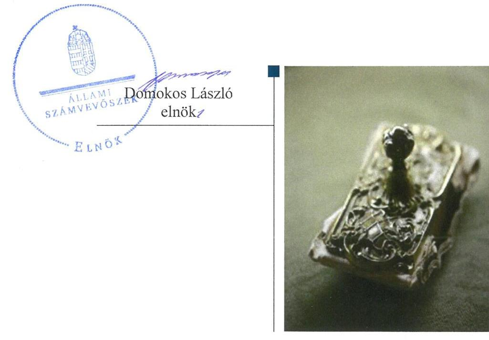
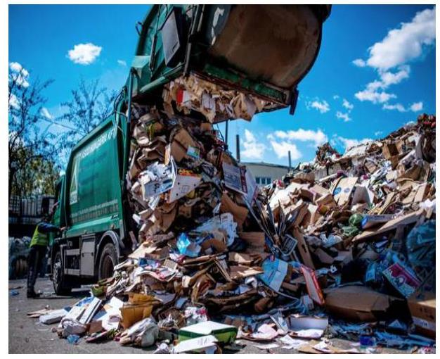

# Jelenetés 

## Nemzeti tulajdonú gazdasági társaságok ellenőrzése

Váci Hulladékgazdálkodási Nonprofit Kft. 2019.

---

# J elentés 

## Nemzeti tulajdonú gazdasági társaságok ellenőrzése

Váci Hulladékgazdálkodási Nonprofit Kft.
2019. Cf. hó 1 f. nap

---

# AZ ELLENŐRZÉST FELÜGYELTE:

DR. PULAY GYULA felügyeleti vezető

# AZ ELLENŐRZÉST VEZETTE ÉS A VÉGREHAJTÁSÁÉRT FELELŐS:

JÁNOSI ISTVÁN ellenőrzésvezető

SALAMIN VIKTOR ellenőrzésvezető

A PROGRAM ÖSSZEÁLLÍTÁSÁÉRT FELELŐS:

TÓTPÁL SZABOLCS osztályvezető

IKTATÓSZÁM: EL-1592-001/2019

TÉMASZÁM: 2478

TÉMASZÁM: 2478

Jelentéseink az Országgyűlés számítógépes hálózatán és az Interneta a www.asz.hu címen is olvashatóak.

---

# TARTALOMJEGYZÉK 

■ ÖSSZEGZÉS ..... 5
■ AZ ELLENŐRZÉS CÉLJA ..... 6
■ AZ ELLENŐRZÉS TERÜLETE ..... 7
■ AZ ELLENŐRZÉS HÁTTERE, INDOKOLTSÁGA ..... 8
■ A JELENTÉS LÉNYEGES KÉRDÉSKÖREI ..... 9
■ AZ ELLENŐRZÉS HATÓKÖRE ÉS MÓDSZEREI ..... 10
■ MEGÁLLAPÍTÁSOK ..... 12
■ JAVASLATOK ..... 14
■ MELLÉKLETEK ..... 15
I. sz. melléklet: Értelmező szótár ..... 15
■ FÜGGELÉKEK ..... 17
I. sz. függelék a jelentéshez ..... 17
II. sz. függelék: Észrevételek ..... 18
■ RÖVIDÍTÉSEK JEGYZÉKE ..... 19

---

.

---

# ÖSSZEGZÉS 

A Váci Hulladékgazdálkodási Nonprofit Kft. felett tulajdonosi jogokat gyakorló Vác Város Önkormányzat tulajdonosi joggyakorlása nem volt szabályszerű. A Váci Hulladékgazdálkodási Nonprofit Kft. vagyongazdálkodása nem volt szabályszerű, számviteli beszámolóit 2015-2017. években nem támasztotta alá leltárral, beszámolója nem volt megalapozott, ezért müködésének átláthatósága és elszámoltathatósága nem volt biztositott.

## Az ellenőrzés társadalmi indokoltsága

Az Állami Számvevőszék kiemelt célja, hogy a helyi önkormányzatok gazdálkodásában rejlő pénzügyi kockázatok feltárásával, az államháztartáson kívülre nyújtott költségvetési támogatások és ingyenes vagyonjuttatások, valamint az államháztartáson kívül múködő feladat-ellátó rendszerek ellenőrzéseivel hozzájáruljon ahhoz, hogy a közpénzeket az államháztartáson kívül múködő szervezetek is átlátható, rendezett módon használják fel.

Magyarországon az önkormányzatok kötelező és önként vállalt feladataik vonatkozásában is egyre szélesebb körben alkalmazzák a költségvetésen kívüli feladatellátást, ezáltal - a nonprofit szervezetek mellett - az önkormányzati tulajdonú gazdasági társaságok is kiemelt fontosságú szerephez jutottak.

## Főbb megállapítások, következtetések, javaslatok

Vác Város Önkormányzat tulajdonosi joggyakorlása nem volt szabályszerű, mert a jogszabályi előírás ellenére a Kép-viselő-testület nem alkotta meg a Társaság javadalmazással összefüggő szabályzatát, valamint a Felügyelő bizottság a Képviselő-testület által jóváhagyott ügyrenddel nem rendelkezett.

A Váci Hulladékgazdálkodási Nonprofit Kft. vagyongazdálkodási tevékenysége nem volt szabályszerű, 2015-2017. években mérlege alátámasztásához nem rendelkezett leltárral, mert az elkészített leltár nem felelt meg a jogszabályi előírásoknak, ezért az éves beszámolói nem voltak megalapozottak.

Az Állami Számvevőszék a jelentésben foglalt megállapítások alapján Vác Város Önkormányzat polgármesterének két javaslatot, a Váci Hulladékgazdálkodási Nonprofit Kft. ügyvezetőjének pedig egy javaslatot fogalmazott meg. A javaslatokat megalapozó megállapításokra az érintetteknek 30 napon belül intézkedési tervet kell készíteniük.

---

# AZ ELLENŐRZÉS CÉLJA 

AZ ELLENŐRZÉS CÉLJA annak megítélése volt, hogy a tulajdonosi joggyakorló a gazdasági társaságai feletti tulajdonosi joggyakorlás kereteit kialakította-e, tulajdonosi jogait megfelelően gyakorolta-e és kötelezettségeit teljesítette-e. A gazdasági társaság biztosította-e a vagyon védelmét a nyilvántartások szabályszerű vezetése és a mérleg tételeinek leltárral történő alátámasztása útján, valamint szabályszerűen gondoskodott-e a társaság használatában, kezelésében lévő nemzeti vagyon értékének megőrzéséről, gyarapításáról, hasznosításáról.

---

# AZ ELLENŐRZÉS TERÜLETE 

## Vác Város Önkormányzat, Váci Hulladékgazdálkodási Nonprofit Kft.

Az Önkormányzat ${ }^{1}$ a Társaságot ${ }^{2}$ 2012. november 21-én alapította a város hulladékgazdálkodási feladatainak ellátására. A Társaság kizárólagos tulajdonosa az ellenőrzött időszakban az Önkormányzat volt. A Társaság fő tevékenysége a nem veszélyes hulladék gyűjtése volt. A Társaság egyszemélyes nonprofit korlátolt felelősségű társaság, legfőbb szerve a taggyűlés, melynek hatáskörét az alapító gyakorolta. Közhasznúsági jogállását 2014. november 10-én szerezte meg. A Társaság 2015től 2017 március 1-ig a Váci Városfejlesztő Kft. tagvállalata volt uralmi szerződés alapján, tulajdonosi jogok átadására nem került sor.

Az ellenőrzött időszakban a polgármester ${ }^{3}$ és a jegyző ${ }^{4}$ személyében nem történt változás, Társaság ügyvezetőjének személye 2017. évben változott. A Társaság az ellenőrzött időszakban nem rendelkezett vagyonkezelésbe vett vagyonnal, továbbá nem tartozott kormányzati szektorba sorolt gazdasági társaságok közé. Átlagos állományi létszáma a 2015. évi 25 fő, 2017. évben 26 fő volt.

---

# AZ ELLENŐRZÉS HÁTTERE, INDOKOLTSÁGA 

Az Alaptörvény 38. cikke alapján az állam és a helyi önkormányzatok tulajdona nemzeti vagyon. A nemzeti vagyon megőrzése, megóvása érdekében kiemelten fontos ezen nemzeti tulajdonú gazdasági társaságok ellenőrzése. Gazdálkodásuk jellemzően a közérdeklődés és a média figyelmének középpontjában áll, amihez hozzájárul a gazdálkodásuk körébe tartozó - a nemzeti vagyon részét képező - vagyon nagysága, illetve az általuk ellátott közszolgáltatások minősége és hatékonysága. Ellenőrzéseink feltárhatják, hogy a tulajdonosi felügyelet hozzájárult-e a szabályszerű gazdálkodáshoz és feladatellátáshoz.

Az ellenőrzés eredményeként meghatározhatóvá válnak a szervezet vagyongazdálkodást érintő kockázatai, ezzel lehetővé téve a kockázatok csökkentését. A megállapítások alapján megfogalmazott számvevőszéki javaslatok hasznosítása elősegítheti a meglévő hibák megszüntetését. A jó gyakorlatok bemutatásával az ÁSZ hozzájárulhat a követendő megoldások megismertetéséhez, terjesztéséhez.

---

# A JELENTÉS LÉNYEGES KÉRDÉSKÖREI 

1. A Társaság feletti tulajdonosi joggyakorlás megfelelt-e a jogszabályi és belső előírásoknak?
2. A Társaság vagyongazdálkodási tevékenysége szabályszerü volt-e?

---

# AZ ELLENŐRZÉS HATÓKÖRE ÉS MÓDSZEREI 

## Az ellenőrzés típusa

Megfelelőségi ellenőrzés.

## Az ellenőrzött időszak

A tulajdonosi joggyakorlás vonatkozásában az ellenőrzött időszak 2017. január 1-től az ellenőrzés megkezdésének napjáig terjedt ki az éves beszámolók elfogadása és a vagyonkezelésbe adott vagyonnal való gazdálkodás tulajdonosi ellenőrzése kivételével, amelyeknél az ellenőrzött időszak 2015. január 1-től az ellenőrzés megkezdésének napjáig - 2018. szeptember 28-ig - tartott.

A Társaság vagyongazdálkodása vonatkozásában az ellenőrzött időszak 2015-2017. évek, a 2017. évi beszámoló jóváhagyása tekintetében 2018. június elsejéig tartó időszak.

## Az ellenőrzés tárgya

Az önkormányzati tulajdonban lévő gazdasági társaság feletti tulajdonosi joggyakorlás kialakítása és működtetése.

Önkormányzati tulajdonban lévő gazdasági társaság vagyongazdálkodása keretében a társaság használatában, kezelésében lévő nemzeti vagyon, illetve a saját vagyon tekintetében a vagyonnyilvántartások vezetése, leltára. A társaság használatában, vagyonkezelésében lévő nemzeti vagyon tekintetében a vagyon értékének megőrzése, gyarapítása, hasznosítása.

## Az ellenőrzött szervezet

Vác Város Önkormányzat, valamint a Váci Hulladékgazdálkodási Nonprofit Kft.

## Az ellenőrzés jogalapja

Az ellenőrzés jogalapját az ÁSZ tv. ${ }^{5} 1 . \S$ (3) bekezdése és 5. § (3)-(5) bekezdései képezték.

---

# Az ellenőrzés módszerei 

Az ellenőrzést az ellenőrzési program ellenőrzési kérdései, az ellenőrzött időszakban hatályos jogszabályok, az ellenőrzés szakmai szabályok és módszertanok alapján, a nemzetközi standardok figyelembe vételével végeztük.

Az ellenőrzés ideje alatt az ellenőrzött szervezettel történő kapcsolattartást az ÁSZ Szervezeti és Múködési Szabályzatának vonatkozó előírásai alapján biztosítottuk.
2017. január 1-től az ellenőrzés megkezdésének napjáig ellenőriztük a tulajdonosi joggyakorlás kereteinek kialakítását, a tulajdonosi joggyakorló tevékenységét a felügyelő bizottság és a független könyvvizsgáló működéséhez kapcsolódóan, valamint azt, hogy a tulajdonosi joggyakorló - amenynyiben a gazdasági társaság feladatellátásához és vagyonkezeléséhez kapcsolódóan határozott meg követelményeket, elvárásokat - a nemzeti vagyon értékének megőrzése érdekében monitorozta-e azok teljesülését. 2015. január 1-től az ellenőrzés megkezdésének napjáig ellenőriztük a tulajdonosi joggyakorló részvételét az éves beszámoló elfogadására vonatkozó döntéshozatalban, valamint amennyiben adott a társaságainak vagyonkezelésbe nemzeti vagyont, akkor azt, hogy az azzal történő gazdálkodást a tulajdonosi joggyakorló ellenőrizte-e.

Az ellenőrzési kérdések megválaszolásához szükséges bizonyítékok megszerzése a Társaság vagyongazdálkodása vonatkozásában a következő ellenőrzési eljárások alkalmazásával történt: megfigyelés, információkérés, összehasonlítás, elemző eljárás. Az ellenőrzési bizonyítékként felhasználható adatforrások közé tartoznak az ellenőrzési programban felsorolt adatforrások, továbbá minden - az ellenőrzés folyamán - feltárt, az ellenőrzés szempontjából információkat tartalmazó dokumentum.

Az ellenőrzést a kérdésekre adott válaszok kiértékelésével, valamint a megjelölt adatforrások, a csatolt tanúsítványok felhasználásával, továbbá az adott időszakban hatályos jogszabályok figyelembe vételével folytattuk le.

A vagyonnyilvántartások szabályszerűsége esetében az ellenőrzés azokra a legnagyobb értékű tételekre - a lényeges sokaságra - terjedt ki, melyek összértéke eléri a teljes sokaság összértékének 50\%-át. A lényeges sokaságot tételesen ellenőriztük. A 2015-2017. évekre történt meg a lényeges dokumentumok, ennek keretében a leltározáshoz kapcsolódó dokumentumok, valamint a mérleg tételeit alátámasztó leltár értékelése.

---

# 1. A Társaság feletti tulajdonosi joggyakorlás megfelelt-e a jogszabályi és belső előírásoknak? 

Összegző megállapítás

Az Önkormányzat tulajdonosi joggyakorlása nem volt szabályszerű.

### 1.1. számú megállapítás

Az Önkormányzat a tulajdonosi joggyakorlás kereteit nem a jogszabályi előírások szerint alakította ki.

## A TULAJDONOSI JOGOK GYAKORLÁSÁNAK

RENDJÉT az Önkormányzat a Társaság Alapító okirat ${ }^{6}$-ában, a vagyongazdálkodási rendelet ${ }^{7}$-ben és a Társaság SZMSZ ${ }^{8}$-ében kialakította. A Társaság tevékenységével kapcsolatos elvárásokat és követelményeket a hulladékgazdálkodási rendelet ${ }^{9}$ és - a Hgt. ${ }^{10}$ előírásainak megfelelően - közszolgáltatási szerződés ${ }^{11}$ határozta meg.

Az Önkormányzat Képviselő-testülete a Társaság legfőbb szerve hatáskörének gyakorlójaként a Taktv. ${ }^{12}$ 5. § (3) bekezdése előírása ellenére nem alkotta meg a vezető tisztségviselők, a felügyelőbizottsági tagok, az Mt. ${ }^{13}$ 208. §-ának hatálya alá eső munkavállalók javadalmazása, valamint a jogviszony megszűnése esetére biztosított juttatások módjának, mértékének elveiről, annak rendszeréről szóló szabályzatot.

### 1.2. számú megállapítás

A Társaság feletti tulajdonosi joggyakorlás nem volt szabályszerű.

A SZÁMVITELI BESZÁMOLÓ ELFOGADÁSÁRA, az eredmény felosztására vonatkozó döntéshozatalban a tulajdonosi joggyakorló a jogszabályi előírásoknak megfelelően részt vett. A döntéshez a Felügyelő bizottság és a Könyvvizsgáló jelentése rendelkezésre állt. Az Önkormányzat Képviselő-testülete a Társaság vesztesége rendezésének módjáról a jogszabályoknak megfelelően döntött.

A FELÜGYELŐ BIZOTTSÁG a Képviselő-testület, mint a Társaság legfőbb szerve által jóváhagyott ügyrenddel a Ptk. ${ }^{14}$ 3:122. § (3) bekezdésének előírása ellenére nem rendelkezett. A könyvvizsgáló megválasztása megfelelt a Ptk. és a Számv. tv. ${ }^{15}$ előírásainak.

---

# 2. A Társaság vagyongazdálkodási tevékenysége szabályszerű volt-e? 

Összegző megállapítás

A Társaság vagyongazdálkodási tevékenysége nem volt szabályszerű.

## LELTÁRKÉSZÍTÉSI ÉS LELTÁROZÁSI SZABÁLY-

ZATTAL a Társaság rendelkezett az ellenőrzött időszakban a Számv. tv előírásainak megfelelően.

A MÉRLEG TÉTELEINEK ALÁTÁMASZTÁSÁHOZ a Társaság a Számv. tv. 69. § (1) bekezdésének előírása ellenére 2015-2017. évekre vonatkozóan nem állított össze olyan leltárt, amely tételesen, ellenőrizhető módon tartalmazta volna a mérleg fordulónapján meglévő eszközöket és forrásokat mennyiségben és értékben. Szabályszerű leltár hiányában a mérleg nem volt alátámasztott, a 2015-2017. évi beszámolók nem voltak megalapozottak. A Társaság könyvvizsgálója a 2015-2017. évi beszámolókról korlátozás nélküli véleményt adott.

A nem szabályszerűen összeállított leltárak következtében az egyszerűsített éves beszámolók vonatkozásában nem érvényesült a Számv. tv. 15. § (3) bekezdésében foglalt valódiság elve.

---

# JAVASLATOK 

Az ÁSZ tv. 33. § (1) bekezdésében foglaltak értelmében az ellenőrzött szervezet vezetője köteles a jelentésben foglalt megállapításokhoz kapcsolódó intézkedési tervet összeállítani és azt a jelentés kézhezvételétől számított 30 napon belül az ÁSZ részére megküldeni. Amennyiben az ellenőrzött szervezet vezetője nem küldi meg határidőben az intézkedési tervet, vagy továbbra sem elfogadható intézkedési tervet küld, az Állami Számvevőszék elnöke az ÁSZ tv. 33. § (3) bekezdése a) és b) pontjaiban foglaltakat érvényesítheti.

## Vác Város Önkormányzat polgármesterének

1. Intézkedjen a Taktv. előírásainak megfelelő javadalmazási szabályzat megalkotásáról.
(1.1. sz. megállapítás 2. bekezdése alapján)
2. Intézkedjen a Felügyelő Bizottság ügyrendjének a Ptk. szerinti jóváhagyásáról.
(1.2. sz. megállapítás 2. bekezdés első mondata alapján)

## Váci Hulladékgazdálkodási Nonprofit Kft. ügyvezetőjének

1. Intézkedjen a Számv.tv. előírása szerinti leltár összeállításáról.
(2. sz. megállapítás 2. bekezdése első mondata alapján)

---

# MELLÉKLETEK 

- I. SZ. MELLÉKLET: ÉRTELMEZŐ SZÓTÁR
gazdasági társaság
koncessziós szerződés
közszolgáltatás
közfeladat
nemzeti vagyon
nemzeti vagyon használója
tulajdonosi jogok gyakorlója vagyonkezelő

Ptk. 3:88. § (1) bekezdése szerint „a gazdasági társaságok üzletszerű közös gazdasági tevékenység folytatására, a tagok vagyoni hozzájárulásával létrehozott, jogi személyiséggel rendelkező vállalkozások, amelyekben a tagok a nyereségből közösen részesednek, és a veszteséget közösen viselik".
Az 1991. évi XVI. tv. alapján a kizárólagos állami, önkormányzati vagy ön-kormányzati társulási tulajdon hatékony működtetésének, valamint a kizárólagosan az állam vagy az önkormányzat hatáskörébe utalt tevékenységek gyakorlásának egyik lehetséges útja mindezek koncessziós szerződés alapján való átengedése
Az Ebktv. ${ }^{16}$ 3. § d) pontja a következőképpen határozza meg a közszolgáltatást: „szerződéskötési kötelezettség alapján a lakosság alapvető szükségleteinek ellátására irányuló szolgáltatás, így különösen a villamos energia-, gáz-, hő-, víz-, szennyvíz- és hulladékkezelési, köztisztasági, postai és táv-közlési szolgáltatás, továbbá a menetrend alapján közlekedő járművekkel végzett közforgalmú személyszállítás".
Az Áht. 3/A. § (1) bekezdése alapján közfeladat a jogszabályban meghatározott állami vagy önkormányzati feladat
Nvtv. 1. § (2) bekezdése szerint nemzeti vagyonba tartozik többek között:
„az állam vagy a helyi önkormányzat kizárólagos tulajdonában álló dolgok,
az a) pont hatálya alá nem tartozó, állam vagy a helyi önkormányzat tulajdonában lévő do$\log$,
az állam vagy a helyi önkormányzat tulajdonában lévő pénzügyi eszközök, továbbá az államot vagy a helyi önkormányzatot megillető társasági részesedések,
az államot vagy a helyi önkormányzatot megillető bármely vagyoni érték-kel rendelkező jogosultság, amelyet jogszabály vagyoni értékű jogként nevesít
A tulajdonosi joggyakorló vagy a nemzeti vagyon használója által a nemzeti vagyon birtoklásának, használatának, hasznok szedése jogának bármely - a tulajdonjog átruházását nem eredményező - jogcímen történő átengedése, ide nem értve a vagyonkezelésbe adást, valamint a haszonélvezeti jog alapítását.
Forrás: Nvtv. 3. § (1) bekezdés 4. pont
Azon természetes személy, jogi személy vagy jogi személyiséggel nem rendelkező szervezet, aki vagy amely állami vagyon tekintetében törvény vagy szerződés alapján, a helyi önkormányzat vagyona tekintetében törvény, a helyi önkormányzat rendelete vagy szerződés alapján bármely jogcímen nemzeti vagyont birtokol, használ, szedi annak használt, kivéve a tulajdonosi joggyakorló.
Forrás: Nvtv. 3. § (1) bekezdés 11. pont
Aki a nemzeti vagyon felett az államot vagy a helyi önkormányzatot megillető tulajdonosi jogok és kötelezettségek összességének gyakorlására jogosult. (Forrás: Nvtv. 3. § (1) bekezdés 17. pontja)
az állam tulajdonában álló nemzeti vagyon tekintetében:
aa) költségvetési szerv,
ab) helyi önkormányzat, nemzetiségi önkormányzat, valamint ezek társulásai,
ac) az ab) alpontban felsoroltak fenntartása vagy irányítása alá tartozó intézmény,
ad) köztestület,
ae) az állam, az aa)-ac) alpontban meghatározott személyek együtt vagy külön-külön 100\%os tulajdonában álló gazdálkodó szervezet,
af) az ae) alpont szerinti gazdálkodó szervezet 100\%-os tulajdonában álló gazdálkodó szervezet,
ag) a törvény által kijelölt egyedileg meghatározott jogi személy.
b) a helyi önkormányzat tulajdonában álló nemzeti vagyon tekintetében:

---

ba) nemzetiségi önkormányzat, helyi vagy nemzetiségi önkormányzati társulás, valamint ezek fenntartása vagy irányítása alá tartozó intézmény,
bb) költségvetési szerv,
bc) köztestület,
bd) az állam, a helyi önkormányzat, a ba) alpontban meghatározott személyek együtt vagy külön-külön 100\%-os tulajdonában álló gazdálkodó szervezet,
be) a bd) alpont szerinti gazdálkodó szervezet 100\%-os tulajdonában álló gazdálkodó szervezet.
Forrás: Nvtv. 3. § (1) bekezdés 19. pont
vagyongazdálkodás
A nemzeti vagyongazdálkodás feladata a nemzeti vagyon rendeltetésének megfelelő, az állam, az önkormányzat mindenkori teherbíró képességéhez igazodó, elsődlegesen a közfeladatok ellátásához és a mindenkori társadalmi szükségletek kielégítéséhez szükséges, egységes elveken alapuló, átlátható, hatékony és költségtakarékos múködtetése, értékének megőrzése, állagának védelme, értéknövelő használata, hasznosítása, gyarapítása, továbbá az állam vagy a helyi önkormányzat feladatának ellátása szempontjából feleslegessé váló vagyontárgyak elidegenítése. (Forrás: Nvtv. 7. § (2) bekezdése).

---

# FÜGGELÉKEK 

- I. SZ. FÜGGELÉK A JELENTÉSHEZ

Az Állami Számvevőszék az ellenőrzések során feltárt tényekhez kapcsolódó további körülmények tisztázására eszközrendszerrel nem rendelkezik. Amennyiben az ellenőrzésen túlmutatóan indokoltnak látszik az ellenőrzés során feltárt körülmények további vizsgálata, az Állami Számvevőszék törvényi felhatalmazás alapján az ellenőrzés által feltárt körülményeket továbbítja a hatáskörrel rendelkező szervnek a szükséges intézkedések megtétele, eljárások lefolytatása érdekében.
I. Az Állami Számvevőszék az ellenőrzött szervezetnél feltárta, hogy az Önkormányzat Képviselő-testülete a Társaság legfőbb szerveként a Taktv. 5. § (3) bekezdésének előírása ellenére nem alkotta meg a vezető tisztségviselők, a felügyelőbizottsági tagok, valamint az Mt. 208. §-ának hatálya alá eső munkavállalók javadalmazásáról, valamint a jogviszony megszünése esetére biztosított juttatások módjának, mértékének elveiről, annak rendszeréről szóló szabályzatot.
Az eset konkrét körülményeinek felderítésére a Cégbíróság rendelkezik hatáskörrel.
II. Az Állami Számvevőszék feltárta, hogy a Társaság 2015-2017. években nem készítette el a Számv. tv. 69. § (1) bekezdése szerinti leltárt. Szabályszerü leltár hiányában a mérleg nem volt alátámasztott, a 2015-2017. évi beszámolók nem voltak megalapozottak.
A mérleget alátámasztó leltár hiánya miatt sérült a Számv. tv. 15. §. (3) bekezdése szerinti valódiság elve, így nem igazolt, hogy a Társaság 2015-2017. évi beszámolói megbizható és valós összképet mutatnak.
Az eset konkrét körülményeinek feltárására a Nemzeti Adó- és Vámhivatal rendelkezik hatáskörrel.

---

A jelentéstervezetet a Számvevőszék 15 napos észrevételezésre megküldte az ellenőrzött szervezetek vezetőinek az ÁSZ tv. 29. §* (1) bekezdése előírásának megfelelően.

A jelentéstervezetre a Váci Hulladékgazdálkodási Nonprofit Kft. ügyvezetője és Vác Város Önkormányzat polgármestere az ÁSZ törvény 29.§ (2) bekezdésében foglalt határidőn belül nemleges észrevételt tettek.

[^0]
[^0]:    * 29. § (1) Az Állami Számvevőszék az ellenőrzési megállapításait megküldi az ellenőrzött szervezet vezetőjének vagy az általa megbízott személynek, és annak, akinek személyes felelősségét állapította meg.
    (2) Az ellenőrzött szervezet vezetője és a felelősként megjelölt személy az ellenőrzés megállapításaira tizenöt napon belül írásban észrevételt tehet.
    (3) Az Állami Számvevőszék az észrevételre a beérkezésétől számított harminc napon belül írásban válaszol. A figyelembe nem vett észrevételeket köteles a jelentésben feltüntetni, és megindokolni, hogy azokat miért nem fogadta el.

---

# RÖVIDÍTÉSEK JEGYZÉKE 

${ }^{1}$ Önkormányzat
${ }^{2}$ Társaság
${ }^{3}$ Polgármester
${ }^{4}$ Jegyző
${ }^{5}$ ÁSZ tv.
${ }^{6}$ Alapító okirat
${ }^{7}$ vagyongazdálkodási rendelet
${ }^{8}$ SZMSZ
${ }^{9}$ hulladékgazdálkodási rendelet
${ }^{10} \mathrm{Hgt}$.
${ }^{11}$ közszolgáltatási szerződés
${ }^{12}$ Taktv.
${ }^{13} \mathrm{Mt}$.
${ }^{14} \mathrm{Ptk}$.
${ }^{15}$ Számv. tv.
${ }^{16}$ Ebktv.

Vác Város Önkormányzat
Váci Hulladékgazdálkodási Nonprofit Kft.
Vác Város Önkormányzat Polgármestere
Vác Város Önkormányzat Jegyzője
az Állami Számvevőszékről szóló 2011. évi LXVI. törvény
Váci Hulladékgazdálkodási Nonprofit Kft. alapító okirata
(hatályos a 2017. szeptember 21-től)
Önkormányzat Képviselő-testületének 26/2018. (VII. 13.) önkormányzati
rendelete Vác Város Önkormányzat 26/2018. (VII.13.) sz. rendeletmódosítás 22/2014. (VI.20.) sz. rendelete az önkormányzat vagyonáról és a vagyonnal való gazdálkodás egyes szabályairól, valamint az önkormányzat vagyonának értékesítése, illetve hasznosítása során alkalmazandó pályáztatási szabályokról (a módosításokkal egységes szerkezetben)
A Váci Hulladékgazdálkodási Nonprofit Kft. Szervezeti és Működési Szabályzata (hatályos 2018. február 23-tól)
Vác Város Önkormányzat Képviselő-testületének 33/2016. (VII.15.) önkormányzati rendelete a kötelező települési hulladékgazdálkodási közszolgáltatásról szóló rendelet egységes szerkezetben Vác Város Önkormányzat 56/2013. (XI. 22.) rendelete a kötelező települési hulladékgazdálkodási köz-szolgáltatásról (az időközi módosításokkal egységes szerkezetben)
2012. évi CLXXXV. törvény a hulladékról

Vác Város Önkormányzat és a Váci Hulladékgazdálkodási Kft. között 2012. december 28-án létrejött Közszolgáltatási szerződés a hulladékgazdálkodási közszolgáltatás ellátására. A közszolgáltatási szerződést az Önkormányzat 2017. október 19-én - hat hónapos felmondási idővel - felmondta.
2009. évi CXXII. törvény a köztulajdonban álló gazdasági társaságok takarékosabb müködéséről (hatályos: 2009. december 4-től)
2012. évi I. törvény a munka törvénykönyvéről (hatályos: 2012. július 1-jétől)
2013. évi V. törvény a Polgári Törvénykönyvről (hatályos: 2014. március 15-étől)
2000. évi C. törvény a számvitelről (hatályos: 2001. január 1-jétől)
egyenlő bánásmódról és az esélyegyenlőség előmozdításáról szóló 2003. évi
CXXV. törvény

---

ÁLLAMI SZÁMVEVŐSZÉK
1052 Budapest, Apáczai Csere János utca 10.
Levélcím: 1364 Budapest 4. Pf. 54
Telefon: +36 14849100 Telefax: +36 14849200
www.asz.hu