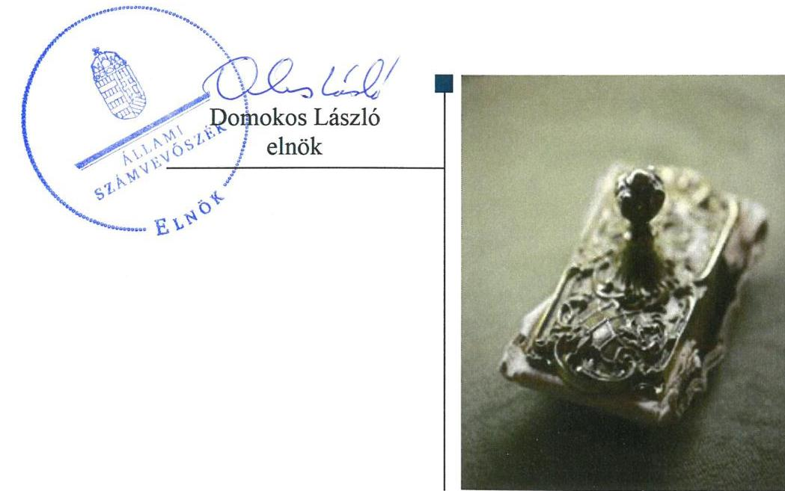
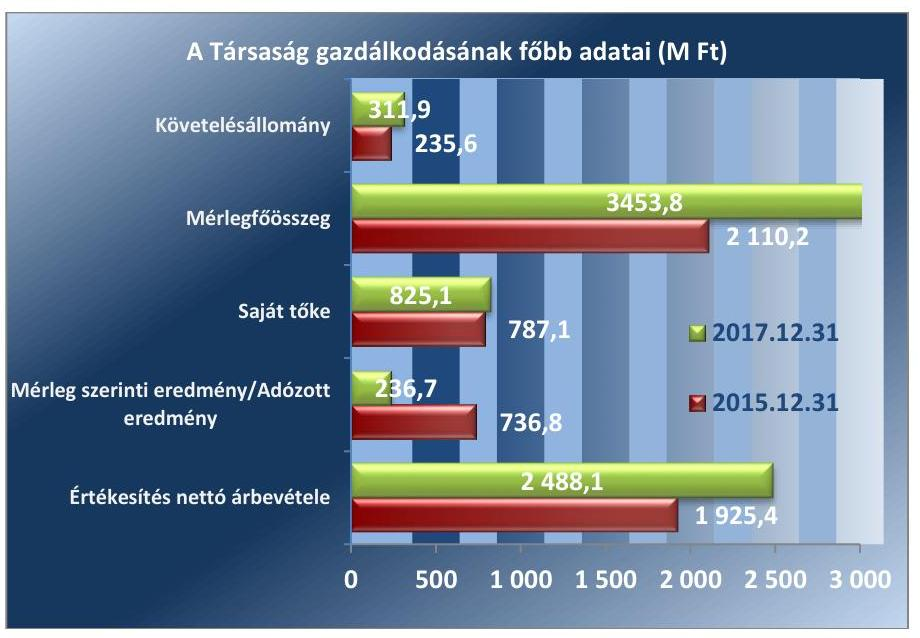

# Jelentés 

## Az állami tulajdonú gazdasági társaságok ellenőrzése

Új Világ Nonprofit Szolgáltató Korlátolt Felelősségű Társaság
2019.

19122
www.asz.hu

---

# Jelentés 

## Az állami tulajdonú gazdasági társaságok ellenőrzése

Új Világ Nonprofit Szolgáltató Korlátolt Felelősségű Társaság
2019.  hó 30. nap

---

# AZ ELLENŐRZÉST FELÜGYELTE:

DR. HORVÁTH MARGIT felügyeleti vezető

## AZ ELLENŐRZÉST VEZETTE ÉS A VÉGREHAJTÁSÁÉRT FELELŐS:

SALI SÁNDORNÉ ellenőrzésvezető

A PROGRAM ÖSSZEÁLLÍTÁSÁÉRT FELELŐS:

TÓTPÁL SZABOLCS osztályvezető

IKTATÓSZÁM: EL-0823-061/2019.

TÉMASZÁM: 2480

ELLENŐRZÉS-AZONOSÍTÓ SZÁM: V082409

Jelentéseink az Országgyűlés számítógépes hálózatán és az Interneten a www.asz.hu címen is olvashatóak.

---

# TARTALOMJEGYZÉK 

■ ÖSSZEGZÉS ..... 5
■ AZ ELLENŐRZÉS CÉLJA ..... 6
■ AZ ELLENŐRZÉS TERÜLETE ..... 7
■ AZ ELLENŐRZÉS HÁTTERE, INDOKOLTSÁGA ..... 9
■ A JELENTÉS LÉNYEGES KÉRDÉSKÖREI ..... 10
■ AZ ELLENŐRZÉS HATÓKÖRE ÉS MÓDSZEREI ..... 11
■ MEGÁLLAPÍTÁSOK ..... 13
■ JAVASLATOK ..... 15
■ MELLÉKLETEK ..... 17
I. sz. melléklet: Fogalomtár ..... 17
II. sz. melléklet: A Társaság főbb mérlegadatai ..... 19
■ FÜGGELÉK: ÉSZREVÉTELEK ..... 21
■ RÖVIDÍTÉSEK JEGYZÉKE ..... 23

---

.

---

# ÖSSZEGZÉS 

Az Új Világ Nonprofit Szolgáltató Korlátolt Felelősségű Társaság működésének szabályozottsága, gazdálkodása, vagyongazdálkodása szabályszerű volt, ezáltal az ügyvezető biztosította az elszámoltathatóságot és a vagyon védelmét.

## Az ellenőrzés társadalmi indokoltsága

Az állami tulajdonú gazdálkodó szervezetek a nemzeti vagyon részét képezik. Gazdálkodásuk a közérdeklődés és a média figyelmének középpontjában áll. A közpénzt, közvagyont felhasználó állami tulajdonú gazdálkodó szervezetekkel szemben alapvető társadalmi igény, hogy működésük, gazdálkodásuk szabályszerű, az általuk szolgáltatott adatok minél megbízhatóbbak legyenek. Az Állami Számvevőszék a közvagyon, a közpénzek szabályos, átlátható és elszámoltatható felhasználásának elősegítése érdekében, stratégiájával összhangban végzi az államháztartáson kívül működő szervezetek ellenőrzését.

Az Új Világ Nonprofit Szolgáltató Korlátolt Felelősségű Társaság megfelelő működése fontos az állami vagyon védelme szempontjából, emiatt került sor a Társaság ellenőrzésére.

## Főbb megállapítások, következtetések, javaslatok

Az Új Világ Nonprofit Szolgáltató Korlátolt Felelősségű Társaság szabályozottsága az ellenőrzött időszakban javult, 2017 végére összhangban volt a jogszabályi előírásokkal. A Társaság 2015 augusztusától az előírás szerinti számviteli politikával és annak keretében elkészítendő szabályzatokkal, 2017. második félévére számlarenddel rendelkezett.

A Társaság a gazdálkodás keretében a bevételeit és ráfordításait szabályszerűen számolta el, az általa nyújtott szolgáltatások díjtételeit a jogszabályi előírásokkal és belső szabályozással összhangban lévő önköltségszámítással megalapozta. A Társaság vagyongazdálkodása szabályszerű volt, a vagyon megőrzése, megóvása megvalósult. A Társaság a vagyongazdálkodáshoz kapcsolódó feladat-és hatásköröket, felelősségi szinteket kialakította. A Társaság beszámolási kötelezettségét teljesítette, közérdekű adatait közzétette, az Alapító által előírt tervezési, adatszolgáltatási feladatokat végrehajtotta.

A Társaság a mérlegtételek beszámolóban kimutatott állományát az előírások szerinti leltárral alátámasztotta, a mérlegvalódiság elve érvényesült. A vagyonváltozást eredményező döntések és azok végrehajtása szabályszerű volt.

Az Állami Számvevőszék a jelentésben foglalt megállapítások alapján az Új Világ Nonprofit Szolgáltató Korlátolt Felelősségű Társaság ügyvezetőjének egy javaslatot fogalmazott meg. A javaslatot megalapozó megállapításokra az érintettnek 30 napon belül intézkedési tervet kell készítenie.

---

# AZ ELLENŐRZÉS CÉLJA 

Az ellenőrzés célja annak értékelése, hogy a gazdasági társaság szabályozottsága, gazdálkodása és vagyongazdálkodási tevékenysége megfelelt-e a jogszabályi és a tulajdonosi előírásoknak; biztosítva volt-e a közfeladatok átláthatósága és elszámoltathatósága érdekében a közszolgáltatás díjának megalapozottsága szabályszerű önköltségszámítással. A vagyonváltozást eredményező döntések esetében a gazdasági társaság szabályszerűen járt-e el.

---

# AZ ELLENŐRZÉS TERÜLETE 

## Új Világ Nonprofit Szolgáltató Korlátolt Felelősségű Társaság

## AZ ÚJ VILÁG NONPROFIT SZOLGÁLTATÓ KORLÁTOLT FELELŐSSÉGŰ TÁRSASÁGOT

WELT 2000 Nonprofit Szolgáltató és Kereskedelmi Kft. néven 1995-ben magánszemélyek alapították, 0,5 M Ft jegyzett tőkével, elnevezése 2015-ben változott. A Társaság $^{1} 100 \%$ tulajdonosává vált a Magyar Állam a 2014. évben a 282/2014. (XI. 14.) Korm. rendelet $^{2}$ alapján. Az alapítót megillető tulajdonosi jogokat az ellenőrzött időszakban a Magyar Nemzeti Vagyonkezelő Zrt. gyakorolta.

A Társaság jegyzett tőkéje az ellenőrzött időszakban 3,0 M Ft volt. A Társaság információtechnológiai szaktanácsadást, ezen belül a nemzetgazdaságilag kiemelt jelentőségű támogatások ügyvitelét, monitoringját támogató informatikai rendszerek fejlesztését, üzemeltetését végezte.

A Társaság az állami és közigazgatási környezetben végzett fejlesztési és üzemeltetési tevékenysége révén meghatározó szereplője volt a pályázatkezelő rendszerek szoftverpiacának.

A Társaság a Miniszterelnökséggel kötött Megállapodás $^{3}$ alapján végezte az IT $^{4}$ alkalmazások (EMIR $^{5}$, FAIR $^{6}$, Palyazat.gov.hu, BIR $^{7}$ rendszerek) kizárólagos szoftverfejlesztését és alkalmazás-üzemeltetését. Továbbá a Magyar Államkincstár részére az Országos Támogatás-ellenőrzési Rendszert fejlesztette és üzemeltette. A Nemzeti Kutatási, Fejlesztési és Innovációs Hivatal részére üzemeltetési és support szolgáltatást nyújtott, valamint a Miniszterelnökség részére az IMIR 2014-2020 rendszer bevezetését, fejlesztését, működésének támogatását látta el.

A Társaság saját vagyonát használta, közfeladat keretében közszolgáltatást látott el, kormányzati szektorba nem tartozott, vagyonkezelésbe vett vagyonnal, valamint tulajdonosi részesedéssel más gazdasági társaságban nem rendelkezett. A Társaság a Bkr. $^{8}$ alapján belső ellenőrzésre nem volt kötelezett, ugyanakkor 2017. évben saját döntése alapján belső ellenőrzést működtetett.

Az önköltségszámítás rendjére vonatkozó belső szabályzat elkészítésére a Társaság a Számv. tv. $^{9}$ 14. § (7) bekezdése alapján, valamint könyvvizsgálatra a Számv. tv. 155. § (2) bekezdése alapján kötelezett volt. A Társaságnál FB $^{10}$ működött. Az ügyvezető $^{11}$ személye 2015. április 1-jétől, illetve 2016. július 1-jétől változott. A Társaság 2015-ben 97 főt, 2017-ben 136 főt foglalkoztatott.

A Társaság mérlegfőösszege 2015. évről 2017. évre 63,7%-kal, a követelésállomány 32,4%-kal, a saját tőke 4,8%-kal, valamint az értékesítés nettó árbevétele 29,2%-kal növekedett, ugyanakkor az eredmény 67,9%-kal csökkent.

---

A Társaság gazdálkodásának főbb adatait az 1. ábra mutatja.
1. ábra

Forrás: A Társaság 2015. és 2017 évi éves beszámolói

---

# AZ ELLENŐRZÉS HÁTTERE, INDOKOLTSÁGA 

Az Alaptörvény 38. cikke alapján az állam tulajdona a nemzeti vagyon része. A nemzeti vagyon megőrzésének, védelmének és a nemzeti vagyonnal való felelős gazdálkodásnak a követelményeit sarkalatos törvény határozza meg. Az állami tulajdonú gazdasági társaságokra vonatkozó előírások betartásának ellenőrzése kiemelten fontos a vagyon megőrzése, megóvása érdekében. Gazdálkodásuk jellemzően a közérdeklődés és a média figyelmének középpontjában áll, amihez hozzájárul a gazdálkodásuk körébe tartozó - közvetlen vagy közvetett állami tulajdonú, tehát végső soron a nemzeti vagyon részét képező - vagyon nagysága, illetve az általuk ellátott közszolgáltatások/közfeladatok minősége és hatékonysága. A közszolgáltatási árképzés megalapozottsága és a rendszeres elszámoltatás feltételeinek kialakítása az ellenőrzés során nagy hangsúlyt kap.

Az ellenőrzés rámutathat az állami tulajdonú gazdasági társaságok gazdálkodási tevékenységével kapcsolatos jó gyakorlatokra és szabálytalanságokra. Felhívhatja a figyelmet a jogszabályi követelmények teljesítéséhez szükséges feltételek hiányosságaira, hozzájárulhat az államháztartáson kívüli, de (közvetlenül vagy közvetve) állami vagyont használó gazdasági társaságok tevékenységének átláthatóságához. Ellenőrzésünk eredményeképpen javaslatainkkal, megállapításainkkal hozzájárulhatunk a nemzeti vagyonnal való gazdálkodás átláthatóságának, elszámoltathatóságának javításához.

---

# A JELENTÉS LÉNYEGES KÉRDÉSKÖREI 

1.- A társaság működésének szabályozottsága megfelelt-e az előírásoknak?
2.- A társaság gazdálkodása, vagyongazdálkodása, valamint adatszolgáltatási feladatainak ellátása szabályszerű volt-e?

---

# AZ ELLENŐRZÉS HATÓKÖRE ÉS MÓDSZEREI 

## Az ellenőrzés típusa

Megfelelőségi ellenőrzés.

## Az ellenőrzött időszak

Az ellenőrzött időszak a 2015-2017. évek, valamint a 2017. évi beszámoló jóváhagyása és közzététele tekintetében a 2018. június elsejéig tartó időszak.

## Az ellenőrzés tárgya

Az állami tulajdonban lévő gazdasági társaság gazdálkodása, kiemelten vagyongazdálkodási tevékenysége.

## Az ellenőrzött szervezet

Új Világ Nonprofit Szolgáltató Korlátolt Felelősségű Társaság

## Az ellenőrzés jogalapja

Az ellenőrzés jogalapját az ÁSZ tv $^{12}$. 1. § (3) bekezdése és 5. § (3)-(5) bekezdései képezték.

## Az ellenőrzés módszerei

Az ellenőrzést a nemzetközi standardokat irányadónak tekintve az ellenőrzési program ellenőrzési kérdései, az ellenőrzött időszakban hatályos jogszabályok, az ellenőrzés szakmai szabályok és módszertanok figyelembe vételével végezte el az ÁSZ $^{13}$.

Az ellenőrzés ideje alatt az ellenőrzött szervezettel történő kapcsolattartást az ÁSZ Szervezeti és Működési Szabályzatának vonatkozó előírásai alapján biztosította az ÁSZ.

A gazdasági társaságnál rétegzett mintavétel alkalmazásával ellenőrizte az ÁSZ a ráfordításokat és a bevételeket, ezen belül az anyagjellegű ráfordításokat, az egyéb ráfordításokat, a pénzügyi műveletek ráfordításait és a rendkívüli ráfordításokat, illetve az értékesítés nettó árbevételét, az egyéb 

---

bevételeket, a pénzügyi műveletek bevételeit, valamint a rendkívüli bevételeket. Véletlen mintavétel történt továbbá a tárgyi eszközök növekedési tételeiből.

Az ellenőrzési kérdések megválaszolásához szükséges bizonyítékok megszerzése a következő ellenőrzési eljárások alkalmazásával történt: megfigyelés, kérdésfeltevés (információkérés), összehasonlítás, valamint elemző eljárás. Az ellenőrzési bizonyítékként felhasználható adatforrások közé tartoznak egyrészt az ellenőrzési programban felsorolt adatforrások, másrészt adatforrás lehet még minden - az ellenőrzés folyamán - feltárt, az ellenőrzés szempontjából információkat tartalmazó dokumentum.

Az ellenőrzést a kérdésekre adott válaszok kiértékelésével, valamint a megjelölt adatforrások, a csatolt tanúsítványok felhasználásával, továbbá az adott időszakban hatályos jogszabályok figyelembe vételével kellett lefolytatni.

A bevételek és a ráfordítások elszámolásának szabályszerűsége, valamint az értékcsökkenési leírás és a vagyonnyilvántartás szabályszerűsége esetében az ellenőrzés azokra a legnagyobb értékű tételekre - a lényeges sokaságra - terjedt ki, amelyek összértéke elérte a teljes sokaság összértékének 50%-át. A lényeges sokaságot tételesen ellenőriztük. A személyi jellegű kifizetések esetében a vezető tisztségviselők részére teljesített kifizetések tételes ellenőrzésére került sor.

---

# 1. A társaság működésének szabályozottsága megfelelt-e az előírásoknak? 

Összegző megállapítás

A Társaság működésének szabályozottsága javult, a 2017. év végére az előírásokkal összhangban volt.

SZÁMVITELI POLITIKÁVAL $^{14}$, az eszközök és források leltározási és leltárkészítési $^{15}$, az értékelési $^{16}$, pénzkezelési szabályzattal, $^{17}$ a 2015. január 1. és július 9. közötti időszakban a Társaság a Számv. tv. 14. § (3)-(5) bekezdéseiben foglalt előírások ellenére nem rendelkezett. Ezen szabályzatok a Számv. tv. előírásával összhangban 2015. július 10-ével elkészültek. A Társaság nem készítette el továbbá a 2015. január 1. és 2017. július 11. közötti időszakban a Számv. tv. 161 § (1) bekezdésében foglalt előírás ellenére a számlarendet $^{18}$. A 2017. július 12-étől hatályos számlarend megfelelt a Számv. tv. előírásainak.

Az önköltségszámítás rendjére vonatkozó belső szabályzat elkészítésére a Társaság Számv. tv. 14. § (7) bekezdése alapján kötelezett volt, melyet 2015. augusztus 09-ig nem készített el. A Számv. tv. szerinti önköltségszámítási szabályzattal $^{19}$ 2015. augusztus 10-étől rendelkezett. Az önköltségszámítási szabályzat előírásai biztosították a közszolgáltatás bevételeinek és költségeinek a Társaság többi tevékenységétől való elkülönítését a vonatkozó Megállapodás 1.5.1 pontja szerint.

A Társaságra vonatkozóan a Taktv. $^{20}$ 5. § (3) bekezdésének előírása szerint a vezető tisztségviselők, felügyelőbizottsági tagok, valamint az Mt. $^{21}$ 208. § hatálya alá eső munkavállalók javadalmazásának, a jogviszony megszűnése esetére biztosított juttatások módjának, mértéke elveinek, annak rendszerének kereteit kialakították. A javadalmazási szabályzat $^{22}$ rendelkezései a Taktv. előírásaival összhangban voltak, azonban azt az ügyvezető a Taktv. 5. § (3) bekezdésében foglalt előírás ellenére a cégiratok közé nem helyezte letétbe.

## 2. A társaság gazdálkodása, vagyongazdálkodása, valamint adatszolgáltatási feladatainak ellátása szabályszerű volt-e?

Összegző megállapítás

A Társaság gazdálkodása, vagyongazdálkodása, valamint adatszolgáltatási feladatainak ellátása összhangban volt a jogszabályi előírásokkal.

A GAZDÁLKODÁS keretében a bevételek és a ráfordítások elszámolása szabályszerű volt. A Társaság az általa nyújtott szolgáltatások díjtételeit szabályszerű önköltségszámítással megalapozta. Az utókalkuláció a Számv. tv. előírásaival és az önköltségszámítási szabályzatban foglaltakkal összhangban volt.

---

A VAGYONGAZDÁLKODÁS szabályszerű volt. Az immateriális javak, tárgyi eszközök
 állományba vétele, nyilvántartása és elszámolása összhangban volt a Számv. tv. és a belső szabályozás előírásaival. A Társaság a 2015-2017. években az éves beszámolóiban és a számviteli nyilvántartásaiban levő vagyontárgyak állományát - a Számv. tv.-ben és a leltározási és leltárkészítési szabályzatban foglaltak szerint - leltárral alátámasztotta. A mérleg valódiság elve érvényesült. A Társaság az SZMSZ ${ }^{23}$-ben, valamint a Tulajdonosi jogok gyakorlója ${ }^{24}$ az Alapító okiratban ${ }^{25}$, alakította ki a vagyongazdálkodáshoz kapcsolódó feladat-és hatásköröket, felelősségi viszonyokat. A vagyonváltozást eredményező döntések előkészítése, megalapozása és végrehajtása a jogszabály, valamint a tulajdonosi joggyakorló által meghatározott előírásokkal és a belső szabályozással összhangban volt.

AZ ADATSZOLGÁLTATÁSI feladatok ellátása szabályszerű volt. Az éves beszámolókat a Számv. tv. előírásai szerint elkészítette, a tulajdonosi joggyakorló jóváhagyását követően a 2015-2017. években letétbe helyezte és közzétette. Az éves beszámolók jóváhagyásakor az FB és a könyvvizsgálói jelentések rendelkezésre álltak. A Társaság a tulajdonosi joggyakorló által az Alapító okiratban, az SZMSZ-ben és a Monitoring szabályzatban ${ }^{26}$ előírt tervezési, adatszolgáltatási feladatokat teljesítette. Az Info tv. ${ }^{27}$-ben meghatározott közzétételi kötelezettségének és a Taktv.-ben előírt közérdekből nyilvános adatok közzétételének a Társaság eleget tett. A Társaság saját döntése alapján a Bkr. szerinti belső ellenőrzést működtetett a 2017. évben. A belső ellenőrzés a vagyongazdálkodást, a közbeszerzést és a pénzkezelést érintette.

---

# JAVASLATOK 

Az ÁSZ tv. 33. § (1) bekezdésében foglaltak értelmében az ellenőrzött szervezet vezetője köteles a jelentésben foglalt megállapításokhoz kapcsolódó intézkedési tervet összeállítani és azt a jelentés kézhezvételétől számított 30 napon belül az ÁSZ részére megküldeni. Amennyiben az ellenőrzött szervezet vezetője nem küldi meg határidőben az intézkedési tervet, vagy továbbra sem elfogadható intézkedési tervet küld, az Állami Számvevőszék elnöke az ÁSZ tv. 33. § (3) bekezdése a) és b) pontjaiban foglaltakat érvényesítheti.

Javaslatunk célja az Új Világ Nonprofit Szolgáltató Korlátolt Felelősségű Társaság gazdálkodása szabályszerűségének és gyakorlatának javítása annak érdekében, hogy a szabályozási környezet és az alkalmazott gyakorlat megfelelően tudja támogatni az átlátható működést.

## Az Új Világ Nonprofit Szolgáltató Kft. ügyvezetőjének

1. Intézkedjen a javadalmazási szabályzat letétbe helyezéséről a Taktv. előírásainak megfelelően.
(1. sz. megállapítás 3. bekezdés 2. mondata alapján)

---

.

---

# MELLÉKLETEK 

- I. SZ. MELLÉKLET: FOGALOMTÁR
állami vagyon
gazdasági társaság
közszolgáltatás
nemzeti vagyon
a) Az állam tulajdonában lévő dolog, valamint a dolog módjára hasznosítható természeti erő,
b) az a) pont hatálya alá nem tartozó mindazon vagyon, amely vonatkozásában törvény az állam kizárólagos tulajdonjogát nevesíti,
c) az állam tulajdonában lévő tagsági jogviszonyt megtestesítő értékpapír, illetve az államot megillető egyéb társasági részesedés,
d) az államot megillető olyan immateriális, vagyoni értékkel rendelkező jogosultság, amelyet jogszabály vagyoni értékű jogként nevesít.
e) az állam tulajdonában lévő pénzügyi eszközök.

Forrás: Vtv. ${ }^{28}$ 1. § (2) bekezdése
A gazdasági társaságok üzletszerű közös gazdasági tevékenység folytatására, a tagok vagyoni hozzájárulásával létrehozott, jogi személyiséggel rendelkező vállalkozások, amelyekben a tagok a nyereségből közösen részesednek, és a veszteséget közösen viselik.
Forrás: Ptk. ${ }^{29}$ 3:88. § (1) bekezdése
Az Ebktv. ${ }^{30}$ 3. § d) pontja a következőképpen határozza meg a közszolgáltatást: „szerződéskötési kötelezettség alapján a lakosság alapvető szükségleteinek ellátására irányuló szolgáltatás, így különösen a villamos energia-, gáz-, hő-, víz-, szennyvíz- és hulladékkezelési, köztisztasági, postai és távközlési szolgáltatás, továbbá a menetrend alapján közlekedő járművekkel végzett közforgalmú személyszállítás".
a) az állam vagy a helyi önkormányzat kizárólagos tulajdonában álló dolgok,
b) az a) pont hatálya alá nem tartozó, állam vagy a helyi önkormányzat tulajdonában lévő dolog,
c) az állam vagy a helyi önkormányzat tulajdonában lévő pénzügyi eszközök, továbbá az államot vagy a helyi önkormányzatot megillető társasági részesedések,
d) az államot vagy a helyi önkormányzatot megillető bármely vagyoni értékkel rendelkező jogosultság, amelyet jogszabály vagyoni értékű jogként nevesít,
e) Magyarország határa által körbezárt terület feletti légtér,
f) az üvegházhatású gázok kibocsátási egységeinek kereskedelméről szóló törvény szerint kibocsátási egység és légiközlekedési kibocsátási egység, valamint az ENSZ Éghajlatváltozási Keretegyezménye és annak Kiotói Jegyzőkönyvének végrehajtási keretrendszeréről szóló törvény szerinti kiotói egység,
g) állami vagy helyi önkormányzati fenntartású közgyűjtemény (muzeális intézmény, levéltár, közgyűjteményként működő kép- és hangarchívum, valamint könyvtár) saját gyűjteményében nyilvántartott kulturális javak körébe tartozó dolog, kivéve, ha az állami vagy önkormányzati tulajdon jogszerű létrejötte kétséget kizáró módon nem bizonyítható és a dologra nézve más a tulajdonjogát bizonyítja vagy a kulturális javakra vonatkozó jogszabályokban meghatározott eljárás keretében valószínűsíti (g. pont módosult 2013. december 7-től),
h) a régészeti lelet,

---

i) a nemzeti adatvagyon körébe tartozó állami nyilvántartások fokozottabb védelméről szóló törvény szerinti nemzeti adatvagyon.
Forrás: Nvtv. ${ }^{31} 1 . \S(2)$
nonprofit gazdasági társaság
az a gazdasági társaság minősül nonprofit gazdasági társaságnak és cégnevében az a gazdasági társaság tüntetheti fel a nonprofit jelleget, amelynek létesítő okirata tartalmazza, hogy a gazdasági társaság tevékenységéből származó nyereség a tagok között nem osztható fel, hanem az a gazdasági társaság vagyonát gyarapítja.
Forrás: A 2006. évi V. tv. ${ }^{32}$ 9/F. § (2) bekezdés

---

II. SZ. MELLÉKLET: A TÁRSASÁG FŐBB MÉRLEGADATAI

| AZ ÚJ VILÁG NKFT. MÉRLEGEINEK KIEMELT ADATAI (M FT) |  |  |  |
| :--: | :--: | :--: | :--: |
| Megnevezés / időszak | 2015.12.31. | 2017.12.31. | 2017/2015\% |
| I. Befektetett eszközök | 1139,3 | 842,8 | 74,0 |
| ebből: immateriális javak | 1113,8 | 718,1 | 64,5 |
| ebből: tárgyi eszközök | 25,5 | 91,9 | 360,4 |
| II. Forgóeszközök | 879,7 | 1452,5 | 165,1 |
| ebből: követelések | 235,6 | 311,9 | 132,4 |
| ebből: pénzeszközök | 617,4 | 538,1 | 87,2 |
| III. Aktív időbeli elhatárolások | 91,2 | 1158,5 | 1270,3 |
| ESZKÖZÖK ÖSSZESEN | 2110,2 | 3453,8 | 163,7 |
| IV. Saját tőke | 787,1 | 825,1 | 104,8 |
| ebből: jegyzett tőke | 3,0 | 3,0 | 100,0 |
| ebből: mérleg szerinti eredmény/adózott eredmény | 736,8 | 236,7 | 32,1 |
| V. Céltartalékok | 0,0 | 4,8 | - |
| VI. Kötelezettségek | 216,9 | 1264,2 | 582,8 |
| VII. Passzív időbeli elhatárolások | 1106,2 | 1359,7 | 122,9 |
| FORRÁSOK ÖSSZESEN | 2110,2 | 3453,8 | 163,7 |

---

.

---

# FÜGGELÉK: ÉSZREVÉTELEK 

A jelentéstervezetet a Számvevőszék 15 napos észrevételezésre megküldte az ellenőrzött szervezet vezetőjének az ÁSZ tv. 29. §* (1) bekezdése előírásának megfelelően.

Az ellenőrzött szervezet vezetője nem tett észrevételt a Számvevőszék 15 napos észrevételezésre megküldött jelentéstervezetével kapcsolatban.

[^0]
[^0]:    * 29. § (1) Az Állami Számvevőszék az ellenőrzési megállapításait megküldi az ellenőrzött szervezet vezetőjének vagy az általa megbízott személynek, és annak, akinek személyes felelősségét állapította meg.
    (2) Az ellenőrzött szervezet vezetője és a felelősként megjelölt személy az ellenőrzés megállapításaira tizenöt napon belül írásban észrevételt tehet.
    (3) Az Állami Számvevőszék az észrevételre a beérkezésétől számított harminc napon belül írásban válaszol. A figyelembe nem vett észrevételeket köteles a jelentésben feltüntetni, és megindokolni, hogy azokat miért nem fogadta el.

---

.

---

# RÖVIDÍTÉSEK JEGYZÉKE 

${ }^{1}$ Társaság
${ }^{2}$ 282/2014. (XI. 14.) Korm. rendelet
${ }^{3}$ Megállapodás
${ }^{4}$ IT
${ }^{5}$ EMIR
${ }^{6}$ FAIR
${ }^{7}$ BIR
${ }^{8}$ Bkr.
${ }^{9}$ Számv. tv.
${ }^{10} \mathrm{FB}$
${ }^{11}$ ügyvezető
${ }^{12}$ ÁSZ tv.
${ }^{13}$ ÁSZ
${ }^{14}$ számviteli politika
${ }^{15}$ leltározási és leltárkészítési szabályzat
${ }^{16}$ értékelési szabályzat
${ }^{17}$ pénzkezelési szabályzat
${ }^{18}$ számlarend
${ }^{19}$ önköltségszámítási szabályzat
${ }^{20}$ Taktv.
${ }^{21} \mathrm{Mt}$.
${ }^{22}$ javadalmazási szabályzat
${ }^{23}$ SZMSZ
${ }^{24}$ Tulajdonosi jogok gyakorlója
${ }^{25}$ Alapító okirat
${ }^{26}$ Monitoring szabályzat
${ }^{27}$ Info tv.

Új Világ Nonprofit Szolgáltató Korlátolt Felelősségű Társaság/Új Világ Nonprofit Szolgáltató Kft.
a WELT 2000 Szolgáltató és Kereskedelmi Korlátolt Felelősségű Társaság társasági üzletrészének a Magyar Állam javára történő megszerzése nemzetstratégiai jelentőségűnek minősítéséről
az Új Világ Nonprofit Szolgáltató Kft. és a Miniszterelnökség között 2015. december 22-én létrejött, GF/JSZF/1268/3/2015. számú Megállapodás és módosításai (hatályos 2015. december 23-ától 2022. december 22-éig)
Informatikai Technológia
Egységes Monitoring Információs Rendszer
Fejlesztéspolitikai Adatbázis és Információs Rendszer
Belső Információs Rendszer
a költségvetési szervek belső kontrollrendszeréről és belső ellenőrzéséről szóló 370/2011. (XII. 31.) Korm. rendelet (hatályos 2012. január 1-jétől)
a számvitelről szóló 2000. évi C. törvény
az Új Világ Nonprofit Szolgáltató Kft. felügyelőbizottsága
az Új Világ Nonprofit Szolgáltató Kft. ügyvezetője
2011. évi LXVI. törvény az Állami Számvevőszékről (hatályos 2011. július 1-jétől)

Állami Számvevőszék
az Új Világ Nonprofit Szolgáltató Kft. számviteli politikája
(hatályos 2015. július 10-étől)
az Új Világ Nonprofit Szolgáltató Kft. leltározási szabályzata
(hatályos 2015. július 10-étől)
az Új Világ Nonprofit Szolgáltató Kft. értékelési szabályzata
(hatályos 2015. július 10-étől)
az Új Világ Nonprofit Szolgáltató Kft. pénzkezelési szabályzata
(hatályos 2015. július 10-étől)
az Új Világ Nonprofit Szolgáltató Kft. számlarendje (hatályos 2017. július 12-étől)
az Új Világ Nonprofit Szolgáltató Kft. önköltségszámítási szabályzata
(hatályos 2015. augusztus 10-étől)
a köztulajdonban álló gazdasági társaságok takarékosabb működéséről szóló 2009. évi CXXII. törvény (hatályos 2009. december 4-étől)
a Munka Törvénykönyvéről szóló 2012. évi I. törvény
(hatályos 2012. július 1-jétől)
az Új Világ Nonprofit Szolgáltató Kft. javadalmazási szabályzata és módosítása (hatályos 2015. február 27-étől, illetve módosítása 2016. november 24-étől)
az Új Világ Nonprofit Kft. Szervezeti és Működési Szabályzata és módosítása (hatályos 2015. február 27-étől és 2016. augusztus 15-étől)
a Magyar Nemzeti Vagyonkezelő Zrt.
az Új Világ Nonprofit Kft. Alapító okirata és módosításai
az MNV Zrt. 51/2013. (XII. 19.) VIG határozattal elfogadott Monitoring szabályzata (hatályos 2013. december 19-étől)
az információs önrendelkezési jogról és az információszabadságról szóló 2011. évi CXII. törvény (hatályos 2012. január 1-jétől)

---

${ }^{28}$ Vtv.
${ }^{29}$ Ptk.
${ }^{30}$ Ebktv.
${ }^{31}$ Nvtv.
${ }^{32}$ 2006. évi V. tv.
az állami vagyonról szóló 2007. évi CVI. törvény
(hatályos 2007. szeptember 25-étől)
a Polgári Törvénykönyvről szóló 2013. évi V. törvény
(hatályos 2014. március 15-étől)
egyenlő bánásmódról és az esélyegyenlőség előmozdításáról szóló 2003. évi
CXXV. törvény
2011. évi CXCVI. törvény a nemzeti vagyonról (hatályos 2011. december 31-től)
a cégnyilvánosságról, a bírósági cégeljárásról és a végelszámolásról szóló 2006. évi V. törvény

---

ÁLLAMI SZÁMVEVŐSZÉK
1052 Budapest, Apáczai Csere János utca 10.
Levélcím: 1364 Budapest 4. Pf. 54
Telefon: +36 14849100 Telefax: +36 14849200
www.asz.hu
