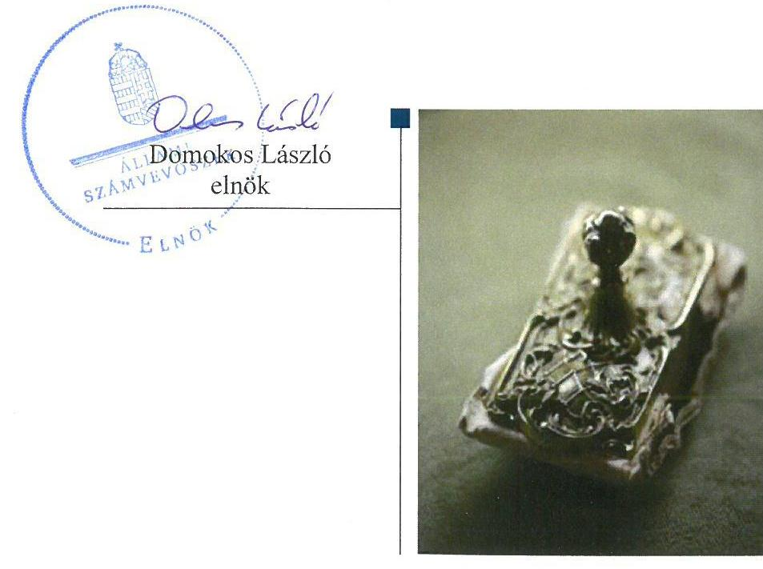
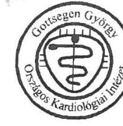
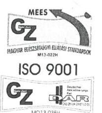
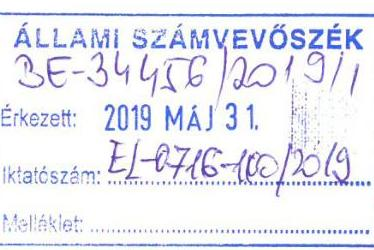
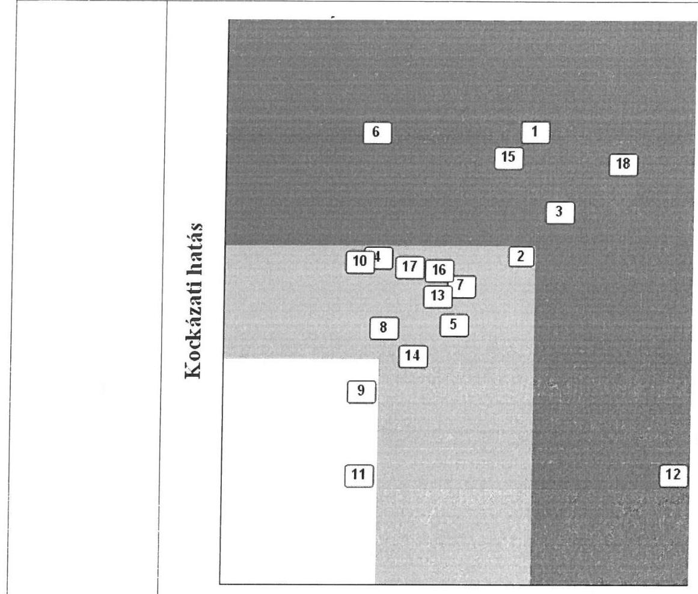
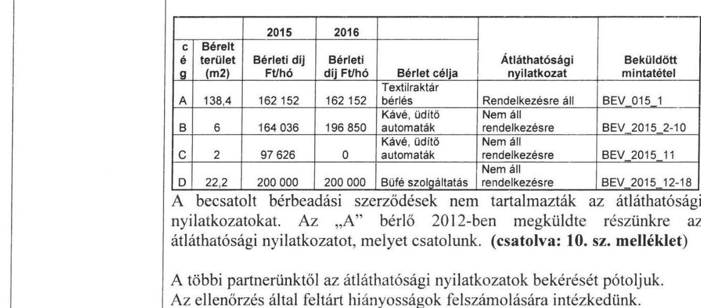
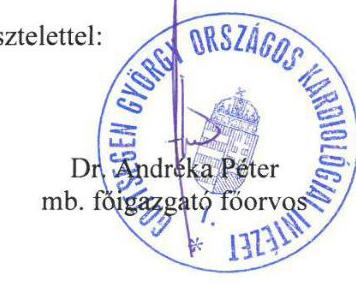
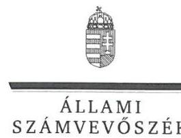
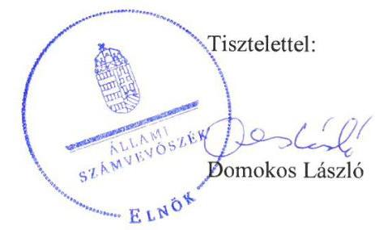

ÁLLAMI
SZÁMVEVŐSZÉK

# Jelentés 

## Központi költségvetési szervek ellenőrzése

Gottsegen György Országos Kardiológiai Intézet
2019.

---

# Jelentés 

## Központi költségvetési szervek ellenőrzése

Gottsegen György Országos Kardiológiai Intézet
2019. 07. hó 24. nap

---

|  | AZ ELLENŐRZÉST FELÜGYELTE: |
| :--: | :--: |
|  | DR. NAGY IMRE felügyeleti vezető |
|  | AZ ELLENŐRZÉST VEZETTE ÉS A VÉGREHAJTÁSÁÉRT FELELŐS: |
|  | DR. KOVÁCS DIÁNA ellenőrzésvezető |
|  | A PROGRAM ÖSSZEÁLLÍTÁSÁÉRT FELELŐS: |
|  | TÖTPÁL SZABOLCS osztályvezető |
|  | A TÉMÁHOZ KAPCSOLÓDÓ KORÁBBI SZÁMVEVŐSZÉKI JELENTÉSEK: |
|  | - címe: Jelentés a kórházi ellátás működtetésére fordított pénzeszközök felhasználásának ellenőrzéséről |
|  | - sorszáma: 13012 |
| Jelentéseink az Országgyűlés számítógépes hálózatán és az Interneten a www.asz.hu címen is olvashatóak. | - címe: Utóellenőrzések - A kórházi ellátás működtetésére fordított pénzeszközök felhasználásának ellenőrzéséről szóló jelentés utóellenőrzése |
|  | - sorszáma: 16127 |
|  | IKTATÓSZÁM: EL-1609-001/2019 |
|  | TÉMASZÁM: 2450 |
|  | ELLENŐRZÉS-AZONOSÍTÓ SZÁM: V079133 |

---

# TARTALOMJEGYZÉK 

■ ÖSSZEGZÉS ..... 5
■ AZ ELLENŐRZÉS CÉLJA ..... 7
■ AZ ELLENŐRZÉS TERÜLETE ..... 8
■ AZ ELLENŐRZÉS HÁTTERE, INDOKOLTSÁGA ..... 9
■ A JELENTÉS LÉNYEGES KÉRDÉSKÖREI ..... 10
■ AZ ELLENŐRZÉS HATÓKÖRE ÉS MÓDSZEREI ..... 11
■ MEGÁLLAPÍTÁSOK ..... 14
■ JAVASLATOK ..... 18
■ MELLÉKLETEK ..... 21
I. sz. melléklet: Értelmező szótár ..... 21
■ FÜGGELÉKEK ..... 25
I. sz. függelék a jelentéshez ..... 25
II. sz. függelék: Észrevételek ..... 26
■ RÖVIDÍTÉSEK JEGYZÉKE ..... 45

---

.

---

# ÖSSZEGZÉS 

A Gottsegen György Országos Kardiológiai Intézet a költségvetési fegyelemre vonatkozó törvényi előírásokat nem tartotta be. Belső kontrollrendszere nem biztosította a közpénzekkel való átlátható, és elszámoltatható gazdálkodás feltételeit. A pénzügyi- és vagyongazdálkodása nem volt szabályszerű. Az Intézet vezetője nem építette ki a korrupciós helyzetek megelőzésére szolgáló integritási kontrollokat.

## Az ellenőrzés társadalmi indokoltsága

Az Állami Számvevőszék ellenőrzi a költségvetési szervek gazdálkodását, működését, hogy megállapításaival támogassa az ellenőrzött szervezetek szabályszerű gazdálkodását, javaslataival elősegítse az Alaptörvényben ${ }^{1}$ megfogalmazott alapvetések érvényesülését a mindennapi életben a szervezetek szintjén. A központi költségvetés rendszerében zajló folyamatok holisztikus elemzései, a kockázatok folyamatos figyelemmel kísérésének módszerével, az így kiválasztott szervezetek célzott, hatékony ellenőrzéseivel az Állami Számvevőszék betölti a legfőbb gazdasági ellenőrző szerv küldetését. Az ellenőrzések megállapításaival és egy adott időszak ellenőrzési eredményeinek elemzésével az Állami Számvevőszék ráirányíthatja a jogalkotók figyelmét a központi alrendszerben vagy annak egy ágazatában esetlegesen felmerülő pénzügyi, szabályozási feszültségekre. Az elvégzett ellenőrzések során az Állami Számvevőszék „jó gyakorlatokat" is azonosíthat, melyeket tanácsadó funkciója keretében szélesebb körben is megismertethet az érintettekkel, ezáltal is hozzájárulva a költségvetési rendszer szabályozott, átlátható, kiegyensúlyozott és fenntartható működéséhez.

## Főbb megállapítások, következtetések, javaslatok

A Gottsegen György Országos Kardiológiai Intézet belső kontrollrendszere nem biztosította a közpénzekkel való átlátható, szabályszerű, gazdaságos, felelős gazdálkodást. A kockázatkezelési és az integrált kockázatkezelési rendszer működtetése nem volt szabályszerű. A Főigazgató nem mérte fel és nem állapította meg a tevékenységében rejlő és szervezeti célokkal összefüggő kockázatokat, valamint nem határozta meg az egyes kockázatokkal kapcsolatban szükséges intézkedéseket, valamint azok teljesítésének folyamatos nyomon követésének módját. A belső ellenőrzés működtetése nem volt szabályszerű 2017-ben. Az intézkedési tervek határidőben történő elkészítéséről nem gondoskodtak. A Főigazgató nem tájékoztatta az EMMI-t az Intézet belső kontrollrendszere minőségét értékelő nyilatkozatáról. Az Intézet a 2017. évben az integritás elvű működést támogató kontrollokat nem alakította ki.

Az Intézet pénzügyi gazdálkodása nem volt szabályszerű. A bevételek elszámolása során nem tartotta be az Intézet a jogszabályi előírásokat. Az Intézet a kiadási előirányzatok felhasználása során nem érvényesítette az átláthatósági követelményeket. Az Intézet a Számv. tv. előírása ellenére a kiadást nem támasztotta alá számviteli bizonylattal.

A költségvetési maradvány megállapítása során az Intézet nem tartotta be a jogszabályi előírásokat. A költségvetési maradvány kimutatása során a jogszabályi előírások ellenére a kötelező egyezőséget nem biztosította, a kötelezettségek egyenlege meghaladta a rendelkezésre álló forrásokat biztosító előirányzatok egyenlegét, tehát a szabad előirányzat mértékét meghaladóan vállalt kötelezettséget. Az Intézet a nem szabályszerű nyilvántartással nem biztosította az átláthatóságot a működésében.

Az Intézet vagyongazdálkodása nem volt szabályszerű. Az Intézet az állami vagyon hasznosítása és értékesítése során nem tartotta be a jogszabályi előírásokat, különös tekintettel az átláthatósági követelményekre.

A könyvelés, a kötelezettség nyilvántartása és a maradvány megállapítása területén feltárt szabálytalanságok miatt az Intézet beszámolója nem mutatott valós és megbízható képet az Intézet pénzügyi és vagyoni helyzetéről.

A bizonylat nélküli kifizetés és a gazdálkodási jogkörgyakorlás hiányosságai miatt az Intézet nem elszámoltatható, működése nem átlátható, és nem zárható ki, hogy az ellenőrzött szervezetnél vagyoni hátrány keletkezett.

---

Az irányító szervi feladatellátás az EMMI részéről, valamint a középirányítói feladatok ellátása az ÁEEK részéről szabályszerű volt.

---

# AZ ELLENŐRZÉS CÉLJA 

AZ ELLENŐRZÉS CÉLJA annak megállapítása volt, hogy a Gottsegen György Országos Kardiológiai Intézetre ${ }^{2}$ vonatkozó irányító szervi feladatellátás a jogszabályi előírások betartásával történt-e, az Intézet belső kontrollrendszere biztosította-e az átlátható, szabályszerű, gazdaságos, hatékony és eredményes gazdálkodás feltételeit, szabályszerű volt-e a beszámolási és adatszolgáltatási kötelezettségek teljesítése, valamint az, hogy az Intézet pénzügyi és vagyongazdálkodása megfelelt-e a jogszabályi előírásoknak és belső szabályzatainak. Az ellenőrzés keretében értékeltük, hogy az Intézetnél kiépítették és erősítették-e a korrupciós kockázatok kezelését szolgáló integritási kontrollokat, továbbá megteremtették-e a teljesítményellenőrzés feltételeit.

Az ellenőrzés célja volt továbbá annak értékelése, hogy az államháztartás központi alrendszerébe tartozó Intézet gazdálkodása elszámoltatható-e és megfelelt-e annak az Alaptörvényben meghatározott alapvetésnek, hogy Magyarország a kiegyensúlyozott, átlátható és fenntartható költségvetési gazdálkodás elvét érvényesíti. Érvényesült-e a nemzeti vagyon kezelésének és védelmének célja, azaz az Intézet vagyona a közérdeket szolgálja, a közös szükségletek kielégítése és a természeti erőforrások megóvása, valamint a jövő nemzedékek szükségleteinek figyelembevétele mellett.

---

# **AZ ELLENŐRZÉS TERÜLETE**

## **Gottsegen György Országos Kardiológiai Intézet**

Az Intézet az ellenőrzött időszakban önálló jogi személy volt, saját gazdasági szervezettel rendelkező állami egészségügyi intézmény, a költségvetési gazdálkodás rendje szerint működött.

Az ellenőrzött időszakban az Intézet irányító szerve az EMMI3 volt, a középirányítói jogokat a GYEMSZI4, majd 2015. március 1-jétől jogutódja, az ÁEEK5 gyakorolta. Az ÁEEK feladata a miniszter6 hatáskörébe nem tartozó fenntartói, valamint a 27/2015. (II.25.) Korm. rendeletben7 meghatározott irányítói jogok gyakorlása volt.

Az Intézet közfeladata a szív- és érrendszeri betegségek teljes spektrumának diagnosztikája, non-invazív és invazív terápiája az intervenciós kardiológia, az elektrofiziológia, a szívsebészet és szívtranszplantáció területén. A szív- és érrendszeri megbetegedések megelőzése, a kardiológiai megbetegedések monitorozása.

Az Intézetet az ellenőrzött időszakban a Főigazgató8 vezette, munkáját a gazdasági területen gazdasági-műszaki helyetteseként a Gazdasági igazgató9 támogatta. A Főigazgató és a Gazdasági igazgató személye 2017. december 1-jétől változott.

Az Intézet az ellenőrzött időszakban több mint 6 500 millió Ft mérleg szerinti vagyonnal gazdálkodott, az összes bevétele minden ellenőrzött évben meghaladta a 10 000 millió Ft összeget.

Az Intézet átlagos statisztikai állománya 2015-ben 580 fő, míg 2017-ben 575 fő volt.

---

# AZ ELLENŐRZÉS HÁTTERE, INDOKOLTSÁGA 

Az államháztartás központi alrendszerébe tartozó szervezet vagyona a nemzeti vagyon része, és az Alaptörvény is rögzíti, hogy a vagyonnal való gazdálkodás célja a közérdek szolgálata. Az ÁSZ ${ }^{10}$ ellenőrzi az éves költségvetési törvény végrehajtását, az ellenőrzés során feltárt kockázatok és a terület folyamatos kockázatelemzésével beazonosított kockázatok kezelése érdekében ráépülő ellenőrzésekkel ellenőrzi a költségvetési szervek gazdálkodását, működését, hogy az ellenőrzések megállapításaival támogassa az ellenőrzött szervezetek szabályszerű gazdálkodását, javaslataival elősegítse az Alaptörvényben megfogalmazott alapvetések érvényesülését a mindennapi életben a szervezetek szintjén.

A belső kontrollrendszer kialakítása és működtetése nélkül nem valósítható meg a közpénzek, a közvagyon átlátható, szabályos, gazdaságos, hatékony és eredményes felhasználása. A belső kontrollrendszer azt a célt szolgálja, hogy a költségvetési szervek működésük és gazdálkodásuk során a tevékenységeket szabályszerűen hajtsák végre, teljesítsék elszámolási kötelezettségeiket és megvédjék az erőforrásokat a veszteségektől, a károktól és a nem rendeltetésszerű használattól. A belső kontrollrendszer magában foglalja mindazon elveket, eljárásokat és belső szabályzatokat, melyek biztosítják, hogy a költségvetési szerv valamennyi tevékenysége és célja összhangban legyen a szabályszerűséggel, szabályozottsággal, valamint a gazdaságosság, hatékonyság és eredményesség követelményeivel, az eszközökkel és forrásokkal való gazdálkodásban ne kerüljön sor pazarlásra, visszaélésre, rendeltetésellenes felhasználásra. Megfelelő, pontos és naprakész információk álljanak rendelkezésre a költségvetési szerv működésével kapcsolatosan, és a belső kontrollrendszer harmonizációjára, összehangolására vonatkozó jogszabályok végrehajtásra kerüljenek. Az integritás kontrollok kiépítése, erősítése a szervezet korrupciós kockázatainak kezelését szolgálja. A teljesítménykövetelmények meghatározása és működtetése megalapozhatja a központi költségvetési szervnél a teljesítményellenőrzés lefolytatását.

---

# A JELENTÉS LÉNYEGES KÉRDÉSKÖREI 

1.     - Az irányító szerv Intézetre vonatkozó feladatellátása szabályszerű volt-e?
2.     - Az Intézet belső kontrollrendszerének kialakítása és működtetése szabályszerű volt-e, az biztosította-e a közpénzfelhasználás és az állami vagyonnal való gazdálkodás szabályosságát?
3.     - Az Intézet pénzügyi gazdálkodása szabályszerű volt-e?
4.     - A költségvetési maradvány megállapítása szabályszerűen történt-e?
5.     - Az Intézet vagyongazdálkodása szabályszerű volt-e?
6.     - Az Intézetnél alakítottak-e ki a teljesítmény mérésére alkalmas követelményeket?

---

# AZ ELLENŐRZÉS HATÓKÖRE ÉS MÓDSZEREI 

## Az ellenőrzés típusa

Megfelelőségi ellenőrzés.

## Az ellenőrzött időszak

2015. január 1. és 2018. június 30. közötti időszak.

## Az ellenőrzés tárgya

Az Intézetre vonatkozó irányító szervi feladatok ellátása a 2015-2016. években. Az Intézet belső kontrollrendszerének kialakítása és működtetése 2015-2017. években, valamint az integritás kontrollok kiépítettsége és a teljesítményellenőrzés feltételei a 2017. évben.

Az Intézet pénzügyi és vagyongazdálkodása a 2015-2016. években.
A 2017. évre vonatkozóan az Intézet vagyongazdálkodási feltételeinek kialakítása, annak szabályszerűsége, az elszámoltathatóság biztosítása a szabályozás szintjén. Az Intézetnél hozott vagyonváltozást eredményező döntések, a vagyonban bekövetkezett változások végrehajtásának, nyilvántartásba vételének, elszámolásának szabályszerűsége. Az állami vagyon kimutatásának szabályszerűsége, ennek keretében az állami vagyonnal történő rendelkezés, a vagyonmozgások, a vagyonnyilvántartásba vétele, értékelése és a mérleg alátámasztás szabályszerűsége. A költségvetési maradvány megállapításának szabályszerűsége 2017. év vonatkozásában.

## Az ellenőrzött szervezet

Gottsegen György Országos Kardiológiai Intézet, Emberi Erőforrások Minisztériuma mint irányító szerv, Állami Egészségügyi Ellátó Központ mint középirányító szerv.

## Az ellenőrzés jogalapja

Az ellenőrzés jogszabályi alapját az ÁSZ tv. ${ }^{11} 1 . \S$ (3) bekezdése, 5. § (2)-(3) bekezdései, (4) bekezdés a) pontja és (6) bekezdése, valamint az Áht. ${ }^{12} 61$. § (2) bekezdésében foglalt előírások adták.

---

# Az ellenőrzés módszerei 

Az ÁSZ az ellenőrzést az ellenőrzési program szempontjai, az ellenőrzött időszakban hatályos jogszabályok, az ellenőrzés szakmai szabályai, a jelen ellenőrzésre irányadó ÁSZ módszertanok figyelembevételével hajtotta végre.

Az ellenőrzési kérdések megválaszolásához szükséges bizonyítékok megszerzése az ellenőrzött által rendelkezésre bocsátott dokumentumokra, adatokra alapozva megfigyelés, szemle (szemrevételezés), kérdésfeltevés (információkérés), mintavételezés, valamint elemző eljárás útján történt. Az ellenőrzési bizonyítékként felhasználható adatforrások közé tartoztak az ellenőrzési program részletes szempontjainál felsorolt adatforrások, valamint minden egyéb - az
 ellenőrzés folyamán feltárt, az ellenőrzés szempontjából információt tartalmazó dokumentum.

Az ellenőrzés lefolytatásához az ellenőrzött szervezet tanúsítványok kitöltésével, valamint az ÁSZ által kért dokumentumok megküldésével szolgáltatott adatokat, amelyek valódiságát és teljes körűségét az ellenőrzött szervezet vezetője által tett teljességi és hitelességi nyilatkozat igazolta. A rendelkezésre bocsátott adatok, információk kontrollja az ellenőrzés keretében történt.

Az Intézet belső kontrollrendszere egyes pilléreinek kialakítására és működtetésére vonatkozó értékelés:
$\longrightarrow$ „szabályszerű", amennyiben az értékelt területen az elért „igen" válaszok százalékban kifejezett, egész számra kerekített aránya legalább $85 \%$,
$\longrightarrow$ „nem szabályszerű", ha nem éri el a $85 \%$-ot.
Az Intézet belső kontrollrendszerének összesített értékelése az egyes részterületek esetében kapott megfelelőségi arányok számtani átlaga alapján történt és megegyezik a pillérenként (kontrollterületenként) alkalmazott százalékos értékelésekkel, a következő eltérésekkel: a kontrollrendszer egésze esetében a „szabályszerű" értékelésnek a százalékos értéken felül további feltétele, hogy egyik kontrollterület sem kaphat „nem szabályszerű" értékelést.

A kiadások és a bevételek ellenőrzésére a 2015-2017. év vonatkozásában került sor. A külső személyi juttatások, felhalmozási kiadások, dologi kiadások és az értékesítésből és bérbeadásból származó bevételek esetében az ellenőrzés azokra a legnagyobb értékű tételekre - a lényeges sokaságra - terjedt ki, melyek összértéke elérte a teljes sokaság összértékének $50 \%$-át.

A bevételek és a 2015-2016. évi felhalmozási kiadások esetében a lényeges sokaságot tételesen ellenőriztük.

A kiadások elszámolásának szabályszerűségét a lényeges sokaságból véletlen mintavételi eljárással kiválasztott tételek alapján ellenőriztük.

A 2017. évi beruházások, felújítások végrehajtásának, a feladatellátást szolgáló állami vagyontárgyak felhasználásának és év végi értékelésének, valamint a pénzmozgáshoz nem kapcsolódó vagyonváltozásoknak a szabályszerűségét a teljes sokaságból véletlen mintavétellel kiválasztott tételek alapján ellenőriztük.

---

A 2017. évi év végi kifizetetlen szállítói tartozások tekintetében a kötelezettségvállalás, valamint annak nyilvántartásba vételének szabályszerűségét véletlen mintavétellel kiválasztott tételek alapján ellenőrizte az ÁSZ.

A mintavétellel ellenőrzött területek esetében minden egyes tétel vonatkozásában a felhasználás, elszámolás és értékelés szabályszerűségére vonatkozó kérdéseket tettünk fel. Szabályszerűnek értékeltünk egy ellenőrzött területet, amennyiben 95%-os bizonyossággal az ellenőrzött sokaságban az átlagos hibaarány legfeljebb 10%, nem szabályszerűnek, amennyiben 10%-nál magasabb arányt képviselt. Abban az esetben, ha az ellenőrzött sokaság tekintetében a 10%-os hibaarányhoz való viszony megítélésének megbízhatósága nem érte el a 95%-ot, annak elérése érdekében értékelésünket további szempontokkal egészítettük ki, és figyelembe vettük a feltárt hibák értékét.

Az ellenőrzés ideje alatt az ellenőrzött szervezettel történő kapcsolattartás az ÁSZ SZMSZ-ének vonatkozó előírásai alapján volt biztosított.

---

# 1. Az irányító szerv Intézetre vonatkozó feladatellátása szabályszerű volt-e? 

Összegző megállapítás

Az EMMI mint irányító szerv, valamint az ÁEEK mint középirányító szerv feladatellátása az Intézet vonatkozásában szabályszerű volt.

Az EMMI szabályszerűen járt el a tervezési követelmények meghatározásakor, az elemi költségvetés és a beszámoló összeállításához készült tájékoztató kiadásakor, az Intézet költségvetésének, valamint az éves beszámolójának jóváhagyásakor.

Az ÁEEK 2016-ban szabályszerűen jóváhagyta az Intézet SZMSZ-ét, továbbá az ellenőrzött időszakban elvégezte a középirányítói feladatait.

## 2. Az Intézet belső kontrollrendszerének kialakítása és működtetése szabályszerű volt-e, az biztosította-e a közpénzfelhasználás és az állami vagyonnal való gazdálkodás szabályosságát?

## Összegző megállapítás

Az Intézet belső kontrollrendszerének kialakítása és működtetése nem volt szabályszerű, az nem biztosította a közpénzfelhasználás és az állami vagyonnal való gazdálkodás szabályosságát.

A KONTROLLKÖRNYEZET keretében az Intézet az Áht. előírásai szerint rendelkezett Alapító Okirattal${ }^{13}$ és az Áht. és az Ávr.${ }^{14}$ szerinti SZMSZ${ }^{15}$-szel.

A gazdálkodás részletes rendjét az Intézet az Áht. előírásai szerint meghatározta. Az Intézet rendelkezett a Számv. tv.${ }^{16}$ előírásai szerint pénzügyi számviteli szabályozással${ }^{17}$.

Az Intézet Főigazgatója megsértette a Bkr.${ }^{18}$ 6. § (4) bekezdésében foglaltakat, mivel 2016. október 1-jétől nem szabályozta a szervezeti integritást sértő események kezelésének eljárásrendjét.

A KOCKÁZATKEZELÉSI RENDSZER működtetésének feltételeit az Intézet Főigazgatója meghatározta, de a Bkr. 7. § (1)-(2) bekezdéseiben foglaltakkal ellentétben nem működtette 2016. szeptember 30-ig az Intézet kockázatkezelési rendszerét, majd 2016. október 1-jétől integrált kockázatkezelési rendszerét.

---

A KONTROLLTEVÉKENYSÉGEK gyakorlásához az Intézet a gazdálkodási jogkörök gyakorlói aláírás-mintáiról vezette az Ávr. előírásai szerinti nyilvántartást. A kiadási előirányzatokhoz kapcsolódó gazdálkodási jogkörök gyakorlása szabályszerű volt 2015-2017. években.

# AZ INFORMÁCIÓS ÉS KOMMUNIKÁCIÓS RENDSZER keretében az Intézet az Ltv.${ }^{19}$ 10. § (1) bekezdés a) pontjában foglaltakat megsértve nem rendelkezett az illetékes közlevéltárral egyetértésben kiadott iratkezelési szabályzattal. 

A MONITORING RENDSZERT a Főigazgató az ellenőrzött időszakban a Bkr. előírása szerint kialakította. A Bkr. 6. § (2) bekezdésben előírtak ellenére a monitoring rendszer működtetése a kiadott szabályzatok alapján a kockázatkezelés tekintetében nem valósult meg.

A Főigazgató az Áht. előírásai szerint gondoskodott a belső ellenőrzés kialakításáról és függetlenségének biztosításáról. A belső ellenőrzés működtetése 2017. évben nem volt szabályszerű. Az Intézet a Bkr. 45. § (3) bekezdésében foglalt határidőnek nem tett eleget, mert a belső ellenőrzés javaslatainak végrehajtása érdekében az ellenőrzött szervek, szervezeti egységek vezetői a jelentés kézhezvételétől számított 8 (legfeljebb 30) napon belül nem készítettek intézkedési tervet.

A Főigazgató nyilatkozatban értékelte a költségvetési szerv belső kontrollrendszerének minőségét. A Főigazgató a nyilatkozatában azt rögzítette, hogy az ellenőrzött években a költségvetési szerv belső kontrollrendszerét kiépítette és működtette, amit a jelen ellenőrzés nem igazolt vissza.

A Főigazgató a Bkr. 11. § (2) bekezdésében foglaltak ellenére a Bkr. 1. melléklet szerinti nyilatkozatot az éves költségvetési beszámolóval együtt nem küldte meg az EMMI részére.

Az integritásirányítási rendszer kiépítése során a korrupciós kockázatokat mérséklő integritási kontrollokat az Intézet nem alakította ki.

## 3. Az Intézet pénzügyi gazdálkodása szabályszerű volt-e?

## Összegző megállapítás Az Intézet pénzügyi gazdálkodása nem volt szabályszerű.

A bevételek beszedése 2015-2016. években nem volt szabályszerű.
A kiadási előirányzatok felhasználása 2015. évben nem volt szabályszerű, 2016. évben szabályszerű volt.

A kiadási előirányzatok felhasználását az Intézet 2015. évben a Számv. tv. 165. § (1)-(2) bekezdésében foglaltak ellenére nem támasztotta alá bizonylattal.

A kiadási előirányzatok felhasználása során az Intézet által megkötött visszterhes szerződések nem tartalmazták az Ávr. 50. § (1a) bekezdésben foglaltak ellenére a szervezet képviselőjének nyilatkozatát arról, hogy a szerződő fél átlátható szervezetnek minősül.

---

# 4. A költségvetési maradvány megállapítása szabályszerűen történt-e? 

## Összegző megállapítás

### 4.1. számú megállapítás

### 4.2. számú megállapítás

A költségvetési maradvány megállapítása nem volt szabályszerű 2017. évben.

Az Intézet maradvány-kimutatása nem volt szabályszerű 2017-ben, a szabad előirányzat mértékét meghaladóan vállalt kötelezettséget.

Az Intézet az Áht. 36. § (1) bekezdését megsértve a szabad előirányzat mértékét meghaladóan vállalt kötelezettséget, továbbá az Áhsz.${ }^{20}$ 53. § (4) bekezdésében foglaltak ellenére az Áhsz. 17. mellékletében meghatározott kötelező egyezőségek vizsgálatát nem végezte el. Az Intézet nem biztosította az Áhsz. 17. melléklete 1. a) pontjában előírt kötelező egyezőség fennállását az éves költségvetési beszámolók összeállítása során, mert az előirányzatok nyilvántartására vezetett számlák egyenlegét meghaladta a költségvetési évben esedékes kötelezettségek nyilvántartására szolgáló számlák egyenlege.

A költségvetési maradvány összegét befolyásoló év végi kifizetetlen szállítói állomány keletkezése során az eljárásra vonatkozó jogszabályi előírásokat nem tartották be.

Az év végi kifizetetlen szállítói tartozások tekintetében a kötelezettségvállalás, teljesítésigazolás, valamint a nyilvántartásba vétel nem volt szabályszerű 2017-ben:
$\longrightarrow$ Az Áht. 37. § (1) bekezdésében foglaltak ellenére nem került sor kötelezettségvállalásra, valamint az Ávr. 57. § (1) bekezdése ellenére teljesítésigazolásra.
$\longrightarrow$ A kötelezettségvállalás nyilvántartásba vétele során nem tartották be az Áhsz. 14. melléklet II. 4. e)-h) pontjában foglalt, nyilvántartásra vonatkozó előírásokat.

## 5. Az Intézet vagyongazdálkodása szabályszerű volt-e?

## Összegző megállapítás

### 5.1. számú megállapítás

Az Intézet vagyongazdálkodása nem volt szabályszerű.

A vagyongazdálkodás feltételeinek kialakítása szabályszerű volt.
Az ellenőrzött időszakban az Intézet szabályszerűen rendelkezett az állami vagyon kezelésére vonatkozó Vagyonkezelési szerződéssel${ }^{21}$.

Az Áhsz. előírásai szerint történt a mérlegben kimutatott eszközök év végi értékelése, bekerülési értékének megállapítása, állományba vétele, az értékcsökkenés elszámolása az ellenőrzött időszakban.

Az Intézet a mérleg tételeinek alátámasztásához - a Számv. tv.-ben, az Áhsz.-ben, valamint a Leltározási szabályzatban foglaltaknak megfelelően - a leltárt összeállította.

---

# 5.2. számú megállapítás A vagyon hasznosítása és értékesítése nem volt szabályszerű. 

Az Intézet által az állami tulajdonú eszközökön végzett beruházás a Számv. tv. és az Áhsz. előírásai alapján szabályszerű volt.

Az Intézet a bérbeadási folyamat során nem rendelkezett az Nvtv.${ }^{22}$ 11.§ (10) bekezdésében, illetve a 3. § (2) bekezdésében foglaltak ellenére a szerződő fél nyilatkozatával arról, hogy az átlátható szervezetnek minősül.

Az Intézet a Vtv.${ }^{23}$ 24. § (1) bekezdésében foglaltak ellenére a bérleti szerződéseket versenyeztetés nélkül kötötte meg a bérlőivel. Az Intézet a bérleti díj megállapítása során a Számv. tv. 14. § (7) bekezdésében, valamint az Önköltségszámítási szabályzat${ }_{2}^{24}$ 14.6., illetve az Önköltségszámítási szabályzat${ }_{2}^{25}$ 9.6. pontjában előírtak ellenére a végzett szolgáltatások önköltségét nem állapította meg az utókalkuláció módszerével.

Az állami vagyonban változást eredményező döntések végrehajtása az értékesítés során az Intézet nem szabályszerűen járt el 2017-ben. Az Intézet nem tartotta be az Nvtv. 13. § (2) bekezdésben foglaltakat, mert az elidegenítés nem átlátható szervezet részére történt.

## 6. Az Intézetnél alakítottak-e ki a teljesítmény mérésére alkalmas követelményeket?

## Összegző megállapítás

Az Intézetnél a 2017. évben alakítottak ki teljesítmény mérésére szolgáló követelményeket.

Az Intézet rendelkezett teljesítmény mérésére szolgáló követelményekkel, de az adatok megbízhatóságának hiánya miatt a valós teljesítmény mérésének feltételei nem álltak fenn.

---

# JAVASLATOK 

Az ÁSZ tv. 33. § (1) bekezdésében foglaltak értelmében az ellenőrzött szervezet vezetője köteles a jelentésben foglalt megállapításokhoz kapcsolódó intézkedési tervet összeállítani és azt a jelentés kézhezvételétől számított 30 napon belül az ÁSZ részére megküldeni. Amennyiben az ellenőrzött szervezet vezetője nem küldi meg határidőben az intézkedési tervet, vagy továbbra sem elfogadható intézkedési tervet küld, az Állami Számvevőszék elnöke az ÁSZ tv. 33. § (3) bekezdése a) és b) pontjaiban foglaltakat érvényesítheti.

## Gottsegen György Országos Kardiológiai Intézet főigazgatója részére

1. Intézkedjen a szervezeti integritást sértő események kezelésének eljárásrendje szabályozásáról.
(2. sz. megállapítás 3. bekezdése alapján)
2. Intézkedjen az integrált kockázatkezelési rendszer működtetéséről.
(2. sz. megállapítás 4. bekezdés 1. mondat 2. és 3. mondatrész alapján)
3. Intézkedjen az iratkezelési szabályzat kiadásáról a jogszabályi előírásnak megfelelően.
(2. sz. megállapítás 6. bekezdése alapján)
4. Intézkedjen a belső kontrollrendszer minőségének értékeléséről szóló jogszabály szerinti nyilatkozat megküldéséről az irányító szerv részére a jogszabályi előírásnak megfelelően.
(2. sz. megállapítás 10. bekezdése alapján)
5. Intézkedjen, hogy a kiadási előirányzat felhasználását bizonylattal támasztsa alá a jogszabályi előírásnak megfelelően.
(3. sz. megállapítás 3. bekezdése 1. mondata alapján)
6. Intézkedjen, hogy az Ávr.-ben előírtak szerint rendelkezzen a szervezet képviselőjének nyilatkozatával arról, hogy átlátható szervezetnek minősülnek.
(3. sz. megállapítás 4. bekezdése alapján)

---

7. Intézkedjen, hogy kötelezettségvállalásra legfeljebb a jogszabályban előírt mértékig kerüljön sor.
(4.1. sz. megállapítás 1. bekezdés 1. mondat 1. tagmondata alapján)
8. Intézkedjen a jogszabályban előírt kötelező egyezőségek vizsgálatának elvégzéséről és gondoskodjon az egyezőség fennállásáról.
(4.1. sz. megállapítás 1. bekezdés 1. mondat 2. tagmondata és 2. mondata alapján)
9. Intézkedjen a kötelezettségvállalás és a
 teljesítésigazolás jogszabályi előírások szerinti elvégzéséről.
(4.2. sz. megállapítás 1. bekezdése 1. francia bekezdése alapján)
10. Intézkedjen arról, hogy a kötelezettségvállalás nyilvántartásba vétele során tartsák be a jogszabályi előírásokat.
(4.2. sz. megállapítás 1. bekezdése 2. francia bekezdése alapján)
11. Intézkedjen, hogy a bérbeadásra és értékesítésre vonatkozó szerződések megkötésekor rendelkezzen a szerződő felek nyilatkozatával arról, hogy átlátható szervezetnek minősülnek.
(5.2. sz. megállapítás 2. és 4. bekezdése alapján)
12. Intézkedjen arról, hogy a bérleti szerződések megkötése versenyeztetés útján kerüljön sor a jogszabályi előírásnak megfelelően.
(5.2. sz. megállapítás 3. bekezdés 1. mondata alapján)
13. Intézkedjen arról, hogy a bérleti díj megállapítása során a végzett szolgáltatások önköltségét utókalkuláció módszerével állapítsák meg a jogszabályi előírásnak megfelelően.
(5.2. sz. megállapítás 3. bekezdés 2. mondata alapján)

---

.

---

# MELLÉKLETEK 

- I. SZ. MELLÉKLET: ÉRTELMEZŐ SZÓTÁR
állami vagyon
állami vagyonnak minősül:
a) az állam tulajdonában lévő dolog, valamint a dolog módjára hasznosítható természeti erő,
b) az a) pont hatálya alá nem tartozó mindazon vagyon, amely vonatkozásában törvény az állam kizárólagos tulajdonjogát nevesíti,
c) az állam tulajdonában lévő tagsági jogviszonyt megtestesítő értékpapír, illetve az államot megillető egyéb társasági részesedés,
d) az államot megillető olyan immateriális, vagyoni értékkel rendelkező jogosultság, amelyet jogszabály vagyoni értékű jogként nevesít. (Forrás: Vtv. 1. § (2) bekezdése)
állami vagyon értékesítése
állami vagyon használója
állami vagyon használója
állami vagyon hasznosítása
állami vagyon hasznosítására kötött szerződés
állami vagyon kezelője /vagyonkezelő

ÁSZ Integritás Projekt

Állami vagyonnak minősül:
a) az állam tulajdonában lévő dolog, valamint a dolog módjára hasznosítható természeti erő,
b) az a) pont hatálya alá nem tartozó mindazon vagyon, amely vonatkozásában törvény az állam kizárólagos tulajdonjogát nevesíti,
c) az állam tulajdonában lévő tagsági jogviszonyt megtestesítő értékpapír, illetve az államot megillető egyéb társasági részesedés,
d) az államot megillető olyan immateriális, vagyoni értékkel rendelkező jogosultság, amelyet jogszabály vagyoni értékű jogként nevesít. (Forrás: Vtv. 1. § (2) bekezdése)
Állami vagyon tulajdonjogának bármely jogcímen történő, visszterhes átruházása. (Forrás: Vtvr. 1. § (7) bekezdés d) pontja)
Az a természetes vagy jogi személy, jogi személyiséggel nem rendelkező szervezet, aki, vagy amely törvény vagy szerződés alapján, bármely jogcímen (bérlet, haszonbérlet, használat stb.) állami vagyont birtokol, használ, szedi annak hasznát, hasznosít, ide nem értve a haszonélvezőt, a vagyonkezelőt és a tulajdonosi jogok gyakorlóját". (Forrás: Vtvr. 1. § (7) bekezdés a) pontja)
Az állami vagyont az MNV Zrt. maga kezeli, vagy szerződés - így különösen bérlet, haszonbérlet, megbízás - alapján központi költségvetési szervnek, természetes vagy jogi személynek, vagy jogi személyiséggel nem rendelkező gazdálkodó szervezetnek hasznosításra átengedi.
(Forrás: Vtv. 23. § (1) bekezdése, hatályos 2012. január 1-jétől)
Az állami vagyonnal a tulajdonosi joggyakorló maga gazdálkodik, vagy szerződés - így különösen bérlet, haszonbérlet, megbízás - alapján hasznosításra átengedi, illetőleg vagyonkezelésbe, haszonélvezetbe adja. (Forrás: Vtv. 23. § (1) bekezdése, hatályos 2013. június 28-ától)
Az állami vagyon hasznosítására kötött szerződések elsődleges célja az állami vagyon hatékony működtetése, állagának védelme, értékének megőrzése, illetve gyarapítása, az állami és közfeladatok ellátásának elősegítése. (Forrás: Vtv. 23. § (2) bekezdése)
Az állami vagyont az MNV Zrt. maga kezeli, vagy szerződés - így különösen bérlet, haszonbérlet, megbízás - alapján központi költségvetési szervnek, természetes vagy jogi személynek, vagy jogi személyiséggel nem rendelkező gazdálkodó szervezetnek hasznosításra átengedi." Az állami vagyonra vonatkozóan az MNV Zrt. kizárólag az Nvtv-ben meghatározott személyekkel köthet vagyonkezelési szerződést. (Forrás: Vtv. 27. § (1) bekezdése, hatályos 2012. január 1-jétől)

Az Állami Számvevőszék 2009-ben indította el a „Korrupciós kockázatok feltérképezése - Integritás alapú közigazgatási kultúra terjesztése" című, európai uniós forrásból megvalósított kiemelt projektjét (Integritás Projekt). Az Integritás Projekt célja, hogy felmérje a közszféra intézményei korrupciós kockázatoknak való kitettségét, illetőleg az azok mérséklésére hivatott kontrollok szintjét. Az Állami Számvevőszék a projekt révén az integritás szemlélet minél szélesebb körrel történő megismertetését, gyakorlatba ültetését kívánja elérni. Az integritás követelményeinek megfelelő szervezeti működést előnyben részesítő közigazgatási kultúra elterjesztését és a korrupció elleni fellépést az ÁSZ önmagára nézve is stratégiai jelentőségű célként fogalmazta meg. A projekt a felmérésben résztvevő intézmények számára helyzetükről egyfajta „tükörképet" mutat be, ami alapot teremt a jövőbeni pozitív irányú elmozduláshoz. (Forrás:

---

belső ellenőrzés
belső kontrollrendszer
belső kontrollrendszer területei
felújítás
hasznosítás
információs és kommunikációs rendszer
integritás
irányító szerv
kincstári költségvetés
kockázat
a http://integritas.asz.hu honlapon közzétett, a 2013. évi Integritás felmérés eredményeiről készült összefoglaló tanulmány)
Független, tárgyilagos bizonyosságot adó és tanácsadó tevékenység, amelynek célja, hogy az ellenőrzött szervezet működését fejlessze és eredményességét növelje, az ellenőrzött szervezet céljai elérése érdekében rendszerszemléletű megközelítéssel és módszeresen értékeli, illetve fejleszti az ellenőrzött szervezet irányítási és belső kontrollrendszerének hatékonyságát. (Forrás: Bkr. 2. § b) pontja)
A belső kontrollrendszer a kockázatok kezelése és tárgyilagos bizonyosság megszerzése érdekében kialakított folyamatrendszer, amely azt a célt szolgálja, hogy a működés és gazdálkodás során a tevékenységeket szabályszerűen, gazdaságosan, hatékonyan, eredményesen hajtsák végre, az elszámolási kötelezettségeket teljesítsék, megvédjék az erőforrásokat a veszteségektől, károktól és nem rendeltetésszerű használattól. (Forrás: Áht. 69. § (1) bekezdése)
A kontrollkörnyezet, a kockázatkezelési rendszer, a kontrolltevékenységek, az információs és kommunikációs rendszer, valamint a nyomon követési (monitoring) rendszer. (Forrás: Bkr. 3. §-a)
Az elhasználódott tárgyi eszköz eredeti állaga (kapacitása, pontossága) helyreállítását szolgáló időszakonként visszatérő olyan tevékenység, melynek során az eszköz élettartama megnövekszik, minősége, használata jelentősen javul, így a pótlólagos ráfordításból a jövőben gazdasági előnyök származnak. (Forrás: Számv. tv. 3. § (4) bekezdés 8. pontja)

A nemzeti vagyon birtoklásának, használatának, hasznok szedése jogának bármely - a tulajdonjog átruházását nem eredményező - jogcímen történő átengedése, ide nem értve a vagyonkezelésbe adást, valamint a haszonélvezeti jog alapítását. (Forrás: Nvtv. 3. § (1) bekezdés 4. pontja)

A költségvetési szerv vezetője által kialakított és működtetett olyan rendszer, mely biztosítja, hogy a megfelelő információk a megfelelő időben eljutnak az illetékes szervezethez, szervezeti egységhez, illetve személyhez. (Forrás: Bkr. 9. § (1) bekezdés)
Az integritás - egyik gyakran használt jelentése szerint - az elvek, értékek, cselekvések, módszerek, intézkedések konzisztenciáját jelenti, vagyis olyan magatartásmódot, amely meghatározott értékeknek megfelel. Integritás-irányítási rendszer bevezetése a szervezetben a szervezethez rendelt közfeladatok integritás szempontú ellátását, az érték alapú működéssel (integritással) összefüggő szervezeti követelmények következetes érvényesítését jelenti. (Forrás: Nemzetgazdasági Minisztérium: Államháztartási Belső Kontroll Standardok és Gyakorlati Útmutató 1.6. Etikai értékek és integritás 46. oldal, 2017. szeptember)
A költségvetési szerv tekintetében az Áht-ban meghatározott irányítási hatáskört gyakorló szerv. (Forrás: Áht. 1. § 9. pontja)
A központi költségvetésről szóló törvény elfogadását követően a fejezetet irányító szerv az államháztartás központi alrendszerébe tartozó költségvetési szerv és a fejezeti kezelésű előirányzat kiemelt előirányzatait, valamint az elkülönített állami pénzalapok és a társadalombiztosítás pénzügyi alapjai jogszabályi előírás szerinti bevételeit és kiadásait kincstári költségvetés kiadásával állapítja meg. (Forrás: Áht. 28. § (2) bekezdés)
A kockázat annak a valószínűségét jelenti, hogy egy vagy több esemény vagy intézkedés nem kívánt módon befolyásolja a rendszer működését, céljainak megvalósulását. (Forrás: Javaslatok a korrupciós kockázatok kezelésére - Kockázatkezelési és ellenőrzési módszertan 35. oldal, ÁSZ)

---

kockázatkezelési rendszer

integrált kockázatkezelési rendszer
kontrollkörnyezet
kontrolltevékenységek
kommunikáció
középirányító szerv
közfeladat
monitoring
monitoring-rendszer
vagyongazdálkodás

Olyan irányítási eszközök és módszerek összessége, melynek elemei a szervezeti célok elérését veszélyeztető tényezők (kockázatok) azonosítása, elemzése, csoportosítása, nyomon követése, valamint szükség esetén a kockázati kitettség mérséklése.(Forrás: Bkr. 2. § m) pontja)
Olyan folyamatalapú kockázatkezelési rendszer, amely a szervezet minden tevékenységére kiterjed, egységes módszertan és eljárások alkalmazásával, a szervezet célkitűzéseinek és értékeinek figyelembevételével biztosítja a szervezet kockázatainak teljes körű azonosítását, azok meghatározott kritériumok szerinti értékelését, valamint a kockázatok kezelésére vonatkozó intézkedési terv elkészítését és az abban foglaltak nyomon követését. (Forrás: Bkr. 2. § m) pontja, 2016. október 1-jétől)
A költségvetési szerv vezetője által kialakított olyan elvek, eljárások, belső szabályzatok összessége, amelyben világos a szervezeti struktúra, a folyamatok átláthatók, egyértelműek a felelősségi, hatásköri viszonyok és feladatok, meghatározottak, ismertek és elfogadottak az etikai elvárások a szervezet minden szintjén, átlátható a humán-erőforrás-kezelés. (Forrás: Bkr. 6. § (1) bekezdés)
A költségvetési szerv vezetője által a szervezeten belül kialakított (kontroll) tevékenységek, melyek biztosítják a kockázatok kezelését, hozzájárulnak a szervezet céljainak eléréséhez és erősítik a szervezet integritását. (Forrás: Bkr. 8. § (1) bekezdés)
Az a tevékenység, melynek során információ továbbítása valósul meg. A kommunikációs folyamat résztvevői között tájékoztatás történik, mely során tényeket, ezek magyarázatát közlik.
A költségvetési szerv tekintetében törvény vagy kormányrendelet alapján meghatározott, átruházott irányítási hatásköröket gyakorló szerv. (Forrás: Áht. 9. § (4) bekezdés)
Jogszabályban meghatározott állami vagy önkormányzati feladat, amit az arra kötelezett közérdekből, a jogszabályban meghatározott követelményeknek és feltételeknek megfelelve végez, ideértve a lakosság közszolgáltatásokkal való ellátását, továbbá az állam nemzetközi szerződésekben vállalt kötelezettségeiből adódó közérdekű feladatokat, valamint e feladatok ellátásakor szükséges infrastruktúra biztosítását is. (Forrás: Nvtv. 3. § (1) bekezdés 7. pontja)
A monitoring általánosságban a különböző szintű szervezeti célok megvalósításának folyamatát kíséri figyelemmel, melynek során a releváns eseményekről és tevékenységekről (együtt: folyamatokról) rendszeres jelleggel, strukturált, döntéstámogató információkhoz jutnak a szervezet vezetői. (Forrás: NGM Útmutató a költségvetési szervek monitoring rendszeréhez 2011. november)
A költségvetési szerv vezetője köteles kialakítani a szervezet tevékenységének a célok megvalósításának nyomon követését biztosító rendszert, amely az operatív tevékenységek keretében megvalósuló folyamatos és eseti nyomon követésből, valamint az operatív tevékenységektől függetlenül működő belső ellenőrzésből áll. (Forrás: Bkr. 10. §)

Aki a nemzeti vagyon felett az államot vagy a helyi önkormányzatot megillető tulajdonosi jogok és kötelezettségek összességének gyakorlására jogosult. (Forrás: Nvtv. 3. § (1) bekezdés 17. pontja)
A nemzeti vagyongazdálkodás feladata a nemzeti vagyon rendeltetésének megfelelő, az állam, az önkormányzat mindenkori teherbíró képességéhez igazodó, elsődlegesen a közfeladatok ellátásához és a mindenkori társadalmi szükségletek kielégítéséhez szükséges, egységes elveken alapuló, átlátható, hatékony és költségtakarékos működtetése, értékének megőrzése, állagának védelme, értéknövelő használata, hasznosítása, gyarapítása, továbbá az állam vagy a helyi önkormányzat feladatának ellátása szempontjából feleslegessé váló vagyontárgyak elidegenítése. (Forrás: Nvtv. 7. § (2) bekezdése)

---

.

---

# FÜGGELÉKEK 

- I. SZ. FÜGGELÉK A JELENTÉSHEZ

Az Állami Számvevőszék az ellenőrzések során feltárt tényekhez kapcsolódó további körülmények tisztázására eszközrendszerrel nem rendelkezik. Amennyiben az ellenőrzésen túlmutatóan indokoltnak látszik az ellenőrzés során feltárt körülmények további vizsgálata, az Állami Számvevőszék törvényi felhatalmazás alapján az ellenőrzés által feltárt körülményeket továbbítja a hatáskörrel rendelkező szervnek a szükséges intézkedések megtétele, eljárások lefolytatása érdekében.

1. Az ellenőrzés feltárta, hogy az Intézet a 2015. évben a külső személyi juttatás kiadás soron 7063 889,- Ft értékben nem támasztotta alá számviteli bizonylattal a kifizetést, megsértve ezzel a Számv. tv. 165. § (1)-(2) bekezdésében foglaltakat.
Így nem igazolta, hogy a hivatkozott kiadás az Intézet feladatellátását szolgálta, illetve hogy valós, megtörtént teljesítéshez kapcsolódott a kifizetés, ezért felvetődik, hogy az ellenőrzött szervezetnél vagyoni hátrány keletkezett.
2. A 2017. év végi, 2018-ban kifizetett szállítói tartozások tekintetében az Ávr. 57. § (1) bekezdés ellenére nem történt teljesítésigazolás összesen 265 367,- Ft értékben.
A gazdálkodási jogkörgyakorlás szabályainak megsértése miatt nem igazolt, hogy a kifizetések a Kórház
 feladatellátását szolgálták, illetve, hogy azok valós teljesítményekhez kapcsolódtak, felvetődik, hogy az Intézetet vagyoni hátrány érte.

Az 1. és 2. pontokban feltárt esetek konkrét körülményeinek felderítésére az ügyészség rendelkezik hatáskörrel.

---

A jelentéstervezetet a Számvevőszék 15 napos észrevételezésre megküldte az ellenőrzött szervezetek vezetőinek az ÁSZ tv. 29. § (1) bekezdése előírásának megfelelően.

Az Emberi Erőforrások Minisztériumának minisztere és az Állami Egészségügyi Ellátó Központ főigazgatója a jelentéstervezet megállapításaira nem kívántak észrevételt tenni.
A Gottsegen György Kardiológiai Intézet főigazgatója élt az ÁSZ tv. 29. § (2) bekezdésében foglalt észrevételezési jogával és a törvényes határidőn belül írásban észrevételt tett. Az ÁSZ tv. 29. § (3) bekezdésével összhangban az ÁSZ a Függelékben feltünteti az ellenőrzés megállapításaival kapcsolatban tett, figyelembe nem vett észrevételeket, és megindokolja, hogy azokat miért nem fogadta el.

[^0]
[^0]:    * 29. § (1) Az Állami Számvevőszék az ellenőrzési megállapításait megküldi az ellenőrzött szervezet vezetőjének vagy az általa megbízott személynek, és annak, akinek személyes felelősségét állapította meg.
    (2) Az ellenőrzött szervezet vezetője és a felelősként megjelölt személy az ellenőrzés megállapításaira tizenöt napon belül írásban észrevételt tehet.
    (3) Az Állami Számvevőszék az észrevételre a beérkezésétől számított harminc napon belül írásban válaszol. A figyelembe nem vett észrevételeket köteles a jelentésben feltüntetni, és megindokolni, hogy azokat miért nem fogadta el.

---

# Gottsegen György Országos Kardiológiai Intézet

1096 Budapest. Haller u. 29. Főigazgatóság M. főigazgató főorvos: Dr. Andréka Péter, PhD, egyetemi magántanár Telefon: +36-1-215-2139 Fax: +36-1-215-7067 E-mail: titkarsag@kardio.hu

**Állami Számvevőszék**

1052 Budapest, Apáczai Csere János utca 10.

**Domokos László elnök úr részére**

Tisztelt Elnök Úr!

Ikt.sz.: 26-6/2019. Hív. sz.: EL-0716-096/2019 Tárgy: Észrevételek ÁSZ jelentéstervezetre Mellékletek: - 1-11 sz. mellékletek - 26-7/2019 ikt.sz. Teljességi nyilatkozat melléklettel

Köszönettel megkaptuk az Állami Számvevőszék 2019. május 17-én érkezett, EL-0716-096/2019. iktatószámú levelét és a mellékletként csatolt EL-0716-095/2019 iktatószámú, V079133 ellenőrzés-azonosítószámú Jelentéstervezetet a „Központi Költségvetési szervek ellenőrzése – Gottsegen György Országos Kardiológiai Intézet” címmel.

Mint ahogyan azt a Jelentéstervezet is tartalmazza (8. oldal „Az ellenőrzés területe” fejezet) az Intézetben a főigazgató és a gazdasági igazgató személye 2017. december 1-től megváltozott, az ellenőrzött 2015. január 1. és 2018. június 30. közötti időszak javarészt más vezetők irányítása alá tartozott. Az Intézetben korábban is felelős gazdálkodás folyt és jelenleg is folyik.

Hivatkozva a fenti levélben foglaltakra, mely szerint az ÁSZ tv. 29. § (2) bekezdése értelmében tizenöt napon belül észrevételt tehetünk, a Jelentéstervezet Megállapítások, valamint a Függelékek fejezetében rögzítettekre az alábbiakban részletezett észrevételeket tesszük. Kérjük a Tisztelt Állami Számvevőszéket, hogy a végleges jelentésben és az Intézet főigazgatója részére előírt intézkedések meghatározásában szíveskedjen figyelembe venni ezeket.

|  Sorszám | 2.  |
| --- | --- |
|  Vizsgált időszak | 2015-2017.  |
|  Ellenőrzés tárgya | Az Intézet belső kontrollrendszerének kialakítása és működtetése szabályszerű volt-e, az biztosította-e a közpénzfelhasználás és az állami vagyonnal való gazdálkodás szabályosságát?  |
|  Ellenőrzés megállapítása | A főigazgató nem szabályozta 2016. október 1-jétől a szervezeti integritást sértő események kezelésének eljárásrendjét. (14. oldal) Az integritásirányítási rendszer kiépítése során a korrupciós kockázatokat mérséklő integritási kontrollokat az Intézet nem alakította ki.(15. oldal)  |

---

| Észrevétel | A Bkr. az integritást sértő események fogalmát 2016. október 1-től alkalmazza, utóbbi időszakot megelőzően, a költségvetési szerveknek a Bkr. 6. § (4) bekezdésének megfelelően - a belső kontrollrendszer részeként - kötelezően a szabálytalanságok kezelésének eljárásrendjét volt szükséges kialakítani/szabályozni, illetőleg a gyakorlatban működtetni.   Az Intézet tárgybeli szabályzatát 2014.09.30-án léptette hatályba Szabálytalanságok Kezelésének Eljárási Rendje címmel (a szabályzat feltöltve az EL-0716-014/2018. ikt. számú ÁSZ ellenőrzéshez 2.01.20.1. számon), amelyet 2018.05.01. hatállyal a „Szervezeti integritást sértő események kezelésének eljárási rendje" váltott fel (csatolva:1.sz. melléklet), összhangban az intézeti belső kontrollrendszer és ennek keretében az intézeti kontrollkörnyezet fejlesztésére irányuló szervezeti erőfeszítésekkel és célkitűzésekkel.   A hatályos szabályzatokat, eljárásrendeket a Bkr. 5. § (1) bekezdésének megfelelően az államháztartásért felelős miniszter által közzétett módszertani útmutatók figyelembevételével állítottuk össze. Utóbbiaknak megfelelően az eljárásrendbe beépítésre kerültek a tárgyban releváns 2018. évben is érvényes - módszertani útmutatók előírásai/ajánlásai. |
| :--: | :--: |
|  | A Szabálytalanságok Kezelésének Eljárási Rendje kialakítása során teljes körűen érvényesítésre kerültek az intézeti kontrollkörnyezet kialakítására irányadó Bkr. 6. § (1) rendelkezései, mely szerint többek között a költségvetési szerv vezetője köteles olyan kontrollkörnyezetet kialakítani, amelyben világos a szervezeti struktúra, és egyértelműek a felelősségi, hatásköri viszonyok és feladatok. Fentieknek megfelelően, túl azon, hogy pontosan meghatározásra kerültek a szabálytalanságok intézeti kezelésével összefüggő szervezeti vezetői/szervezeti egység szintű kompetencia és felelősségi viszonyok, ügyviteli utasításban kijelölésre került a szabálytalanságok kezelésének intézeti koordinátora, mely személy feladata többek között - a szabálytalanságok súlyától függően - a tevékenységgel összefüggő nyilvántartások vezetése volt. |
|  | A belső kontrollkörnyezeti dokumentumok között, az Eütv. rendelkezésének (29. § (3)) megfelelően az Intézet rendelkezett Panaszkezelési szabályzattal (Nem megfelelő tevékenységek kezelése) is (feltöltve az EL-0716-014/2018. ikt.sz. ÁSZ ellenőrzéshez 2.04.5.2. számon), amely dokumentum 2016.06.15-én lépett hatályba. Az említett szabályzat a felelősök és a konkrét határidők rögzítése mellett határozza meg a nem megfelelő tevékenységek kezelésének intézeti rendjét. |
|  | A jelenleg hatályos Szervezeti integritást sértő események kezelésének eljárási rendje tartalmazza a Bkr. 6. § (4a) bekezdésében meghatározottakat, úgy mint:   a) a bejelentett kockázatok és események előzetes értékelésének módszertanát,   b) a bejelentés kivizsgálásához szükséges információk összegyűjtésének módját,   c) az érintettek meghallgatásának eljárási szabályait,   d) a vonatkozó dokumentumok átvizsgálásának szabályait,   e) a szervezeti integritást sértő események elhárításához szükséges intézkedéseket,   f) az alkalmazható jogkövetkezményeket, |

---

|  | g) a bejelentő szervezeten belüli védelmére, illetve elismerésére, valamint a vizsgálat eredményéről való tájékoztatására vonatkozó szabályokat és   h) a szervezeti integritást sértő események bekövetkezésének megelőzésére kialakított eljárási szabályokat.   A Szabályzat kialakítása során teljes körűen érvényesítésre kerültek az intézeti kontrollkörnyezet kialakítására irányadó Bkr. 6. § (1) rendelkezései, mely szerint többek között a költségvetési szerv vezetője köteles olyan kontrollkörnyezetet kialakítani, amelyben világos a szervezeti struktúra, és egyértelműek a felelősségi, hatásköri viszonyok és feladatok. Fentieknek megfelelően, túl azon, hogy pontosan meghatározásra kerültek az intézeti integritást sértő események kezelésével összefüggő szervezeti vezetői/szervezeti egység szintű kompetencia és felelősségi viszonyok, a Szabályzatban kijelölésre került az intézeti integritást sértő események kezelésének intézeti koordinátora.   Az Intézet belső kontroll és integritás felelőse, ennek megfelelően a szabálytalanság, szervezeti integritást sértő események kezelésének felelőse a szervezési és minőségirányítási (kontrolling) igazgató. Feladata a szabálytalanságok, szervezeti integritást sértő eseményekkel kapcsolatos bejelentések fogadása, mérlegelése, a szabályzatban meghatározott szabálytalansági és szervezeti integritást sértő esemény kezelését célzó eljárás megindítására javaslattétel, továbbá a jelen szabályzatban meghatározott egyéb feladatok ellátása.   Az ÁSZ ellenőrzés időszakában egy integritást sértő eseménnyel kapcsolatban sem volt szükség eljárás lefolytatására.   Fentiek alapján az integritáshoz kapcsolódó intézeti belső kontrollkörnyezet kialakítása jogszabályi előírásokkal összhangban és azok figyelembevételével történt meg, támaszkodva a módszertani útmutatókban megfogalmazottakra. A főigazgató 2016. október 1-jétől szabályozta a szervezeti integritást sértő események kezelésének eljárásrendjét és az integritásirányítási rendszer kiépítése során a korrupciós kockázatokat mérséklő integritási kontrollokat az Intézet kialakította. |
| :--: | :--: |

| Sorszám | 2. |
| :--: | :--: |
| Vizsgált időszak | 2015-2017. |
| Ellenőrzés tárgya | Az Intézet belső kontrollrendszerének kialakítása és működtetése szabályszerű volt-e, az biztosította-e a közpénzfelhasználás és az állami vagyonnal való gazdálkodás szabályosságát? |
| Ellenőrzés megállapítása | A főigazgató nem működtette 2016. szeptember 30-ig az Intézet kockázatkezelési rendszerét, majd 2016. október 1-jétől integrált kockázatkezelési rendszerét. |
| Észrevétel | A vizsgált időszakban az integrált kockázatkezelési rendszer működtetéséről az ÁSZ adatbekérőjében megnevezett "Kockázatkezeléssel kapcsolatos dokumentumok" és "Éves korrupciós kockázatok felmérését tartalmazó dokumentumok" igazolásához az Intézet a Kockázatkezelési Szabályzatot töltötte fel, mert a bekért igazolások a szabályzatban, a szabályzat mellékleteiben szerepelnek. Hivatkozás: |

---

GOKI teljességi nyilatkozata (EL-0716-014/2018 ikt. sz. ÁSZ ellenőrzéshez beküldött dokumentumok):
2.02.1. Kockázatkezelési szabályzat: Kockázatkezelési szabályzat
2.02.2. Kockázatkezeléssel kapcsolatos dokumentumok: Kockázatkezelési szabályzat
2.02.4. Éves korrupciós kockázatok felmérését tartalmazó dokumentumok: Kockázatkezelési szabályzat. Az Intézet a kockázatkezeléssel, korrupciós kockázatokkal kapcsolatos dokumentumokat az intézmény dolgozói számára előírt folyamatos tájékoztatási kötelezettség teljesítése érdekében, rendhagyó módon a Kockázatkezelési szabályzatában szereplő kockázatnyilvántartással és intézményi kockázatkezelési tervvel, korrupciós kockázatok fejezettel közzéteszi, a vizsgált kockázatkezeléssel kapcsolatos dokumentumok a megküldött belső szabályzatban szerepeltek.

A 2017. évi integrált kockázatkezelési rendszer működtetésének/eredményének szemléltetése a szabályzatban foglaltak szerint, csak példaszerűen, a jelzett évet kiemelve, (az előtte és az utána következő években is ezen eljárást követte az Intézet), dokumentáltan bemutatható módon:

Kockázat kezelési mátrix:

---

Kockázati valószínűség

Kockázati kategória meghatározása:

| Tevékenység megnevezése | Kockázati tevékenység sorszáma | A kockázat hatásának átlagos értéke | A kockázat valószínűségének átlagos értéke | Kockázat kategóriája |
| :--: | :--: | :--: | :--: | :--: |
| Infrastrukturális | 1 | 4,0 | 2,0 | magas   kockázat |
| Gazdasági | 2 | 3,0 | 2,0 | közepes   kockázat |
| $\begin{array}{ll} \text { Jogi } & \text { és } \\ \text { szabályozási } & 3 \end{array}$ | 3 | 3,4 | 3,4 | magas   kockázat |
| Politikai | 4 | 3,0 | 1,0 | közepes   kockázat |
| Piaci | 5 | 2,3 | 2,3 | közepes   kockázat |
| Elemi csapások | 6 | 4,0 | 1,0 | magas   kockázat |
| Költségvetési | 7 | 2,7 | 2,7 | közepes   kockázat |

---

|  | Pénzügyi elszámolási | 8 | 2,3 | 2,3 | közepes kockázat |
| :--: | :--: | :--: | :--: | :--: | :--: |
|  | Csalás vagy lopás | 9 | 1,7 | 1,7 | alacsony kockázat |
|  | Biztosítási | 10 | 3,0 | 3,0 | közepes kockázat |
|  | Felelősségvállalás | 11 | 1,0 | 1,0 | alacsony kockázat |
|  | Működés-   stratégiai | 12 | 1,0 | 3,0 | magas kockázat |
|  | Működési | 13 | 2,5 | 2,5 | közepes kockázat |
|  | Információs | 14 | 2,1 | 2,1 | közepes kockázat |
|  | Technológiai | 15 | 3,8 | 3,8 | magas kockázat |
|  | Személyzeti | 16 | 2,7 | 2,7 | közepes kockázat |
|  | Egészség és biztosági | 17 | 2,8 | 2,8 | közepes kockázat |
|  | Finanszírozási | 18 | 3,75 | 2,5 | magas kockázat |

Intézeti kockázati rangsor:

| Kockázati

 rangsor | Kockázat kategorizálása | Területség megnevezése | Átlagos kockázati érték |
| :--: | :--: | :--: | :--: |
| 1 | magas kockázat | Technológiai | 14,7 |
| 2 |  | Jogi és szabályozási | 11,5 |
| 3 |  | Finanszírozási | 9,4 |
| 4 |  | Infrastrukturális | 8,0 |
| 5 |  | Elemi csapások | 4,0 |
| 6 |  | Működés-stratégiai | 3,0 |
| 7 | közepes kockázat | Biztosítási | 9,0 |
| 8 |  | Egészség és biztonsági | 7,8 |
| 9 |  | Köllőcsövgatal | 7,4 |
| 10 |  | Személyzeti | 7,2 |
| 11 |  | Működési | 6,3 |
| 12 |  | Gazdasági | 6,0 |
| 13 |  | Pénzügyi | 5,4 |
| 14 |  | Pénzügyi elszámolási | 5,1 |
| 15 |  | Információs | 4,4 |
| 16 |  | Politikai | 3,0 |
| 17 | alacsony kockázat | Csalás vagy lopás | 2,8 |
| 18 |  | Felelősségvállalás | 1,0 |

---

| Sorszám | 2. |
| :--: | :--: |
| Vizsgált időszak | 2015-2017. |
| Ellenőrzés tárgya | Az Intézet belső kontrollrendszerének kialakítása és működtetése szabályszerű volt-e, az biztosította-e a közpénzfelhasználás és az állami vagyonnal való gazdálkodás szabályosságát? |
| Ellenőrzés megállapítása | Az információ és kommunikációs rendszer keretében az Intézet az Ltv. 10. § (1) bekezdés a) pontjában foglaltakat megsértve nem rendelkezett az illetékes közlevéltárral egyetértésben kiadott iratkezelési szabályzattal. |
| Észrevétel | Az 0716-014/2018. ikt. számú ÁSZ ellenőrzéshez a 2.04.8.1 számon a 2011.01.01-től hatályos Iratkezelési szabályzatunkat, az EL-0716-040/2018. ikt. számú ÁSZ ellenőrzéshez az 1.32. és a 4.1.1. számokon a 2017.01.01-től hatályos Iratkezelési szabályzatunkat csatoltuk, illetve feltöltöttük. Mindkét szabályzat az ellenőrzés időszakában rendelkezett az illetékes közlevéltári egyetértéssel, jóváhagyással, melyeket csatoltan megküldünk (csatolva: 2.sz. melléklet, 3.sz. melléklet). |

| Sorszám | 2. |
| :--: | :--: |
| Vizsgált időszak | 2017. |
| Ellenőrzés tárgya | Az Intézet belső kontrollrendszerének kialakítása és működtetése szabályszerű volt-e, az biztosította-e a közpénzfelhasználás és az állami vagyonnal való gazdálkodás szabályosságát? |
| Ellenőrzés megállapítása | A belső ellenőrzés működtetése 2017. évben nem volt szabályszerű. Az Intézet a Bkr. 45. § (3) bekezdésben foglalt határidőnek nem tett eleget, mert a belső ellenőrzés javaslatainak végrehajtása érdekében az ellenőrzött szervek, szervezeti egységek vezetői a jelentés kézhezvételétől számított 8 (legfeljebb 30) napon belül nem készítettek intézkedési tervet. |
| Észrevétel | 2017. évben hét ellenőrzésre került sor (az EL-0716-040/2018 ikt. számú ÁSZ adatbekérésre beküldött „5.13.1. GOKI_éves belső ellenőrzési jelentés_2017.pdf" dokumentumban részletezettek szerint), melyek eredményeként született belső ellenőri jelentésekben négy javaslat került megfogalmazásra, de az alábbiakban leírtak alapján csak egy esetben kellett intézkedési terv készítését elrendelni.   A munkavédelmi tevékenységhez kapcsolódó vizsgálat során javaslatként megfogalmazódott a Munkavédelmi szabályzat aktualizálása, de mivel az intézet a szabályzatát már a vizsgálat időszakában aktualizálta, ezért intézkedési terv készítése és elrendelése nem volt szükséges. Ezt tartalmazta a beküldött 5.13.1. Belső ell kapcs int nyilv_2017.xls táblázat 1. sor 16. oszlopa is.   Az integritásra vonatkozó kontrollkörnyezet vizsgálata során javaslatként megfogalmazásra került a szabályozási környezet továbbfejlesztése, ugyanakkor az is megállapítást nyert, hogy ez végrehajtható a szabályzatok rendszeres felülvizsgálata során. Ezt tartalmazta a beküldött 5.13.1. Belső ell kapcs int nyilv_2017.xls táblázat 2. sor 16. oszlopa is.   A közzétételre vonatkozó belső ellenőri jelentésben megfogalmazásra került javaslatokra határidőben elkészült a két intézkedést tartalmazó terv, mely már a jelentéstervezet egyeztetése során kiadásra került. Ezt tartalmazta a beküldött 5.13.1. Belső ell kapcs int nyilv_2017.xls táblázat 3. és 4. sor 7. oszlopa is.   A többi négy ellenőrzés tekintetében nem merült fel intézkedésre okot adó körülmény. |

---

| Sorszám | 2. |
| :--: | :--: |
| Vizsgált időszak | 2015-2017. |
| Ellenőrzés tárgya | Az Intézet belső kontrollrendszerének kialakítása és működtetése szabályszerű volt-e, az biztosította-e a közpénzfelhasználás és az állami vagyonnal való gazdálkodás szabályosságát? |
| Ellenőrzés megállapítása | A Főigazgató a Bkr. 11. § (2) bekezdésében foglaltak ellenére a Bkr. 1. melléklet szerinti nyilatkozatot az éves költségvetési beszámolóval együtt nem küldte meg az EMMI részére. |
| Észrevétel | A Bkr. 1. sz. melléklete szerinti Nyilatkozatot minden évben elkészítjük, és azt az Állami Egészségügyi Ellátó Központon keresztül az EMMI részére megküldjük. A 2015. és 2016. évi Nyilatkozatokat önállóan az EL-0716014/2018. ikt. számú ÁSZ ellenőrzéshez a 2.06.12.1 és 2.06.12.2 sorszámon beküldtük, illetve feltöltöttük. A 2015. és 2016. évi beszámolókat mellékletek nélkül töltöttük fel az ÁSZ ellenőrzési dokumentumok közé, de a beszámoló megküldésének igazolásához feltöltött levél tartalmazza a mellékletekre való hivatkozást, ezzel igazolt, hogy azok beküldésre kerültek.   Csatoltan megküldjük a 2015. és 2016. évi költségvetési beszámolók mellékletekkel kiegészített dokumentumait (csatolva: 4.sz. melléklet, 5.sz. melléklet), melyek az ellenőrzés időszakában is megvoltak. Kérjük, szíveskedjenek a csatolt dokumentumokat figyelembe venni.   A 2017. évi költségvetési beszámolót a Bkr. 1. számú mellékletével együtt az EL-0716-057/2018 ikt. számú ÁSZ ellenőrzéshez a 2.03 számon küldtük meg. |
| Sorszám | 3. |
| Vizsgált időszak | 2015-2016. |
| Ellenőrzés tárgya | Az Intézet pénzügyi gazdálkodása szabályszerű volt-e? |
| Ellenőrzés megállapítása | A bevételek beszedése 2015-2016. években nem volt szabályszerű. |
| Észrevétel | A jelentéstervezet nem tartalmazza, hogy a megállapítás min alapszik. A 2015. és 2016. évek bevételei közül a bérleti díjak beszedésével kapcsolatos számlákat és szerződéseket kérte be az Állami Számvevőszék, melyekkel kapcsolatos megállapításokra tett észrevételeinket az 5.2. pontban részletezzük. |
| Sorszám | 3. |
| Vizsgált időszak | 2015-2016. |
| Ellenőrzés tárgya | Az Intézet pénzügyi gazdálkodása szabályszerű volt-e? |
| Ellenőrzés megállapítása | A kiadási előirányzatok felhasználása 2015. évben nem szabályszerű, 2016. évben szabályszerű volt.   A kiadási előirányzatok felhasználását az Intézet 2015. évben a Számv. tv. 165. § (1)-(2) bekezdésében foglaltak ellenére nem támasztotta alá bizonylattal.   I.sz. függelék 1. pont: Az ellenőrzés feltárta, hogy az Intézet a 2015. évben a külső személyi juttatás kiadás soron 7 063 889,- Ft értékben nem támasztotta alá számviteli bizonylattal a kifizetést. |
| Észrevétel | Az EL-0716-053/2018. ikt. számú ÁSZ adatbekérő tartalmazta a Kiadások szabályszerűségének ellenőrzéséhez kiválasztott mintatételek felsorolását. A 2015. évi kiadások ellenőrzéséhez bekért mintatételek között üzemeltetési anyagok beszerzésével, egyéb szolgáltatásokkal, szakmai |

---

|  | anyagok beszerzésével, bérlet és lízing díjakkal, valamint egyéb tárgyi eszközök beszerzésével kapcsolatos számlák és késedelmi kamat tételek lettek kijelölve. (csatolva: 6.sz. melléklet). A szállító számlák között a 402 rekszámon egy nem beazonosítható tétel szerepelt, melyet az aláírt és az ÁSZ részére megküldött Teljességi és hitelességi nyilatkozatban jeleztünk: 10. oldal első tétel „3.7.1.26 Mintatétel kiadások 2015. év_402 A 402 rekszámon kért mintatétel nem beazonosítható" (csatolva: 7. sz. melléklet). A jelen Számvevőszéki jelentéstervezetből derült ki számunkra, hogy a 2015. évi mintatételek között a 402. rekszámon egy személyes adatokat is tartalmazó külső személyi juttatások egyik tétele lett kijelölve. Természetesen az adott személyi juttatás minden alapbizonylata, kifizetési bizonylata szabályszerűen rendelkezésünkre állt az ellenőrzés időszakában is, de ezt a tételt az adatszolgáltatásunk során fentiek miatt nem tudtuk beazonosítani. Csatoltan megküldjük a mintatételhez tartozó bizonylatokat. (csatolva: 8.sz. melléklet) A beküldött dokumentumok igazolják, hogy a hivatkozott kiadás az Intézet feladatellátását szolgálta, illetve hogy valós, megtörtént teljesítéshez kapcsolódott a kifizetés, ezért fel sem vetődhet, hogy az ellenőrzött szervezetnél vagyoni hátrány keletkezett, amiatt, hogy számviteli bizonylat nélkül történt volna kifizetés. Kérjük, hogy a jelen észrevételek között beküldött bizonylatokat szíveskedjenek figyelembe venni a végleges jelentésben. |
| :--: | :--: |
| Sorszám | 3. |
| Vizsgált időszak | 2015-2016. |
| Ellenőrzés tárgya | Az Intézet pénzügyi gazdálkodása szabályszerű volt-e? |
| Ellenőrzés megállapítása | A kiadási előirányzatok felhasználása során az Intézet által megkötött visszterhes szerződések nem tartalmazták az Ávr. 50. § (1a) bekezdésben foglaltak ellenére a szervezet képviselőjének nyilatkozatát arról, hogy a szerződő átlátható szervezetnek minősül. |
| Észrevétel | A jelenlegi gyakorlatban a visszterhes szerződések már minden esetben tartalmazzák az átláthatósági nyilatkozatot. |

| Sorszám | 4.1. |
| :-- | :-- |
| Vizsgált időszak | 2017. |
| Ellenőrzés tárgya | A költségvetési maradvány megállapítása szabályszerűen történt-e |
| Ellenőrzés   megállapítása | Az Intézet az Áht. 36. § (1) bekezdését megsértve a szabad előirányzat   mértékét meghaladóan vállalt kötelezettséget, továbbá az Ahsz. 53. § (4)   bekezdésében foglaltak ellenére az Ahsz. 17. sz. mellékletében   meghatározott kötelező egyezőségek vizsgálatát nem végezte el. Az   előirányzatok nyilvántartására vezetett számlák egyenlegét meghaladta a   költségvetési évben esedékes kötelezettségek nyilvántartására szolgáló   számlák egyenlege. |
| Észrevétel | A havi, negyedéves és éves könyvviteli zárlat keretében a költségvetési és a   pénzügyi könyvvezetés helyességének ellenőrzését az Ahsz. 17.   mellékletben meghatározott egyezőségek vizsgálatával minden esetben   elvégeztük. Az Intézet a betegellátási kötelezettségét megfelelő   színvonalon a jelenlegi finanszírozás mellett csak a szabad előirányzat   mértékét meghaladó kötelezettségvállalással tudta fenntartani. Országos   intézetként az ellátási kötelezettségünk alapján a fekvő, járó felnőtt,   gyermek, csecsemő betegeinket, valamint a szív- és érsebészeti ügyeletre   behozott súlyos betegeket el kell látnunk, melyhez gondoskodni kell a |

---

|  | megfelelő humán erőforrással és tárgyi feltételekkel.   Az előirányzat túllépés mind az Állami Egészségügyi Ellátó Központ, mind az Emberi Erőforrások Minisztériuma előtt ismert volt, év közben a havi Időközi költségvetési jelentéseket valamint az év végi költségvetési beszámolót KGR rendszerben „figyelmeztető" hibajelzéssel tudtuk feladni az előirányzatot meghaladó kötelezettségvállalások miatt.   A finanszírozás javítására minden szükséges intézkedést megtettünk, a teljesítmény volumenkorlát növelésére, valamint a veszteséges gyermek ellátások súlyszám emelésére vonatkozó javaslatunkat részletesen kidolgoztuk és továbbítottuk a döntéshozók felé.   Mindemellett folyamatosan keressük annak lehetőségét, hogy a betegellátás színvonalát és mennyiségét megtartva, sőt növelve, hogyan tudjuk költségeinket csökkenteni, eredményeinket javítani. |
| :--: | :--: |
| Sorszám | 4.2. |
| Vizsgált időszak | 2017. |
| Ellenőrzés tárgya | A költségvetési maradvány megállapítása szabályszerűen történt-e |
| Ellenőrzés megállapítása | Az év végi kifizetetlen szállítói tartozások tekintetében a kötelezettségvállalás, teljesítésigazolás, valamint a nyilvántartásba vétel nem volt szabályszerű.   I.sz. függelék 2. pont: A 2017. év végi, 2018-ban kifizetett szállítói tartozások tekintetében az Ávr. 57. § (1) bekezdése ellenére nem történt teljesítésigazolás összesen 265 367,- Ft értékben. |
| Észrevétel | Intézetünk Kötelezettségvállalási szabályzata alapján minden kötelezettségvállalásnak írásban kell megtörténnie összeghatártól függetlenül. Minden szállítói számla befogadása és kifizetése
 érvényes kötelezettségvállalás és teljesítés igazolás alapján történik meg. Az ellenőrzésre benyújtott és feltöltött számlák mögött is minden esetben megtalálható az előzetes kötelezettségvállalás, melyet az CT EcoStat gazdálkodási rendszer Rendelés moduljában nyilvántartásba vettünk, ami természetesen a helyszínen bármikor megtekinthető, valamint minden számla rendelkezik teljesítés igazolással.   A jelentés nem tartalmazza, hogy mely 2017. év végi kifizetetlen szállítói tartozások tekintetében állapította meg, hogy nem került sor előzetes kötelezettségvállalásra illetve teljesítés igazolásra. Véleményünk szerint a bekért és beküldött valamennyi tételnél minden esetben megvolt a pénzügyi ellenjegyzéssel szabályosan ellátott kötelezettségvállalás, illetve a labor vizsgálatok esetében a vizsgálatkérő lapok. A számlák teljesítés igazolása és az igazoló aláírása is minden mintatételnél rendelkezésre állt. Az analitikában nyilvántartott kötelezettségvállalások a megfelelő főkönyvi számlákon könyvelésre kerültek. Az előzetes kötelezettségvállalásokban történt változások könyvelése, valamint a kapcsolódó szállítói számlák nyilvántartásba vételét követően az előzetes kötelezettségvállalás visszakönyvelése a nyilvántartási számlákon megtörtént, a változások a részletes analitikus és főkönyvi nyilvántartásokban nyomon követhetőek. A szállító számlák (végleges kötelezettségvállalások) nyilvántartása a gazdálkodási modul Pénzügy programjában történik. A számla analitika az Áhsz. 14. mellékletben előírt adatokat tartalmazza. A 14. mellékletben előírt adatok nyilvántartása a CT EcoStat gazdálkodási moduljaiban történik, annak bemutatása teljes körűen több modulból lehetséges, így az előzetes kötelezettségvállalás adatai a Rendelés és Kötelezettségvállalás |

---

|  | modulban, a végleges kötelezettségvállalások adatai a Pénzügy modulban, az előzetes és végleges kötelezettségvállalások főkönyvi nyilvántartásba vételének adatai a Főkönyvi részletező nyilvántartás modulban találhatóak. Sajnos az integrált program jelenleg nem alkalmas arra, hogy a 14. mellékletben előírt adattartalom mindegyike, átlátható módon kinyomtatva riportolható legyen. A nyilvántartott adatok a programokban megtekinthetőek. A jelentésben kifogásolt 265 367 Ft összértéket a következő tételek összességeként tudtuk beazonosítani: 2 096,- Ft (249 rekszám), 28 067,- Ft (362 rekszám), 235 204,- Ft (2299 rekszám). E számlákhoz az EL-0716-077/2018 ikt. számú ÁSZ adatszolgáltatás során feltöltöttük valamennyi bekért dokumentumot: MARADVANY_2017_249.pdf, MARADVANY_2017_362.pdf, MARADVANY_2017_2299.pdf ezeket ismételten csatoljuk (csatolva: 9. sz. melléklet; mindhárom pdf egyben) Mindhárom szállítói számla esetében a teljesítésigazolás a számlán elhelyezett bélyegző lenyomaton megtörtént a Kötelezettségvállalási szabályzatunkban (szabályzat feltöltve EL-0716-014/2018. ikt. számú ÁSZ ellenőrzéshez) leírtaknak megfelelően, valamint a kötelezettségvállalás dokumentuma is csatolásra került. A számlák kiállítása, befogadása és kifizetése valós teljesítésen alapult. A gazdálkodási jogkörgyakorlás szabályai betartásra kerültek, a kifizetések a Kórház feladatellátását szolgálták, illetve, azok valós teljesítéséhez kapcsolódtak, az Intézetet vagyoni hátrány nem érte. Kérjük, hogy észrevételünket szíveskedjenek figyelembe venni a végleges jelentésben. |
| :--: | :--: |

| Sorszám | 5.2 |
| :--: | :--: |
| Vizsgált időszak | 2015-2017. |
| Ellenőrzés tárgya | Az Intézet vagyongazdálkodása szabályszerű volt-e |
| Ellenőrzés megállapítása | A vagyon hasznosítása és értékesítése nem volt szabályszerű   A bérlő átláthatósági nyilatkozata nem állt rendelkezésre, az Intézet a bérleti szerződéseket versenyeztetés nélkül kötötte meg a bérlőivel, az szolgáltatások önköltségének megállapítása az utókalkuláció módszerével nem történt meg.   A vagyon értékesítése nem átlátható szervezet részére történt. |
| Észrevétel | A alábbi bérbeadási szerződéseket kerültek ellenőrzésre: |

---

| Sorszám | 6. |
| :-- | :-- |
| Vizsgált időszak | 2017. |
| Ellenőrzés tárgya | Az Intézetnél alakítottak-e ki a teljesítmény mérésére alkalmas   követelményeket? |
| Ellenőrzés   megállapítása | Az Intézetnél a 2017. évben alakítottak ki teljesítmény mérésére szolgáló   követelményeket.   Az Intézet rendelkezett teljesítmény mérésére szolgáló követelményekkel, de   az adatok megbízhatóságának hiánya miatt a valós teljesítmény mérésének   feltételei nem álltak fenn. |
| Észrevétel | Az Intézetnél a teljesítmény mérésére kijelölt szervezeti egység a   Szervezési és Minőségirányítási Igazgatóság irányítása alá tartozó   Finanszírozási és Kontrolling Csoport.   A kapcsolódó kontrollkörnyezet kialakítása folyamatos fejlődést/fejlesztést   jelent, nem csak a világos szervezeti struktúra, az átlátható folyamatok   tekintetében, hanem a szabályozási környezet, a szabályzatok   kidolgozásával, amelyek biztosítják a rendelkezésre álló források átlátható,   szabályszerű, szabályozott, gazdaságos, hatékony és eredményes   felhasználását.   Az Intézet rendelkezik a teljesítmény mérésére vonatkozó szabályzatokkal,   úgy, mint a Szervezeti és egységszintű indikátorrendszer alkalmazása és a   Minőségirányítási szabályzat Vezetőségi átvizsgálás 2017. szabályzatokkal.   A szabályzatokban leírtak végrehajtására kijelölt szervezeti egység havi   rendszerességgel elkészíti a teljesítménymutatók számszaki, szöveges és   grafikus kiértékelését, melyet minden szervezeti egység vezetője megkap   értékelésre. (csatolva: 11. sz. melléklet)   A teljesítmény adatok a klinikai rendszerből - e-Medsolution - származnak,   továbbá az OEP (NEAK) Finanszírozási jelentés és Finanszírozási   visszaigazolás adataira támaszkodnak, feldolgozásuk pedig a KVIK vezetés   támogató rendszer segítségével történik meg.   Az Intézet rendelkezik teljesítmény mérésére szolgáló követelményekkel, a   felhasznált adatok megbízhatóak, a valós teljesítmény mérésének feltételei   fennálltak. |

Tisztelt Elnök Úr! Alapos ellenőrzésüket és feltáró jellegű megállapításaikat tisztelettel megköszönjük.

Kérjük, hogy a levelünkben foglalt részletes észrevételeket és a becsatolt dokumentumokat szíveskedjenek figyelembe venni a Jelentés végleges változatában és az előírt intézkedések meghatározása során.

Budapest, 2019. május 29.
Tisztelettel:

Dobosné Keresztényi Ágnes gazdasági igazgató helyettese

---

ELNÖK

Ikt.szám: EL-0716-102/2019.

# Dr. Andréka Péter Gábor úr 

mb. főigazgató
Gottsegen György Országos Kardiológiai Intézet

## Budapest

## Tisztelt Főigazgató Úr!

A „Központi Költségvetési szervek ellenőrzése -Gottsegen György Országos Kardiológiai Intézet" címmel készített számvevőszéki jelentéstervezetre tett, 26-6/2019. számú észrevételeit köszönettel megkaptam.
Az Állami Számvevőszék észrevételekre vonatkozó álláspontjáról a felügyeleti vezető által készített részletes tájékoztatást csatoltan megküldöm.
Tájékoztatom Főigazgató urat, hogy a számvevőszéki jelentésben - az Állami Számvevőszékről szóló 2011. évi LXVI. törvény 29. § (3) bekezdése alapján - a figyelembe nem vett észrevételeket szerepeltetjük annak indoklásával, hogy azokat miért nem fogadtuk el.

Budapest, 2019. 06 hó 21. nap

Melléklet: Tájékoztatás az észrevételek kezeléséről

---

# Tájékoztatás   az észrevételek kezeléséről 

A „Központi Költségvetési szervek ellenőrzése -Gottsegen György Országos Kardiológiai Intézet" című jelentéstervezetre 2019. május 29-én tett (az Állami Számvevőszékhez 2019. május 31-én érkezett) észrevételének kezelésével kapcsolatban a következő tájékoztatást adom.

1. A jelentéstervezet 2. számú megállapítás 3. és 11. bekezdéseire, valamint az 1. számú javaslatra vonatkozó észrevétel:
Az Intézet észrevétele szerint 2014. szeptember 30-án léptette hatályba a Szabálytalanságok Kezelésének Eljárási Rendjét, továbbá 2016. június 15-étől rendelkezett Panaszkezelési szabályzattal is, amelyeket az adatszolgáltatás során beküldtek az ÁSZ részére. A „Szervezeti integritást sértő események kezelésének eljárási rendje" című új szabályzata 2018. május 1-jétől hatályos, ezt az észrevételhez mellékelték. A hivatkozott szabályzatok kialakítása során a költségvetési szervek belső kontrollrendszeréről és belső ellenőrzéséről szóló 370/2011. (XII. 31.) Korm. rendelet (Bkr.) 6. § (1) bekezdés rendelkezéseit érvényesítették.
Az észrevételt nem fogadjuk el. Az Intézet észrevételében hivatkozott, 2014-től hatályos szabályzat módosítása nem történt meg, annak tartalma 2016. október 1-jétől nem felel meg a Bkr. 6. § (4) és (4a) bekezdéseiben, valamint a 7. §-ban előírtaknak. Az ellenőrzött időszakot követően, 2018-ban hatályos szabályzat a jelentéstervezet megállapításai szempontjából nem releváns, a jelentéstervezet módosítása nem indokolt.
2. A jelentéstervezet 2. számú megállapítás 4. bekezdésére, valamint a 2. számú javaslatra vonatkozó észrevétel:
Az Intézet észrevétele szerint az adatszolgáltatás során feltöltötték a Kockázatkezelési szabályzatot, mert a bekért igazolások a szabályzatban, annak mellékleteiben szerepelnek.
Az észrevételt nem fogadjuk el. Az Intézet észrevételében elismerte, hogy a kockázatkezelési rendszer működését, működtetését igazoló dokumentumként a hivatkozott szabályzatot töltötte fel. A jelentéstervezet megállapítása az Intézetnél a szabályozást nem kifogásolta, hanem a kockázatkezelési rendszer gyakorlati működtetésének hiányát tárta fel, mivel az ellenőrzés során azt bemutató dokumentumot az Intézet nem bocsátott rendelkezésre. Az észrevételben bemutatott kockázatkezelési mátrixot, mint az adatszolgáltatáson kívül megküldött, utólag rendelkezésre bocsátott dokumentumot az ÁSZ nem értékeli, ezért a jelentéstervezet módosítása nem indokolt.

---

3. A jelentéstervezet 2. számú megállapítás 6. bekezdésére, valamint a 3. számú javaslatra vonatkozó észrevétel:
Az Intézet észrevétele szerint az adatszolgáltatás során feltöltötték az ellenőrzött időszakban hatályos Iratkezelési szabályzatokat. Az illetékes közlevéltári egyetértéssel, jóváhagyással mindkét szabályzat esetében rendelkeztek, azokat az észrevételhez mellékelték.
Az észrevételt nem fogadjuk el. Az Intézet észrevételében elismerte, hogy az illetékes levéltári jóváhagyásokat az ellenőrzés részére az adatbekérés során nem adta át. Az észrevételhez mellékletként csatolt, az adatszolgáltatáson kívül megküldött, utólag rendelkezésre bocsátott dokumentumokat az ÁSZ nem értékeli, ezért a jelentéstervezet módosítása nem indokolt.
4. A jelentéstervezet 2. számú megállapítás 8. bekezdés 2-3. mondataira vonatkozó észrevétel:
Az Intézet észrevétele szerint 2017-ben hét ellenőrzés során négy javaslat került megfogalmazásra. Mivel a javaslatokban érintett szabályzatokat, szabályozási környezetet az Intézet időközben aktualizálta, felülvizsgálta, ezért azokra vonatkozóan intézkedési terv készítése és elrendelése nem volt szükséges. A közzétételre vonatkozó belső ellenőri jelentésben megfogalmazott javaslatokra határidőben elkészült a két intézkedést tartalmazó intézkedési terv. A további négy ellenőrzés tekintetében nem merült fel intézkedésre okot adó körülmény.

Az észrevételt nem fogadjuk el. Az Intézet észrevételében elismerte, hogy nem készítettek minden javaslat vonatkozásában intézkedési tervet. A megállapítást alátámasztó Bkr. 45. § (3) bekezdése szerint az intézkedési terv készítése nem lehetőség, hanem azt ,,a lezárt ellenőrzési jelentés kézhezvételétől számított 8 napon belül kell elkészíteni és megküldeni a költségvetési szerv vezetője és a belső ellenőrzési vezetője részére". Továbbá a Bkr. 2. § k) pontja szerint az intézkedési terv fogalma: „az ellenőrzési javaslatok alapján az ellenőrzött szervezet, szervezeti egység által készített intézkedések végrehajtásának ütemezése a végrehajtásáért felelős személyek és a vonatkozó határidők megjelölésével". Az előzőek miatt a jelentéstervezet módosítása nem indokolt.
5. A jelentéstervezet 2. számú megállapítás 10. bekezdésére vonatkozó észrevétel:

Az Intézet észrevétele szerint az adatszolgáltatás során feltöltötték a 2015. és 2016. évi nyilatkozatokat, de nem a beszámolók mellé. A 2017. évi beszámolót a Bkr. szerinti melléklettel együtt adták át az ellenőrzés részére. Az észrevételhez csatolták a 2015. és a 2016. évi beszámolókat a Bkr. melléklete szerint nyilatkozattal kiegészítve.
Az észrevételt nem fogadjuk el. Az Intézet észrevételében elismerte, hogy az adatszolgáltatás során nem a 2015. és a 2016. évi beszámolók mellé, hanem önállóan töltötte fel a Bkr. 11. §-ában előírt, az 1. melléklet szerinti vezetői nyilatkozatot. Az önállóan feltöltött dokumentumok nem igazolják a vezetői nyilatkozatok és az éves költségvetési beszámolók együttes, a hivatkozott jogszabálynak megfelelő megküldését. Az észrevételhez csatolt, az adatszolgáltatáson kívül megküldött, utólag rendelkezésre bocsátott dokumentumokat az ÁSZ nem értékeli, ezért a jelentéstervezet módosítása nem indokolt.

---

6. A jelentéstervezet 3. számú megállapítás 1. bekezdésére vonatkozó észrevétel:

Az Intézet észrevétele szerint a jelentéstervezet nem tartalmazza, hogy a megállapítás min alapszik. A 2015. és a 2016. évek bevételei közül a bérleti díjak beszedésével kapcsolatos számlákat, szerződéseket kérte be az ÁSZ, melyekkel kapcsolatos megállapításokra az észrevételeket az 5.2. pontnál részletezik.
Az észrevételt nem fogadjuk el. Az ÁSZ az ellenőrzési megállapításait az adatszolgáltatás során a részére törvényi határidőben rendelkezésre bocsátott mintavételi dokumentumok értékelésére alapozva fogalmazza meg. Az
 Intézet adott megállapításra tett észrevétele érdemi észrevételt nem tartalmaz, emiatt a jelentéstervezet megállapításának módosítása nem indokolt.
7. A jelentéstervezet 3. számú megállapítás 2. és 3. bekezdéseire, az 1. számú Függelék 1. pontjára, valamint az 5. számú javaslatra vonatkozó észrevétel:
Az Intézet észrevétele szerint az adatszolgáltatás során egy kiadási mintatételt nem tudtak beazonosítani, így feltölteni sem, ezt a megküldött teljességi és hitelességi nyilatkozatban jelezték. A jelentéstervezetből derült ki, melyik külső személyi juttatás tétel került kiválasztásra. Az észrevételhez csatolták a mintatételhez kapcsolódó bizonylatokat.
Az észrevételt nem fogadjuk el. Az Intézet észrevételében elismerte, hogy a kiadási mintatételeket igazoló dokumentumokat az ellenőrzés részére az adatbekérés során nem teljes körűen adta át. Az észrevételhez mellékletként csatolt, az adatszolgáltatáson kívül megküldött, utólag rendelkezésre bocsátott dokumentumokat az ÁSZ nem értékeli, ezért a jelentéstervezet módosítása nem indokolt.
8. A jelentéstervezet 3. számú megállapítás 4. bekezdésére, valamint a 6. számú javaslatra vonatkozó észrevétel:
Az Intézet észrevételében leírta, hogy jelenlegi gyakorlatuk szerint a visszterhes szerződések már minden esetben tartalmazzák az átláthatósági nyilatkozatot.
Az észrevételt nem fogadjuk el. Az Intézet észrevételében jelzett jelenlegi gyakorlat az ellenőrzött időszakra tett megállapítást nem érinti, ezért a jelentéstervezet módosítása nem indokolt.
9. A jelentéstervezet 4.1. számú megállapítására, valamint a 7. és a 8. számú javaslatokra vonatkozó észrevétel:
Az Intézet észrevétele szerint a havi, negyedéves és éves könyvviteli zárlat keretében az államháztartási számvitelről szóló 4/2013. (I. 11.) Korm. rendeletben (Áhsz) előírt egyezőségek vizsgálatát minden esetben elvégezték. Az Intézet országos betegellátási kötelezettségét megfelelő színvonalon az aktuális finanszírozás mellett csak a szabad előirányzat mértékét meghaladó kötelezettségvállalással tudta fenntartani. Az előirányzat túllépése az irányító szervek előtt ismert volt. Az Intézet az időközi költségvetési jelentéseket, valamint az év végi költségvetési beszámolót a KGR rendszerben az előirányzatot meghaladó kötelezettségvállalások miatt figyelmeztető hibajelzéssel tudta feladni. A finanszírozás javítása érdekében intézkedéseket tettek, javaslatokat dolgoztak ki és továbbították azokat a döntéshozók felé. Folyamatosan keresik a betegellátás színvonalának, mennyiségének megtartása mellett a költségcsökkentés, eredményjavítás lehetőségeit.

---

Az észrevételt nem fogadjuk el. Az Intézet észrevételében elismerte, hogy a szabad előirányzat mértékét meghaladóan vállalt kötelezettséget, továbbá nem biztosította a jogszabályban előírt kötelező egyezőség fennállását az éves költségvetési beszámolók összeállítása során. Az észrevétel alapján a jelentéstervezet módosítása nem indokolt.
10. A jelentéstervezet 4.2. számú megállapítás 1. bekezdésére, az I. számú Függelék 2. pontjára, valamint a 9. és a 10. számú javaslatokra vonatkozó észrevétel:
Az Intézet észrevétele szerint a Kötelezettségvállalási szabályzatuk szerint minden kötelezettségvállalásnak írásban kell megtörténnie, összeghatártól függetlenül. A szállítói számlák befogadása és kifizetése érvényes kötelezettségvállalás és teljesítésigazolás alapján történik. Az ellenőrzésnek átadott számlák mögött is minden esetben megtalálható a CT EcoStat gazdálkodási rendszer Rendelés moduljában nyilvántartott előzetes kötelezettségvállalás, laborvizsgálat esetén a vizsgálatkérő lap, valamint rendelkeznek teljesítésigazolással. Az Áhsz. 14. mellékletében előírt adatokat az Intézet a CT EcoStat gazdálkodási moduljaiban (Rendelés és Kötelezettségvállalás modul, Pénzügyi modul, Fökönyvi részletező nyilvántartás modul) tartják nyilván. Az integrált program jelenleg nem alkalmas a jogszabály szerinti teljes adattartalom átlátható, nyomtatott riportolására, azok a programban megtekinthetők. Az Intézet észrevételében jelezte, hogy a jelentéstervezet nem tartalmazza, hogy az ÁSZ mely kifizetetlen szállítói tartozások tekintetében állapította meg az előzetes kötelezettségvállalás és a teljesítésigazolás hiányát. A Függelékben kifogásolt összeghez beazonosított tételek dokumentumait az észrevételhez mellékelték, azokat már az adatszolgáltatás során is átadták az ellenőrzés részére. A számlák valós teljesítésen alapulnak, a feladatellátást szolgálták.
Az észrevételt nem fogadjuk el. Az Intézet észrevételében elismerte, hogy az adatbekérő levélben kért nyilvántartást teljes adattartalommal az általa használt programból átlátható módon jelenleg nem tudják előállítani. Az Intézet által beazonosított, a jelentéstervezet megállapítását megalapozó számlák esetében a teljesítésigazolást nem arra jogosult személy végezte, illetve a teljesítésigazolás dátuma hiányzik. Az észrevétel alapján a jelentéstervezet módosítása nem indokolt.
11. A jelentéstervezet 5.2. számú megállapítás 2. bekezdésére, valamint a 11. számú javaslatra vonatkozó észrevétel:
Az Intézet észrevételében elismerte, hogy az ellenőrzés részére átadott bérleti szerződések nem tartalmazták a szerződő fél átláthatósági nyilatkozatát. Az egyik bérlő 2012-ben megküldött nyilatkozatát az észrevételhez mellékelték, a többi partnertől folyamatban van az átláthatósági nyilatkozatok bekérése.
Az észrevételt nem fogadjuk el. Az Intézet észrevételében elismerte, hogy az átláthatósági nyilatkozatok nem álltak a rendelkezésére, illetve a meglevőt jelen észrevételhez küldte meg. Az észrevételhez mellékletként csatolt, az adatszolgáltatáson kívül megküldött, utólag rendelkezésre bocsátott dokumentumokat az ÁSZ nem értékeli, ezért a jelentéstervezet módosítása nem indokolt.

---

# 12. A jelentéstervezet 6. számú megállapítására vonatkozó észrevétel: 

Az Intézet észrevétele szerint a teljesítmény mérésére kijelölt szervezeti egység a Szervezési és Minőségirányítási Igazgatóság irányítása alá tartozó Finanszírozási és Kontrolling Csoport. A kapcsolódó kontrollkörnyezet kialakítása folyamatos fejlődést/fejlesztést jelent a szervezeti struktúra, az átlátható folyamatok, valamint a szabályozási környezet, a szabályzatok kidolgozásával. Az Intézet rendelkezik a teljesítmény mérésére vonatkozó szabályzatokkal. Az azokban leírtak végrehajtására kijelölt szervezeti egység havi rendszerességgel elkészíti a teljesítménymutatók számszaki, szöveges és grafikus kiértékelését, melyből egyet az észrevételhez csatoltan megküldtek. A teljesítmény adatok a klinikai rendszerből - e-Medsolution - származnak, továbbá az OEP (NEAK) Finanszírozási jelentés és Finanszírozási visszaigazolás adataira támaszkodnak, feldolgozásuk a KVIK vezetés támogató rendszer segítségével történik meg. Az Intézet rendelkezik teljesítmény mérésére szolgáló követelményekkel, a felhasznált adatok megbízhatóak, a valós teljesítmény mérésének feltételei fennálltak.
Az észrevételt nem fogadjuk el. A jelentéstervezet megállapításait az Intézet által az adatszolgáltatás során megküldött dokumentumok kiértékelése alapján tettük meg. Az észrevételhez mellékletként csatolt, az adatszolgáltatáson kívül megküldött, utólag rendelkezésre bocsátott dokumentumokat az ÁSZ nem értékeli, ezért a jelentéstervezet módosítása nem indokolt.

Budapest, 2019. 06. hó 21. nap

Dr. Nagy Imre
felügyeleti vezető

---

# RÖVIDÍTÉSEK JEGYZÉKE 

${ }^{1}$ Alaptörvény
${ }^{2}$ Intézet
${ }^{3}$ EMMI
${ }^{4}$ GYEMSZI
${ }^{5}$ ÁEEK
${ }^{6}$ miniszter
${ }^{7}$ 27/2015. (II. 25.) Korm. rendelet
${ }^{8}$ Föigazgató
${ }^{9}$ Gazdasági igazgató
${ }^{10}$ ÁSZ
${ }^{11}$ ÁSZ tv.
${ }^{12}$ Áht.
${ }^{13}$ Alapító Okirat
${ }^{14}$ Ávr.
${ }^{15}$ SZMSZ
${ }^{16}$ Számv. tv.
${ }^{17}$ pénzügyi-számviteli szabályozás
${ }^{18}$ Bkr.
${ }^{19}$ Ltv.
${ }^{20}$ Áhsz.
${ }^{21}$ Vagyonkezelési szerződés
${ }^{22}$ Nvtv.
${ }^{23}$ Vtv.
${ }^{24}$ Önköltségszámítási szabályzat ${ }_{1}$
${ }^{25}$ Önköltségszámítási szabályzat ${ }_{2}$

Magyarország Alaptörvénye (2011. április 25.)
Gottsegen György Országos Kardiológiai Intézet
Emberi Erőforrások Minisztériuma
Gyógyszerészeti és Egészségügyi Minőség- és Szervezetfejlesztési Intézet
Állami Egészségügyi Ellátó Központ
emberi erőforrások minisztere
az Állami Egészségügyi Ellátó Központról szóló 27/2015. (II. 25.) Korm. rendelet (hatályos: 2015. március 1-jétől)
a Gottsegen György Országos Kardiológiai Intézet főigazgatója, 2017. december 1-jétől megbízott főigazgatója
a Gottsegen György Országos Kardiológiai Intézet Gazdasági igazgatója
Állami Számvevőszék
az Állami Számvevőszékről szóló 2011. évi LXVI. törvény (hatályos: 2011. július 1-jétől)
az államháztartásról szóló 2011. évi CXCV. törvény (hatályos: 2012. január 1-jétől)
a Gottsegen György Országos Kardiológiai Intézet Alapító Okirata (hatályos: 2014. október 1-től)
az államháztartás számviteléről szóló 4/2013. (I.11.). Korm.rendelet (hatályos: 2014. január 1-jétől)
a Gottsegen György Országos Kardiológiai Intézet Szervezeti és Működési Szabályzata (hatályos: 2015. január 1-jétől, módosítás: 2016. június 21.)
a számvitelről szóló 2000. évi C. törvény (hatályos: 2001. január 1-jétől)
a Gottsegen György Országos Kardiológiai Intézet Számviteli politikája (hatályos: 2014. április 1-jétől), leltározási és leltárkészítési szabályzat, eszközök és források értékelési szabályzata, pénzkezelési szabályzat és önköltségszámítási szabályzat
a költségvetési szervek belső kontrollrendszeréről és belső ellenőrzéséről szóló 370/2011. (XII.31.) Korm. rendelet (hatályos: 2012. január 1-jétől)
a köziratokról, a közlevéltárakról és a magánlevéltári anyag védelméről szóló 1995. évi LXVI. törvény
az államháztartás számviteléről szóló 4/2013. (I. 11.) Korm. rendelet (hatályos: 2014. január 1-jétől)
Gyógyszerészeti és Egészségügyi Minőség- és Szervezetfejlesztési Intézet és a Gottsegen György Országos Kardiológiai Intézet között 2013. január 28-án létrejött Vagyonkezelési szerződés (száma: GYEMSZI/007340/2013.)
a nemzeti vagyonról szóló 2011. évi CXCVI. törvény (hatályos: 2011. december 31-től)
az állami vagyonról szóló 2007. évi CVI. törvény (hatályos: 2007. szeptember 25-től)
Gottsegen György Országos Kardiológiai Intézet Gazdálkodási szabályzat; Önköltségszámítási szabályzat (hatályos: 2014. november 15-étől 2015. november 14-ig)

Gottsegen György Országos Kardiológiai Intézet Gazdálkodási szabályzat; Önköltségszámítási szabályzat (hatályos: 2015. november 15-étől)

---

ÁLLAMI SZÁMVEVŐSZÉK
1052 Budapest, Apáczai Csere János utca 10.
Levélcím: 1364 Budapest 4. Pf. 54
Telefon: +36 14849100 Telefax: +36 14849200
www.asz.hu
