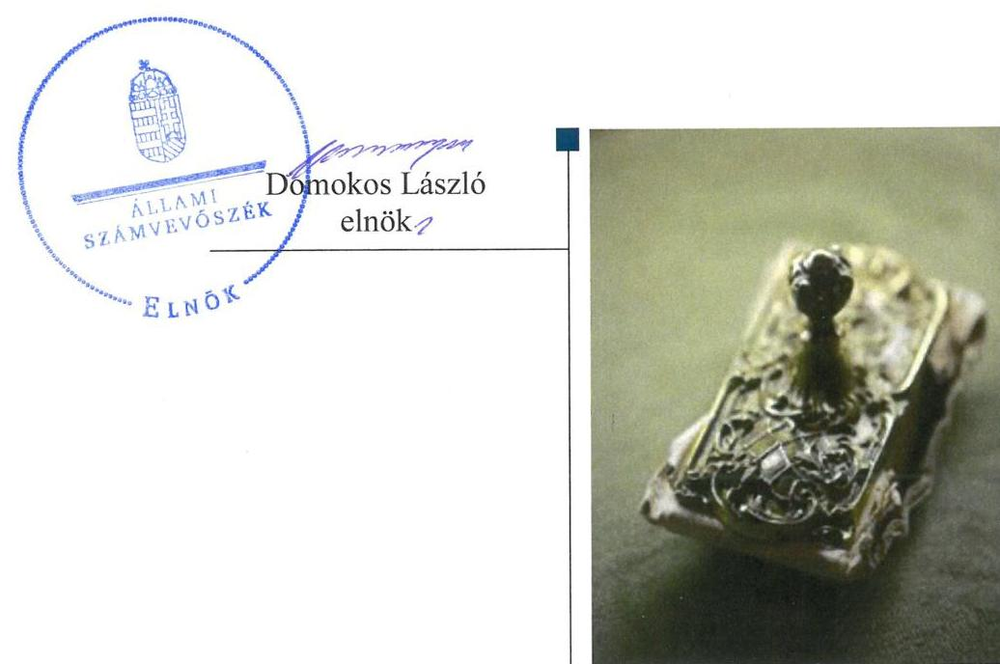
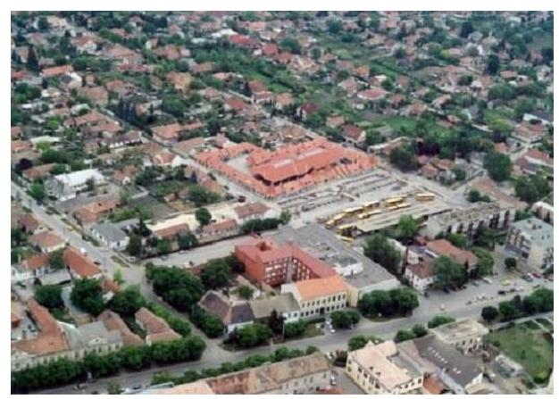

# Jelenetés 

## Nemzeti tulajdonú gazdasági társaságok ellenőrzése

KÖVÁL Közüzemi és Vállalkozási Nonprofit Zártkörűen müködő Részvénytársaság
2019.

---

# Jelenetés 

## Nemzeti tulajdonú gazdasági társaságok ellenőrzése

KÖVÁL Közüzemi és Vállalkozási Nonprofit Zártkörűen működő Részvénytársaság
2019. 07. hó 15. nap

---

# AZ ELLENŐRZÉST FELÜGYELTE:

- KAKAS SÁNDOR felügyeleti vezető
- AZ ELLENŐRZÉST VEZETTE ÉS A VÉGREHAJTÁSÁÉRT FELELŐS:
  - JOÓ ERIKA ellenőrzésvezető
  - A PROGRAM ÖSSZEÁLLÍTÁSÁÉRT FELELŐS:
    - TÓTPÁL SZABOLCS osztályvezető

**IKTATÓSZÁM:** EL-1611-001/2019

**TÉMASZÁM:** 2478

**ELLENŐRZÉS-AZONOSÍTÓ SZÁM:** V-082203

Jelentéseink az Országgyűlés számítógépes hálózatán és az Interneta a www.asz.hu címen is olvashatóak.

---

# TARTALOMJEGYZÉK 

■ ÖSSZEGZÉS ..... 5
■ AZ ELLENŐRZÉS CÉLJA ..... 6
■ AZ ELLENŐRZÉS TERÜLETE ..... 7
■ AZ ELLENŐRZÉS HÁTTERE, INDOKOLTSÁGA ..... 8
■ A JELENTÉS LÉNYEGES KÉRDÉSKÖREI ..... 9
■ AZ ELLENŐRZÉS HATÓKÖRE ÉS MÓDSZEREI ..... 10
■ MEGÁLLAPÍTÁSOK ..... 12
■ JAVASLATOK ..... 14
■ MELLÉKLETEK ..... 15
I. sz. melléklet: Értelmező szótár ..... 15
■ FÜGGELÉKEK ..... 17
I. sz. függelék a jelentéshez ..... 17
II. sz. függelék: Észrevételek ..... 18
■ RÖVIDÍTÉSEK JEGYZÉKE ..... 21

---

.

---

# ÖSSZEGZÉS 

A KÖVÁL Közüzemi és Vállalkozási Nonprofit Zártkörüen müködő Részvénytársaság felett tulajdonosi jogokat gyakorló Monor Város Önkormányzata a tulajdonosi joggyakorlás kereteit nem a jogszabályi előírásoknak megfelelően alakította ki, a tulajdonosi jogok gyakorlása nem volt szabályszerű. A Társaság vagyongazdálkodása nem felelt meg a jogszabályi előírásoknak, mert számviteli beszámolóit nem támasztotta alá leltárral, ezzel nem volt biztositott az elszámoltathatóság.

## Az ellenőrzés társadalmi indokoltsága

Az Állami Számvevőszék kiemelt célja, hogy a helyi önkormányzatok gazdálkodásában rejlő pénzügyi kockázatok feltárásával, az államháztartáson kívülre nyújtott költségvetési támogatások és ingyenes vagyonjuttatások, valamint az államháztartáson kívül múködő feladat-ellátó rendszerek ellenőrzéseivel hozzájáruljon ahhoz, hogy a közpénzeket az államháztartáson kívül múködő szervezetek is átlátható, rendezett módon használják fel.

Magyarországon az önkormányzatok kötelező és önként vállalt feladataik vonatkozásában is egyre szélesebb körben alkalmazzák a költségvetésen kívüli feladatellátást, ezáltal - a nonprofit szervezetek mellett - az önkormányzati tulajdonú gazdasági társaságok is kiemelt fontosságú szerephez jutottak.

## Főbb megállapítások, következtetések, javaslatok

Monor Város Önkormányzata tulajdonosi joggyakorlása nem volt szabályszerű, mert a jogszabályi előírások ellenére nem alkotta meg a Társaság javadalmazással összefüggő szabályzatát.

A KÖVÁL Közüzemi és Vállalkozási Nonprofit Zártkörűen működő Részvénytársaság vagyongazdálkodása nem volt szabályszerű, mert a számviteli beszámolók mérlegtételeit nem támasztotta alá leltárral, illetve nem győződött meg a mérlegbe került tételek valódiságáról.

Az Állami Számvevőszék a jelentésben foglalt megállapítások alapján Monor Város Önkormányzata polgármesterének egy javaslatot, a KÖVÁL Közüzemi és Vállalkozási Nonprofit Zártkörűen működő Részvénytársaság vezérigazgatójának pedig egy javaslatot fogalmazott meg. A javaslatokat megalapozó megállapításokra az érintetteknek 30 napon belül intézkedési tervet kell készíteniük.

---

# AZ ELLENŐRZÉS CÉLJA 

AZ ELLENŐRZÉS CÉLJA annak megállapítása, hogy a tulajdonosi joggyakorló a gazdasági társaságai feletti tulajdonosi joggyakorlás kereteit kialakította-e, tulajdonosi jogait megfelelően gyakorolta-e és kötelezettségeit teljesítette-e, továbbá annak megállapítása, hogy a gazdasági társaság biztosította-e a vagyon védelmét a nyilvántartások szabályszerű vezetése és a mérleg tételeinek leltárral történő alátámasztása útján, valamint szabályszerűen gondoskodott-e a társaság használatában, kezelésében lévő nemzeti vagyon értékének megőrzéséről, gyarapításáról, hasznosításáról.

---

# AZ ELLENŐRZÉS TERÜLETE 

## Monor Város Önkormányzata; KÖVÁL Közüzemi és Vállalkozási Nonprofit Zártkörúen múködő Részvénytársaság

A Társaságot ${ }^{1}$ Monor Város Önkormányzata alapította 1992. január 1-én. Az ellenőrzött időszakban a Társaság 100\%-os tulajdonosa az Önkormányzat ${ }^{2}$ volt.

A Társaság jegyzett tőkéje 41,8 M Ft volt, az ellenőrzött időszakban nem változott.

A Társaság fő tevékenysége nem veszélyes hulladék gyűjtése, kezelése, ártalmatlanítása volt, amelyet 2015. január 12016. december 31. között Közszolgáltatási szerződés ${ }^{3}$ alapján közfeladatként látott el, ezt követően 2017. január 1-jétől alvállalkozóként végezte ezt a feladatot. A Társaság az ellenőrzött időszakban településfejlesztés, településrendezés, lakásgazdálkodás, általános városüzemeltetés, sportlétesítmények üzemeltetése, egészségház üzemeltetése, közétkeztetés (gyermek és szociális), szociális feladatok, köztemetők fenntartása, üzemeltetése, piac fenntartása, üzemeltetése feladatokat is ellátott.

A Társaságnak vagyonkezelésbe vett vagyona az ellenőrzött időszakban nem volt, más gazdasági társaságban tulajdonosi részesedéssel nem rendelkezett és nem tartozott a kormányzati szektorba sorolt gazdasági társaságok közé.

A Társaság vezetését 2015. január 1. és 2016. május 25. között igazgatóság látta el, 2016. május 26 -tól az igazgatóság jogait vezető tisztségviselőként a vezérigazgató gyakorolta. A vezérigazgató személye az ellenőrzött időszakban 2018. április 19-én változott, a jelenlegi vezérigazgató ettől az időponttól tölti be tisztségét.

Az ellenőrzött időszakban a Polgármester ${ }^{4}$ és a Jegyzö ${ }^{5}$ személyében nem történt változás.

Az Önkormányzat az ellenőrzött időszakban további három gazdasági társaságban rendelkezett többségi (100\%-os) tulajdoni részesedéssel.

---

# AZ ELLENŐRZÉS HÁTTERE, INDOKOLTSÁGA 

Az Alaptörvény 38. cikke alapján az állam és a helyi önkormányzatok tulajdona nemzeti vagyon. A nemzeti vagyon megőrzése, megóvása érdekében kiemelten fontos ezen nemzeti tulajdonú gazdasági társaságok ellenőrzése. Gazdálkodásuk jellemzően a közérdeklődés és a média figyelmének középpontjában áll, amihez hozzájárul a gazdálkodásuk körébe tartozó - a nemzeti vagyon részét képező - vagyon nagysága, illetve az általuk ellátott közszolgáltatások minősége és hatékonysága. Ellenőrzéseink feltárhatják, hogy a tulajdonosi felügyelet hozzájárult-e a szabályszerű gazdálkodáshoz és feladatellátáshoz.

Az ellenőrzés eredményeként meghatározhatóvá válnak a szervezet vagyongazdálkodást érintő kockázatai, ezzel lehetővé téve a kockázatok csökkentését. A megállapítások alapján megfogalmazott számvevőszéki javaslatok hasznosítása elősegítheti a meglévő hibák megszüntetését. A jó gyakorlatok bemutatásával az ÁSZ ${ }^{6}$ hozzájárulhat a követendő megoldások megismertetéséhez, terjesztéséhez.

---

# A JELENTÉS LÉNYEGES KÉRDÉSKÖREI 

1. A gazdasági társaság feletti tulajdonosi joggyakorlás megfelel-e a jogszabályi és belső előírásoknak?
2. A Társaság vagyongazdálkodási tevékenysége szabályszerü volt-e?

---

# AZ ELLENŐRZÉS HATÓKÖRE ÉS MÓDSZEREI 

## Az ellenőrzés típusa

Megfelelőségi ellenőrzés.

## Az ellenőrzött időszak

A tulajdonosi joggyakorlás vonatkozásában az ellenőrzött időszak 2017. január 1-től az ellenőrzés megkezdésének napjáig terjedt ki az éves beszámolók elfogadása kivételével, amelynél az ellenőrzött időszak 2015. január 1-től az ellenőrzés megkezdésének napjáig tartott.

A Társaság vagyongazdálkodása vonatkozásában az ellenőrzött időszak 2015. - 2017. évek, a 2017. évi beszámoló jóváhagyása tekintetében 2018. június elsejéig tartó időszak.

## Az ellenőrzés tárgya

Az önkormányzati tulajdonban lévő gazdasági társaság feletti tulajdonosi joggyakorlás kialakítása és múködtetése.

Önkormányzati tulajdonban lévő gazdasági társaság vagyongazdálkodása keretében a társaság használatában, kezelésében lévő nemzeti vagyon, illetve a saját vagyon tekintetébe a vagyonnyilvántartások vezetése, leltára. A társaság használatában, vagyonkezelésében lévő nemzeti vagyon tekintetében a vagyon értékének megőrzése, gyarapítása, hasznosítása.

## Az ellenőrzött szervezet

Monor Város Önkormányzata;
KÖVÁL Közüzemi és Vállalkozási Nonprofit Zártkörűen múködő Részvénytársaság

## Az ellenőrzés jogalapja

Az ellenőrzés jogalapját az ÁSZ tv. ${ }^{7}$ 1. § (3) bekezdése és 5. § (3)-(5) bekezdései képezték.

---

# Az ellenőrzés módszerei 

Az ellenőrzést az ellenőrzési program ellenőrzési kérdései, az ellenőrzött időszakban hatályos jogszabályok, az ellenőrzés szakmai szabályok és módszertanok alapján, a nemzetközi standardok figyelembe vételével végeztük.

Az ellenőrzés ideje alatt az ellenőrzött szervezettel történő kapcsolattartást az ÁSZ Szervezeti és Múködési Szabályzatának vonatkozó előírásai alapján biztosítottuk.

Az ellenőrzést a kérdésekre adott válaszok kiértékelésével, valamint a megjelölt adatforrások, a csatolt tanúsítványok felhasználásával, továbbá az adott időszakban hatályos jogszabályok figyelembe vételével folytattuk le.
2017. január 1-től az ellenőrzés megkezdésének napjáig ellenőriztük a tulajdonosi joggyakorlás kereteinek kialakítását, a tulajdonosi joggyakorló tevékenységét a felügyelő bizottság és a független könyvvizsgáló múködéséhez kapcsolódóan, valamint azt, hogy a tulajdonosi joggyakorló - amenynyiben a gazdasági társaság feladatellátásához és vagyonkezeléséhez kapcsolódóan határozott meg követelményeket, elvárásokat - a nemzeti vagyon értékének megőrzése érdekében monitorozta-e azok teljesülését. 2015. január 1-től az ellenőrzés megkezdésének napjáig ellenőriztük a tulajdonosi joggyakorló részvételét az éves beszámoló elfogadására vonatkozó döntéshozatalban, valamint amennyiben adott a társaságainak vagyonkezelésbe nemzeti vagyont, akkor azt, hogy az azzal történő gazdálkodást a tulajdonosi joggyakorló ellenőrizte-e.

A gazdasági társaság vagyongazdálkodása vonatkozásában az ellenőrzött időszak 2015. - 2017. évek, a 2017. évi beszámoló jóváhagyása és közzététele tekintetében 2018. június elsejéig tartó időszak.

A vagyonnyilvántartások és a leltár szabályszerűsége esetében az ellenőrzés azokra a legnagyobb értékű tételekre - a lényeges sokaságra - terjedt ki, melyek összértéke eléri a teljes sokaság összértékének 50\%-át.

A 2015. és a 2017. évben a lényeges sokaságot tételesen ellenőriztük.
Az ellenőrzési kérdések megválaszolásához szükséges bizonyítékok megszerzése a Társaság vagyongazdálkodása vonatkozásában a következő ellenőrzési eljárások alkalmazásával történt: megfigyelés, információkérés, összehasonlítás, elemző eljárás. Az ellenőrzési bizonyítékként felhasználható adat-források közé tartoznak az ellenőrzési programban felsorolt adatforrások, továbbá minden - az ellenőrzés folyamán - feltárt, az ellenőrzés szempontjából információkat tartalmazó dokumentum.

---

# MEGÁLLAPÍTÁSOK 

## 1. A gazdasági társaság feletti tulajdonosi joggyakorlás megfelelte a jogszabályi és belső előírásoknak?

Összegző megállapítás Az Önkormányzat tulajdonosi joggyakorlása nem volt szabályszerű, mert annak - a jogszabályi előírásoknak megfelelő - kereteit nem alakították ki.

Az Önkormányzat a tulajdonosi joggyakorlás kereteit nem szabályszerűen alakította ki. A kizárólagos önkormányzati tulajdonban lévő Társaság legfőbb szerveként ${ }^{8}$ a Képviselő-testület a Taktv. ${ }^{9}$ 5. § (3) bekezdés előírása ellenére nem alkotta meg a vezető tisztségviselők, felügyelőbizottsági tagok, az Mt. ${ }^{10}$ 208. §-ának hatálya alá eső munkavállalók javadalmazása, valamint a jogviszony megszűnése esetére biztosított juttatások módjának, mértékének elveiről, annak rendszeréről szóló szabályzatot.

Az Önkormányzat megbízásából a 2016. évben végzett - a Társaság által üzemeltetett konyha gazdálkodására, múködésére vonatkozó - belső ellenőrzést az ellenőrzési feladattal megbízott külső szolgáltató.

Az Önkormányzat Képviselő-testülete a Társaság éves beszámolóit az ellenőrzött időszak minden évében a Ptk. ${ }^{11}$ előírásainak megfelelően a Felügyelőbizottság írásbeli jelentése és a Könyvvizsgáló jelentése birtokában fogadta el. A könyvvizsgáló az ellenőrzött időszak minden évében korlátozás nélküli véleményt adott a beszámolókról.

## 2. A Társaság vagyongazdálkodási tevékenysége szabályszerű volt-e?

Összegző megállapítás

A Társaság vagyongazdálkodási tevékenysége nem volt szabályszerű, mert a mérlegbe került adatok valódiságát nem támasztották alá leltárral.
2.1. számú megállapítás

A Társaság az ellenőrzött időszakban a vagyonhoz kapcsolódó nyilvántartásait szabályszerűen vezette.

A Társaság a vagyonhoz kapcsolódó nyilvántartásait a jogszabályi és belső előírásoknak megfelelően vezette, az üzembehelyezést a Számv. tv. ${ }^{12}$ előírásainak megfelelően hitelt érdemlő módon dokumentálta.
2.2. számú megállapítás

A Társaság az éves beszámolók mérlegeit nem támasztotta alá leltárral.

A 2015. december 31-ig hatályos Leltározási szabályzat ${ }_{1}{ }^{13}$ nem felelt meg a Számv. tv. előírásainak, mert a tárgyi eszközök vonatkozásában a Számv. tv. 69. § (3) bekezdése előírásai ellenére öt éves gyakorisággal írta

---

elő kötelezően a mennyiségi leltárfelvételt. A Leltározási szabályzat ${ }_{2}{ }^{14}$ 2016. január 1-jétől a Számv. tv. előírásaival összhangban határozta meg a mennyiségi felvétellel leltározott eszközök körét és a leltározás gyakoriságát.

A Társaság a 2015., 2016. és 2017. évben a Számv. tv. 69. § (1) bekezdésének előírása ellenére az éves beszámolók mérlegtételeit leltárral nem támasztotta alá, ezzel sérült a Számv. tv. 15. § (3) bekezdésében rögzített valódiság elve.

A Társaság a 2015. és a 2016. évben az éves beszámoló kiegészítő mellékletében a $\mathrm{Ht} .{ }^{15} 50 . \S$ (3) bekezdés előírásai ellenére nem mutatta be elkülönítetten a közszolgáltatás keretében végzett hulladék gyűjtése, kezelése, ártalmatlanítása vonatkozásában a mérleget, így nem biztosította az egyes tevékenységek átláthatóságát, valamint a keresztfinanszírozás tilalmának érvényesülését.

---

# JAVASLATOK 

Az ÁSZ tv. 33. § (1) bekezdésében foglaltak értelmében az ellenőrzött szervezet vezetője köteles a jelentésben foglalt megállapításokhoz kapcsolódó intézkedési tervet összeállítani és azt a jelentés kézhezvételétől számított 30 napon belül az ÁSZ részére megküldeni. Amennyiben az ellenőrzött szervezet vezetője nem küldi meg határidőben az intézkedési tervet, vagy továbbra sem elfogadható intézkedési tervet küld, az Állami Számvevőszék elnöke az ÁSZ tv. 33. § (3) bekezdése a) és b) pontjaiban foglaltakat érvényesítheti.

## KÖVÁL Közüzemi és Vállalkozási Nonprofit Zártkörűen müködő Részvénytársaság vezérigazgatójának

1. Intézkedjen a mérlegben kimutatott eszközök és források jogszabályban elöirtaknak megfelelő leltárral történő alátámasztásáról.
(2.2. sz. megállapítás 2. bekezdése alapján)

## Monor Város Önkormányzata polgármesterének

1. Kezdeményezze a Képviselő-testületnél a vezető tisztségviselők, a felügyelő bizottsági tagok, az Mt. 208. §-ának hatálya alá eső munkavállalók javadalmazása, valamint a jogviszony megszünése esetére biztosított juttatások módjának, mértékének elveire, annak rendszerére vonatkozó szabályzat megalkotását a Taktv.-ben elöirtaknak megfelelően.
(1. sz. megállapítás 1. bekezdése alapján)

---

# MELLÉKLETEK 

- I. SZ. MELLÉKLET: ÉRTELMEZŐ SZÓTÁR
gazdasági társaság
közszolgáltatás
közfeladat
nemzeti vagyon
nemzeti vagyon használója
tulajdonosi jogok gyakorlója
vagyonkezelő

Ptk. 3:88. § (1) bekezdése szerint „a gazdasági társaságok üzletszerű közös gazdasági tevékenység folytatására, a tagok vagyoni hozzájárulásával létrehozott, jogi személyiséggel rendelkező vállalkozások, amelyekben a tagok a nyereségből közösen részesednek, és a veszteséget közösen viselik".
Az Ebktv. ${ }^{16}$ 3. § d) pontja a következőképpen határozza meg a közszolgáltatást: „szerződéskötési kötelezettség alapján a lakosság alapvető szükségleteinek ellátására irányuló szolgáltatás, így különösen a villamos energia-, gáz-, hő-, víz-, szenny-víz- és hulladékkezelési, köztisztasági, postai és táv-közlési szolgáltatás, továbbá a menetrend alapján közlekedő járművekkel végzett közforgalmú személyszállítás".
Az Áht. 3/A. § (1) bekezdése alapján közfeladat a jogszabályban meghatározott állami vagy önkormányzati feladat
Nvtv. 1. § (2) bekezdése szerint nemzeti vagyonba tartozik többek között:
„az állam vagy a helyi önkormányzat kizárólagos tulajdonában álló dolgok, az a) pont hatálya alá nem tartozó, állam vagy a helyi önkormányzat tulajdonában lévő dolog,
az állam vagy a helyi önkormányzat tulajdonában lévő pénzügyi eszközök, továbbá az államot vagy a helyi önkormányzatot megillető társasági részesedések, az államot vagy a helyi önkormányzatot megillető bármely vagyoni érték-kel rendelkező jogosultság, amelyet jogszabály vagyoni értékű jogként nevesít
Azon természetes személy, jogi személy vagy jogi személyiséggel nem rendelkező szervezet, aki vagy amely állami vagyon tekintetében törvény vagy szerződés alapján, a helyi önkormányzat vagyona tekintetében törvény, a helyi önkormányzat rendelete vagy szerződés alapján bármely jogcímen nemzeti vagyont birtokol, használ, szedi annak hasznait, kivéve a tulajdonosi joggyakorló.
Forrás: Nvtv. 3. § (1) bekezdés 11. pont
Aki a nemzeti vagyon felett az államot vagy a helyi önkormányzatot megillető tulajdonosi jogok és kötelezettségek összességének gyakorlására jogosult. (Forrás: Nvtv. 3. § (1) bekezdés 17. pontja)
az állam tulajdonában álló nemzeti vagyon tekintetében:
aa) költségvetési szerv,
ab) helyi önkormányzat, nemzetiségi önkormányzat, valamint ezek társulásai,
ac) az ab) alpontban felsoroltak fenntartása vagy irányítása alá tartozó intézmény,
ad) köztestület,
ae) az állam, az aa)-ac) alpontban meghatározott személyek együtt vagy külön-külön 100\%-os tulajdonában álló gazdálkodó szervezet,
af) az ae) alpont szerinti gazdálkodó szervezet 100\%-os tulajdonában álló gazdálkodó szervezet,
ag) a törvény által kijelölt egyedileg meghatározott jogi személy.
b) a helyi önkormányzat tulajdonában álló nemzeti vagyon tekintetében:
ba) nemzetiségi önkormányzat, helyi vagy nemzetiségi önkormányzati társulás, valamint ezek fenntartása vagy irányítása alá tartozó intézmény,
bb) költségvetési szerv,
bc) köztestület,

---

b
vagyonkezelői jog
vagyongazdálkodás
bd) az állam, a helyi önkormányzat, a ba) alpontban meghatározott személyek együtt vagy külön-külön 100\%-os tulajdonában álló gazdálkodó szervezet,
be) a bd) alpont szerinti gazdálkodó szervezet 100\%-os tulajdonában álló gazdálkodó szervezet.
Forrás: Nvtv. 3. § (1) bekezdés 19. pont
A vagyonkezelő köteles a vagyontárgy állagának megóvásáról, jó karban-tartásáról, működtetéséről gondoskodni, jogszabályban és szerződésben előírt más kötelezettségét teljesíteni, valamint a vagyontárgyat jogszabályban vagy szerződésben meghatározott célnak megfelelően használni. A vagyonkezelő - a központi költségvetési szervek és a kizárólag közfeladatot ellátó nem központi költségvetési szerv vagyonkezelők kivételével - köteles díjat fizetni, jogszabályban és szerződésben előírt más kötelezettségét teljesíteni, valamint a vagyontárgyat jogszabályban vagy szerződésben meghatározott célnak megfelelően használni. Amennyiben a vagyonkezelő ezen kötelezettségeinek nem tesz eleget, a tulajdonosi joggyakorló jogosult a szerződést azonnali hatállyal felmondani.
Forrás: Vtv. 27. § (2), (2a
A nemzeti vagyongazdálkodás feladata a nemzeti vagyon rendeltetésének megfelelő, az állam, az önkormányzat mindenkori teherbíró képességéhez igazodó, elsődlegesen a közfeladatok ellátásához és a mindenkori társadalmi szükségletek kielégítéséhez szükséges, egységes elveken alapuló, átlátható, hatékony és költségtakarékos működtetése, értékének megőrzése, állagának védelme, értéknövelő használata, hasznosítása, gyarapítása, továbbá az állam vagy a helyi önkormányzat feladatának ellátása szempontjából feleslegessé váló vagyontárgyak elidegenítése. (Forrás: Nvtv. 7. § (2) bekezdése).

---

# FÜGGELÉKEK 

- I. SZ. FÜGGELÉK A JELENTÉSHEZ

Az Állami Számvevőszék az ellenőrzések során feltárt tényekhez kapcsolódó további körülmények tisztázására eszközrendszerrel nem rendelkezik. Amennyiben az ellenőrzésen túlmutatóan indokoltnak látszik az ellenőrzés során feltárt körülmények további vizsgálata, az Állami Számvevőszék törvényi felhatalmazás alapján az ellenőrzés által feltárt körülményeket továbbítja a hatáskörrel rendelkező szervnek a szükséges intézkedések megtétele, eljárások lefolytatása érdekében.
A KÖVÁL Nonprofit Zrt. (Társaság) a 2015. évben a Számv. tv. 69. § (1) bekezdésének előírása ellenére az éves beszámoló mérlegét leltárral nem támasztotta alá. A Társaság 2015-ben nem rendelkezett a 2015. évi éves beszámoló alátámasztásához az immateriális javak, tárgyi eszközök, készletek leltáraival. A leltárral alá nem támasztott mérlegtételek értéke 457,2 M Ft volt, amely a mérlegfőösszeg (621,8 M Ft) 73,5\%-a volt. A leltárral alá nem támasztott érték jelentős volt, a mérlegfőösszeg 2\%-át meghaladta.
A Társaság a 2016. évben a Számv. tv. 69. § (1) bekezdésének előírása ellenére az egyszerüsített éves beszámoló mérlegét leltárral nem támasztotta alá. A Társaság nem rendelkezett a 2016. évi egyszerüsített éves beszámoló alátámasztásához az immateriális javak, tárgyi eszközök, készletek leltáraival. A leltárral alá nem támasztott mérlegtételek értéke 449,6 M Ft volt, amely a mérlegfőösszeg (611,3 M Ft) 73,5\%-a volt. A leltárral alá nem támasztott érték jelentős volt, a mérlegfőösszeg 2\%-át meghaladta.
2017. évben a Számv. tv. 69. § (1) bekezdésének előírása ellenére az egyszerüsített éves beszámoló passzív időbeli elhatárolások mérlegsorát nem támasztotta alá a Társaság által elkészített leltár. A leltárban szereplő összeg 6,4 M Ft, a mérlegben szerepeltetett összeg 376,4 M Ft volt. Az eltérés 370,0 M Ft, a mérlegfőösszeg (590,3 M Ft) 62,7\%-a volt. A leltárral alá nem támasztott érték jelentős volt, a mérlegfőösszeg 2\%-át meghaladta.
A 2017. évben a 370,0 M Ft összegű eltérés a Társaság 2017. évi eredményére is hatással lehetett.
A mérleg tételeit alátámasztó leltár hiányában a 2015. évi éves beszámoló, valamint a 2016. évi és a 2017. évi egyszerüsített éves beszámolók vonatkozásában nem igazolt, hogy a Társaság beszámolói valós összképet mutatnak, a Számv. tv. 15. § (3) bekezdésében foglalt valódiság elve nem érvényesült.

Az eset konkrét körülményeinek felderítésére a Nemzeti Adó- és Vámhivatal rendelkezik hatáskörrel.

---

A jelentéstervezetet a Számvevőszék 15 napos észrevételezésre megküldte az ellenőrzött szervezetek vezetőinek az ÁSZ tv. 29. §̊ (1) bekezdése előirásának megfelelően.

Monor Város Önkormányzatának polgármestere nem tett észrevételt a jelentéstervezetre. A KÖVÁL Közüzemi és Vállalkozási Nonprofit Zártkörüen müködő Részvénytársaság vezérigazgatója a jelentéstervezet megállapításaira írásban észrevételt tett.
Az ÁSZ tv. 29. § (3) bekezdésével összhangban az ÁSZ a Függelékben feltünteti az ellenőrzés megállapításaival kapcsolatban tett, figyelembe nem vett észrevételeket, és megindokolja, hogy azokat miért nem fogadta el.

[^0]
[^0]:    * 29. § (1) Az Állami Számvevőszék az ellenőrzési megállapításait megküldi az ellenőrzött szervezet vezetőjének vagy az általa megbízott személynek, és annak, akinek személyes felelősségét állapította meg.
    (2) Az ellenőrzött szervezet vezetője és a felelősként megjelölt személy az ellenőrzés megállapításaira tizenöt napon belül írásban észrevételt tehet.
    (3) Az Állami Számvevőszék az észrevételre a beérkezésétől számított harminc napon belül írásban válaszol. A figyelembe nem vett észrevételeket köteles a jelentésben feltüntetni, és megindokolni, hogy azokat miért nem fogadta el.

---

A „Nemzeti tulajdonú gazdasági társaságok ellenőrzése - KÖVÁL Közüzemi és Vállalkozási Nonprofit Zártkörűen müködő Részvénytársaság" címmel készített számvevőszéki jelentéstervezet megállapításaival kapcsolatban a vezérigazgató által 2019. június 11-én tett (az Állami Számvevőszékhez 2019. június 13-án érkezett), figyelembe nem vett észrevételei és azok indokolása.

1. A jelentéstervezet 2.2. sz. megállapítás 2. bekezdéséhez, valamint az I. sz. Függelék 2-3. bekezdéseihez tett észrevételek:

Vezérigazgató úr az észrevételében jelezte, hogy a Társaság a 2015-2016. években elvégezte a leltározást az immateriális javak, tárgyi eszközök és a készletek körében, azonban az adatszolgáltatás során a 2015. évi leltárfelvételi ívek és a leltár, a 2016. évi készlet leltár csatolása nem történt meg, illetve a készletek vonatkozásában a 2015. évre vonatkozó adatszolgáltatás hiányos volt. Észrevételéhez mellékletként csatolta a 2015. évi leltárfelvételi íveket, a befektetett eszközök leltárát és a készletek leltárát, valamint a 2016. évre vonatkozóan a befektetett eszközök leltárát és a készletek leltárát. Vezérigazgató úr az észrevételében kérte a 2015. évi és 2016. évi passzív időbeli elhatárolások leltárában a halasztott bevételek között szereplő analitikában felsorolt tárgyi eszköz beszerzések figyelembe vételét az immateriális javaknál és tárgyi eszközöknél.

Az észrevételt nem fogadtuk el. Az ÁSZ az ellenőrzési megállapításait az adatszolgáltatás során a részére törvényi határidőben rendelkezésre bocsátott dokumentumokra alapozva fogalmazza meg. A 2018. július 5-én kelt teljességi és hitelességi nyilatkozat szerint az ÁSZ részére átadott dokumentumok, adatok megbízhatóak, és a bekért adatokra, dokumentumokra vonatkozóan teljes körű információt tartalmaznak. A hivatkozott nyilatkozat 7-31. pontjaiban feltüntetett ellenőrzési dokumentumok felülvizsgálata során megállapítást nyert, hogy a Társaság a 2015. évre vonatkozóan nem bocsátott az ellenőrzés rendelkezésére olyan dokumentumokat, amelyek az immateriális javak és a tárgyi eszközök leltárát alátámasztotta volna. Megállapítást nyert továbbá, hogy a „2015. Készlet leltárfelvételi ívek.pdf" nevű fájlban található dokumentumok a 2015. évi beszámoló mérlegének készletek mérlegsorát nem támasztják alá.

Az ellenőrzési dokumentumok felülvizsgálata során megállapítást nyert, hogy a 2018. július 5-én kelt teljességi és hitelességi nyilatkozat 32. pontjában felsorolt „Tárgyi Eszköz Leltárfelvételi ívek 2016.12.31..pdf" nevű fájlban található leltárfelvételi ívek nem támasztják alá a 2016. évi beszámoló mérlegében az immateriális javak és tárgyi eszközök mérlegsorokat. A Társaság a 2016. évre vonatkozóan nem bocsátott az ellenőrzés rendelkezésére olyan dokumentumot, amely a készletek leltárát hitelesen alátámasztotta volna. Az ÁSZ az ellenőrzési megállapításait az adatszolgáltatás során a részére törvényi határidőben rendelkezésre bocsátott dokumentumokra alapozva fogalmazza meg. Vezérigazgató úr az észrevételében elismerte a leltározási dokumentumok hiányát, hiányosságát. Az adatszolgáltatáson kívül megküldött dokumentumokat az ÁSZ nem értékeli, ezért a jelentéstervezet módosítása nem indokolt.

A Számv. tv. 69. § (1) bekezdése előírja, hogy a könyvek üzleti év végi zárásához, a beszámoló elkészítéséhez, a mérleg tételeinek alátámasztásához olyan leltárt kell összeállítani és e törvény előírásai szerint megőrizni, amely tételesen, ellenőrizhető módon tartalmazza a mérleg fordulónapján meglévő eszközöket és forrásokat mennyiségben és értékben. A Számv. tv. 57. § (1) bekezdése értelmében a befektetett eszközöket - a 60-62. §-ban foglaltak figyelembevételével - a 47-51. § szerinti bekerülési értéken kell értékelni, csökkentve azt az 52-56. § szerint alkalmazott leírásokkal, növelve azt a (2) bekezdés szerinti visszaírás összegével. Az ellenőrzési dokumentumok között megtalálható, a 2018. július 5-én kelt teljességi és hitelességi nyilatkozat 15. pontjában felsorolt „2015. G. 101. Halasztott bevételek.pdf" nevű fájlban szereplő analitika, valamint 42. pontjában felsorolt „2016. G. Passzív időbeli elhatárolások d..pdf" nevű fájlban szereplő analitika a tárgyi eszköz beszerzésekhez nyújtott támogatásokat tartalmazza. A halasztott bevételek analitikáiban szereplő tárgyévi eszköz beszerzések az immateriális javak és tárgyi eszközök - a Számv. tv. hivatkozott előírásai szerint meghatározott - tárgyévi mérlegsorait nem támasztják alá, ezért az észrevétel figyelembe vétele nem indokolt.

# 2. A jelentéstervezet 2.2. sz. megállapítás 3. bekezdéséhez tett észrevételek: 

Vezérigazgató úr az észrevételében jelezte, hogy a kiegészítő melléklet folytatásaként az adatszolgáltatás során feltöltésre és csatolásra került közhasznúsági jelentés ágazati bontásban tartalmazza az egyes ágazatok jövedelmezőségét, a hulladék ágazaton belül a közszolgáltatás keretében végzett tevékenységeket, valamint a hulladékgazdálkodási egyéb tevékenységeket. Észrevétele szerint a Társaság ennek alapján megfelel a keresztfinanszírozás tilalmának.

---

Az észrevételt nem fogadtuk el. A Ht. 50. § (3) bekezdése értelmében a hulladékgazdálkodási közszolgáltatás körébe nem tartozó tevékenységet is végző közszolgáltató a hulladékgazdálkodási közszolgáltatás nyújtása érdekében végzett tevékenységét éves beszámolója kiegészítő mellékletében oly módon mutatja be, mintha azt önálló vállalkozás keretében végezte volna. A tevékenység elkülönült bemutatása legalább önálló mérleget és eredménykimutatást jelent. Az ellenőrzési dokumentumok felülvizsgálata során megállapítást nyert, hogy a Társaság 2015. és 2016. évi éves beszámolóinak kiegészítő mellékletei a hulladékgazdálkodási közszolgáltatás nyújtása érdekében végzett tevékenység önálló mérlegét és eredménykimutatását nem tartalmazták. Az észrevételben hivatkozott, a kiegészítő melléklet „folytatásaként" csatolt közhasznúsági jelentések az egyes üzletágak, köztük a hulladékgazdálkodási közszolgáltatás nyújtása érdekében végzett tevékenység bevételeit, ráfordításait és jövedelmezőségi mutatóit tartalmazták. Fentiekre tekintettel a megállapítás módosítása nem indokolt.

# 3. A jelentéstervezet I. sz. Függelék 4. bekezdéséhez tett észrevételek: 

Vezérigazgató úr tájékoztatása alapján a Társaság a 2017. évben elvégezte a leltárt a passzív időbeli elhatárolások körében, azonban a dokumentáció az adatszolgáltatás során hiányosan került megküldésre. A hiányzó dokumentumokat Vezérigazgató úr az észrevételéhez mellékletként csatolta. Vezérigazgató úr álláspontja szerint a 2017. évi tárgyi eszköz leltár alapján igazolható, hogy a tárgyi eszközök a Társaság tulajdonában vannak, így a tárgyi eszközökhöz kapcsolódó halasztott bevételeknek a mérlegben a passzív időbeli elhatárolások között kell lennie.

Az ÁSZ az ellenőrzési megállapításait az adatszolgáltatás során a részére törvényi határidőben rendelkezésre bocsátott dokumentumokra alapozva fogalmazza meg. A 2018. július 5-én kelt teljességi és hitelességi nyilatkozat 6163. pontjaiban feltüntetett ellenőrzési dokumentumok felülvizsgálata során megállapítást nyert, hogy azok a 2017. évi beszámoló passzív időbeli elhatárolások mérlegsort nem támasztják alá. Az ellenőrzési dokumentumok (számlák, összesítések, kimutatások) alapján a befolyt bevételek passzív elhatárolása 0,4 M Ft ( 365951 Ft ), a mérleg-fordulónapi előtti időszakot terhelő költségek, ráfordítások passzív időbeli elhatárolása 6,0 M Ft ( 6050873 Ft ) volt. A Társaság nem bocsátott olyan dokumentumot az ellenőrzés rendelkezésére, amely a passzív időbeli elhatárolások között elszámolt - eszközökhöz kapcsolódó - halasztott bevételek összegét ( 370,0 M Ft ) leltárral alátámasztotta volna. Vezérigazgató úr által hivatkozott 2017. évi tárgyi eszköz leltár a társaságnak a mérleg fordulónapján meglévő tárgyi eszközeit tartalmazza mennyiségben és értékben. A tárgyi eszköz leltár nem támasztja alá a Számv. tv. 45.§ (1) bekezdésében meghatározottak alapján a passzív időbeli elhatárolások között elszámolt - tárgyévi beszerzésekhez kapcsolódó - halasztott bevételek összegét. Vezérigazgató úr az észrevételében elismerte a leltározási dokumentumok hiányát, hiányosságát. Az adatszolgáltatáson kívül megküldött dokumentumokat az ÁSZ nem értékeli, ezért a jelentéstervezet módosítása nem indokolt.

Vezérigazgató úr észrevételében jelezte továbbá, hogy az ÁSZ elektronikus Adatszolgáltatási Rendszerben a jelentős mennyiségű dokumentum feltöltése során technikai és adminisztratív okok folytán néhány dokumentum csatolása kimaradt, amelyek pótlására két napot kért. A 2018. június 22-én kelt EL-0854-003/2018. iktatószámú elektronikus levélben az ÁSZ tájékoztatta a Vezérigazgató urat, hogy az ÁSZ tv. 28. § (2) bekezdése alapján a közreműködésre felhívott szervezet az ÁSZ részére - annak kérésére soron kívül, de legkésőbb öt munkanapon belül - az ellenőrzés tervezhetősége, meghatározása, illetve lefolytatása érdekében szükséges adatokat és dokumentumokat rendelkezésre bocsátja, illetve a kapcsolódó tájékoztatást köteles megadni, amelytől való eltérésre az ÁSZ tv. nem ad lehetőséget.

Az ÁSZ tv. 29. § (2) bekezdése alapján az ellenőrzött szervezet vezetője az ellenőrzés megállapításaira tehet észrevételt. A feltárt hibák orvoslására tervezett intézkedésekről - a kiadmányozott jelentés megállapításaira az ÁSZ tv. 33. § (1) bekezdése alapján összeállított - intézkedési tervben indokolt számot adni.

---

# RÖVIDÍTÉSEK JEGYZÉKE 

${ }^{1}$ Társaság
${ }^{2}$ Önkormányzat
${ }^{3}$ Közszolgáltatási szerződés
${ }^{4}$ Polgármester
${ }^{5}$ Jegyző
${ }^{6}$ ÁSZ
${ }^{7}$ ÁSZ tv.
${ }^{8}$ a Társaság legfőbb szerve
${ }^{9}$ Taktv.
${ }^{10}$ Mt.
${ }^{11}$ Ptk.
${ }^{12}$ Számv. tv.
${ }^{13}$ Leltározási szabályzat ${ }_{1}$
${ }^{14}$ Leltározási szabályzat ${ }_{2}$
${ }^{15} \mathrm{Ht}$.
${ }^{16}$ Ebktv.

KÖVÁL Közüzemi és Vállalkozási Nonprofit Zártkörűen működő Részvénytársaság
Monor Város Önkormányzata
KÖVÁL Közüzemi és Vállalkozási Nonprofit Zártkörűen működő Részvénytársaság és Monor Város Önkormányzata között a hulladékgyűjtés, kezelés, ártalmatlanítás tevékenység végzésére létrejött, 2016. december 31-i hatállyal megszüntetett Közszolgáltatási szerződés
Monor Város Önkormányzata Polgármestere
Monor Város Önkormányzata Jegyzője
Állami Számvevőszék
az Állami Számvevőszékről szóló 2011. évi LXVI. törvény
Monor Város Önkormányzata Képviselő-testülete
2009. évi CXXII. törvény a köztulajdonban álló gazdasági társaságok takarékosabb müködéséről
2012. évi I. törvény a munka törvénykönyvéről
a Polgári Törvénykönyvről szóló 2013. évi V. törvény
a számvitelről szóló 2000. évi C. törvény
KÖVÁL Nonprofit Zrt. Leltározási és selejtezési szabályzata
(hatályos: 2010. január 1-étől 2015. december 31-éig)
KÖVÁL Nonprofit Zrt. Leltározási szabályzata (hatályos: 2016. január 1-étől)
a hulladékról szóló 2012. évi CLXXXV. törvény
egyenlő bánásmódról és az esélyegyenlőség előmozdításáról szóló 2003. évi
CXXV. törvény

---

# ÁLLAMI SZÁMVEVŐSZÉK 

1052 Budapest, Apáczai Csere János utca 10.
Levélcím: 1364 Budapest 4. Pf. 54
Telefon: +36 14849100 Telefax: +36 14849200
www.asz.hu