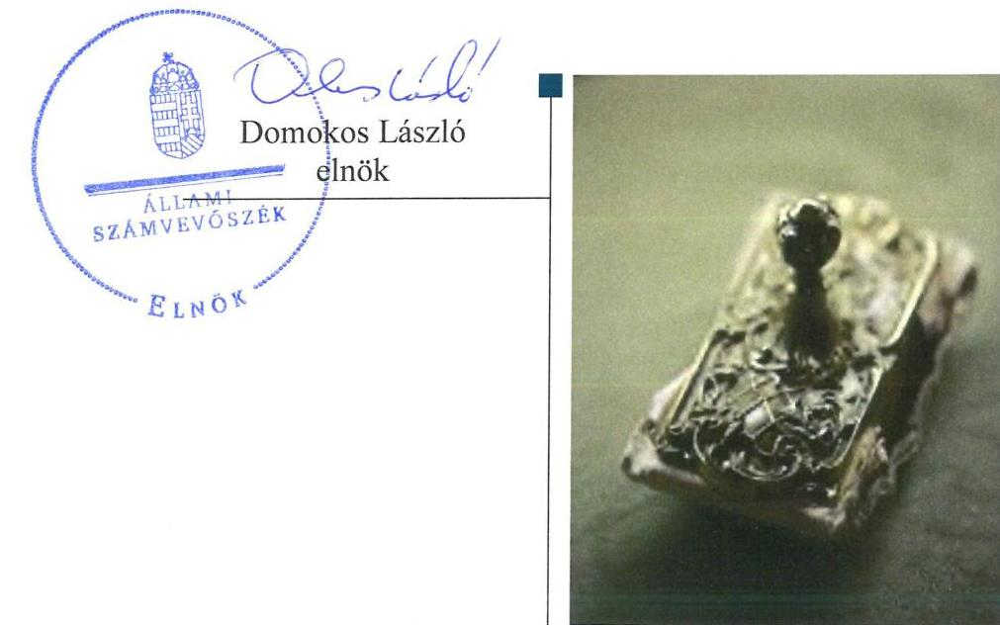
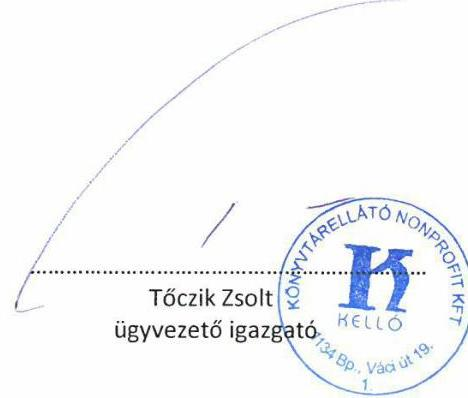
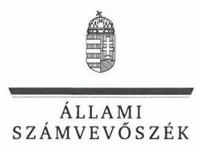
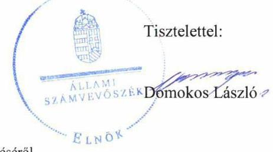
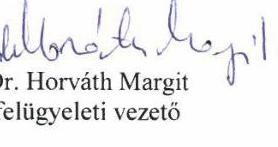

# Jelenetés 

## Az állami tulajdonú gazdasági társaságok ellenőrzése

Könyvtárellátó Közhasznú Nonprofit Korlátolt Felelősségű Társaság 2019.

19126
www.asz.hu

---

# J elentés 

## Az állami tulajdonú gazdasági társaságok ellenőrzése

Könyvtárellátó Közhasznú Nonprofit Korlátolt Felelősségű Társaság
2019. 07. hó 30. nap

---

# AZ ELLENŐRZÉST FELÜGYELTE:

DR. HORVÁTH MARGIT felügyeleti vezető

## AZ ELLENŐRZÉST VEZETTE ÉS A VÉGREHAJTÁSÁÉRT FELELŐS:

- ÁRPÁSI TIBOR ellenőrzésvezető
- A PROGRAM ÖSSZEÁLLÍTÁSÁÉRT FELELŐS:
  - TÓTPÁL SZABOLCS osztályvezető

IKTATÓSZÁM: EL-1662-001/2019.

TÉMASZÁM: 2480

ELLENŐRZÉS-AZONOSÍTÓ SZÁM: V082405

Jelentéseink az Országgyűlés számítógépes hálózatán és az Interneta a www.asz.hu címen is olvashatóak.

---

# TARTALOMJEGYZÉK 

■ ÖSSZEGZÉS ..... 5
■ AZ ELLENŐRZÉS CÉLJA ..... 6
■ AZ ELLENŐRZÉS TERÜLETE ..... 7
■ AZ ELLENŐRZÉS HÁTTERE, INDOKOLTSÁGA ..... 8
■ A JELENTÉS LÉNYEGES KÉRDÉSKÖREI ..... 9
■ AZ ELLENŐRZÉS HATÓKÖRE ÉS MÓDSZEREI ..... 10
■ MEGÁLLAPÍTÁSOK ..... 12
■ JAVASLATOK ..... 15
■ MELLÉKLETEK ..... 17
I. sz. melléklet: fogalomtár ..... 17
II. sz. melléklet: A Társaság 2015-2017. évi mérleg adatai ..... 19
■ FÜGGELÉKEK ..... 21
I. sz. függelék a jelentéshez ..... 21
II. sz. függelék: Észrevételek ..... 22
■ RÖVIDÍTÉSEK JEGYZÉKE ..... 29

---

.

---

# ÖSSZEGZÉS 

A Könyvtárellátó Közhasznú Nonprofit Korlátolt Felelősségű Társaság müködésének szabályozottsága 2015-ben és 2017-ben nem volt szabályszerű. A Könyvtárellátó Közhasznú Nonprofit Korlátolt Felelősségű Társaság gazdálkodása és vagyongazdálkodása 2015-ben és 2017-ben nem volt szabályszerű, ezért elszámoltathatósága nem volt biztosított. Beszámolási kötelezettségének 2015-2017-ben szabályszerűen tett eleget.

## Az ellenőrzés társadalmi indokoltsága

Az Állami Számvevőszék a stratégiáját megvalósítva ellenőrzéseivel segíti az átláthatóságot és az elszámoltathatóságot a közpénzekkel, a közvagyonnal való gazdálkodásban. Ellenőrzési témaválasztása során kiemelt figyelmet fordít a korábban ellenőrizetlen területekre.

Ellenőrzési tervének megfelelően a 2015-2017 közötti ellenőrzött időszakra az Állami Számvevőszék folytatja az állami tulajdonban (résztulajdonban) lévő gazdálkodó szervezetek vagyonmegőrzési és gazdálkodási tevékenységének ellenőrzését.

Az állami tulajdonú gazdasági társaságok a nemzeti vagyon részei. Az állami tulajdonú gazdasági társaságokra vonatkozó előírások betartásának ellenőrzése kiemelten fontos a vagyon megőrzése, megóvása érdekében, alapvető követelmény, hogy gazdálkodásuk, működésük szabályszerű legyen. Ennek a társadalmi igénynek megfelelve került sor a Könyvtárellátó Közhasznú Nonprofit Korlátolt Felelősségű Társaság ellenőrzésére. Az Állami Számvevőszék az ellenőrzése során arra kereste a választ, hogy 2015-2017. között a Társaság müködésének szabályozottsága megfelel-e az előírásoknak, szabályszerű volt-e gazdálkodása, vagyongazdálkodása.

## Főbb megállapítások, következtetések, javaslatok

A Könyvtárellátó Közhasznú Nonprofit Korlátolt Felelősségű Társaság működésének szabályozottsága 2015-ben és 2017-ben a szervezeti és működési szabályzat, valamint az önköltségszámítás rendjére vonatkozó belső szabályzat hiánya miatt nem volt szabályszerű.

A Könyvtárellátó Közhasznú Nonprofit Korlátolt Felelősségű Társaság gazdálkodása, vagyongazdálkodása 2015ben és 2017-ben nem volt szabályszerű. 2015-ben a személyi ráfordítások elszámolása, 2017-ben az értékcsökkenés elszámolása nem volt szabályszerű. A vagyon nyilvántartása 2017-ben nem volt szabályszerű. A gazdálkodási hiányosságok következtében nem volt biztosított a Társaság elszámoltathatósága.

Beszámolási kötelezettségét az ellenőrzött időszakban a Társaság szabályszerűen teljesítette, az éves beszámolók mérlegét leltárral alátámasztotta. Tervezési, adatszolgáltatási kötelezettségének a Társaság szabályszerűen eleget tett. A gazdálkodás átláthatóságát gyengítette, hogy a Társaság Taktv. és az Info tv. szerinti közzétételi kötelezettségének nem tett eleget.

Az Állami Számvevőszék a jelentésben foglalt megállapítások alapján a Könyvtárellátó Közhasznú Nonprofit Korlátolt Felelősségű Társaság ügyvezetőjének hat javaslatot fogalmazott meg. A javaslatokat megalapozó megállapításokra az érintettnek 30 napon belül intézkedési tervet kell készítenie.

---

# AZ ELLENŐRZÉS CÉLJA 

Az ellenőrzés célja annak értékelése, hogy a gazdasági társaság szabályozottsága, gazdálkodása és vagyongazdálkodási tevékenysége megfelelt-e a jogszabályi és a tulajdonosi előírásoknak; biztosítva volt-e a közfeladatok átláthatósága és elszámoltathatósága érdekében a közszolgáltatás díjának megalapozottsága szabályszerű önköltségszámítással. A vagyonváltozást eredményező döntések esetében a gazdasági társaság szabályszerűen járt-e el.

---

# **Könyvtárellátó Közhasznú Nonprofit Korlátolt Felelősségű Társaság**

A Könyvtárellátó Közhasznú Nonprofit Korlátolt Felelősségű Társaságot a Magyar Állam 2007. július 1-jén hozta létre 190 M Ft törzstőkével. A Társaság^{1} kizárólagos tulajdonosa a Magyar Állam volt. Az Nvtv.^{2} 8. § (7) bekezdése és a Vtv.^{3} 29. § (3) és (5) bekezdése alapján az MNV Zrt.^{4} helyett és nevében az EMMI^{5} gyakorolta az alapítói és tulajdonosi jogokat a 2012. október 30-án kötött Megbízási szerződésben^{6} foglaltak szerint.

A Társaság fő tevékenysége könyv-kiskereskedelem, aminek keretében oktatási és kulturális közhasznú tevékenységként végezte a tankönyvek megrendelését, beszerzését, iskolákhoz történő eljuttatásának megszervezését, tankönyvek vételárának az iskoláktól való beszedését, illetve a nyilvános és szakkönyvtárak részére az állománygyarapítást segítő szakmai és dokumentum ellátási szolgáltatások nyújtását.

A Társaság közhasznú jogállású, közfeladatot látott el, közszolgáltatást nem végzett. A tevékenység ellátására a nemzeti köznevelés tankönyvellátásáról szóló 2013. évi CCXXXII. törvény és végrehajtási rendelete^{7}, valamint a 17/2014. (III. 12.) EMMI rendelet^{8} vonatkozott.

A Társaság irányítási feladatait az Ügyvezető_{1,2}^{9}, ellenőrzését három tagú Felügyelőbizottság^{10} látta el. Az ellenőrzött időszakban az Ügyvezető_{1,2} személye egyszer változott. A Felügyelőbizottság összetétele és az Alapító Okirat_{1-5}^{11} előírásai alapján kijelölt állandó Könyvvizsgáló^{12} személye nem módosult.

A Társaság a 2015-2017. években nyereségesen gazdálkodott, árbevételének mintegy 90%-a tankönyv értékesítésből származott. Az árbevétel és az eredmény alakulását az 1. sz. táblázat ismerteti. A foglalkoztatott létszám 2017-ben 194 fő volt. A Tulajdonosi joggyakorló^{13} minden évben az adózott nyereség eredménytartalékba történő helyezéséről határozott. A Társaság saját tőkéje az ellenőrzött időszakban gyarapodott, meghaladta a jegyzett tőke összegét. A Társaság 2015-ben 323,3 M Ft, 2016-ban 296,7 M Ft, 2017-ben 272,3 M Ft vissza nem térítendő költségvetési támogatásban részesült.

A Társaság 2015-2017. évi mérleg adatait a II. sz. melléklet mutatja be.

A Társaság kapcsolt vállalkozásban nem vett részt, leányvállalata nem volt. A Társaság nem rendelkezett vagyonkezelési szerződés alapján átvett állami vagyonnal.

A Társaság nem tartozott a kormányzati szektorba a 2015-2017. években. A Társaság nem tartozott a Bkr.^{14} hatálya alá, az operatív tevékenységtől független belső ellenőrzés kialakítására nem volt kötelezett, azt nem működtetett.

1. táblázat

|  ÉRTÉKESÍTÉS NETTÓ ÁRBEVÉTELE ÉS ADÓZOTT EREDMÉNYE (M FT) |  |   |
| --- | --- | --- |
|  év | árbevétel | eredményt  |
|  2015. | 13 111,4 | 27,6  |
|  2016. | 13 375,7 | 59,4  |
|  2017. | 13 011,5 | 55,2  |

*Forrás: a Társaság 2015-2017. évi beszámolói*

---

# AZ ELLENŐRZÉS HÁTTERE, INDOKOLTSÁGA 

A nemzeti vagyon megőrzésének, védelmének és a nemzeti vagyonnal való felelős gazdálkodásnak a követelményeit sarkalatos törvény határozza meg. Az állami tulajdonú gazdasági társaságokra vonatkozó előírások betartásának ellenőrzése kiemelten fontos a vagyon megőrzése, megóvása érdekében, valamint a kormányzati szektor elszámolásaiban megjelenő állami tulajdonú gazdasági társaságok esetében, amelyekkel szemben alapvető követelmény, hogy gazdálkodásuk, múködésük szabályszerű, az általuk szolgáltatott adatok minél megbízhatóbbak legyenek. Gazdálkodásuk jellemzően a közérdeklődés és a média figyelmének középpontjában áll, amihez hozzájárul a gazdálkodásuk körébe tartozó - közvetlen vagy közvetett állami tulajdonú, tehát végső soron a nemzeti vagyon részét képező vagyon nagysága, illetve az általuk ellátott közszolgáltatások/közfeladatok minősége és hatékonysága.

Az ellenőrzés rámutathat az állami tulajdonú gazdasági társaságok gazdálkodási tevékenységével kapcsolatos jó gyakorlatokra és szabálytalanságokra. Felhívhatja a figyelmet a jogszabályi követelmények teljesítéséhez szükséges feltételek hiányosságaira, hozzájárulhat az államháztartáson kívüli, de (közvetlenül vagy közvetve) állami vagyont használó gazdasági társaságok tevékenységének átláthatóságához. Ellenőrzésünk eredményeképpen javaslatainkkal, megállapításainkkal hozzájárulhatunk a nemzeti vagyonnal való gazdálkodás átláthatóságának, elszámoltathatóságának javításához.

---

# A JELENTÉS LÉNYEGES KÉRDÉSKÖREI 

1. A Könyvtárellátó Közhasznú Nonprofit Korlátolt Felelősségű Társaság müködésének szabályozottsága megfelelt-e az előírásoknak?
2. A Könyvtárellátó Közhasznú Nonprofit Korlátolt Felelősségű Társaságnál a pénzügyi-számviteli, adatszolgáltatási feladatok ellátása, vagyongazdálkodása szabályszerü volt-e?

---

# AZ ELLENŐRZÉS HATÓKÖRE ÉS MÓDSZEREI 

## Az ellenőrzés típusa

Megfelelőségi ellenőrzés.

## Az ellenőrzött időszak

Az ellenőrzött időszak 2015-2017. évek, valamint a 2017. évi beszámoló jóváhagyása és közzététele tekintetében a 2018. június elsejéig tartó időszak.

## Az ellenőrzés tárgya

Állami tulajdonban lévő gazdasági társaság gazdálkodása, kiemelten vagyongazdálkodási tevékenysége.

Az ellenőrzés kiterjedt minden olyan körülményre és adatra, amely az ÁSZ jogszabályban meghatározott feladatainak teljesítéséhez, valamint a program végrehajtása folyamán felmerült újabb összefüggések feltárásához szükséges volt.

## Az ellenőrzött szervezet

- Könyvtárellátó Közhasznú Nonprofit Korlátolt Felelősségű Társaság

## Az ellenőrzés jogalapja

Az ellenőrzés jogszabályi alapját az ÁSZ tv. ${ }^{15}$ 1. § (3) bekezdése és 5. § (3)- (5) bekezdései képezték.

## Az ellenőrzés módszerei

Az ellenőrzést a nemzetközi standardokat irányadónak tekintve az ellenőrzési program ellenőrzési kérdései, az ellenőrzött időszakban hatályos jogszabályok, az ellenőrzés szakmai szabályok és módszertanok figyelembe vételével végeztük.

Az ellenőrzés ideje alatt az ellenőrzött szervezettel történő kapcsolattartást az ÁSZ Szervezeti és Múködési Szabályzatának vonatkozó előírásai alapján biztosítottuk.

A 2015. és 2017. évi bevételek és a ráfordítások elszámolásának szabályszerűsége, valamint az értékcsökkenési leírás és a vagyonnyilvántartás

---

szabályszerűsége esetében az ellenőrzés azokra a legnagyobb értékű tételekre - a lényeges sokaságra - terjedt ki, melyek összértéke elérte a teljes sokaság összértékének 50\%-át.

A 2015. évi és a 2017. évi bevételek elszámolásának szabályszerűségét a lényeges sokaságból véletlen mintavételi eljárással kiválasztott tételek alapján ellenőriztük.

A 2015. és 2017. évi ráfordítások esetében a lényeges sokaságot tételesen ellenőriztük.

A 2015. és 2017. évi személyi jellegú kifizetések esetében a vezető tisztségviselők részére teljesített kifizetések tételes ellenőrzésére került sor.

A mintavétellel ellenőrzött területek esetében minden egyes tétel vonatkozásában a szabályszerűségre vonatkozó kérdéseket tettünk fel. „Szabályszerűnek" értékeltünk egy ellenőrzött területet, amennyiben 95\%-os bizonyossággal az ellenőrzött sokaságban az átlagos hibaarány legfeljebb 10\%, "nem szabályszerűnek", amennyiben 10\%-nál magasabb arányt képviselt.

Az ellenőrzési kérdések megválaszolásához szükséges bizonyítékok megszerzése a következő ellenőrzési eljárások alkalmazásával történt: megfigyelés, kérdésfeltevés (információkérés), összehasonlítás, valamint elemző eljárás. Az ellenőrzési bizonyítékként felhasznált adatforrások közé tartoztak egyrészt az ellenőrzési programban felsorolt adatforrások, másrészt adatforrás volt még az Igazságügyi Minisztérium Céginformációs Szolgálat által üzemeltett, beszámolók közzétételét szolgáló nyilvántartása.

Az ellenőrzés a kérdésekre adott válaszok kiértékelésével, valamint a megjelölt adatforrások, a csatolt tanúsítványok felhasználásával, továbbá az adott időszakban hatályos jogszabályok figyelembe vételével folyt le.

---

# 1. A Könyvtárellátó Közhasznú Nonprofit Korlátolt Felelősségű Társaság múködésének szabályozottsága megfelelt-e az előírásoknak? 

Összegző megállapítás

A Társaság múködésének szabályozottsága 2015-ben és 2017ben nem volt szabályszerű.

A TÁRSASÁG pénzügyi és vagyongazdálkodásával kapcsolatos fel-adat- és hatásköröket, felelősségi viszonyokat az Alapító Okiratában1-5 határozta meg a Tulajdonosi joggyakorló.

A Társaság az Alapító Okirat ${ }_{1-2}$ 6.2.15. pontjában, illetve az Alapító Okirat ${ }_{3-5}$ 6.2.16. pontjában foglaltak ellenére nem alkotta meg szervezeti és múködési szabályzatát.

A Társaság 2015-ben és 2017-ben is rendelkezett a Taktv. ${ }^{16}$ előírásaival összhangban elkészített, a vezető tisztségviselő, a Felügyelőbizottsági tagok és az Mt. ${ }^{17}$ 208. § hatálya alá tartozó munkavállalók javadalmazására, valamint a jogviszony megszűnése esetére biztosított juttatások módjának, mértékének elveiről, annak rendszeréről szóló szabályzattal (Javadalmazási szabályzat ${ }_{1,2}{ }^{18}$ ). A Társaság a 2015. évben hatályos Javadalmazási szabályzatot ${ }_{1}$ a Taktv. 5. § (3) bekezdésében foglalt előírást megsértve nem helyezte letétbe, a Javadalmazási szabályzat ${ }_{2}$ letétbe helyezése megtörtént.

A Társaság közfeladat-ellátására tekintettel az Info tv. ${ }^{19} 30 . \S$ (6) bekezdése a közérdekú adatok megismerésére irányuló igények teljesítésének rendjét rögzítő szabályzat elkészítését írta elő, amely kötelezettségének a Társaság nem tett eleget.

A TÁRSASÁG SZÁMVITELI tevékenységének szabályozottsága 2015-ben és 2017-ben nem volt szabályszerű. A Társaság 2015. szeptember 1-től hatályos Számviteli politikája ${ }^{20}$ összhangban volt a Számv. tv.ben ${ }^{21}$ rögzített tartalmi követelményekkel.

A Társaság 2015-ben illetve 2017-ben rendelkezett a Számv. tv. előírásai szerinti Eszközök és források értékelési szabályzatával ${ }_{1,2}{ }^{22}$, Pénzkezelési szabályzattal ${ }_{1-3}{ }^{23}$, Leltározási és leltárkészítési szabályzattal ${ }_{1-3}{ }^{24}$. A Leltározási és leltárkészítési szabályzatban ${ }_{1-3}$ a jogszabályi előírások alapján rögzítették az egyeztetéssel és a mennyiségi felvétellel leltározandó eszközök és források körét, valamint meghatározták a tárgyi eszközök kétévente, a készletek évente mennyiségi felvétellel történő leltározásának gyakoriságát.

A Társaság a Számv. tv. 14. § (7) bekezdésében előírt kötelezettség ellenére nem alkotta meg Számv. tv. 14. § (5) bekezdésének c) pontjában meghatározott, az önköltségszámítás rendjére vonatkozó belső szabályza-

---

tát. A Társaság ezáltal nem biztosította a saját előállítású termékek, a végzett szolgáltatások 51. § (2)-(3) bekezdése szerinti önköltségének szabályzat szerinti utókalkuláció módszerével történő megállapítását.

A Társaság 2015. szeptember 1-től rendelkezett a Számv. tv. szerinti Számlarenddel ${ }^{25}$. A Számlarendet alátámasztó bizonylati rendet a Számviteli politika ${ }_{2} 1.3$ fejezete tartalmazta.

A Társaság 2015. szeptember 1-től követeléskezelési utasításban ${ }^{26}$ határozta meg a követelések kezelésének alapelveit és a határidőn túli követelések behajtásának eljárásrendjét.

# 2. A Könyvtárellátó Közhasznú Nonprofit Korlátolt Felelősségű Társaságnál a pénzügyi-számviteli, adatszolgáltatási feladatok ellátása, vagyongazdálkodása szabályszerű volt-e? 

Összegző megállapítás

A Társaság gazdálkodása, vagyongazdálkodás 2015-ben és 2017-ben nem volt szabályszerű. Beszámolási kötelezettségét a Társaság 2015-2017-ben szabályszerűen teljesítette, az éves beszámolók mérlegét alátámasztotta leltárral. Tervezési és adatszolgáltatási kötelezettségének a Társaság szabályszerűen eleget tett. Közzétételi kötelezettségét nem teljesítette.

A BEVÉTELEK ÉS RÁFORDÍTÁSOK elszámolása 2015-ben a személyi ráfordítások kivételével, 2017-ben az értékcsökkenés kivételével szabályszerű volt. 2015-ben a Társaság korábbi évek szabadságmegváltásának kifizetését nem támasztotta alá bizonylattal a Számv. tv. 165. § (1)(2) bekezdésében foglaltak ellenére. 2017-ben a Társaság a Számv. tv. 80. § (2) bekezdésében foglaltakat megsértve olyan eszközöket számolt el használatbavételkor értékcsökkenési leírásként egy összegben, amelyek egyedi beszerzési értéke meghaladta a 100 E Ft-ot.

A VAGYON NYILVÁNTARTÁSA 2015-ben szabályszerű volt. 2017-ben nem volt szabályszerű, mert a Társaság a Számv. tv. 25. § (6) bekezdése ellenére licence díjakat vagyoni értékú jogok helyett kis értékú tárgyi eszközként vett nyilvántartásba.

A VAGYON ÉRTÉKÉNEK megőrzéséről a Társaság gondoskodott. A befektetett eszközök állományán belül az ellenőrzött időszakban a tárgyi eszközök aránya növekedett. A saját tőke 2015-ről 2017-re 114,4 M Ft-tal, 479,5 M Ft-ra növekedett.

A saját vagyont érintő, beruházásokkal, felújításokkal kapcsolatos döntések az Alapító Okirat ${ }_{1-5}$ előírásaival összhangban hozták meg. A Társaság 2015-2017-ben az elszámolt értékcsökkenésnél (605,6 M Ft) nagyobb öszszegben, 809,1 M Ft értékú beruházást hajtott végre.

A KÖVETELÉSÁLLOMÁNY 2015-ről (5924,6 M Ft) 2017-re (846,5 M Ft) csökkent. A követelésekre elszámolt értékvesztés összege 450,3 M Ft-ról (2015) 10,4 M Ft-ra csökkent.

---

SZOLGÁTATÁSI DÍ JAIT a Társaság tankönyvterjesztés tekintetében a 17/2014. (III. 12.) EMMI rendelet előírásai alapján állapította meg.

ÜZLETI TERV ${ }^{27}$ készítési kötelezettségét az ellenőrzött időszakban a Társaság az Alapító Okiratban ${ }_{1-5}$ foglaltak szerint teljesítette, azokat a Felügyelőbizottság megtárgyalta, a Tulajdonosi joggyakorló jóváhagyta. A Társaság az MNV. Zrt. és az EMMI közötti Megbízási szerződés 5.2. pontjában rögzített, a gazdálkodására vonatkozó adatszolgáltatási kötelezettségének az MNV Zrt. Monitoring Szabályzatában ${ }_{1,2}{ }^{28}$ meghatározott tartalommal eleget tett.

ÉVES BESZÁMOLÓIT az ellenőrzött időszakban a Számv. tv. előírásai szerint a Társaság elkészítette a közhasznúsági jelentéssel együtt, azokat a Tulajdonosi joggyakorló a Felügyelőbizottság, a Könyvvizsgáló korlátozásmentes hitelesítő záradékot tartalmazó - írásbeli jelentésének birtokában hagyta jóvá. A 2015-2017. évek éves beszámolóit a Társaság szabályszerűen állította össze, mérlegsorait a jogszabályi előírásokat kielégítő leltárral támasztotta alá.

# AZ ÉVES BESZÁMOLÓK KÖZZÉTÉTELÉRŐL ÉS 

LETÉTBE helyezéséről a Társaság a Számv. tv.-ben előírt határidőig gondoskodott. A Taktv. 2. § (1)-(2) bekezdéseiben foglalt közzétételi kötelezettségét a Társaság nem szabályszerűen teljesítette, mert az Ügyvezető2 jövedelmének 2016. évi változását nem tette közzé a 2. § (1) ca) pontja szerint, illetve a cégjegyzésre jogosult munkavállalók havi munkabérét öszszesítve tette közzé a 2. § (2) bekezdésében foglaltak ellenére.

A Társaság nem tett eleget az Info tv. 33. § (3) és a 37. § (1) bekezdésében előírtaknak, mivel saját honlapján nem tette közzé az Info. tv. 1. melléklet III. Gazdálkodási adatok 2. pontja szerint a foglalkoztatottak létszámára és bérére, az 5. pontja szerint az ötmillió forint értéket meghaladó szerződésekre, illetve a 8. pontja szerint a közbeszerzésekre vonatkozó adatokat.

---

# JAVASLATOK 

Az ÁSZ tv. 33. § (1) bekezdésében foglaltak értelmében az ellenőrzött szervezet vezetője köteles a jelentésben foglalt megállapításokhoz kapcsolódó intézkedési tervet összeállítani és azt a jelentés kézhezvételétől számított 30 napon belül az ÁSZ részére megküldeni. Amennyiben az ellenőrzött szervezet vezetője nem küldi meg határidőben az intézkedési tervet, vagy továbbra sem elfogadható intézkedési tervet küld, az Állami Számvevőszék elnöke az ÁSZ tv. 33. § (3) bekezdése a) és b) pontjaiban foglaltakat érvényesítheti.
Javaslataink célja a Könyvtárellátó Közhasznú Nonprofit Korlátolt Felelősségű Társaság gazdálkodása szabályszerűségének és gyakorlatának javítása annak érdekében, hogy a szabályozási környezet és az alkalmazott gyakorlat megfelelően tudja támogatni az átlátható működést.

## Könyvtárellátó Közhasznú Nonprofit Korlátolt Felelősségű Társaság ügyvezetőjének

1. Intézkedjen a szervezeti és müködési szabályzat elkészitéséről az alapító okirat elöirásainak megfelelően.
(1. sz. megállapítás 2. bekezdése alapján)
2. Intézkedjen a közérdekü adatok megismerésére irányuló igények teljesitésének rendjét rögzítő szabályzat elkészítéséről az Info tv. előírásainak megfelelően.
(1. sz. megállapítás 4. bekezdése alapján)
3. Intézkedjen az önköltség-számítási szabályzat Számv. tv. előírásainak megfelelő elkészitéséről.
(1. sz. megállapítás 7. bekezdése alapján)
4. Intézkedjen az eszközök értékcsökkenésének Számv. tv.-ben foglaltaknak megfelelő elszámolásáról.
(2. sz. megállapítás 1. bekezdés 3. mondata alapján)
5. Intézkedjen a vagyontárgyak Számv. tv.-ben foglaltaknak megfelelő nyilvántartásba vételéről.
(2. sz. megállapítás 2. bekezdés 2. mondata alapján)
6. Intézkedjen a közzétételi kötelezettség teljesitéséről a Taktv. tv. előírásainak megfelelően.
(2. sz. megállapítás 9. bekezdés 2. mondata alapján)

---

.

---

# MELLÉKLETEK 

- I. SZ. MELLÉKLET: FOGALOMTÁR
állami vagyon
állami vagyon hasznosítása
állami vagyon használója
állami vagyon kezelője/vagyonkezelő
állami vagyon értékesítése
gazdasági társaság
kapcsolt vállalkozás
kormányzati szektorba sorolt egyéb szervezet
közszolgáltatás
a) Az állam tulajdonában lévő dolog, valamint a dolog módjára hasznosítható természeti erő,
b) az a) pont hatálya alá nem tartozó mindazon vagyon, amely vonatkozásában törvény az állam kizárólagos tulajdonjogát nevesíti,
c) az állam tulajdonában lévő tagsági jogviszonyt megtestesítő értékpapír, illetve az államot megillető egyéb társasági részesedés,
d) az államot megillető olyan immateriális, vagyoni értékkel rendelkező jogosultság, amelyet jogszabály vagyoni értékű jogként nevesít.
Forrás: Vtv. 1. § (2) bekezdése
e) az állam tulajdonában lévő pénzügyi eszközök
Forrás: Vtv. 1. § (2) bekezdése
Az állami vagyonnal a tulajdonosi joggyakorló maga gazdálkodik, vagy szerződés így különösen bérlet, haszonbérlet, megbízás - alapján hasznosításra átengedi, illetőleg vagyonkezelésbe, haszonélvezetbe adja.
Forrás: Vtv. 23. § (1) bekezdése
Az a természetes vagy jogi személy, jogi személyiséggel nem rendelkező szervezet, aki, vagy amely törvény vagy szerződés alapján, bármely jogcímen (bérlet, haszonbérlet, használat stb.) állami vagyont birtokol, használ, szedi annak hasznait, hasznosít, ide nem értve a haszonélvezőt, a vagyonkezelőt és a tulajdonosi jogok gyakorlóját.
Forrás: Vtv.vhr. 1. § (7) a) pont
Az Nvtv.-ben vagyonkezelőként meghatározott azon személy, amellyel az állami vagyon vagyonkezelésére az MNV Zrt., valamint annak jogelődje, vagy az állami vagyon tulajdonosi joggyakorlója vagyonkezelési szerződést kötött, továbbá akit törvény vagyonkezelőnek kijelöl.
Forrás: Vtv.vhr. 1. § (7) d) pont
Állami vagyon tulajdonjogának bármely jogcímen történő, visszterhes átruházása. Forrás: Vtv.vhr. 1. § (7) d) pont
A Ptk. 3:88. § (1) bekezdése szerint „a gazdasági társaságok üzletszerű közös gazdasági tevékenység folytatására, a tagok vagyoni hozzájárulásával létrehozott, jogi személyiséggel rendelkező vállalkozások, amelyekben a tagok a nyereségből közösen részesednek, és a veszteséget közösen viselik".
Az anyavállalat és a leányvállalat és a közös vezetésű vállalkozások (fölérendelt anyavállalat esetében a minősítést a fölérendelt anyavállalat szempontjából kell elvégezni)
Forrás: Számv. tv. 3. § (2) 7. pont
Az a szervezet, amely az Áht. alapján nem része az államháztartásnak, azonban az Európai Közösséget létrehozó szerződéshez csatolt, a túlzott hiány esetén követendő eljárásról szóló jegyzőkönyv alkalmazásáról szóló 2009. május 25-i 479/2009/EK rendelet szerint a kormányzati szektorba tartozik.
Az Ebktv. ${ }^{29}$ 3. § d) pontja a következőképpen határozza meg a közszolgáltatást: „szerződéskötési kötelezettség alapján a lakosság alapvető szükségleteinek ellátá-

---

leányvállalat
nemzeti vagyon
a) az állam vagy a helyi önkormányzat kizárólagos tulajdonában álló dolgok,
b) az a) pont hatálya alá nem tartozó, állam vagy a helyi önkormányzat tulajdonában lévő dolog,
c) az állam vagy a helyi önkormányzatot tulajdonában lévő pénzügyi eszközök, továbbá az államot vagy a helyi önkormányzatot megillető társasági részesedések,
d) az államot vagy a helyi önkormányzatot megillető bármely vagyoni értékkel rendelkező jogosultság, amelyet jogszabály vagyoni értékű jogként nevesít,
e) Magyarország határa által körbezárt terület feletti légtér,
f) az üvegházhatású gázok kibocsátási egységeinek kereskedelméről szóló törvény szerint kibocsátási egység és légiközlekedési kibocsátási egység, valamint az ENSZ Éghajlatváltozási Keretegyezménye és annak Kiotói Jegyzőkönyv végrehajtási keretrendszeréről szóló törvény szerinti kiotói egység,
g) állami vagy helyi önkormányzati fenntartású közgyűjtemény (muzeális intézmény, levéltár, közgyűjteményként múködő kép- és hangarchívum, valamint könyvtár) saját gyűjteményében nyilvántartott kulturális javak körébe tartozó dolog, kivéve, ha az állami vagy önkormányzati tulajdon jogszerű létrejötte kétséget kizáró módon nem bizonyítható és a dologra nézve más a tulajdonjogát bizonyítja vagy a kulturális javakra vonatkozó jogszabályokban meghatározott eljárás keretében valószínűsíti (g. pont módosult 2013. december 7-től),
h) a régészeti lelet,
i) a nemzeti adatvagyon körébe tartozó állami nyilvántartások fokozottabb védelméről szóló törvény szerinti nemzeti adatvagyon.
Forrás: Nvtv. 1. § (2)
nemzeti vagyon hasznosítása A tulajdonosi joggyakorló vagy a nemzeti vagyon használója által a nemzeti vagyon birtoklásának, használatának, hasznok szedése jogának bármely - a tulajdonjog átruházását nem eredményező - jogcímen történő átengedése, ide nem értve a vagyonkezelésbe adást, valamint a haszonélvezeti jog alapítását.
Forrás: Nvtv. 3. § (1) 4. pont

---

II. SZ. MELLÉKLET: A TÁRSASÁG 2015-2017. ÉVI MÉRLEG ADATAI

# A KÖNYVTÁRELLÁTÓ KÖZHASZNÚ NONPROFIT KORLÁSTOLT FELELŐSSÉGŰ TÁRSASÁG 2015-2017. ÉVI MÉRLEG ADATAI (E Ft)

|  Megnevezés | 2015. XII. 31.
E Ft | 2016. XII. 31.
E Ft | 2017. XII. 31.
E Ft | 2017./2015.
(változás\%)  |
| --- | --- | --- | --- | --- |
|  A. Befektetett eszközök | 508130 | 420191 | 744481 | 46,5\%  |
|  I. IMMATERIÁLIS JAVAK | 250300 | 164671 | 201018 | $-19,7 \%$  |
|  II. TÁRGYI ESZKÖZÖK | 257830 | 255520 | 543463 | 110,8\%  |
|  III. BEFEKTETETT PÉNZÜGYI ESZKÖZÖK | 0 | 0 | 0 | $0 \%$  |
|  B. Forgóeszközök | 9187371 | 10046979 | 9930881 | 8,1\%  |
|  I. KÉSZLETEK | 1248869 | 797915 | 2029709 | 62,5\%  |
|  II. KÖVETELÉSEK | 6352180 | 1370166 | 1248034 | $-80,4 \%$  |
|  III. ÉRTÉKPAPÍROK | 0 | 0 | 0 | $0 \%$  |
|  IV. PÉNZESZKÖZÖK | 1586322 | 7878898 | 6653138 | 319,4\%  |
|  C. Aktív időbeli elhatárolások | 4259 | 3503 | 15006 | 252,3\%  |
|  ESZKÖZÖK ÖSSZESEN | 9699760 | 10470673 | 10690368 | 10,2\%  |
|  D. Saját tőke | 364937 | 424324 | 479506 | 31,4\%  |
|  I. JEGYZETT TÖKE | 190000 | 190000 | 190000 | $0 \%$  |
|  II. JEGYZETT, DE MÉG BE NEM FIZETETT TÖKE (-) | 0 | 0 | 0 | $0 \%$  |
|  III. TÖKETARTALÉK | 399943 | 399943 | 399943 | $0 \%$  |
|  IV. EREDMÉNYTARTALÉK | $-252646$ | $-225006$ | $-165619$ | $-34,4 \%$  |
|  V. LEKÖTÖTT TARTALÉK | 0 | 0 | 0 | $0 \%$  |
|  VI. ÉRTÉKELÉSI TARTALÉK | 0 | 0 | 0 | $0 \%$  |
|  VII. MÉRLEG SZERINTI/ADÓZOTT EREDMÉNY | 27640 | 59387 | 55182 | 99,6\%  |
|  E. Céltartalékok | 40000 | 86816 | 456324 | 1040,8\%  |
|  F. Kötelezettségek | 8987646 | 9722817 | 9560876 | 6,4\%  |
|  I. HÁTRASOROLT KÖTELEZETTSÉGEK | 0 | 0 | 0 | $0 \%$  |
|  II. HOSSZÚ LEJÁRATÚ KÖTELEZETTSÉGEK | 0 | 0 | 0 | $0 \%$  |
|  III. RÖVID LEJÁRATÚ KÖTELEZETTSÉGEK | 8987646 | 9722817 | 9560876 | 6,4\%  |
|  G. Passzív időbeli elhatárolások | 307177 | 236716 | 193662 | $-37,0 \%$  |
|  FORRÁSOK ÖSSZESEN | 9699760 | 10470673 | 10690368 | 10,2\%  |

---

.

---

# FÜGGELÉKEK 

- I. SZ. FÜGGELÉK A JELENTÉSHEZ

Az Állami Számvevőszék az ellenőrzések során feltárt tényekhez kapcsolódó további körülmények tisztázására eszközrendszerrel nem rendelkezik. Amennyiben az ellenőrzésen túlmutatóan indokoltnak látszik az ellenőrzés során feltárt körülmények további vizsgálata, az Állami Számvevőszék törvényi felhatalmazás alapján az ellenőrzés által feltárt körülményeket továbbítja a hatáskörrel rendelkező szervnek a szükséges intézkedések megtétele, eljárások lefolytatása érdekében.
A Könyvtárellátó Közhasznú Nonprofit Korlátolt Felelősségű Társaság részéről 2012. december 11-től fennálló munkaviszonya megszüntetéséhez kapcsolódóan egy munkavállaló részére számfejtésre és kifizetésre került 100 napi szabadságnak megfelelő pénzbeli szabadságmegváltás összesen bruttó 4007143 Ft értékben. A szabadságmegváltás jogszerüségét a Számv. tv. 165 § (1) bekezdésében foglaltak ellenére bizonylatokkal nem igazolták.
Felvetődik, hogy a szabálytalan kifizetéssel a Társaságot vagyoni hátrány érte. Mivel az eset összes körülménye csak nyomozati eszközzel tárható fel, ezért indokolt az Ügyészség értesítése.

---

A jelentéstervezetet a Számvevőszék 15 napos észrevételezésre megküldte az ellenőrzött szervezet vezetőjének az ÁSZ tv. 29. §* (1) bekezdése előírásának megfelelően.

Az ellenőrzött szervezet vezetője az ellenőrzés megállapításaira írásban észrevételt tett. Az Állami Számvevőszék az észrevételre írásban válaszolt. Az észrevétel, a figyelembe nem vett észrevételek és azok indokai a következők voltak:

[^0]
[^0]:    * 29. § (1) Az Állami Számvevőszék az ellenőrzési megállapításait megküldi az ellenőrzött szervezet vezetőjének vagy az általa megbízott személynek, és annak, akinek személyes felelősségét állapította meg.
    (2) Az ellenőrzött szervezet vezetője és a felelősként megjelölt személy az ellenőrzés megállapításaira tizenöt napon belül írásban észrevételt tehet.
    (3) Az Állami Számvevőszék az észrevételre a beérkezésétől számított harminc napon belül írásban válaszol. A figyelembe nem vett észrevételeket köteles a jelentésben feltüntetni, és megindokolni, hogy azokat miért nem fogadta el.

---

# 882 

Telefon: + 3612376900 - Fax: + 3613394791
Levelezési cím: 1391 Bp., Pf. 204. - www.kello.hu

Állami Számvevőszék
Domokos László úr
elnök

1364 Budapest 4.
Pf.: 54.

Tisztelt Elnök Úr!

Iktatószám: KP/1637-2/2019.
Hiv.sz.: EL-0822-053/2018.

## ÁLLAMI SZÁMVEVÖSZÉK DE-38992/2019/1   Erkezeit: 2019 JON 24.   Iktatószám: E1-0122-059/2019   Melléklet:

Hivatkozással EL-0822-054/2018. iktatószámon, „Az Állami tulajdonú gazdasági társaságok ellenőrzése" keretében a Társaság ellenőrzéséről készült Számvevőszéki Jelentéstervezet észrevételezése céljából megküldött, általunk 2019. június 12. napján kézhez vett levelében foglaltakra, annak eleget téve, a jelentéstervezetre vonatkozóan észrevételeinket az alábbiak szerint kívánjuk megtenni.

1. A jelentéstervezet 5. oldalán az Összegzés című fejezet „Főbb megállapítások, következtetések, javaslatok" alcímű megállapításának második bekezdését kérjük, szíveskedjenek pontosítani.
2015-ben a személyi ráfordítások elszámolása - a jelentéstervezet 13. oldalán a „Bevételek és ráfordítások" cím alatt közölt megállapításokra tekintettel - 1 tétel kivételével, a teljes 2015. évben szabályszerű volt. Az ÁSZ által megjelölt 1 tétel kifizetése 2015. január 15-én történt (a jelenlegi ügyvezető megbízatásának kezdete 2015. január 16.) és - ahogy a jelentéstervezet is rögzíti - az előző éveket érintette.
A 2017-ben az értékcsökkenés elszámolásával, továbbá a vagyon nyilvántartásával összefüggésben feltárt hiányosságok messze a Számviteli törvényben rögzített hibahatáron belül vannak, a Társaság egész éves teljesítményéhez képest elhanyagolható mértékű. Így ez semmiféleképpen nem gátolta azt, hogy a Társaság gazdálkodása átlátható és elszámoltatható legyen.
Erre figyelemmel az összegzésben rögzített megállapítás általános és túlzó.
2. A jelentéstervezet 6. oldalán szeretnénk ismételten jelezni - ahogy az ellenőrzés során is többször nyilatkozatuk -, hogy Társaságunk nem nyújt közszolgáltatást, ennek következtében közszolgáltatási díjat sem alkalmaz, így a „közszolgáltatás dijának megalapozottsága" megszövegezés álláspontunk szerint nem értelmezhető a jelentéstervezetben. Társaságunk nem minősül közszolgáltatónak, hanem állami közfeladatot lát el, mellyel összefüggésben azonban nem merül fel közszolgáltatási díj.
3. A jelentéstervezet 12. oldalán a Társaság szervezeti és működési szabályzatával kapcsolatos megállapítás kiegészítését célszerűnek tartjuk az EL-0822-011/2018. számú ellenőrzés 1.3. 20. pontjához tett nyilatkozatunk alapján.
4. A jelentéstervezet 13. oldalán a „Bevételek és ráfordítások" alcímnél a 2015. évi személyi ráfordítással kapcsolatos általános megfogalmazást kérjük, szíveskedjenek pontosítani. A negatív megállapítás csak 1 tételre vonatkozik a 2015. évben, mely az előző éveket érintette.

---

5. A jelentéstervezet 14. oldalán a „Szolgáltatási díjait" kezdetű megállapítást kérjük pontosítani. A Társaság - a jelen észrevételünk fenti 2. pontja alapján - nem nyújt közszolgáltatást, így közszolgáltatási díj megállapítása a jelentéstervezetben nem értelmezhető. Társaságunk a tankönyvellátást, mint állami közfeladatot látja el. A tankönyvellátás keretében a tankönyvek vételárát a tankönyvellátásra irányadó jogszabályok határozzák meg és nem a Társaság állapítja meg.

A jelentéstervezet „Javaslatok" című fejezetében rögzítetteket a Társaság tudomásul veszi és a végleges Jelentés alapján az intézkedési tervet ennek megfelelően fogja összeállítani.

Budapest, 2019. június 18.
Üdvözlettel:

---

ELNÖK

Ikt.szám: EL-0822-060/2019.

# Tőczik Zsolt János úr 

ügyvezető

Könyvtárellátó Közhasznú Nonprofit Korlátolt Felelősségű Társaság

## Budapest

## Tisztelt Ügyvezető Úr!

Köszönettel vettem „Az állami tulajdonú gazdasági társaságok ellenőrzése - Könyvtárellátó Közhasznú Nonprofit Korlátolt Felelösségü Társaság" címmel készített számvevőszéki jelentéstervezetre megküldött észrevételét.
Az Állami Számvevőszék észrevételre vonatkozó álláspontját a felügyeleti vezető által készített részletes tájékoztatás tartalmazza, amelyet levelemhez mellékeltem.
Tájékoztatom Ügyvezető urat, hogy az Állami Számvevőszék a figyelembe nem vett észrevételeket az Állami Számvevőszékről szóló 2011. évi LXVI. törvény 29. § (3) bekezdésében előírtak szerint köteles a jelentésében feltüntetni és megindokolni, hogy azokat miért nem fogadta el.

Budapest, 2019. 07 hó 16 nap

Melléklet: Tájékoztatás az észrevételek kezeléséről

---

# Tájékoztatás az észrevételek kezeléséről 

Megköszönöm Ügyvezető igazgató úrnak „Az állami tulajdonú gazdasági társaságok ellenőrzése - Könyvtárellátó Közhasznú Nonprofit Korlátolt Felelösségü Társaság" címủ ellenőrzés keretében készített, az Állami Számvevőszék (ÁSZ) elnökének levele kapcsán tett észrevételeit.
Az észrevétel kezeléséről az alábbi tájékoztatást adom:

1. számú észrevétel: „A jelentéstervezet 5. oldalán az Összegzés címü fejezet „Föbb megállapítások, következtetések, javaslatok" alcímü megállapításának második bekezdését kérjük, szíveskedjenek pontosítani. 2015-ben a személyi ráfordítások elszámolása - a jelentéstervezet 13. oldalán a „Bevételek és ráfordítások" cím alatt közölt megállapításokra tekintettel - 1 tétel kivételével, a teljes 2015. évben szabályszerü volt. Az ÁSZ által megjelölt 1 tétel kifizetése 2015. január 15-én történt (a jelenlegi ügyvezető megbízatásának kezdete 2015. január 16.) és - ahogy a jelentéstervezet is rögziti - az elöző éveket érintette.
A 2017-ben az értékcsökkenés elszámolásával, továbbá a vagyon nyilvántartásával összefüggésben feltárt hiányosságok messze a Számviteli törvényben rögzített hibahatáron belül vannak, a Társaság egész éves teljesítményéhez képest elhanyagolható mértékü. Így ez semmiféleképpen nem gátolta azt, hogy a Társaság gazdálkodása átlátható és elszámoltatható legyen.
Erre figyelemmel az összegzésben rögzített megállapítás általános és túlzó."

## Az észrevételre az alábbi választ adom:

Az ÁSZ ellenőrzése - a jelentéstervezet $A z$ ellenőrzés módszerei részben rögzítetteknek megfelelően - a 2015. és a 2017. évi ráfordítások elszámolásának szabályszerűsége, valamint az értékcsökkenési leírás és a vagyonnyilvántartás szabályszerűsége esetében azokra a legnagyobb értékủ tételekre - a lényeges sokaságra - terjedt ki, melyek összértéke elérte a teljes sokaság összértékének $50 \%$-át. A 2015. és 2017. évi ráfordítások esetében a lényeges sokaságot tételesen ellenőriztük. A 2015. és 2017. évi személyi jellegủ kifizetések esetében a vezető tisztségviselők részére a teljesített kifizetések tételes ellenőrzésére került sor. A mintavétellel ellenőrzött területek esetében minden egyes tétel vonatkozásában a szabályszerűségre vonatkozó kérdéseket tettünk fel. „Szabályszerünek" értékeltünk egy ellenőrzött területet, amennyiben $95 \%$-os bizonyossággal az ellenőrzött sokaságban az átlagos hibaarány legfeljebb $10 \%$, "nem szabályszerűnek", amennyiben $10 \%$-nál magasabb arányt képviselt. Az ellenőrzés számára rendelkezésre bocsátott mintatételekhez kapcsolódó dokumentumok esetében a fenti eljárás alapján olyan nagyságrendű hiányos dokumentálást találtunk, amely szerint a 2015. évben a személyi jellegű ráfordítások, a 2017. évben az értékcsökkenés elszámolása nem minősült szabályszerűnek.

A 2015. évi személyi jellegủ ráfordítások, valamint a 2017. évi értékcsökkenési leírás elszámolásának együttes minősítése következtében a jelentéstervezetben a gazdálkodás minősítése is nem megfelelő minősítést kapott, amely az elszámoltathatósággal kapcsolatos minősítést is meghatározta. A Társaság a köztulajdonban álló gazdasági társaságok takarékosabb működéséről szóló 2009. évi CXXII. törvény és az az információs önrendelkezési jogról és az információszabadságról szóló 2011. évi CXII. törvény szerinti közzétételi kötelezettségének nem tett eleget, amely hiányosság a gazdálkodás átláthatóságát gyengítette.
A fentiek alapján a jelentéstervezet Összegzés rész 2. mondatában; a Főbb megállapítások, következtetések, javaslatok rész 2. bekezdés 2. és 4. mondatában, a 3. bekezdés 3. mondatában; a

---

2. sz. megállapítás összegző megállapítás rész 1. és 4. mondatában, az 1. bekezdésben foglaltakat; valamint a Társaság ügyvezetőjének címzett 4. sz. javaslatot nem módosítom.
3. számú észrevétel: „A jelentéstervezet 6. oldalán szeretnénk ismételten jelezni - ahogy az ellenörzés során is többször nyilatkozatuk -, hogy Társaságunk nem nyújt közszolgáltatást, ennek következtében közszolgáltatási dijat sem alkalmaz, igy a „közszolgáltatás dijának megalapozottsága" megszövegezés álláspontunk szerint nem értelmezhető a jelentéstervezetben. Társaságunk nem minösül közszolgáltatónak, hanem állami közfeladatot lát el, mellyel összefüggésben azonban nem merül fel közszolgáltatási dij."

# Az észrevételre az alábbi választ adom: 

Az ÁSZ az állami tulajdonú gazdasági társaságok ellenőrzését a Társaság számára az EL-0822025/2018. iktatószámú, 2018. szeptember 21-én kelt levélben megküldött EL-0581-001/2018. iktatószámú ellenőrzés program alapján hajtotta végre. Az ellenőrzési programban rögzített volt az ellenőrzések célja. Az ellenőrzési programban rögzített célhoz igazodóan történt meg az ellenőrzési cél jelentéstervezetben való meghatározása.
A fentiekre tekintettel a jelentéstervezet $A z$ ellenörzés célja elnevezésủ részét nem módosítom.
3. számú észrevétel: „A jelentéstervezet 12. oldalán a Társaság szervezeti és müködési szabályzatával kapcsolatos megállapítás kiegészitését célszerünek tartjuk az EL-0822-011/2018. számú ellenörzés 1.3. 20. pontjához tett nyilatkozatunk alapján."

## Az észrevételre az alábbi választ adom:

Az ÁSZ ellenőrzéshez az EL-0822-011/2018. iktatószámú, 2018. június 29-én kelt adatbekérő levél 2. számú melléklete 1.3. pont 20. alpontjában kérte a szervezeti és müködési szabályzatot, annak megfelelő dokumentumot, szabályozást. Az adatbekérő levélben kért adatokkal kapcsolatban az ÁSZ számára megküldött 2018. július 12-én kelt teljességi és hitelességi nyilatkozat mellékletének 1.3 - 20. pontja szerint szervezeti és müködési szabályzat átadására nem került sor. A Társaság egy nyilatkozatot, valamint négy - az egyes szervezeti egységek feladatait, munkafolyamatokat szabályozó - ügyvezető igazgatói utasítást adott át. A nyilatkozat szerint az ellenőrzött időszakban az alapító részéről elfogadott szervezeti és müködési szabályzattal nem rendelkezett a Társaság.
A fentiekre tekintettel a jelentéstervezet Összegzés rész 1. mondatában, a Főbb megállapítások, következtetések, javaslatok rész 1. bekezdés 1. tagmondatában, a 1. sz. megállapítás 2. bekezdésben foglaltakat, valamint a Társaság ügyvezetőjének címzett 1. sz. javaslatot nem módosítom.
4. számú észrevétel: „A jelentéstervezet 13. oldalán a „Bevételek és ráforditások" alcímnél a 2015. évi személyi ráforditással kapcsolatos általános megfogalmazást kérjük, szíveskedjenek pontosítani. A negatív megállapítás csak 1 tételre vonatkozik a 2015. évben, mely az előző éveket érintette."

Az észrevételre az alábbi választ adom:

---

Az ÁSZ ellenőrzése - a jelentéstervezet $A z$ ellenörzés módszerei részben rögzítetteknek megfelelően - a 2015. és a 2017. évi ráfordítások elszámolásának szabályszerűsége, valamint az értékcsökkenési leírás és a vagyonnyilvántartás szabályszerűsége esetében azokra a legnagyobb értékủ tételekre - a lényeges sokaságra - terjedt ki, melyek összértéke elérte a teljes sokaság összértékének $50 \%$-át. A 2015. és 2017. évi ráfordítások esetében a lényeges sokaságot tételesen ellenőriztük. A 2015. és 2017. évi személyi jellegű kifizetések esetében a vezető tisztségviselők részére a teljesített kifizetések tételes ellenőrzésére került sor. A mintavétellel ellenőrzött területek esetében minden egyes tétel vonatkozásában a szabályszerűségre vonatkozó kérdéseket tettünk fel. „Szabályszerünek" értékeltünk egy ellenőrzött területet, amennyiben $95 \%$-os bizonyossággal az ellenőrzött sokaságban az átlagos hibaarány legfeljebb $10 \%$, "nem szabályszerűnek", amennyiben $10 \%$-nál magasabb arányt képviselt. Az ellenőrzés számára rendelkezésre bocsátott mintatételekhez kapcsolódó dokumentumok esetében a fenti eljárás alapján olyan nagyságrendű hiányos dokumentálást találtunk, amely szerint a 2015. évben a személyi jellegű ráfordítások elszámolása nem minősült szabályszerűnek.
A fentiek alapján a jelentéstervezet Főbb megállapítások, következtetések, javaslatok rész 2. bekezdés 2. mondat 1. tagmondatában, a 2. sz. megállapítás 1. bekezdés 1-2. mondatában foglaltakat nem módosítom.
5. számú észrevétel: „A jelentéstervezet 14. oldalán a „Szolgáltatási dijait" kezdetü megállapitást kérjük pontositani. A Társaság - a jelen észrevételünk fenti 2. pontja alapján - nem nyújt közszolgáltatást, így közszolgáltatási dij megállapítása a jelentéstervezetben nem értelmezhető. Társaságunk a tankönyvellátást, mint állami közfeladatot látja el. A tankönyvellátás keretében a tankönyvek vételárát a tankönyvellátásra irányadó jogszabályok határozzák meg és nem a Társaság állapítja meg."

# Az észrevételre az alábbi választ adom: 

A Társaság állami közfeladatot lát el, társadalmi szolgáltatást nyújt, szükségletet elégít ki, feladatai ellátása közben a tankönyvvé, pedagógus-kézikönyvvé nyilvánítás, a tankönyvtámogatás, valamint az iskolai tankönyvellátás rendjéről szóló 17/2014. (III. 12.) EMMI rendelet előírásait alkalmazva járt el.
A fentekre tekintettel a jelentéstervezet 2. sz. megállapítás 6. bekezdésében foglaltakat nem módosítom.

Budapest, 2019. 7 hó " /6 "nap

---

# RÖVIDÍTÉSEK JEGYZÉKE 

${ }^{1}$ Társaság
${ }^{2}$ Nvtv.
${ }^{3}$ Vtv.
${ }^{4}$ MNV Zrt.
${ }^{5}$ EMMI
${ }^{6}$ Megbízási szerződés
${ }^{7}$ végrehajtási rendelet
${ }^{8}$ 17/2014. (III. 12.) EMMI rendelet
${ }^{9}$ Ügyvezető ${ }_{1,2}$
${ }^{10}$ Felügyelőbizottság
${ }^{11}$ Alapító Okirat ${ }_{1-5}$
${ }^{12}$ Könyvvizsgáló
${ }^{13}$ Tulajdonosi joggyakorló
${ }^{14}$ Bkr.
${ }^{15}$ ÁSZ tv.
${ }^{16}$ Taktv.
${ }^{17}$ Mt.
${ }^{18}$ Javadalmazási szabályzat ${ }_{1,2}$
${ }^{19}$ Info tv.

Könyvtárellátó Közhasznú Nonprofit Korlátolt Felelősségű Társaság 2011. évi CXCVI. törvény a nemzeti vagyonról (hatályos: 2011. december 31-től) 2007. évi CVI. törvény az állami vagyonról (hatályos: 2007. szeptember 25-től) Magyar Nemzeti Vagyonkezelő Zártkörűen Működő Részvénytársaság Emberi Erőforrások Minisztériuma
Az MNV Zrt. és az EMMI között létrejött Megbízási szerződés a társasági részesedéshez kapcsolódó tulajdonosi jogok gyakorlására (hatályos: 2012. október 30-tól)
501/2013. (XII. 29.) Korm. rendelet a nemzeti köznevelés tankönyvellátásáról szóló 2013. évi CCXXXII. törvény egyes rendelkezéseinek végrehajtásáról, valamint a tankönyvellátásban közreműködők kijelöléséről (hatályos: 2014. január 1-től)
17/2014. (III. 12.) EMMI rendelet a tankönyvvé, pedagógus-kézikönyvvé nyilvánítás, a tankönyvtámogatás, valamint az iskolai tankönyvellátás rendjéről (hatályos: 2014. március 13-tól)
a Társaság ügyvezetője
Ügyvezető:1: megbíva 2015. január 15-ig
Ügyvezető:2: megbíva 2015. január 16-tól
a Társaság felügyelőbizottsága
a Társaság egységes szerkezetbe foglalt Alapító Okirata
Alapító Okirat:3: a Társaság Alapító Okirata, kelt 2014. május 28-án
Alapító Okirat:2: a Társaság Alapító Okirata, kelt 2015. január 13-án
Alapító Okirat:5: a Társaság Alapító Okirata, kelt 2015. november 9-én
Alapító Okirat:6: a Társaság Alapító Okirata, kelt 2016. május 6-án
Alapító Okirat:5: a Társaság Alapító Okirata, kelt 2017. május 9-én
a Társaság könyvvizsgálója (Magyar Szakértői Holding Könyvvizsgáló Pénzügyi és Vezetési Tanácsadó Korlátolt Felelősségű Társaság)
Emberi Erőforrások Minisztériuma
370/2011. (XII. 31.) Korm. rendelet a költségvetési szervek belső kontrollrendszeréről és belső ellenőrzéséről (hatályos: 2012. január 1-től)
2011. évi LXVI. törvény az Állami Számvevőszékről (hatályos: 2011. július 1-től) 2009. évi CXXII. törvény a köztulajdonban álló gazdasági társaságok takarékosabb müködéséről (hatályos: 2009. december 4-től)
2012. évi I. törvény a munka törvénykönyvéről (hatályos: 2012. július 1-től)
a Társaság Javadalmazási Szabályzata
szabályzat:1: jóváhagyva az Alapító 8/2010. (2010. december 15.) számú határozatával (hatályos: 2011. január 1-től)
szabályzat:2: jóváhagyva az Alapító 4/2016. (V. 24.) számú határozatával (hatályos: 2015. május 24-től)
2011. évi CXII. törvény az információs önrendelkezési jogról és az információszabadságról szóló (hatályos: 2016. augusztus 2-tól)

---

${ }^{20}$ Számviteli politika $1,2 \quad$ a Társaság Számviteli politikája
Számviteli politika ${ }_{1}$ : hatályos 2013. október 31-től
Számviteli politika 2 : hatályos 2015. szeptember 1-től
${ }^{21}$ Számv. tv. 2000. évi. C. törvény a számvitelről (hatályos: 2001. január 1-től)
${ }^{22}$ Értékelési szabályzat ${ }_{1,2} \quad$ a Társaság Eszközök és források értékelési szabályzata
szabályzat ${ }_{1}$ : hatályos 2013. október 31-től
szabályzat ${ }_{2}$ : hatályos 2015. szeptember 1-től
${ }^{23}$ Pénzkezelési szabályzat ${ }_{1-3} \quad$ a Társaság Pénzkezelési szabályzata
szabályzat ${ }_{1}$ : hatályos 2013 október 1-től
szabályzat ${ }_{2}$ : hatályos 2015. szeptember 1-től
szabályzat ${ }_{2}$ : hatályos 2015. október 15-től
${ }^{24}$ Leltározási és leltárkészítési szabályzat ${ }_{1-3} \quad$ a Társaság Leltározási és leltárkészítési szabályzata
szabályzat ${ }_{1}$ : hatályos 2013. október 31-től
szabályzat ${ }_{2}$ : hatályos 2015. szeptember 1-től
szabályzat ${ }_{3}$ : hatályos 2016. március 16-tól
${ }^{25}$ Számlarend a Társaság Számlarendje, hatályos 2015. szeptember 1-től
${ }^{26}$ Követeléskezelési utasítás a Társaság gazdasági vezetőjének utasítása a Követelések kezeléséről, hatályos 2015. szeptember 1-től
${ }^{27}$ Üzleti terv $_{1-3} \quad$ a Társaság elfogadott üzleti terve
28 Monitoring Szabályzat ${ }_{1,2} \quad$ 2015. szeptember 1-től) 3/2015. (V. 28.) számú határozatával üzleti terv ${ }_{2}$ : jóváhagyva az Alapító 3/2016. (V. 24.) számú határozatával üzleti terv ${ }_{3}$ : jóváhagyva az Alapító 6/2017. (V. 22.) számú határozatával Vezérigazgatói utasítás az MNV Zrt. Társasági Monitoring Szabályzatáról szabályzat ${ }_{1}$ : 51/2013. számú Vezérigazgatói utasítás (hatályos: 2013. december 19-től) szabályzat ${ }_{2}$ : 34/2016. számú Vezérigazgatói utasítás (hatályos: 2016. augusztus 2-tól)
${ }^{29}$ Ebktv.
2003. évi CXXV. törvény az egyenlő bánásmódról és az esélyegyenlőség előmozdításáról (hatályos: 2004. január 27-től)

---

# ÁLLAMI SZÁMVEVŐSZÉK 

1052 Budapest, Apáczai Csere János utca 10.
Levélcím: 1364 Budapest 4. Pf. 54
Telefon: +36 14849100 Telefax: +36 14849200
www.asz.hu