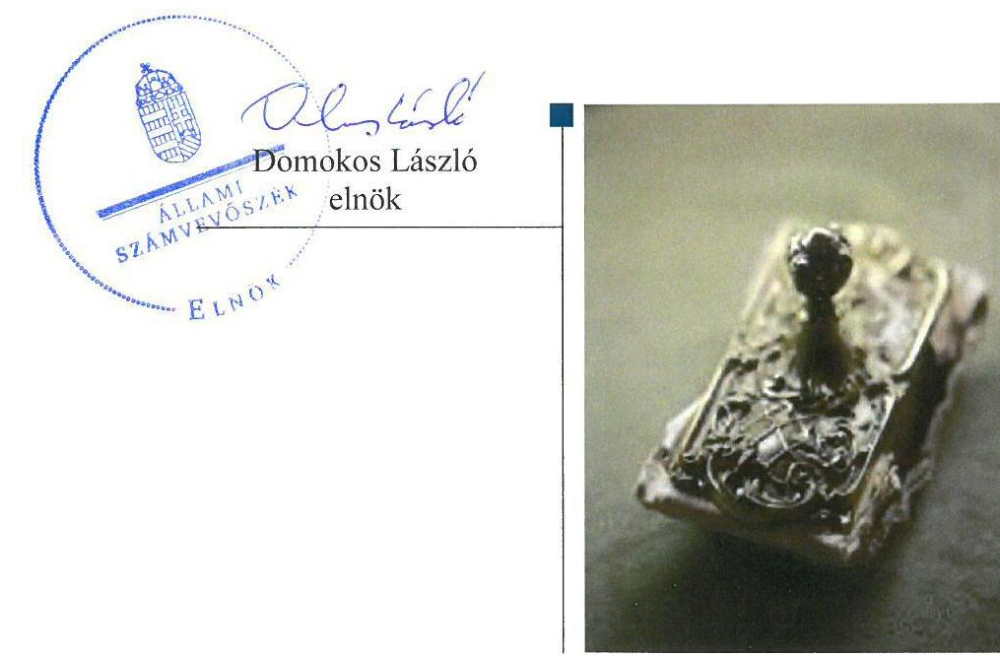

# Jelentés 

## Az állami tulajdonú gazdasági társaságok ellenőrzése

Szegedi SZEFO Fonalfeldolgozó „zártkörűen működő" Részvénytársaság 2019.

19127
www.asz.hu

---

# J elentés 

## Az állami tulajdonú gazdasági társaságok ellenőrzése

Szegedi SZEFO Fonalfeldolgozó „zártkörűen működő" Részvénytársaság 2019. 07. hó 30. nap

---

# AZ ELLENŐRZÉST FELÜGYELTE:

- **KLINGA LÁSZLÓ** felügyeleti vezető
- **AZ ELLENŐRZÉST VEZETTE ÉS A VÉGREHAJTÁSÁÉRT FELELŐS:**
  - **KISTÓTH KRISZTINA** ellenőrzésvezető
  - **A PROGRAM ÖSSZEÁLLÍTÁSÁÉRT FELELŐS:**
    - **TÓTPÁL SZABOLCS** osztályvezető

**IKTATÓSZÁM:** EL-1628-001/2019

**TÉMASZÁM:** 2480

**ELLENŐRZÉS-AZONOSÍTÓ SZÁM:** V082406

Jelentéseink az Országgyűlés számítógépes hálózatán és az Interneta a www.asz.hu címen is olvashatóak.

---

# TARTALOMJEGYZÉK 

■ ÖSSZEGZÉS ..... 5
■ AZ ELLENŐRZÉS CÉLJA ..... 6
■ AZ ELLENŐRZÉS TERÜLETE ..... 7
■ AZ ELLENŐRZÉS HÁTTERE, INDOKOLTSÁGA ..... 8
■ A JELENTÉS LÉNYEGES KÉRDÉSKÖREI ..... 9
■ AZ ELLENŐRZÉS HATÓKÖRE ÉS MÓDSZEREI ..... 10
■ MEGÁLLAPÍTÁSOK ..... 12
■ MELLÉKLETEK ..... 15
I. sz. melléklet: Értelmező szótár ..... 15
■ FÜGGELÉK: ÉSZREVÉTELEK ..... 17
■ RÖVIDÍTÉSEK JEGYZÉKE ..... 19

---

.

---

# ÖSSZEGZÉS 

A Szegedi SZEFO Fonalfeldolgozó "zártkörűen müködő" Részvénytársaság kialakította a szabályszerű müködés feltételeit, pénzügyi-számviteli, adatszolgáltatási, valamint vagyongazdálkodási tevékenysége szabályszerű volt, ezzel biztosította a vagyonnal való felelős, elszámoltatható és átlátható gazdálkodást.

## Az ellenőrzés társadalmi indokoltsága

Az Alaptörvény 38. cikke alapján az állam tulajdona a nemzeti vagyon része. A nemzeti vagyon megőrzésének, védelmének és a nemzeti vagyonnal való felelős gazdálkodásnak a követelményeit sarkalatos törvény határozza meg. Az állami tulajdonú gazdasági társaságok ellenőrzése kiemelten fontos a nemzeti vagyon megőrzése, megóvása érdekében.

Az ellenőrzés rámutat az állami tulajdonú közszolgáltatást végző gazdasági társaságok gazdálkodási tevékenységével, valamint az államháztartásból származó források felhasználásával kapcsolatos jó gyakorlatokra és szabálytalanságokra. Felhívja a figyelmet a jogszabályi követelmények teljesítéséhez szükséges feltételek hiányosságaira, hozzájárul az államháztartáson kívüli, de (közvetlenül vagy közvetve) állami vagyont használó gazdálkodó szervezetek tevékenységének átláthatóságához. Az Állami Számvevőszék ellenőrzése eredményeképpen javaslataival, megállapításaival hozzájárul a közvagyonnal való gazdálkodás átláthatóságának, elszámoltathatóságának javításához.

## Főbb megállapítások, következtetések

A Szegedi SZEFO Fonalfeldolgozó "zártkörűen működő" Részvénytársaság szabályozottsága 2015-2017. években megfelelt az előírásoknak. Az Alapító az Alapszabályban rögzítette a Társaság működésének kereteit. A Társaság rendelkezett a Számv. tv. ${ }^{1}$ szerinti szabályzatokkal, ezzel kialakította a szabályszerű működés feltételeit.

A bevételek és ráfordítások elszámolása szabályszerű volt. A tervezési, beszámolási, közzétételi és adatszolgáltatási kötelezettségét a Társaság a Számv. tv. és az alapító előírásai szerint teljesítette, közérdekű adatait szabályzata szerint közzé tette, ezzel biztosította gazdálkodása átláthatóságát.

A Társaság vagyongazdálkodása szabályszerű volt. A beszámolóban lévő eszközöket és forrásokat a Társaság szabályszerűen, a Számv. tv. és a Leltározási szabályzatban foglaltak szerint elkészített leltárral támasztotta alá. A vagyongazdálkodás kereteit belső szabályzatban rögzítették, az Alapszabályban meghatározták a vagyonnal kapcsolatos döntési és felelőségi szinteket, ezzel kialakították a vagyonnal való gazdálkodás elszámoltathatóságának feltételeit.

---

# AZ ELLENŐRZÉS CÉLJA 

Az ellenőrzés célja annak értékelése, hogy a gazdasági társaság szabályozottsága, gazdálkodása és vagyongazdálkodási tevékenysége megfelelt-e a jogszabályi és a tulajdonosi előírásoknak; biztosítva volt-e a közfeladatok átláthatósága és elszámoltathatósága érdekében a közszolgáltatás díjának megalapozottsága szabályszerű önköltségszámítással. A vagyonváltozást eredményező döntések esetében a gazdasági társaság szabályszerűen járt-e el.

---

# **AZ ELLENŐRZÉS TERÜLETE**

## **Szegedi SZEFO Fonalfeldolgozó "zártkörűen működő" Részvénytársaság**

A Szegedi SZEFO Fonalfeldolgozó "zártkörűen működő" Részvénytársaságot a Magyar Állam alapította 1993-ban. A 100%-ban állami tulajdonban lévő Társaság^{2} felett a Magyar Államot megillető tulajdonosi jogokat 2018. június 25-ig az MNV Zrt.^{3}, majd 2018. június 26-tól az EMMI^{4} gyakorolta.

A Társaság fő tevékenysége egyéb kötött, hurkolt ruházati termékek gyártása, további meghatározó tevékenysége áram-elosztó-szabályozó készülékek összeszerelése és gyártása volt. A Társaság működési specifikuma üzletszerű gazdasági tevékenységen alapulóan, a megváltozott munkaképességű munkavállalók foglalkoztatásának – erőforrás arányos – elősegítése, adaptációs készségük fejlesztése, tranzitálása volt.

A Társaság egyszemélyes zártkörűen működő részvénytársaság volt, a közgyűlés hatáskörét az Alapító^{5} gyakorolta. Igazgatóság megválasztására nem került sor, az igazgatóság jogait vezető tisztségviselőként a vezérigazgató gyakorolta. A vezérigazgató személyében az ellenőrzött időszakban nem történt változás. A Társaságnál három tagból álló felügyelő bizottság működött.

A Társaság a Számv. tv. alapján könyvvizsgálatra volt kötelezett.

A Társaság az ellenőrzött időszakban nem látott el közfeladatot, nem minősült kormányzati szektorba sorolt gazdálkodó szervezetnek, nem végzett vagyonkezelést, továbbá tulajdonosi részesedéssel más gazdasági társaságban nem rendelkezett.

A Társaság főbb gazdálkodási adatait 2015-2017. években az 1. táblázat mutatja.

1. táblázat

|  A TÁRSASÁG FŐBB GAZDÁLKODÁSI ADATAI 2015-2017. ÉVEKBEN |  |  |   |
| --- | --- | --- | --- |
|  Összeg (M Ft) | 2015. | 2016. | 2017.  |
|  Befektetett eszközök | 2139,5 | 2266,6 | 2469,2  |
|  Forgóeszközök | 464,4 | 462,8 | 439,1  |
|  Követelések | 148,5 | 42,7 | 57,5  |
|  Saját tőke | 1044,3 | 1068,9 | 1304,3  |
|  Jegyzett tőke | 700,0 | 700,0 | 1050,0  |
|  Kötelezettségek | 1184,9 | 1325,9 | 1302,0  |
|  Mérlegfőösszeg | 2630,8 | 2763,2 | 2936,3  |
|  Értékesítés nettó árbevétele | 940,0 | 765,5 | 830,8  |
|  Megváltozott munkaképességűek foglalkoztatásával összefüggő támogatás | 725,8 | 693,9 | 777,0  |
|  Mérleg szerinti / adózott eredmény | 10,8 | 22,9 | 11,8  |
|  Fő | 2015. | 2016. | 2017.  |
|  Átlagos statisztikai állományi létszám összesen | 987 | 925 | 890  |
|  ebből: megváltozott munkaképességű személyek átlagos statisztikai állományi létszáma | 598 | 597 | 599  |

*Forrás: A Társaság Éves beszámoló 2015-2017.*

---

# AZ ELLENŐRZÉS HÁTTERE, INDOKOLTSÁGA 

Az állami tulajdonú gazdasági társaságokra vonatkozó előírások betartásának ellenőrzése kiemelten fontos a vagyon megőrzése, megóvása érdekében. Az állami tulajdonú gazdasági társaságokkal szemben alapvető követelmény, hogy gazdálkodásuk, működésük szabályszerű, az általuk szolgáltatott adatok minél megbízhatóbbak legyenek. Gazdálkodásuk jellemzően a közérdeklődés és a média figyelmének középpontjában áll, amihez hozzájárul a gazdálkodásuk körébe tartozó - közvetlen vagy közvetett állami tulajdonú, tehát végső soron a nemzeti vagyon részét képező - vagyon nagysága, illetve az általuk ellátott közszolgáltatások/közfeladatok minősége és hatékonysága. A rendszeres elszámoltatás feltételeinek kialakítása az ellenőrzése során nagy hangsúlyt kap.

---

# A JELENTÉS LÉNYEGES KÉRDÉSKÖREI 

1. A társaság müködésének szabályozottsága megfelelt-e az előírásoknak?
2. A társaságnál a pénzügyi-számviteli és adatszolgáltatási feladatok ellátása szabályszerü volt-e?
3. A társaság vagyongazdálkodása szabályszerü volt-e?

---

# AZ ELLENŐRZÉS HATÓKÖRE ÉS MÓDSZEREI 

## Az ellenőrzés típusa

Megfelelőségi ellenőrzés

## Az ellenőrzött időszak

Az ellenőrzött időszak 2015-2017. évek, valamint a 2017. évi beszámoló jóváhagyása és közzététele tekintetében a 2018. június elsejéig tartó időszak.

## Az ellenőrzés tárgya

Állami tulajdonban lévő gazdasági társaság gazdálkodása, kiemelten vagyongazdálkodási tevékenysége.

## Az ellenőrzött szervezet

Szegedi SZEFO Fonalfeldolgozó "zártkörűen múködő" Részvénytársaság

## Az ellenőrzés jogalapja

Az ellenőrzés jogalapját az ÁSZ tv. ${ }^{6}$ 1. § (3) bekezdése és 5. § (3)-(5) bekezdése képezte.

## Az ellenőrzés módszerei

Az ellenőrzést a nemzetközi standardokat irányadónak tekintve az ellenőrzési program ellenőrzési kérdései, az ellenőrzött időszakban hatályos jogszabályok, az ellenőrzés szakmai szabályok és módszertanok figyelembe vételével végezte az ÁSZ7.

Az ellenőrzés ideje alatt az ellenőrzött szervezettel történő kapcsolattartást az ÁSZ Szervezeti és Múködési Szabályzatának vonatkozó előírásai alapján biztosította az ÁSZ.

Az ellenőrzési kérdések megválaszolásához szükséges bizonyítékok megszerzése a következő ellenőrzési eljárások alkalmazásával történt: megfigyelés, kérdésfeltevés (információkérés), összehasonlítás, valamint elemző eljárás. Az ellenőrzési bizonyítékként felhasználható adatforrások közé tartoztak egyrészt az ellenőrzési programban felsorolt adatforrások,

---

másrészt adatforrás lehetett még minden - az ellenőrzés folyamán - feltárt, az ellenőrzés szempontjából információkat tartalmazó dokumentum.

Az ellenőrzést a kérdésekre adott válaszok kiértékelésével, valamint a megjelölt adatforrások, a csatolt tanúsítványok felhasználásával, továbbá az adott időszakban hatályos jogszabályok figyelembe vételével kellett lefolytatni.

A teljes ellenőrzött időszakra vonatkozóan került ellenőrzésre a gazdasági társaság tervezési, beszámolási, közzétételi, adatszolgáltatási kötelezettségének szabályszerűsége. A 2015. és 2017. évekre vonatkozóan a gazdasági társaság múködésének, szabályozottságát, illetve vagyongazdálkodásának szabályszerűségét ellenőriztük.

Az állami tulajdonú gazdasági társaság feladatellátása az adott területen „szabályszerü"/"jogszabályi előírásoknak megfelelő", amennyiben az értékelt területen az „igen" válaszok százalékban kifejezett, egy tizedes számra kerekített aránya, meghaladta a $90 \%$-ot. Amennyiben ez az arány nem haladta meg a $90 \%$-ot az értékelés „nem szabályszerü"/"jogszabályi előírásoknak nem megfelelő".

A 2015. és 2017. évi bevételek és a ráfordítások elszámolásának szabályszerűsége, valamint az értékcsökkenési leírás és a vagyonnyilvántartás szabályszerűsége esetében az ellenőrzés azokra a legnagyobb értékű tételekre - a lényeges sokaságra - terjedt ki, melyek összértéke eléri a teljes sokaság összértékének 50\%-át.

A 2015. évi ráfordítások, valamint a 2015. és 2017. évi bevételek esetében az elszámolás szabályszerűségét a lényeges sokaságból véletlen mintavételi eljárással kiválasztott tételek alapján ellenőriztük. A 2017. évi ráfordítások elszámolása, valamint az értékcsökkenési leírás és a vagyonnyilvántartás szabályszerűsége esetében a lényeges sokaságot tételesen ellenőriztük. A 2015. és 2017. évi személyi jellegú kifizetések esetében a vezető tisztségviselők részére teljesített kifizetések tételes ellenőrzésére került sor.

A mintavétellel ellenőrzött területek esetében minden egyes tétel vonatkozásában a szabályszerűségre vonatkozó kérdéseket tettünk fel. „Szabályszerűnek" értékeltünk egy ellenőrzött területet, amennyiben 95\%-os bizonyossággal az ellenőrzött sokaságban az átlagos hibaarány legfeljebb 10\%, "nem szabályszerűnek", amennyiben 10\%-nál magasabb arányt képviselt.

---

# 1. A társaság múködésének szabályozottsága megfelelt-e az előírásoknak? 

Összegző megállapítás A Társaság múködésének szabályozottsága szabályszerű volt.
AZ ALAPSZABÁLYBAN ${ }^{4}$ az Alapító a Ptk. ${ }^{9}$ szerint szabályozta a Társaság múködési rendjét.

SZÁMVITELI POLITIKÁ ${ }_{1-2}{ }^{10}$-val rendelkezett a Társaság. A Számv. tv. előírásai szerint a Társaság a Számviteli politika keretében elkészítette a Leltározási szabályzatot ${ }^{11}$, az Értékelési szabályzat ${ }_{1-2}{ }^{12}$-ot, az Önköltségszámítási szabályzatot ${ }^{13}$ és a Pénzkezelési szabályzat ${ }_{1-2}{ }^{14}$-ot. A Társaság készített Számlarend ${ }_{1-2}$-et ${ }^{15}$ és Bizonylati rend ${ }^{16}$-et.

A Társaság Önköltségszámítási szabályzata szerint saját termelésú készletei értékeléséhez elő és utókalkulációt végzett és termékei árképzésére piacvezérelt módszert alkalmazott, melynek alapelveit és folyamatát Árképzési szabályzatban ${ }^{17}$ rögzítette.

JAVADALMAZÁSI SZABÁLYZAT ${ }_{1-2}$-tal ${ }^{18}$ a Társaság a Taktv. ${ }^{19}$ szerint tartalommal rendelkezett.

## 2. A társaságnál a pénzügyi-számviteli és adatszolgáltatási feladatok ellátása szabályszerű volt-e?

## Összegző megállapítás A Társaság a pénzügyi-számviteli, adatszolgáltatási feladatokat szabályszerűen látta el.

A BEVÉTELEK ÉS A RÁFORDÍTÁSOK elszámolása 2015. és 2017. évben szabályszerű volt.

AZ ÉRTÉKCSÖKKENÉS elszámolása szabályszerű volt, a Társaság a Számv. tv. előírásai szerint végezte a tárgyi eszközök bekerülési értékének meghatározását, az üzembe helyezést, az értékcsökkenés meghatározását és nyilvántartását.

A TERVEZÉSI, BESZÁMOLÁSI, KÖZZÉTÉTELI ÉS ADATSZOLGÁLTATÁSI kötelezettségét Társaság 2015-2017. években szabályszerűen teljesítette. Az üzleti terveket ${ }^{20}$ a Társaság az Alapszabály előírásai és az Alapító által kiadott Tervezési irányelvek ${ }^{21}$ szerint 2015-2017. évekre elkészítette, azokat a Felügyelő Bizottság elfogadásra javasolta és az Alapító határozatával jóváhagyta. Az éves tervek az Alapszabály előírásai szerint készültek és a 2014-2018. évek középtávú üzleti tervén ${ }^{22}$ alapultak.

---

A Társaság éves beszámolóit az Alapító a Felügyelő Bizottság írásbeli jelentése, és a könyvvizsgáló jelentése birtokában jóváhagyta, azokat a Számv. tv.-ben előírt határidőig letétbe helyezték és közzétették.

A Társaság az Alapító által kiadott Monitoring Szabályzat ${ }^{23}$ szerint teljesítette kontrolling adatszolgáltatásait.

A Társaság kiadta a Közérdekú adatok közzétételének szabályzatát ${ }^{24}$ és a közzéteendő közérdekú adatokat a Taktv. előírásai szerint a honlapján hozzáférhetővé tette. A Társaság rendelkezett Iratkezelési szabályzat ${ }_{1-2}{ }^{25}$ tal és Adatvédelmi és adatbiztonsági szabályzattal ${ }_{1-2}{ }^{26}$.

# 3. A társaság vagyongazdálkodása szabályszerű volt-e? 

## Összegző megállapítás

A Társaság vagyongazdálkodása szabályszerű volt.

A VAGYONGAZDÁLKODÁS keretében a Társaság Vagyonhasznosítási eljárásrend ${ }^{27}$-ben rögzítette vagyona hasznosításának szabályait. A Társaság 2016. március 1-től rendelkezett Ingatlan értékesítési szabályzat$\mathrm{tal}^{28}$, majd az Alapító határozata ${ }^{29}$ szerint 2016. november 1-től az Ingatlan és ingó vagyonelemek értékesítési szabályzattal ${ }^{30}$.

A Társaság az Alapszabályban meghatározta a vagyonnal kapcsolatos döntési és felelőségi szinteket. A Társaság rendelkezett Selejtezési szabályzattal ${ }^{31}$.

A VAGYONNYILVÁNTARTÁS keretében a Leltározási szabályzatban a Társaság a tárgyi eszközök és a készletek évenkénti mennyiségi leltárfelvételét határozta meg. A leltározási szabályzat szerint évente leltározási utasítás és leltározási ütemterv készült.

A beszámolóban lévő eszközöket és forrásokat a Társaság szabályszerűen, a Számv. tv. és a Leltározási szabályzatban foglaltak szerint elkészített leltárral támasztotta alá.

---

.

---

# MELLÉKLETEK 

- I. SZ. MELLÉKLET: ÉRTELMEZŐ SZÓTÁR
állami vagyon
gazdasági társaság
kormányzati szektorba sorolt egyéb szervezet
a) Az állam tulajdonában lévő dolog, valamint a dolog módjára hasznosítható természeti erő,
b) az a) pont hatálya alá nem tartozó mindazon vagyon, amely vonatkozásában törvény az állam kizárólagos tulajdonjogát nevesíti,
c) az állam tulajdonában lévő tagsági jogviszonyt megtestesítő értékpapír, illetve az államot megillető egyéb társasági részesedés,
d) az államot megillető olyan immateriális, vagyoni értékkel rendelkező jogosultság, amelyet jogszabály vagyoni értékű jogként nevesít.
e) az állam tulajdonában lévő pénzügyi eszközök
Forrás: Vtv. ${ }^{32}$ 1. § (2) bekezdése
A gazdasági társaságok üzletszerű közös gazdasági tevékenység folytatására, a tagok vagyoni hozzájárulásával létrehozott, jogi személyiséggel rendelkező vállalkozások, amelyekben a tagok a nyereségből közösen részesednek, és a veszteséget közösen viselik.
Forrás: Ptk. 3:88. § (1) bekezdése
Az a szervezet, amely az Áht. alapján nem része az államháztartásnak, azonban az Európai Közösséget létrehozó szerződéshez csatolt, a túlzott hiány esetén követendő eljárásról szóló jegyzőkönyv alkalmazásáról szóló 2009. május 25-i 479/2009/EK rendelet szerint a kormányzati szektorba tartozik.

---

.

---

# FÜGGELÉK: ÉSZREVÉTELEK 

A jelentéstervezetet a Számvevőszék 15 napos észrevételezésre megküldte az ellenőrzött szervezet vezetőjének az ÁSZ tv. 29. §* (1) bekezdése előírásának megfelelően.

A Szegedi SZEFO Fonalfeldolgozó ,,zártkörüen müködő" Részvénytársaság vezérigazgatója az ÁSZ tv. 29. § (2) bekezdésében foglalt észrevételezési jogával nem élt, a jelentéstervezetre észrevételt nem tett.

[^0]
[^0]:    * 29. § (1) Az Állami Számvevőszék az ellenőrzési megállapításait megküldi az ellenőrzött szervezet vezetőjének vagy az általa megbízott személynek, és annak, akinek személyes felelősségét állapította meg.
    (2) Az ellenőrzött szervezet vezetője és a felelősként megjelölt személy az ellenőrzés megállapításaira tizenöt napon belül írásban észrevételt tehet.
    (3) Az Állami Számvevőszék az észrevételre a beérkezésétől számított harminc napon belül írásban válaszol. A figyelembe nem vett észrevételeket köteles a jelentésben feltüntetni, és megindokolni, hogy azokat miért nem fogadta el.

---

.

---

# RÖVIDÍTÉSEK JEGYZÉKE 

${ }^{1}$ Számv. tv.
${ }^{2}$ Társaság
${ }^{3}$ MNV Zrt.
${ }^{4}$ EMMI
${ }^{5}$ Alapító
${ }^{6}$ ÁSZ tv.
${ }^{7}$ ÁSZ
${ }^{8}$ Alapszabály
${ }^{9}$ Ptk.
${ }^{10}$ Számviteli Politika1-2
${ }^{11}$ Leltározási szabályzat
${ }^{12}$ Értékelési szabályzat ${ }_{1-2}$
${ }^{13}$ Önköltségszámítási szabályzat
${ }^{14}$ Pénzkezelési szabályzat ${ }_{1-2}$
${ }^{15}$ Számlarend ${ }_{1-2}$
${ }^{16}$ Bizonylati rend
${ }^{17}$ Árképzési szabályzat
${ }^{18}$ Javadalmazási szabályzat ${ }_{1-2}$
${ }^{19}$ Taktv.
2000. évi C. törvény a számvitelről

Szegedi SZEFO Fonalfeldolgozó "zártkörűen működő" Részvénytársaság Magyar Nemzeti Vagyonkezelő Zártkörűen Működő Részvénytársaság
Emberi Erőforrások Minisztériuma
a Magyar Állam, mint alapító tulajdonosi jogok és kötelezettségek összességének gyakorlója a Magyar Nemzeti Vagyonkezelő Zártkörűen Működő
Részvénytársaság
2011. évi LXVI. törvény az Állami Számvevőszékről, hatályos 2011. július 1-étől Állami Számvevőszék
Szegedi SZEFO Fonalfeldolgozó "zártkörűen működő" Részvénytársaság Alapszabály módosításokkal egységes szerkezetben, hatályos 2014. december 16-tól, módosítva 2015.06.22., 2015.09.22., 2015.12.05., 2016.03.31., 2016.06.01., 2016.07.12., 2016.11.09., 2017.03.01., 2017.03.24., 2017.05.25., 2017.09.29., 2017.12.06. időponttal
2013. évi V. törvény - a Polgári Törvénykönyvről, hatályos 2014. március 15-től

Szegedi SZEFO Zrt. Számviteli Politika, hatályos 2015. január 1-től; Szegedi SZEFO Zrt. Számviteli Politika, hatályos, 2016. január 1.-től, módosítva 2016. június 1.
Szegedi SZEFO Fonalfeldolgozó Részvénytársaság Leltározási szabályzat, hatályos 2015. január 1-től.
Szegedi SZEFO Zrt. Eszközök és Források Értékelési Szabályzata, hatályos 2015. január 1-től,
Szegedi SZEFO Zrt. Eszközök és Források Értékelési Szabályzata, hatályos 2016. január 1-től
Szegedi SZEFO Zrt. Önköltségszámítási szabályzat, hatályos 2014. január 1-től
Szegedi SZEFO Zrt. Pénz és értékkezelési szabályzat, hatályos 2015. január 1-től,
Szegedi SZEFO Zrt. Pénz és értékkezelési szabályzat, hatályos 2016. március 1-től
Szegedi SZEFO Zrt. Számlarend, hatályos 2015. január 1-től; Szegedi SZEFO Zrt. Számlarend, hatályos 2016. január 1-től
Szegedi SZEFO Zrt. Bizonylati szabályzat, hatályos 2015. január 1.-től
Szegedi SZEFO Zrt. A Társaság Árképzési Szabályzata, hatályos 2012. augusztus 1-től
Magyar Nemzeti Vagyonkezelő Zrt. 78/2013. (III. 25). Alapítói Határozat és 1. sz. melléklete Szegedi SZEFO Fonalfeldolgozó "zártkörűen működő" Zrt. szabályzata Mt. 208. § hatálya alá tartozó munkavállalóira, tisztségviselőire és könyvvizsgálóira vonatkozó javadalmazási rendszerről, hatályos 2013. március 25-től,
Magyar Nemzeti Vagyonkezelő Zrt. 121/2016. (II. 25). Alapítói Határozat és 1. sz. melléklete Javadalmazási Mintaszabályzat az állam többségi befolyása alatt álló gazdasági társaságok vezető állású munkavállalóinak (Mt. 208. §) és tisztségviselőinek javadalmazási rendszeréről Szegedi SZEFO Zrt. hatályos 2016. január 1-től
2009. évi CXXII. törvény a köztulajdonban álló gazdasági társaságok takarékosabb müködéséről

---

${ }^{20}$ üzleti tervek
${ }^{21}$ Tervezési irányelvek
${ }^{22}$ középtávú üzleti terv
${ }^{23}$ Monitoring Szabályzat
${ }^{24}$ Közérdekú adatok közzétételének szabályzata
${ }^{25}$ Iratkezelési szabályzat ${ }_{1-2}$
${ }^{26}$ Adatvédelmi és adatbiztonsági szabályzat ${ }_{1-2}$
${ }^{27}$ Vagyonhasznosítási eljárásrend
${ }^{28}$ Ingatlan értékesitési szabályzat
${ }^{29}$ Alapító határozata
${ }^{30}$ Ingatlan és ingó vagyonelemek értékesitési szabályzata
${ }^{31}$ Selejtezési szabályzat ${ }_{32}$ Vtv.

Szegedi SZEFO Zrt. Üzleti terv 2015. évre, Szegedi SZEFO Zrt. Üzleti terv 2016. évre, Szegedi SZEFO Zrt. Üzleti terv 2017. évre
MNV Zrt. közvetlen kezelésú, többségi állami tulajdonú társaságok vezetői részére 2015. évi tervezési irányelvek és ütemezés, 2016. évi tervezési irányelvek és ütemezés, Tervezési irányelvek 2017.
Szegedi SZEFO Zrt. Üzleti terv 2014-2018. Középtávú időszakra
Az MNV Zrt. 51/2013 számú vezérigazgatói utasítása a Társasági Monitoring szabályzatról, hatályos 2013. december 19-től

Szegedi SZEFO Zrt. Közérdekú adatok közzétételének szabályzata, hatályos 2014. július 1-tól
Szegedi SZEFO Fonalfeldolgozó "zártkörűen müködő" Részvénytársaság Iratkezelési és irattárolási szabályzat, hatályos 2011. április 1-től.;
Szegedi SZEFO Fonalfeldolgozó "zártkörűen müködő" Részvénytársaság Iratkezelési és irattárolási szabályzat, hatályos 2017. január 1-től

Adatvédelmi és adatbiztonsági szabályzat Szegedi SZEFO Zrt., hatályos 2014. június 1-től,
Adatvédelmi és adatbiztonsági szabályzat Szegedi SZEFO Zrt. - módosítással egységes szerkezetbe foglalva, hatályos 2015. október 2-től
Szegedi SZEFO Zrt. Vagyonhasznosítási eljárási rend, hatályos 2013. július 1-jétől
Szegedi SZEFO Fonalfeldolgozó "zártkörűen müködő" Részvénytársaság Ingatlan értékesítési szabályzat, hatályos 2016. március 1-től
607/2016. (XI. 19.) IG sz. határozatával elfogadott „Iránymutatás a társasági tulajdonú ingatlanok értékesitési szabályainak kialakításáról" dokumentum

Szegedi SZEFO Fonalfeldolgozó "zártkörűen müködő" Részvénytársaság Ingatlan és ingó vagyonelemek értékesítési szabályzata, hatályos 2016. november 1-től
Selejtezési szabályzat, hatályos 2015. január 1-től, kiegészítve 2017. augusztus 1. 2007. évi CVI. törvény az állami vagyonról

---

# ÁLLAMI SZÁMVEVŐSZÉK 

1052 Budapest, Apáczai Csere János utca 10.
Levélcím: 1364 Budapest 4. Pf. 54
Telefon: +36 14849100 Telefax: +36 14849200
www.asz.hu