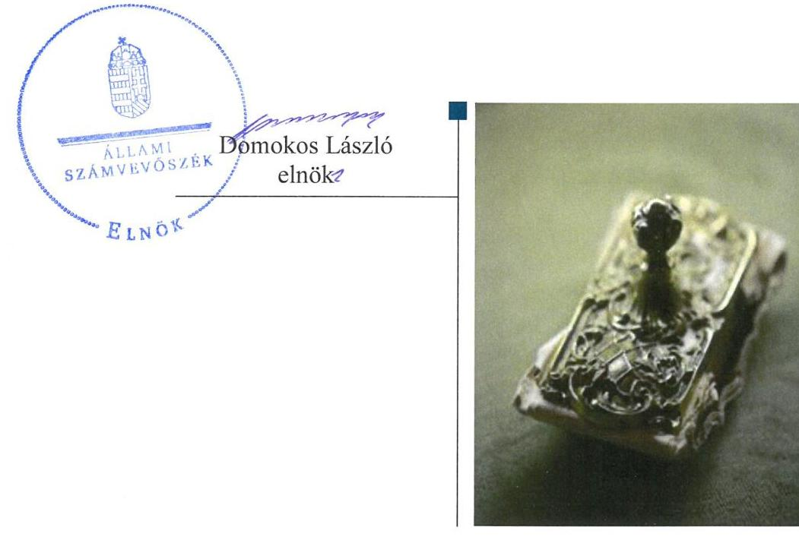
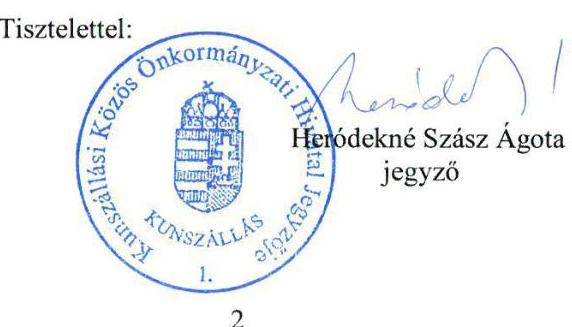
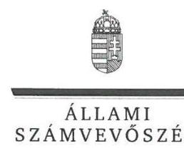
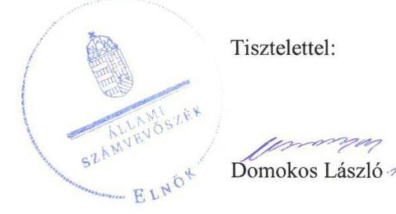
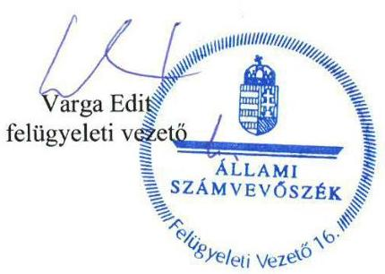

# Jelentés 

## Önkormányzatok ellenőrzése

Integritás- és belső kontrollrendszer, Befektetési tevékenységek ellenőrzése - Kunszállás Község Önkormányzata 2019. 10. hó 16. nap

---

# AZ ELLENŐRZÉST FELÜGYELTE:

- VARGA EDIT felügyeleti vezető

- AZ ELLENŐRZÉST VEZETTE ÉS A VÉGREHAJTÁSÁÉRT FELELŐS:
  - RÁCZKEVI KATALIN ellenőrzésvezető (2019. január 14-ig)
  - GÁL MAGDOLNA ellenőrzésvezető (2019. január 15-től)

- A PROGRAM ÖSSZEÁLLÍTÁSÁÉRT FELELŐS:
  - TÓTPÁL SZABOLCS osztályvezető

- IKTATÓSZÁM: EL-1632-001/2019

- Jelentéseink az Országgyűlés számítógépes hálózatán és az Interneten a www.asz.hu címen is olvashatóak.

- TÉMASZÁM: 2485

- ELLENŐRZÉS-AZONOSÍTÓ SZÁM: V082933, V0829102

---

# TARTALOMJEGYZÉK 

■ ÖSSZEGZÉS ..... 5
■ AZ ELLENŐRZÉS CÉLJA ..... 6
■ AZ ELLENŐRZÉS TERÜLETE ..... 7
■ AZ ELLENŐRZÉS HÁTTERE, INDOKOLTSÁGA ..... 8
■ A JELENTÉS LÉNYEGES KÉRDÉSKÖREI ..... 9
■ AZ ELLENŐRZÉS HATÓKÖRE ÉS MÓDSZEREI ..... 10
■ MEGÁLLAPÍTÁSOK ..... 12
■ JAVASLATOK ..... 16
■ MELLÉKLETEK ..... 19
I. sz. melléklet: Értelmező szótár ..... 19
■ FÜGGELÉKEK ..... 21
I. sz. függelék a jelentéshez ..... 21
II. sz. függelék: Észrevételek ..... 22
■ RÖVIDÍTÉSEK JEGYZÉKE ..... 29

---

.

---

# ÖSSZEGZÉS 

Kunszállás Község Önkormányzata belső kontrollrendszerének kialakítása és működtetése nem volt szabályszerű, így nem volt biztosított a közpénzekkel, a nemzeti vagyonnal való átlátható és felelős gazdálkodás, a befektetési tevékenység szabályszerű végzése. Az integritás kontrollokat nem építették ki, így a korrupciós kockázatokkal szemben nem volt védett Kunszállás Község Önkormányzata.

## Az ellenőrzés társadalmi indokoltsága

Az Állami Számvevőszék alapvető feladata a közpénzekkel, az állami és önkormányzati vagyonnal való gazdálkodás ellenőrzése. Az Alaptörvény szerint az önkormányzatok kötelezettsége a kiegyensúlyozott, átlátható és fenntartható költségvetési gazdálkodás elvének érvényesítése, a nemzeti vagyonnal való rendeltetésszerű és felelős módon való gazdálkodás biztosítása. Az Állami Számvevőszék stratégiájában megfogalmazott célkitűzése az integritás alapú, átlátható és elszámoltatható közpénzfelhasználás elősegítése. Az önkormányzatok szabad pénzeszközeinek felhasználása során kiemelten fontos a felelős gazdálkodás érvényesülése, amely összhangban kell, hogy legyen az önkormányzati vagyongazdálkodás alapelveivel.

Ennek megvalósítása érdekében az Állami Számvevőszék prioritásként kezeli a közpénzzel gazdálkodó szervezetek esetében a belső kontrollrendszer, valamint a befektetési tevékenység szabályszerű működésének ellenőrzését.

## Főbb megállapítások, következtetések, javaslatok

Kunszállás Község Önkormányzata belső kontrollrendszerének kialakítása és működtetése a 2017. évben nem volt szabályszerű.

A kontrollkörnyezet kialakítása nem volt szabályszerű az etikai elvekkel és etikai eljárásokkal, valamint az integrált kockázatkezelés eljárásrendjével kapcsolatos szabályozás elmaradása miatt. A jegyző a szervezet tevékenységében rejlő és a szervezeti célokkal összefüggő kockázatokat nem mérte fel. A gazdálkodási folyamatokhoz kapcsolódó kontrolltevékenységek működtetésének követelményeit kialakították, a 2017. évben a kiadások elszámolása szabályszerűen történt. A jegyző az információs és kommunikációs folyamatokat nem szabályszerűen alakította ki, nem biztosította, hogy a megfelelő információk a megfelelő időben az illetékeshez eljussanak. A jegyző Kunszállás Község Önkormányzata monitoring rendszerét nem szabályszerűen alakította ki, mert a Hivatal SZMSZ-ében nem írta elő a belső ellenőrzést végző személy feladatait.

A szervezet integritását támogató kontrollok kialakítása nem történt meg, a korrupciós kockázatokat nem kezelték. Kunszállás Község Önkormányzatánál a szervezeti teljesítmény mérésére alkalmas követelményeket nem alakították ki, így a teljesítmény mérésének lehetőségét nem biztosították.

A befektetési tevékenységek szabályszerű végzését a kiépített belső kontrollrendszer nem biztosította a 2013-2017. években. A befektetésekkel kapcsolatos döntéshozatal, a befektetések számviteli elszámolása és nyilvántartása nem volt szabályszerű.

Az Állami Számvevőszék a jelentésben foglalt megállapítások alapján Kunszállás Község Önkormányzata polgármesterének három, a Kunszállási Közös Önkormányzati Hivatal jegyzője részére pedig 12 javaslatot fogalmazott meg. A javaslatokat megalapozó megállapításokra az érintetteknek 30 napon belül intézkedési tervet kell készíteniük.

---

# AZ ELLENŐRZÉS CÉLJA 

Az ellenőrzés célja annak megállapítása volt, hogy az önkormányzat belső kontrollrendszere biztosította-e a közpénzekkel és a nemzeti vagyonnal történő elszámoltatható, átlátható, szabályszerű, gazdaságos, hatékony és eredményes gazdálkodás feltételeit, a kontrollkörnyezet biztosította-e a befektetési tevékenységek szabályszerű végzését. Az ellenőrzés keretében értékeltük, hogy az önkormányzatnál kiépítették és erősítették-e a korrupciós kockázatok kezelését szolgáló integritás kontrollokat, megteremtették-e a teljesítményellenőrzés feltételeit, továbbá az egyes befektetési tevékenységekkel kapcsolatos döntéshozatal és a döntések végrehajtása, valamint az egyes befektetések számviteli elszámolása, nyilvántartása szabályszerű volt-e, a belső ellenőrzések támogatták-e az egyes befektetési tevékenységek szabályszerű végzését.

---

# AZ ELLENŐRZÉS TERÜLETE 

## Kunszállás Község Önkormányzata

Kunszállás település Bács-Kiskun megyében található, állandó lakosainak száma 2018. január 1-jén 1650 fő volt a Központi Statisztikai Hivatal Magyarország közigazgatási helynévkönyve adatai alapján.

Az Önkormányzat hét tagú képviselő-testületének munkáját kettő állandó bizottság segítette. A településen nemzetiségi önkormányzat nem működött.

Az Önkormányzat gazdálkodási feladatait a Hivatal 2013. április 1-jétől látta el. A Hivatalban 2017. év végén foglalkoztatottak záró létszáma 12 fő volt.

A polgármester a 2006. évi önkormányzati választások óta tölti be tisztségét, a jegyző személye az ellenőrzött időszakban egy alkalommal, 2017. július 1-jétől változott.

Az Önkormányzat egy költségvetési szervvel rendelkezett (óvoda) a Hivatalon kívül.

Az Önkormányzat a 2017. évi konszolidált éves költségvetési beszámoló szerint 289,1 millió Ft költségvetési bevételt ért el, valamint 339,2 millió Ft költségvetési kiadást teljesített, vagyonának értéke 2017. december 31-én 885,2 millió Ft volt.

Az Önkormányzat 2017. december 31-én öt gazdasági társaságban rendelkezett részesedéssel, melyek közül a Kunszállási Falugazdálkodási Kft. nem látott el közfeladatot. Az Önkormányzatnak a Kft-ben fennálló részesedése - 100 %-os tulajdoni részarány mellett - 3,0 millió Ft volt. Az Önkormányzat 2017. december 31-én 10,1 millió Ft értékben befektetési jeggyel és kilenc darab, összesen 26,9 millió Ft értékű üzleti célú ingatlannal rendelkezett.

---

# AZ ELLENŐRZÉS HÁTTERE, INDOKOLTSÁGA 

A BELSŐ KONTROLLRENDSZER kialakítása és működtetése nélkül nem valósítható meg a közpénzek, a közvagyon átlátható, szabályos, gazdaságos, hatékony és eredményes felhasználása. A belső kontrollrendszer azt a célt szolgálja, hogy a költségvetési szervek működésük és gazdálkodásuk során a tevékenységeket szabályszerűen hajtsák végre, teljesítsék elszámolási kötelezettségeiket és megvédjék az erőforrásokat a veszteségektől, a károktól és a nem rendeltetésszerű használattól.

A belső kontrollrendszer magában foglalja mindazon elveket, eljárásokat és belső szabályzatokat, melyek biztosítják, hogy a költségvetési szerv valamennyi tevékenysége és célja összhangban legyen a szabályszerűséggel, szabályozottsággal, valamint a gazdaságosság, hatékonyság és eredményesség követelményeivel, az eszközökkel és forrásokkal való gazdálkodásban ne kerüljön sor pazarlásra, visszaélésre, rendeltetésellenes felhasználásra. Megfelelő, pontos és naprakész információk álljanak rendelkezésre a költségvetési szerv működésével kapcsolatosan, és a belső kontrollrendszer harmonizációjára, összehangolására vonatkozó jogszabályok végrehajtásra kerüljenek. Az integritás kontrollok kiépítése, erősítése a szervezet korrupciós kockázatainak kezelését szolgálja. A teljesítménykövetelmények meghatározása és működtetése megalapozhatja az önkormányzatoknál a teljesítményellenőrzés lefolytatását.

## AZ ÖNKORMÁNYZATI VAGYONGAZDÁLKODÁS ker

etében az önkormányzatok átmenetileg szabad pénzeszközeinek befektetését jogszabály nem tiltja, a befektetések jellege nem korlátozott, a pénzpiaci szolgáltatók közül az önkormányzatok a kínált szolgáltatás és annak költségei alapján szabadon választhatnak, azonban a veszteséges gazdálkodás kockázatai és következményei az önkormányzatokat terhelik. A szabad pénzeszközök felhasználása során kiemelten fontos a felelős gazdálkodás érvényesülése, amely összhangban kell, hogy legyen, az önkormányzati gazdálkodás alapelveivel.

Az ellenőrzéssel feltárásra kerülhetnek azok a kockázatok, amelyek az önkormányzatok gazdálkodásával, ezen belül befektetési tevékenységeivel, kontrollkörnyezetével kapcsolatosak és a befektetési tevékenységek szabályszerű végrehajtását befolyásolják. Az ellenőrzéssel az önkormányzatok befektetési/vagyongazdálkodási döntései értékelhetővé válnak, és megalapozott megállapítás tehető arra vonatkozóan, hogy milyen hatást gyakoroltak az önkormányzat vagyonára a képviselő-testület döntései.

---

# A JELENTÉS LÉNYEGES KÉRDÉSKÖREI 

1. Az Önkormányzat belső kontrollrendszerének kialakítása és működtetése szabályszerű volt-e a 2017. évben?
2. Az Önkormányzatnál alakítottak-e ki a teljesítmény mérésére alkalmas követelményeket?
3. Az Önkormányzat befektetési tevékenységének szabályszerű végzését a kiépített belső kontrollrendszer biztosította-e a 2013-2017. években, a befektetésekkel kapcsolatos döntéshozatal és a döntések végrehajtása, a befektetések számviteli elszámolása, nyilvántartása szabályszerű volt-e?

---

# AZ ELLENŐRZÉS HATÓKÖRE ÉS MÓDSZEREI 

## Az ellenőrzés típusa

Megfelelőségi ellenőrzés.

## Az ellenőrzött időszak

A belső kontrollrendszer ellenőrzésére vonatkozóan a 2017. év, ill. az éves költségvetési beszámoló Áht. által megállapított jóváhagyásáig (2018. május 31-ig) tartó időszak volt.

Kunszállás Község Önkormányzata befektetési tevékenysége vonatkozásában 2013. január 1. - 2017. december 31. közötti időszak, továbbá a 2013. január 1. előtti időszak is, amennyiben a 2017. december 31-én meglévő befektetésekkel kapcsolatos döntéshozatalra a 2013. január 1. előtti időszakban került sor.

## Az ellenőrzés tárgya

Kunszállás Község Önkormányzata, és a gazdálkodási feladatokat ellátó Kunszállási Közös Önkormányzati Hivatal belső kontrollrendszerének kialakítása és működtetése, valamint az integritási kontrollok kiépítettsége, a teljesítményellenőrzés feltételei.

Kunszállás Község Önkormányzata 2017. december 31-én meglévő, a Számv. tv. 3. § (6) bekezdés 2. és 3. pontjai szerint az értékpapírokban megtestesülő befektetései, lekötött betétei. Továbbá a 2017. december 31-én meglévő, az Önkormányzat szabad pénzeszközei terhére, adásvételi szerződés keretében megszerzett, a kötelező feladatok ellátását nem szolgáló, az Önkormányzat üzleti vagyonába tartozó ingatlanok; az üzleti vagyon körébe tartozó, befektetési céllal megszerzett, de még használatba nem vett ingatlan beruházások, továbbá az - időkorlátozás nélkül megszerzett - kulturális javak (műtárgyak, műalkotások, stb.), illetve egyéb értéktárgyak (pl. ékszerek, befektetési nemesfém).

## Az ellenőrzött szervezet

Kunszállás Község Önkormányzata, valamint a Kunszállási Közös Önkormányzati Hivatal

---

# Az ellenőrzés jogalapja 

Az ellenőrzés jogszabályi alapját az ÁSZ tv. 1. § (3) bekezdés, 5. § (2) és (6) bekezdései, valamint az Áht. 61. § (2) bekezdésének előírásai képezték.

## Az ellenőrzés módszerei

Az ÁSZ az ellenőrzést az ellenőrzési program szempontjai, az ellenőrzött időszakban hatályos jogszabályok, az ellenőrzés szakmai szabályai, a jelen ellenőrzésre irányadó ÁSZ módszertanok figyelembevételével hajtotta végre.

Az ellenőrzés ideje alatt az ellenőrzött szervezettel történő kapcsolattartást az ÁSZ SZMSZ-ének vonatkozó előírásai alapján biztosította az ÁSZ.

Az ellenőrzési kérdések megválaszolásához szükséges bizonyítékok megszerzése az ellenőrzött által rendelkezésre bocsátott dokumentumokra, adatokra alapozva megfigyelés, mintavételezés, valamint elemző eljárás útján történt. Az ellenőrzési bizonyítékként felhasznált adatforrások közé tartoztak az ellenőrzési program részletes szempontjainál felsorolt adatforrások, valamint minden egyéb - az ellenőrzés folyamán feltárt, az ellenőrzés szempontjából információt tartalmazó - dokumentumok.

Az ellenőrzés lefolytatásához az ellenőrzött szervezet tanúsítványok kitöltésével, valamint az ÁSZ által kért dokumentumok megküldésével szolgáltatott adatokat, amelyek valódiságát és teljes körűségét az ellenőrzött szervezet vezetője által tett teljességi és hitelességi nyilatkozat igazolja. A rendelkezésre bocsátott adatok, információk kontrollja az ellenőrzés keretében történt.

Az önkormányzat belső kontrollrendszere egyes pilléreinek kialakítására és működtetésére vonatkozó értékelés:
$\longrightarrow$ „szabályszerű", amennyiben az értékelt területen az elért „igen" válaszok százalékban kifejezett, egész számra kerekített aránya legalább 85 %,
$\longrightarrow$ „nem szabályszerű", ha nem éri el a 85 %-ot.
Az önkormányzat belső kontrollrendszerének összesített értékelése az egyes részterületek esetében kapott megfelelőségi arányok számtani átlaga alapján történik és megegyezik a pillérenként (kontroll-területenként) alkalmazott százalékos értékelésekkel, a következő eltérésekkel: a kontrollrendszer egésze esetében a „szabályszerű" értékelésnek a százalékos értéken felül további feltétele, hogy egyik kontrollterület sem kaphat „nem szabályszerű" értékelést.

A 2017. évi kiadások teljesítéséhez kapcsolódó pénzgazdálkodási belső kontrollok működésének szabályszerűsége esetében az ellenőrzés azokra a legnagyobb értékű tételekre - a lényeges
 sokaságra terjedt ki, melyek összértéke eléri a teljes sokaság összértékének 50%-át.

A 2017. évi kiadások esetében a lényeges sokaságot tételesen ellenőrizte az ÁSZ.

---

# 1. Az Önkormányzat belső kontrollrendszerének kialakítása és működtetése szabályszerű volt-e a 2017. évben? 

Összegző megállapítás

Az Önkormányzat belső kontrollrendszerének kialakítása és működtetése a 2017. évben nem volt szabályszerű.

AZ ÖNKORMÁNYZAT NEM SZABÁLYSZERŰ KONTROLLKÖRNYEZETBEN MŰKÖDÖTT mivel:
$\longrightarrow$ a Képviselő-testület a Kttv ${ }^{12}$. 231. § (1) bekezdés előírása ellenére a Hivatal hivatásetikai alapelveinek részletes tartalmát valamint az etikai eljárás szabályait nem állapította meg;
$\longrightarrow$ a jegyző ${ }_{1,2}$ a $\mathrm{Bkr}^{13}$. 6. § (3) bekezdésében foglaltak ellenére a Hivatal ellenőrzési nyomvonalát nem készítette el;
$\longrightarrow$ a jegyző ${ }_{1,2}$ nem adta ki az Ltv. ${ }^{14}$ 10. §. (1) bekezdés c) pontja szerinti iratkezelési szabályzatot;
$\longrightarrow$ a jegyző ${ }_{1,2}$ a Bkr. 6. § (4) bekezdésében előírtak ellenére nem szabályozta a szervezeti integritást sértő események kezelésének eljárásrendjét, valamint az integrált kockázatkezelés eljárásrendjét.
A képviselő-testület működésének részletes szabályait - a Mötv. előírása szerint - az Önkormányzati SZMSZ ${ }^{15}$-ben, a Hivatal feladatellátásának részletes rendjét - az Ávr. ${ }^{16}$ előírásait betartva - a Hivatali SZMSZ ${ }_{1-2}{ }^{17}$-ben meghatározták.

## AZ INTEGRÁLT KOCKÁZATKEZELÉSI RENDSZERT a jegyző ${ }_{1,2}$ nem alakította ki, mivel a Bkr. 7. § (2) bekezdésekben előírtak ellenére nem mérte fel és nem állapította meg a Hivatal tevékenységében rejlő és szervezeti célokkal összefüggő kockázatokat, valamint nem határozta meg az egyes kockázatokkal kapcsolatban szükséges intézkedéseket, valamint azok teljesítésének folyamatos nyomon követésének módját.

A KONTROLLTEVÉKENYSÉGEKET a lényeges sokaság vonatkozásában szabályszerűen gyakorolták az Önkormányzatnál. A kötelezettségvállalásra, pénzügyi ellenjegyzésre, teljesítés igazolására, érvényesítésre, utalványozásra jogosult személyekről és aláírás-mintájukról naprakész nyilvántartást vezettek.

## AZ INFORMÁCIÓS ÉS KOMMUNIKÁCIÓS FOLYAMATOK kialakítása nem volt szabályszerű, mert:

$\longrightarrow$ a jegyző ${ }_{1,2}$ a Bkr. 3. d) pontjában és a Bkr. 9. § (1) - (2) bekezdéseiben előírtak ellenére nem alakított ki olyan rendszereket, amelyek biztosítják, hogy a megfelelő információk a megfelelő időben eljutnak az illetékes szervezethez, szervezeti egységhez, illetve személyhez, továbbá nem határozta meg a beszámolási szinteket, határidőket, módokat;

---

- a jegyző ${ }_{1,2}$ az Ávr. 13. § (2) bekezdés h) pontjában előírtak ellenére belső szabályzatban nem rendezte a kötelezően közzéteendő adatok nyilvánosságra hozatalának rendjét.

A MONITORING-RENDSZER kialakítása nem volt szabályszerű, mert a jegyző ${ }_{1,2}$ a Bkr. 15. § (2) bekezdésében foglaltak ellenére a Hivatal SZMSZ-ében nem írta elő a belső ellenőrzési feladatok ellátását végző személy feladatait.

A jegyző ${ }_{1}$ a Bkr. 11. § (4) bekezdés előírása ellenére a 2017. január 1. és 2017. június 30. közötti időszakra vonatkozóan a Bkr. 1. mellékletét nem töltötte ki, ezáltal a Hivatal belső kontrollrendszerének minőségét a 2017. év I. félévére nem értékelte.

AZ ÖNKORMÁNYZATNÁL AZ INTEGRITÁS elvű működést támogató kontrollok - kockázatelemzés hiányában - nem kerültek kialakításra.

# 2. Az Önkormányzatnál alakítottak-e ki a teljesítmény mérésére alkalmas követelményeket? 

Összegző megállapítás Az Önkormányzatnál nem alakítottak ki a teljesítmény mérésére alkalmas követelményeket.

A SZERVEZET CÉLOK elérését szolgáló feladatok, folyamatok, tevékenységek mérését szolgáló indikátorokat, mérőszámokat, feladat- és teljesítménymutatókat nem képeztek, az Önkormányzat a teljesítmény mérésének lehetőségét nem biztosította.

## 3. Az Önkormányzat befektetési tevékenységének szabályszerű végzését a kiépített belső kontrollrendszer biztosította-e a 2013-2017. években, a befektetésekkel kapcsolatos döntéshozatal és a döntések végrehajtása, a befektetések számviteli elszámolása, nyilvántartása szabályszerű volt-e?

Összegző megállapítás Az Önkormányzat befektetési tevékenységének szabályszerű végzését a belső kontrollrendszer nem biztosította a 2013-2017. években, a befektetésekkel kapcsolatos döntéshozatal és a befektetések számviteli elszámolása, nyilvántartása nem volt szabályszerű.
3.1. számú megállapítás Az Önkormányzat belső kontrollrendszere a 2013-2017. években a befektetési tevékenységet nem támogatta.

A BEFEKTETÉSI TEVÉKENYSÉGEK szabályszerű végzését 2013-2017. években a belső kontrollrendszer nem biztosította, mivel:

---

$\longrightarrow$ az Önkormányzat 2013. január 1. és 2014. december 16. közötti időszakban nem rendelkezett - az Mötv ${ }^{18}$. 53. § (1) bekezdése által előírt - a működésének részletes szabályait meghatározó szervezeti és működési szabályzattal, valamint a Hivatal 2013. január 1. és 2013. március 31. közötti időszakban az Áht. 10. § (5) bekezdése által előírt Hivatali SZMSZ-szel;
$\longrightarrow$ a jegyző ${ }_{1,2}$ a Bkr. 6. § (4) bekezdésében előírtak ellenére 2016. szeptember 30-ig nem szabályozta a szabálytalanságok kezelésének eljárásrendjét, 2016. október 1-jétől a szervezeti integritást sértő események kezelésének eljárásrendjét, valamint az integrált kockázatkezelés eljárásrendjét;
$\longrightarrow$ a Számv. tv. 161. § (1) bekezdésében előírtak ellenére a polgármester az Önkormányzat számlarendjét a 2013-2017. években, a jegyző ${ }_{1}$ a Hivatal számlarendjét 2017. június 30-ig nem készítette el;
$\longrightarrow$ a befektetési tevékenység vonatkozásában jegyző ${ }_{1,2}$ a Bkr. 7. § (2) bekezdés előírása ellenére nem mérte fel és nem állapította meg a Hivatalnál - 2016. szeptember 30-ig a tevékenységében, gazdálkodásában rejlő-, 2016. október 1-től a tevékenységében rejlő és szervezeti célokkal összefüggő - kockázatokat, nem határozta meg az egyes kockázatokkal kapcsolatban szükséges intézkedéseket, valamint azok teljesítésének folyamatos nyomon követésének módját;
$\longrightarrow$ a jegyző ${ }_{1,2}$ a Bkr. 3. § d) pontjában előírtak ellenére nem alakította ki az Önkormányzat információs rendszerét az egyes befektetési tevékenységek vonatkozásában, a 9. § (2) bekezdésében foglaltak ellenére a beszámolási szinteket, határidőket és módokat nem határozta meg.
Az Önkormányzat egyes befektetési tevékenységeinek szabályszerű végzését a 2013-2017. években a belső ellenőrzés nem támogatta.

# 3.2. számú megállapítás 

A 2013-2017. években a befektetésekkel kapcsolatos döntéshozatal, a befektetések elszámolása és nyilvántartása nem volt szabályszerű.

A jegyző ${ }_{1,2}$ a Bkr. 8. § (2) bekezdés a) és b) pontjaiban előírtak ellenére a 2013-2017. években a kontrolltevékenység részeként a befektetésekkel kapcsolatos döntésekre vonatkozóan nem biztosította a szervezeti célok elérését veszélyeztető kockázatok csökkentésére irányuló kontrollok kiépítését a döntések dokumentumainak elkészítése, valamint a döntések célszerűségi, gazdaságossági, hatékonysági és eredményességi szempontú megalapozottsága vonatkozásában.

A 2013-2017. években a jegyző ${ }_{1,2}$ a befektetések szabályszerű elszámolása és nyilvántartása érdekében nem intézkedett, mert:
$\longrightarrow$ az Önkormányzat 2017. évi költségvetési beszámolójának mérlegében a befektetett pénzügyi eszközök között kimutatott 3,0 millió Ft értékű, gazdasági társaságban fennálló tartós részesedés, továbbá a 10 138,5 ezer Ft értékű befektetési jegy állomány bizonylat nélkül került a számviteli nyilvántartásokba bejegyzésre, amely ellentétes volt a Számv. tv. 165. § (2) bekezdésében előírtakkal;
$\longrightarrow$ az Önkormányzat a számviteli politika ${ }^{19} 36$. oldal 3. bekezdésében, valamint a számviteli politika ${ }^{20} 4$. oldal utolsó bekezdésében rögzí-

---

tette, hogy a mérlegtételek, köztük a befektetett eszközök értékének alátámasztását analitikus nyilvántartás vezetésével biztosítja. Az Önkormányzat 2017. évi költségvetési beszámolójának mérlegében 3,0 millió Ft értékben kimutatott, gazdasági társaságban fennálló tartós részesedésről a 2013-2017. években, valamint a befektetési jegyekről a 2017. évben az Áhsz. ${ }^{21} 49. § (1) és az Áhsz. ${ }^{22} 45. § (3) bekezdésében foglaltak ellenére nem vezettek részletező nyilvántartást;
az Önkormányzat által a befektetési jegyekről vezetett analitikus nyilvántartás a 2014-2016. években az Áhsz. 2 45. § (3) bekezdésében foglaltak ellenére nem tartalmazta 14. melléklet VIII./1 pont a), b), c), d), e), g) pontjaiban előírt, az értékpapír azonosításához szükséges adatokat, a beszerzésének módját, a forgalmazó adatait, az értékpapírszámla számát, megnevezését, a számlavezető nevét, a beszerzésének célját, számviteli besorolását, kibocsátásának idejét, módját, a bekerülési érték megállapításának módját, a beváltásának feltételeit, az értékeléséhez szükséges adatokat;
az Önkormányzat által a 2014-2017. években az ingatlanokról vezetett nyilvántartás az Áhsz. 2 45. § (3) bekezdésében foglaltak ellenére nem tartalmazta a 14. melléklet VII./1 pont f) és q) pontjaiban előírt, a beszerzést, létesítést és a használatbavételt igazoló bizonylatok azonosításához szükséges adatokat, valamint a leltározással kapcsolatos feljegyzéseket;
a 2013. évi költségvetési beszámoló mérlegében szereplő befektetések (tartós részesedések, befektetési jegyek), a 2014-2017. évi költségvetési beszámolók mérlegében kimutatott befektetések (tartós részesedések, befektetési jegyek, üzleti célú ingatlanok) értékelését a Számv. tv. 46. § (3) bekezdésének előírása ellenére az Önkormányzat nem végezte el;
az Önkormányzat a 2017. évi költségvetési beszámoló mérlegében kimutatott befektetéseket (befektetési jegyek, üzleti célú ingatlanok) a Számv. tv. 69. § (1) bekezdésének előírása ellenére leltárral nem támasztotta alá.

---

# JAVASLATOK 

Az ÁSZ tv. 33. § (1) bekezdésében foglaltak értelmében az ellenőrzött szervezet vezetője köteles a jelentésben foglalt megállapításokhoz kapcsolódó intézkedési tervet összeállítani és azt a jelentés kézhezvételétől számított 30 napon belül az ÁSZ részére megküldeni. Amennyiben az ellenőrzött szervezet vezetője nem küldi meg határidőben az intézkedési tervet, vagy továbbra sem elfogadható intézkedési tervet küld, az Állami Számvevőszék elnöke az ÁSZ tv. 33. § (3) bekezdés a) és b) pontjaiban foglaltakat érvényesítheti.

## Kunszállási Közös Önkormányzati Hivatal jegyzőjének

1. A szabályszerű kontrollkörnyezet kialakítása érdekében gondoskodjon:
a) a Hivatal ellenőrzési nyomvonalának elkészítéséről;
(1. sz. megállapítás 1. bekezdés 2. francia bekezdése alapján)
b) a Hivatal iratkezelési szabályzatának kiadásáról;
(I. sz. megállapítás 1. bekezdés 3. francia bekezdése alapján)
c) a szervezeti integritást sértő események kezelésének, valamint az integrált kockázatkezelés eljárásrendjének szabályozásáról.
(1. sz. megállapítás 1. bekezdés 4. francia bekezdése, valamint 3.1. sz. megállapítás 1. bekezdés 2. francia bekezdése alapján)
2. Gondoskodjon a Hivatal szabályszerű integrált kockázatkezelési rendszerének működtetéséről.
(1. sz. megállapítás 3. bekezdése, valamint 3.1. sz. megállapítás 1. bekezdés 4. francia bekezdése alapján)
3. Az információs és kommunikációs rendszer szabályszerű kialakítása és működtetése érdekében gondoskodjon:
a) olyan rendszerek kialakításáról, amelyek biztosítják, hogy a megfelelő információk a megfelelő időben eljutnak az illetékes szervezethez, szervezeti egységhez, illetve személyhez, továbbá a beszámolási szintek, határidők és módok meghatározásáról;
(1. sz. megállapítás 5. bekezdés 1. francia bekezdése, valamint 3.1. sz. megállapítás 1. bekezdés 5. francia bekezdése alapján)

---

b) a kötelezően közzéteendő adatok nyilvánosságra hozatala rendjének belső szabályzatban történő rendezéséről.
(1. sz. megállapítás 5. bekezdés 2. francia bekezdése alapján)
4. A szabályszerű monitoring rendszer kialakítása és működtetése érdekében gondoskodjon a belső ellenőrzési feladatok ellátását végző személy feladatainak a Hivatal SZMSZ-ében történő előírásáról.
(1. sz. megállapítás 6. bekezdése alapján)
5. Az Önkormányzat befektetéseivel kapcsolatos döntésekre vonatkozóan biztosítsa a szervezeti célok elérését veszélyeztető kockázatok csökkentésére irányuló kontrollok kiépítését a döntések dokumentumainak elkészítése, valamint a döntések célszerűségi, gazdaságossági, hatékonysági és eredményességi szempontú megalapozottsága vonatkozásában.
(3.2. sz. megállapítás 1. bekezdése alapján)
6. Az Önkormányzat befektetéseinek szabályszerű számviteli elszámolása és nyilvántartása érdekében gondoskodjon:
a) arról, hogy a számviteli nyilvántartásokba csak szabályszerűen kiállított bizonylat alapján jegyezzenek be adatokat;
(3.2. sz. megállapítás 2. bekezdés 1. francia bekezdése alapján)
b) a tartós részesedésekkel, befektetési jegyekkel és ingatlanokkal kapcsolatos részletező nyilvántartások jogszabályi előírásoknak megfelelő vezetéséről;
(3.2. sz. megállapítás 2. bekezdés 2. és 4. francia bekezdései alapján)
c) a tartós részesedések, befektetési jegyek, üzleti célú ingatlanok értékeléséről;
(3.2. sz. megállapítás 2. bekezdés 5. francia bekezdés 2. tagmondata alapján)
d) a befektetési jegyek és üzleti célú ingatlanok leltárának összeállításáról.
(3.2. sz. megállapítás 2. bekezdés 6. francia bekezdése alapján)

---

# Kunszállás Község Önkormányzata polgármesterének
 1. Gondoskodjon a Hivatal vonatkozásában a hivatásetikai alapelvek részletes tartalmának, valamint az etikai eljárás szabályainak képviselő testület elé terjesztéséről.
(1. sz. megállapítás 1. bekezdés 1. francia bekezdése alapján)
2. Gondoskodjon a Hivatal jogszabályi előírásoknak megfelelő tartalmú szervezeti és működési szabályzatának képviselő testület elé terjesztéséről.
(1. sz. megállapítás 6. bekezdése alapján)
3. Gondoskodjon az Önkormányzat számlarendjének elkészítéséről.
(3.1. sz. megállapítás 1. bekezdés 3. francia bekezdés 1. tagmondata alapján)

---

# MELLÉKLETEK 

- I. SZ. MELLÉKLET: ÉRTELMEZŐ SZÓTÁR
befektetési szolgáltatási tevékenység
belső ellenőrzés
belső kontrollrendszer
belső kontrollrendszer területei
információs és kommunikációs rendszer
integrált kockázatkezelési rendszer
integritás
irányító szerv/felügyeleti szerv
kockázat

Rendszeres gazdasági tevékenység keretében, pénzügyi eszközre vonatkozóan végzett megbízás felvétele és továbbítása, megbízás végrehajtása az ügyfél javára, sajátszámlás kereskedés, portfólió-kezelés, befektetési tanácsadás, pénzügyi eszköz elhelyezése az eszköz (értékpapír vagy egyéb pénzügyi eszköz) vételére vonatkozó kötelezettségvállalással (jegyzési garanciavállalás), pénzügyi eszköz elhelyezése az eszköz (pénzügyi eszköz) vételére vonatkozó kötelezettségvállalás nélkül, és multilaterális kereskedési rendszer működtetése (Bszt. 5. § (1) bekezdés)
Független, tárgyilagos bizonyosságot adó és tanácsadó tevékenység, amelynek célja, hogy az ellenőrzött szervezet működését fejlessze és eredményességét növelje, az ellenőrzött szervezet céljai elérése érdekében rendszerszemléletű megközelítéssel és módszeresen értékeli, illetve fejleszti az ellenőrzött szervezet irányítási és belső kontrollrendszerének hatékonyságát. (Forrás: Bkr. 2. § b) pontja)
A belső kontrollrendszer a kockázatok kezelése és tárgyilagos bizonyosság megszerzése érdekében kialakított folyamatrendszer, amely azt a célt szolgálja, hogy a működés és gazdálkodás során a tevékenységeket szabályszerűen, gazdaságosan, hatékonyan, eredményesen hajtsák végre, az elszámolási kötelezettségeket teljesítsék, megvédjék az erőforrásokat a veszteségektől, károktól és nem rendeltetésszerű használattól. (Forrás: Áht. 69. § (1) bekezdése)
A kontrollkörnyezet, az integrált kockázatkezelési rendszer, a kontrolltevékenységek, az információs és kommunikációs rendszer, valamint a nyomon követési (monitoring) rendszer. (Forrás: Bkr. 3. §-a)
A költségvetési szerv vezetője által kialakított és működtetett olyan rendszer, mely biztosítja, hogy a megfelelő információk a megfelelő időben eljutnak az illetékes szervezethez, szervezeti egységhez, illetve személyhez. (Forrás: Bkr. 9. § (1) bekezdés)
Olyan folyamatalapú kockázatkezelési rendszer, amely a szervezet minden tevékenységére kiterjed, egységes módszertan és eljárások alkalmazásával, a szervezet célkitűzéseinek és értékeinek figyelembevételével biztosítja a szervezet kockázatainak teljes körű azonosítását, azok meghatározott kritériumok szerinti értékelését, valamint a kockázatok kezelésére vonatkozó intézkedési terv elkészítését és az abban foglaltak nyomon követését. (Forrás: Bkr. 2. § m) pontja, 2016. október 1-jétől)
Az integritás az elvek, értékek, cselekvések, módszerek, intézkedések konzisztenciáját jelenti, vagyis olyan magatartásmódot, amely meghatározott értékeknek megfelel. (Forrás: Nemzetgazdasági Minisztérium: Magyarországi államháztartási belső kontroll standardok Útmutató 1.6.1. pontja, 2012. december)
A költségvetési szerv tekintetében az Áht-ban meghatározott irányítási hatáskört gyakorló szerv. (Forrás: Áht. 1. § 9. pontja)
A kockázat annak a valószínűségét jelenti, hogy egy vagy több esemény vagy intézkedés nem kívánt módon befolyásolja a rendszer működését, céljainak megvalósulását. (Forrás: Javaslatok a korrupciós kockázatok kezelésére - Kockázatkezelési és ellenőrzési módszertan 35. oldal, ÁSZ)

---

kontrollkörnyezet

kontrolltevékenységek
kommunikáció
közös önkormányzati hivatal
monitoring
monitoring-rendszer
önkormányzati hivatal
társulás

A költségvetési szerv vezetője által kialakított olyan elvek, eljárások, belső szabályzatok összessége, amelyben világos a szervezeti struktúra, a folyamatok átláthatók, egyértelműek a felelősségi, hatásköri viszonyok és feladatok, meghatározottak, ismertek és elfogadottak az etikai elvárások a szervezet minden szintjén, átlátható a humánerőforrás-kezelés, biztosított a szervezeti célok és értékek irányában való elkötelezettség fejlesztése és elősegítése. (Forrás: Bkr. 6. § (1) bekezdés)
A költségvetési szerv vezetője által a szervezeten belül kialakított (kontroll) tevékenységek, melyek biztosítják a kockázatok kezelését, hozzájárulnak a szervezet céljainak eléréséhez és erősítik a szervezet integritását. (Forrás: Bkr. 8. § (1) bekezdés)
Az a tevékenység, melynek során információ továbbítása valósul meg. A kommunikációs folyamat résztvevői között tájékoztatás történik, mely során tényeket, ezek magyarázatát közlik.
A települési képviselő-testület más települési képviselő-testülettel társult képviselő-testületet alakíthat, amely esetén a képviselő-testületek részben vagy egészben egyesítik a költségvetésüket, közös önkormányzati hivatalt tartanak fenn és intézményeiket közösen működtetik. (Forrás: Mötv. 56. § (1)-(2) bekezdései)
A monitoring általánosságban a különböző szintű szervezeti célok megvalósításának folyamatát kíséri figyelemmel, melynek során a releváns eseményekről és tevékenységekről (együtt: folyamatokról) rendszeres jelleggel, strukturált, döntéstámogató információkhoz jutnak a szervezet vezetői. (Forrás: NGM Útmutató a költségvetési szervek monitoring rendszeréhez 2011. november)
A költségvetési szerv vezetője köteles kialakítani a szervezet tevékenységének a célok megvalósításának nyomon követését biztosító rendszert, amely az operatív tevékenységek keretében megvalósuló folyamatos és eseti nyomon követésből, valamint az operatív tevékenységektől függetlenül működő belső ellenőrzésből állhat. (Forrás: Bkr. 10. §)
A polgármesteri hivatal, a főpolgármesteri hivatal, a megyei önkormányzati hivatal és a közös önkormányzati hivatal. (Forrás: Áht. 1. § 18. pont)
A helyi önkormányzatok képviselő-testületei megállapodhatnak abban, hogy egy vagy több önkormányzati feladat- és hatáskör, valamint a polgármester és a jegyző államigazgatási feladat- és hatáskörének hatékonyabb, célszerűbb ellátására jogi személyiséggel rendelkező társulást hoznak létre. (Forrás: Mötv. 87. §)

---

# FÜGGELÉKEK 

- I. SZ. FÜGGELÉK A JELENTÉSHEZ

Az Állami Számvevőszék az ellenőrzések során feltárt tényekhez kapcsolódó további körülmények tisztázására eszközrendszerrel nem rendelkezik. Amennyiben az ellenőrzésen túlmutatóan indokoltnak látszik az ellenőrzés során feltárt körülmények további vizsgálata, az Állami Számvevőszék törvényi felhatalmazás alapján az ellenőrzés által feltárt körülményeket továbbítja a hatáskörrel rendelkező szervnek a szükséges intézkedések megtétele, eljárások lefolytatása érdekében.

1. Az Önkormányzat a 2017. évi költségvetési beszámolójának mérlegében befektetett pénzügyi eszközként kimutatott 3,0 millió Ft értékű gazdasági társaságban fennálló tartós részesedés, valamint 10,1 millió Ft értékű befektetési jegy állomány számviteli nyilvántartásba bejegyzésére a Számv. tv. 165. § (2) bekezdésében előírtak ellenére bizonylat nélkül került sor.
2. A 2013. évi költségvetési beszámoló mérlegében szereplő befektetések (tartós részesedések, befektetési jegyek), a 2014-2017. évi költségvetési beszámolók mérlegében kimutatott befektetések (tartós részesedések, befektetési jegyek, üzleti célú ingatlanok) értékelését a Számv. tv. 46. § (3) bekezdésének előírása ellenére az Önkormányzat nem végezte el.
3. Az Önkormányzat a 2017. évi költségvetési beszámoló mérlegében kimutatott befektetéseket (befektetési jegyek, üzleti célú ingatlanok) a Számv. tv. 69. § (1) bekezdésének előírása ellenére leltárral nem támasztotta alá.
A feltárt szabálytalanságok miatt nem igazolt, hogy az Önkormányzat 2017. évi éves beszámolója a Számv. tv. 15. § (3) bekezdésében rögzített valódiság elvének megfelelő megbízható, valós összképet mutat.
Az 1-3. számú esetek konkrét körülményeinek felderítésére a Magyar Államkincstár rendelkezik hatáskörrel.

---

A jelentéstervezetet a Számvevőszék 15 napos észrevételezésre megküldte az ellenőrzött szervezetek vezetőinek az ÁSZ tv. 29. § (1) bekezdése előírása szerint.

Az ÁSZ a jelentéstervezetet észrevételezésre megküldte Kunszállás Község Önkormányzata polgármestere és a Kunszállási Közös Önkormányzati Hivatal jegyzője részére.
Kunszállás Község Önkormányzata polgármestere az ÁSZ tv. 29. § (2) bekezdésében foglalt észrevételezési jogával nem élt, a jelentéstervezet megállapításaira észrevételt nem tett. A Kunszállási Közös Önkormányzati Hivatal jegyzőjének észrevételét és az arra adott választ a függelék tartalmazza.

[^0]
[^0]:    * 29. § (1) Az Állami Számvevőszék az ellenőrzési megállapításait megküldi az ellenőrzött szervezet vezetőjének vagy az általa megbízott személynek, és annak, akinek személyes felelősségét állapította meg.
    (2) Az ellenőrzött szervezet vezetője és a felelősként megjelölt személy az ellenőrzés megállapításaira tizenöt napon belül írásban észrevételt tehet.
    (3) Az Állami Számvevőszék az észrevételre a beérkezésétől számított harminc napon belül írásban válaszol. A figyelembe nem vett észrevételeket köteles a jelentésben feltüntetni, és megindokolni, hogy azokat miért nem fogadta el.

---

# KUNSZÁLLÁSI KÖZÖS ÖNKORMÁNYZATI HIVATAL   6115 Kunszállás, Dózsa György u. 24.   Tel.: 06-76/587-621, Fax.:06-76/587-622   E-mail: info@kunszallas.hu 

Ikt. szám: KUN/1060-2/2019..
Tárgy: Észrevétel benyújtása
Hiv.szám: EL-0835-042/2019.

## ÁLLAMI SZÁMVEVŐSZÉK

BUDAPEST 4.
Pf: 54 .
1364

Tisztelt Címzett !

Kunszállás Község Önkormányzata részéről az Állami Számvevőszék 2019. június 4. napján kelt, fenti iktatószámon megküldött, az „Önkormányzatok ellenőrzése - Integritás- és belső kontrollrendszer, Befektetési tevékenységek ellenőrzése - Kunszállás Község Önkormányzata" című jelentéstervezet tekintetében, a törvényes határidőn belül az alábbiakban részletezett észrevételt terjesztem elő:

1. Önkormányzatunknál 2018. évben két alkalommal került sor az Állami Számvevőszék által tartott ellenőrzésre. Az első adatbekérő június 11-én, a második ellenőrzésre vonatkozó pedig december 11-én érkezett. Nem mentegetőzni szeretnék, de az időzítés nem igazán volt megfelelő egyik esetben sem, hisz a nyári szabadságolások, illetve az év végi feladatok teljesítése miatt a rendelkezésünkre álló 5 munkanap a nagy mennyiségű irat előkeresésére és hitelesítés után az Elektronikus Adatbekérési Rendszerbe történő feltöltésére nagyon szűkösnek bizonyult. Mindezen túl az önkormányzati gazdálkodással foglalkozó egyik köztisztviselő tartós betegszabadsága - mely időtartam mindkét ellenőrzést átfogta - sem segítette elő a feladat teljes körű lebonyolítását. Mindezek ellenére a tőlünk elvárható módon, köztisztviselőként igyekeztünk eleget tenni a megküldött adatszolgáltatási kötelezettségnek.
2. Sajnos nem nyílt lehetőségünk arra, hogy egyes pontok tekintetében tisztázó kérdést tegyünk fel, így nem volt világos számunkra, hogy adott esetben mely dokumentumok feltöltését várja el tőlünk az Állami Számvevőszék és így adódhatott, hogy több pontnál negatív megállapítás készült.
3. Egyes részletező megállapítások:

Megállapítás 1. számú 1. bekezdés 3. francia bekezdése: „a jegyző nem adta ki az Ltv. 10. § (1) bekezdése szerinti iratkezelési szabályzatot"

---

# Észrevétel: 

Kunszállás Község Önkormányzata Polgármesteri Hivatalának 2007. január 2-án kelt hitelesített Iratkezelési szabályzatát feltöltöttük. Valamint a 2018. június 1-tól hatályos, hitelesített Egyedi Iratkezelési Szabályzat, mely a 2007. évi szabályzatot hatályon kívül helyezte, szintén csatoltuk.

Megállapítás 2. számú „A szervezeti célok elérését szolgáló feladatok, folyamatok, tevékenységek mérését szolgáló indikátorokat, mérőszámokat, feladat- és teljesítménymutatókat nem képeztek, az önkormányzat a teljesítmény mérésének lehetőségét nem biztosította."

## Észrevétel:

A jegyző teljesítményértékelési rendszert működtet a 10/2013.(I.21.) Korm. rendelet értelmében, melyről 1266-2/2017. iktatószámú hitelesített tájékoztatás feltöltésre került.

Megállapítás 3.1. számú 1. francia bekezdés ,,az Önkormányzat 2013. január 1. és 2014. december 16. közötti időszakban nem rendelkezett - az Mötv. 53. § (1) bekezdése által előírt a működésének részletes szabályait meghatározó szervezeti és működési szabályzattal, valamint a Hivatal 2013. január 1. és 2013. március 31. közötti időszakban az Áht. 10. § (5) bekezdése által előírt Hivatali SZMSZ-szel"

## Észrevétel:

Kunszállás Község Önkormányzat Képviselő-testületének a Képviselő-testület és szervei Szervezeti és Működési Szabályzatáról szóló 1/2011. (II.1.) ÖR. rendelet tartalmazta a működési szabályokat, melyet a 16/2014. (XII.16.) önkormányzati rendelet helyezett hatályon kívül.

Kunszállás Község Polgármesteri Hivatala Szervezeti és Működési Szabályzatát a Képviselőtestület a 114/2008.(IX.29.) ÖH határozatával hagyta jóvá. A Kunszállási Közös Önkormányzati Hivatal Szervezeti és Működési Szabályzatának 2013. április 1-jei hatályba lépésének időpontjával a korábbi szabályzat hatályát vesztette.

A jelentéstervezetben feltárt hiányosságok, hibák kiküszöbölése folyamatban van, a pótlásokról igyekezünk mielőbb gondoskodni.

Kunszállás, 2019. június 19.

---

ELNÖK

Ikt.szám: EL-0835-051/2019.

# Heródekné Szász Ágota úrhölgy 

jegyző
Kunszállási Közös Önkormányzati Hivatal

## Kunszállás

## Tisztelt Jegyző Úrhölgy!

Az „Önkormányzatok ellenőrzése - Integritás- és belső kontrollrendszer, Befektetési tevékenységek ellenőrzése - Kunszállás Község Önkormányzata" címmel készített számvevőszéki jelentéstervezetre tett észrevételét köszönettel megkaptam.
Az Állami Számvevőszék észrevételre vonatkozó álláspontjáról a felügyeleti vezető által készített részletes tájékoztatást csatoltan megküldöm.
Tájékoztatom Jegyző úrhölgyet, hogy a számvevőszéki jelentésben - az Állami Számvevőszékről szóló 2011. évi LXVI.
 törvény 29. § (3) bekezdése alapján – a figyelembe nem vett észrevételeket szerepeltetjük, annak indoklásával, hogy azokat az Állami Számvevőszék miért nem fogadta el.

Budapest, 2019. 07. hó 12. nap

Melléklet: Tájékoztatás az észrevételek kezeléséről

---

# Tájékoztatás az észrevételek kezeléséről 

„Önkormányzatok ellenőrzése – Integritás- és belső kontrollrendszer, Befektetési tevékenységek ellenőrzése – Kunszállás Község Önkormányzata” című jelentéstervezetre a 2019. június 19-én kelt, KUN/1060-2/2019. iktatószámú levelében tett észrevételét áttekintettük, annak kezeléséről az alábbi tájékoztatást adom.

## I. Az adatszolgáltatásra vonatkozó észrevételei kapcsán

1. Az ellenőrzés és a hozzá kapcsolódó adatbekérés időzítésére, valamint az adatszolgáltatásra nyitva álló határidő rövidségére vonatkozó észrevételével kapcsolatban tájékoztatom, hogy az Állami Számvevőszékről szóló 2011. évi LXVI. törvény (továbbiakban: ÁSZ tv.) 24. § (1) b) pontja előírása szerint az Állami Számvevőszék (továbbiakban: ÁSZ) az ellenőrzés végrehajtása során a jogszabályok, az ellenőrzési program, és az ellenőrzési szakmai szabályok, módszerek és az etikai normák szerint jár el. Az ÁSZ tv. 28. § (2) bekezdés előírása alapján a közreműködésre felhívott szervezet az ÁSZ részére – annak kérésére soron kívül, de legkésőbb öt munkanapon belül – az ellenőrzés tervezhetősége, meghatározása, illetve lefolytatása érdekében szükséges adatokat és dokumentumokat rendelkezésre bocsátja, illetve a kapcsolódó tájékoztatást köteles megadni.
2. Az adatszolgáltatással kapcsolatos észrevételében jelzett egyeztetési lehetőség hiányára vonatkozó problémával kapcsolatban tájékoztatom, hogy az Önök részére megküldött 2018. június 12-én kelt EL-0835-002/2018. iktatószámú, a 2018. június 27-én kelt EL-0835004/2018. iktatószámú, valamint a 2018. december 7-én kelt EL-1330-001/2018. iktatószámú adatbekérő leveleink 2. számú mellékleteiben meghatároztuk az ellenőrzéshez megküldendő dokumentumokat.
Az adatszolgáltatásra vonatkozó észrevételeit nem fogadjuk el, az ÁSZ megállapításai helytállóak, a jelentéstervezet módosítása nem indokolt.

## II. A jelentéstervezet egyes részletező megállapításaira vonatkozó észrevételei kapcsán

1. A jelentéstervezet 1. sz. megállapítás 1. bekezdés 3. francia bekezdésére tett észrevétel:

A jelentéstervezet észrevétellel érintett megállapítása szerint: „a jegyző ${ }_{1,2}$ nem adta ki az Ltv. 10. §. (1) bekezdés c) pontja szerinti iratkezelési szabályzatot”. Észrevételében jelezte, hogy Kunszállás Község Önkormányzata Polgármesteri Hivatalának 2007. január 2-án kelt hitelesített Iratkezelési szabályzatát, valamint a 2018. június 1-től hatályos, hitelesített Egyedi Iratkezelési Szabályzatot, amely a 2007. évi szabályzatot hatályon kívül helyezte az ÁSZ rendelkezésére bocsátották.
A jelentéstervezet észrevétellel érintett megállapításában szereplő, a köziratokról, a közlevéltárakról és a magánlevéltári anyag védelméről szóló 1995. évi LXVI. törvény (Ltv.) 10. § (1) bekezdés c) pontja előírja, hogy az önkormányzati hivatal számára a jegyző a Magyar Nemzeti Levéltárral egyetértésben egyedi iratkezelési szabályzatot ad ki.

---

A beküldött, 2007. január 2-án kelt iratkezelési szabályzat nem tartalmazza, illetve az EL-0835-004/2018. iktatószámú adatbekérő levelünk alapján megküldött dokumentumaikhoz kapcsolódó, 2018. július 10-én kelt teljeségi és hitelességi nyilatkozatuk tanulsága szerint külön dokumentum sem tartalmazza a Magyar Nemzeti Levéltár egyetértését a szabályzat kiadásához. Az Ltv. 10. § (1) bekezdés c) pontja szerint a Magyar Nemzeti Levéltár egyetértése a szabályzat kiadásának kelléke, ennek hiányában a szabályzat nem került kiadásra. A 2018. június 1-től hatályos, hitelesített Egyedi Iratkezelési Szabályzat – amelyhez szintén nem áll rendelkezésre a Magyar Nemzeti Levéltár egyetértése – nem érinti az ellenőrzési időszakot, ezért arra vonatkozó megállapítás nem szerepel a jelentéstervezetben.
Mindezek alapján az észrevételt nem fogadjuk el, az ÁSZ megállapítása helytálló, a jelentéstervezet módosítása nem indokolt.
2. A jelentéstervezet 2. sz. megállapítására tett észrevétel:

A jelentéstervezet észrevétellel érintett megállapítása szerint: „A szervezet célok elérését szolgáló feladatok, folyamatok, tevékenységek mérését szolgáló indikátorokat, mérőszámokat, feladat- és teljesítménymutatókat nem képeztek, az Önkormányzat a teljesítmény mérésének lehetőségét nem biztosította.”
Észrevételében jelezte, hogy a jegyző teljesítményértékelési rendszert működtet a 10/2013.(1.21.) Korm. rendelet értelmében, melyről 1266-2/2017. iktatószámú hitelesített tájékoztatás feltöltésre került.
A jelentéstervezet észrevétellel érintett része az ellenőrzés megállapítását tényszerűen közli. Jogszabályi hivatkozással alátámasztott hiányosságot a megállapítás nem tartalmaz, a megállapítást a jegyző 1266-2/2017. iktatószámú tájékoztatásában foglaltak is megalapozzák. A tájékoztatás a Kunszállási Közös Önkormányzati Hivatal köztisztviselőinek négy teljesítménykövetelményt állapít meg, azonban ezek mérését szolgáló indikátorokat, mérőszámokat, feladat- és teljesítménymutatókat nem tartalmaz.
Észrevétele alapján a jelentéstervezet módosítása nem indokolt.
3. A jelentéstervezet 3.1. sz. megállapítás 1. francia bekezdésére tett észrevétel:

A jelentéstervezet észrevétellel érintett megállapítása szerint: „az Önkormányzat 2013. január 1. és 2014. december 16. közötti időszakban nem rendelkezett – az Mötv. 53. § (1) bekezdése által előírt – a működésének részletes szabályait meghatározó szervezeti és működési szabályzattal, valamint a Hivatal 2013. január 1. és 2013. március 31. közötti időszakban az Áht. 10. § (5) bekezdése által előírt Hivatali SZMSZ-szel”.
Észrevételében jelezte, hogy Kunszállás Község Önkormányzat Képviselő-testületének a Képviselő-testület és szervei Szervezeti és Működési Szabályzatáról szóló 1/2011. (II. 1.) ÖR. rendelet tartalmazta a működési szabályokat, melyet a 16/2014. (XII. 16.) önkormányzati rendelet helyezett hatályon kívül. Kunszállás Község Polgármesteri Hivatalának Szervezeti és Működési Szabályzatát a Képviselő-testület a 114/2008.(IX.29.) ÖH határozatával hagyta jóvá. A Kunszállási Közös Önkormányzati Hivatal Szervezeti és Működési Szabályzatának 2013. április 1-jei hatálybalépésének időpontjával a korábbi szabályzat hatályát vesztette.

---

Az észrevételben hivatkozott, Kunszállás Község Önkormányzat Képviselő-testületének a Képviselő-testület és szervei Szervezeti és Működési Szabályzatáról szóló 1/2011. (II. 1.) ÖR. rendelet, valamint Kunszállás Község Polgármesteri Hivatalának a Képviselő-testület a 114/2008.(IX.29.) ÖH határozatával jóváhagyott Szervezeti és Működési Szabályzata az EL-1330-001/2018. iktatószámú adatbekérő levelünk alapján megküldött dokumentumaikhoz kapcsolódó, 2018. december 18-án kelt teljeségi és hitelességi nyilatkozatuk tanulsága szerint nem került az ÁSZ tv. 28. § (2) bekezdése szerinti határidőben megküldésre az ÁSZ részére, így megállapításunkat annak hiányában tettük meg.
Mindezek alapján az észrevételt nem fogadjuk el, az ÁSZ megállapítása helytálló, a jelentéstervezet módosítása nem indokolt.

Budapest, 2019. 07. 14. nap

---

# RÖVIDÍTÉSEK JEGYZÉKE 

${ }^{1}$ Önkormányzat
${ }^{2}$ képviselő-testület
${ }^{3}$ Hivatal
${ }^{4}$ polgármester
${ }^{5}$ jegyző ${ }_{1}$
jegyző
${ }^{6}$ Kft.
${ }^{7}$ Áht.
${ }^{8}$ Számv. tv.
${ }^{9}$ ÁSZ tv.
${ }^{10}$ ÁSZ
${ }^{11}$ ÁSZ SZMSZ
${ }^{12}$ Kttv.
${ }^{13}$ Bkr.
${ }^{14}$ Ltv.
${ }^{15}$ Önkormányzati SZMSZ
${ }^{16}$ Ávr.
${ }^{17}$ Hivatali SZMSZ ${ }_{1}$

Hivatali SZMSZ ${ }_{2}$
${ }^{18}$ Mötv.
${ }^{19}$ Számviteli Politika ${ }_{1}$
${ }^{20}$ Számviteli Politika ${ }_{2}$
${ }^{21}$ Áhsz. ${ }_{1}$
${ }^{22}$ Áhsz. ${ }_{2}$

Kunszállás Község Önkormányzata
Kunszállás Község Önkormányzatának képviselő-testülete
Kunszállási Közös Önkormányzati Hivatal
Kunszállás Község Önkormányzatának polgármestere
Kunszállási Közös Önkormányzati Hivatal jegyzője 2017. június 30-ig
Kunszállási Közös Önkormányzati Hivatal jegyzője 2017. július 1-jétől
Kunszállási Falugazdálkodási Kft.
2011. évi CXCV. törvény az államháztartásról
2000. évi C. törvény a számvitelről
2011. évi LXVI. törvény az Állami Számvevőszékről

Állami Számvevőszék
Az Állami Számvevőszék elnökének 2/2018. (XII.28.) ÁSZ utasítása az Állami
Számvevőszék Szervezeti és Működési Szabályzatáról
2011. évi CXCIX. törvény a közszolgálati tisztviselőkről

370/2011. (XII. 31.) Korm. rendelet a költségvetési szervek belső
kontrollrendszeréről és belső ellenőrzéséről
1995. évi LXVI. törvény a köziratokról, a közlevéltárakról és a magánlevéltári anyag védelméről
Kunszállás Község Önkormányzata Képviselő-testületének 16/2014. (XII.16.) önkormányzati rendelete a képviselő-testület és szervei szervezeti és működési szabályzatáról (Hatályos 2014.12.17-től)
368/2011. (XII.31.) Korm. rendelet az államháztartásról szóló törvény végrehajtásáról
Kunszállás Község Önkormányzati Hivatal Szervezeti és Működési Szabályzata (Hatályos 2013.04.01-től 2017.04.30-ig)
Kunszállás Község Önkormányzati Hivatal Szervezeti és Működési Szabályzata (Hatályos 2017.05.01-től)
2011. évi CLXXXIX. törvény Magyarország helyi önkormányzatairól

Kunszállás Község Önkormányzata Számviteli politika (hatályos 2012. szeptember 1-jétől 2015. december 21-ig)
Kunszállási Közös Önkormányzati Hivatal Számviteli politika (hatályos 2015. december 22-től)
249/2000. (XII. 24.) Korm. rendelet az államháztartás szervezetei beszámolási és könyvvezetési kötelezettségének sajátosságairól (hatályos: 2013. december 31-ig)
4/2013. (I. 11.) Korm. rendelet az államháztartás számviteléről (hatályos 2014. január 1-jétől)

---

# ÁLLAMI SZÁMVEVŐSZÉK 

1052 Budapest, Apáczai Csere János utca 10.
Levélcím: 1364 Budapest 4. Pf. 54
Telefon: +36 14849100 Telefax: +36 14849200
www.asz.hu
