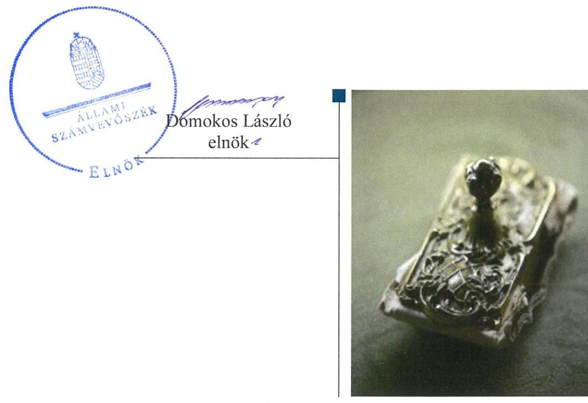
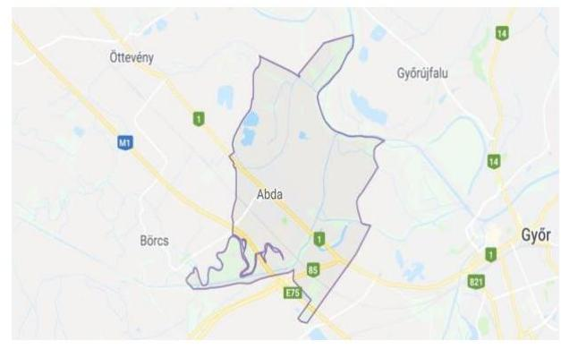
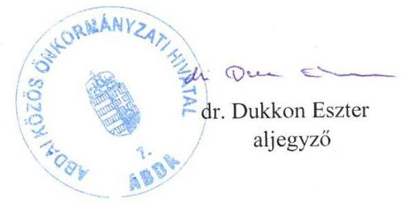
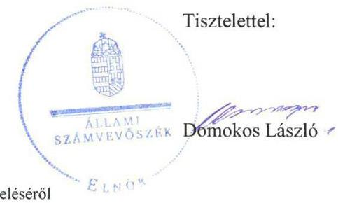

# Jelentés 

## Önkormányzatok ellenőrzése

Integritás- és belső kontrollrendszer Befektetési tevékenységek ellenőrzése - Abda Község Önkormányzata 2019.

---

# Jelentés 

## Önkormányzatok ellenőrzése

Integritás- és belső kontrollrendszer Befektetési tevékenységek ellenőrzése - Abda Község Önkormányzata
2019. 19. hó 10. nap

---

# AZ ELLENŐRZÉST FELÜGYELTE:

- VARGA EDIT felügyeleti vezető
- AZ ELLENŐRZÉST VEZETTE ÉS A VÉGREHAJTÁSÁÉRT FELELŐS:
  - RÁCZKEVI KATALIN ellenőrzésvezető
  - A PROGRAM ÖSSZEÁLLÍTÁSÁÉRT FELELŐS:
    - TÓTPÁL SZABOLCS osztályvezető

**IKTATÓSZÁM:** EL-1631-001/2019.

**TÉMASZÁM:** 2485

**ELLENŐRZÉS-AZONOSÍTÓ SZÁM:** V082901

Jelentéseink az Országgyűlés számítógépes hálózatán és az Interneten a www.asz.hu címen is olvashatóak.

---

# TARTALOMJEGYZÉK 

■ ÖSSZEGZÉS ..... 5
■ AZ ELLENŐRZÉS CÉLJA ..... 6
■ AZ ELLENŐRZÉS TERÜLETE ..... 7
■ AZ ELLENŐRZÉS HÁTTERE, INDOKOLTSÁGA ..... 8
■ A JELENTÉS LÉNYEGES KÉRDÉSKÖREI ..... 9
■ AZ ELLENŐRZÉS HATÓKÖRE ÉS MÓDSZEREI ..... 10
■ MEGÁLLAPÍTÁSOK ..... 12
■ JAVASLATOK ..... 16
■ MELLÉKLETEK ..... 19
I. sz. melléklet: Értelmező szótár ..... 19
■ FÜGGELÉKEK ..... 21
I. sz. függelék a Jelentéshez ..... 21
II. sz. függelék: Észrevételek ..... 22
■ RÖVIDÍTÉSEK JEGYZÉKE ..... 33

---

.

---

# ÖSSZEGZÉS 

Abda Község Önkormányzata belső kontrollrendszerének kialakítása és működtetése nem volt szabályszerű, így nem volt biztosított a közpénzekkel, a nemzeti vagyonnal való átlátható és felelős gazdálkodás, a befektetési tevékenység szabályszerű végzése. Az integritási kontrollokat nem építették ki, így a korrupciós veszélyekkel szemben nem volt védett Abda Község Önkormányzata.

## Az ellenőrzés társadalmi indokoltsága

Az Állami Számvevőszék alapvető feladata a közpénzekkel, az állami és önkormányzati vagyonnal való gazdálkodás ellenőrzése. Az Alaptörvény szerint az önkormányzatok kötelezettsége a kiegyensúlyozott, átlátható és fenntartható költségvetési gazdálkodás elvének érvényesítése, a nemzeti vagyonnal való rendeltetésszerű és felelős módon való gazdálkodás biztosítása. Az Állami Számvevőszék stratégiájában megfogalmazott célkitűzése az integritás alapú, átlátható és elszámoltatható közpénzfelhasználás elősegítése. Ennek megvalósítása érdekében az Állami Számvevőszék prioritásként kezeli a közpénzzel gazdálkodó szervezetek esetében a belső kontrollrendszer működésének ellenőrzését.

## Főbb megállapítások, következtetések

Abda Község Önkormányzata belső kontrollrendszerének kialakítása és működtetése nem volt szabályszerű.
Abda Község Önkormányzatánál a kontrollkörnyezet kialakítása szabályszerű volt, a szervezet kereteit, az önkormányzati vagyonnal való gazdálkodás szabályait meghatározták. A jegyző az előírásoknak megfelelő integrált kockázatkezelési rendszert nem alakított ki, a szervezet tevékenységében rejlő és a szervezeti célokkal összefüggő kockázatokat nem mérte fel. Abda Község Önkormányzatánál a kontrolltevékenységek működtetése a teljesítés igazolás elmaradása-, a Közös Önkormányzati Hivatal információs és kommunikációs folyamatai az iratkezelési szabályzat hiánya miatt nem volt szabályszerű. A monitoring rendszer kialakítása és működtetése nem történt meg.

A szervezet integritását támogató kontrollok kialakítása nem történt meg, Abda Község Önkormányzata a korrupciós kockázatok mérséklésére nem tett intézkedéseket.

Abda Község Önkormányzatánál a szervezeti teljesítmény mérésére alkalmas követelményeket nem alakították ki, így a teljesítmény mérésének lehetőségét nem biztosították.

A befektetési tevékenységek szabályszerű végzését a kiépített belső kontrollrendszer nem biztosította a 2013-2017. években. A befektetésekkel kapcsolatos döntéshozatal, a döntések végrehajtása nem volt szabályszerű. Az értékpapírok számviteli elszámolása és nyilvántartása nem felelt meg a jogszabályi előírásoknak.

Az Állami Számvevőszék a jelentésben foglalt megállapítások alapján Abda Község Önkormányzata polgármesterének 3, az Abdai Közös Önkormányzati Hivatal jegyzője részére pedig 9 javaslatot fogalmazott meg. A javaslatokat megalapozó megállapításokra az érintetteknek 30 napon belül intézkedési tervet kell készíteniük.

---

# AZ ELLENŐRZÉS CÉLJA 

Az ellenőrzés célja annak megállapítása volt, hogy az önkormányzat belső kontrollrendszere biztosította-e a közpénzekkel és a nemzeti vagyonnal történő elszámoltatható, átlátható, szabályszerű, gazdaságos, hatékony és eredményes gazdálkodás feltételeit, a kontrollkörnyezet biztosította-e a befektetési tevékenységek szabályszerű végzését. Az ellenőrzés keretében értékeltük, hogy az önkormányzatnál kiépítették és erősítették-e a korrupciós kockázatok kezelését szolgáló integritás kontrollokat, megteremtették-e a teljesítményellenőrzés feltételeit, továbbá az egyes befektetési tevékenységekkel kapcsolatos döntéshozatal és a döntések végrehajtása, valamint az egyes befektetések számviteli elszámolása, nyilvántartása szabályszerű volt-e, és a belső és külső ellenőrzések támogatták-e az egyes befektetési tevékenységek szabályszerű végzését.

---

# **AZ ELLENŐRZÉS TERÜLETE**

## **Abda Község Önkormányzata**

Abda település Győr-Moson-Sopron megyében található, állandó lakosainak száma 2017. január 1-jén 3185 fő volt a Központi Statisztikai Hivatal Magyarország közigazgatási helynévkönyve adatai alapján.

Az Önkormányzat^{1} hét tagú képviselő-testületének munkáját kettő állandó bizottság segítette. A településen helyi nemzetiségi önkormányzat nem működött.

Az Önkormányzat gazdálkodási feladatait 2013. január 1-től az Abdai Közös Önkormányzati Hivatal látta el. A Közös Önkormányzati Hivatalban^{2} foglalkoztatott köztisztviselők száma 2017. évi zárszámadás adatai alapján 17 fő volt.

A polgármester^{3} a 2006. évi önkormányzati választások óta tölti be tisztségét, a jegyző^{4} személye nem változott az ellenőrzött időszakban.

Az Önkormányzat önállóan működő és gazdálkodó költségvetési szervvel nem rendelkezett a Közös Önkormányzati Hivatalon kívül.

Az Önkormányzat a 2017. évi konszolidált éves költségvetési beszámoló szerint 638,1 millió Ft költségvetési bevételt ért el, valamint 553,7 millió Ft költségvetési kiadást teljesített, vagyonának értéke 2017. december 31-én 1633,9 millió Ft volt.

Az Önkormányzat 2017. december 31-én meglévő befektetéseit az 1-2. táblázatok tartalmazzák.

1. táblázat

|  ÉRTÉKPAPÍROK |  |  |   |
| --- | --- | --- | --- |
|  Megnevezés | Beszerzés időpontja | Könyv szerinti érték (E Ft) |   |
|  befektetési jegy | 2016. március 31. |  | 45 000,-  |
|  befektetési jegy | 2016. szeptember 19. |  | 45 000,-  |
|  befektetési jegy | 2016. október 21. |  | 12,-  |
|  magyar államkötvény | 2017. április 27. |  | 30 000,-  |
|  magyar államkötvény | 2017. október 2. |  | 35 000,-  |

*Forrás: Önkormányzat értékpapír analitikai (2017.12.31) és az értékpapír beszerzések dokumentumai*

2. táblázat

|  INGATLANOK |  |  |  |   |
| --- | --- | --- | --- | --- |
|  Megnevezés | Beszerzés időpontja | Üzembe helyezés időpontja | Bekerülési érték (E Ft) | Könyv szerinti érték (E Ft)  |
|  Épület | 2016. november 14. | 2017. május 16. | 7 680,- | 7 583,-  |
|  Telek | 2016. november 14. | 2017. május 16. | 7 680,- | 7 680,-  |

*Forrás: Ingatlanok egyedi nyilvántartó lapjai (2017.12.31), ingatlanárverési jegyzőkönyv*

---

# AZ ELLENŐRZÉS HÁTTERE, INDOKOLTSÁGA 

A BELSŐ KONTROLLRENDSZER kialakítása és működtetése nélkül nem valósítható meg a közpénzek, a közvagyon átlátható, szabályos, gazdaságos, hatékony és eredményes felhasználása. A belső kontrollrendszer azt a célt szolgálja, hogy a költségvetési szervek működésük és gazdálkodásuk során a tevékenységeket szabályszerűen hajtsák végre, teljesítsék elszámolási kötelezettségeiket és megvédjék az erőforrásokat a veszteségektől, a károktól és a nem rendeltetésszerű használattól.

A belső kontrollrendszer magában foglalja mindazon elveket, eljárásokat és belső szabályzatokat, melyek biztosítják, hogy a költségvetési szerv valamennyi tevékenysége és célja összhangban legyen a szabályszerűséggel, szabályozottsággal, valamint a gazdaságosság, hatékonyság és eredményesség követelményeivel, az eszközökkel és forrásokkal való gazdálkodásban ne kerüljön sor pazarlásra, visszaélésre, rendeltetésellenes felhasználásra. Megfelelő, pontos és naprakész információk álljanak rendelkezésre a költségvetési szerv működésével kapcsolatosan, és a belső kontrollrendszer harmonizációjára, összehangolására vonatkozó jogszabályok végrehajtásra kerüljenek. Az integritás kontrollok kiépítése, erősítése a szervezet korrupciós kockázatainak kezelését szolgálja. A teljesítménykövetelmények meghatározása és működtetése megalapozhatja az önkormányzatoknál a teljesítményellenőrzés lefolytatását.

## AZ ÖNKORMÁNYZATI VAGYONGAZDÁLKODÁS ker

etében az önkormányzatok átmenetileg szabad pénzeszközeinek befektetését jogszabály nem tiltja, a befektetések jellege nem korlátozott, a pénzpiaci szolgáltatók közül az önkormányzatok a kínált szolgáltatás és annak költségei alapján, szabadon választhatnak, azonban a veszteséges gazdálkodás kockázatai és következményei az önkormányzatokat terhelik. A szabad pénzeszközök felhasználása során kiemelten fontos a felelős gazdálkodás érvényesülése, amely összhangban kell, hogy legyen, az önkormányzati gazdálkodás alapelveivel.

Az ellenőrzéssel feltárásra kerülhetnek azok a kockázatok, amelyek az önkormányzatok gazdálkodásával, ezen belül befektetési tevékenységeivel, kontrollkörnyezetével kapcsolatosak és a befektetési tevékenységek szabályszerű végrehajtását befolyásolják. Az ellenőrzéssel az önkormányzatok befektetési/vagyongazdálkodási döntései értékelhetővé válnak, és megalapozott megállapítás tehető arra vonatkozóan, hogy milyen hatást gyakoroltak az önkormányzat vagyonára a képviselő-testület döntései.

---

# A JELENTÉS LÉNYEGES KÉRDÉSKÖREI 

1. Az Önkormányzat belső kontrollrendszerének kialakítása és működtetése szabályszerű volt-e a 2017. évben?
2. Az Önkormányzatnál alakítottak-e ki a szervezeti teljesítmény mérésére alkalmas követelményeket?
3. Az Önkormányzat befektetési tevékenységének szabályszerű végzését a kiépített belső kontrollrendszer biztosította-e a 2013-2017. években, a befektetésekkel kapcsolatos döntéshozatal és a döntések végrehajtása, a befektetések számviteli elszámolása, nyilvántartása szabályszerű volt-e?

---

# AZ ELLENŐRZÉS HATÓKÖRE ÉS MÓDSZEREI 

## Az ellenőrzés típusa

Megfelelőségi ellenőrzés.

## Az ellenőrzött időszak

A belső kontrollrendszer ellenőrzésére vonatkozóan az ellenőrzött időszak a 2017. év, ill. az éves költségvetési beszámoló Áht. ${ }^{5}$ által megállapított jóváhagyásáig (2018. május 31-ig) tartó időszak volt. Abda Község Önkormányzata befektetési tevékenysége vonatkozásában 2013. január 1. 2017. december 31. közötti időszak, továbbá a 2013. január 1. előtti időszak is, amennyiben a 2017. december 31-én meglévő befektetésekkel kapcsolatos döntéshozatalra a 2013. január 1. előtti időszakban került sor.

## Az ellenőrzés tárgya

Abda Község Önkormányzata, és a gazdálkodási feladatokat ellátó Abda Közös Önkormányzati Hivatal belső kontrollrendszerének kialakítása és működtetése, valamint az integritási kontrollok kiépítettsége, a teljesítményellenőrzés feltételei.

Abda Község Önkormányzata 2017. december 31-én meglévő, a Számv. tv ${ }^{6}$. 3. § (6) bekezdés 2. és 3. pontja szerint az értékpapírokban megtestesülő befektetései, lekötött betétei. Továbbá a 2017. december 31-én meglévő, az önkormányzat szabad pénzeszközei terhére, adásvételi szerződés keretében megszerzett, a kötelező feladatok ellátását nem szolgáló, az Önkormányzat üzleti vagyonába tartozó ingatlanok; az üzleti vagyon körébe tartozó, befektetési céllal megszerzett, de még használatba nem vett ingatlan beruházások, továbbá az - időkorlátozás nélkül megszerzett - kulturális javak (műtárgyak, műalkotások, stb.), illetve egyéb értéktárgyak (pl. ékszerek, befektetési nemesfém).

## Az ellenőrzött szervezet

Abda Község Önkormányzata, valamint Abdai Közös Önkormányzati Hivatal

## Az ellenőrzés jogalapja

Az ellenőrzés jogszabályi alapját az ÁSZ tv7. 1. § (3) bekezdés, 5. § (2) és (6) bekezdései, valamint az Áht. 61. § (2) bekezdésének előírásai képezik.

---

# Az ellenőrzés módszerei 

Az ÁSZ ${ }^{8}$ az ellenőrzést az ellenőrzési program szempontjai, az ellenőrzött időszakban hatályos jogszabályok, az ellenőrzés szakmai szabályai, a jelen ellenőrzésre irányadó ÁSZ módszertanok figyelembevételével hajtotta végre.

Az ellenőrzési kérdések megválaszolásához szükséges bizonyítékok megszerzése az ellenőrzött által rendelkezésre bocsátott dokumentumokra, adatokra alapozva megfigyelés, szemle (szemrevételezés), kérdésfeltevés (információkérés), mintavételezés, valamint elemző eljárás útján történt. Az ellenőrzési bizonyítékként felhasználható adatforrások közé tartoztak az ellenőrzési program részletes szempontjainál felsorolt adatforrások, valamint minden egyéb - az ellenőrzés folyamán feltárt, az ellenőrzés szempontjából információt tartalmazó - dokumentum.

Az ellenőrzés lefolytatásához az ellenőrzött szervezet tanúsítványok kitöltésével, valamint az ÁSZ által kért dokumentumok megküldésével szolgáltatott adatokat, amelyek valódiságát és teljes körűségét az ellenőrzött szervezet vezetője által tett teljességi és hitelességi nyilatkozat igazolta. A rendelkezésre bocsátott adatok, információk kontrollja az ellenőrzés keretében történt.

Az önkormányzat belső kontrollrendszere egyes pilléreinek kialakítására és működtetésére vonatkozó értékelés:
$\longrightarrow$ „szabályszerű", amennyiben az értékelt területen az elért

 „igen" válaszok százalékban kifejezett, egész számra kerekített aránya legalább 85%,
$\longrightarrow$ „nem szabályszerű", ha nem éri el a 85%-ot.
Az önkormányzat belső kontrollrendszerének összesített értékelése az egyes részterületek esetében kapott megfelelőségi arányok számtani átlaga alapján történt és megegyezett a pillérenként (kontroll-területenként) alkalmazott százalékos értékelésekkel, a következő eltérésekkel: a kontrollrendszer egésze esetében a „szabályszerű" értékelésnek a százalékos értéken felül további feltétele volt, hogy egyik kontrollterület sem kaphatott „nem szabályszerű" értékelést.

A 2017. évi kiadások teljesítéséhez kapcsolódó pénzgazdálkodási belső kontrollok működésének szabályszerűsége esetében az ellenőrzés azokra a legnagyobb értékű tételekre - a lényeges sokaságra - terjedt ki, melyek összértéke eléri a teljes sokaság összértékének 50%-át.

A lényeges sokaságból véletlen mintavételi eljárással kiválasztott tételek kerültek ellenőrzésre.
„Szabályszerűnek" értékeltünk egy ellenőrzött területet, amennyiben 95%-os bizonyossággal az ellenőrzött sokaságban az átlagos hibaarány legfeljebb 10%, "nem szabályszerűnek", amennyiben 10%-nál magasabb arányt képviselt.

Az ellenőrzés ideje alatt az ellenőrzött szervezettel történő kapcsolattartást az ÁSZ SZMSZ ${ }^{9}$-ének vonatkozó előírásai alapján biztosította az ÁSZ.

---

# 1. Az Önkormányzat belső kontrollrendszerének kialakítása és működtetése szabályszerű volt-e a 2017. évben? 

## Összegző megállapítás

Az Önkormányzat belső kontrollrendszerének kialakítása és működtetése nem volt szabályszerű.

A KONTROLLKÖRNYEZET kialakítása szabályszerű volt. Az Önkormányzat, valamint a Közös Önkormányzati Hivatal szervezeti kereteit az előírásoknak megfelelően meghatározták. Az Önkormányzat vagyongazdálkodásának feltételeit meghatározó rendeletet elkészítették. A jegyző a Számv. tv. előírásai alapján a Számviteli politikát ${ }^{10}$ és annak keretében elkészítendő szabályzatokat elkészítette.

A vagyonnyilatkozat-tételi kötelezettséggel járó munkaköröket a jegyző szabályozta, a Közszolgálati szabályzatot ${ }^{11}$ elkészítette. A jegyző és a Közös Önkormányzati Hivatal pénzügyi, számviteli területen foglalkoztatott dolgozói rendelkeztek munkaköri leírással.

A jegyző elkészítette a Közös Önkormányzati Hivatal ellenőrzési nyomvonalát.

## AZ INTEGRÁLT KOCKÁZATKEZELÉSI RENDSZERT a jegyző nem alakította ki, mert nem szabályozta a szervezeti integritást sértő események kezelésének eljárásrendjét, valamint az integrált kockázatkezelés eljárásrendjét a Bkr ${ }^{12}$. 6. § (4) bekezdésében előírtak ellenére. A jegyző a Bkr. 7. § (2) bekezdés előírása ellenére nem mérte fel és nem állapította meg a Közös Önkormányzati Hivatal tevékenységében rejlő és szervezeti célokkal összefüggő kockázatokat, nem határozta meg az egyes kockázatokkal kapcsolatban szükséges intézkedéseket, valamint azok teljesítésének folyamatos nyomon követésének módját.

A KONTROLLTEVÉKENYSÉGEK kialakítása szabályszerű volt. A jegyző a gazdálkodás részletes rendjét - a kötelezettségvállalás, pénzügyi ellenjegyzés, teljesítés igazolása, érvényesítés, utalványozás gyakorlásának módja, eljárási és dokumentációs részletszabályai, valamint az ezeket végző személyek kijelölése vonatkozásában - a Kötelezettségvállalási szabályzatban ${ }^{13}$ az Ávr ${ }^{14}$. előírásainak megfelelően az Önkormányzatra és a Közös Önkormányzati Hivatalra vonatkozóan elkészítette.

A KONTROLLTEVÉKENYSÉGEK gyakorlása nem volt szabályszerű az Önkormányzat vonatkozásában, mert az Ávr. 57. § (1) bekezdés előírása ellenére a teljesítés igazolása nem történt meg az Ávr. 57. § (4) bekezdése szerinti írásbeli kijelölés hiányában.

AZ INFORMÁCIÓS ÉS KOMMUNIKÁCIÓS folyamatok kialakítása nem volt szabályszerű, mert a jegyző nem adott ki iratkezelési szabályzatot a Közös Önkormányzati Hivatal vonatkozásában az Ltv. ${ }^{15}$ 10. § (1) bekezdés c) pontjának előírása ellenére.

---

A MONITORING RENDSZER kialakítása és működtetése nem volt szabályszerű. A Közös Önkormányzati Hivatal SZMSZ ${ }^{16}$-e a Bkr. 15. § (2) bekezdés előírása ellenére nem tartalmazta a belső ellenőrzést végző szervezet feladatait.

A jegyző a Bkr. 11. § (1) bekezdése ellenére a Közös Önkormányzati Hivatal belső kontrollrendszerének minőségét nem értékelte.

A SZERVEZET INTEGRITÁS elvű működését nem támogatta a jogszabályok által kötelezően előírt kontrollok kiépítettségének szintje. Az Önkormányzat hosszú távú céljai között nem szerepelt az integritás erősítése. A kockázatelemzés hiányában az integritás elvű működést támogató célszerű kontrollok nem kerültek kialakításra.

# 2. Az Önkormányzatnál alakítottak-e ki a szervezeti teljesítmény mérésére alkalmas követelményeket? 

Összegző megállapítás Az Önkormányzatnál a szervezeti teljesítmény mérésére alkalmas követelményeket nem alakítottak ki.

A szervezeti célok elérését szolgáló feladatok, folyamatok, tevékenységek mérését szolgáló indikátorokat, mérőszámokat, feladat- és teljesítménymutatókat a jegyző nem alakított ki, ezért az Önkormányzatnál a teljesítmény mérésének lehetősége nem volt biztosított.

## 3. Az Önkormányzat befektetési tevékenységének szabályszerű végzését a kiépített belső kontrollrendszer biztosította-e a 2013-2017. években, a befektetésekkel kapcsolatos döntéshozatal és a döntések végrehajtása, a befektetések számviteli elszámolása, nyilvántartása szabályszerű volt-e?

Összegző megállapítás Az Önkormányzat befektetési tevékenységének szabályszerű végzését a kiépített belső kontrollrendszer nem biztosította a 2013-2017. években, a befektetésekkel kapcsolatos döntéshozatal és a döntések végrehajtása, a befektetések számviteli elszámolása, nyilvántartása nem volt szabályszerű.

A BELSŐ KONTROLLRENDSZER nem biztosította a befektetési tevékenység szabályszerű végzését, mert:

- az Önkormányzat gazdálkodási feladatait ellátó Közös Önkormányzati Hivatal 2013-2014. években nem rendelkezett az Áht. 10. § (5) bekezdésében előírt SZMSZ-szel;
- az Önkormányzat és a Közös Önkormányzati Hivatal 2013-2014. években nem rendelkezett a Számv. tv. 14. § (5) a) pontja által előírt, eszközök és a források leltárkészítési és leltározási szabályzatával;

---

$\longrightarrow$ az Önkormányzat hosszú távú fejlesztési elképzeléseit 2013-2014. évek vonatkozásában az Mötv. 116. § (1) bekezdés előírása ellenére gazdasági programban nem rögzítette;
— az Önkormányzat 2013-2014. évekre vonatkozó költségvetését, az Áht. 12. § (1) bekezdés előírása ellenére nem alapozta meg mellékszámításokkal;
— az Önkormányzat és a Közös Önkormányzati Hivatal számlarendje ${ }_{1}{ }^{17}$ 2013-2014. években az Áhsz. 51. § (3) bekezdés előírása ellenére nem tartalmazta a főkönyv és az analitika egyeztetésre és annak dokumentálása módjára vonatkozó előírásokat;
— a jegyző 2013-2014. években nem adott ki az Önkormányzat és a Közös Önkormányzati Hivatal vonatkozásában a gazdálkodás részletes rendjét meghatározó szabályzatot az Ávr. 13. § (2) a) pontjának előírása ellenére;
— a jegyző a 2013-2017. években nem szabályozta a szabálytalanságok kezelésének eljárásrendjét 2016. szeptember 30-ig, illetve 2016. október 1-től a szervezeti integritást sértő események kezelésének eljárásrendjét, valamint az integrált kockázatkezelés eljárásrendjét a Bkr. 6. § (4) bekezdés előírása ellenére;
— a jegyző a Bkr. 7. § (2) bekezdés előírása ellenére nem mérte fel és nem állapította meg a Közös Önkormányzati Hivatalnál - 2016. szeptember 30-ig a tevékenységében, gazdálkodásában rejlő-, 2016. október 1-től a tevékenységében rejlő és szervezeti célokkal összefüggő - kockázatokat, nem határozta meg az egyes kockázatokkal kapcsolatban szükséges intézkedéseket, valamint azok teljesítésének folyamatos nyomon követésének módját.

A DÖNTÉSHOZATAL és a döntések végrehajtása a befektetésekkel kapcsolatban nem volt szabályszerű, mert:
— az értékpapír befektetésekkel kapcsolatos döntések esetében a tulajdonost megillető jogokat az Mötv. 107. § előírása ellenére a polgármester, valamint a jegyző a gazdálkodási előadóval gyakorolta és nem a Képviselő-testület;
— a jegyző nem biztosította a kontrolltevékenység részeként az Önkormányzat befektetési tevékenysége vonatkozásában 2016. szeptember 30-ig a folyamatba épített, előzetes, utólagos és vezetői ellenőrzést, 2016. október 1-től a szervezeti célok elérését veszélyeztető kockázatok csökkentésére irányuló kontrollok kiépítését a befektetési döntések célszerűségi, gazdaságossági, hatékonysági és eredményességi szempontú megalapozottsága tekintetében a Bkr. 8. § (2) bekezdés b) pontjában előírtak ellenére, mert nem készített az értékpapír befektetések hatásairól, eredményeiről előzetes értékelést;
— az Önkormányzat pénzügyi bizottsága a Mötv. 120. § (1) bekezdés b) pontjában foglalt előírás ellenére nem kísérte figyelemmel a befektetésekkel kapcsolatban a vagyonváltozás alakulását.

---

A BEFEKTETÉSEK SZÁMVITELI ELSZÁMOLÁSA és nyilvántartása nem volt szabályszerű 2016-2017. években, mert:
$\longrightarrow$ az Önkormányzat értékpapír befektetéseivel kapcsolatos pénzügyi műveletek bevételeit a gazdasági eseményeket alátámasztó bizonylatok nélkül számolták el a Számv. tv. 165. § (2) bekezdésének előírása ellenére;
$\longrightarrow$ az Önkormányzat mérlegében szereplő befektetések értékelését a Számv. tv. 46. § (3) bekezdés előírása ellenére nem végezték el.

---

# JAVASLATOK 

Az ÁSZ tv. 33. § (1) bekezdésében foglaltak értelmében az ellenőrzött szervezet vezetője köteles a jelentésben foglalt megállapításokhoz kapcsolódó intézkedési tervet összeállítani és azt a jelentés kézhezvételétől számított 30 napon belül az ÁSZ részére megküldeni. Amennyiben az ellenőrzött szervezet vezetője nem küldi meg határidőben az intézkedési tervet, vagy továbbra sem elfogadható intézkedési tervet küld, az Állami Számvevőszék elnöke az ÁSZ tv. 33. § (3) bekezdés a) és b) pontjaiban foglaltakat érvényesítheti.

## Abdai Közös Önkormányzati Hivatal jegyzőjének

1. A szabályszerű integrált kockázatkezelési rendszer kialakítása érdekében gondoskodjon:
a) a szervezeti integritást sértő események kezelése, valamint az integrált kockázatkezelés eljárásrendjének szabályozásáról;
(1. sz. megállapítás 4. bekezdés 1. mondata és a 3. sz. megállapítás 1. bekezdés 7. francia bekezdésének 2. tagmondata alapján)
b) a Közös Önkormányzati Hivatal tevékenységében rejlő és szervezeti célokkal összefüggő kockázatok felméréséről és megállapításáról, az egyes kockázatokkal kapcsolatban szükséges intézkedések, valamint azok teljesítésének folyamatos nyomon követésének módja meghatározásáról.
(1. sz. megállapítás 4. bekezdés 2. mondata és a 3. sz. megállapítás 1. bekezdés 8. francia bekezdés 3. tagmondata alapján)
2. Az információs és kommunikációs rendszer szabályszerű kialakítása és működtetése érdekében gondoskodjon a Közös Önkormányzati Hivatal jogszabályi előírásoknak megfelelő iratkezelési szabályzatának kiadásáról.
(1. sz. megállapítás 7. bekezdése alapján)
3. A monitoring rendszer szabályszerű kialakítása és működtetése érdekében gondoskodjon a Közös Önkormányzati Hivatal jogszabályi előírásoknak megfelelő tartalmú szervezeti és működési szabályzatának elkészítéséről.
(1. sz. megállapítás 8. bekezdés 2. mondata alapján)
4. A szabályszerű belső kontrollrendszer működtetése érdekében értékelje jogszabály szerinti nyilatkozatában a Közös Önkormányzati Hivatal belső kontrollrendszerének minőségét.
(1. sz. megállapítás 9. bekezdése alapján)

---

5. Az Önkormányzat befektetéseihez kapcsolódó szabályszerű döntéshozatal érdekében biztosítsa a szervezeti célok elérését veszélyeztető kockázatok csökkentésére irányuló kontrollok kiépítését a befektetési döntések célszerűségi, gazdaságossági, hatékonysági és eredményességi szempontú megalapozottsága tekintetében.
(3. sz. megállapítás 2. bekezdés 2. francia bekezdése alapján)
6. A jogszabályban foglalt tanácskozási és jelzési kötelezettségére tekintettel jelezze az Önkormányzat pénzügyi bizottságának, hogy kísérje figyelemmel az Önkormányzat befektetéseivel kapcsolatos vagyonváltozás alakulását.
(3. sz. megállapítás 2. bekezdés 3. francia bekezdése alapján)
7. Az Önkormányzat befektetéseinek szabályszerű elszámolása és nyilvántartása érdekében gondoskodjon:
a) az értékpapír befektetésekkel kapcsolatos pénzügyi műveletek jogszabályi előírásoknak megfelelő elszámolásáról;
(3. sz. megállapítás 3. bekezdés 1. francia bekezdése alapján)
b) az Önkormányzat mérlegében szereplő befektetések szabályszerű értékeléséről.
(3. sz. megállapítás 3. bekezdés 2. francia bekezdése alapján)

# Abda Község Önkormányzatának polgármesterének 

1. Gondoskodjon a teljesítésigazolás jogszabályi előírásoknak megfelelő gyakorlásáról az Önkormányzat vonatkozásában.
(1. sz. megállapítás 6. bekezdése alapján)
2. Gondoskodjon a Közös Önkormányzati Hivatal jogszabályi előírásoknak megfelelő tartalmú szervezeti és működési szabályzatának képviselő-testület elé terjesztéséről.
(1. sz. megállapítás 8. bekezdés 2. mondata alapján)
3. Gondoskodjon az Önkormányzat értékpapír befektetéseivel kapcsolatos döntések Képviselő-testület elé terjesztéséről.
(3. sz. megállapítás 2. bekezdés 1. francia bekezdése alapján)

---

.

---

# MELLÉKLETEK 

- I. SZ. MELLÉKLET: ÉRTELMEZŐ SZÓTÁR
belső ellenőrzés
belső kontrollrendszer
belső kontrollrendszer pillérei, kontrollterületei
helyi önkormányzat
információs és kommunikációs rendszer
integritás

Független, tárgyilagos bizonyosságot adó és tanácsadó tevékenység, amelynek célja, hogy az ellenőrzött szervezet működését fejlessze és eredményességét növelje, az ellenőrzött szervezet céljai elérése érdekében rendszerszemléletű megközelítéssel és módszeresen értékeli, illetve fejleszti az ellenőrzött szervezet irányítási és belső kontrollrendszerének hatékonyságát. (Forrás: Bkr. 2. § b) pontja)
A belső kontrollrendszer a kockázatok kezelése és tárgyilagos bizonyosság megszerzése érdekében kialakított folyamatrendszer, amely azt a célt szolgálja, hogy a működés és gazdálkodás során a tevékenységeket szabályszerűen, gazdaságosan, hatékonyan, eredményesen hajtsák végre, az elszámolási
 kötelezettségeket teljesítsék, megvédjék az erőforrásokat a veszteségektől, károktól és nem rendeltetésszerű használattól.
(Forrás: Áht. 69. § (1) bekezdése)
A kontrollkörnyezet, az (integrált) kockázatkezelési rendszer, a kontrolltevékenységek, az információs és kommunikációs rendszer, valamint a nyomon követési (monitoring) rendszer. (Forrás: Bkr. 3. §-a)
A helyi önkormányzat jogi személy. Az önkormányzati feladatok ellátását a képviselő-testület és szervei biztosítják. A képviselő-testület szervei: a polgármester, a főpolgármester, a megyei közgyűlés elnöke, a képviselő-testület bizottságai, a részönkormányzat testülete, az önkormányzati hivatal, a megyei önkormányzati hivatal, a közös önkormányzati hivatal, a jegyző, továbbá a társulás. A képviselő-testület a feladatkörébe tartozó közszolgáltatások ellátására - jogszabályban meghatározottak szerint - költségvetési szervet, a polgári perrendtartásról szóló törvény szerinti gazdálkodó szervezetet (a továbbiakban: gazdálkodó szervezet), nonprofit szervezetet és egyéb szervezetet (a továbbiakban együtt: intézmény) alapíthat, továbbá szerződést köthet természetes és jogi személlyel vagy jogi személyiséggel nem rendelkező szervezettel. A helyi önkormányzat éves költségvetési beszámolója magában foglalja a helyi önkormányzat - nem költségvetési szerveihez tartozó - feladataihoz kapcsolódó bevételeket és kiadásokat. A helyi önkormányzat összevont (konszolidált) költségvetési beszámolóját a helyi önkormányzatra és költségvetési szerveire vonatkozóan külön-külön beérkezett éves költségvetési beszámolók alapján a Kincstár készíti el és küldi meg az önkormányzatnak. (Forrás: Mötv. 41. § (1), (2), (6) bekezdései; Áhsz. 2. § (1) bekezdése, 6. § (1) bekezdés a) és f) pontja, 30. §-a, 37. § (1) és (6) bekezdése)
A költségvetési szerv vezetője által kialakított és működtetett olyan rendszer, mely biztosítja, hogy a megfelelő információk a megfelelő időben eljutnak az illetékes szervezethez, szervezeti egységhez, illetve személyhez. (Forrás: Bkr. 9. § (1) bekezdés)

Az integritás elvek, értékek, cselekvések, módszerek, intézkedések konzisztenciáját jelenti: olyan magatartásmódot, amely meghatározott értékeknek felel meg. Az integritás a közszféra esetében a társadalom által elvárt nyilvánossági, átláthatósági, illetve jogi/etikai normáknak történő megfelelést jelenti.

---

(Forrás: a http://integritas.asz.hu honlapon közzétett „A 2012. évi integritás felmérés eredményeinek összefoglalója" című dokumentum 3. oldal 1. bekezdése)
kockázatkezelési rendszer

A költségvetési szerv vezetője által kialakított olyan elvek, eljárások, belső szabályzatok összessége, amelyben világos a szervezeti struktúra, egyértelműek a felelősségi, hatásköri viszonyok és feladatok, meghatározottak az etikai elvárások a szervezet minden szintjén, átlátható a humánerőforrás-kezelés. (Forrás: Bkr. 6. § (1) bekezdés)
kontrolltevékenységek

A költségvetési szerv vezetője által a szervezeten belül kialakított (kontroll) tevékenységek, melyek biztosítják a kockázatok kezelését, hozzájárulnak a szervezet céljainak eléréséhez. (Forrás: Bkr. 8. § (1) bekezdés)
költségvetési szerv vezetője (Bkr. alkalmazásában)
közös önkormányzati hivatal

Helyi önkormányzat esetén a jegyző, főjegyző, társulás esetén a társulási megállapodásban meghatározott önkormányzat jegyzője. (Forrás: Bkr. 2. § n) pont nb) alpont)
települési képviselő-testület más települési képviselő-testülettel társult képviselő-testületet alakíthat, amely esetén a képviselő-testületek részben vagy egészben egyesítik a költségvetésüket, közös önkormányzati hivatalt tartanak fenn, és intézményeiket közösen működtetik. (Forrás: Mötv. 56. § (1)-(2) bekezdései)

---

# FÜGGELÉKEK 

- I. SZ. FÜGGELÉK A JELENTÉSHEZ

Az Állami Számvevőszék az ellenőrzések során feltárt tényekhez kapcsolódó további körülmények tisztázására eszközrendszerrel nem rendelkezik. Amennyiben az ellenőrzésen túlmutatóan indokoltnak látszik az ellenőrzés során feltárt körülmények további vizsgálata, az Állami Számvevőszék törvényi felhatalmazás alapján az ellenőrzés által feltárt körülményeket továbbítja a hatáskörrel rendelkező szervnek a szükséges intézkedések megtétele, eljárások lefolytatása érdekében.

1. A 2017. évi működési és felhalmozási kiadások ellenőrzése során az ÁSZ feltárta, hogy 15 esetben, összesen 7597726 Ft értékű működési, továbbá egy esetben 12960000 Ft összegű felhalmozási kiadás vonatkozásában a teljesítésigazolás nem történt meg, mert az államháztartásról szóló törvény végrehajtásáról szóló 368/2011. (XII. 31.) Korm. rendelet 57. § (4) bekezdés előírása ellenére a teljesítés igazolására írásbeli kijelölés hiányában került sor.
A teljesítésigazolás szabálytalansága miatt felvetődik, hogy szabálytalan kifizetések történtek, amik vagyoni hátrányt okozhattak az Önkormányzatnak. A kifizetések szabálytalansága miatt nem igazolt, hogy a kiadások valóban az Önkormányzat érdekében merültek fel, annak feladatellátását szolgálták, valamint a kifizetésekhez valós teljesítések kapcsolódtak.
2. Az ellenőrzés feltárta, hogy 2016-2017. években a számvitelről szóló 2000. évi C. törvény (továbbiakban: Számv. tv.) 165. § (1) és (2) bekezdés által előírt, a gazdasági eseményeket alátámasztó bizonylatok nélkül történt az értékpapír befektetésekkel kapcsolatos pénzügyi műveletek bevételeinek elszámolása.
3. Az ellenőrzés feltárta továbbá, hogy az Önkormányzat 2016-2017. éves költségvetési beszámolóinak mérlegében szereplő befektetések értékelését a Számv. tv. 46. § (3) bekezdés előírása ellenére nem végezték el.
Jelzett jogszabálysértések kapcsán felvetődik, hogy a pénzügyi műveletek bevételeinek szabálytalan elszámolása, valamint a befektetések értékelésének elmaradása vagyoni hátrányt okozhatott az Önkormányzatnak.
Az 1-3. pontban megjelölt esetek konkrét körülményeinek felderítésére az ügyészség rendelkezik hatáskörrel.

---

A jelentéstervezetet a Számvevőszék 15 napos észrevételezésre megküldte az ellenőrzött szervezetek vezetőinek az ÁSZ tv. 29. § (1) bekezdése előírása szerint.

Az ÁSZ a jelentéstervezetet észrevételezésre megküldte Abda Község Önkormányzata polgármestere és az Abdai Közös Önkormányzati Hivatal jegyzője részére.
Abda Község Önkormányzata polgármestere az ÁSZ tv. 29. § (2) bekezdésében foglalt észrevételezési jogával nem élt, a jelentéstervezet megállapításaira észrevételt nem tett. Az Abdai Közös Önkormányzati Hivatal jegyzőjének észrevételét és az arra adott választ a függelék tartalmazza.

[^0]
[^0]:    * 29. § (1) Az Állami Számvevőszék az ellenőrzési megállapításait megküldi az ellenőrzött szervezet vezetőjének vagy az általa megbízott személynek, és annak, akinek személyes felelősségét állapította meg.
    (2) Az ellenőrzött szervezet vezetője és a felelősként megjelölt személy az ellenőrzés megállapításaira tizenöt napon belül írásban észrevételt tehet.
    (3) Az Állami Számvevőszék az észrevételre a beérkezésétől számított harminc napon belül írásban válaszol. A figyelembe nem vett észrevételeket köteles a jelentésben feltüntetni, és megindokolni, hogy azokat miért nem fogadta el.

---

# ABDAI KÖZÖS ÖNKORMÁNYZATI HIVATAL 

Székhely: 9151 Abda, Szent István u. 3.
Kirendeltségek: 9152 Böres, Erzsébet tér 4.
9141 Ikrény, Győri u. 66.
$\boxtimes: 9151$ Abda, Szt István u. 3. 06/96/553-233 fax: 06/96/553-237
9152 Böres, Erzsébet tér 4. 06/96/553-240 fax: 06/96/553-247
9141 Ikrény, Győri u. 66. 06/96/542-050 fax: 06/96/542-051

Ügyszám: A/904-3/2019.
Ügyintéző: dr. Dukkon Eszter

Tárgy: észrevételek
Hiv.sz.: EL-0826-046/2019.

## Állami Számvevőszék

Budapest 4.
Pf: 54.
1364

## Tisztelt Cím!

Fenti ügyszámra hivatkozásul az „Önkormányzatok ellenőrzése - Integritás- és belső kontrollrendszer - Befektetési tevékenységek ellenőrzése - Abda Község Önkormányzata" címmel készített számvevőszéki jelentéstervezetre az alábbi észrevételeket tesszük:

## 1. pont:

Az integrált kockázatkezelési rendszer: valóban nem történt meg az integritást sértő események kezelésének eljárásrendjére, valamint az integrált kockázatkezelés eljárásrendjére vonatkozó szabályozás kialakítása. Ezt pótolni fogjuk.

Kontrolltevékenységek: A teljesítésigazolás minden esetben megtörtént, és meg is történik, viszont valóban nem került csatolásra a 12.960.000 Ft összegű felhalmozási kiadás vonatkozásában a teljesítés igazolása, amit ezúton is pótolunk. (1. melléklet) Csatoljuk a „Kötelezettségvállalási, utalványozás, ellenjegyzés, érvényesítés, szakmai teljesítés igazolási rendjének szabályzata" módosítását is, amely tartalmazza Csigó Lajos László alpolgármester teljesítés igazolására való jogosultságát. (2. melléklet)

Az információs és kommunikációs folyamatok: téves volt az a megállapítás, hogy nem adott ki a jegyző iratkezelési szabályzatot a közös önkormányzati hivatal vonatkozásában. Ez megtörtént, ami az EL-0826-002/2018 iktatószámú adatbekérő levélre válaszul 2018. július 6-án küldött, a teljességi és hitelességi nyilatkozat melléklete szerinti 19. pontban szerepel az iratkezelési szabályzat felülvizsgálata.pdf, illetve a 20. pontban az iratkezelési szabályzat melléklete (hozzáférési jogosultság.pdf, és a 21. pontban a közös hivatal egyedi iratkezelési szabályzata.pdf linken. A rendszerben az Abda Község Önkormányzata/V0829_ABP2_2/01_Adatbekérés_1 alatt az 1_33 pontban került feltöltésre. De mellékeljük ismételten. (3. melléklet)

---

Monitoring rendszer: a közös hivatal SZMSZ-ének 13. pontja rendelkezik a belső ellenőrzésről. A belső ellenőrzést végző szerv feladatait valóban nem tartalmazza, de rendelkezik arról, hogy a belső ellenőrzést a Belső ellenőrzési szabályzat szerint kell elvégezni.

Szervezeti integritás: Elkészítjük a kockázatelemzést, és nagyobb hangsúlyt fektetünk az integritás erősítésére.

# 2. pont: 

A teljesítmény mérésére alkalmas követelményeket biztosítani fogjuk a továbbiakban a szervezeti célok elérését szolgáló feladatok, folyamatok, tevékenységek mérését szolgáló indikátorok, mérőszámok, feladat- és teljesítménymutatók kialakításával.

## 3. pont:

- Belső kontrollrendszer: A Közös Önkormányzati Hivatal rendelkezett SZMSZ-szel, a 2013-2014. évekre, melyet csatolunk. (4. melléklet)
- Az önkormányzat és a Közös Önkormányzati Hivatal is rendelkezett 2013-2014. évre vonatkozóan leltározási és leltárkészítési szabályzattal, csak nem került becsatolásra figyelmetlenség miatt. Most csatoljuk. (5. melléklet)
- az Önkormányzat hosszú távú fejlesztési elképzeléseit 2013-2014. évekre vonatkozó gazdasági program tartalmazza, csak nem külön kiemelve a célok közül.
- Az Önkormányzat minden évben megalapozza költségvetését számításokkal, így az a 2013-2014. években is megtörtént. Mellékeljük jelen levelünkhöz. (6. melléklet)
- A 2013-2014. évekre a gazdálkodás részletes rendjét meghatározó szabályzatok megszülettek, csak szintén - figyelmetlenség, és technikai okok miatt- nem látszik a rendszerben a csatolás. Most mellékeljük. (7. melléklet)

## - A döntéshozatal:

- Az éves költségvetési rendeletünk rendszeresen tartalmaz felhatalmazást az átmenetileg szabad pénzeszközök lekötésére. Minden esetben olyan értékpapírt vásároltunk, amely garantált tőkehozamú, így a befektetések teljes biztonságára törekedtünk. Önkormányzatunk szabad pénzeszközét OTP Optima Tőkegarantált befektetési jegy és Prémium Magyar Államkötvény vásárlására fordította, minden esetben kiemelt figyelmet fordítva a kibocsátási garanciára, valamint a szükséges visszaváltás lehetőségére. A visszaváltásokra kizárólag a tartási idő lejárata után került sor. Pénzügyi bizottságunk minden ülésén kért és kapott tájékoztatást a lekötésekről, amely konkrétan és jellemzően azon testületi ülések jegyzőkönyvében is megjelenik, amely pénzügyi bizottsági előterjesztést tárgyal.

---

- A befektetések számviteli elszámolása: 2016 - 2017. években
- Mellékelten küldjük az értékpapír befektetéseivel kapcsolatos pénzügyi műveletek bevételeihez kapcsolódó, a gazdasági eseményeket alátámasztó bizonylatokat, amelyek nem kerültek feltöltésre. (8. melléklet) A befektetési jegy visszaváltásából származó bevételek könyvelésének, számviteli elszámolásának bizonylata, az utalványlap szabályszerűen aláírtan kerül lefűzésre minden esetben, illetve a szerződés mindkét fél részéről aláírással volt ellátva minden alkalommal, nem csak az említett évekre vonatkozóan.
- A mérlegben szereplő befektetések értékelése, kimutatása bekerülési értéken történt 2016 - 2017. évben az „Eszkőzök és források értékelési szabályzata" 1.2.4. pontja alapján, a leltározás pedig egyeztetéssel.

Több esetben technikai probléma miatt sem látható a rendszerben a feltöltött dokumentum, mivel felcsatolása megtörtént, de mégsem látható a felületen. Ezeket most pótoljuk.

Bízunk benne, hogy a most mellékelt dokumentumok alátámasztják a jogszerű működést a legtöbb kérdéses esetben, míg a fennmaradó hiányosságok pótlásával a továbbiakban megteszünk mindent, hogy a jogszabályi előírásoknak maradéktalanul megfeleljünk, törekedve a törvényes működésre.

Abda, 2019. június 20.

Tisztelettel:
Komjáti János jegyző nevében és megbízásából:

---

ELNÖK

# Komjáti János úr 

jegyző
Abdai Közös Önkormányzati Hivatal

## Abda

## Tisztelt Jegyző Úr!

Az „Önkormányzatok ellenőrzése - Integritás- és belső kontrollrendszer - Befektetési tevékenységek ellenőrzése - Abda Község Önkormányzata" címmel készített számvevőszéki jelentéstervezetre tett észrevételét köszönettel megkaptam.
Az Állami Számvevőszék észrevételre vonatkozó álláspontjáról a felügyeleti vezető által készített részletes tájékoztatást csatoltan megküldöm.
Tájékoztatom Jegyző urat, hogy a számvevőszéki jelentésben - az Állami Számvevőszékről szóló 2011. évi LXVI. törvény 29. § (3) bekezdése alapján - a figyelembe nem vett észrevételeket szerepeltetjük, annak indoklásával, hogy azokat az Állami Számvevőszék miért nem fogadta el.

Budapest, 2019. 07 hó 10 nap

Melléklet: Tájékoztatás

 az észrevételek kezeléséről

---

# Tájékoztatás az észrevételek kezeléséről 

Az „Önkormányzatok ellenőrzése - Integritás- és belső kontrollrendszer - Befektetési tevékenységek ellenőrzése - Abda Község Önkormányzata" című jelentéstervezetre a 2019. június 20-án kelt, A/904-3/2019. iktatószámú levelében tett észrevételét áttekintettük, annak kezeléséről az alábbi tájékoztatást adom.

## I. Az 1. számú megállapítás kapcsán tett észrevételekre vonatkozóan

1. Észrevétel az integrált kockázatkezelési rendszerre vonatkozó megállapításhoz kapcsolódóan

Észrevételében jelezte, hogy nem történt meg az integritást sértő események kezelésének eljárásrendjére, valamint az integrált kockázatkezelés eljárásrendjére vonatkozó szabályozás kialakítása, pótolni fogják.
Észrevétele nem cáfolja a jelentéstervezet megállapítását és összhangban van a megállapításhoz kapcsolódó javaslatokkal, az Állami Számvevőszék (továbbiakban: ÁSZ) megállapítása helytálló, a jelentéstervezet módosítása nem indokolt.
2. Észrevétel a kontrolltevékenységekre gyakorlására vonatkozó megállapításhoz kapcsolódóan
Észrevételében közölte, hogy a teljesítésigazolás minden esetben megtörtént, és meg is történik, viszont valóban nem került csatolásra a teljesítés igazolása a 12.960.000 Ft összegű felhalmozási kiadás vonatkozásában, valamint a „Kötelezettségvállalási, utalványozás, ellenjegyzés, érvényesítés, szakmai teljesítés igazolási rendjének szabályzata" módosítása. A jelzett dokumentumok másolatait az észrevétel mellékleteként csatolta.
A jelentéstervezet 1. sz. megállapítás 6. bekezdése szerint „A kontrolltevékenységek gyakorlása nem volt szabályszerű az Önkormányzat vonatkozásában, mert az Ávr. 57. § (1) bekezdés előírása ellenére a teljesítés igazolása nem történt meg az Ávr. 57. § (4) bekezdés szerinti írásbeli kijelölés hiányában."
Az EL-0826-004/2018., valamint az EL-0826-022/2018. iktatószámú adatbekérő levelünk alapján megküldött dokumentumaikhoz kapcsolódó, 2018. július 6-án, valamint 2018. szeptember 18-án kelt teljeségi és hitelességi nyilatkozataik tanulsága szerint az észrevételben jelzett dokumentumaikat nem küldték meg az ÁSZ részére, az Állami Számvevőszékről szóló 2011. évi LXVI. törvény (továbbiakban: ÁSZ tv.) 28. § (2) bekezdésében meghatározott határidőn belül. Ellenőrzési dokumentumként csak az ÁSZ felhívására - az ÁSZ tv. 28. § (2) bekezdésben meghatározott adatszolgáltatási időszakon belül megküldött, a teljességi és hitelességi nyilatkozatban szereplő dokumentumok vehetők figyelembe.
Mindezek alapján az észrevételt nem fogadjuk el, az ÁSZ megállapítása helytálló, a jelentéstervezet módosítása nem indokolt.

---

3. Észrevétel az információs és kommunikációs rendszer kialakítására vonatkozó megállapításhoz kapcsolódóan

Észrevételében kijelenti, hogy téves volt az a megállapítás, hogy nem adott ki a jegyző iratkezelési szabályzatot a közös önkormányzati hivatal vonatkozásában. A szabályzatok kiadása megtörtént, azok beküldésre kerültek és az EL-0826-002/2018. iktatószámú adatbekérő levélre válaszul 2018. július 6-án küldött, a teljességi és hitelességi nyilatkozat mellékletében szerepelnek.
A jelentéstervezet 1. sz. megállapítás 7. bekezdése szerint „Az információs és kommunikációs folyamatok kialakítása nem volt szabályszerű, mert a jegyző nem adott ki iratkezelési szabályzatot a Közös Önkormányzati Hivatal vonatkozásában az Ltv. 10. § (1) bekezdés c) pontjának előírása ellenére."
A jelentéstervezet észrevétellel érintett megállapításában szereplő, a köziratokról, a közlevéltárakról és a magánlevéltári anyag védelméről szóló 1995. évi LXVI. törvény (Ltv.) 10. § (1) bekezdés c) pontja előírja, hogy az önkormányzati hivatal számára a jegyző a Magyar Nemzeti Levéltárral egyetértésben egyedi iratkezelési szabályzatot ad ki.
A beküldött, 2013. január 4-én kelt iratkezelési szabályzat, valamint az észrevételben hivatkozott további dokumentumok nem tartalmazzák, illetve az EL-0826-002/2018. iktatószámú adatbekérő levelünk alapján megküldött dokumentumaikhoz kapcsolódó, 2018. július 6-án kelt teljeségi és hitelességi nyilatkozatuk tanulsága szerint külön dokumentum sem tartalmazza a Magyar Nemzeti Levéltár egyetértését a szabályzat kiadásához. Az Ltv. 10. § (1) bekezdés c) pontja szerint a Magyar Nemzeti Levéltár egyetértése a szabályzat kiadásának kelléke, ennek hiányában a szabályzat nem került kiadásra.
Mindezek alapján az észrevételt nem fogadjuk el, az ÁSZ megállapítása helytálló, a jelentéstervezet módosítása nem indokolt.
4. Észrevétel a monitoring rendszer kialakítására és működtetésére vonatkozó megállapításhoz kapcsolódóan
Észrevételében jelzi, hogy a közös hivatal SZMSZ-ének 13. pontja rendelkezik a belső ellenőrzésről. A belső ellenőrzést végző szerv feladatait valóban nem tartalmazza, de rendelkezik arról, hogy a belső ellenőrzést a Belső ellenőrzési szabályzat szerint kell elvégezni.
A jelentéstervezet 1. sz. megállapítás 8. bekezdése szerint „A monitoring rendszer kialakítása és működtetése nem volt szabályszerű. A Közös Önkormányzati Hivatal SZMSZ-e a Bkr. 15. § (2) bekezdés előírása ellenére nem tartalmazta a belső ellenőrzést végző szervezet feladatait."
Az ÁSZ a monitoring rendszer kialakítására és működtetésére vonatkozó megállapítását arra alapozta, hogy a költségvetési szervek belső kontrollrendszeréről és belső ellenőrzéséről szóló 370/2011. (XII. 31.) Korm. rendelet (továbbiakban: Bkr.) 15. § (2) bekezdésének előírása szerint a belső ellenőrzést végző személy vagy szervezet, vagy szervezeti egység feladatait a költségvetési szerv (Közös Önkormányzati Hivatal) szervezeti és működési szabályzatában elő kell írni, ami az észrevételben rögzítettek szerint sem történt meg.
Észrevétele a jelentéstervezet megállapítását nem cáfolta, így a jelentéstervezet módosítása nem indokolt.

---

5. Észrevétel a szervezeti integritásra vonatkozó megállapításhoz kapcsolódóan

Észrevételében kijelenti, hogy el fogják készíteni a kockázatelemzést, és nagyobb hangsúlyt fognak helyezni az integritás erősítésére.
Észrevétele a jelentéstervezet megállapítását nem cáfolta, így a jelentéstervezet módosítása nem indokolt.

# II. A 2. számú megállapítás kapcsán tett észrevételre vonatkozóan 

Észrevétele szerint a teljesítmény mérésére alkalmas követelményeket biztosítani fogják, a továbbiakban a szervezeti célok elérését szolgáló feladatok, folyamatok, tevékenységek mérését szolgáló indikátorok, mérőszámok, feladat- és teljesítménymutatók kialakításával.
Észrevétele a jelentéstervezet megállapítását nem cáfolta, így a jelentéstervezet módosítása nem indokolt.

## III. A 3. számú megállapítás, az Önkormányzat befektetési tevékenysége kapcsán tett észrevételekre vonatkozóan

1. Észrevételek a belső kontrollrendszerre vonatkozó megállapításhoz kapcsolódóan

Levelében jelezte, hogy:

- a Közös Önkormányzati Hivatal rendelkezett SZMSZ-szel, a 2013-2014. évekre;
- az önkormányzat és a Közös Önkormányzati Hivatal is rendelkezett 2013-2014. évre vonatkozóan leltározási és leltárkészítési szabályzattal, csak nem került becsatolásra figyelmetlenség miatt;
- az Önkormányzat hosszú távú fejlesztési elképzeléseit 2013-2014. évekre vonatkozó gazdasági program tartalmazza, csak nem külön kiemelve a célok közül;
- az Önkormányzat minden évben megalapozza költségvetését számításokkal, így az a 2013-2014. években is megtörtént;
- a 2013-2014. évekre a gazdálkodás részletes rendjét meghatározó szabályzatok megszülettek, csak szintén - figyelmetlenség, és technikai okok miatt - nem látszik a rendszerben a csatolás.
Az észrevétellel együtt a fenti dokumentumok másolatai megküldésre kerültek.
Észrevételeire vonatkozóan tájékoztatom, hogy:
- a Közös Önkormányzati Hivatal 2013. január 1-jétől érvényes SZMSZ-ként feltöltött dokumentum nem hiteles dokumentum, nem történt meg a kiadmányozása;
- a Közös Önkormányzati Hivatal 2013-2014. évre vonatkozóan leltározási és leltárkészítési szabályzata az EL-1331-001/2018. iktatószámú adatbekérő levelünkhöz megküldött dokumentumokról készített teljességi hitelességi nyilatkozatban nem szerepel és az észrevételében leírtak szerint sem bocsátották az ÁSZ rendelkezésére;
- az Önkormányzat 2010-2014. évekre vonatkozó gazdasági programja nem hiteles dokumentum, kiadmányozása nem történt meg;

---

- az EL-1331-001/2018. iktatószámú adatbekérő levelünkhöz megküldött dokumentumokról készített teljességi hitelességi nyilatkozatban nem szerepel olyan dokumentum, ami alátámasztaná azt, hogy az Önkormányzat 2013-2014. években költségvetését számításokkal alapozta volna meg;
- a 2013-2014. évekre vonatkozóan a gazdálkodás részletes rendjét meghatározó szabályzat megküldésre került az ÁSZ részére, azonban azt a jegyző nem kiadmányozta.
Az ÁSZ az Önkormányzat belső kontrollrendszerének befektetési tevékenységre vonatkozó, észrevétellel érintett megállapításait a fentiek figyelembevételével tette meg. Mindezek alapján az észrevételeket nem fogadjuk el, az ÁSZ megállapításai helytállóak, a jelentéstervezet módosítása nem indokolt.

2. Észrevételek a befektetésekkel kapcsolatos döntéshozatalra vonatkozó megállapításhoz kapcsolódóan
Észrevételében jelezte, hogy:

- az éves költségvetési rendeletük tartalmaz felhatalmazást az átmenetileg szabad pénzeszközök lekötésére. Minden esetben törekedtek a befektetések teljes biztonságára;
- a pénzügyi bizottság minden ülésén kért és kapott tájékoztatást a lekötésekről, amely konkrétan és jellemzően azon testületi ülések jegyzőkönyvében is megjelenik, amely pénzügyi bizottsági előterjesztést tárgyal.
Észrevételeire vonatkozóan tájékoztatom, hogy:
- az Önkormányzat éves költségvetési rendeleteiben a Képviselő-testület az értékpapír vásárlás, értékesítés jogát 3000 E Ft összeghatárig a polgármesterre ruházta át, ezen összeghatár felett a döntési jogosultság a Képviselő-testületet illette meg. Az ÁSZ rendelkezésére bocsátott, a 2017. december 31-én fennálló önkormányzati értékpapír befektetésekhez kapcsolódó öt döntésből négy esetében a jegyző a gazdálkodási előadóval gyakorolta a döntés jogát, egy esetben pedig a polgármester a vonatkozó év költségvetési rendeletében meghatározott értékhatár felett döntött.
- Az EL-1331-001/2018. iktatószámú adatbekérő levelünkhöz megküldött dokumentumokról készített teljességi hitelességi nyilatkozat tanúsága szerint nem bocsátottak az ÁSZ rendelkezésére olyan dokumentumot, amely alátámasztotta volna, hogy a pénzügyi bizottság Magyarország helyi önkormányzatairól szóló 2011. évi CLXXXIX. törvény 120. § (1) bekezdés b) pontjában előírtak szerint figyelemmel kísérte volna a befektetésekkel kapcsolatban a vagyonváltozás alakulását.
Mindezek alapján az észrevételeket nem fogadjuk el, az ÁSZ megállapításai helytállóak, a jelentéstervezet módosítása nem indokolt.

3. Észrevételek a befektetések számviteli elszámolására vonatkozó megállapításhoz kapcsolódóan
Észrevételében jelezte, hogy az értékpapír befektetéseivel kapcsolatos pénzügyi műveletek bevételeihez kapcsolódó, a gazdasági eseményeket alátámasztó bizonylatok nem kerültek feltöltésre, ezeket észrevételéhez csatolta. A befektetési jegy visszaváltásából származó bevételek könyve-

---

lésének, számviteli elszámolásának bizonylata, az utalványlap szabályszerűen aláírtan kerül lefűzésre minden esetben, illetve a szerződés mindkét fél részéről aláírással volt ellátva minden alkalommal, nem csak az említett évekre vonatkozóan. A mérlegben szereplő befektetések értékelése, kimutatása bekerülési értéken történt 2016-2017. évben, a leltározásuk pedig egyeztetéssel.
A jelentéstervezet 3. sz. megállapítás 3. bekezdés 1. francia bekezdése szerint „az Önkormányzat értékpapír befektetéseivel kapcsolatos pénzügyi műveletek bevételeit a gazdasági eseményeket alátámasztó bizonylatok nélkül számolták el a Számv. tv. 165. § (2) bekezdésének előírása ellenére", 2. francia bekezdése szerint pedig „az Önkormányzat mérlegében szereplő befektetések értékelését a Számv. tv. 46. § (3) bekezdés előírása ellenére nem végezték el".
Az Önkormányzat az EL-1331-001/2018. iktatószámú adatbekérő levelünkhöz megküldött dokumentumokról készített teljességi hitelességi nyilatkozat tanúsága szerint nem bocsátotta az ÁSZ rendelkezésére az értékpapír befektetéseivel kapcsolatos pénzügyi műveletek bevételeit alátámasztó bizonylatokat, amit észrevételében is megerősít, továbbá a mérlegben szereplő befektetések értékelését igazoló dokumentumokat.
Az ÁSZ az Önkormányzat befektetéseinek számviteli elszámolására vonatkozó, megállapításait a fentiek figyelembevételével tette meg. Mindezek alapján az észrevételeket nem fogadjuk el, az ÁSZ megállapításai helytállóak, a jelentéstervezet módosítása nem indokolt.
Felhívom figyelmét, hogy ellenőrzési dokumentumként csak az ÁSZ felhívására az ÁSZ tv. 28. § (2) bekezdésben meghatározott adatszolgáltatási időszakon belül megküldött és a teljességi és hitelességi nyilatkozatban szereplő dokumentumok vehetők figyelembe.

Budapest, 2019. 07. hó 16. nap

Varga Edit
felügyeleti vezető

---

.

---

# RÖVIDÍTÉSEK JEGYZÉKE 

${ }^{1}$ Önkormányzat
${ }^{2}$ Közös Önkormányzati Hivatal
${ }^{3}$ polgármester
${ }^{4}$ jegyző
${ }^{5}$ Áht.
${ }^{6}$ Számv. tv.
${ }^{7}$ ÁSZ tv.
${ }^{8}$ ÁSZ
${ }^{9}$ ÁSZ SZMSZ
${ }^{10}$ Számviteli politika
${ }^{11}$ Közszolgálati szabályzat
${ }^{12}$ Bkr.
${ }^{13}$ Kötelezettségvállalási szabályzat
${ }^{14}$ Ávr.
${ }^{15}$ Ltv.
${ }^{16}$ Közös Önkormányzati Hivatal SZMSZ
${ }^{17}$ számlarend:

Abda Község Önkormányzata
Abdai Közös Önkormányzati Hivatal
Abda Község Önkormányzatának polgármestere
Abdai Közös Önkormányzati Hivatal jegyzője
az államháztartásról szóló 2011. évi CXCV. törvény
2000. évi C. törvény a számvitelről (hatályos 2001. január 1-jétől)
2011. évi LXV. törvény az Állami Számvevőszékről

Állami Számvevőszék
Az Állami Számvevőszék elnökének 4/2017. (XII.29.) ÁSZ utasítása az Állami
Számvevőszék Szervezeti és Működési Szabályzatáról
Abda Község Önkormányzata Számviteli politikája (hatályos 2015. január 1-jétől)
Abdai Közös Önkormányzati Hivatal Közszolgálati szabályzata (hatályos 2015.
október 22-től)
370/2011. (XII. 31.) Korm. rendelet a költségvetési szervek belső
kontrollrendszeréről és belső ellenőrzéséről
Abda Közös Önkormányzati Hivatal Kötelezettségvállalási szabályzata (hatályos
2015. január 1-jétől)
368/2011(XII.31.) Korm. rendelet az államháztartásról szóló törvény
végrehajtásáról
1995. évi
 LXVI. törvény a köziratokról, a közlevéltárakról és a magánlevéltári anyag védelméről (hatályos 1996. január 1-től)
Abdai Közös Önkormányzati Hivatal Szervezeti és Működési Szabályzata (hatályos
2015. január 1-jétől)

Abda - Börcs - Ikrény községek Körjegyzősége Számlarend (Hatályos: 2009. január 1-től 2014. december 31-ig, módosítva: 2010. január 1.)

---

# ÁLLAMI SZÁMVEVŐSZÉK 

1052 Budapest, Apáczai Csere János utca 10.
Levélcím: 1364 Budapest, Pf. 54
Telefon: +36 1 4849100 Telefax: +36 1 4849200
www.asz.hu
