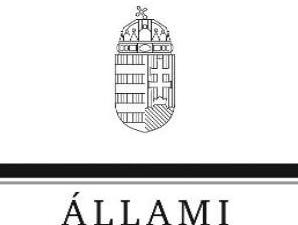
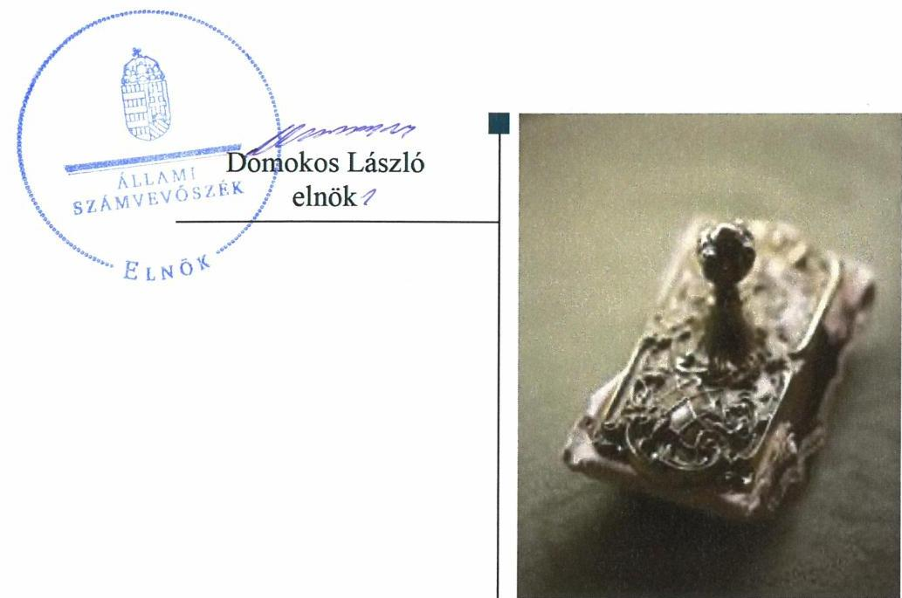
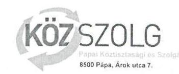
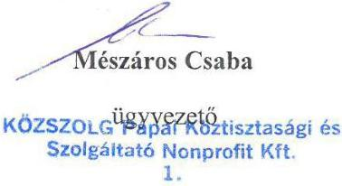
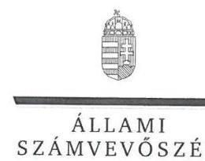

# Jelentés

## Nemzeti tulajdonú gazdasági társaságok ellenőrzése

KÖZSZOLG Pápai Köztisztasági és Szolgáltató Nonprofit Kft. 2019.

19131 www.asz.hu

---

# Jelentés 

## Nemzeti tulajdonú gazdasági társaságok ellenőrzése

KÖZSZOLG Pápai Köztisztasági és Szolgáltató Nonprofit Kft.
2019. 19. hó 25. nap

---

# AZ ELLENŐRZÉST FELÜGYELTE:

DR. PULAY GYULA felügyeleti vezető

# AZ ELLENŐRZÉST VEZETTE ÉS A VÉGREHAJTÁSÁÉRT FELELŐS:

JÁNOSI ISTVÁN ellenőrzésvezető

SALAMIN VIKTOR ellenőrzésvezető

A PROGRAM ÖSSZEÁLLÍTÁSÁÉRT FELELŐS:

TÓTPÁL SZABOLCS osztályvezető

IKTATÓSZÁM: EL-1593-001/2019.

|  Jelentéseink az Országgyűlés számítógépes hálózatán és az Interneten a www.asz.hu címen is olvashatóak. | TÉMASZÁM: 2478  |
| --- | --- |
|   | ELLENŐRZÉS-AZONOSÍTÓ SZÁM: V082206  |

---

# TARTALOMJEGYZÉK 

■ ÖSSZEGZÉS ..... 5
■ AZ ELLENŐRZÉS CÉLJA ..... 6
■ AZ ELLENŐRZÉS TERÜLETE ..... 7
■ AZ ELLENŐRZÉS HÁTTERE, INDOKOLTSÁGA ..... 8
■ A JELENTÉS LÉNYEGES KÉRDÉSKÖREI ..... 9
■ AZ ELLENŐRZÉS HATÓKÖRE ÉS MÓDSZEREI ..... 10
■ MEGÁLLAPÍTÁSOK ..... 12
■ JAVASLATOK ..... 14
■ MELLÉKLETEK ..... 15
I. sz. melléklet: Értelmező szótár ..... 15
■ FÜGGELÉK: ÉSZREVÉTELEK ..... 17
■ RÖVIDÍTÉSEK JEGYZÉKE ..... 23

---

.

---

# ÖSSZEGZÉS 

A KÖZSZOLG Pápai Köztisztasági és Szolgáltató Nonprofit Kft. vagyongazdálkodása nem volt szabályszerű, számviteli beszámolóit 2015-2017. években nem támasztotta alá leltárral, beszámolója nem volt megalapozott, ezért működésének átláthatósága és elszámoltathatósága nem volt biztosított.

## Az ellenőrzés társadalmi indokoltsága

Az Állami Számvevőszék kiemelt célja, hogy a helyi önkormányzatok gazdálkodásában rejlő pénzügyi kockázatok feltárásával, az államháztartáson kívülre nyújtott költségvetési támogatások és ingyenes vagyonjuttatások, valamint az államháztartáson kívül működő feladat-ellátó rendszerek ellenőrzéseivel hozzájáruljon ahhoz, hogy a közpénzeket az államháztartáson kívül működő szervezetek is átlátható, rendezett módon használják fel.

Magyarországon az önkormányzatok kötelező és önként vállalt feladataik vonatkozásában is egyre szélesebb körben alkalmazzák a költségvetésen kívüli feladatellátást, ezáltal - a nonprofit szervezetek mellett - az önkormányzati tulajdonú gazdasági társaságok is kiemelt fontosságú szerephez jutottak.

## Főbb megállapítások, következtetések, javaslatok

Pápa Város Önkormányzata a tulajdonosi jogok gyakorlásának rendjét rendeletében kialakította. A javadalmazással összefüggő szabályzatát, mint minősített többségi befolyással bíró többségi tulajdonos elkészítette, tulajdonosi jogait szabályszerűen gyakorolta.

A KÖZSZOLG Pápai Köztisztasági és Szolgáltató Nonprofit Kft. vagyongazdálkodási tevékenysége nem volt szabályszerű, 2015-2017. években mérlege alátámasztásához nem készített a jogszabályi előírásoknak megfelelő leltárt, ezért az éves beszámolói nem voltak megalapozottak. Számlarenddel a jogszabály előírása ellenére nem rendelkezett.

Az Állami Számvevőszék a jelentésben foglalt megállapítások alapján a KÖZSZOLG Pápai Köztisztasági és Szolgáltató Nonprofit Kft. ügyvezetőjének két javaslatot fogalmazott meg. A javaslatokat megalapozó megállapításokra az érintettnek 30 napon belül intézkedési tervet kell készítenie.

---

# AZ ELLENŐRZÉS CÉLJA 

AZ ELLENŐRZÉS CÉLJA annak megítélése volt, hogy a tulajdonosi joggyakorló a gazdasági társaságai feletti tulajdonosi joggyakorlás kereteit kialakította-e, tulajdonosi jogait megfelelően gyakorolta-e és kötelezettségeit teljesítette-e. A gazdasági társaság biztosította-e a vagyon védelmét a nyilvántartások szabályszerű vezetése és a mérleg tételeinek leltárral történő alátámasztása útján, valamint szabályszerűen gondoskodott-e a társaság használatában, kezelésében lévő nemzeti vagyon értékének megőrzéséről, gyarapításáról, hasznosításáról.

---

# AZ ELLENŐRZÉS TERÜLETE 

## Pápa Város Önkormányzata, KÖZSZOLG Pápai Köztisztasági és Szolgáltató Kft.

Az Önkormányzat ${ }^{1}$ a Társaságot ${ }^{2}$ 1991. december 30-án alapította 3,0 M Ft törzstőkével. 2014. július 1-jétől nonprofit társaságként működött. A Társaság az Önkormányzat többségi tulajdonában álló gazdálkodó szervezet volt, melyben az Önkormányzat 96,7%-os tulajdonosi részesedéssel rendelkezett, a Társaság kisebbségi tulajdonosa a MÉKI-R Kft. volt.

A Társaság az Észak-Balatoni Hulladékkezelési Konzorcium tagjaként részt vesz a nagytérségi hulladékkezelési rendszer üzemeltetésében.

Az ellenőrzött időszakban a polgármester ${ }^{3}$ és a Társaság ügyvezetőjének személyében nem történt változás, a jegyző ${ }^{4}$ személye 2018. augusztusában változott. A Társaság az ellenőrzött időszakban nem rendelkezett vagyonkezelésbe vett vagyonnal, továbbá nem tartozott kormányzati szektorba sorolt gazdasági társaságok közé. Átlagos állományi létszáma a 2015. évi 37 főről 2017. évben 38 főre emelkedett.

---

# AZ ELLENŐRZÉS HÁTTERE, INDOKOLTSÁGA 

Az Alaptörvény 38. cikke alapján az állam és a helyi önkormányzatok tulajdona nemzeti vagyon. A nemzeti vagyon megőrzése, megóvása érdekében kiemelten fontos ezen nemzeti tulajdonú gazdasági társaságok ellenőrzése. Gazdálkodásuk jellemzően a közérdeklődés és a média figyelmének középpontjában áll, amihez hozzájárul a gazdálkodásuk körébe tartozó - a nemzeti vagyon részét képező - vagyon nagysága, illetve az általuk ellátott közszolgáltatások minősége és hatékonysága. Ellenőrzéseink feltárhatják, hogy a tulajdonosi felügyelet hozzájárult-e a szabályszerű gazdálkodáshoz és feladatellátáshoz.

Az ellenőrzés eredményeként meghatározhatóvá válnak a szervezet vagyongazdálkodást érintő kockázatai, ezzel lehetővé téve a kockázatok csökkentését. A megállapítások alapján megfogalmazott számvevőszéki javaslatok hasznosítása elősegítheti a meglévő hibák megszüntetését. A jó gyakorlatok bemutatásával az ÁSZ hozzájárulhat a követendő megoldások megismertetéséhez, terjesztéséhez.

---

# A JELENTÉS LÉNYEGES KÉRDÉSKÖREI 

1. A Társaság feletti tulajdonosi joggyakorlás megfelelt-e a jogszabályi és belső előírásoknak?
2. A Társaság vagyongazdálkodási tevékenysége szabályszerű volt-e?

---

# AZ ELLENŐRZÉS HATÓKÖRE ÉS MÓDSZEREI 

## Az ellenőrzés típusa

Megfelelőségi ellenőrzés.

## Az ellenőrzött időszak

A tulajdonosi joggyakorlás vonatkozásában az ellenőrzött időszak 2017. január 1-től az ellenőrzés megkezdésének napjáig terjedt ki az éves beszámolók elfogadása és a vagyonkezelésbe adott vagyonnal való gazdálkodás tulajdonosi ellenőrzése kivételével, amelyeknél az ellenőrzött időszak 2015. január 1-től az ellenőrzés megkezdésének napjáig - 2018. szeptember 28-ig - tartott.

A Társaság vagyongazdálkodása vonatkozásában az ellenőrzött időszak 2015-2017. évek, a 2017. évi beszámoló jóváhagyása tekintetében 2018. június elsejéig tartó időszak.

## Az ellenőrzés tárgya

Az önkormányzati tulajdonban lévő gazdasági társaság feletti tulajdonosi joggyakorlás kialakítása és működtetése.

Önkormányzati tulajdonban lévő gazdasági társaság vagyongazdálkodása keretében a társaság használatában, kezelésében lévő nemzeti vagyon, illetve a saját vagyon tekintetében a vagyonnyilvántartások vezetése, leltára. A társaság használatában, vagyonkezelésében lévő nemzeti vagyon tekintetében a vagyon értékének megőrzése, gyarapítása, hasznosítása.

## Az ellenőrzött szervezet

Pápa Város Önkormányzata, valamint a KÖZSZOLG Pápai Köztisztasági és Szolgáltató Nonprofit Kft.

## Az ellenőrzés jogalapja

Az ellenőrzés jogalapját az ÁSZ tv. ${ }^{5} 1. § (3) bekezdése és 5. § (3)-(5) bekezdései képezték.

---

# Az ellenőrzés módszerei 

Az ellenőrzést az ellenőrzési program ellenőrzési kérdései, az ellenőrzött időszakban hatályos jogszabályok, az ellenőrzés szakmai szabályok és módszertanok alapján, a nemzetközi standardok figyelembe vételével végeztük.

Az ellenőrzés ideje alatt az ellenőrzött szervezettel történő kapcsolattartást az ÁSZ Szervezeti és Működési Szabályzatának vonatkozó előírásai alapján biztosítottuk.
2017. január 1-től az ellenőrzés megkezdésének napjáig ellenőriztük a tulajdonosi joggyakorlás kereteinek kialakítását, a tulajdonosi joggyakorló tevékenységét a felügyelő bizottság és a független könyvvizsgáló működéséhez kapcsolódóan, valamint azt, hogy a tulajdonosi joggyakorló - amennyiben a gazdasági társaság feladatellátásához és vagyonkezeléséhez kapcsolódóan határozott meg követelményeket, elvárásokat - a nemzeti vagyon értékének megőrzése érdekében monitorozta-e azok teljesülését. 2015. január 1-től az ellenőrzés megkezdésének napjáig ellenőriztük a tulajdonosi joggyakorló részvételét az éves beszámoló elfogadására vonatkozó döntéshozatalban, valamint amennyiben adott a társaságainak vagyonkezelésbe nemzeti vagyont, akkor azt, hogy az azzal történő gazdálkodást a tulajdonosi joggyakorló ellenőrizte-e.

Az ellenőrzési kérdések megválaszolásához szükséges bizonyítékok megszerzése a Társaság vagyongazdálkodása vonatkozásában a következő ellenőrzési eljárások alkalmazásával történt: megfigyelés, információkérés, összehasonlítás, elemző eljárás. Az ellenőrzési bizonyítékként felhasználható adatforrások közé tartoznak az ellenőrzési programban felsorolt adatforrások, továbbá minden - az ellenőrzés folyamán - feltárt, az ellenőrzés szempontjából információkat tartalmazó dokumentum.

Az ellenőrzést a kérdésekre adott válaszok kiértékelésével, valamint a megjelölt adatforrások, a csatolt tanúsítványok felhasználásával, továbbá az adott időszakban hatályos jogszabályok figyelembe vételével folytattuk le.

A vagyonnyilvántartások szabályszerűsége esetében az ellenőrzés azokra a legnagyobb értékű tételekre - a lényeges sokaságra - terjedt ki, melyek összértéke eléri a teljes sokaság összértékének 50%-át. A lényeges sokaságot tételesen ellenőriztük. A 2015-2017. évekre történt meg a lényeges dokumentumok, ennek keretében a leltározáshoz kapcsolódó dokumentumok, valamint a mérleg tételeit alátámasztó leltár értékelése.

---

# MEGÁLLAPÍTÁSOK 

## 1. A Társaság feletti tulajdonosi joggyakorlás megfelelt-e a jogszabályi és belső előírásoknak?

Összegző megállapítás Az Önkormányzat tulajdonosi joggyakorlása szabályszerű volt.
1.1. számú megállapítás Az Önkormányzat a tulajdonosi joggyakorlás kereteit a jogszabályi előírások szerint alakította ki.

A TULAJDONOSI JOGOK GYAKORLÁSÁNAK
RENDJÉT az Önkormányzat a vagyongazdálkodási rendelet ${ }^{6}$-ben és SZMSZ ${ }^{7}$-ben kialakította. A Társaság tevékenységével kapcsolatos elvárásokat és követelményeket a hulladékgazdálkodási rendelet ${ }^{8}$ határozta meg a Hgt. ${ }^{9}$ előírásai alapján.

A taggyűlés, melyben az Önkormányzat minősített többségi befolyással bírt, a Taktv. ${ }^{10}$ 5. § (3) bekezdésének előírása szerint megalkotta meg a vezető tisztségviselők, a felügyelőbizottsági tagok, az Mt. ${ }^{11}$ 208. §-ának hatálya alá eső munkavállalók javadalmazásáról, valamint a jogviszony megszűnése esetére biztosított juttatások módjának, mértékének elveiről, annak rendszeréről szóló szabályzatot.
1.2. számú megállapítás

A Társaság feletti tulajdonosi joggyakorlás szabályszerű volt.
A SZÁMVITELI BESZÁMOLÓ ELFOGADÁSÁRA, az
eredmény felosztására vonatkozó döntéshozatalban a taggyűlésben minősített többségi befolyással bíró Önkormányzat a jogszabályi előírásoknak megfelelően részt vett. A döntéshez a Felügyelő bizottság és a Könyvvizsgáló jelentése rendelkezésre állt.

A FELÜGYELŐ BIZOTTSÁG és a könyvvizsgáló tevékenységéhez kapcsolódóan a tulajdonosi joggyakorlás szabályszerű volt. A Felügyelő bizottság létrehozása megfelelt a Ptk. ${ }^{12}$ és a Taktv. előírásainak, működése szabályszerű volt, ügyrenddel rendelkezett. A Társaság rendelkezett könyvvizsgálóval a Ptk. és a Számv. tv. ${ }^{13}$ előírásai szerint.

## 2. A Társaság vagyongazdálkodási tevékenysége szabályszerű volt-e?

Összegző megállapítás

A Társaság vagyongazdálkodási tevékenysége nem volt szabályszerű.

## LELTÁRKÉSZÍTÉSI ÉS LELTÁROZÁSI SZABÁLY-

ZATTAL a Társaság rendelkezett az ellenőrzött időszakban a Számv. tv. előírásainak megfelelően.

---

# A MÉRLEG TÉTELEINEK ALÁTÁMASZTÁSÁHOZ a 

Társaság a Számv. tv. 69. § (1) bekezdésének előírása ellenére 2015-2017. évekre vonatkozóan nem állított össze olyan leltárt, amely tételesen, ellenőrizhető módon tartalmazta volna a mérleg fordulónapján meglévő eszközöket és forrásokat mennyiségben és értékben. Szabályszerű leltár hiányában a mérleg nem volt alátámasztott, a 2015-2017. évi beszámolók nem voltak megalapozottak. A Társaság könyvvizsgálója a 2015-2017. évi beszámolókról korlátozás nélküli véleményt adott.

A nem szabályszerűen összeállított leltárak következtében az egyszerűsített éves beszámolók vonatkozásában nem érvényesült a Számv. tv. 15. § (3) bekezdésében foglalt valódiság elve.

A vagyonhoz kapcsolódó nyilvántartások vezetése nem volt szabályszerű, mivel a Társaság az ellenőrzött időszakban a Számv. tv. 161. § (1) bekezdése szerinti számlarenddel nem rendelkezett.

---

# JAVASLATOK 

Az ÁSZ tv. 33. § (1) bekezdésében foglaltak értelmében az ellenőrzött szervezet vezetője köteles a jelentésben foglalt megállapításokhoz kapcsolódó intézkedési tervet összeállítani és azt a jelentés kézhezvételétől számított 30 napon belül az ÁSZ részére megküldeni. Amennyiben az ellenőrzött szervezet vezetője nem küldi meg határidőben az intézkedési tervet, vagy továbbra sem elfogadható intézkedési tervet küld, az Állami Számvevőszék elnöke az ÁSZ tv. 33. § (3) bekezdésében foglaltakat érvényesítheti.

## KÖZSZOLG Pápai Köztisztasági és Szolgáltató Nonprofit Kft. ügyvezetőjének

1. Intézkedjen a Számv.tv. előírása szerinti leltár összeállításáról.
(2. sz. megállapítás 2. bekezdése első mondata alapján)
2. Intézkedjen a Számv.tv. előírása szerinti számlarend elkészítéséről.
(2. sz. megállapítás 4. bekezdése alapján)

---

# MELLÉKLETEK 

- I. SZ. MELLÉKLET: ÉRTELMEZŐ SZÓTÁR
gazdasági társaság
koncessziós szerződés
közszolgáltatás
közfeladat
nemzeti vagyon
nemzeti vagyon használója
tulajdonosi jogok gyakorlója vagyonkezelő

Ptk. 3:88. § (1) bekezdése szerint „a gazdasági társaságok üzletszerű közös gazdasági tevékenység folytatására, a tagok vagyoni hozzájárulásával létrehozott, jogi személyiséggel rendelkező vállalkozások, amelyekben a tagok a nyereségből közösen részesednek, és
 a veszteséget közösen viselik".
Az 1991. évi XVI. tv. alapján a kizárólagos állami, önkormányzati vagy önkormányzati társulási tulajdon hatékony működtetésének, valamint a kizárólagosan az állam vagy az önkormányzat hatáskörébe utalt tevékenységek gyakorlásának egyik lehetséges útja mindezek koncessziós szerződés alapján való átengedése
Az Ebktv. ${ }^{14}$ 3. § d) pontja a következőképpen határozza meg a közszolgáltatást: „szerződéskötési kötelezettség alapján a lakosság alapvető szükségleteinek ellátására irányuló szolgáltatás, így különösen a villamos energia-, gáz-, hő-, víz-, szennyvíz- és hulladékkezelési, köztisztasági, postai és távközlési szolgáltatás, továbbá a menetrend alapján közlekedő járművekkel végzett közforgalmú személyszállítás".
Az Áht. 3/A. § (1) bekezdése alapján közfeladat a jogszabályban meghatározott állami vagy önkormányzati feladat
Nvtv. 1. § (2) bekezdése szerint nemzeti vagyonba tartozik többek között:
„az állam vagy a helyi önkormányzat kizárólagos tulajdonában álló dolgok,
az a) pont hatálya alá nem tartozó, állam vagy a helyi önkormányzat tulajdonában lévő dolog,
az állam vagy a helyi önkormányzat tulajdonában lévő pénzügyi eszközök, továbbá az államot vagy a helyi önkormányzatot megillető társasági részesedések,
az államot vagy a helyi önkormányzatot megillető bármely vagyoni érték-kel rendelkező jogosultság, amelyet jogszabály vagyoni értékű jogként nevesít
A tulajdonosi joggyakorló vagy a nemzeti vagyon használója által a nemzeti vagyon birtoklásának, használatának, hasznok szedése jogának bármely - a tulajdonjog átruházását nem eredményező - jogcímen történő átengedése, ide nem értve a vagyonkezelésbe adást, valamint a haszonélvezeti jog alapítását.
Forrás: Nvtv. 3. § (1) bekezdés 4. pont
Azon természetes személy, jogi személy vagy jogi személyiséggel nem rendelkező szervezet, aki vagy amely állami vagyon tekintetében törvény vagy szerződés alapján, a helyi önkormányzat vagyona tekintetében törvény, a helyi önkormányzat rendelete vagy szerződés alapján bármely jogcímen nemzeti vagyont birtokol, használ, szedi annak hasznait, kivéve a tulajdonosi joggyakorló.
Forrás: Nvtv. 3. § (1) bekezdés 11. pont
Aki a nemzeti vagyon felett az államot vagy a helyi önkormányzatot megillető tulajdonosi jogok és kötelezettségek összességének gyakorlására jogosult. (Forrás: Nvtv. 3. § (1) bekezdés 17. pontja)
az állam tulajdonában álló nemzeti vagyon tekintetében:
aa) költségvetési szerv,
ab) helyi önkormányzat, nemzetiségi önkormányzat, valamint ezek társulásai,
ac) az ab) alpontban felsoroltak fenntartása vagy irányítása alá tartozó intézmény,
ad) köztestület,
ae) az állam, az aa)-ac) alpontban meghatározott személyek együtt vagy külön-külön 100\%-os tulajdonában álló gazdálkodó szervezet,
af) az ae) alpont szerinti gazdálkodó szervezet 100\%-os tulajdonában álló gazdálkodó szervezet,
ag) a törvény által kijelölt egyedileg meghatározott jogi személy.
b) a helyi önkormányzat tulajdonában álló nemzeti vagyon tekintetében:

---

ba) nemzetiségi önkormányzat, helyi vagy nemzetiségi önkormányzati társulás, valamint ezek fenntartása vagy irányítása alá tartozó intézmény,
bb) költségvetési szerv,
bc) köztestület,
bd) az állam, a helyi önkormányzat, a ba) alpontban meghatározott személyek együtt vagy külön-külön 100\%-os tulajdonában álló gazdálkodó szervezet,
be) a bd) alpont szerinti gazdálkodó szervezet 100\%-os tulajdonában álló gazdálkodó szervezet.
Forrás: Nvtv. 3. § (1) bekezdés 19. pont
vagyongazdálkodás
A nemzeti vagyongazdálkodás feladata a nemzeti vagyon rendeltetésének megfelelő, az állam, az önkormányzat mindenkori teherbíró képességéhez igazodó, elsődlegesen a közfeladatok ellátásához és a mindenkori társadalmi szükségletek kielégítéséhez szükséges, egységes elveken alapuló, átlátható, hatékony és költségtakarékos működtetése, értékének megőrzése, állagának védelme, értéknövelő használata, hasznosítása, gyarapítása, továbbá az állam vagy a helyi önkormányzat feladatának ellátása szempontjából feleslegessé váló vagyontárgyak elidegenítése. (Forrás: Nvtv. 7. § (2) bekezdése).

---

# FÜGGELÉK: ÉSZREVÉTELEK 

A jelentéstervezetet a Számvevőszék 15 napos észrevételezésre megküldte az ellenőrzött szervezetek vezetőinek az ÁSZ tv. 29. § (1) bekezdése előírásának megfelelően.

A KÖZSZOLG Pápai Köztisztasági és Szolgáltató Nonprofit Kft. ügyvezetője élt az ÁSZ törvény 29. § (2) bekezdésében foglalt észrevételezési lehetőséggel, a törvényes határidőn belül a jelentéstervezetre észrevételt tett. Az észrevételt és az arra adott választ a függelék tartalmazza. Pápa Város Önkormányzata polgármestere nem tett észrevételt.

[^0]
[^0]:    * 29. § (1) Az Állami Számvevőszék az ellenőrzési megállapításait megküldi az ellenőrzött szervezet vezetőjének vagy az általa megbízott személynek, és annak, akinek személyes felelősségét állapította meg.
    (2) Az ellenőrzött szervezet vezetője és a felelősként megjelölt személy az ellenőrzés megállapításaira tizenöt napon belül írásban észrevételt tehet.
    (3) Az Állami Számvevőszék az észrevételre a beérkezésétől számított harminc napon belül írásban válaszol. A figyelembe nem vett észrevételeket köteles a jelentésben feltüntetni, és megindokolni, hogy azokat miért nem fogadta el.

---

Ettől Pápa, Árok utca 7.

Ügyiratszámunk: 2018-06/07/071-9
Ügyintézőnk: Bordás Ferenc

Hivatkozási számuk: EL-0857-072/2019.
Ügyintézőjük:

Tárgy: EL-0857-072/2019 iktatószámú Számvevőszéki jelentéstervzet észrevételezése

Állami Számvevőszék

Budapest,
Apáczai Csere János utca 10.
1052

Domokos László - elnök

Tisztelt Elnök Úr!

Társaságunkhoz 2019. június 6-án érkezett, EL-0857-072/2019 iktatási számú Nemzeti
tulajdonú gazdasági társaságok ellenőrzése KÖZSZOLG Pápai Köztisztasági és
Szolgáltató Nonprofit Kft. 2019. tárgyban készült Számvevőszéki jelentéstervezetre az
alábbi észrevételezést kívánom tenni:

A Számvevőszéki jelentéstervezet összegző megállapítása szerint a Társaság
vagyongazdálkodási tevékenysége nem volt szabályszerű az alábbiak okán:

1.) A Társaság az ellenőrzött 2015-2017. évekre vonatkozóan nem állított össze a Számv.
tv. 69. § (1) bekezdése szerinti leltárt, amely tételesen, ellenőrizhető módon tartalmazta volna
a mérleg fordulónapján meglévő eszközöket és forrásokat mennyiségben és értékben.

Észrevételezésem:

Az ellenőrzés során érintett 2015-2017. évekre vonatkozóan Társaságunk elkészítette a
Számv. tv. 69. § (1) bekezdése szerinti leltárt. Az ellenőrzés során az EL-0857-003/2018
iktatószámú adatszolgáltatásra felhívó levél 3. pontjában kért adatszolgáltatásnak
megítélésünk és jogértelmezésünk szerint az általános szakmai gyakorlatnak megfelelő
leltárak beküldésével eleget tettünk. A mérleg további sorait alátámasztó dokumentumok,
nyilvántartások Társaságunknál rendelkezésre állnak.

Fentiekre tekintettel a jelentés ezen megállapítását nem tartom elfogadhatónak.

---

2.) A vagyonhoz kapcsolódó nyilvántartások vezetése nem volt szabályszerű, mivel a Társaság az ellenőrzött időszakban a Számv. tv. 161. § (1) bekezdése szerinti számlarenddel nem rendelkezett.

Észrevételezésem:
Az ellenőrzés során érintett 2015-2017. évekre vonatkozóan Társaságunk rendelkezett a Számv. tv. 161. § (1) bekezdése szerinti számlarenddel. Az ellenőrzés során az EL-0857-014/2018 iktatószámú adatszolgáltatásra felhívó levél 2. pontjában kért adatszolgáltatásnak megítélésünk és jogértelmezésünk szerint az általános szakmai gyakorlatnak megfelelő számlarend beküldésével eleget tettünk.

Fentiekre tekintettel a jelentés ezen megállapítását nem tartom elfogadhatónak.
Kérem észrevételezésem szíves tudomásul vételét!

Pápa, 2019. június 18.

Tisztelttel:

# Kapia: 

- Címzett
- Dr. Áldozó Tamás - Pápa város polgármestere - e-mail útján
- Irattár

---

# Mészáros Csaba úr 

ügyvezető

## KÖZSZOLG Pápai Köztisztasági és Szolgáltató Nonprofit Kft.

Pápa

## Tisztelt Ügyvezető Úr!

A „Nemzeti tulajdonú gazdasági társaságok ellenőrzése - KÖZSZOLG Pápai Köztisztasági és Szolgáltató Nonprofit Kft." - címmel készített számvevőszéki jelentéstervezetre a 2018-06/07/071-9 ügyiratszámú levelében megküldött észrevételét köszönettel megkaptam.
Az Állami Számvevőszék észrevételre vonatkozó álláspontjáról a felügyeleti vezető által készített részletes tájékoztatást csatoltan megküldöm.
Tájékoztatom Ügyvezető urat, hogy a számvevőszéki jelentésben - az Állami Számvevőszékről szóló 2011. évi LXVI. törvény 29. § (3) bekezdése alapján - a figyelembe nem vett észrevételeket szerepeltetjük az elutasítás indokának feltüntetésével.

Budapest, 2019. július „, 4. "

---

# Tájékoztatás az észrevételek kezeléséről 

„Nemzeti tulajdonú gazdasági társaságok ellenőrzése - KÖZSZOLG Pápai Köztisztasági és Szolgáltató Nonprofit Kft. " című jelentéstervezetre a 2018-06/07/071-9 ügyiratszámú levelében megküldött észrevételét áttekintettem. Az észrevétel kezeléséről az alábbi tájékoztatást adom.

## A jelentéstervezet összegző megállapítását érintő 1) pont - leltározással kapcsolatos észrevételre adott válasz

A KÖZSZOLG Pápai Köztisztasági és Szolgáltató Nonprofit Kft. (továbbiakban: a Társaság) ellenőrzése tekintetében elkészített jelentéstervezet „ÖSSZEGZÉS" részben megfogalmazott megállapítására - ennek megfelelően az azt alátámasztó 2. számú a Társaság vagyongazdálkodási tevékenysége szabályszerűségére vonatkozó megállapítására - tett észrevételét nem fogadtuk el.
A Társaság az EL-0857-003/2018 iktatószámú adatbekérő levélre megküldött dokumentumokat a 2018. július 9. napján dátumozott „Teljességi és hitelességi nyilatkozat" 1. számú mellékletében sorolta fel. Ugyanebben a nyilatkozatban Ügyvezető úr az adatszolgáltatásokkal összefüggésben rögzítette, hogy az adatszolgáltatás teljes körű és hiteles, melynek okán az ÁSZ további adatbekérést, hiánypótlást nem kezdeményezett, az ellenőrzést a Társaság által beküldött dokumentumok alapján folytatta le.
A Társaság az ellenőrzött időszakban a Leltározási szabályzatának 5. pontjában meghatározottak szerint csak az immateriális javakat, a tárgyi eszközöket, az anyag- és árukészleteket és a készpénzben rendelkezésre álló pénzeszközöket leltározta. A Befektetett pénzügyi eszközök, Követelések, Aktív időbeli elhatárolások, Saját tőke, Céltartalékok, Kötelezettségek (Hosszú- és rövid lejáratú kötelezettségek), Passzív időbeli elhatárolások mérlegsorok leltárát nem készítette el. Ezt támasztják alá a Társaság által 2015-2017. évekre kitöltött, 7. számú tanúsítvány adatai is.
Megjegyezzük, hogy a 2015-2017. évekre kitöltött, 7. számú tanúsítvány - „Mérlegsorok megnevezés" alatt nem a mérlegsorok nevei-, hanem a leltározott eszközcsoportok megnevezései szerepeltek. 2017. évben a Befektetett eszközök sorban a tárgyi eszközök mellett az immateriális javakat is nevesítették, melyek leltározását a Leltározási szabályzatuk utasítása szerint (3 évenként) egyeztetéssel kellett elvégezni.
A Társaság 2015-2017. évek tekintetében megküldte a vevő és szállítói analitikáit is, melyek (a Társaság Leltározási szabályzata - 1. A leltározásra vonatkozó általános szabályok - A leltár tartalmi követelményei pontban meghatározott) tartalmi és formai hiányosságaik miatt nem értékelhetők leltárdokumentumnak.
A Társaság 2015-2017 évi egyszerűsített éves beszámoló mérleg adatai a fentiekben részletezett leltárak hiánya miatt nem voltak igazoltak. A 2015-2017 évi egyszerűsített éves beszámoló

---

mérlegek esetében a leltárral alá nem támasztott összevont összegek minden esetben jelentősnek minősültek, mivel meghaladták az adott évi mérlegfőösszeg 2\%-át.
Fentiek figyelembe vételével helytálló a jelentéstervezet megállapítása, mely szerint a leltár nem felelt meg a Számv. tv. 69.§ (1) bekezdés szerinti előírásnak. A mérlegtételeket alátámasztó leltárdokumentáció hiánya a 2015-2017. évi egyszerűsített éves beszámolók vonatkozásában sértette a Számv. tv. 4. § (2) és a 15. § (3) bekezdésében előírt megbízható és valós összkép bemutatását a gazdálkodó vagyonáról, összetételéről.
A jelentéstervezet összegző megállapítását érintő 2) pont - számlarendre vonatkozó észrevételre adott válasz
A Társaság részére kiküldött EL-0857-014/2018. iktatószámú adatbekérő levél 5. bekezdésének utolsó mondata a következő figyelemfelhívást tartalmazta: "az ÁSZ a rendelkezésre bocsátott dokumentumok alapján tesz megállapítást, és vonja le következtetéseit." A levél 4. számú melléklete rövid tájékoztatót tartalmazott az ABR rendszer használatáról, valamint külön is felhívta a figyelmet ( 6 . bekezdés utolsó mondat) arra, hogy az "Adatszolgáltatásának elősegítése érdekében a felületen részletes felhasználói kézikönyvet tettünk elérhetővé." A 4. számú melléklet Útmutató az Elektronikus Adatszolgáltatási Rendszer használatához című dokumentum a rendszer használatát támogató „további segítség" menüpontokról adott tájékoztatót. A Felhasználói kézikönyv 35. oldala pedig arról adott tájékoztatást, hogy amennyiben a fájlfeltöltés sikeresen megtörtént, arról a feltöltő automatikus levélben értesítést kap.
A Társaság általi feltöltések listázását követően megállapítást nyert, hogy a feltöltést visszaigazoló e-mailek között a számlarendek nem szerepeltek. Miután a sikeres feltöltésről nem áll rendelkezésre visszaigazoló e-mail, így a dokumentum feltöltése nem igazolt.
Fentiek figyelembe vételével helytálló a jelentéstervezet megállapítása, mely szerint a vagyonhoz kapcsolódó nyilvántartások vezetése nem volt szabályszerű, mivel a Társaság az ellenőrzött időszakban a Számv. tv. 161. § (1) bekezdése szerinti számlarenddel nem rendelkezett.

Budapest, 2019. július „, $\qquad$
Dr. Pulay Gyula felügyeleti vezető

---

# RÖVIDÍTÉSEK JEGYZÉKE 

${ }^{1}$ Önkormányzat
${ }^{2}$ Társaság
${ }^{3}$ Polgármester
${ }^{4}$ Jegyző
${ }^{5}$ ÁSZ tv.
${ }^{6}$ vagyongazdálkodási rendelet
${ }^{7}$ önkormányzati SZMSZ
${ }^{8}$ hulladékgazdálkodási rendelet
${ }^{9}$ Hgt.
${ }^{10}$ Taktv.
${ }^{11}$ Mt.
${ }^{12}$ Ptk.
${ }^{13}$ Számv. tv.
${ }^{14}$ Ebktv.

Pápa Város

 Önkormányzata
KÖZSZOLGÁL Pápai Köztisztasági és Szolgáltató Nonprofit Kft.
Pápa Város Önkormányzata Polgármestere
Pápa Város Önkormányzata Jegyzője
az Állami Számvevőszékről szóló 2011. évi LXVI. törvény
Pápa Város Önkormányzata Képviselőtestületének 7/2013. (III.18.)
önkormányzati rendelete az önkormányzat vagyonáról (egységes szerkezetben) módosította a 8/2017. (IV.28.) önkormányzati rendelet
Pápa Város Önkormányzata Képviselőtestületének 26/2014. (X.22.)
önkormányzati rendelete Pápa Város Önkormányzata Képviselőtestületének Szervezeti és Működési Szabályzatáról (egységes szerkezetben) módosította a 18/2016. (IX.23.) önkormányzati rendelet
Pápa Város Önkormányzata Képviselőtestületének 11/2014. (V.29.) önkormányzati rendelete a hulladékgazdálkodási közszolgáltatásról
2012. évi CLXXXV. törvény a hulladékról
2009. évi CXXII. törvény a köztulajdonban álló gazdasági társaságok takarékosabb működéséről (hatályos: 2009. december 4-től)
2012. évi I. törvény a munka törvénykönyvéről (hatályos: 2012. július 1-jétől)
2013. évi V. törvény a Polgári Törvénykönyvről (hatályos: 2014. március 15-étől)
2000. évi C. törvény a számvitelről (hatályos: 2001. január 1-jétől)
egyenlő bánásmódról és az esélyegyenlőség előmozdításáról szóló 2003. évi
CXXV. törvény

---

# ÁLLAMI SZÁMVEVŐSZÉK 

1052 Budapest, Apáczai Csere János utca 10.
Levélcím: 1364 Budapest 4. Pf. 54
Telefon: +36 14849100 Telefax: +36 14849200
www.asz.hu
