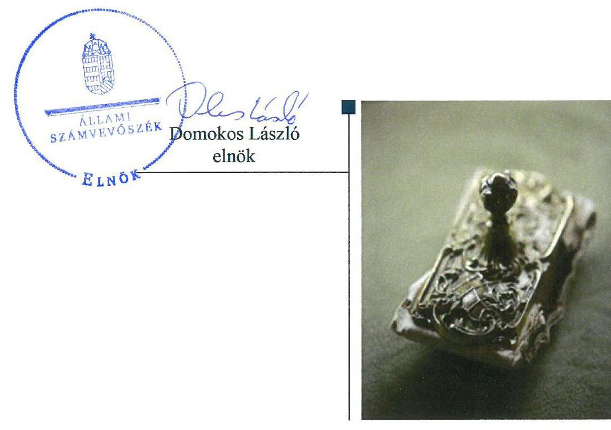
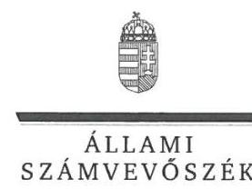
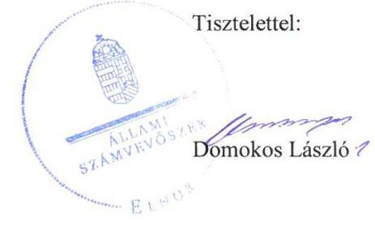
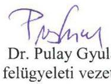
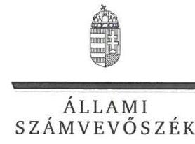
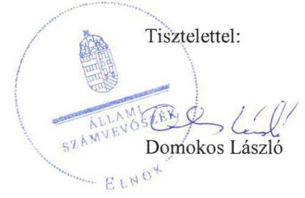
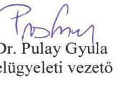

# Jelentés 

## Az állami tulajdonban lévő kulturális javakkal kapcsolatos vagyongazdálkodás ellenőrzése

A kulturális javakban megtestesülő állami vagyonnal kapcsolatos joggyakorlói feladatok ellátásának ellenőrzése 2019. 08. hó 06. nap

---

# AZ ELLENŐRZÉST FELÜGYELTE:

DR. PULAY GYULA ZOLTÁN felügyeleti vezető

## AZ ELLENŐRZÉST VEZETTE ÉS A VÉGREHAJTÁSÁÉRT FELELŐS:

DR. GYŐRI GABRIELLA ellenőrzésvezető

## A PROGRAM ÖSSZEÁLLÍTÁSÁÉRT FELELŐS:

TÓTPÁL SZABOLCS osztályvezető

IKTATÓSZÁM: EL-1594-001/2019.

TÉMASZÁM: 2482

ELLENŐRZÉS-AZONOSÍTÓ SZÁM: V0826

Jelentéseink az Országgyűlés számítógépes hálózatán és az Interneten a www.asz.hu címen is olvashatóak.

---

# TARTALOMJEGYZÉK 

■ ÖSSZEGZÉS ..... 5
■ AZ ELLENŐRZÉS CÉLJA ..... 7
■ AZ ELLENŐRZÉS TERÜLETE ..... 8
■ AZ ELLENŐRZÉS HÁTTERE, INDOKOLTSÁGA ..... 10
■ A JELENTÉS LÉNYEGES KÉRDÉSKÖREI ..... 11
■ AZ ELLENŐRZÉS HATÓKÖRE ÉS MÓDSZEREI ..... 12
■ MEGÁLLAPÍTÁSOK ..... 14
■ JAVASLATOK ..... 17
■ MELLÉKLETEK ..... 19
I. sz. melléklet: Értelmező szótár ..... 19
■ FÜGGELÉK: ÉSZREVÉTELEK ..... 21
■ RÖVIDÍTÉSEK JEGYZÉKE ..... 33

---

.

---

# ÖSSZEGZÉS 

A kulturális javakban megtestesülő állami vagyonhoz köthető ágazati irányítói feladatellátás - 2015. év kivételével - szabályszerű volt. 2017-ben a kulturális javakról szóló központi nyilvántartás vezetése nem a jogszabályi előírások szerint történt. A kulturális javakban megtestesülő állami vagyon átláthatóságára, értéknövelő használatára, gyarapítására vonatkozó követelmények teljesülése nem volt biztosított.

## Az ellenőrzés társadalmi indokoltsága

Az Állami Számvevőszék Stratégiájának alapértéke, hogy ellenőrzései segítik az integritás alapú, átlátható és elszámoltatható közpénzfelhasználás megteremtését. Az Alaptörvény rendelkezése szerint a nemzeti vagyon megőrzésének, védelmének és a nemzeti vagyonnal való felelős gazdálkodásnak a követelményeit sarkalatos törvény, a nemzeti vagyonról szóló törvény rögzíti. Az ebben foglaltak alapján az állami és önkormányzati fenntartású közgyűjtemények (a muzeális intézmény, levéltár, közgyűjteményként működő kép- és hangarchívum, valamint könyvtár) saját gyűjteményében nyilvántartott kulturális javak a nemzeti vagyon körébe tartoznak. Az Állami Számvevőszék korábbi ellenőrzései a kulturális javak nyilvántartása és a vagyon megóvásához kapcsolódó hiányosságokra mutattak rá az állami és önkormányzati fenntartásban lévő muzeális intézményeknél. Ez különösen indokolta, hogy az Állami Számvevőszék ellenőrizze, hogy a közgyűjteményt fenntartók irányítását, felügyeletét ellátó állami szervek, valamint a kulturális javakkal kapcsolatos tulajdonosi joggyakorlók az Alaptörvényben megfogalmazott elveknek megfelelően és a jogszabályi előírásokat betartva meghatározták-e a közgyűjteményi intézmények tevékenységére vonatkozó előírásokat, ellenőrzik azok betartását, gondoskodnak a közgyűjteményekben őrzött kulturális javak állami nyilvántartásáról és hatékony védelméről.

## Főbb megállapítások, következtetések, javaslatok

Az emberi erőforrások minisztere, mint kultúráért felelős miniszter a kulturális javak revíziójával és selejtezésével kapcsolatos, 2014. óta fennálló szabályozási kötelezettségének 2015 novemberében tett eleget, így a kulturális javakban megtestesülő állami vagyonhoz köthető ágazati irányítói feladatellátás 2015-ben nem volt szabályszerű, 2016-2017. években szabályszerű volt. A Miniszterelnökséget vezető miniszter, mint kulturális örökség védelméért felelős miniszter az ellenőrzött időszakban fennálló szabályozási kötelezettségét teljesítette.

A kulturális javakról a Miniszterelnökséget vezető miniszter, mint nyilvántartás vezetésére kijelölt hatóság 2017-ben nem vezette a jogszabályban előírt valamennyi központi nyilvántartást, illetve nem a jogszabályban előírt tartalommal vezette azokat.

A kulturális javakban megtestesülő állami vagyon esetében nem voltak biztosítottak az Alaptörvény 39. cikk (2) bekezdésében előírt - a vagyon átláthatóságára - és a nemzeti vagyonról szóló 2011. évi CXCVI. törvény 7. § (2) bekezdésében előírt a vagyon egységes elveken alapuló, átlátható működtetésére, értéknövelő használatára, hasznosítására, gyarapítására vonatkozó követelmények teljesülésének feltételei, mert a kulturális javakról nem vezettek teljes körű, egységes nyilvántartást.

Az Állami Számvevőszék korábbi ellenőrzései a kulturális javak nyilvántartása és a vagyon megóvásához kapcsolódó hiányosságokra mutattak rá. A kulturális javak nyilvántartásának szabályozásával, ennek felügyeletével és ellenőrzésével kapcsolatban hatáskörrel rendelkező állami szervek körében végzett ellenőrzés is azt állapította meg, hogy az ellenőrzési időszak végéig, azaz 2017. december 31-ig e szervezetek sem alakították ki azt a rendszert, amely biztosította volna a kulturális javakban megtestesülő állami vagyonnak az Alaptörvényben megfogalmazott követelményeknek megfelelő védelmet. 2017-ben a Kormány kezdeményezte, hogy a kulturális örökség védelméről szóló 2001. évi LXIV. törvény módosításával felhatalmazást kapjon a kulturális javak védelmét biztosító részletes szabályozásra. Az új felhatalmazással élve a Kormány megalkotta a 68/2018. (IV. 9.) Korm. rendeletet a kulturális örökség védelmével

---

kapcsolatos szabályokról. A kormányrendelet - többek között - részletesen szabályozza a kulturális javak nyilvántartását is. Így jelentősen hozzájárul a kulturális javak fokozott védelméhez. Továbbra is szükséges azonban, hogy az állam, mint a kulturális javak tulajdonosa egységes, átfogó és megbízható nyilvántartással rendelkezzen a tulajdonában álló kulturális javakról. Ezért az Állami Számvevőszék egy ilyen nyilvántartás létrehozását kezdeményezi a rábízott állami vagyon felett az államot megillető tulajdonosi jogok és kötelezettségek összességét gyakorló MNV Zrt. vezérigazgatójánál.

Az Állami Számvevőszék a Miniszterelnökséget vezető miniszternek kettő javaslatot fogalmazott meg.

---

# AZ ELLENŐRZÉS CÉLJA 

AZ ELLENŐRZÉS CÉLJA annak értékelése volt, hogy a kulturális javak körébe tartozó állami vagyon értékmegőrzése, a vagyon gyarapítása, állagának védelme, a vagyon hasznosítása érdekében a tulajdonosi -, az ágazati irányítási -, a felügyeleti joggyakorlók vonatkozó feladatellátása szabályszerű volt-e, továbbá, hogy a kulturális javakban megtestesülő állami vagyon nyilvántartása szabályszerű volt-e.

---

# AZ ELLENŐRZÉS TERÜLETE 

## Az állami tulajdonban lévő kulturális javakkal kapcsolatos vagyongazdálkodás ellenőrzése

Az ellenőrzés az állam kulturális szerepvállalása körében a nemzeti/állami vagyonba sorolt, az állami fenntartású közgyűjteményekben kezelt állami tulajdonban lévő és a védetté nyilvánított kulturális javakkal való szabályszerű vagyongazdálkodás közfeladat ellátására, továbbá a tulajdonosi-, az ágazati irányítási-, felügyeleti joggyakorlók fenntartott szervezetekkel kapcsolatos feladatellátása szabályszerűségére terjedt ki.

Közgyűjteménynek tekinti a Kötv. ${ }^{1}$ és a Kultv. ${ }^{2}$ az állam, a helyi önkormányzat, valamint a nemzetiségi önkormányzat, a köztestület és a közalapítvány tulajdonában, fenntartásában működő vagy általuk alapított könyvtárat, levéltárat, muzeális intézményt, kép- és hangarchívumot.

A Kultv. és a Kötv. alapján a kulturális javak körébe az élettelen és élő természet keletkezésének, fejlődésének, az emberiség, a magyar nemzet és Magyarország népei történelmének minden kiemelkedő és jellemző tárgyi, képi, írásos és egyéb (hangdokumentum vagy régészeti jelenség) bizonyítékai - az ingatlanok kivételével -, valamint a művészeti alkotások tartoznak. Az Nvtv. ${ }^{3}$ az állami és önkormányzati fenntartású közgyűjtemények (a muzeális intézmény, levéltár, közgyűjteményként működő kép- és hangarchívum, valamint könyvtár) saját gyűjteményében nyilvántartott kulturális javakat a nemzeti vagyon körébe sorolja.

Az ellenőrzött tulajdonosi-, ágazati irányítási-, felügyeleti joggyakorló szervezetek: az EMMI ${ }^{4}$, a ME${ }^{5}$, valamint az MNV Zrt. ${ }^{6}$, mint tulajdonosi joggyakorló.

A Kult. tv.-ben foglalt felhatalmazás alapján az EMMI látta el a közgyűjtemények (könyvtár, levéltár, muzeális intézmény, kép- és hangarchívum) ágazati irányítását.

A Kötv. alapján a kulturális örökség védelméért felelős miniszter ${ }^{7}$, amely jogkört a Miniszterelnökséget vezető miniszter látta el, a kulturális örökség védelmének keretében:
a) ellátta a védelem összehangolását és szakmai irányítását, ágazati felügyeletét,
b) irányította a kulturális örökség védelmével összefüggő feladatokat ellátó kormányrendeletben meghatározott eljáró hatóságot,
c) közreműködött a kulturális javakkal kapcsolatos tulajdoni igények rendezésében,
d) ellátta a nemzeti emlékhelyekkel kapcsolatos feladatait,
e) ellátta a kulturális javak nyilvántartásával kapcsolatos feladatait,
f) ellátta a kulturális javak védetté nyilvánításával kapcsolatos feladatait,

---

g) ellátta a védetté nyilvánított kulturális javakkal kapcsolatos hatósági feladatokat.
A rábízott állami vagyon felett az államot megillető tulajdonosi jogok és kötelezettségek összességét tulajdonosi joggyakorlóként a Vtv. ${ }^{8}$ alapján az MNV Zrt. gyakorolta.

---

# AZ ELLENŐRZÉS HÁTTERE, INDOKOLTSÁGA 

## A KULTURÁLIS ÖRÖKSÉGHEZ TARTOZÓ JAVAK,

értékek védelme, megőrzése és fenntartása, valamint a nyilvánosság számára történő széleskörű és egyenlő hozzáférhetővé tétele a mindenkori társadalom kötelezettsége.

Az állam kulturális szerepvállalása körében a kulturális igazgatás szervei (az ágazati irányítási-, a felügyeleti jogkörök gyakorlását ellátó minisztériumok) feladatellátása ágazati törvények és miniszteri rendeletek keretében meghatározott.

AZ ALAPTÖRVÉNY ${ }^{9}$ rendelkezése szerint a nemzeti vagyon megőrzésének, védelmének és a nemzeti vagyonnal való felelős gazdálkodásnak a követelményeit sarkalatos törvény rögzíti, mely az Nvtv. A tulajdonosi joggyakorlás és vagyonkezelés általános és speciális szabályait, az állami vagyon nyilvántartására és elszámolására vonatkozó eljárásokat, a vagyonkezelési szerződés feltételrendszerét kormányrendelet, illetve a kulturális javak vagyonelem vonatkozásában ágazati törvények és miniszteri rendeletek írják elő.

ÁLLAMI VAGYONNAK minősül többek között az állam tulajdonában lévő dolog, mindazon vagyon, amely vonatkozásában törvény az állam kizárólagos tulajdonjogát nevesíti. A rábízott állami vagyon felett az államot megillető tulajdonosi jogok és kötelezettségek összességét tulajdonosi joggyakorlóként az MNV Zrt. gyakorolja. Ettől a kulturális javakban megtestesülő állami vagyon vonatkozásában törvény vagy miniszteri rendelet eltérően nem rendelkezett.

Az ÁSZ ${ }^{10}$ korábbi ellenőrzései a nemzeti vagyonba tartozó kulturális javak nyilvántartási és vagyongazdálkodási tevékenységéhez kapcsolódó hiányosságokra világítottak rá az állami és önkormányzati fenntartású muzeális intézményeknél, melyek esetében a kulturális javak állományának megőrzése és fizikai védelme nem volt biztosított.

A közgyűjtemények tevékenységét irányító, felügyeletüket ellátó, a kulturális javakkal kapcsolatos tulajdonosi joggyakorló szervezetek feladatellátásában meglévő hiányosságok feltárásával az ÁSZ a kulturális javakban megtestesülő nemzeti vagyonnal való felelős gazdálkodást kívánja támogatni.

---

# A JELENTÉS LÉNYEGES KÉRDÉSKÖREI 

1. A kulturális javakban megtestesülő állami vagyonhoz köthető ágazati irányítói és felügyeleti feladatellátás szabályszerű volt-e?
2. A kulturális javakban megtestesülő állami vagyon nyilvántartása biztosított volt-e?
3. A kulturális javakban megtestesülő állami vagyon besorolására, a vagyonnal való gazdálkodással szemben határoztak-e meg követelményeket, ellenőrizték-e azok teljesülését?

---

# AZ ELLENŐRZÉS HATÓKÖRE ÉS MÓDSZEREI 

## Az ellenőrzés típusa

Megfelelőségi ellenőrzés.

## Az ellenőrzött időszak

2015-2017. évek.

## Az ellenőrzés tárgya

A megfelelőségi ellenőrzésen belül, szabályszerűségi ellenőrzés tárgyát képezte az állam kulturális szerepvállalása körében, a nemzeti vagyonba sorolt, állami fenntartású könyvtárakban és muzeális intézményekben, mint közgyűjteményekben kezelt és a védetté nyilvánított kulturális javakban megtestesülő állami vagyonnal való szabályszerű vagyongazdálkodásra irányuló tulajdonosi, ágazati irányítási és felügyeleti joggyakorlóknak a jogszabályok által hatáskörükbe delegált feladat ellátása.

Helyénvalósági ellenőrzés tárgyát képezte a kulturális javakban megtestesülő állami vagyon besorolására, nyilvántartására, a vagyonnal való gazdálkodásra vonatkozó követelmények meghatározására, azok teljesülésének ellenőrzésére vonatkozó tevékenység értékelése.

## Az ellenőrzött szervezet

Az Emberi Erőforrások Minisztériuma, a Miniszterelnökség, valamint az MNV Zrt., mint tulajdonosi joggyakorló.

## Az ellenőrzés jogalapja

Az ellenőrzés jogszabályi alapját az ÁSZ tv. ${ }^{11} 1$. § (3) bekezdése, az 5. § (3) bekezdése, a (4) bekezdés a) pontja, a (6) bekezdésének előírásai képezték.

## Az ellenőrzés módszerei

Az ÁSZ az ellenőrzést az ellenőrzési program szempontjai, az ellenőrzött időszakban hatályos jogszabályok, az ellenőrzés szakmai szabályai, az ÁSZ elnöke által meghatározott és az ÁSZ honlapján nyilvánosságra hozott helyénvalósági kritériumok, a jelen ellenőrzésre irányadó ÁSZ módszertanok figyelembevételével hajtotta végre.

---

Az ellenőrzés ideje alatt az ellenőrzött szervezetekkel történő kapcsolattartást az ÁSZ SZMSZ ${ }^{12}$-ének vonatkozó előírásai alapján biztosította az ÁSZ.

Az ellenőrzési kérdések megválaszolásához szükséges bizonyítékok megszerzése az ellenőrzöttek által rendelkezésre bocsátott dokumentumokra, adatokra alapozva megfigyelés, szemle (szemrevételezés), valamint elemző eljárás útján történt. Mintavételezésre nem került sor.

Az ellenőrzési bizonyítékként felhasználható adatforrások közé tartoztak egyrészt az ellenőrzési program részletes szempontjainál felsorolt adatforrások, másrészt minden egyéb - az ellenőrzés folyamán feltárt, az ellenőrzés szempontjából információt tartalmazó - dokumentum.

Az ellenőrzés lefolytatásához az ellenőrzött
 szervezetek a tanúsítványok kitöltésével, valamint az ÁSZ által kért dokumentumok megküldésével szolgáltattak adatokat, amelyek valódiságát és teljes körűségét az ellenőrzött szervezetek vezetője részéről kijelölt meghatalmazott által tett teljességi és hitelességi nyilatkozat igazolta. Az így rendelkezésre bocsátott adatok, információk kontrollja az ellenőrzés keretében történt.

Az ellenőrzés során az ÁSZ értékelte az ellenőrzött szervezetek állami tulajdonban lévő kulturális javakkal kapcsolatos vagyongazdálkodásának helyénvalóságát. Az ÁSZ által meghatározott helyénvalósági kritérium volt az Alaptörvényben és az Nvtv.-ben előírt nemzeti vagyon rendeltetésének megfelelő, egységes elveken alapuló, átlátható, hatékony működtetés, értékének megőrzése, gyarapítása érdekében az állami vagyon besorolására, nyilvántartására, a vagyongazdálkodással kapcsolatos jogszabályokban még nem részletezett követelmények meghatározására, azok teljesítésének ellenőrzésére irányuló tevékenység ellátása. Helyénvalónak értékelte az ÁSZ, ha az ellenőrzött szervezet a kulturális javakban megtestesülő állami vagyonnal való gazdálkodással szemben követelményeket határozott meg és ellenőrizte azok teljesülését. A helyénvalóságra vonatkozó megállapításokat dőlt betűvel jeleztük.

---

# 1. A kulturális javakban megtestesülő állami vagyonhoz köthető ágazati irányítói és felügyeleti feladatellátás szabályszerű volt-e? 

Összegző megállapítás

1.1. számú megállapítás

1.2. számú megállapítás

A kulturális javakban megtestesülő állami vagyonhoz köthető ágazati irányítói feladatellátás 2015-ben nem volt szabályszerű, 2016-2017-ben szabályszerű volt, a felügyeleti feladatellátás szabályszerű volt.

A kultúráért felelős miniszter ${ }^{13}$ - jogszabályok által hatáskörébe delegált - irányítási feladatainak ellátása 2015. év kivételével szabályszerű volt.

A kultúráért felelős miniszter a muzeális intézmények nyilvántartásában szereplő kulturális javak revíziójával és selejtezésével összefüggő kérdések szabályozására vonatkozó - Kultv. 51. § (2) bekezdés ae) pontjában 2014. január 12-től előírt - kötelezettségének az 51/2015. (XI. 13.) EMMI rendelet ${ }^{14}$ kiadásával 2015 novemberében tett eleget.

A Kötv.-ben előírt, a könyvtárakban levő muzeális dokumentumok kezelésével és nyilvántartásával kapcsolatos szabályokat az ellenőrzött időszakban rendelet tartalmazta. A kultúráért felelős miniszter a Kultv. előírásai alapján jelölt ki szervezeteket az állami tulajdonban lévő, jogszabály alapján védett kulturális javak vagyonkezelésére, továbbá vezette a muzeális intézmények működési engedélyeinek nyilvántartását.

A kulturális örökség védelméért felelős miniszter - jogszabályok által hatáskörébe delegált - irányítási feladatainak az ellenőrzött időszakban eleget tett.

A kulturális örökség védelméért felelős miniszter a Kötv.-ben kapott felhatalmazás alapján az örökségvédelem körében a hatósági és egyéb nyilvántartások vezetésének szabályait rendeletekben rögzítette.

A közgyűjteményekhez kapcsolódó felügyeleti feladatok ellátása az ellenőrzött időszakban szabályszerű volt.

A felügyeleti joggyakorló kultúráért felelős miniszter a közgyűjtemények vonatkozásában a feladat- és hatáskörébe tartozó felügyeleti és ellenőrzési tevékenységre vonatkozó keretrendszert az Ltv. ${ }^{15}$ és a Kultv. előírásaival összhangban kialakította.

A kultúráért felelős miniszter a szakmai követelmények teljesülését és végrehajtását - a közgyűjtemények esetében - az éves szakmai beszámolók véleményezésével és a szakfelügyeleti rendszer működtetésével biztosította. A szakfelügyeleti ellenőrzés keretén belül ellenőrizték a működési

---

engedélyben foglaltak betartását, a kulturális statisztikai adatszolgáltatási kötelezettség teljesítését, a nyilvántartások vezetését, a vagyon értékének megőrzése terén megtett intézkedések szabályszerűségét.

# 2. A kulturális javakban megtestesülő állami vagyon nyilvántartása biztosított volt-e? 

## Összegző megállapítás

A kulturális javakban megtestesülő állami vagyon nyilvántartása nem volt biztosított.

A védetté nyilvánított kulturális javakról - a 496/2016. (XII. 28.) Korm. rendelet ${ }^{16}$ 3. § (1) bekezdés d) pontjában, a 45/2012. (XI. 30.) EMMI rendelet ${ }^{17}$ 2. § -ában és a Kötv. 71. § (2) bekezdés a), f) pontjaiban rögzítettek alapján - a kulturális örökség védelméért felelős miniszternek, mint nyilvántartást vezető hatóságnak kellett nyilvántartást vezetnie 2017. január 1-jétől. A kulturális örökség védelméért felelős miniszter a Kötv. 71. § (2) bekezdés a) pontjában előírtak alapján központi nyilvántartást vezetett a védetté nyilvánított kulturális javakról, de az a Kötv. 73. § b)-d) pontjaiban előírtak ellenére nem tartalmazta a tárgy tulajdonosának és birtokosának személyazonosító adatait, valamint lakcímét, a tulajdonszerzés idejét és módját, illetve a tárgy őrzési helyét.

A kulturális örökség védelméért felelős miniszter a Kötv. 71. § (2) bekezdés c) pontjában rögzítettek szerint központi nyilvántartást vezetett a Magyarország területén jogellenesen eltulajdonított kulturális javakról. Nem vezette azonban a Kötv. 71. § (2) bekezdés b), d)-l) pontjaiban előírt nyilvántartásokat (így különösen: a kiviteli engedélyekről, az ideiglenesen védetté nyilvánított kulturális javakról, a védetté nyilvánításra javasolt kulturális javakról szóló nyilvántartást).

## 3. A kulturális javakban megtestesülő állami vagyon besorolására, a vagyonnal való gazdálkodással szemben határoztak-e meg követelményeket, ellenőrizték-e azok teljesülését?

## Összegző megállapítás

A kulturális javakban megtestesülő állami vagyonnal való gazdálkodással szemben nem határoztak meg követelményeket.

A kultúráért felelős miniszter nem határozott meg előírásokat a kulturális javakban megtestesülő állami vagyon Nvtv. előírásaihoz kapcsolódó besorolására, a nyilvántartás tartalmára, vezetésének módjára vonatkozóan.

Az MNV Zrt. a kulturális javakban megtestesülő állami vagyonra vonatkozó nyilvántartás szabályozási keretét nem alakította ki. Az MNV Zrt. a 2015-2017. években a kulturális javakban megtestesülő állami vagyon tárgyában nem végzett ellenőrzéseket. Az állami tulajdonban lévő kulturális javakról a 2015-2017. években nem volt teljes körű, egységes, központi nyilvántartás.

---

Az MNV Zrt. a kulturális javakban megtestesülő állami tulajdonban lévő eszközök vagyongazdálkodásával szemben követelményeket nem határozott meg, nem alakított ki azok teljesítésének mérésére, értékelésére alkalmas szempontokat.

---

# JAVASLATOK 

Az ÁSZ tv. 33. § (1) bekezdésében foglaltak értelmében az ellenőrzött szervezet vezetője köteles a jelentésben foglalt megállapításokhoz kapcsolódó intézkedési tervet összeállítani és azt a jelentés kézhezvételétől számított 30 napon belül az ÁSZ részére megküldeni. Amennyiben az ellenőrzött szervezet vezetője nem küldi meg határidőben az intézkedési tervet, vagy továbbra sem elfogadható intézkedési tervet küld, az Állami Számvevőszék elnöke az ÁSZ tv. 33. § (3) bekezdése a) és b) pontjaiban foglaltakat érvényesítheti.

## A Miniszterelnökséget vezető miniszternek

1. Intézkedjen, hogy a védetté nyilvánított kulturális javakról vezetett központi nyilvántartás adattartalma megfeleljen a Kötv. vonatkozó előírásainak.
(2. sz. megállapítás 1. bekezdés 2. mondata alapján)
2. Intézkedjen a Kötv. 71. § (2) bekezdés b), d)-l) pontjaiban előírt központi nyilvántartások vezetéséről.
(2. sz. megállapítás 2. bekezdés 2. mondata alapján)

---

.

---

# MELLÉKLETEK 

- I. SZ. MELLÉKLET: ÉRTELMEZŐ SZÓTÁR
állami vagyon
állami vagyon felett, az államot megillető tulajdonosi jogok gyakorlója
állami vagyon használója
állami vagyon kezelője /vagyonkezelő
felügyeleti szerv
irányító szerv

Állami vagyonnak minősül az állam tulajdonában lévő dolog, valamint a dolog módjára hasznosítható természeti erő, mindazon vagyon, amely vonatkozásában törvény az állam kizárólagos tulajdonjogát nevesíti, az állam tulajdonában lévő tagsági jogviszonyt megtestesítő értékpapír, illetve az államot megillető egyéb társasági részesedés, továbbá az államot megillető olyan immateriális, vagyoni értékkel rendelkező jogosultság, amelyet jogszabály vagyoni értékű jogként nevesít (Forrás: Vtv. 1. § (2) bekezdése)
A rábízott állami vagyon felett az államot megillető tulajdonosi jogok és kötelezettségek összességét tulajdonosi joggyakorlóként - ha törvény vagy miniszteri rendelet eltérően nem rendelkezik - az MNV Zrt. gyakorolja (Forrás: Vtv. 3. § (1) bek.)
Eltérő rendelkezés: A tulajdonosi jogokat az MFB Zrt., a Magyar Posta Zrt., az NKM Zrt. felett - ha miniszteri rendelet eltérően nem rendelkezik - az állami vagyon felügyeletéért felelős miniszter gyakorolja (Nemzeti Fejlesztési Minisztérium, Vagyonpolitikáért Felelős Államtitkárság) (Forrás: Vtv. 3. § (2) bek., a) pont)
Eltérő rendelkezés 2017. XII. 28 -i hatállyal: a Vtv. keretei között, a joggyakorlás egyes szabályainak meghatározásával az államot megillető tulajdonosi jogok és kötelezettségek összességének, illetve azok meghatározott részének gyakorlóját a miniszter a nemzeti vagyonról szóló 2011. évi CXCVI. törvény (a továbbiakban: Nvtv.) 7/A. § (1) bekezdése szerinti személy kijelölésével határozhatja meg.
Az a természetes vagy jogi személy, jogi személyiséggel nem rendelkező szervezet, aki, vagy amely törvény vagy szerződés alapján, bármely jogcímen (bérlet, haszonbérlet, használat stb.) állami vagyont birtokol, használ, szedi annak hasznait, hasznosít, ide nem értve a haszonélvezőt, a vagyonkezelőt és a tulajdonosi jogok gyakorlóját. (Forrás: Vtvr. 1. § (7) bekezdés a) pontja)
Az állami vagyont az MNV Zrt. maga kezeli, vagy kizárólag az Nvtv.-ben meghatározott személyekkel vagyonkezelési szerződést köthet. (Forrás: Vtv. 27. § (1) bekezdése)
Ha jogszabály költségvetési szerv felügyeletét említi, azon a költségvetési szerv szervezeti és működési szabályzatának jóváhagyása; a költségvetési szerv vezetésére kinevezés vagy megbízás adása, a vezető felmentése vagy a vezetői megbízás visszavonása, és - ha törvény vagy kormányrendelet másként nem rendelkezik - a költségvetési szerv vezetőjével kapcsolatos egyéb munkáltatói jogok gyakorlása; és a gazdasági vezetőjének kinevezése vagy megbízása, felmentése vagy megbízásának visszavonása; továbbá a költségvetési szerv tevékenységének törvényességi, szakszerűségi és hatékonysági ellenőrzése, jelentéstételre vagy beszámolóra való kötelezése; valamint a költségvetési szerv kezelésében lévő közérdekű adatok és közérdeklődésből nyilvános adatok, valamint törvényben meghatározott személyes adatok kezelése hatáskörök együttesét kell érteni. (Forrás: Áht. 9/B. § b-c) pontjai)
A költségvetési szerv tekintetében az Áht.-ban meghatározott irányítási hatáskört gyakorló szerv. A költségvetési szerv irányítása a következő hatáskörök gyakorlását jelenti: a költségvetési szerv alapítása, átalakítása és megszüntetése, ideértve az alapító okirat és annak módosítása, valamint a megszüntető okirat kiadására vonatkozó hatáskör gyakorlását. A szervezeti és működési szabályzatának jóváhagyása. A költségvetési szerv vezetésére kinevezés vagy megbízás adása, a vezető felmentése vagy a vezetői megbízás visszavonása, és - ha törvény vagy kormányrendelet másként nem

---

közgyűjtemény
kulturális javak
tulajdonosi joggyakorló
vagyongazdálkodás
védett kulturális javak

Védetté nyilvánított kulturális javak
rendelkezik - a vezetővel kapcsolatos egyéb munkáltatói jogok gyakorlása. A gazdasági vezetőjének kinevezése vagy megbízása, felmentése vagy megbízásának visszavonása. A tevékenységének törvényességi, szakszerűségi és hatékonysági ellenőrzése. A jogszabályban meghatározott esetekben a költségvetési szerv döntéseinek előzetes vagy utólagos jóváhagyása, egyedi utasítás kiadása feladat elvégzésére vagy mulasztás pótlására, jelentéstételre vagy beszámolóra való kötelezés, és a költségvetési szerv kezelésében lévő közérdekű adatok és közérdekből nyilvános adatok törvényben meghatározott személyes adatok kezelése. (Forrás: Áht. 1. § 9. pontja, 9. §) Az állam, a helyi önkormányzat, valamint a nemzetiségi önkormányzat, a köztestület és a közalapítvány tulajdonában, fenntartásában működő vagy általuk alapított könyvtár, levéltár, muzeális intézmény, kép- és hangarchívum. A bevett egyház vagy a vallási tevékenységet végző szervezet kérelmére ezekkel azonos elbírálás alá kerülhetnek az egyházi jogi személy vagy a vallási tevékenységet végző szervezet fenntartásában működő, állami nyilvántartásba vett gyűjtemények (könyvtár, levéltár, muzeális intézmény, kép- és hangarchívum) (Forrás: Kötv. 7. § 9. pont, Kultv. 1. számú melléklet o) pont)
Az élettelen és élő természet keletkezésének, fejlődésének, az emberiség, a magyar nemzet, Magyarország történelmének kiemelkedő és jellemző tárgyi, képi, hangrögzített, írásos emlékei és egyéb bizonyítékai - az ingatlanok kivételével -, valamint a művészeti alkotások. (Forrás: Kötv. 7. § 10. pont és az Kultv. 1. számú melléklet sz) pont)
Aki a nemzeti vagyon felett az államot vagy a helyi önkormányzatot megillető tulajdonosi jogok és kötelezettségek összességének gyakorlására jogosult. (Forrás: Nvtv. 3. § (1) bekezdés 17. pontja)

A nemzeti vagyongazdálkodás feladata a nemzeti vagyon rendeltetésének megfelelő, az állam, az önkormányzat mindenkori teherbíró képességéhez igazodó, elsődlegesen a közfeladatok ellátásához és a mindenkori társadalmi szükségletek kielégítéséhez szükséges, egységes elveken alapuló, átlátható, hatékony és költségtakarékos működtetése, értékének megőrzése, állagának védelme, értéknövelő használata, hasznosítása, gyarapítása, továbbá az állam vagy a helyi
 önkormányzat feladatának ellátása szempontjából feleslegessé váló vagyontárgyak elidegenítése. (Forrás: Nvtv. 7. § (2) bekezdése)

Védettnek minősülnek a muzeális intézményekben, a levéltárakban, a közgyűjteményként működő kép- és hangarchívumokban, valamint a könyvtárakban muzeális dokumentumként a meghatározott módon nyilvántartott kulturális javak. Védelem illeti meg a muzeális intézmény esetében az alapleltárban nyilvántartott kulturális javakat, könyvtár esetében az állomány-nyilvántartásban rögzített muzeális dokumentumot, levéltár esetében a levéltári anyagról vezetett törzskönyvben nyilvántartott állományt, a közgyűjteményként működő kép- és hangarchívum esetében a közgyűjtemény nyilvántartásában rögzített kulturális javakat. A kulturális javak védetté nyilvánítására irányuló eljárás hivatalból indul. Az eljárás alá vont kulturális javak e törvény erejénél fogva ideiglenesen védettek, rájuk a védetté nyilvánított kulturális javakra vonatkozó előírásokat kell alkalmazni. Az ideiglenes védettség az eljárás jogerős befejezéséig áll fenn (Forrás: Kötv. 46. §, 48. §)
A kulturális örökség - a 46. § hatálya alá nem tartozó - pótolhatatlan és kiemelkedő jelentőségű javai, gyűjteményei, melyeket a hatóság - azok megőrzése érdekében - védetté nyilvánított. (Forrás: Kötv. 47. §)

---

# FÜGGELÉK: ÉSZREVÉTELEK 

A jelentéstervezetet a Számvevőszék 15 napos észrevételezésre megküldte az ellenőrzött szervezetek vezetőinek az ÁSZ tv. 29. § (1) bekezdése előírásának megfelelően.

A Miniszterelnökség közigazgatási államtitkára és a Magyar Nemzeti Vagyonkezelő Zrt. vezérigazgatója éltek az ÁSZ törvény 29. § (2) bekezdésében foglalt észrevételezési lehetőséggel, a törvényes határidőn belül a jelentéstervezetre észrevételt tettek. Az észrevételeket és az arra adott válaszokat a függelék tartalmazza. Az Emberi Erőforrások Minisztériuma nemleges észrevételt tett.

[^0]
[^0]:    * 29. § (1) Az Állami Számvevőszék az ellenőrzési megállapításait megküldi az ellenőrzött szervezet vezetőjének vagy az általa megbízott személynek, és annak, akinek személyes felelősségét állapította meg.
    (2) Az ellenőrzött szervezet vezetője és a felelősként megjelölt személy az ellenőrzés megállapításaira tizenöt napon belül írásban észrevételt tehet.
    (3) Az Állami Számvevőszék az észrevételre a beérkezésétől számított harminc napon belül írásban válaszol. A figyelembe nem vett észrevételeket köteles a jelentésben feltüntetni, és megindokolni, hogy azokat miért nem fogadta el.

---

# 822 

## MNV   Magyar Nemzeti   VAGYONKEZELŐ   VEZÉRIGAZGATÓ

Állami Számvevőszék

## Domokos László

elnök

1052 Budapest
Apáczai Cs. J. u. 10.

Ikt. sz.: MNV/01/36638// /2019.
Hiv. sz.: EL-0096-054/2019.

Tisztelt Elnök Úr!
A 2019. június 12. napján „Az állami tulajdonban lévő kulturális javakkal kapcsolatos vagyongazdálkodás ellenőrzése - A kulturális javakban megtestesülő állami vagyonnal kapcsolatos joggyakorlói feladatok ellátásának ellenőrzése" tárgyában kézhez vett, EL-0996-054-2019. ikt. sz. levél mellékleteként megküldött Jelentéstervezetre az alábbi észrevételt tesszük:

Amennyiben a jelentéstervezet 6. oldalán rögzített - és a 15. oldal 2. számú összegzö megállapításához is részben kapcsolódó - felkérés az Állami Számvevőszék részéről Társaságunk részére megérkezik, úgy természetesen az MNV Zrt. áttekinti, hogy a hatályos jogszabályi előírások, az ún. NKLV program már megvalósult illetve előkészítés alatt álló fázisai figyelembevételével milyen elvi lehetőség nyílhat - a meglévő nyilvántartások fejlesztése mellett - egyéb egységes nyilvántartás kialakítására.

Tájékoztatom Elnök Urat, hogy az ellenőrzés további szakaszában is minden szükséges feltételt biztosítani fogunk munkatársai eredményes munkájához.

Budapest, 2019. június 21.

## Üdvözlettel: MNV   Magyar Nemzeti   VAGYONKEZELŐ

Vezérigazgató
Rózsa Zsolt
vezérigazgató

---

# Rózsa Zsolt János úr 

vezérigazgató
Magyar Nemzeti Vagyonkezelő Zrt.

## Budapest

## Tisztelt Vezérigazgató Úr!

„Az állami tulajdonban lévő kulturális javakkal kapcsolatos vagyongazdálkodás ellenőrzése - A kulturális javakban megtestesülő állami vagyonnal kapcsolatos joggyakorlói feladatok ellátásának ellenőrzése" címmel készített számvevőszéki jelentéstervezetre megküldött MNV/01/36638/1/2019. iktatószámú észrevételeit köszönettel megkaptam.
Az Állami Számvevőszék észrevételekre vonatkozó álláspontjáról a felügyeleti vezető által készített részletes tájékoztatást csatoltan megküldöm.
Tájékoztatom Vezérigazgató urat, hogy a számvevőszéki jelentésben - az Állami Számvevőszékről szóló 2011. évi LXVI. törvény 29. § (3) bekezdése alapján - a figyelembe nem vett észrevételeket szerepeltetjük az elutasítás indokának feltüntetésével.

Budapest, 2019. július 6.

Melléklet: Tájékoztatás észrevételek kezeléséről

---

# Tájékoztatás észrevételek kezeléséről 

„Az állami tulajdonban lévő kulturális javakkal kapcsolatos vagyongazdálkodás ellenőrzése - A kulturális javakban megtestesülő állami vagyonnal kapcsolatos joggyakorlói feladatok ellátásának ellenőrzése" című jelentéstervezet (a továbbiakban: Jelentéstervezet) megállapításaira az MNV/01/36638/1/2019. iktatószámú levélben megküldött észrevételét áttekintettem. Az észrevétel kezeléséről az alábbi tájékoztatást adom.

Vezérigazgató úr az észrevételében nem vitatja a Jelentéstervezet 6. oldal Főbb megállapítások javaslatok ötödik bekezdésében szereplő (helyénvalósági szempontok szerinti) ,,.....Továbbra is szükséges azonban, hogy az állam, mint kulturális javak tulajdonosa egységes, átfogó és megbízható nyilvántartással rendelkezzen a tulajdonában álló kulturális javakról. Ezért az Állami Számvevőszék egy ilyen nyilvántartás létrehozását kezdeményezi a rábizott állami vagyon felett az államot megillető tulajdonosi jogok és kötelezettségek összességét gyakorló MNV Zrt. vezérigazgatójánál" és a 2. számú összegző megállapítást „A kulturális javakban megtestesülő állami vagyon nyilvántartása nem volt biztosított".

Vezérigazgató úr jelezte, hogy amennyiben az Állami Számvevőszék részéről a Jelentéstervezetben részletezett vagyonnyilvántartás létrehozásáról szóló felkérés a Magyar Nemzeti Vagyonkezelő Zrt. (a továbbiakban: Társaság) részére megérkezik, a Társaság a meglévő nyilvántartásai fejlesztése mellett áttekinti a nyilvántartás kialakításának lehetőségét.

A tájékoztatását tudomásul vettük. Mivel az észrevétel nem kapcsolódik a Jelentéstervezet megállapításaihoz, a Jelentéstervezet módosítására nem kerül sor.

Budapest, 2019. július 6.

---

# 382 

## 3

## MINISZTERELNÖKSÉG   KÖZIGAZGATÁSI ÁLLAMTITKÁRSÁG

Ikt. szám: KÁT- 5.2 / (2019.)
Úgyintéző: dr. Kápku Zsuzsanna
Tárgy: EL-0996053/2019.
iktatószámú levél

## Domokos László Úr

elnök

Állami Számvevőszék
Budapest

## ÁLLAMI SZÁMVEVŐSZÉK

$B E-41532129311$
Erkezett: 2019. JÚL. 06.
iktatószám: E-0996-060/2019
Melléklet:

## Tisztelt Elnök Úr!

Hivatkozással, Dr. Gulyás Gergely miniszter úrnak címzett, tárgyban jelzett EL-0996053/2019. iktatószámú levelére, melyben az Állami tulajdonban lévő kulturális javakkal kapcsolatos vagyongazdálkodás körében végzett ellenőrzés jelentéstervezetét küldte meg a Miniszterelnökség részére észrevételezésre, jelen levelem mellékleteként tisztelettel megküldöm észrevételeinket.

Budapest, 2019. július 5.

Üdvözlettel:
Dr. Janó Márk

Melléklet: 1 db levél

---

Tisztelt Elnök Úr!

Köszönettel megkaptam EL-0996-053/2019 számú, 2019. június 6-án kelt levelét és az ahhoz csatolt jelentéstervezetet.

A jelentéstervezet kapcsán összegző és részletesebb választ is kívánok tenni.
Összességében megállapítható, hogy a jelentéstervezetben a Miniszterelnökséget érintően leírtak és kifogásoltak félreértésen alapulnak, és valótlan megállapításokat tartalmaznak. A hiányolt nyilvántartásokat ugyanis a Miniszterelnökség vezeti, azonban azok az ellenőrzés célja szerinti állami tulajdonban levő kulturális javakkal kapcsolatos vagyongazdálkodás ellenőrzése szempontjából nem releváns adatokat tartalmaznak. Az állami tulajdonban levő kulturális javakkal kapcsolatos vagyongazdálkodás szempontjából hiányolt állami tulajdonú kulturális javak nyilvántartására a jelentéstervezetben is hivatkozott örökségvédelmi (és tudomásunk szerint más további) jogszabályok a Miniszterelnökség számára nem szabnak feladatot és nem adnak felhatalmazást. Az ellenőrzés célja szerinti állami tulajdonban levő kulturális javakkal kapcsolatos vagyongazdálkodás ellenőrzése során - a kormány statútum rendelete szerinti ágazati feladatelhatárolás alapján - a minisztériumok közüli célszervezet nem a Miniszterelnökség, hanem az Emberi Erőforrások Minisztériuma lehet. A Miniszterelnökség vizsgált örökségvédelmi feladatkörei alapvetően hatósági és központi hivatali jellegűek, és köztük nem szerepelnek állami tulajdonban levő kulturális javakkal kapcsolatos vagyongazdálkodási feladatok. A Miniszterelnökségen vizsgált és hiányosnak talált nyilvántartások hatósági jogkörben vezetett nyilvántartások, örökségvédelmi hatósági feladatok ellátásához kapcsolódnak, azt segítik elő. Ezt tükrözi a jelentéstervezet (12. oldal). Az ellenőrzés jogalapja alcím alatt felsorolt törvényi hivatkozások is: a számvevőszéki ellenőrzés nem a hatósági működés szabályszerűségét vizsgálja, hanem az állami vagyonnal való felelős gazdálkodást. Ezt szemléletesen mutatja a jelentéstervezet elején (5. oldal) ÖSSZEGZÉS címen tett fő megállapítása is: „a kulturális javakban megtestesülő állami vagyon átláthatóságára, értéknövelő használatára, gyarapítására vonatkozó követelmények teljesülése nem volt biztosított" - az itt kiemelt követelmények egyike szempontjából sem releváns a Miniszterelnökség vizsgált hatósági feladatellátása.

A jelentéstervezet Miniszterelnökség örökségvédelmi hatósági feladatellátásával kapcsolatban elmarasztaló megállapításokat tesz, melyeket részletesen is meg kívánok válaszolni.

A jelentéstervezet Megállapítások című fejezeteben 2. pont alatt leírt („A kulturális javakban megtestesülő állami vagyon nyilvántartása biztosított volt-e?"), Miniszterelnökséget érintő és elmarasztaló megállapítások ugyanis tényszerűen nem felelnek meg a valóságnak.

A jelentéstervezet összegző megállapítása: „A kulturális javakban megtestesülő állami vagyon nyilvántartása nem volt biztosított".

Ennek részletezését két bekezdésbe szedi, az alábbiak szerint:

1) „A kulturális örökség védelméért felelős miniszter a Kötv. 71. (2) bekezdés a) pontjában előírtak alapján központi nyilvántartást vezetett a védetté nyilvánított kulturális javakról, de az a Kötv. 73. § b)-d) pontjaiban előírtak ellenére nem tartalmazta a tárgy tulajdonosának és birtokosának személyazonosító adatait, valamint lakcímét, a tulajdonszerzés idejét és módját, illetve a tárgy őrzési helyét";
2) „A kulturális örökség védelméért felelős miniszter a Kötv. 71. (2) bekezdés c) pontjában rögzítettek szerint központi nyilvántartást vezetett a Magyarország területén jogellenesen eltulajdonított

---

kulturális javakról. Nem vezette azonban a Kötv. 71. § (2) bekezdés b), d)-f) pontjaiban előírt nyilvántartásokat (így különösen: a kiviteli engedélyekről, az ideiglenesen védetté nyilvánított kulturális javakról, a védetté nyilvánításra javasolt kulturális javakról szóló nyilvántartást)."

Mindkét pont esetében előre kell bocsátani, hogy egyik sem tartozik az Állami Számvevőszék jelen ellenőrzésének tárgyába, azaz a Miniszterelnökség nem az állami tulajdonban levő kulturális javakkal kapcsolatos vagyongazdálkodási feladatkörben látta, látja el azokat, a jelentéstervezet összegző megállapítása („A kulturális javakban megtestesülő állami vagyon nyilvántartása nem volt biztosított") alátámasztását nem adják, azok szempontjából irreleváns adatokat tartalmaznak. Ezen túlmenően önmagukban és részleteikben sem felelnek meg a valóságnak.

Az 1) pontban tett észrevétel tényszerűen valótlan: a műtárgyfelügyeleti nyilvántartás minden esetben tartalmazza a tulajdonos (birtokos) jogszabályban előírt személyazonosító adatait, abban a formában, ahogyan azt a védettségi nyilvántartásokat vezető elődszerveink (16 közgyűjtemény) az 1949-1998 közötti időszakban nyilvántartotta, és a nyilvántartási adatátadások során azt elődszerveink részére 1998-2009 között átadták. Az azóta védetté nyilvánított kulturális javak esetében ezen személyes adatok beszerzéséről a védési eljárásban hatóságunk és elődszervei gondoskodtak. A bekövetkezett tulajdonosváltozások esetén, a jogszabályban előírt bejelentési kötelezettség teljesítése alapján az új tulajdonosi adatok nyilvántartásba vételét is folyamatosan elvégezte hatóságunk (és elődszervei). A tulajdonos (birtokos) jogszabályban előírt személyazonosító adatait abban az esetben nem tartalmazza a nyilvántartás, ha a nyilvántartott tulajdonos adatait törölni kellett, és a tulajdonos elmulasztotta a jogszabályban a tulajdonosváltozás esetén előírt bejelentési kötelezettségét, és a hatóság a közigazgatás eszközeivel (BM központi lakcímnyilvántartó, önkormányzatok, közjegyzők hagyatéki nyilvántartása) nem tudta az új tulajdonost felkutatni. Ebben az esetben a védett tárgyaknál az ELTŰNT jogi helyzetet jegyzi be a hatóság. (Ilyen bejegyzés az adatbázisban jelenleg 990 műtárgy, gyűjtemény, vagy tárgyegyüttes esetében szerepel. Ez a teljes védett műtárgyállomány 3%-át (!) érinti, de itt sem a hatóság mulasztása miatt állt elő az adathiány, hanem a tulajdonosi jogsértés, és a közigazgatási hatósági eszköztár korlátozottsága miatt.) Az adatbázis 2018. szeptember 12-én megtörtént helyszíni megtekintése során a tulajdonosi adatok nyilvántartásáról az Állami Számvevőszék ellenőrei is meggyőződhettek. A félreértés alapját az képezheti, hogy az ellenőrzés során jeleztük, a védetté nyilvánított kulturális javak nyilvántartása nem tartalmazza az állami tulajdonban levő kulturális javak adatait, továbbá a nyilvántartásban az sem szerepel, hogy mely védetté nyilvánított tárgyak állnak állami tulajdonban. (A bejegyzett 13-14 ezer tulajdonos közül ugyanis nem tudjuk megállapítani azt, hogy melyek állami szervezetek, valamint cégek esetén melyek és milyen arányban állnak állami tulajdonban, illetve önálló tulajdonosi joggyakorlók, vagy
 „csak” állami vagyont kezelő szervezetek stb.) Ez azonban nem jelenti azt, hogy ezen állami tulajdonban állónak tekinthető, és védetté nyilvánított kulturális javak tulajdonosait ne tartanánk nyilván, hanem csupán azt, hogy ezek esetében a nyilvántartásba vett tulajdonos alapján nem tudjuk megállapítani, hogy ott állami tulajdonról van-e szó.

A 2) pontban tett észrevétel is tényszerűen valótlan: a műtárgyfelügyeleti nyilvántartások ezen adatokat is tartalmazzák. Itt a félreértést egyrészt az okozhatja, hogy az említett körökbe tartozó iratokról és kulturális javakról („kiviteli engedélyekről, az ideiglenesen védetté nyilvánított kulturális javakról, a védetté nyilvánításra javasolt kulturális javakról”) nem kifejezetten ilyen címen vezetjük a nyilvántartást. A kiviteli engedélyekről pl. kétféle nyilvántartást is vezetünk (iratokról lévén szó: az

---

iktatórendszerben, ill. saját közös elérésű szerveren tárolt mapprendszerben). Ennek adatai a vizsgált időszakban:

| év | $\mathbf{2 0 1 5}$ | $\mathbf{2 0 1 6}$ | $\mathbf{2 0 1 7}$ |
| :-- | :-- | :-- | :-- |
| ideiglenes kiviteli engedély | 143 | 163 | 181 |
| végleges kiviteli engedély | 526 | 596 | 467 |
| összes kiviteli engedély | $\mathbf{6 6 9}$ | $\mathbf{7 5 9}$ | $\mathbf{6 4 8}$ |

Az ideiglenesen védetté nyilvánított kulturális javak adatait az adatbázis tartalmazza a VÉDETT vagy VÉDETT GYŰJTEMÉNY vagy VÉDETT TÁRGYEGYÜTTES jogi helyzetű tárgyak és együttesek között, amelyek esetében nincsen rögzítve védési eljárást lezáró jogi esemény (védetté nyilvánítás, védési eljárás megszüntetése, védési javaslat elutasítása stb. Ezek alapján az ideiglenesen védetté nyilvánított kulturális javak adatai a nyilvántartás szerint: 706 műtárgy és együttes). A védetté nyilvánításra javasolt kulturális javak adatait szintén tartalmazza az adatbázisunk, nem védett jogi helyzettel, és „védési javaslat” jogi esemény rögzítésével. (A védetté nyilvánításra javasolt kulturális javak adatai a nyilvántartás szerint: 46 műtárgy és együttes. A védésre javasolt, majd védési eljárás alá vont, vagy utóbb védetté is nyilvánított, vagy nem védetté nyilvánított tárgyak adatait is tartalmazza az adatbázis, a megfelelő keresési feltételekkel ezek is kereshetők, leszűrhetők.) Másrészt ugyancsak félreértésre adhatott okot, hogy az Állami Számvevőszéknek ezeknél is jeleztük, - a fent, az 1) pontban részletezett okok miatt - nem tudjuk külön az állami tulajdonban álló kulturális javak adatait leszűrni és megadni.

Kérem tisztelettel válaszom tudomásulvételét, valamint fentiek alapján a jelentés módosítását.

---

# Dr. Gulyás Gergely úr 

miniszter
Miniszterelnökség

## Budapest

## Tisztelt Miniszter Úr!

„Az állami tulajdonban lévő kulturális javakkal kapcsolatos vagyongazdálkodás ellenőrzése - A kulturális javakban megtestesülő állami vagyonnal kapcsolatos joggyakorlói feladatok ellátásának ellenőrzése” címmel készített számvevőszéki jelentéstervezetre a Miniszterelnökség közigazgatási államtitkára által megküldött KÁT-553/1/2019. iktatószámú észrevételeket köszönettel megkaptam.
Az Állami Számvevőszék észrevételekre vonatkozó álláspontjáról a felügyeleti vezető által készített részletes tájékoztatást csatoltan megküldöm.
Tájékoztatom Miniszter urat, hogy a számvevőszéki jelentésben - az Állami Számvevőszékről szóló 2011. évi LXVI. törvény 29. § (3) bekezdése alapján - a figyelembe nem vett észrevételeket szerepeltetjük az elutasítás indokának feltüntetésével.

Budapest, 2019. július „22.”

Melléklet: Tájékoztatás észrevételek kezeléséről

---

# Tájékoztatás észrevételek kezeléséről 

„Az állami tulajdonban lévő kulturális javakkal kapcsolatos vagyongazdálkodás ellenőrzése - A kulturális javakban megtestesülő állami vagyonnal kapcsolatos joggyakorlói feladatok ellátásának ellenőrzése” címû jelentéstervezet (a továbbiakban: Jelentéstervezet) megállapításaira a Miniszterelnökség közigazgatási államtitkára által (a továbbiakban: államtitkár) KÁT-553/1/2019. iktatószámú levélben megküldött észrevételeket értékeltem. Az észrevételek kezeléséről az alábbi tájékoztatást adom.

Államtitkár úr az észrevételében vitatja a Jelentéstervezet (15. oldal) 2. számú összegző és az azt részletesen alátámasztó első és második bekezdés megállapításaiban foglaltakat, melyekről kijelenti, hogy nem tartoztak az Állami Számvevőszék (a továbbiakban: ÁSZ) ellenőrzésének tárgyába, félreértésen alapulnak, tényszerűen valótlan megállapításokat tartalmaznak. Az állami tulajdonban lévő kulturális javakkal kapcsolatos vagyongazdálkodás ellenőrzése során lehetséges célszervezetként államtitkár úr az Emberi Erőforrások Minisztériumát jelöli meg, mint a nyilvántartás vezetésére kötelezettet. Véleménye szerint a Miniszterelnökség részére vagyongazdálkodási - ennek megfelelően a Jelentéstervezetben hiányolt nyilvántartások vezetésére vonatkozó - feladatot semmilyen jogszabály nem állapít meg. A Miniszterelnökség örökségvédelmi feladatköre - államtitkár úr kijelentése alapján - alapvetően hatósági és központi hivatali jellegű, vagyis a Miniszterelnökség által vezetett nyilvántartások hatósági jogkörben vezetett nyilvántartások.
Az államtitkár úr észrevételét nem fogadjuk el, tekintettel arra, hogy a hiányosságként feltárt nyilvántartási kötelezettséget több jogszabály is nevesíti és a Miniszterelnökséget vezető miniszter (a továbbiakban: Mvm) feladatkörébe rendeli, mint a kulturális örökség védelméért felelős miniszter megnevezéssel.
A kulturális örökség védelméről szóló 2001. évi LXIV. törvény (a továbbiakban: Kötv.) 6. § (1) bekezdés a-b) pontjai szerint a kulturális örökség védelméért felelős miniszter (Mvm) a kulturális örökség védelmének keretében ellátja a védelem összehangolását és szakmai irányítását, ágazati felügyeletét, irányítja a kulturális örökség védelmével összefüggő feladatokat ellátó, kormányrendeletben meghatározott eljáró hatóságot.
A Kötv. 71. § (2) bekezdése szerint
„(2) * A hatóság központi nyilvántartást vezet
a) a védetté nyilvánított kulturális javakról,
b) a kiviteli engedélyekről és igazolásokról,
c) a Magyarország területén jogellenesen eltulajdonított, valamint a Magyarországról jogtalanul kivitt vagy ilyen módon behozott kulturális javakról,

---

d) a jogellenesen kivitt kulturális javak visszaszolgáltatásáról szóló 2001. évi LXXX. törvény 2. § 1. pontjában meghatározott kulturális javakról,
e) a kölcsönzött kulturális javak különleges védelméről szóló tanúsítványokról,
f) az ideiglenesen védetté nyilvánított kulturális javakról,
g) a nemzeti érdekű nyilvános gyűjteményekről,
h) a közérdekű kulturális értékekről,
i) azokról a kulturális javakról, amelyek védettségét megszüntették,
j) a védetté nyilvánításra javasolt kulturális javakról,
k) * a 64/A. § szerint a kulturális javak körébe sorolt kulturális javakról, valamint
l) jogszabályban meghatározott egyéb adatokról.”

A kulturális örökség védelmével kapcsolatos szabályokról szóló 496/2016. (XII. 28.) Korm. rendelet (a továbbiakban: rendelet) - hatályos: 2016. december 29-től 2018. április 9-ig - 3. § (1) bekezdésében a Kormány a kulturális örökség védelmével (a továbbiakban: örökségvédelem) kapcsolatos hatósági feladatok ellátására örökségvédelmi feladatkörében
c) a Kötv. 71. § (1) bekezdésében foglalt nyilvántartásokat vezető hatóságként országos illetékességi területtel a minisztert (a továbbiakban: nyilvántartást vezető hatóság),
d) a Kötv.-ben és e rendeletben meghatározott feladatok tekintetében a kulturális javak hatóságaként országos illetékességi területtel a minisztert (a továbbiakban: kulturális javak hatósága) jelöli.
Államtitkár úr az észrevételében (levél második oldal - harmadik bekezdés 1) pont) tényszerűen valótlannak értékeli a Jelentéstervezet (15. oldal) 2. számú összegző és az azt részletesen alátámasztó első bekezdés megállapításaiban foglaltakat. „A kulturális örökség védelméért felelős miniszter a Kötv. 71. § (2) bekezdés a) pontjában előírtak alapján központi nyilvántartást vezetett a védetté nyilvánított kulturális javakról, de az a Kötv. 73. § b)-d) pontjaiban előírtak ellenére nem tartalmazta a tárgy tulajdonosának és birtokosának személy-azonosító adatait, valamint lakcímét, a tulajdonszerzés idejét és módját, illetve a tárgy őrzési helyét.” Ugyanakkor megerősíti, hogy a megállapításban hiányolt adatok - a védett műtárgyállomány 3%-a tekintetében a nyilvántartásban nem szerepelnek. Az adathiányt nem hatósági mulasztásként, hanem tulajdonosi jogsértésként értékeli. A hiányzó adatok összesen 990 műtárgy, gyűjtemény, vagy tárgyegyüttes esetében állnak fent, melyek esetében „ELTÜNT” jogi helyzetet jegyzett be a hatóság.
Államtitkár úr észrevételét nem fogadjuk el. A Kötv. 73. § (1) bekezdése szerint a védetté nyilvánított kulturális javak esetében a nyilvántartásnak tartalmaznia kell:
a) a tárgy részletes leírását, valamint az azonosítását lehetővé tévő egyéb adatokat;
b) a tárgy tulajdonosának és birtokosának természetes személyazonosító adatait, valamint lakcímét;
c) a tulajdonszerzés idejét és módját;
d) a tárgy - állandó, illetve ideiglenes - őrzési helyét;
e) a jogszabályban meghatározott egyéb adatokat.

A Jelentéstervezet védetté nyilvánított kulturális javak nyilvántartással kapcsolatos megállapítása a Kötv. 73. § (1) bekezdés b-d) pontjában előírtak hiányát tárta fel. A hivatkozott jogszabály

---

nem nevesít kivételekre (pl. a védetté nyilvánított kulturális javak százaléka, „ELTÜNT” jogi helyzet bejegyzés, tulajdonosi jogsértés) vonatkozó szabályt. A nyilvántartás fentiek szerinti teljes körű vezetése a kulturális javakkal kapcsolatos vagyongazdálkodás alapját képezik. Az észrevétel értékelés során megerősítést nyert, hogy a Mvm a nyilvántartást nem a jogszabályban foglaltak szerint vezeti, ennek megfelelően helytálló a Jelentéstervezet 2. számú összegző és az azt részletesen alátámasztó első bekezdésben foglalt megállapítás.
Államtitkár úr az észrevételében (levél második oldal - utolsó bekezdés 2) pont) tényszerűen valótlannak értékeli a Jelentéstervezet (15. oldal) 2. számú összegző és az azt részletesen alátámasztó második bekezdés megállapításaiban foglaltakat. „A kulturális örökség védelméért felelős miniszter a Kötv. 71. § (2) bekezdés c) pontjában rögzítettek szerint központi nyilvántartást vezetett a Magyarország területén jogellenesen eltulajdonított kulturális javakról. Nem vezette azonban a Kötv. 71. § (2) bekezdés b), d)-l) pontjaiban előírt nyilvántartásokat (így különösen: a kiviteli engedélyekről, az ideiglenesen védetté nyilvánított kulturális javakról, a védetté nyilvánításra javasolt kulturális javakról szóló nyilvántartást).” Államtitkár úr a nyilvántartások meglétét mutatja be, melyeket „nem kifejezetten ilyen címen vezetnek”. A kiviteli engedélyek nyilvántartási helyét „az iktatórendszerben, illetve saját közös elérésű szerveren tárolt mapprendszerben” jelölte meg, évenkénti bontásban részletezve az ideiglenes és a végleges kiviteli engedélyek számát. Az ideiglenesen védetté nyilvánított javak-, és a védetté nyilvánításra javasolt kulturális javak adatait, pedig „adatbázis” tartalmazza, műtárgy és együttes számainak feltüntetésével. Az adatbázis nem került nevesítésre.

Államtitkár úr észrevételét nem fogadjuk el. Az adatbekérés során az EL-0996-002/2018 iktatószámú levél 3. számú melléklet - Dokumentumok jegyzéke - 1.1 - 3.7.3 pontokban részletezte a Miniszterelnökségtől kért iratokat. Államtitkár úr az ÁSZ rendelkezésére bocsátott dokumentumokról teljességi és hitelességi nyilatkozatot állított ki, melyben nyilatkozott, hogy az ÁSZ részére átadott dokumentumok megbízhatóak, a bekért adatokra, dokumentumokra vonatkozóan teljes körű információt tartalmaznak. A nyilatkozat mellékleteként felsorolásra kerültek a megküldött dokumentumok, melyek között - az ismételt átvizsgálás során sem - nem szerepeltek az államtitkár úr által megjelölt nyilvántartások. Az ÁSZ az ellenőrzését a rendelkezésére bocsátott adatok, dokumentumok alapján folytatta le.
A fentiek alapján helytálló a Jelentéstervezet 2. számú összegző és az azt részletesen alátámasztó második bekezdésben foglalt megállapítás.

Budapest, 2019. július 25.

---

# RÖVIDÍTÉSEK JEGYZÉKE 

${ }^{1}$ Kötv.
${ }^{2}$ Kultv.
${ }^{3}$ Nvtv.
${ }^{4}$ EMMI
${ }^{5}$ ME
${ }^{6}$ MNV Zrt.
${ }^{7}$ kulturális örökség védelméért felelős miniszter
${ }^{8}$ Vtv.
${ }^{9}$ Alaptörvény
${ }^{10}$ ÁSZ
${ }^{11}$ ÁSZ tv.
${ }^{12}$ ÁSZ SZMSZ
${ }^{13}$ kultúráért felelős miniszter
${ }^{14}$ 51/2015. (XI. 13.) EMMI rendelet
${ }^{15}$ Ltv.
${ }^{16}$ 496/2016. (XII. 28.) Korm. rendelet
${ }^{17}$ 45/2012. (XI. 30.) EMMI rendelet
a kulturális örökség védelméről szóló 2001. évi LXIV. törvény
a muzeális intézményekről, a nyilvános könyvtári ellátásról és a közművelődésről szóló 1997. évi CXL. törvény
a nemzeti vagyonról szóló 2011. évi CXCVI. törvény
Emberi Erőforrások Minisztériuma
Miniszterelnökség
Magyar Nemzeti Vagyonkezelő Zártkörűen Működő Részvénytársaság
Miniszterelnökséget vezető miniszter
az állami vagyonról szóló 2007. évi CVI. törvény
Magyarország Alaptörvénye
Állami Számvevőszék
az Állami Számvevőszékről szóló 2011. évi LXVI. törvény
az Állami Számvevőszék Szervezeti és Működési Szabályzata
Emberi Erőforrások Minisztere
51/2015. (XI. 13.) EMMI rendelet a muzeális intézmények nyilvántartásában szereplő kulturális javak revíziójáról és selejtezéséről (hatályos: 2015. december 13-tól)
a köziratokról, a közlevéltárakról és a magánlevéltári anyag
 védelméről szóló 1995. évi LXVI. törvény
496/2016. (XII. 28.) Korm. rendelet a kulturális örökség védelmével kapcsolatos szabályokról (hatályos: 2016. december 29-től 2018. április 9-ig)
45/2012. (XI. 30.) EMMI rendelet a kulturális javakkal kapcsolatos hatósági eljárásra vonatkozó szabályokról

---

# ÁLLAMI SZÁMVEVŐSZÉK 

1052 Budapest, Apáczai Csere János utca 10.
Levélcím: 1364 Budapest, Pf. 54
Telefon: +36 14849100 Telefax: +36 14849200
www.asz.hu
