ÁLLAMI
SZÁMVEVŐSZÉK

# Jelentés 

## A gyermekétkeztetés rendszerének ellenőrzése

2019.

---

# Jelentés 

## A gyermekétkeztetés rendszerének ellenőrzése

2019. 08. hó 16. nap
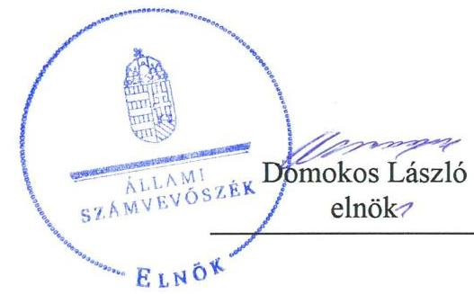
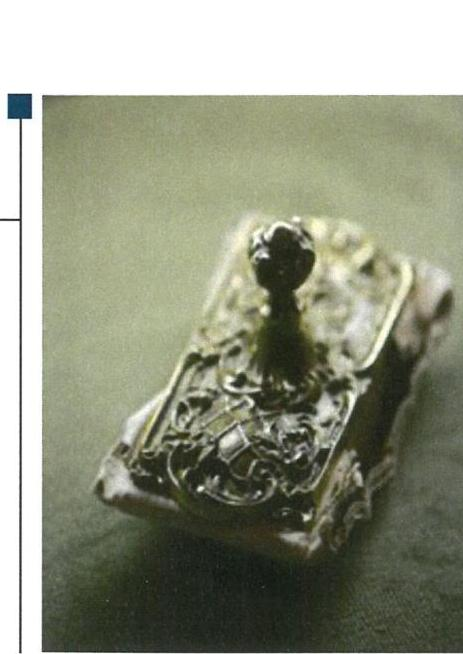

---

# AZ ELLENŐRZÉST FELÜGYELTE:

DR. PULAY GYULA ZOLTÁN felügyeleti vezető

## AZ ELLENŐRZÉST VEZETTE ÉS A VÉGREHAJTÁSÁÉRT FELELŐS:

DORMÁN ISTVÁN ZOLTÁN ellenőrzésvezető

## A PROGRAM ÖSSZEÁLLÍTÁSÁÉRT FELELŐS:

TÓTPÁL SZABOLCS osztályvezető

IKTATÓSZÁM: EL-1595-001/2019

TÉMASZÁM: 2487

ELLENŐRZÉS-AZONOSÍTÓ SZÁM: V0785

Jelentéseink az Országgyűlés számítógépes hálózatán és az Interneten a www.asz.hu címen is olvashatóak.

---

# TARTALOMJEGYZÉK 

■ ÖSSZEGZÉS ..... 5
■ AZ ELLENŐRZÉS CÉLJA ..... 7
■ AZ ELLENŐRZÉS TERÜLETE ..... 8
■ AZ ELLENŐRZÉS HÁTTERE, INDOKOLTSÁGA ..... 10
■ A JELENTÉS LÉNYEGES KÉRDÉSKÖREI ..... 11
■ AZ ELLENŐRZÉS HATÓKÖRE ÉS MÓDSZEREI ..... 12
■ MEGÁLLAPÍTÁSOK ..... 15
■ MELLÉKLETEK ..... 25
I. sz. melléklet: Értelmező szótár ..... 25
II. sz. melléklet: Ellenőrzött Önkormányzatok, Kerületi és Járási Hivatalok ..... 27
■ FÜGGELÉKEK ..... 29
I. sz. függelék a jelentéshez ..... 29
II. sz. függelék: Észrevételek ..... 31
■ RÖVIDÍTÉSEK JEGYZÉKE ..... 83

---

.

---

# ÖSSZEGZÉS 

2014-2016. években az önkormányzatok a gyermekek részére a gyermekétkeztetéshez kapcsolódó, törvényben foglalt ellátásokat biztosították. A gyermekétkeztetés megszervezéséhez és működtetéséhez megállapított alapvető szabályokat az intézményi, 2016. évben a szünidei gyermekétkeztetés során nem tartották be. A szünidei gyermekétkeztetési feladat ellátása 2016. évben eredményes volt. A Magyar Államkincstár gyermekétkeztetésre vonatkozó ellenőrzései és a kormányhivatalok népegészségügyi feladatot ellátó kerületi és járási hivatalai 2015-2016. évi ellenőrzései tervezésének és végrehajtásának szabályszerűsége biztosított volt. Az ellenőrző szervek az általuk tervezett ellenőrzéseket eredményesen végrehajtották.

## Az ellenőrzés társadalmi indokoltsága

A gyermekek Alaptörvényben deklarált joga a megfelelő testi és szellemi fejlődéshez szükséges védelem és gondoskodás, amelyre a gyermek mindenkivel szemben igényt tarthat. A nemzeti köznevelésről szóló 2011. évi CXC. törvény a gyermekeket és tanulókat megillető jogok között sorolja fel azt a jogot, hogy a gyermek óvodai életrendjét, a tanuló iskolai tanulmányi rendjét pihenőidő, szabadidő, testmozgás beépítésével, sportolási, étkezési lehetőség biztosításával életkorának és fejlettségének megfelelően alakítsák ki. A gyermekétkeztetés biztosításának célja, a gyermekek Alaptörvényben is megjelenő jogának érvényesülése. Az Állam a gyermekek védelméről és a gyámügyi igazgatásról szóló 1997. évi XXXI. törvényben előírt keretek között biztosítja a gyermekétkeztetést a rászorulók részére. A törvény szerint a bölcsődei, óvodai, általános és középiskolai gyermekétkeztetés, valamint 2016. január 1-jétől a szünidei gyermekétkeztetés biztosítása a települési önkormányzatok feladata.

Annak érdekében, hogy a gyermekétkeztetéssel kapcsolatos feladatellátás szabályszerű és a kitűzött célok megvalósítására fókuszáló legyen, az Állami Számvevőszék a gyermekétkeztetési rendszer tevékenységének értékelése keretében a 2014-2016. évek tekintetében 69 települési önkormányzatnál ellenőrizte a gyermekétkeztetés megszervezésének és működtetésének megfelelőségét és a 2016. évi szünidei gyermekétkeztetés feladat ellátásának eredményességét. Továbbá a Magyar Államkincstárnál és 20 népegészségügyi feladatot ellátó kerületi és járási hivatalnál, mint a gyermekétkeztetést ellenőrző állami szerveknél, ellenőrizte az ellenőrzési feladat-ellátás végrehajtásának szabályszerűségét és eredményességét.

## Főbb megállapítások, következtetések, javaslatok

A gyermekek védelméről és a gyámügyi igazgatásról szóló 1997. évi XXXI. törvény megalkotásával cél volt, hogy az önkormányzatok meghatározott ellátásokkal segítséget nyújtsanak a gyermekek törvényben foglalt, gyermekétkeztetéssel kapcsolatos jogainak érvényesítéséhez és a szülői kötelességek teljesítéséhez. E célok elérése érdekében az Országgyűlés törvényben meghatározta a gyermekek alapvető jogait, a jogok érvényesítésének garanciáit és az önkormányzati ellátások - az intézményi gyermekétkeztetés és 2016. évtől a szünidei gyermekétkeztetés - nyújtására vonatkozó alapvető szabályokat.

Az önkormányzatok a törvényben meghatározott gyermekétkeztetési ellátásokat 2014-2016. években biztosították.

A városi és községi önkormányzatok jelentős részénél a gyermekétkeztetés megszervezése az ellenőrzött időszakban nem volt szabályszerű, elsősorban azért, mert a gyermekétkeztetéssel kapcsolatos rendeletalkotási kötelezettség jogszabályi előírások szerinti teljesítése nem volt biztosított. Az érintett önkormányzatok a gyermekétkeztetéssel kapcsolatosan rendeletben nem határoztak azokról a kérdésekről, amelyeket a Gyvt. a hatáskörükbe utalt, illetve azon városi és a községi önkormányzatoknál, amelyek megalkották a Gyvt.-ben előírt rendeletet, a rendelet nem felelt meg a Gyvt. előírásainak.

---

A gyermekétkeztetés működtetésével kapcsolatos önkormányzati tevékenység az ellenőrzött időszakban nem volt megfelelő. Az Országgyűlés megteremtette annak a lehetőségét, hogy az önkormányzatok a gyermekétkeztetést felügyeljék, az ezt végző intézményeket, vállalkozásokat ellenőrizzék. Ezzel azonban csak kevés önkormányzat élt. A városi és községi önkormányzatok nem megfelelően felügyelték a gyermekétkeztetés működését, nem számoltatták be a gyermekétkeztetést nyújtó intézményeket a feladat-ellátásról, és nem végezték el a gyermekétkeztetést nyújtó szervezetek működésének, gazdálkodásának ellenőrzését.

A gyermekétkeztetéssel kapcsolatos közbeszerzések esetében a szabályszerűség a községi önkormányzatoknál érvényesült, a városi önkormányzatok egy részénél nem érvényesült.

A gyermekétkeztetési közfeladat-ellátás hatékonyságát, eredményességét az önkormányzatok belső ellenőrzése nem ellenőrizte, továbbá nem végzett ellenőrzést a feladatot szerződés alapján ellátó vállalkozóknál. Emellett az önkormányzatok jelentős részénél a belső ellenőrzés nem folytatott le a gyermekétkeztetés feladat ellátásának szabályszerűségére, a szükséges feltételek biztosítására vonatkozó belső ellenőrzést a polgármesteri hivatalnál, valamint a gyermekétkeztetést biztosító intézményeknél.

A belső ellenőrzés működtetését jogszabálysértő hiányosságok jellemezték. A gyermekétkeztetés ellenőrzése során tett belső és külső ellenőrzési javaslatok végrehajtásának, hasznosulásának nyomon követése nem volt megfelelő. A belső és a külső ellenőrzésekkel kapcsolatos nyilvántartás nem felelt meg a jogszabályi előírásoknak.

A 2016. évi szünidei gyermekétkeztetés ellátása nem volt szabályszerű. Az ellátáshoz való hozzájutás megszervezése nem a jogszabályi előírások szerint történt, elsősorban azért, mert a jogosultak tájékoztatásáról nem az előírások szerint gondoskodtak. A szünidei gyermekétkeztetés igénybevételének dokumentálása nem felelt meg a jogszabályi előírásoknak. Jellemző szabályszerűségi hiba volt, hogy az önkormányzatok a gyermekétkeztetési feladataikhoz kapcsolódó támogatás elszámolásához a jogszabályban előírt dokumentumokkal nem rendelkeztek.

A szünidei gyermekétkeztetéssel kapcsolatos tájékoztatás és dokumentálás nem volt szabályszerű. A 2016. évi szünidei gyermekétkeztetési feladat ellátása azon önkormányzatoknál, amelyek a jogszabályi előírások szerint tájékoztatták a jogosultakat a szünidei gyermekétkeztetésről, és a jogszabályi előírásoknak megfelelően dokumentálták a gyermekétkeztetés igénybevételét, eredményes volt.

A Magyar Államkincstár gyermekétkeztetést érintő, a városi és községi önkormányzatoknál lefolytatott ellenőrzéseinek tervezése és végrehajtása megfelelt a jogszabályi előírásoknak. Az ellenőrzések végrehajtása eredményes volt, a tervezett ellenőrzéseket a Kincstár 2014-2016. években teljesítette.

A kormányhivatalok gyermekétkeztetés ellenőrzését végző kerületi és járási hivatalai ellenőrzései tervezésének és végrehajtásának szabályszerűsége 2014. évben nem volt biztosított, 2015-2016. években biztosított volt. 2014. évben az éves hatósági ellenőrzési tervek és ellenőrzési jelentések elkészítésére, közzétételére vonatkozó kötelezettségük teljesítésében hiányosságok fordultak elő. Tervezett ellenőrzéseik végrehajtása eredményes volt.

Az ellenőrzéshez kapcsolódóan az ÁSZ által a gyermekétkeztetést igénybe vevő gyermekek szülei körében végeztetett közvélemény-kutatás eredményei alapján a gyermekétkeztetést igénybevevők szülei szerint teljesültek a gyermekétkeztetéssel elérendő fő célok: a gyermekek számára időben, élettani igényeiknek megfelelő jellegű és összetételű táplálékot biztosítottak. A közvélemény-kutatás megerősítette az ellenőrzésnek azt az eredményét, mely szerint a városi és községi önkormányzatok panaszkezelése megfelelő volt, azonban az önkormányzatok nem helyénvalóan jártak el, mivel saját hatáskörükben nem értékelték a gyermekétkeztetés igénybevevőinek elégedettségét az étkeztetés színvonalával és minőségével kapcsolatban.

---

# AZ ELLENŐRZÉS CÉLJA 

Az ellenőrzés célja annak megállapítása volt, hogy az önkormányzatoknál a gyermekétkeztetés megszervezése és működtetése megfelelő volt-e, valamint a gyermekétkeztetést ellenőrző állami szervek ellenőrzéseinek végrehajtása szabályszerű és eredményes volt-e. Értékeltük, hogy a szünidei gyermekétkeztetés feladat ellátása eredményes volt-e.

---

# **AZ ELLENŐRZÉS TERÜLETE**

## **A gyermekétkeztetés rendszere**

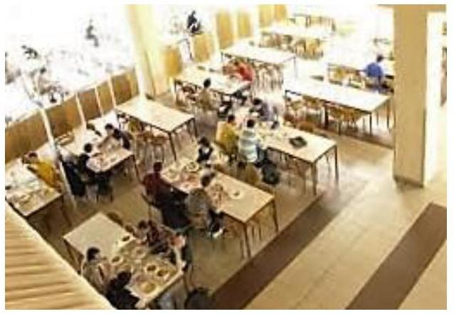

**A GYERMEKÉTKEZTETÉS** biztosítása a Gyvt.1 szerint a bölcsődékben, óvodákban, általános- és középiskolákban a települési önkormányzat feladata.

Az intézményi gyermekétkeztetés vonatkozásában a Gyvt. részletesen meghatározza, hogy azt mely esetekben kell a települési önkormányzatnak biztosítania, meghatározza, hogy az egyes intézményekben hányszor és milyen típusú étkezést kell biztosítani. A Gyvt. továbbá meghatározza azt a személyi kört, akik ingyenesen vagy kedvezményesen vehetik igénybe a gyermekétkeztetést. 2015. szeptember 1-jétől a Gyvt. módosítása kiterjesztette az ingyenes bölcsődei, óvodai gyermekétkeztetésre való jogosultságot, amely szerint ingyenesen étkeznek:

- a rendszeres gyermekvédelmi kedvezményben részesülő gyermekek;
- a korábban 50%-os étkezési térítési díj-kedvezményre jogosult gyermekek, vagyis a három vagy több gyermeket nevelő családok gyermekei és a tartósan beteg és fogyatékos gyermekek;
- a korábbiakban támogatásban nem részesülő, tartósan beteg és fogyatékos gyermeket nevelő családok egészséges gyermekei;
- továbbá azon egy vagy két gyermeket nevelő szülők gyermekei, ahol a családban az egy főre jutó jövedelem nem haladja meg a kötelező legkisebb munkabér nettó összegének 130%-át.

2016. január 1-jétől a Gyvt. további módosításával a szünidei gyermekétkeztetés biztosítása, valamennyi rendszeres gyermekvédelmi kedvezményre jogosult hátrányos, halmozottan hátrányos helyzetű gyermek – országos szinten összesen 208 ezer fő – ingyenes étkeztetésben részesítése minden iskolai szünet – az Nktv.2 szerinti nyári szünet és tanítási szünetek –, valamint a bölcsődék, óvodák zárva tartása időtartamára eső munkanapokon a települési önkormányzatok kötelezően ellátandó feladatává vált. A szünidei gyermekétkeztetés megszervezése a települési önkormányzat kötelezettsége, amely során a Gyvt. előírásai szerint napi egyszeri meleg ebédet kell kötelezően biztosítaniuk.

A gyermekétkeztetést a Gyvt. előírásai szerint az önkormányzatnak az arra jogosult igénylése (kérelme) alapján kell biztosítania. Az ingyenes vagy kedvezményes gyermekétkeztetést a térítési díj fizetésére kötelezett és a kedvezménnyel a gyermek részére élni kívánó személy (az ellátást igénybe vevő gyermek esetén a szülő vagy más törvényes képviselő) igényelheti (kérelmezheti). A gyermekétkeztetés a gyermek szociális helyzete, illetve a Gyvt.-ben meghatározott feltételek fennállása esetén vehető igénybe.

A gyermekétkeztetés rendszerének szabályszerűségét 69 települési önkormányzatnál ellenőriztük. Ennek keretében értékeltük az intézményi, és 2016. év tekintetében a szünidei gyermekétkeztetés megszervezésére és működtetésére vonatkozóan az önkormányzatok részére a jogszabályok

---

ban előírt feladatok végrehajtását. Értékeltük továbbá a gyermekétkeztetésre vonatkozó közbeszerzéseknél a Kbt. $_{1}$3, Kbt. $_{2}$4 előírásainak, a belső és külső ellenőrzések esetében a Bkr.5 előírásainak betartását, a javaslatok hasznosulását.

A gyermekétkeztetés ellátásának önkormányzati felügyelete tekintetében értékeltük az önkormányzatok belső ellenőrzése működésének helyénvalóságát. E tekintetben az ÁSZ által meghatározott helyénvalósági kritérium volt, hogy a belső ellenőrzés az ellenőrzött időszakban legalább egyszer a helyszínen ellenőrizte-e a gyermekétkeztetés feladat ellátásának szabályszerűségét, hatékonyságát, eredményességét minden gyermekétkeztetést nyújtó intézménynél, beleértve az intézményként működő főzökonyhát, illetve vásárolt élelmezést nyújtó vállalkozót, amennyiben a vállalkozói szerződés erre lehetőséget nyújtott. A gyermekétkeztetés igénybevevői (gyermekek, szülők) elégedettségének értékelésével kapcsolatos elvárásunk volt, hogy az önkormányzatok az ellenőrzött időszakban legalább egyszer dokumentáltan értékeljék az egyes gyermekétkeztetési intézmények esetében az étkeztetést igénybevevők elégedettségét az ételek minőségével, mennyiségével, tálalásával kapcsolatban.

Értékeltük továbbá a 2016. évi szünidei gyermekétkeztetésnél az önkormányzatok által tett intézkedések eredményességét, meghatározott mutatók alapján.

Az ellenőrzés nem terjedt ki a települési önkormányzatok gyermekétkeztetési feladatai ellátásában közreműködő intézmények, vállalkozók ellenőrzésére, valamint az egyéb fenntartók, az egyéb állami fenntartású és a nem állami (egyházi és a magán) nevelési-oktatási (2016. január 1-jétől nem bentlakásos) intézmények és azok fenntartói által biztosított gyermekétkeztetés ellenőrzésére.

Az önkormányzatok ellenőrzésétől független volt a gyermekétkeztetést ellenőrző szervezetek feladatellátásának ellenőrzése. A gyermekétkeztetést ellenőrző szervezetek feladatellátásának ellenőrzése keretében a kormányhivatalok népegészségügyi feladatot ellátó 20 kerületi és járási hivatala, valamint a gyermekétkeztetési támogatás elszámolás és felhasználás tekintetében a Kincstár6 feladat-ellátását ellenőriztük.

Értékeltük a gyermekétkeztetést ellenőrző szervezetek ellenőrzései végrehajtásának eredményességét a tervezett és végrehajtott ellenőrzések aránya, valamint meghatározott mutatók alapján.

---

# AZ ELLENŐRZÉS HÁTTERE, INDOKOLTSÁGA
 

A gyermekétkeztetés az abban résztvevők számossága, a közpénz nagysága, a gyermekek életkoruknak megfelelő mennyiségű és minőségű élelemmel történő ellátása és ezzel összefüggésben az egészség megőrzése miatt a társadalom figyelmének középpontjában van. A gyermekek étkeztetéséhez az Állam központi finanszírozással járult hozzá.

Országos szinten a gyermekétkeztetést biztosító nevelési, oktatási intézmények többségében (kiszervezett szolgáltatás esetén) tálalókonyha, egyharmadában helyben működő főzőkonyha található. A 2014. évben a bölcsődék száma 736, a gyermekek és gyermekétkeztetésben résztvevők száma 37,3 ezer fő, amelynek 30%-a kedvezményben részesülő volt. A 2014/2015. nevelési évben a köznevelési intézményekben a feladat-ellátási helyek száma közel 10,8 ezer, a gyermekek száma 1541,3 ezer fő volt. Ebből étkeztetésben vett részt 1175 ezer fő, amelynek 84%-a kedvezményben részesülő volt.

Az Nktv. szerint az éves költségvetési törvényben kell meghatározni annak a támogatásnak az összegét, amelyet a fenntartó vagy az önkormányzat kap a gyermekek kedvezményes étkeztetésének megszervezéséhez, figyelembe véve a Gyvt.-ben meghatározott normatív kedvezményeket. 2013. január 1-jétől kötelező önkormányzati feladat lett a település közigazgatási területén a gyermekétkeztetés biztosítása. A 2014. évtől feladatalapú támogatási rendszer került bevezetésre, figyelemmel a rászoruló gyermekek szociális helyzetére. A központi költségvetés a feladatellátás megszervezésére 2014-ben 52,2 Mrd Ft, 2015-ben 61,1 Mrd Ft támogatást nyújtott. A 2016. évben a gyermekétkeztetési támogatások tervezett előirányzata 71,7 Mrd Ft volt, amelynek összege a szünidei étkeztetés 2016. január 1-jétől a feladatfinanszírozott támogatások közé történt beépülése, illetve 2016. szeptember 1-jétől a bölcsődés és óvodás gyermekek esetében kiterjesztett ingyenes étkeztetés miatt emelkedett. A 2014-2015. években a központi költségvetés 2,6 Mrd Ft és 3,0 Mrd Ft előirányzatot tartalmazott a nyári étkeztetést biztosító települési önkormányzatok kapcsolódó feladatellátásának pályázati úton történő támogatására.

---

# A JELENTÉS LÉNYEGES KÉRDÉSKÖREI 

1. Az önkormányzatoknál a gyermekétkeztetés megszervezése és működtetése megfelelő volt-e?
2. Az önkormányzatoknál 2016. évben a szünidei gyermekétkeztetési feladat ellátása megfelelő és eredményes volt-e?
3. A gyermekétkeztetést is ellenőrző állami szervek, a Kincstár és a kerületi és járási hivatalok ellenőrzéseinek tervezése, végrehajtása szabályszerű és eredményes volt-e?
4. A gyermekétkeztetést igénybevevők szerint teljesültek-e a gyermekétkeztetéssel elérendő fő célok?

---

# AZ ELLENŐRZÉS HATÓKÖRE ÉS MÓDSZEREI 

## Az ellenőrzés típusa

Megfelelőségi (szabályszerűségi, helyénvalósági) ellenőrzés és teljesítmény-ellenőrzés.

## Az ellenőrzött időszak

2014. január 1-jétől 2016. december 31-ig terjedő időszak. A szünidei gyermekétkeztetés tekintetében a 2016. év.

## Az ellenőrzés tárgya

A megfelelőségi ellenőrzésen belül szabályszerűségi ellenőrzés tárgyát képezte a gyermekétkeztetés megszervezése és működtetése, a kapcsolódó rendeletalkotási tevékenység, a gyermekétkeztetést érintő közbeszerzés, panaszkezelés, beszámoltatás. Az ellenőrzés tárgyát képezte továbbá a gyermekétkeztetést érintő belső és külső ellenőrzések javaslatainak hasznosítása, a gyermekétkeztetést ellenőrző állami szervezetek feladatellátása.

A megfelelőségi ellenőrzésen belül helyénvalósági ellenőrzés tárgyát képezte a gyermekétkeztetés igénybevevői (gyermekek, szülők) elégedettségének értékelésével, illetve a gyermekétkeztetés belső ellenőrzésével kapcsolatos elvárás.

Teljesítmény-ellenőrzés tárgyát képezte a szünidei gyermekétkeztetés, illetve az ellenőrző szervek ellenőrzései végrehajtásának eredményessége.

Az ellenőrzés kiterjedt minden olyan körülményre és adatra, amely az ÁSZ jogszabályban meghatározott feladatainak teljesítéséhez, valamint a program végrehajtása folyamán felmerült újabb összefüggések feltárásához szükséges volt.

## Az ellenőrzött szervezet

A helyi önkormányzatok (69 települési, ezen belül 30 városi, 39 községi önkormányzat a II. sz. mellékletben felsoroltak szerint);
$\longrightarrow$ Magyar Államkincstár; valamint
a fővárosi és megyei kormányhivatal népegészségügyi feladatokat ellátó járáshivatala (a II. sz. mellékletben felsoroltak szerint).

---

# Az ellenőrzés jogalapja 

Az ÁSZ tv. ${ }^{7} 1 . \S$ (3) bekezdése.

## Az ellenőrzés módszerei

Az ellenőrzést az ellenőrzési program szempontjai, az ellenőrzött időszakban hatályos jogszabályok, a jelen ellenőrzésre irányadó ÁSZ módszertanok, a megfelelőségi ellenőrzés alapelvei, valamint a teljesítmény-ellenőrzés alapelvei figyelembe vételével végeztük.

Az ellenőrzés ideje alatt az ellenőrzött szervezetekkel történő kapcsolattartást az ÁSZ Szervezeti és Működési Szabályzatának vonatkozó előírásai alapján biztosítottuk.

Az ellenőrzési bizonyítékként felhasználható adatforrások közé tartoztak egyrészt az ellenőrzési programban felsorolt adatforrások, másrészt adatforrás lehetett minden - az ellenőrzés folyamán - feltárt, az ellenőrzés szempontjából információkat tartalmazó dokumentum.

Az ellenőrzést a kérdésekre adott válaszok kiértékelésével, valamint a megjelölt adatforrások, az ellenőrzési programban csatolt tanúsítványok felhasználásával, továbbá az adott időszakban hatályos jogszabályok figyelembe vételével folytattuk le.

Az ellenőrzésre rétegzett véletlen mintavétellel választottuk ki az önkormányzatokat, egyszerű véletlen mintavétellel a népegészségügyi feladatokat ellátó kerületi és járási hivatalokat. A mintavétellel kiválasztott önkormányzatoknál a gyermekétkeztetés megszervezése, a gyermekétkeztetéssel kapcsolatos rendeletalkotás, a gyermekétkeztetés biztosítása és felügyelete, a szünidei gyermekétkeztetésre jogosultak tájékoztatása, továbbá a szünidei gyermekétkeztetés jogosultak részére történő biztosítása szabályszerűségét, valamint a belső és külső ellenőrzések gyermekétkeztetést érintő javaslatainak hasznosulását ellenőriztük.

A mintavétellel kiválasztott népegészségügyi feladatot ellátó, gyermekétkeztetés ellenőrzését is végző kerületi és járási hivatalok esetében a hatósági ellenőrzések tervezésének és végrehajtásának szabályszerűségét ellenőriztük. Az önkormányzatok, illetve kerületi és járási hivatalok vonatkozásában szabályszerűségre/helyénvalóságra vonatkozó kérdéseket tettünk fel. Szabályszerűnek/helyénvalónak értékeltünk egy ellenőrzött területet, amennyiben 95%-os bizonyossággal az ellenőrzött sokaságban az átlagos hibaarány legfeljebb 10% volt, nem szabályszerűnek/nem helyénvalónak, amennyiben 10%-nál magasabb arányt képviselt.

Az ÁSZ az ellenőrzéshez kapcsolódóan közvélemény-kutatást végeztetett a gyermekétkeztetést igénybe vevő gyermekek szülei körében CATI módszerrel ${ }^{8}$, (számítógéppel támogatott telefonos lekérdezés), amelynek során 510 felnőtt korú személyt kérdeztek meg. A minta a gyermekétkeztetést nyújtó intézmény típusa szerint reprezentatív volt az igénybe vevőkre nézve. A kérdőíves felmérés alapján válasz volt adható arra, hogy a gyermekétkeztetést igénybevevők szerint teljesültek-e a gyermekétkeztetéssel elérendő fő célok.

---

A mintába került válaszadók 2%-ának gyermeke bölcsődei, 21%-ának gyermeke óvodai, 49%-ának gyermeke általános iskolai, 22%-ának gyermeke gimnáziumi, 4%-ának gyermeke szakközépiskolai, 2%-ának gyermeke szakiskolai ellátás keretein belül részesült gyermekétkeztetésben. A megkérdezettek 20%-ának háztartásában egy, 38%-ánál kettő, 29%-a esetében három, 13%-ánál négy vagy több gyermek élt. A gyermekétkeztetést a megkérdezettek 41%-ának (összes) gyermeke ingyenesen vagy kedvezményesen vette igénybe, 23% esetében nem minden gyermek volt jogosult az ingyenes vagy kedvezményes igénylésre, 33% gyermeke térítési díj ellenében vette igénybe a gyermekétkeztetést, 3% nem adott választ.

---

# 1. Az önkormányzatoknál a gyermekétkeztetés megszervezése és működtetése megfelelő volt-e? 

## Összegző megállapítás

### 1.1. számú megállapítás

1. ábra

## KRITÉRIUM

Az önkormányzatoknak a Gyvt.-ben adott felhatalmazás és a törvényben meghatározott keretek között - a Gyvt. előírása alapján írásban kell dokumentálniuk a döntést arról, hogy a település adottságai és a helyi ellátási igények figyelembevételével milyen módon szervezik meg és látják el a gyermekétkeztetéssel kapcsolatos feladataikat, és erről be is kell számolniuk. Rendeletet kell alkotniuk a gyermekétkeztetéshez való jogosultsági feltételeiről, valamint az egyéni rászorultság alapján adható kedvezmények szabályairól, a gyermekétkeztetés térítési díjáról, a térítési díj alapjáról, mértékéről, csökkentésének és elengedésének eseteiről, módjairól.

Forrás: ÁSZ saját szerkesztés
1.2. számú megállapítás

Az önkormányzatoknál a gyermekétkeztetés megszervezésével és működtetésével kapcsolatos feladatellátás nem volt megfelelő.

Az önkormányzatoknál a gyermekétkeztetés megszervezése nem volt szabályszerű.

## A GYERMEKÉTKEZTETÉS MEGSZERVEZÉSÉVEL

kapcsolatos feladatait a városi és a községi önkormányzatok jelentős része nem szabályszerűen látta el, mivel a Gyvt.-ben előírt rendeletalkotási kötelezettségüknek maradéktalanul nem tettek eleget. Tipikus hiányosságok voltak:

- 2014-2015. években a Gyvt. 29 § (1) bekezdésében előírtak ellenére a gyermekétkeztetés fizetendő térítési díjával kapcsolatos rendeletet nem alkották meg;
- 2014-2016. években a Gyvt. 151. § (2f) bekezdésében előírtak ellenére az intézményi térítési díjat az óvodai étkeztetésre, az 1-8. évfolyam intézményi gyermekétkeztetésre, középfokú iskolai ellátásban részesülő gyermekek részére nem állapították meg.
Azon városi és a községi önkormányzatoknál, amelyek megalkották a Gyvt.-ben előírt rendeletet, a legjellemzőbb szabályszerűségi hiba volt, hogy az önkormányzatok nem tartották be a Gyvt. 151. § (3) bekezdés előírásait, és a gyermekétkeztetés térítési díját nem az élelmezés nyersanyagköltségének egy ellátottra jutó napi összege alapján állapították meg.

Azzal, hogy az önkormányzatok nem, vagy hiányosan rendelkeztek a gyermekétkeztetéssel kapcsolatos kérdésekről, nem biztosították a gyermekek szociális helyzetéhez, szükségleteihez igazodó gyermekétkeztetési ellátás kereteinek, árszabásának kialakítását, és a rendelet közzétételének elmulasztásával nem biztosították, hogy a gyermekétkeztetési ellátással és annak feltételeivel kapcsolatos, a törvényben előírt információk eljussanak azokhoz, akik a gyermekétkeztetési ellátásra jogosultak.

Az önkormányzatok - mint a feladat ellátására kötelezettek - biztosították a gyermekétkeztetést, azonban a gyermekétkeztetés működésének felügyeletéről megfelelő módon nem gondoskodtak.

AZ ÖNKORMÁNYZATOK - mint a feladat ellátására kötelezettek - biztosították a gyermekétkeztetést azonban a feladatellátás felügyeletével kapcsolatos tevékenységet nem megfelelően végezték.

---

2. ábra

## KRITÉRIUM

Az önkormányzat, felel a gyermekétkeztetési ellátást biztosító intézmény/vállalkozó működési feltételeinek biztosításáért és jogszabályi előírásoknak megfelelő működésért. A gazdálkodás szabályszerűségének, hatékonyságának ellenőrzése mellett az ellátást biztosító intézmény/vállalkozó működésének ellenőrzése az önkormányzat feladata. Ennek keretében - a Gyvt. előírásai szerint - folyamatos ellenőrzés mellett évente egy alkalommal értékeli a feladatellátást, amelyhez az ellátást biztosító intézmény/vállalkozó szakmai és pénzügyi beszámolót készít.

Forrás: ÁSZ saját szerkesztés

### 1.3. számú megállapítás

3. ábra

## KRITÉRIUM

Az önkormányzat a Bkr. előírásai szerint köteles kialakítani a szervezet tevékenységének, a célok megvalósításának nyomon követését biztosító rendszert, amelynek része a belső ellenőrzés. Az önkormányzat éves bontásban köteles nyilvántartást vezetni, amellyel a belső és a külső ellenőrzési jelentésekben tett megállapításokat, javaslatokat, a vonatkozó intézkedési terveket és azok végrehajtását nyomon követi. Az ellenőrzési javaslatok alapján az önkormányzatnak intézkedési tervet kell készítenie.

Forrás: ÁSZ saját szerkesztés

A városi és a községi önkormányzatok a gyermekétkeztetési közfeladatellátást saját intézmény, más önkormányzat intézménye vagy társulás, saját tulajdonú gazdasági társaság útján, illetve közbeszerzési eljárás alapján kiválasztott vállalkozó közreműködésével biztosították.

A közbeszerzések esetében a szabályszerűség a községi önkormányzatoknál érvényesült, azonban az erre kötelezett városi önkormányzatok egy része a Kbt. 1. 7. § (4) bekezdésében és a 19. § (1) bekezdésében előírtak, valamint a Kbt. 2. 8. § (4) bekezdése és a 21. § (1) bekezdése előírásai ellenére nem folytatott le a gyermekétkeztetésre közbeszerzési eljárást.

## A GYERMEKÉTKEZTETÉS MŰKÖDÉSÉNEK FELÜGYELETÉVEL kapcsolatos feladataikat a városi és a községi önkormányzatok nem megfelelően látták el, a Gyvt. 104. § (1) bekezdés e) pontjában és 104. § (5) bekezdésében előírtak ellenére nem ellenőrizték és évente egy alkalommal nem értékelték a szakmai munka eredményességét, a szakmai program végrehajtását, valamint a gazdálkodás szabályszerűségét és hatékonyságát a gyermekétkeztetést nyújtó szervezeteknél, illetve nem kötelezték arra, hogy tevékenységükről átfogó, szakmai és pénzügyi beszámolót adjanak.

A városi és a községi önkormányzatok esetében a térítési díj-fizetéssel kapcsolatban beérkezett panaszok kivizsgálása, a szükséges intézkedések megtétele a 2013. évi CLXV. törvény ${ }^{9}$ előírásainak megfelelően megtörtént.

A városi és községi önkormányzatok nem helyénvalóan jártak el, mivel saját hatáskörükben nem értékelték a gyermekétkeztetés igénybevevőinek elégedettségét az étkeztetés színvonalával és minőségével kapcsolatban.

Azzal, hogy az önkormányzatok a Gyvt. szerinti, gyermekétkeztetés működésével kapcsolatos felügyeleti tevékenységüket nem megfelelően látták el, nem biztosították a gyermekétkeztetést nyújtó szervezetek Gyvt. előírásainak megfelelő működésének, gazdálkodásának ellenőrzését és azt, hogy a törvényi előírásoknak való nem megfelelés esetében megfelelő időben intézkedni tudjanak az esetleges jogszabálysértő gyakorlat megszüntetése érdekében.

## A belső és külső ellenőrzések gyermekétkeztetést érintő javaslatai nem hasznosultak.

## A BELSŐ ELLENŐRZÉST az önkormányzatoknál nem szabályszerűen működtették.

A belső
 ellenőrzés kialakításáról és működtetéséről a községi önkormányzatok jelentős része nem gondoskodott, amellyel a jegyzők megsértették az Mtötv. ${ }^{10}$ 119. § (4) bekezdésében, az önkormányzatok a Bkr. 10. §-ában előírtakat.

A gyermekétkeztetést érintő belső ellenőrzések nyomon követése nem felelt meg a jogszabályi előírásoknak. A belső ellenőrzést működtető városi és községi önkormányzatok jelentős része a Bkr. 47. § (1) bekezdés előírásai ellenére nem követte nyomon a belső ellenőrzési jelentésekben tett megállapításokat, javaslatokat, a vonatkozó intézkedési terveket és azok végrehajtását.

Azon városi és községi önkormányzatoknál, amelyeknél működött a belső ellenőrzések nyomon követése, a belső ellenőrzés jelentéseiben tett,

---

a gyermekétkeztetést érintő megállapítások, javaslatok, az elfogadott intézkedési tervek, a végrehajtott intézkedések és a végre nem hajtott intézkedések okáról vezetett nyilvántartás nem felelt meg a Bkr. 47. § (2) bekezdés előírásainak.

Az ellenőrzött időszakban a városi és községi önkormányzatok nem megfelelően jártak el, mivel a gyermekétkeztetési feladat-ellátás hatékonyságát, eredményességét az önkormányzatok belső ellenőrzése nem ellenőrizte, továbbá nem végzett ellenőrzést a feladatot szerződés alapján ellátó, ételkészítést végző vállalkozásoknál. Emellett az önkormányzatok jelentős részénél a belső ellenőrzés nem folytatott le a gyermekétkeztetés feladat ellátásának szabályszerűségére, a szükséges feltételek biztosítására vonatkozó belső ellenőrzést a polgármesteri hivatalnál, valamint a gyermekétkeztetést biztosító intézményeknél. Mindezek alapján a belső ellenőrzés működtetése kockázatot hordozott.

# A KINCSTÁR ÉS A KORMÁNYHIVATAL KERÜLETI ÉS JÁRÁSI HIVATALAI ÁLTAL VÉGZETT KÜLSŐ 

ELLENŐRZÉSEK javaslatainak végrehajtására az ellenőrzéssel érintett városi és községi önkormányzatok a Bkr. 13. § (2) bekezdés előírásai ellenére intézkedési tervet nem készítettek és nem számoltak be a külső ellenőrzést végzők részére a megtett intézkedések végrehajtásáról.

A külső ellenőrzéseket az önkormányzatok nem a jogszabályi előírások szerint tartották nyilván. A városi és a községi önkormányzatok a Bkr. 14. § (1) bekezdés előírásai ellenére nem a Bkr. 47. § (2) bekezdés szerinti tartalommal vezettek nyilvántartást a külső ellenőrzések javaslatai alapján végrehajtott intézkedésekről.

A külső ellenőrzések nyomon követésének és nyilvántartásának hiányosságai nem járulnak hozzá az ellenőrzési jelentésekben megfogalmazott javaslatok hasznosulásához.

## 2. Az önkormányzatoknál 2016. évben a szünidei gyermekétkeztetési feladat ellátása megfelelő és eredményes volt-e?

Összegző megállapítás
2.1. számú megállapítás
2016. évben az önkormányzatoknál a szünidei gyermekétkeztetési ellátáshoz való hozzájutás megszervezése nem a jogszabályi előírásoknak megfelelően történt. A feladat ellátása érdekében tett intézkedések eredményesek voltak azoknál az önkormányzatoknál, amelyeknél a jegyző a jogszabályi előírásoknak megfelelően eleget tett a jogosultak felé fennálló tájékoztatási kötelezettségének és az igénybevételt a jogszabályi előírásoknak megfelelően dokumentálták.

A szünidei gyermekétkeztetésre jogosultak tájékoztatása, nyilvántartása nem a jogszabályi előírások szerint történt.

AZ ELLÁTÁSHOZ VALÓ HOZZÁJUTÁS MEGSZERVEZÉSE az önkormányzatoknál nem a jogszabályi előírásoknak megfelelően történt. A szünidei gyermekétkeztetésre jogosultak tájékoztatását a

---

4. ábra

## KRITÉRIUM

A 328/2011. (XII. 29.) Korm. rendelet előírja, hogy az önkormányzat jegyzője a jogosult gyermek szülőjét, törvényes képviselőjét írásban tájékoztassa a szünidei gyermekétkeztetés igénybevételének lehetőségéről és módjáról; az igényléshez szükséges, a Korm. rendelet 7. melléklete szerinti nyilatkozat megküldésével együtt. A Gyvt. előírja, hogy a jegyző a szünidei gyermekétkeztetés megkezdése előtt a helyben szokásos módon, valamint a gyermekétkeztetést biztosító intézményeken keresztül hívja fel az érintettek figyelmét a szünidei gyermekétkeztetésre, annak időtartamára és helyszínére. A jegyzőnek a hátrányos, halmozottan hátrányos helyzetű gyermekek szülőjét, törvényes képviselőjét írásban kell tájékoztatnia a gyermekétkeztetésről. A hátrányos, halmozottan hátrányos helyzet megállapítása a jegyző feladata. Az ellátásra való jogosultság megállapításához, megváltoztatásához a törvényben meghatározott tartalommal nyilvántartást kell vezetnie.

Forrás: ÁSZ saját szerkesztés
2.2. számú megállapítás
városi és a községi önkormányzatok jegyzőinek jelentős része nem szabályszerűen végezte. A legjellemzőbb szabályszerűségi hiba volt, hogy az önkormányzatok jegyzője:
$\longrightarrow$ a 328/2011. (XII. 29.) Korm. rendelet ${ }^{11}$ 13/B. § (7) bekezdésében foglaltak ellenére a szünidei gyermekétkeztetés megkezdése előtt a helyben szokásos módon, valamint az intézményi gyermekétkeztetést biztosító intézményeken keresztül nem hívta fel a jogosultak figyelmét a szünidei gyermekétkeztetés időtartamára és helyszínére a tavaszi, a nyári, az őszi, illetve a téli szünet esetében;
$\longrightarrow$ nem a 328/2011. (XII. 29.) Korm. rendelet 22. § a) pontjában, a 13/B. § (1) bekezdés a) és b) pontjában előírt határidőben tájékoztatta a hátrányos helyzetű gyermek szülőjét vagy törvényes képviselőjét a szünidei gyermekétkeztetésről;
$\longrightarrow$ a szünidei gyermekétkeztetés igénybevételéhez nem a 328/2011. (XII. 29.) Korm. rendelet 13/B. § (3) bekezdésében előírt, a Korm. rendelet 7. melléklete szerinti nyilatkozatot küldte meg a jogosultaknak.
A törvényben előírt tájékoztatás elmulasztásával, késedelmes teljesítésével a jegyző nem biztosította a gyermekétkeztetési ellátásra jogosultak számára, hogy a megfelelő időben hozzájussanak a szünidei gyermekétkeztetés igényléshez szükséges információkhoz, és a törvényben biztosított lehetőséggel élve a szünidei gyermekétkeztetési ellátást igénybe vehessék.

## A SZÜNIDEI GYERMEKÉTKEZTETÉSRE JOGO-

SULTAK NYILVÁNTARTÁSÁVAL kapcsolatos jogszabályi kötelezettségüknek az önkormányzatok jegyzői maradéktalanul nem tettek eleget, gyakran előforduló hiányosság volt, hogy:
$\longrightarrow$ a Gyvt. 137. § (1) és 138. § (1) bekezdésében előírt nyilvántartást a hátrányos, halmozottan hátrányos helyzet megállapításáról, megváltoztatásáról, megszüntetéséről nem vezették; illetve
$\longrightarrow$ a jegyzők által vezetett nyilvántartások tartalmilag nem teljesítették a Gyvt. 138. § (1) bekezdés a)-f) pontok előírásait.
A jogosult, hátrányos, halmozottan hátrányos helyzetű és a rendszeres gyermekvédelmi kedvezményben részesülő gyermekek részére a Gyvt. alapján az önkormányzatnak a szünidei gyermekétkeztetést ingyenesen biztosítania kell. A nyilvántartás vezetésének elmulasztása, illetve a nem szabályszerű vezetése következtében nem volt igazolható, hogy a szünidei gyermekétkeztetésre ingyenesen jogosultak szülei valamennyien megkapták az igénybevételt lehetővé tevő tájékoztatást, illetve, hogy az ingyenes gyermekétkeztetést igénybevevők megfeleltek az ellátáshoz való jogosultság feltételeinek. Továbbá az előírt nyilvántartásokkal nem rendelkező önkormányzatok nem tudtak szabályszerűen eleget tenni a Gyvt. 137. § (1) bekezdésben előírt adatszolgáltatási kötelezettségüknek.

## A szünidei gyermekétkeztetés igénybevételének dokumentálása nem volt szabályszerű.

## A SZÜNIDEI GYERMEKÉTKEZTETÉS IGÉNYBEVÉ-

TELÉNEK DOKUMENTÁLÁSA nem a jogszabályi előírásoknak megfelelően történt. A városi és a községi önkormányzatok a gyermekétkeztetési feladataikhoz kapcsolódó támogatásokat igényelték és a 2014-

---

5. ábra

## KRITÉRIUM

A szünidei gyermekétkeztetés igénybevételét a 328/2011. (XII. 29.) Korm. rendelet 4. melléklete szerinti formában a települési önkormányzatnak kötelezően dokumentálnia kell. Arról, hogy a szünidei gyermekétkeztetés időtartamán belül hány munkanapon veszi igénybe a gyermek az étkeztetést, a szülő, más törvényes képviselő dönt. Az erre vonatkozó igényét 328/2011. (XII. 29.) Korm. rendelet 7. melléklete szerinti, a szünidei gyermekétkeztetés igénylési nyilatkozatán tünteti fel, amelyet benyújt az önkormányzat részére.

Forrás: ÁSZ saját szerkesztés

### 2.3. számú megállapítás

6. ábra

## KRITÉRIUM

A szünidei gyermekétkeztetés feladatellátását eredményesnek értékeltük, ha a tavaszi, nyári, őszi, téli szünetben a szünidei gyermekétkeztetésnél az önkormányzat által biztosított, Gyvt. szerinti ingyenes gyermekétkeztetést ténylegesen igénybevevők igénylők (kérelmezők) számához viszonyított aránya átlagosan 95\% vagy afeletti volt, a jegyző megfelelően gondoskodott a jogosultak tájékoztatásáról és az önkormányzat dokumentáltan gondoskodott a szünidei gyermekétkeztetésről a kérelmezők részére.

Forrás: ÁSZ saját szerkesztés
2016. évi éves költségvetési beszámolóikban elszámolták, azonban jellemző szabályszerűségi hiba volt, hogy
$\longrightarrow$ a szülő/más törvényes képviselő által a Gyvt. 21/C. §-a szerinti szünidei gyermekétkeztetés igénybevételéhez kitöltött, a 328/2011. (XII. 29.) Korm. rendelet 7. melléklete szerinti nyilatkozatokkal az önkormányzatok nem rendelkeztek; továbbá
$\longrightarrow$ a szünidei gyermekétkeztetés igénybevételéről a 328/2011. (XII. 29.) Korm. rendelet 13. § (5) bekezdésében foglalt előírás ellenére a tavaszi, a nyári, az őszi, illetve a téli szünetre vonatkozóan a Korm. rendelet 4. melléklete szerinti dokumentációval nem rendelkeztek.
Azzal, hogy az önkormányzatok a szünidei gyermekétkeztetés igénybevételét a 328/2011. (XII. 29.) Korm. rendeletben előírt, a kincstári támogatás-igénylés alapjául szolgáló dokumentumokkal nem támasztották alá és a Kincstár által folyósított támogatást igénybe vették, megsértették a Számv. tv. ${ }^{12}$ 165. § (2) bekezdés előírásait, amely alapján a számviteli (könyvviteli) nyilvántartásokba csak szabályszerűen kiállított - a könyvvitelben rögzítendő és a más jogszabályban előírt adatokat a valóságnak megfelelően, hiánytalanul tartalmazó, a bizonylat általános alaki és tartalmi követelményeinek megfelelő - bizonylat alapján szabad adatokat bejegyezni.

Azon önkormányzatok, amelyeknél a tájékoztatás és a dokumentálás szabályos volt, a szünidei gyermekétkeztetési feladat ellátása 2016. évben eredményes volt.

## A SZÜNIDEI GYERMEKÉTKEZTETÉSI FELADATELLÁTÁS EREDMÉNYESSÉGÉNEK értékelését a tavaszi, a

nyári, az őszi, a téli szünetben a szünidei gyermekétkeztetésnél az önkormányzat által saját és állami forrásból biztosított Gyvt. szerinti ingyenes gyermekétkeztetést ténylegesen igénybevevőknek az igénylők (kérelmezők) számához viszonyított aránya értékelésének alapján, az igénylők/kérelmezők száma, mint eredményességi célkitűzés teljesülésének elemzésével végeztük el.

Az eredményességet azon önkormányzatok esetében lehetett értékelni, amelyeknél a jegyző a 328/2011. (XII. 29.) Korm. rendelet előírásai szerint eleget tett a jogosultak felé fennálló tájékoztatási kötelezettségének, valamint az önkormányzat a Korm. rendelet előírásainak megfelelően dokumentálta a szünidei gyermekétkeztetés igénybevételét.

Ezen önkormányzatoknál az ingyenes szünidei étkeztetést ténylegesen igénybevevőknek az igénylők (kérelmet benyújtók) számához viszonyított aránya 2016. év tekintetében az iskolai szünetekben átlagosan elérte a 95\%-ot, amely alapján a szünidei gyermekétkeztetési feladatok ellátása érdekében ezen önkormányzatok által tett intézkedéseket eredményesnek értékeltük.

---

# 3. A gyermekétkeztetést is ellenőrző állami szervek, a Kincstár és a kerületi és járási hivatalok ellenőrzéseinek tervezése, végrehajtása szabályszerű és eredményes volt-e? 

## Összegző megállapítás

### 3.1. számú megállapítás

7. ábra

## KRITÉRIUM

Az Áht. előírásai szerint az önkormányzat a Kincstár útján igényli az ágazati feladataihoz kapcsolódó támogatásokat, és teljesíti az éves költségvetési beszámolót megalapozó adatszolgáltatást. A Kincstár helyszíni ellenőrzés során ellenőrzi a támogatások igénylésének megalapozottságát. Az Ávr. előírásai szerint a Kincstár ellenőrzésére a rendeletben meghatározott tartalommal kiadott ellenőrzési terv alapján kerülhet sor.
Forrás: ÁSZ saját szerkesztés

### 3.2. számú megállapítás

A gyermekétkeztetési ellenőrzések tervezése és végrehajtása a Kincstárnál az ellenőrzött időszakban, a kerületi és járási hivataloknál 2015-2016. években szabályszerű volt, 2014. évben nem volt szabályszerű. Az ellenőrzési tervek végrehajtása eredményes volt.

A Kincstárnál a gyermekétkeztetésre vonatkozó ellenőrzések tervezése és végrehajtása szabályszerű volt.

A KINCSTÁR ${ }^{13}$ a gyermekétkeztetésre vonatkozó ellenőrzési terveit az Áht. ${ }^{14}$ és az Ávr. ${ }^{15}$ előírásainak megfelelően az előírt határidőre, minden év december 31-éig elkészítette. Az ellenőrzési tervek tartalmazták az ellenőrzési időszakot, az ellenőrzések ütemezését és az ellenőrzések során érintett intézményi kört. A Kincstár a gyermekétkeztetési támogatások elszámolása, felhasználása felülvizsgálatának, helyszíni ellenőrzésének szakmai szabályaira, módszereire vonatkozó eljárásrendet kialakította.

A tervezett ellenőrzéseket a Kincstár a 2014-2016. évekre az Áht. előírásainak megfelelően végrehajtotta. Az Ávr. rendelkezéseinek megfelelően az előző évben végzett felülvizsgálatok tapasztalatait május 31-ig megküldte az államháztartásért felelős miniszter, a helyi önkormányzatokért felelős miniszter és az ÁSZ elnöke részére.

A Kincstárnál a gyermekétkeztetésre vonatkozó ellenőrzéseinek tervezése és végrehajtása szabályszerű volt.

A gyermekétkeztetés ellenőrzését is végző kerületi és járási hivatalok hatósági ellenőrzéseinek tervezése és végrehajtása 2014. évben nem volt szabályszerű, 2015-2016. években szabályszerű volt.
2014. ÉVBEN a kormányhivatalok kerületi és járási hivatalai nem szabályszerűen tervezték és hajtották végre az ellenőrzéseket. Az éves hatósági ellenőrzési tervek és ellenőrzési jelentések elkészítésére, közzétételére vonatkozó kötelezettségük teljesítésében jellemző hiányosságok voltak, hogy
$\longrightarrow$ a hivatalok a Ket. ${ }^{16}$ 91. § (1) bekezdés és a 66/2015. (III. 30.) Korm. rendelet ${
 }^{17}$ 7. § (2) bekezdés előírásai ellenére az országos terv alapján az éves hatósági ellenőrzési tervet nem készítették el;
$\longrightarrow$ a Ket. 91. § (2) bekezdés előírásai ellenére éves ellenőrzési jelentést nem készítettek; illetve
$\longrightarrow$ éves jelentésük a Ket. 91. § (2) bekezdésében előírt követelménynek maradéktalanul nem felelt meg, mivel nem tartalmazta a végrehajtott ellenőrzések számát, a megállapított jogsértések típusait;
$\longrightarrow$ a Ket. 91. § (3) bekezdés előírásai ellenére a hatósági ellenőrzési tervet a honlapjukon nem tették közzé.

---

### 3.3. számú megállapítás

8. ábra

## KRITÉRIUM

Eredményesnek értékeltük a végrehajtást, ha a Kincstár és a kerületi és járási hivatalok a gyermekétkeztetést érintő tervezett ellenőrzéseket évente legalább 95%-ban végrehajtották, és a Kincstár ellenőrzéseire tett, elfogadott önkormányzati észrevételek, a másodfokú eljárásban jóváhagyott fellebbezések, valamint az önkormányzatok javára lezárult bírósági felülvizsgálatok aránya csökkent.

Fontos: ÁSZ saját szerkesztés

2015-2016. ÉVEKBEN az ellenőrzések tervezése és végrehajtása a kerületi és járási hivataloknál szabályszerű volt. A hivatalok által elkészített éves hatósági ellenőrzési tervek a 2015-2016. évben tartalmaztak gyermek közétkeztetéssel összefüggő táplálkozás-egészségügyi előírások betartására vonatkozó ellenőrzési feladatot. A kerületi és járási hivatalok a tervezett ellenőrzéseket a 37/2014. EMMI rendelet ${ }^{18}$ előírásainak megfelelően elvégezték.

Az ellenőrzési tervek végrehajtása a Kincstárnál, és a gyermekétkeztetés ellenőrzését is végző kerületi és járási hivatalok tekintetében eredményes volt.

A KINCSTÁR a gyermekétkeztetés tekintetében tervezett ellenőrzéseit a 2014-2016. években 100%-ban teljesítette. Ellenőrzéseire az önkormányzatok által tett, a Kincstár által elfogadott észrevételek aránya az ellenőrzött időszakban (58%-ról 6%-ra) csökkent. A másodfokú eljárásban az önkormányzatok javára elbírált jogorvoslatok aránya 2014-ben 31%, 2015-ben 14%, 2016-ban 4% volt. Az önkormányzatok javára lezárult bírósági felülvizsgálatok aránya a 2014. évi 67%-ról a 2016. évre 6%-ra változott, amely alapján a Kincstár ellenőrzéseinek végrehajtása eredményes volt.

A KERÜLETI ÉS JÁRÁSI HIVATALOKNÁL 2014-2016. évben eredményes volt a hatósági ellenőrzések végrehajtása. A tervezett ellenőrzéseket évente legalább 95%-ban végrehajtották és ennek keretében elvégezték a tervezett táplálkozás-egészségügyi előírások betartására vonatkozó ellenőrzéseket is.

# 4. A gyermekétkeztetést igénybevevők szerint teljesültek-e a gyermekétkeztetéssel elérendő fő célok? 

Összegző megállapítás

A gyermekétkeztetést igénybevevők elégedettségének mérése alapján teljesültek a gyermekétkeztetéssel elérendő fő célok, a gyermekek számára étkezési időben, élettani igényeiknek megfelelő jellegű és összetételű táplálékot biztosítottak, a gyermekek táplálkozási szokásait, ízlését, magatartását és étkezési kultúráját kedvező irányba befolyásolták, valamint az ételek mennyiségileg és minőségileg megfeleltek az elvárásoknak.

AZ ELLENŐRZÉSHEZ KAPCSOLÓDÓAN az ÁSZ közvélemény-kutatást végeztetett a gyermekétkeztetést igénybe vevő gyermekek szülei körében. A gyermekétkeztetést igénybevevők válaszai alapján megállapítható volt, hogy teljesültek a gyermekétkeztetéssel elérendő fő célok.

A szülők értékelése az alábbi képet mutatta:

1. A gyermekek számára étkezési időben, élettani igényeiknek megfelelő jellegű és összetételű táplálékot biztosítottak.

---

9. ábra

## KRITÉRIUM

A kiértékelt kérdőívek alapján válasz volt adható arra, hogy a gyermekétkeztetést igénybevevők szerint teljesültek-e a gyermekétkeztetéssel elérendő fő célok: - A gyermekek számára étkezési időben, élettani igényeiknek megfelelő jellegű és összetételű táplálékot biztosítottak-e (1-3. kérdések);

- Az ételek mennyiségileg és minőségileg is megfeleltek-e a különböző korcsoportok elvárásainak (4. kérdés);
- A résztvevők táplálkozási szokásait, ízlését, magatartását és étkezési kultúráját kedvező irányba befolyásolták-e (5. kérdés).
Megfelelőnek értékeltük a teljesülést, amennyiben a válaszadók legalább 75%-a (inkább) pozitív választ (értékelést) adott a kérdésre, nem megfelelőnek, amennyiben a válaszadók legalább 75%-a (inkább) negatív értékelést adott.

Forrás: ÁSZ saját szerkesztés
10. ábra
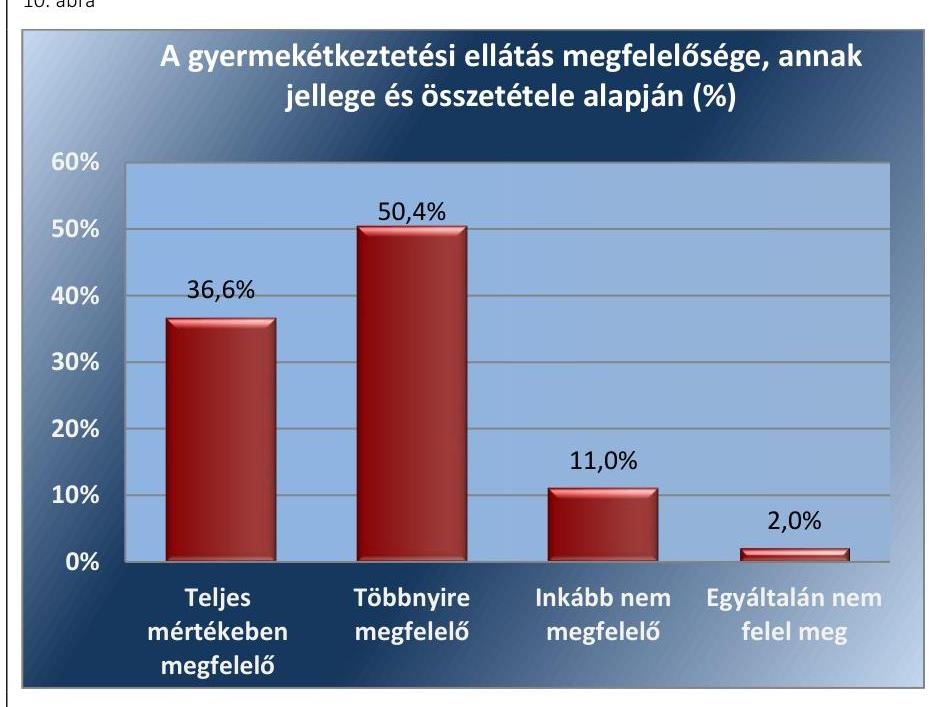

Forrás: ÁSZ közvélemény-kutatás
2. A gyermekétkeztetés ellátásának színvonalát, az azt igénybe vevő gyermekek szülei pozitívan értékelték.
11. ábra
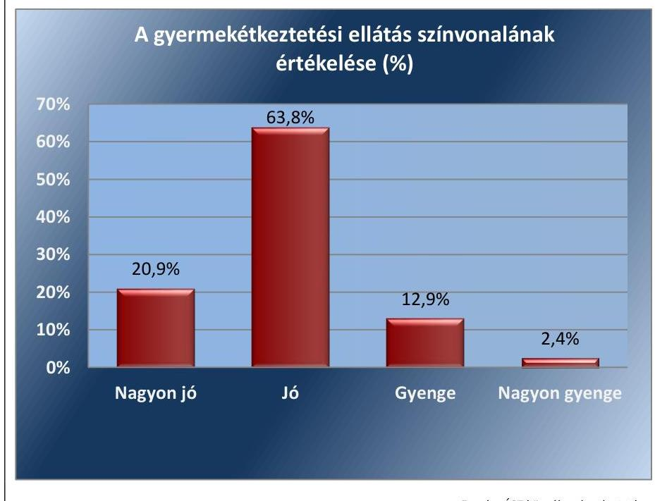
3. Az igényelt étkezést/étkezéseket a gyermek az étkezési időben megkapta.

---

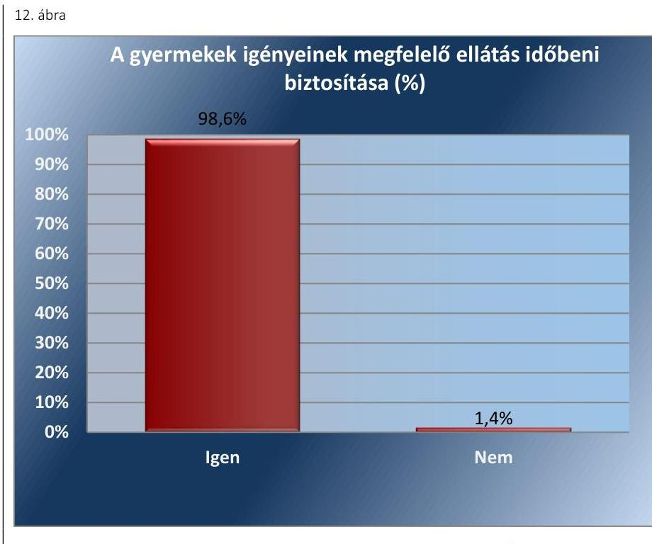

Forrás: ÁSZ közvélemény-kutatás
4. A kapott étel (ebéd) minősége (íze, állaga, látványa) és mennyisége megfelelt a gyermek elvárásainak.
13. ábra
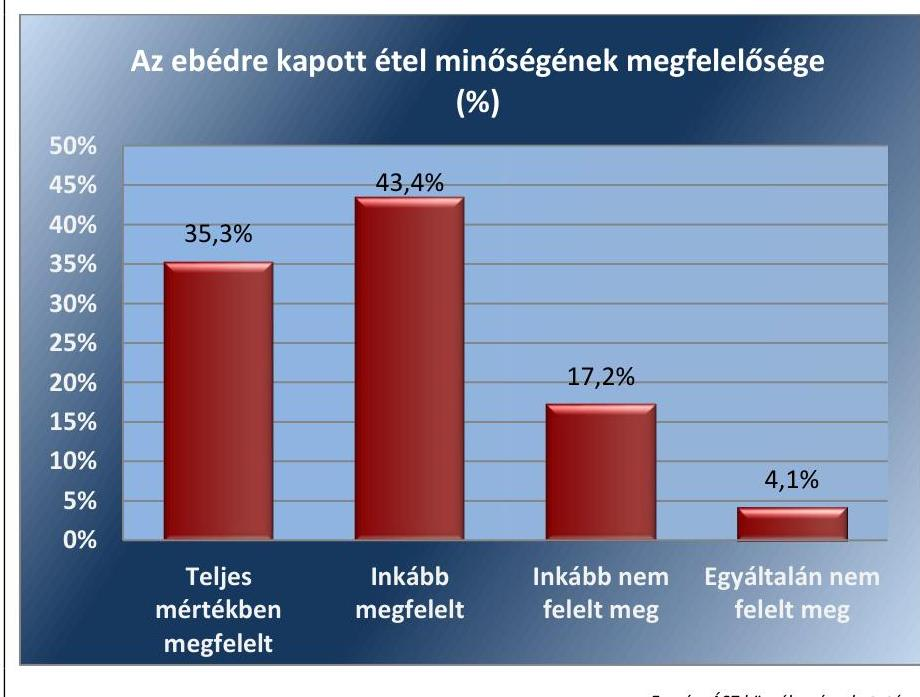
5. A gyermekétkeztetés pozitív irányba befolyásolta a gyermek táplálkozási szokásait, ízlését, magatartását és étkezési kultúráját.

---

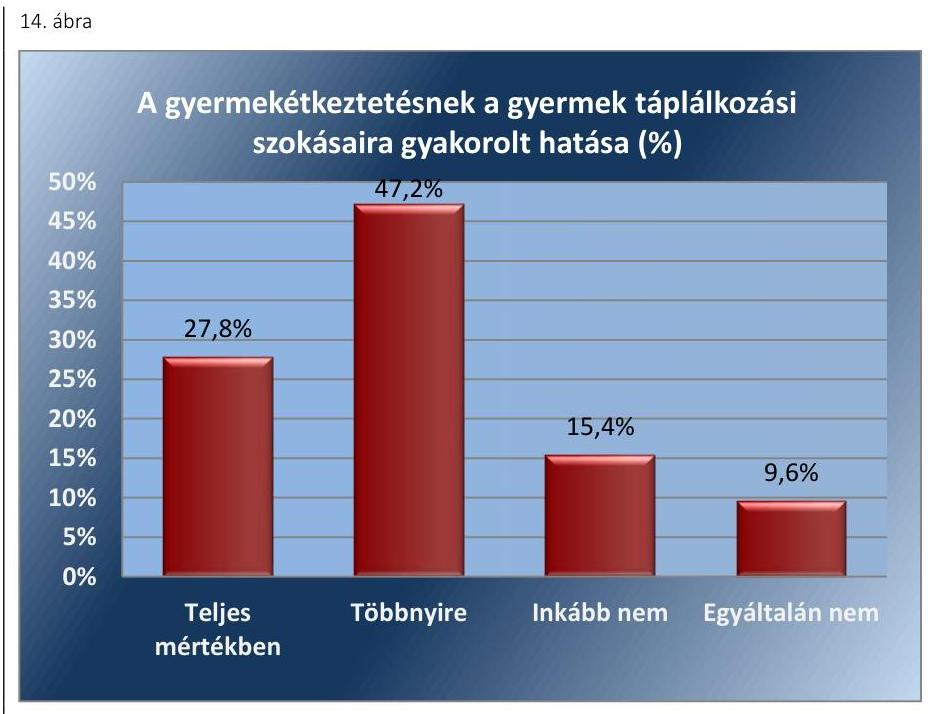

Forrás: ÁSZ közvélemény-kutatás
A megkérdezett szülők kevesebb, mint 5%-a élt panasszal a gyermekétkeztetéssel kapcsolatban.

A panasszal élő válaszadók többsége szerint megfelelően kezelték panaszát. A felmérés során feltett kérdésre problémát jelzők azt kifogásolták, hogy a térítési díj csak személyesen fizethető be; nem állt rendelkezésre elég idő a díj befizetésére; illetve, hogy a kalkuláció során nem megfelelő kedvezményt vettek figyelembe.

---

# MELLÉKLETEK 

I. SZ. MELLÉKLET: ÉRTELMEZŐ SZÓTÁR
belső ellenőrzés

CATI-módszer
eredményesség
helyénvalósági ellenőrzés
intézményi gyermekétkeztetés
kockázatelemzés
közétkeztetés

Független, tárgyilagos bizonyosságot adó és tanácsadó tevékenység, amelynek célja, hogy az ellenőrzött szervezet működését fejlessze és eredményességét növelje, az ellenőrzött szervezet céljai elérése érdekében rendszerszemléletű megközelítéssel és módszeresen értékeli, illetve fejleszti az ellenőrzött szervezet irányítási és belső kontrollrendszerének hatékonyságát (Bkr. 2. § b) pontja)
Computer Assisted Telephone Interviewing. Számítógéppel támogatott telefonos lekérdezés.
Az eredményesség annak követelménye, hogy a kitűzött célok - az elfogadott módosításokat, változó körülményeket figyelembe véve - megvalósuljanak, a tevékenység tervezett és tényleges hatása közötti különbség a lehető legkisebb mértékű legyen, vagy a tényleges hatás legyen kedvezőbb a tervezettnél (Bkr. 2. § g) pontja)
A helyénvalósági ellenőrzés a megfelelőségi ellenőrzés azon altípusa, amelyet azokban az esetekben kell alkalmazni, amelyekre jogszabályi előírások nem alkalmazhatóak, illetve amennyiben egyes kérdések megítélésénél nyilvánvaló jogszabályi hiányosságok vannak. Helyénvalósági ellenőrzés során az ellenőrzést végző személynek a közszféra intézményeinek helyes gazdálkodására, a közpénzek eredményes és megfelelő felhasználására és a közszféra tisztviselőinek magatartására vonatkozó általános elvek mentén kell az ellenőrzést lefolytatnia. A helyénvalósági ellenőrzés kritériumait az ellenőrzés tárgyában általánosan elfogadott, illetve nemzetközi vagy hazai „jó gyakorlatok" is meghatározhatják. (Állami Számvevőszék, A megfelelőségi ellenőrzés alapelvei 2015. július)
Természetbeni ellátásként a gyermek életkorának megfelelő gyermekétkeztetést kell biztosítani a gyermeket gondozó szülő, törvényes képviselő vagy nevelésbe vett gyermek esetén a gyermek ellátását biztosító nevelőszülő, gyermekotthon vezetője, illetve az Szt. hatálya alá tartozó ápolást, gondozást nyújtó intézmény vezetője kérelmére
a) a bölcsődében, mini bölcsődében,
b) az óvodában,
c) a nyári napközis otthonban,
d) az általános és középiskolai kollégiumban, az itt szervezett externátusi ellátásban, e) az általános iskolai és - ha önkormányzati rendelet kivételével jogszabály másképpen nem rendelkezik - a középfokú iskolai menzai ellátás keretében,
f) a fogyatékos gyermekek, tanulók nevelését, oktatását ellátó intézményben és a fogyatékos gyermekek számára nappali ellátást nyújtó, az Szt. hatálya alá tartozó fogyatékosok nappali intézményében [az a)-f) pontban foglaltak a továbbiakban együtt: intézményi gyermekétkeztetés] (Forrás: Gyvt. 21. § (1) bekezdés a)-f) pontja)
Objektív módszer az ellenőrizendő területek kiválasztására, mely meghatározza a költségvetési szerv tevékenységében és belső kontrollrendszerében rejlő kockázatokat (Bkr. 2. § I) pontja)
Olyan rendszeres étkezést biztosító, szervezett közösségi ellátás, melyet nevelési-oktatási intézményekben, állami és önkormányzati finanszírozású nyári táborokban, fekvőbeteg-szakellátást nyújtó intézményekben, szociális ellátás, gyermekjóléti alapellátás és gyermekvédelmi szakellátás keretében ellátott, különböző korú és egészségi állapotú személyek részére, többnyire előre megrendelés alapján a nap egy meghatározott időszakában, meghatározott időtartamban nyújtanak. (37/2014. (IV.

---

30.) EMMI rendelet a közétkeztetésre vonatkozó táplálkozás-egészségügyi előírásokról 2. § (1) bekezdés 14. pont)
szünidei gyermekétkeztetés Természetbeni ellátásként a gyermek életkorának megfelelő gyermekétkeztetést kell biztosítani a gyermeket gondozó szülő, törvényes képviselő vagy nevelésbe vett gyermek esetén a gyermek ellátását biztosító nevelőszülő, gyermekotthon vezetője, illetve az Szt. hatálya alá tartozó ápolást, gondozást nyújtó intézmény vezetője kérelmére a Gyvt. 21/C. §-ban foglaltak szerint a bölcsőde, mini bölcsőde és az óvoda zárva tartása, valamint az iskolában az Nktv. 30. § (1) bekezdése szerinti nyári szünet és az Nktv. 30. § (4) bekezdése szerinti tanítási szünetek időtartama alatt (a továbbiakban együtt: szünidei gyermekétkeztetés). (Forrás: Gyvt. 21. § (1) bekezdés g) pontja 2016. január 1-től)
teljesítmény-ellenőrzés
A teljesítmény-ellenőrzés a számvevőszéki ellenőrzés azon típusa, amely annak megállapítására irányul, hogy a közpénzekkel és a nemzeti vagyonnal való gazdálkodás megfelel-e az eredményesség, hatékonyság, gazdaságosság elveinek, illetve vannak-e lehetőségek a teljesítmény javítására. A teljesítmény-ellenőrzés azzal támogatja a szervezetek átlátható működését, hogy az ellenőrzési bizonyítékokra alapozva -független és mérvadó nézőpontot, következtetést ad az ellenőrzés eredményeinek célzott felhasználói számára - betekintést nyújt a közpénzekkel és a nemzeti vagyonnal való gazdálkodással, feladatellátással kapcsolatos, ellenőrzött tevékenységek végrehajtásába és eredményeibe. Ily módon közvetlenül hasznos információkat nyújt, miközben az ismeretbővítés és a teljesítmény-javítás alapjaként is szolgál. A teljesítmény-ellenőrzés új értékelési szempontokkal támogatja a felelős feleket az elszámoltathatóság javításában. (Állami Számvevőszék, A teljesítmény-ellenőrzés alapelvei 2015. július)

---

1. Ádánd Község Önkormányzata
2. Ároktő Község Önkormányzata
3. Besenyszög Város Önkormányzata
4. Bezeréd Község Önkormányzata
5. Bogács Község Önkormányzata
6. Bogyiszló Község Önkormányzata
7. Borsodnádasd Város Önkormányzata
8. Budakeszi Város Önkormányzata
9. Budapest Főváros VI. Kerület Terézváros Önkormányzata
10. Budapest Főváros XV. Kerület Rákospalota, Pestújhely, Újpalota Önkormányzata
11. Bük Város Önkormányzata
12. Csanádpalota Városi Önkormányzat
13. Csépa Községi Önkormányzat
14. Dad Község Önkormányzata
15. Dánszentmiklós Község Önkormányzata
16. Dorog Város Önkormányzata
17. Écs Községi Önkormányzat
18. Emőd Város Önkormányzata
19. Felsőszenterzsébet Község Önkormányzata
20. Fiad Község Önkormányzata
21. Gilvánfa Község Önkormányzata
22. Hajdúszoboszló Város Önkormányzata
23. Hegyeshalom Nagyközségi Önkormányzat
24. Kállósemjén Nagyközség Önkormányzata
25. Kéthely Község Önkormányzata
26. Kisbér Város Önkormányzata
27. Kisláng Község Önkormányzata
28. Kisvárda Város Önkormányzata
29. Komádi Városi Önkormányzat
30. Komló Város Önkormányzat
31. Környe Község Önkormányzata
32. Kunszentmiklós Város Önkormányzat
33. Lenti Város Önkormányzata
34. Magyarbóly Községi Önkormányzat
35. Mároki Önkormányzat
36. Békéscsabai Járási Hivatal
37. Budapest II. Kerületi Hivatal
38. Budapest XI. Kerületi Hivatal
39. Debreceni Járási Hivatal
40. Egri Járási Hivatal
41. Encsi Járási Hivatal
42. Esztergomi Járási Hivatal
43. Hajdúszoboszlói Járási Hivatal
44. Hatvani Járási Hivatal
40. Jászberényi Járási Hivatal
45. Mezőfalva Nagyközség Önkormányzata
46. Nagyhalász Város Önkormányzata
47. Nagykovácsi Nagyközség Önkormányzata
48. Nagylengyel Község Önkormányzata
49. Nagypeterd Község Önkormányzata
50. Nemesdéd Községi Önkormányzat
51. Nyírmada Város Önkormányzata
52. Nyírmeggyes Község Önkormányzata
53. Olaszfa Község Önkormányzata
54. Ostoros Községi Önkormányzat
55. Pánd Község Önkormányzata
56. Pusztaederics Község Önkormányzata
57. Pusztaszabolcs Város Önkormányzata
58. Rábaszentandrás Község Önkormányzata
59. Rákóczifalva Város Önkormányzata
60. Rezi Község Önkormányzata
61. Sátoraljaújhely Város Önkormányzata
62. Siófok Város Önkormányzata
63. Sirok Községi Önkormányzat
64. Szákszend Község Önkormányzata
65. Szekszárd Megyei Jogú Város Önkormányzata
66. Szentantalfa Község Önkormányzata
67. Szigetbecse Község Önkormányzat
68. Szigethalom Város Önkormányzata
69. Szikszó Város Önkormányzata
70. Sződ Község Önkormányzata
71. Tét Város Önkormányzata
72. Tóalmás Község Önkormányzat
73. Üllő Város Önkormányzata
74. Vámospércs Város Önkormányzata
75. Várpalota Város Önkormányzata
76. Vasad Község Önkormányzata
77. Vasvár Város Önkormányzata
78. Zalagyömörő Község Önkormányzata
79. Kaposvári Járási Hivatal
80. Karcagi Járási Hivatal
81. Körmendi Járási Hivatal
82. Marcali Járási Hivatal
83. Monori Járási Hivatal
84. Nagyatádi Járási Hivatal
85. Nagykanizsai Járási Hivatal
86. Szekszárdi Járási Hivatal
87. Szigetvári Járási Hivatal
88. Szolnoki Járási Hivatal

---

.

---

# FÜGGELÉKEK 

- I. SZ. FÜGGELÉK A JELENTÉSHEZ

Az Állami Számvevőszék az ellenőrzések során feltárt tényekhez kapcsolódó további körülmények tisztázására eszközrendszerrel nem rendelkezik. Amennyiben az ellenőrzésen túlmutatóan indokoltnak látszik az ellenőrzés során feltárt körülmények további vizsgálata, az Állami Számvevőszék törvényi felhatalmazás alapján az ellenőrzés által feltárt körülményeket továbbítja a hatáskörrel rendelkező szervnek a szükséges intézkedések megtétele, eljárások lefolytatása érdekében.

1. Budakeszi Város Önkormányzata éves költségvetési beszámolójának adatai szerint szünidei gyermekétkeztetés támogatást használt fel 505305 Ft összegben. Az önkormányzat a szünidei gyermekétkeztetés igénybevételéről nyilvántartással rendelkezett, azonban a szünidei gyermekétkeztetés igénybevételét a tavaszi, a nyári, az őszi, és a téli szünetre vonatkozóan a 328/2011. (XII. 29.) Korm. rendelet 13. § (5) bekezdésében foglalt előírás ellenére a Korm. rendelet 4. mellékletében előírt módon nem dokumentálta. A Gyvt. 21/C. §-a szerinti szünidei gyermekétkeztetés igénybevételének dokumentumaival, a 328/2011. (XII. 29.) Korm.
 rendelet 7. melléklete szerinti nyilatkozatokkal nem rendelkezett.
2. Gilvánfa Község Önkormányzata éves költségvetési beszámolójának adatai szerint szünidei gyermekétkeztetés támogatást használt fel 3746317 Ft összegben, azonban a Gyvt. 21/C. §-a szerinti szünidei gyermekétkeztetés igénybevételének dokumentumaival, a 328/2011. (XII. 29.) Korm. rendelet 7. melléklete szerinti nyilatkozatokkal nem rendelkezett. A 328/2011. (XII. 29.) Korm. rendelet 13. § (5) bekezdésében foglalt előírás ellenére a szünidei gyermekétkeztetés igénybevételét a nyári, az őszi és a téli szünetre vonatkozóan a Korm. rendelet 4. mellékletében előírt módon nem dokumentálta.
3. Pánd Község Önkormányzata éves költségvetési beszámolójának adatai szerint szünidei gyermekétkeztetés támogatást használt fel 3315399 Ft összegben, a tavaszi, a nyári, az őszi, illetve a téli szünidei gyermekétkezésről összesítővel rendelkezett, azonban a szünidei gyermekétkeztetés igénybevételét a 328/2011. (XII. 29.) Korm. rendelet 13. § (5) bekezdésében foglalt előírás ellenére a tavaszi, a nyári, az őszi, és a téli szünetre vonatkozóan nem a Korm. rendelet 4. mellékletében előírt módon dokumentálta. Az Önkormányzat a gyermekétkeztetés igénybevételére vonatkozó más dokumentummal nem rendelkezett.
4. Komádi Városi Önkormányzat éves költségvetési beszámolójának adatai szerint szünidei gyermekétkeztetés támogatást használt fel 13832760 Ft összegben, a gyermekétkeztetés igénybevételéről dokumentummal rendelkezett, azonban a 328/2011. (XII. 29.) Korm. rendelet 13. § (5) bekezdésében foglalt előírás ellenére a szünidei gyermekétkeztetés igénybevételét a nyári, az őszi és a téli szünetre vonatkozóan a Korm. rendelet 4. mellékletében előírt módon nem dokumentálta.

---

5. Csanádpalota Városi Önkormányzat éves költségvetési beszámolójának adatai szerint szünidei gyermekétkeztetés támogatást használt fel 647520 Ft összegben, azonban a gyermekétkeztetés igénybevételéről dokumentummal nem rendelkezett, a 328/2011. (XII. 29.) Korm. rendelet 13. § (5) bekezdésében foglalt előírás ellenére a tavaszi, a nyári, az őszi, és a téli szünetre vonatkozóan a szünidei gyermekétkeztetés igénybevételét a Korm. rendelet 4. mellékletében előírt módon nem dokumentálta.
6. Vasad Község Önkormányzatának éves költségvetési beszámolójának adatai szerint szünidei gyermekétkeztetés támogatást használt fel 88920 Ft összegben, azonban a gyermekétkeztetés igénybevételét nem dokumentálta, a 328/2011. (XII. 29.) Korm. rendelet 13. § (5) bekezdésében foglalt előírás ellenére a tavaszi, a nyári, az őszi, és a téli szünetre vonatkozóan a Korm. rendelet 4. mellékletében előírt módon nem dokumentálta.
Az önkormányzatok esetében felmerült a gyermekétkeztetésre járó önkormányzati támogatás jogosulatlan igénybevételének és a Számv. tv. 165. § (2) bekezdése előírásai megsértésének gyanúja, amely alapján a számviteli (könyvviteli) nyilvántartásokba csak szabályszerűen kiállított - a könyvvitelben rögzítendő és a más jogszabályban előírt adatokat a valóságnak megfelelően, hiánytalanul tartalmazó, a bizonylat általános alaki és tartalmi követelményeinek megfelelő - bizonylat alapján szabad adatokat bejegyezni.
Az esetek konkrét körülményeinek felderítésére a Magyar Államkincstár rendelkezik hatáskörrel.

---

A jelentéstervezetet a Számvevőszék 15 napos észrevételezésre megküldte az ellenőrzött szervezetek vezetőinek az ÁSZ tv. 29. § (1) bekezdése előírása szerint.

A jelentéstervezet megállapításaira a Budakeszi Polgármesteri Hivatal, a Budapest Főváros XV. kerületi Polgármesteri Hivatal, a Hajdúszoboszló Város Önkormányzata, a Kisvárdai Közös Önkormányzati Hivatal, a Komádi Városi Önkormányzat, a Várpalota Város Önkormányzata polgármestere, illetve jegyzője-, továbbá a Budapest Főváros Kormányhivatal, a Baranya Megyei Kormányhivatal és a Zala Megyei Kormányhivatal vezetője az ÁSZ törvény 29.§ (2) bekezdésében foglalt határidőn belül észrevételt tettek. Az észrevételeket és az arra adott válaszokat a függelék tartalmazza. A Magyar Államkincstár elnöke-, a Nagykovácsi Nagyközség Önkormányzata, a Szekszárd Megyei Jogú Város Polgármesteri Hivatala jegyzője-, továbbá a Békés Megyei Kormányhivatal, a Hajdú-Bihar Megyei Kormányhivatal, a Heves Megyei Kormányhivatal és a Vas Megyei Kormányhivatal vezetője nemleges észrevételt tettek.

[^0]
[^0]:    * 29. § (1) Az Állami Számvevőszék az ellenőrzési megállapításait megküldi az ellenőrzött szervezet vezetőjének vagy az általa megbízott személynek, és annak, akinek személyes felelősségét állapította meg.
    (2) Az ellenőrzött szervezet vezetője és a felelősként megjelölt személy az ellenőrzés megállapításaira tizenöt napon belül írásban észrevételt tehet.
    (3) Az Állami Számvevőszék az észrevételre a beérkezésétől számított harminc napon belül írásban válaszol. A figyelembe nem vett észrevételeket köteles a jelentésben feltüntetni, és megindokolni, hogy azokat miért nem fogadta el.

---

# Domokos László elnök úr részére 

Állami Számvevőszék

Iktatószám: BP/FNEF-HKO/04503-2/2019.
Úgyintéző: Dévényiné dr. Farkas Adrienn
Telefon: 06-1-465-3818
E-mail: hatosagi@nfo.bfkh.gov.hu
Tárgy: észrevétel „A gyermekétkeztetés rendszerének ellenőrzése" jelentéstervezetre
Hivatkozási szám: EL-0687-1084/2019.

## Ez a levél kizárólag elektronikusan kerül megküldésre!

## Tisztelt Elnök Úr!

Budapest Főváros Kormányhivatala (a továbbiakban: BFKH) köszönettel megkapta a fenti hivatkozási számú, „A gyermekétkeztetés rendszerének ellenőrzése" című jelentéstervezetet (a továbbiakban: Tervezet), amelyre a megadott 15 napos határidőn belül az alábbi észrevételeket teszi.

## I. Kerületi Hivatalok

A Tervezet 3.2. számú megállapítása és a Függelék 24. pontja a BFKH keretein belül működő, a népegészségügyi feladatkörben eljáró Budapest II. Kerületi Hivatala és a XI. Kerületi Hivatala tekintetében hiányosságként rótta fel, hogy „a Ket. 91. § (3) bekezdés előírásai ellenére a hatósági ellenőrzési tervet honlapukon nem tették közzé".

BFKH a hivatkozott megállapításokat nem vitatja, kiemelendő azonban, hogy az ellenőrzési terv honlapon történő közzétételének elmaradása a vizsgált időszakban, illetve azt követően is mindössze egy alkalommal (2014. év) fordult elő. Az elmaradást okozhatta az a körülmény, hogy a 2014. évben még zajlott a szakigazgatási szervek belső integrációs folyamata, az ellenőrzött tevékenységet az ÁNTSZ Országos Tisztifőorvosi Hivatal által meghatározottak szerint a később főosztállyá szervezett BFKH Népegészségügyi Szakigazgatási Szerv, valamint közvetlen szakmai irányítással a kormányhivatalok járás/kerületi népegészségügyi intézetei végezték. Az ellenőrzési terv honlapon történő közzétételének sajnálatos elmaradásától függetlenül az ellenőrzéseket az intézetek az aktuális jogszabályi előírásoknak és szakmai szabályoknak megfelelően lefolytatták, különös tekintettel a közétkeztetésre vonatkozó táplálkozás-egészségügyi előírásokról szóló 37/2014. (IV. 30.) EMMI rendelet (a továbbiakban: EMMI rendelet) hatályba lépésére történő felkészülésre.

---

A jelenleg hatályos a fővárosi és megyei kormányhivatalokról, valamint a járási (fővárosi kerületi) hivatalokról szóló 86/2019. (IV. 23.) Korm. rendelet (a továbbiakban: Korm. rendelet) 29. § (1) bekezdése értelmében a szakmai irányító miniszter országos hatósági ellenőrzési tervet készít az irányítási jogkörébe tartozó feladatok tekintetében a fővárosi és megyei kormányhivatalok által lefolytatandó hatósági ellenőrzésekről, és gondoskodik annak az általa vezetett minisztérium honlapján történő közzétételéről.

A Korm. rendelet 29. § (2) bekezdésében, valamint a 30. § (2) bekezdésében előírtaknak megfelelően a BFKH elkészíti az éves ellenőrzési, illetve összevont ellenőrzési tervet. A honlapon történő közzététel, ugyanakkor már nem a BFKH, hanem az illetékes minisztérium feladata.

# II. Monori Járási Hivatal 

A BFKH Népegészségügyi Szakigazgatási Szerve (a továbbiakban: NSZSZ) 2014. évben feladatait Budapest és Pest megye területére kiterjedő illetékességgel látta el, amelyre tekintettel a BFKH a Pest Megyei Kormányhivatal (a továbbiakban: PMKH) Monori Járási Hivatal vonatkozásában is észrevételt kíván tenni.

A Tervezet függelékének 21. pontja szerint a Monori Járási Hivatal a „Ket. 91. § (1) bekezdése és a 66/2015. (III. 15.) Korm. rendelet 7. § (2) bekezdés előírásai ellenére az országos terv alapján az éves hatósági ellenőrzési tervet nem" készítette el.

A népegészségügyi feladatokat 2014. évben a PMKH Monori Járási Hivatal Népegészségügyi Intézete (a továbbiakban: Intézet) látta el, amely szerv 2013. december 13-án kelt, word formátumú ellenőrzési tervét (1. sz. melléklet) szíves felhasználásra mellékelten megküldi a BFKH.

Hiányosságként állapítja meg a Tervezet függeléke 23. pontja azt is, hogy a PMKH Monori Járási Hivatal éves jelentése „a Ket. 91. § (2) bekezdésében előírt követelménynek maradéktalanul nem felelt meg, mivel nem tartalmazta a végrehajtott ellenőrzések számát, a megállapított jogsértések típusait." A BFKH mellékelten megküldi az „Elelmezés_es_taplalkozas_egeszsegugyi_tablak_2014" elnevezésű táblázatot (2. sz. melléklet), amelyet az Intézet az éves jelentése részeként készített el. A táblázat egyaránt tartalmazza az ellenőrzések számát és a megtett intézkedéseket. A BFKH mellékeli az NSZSZ „Jelentés a 2014. évi hatósági ellenőrzési tervről" tárgyú 2015. január 6-án kelt levelét (3. sz. melléklet), továbbá a Monori Járási Hivatal ezen megkeresésre írt válaszát (4. sz. melléklet), valamint annak mellékletét az ellenőrzési terv keretében végrehajtott ellenőrzésekről kitöltött táblázatot (5. sz. melléklet).

A leírtakra tekintettel megállapítható, hogy a Monori Járási Hivatal 2014. év tekintetében is elkészítette az éves ellenőrzési tervet, valamint jelentést tett az ellenőrzések számáról, a megállapított jogsértések típusáról.

Az ellenőrzési terv közzététele tekintetében szíveskedjék a fentiekben előadottakat a Monori Járási Hivatal vonatkozásában is figyelembe venni.
III. Közétkeztetés

A BFKH saját tapasztalatai alapján, amelyet a szakirodalmi adatok is alátámasztanak, a gyermekek ha választhatnak - elsősorban húst és tésztát esznek, viszont kevés zöldséget, zöldséges ételt, még kevesebb gyümölcsöt fogyasztanak. A gyermekek egészséges fejlődése érdekében azonban ezen tendencián változtatni szükséges, amelynek egyik eszköze a közétkeztetés.

---

Mindezekre tekintettel a közétkeztetést, ezen belül a gyermekétkeztetést a BFKH kiemelten kezeli, folyamatosan figyelemmel kíséri. Laboratóriumi vizsgálatokkal győződik meg az ételsorok tápanyag összetételéről, ásványi anyag, különösen só, Calcium tartalmáról és természetesen helyszíni vizsgálatokat, ellenőrzéseket végez.

A hatósági ellenőrzéseken túl széles körű szakmai tájékoztató munkát (workshopok, tájékoztató előadások, termelő-közétkeztető találkozók, szülői értekezletek, iskolai egészségnapok, egészséges táplálkozás tanulói és senior főző-programok, egészséges iskolabüfé versenyek, játékok, stb.) is végeznek a népegészségügyi szakemberek valamennyi érintett (közétkeztetést szervezők, végzők, igénybe vevők, ellenőrzők; önkormányzati, egészségügyi, oktatási, civil szervezetek, szülők, nagyszülők, vendéglátók, kiskereskedők, stb.) megszólításával az EMMI rendeletben foglalt egészségvédelmi elvek, intézkedések elfogadottsága, gyakorlati megvalósulása érdekében.

BFKH a jogszabályi előírásoknak mindenben megfelelő működése érdekében továbbra is megteszi a szükséges intézkedéseket, egyben kéri fentiek szíves elfogadását.

Budapest, - Dátum a digitális aláírás szerint

Tisztelettel:
Digitálisan aláírta: Dr. György István
Dátum: 2019.06.13 10:28:09 +02'00'
dr. György István

Melléklet:

1. PMKH Monori Járási Hivatal Járási Népegészségügyi Intézet 2014. évi Ellenőrzési Tervét tartalmazó e-mail
2. Elelmezés_es_taplalkozas_egeszsegugyi_tablak_2014.xlsx
3. BFKH Népegészségügyi Szakigazgatási Szerv 2015. január 6-án kelt levele
4. PMKH Monori Járási Hivatal Járási Népegészségügyi Intézet 2015. január 15-én küldött elektronikus levele
5. 2014_ellenorzési_terv_teljesites_Monor.xlsx

Erről értesül:
Címzett
Iratár

---

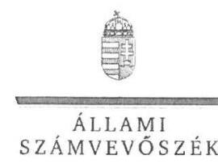

ELNÖK

# Dr. György István úr 

kormánymegbízott
Budapest Főváros Kormányhivatala

## Budapest

## Tisztelt Kormánymegbízott Úr!

„A gyermekétkeztetés rendszerének ellenőrzése" címmel készített számvevőszéki jelentéstervezetre megküldött BP/FNEF-HKO/04503-2/2019 iktatószámú észrevételeit köszönettel megkaptam.
Az Állami Számvevőszék észrevételekre vonatkozó álláspontjáról a felügyeleti vezető által készített részletes tájékoztatást csatoltan megküldöm.
Tájékoztatom Kormánymegbízott urat, hogy a számvevőszéki jelentésben - az Állami Számvevőszékről szóló 2011. évi LXVI. törvény 29. § (3) bekezdése alapján - a figyelembe nem vett észrevételeket szerepeltetjük az elutasítás indokának feltüntetésével.

Budapest, 2019. $\quad$ c hó $\quad$ c nap
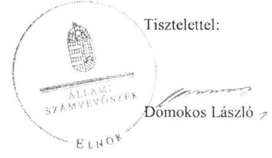

Melléklet: Tájékoztatás észrevételek kezeléséről

---

# Tájékoztatás észrevételek kezeléséről 

„A gyermekétkeztetés rendszerének ellenőrzése" című jelentéstervezet (a továbbiakban: Jelentéstervezet) megállapításaira a BP/FNEF-HKO/04503-2/2019 iktatószámú levélben megküldött észrevételét áttekintettem. Az észrevétel kezeléséről az alábbi tájékoztatást adom.

## I.) Kerületi Hivatalok - 3.2. számú megállapítása vonatkozásában megfogalmazott észrevételre adott válasz

Kormánymegbízott úr az észrevételében nem vitatja a Jelentéstervezet 3.2. számú megállapítás (negyedik francia bekezdésében szereplő) hiányosságot, miszerint a kormányhivatal érintett kerületi és járási hivatalai „a hatósági ellenőrzési tervet a honlapjukon nem tették közzé". Kiemelendőnek tartotta azonban, hogy ez a tény mindössze egy alkalommal 2014. évben fordult
 elő.

Az észrevételhez kapcsolatban megjegyzem, hogy a Jelentéstervezet 3.2. számú megállapítás első bekezdése rögzíti, hogy a felsorolt hiányosságok 2014. évre vonatkoznak.

## II.) Monori Járási Hivatal - Az ellenőrzés háttere, indokoltsága 5. bekezdéséhez megfogalmazott észrevételre adott válasz

Kormánymegbízott úr a Pest Megyei Kormányhivatal Monori Járási Hivatal vonatkozásában is észrevételt tett, tekintettel arra, hogy 2014. évben a BFKH Népegészségügyi Szakigazgatási Szerve feladatait Budapest és Pest megye területére kiterjedő illetékességgel látta el.
Első észrevételében a Jelentéstervezet 3.2. számú megállapítás (első francia bekezdésében szereplő) „a hivatalok a Ket. 91. § (1) bekezdés és a 66/2015. (III. 30.) Korm. rendelet 7. § (2) bekezdés előírásai ellenére az országos terv alapján az éves hatósági ellenőrzési tervet nem készítették el" felülvizsgálatát kérte, és elektronikus formában 1. számú mellékletként csatolta a Monori Járási Hivatal 2014. évre elkészített ellenőrzési tervét.
Második észrevételében a Jelentéstervezet 3.2. számú megállapítás (harmadik francia bekezdésében szereplő) „éves jelentésük a Ket. 91. § (2) bekezdésében előírt követelménynek maradéktalanul nem felelt meg, mivel nem tartalmazta a végrehajtott ellenőrzések számát, a megállapított jogsértések típusait" felülvizsgálatát kérte, és elektronikus formában 2-5. számú mellékletekként csatolta a BFKH rendelkezésére álló, fenti hiányosságokat igazoló dokumentációját.
Az észrevételeket nem fogadjuk el. Az ÁSZ - ellenőrzési program alapján lefolytatott - ellenőrzésének megállapításai az ellenőrzött szervezetek által az ÁSZ rendelkezésére bocsátott dokumentumokon alapulnak. Az ÁSZ az EL-0687-170/2018 iktatószámú levelében tájékoztatta a

---

Pest Megyei Kormányhivatal vezetőjét a Monori Járási Hivatal tekintetében megkezdett ellenőrzéséről, és hívta fel a - levélhez csatolt 2. számú melléklet 3.1 - 3.5 pontban nevesített - dokumentumok megküldésére.

A dokumentumok megküldését a Monori Járási Hivatal hivatalosan meghatalmazott munkatársa teljesítette, és az adatszolgáltatásokkal összefüggésben „Teljességi és hitelességi nyilatkozat"-ot állított ki, amelynek mellékletében részletesen felsorolta az ÁSZ rendelkezésére bocsátott dokumentumokat. Rögzítette továbbá, hogy az adatszolgáltatás teljes körű és hiteles, illetve felelősséget vállalt - többek között - a beküldött dokumentumok hiánytalanságáért is. Ennek okán az ÁSZ további adatbekérést, hiánypótlást nem kezdeményezett, megállapításait a rendelkezésre álló dokumentumok vizsgálata alapján fogalmazta meg, mely dokumentáció 2014. évre vonatkozóan nem tartalmazott adatot. A fenti nyilatkozatokra tekintettel a Jelentéstervezet észrevételezése során az ÁSZ részére elektronikus formában rendelkezésre bocsátott dokumentumokat nem áll módunkban figyelembe venni, ennek megfelelően az ÁSZ iratkezelő rendszeréből a dokumentumokat kivezeti.

# III.) Közétkeztetés kapcsán megfogalmazott észrevételre adott válasz 

Kormánymegbízott úr tájékoztatást adott a BFKH közétkeztetés javítása-, a gyermekek egészséges fejlődése érdekében végzett tevékenységéről.

A tájékoztatását tudomásul vettük. Mivel az észrevétel nem kapcsolódik a Jelentéstervezet megállapításaihoz, a Jelentéstervezet módosítására nem kerül sor.

Budapest, 2019. 06. hó 26. nap

Dr. Pulay Gyula felügyeleti vezető

---

# Függelékek 

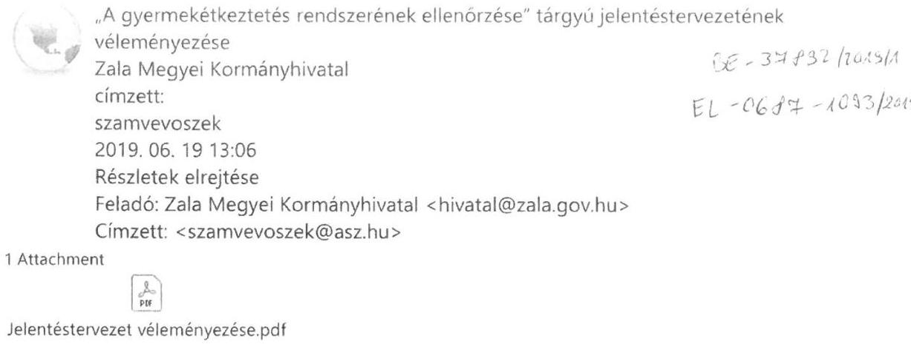

1 Attachment

Jelentéstervezet véleményezése.pdf
Domokos László elnök úr részére
Állami Számvevőszék

Elektronikus úton továbbítandó!
Tisztelt Elnök Úr!
Ezúton továbbítom a Zala Megyei Kormányhivatal fenti tárgyú levelét.

Tisztelettel:
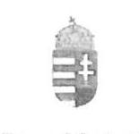

Harmath Virág
titkársági ügyintéző
Zala Megyei Kormányhivatal
Kormánymegbizotti Kabinet
8900 Zalaegerszeg, Kosztolányi D. u. 10.
tel.: +36/92/507-704
hivatal@zala.gov.hu
www. kormanyhivatal.hu/hu/zala

---

# Zala Megyei   KormányHivatal 

| Úgyiratszám: | ZA-05B/TIT/4-37/2019. | Tárgy: | „A gyermekétkeztetés rendszerének |
| :-- | :-- | :-- | :-- |
| Úgyintéző: | Dr. Mímon Ágnes |  | ellenőrzése" tárgyú jelentéstervezetének |
| Telefon: | $92 / 795-053$ |  | véleményezése |
|  |  | Hiv. szám: | EL-0687-1084/2019 |

## Domokos László elnök úr részére

Állami Számvevőszék

Elektronikus úton továbbítandó!

## Tisztelt Elnök Úr!

Az Állami Számvevőszék által „A gyermekétkeztetés rendszerének ellenőrzése" tárgyában lefolytatott vizsgálat alapján készített jelentéstervezetével kapcsolatban az alábbi észrevételt teszem:

Az Állami Számvevőszék 2018. évben „A gyermekétkeztetés rendszerének ellenőrzése" tárgyú vizsgálat keretében 69 települési önkormányzatot és 20 egyszerü véletlen mintavétellel kiválasztott népegészségügyi feladatot ellátó kerületi/járási hivatalt ellenőrzött. A vizsgálat a Zala Megyei Kormányhivatal szervezeti egységei közül a Nagykanizsai Járási Hivatal Népegészségügyi Osztályát érintette.

A jelentéstervezet „Megállapítások" alcím, 3.2. pontjában, valamint a Nagykanizsai Járási Hivatal vonatkozásában a II. sz. függelék 22. és 24. pontjában foglaltakkal kapcsolatban az alábbi tájékoztatást adom.

2014 - 2016. években a népegészségügyi feladatkörben elvégzendő feladatokat és irányszámokat az OTH által összeállított „Kiemelt munkatervi feladatok" munkaterv szakterületenkénti bontásban adta meg, mely feladatok egy részét az Országos hatósági ellenőrzési terv is tartalmazta. Utóbbi alapján a járási hivatalok éves hatósági ellenőrzési tervében rögzítették a tervezett feladatokat.
2014. évben a „Kiemelt munkatervi feladatok" között nem történt közétkeztetési ellenőrzési feladat meghatározása, mivel csak ebben az évben került elfogadásra a 37/2014. (IV.30.) EMMI rendelet (amely 2015. szeptember 1-től volt hatályos), az ezt megelőző időszakban csak Közétkeztetési ajánlás és Normatív utasítás állt rendelkezésre.

---

2014. évben főként a ZMKH Szociális és Gyámügyi Osztályának megkeresésével összefüggésben történtek közétkeztetési ellenőrzések (szociális étkeztetés, nappali ellátás, gyermekjóléti-gyermekvédelmi ellátás közegészségügyi ellenőrzése során). A fenti tevékenységet végző főzőkonyhák többségében a szociális étkeztetés vizsgálata történt, így a tápanyagszámitás, táplálkozás-egészségügyi előírások betartásának ellenőrzése is a szociális étkezést igénybevevő korcsoportra (70 év felettiek) vonatkozott.

Gyermekétkeztetés ellenőrzése a gyermekjóléti-gyermekvédelmi ellátásban részesülők körében került vizsgálatra.

Zalaegerszeg, 2019. június 19.

Tisztelettel:
Dr. Sifter Rózsa
kormánymegbízott

---

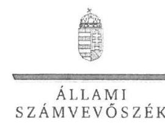

ELNÖK

Ikt.szám: EL-0687-1097/2019

Dr. Sífter Rózsa úrhölgy
kormánymegbízott
Zala Megyei Kormányhivatal

Zalaegerszeg

Tisztelt Kormánymegbízott Úrhölgy!

„A gyermekétkeztetés rendszerének ellenőrzése” címmel készített számvevőszéki jelentéstervezetre megküldött ZA-05B/TIT/4-37/2019. ügyiratszámú észrevételeit köszönettel megkaptam.

Az Állami Számvevőszék észrevételekre vonatkozó álláspontjáról a felügyeleti vezető által készített részletes tájékoztatást csatoltan megküldöm.

Tájékoztatom Kormánymegbízott úrhölgyet, hogy a számvevőszéki jelentésben – az Állami Számvevőszékről szóló 2011. évi LXVI. törvény 29. § (3) bekezdése alapján – a figyelembe nem vett észrevételeket szerepeltetjük az elutasítás indokának feltüntetésével.

Budapest, 2019. július „C.„.”

Tisztelettel:

Domokos László

Melléklet: Tájékoztatás észrevételek kezeléséről

1052 BUDAPEST, PÉREZK CSERE JÁNOS UTCA 10. 1364 Budapest 4. Pl. 54 telefon: 484 9101 fax: 484 9201

---

# Tájékoztatás észrevételek kezeléséről 

„A gyermekétkeztetés rendszerének ellenőrzése" címû jelentéstervezet (a továbbiakban: Jelentéstervezet) megállapításaira a ZA-05B/TIT/4-37/2019. ügyiratszámú levélben megküldött észrevételét áttekintettem. Az észrevétel kezeléséről az alábbi tájékoztatást adom.

Kormánymegbízott úrhölgy az észrevételében nem vitatja a Jelentéstervezet 3.2. számú megállapítás második és negyedik francia bekezdésében szereplő - a Nagykanizsai Járási Hivatal 2014. év vonatkozásában feltárt - hiányosságokat, miszerint a kormányhivatal érintett kerületi és járási hivatalai „a Ket. 91. § (2) bekezdés előírásai ellenére éves ellenőrzési jelentést nem készítettek" illetve „a Ket. 91. § (3) bekezdés előírásai ellenére a hatósági ellenőrzési tervet a honlapjukon nem tették közzé". (Ket. - az ellenőrzés idején hatályban lévő - a közigazgatási hatósági eljárás és szolgáltatás általános szabályairól szóló 2004. évi CXL. törvény)

Kormánymegbízott úrhölgy 2014. év tekintetében tájékoztatást adott a Zala Megyei Kormányhivatal Szociális és Gyámügyi Osztályának megkeresésével összefüggésben végzett - a gyermekétkeztetéshez nem kapcsolódó - közétkeztetési tevékenységet ellátó főzőkonyhák ellenőrzéséről.

A tájékoztatását tudomásul vettük. Mivel az észrevétel nem kapcsolódik a Jelentéstervezet megállapításaihoz, a Jelentéstervezet módosítására nem kerül sor.

Budapest, 2019. július „?..."
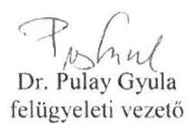

---

# S3. 

Száma: 3/6161-2/2019.

Tárgy: A gyermekétkeztetés rendszerének ÁSZ ellenőrzése. Hiv.szám:EL-0687-1083/2019.

## Állami Számvevőszék Budapest

## Dr. Pulay Gyula felügyeleti vezető részére

Az ellenőrzési jelentéstervezet II. sz. függeléke alapján Kisvárda Város Önkormányzata az alábbi pontokban került kiemelésre, melyhez az alábbi észrevételt, tájékoztatást kívánjuk adni:
4./ A közbeszerzésekről szóló 2015. évi CXLIII. törvény 9. § (1) bekezdés h) pontja szerint, nem kell alkalmazni a törvényt az 5. § (1) bekezdésében meghatározott ajánlatkérő szervezet olyan jogi személlyel kötött szerződésére, amely felett az ajánlatkérő a saját szervezeti egységei felettihez hasonló kontrollt gyakorol, döntő befolyással rendelkezik annak stratégiai céljai meghatározásában és működésével kapcsolatos jelentős döntéseinek meghozatalában, valamint amelyben közvetlen magántőke-részesedés nincsen, és amely éves nettó árbevételének több mint 80 %-a a kontrollt gyakorló ajánlatkérővel vagy az ajánlatkérő által e pont szerint kontrollált más jogi személlyel kötött vagy kötendő szerződések teljesítéséből származik.
A fenti feltételek fennállnak az Önkormányzat és a gyermekétkeztetést biztosító 100%-os önkormányzati tulajdonú gazdasági társaság a Kisvárdai Intézményműködtető Nonprofit Kft. vonatkozásában, azaz a kettőjük között kötött szerződésekre nem kell alkalmazni a Kbt.-t, tehát nem kell közbeszerzési eljárást lefolytatni.
19./ A gyermekétkeztetés igénybevevőinek elégedettségének értékelése az étkeztetés színvonalával és minőségével kapcsolatban külön nem került felmérésre, mivel az étkeztetést ellátó konyháink házias étkeztetéssel mindig pozitív visszajelzéseket kapnak, működésükkel kapcsolatban panasz nem merült fel, ezért nem láttuk szükségesnek ilyen jellegű felmérés elindítását. Konyháink, az élelmezésvezetők szakmai irányításával igyekeznek naponta zöldséget, gyümölcsöt, a gabona alapú élelmiszerekből teljes kiőrlésűt biztosítani. Tej-, tejtermékek változatos ellátásával, a sótartalom csökkentésével egész évben egészséges ételeket szolgáltatnak. Ételallergia és intolerancia esetén - szülői kérésre - egyénileg biztosítják az orvosilag előírt étkeztetést.

---

20./A belső ellenőrzés keretében 2016-tól minden évben végeztünk ellenőrzést a gyermekétkeztetést ellátó Kisvárdai Intézményműködtető Nonprofit Kft-nél.
2016-os évben a konyha működésének ellenőrzése során a nyersanyag-felhasználás, nyersanyag norma, raktár ellenőrzése történt meg. 2017-ben az önkormányzattól kapott támogatások felhasználása, 2018-ban pedig a gazdálkodási szabályzatok vizsgálata volt a téma.
Az Önkormányzat nem vélte kockázatosnak a gyermekétkeztetési feladatot, mivel a belső ellenőrzési tervek készítésénél az elvégzett kockázatelemzés nem hozta ki magas kockázatúnak a területet.

Kisvárda, 2019. június 12.

Tisztelettel:
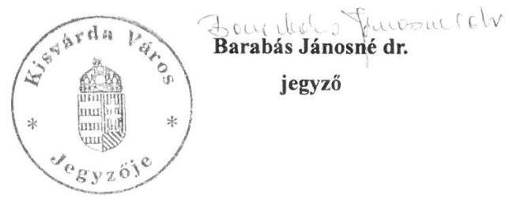

---

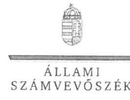

ELNÖK

# Barabás Jánosné dr. úrhölgy 

jegyző
Kisvárdai Közös Önkormányzati Hivatal

## Kisvárda

## Tisztelt Jegyzö Úrhölgy!

„A gyermekétkeztetés rendszerének ellenőrzése" címmel készített számvevőszéki jelentéstervezetre megküldött 3/6161-2/2019. számú észrevételeit köszönettel megkaptam.
Az Állami Számvevőszék észrevételekre vonatkozó álláspontjáról a felügyeleti vezető által készített részletes tájékoztatást csatoltan megküldöm.
Tájékoztatom Jegyző úrhölgyet, hogy a számvevőszéki jelentésben - az Állami Számvevőszékről szóló 2011. évi LXVI. törvény 29. § (3) bekezdése alapján - a figyelembe nem vett észrevételeket szerepeltetjük az elutasítás indokának feltüntetésével.

Budapest, 2019. július „£E” ?
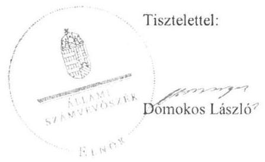

Melléklet: Tájékoztatás észrevételek kezeléséről

---

# Tájékoztatás észrevételek kezeléséről 

„A gyermekétkeztetés rendszerének ellenőrzése" címû jelentéstervezet (a továbbiakban: Jelentéstervezet) megállapításaira a 3/6161-2/2019. számú levélben megküldött észrevételét áttekintettem. Az észrevétel kezeléséről az alábbi tájékoztatást adom.
Jegyző úrhölgy az első észrevételében vitatja a Jelentéstervezet 16. oldal 1.2. számú megállapítás harmadik bekezdésében szereplő - a közbeszerzési eljárás vonatkozásában feltárt - hiányosságokat, miszerint „a közbeszerzések esetében a szabályszerűség a községi önkormányzatoknál érvényesült, azonban az erre kötelezett városi önkormányzatok egy része a Kbt. 1. 7. § (4) bekezdésében és a 19. § (1) bekezdésében előírtak, valamint a Kbt. 2. 8. § (4) bekezdése és a 21. § (1) bekezdése előírásai ellenére nem folytatott le a gyermekétkeztetésre közbeszerzési eljárást. Jegyző úrhölgy véleménye szerint - hivatkozással a közbeszerzésekről szóló 2015. évi CXLIII. törvény (a továbbiakban: Kbt.) 9. § (1) bekezdés h) pontjára - a Kisvárda Város Önkormányzata (a továbbiakban: Önkormányzat) és a gyermekétkeztetést biztosító 100%-os önkormányzati tulajdonú Kisvárdai Intézményműködtető Nonprofit Kft. (továbbiakban: Társaság) között létrejött szerződésre nem kellett alkalmazni a Kbt-t, vagyis nem kellett közbeszerzési eljárást lefolytatni.

Jegyző úrhölgy észrevételét - az alábbi indokolás alapján - nem fogadjuk el:
Az Önkormányzat az ellenőrzés részére rendelkezésre bocsátott 1. számú tanúsítvány, valamint nyilatkozata alapján megállapítást nyert, hogy a gyermekétkeztetést társulásos formában (Kisvárda és Térsége Szociális Szolgálat) biztosították, az élelmet a Társaságtól vásárolták. A Társaság településüzemeltetési feladatokat is ellátott.

Az ellenőrzési program alapján az Önkormányzattól bekérésre
 került a „Gyermekélelmezés vállalkozóval történt biztosítása esetén az ellenőrzött időszakra vonatkozó vállalkozói szerződés(ek), a szerződéskötést megelőző közbeszerzési ajánlattételi felhívás, az ajánlati dokumentációból a szerződésminta.” Az adatbekérés során Jegyző úrhölgy által tett „Teljességi és hitelességi nyilatkozat” (4. oldal) a meg nem küldött dokumentumok között sorolta fel az 1.17. ponthoz tartozó „A gyermekétkeztetés vállalkozóval történt biztosítása esetén vállalkozási szerződés” tételét. Az Önkormányzat a gyermekétkeztetés helyzetéről szóló beszámolóként megküldte a Társaság éves beszámolóit, melyek alapján az önkormányzattól származó bevételek minden évben meghaladták a Kbt-ben előírt 80%-ot. A beszámolókból azonban az nem állapítható meg, hogy a további bevételek milyen arányban származnak önkormányzati megrendelésből, illetve felmerül az a kérdés is, hogy az élelmezési bevételből felnőtt étkezési bevétel is származott-e a társaságnak. Az étkeztetésből származó bevétel összege nem azonos az önkormányzat által megadott étkezési számlák összesítőiben szereplő adatokkal. Ugyanakkor a társulásos feladatellátásra tekintettel a Társaság más önkormányzat élelmezését is biztosíthatta, amelyre vonatkozóan az ellenőrzés – dokumentum (társulási megállapodás, vállalkozóval kötött szerződés) hiányában – szintén nem rendelkezik információval. Összességében az önkormányzattól származó bevételek a Kbt-ben előírt 80%-ot meghaladó aránya nem igazolt.

---

Az adatbekérés során az ellenőrzés rendelkezésére bocsátott dokumentumokból kitűnik, hogy az Önkormányzat a 2014. évben 148.990.851,- Ft, a 2015. évben 152.916.171,- Ft, a 2016. évben pedig 182.063.738,- Ft értékben vett igénybe gyermekétkeztetési szolgáltatást közbeszerzési eljárás lefolytatása nélkül.

A 2014. évi kötelezettségvállalás idején hatályos, a közbeszerzésekről szóló 2011. évi CVIII. törvény (a továbbiakban: régi Kbt.) 6. §-a (1) bekezdésének c) pontja alapján a Kbt. alanyi hatálya alá tartozó szervezetként az Önkormányzat megsértette a régi Kbt. 5. §-a alapján fennálló, a régi Kbt. 19. §-ában előírt közbeszerzési eljárás lefolytatásának kötelezettségét. A 2015. és 2016. évi kötelezettségvállalások idején hatályos, Kbt. 5. §-a (1) bekezdésének c) pontja alapján a Kbt. alanyi hatálya alá tartozó szervezetként az Önkormányzat megsértette a Kbt. 4. §-ában előírt közbeszerzési eljárás lefolytatásának kötelezettségét.

Jegyző úrhölgy a második észrevételében nem vitatja a Jelentéstervezet (16. oldal 1.2. számú megállapítás hatodik bekezdésében szereplő) helyénvalósági szempontok szerint tett azon megállapítását, miszerint „A városi és községi önkormányzatok nem helyénvalóan jártak el, mivel saját hatáskörükben nem értékelték a gyermekétkeztetés igénybevevőinek elégedettségét az étkeztetés színvonalával és minőségével kapcsolatban.” Arról ad tájékoztatást, hogy az Önkormányzat mely tényezők miatt mellőzte a felmérést.

A tájékoztatást tudomásul vettük. Mivel az észrevétel nem kapcsolódik a Jelentéstervezet megállapításaihoz, a Jelentéstervezet módosítására nem kerül sor.

Jegyző úrhölgy a harmadik észrevételében megerősíti a Jelentéstervezet (17. oldal 1.3. számú megállapítás ötödik bekezdésében szereplő) azon helyénvalósági szempontok szerint tett megállapítását, miszerint „Az ellenőrzött időszakban a városi és községi önkormányzatok nem megfelelően jártak el, mivel a gyermekétkeztetési feladat-ellátás hatékonyságát, eredményességét az önkormányzatok belső ellenőrzése nem ellenőrizte, továbbá nem végzett ellenőrzést a feladatot szerződés alapján ellátó, ételkészítést végző vállalkozásoknál. Emellett az önkormányzatok jelentős részénél a belső ellenőrzés nem folytatott le a gyermekétkeztetés feladat ellátásának szabályszerűségére, a szükséges feltételek biztosítására vonatkozó belső ellenőrzést a polgármesteri hivatalnál, valamint a gyermekétkeztetést biztosító intézményeknél. Mindezek alapján a belső ellenőrzés működése kockázatot hordozott.” Tájékoztatásában felsorolja a gyermekétkeztetést végző Társaságnál 2016. évtől végzett belső ellenőrzési tevékenységet, továbbá indokolja, hogy az Önkormányzat mely tényezők miatt mellőzte a Társaság ellenőrzését.

A tájékoztatást tudomásul vettük. Mivel az észrevétel nem kapcsolódik a Jelentéstervezet megállapításaihoz, a Jelentéstervezet módosítására nem kerül sor.

Budapest, 2019. július 2…

Dr. Pulay Gyula felügyeleti vezető

---

Tárgy: észrevétel „A gyermekétkeztetés rendszerének ellenőrzése” jelentéstervezethez Hiv.sz: EL-0687-1083/2019

Válaszában hivatkozzon az ügyiratszámunkra!

# Állami Számvevőszék 

Domokos László elnök részére

Budapest
Apáczai Csere János u. 10.
1052

## Tisztelt Elnök Úr!

„A gyermekétkeztetés rendszerének ellenőrzése” című jelentéstervezetet fenti hivatkozási számú levelében megküldte Önkormányzatunk részére, melyre az alábbi észrevételt teszem.

A Jelentéstervezet II. számú Függeléke 3. pontja szerint „az önkormányzatok nem tartották be a Gyvt. 151. § (3) bekezdés előírásait, és a gyermekétkeztetés térítési díját nem az élelmezés nyersanyagának egy ellátottra jutó napi összege alapján állapították meg”.

Budapest Főváros XV. Kerületi Önkormányzata a gyermekétkeztetés térítési díját az élelmezés nyersanyagának egy ellátottra jutó napi összege alapján állapította meg. A 2018. áprilisában 1.4.4. és az 1.4.5. számon rendelkezésre bocsátott mellékletekben (előterjesztés a személyes gondoskodást nyújtó alapellátásba tartozó gyermekek napközbeni ellátása keretében biztosított étkeztetésről és az intézményi térítés díjairól szóló 5/1998. (III. 24.) ök. rendelet módosításáról) önkormányzatunk hivatkozik a Gyvt. 151. § (3) bekezdésre.

Az 1.4.5. számú melléklet 4. oldala mutatja be a nyersanyagköltség egy ellátottra jutó napi összegét (nyersanyagnorma), és ennek alapján került az ök. rendeletben megállapításra az intézményi térítési díj 27%-os ÁFA-val növelt összege. Tisztában vagyunk azzal, hogy az intézményi térítési díj az ÁFA nélküli összeg, azonban a gyakorlati tapasztalatok alapján, a személyi térítési díj könnyebb megállapításának érdekében (intézmények és szülők segítségére egyaránt) került meghatározásra ebben a formában.

A Jelentéstervezet II. számú Függeléke 20. pontja szerint „A belső ellenőrzés működtetése a helyénvalósági kritériumok szerint is kockázatot hordozott. Az ellenőrzött időszakban a városi és községi önkormányzatok nem megfelelően jártak el, mivel a gyermekétkeztetési feladat-ellátás hatékonyságát, eredményességét az önkormányzatok belső ellenőrzése nem ellenőrizte, továbbá nem végzett ellenőrzést a feladatot szerződés alapján ellátó, ételkészítést végző vállalkozásoknál. Emellett az önkormányzatok jelentős részénél a belső ellenőrzés nem folytatott le a gyermekétkeztetés feladat ellátásának szabályszerűségére, a szükséges feltételek biztosítására vonatkozó belső ellenőrzést a polgármesteri hivatalnál, valamint a gyermekétkeztetést biztosító intézményeknél.”

---

Az Állami Számvevőszék Ellenőrzési programja szerint a Helyénvalósági kritérium a következő volt: „Az önkormányzat belső ellenőrzésének az ellenőrzött időszakban legalább egyszer a helyszínen ellenőriznie kell a gyermekétkeztetés feladat ellátásának szabályszerűségét, hatékonyságát, eredményességét minden gyermekétkeztetést nyújtó intézménynél, beleértve az intézményként működő főzőkonyhát, illetve a vásárolt élelmezést nyújtó vállalkozót, amennyiben a vállalkozói szerződés erre lehetőséget biztosít.”

Az ellenőrzés adatforrásait (dokumentumait) a 2018. március 23-án kelt levelüknek megfelelően maradéktalanul megküldtük. A csatolt dokumentumok szerint a vizsgált időszakban nem csak egy, hanem négy darab belső ellenőrzést is végzett az önkormányzatunk Gazdasági Működtetési Központjának (továbbiakban: GMK) Belső Ellenőrzési Csoportja.

A vizsgálatokat azért nem a Polgármesteri Hivatal Belső Ellenőrzési Osztálya végezte, mivel a gyermekétkeztetési feladat ellátását GMK végzi. Az önkormányzat belső ellenőrzési egységei az éves ellenőrzési tervek kidolgozása során figyelembe veszik a Pénzügyminisztérium által minden évben kiadott Útmutatót a költségvetési szervek belső kontrollrendszeréről és belső ellenőrzéséről szóló 370/2011. (XII. 31.) Korm. rendelet alapján összeállítandó éves ellenőrzési terv és összefoglaló éves ellenőrzési terv, valamint éves ellenőrzési jelentés és éves összefoglaló ellenőrzési jelentés elkészítéséhez. Az Útmutató szerint a fejezetet irányító szervek (Hivatal belső ellenőrzési egysége) és az irányított szervek ellenőrzési egységeinek együttműködésének fokozásával meg kell teremteni az ellenőrzöttek lehető legkisebb ellenőrzésből adódó leterheltségét. Törekedni kell az ellenőrzési lefedettség növelésére. A fejezetet irányító szerv belső ellenőrzési vezetője és az adott fejezet irányítása alá tartozó költségvetési szervek belső ellenőrzési vezetői közötti egyeztetés során törekedni kell a fejezeti szintű lefedettség növelésére és az átfedések, párhuzamosságok elkerülésére.

Az államháztartásról szóló 2011. évi CXCV. törvény 70. § (1) bekezdése határozza meg, hogy az önkormányzat belső ellenőrzése mely szerveknél végezhet vizsgálatot. A feladatot szerződés alapján ellátó, ételkészítést végző vállalkozásoknál hatáskör hiányában nem folytatható „belső” ellenőrzés.

A GMK Belső Ellenőrzési Csoportja 2014. évben teljesítmény vizsgálatot végzett arra vonatkozóan, hogy megtörtént-e az intézmények egységes közétkeztetési rendszerének kialakítása, működtetése és az megfelel-e a fenntartói elvárásoknak. 2015. évben pénzügyi ellenőrzést folytattak arra vonatkozóan, hogy a gyermekétkeztetési állami normatíva igénylés előkészítésének, módosításának, elszámolásának rendszere megfelel-e a jogszabályi előírásoknak. 2016. évben két rendszerellenőrzést is végeztek a saját konyhák üzemeltetésének vizsgálata témájában mind a három konyhára vonatkozóan.

Álláspontunk szerint önkormányzatunk az elvárt helyénvalósági kritériumot jelentősen túl is teljesítette, hiszen a vizsgált időszakban minden évben vizsgálta a gyermekétkeztetés témakörét. A pénzügyi, teljesítmény és rendszer vizsgálatok során a belső ellenőrök számos kiemelt javaslatot is megfogalmaztak, mellyel javították a gyermekétkeztetés feladat ellátásának hatékonyságát és eredményességét. Az ellenőrzöttek minden esetben elkészítették az intézkedési tervet, melyek mind a szakmai, mind a formai kritériumoknak teljes mértékben megfeleltek. Az intézkedési tervben meghatározott feladatok végrehajtásáról a jogszabálynak megfelelően a beszámolás is megtörtént. A 2018. augusztus 21-én kelt levelük mellékletében táblázatban szerepeltetett két belső ellenőrzéssel kapcsolatosan megküldtük a szükséges intézkedési terveket, beszámolókat, nyomon követési ellenőrzési táblázatokat.

---

# Függelékek

A fentiekből megállapítható, hogy a XV. kerületi önkormányzat az ÁSZ által elvárt monitoring tevékenységet (belső ellenőrzés) teljes mértékben teljesítette.

Kérem, hogy az általunk beküldött dokumentumokat szíveskedjenek figyelembe venni, és a fentiek alapján észrevételüket megvizsgálni szíveskedjenek.

Budapest, 2019. június 10.

Tisztelettel,

*Németh Angéla*

polgármester

Tisztelett: V. Lémányozó - Fertőjessz levelemre

---

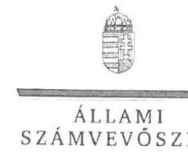

ELNÖK

# Németh Angéla úrhölgy 

polgármester

## Budapest Főváros XV. Kerület   Rákospalota, Pestújhely, Újpalota Önkormányzata

## Budapest

## Tisztelt Polgármester Úrhölgy!

„A gyermekétkeztetés rendszerének ellenőrzése” címmel készített számvevőszéki jelentéstervezetre megküldött 5/415-5/2019. ügyiratszámú észrevételeit köszönettel megkaptam.
Az Állami Számvevőszék észrevételekre vonatkozó álláspontjáról a felügyeleti vezető által készített részletes tájékoztatást csatoltan megküldöm.
Tájékoztatom Polgármester úrhölgyet, hogy a számvevőszéki jelentésben - az Állami Számvevőszékről szóló 2011. évi LXVI. törvény 29. § (3) bekezdése alapján - a figyelembe nem vett észrevételeket szerepeltetjük az elutasítás indokának feltüntetésével.

Budapest, 2019. július 1.

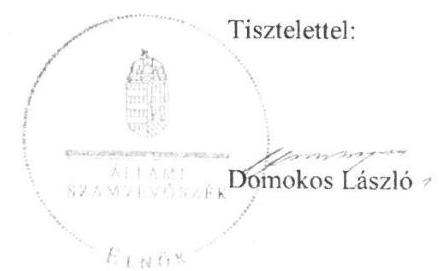

Melléklet: Tájékoztatás észrevételek kezeléséről

---

# Tájékoztatás észrevételek kezeléséről 

„A gyermekétkeztetés rendszerének ellenőrzése” című jelentéstervezet (a továbbiakban: Jelentéstervezet) megállapításaira az 5/415-5/2019. számú levélben megküldött észrevételét áttekintettem. Az észrevétel kezeléséről az alábbi tájékoztatást adom.

Polgármester úrhölgy az első észrevételében vitatja a Jelentéstervezet 15. oldal 1.1. számú megállapítás második bekezdésében szereplő - a térítési díj megállapítás kapcsán feltárt - hiányosságokat. „Azon városi és a községi önkormányzatoknál, amelyek megalkották a Gyvt.-ben előírt rendeletet, a legjellemzőbb szabályszerűségi hiba volt, hogy az önkormányzatok nem tartották be a Gyvt. 151. § (3) bekezdés előírásait, és a gyermekétkeztetés térítési díját nem az élelmezés nyersanyagköltségének egy ellátottra jutó napi összege alapján állapították meg.” Ugyanakkor elismeri, hogy a rendeletben a térítési díjat ÁFA-val növelt összegben határozták meg.
Polgármester úrhölgy észrevételét - az alábbi indokolás alapján - nem fogadjuk el:
Az Önkormányzat a gyermekétkeztetés térítési díját a gyermekek védelméről és a gyámügyi igazgatásról szóló 1997. évi XXXI. törvény (a továbbiakban: Gyvt.) előírásainak megfelelően térítési díj rendeletben határozta meg. A térítési díj rendelet ellenőrzési időszakban történő módosításához az Önkormányzat előterjesztést készített, melyben a térítési díjakat ellátás fajtánként (óvoda, iskola, középiskola, bölcsőde) meghatározta. A 2016. szeptember 13. előtt érvényes térítési díjakat azonban nem támasztotta alá a Gyvt. 147. § (1), (2) bekezdése szerinti számításokkal. (A 2016. szeptember 13. előtti időszak térítési díjainak megalapozását igazoló dokumentumok nem kerültek megküldésre).

A 2016. szeptember 13-tól érvényes térítési díj meghatározása során az Önkormányzat nem megfelelően alkalmazta a Gyvt. 151. § (3) bekezdés azon előírásait, amely szerint a térítési díj alapja az élelmezés
 nyersanyagköltségének egy ellátottra jutó napi összege, tekintettel arra, hogy ÁFA-val növelt összeget határozott meg. Megállapítható továbbá, hogy a térítési díj rendeletben az Önkormányzat egy ellátotti napra esedékes díjak meghatározása során nem megfelelően alkalmazta a 328/2011. (XII. 29.) Korm. rendelet 5. § (2) bekezdése szerinti kerekítési szabályokat, mivel - az 1 és 2 forintos címletű érmék bevonása következtében - a díjak nem 0 Ft-ra illetve 5 Ft-ra lettek kerekítve. Fentiek alapján helytálló a jelentéstervezet hivatkozott megállapítása.

Polgármester úrhölgy a második észrevételében kifogásolta a Jelentéstervezet 17. oldal 1.3. számú megállapítás ötödik bekezdésében szereplő helyénvalósági szempontok szerint tett megállapítását, miszerint „Az ellenőrzött időszakban a városi és községi önkormányzatok nem megfelelően jártak el, mivel a gyermekétkeztetési feladat-ellátás hatékonyságát, eredményességét az önkormányzatok belső ellenőrzése nem ellenőrizte, továbbá nem végzett ellenőrzést a feladatot szerződés alapján ellátó, ételkészítést végző vállalkozásoknál. Emellett az önkormányzatok jelentős részénél a belső ellenőrzés nem folytatott le a gyermekétkeztetés feladat ellátásának szabályszerűségére, a szükséges feltételek biztosítására vonatkozó belső ellenőrzést a polgármesteri

---

hivatalnál, valamint a gyermekétkeztetést biztosító intézményeknél. Mindezek alapján a belső ellenőrzés működtetése kockázatot hordozott." Hivatkozással az ÁSZ ellenőrzési program helyénvalósági kritériumára és az adatbekérés során megküldött ellenőrzési dokumentumokra, felsorolta az Önkormányzat belső ellenőrzése által ellátott gyermekétkeztetést ellenőrző tevékenységeit, illetve a vállalkozónál megállapította az ellenőrzési hatáskör hiányát.
Az Önkormányzat által megküldött dokumentumok alapján megállapítást nyert, hogy gyermekétkeztetési feladatait saját konyhák üzemeltetésével, valamint vállalkozó által biztosította. Az Önkormányzat az ellenőrzött időszakban két alkalommal ellenőrizte a gyermekétkeztetési feladatellátás szabályszerűségét, a 2014. évben a közétkeztetési rendszer kialakítását, működtetését, a 2015. évben a gyermekétkeztetéssel kapcsolatos normatíva elszámolást ellenőrizte. Az ellenőrzések eredményeként a belső ellenőrzés javaslatokat tett, melyekről az intézmények intézkedési tervet készítettek, annak végrehajtásáról beszámoltak a belső ellenőrzés felé. A belső ellenőrzés eredményeként a gyermekétkeztetés színvonala javult. A belső ellenőrzések azonban a hivatkozott helyénvalósági kritériumok szerint - a gyermekétkeztetés hatékonyságára, eredményességére nem terjedtek ki.
Az ÁSZ ellenőrzési program helyénvalósági kritériumában a vásárolt élelmezést nyújtó vállalkozások ellenőrzését abban az esetben szerepelteti, amennyiben a vállalkozói szerződés erre lehetőséget biztosít. Az Önkormányzat vállalkozóval kötött szerződése nem tartalmaz erre vonatkozó lehetőséget. Fentiek alapján helytálló a jelentéstervezet hivatkozott megállapítása.

Budapest, 2019. július ,"...."

Dr. Pulay Gyula
felügyeleti vezető

---

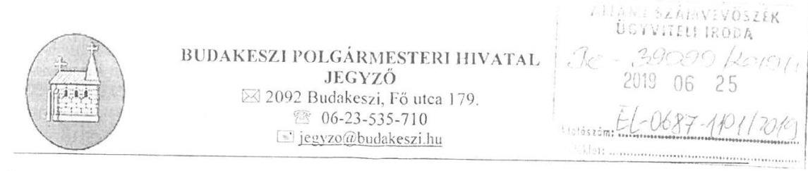

Ügyintéző: Rétfalvi Zoltán
Telefon: 06-23/535-710
Iktatószám: 2564-2/2019

Tárgy: 2018. évben gyermekétkeztetés ellenőrzése 2014-2016. évre visszamenőleg

Dr. Pulay Gyula felügyelet vezető úr részére
Állami Számvevőszék
1052 Budapest, Apáczai Csere János utca 10.

Tisztelt Dr. Pulay Gyula Úr!
Köszönjük a „Gyermekétkeztetés rendszerének ellenőrzésével” kapcsolatos munkájukat és észrevételeiket. Az elkészült jelentéstervezetben Budakeszi Városra vonatkozó megállapításokra az alábbi észrevételeket teszem.

Az 1. sz. Függelék a jelentéstervezethez

1. ponthoz

- A 328/2011. (XII.29.) Korm. rendelet 13. § (5) bekezdésében foglaltak szerinti 4. mellékletben előírt mód helyett a saját nyilvántartásunkat használta a gyermekétkeztetéssel megbízott intézmény, amelyben napi szinten vitték fel a gyermekek adatait és aláírással igazolták a fogyasztást, tehát ellenőrzés szempontjából a Winszoc rendszerben lévő adatokkal összevethető, ezáltal a támogatásra felhasznált összeg jogosultsága bizonyítható.
- A 328/2011. (XII.29.) Korm. rendelet 7. melléklete szerinti nyilatkozatokkal 2016. évre a tavaszi szünetet kivéve rendelkezünk.

A II. számú Függelék a jelentéstervezethez
5. pontjához

- Budakeszi Város Önkormányzata, a Budakörnyéki Önkormányzati Társulás alapító tagjaként, a HÍD Szociális Család és Gyermekjóléti Szolgálat és Központ útján látja el és üzemelteti a környék településeivel a vonatkozó feladatokat. A gyermekek védelméről és a gyámügyi igazgatásról szóló 1997. évi XXXI. törvény (továbbiakban: Gyvt.) 104. § (1) és (5) bekezdésében foglalt feladatokat a Budakörnyéki Önkormányzati Társulás határozza meg és végzi az ellenőrzéseket, valamint a HÍD Szociális Család és Gyermekjóléti Szolgálat és Központ évente egy alkalommal éves beszámolót készít, amelyet megküld a Pest Megyei Kormányhivatal Gyámügyi és Igazságügyi Főosztály részére.

---

# 7. pontjához 

Figyelemmel a megfogalmazottakra, ismételten áttekintjük a vonatkozó időszakban készült belső ellenőrzési jelentésekben lévő megállapításokat és amennyiben még relevanciával bírnak; azokat természetesen javítjuk. Meg kívánjuk jegyezni, hogy a jelenleg hatályos jogszabályi mellékleteknek megfelelő dokumentációt használjuk.
11. pontjához

- A szünidei gyermekétkeztetésben érdekelt gyermekek szüleit személyre szóló levélben értesítjük az étkezés időtartamáról, helyéről, módjáról.

12. pontjához

- 328/2011. (XII.29.) Korm. rendelet 13/b. § szerint járunk el a következőkben, fenntartva a szünidő előtti személyre szóló értesítést.

17. és 18. pontjához
A megállapításokra figyelemmel felül fogjuk vizsgálni a szünidei gyermekétkeztetés számlája mellékleteként benyújtandó dokumentumok körét.

Budakeszi, 2019. június 14.
Tisztelettel:
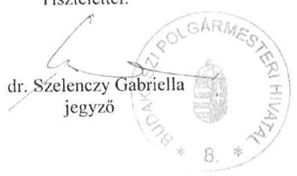

Készült kettő példányban:

1. Állami Számvevőszék
2. Irattár

---

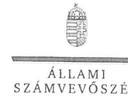

ELKÖK

Ikt.szám: EL-0687-1103/2019

dr. Szelenczy Gabriella úrhölgy
jegyző

Budakeszi Polgármesteri Hivatal

Budakeszi

Tisztelt Jegyző Úrhölgy!

„A gyermekétkeztetés rendszerének ellenőrzése” címmel készített számvevőszéki jelentéstervezetre megküldött 2564-2/2019. ügyiratszámú észrevételeit köszönettel megkaptam.

Az Állami Számvevőszék észrevételekre vonatkozó álláspontjáról a felügyeleti vezető által készített részletes tájékoztatást csatoltan megküldöm.

Tájékoztatom Jegyző úrhölgyet, hogy a számvevőszéki jelentésben – az Állami Számvevőszékről szóló 2011. évi LXVI. törvény 29. § (3) bekezdése alapján – a figyelembe nem vett észrevételeket szerepeltetjük az elutasítás indokának feltüntetésével.

Budapest, 2019. július „/i/.”

Tisztelettel:

Dómokos László

Melléklet: Tájékoztatás észrevételek kezeléséről

1152 BUDAPEST, AFRICZAI CSERÉ JÁNGG UTCA 15. 1364 Budapest 4. Pf. 54 telefon: 484 9101 fax: 484 9201

---

# Tájékoztatás észrevételek kezeléséről 

„A gyermekétkeztetés rendszerének ellenőrzése” címû jelentéstervezet (a továbbiakban: Jelentéstervezet) megállapításaira a 2564-2/2019. iktatószámú levélben megküldött észrevételeit értékeltem. Az észrevételek kezeléséről az alábbi tájékoztatást adom.

Jegyző úrhölgy az első észrevételében vitatja a Jelentéstervezet 29. oldal I. számú függelék 1) pont - „Budakeszi Város Önkormányzata éves költségvetési beszámolójának adatai szerint szünidei gyermekétkeztetés támogatást használt fel 505305 Ft összegben. Az önkormányzat a szünidei gyermekétkeztetés igénybevételéről nyilvántartással rendelkezett, azonban a szünidei gyermekétkeztetés igénybevételét a tavaszi, a nyári, az őszi, és a téli szünetre vonatkozóan a 328/2011. (XII. 29.) Korm. rendelet 13. § (5) bekezdésében foglalt előírás ellenére a Korm. rendelet 4. mellékletében előírt módon nem dokumentálta. A Gyvt. 21/C. §-a szerinti szünidei gyermekétkeztetés igénybevételének dokumentumaival, a 328/2011. (XII. 29.) Korm. rendelet 7. melléklete szerinti nyilatkozatokkal nem rendelkezett.” a gyermekétkeztetéshez igénybe vett támogatás dokumentálása kapcsán feltárt - hiányosságokat.
Az észrevétele szerint az Önkormányzat rendelkezik olyan nyilvántartással, amely - bár nem a jogszabályban előírt mód szerint vezetik - alkalmas a támogatás felhasznált összegének igazolására. A 2016. évben a szünidei gyermekétkeztetés igényléséről szóló nyilatkozatok kapcsán feltárt hiányosságot azonban csak a tavaszi szünetre vonatkozóan ismeri el. Jegyző úrhölgy hatodik észrevétele kapcsolódik a függelék 1) pontját alátámasztó megállapításokhoz: Jelentéstervezet 19. oldal 2.2. számú megállapítás első bekezdés „2016. évi éves költségvetési beszámolóikban elszámolták, azonban jellemző szabályszerűségi hiba volt, hogy:

- a szülő/más törvényes képviselő által a Gyvt. 21/C. §-a szerinti szünidei gyermekétkeztetés igénybevételéhez kitöltött, a 328/2011. (XII. 29.) Korm. rendelet 7. melléklete szerinti nyilatkozatokkal az önkormányzatok nem rendelkeztek; továbbá"
- a szünidei gyermekétkeztetés igénybevételéről a 328/2011. (XII. 29.) Korm. rendelet 13. § (5) bekezdésében foglalt előírás ellenére a tavaszi, a nyári, az őszi, illetve a téli szünetre vonatkozóan a Korm. rendelet 4. melléklete szerinti dokumentációval nem rendelkeztek.”
melyekkel kapcsolatban arról adott tájékoztatást, hogy a szünidei gyermekétkeztetés számlája mellékleteként benyújtandó dokumentumok körét felülvizsgálják.
Jegyző úrhölgy észrevételét - az alábbi indokolás alapján - nem fogadjuk el:
Az Állami Számvevőszék (a továbbiakban: ÁSZ) az EL-0687-139/2018. iktatószámú levelében az Önkormányzatot adatszolgáltatásra kérte fel. A levél 2. számú melléklet Dokumentumjegyzéke részletesen tartalmazta a beküldendő dokumentumok körét, nagyszámú dokumentum esetén pontosította a dokumentumok számát is. A Dokumentumjegyzék 1.29 pontjában kértük az önkormányzatot, hogy mutassa be a kialakított gyakorlatát, illetve nevesítésre került a szünidei

---

gyermekétkeztetés igénybevételét igazoló dokumentumok köre, annak megfelelően, hogy az önkormányzat egy- vagy több igénybevételi helyet biztosított-e. Egy igénybevételi hely esetében kértük a 328/2011. (XII. 29.) Korm. rendelet 4. melléklete szerinti dokumentáció szünetenkénti másolatát megküldeni.
Az ÁSZ részére megküldött 1.29 elnevezésű fájl szöveges leírása szerint az Önkormányzat 2016. évben csak a nyári szünetre vonatkozóan rendelkezett adatokkal. Megjegyzem ez ellentmondásban van Jegyző úrhölgy észrevételében foglaltakkal, melyben a tavaszi szünetre vonatkozó nyilatkozatok hiányosságát ismerte el. Az önkormányzat gyakorlata szerint egy igénybevételi helyet biztosít, ugyanakkor a több igénybevételi helynek megfelelő kritérium alapján csatolt 3 dokumentumot. A 2016. nyári gyermekétkeztetés június 22-25. című dokumentumot és 2 db a listához kapcsolódó második és utolsó igénybevevő nyilatkozatát. Megjegyezem, hogy a lista 20. sorszámán nevesített gyermek születési adata nem egyezik a gyermek nyilatkozaton feltüntetett születési adatával.

Jegyző úrhölgy a hivatkozott adatbekérés során teljességi és hitelességi nyilatkozatot állított ki a megküldött dokumentumokról, melynek 13. pontja tartalmazza a Dokumentumjegyzék 1.29 pontjában kért tételt. A Kért dokumentumok megnevezése sorban a Dokumentumjegyzék 1.29 pontjában feltüntetett szövegrész került megismétlésre, míg az ÁSZ részére megküldött dokumentumok mezőben „A tárgy szerinti dokumentumok” bejegyzés szerepel, melyek részletezése elmaradt. A nyilatkozatban jegyző úrhölgy azt ismeri el, hogy a nyilatkozat mellékletében felsorolt dokumentumok, adatok megbízhatóak, és a bekért adatokra, dokumentumokra vonatkozóan teljes körű információt tartalmaznak. Az ÁSZ az ellenőrzést rendelkezésére bocsátott - fentebb részletezett - dokumentumok vizsgálatával végezte el, melyek alapján a jelentéstervezet hivatkozott megállapítása helytálló.

Jegyző úrhölgy a második, harmadik, negyedik és ötödik észrevételeiben tájékoztatást ad a belső ellenőrzési tevékenység ellátásáról, a belső ellenőrzés kapcsán vezetett nyilvántartásokról, és a szünidei gyermekétkeztetéssel kapcsolatban az igénybevevők tájékoztatási gyakorlatának felülvizsgálatáról, továbbá a jelentéstervezetben megfogalmazott megállapítások jövőbeni hasznosításáról.
Jegyző úrhölgy tájékoztatását tudomásul vettem. Mivel az észrevételek nem kapcsolódnak a jelentéstervezet megállapításaihoz, a Jelentéstervezet módosítására nem kerül sor.

Budapest, 2019. július, 10.”
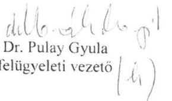

---

# Komádi Városi Önkormányzat   4138 Komádi, Hősök tere 4.   Tel.: (54) 545-020, Fax: (54) 545-022   Email: phkomadi@z-online.hu 

Ügyiratszám: 6416-2/2019
Hivatkozási szám: EL-0687-1083/2019.
Tárgy: észrevételek „A gyermekétkeztetési rendszerének ellenőrzése” címü jelentéstervezetben foglaltakra

Állami Számvevőszék
Budapest
Apáczai Csere János u. 10.
1052
Domokos László elnök úr részére
Tisztelt Elnök Úr!
Az Állami Számvevőszékről szóló 2011. évi LXVI. törvény 29. § (2) bekezdése alapján az „A gyermekétkeztetés rendszerének ellenőrzése” címü, El-0687-1082/2019 iktatószámú, 2487 témaszámú és V0785 ellenőrzés-azonosító számú számvevőszéki jelentéstervezetben foglaltakra a törvény szerinti határidőben a Komádi Városi Önkormányzatot (4138 Komádi, Hősök tere 4.) érintő megállapításokra az alábbi észrevételeket tesszük:

A jelentéstervezet I. sz. függelékének 4. pontjában foglaltakkal kapcsolatban nyilatkozunk, hogy Önkormányzatunk a 328/2011 (XII.29.) Korm. rendelet (a továbbiakban: Korm. rendelet) 13. § (5) bekezdésében foglaltakkal összhangban a szünidei gyermekétkeztetés igénybevételét az ellenőrzéssel érintett 2016.-os év vonatkozásában mind a tavaszi, a nyári, az őszi és a téli szünetre vonatkozóan is megfelelően dokumentálta, azonban adminisztrációs hiba miatt az ellenőrzés során a Korm. rendelet 4. mellékletében foglalt dokumentáció nem került megküldésre, melyet pótlólag csatoltan megküldünk. Az adminisztrációs hibaért szíves elnézésüket kérjük.

Tájékoztatjuk továbbá a Tisztelt Állami Számvevőszéket, hogy Komádi Városi Önkormányzat Képviselő-testülete a személyes gondoskodás körébe tartozó ellátások és gyermekétkeztetés intézményi térítési díjának megállapításáról 10/2012.(IV.27.) önkormányzati rendeletének 10/2016 (V.27.) önkormányzati rendeletével történő módosításával - a rendeletbe az 1/A § beiktatásával - úgy döntött, hogy a Gyvt. 21/C. § (1) bekezdés b) pontja szerinti, a rendszeres gyermekvédelmi
 kedvezményre jogosult gyermekek részére a szülő, törvényes képviselő kérelmére az Önkormányzat a szünidei gyermekétkeztetés keretében a déli meleg főétkezést ingyenesen biztosítja. A Korm. rendelet 4. melléklete szerinti nyomtatvány vezetése során - a képviselő-testület döntésének megfelelően - ezen gyermekek vonatkozásában is ugyanúgy díjmentesesség került kimutatásra, mint a Gyvt. szerinti ingyenes jogosultak tekintetében. A Képviselő-testület fenti döntése miatt, a központi normatív támogatások és az önkormányzat által saját hatáskörben, saját forrásból biztosított fentiek szerinti támogatás megfelelő elkülöníthetősége miatt az igénybevétel kapcsán a Korm. rendelet 4. melléklete szerinti adatlap a különböző jogcímeken jogosultak vonatkozásában elkülönítetten került vezetésre, amely alapján a szolgáltató által benyújtott számlák adattartalmának egyezősége is megfelelően nyomon követhetővé, ellenőrizhetővé vált.

---

# Komádi Városi Önkormányzat   4138 Komádi, Hősök tere 4.   Tel.: (54) 545-020, Fax: (54) 545-022   Email: pkomadfdz-online.hu 

A jelentéstervezet II. függelékében Komádi Városi Önkormányzatot érintő megállapításokra az alábbiakról nyilatkozunk:
4. Önkormányzatunk a gyermekek védelméről és a gyámügyi igazgatásról szóló 1997. évi XXXI. törvény (a továbbiakban: Gyvt.) 21. §-a szerinti gyermekétkeztetést (ide értve a Gyvt. 21/A §-a szerinti intézményi és a Gyvt. 21/C §-a szerinti szünidei gyermekétkeztetést is) az Önkormányzat 100%-os, kizárólagos tulajdonában álló Komorthon Komádi Idősek Otthona és Gyermekélelmezési Nonprofit Közhasznú Kft.-vel (4138 Komádi, Hősök tere 10/2., a továbbiakban: Kft.) kötött ellátási szerződés alapján, vásárolt szolgáltatásként biztosítja.

A közbeszerzésekről szóló 2015. évi CXLIII. törvény (a továbbiakban: Kbt.) 9. § (1) bekezdés h.) pontja szerint az ilyen beszerzésekre - ún. „in house beszerzés" - a Kbt. előírásait nem kell alkalmazni, azaz a vásárolt gyermekétkeztetési szolgáltatás kizárólagosan önkormányzati tulajdonú nonprofit Kft.-tól való vásárlása esetén az Önkormányzat közbeszerzési eljárás lefolytatására nem volt kötelezett. Az Önkormányzat a Kft.-vel való ellátási szerződés megkötése során vizsgálta a Kbt. 9. § (1) bekezdés h.) pontjában foglalt feltételek fennállását, és megállapította, hogy Kft.-vel való szerződéskötés az abban foglalt, a Kbt. szerinti kivételeknek megfelel, mivel

- a Kft. felett Komádi Városi Önkormányzat - kizárólagos tulajdonosként a saját szervezeti egységei felettihez hasonló kontrollt gyakorol, és így döntő befolyással rendelkezik annak stratégiai céljai meghatározásában és működésével kapcsolatos jelentős döntéseinek meghozatalában.
- a Kft.-ben közvetlen magántőke-részesedés: nincsen, mivel az önkormányzat 100%-os tulajdonában áll és
- a Kft. éves nettó árbevételének több mint 80%-a Komádi Városi Önkormányzattal vagy az Önkormányzat által kontrollált más jogi személlyel kötött vagy kötendő szerződések teljesítéséből származik, illetve a megkötendő szerződés során, annak becsült értékét is figyelembe véve, fog származni. (A Kft. egyébként ez alapján teljesíti a „közhasznú" jogállás megtartásához szükséges, külön jogszabályban meghatározott feltételeket is.)

5. Az Önkormányzat a gyermekétkeztetést nyújtó, az Önkormányzat 100%-os, kizárólagos tulajdonában álló Komorthon Komádi Idősek Otthona és Gyermekélelmezési Nonprofit Közhasznú Kft. gyermekétkeztetési tevékenységét a Gyvt. 96. § (6) bekezdése szerinti átfogó értékelés (gyermekvédelmi beszámoló) képviselő-testület általi tárgyalása és elfogadása alapján, valamint a Kft. számviteli törvény szerinti beszámolójának elfogadása kapcsán is minden évben értékelte, az előbb említett dokumentumban szakmai szempontból, míg az utóbbi során pénzügyi szempontból. A Gyvt. 96. § (6) bekezdése szerinti beszámoló 2. pont b.) és h.) alpontjai a jogosultak számát és az erre fordított költségvetési kiadások összegét is tartalmazza, míg a Kft. számviteli törvény szerinti beszámolójának kiegészítő melléklete és közhasznúsági jelentése is tartalmazza a gyermekétkeztetésre fordított kiadások, illetve az abból származó bevételek kimutatását.

A képviselő-testület minden év május 31.-éig az említett dokumentumokat külön-külön elfogadta, ezáltal - álláspontunk szerint, ha nem is a jogszabály szerinti formában külön nevesítve, de ténylegesen - megvalósult a Gyvt. 104. § (1) bekezdés e.) pontjában és 104. § (5) bekezdésében előírt szakmai, pénzügyi és hatékonysági ellenőrzés.

---

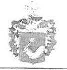

# Komádi Városi Önkormányzat 4138 Komádi, Hősök tere 4. 

Tel.: (54) 545-020, Fax: (54) 545-022
Email: pkkomadi@s-online.hu
(A Gyvt. 96. § (6) bekezdése szerinti beszámolók elfogadásáról szóló döntések az adatszolgáltatás során megküldésre kerültek, míg a Kft. éves, az irányító szerv jogkörében eljáró Komádi Városi Önkormányzat képviselő-testülete által jóváhagyott, számviteli törvény szerinti beszámolói pedig a közzétett beszámolók nyilvántartásában elektronikusan, nyilvánosan is hozzáférhetők.)

Egyébként meg kívánjuk jegyezni, hogy az Önkormányzat folyamatosan figyelemmel kíséri a gyermekétkeztetéssel kapcsolatos lakossági, szülői visszajelzéseket, és ezek alapján a lakosság (szülők, törvényes képviselők) részéről a gyermekétkeztetés színvonalára, a biztosított étel minőségére, mennyiségére vonatkozóan kifejezetten pozitív visszajelzések érkeztek, panasztételre vagy önkormányzati beavatkozást igénylő intézkedésre nem kellett, hogy sor kerüljön.
12. Az Önkormányzat jegyzője a Korm. rendelet szerinti határidőkben, minden alkalommal írásban, tértivevényes levél formájában tájékoztatta a hátrányos helyzetű gyermek szülőjét (törvényes képviselőjét) a gyermekétkeztetés lehetőségéről, ide értve a Gyvt. szerinti jogosultakat, valamint az Önkormányzat által saját hatáskörben, az I. függelék 4. pontjára adott észrevételben hivatkozott önkormányzati rendelet alapján jogosultakat is. Adminisztrációs hiba miatt az ellenőrzés során az ezt igazoló dokumentumok nem kerültek megküldésre, azonban ezeket - teljes körűen, az összes jogosult vonatkozásában a vizsgált időszakra - pótlólag megküldjük a jogszabályi kötelezettség teljesítésének igazolására. (A hiányos adatszolgáltatás miatt szíves elnézésüket kérjük.)
16. Önkormányzatunk a szünidei gyermekétkeztetés igénybevételéhez minden esetben, minden jogosult és igénybevevő vonatkozásában rendelkezett a Korm. rendelet 7. melléklete szerinti nyilatkozatokkal, sőt, azok egy példányát - másolatban - a gyermekétkeztetést biztosító Komotthon Komádi Idősek Otthona és Gyermekélelmezési Nonprofit Közhasznú Kft. részére is - a várható napi adagszámok tervezhetősége, a kötött szerződés alapján a gyermekétkeztetés megszervezése, lebonyolítása, illetve a jogosultságok igazolása céljából teljes körűen rendelkezésre bocsátotta. A szülői (törvényes képviselői) nyilatkozatok másolatát - teljes körűen, az összes jogosult és igénybevevő vonatkozásában a vizsgált időszakra - e levél mellékleteként pótlólag megküldjük, az eredeti adatszolgáltatás mellékleteként való megküldésének elmaradásáért ezúton szíves elnézésüket kérjük.
17.-18. Az e pontokban tett megállapításokra a jelentéstervezet I. függelékének 4. pontjában és az előző pontokban foglaltakra adott tájékoztatásunk irányadó, amely alapján megállapítható, hogy Önkormányzatunk a gyermekétkeztetés biztosításához szükséges minden, jogszabályban előírt dokumentummal rendelkezett, és az igénybevétel jogszerűsége álláspontunk szerint - ezek alapján megfelelően alátámasztott.
19. Az pontban tett megállapításokra a jelentéstervezet II. függelékének 5. pontjában foglaltakra adott tájékoztatásunk irányadó.
20. A vizsgált időszakban a gyermekétkeztetés vonatkozásában Önkormányzatunknál belső ellenőrzés valóban nem került lefolytatásra. Az éves belső ellenőrzési tervet a 370/2011 (XII.31.) Korm. rendelet (a továbbiakban: Bkr.) rendelkezéseinek megfelelően az Önkormányzat képviselő-testülete a belső ellenőrzési vezető javaslatára fogadja el. Önkormányzatunknál külső szervezet látja el a belső ellenőrzési feladatokat, és a szervezet a vizsgált időszakra vonatkozóan nem tett javaslatot a gyermekétkeztetés témakörében sem

---

# Komádi Városi Önkormányzat   4138 Komádi, Hősök tere 4,   Tel.: (54) 545-020, Fax: (54) 545-022   Email: phkomadíaz-online.hu 

rendszer-, sem utóellenőrzés lefolytatására, így a képviselő-testület az éves belső ellenőrzési tervek Bkr. 32. § (4) bekezdése szerinti elfogadása során ezt a célterületet nem jelölte ki ellenőrzési területként. A jövőben - megfontolva az ÁSZ javaslatait - a gyermekétkeztetés témakörében is javasolni fogjuk a belső ellenőrzést végző szervezet (belső ellenőrzési vezető) és a képviselő-testület részére az éves belső ellenőrzési terv elfogadása során rendszerellenőrzés lefolytatását.

Kérjük, hogy amennyiben lehetőség van rá, Önkormányzatunk fenti nyilatkozatait, és a korábban adminisztrációs hiba miatt megküldeni elmulasztott, de jelen észrevételekkel egyidejűleg pótlólagosan megküldött dokumentumokat a végleges jelentés összeállítása, és az esetleges intézkedésekre történő javaslattétel kapcsán figyelembe venni szíveskedjenek.

Komádi, 2019. június 20.
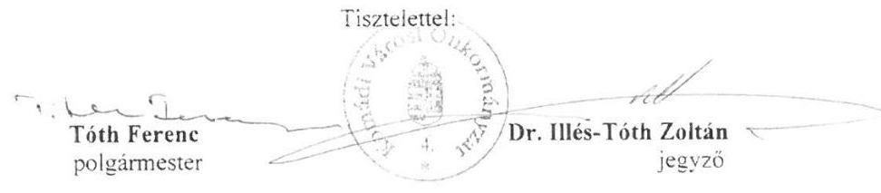

## Mellékletek:

- 1 db elektronikus adathordozó, amely elektronikus formában teljes körűen tartalmazza a jelen észrevételünkben foglaltakat alátámasztó, említett dokumentumokat

---

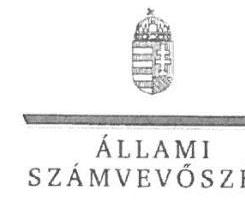

ELKÖK

# Tóth Ferenc úr 

polgármester

## Dr. Illés-Tóth Zoltán úr

jegyző

## Komádi Városi Önkormányzat

## Komádi

## Tisztelt Polgármester Úr! Tisztelt Jegyző Úr!

„A gyermekétkeztetés rendszerének ellenőrzése" címmel készített számvevőszéki jelentéstervezetre megküldött 6416-2/2019. ügyiratszámú észrevételeiket köszönettel megkaptam.
Az Állami Számvevőszék észrevételekre vonatkozó álláspontjáról a felügyeleti vezető által készített részletes tájékoztatást csatoltan megküldöm.
Tájékoztatom Polgármester urat és Jegyző urat, hogy a számvevőszéki jelentésben - az Állami Számvevőszékről szóló 2011. évi LXVI. törvény 29. § (3) bekezdése alapján - a figyelembe nem vett észrevételeket szerepeltetjük az elutasítás indokának feltüntetésével.

Budapest, 2019. július „. ".
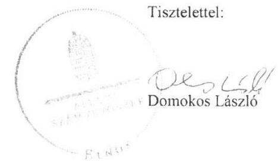

Melléklet: Tájékoztatás észrevételek kezeléséről

---

# Tájékoztatás észrevételek kezeléséről 

„A gyermekétkeztetés rendszerének ellenőrzése" című jelentéstervezet (a továbbiakban: Jelentéstervezet) megállapításaira a 6416-2/2019. ügyiratszámú levélben megküldött észrevételeket áttekintettem, értékeltem. Az észrevételek kezeléséről az alábbi tájékoztatást adom.

1) Az első észrevételben vitatják a Jelentéstervezet 29. oldal I. számú függelék 4) pont - „Komádi Városi Önkormányzat éves költségvetési beszámolójának adatai szerint szünidei gyermekétkeztetés támogatást használt fel 13.832.760 Ft összegben, a gyermekétkeztetés igénybevételéről dokumentummal rendelkezett, azonban a 328/2011. (XII. 29.) Korm. rendelet 13. § (5) bekezdésében foglalt előírás ellenére a szünidei gyermekétkeztetés igénybevételét a nyári, az őszi és a téli szünetre vonatkozóan a Korm. rendelet 4. mellékletében előírt módon nem dokumentálta. A Gyvt. 21/C. §-a szerinti szünidei gyermekétkeztetés igénybevételének dokumentumaival, a 328/2011. (XII. 29.) Korm. rendelet 7. melléklete szerinti nyilatkozatokkal nem rendelkezett." a gyermekétkeztetéshez igénybe vett támogatás dokumentálása kapcsán feltárt hiányosságokat. (Gyvt. - a gyermekek védelméről és a gyámügyi igazgatásról szóló 1997. évi XXXI. törvény)
Az észrevétel szerint az Önkormányzat rendelkezik a hivatkozott kormányrendelet szerinti nyilvántartással, azonban a dokumentáció adminisztrációs hiba miatt nem került megküldésre. A negyedik, ötödik, hatodik és hetedik észrevétel kapcsolódik a függelék 4) pontját alátámasztó megállapításokhoz: Jelentéstervezet 19. oldal 2.2. számú megállapítás első bekezdés „2016. évi éves költségvetési beszámolóikban elszámolták, azonban jellemző szabályszerűségi hiba volt, hogy:

- a szülő/más törvényes képviselő által a Gyvt. 21/C. §-a szerinti szünidei gyermekétkeztetés igénybevételéhez kitöltött, a 328/2011. (XII. 29.) Korm. rendelet 7. melléklete szerinti nyilatkozatokkal az önkormányzatok nem rendelkeztek; továbbá"
- a szünidei gyermekétkeztetés igénybevételéről a 328/2011. (XII. 29.) Korm. rendelet 13. § (5) bekezdésében foglalt előírás ellenére a tavaszi, a nyári, az őszi, illetve a téli szünetre vonatkozóan a Korm. rendelet 4. melléklete szerinti dokumentációval nem rendelkeztek."
melyekkel kapcsolatban arról adtak tájékoztatást, hogy az Önkormányzat rendelkezik a jogszabályok szerinti dokumentációval, azonban azok adminisztrációs hiba miatt nem kerültek megküldésre. Az elmulasztott adatszolgáltatást az észrevételekkel egyidejűleg megküldött elektronikus adathordozón (pen-drive) pótlólag kívánták teljesíteni.
Az (első, negyedik, ötödik, hatodik és hetedik) észrevételeket - a következő indokolás alapján - nem fogadom el.
Az Állami Számvevőszék (a továbbiakban: ÁSZ) az EL-0687-005/2018. iktatószámú levelében az ellenőrzés indításáról tájékoztatta az Önkormányzatot, az EL-0687-095/2018. iktatószámú levélben pedig az Önkormányzatot adatszolgáltatásra kérte fel. A levél 2. számú melléklet szerinti Dokumentumjegyzék részletesen tartalmazta a beküldendő dokumentumok körét, nagyszámú dokumentum esetén pontosította a dokumentumok számát is. A Dokumentumjegyzék 1.29 pont-
 (XII. 29.) Korm. rendelet 4. melléklete szerinti dokumentáció szünetenkénti másolatát és a listán szereplő második és utolsó igénylő Korm. rendelet 7. melléklet szerinti nyilatkozatokat megküldeni.
Polgármester úr a hivatkozott adatbekérés során teljességi és hitelességi nyilatkozatot állított ki (majd egy javított változatot is), melynek mellékletében a megküldött dokumentumokat részletezték. A melléklet 1-15. pontjai a megküldött dokumentumokat, 16-19. sorok pedig a kitöltött tanúsítványokat tartalmazták. A Dokumentumjegyzék 1.29. pontjában kért adatok nem kerültek megküldésre, a felsorolás (15. pont) a Dokumentumjegyzék 1.28. pontjában kért adatok részletezésével záródott. A nyilatkozatban Polgármester úr azt ismerte el, hogy az abban részletezett dokumentumok, adatok megbízhatóak, és a bekért adatokra, dokumentumokra vonatkozóan teljes körű információt tartalmaztak, illetve felelősséget vállalt - többek között - a beküldött dokumentumok hiánytalanságáért is. Ennek okán az ÁSZ további adatbekérést, hiánypótlást nem kezdeményezett. Az ÁSZ - az ellenőrzési program alapján lefolytatott - ellenőrzésének megállapításai az Önkormányzat által az ÁSZ rendelkezésére bocsátott dokumentumokon alapulnak. A vonatkozó 1.29. pontban részletezett dokumentumok hiányát az észrevételben Polgármester úr és Jegyző úr is hiányosságként ismerték el, melyek pótlására az észrevétel mellékleteként elektronikus adathordozóra feltöltött dokumentumok megküldésével utólagosan intézkedtek. A fenti nyilatkozatokra tekintettel a Jelentéstervezet észrevételezése során az ÁSZ részére adathordozón rendelkezésre bocsátott dokumentumokat nem áll módomban figyelembe venni, ennek megfelelően az elektronikus adathordozót tájékoztatóm mellékleteként visszaküldöm.
2) Polgármester úr és Jegyző úr a második észrevételben vitatják a Jelentéstervezet 16. oldal 1.2. számú megállapítás harmadik bekezdésében szereplő - a közbeszerzési eljárás vonatkozásában feltárt - hiányosságokat, miszerint „A közbeszerzések esetében a szabályszerűség a községi önkormányzatoknál érvényesült, azonban az erre kötelezett városi önkormányzatok egy része a Kbt. 1. 7. § (4) bekezdésében és a 19. § (1) bekezdésében előírtak, valamint a Kbt. 8. § (4) bekezdése és a 21. § (1) bekezdése előírásai ellenére nem folytatott le a gyermekétkeztetésre közbeszerzési eljárást.
Véleményük szerint - hivatkozással a közbeszerzésekről szóló 2015. évi CXLIII. törvény (a továbbiakban: Kbt.) 9. § (1) bekezdés h) pontjára - az Önkormányzat és a gyermekétkeztetést biztosító 100%-os önkormányzati tulajdonú Komotthon Komádi Idősek Otthona és Gyermekélelmezési Nonprofit Kft. (a továbbiakban: Komotthon Kft.) között létrejött szerződésre nem kell alkalmazni a Kbt-t, vagyis nem kellett közbeszerzési eljárást lefolytatni.
Az észrevételt - a következő indokolás alapján - nem fogadom el.
Az ellenőrzött időszakban az Önkormányzat az ellenőrzés részére rendelkezésre bocsátott 1. számú tanúsítványa szerint a gyermekétkeztetést a Komotthon Kft.-től vásárolta. A Komotthon Kft. egyedüli tagja - az OPTEN cégtár adatai szerint - Komádi Városi Önkormányzat volt. Az önkormányzattól bekérésre került az ellenőrzési program alapján a „gyermekélelmezés vállalkozóval történt biztosítása esetén az ellenőrzött időszakra vonatkozó vállalkozói szerződés(ek), a szerződéskötést megelőző közbeszerzési ajánlattételi felhívás, ajánlati dokumentációból a szerződésminta.” A megküldött dokumentumok alapján megállapítást nyert, hogy az Önkormányzat és a Komotthon Kft. 2013. december 19-én ellátási szerződést kötöttek. A szerződésben foglaltak szerint 2014. január 1-jétől a Komotthon Kft. biztosítja az önkormányzat illetékességi területén működő intézményekben a gyermekétkeztetést. Az Önkormányzat a 184/2013. (XII. 19.) ÖKT. sz. határozatával fogadta el a szerződést és hatalmazta fel a polgármestert a szerződés aláírására. Az Önkormányzat által feltöltött dokumentumok nem igazolták, hogy lefolytattak-e közbeszerzési eljárást.
Az Önkormányzat nem küldte be a Komotthon Kft. éves beszámolóit, az Elektronikus beszámoló oldalról (közhiteles nyilvántartás) kerültek letöltésre. A beszámolók adatai alapján kitűnik, hogy az önkormányzattól származó bevételek minden évben meghaladták a Kbt-ben előírt 80%-ot. A rendelkezésre álló (az önkormányzat által beküldött, valamint a közhiteles nyilvántartásokból elérhető) dokumentumokból azonban az nem állapítható meg, hogy az étkeztetési bevételek milyen arányban származnak önkormányzati megrendelésből, illetve miből származik a Komotthon Kft. gyermekélelmezésen felüli étkeztetési bevétele. Az éves beszámolók, a kiegészítő mellékletek, valamint a közhasznúsági beszámolók sem tartalmaztak információt arra vonatkozóan, hogy a „megrendelői étkeztetés” mely partnert jelenti.
Az önkormányzat által rendelkezésére bocsátott dokumentumokból kitűnik, hogy az Önkormányzat a 2014. évben 74.735.110,- Ft, a 2015. évben 80.052.280,- Ft, a 2016. évben pedig 88.182.008,- Ft értékben vett igénybe gyermekétkeztetési szolgáltatást közbeszerzési eljárás lefolytatása nélkül.
A 2014. évi kötelezettségvállalás idején hatályos, a közbeszerzésekről szóló 2011. évi CVIII. törvény (a továbbiakban: régi Kbt.) 6. §-a (1) bekezdésének c) pontja alapján a Kbt. alanyi hatálya alá tartozó szervezetként megsértette a régi Kbt. 5. §-a alapján fennálló, a régi Kbt. 19. §-ában előírt közbeszerzési eljárás lefolytatásának kötelezettségét.
A 2015. és 2016. évi kötelezettségvállalások idején hatályos, Kbt. 5. §-a (1) bekezdésének c) pontja alapján a Kbt. alanyi hatálya alá tartozó szervezetként az ellenőrzött szervezet megsértette a Kbt. 4. §-ában előírt közbeszerzési eljárás lefolytatásának kötelezettségét.
3) Polgármester úr és jegyző úr a harmadik észrevételben vitatják a Jelentéstervezet 16. oldal 1.2. számú megállapítás negyedik bekezdésében szereplő - a gyermekétkeztetés nyújtó szervezetek ellenőrzésével kapcsolatban feltárt hiányosságot. A megállapítás szerint: ,,A gyermekétkeztetés működésének felügyeletével kapcsolatos feladataikat a városi és a községi önkormányzatok nem megfelelően látták el, a Gyvt. 104. § (1) bekezdés e) pontjában és 104. § (5) bekezdésében előírtak ellenére nem ellenőrizték és évente egy alkalommal nem értékelték a szakmai munka eredményességét, a szakmai program végrehajtását, valamint a gazdálkodás szabályszerűségét és hatékonyságát a gyermekétkeztetést nyújtó szervezeteknél, illetve nem kötelezték arra, hogy tevékenységükről átfogó, szakmai és pénzügyi beszámolót adjanak.”
Az észrevételben arról adtak tájékoztatást, hogy az Önkormányzat ,,ha nem is a jogszabály szerinti formában külön nevesítve,,,a beszámolók megtárgyalásával és elfogadásával áttételesen megvalósította a Komotthon Kft. szakmai, pénzügyi és hatékonysági ellenőrzését. Az észrevételben hivatkozott, az adatbekérés során az ÁSZ rendelkezésére bocsátott gyermekvédelmi beszámoló illetve az azt elfogadó képviselő-testületi határozat, továbbá az évek szerinti bontásban részletezett támogatások elszámolására vonatkozó adatok nem támasztják alá, hogy a Komotthon Kft. tekintetében a szabályszerűségi ellenőrzésen túlmenően a szakmai munka eredményessége és a gazdálkodás hatékonysága is vizsgálat tárgyát képezte volna.
A tájékoztatást tudomásul vettem. Mivel az észrevétel nem kapcsolódik a Jelentéstervezet megállapításaihoz, a Jelentéstervezet módosítására nem kerül sor.
4) A nyolcadik észrevételben Polgármester úr és Jegyző úr megerősítik a Jelentéstervezet 17. oldal 1.3. számú megállapítás ötödik bekezdésében szereplő helyénvalósági szempontok szerint tett megállapítását, miszerint „Az ellenőrzött időszakban a városi és községi önkormányzatok nem megfelelően jártak el, mivel a gyermekétkeztetési feladat-ellátás hatékonyságát, eredményességét az önkormányzatok belső ellenőrzése nem ellenőrizte, továbbá nem végzett ellenőrzést a feladatot szerződés alapján ellátó, ételkészítést végző vállalkozásoknál. Emellett az önkormányzatok jelentős részénél a belső ellenőrzés nem folytatott le a gyermekétkeztetés feladat ellátásának szabályszerűségére, a szükséges feltételek biztosítására vonatkozó belső ellenőrzést a polgármesteri hivatalnál, valamint a gyermekétkeztetést biztosító intézményeknél. Mindezek alapján a belső ellenőrzés működtetése kockázatot hordozott.”
Az ellenőrzési időszakban az önkormányzat által végzett ellenőrzésekről adott tájékoztató megerősíti, hogy a megállapítás szerinti témájú ellenőrzést az Önkormányzat nem végzett, az első gyermekétkeztetési feladat-ellátás átfogó ellenőrzésére irányuló javaslatot a következő évi belső ellenőrzési terv összeállításánál teszik meg.
A tájékoztatást tudomásul vettem. Mivel az észrevétel nem kapcsolódik a Jelentéstervezet megállapításaihoz, a Jelentéstervezet módosítására nem kerül sor.

Budapest, 2019. július 12.
Pis/mi
Dr. Pulay Gyula
felügyeleti vezető

Melléklet: 1 db elektronikus adathordozó

---

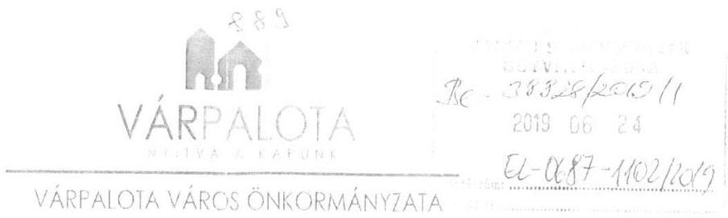

Ügyintéző: Szabó Mónika Pénzügyi irodavezető Iktatószám: P02/247-2/2019.

Tárgy: ÁSZ ellenőrzés adatbekérés

Állami Számvevőszék
Budapest 4.
Pf. 54.
1364
Domonkos László Elnök Úr részére

# Tisztelt Elnök Úr! 

Az Állami Számvevőszék EL-0687-1083/2019. iktatószámú levélre mellékelten megküldöm Várpalota Város Önkormányzata észrevételeit „A gyermekétkeztetés rendszerének ellenőrzése” című jelentéstervezettel kapcsolatban:

1. Észrevétel a II. függelék 5. pontjához:

A Gyvt. 104. § (5) bekezdése nem kötelezettségként írja elő, hogy az állami és nem állami intézmény évenként egy alkalommal kötelezhető arra, hogy tevékenységéről átfogó, szakmai és pénzügyi beszámolót adjon. Az önkormányzat eddig nem élt a jogszabályi lehetőséggel.
2. Észrevétel a II. sz. függelék 20. pontjához:

Várpalota Város Önkormányzata minden évben elfogadja a következő évre vonatkozó éves ellenőrzési tervét, melynek során minden évben ellenőrzésre kerülnek a feladatalapú támogatás igénylését alátámasztó dokumentumok. Ennek során az ellenőrzés minden intézményre kiterjedően vizsgálatot folytat az élelmezési tevékenység területén is.
Ezen felül minden évben a kapacitás és a kockázati besorolások függvényében az intézmények átfogó ellenőrzésére is sor kerül.

2015 évben:

- A Ringató Bölcsőde átfogó ellenőrzésére került sor, melynek során sor került az élelmezési tevékenység szabályozottságának, folyamatának, a térítési díjak megállapításainak, beszerzési szállítói szerződések, az anyagfelhasználás gazdaságossági vizsgálatára, továbbá a gyermekétkeztetésben foglalkoztatottak alkalmazási dokumentumainak ellenőrzésére. Az ellenőrzési jelentésben foglaltak megállapításaira intézkedési terv készült, melynek végrehajtásáról az ellenőrzött szervezet időben beszámolt.
- Az Intézményüzemeltetési Szervezet ellenőrzése, melynek során sor került a szolgáltatási szerződések, élelmezésben foglalkoztatottak munkaügyi nyilvántartásainak vizsgálatára.

---

# VÁRPALOTA 

## VÁRPALOTA VÁROS ÖNKORMÁNYZATA

2016 évben:

- A Várpalotai Összevont Óvoda és Bölcsőde intézmény ellenőrzésén belül sor került az élelmezésben foglalkoztatottak munkaügyi dokumentumainak, konyhai kisegítők létszámának felülvizsgálatára.
- Intézményüzemeltetési Szervezet utóellenőrzése.

Fentieken felül Várpalota Város Önkormányzati Képviselő-testülete a 174/2016. (XI. 24.) képviselő-testületi határozatával elfogadta Várpalota Város Önkormányzatának 2017-2020. évekre vonatkozó belső ellenőrzési stratégiai tervét, mely kockázatelemzés alapján felállított prioritásokon alapult. A kockázatelemzés alapján a gyermekétkeztetési feladat-ellátás is az azonosított kockázati tényezők között szerepel, így első körben 2019. évben a 189/2018. (XI. 29.) Képviselő-testületi határozattal elfogadott ellenőrzési ütemterv alapján a Ringató Bölcsőde élelmezési tevékenységének az átfogó vizsgálatára kerül sor.

Várpalota, 2019. június 19.
Tisztelettel:
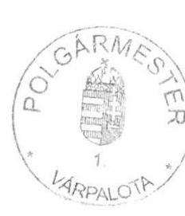

Campanari-Talabér Márta polgármester

---

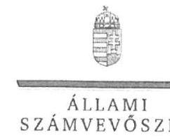

ELKOK

# Campanari-Talabér Márta úrhölgy 

polgármester
Várpalota Város Önkormányzata

## Várpalota

## Tisztelt Polgármester Úrhölgy!

„A gyermekétkeztetés rendszerének ellenőrzése” címmel készített számvevőszéki jelentéstervezetre megküldött P02/247-2/2019. iktatószámú észrevételeit köszönettel megkaptam.
Az Állami Számvevőszék észrevételekre vonatkozó álláspontjáról a felügyeleti vezető által készített részletes tájékoztatást csatoltan megküldöm.
Tájékoztatom Polgármester úrhölgyet, hogy a számvevőszéki jelentésben - az Állami Számvevőszékről szóló 2011. évi LXVI. törvény 29. § (3) bekezdése alapján - a figyelembe nem vett észrevételeket szerepeltetjük az elutasítás indokának feltüntetésével.

Budapest, 2019. július 

---

# Tájékoztatás észrevételek kezeléséről 

„A gyermekétkeztetés rendszerének ellenőrzése” című jelentéstervezet (a továbbiakban: Jelentéstervezet) megállapításaira a P02/247-2/2019. iktatószámú levélben megküldött észrevételeit áttekintettem. Az észrevétel kezeléséről az alábbi tájékoztatást adom.

1) Polgármester úrhölgy az 1. pont szerinti észrevételében nem vitatja a Jelentéstervezet 16. oldal 1.2. számú megállapítás negyedik bekezdésében szereplő - a gyermekétkeztetés nyújtó szervezetek ellenőrzésével kapcsolatban feltárt hiányosságot. A megállapítás szerint: „A gyermekétkeztetés működésének felügyeletével kapcsolatos feladataikat a városi és a községi önkormányzatok nem megfelelően látták el, a Gyvt. 104. § (1) bekezdés e) pontjában és 104. § (5) bekezdésében előírtak ellenére nem ellenőrizték és évente egy alkalommal nem értékelték a szakmai munka eredményességét, a szakmai program végrehajtását, valamint a gazdálkodás szabályszerűségét és hatékonyságát a gyermekétkeztetést nyújtó szervezeteknél, illetve nem kötelezték arra, hogy tevékenységükről átfogó, szakmai és pénzügyi beszámolót adjanak.” (Gyvt. - a gyermekek védelméről és a gyámügyi igazgatásról szóló 1997. évi XXXI. törvény)
Polgármester úrhölgy észrevételében megerősítette a Jelentéstervezet hivatkozott megállapítását, mely szerint az Önkormányzat eddig nem
 élt a jogszabály által biztosított lehetőséggel. A tájékoztatást tudomásul vettem. Mivel az észrevétel nem kapcsolódik a Jelentéstervezet megállapításaihoz, a Jelentéstervezet módosítására nem kerül sor.
2) Polgármester úr/hölgy a 2. pont szerinti észrevételében nem vitatja a Jelentéstervezet (17. oldal 1.3. számú megállapítás ötödik bekezdésében szereplő) azon helyénvalósági szempontok szerint tett megállapítását, miszerint „Az ellenőrzött időszakban a városi és községi önkormányzatok nem megfelelően jártak el, mivel a gyermekétkeztetést feladat-ellátás hatékonyságát, eredményességét az önkormányzatok belső ellenőrzése nem ellenőrizte, továbbá nem végzett ellenőrzést a feladatot szerződés alapján ellátó, ételkészítést végző vállalkozásoknál. Emellett az önkormányzatok jelentős részénél a belső ellenőrzés nem folytatott le a gyermekétkeztetés feladat ellátásának szabályszerűségére, a szükséges feltételek biztosítására vonatkozó belső ellenőrzést a polgármesteri hivatalnál, valamint a gyermekétkeztetést biztosító intézményeknél. Mindezek alapján a belső ellenőrzés működtetése kockázatot hordozott. "
Az ellenőrzési időszakban az önkormányzat által végzett ellenőrzésekről adott tájékoztatója megerősíti, hogy a megállapítás szerinti témájú ellenőrzést az Önkormányzat nem végzett, az első gyermekétkeztetési feladat-ellátás átfogó ellenőrzésére 2019. évben kerül majd sor. A tájékoztatást tudomásul vettem. Mivel az észrevétel nem kapcsolódik a Jelentéstervezet megállapításaihoz, a Jelentéstervezet módosítására nem kerül sor.

Budapest, 2019. július ,, 1, ,"
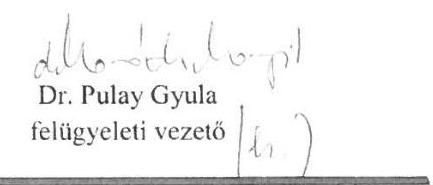

---

Hajdúszoboszló Város Önkormányzata
4200 Hajdúszoboszló, Hősök tere 1.
telefon: 52/557-300 fax: 52/557-302
www.hajduszoboszlo.eu

Ügyintéző: Gazdasági Iroda
Harmati Péter ügyintéző
„B" épület, 114. sz. irodahelyiség
Telefon: 52/557-345

Tárgy: észrevétel a megküldött jegyzőkönyvre

Állami Számvevőszék
Domokos László
elnök
részére

Tisztelt Uram!

Az Állami Számvevőszék EL-0687-1082/2019 iktatószámú, a gyermekétkeztetés
rendszerének ellenőrzése tárgyú jelentéstervezetével kapcsolatban az alábbi
észrevételeink vannak.

Ellentmondásosnak érezzük a II. számú függelék 7. és 8. pontjában a Hajdúszoboszló Város
Önkormányzatára vonatkozó megállapításokat. A 7. pontban azok az önkormányzatok
kerültek felsorolásra ahol nem követték nyomon a belső ellenőrzési jelentésekben tett
megállapításokat, a 8. pontban pedig azok az önkormányzatok amelyeknél működött a belső
ellenőrzés nyomon követése, de az arról vezetett nyilvántartást nem értékelték megfelelőnek.

Az Állami Számvevőszék által ellenőrzött időszakban, az ellenőrzött témára vonatkozóan,
2014-2016 években a belső ellenőrzés 5 db ellenőrzést végzett. Az 5 db ellenőrzésből 3 db nem
igényelt intézkedést, ezért nem tartalmazza azt a nyilvántartás, 1 db esetében tartalmazza a
nyomon követést a nyilvántartás, 1 db esetében pedig időközben az Önkormányzat
megalkotta a rendeletét, ezért nem tartalmaz erre vonatkozóan adatot a nyilvántartás.

Részleteiben az alábbiak tartalmazzák az ide vonatkozó észrevételeinket:

7. ponthoz:

- 2014. évben a belső ellenőrzés elvégezte az önkormányzatok általános működéséhez
és ágazati feladataihoz kapcsolódó támogatások és központosított előirányzatok
elszámolásának ellenőrzését (Ellenőrzött időszak: 2013. év).

o A megállapítások az ellenőrzés tárgyával kapcsolatban intézkedést nem
igényeltek, azonban tartalmazott javaslatot az Éltes Mátyás Általános és
Speciális Szakiskola Kollégium és Gyermekotthon és a Hajdúszoboszlói
Intézményüzemeltető Központ közötti kapcsolattartás javítására vonatkozóan.

A 2015. évben a Hajdúszoboszlói Intézményüzemeltető Központnál elvégzett
utóellenőrzés keretében a javaslatra tett intézkedés is ellenőrzésre került.

Az ellenőrzésről készült jelentés tartalmazta, hogy: a 2014. évben elvégzett, fenti
ellenőrzés alapján tett javaslatnak megfelelően az Éltes Mátyás Általános és
Speciális Szakiskola Kollégium és Gyermekotthonnak biztosított étkeztetést 2014.
december 15-én létrejött vállalkozási szerződés szabályozza, 2014. év végétől az
étkezések igénybevételéről számítógépes nyilvántartást vezetnek.

Információt a fejrészben megjelölt ügyintézőtől kaphat! Válaszában kérjük, hivatkozzon ügyiratszámunkra!
Ügyfélfogadási idő a hivatalban:
hétfő: 8.00-12.00 és 13.00-16.00, szerda: 8.00-12.00 és 13.00-17.00, péntek: 8.00-12.00

72

---

Hajdúszoboszló Város Önkormányzata
4200 Hajdúszoboszló, Hősök tere 1.
telefon: 52/557-300 fax: 52/557-302
www.hajduszoboszlo.eu

Ügyintéző: Gazdasági Iroda
Harmati Péter ügyintéző
„B" épület, 114. sz. irodahelyiség
Telefon: 52/557-345
E-mail: harmati.peter@hajduszob.hu

- 2015. évben a belső ellenőrzés elvégezte az önkormányzatok általános működéséhez és ágazati feladataihoz kapcsolódó támogatások és központosított előirányzatok elszámolásának ellenőrzését (Ellenőrzött időszak: 2014. év).
- Az ellenőrzés javasolta, hogy az élelmezési normákat és térítési díjakat önkormányzati rendeletben minden korcsoportra vonatkozóan (középiskolai tanulókra is) meg kell állapítani.

A nyilvántartás azért nem tartalmazott az ellenőrzött által tett intézkedésre vonatkozó adatot, mivel a hiányosság csak az ellenőrzött 2014. év időszakában állt fenn.

Az ellenőrzés időpontjában (2015. január - február) már hatályos volt Hajdúszoboszló Város Önkormányzatának Képviselő-testülete 173/2014. (XII. 18.) határozata a 2015. évre, minden korcsoportra meghatározott nyersanyagnormák és térítési díjak megállapításáról.

Ezt igazolja az is, hogy az ÁSZ jelentés II. számú függelék Hajdúszoboszló Város Önkormányzatát nem tartalmazza azon ellenőrzött szervezetek között, melyek a gyermekétkeztetés fizetendő térítési díjával kapcsolatos rendeletet nem alkották meg.

- 2016. évben a gyermekétkeztetés rendszeréhez kapcsolódó, belső ellenőrzés által elvégzett ellenőrzések:
- Az önkormányzatok általános működéséhez és ágazati feladataihoz kapcsolódó támogatások és központosított előirányzatok elszámolásának ellenőrzését (Ellenőrzött időszak: 2015. év).

Az ellenőrzés megállapításai intézkedést nem igényeltek.

- Az ingyenes étkezés igénybevételének megváltozott jogszabályi szabályozása miatt az igénybe vett szolgáltatások jogosultsági feltételei meglétének ellenőrzése a Hajdúszoboszlói Egyesített Óvodánál és a Gyermeksziget Bölcsődénél került végrehajtásra.

Az ellenőrzés megállapításai intézkedést nem igényeltek.

- Az élelmezési tevékenység a Hajdúszoboszlói Intézményműködtető Központhoz tartozó 3 konyhánál került ellenőrzésre.

Az intézkedést igénylő megállapítások alapján tett javaslatok végrehajtására az ellenőrzött Hajdúszoboszlói Intézményműködtető Központ II/19-2-4/2017 számú intézkedési terveket készített, melyek a már végrehajtott intézkedéseket is tartalmazták, ezért külön a végrehajtásukra vonatkozó dokumentum nem készült.
8. ponthoz: A 370/2011. (XII. 31.) Kormányrendelet 47. § (2) melléklete alapján vezetett nyilvántartás tartalmazza a szükséges adatokat:

Információt a fejrészben megjelölt ügyintézőtől kaphat! Válaszában kérjük, hivatkozzon ügyiratszámunkra! Ügyfélfogadási idő a hivatalban:
hétfő: 8.00-12.00 és 13.00-16.00, szerda: 8.00-12.00 és 13.00-17.00, péntek: 8.00-12.00

---

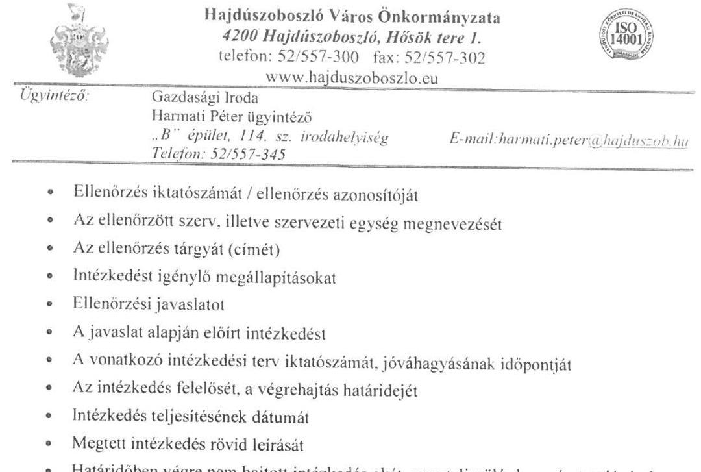

Kérjük, hogy jelentésüket a fenti észrevételek figyelembevételével tegyék meg.

Hajdúszoboszló, 2019. június 19.
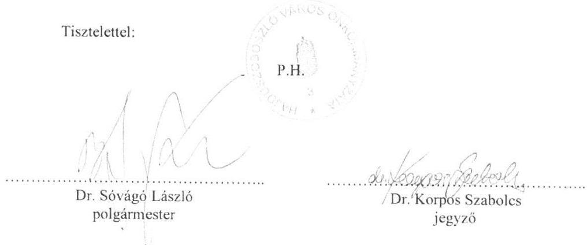

[^0]
[^0]:    Információt a fejrészben megjelölt ügyintézőtől kaphat! Válaszában kérjük, hivatkozzon ügyiratszámunkra! Ügyfélfogadási idő a hivatalban:
    hétfő: 8.00-12.00 és 13.00-16.00, szerda: 8.00-12.00 és 13.00-17.00, péntek: 8.00-12.00

---

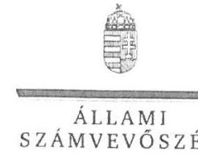

ELNÖK

# Dr. Sóvágó László úr 

polgármester

## Dr. Korpos Szabolcs úr

jegyző

## Hajdúszoboszló Város Önkormányzata

## Hajdúszoboszló

## Tisztelt Polgármester Úr! Tisztelt Jegyző Úr!

„A gyermekétkeztetés rendszerének ellenőrzése" címmel készített számvevőszéki jelentéstervezetre megküldött HSZ/15654-2/2019. iktatószámú észrevételeiket köszönettel megkaptam.
Az Állami Számvevőszék észrevételekre vonatkozó álláspontjáról a felügyeleti vezető által készített részletes tájékoztatást csatoltan megküldöm.
Tájékoztatom Polgármester urat és Jegyző urat, hogy a számvevőszéki jelentésben - az Állami Számvevőszékről szóló 2011. évi LXVI. törvény 29. § (3) bekezdése alapján - a figyelembe nem vett észrevételeket szerepeltetjük az elutasítás indokának feltüntetésével.

Budapest, 2019. július,,,,,"
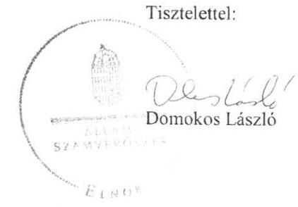

Melléklet: Tájékoztatás észrevételek kezeléséről

---

# Tájékoztatás észrevételek kezeléséről 

„A gyermekétkeztetés rendszerének ellenőrzése" című jelentéstervezet (a továbbiakban: Jelentéstervezet) megállapításaira a HSZ/15654-2/2019. iktatószámú levélben megküldött észrevételeket áttekintettem, értékeltem. Az észrevételek kezeléséről az alábbi tájékoztatást adom.

1) Polgármester úr és jegyző úr ellentmondást vélt felfedezni a Jelentéstervezet belső ellenőrzési jelentések nyomon követése-, illetve a vezetett nyilvántartás megfelelősége tekintetében tett megállapítások között. Az ellentmondás alátámasztására részletes indokolást tettek. Az első észrevételben vitatják a Jelentéstervezet 16. oldal 1.3. számú megállapítás harmadik bekezdésében szereplő „A gyermekétkeztetést érintő belső ellenőrzések nyomon követése nem felelt meg a jogszabályi előírásoknak. A belső ellenőrzést működtető városi és községi önkormányzatok jelentős része a Bkr.47. § (1) bekezdés előírásai ellenére nem követte nyomon a belső ellenőrzési jelentésekben tett megállapításokat, javaslatokat, a vonatkozó intézkedési terveket és azok végrehajtását." - a belső ellenőrzési jelentésekben szereplő javaslatok nyomon követése kapcsán feltárt hiányosságot. (Bkr. - a költségvetési szervek belső kontrollrendszeréről és belső ellenőrzéséről szóló 370/2011. (XII. 31.) Korm. rendelet.) Évenkénti bontásban tájékoztatást adtak az önkormányzatnál végzett gyermekétkeztetésre vonatkozó ellenőrzésekről, az ellenőrzési jelentések hasznosulásáról.
Az észrevételt - a következő indokolás alapján - nem fogadom el. Az önkormányzatnál a belső ellenőrzés által a 2014-2016. években elvégzett gyermekétkeztetést érintő ellenőrzésekből 5 db mintatétel került kiválasztásra, melynek értékeléséhez az Állami Számvevőszék (a továbbiakban: ÁSZ) dokumentumokat kért be. Az adatbekérő levél 3. számú melléklet Dokumentumjegyzék 1.4 pontja tartalmazta a bekért dokumentumok felsorolását, míg a 4. számú melléklet a kiválasztott belső ellenőrzési tételeket részletezte. Az Önkormányzat az ÁSZ rendelkezésére bocsátotta a vonatkozó dokumentumokat, melyek alapján az ÁSZ - többek között - azt is értékelte, hogy amennyiben az önkormányzat belső ellenőrzése ellenőrizte a gyermekétkeztetés feladat ellátását, akkor nyomon követte-e a javaslatok végrehajtását, hasznosulását?
A dokumentumok értékelése alapján megállapítást nyert, hogy a belső ellenőrzésekről készített ellenőrzési jelentések javaslatainak nyomon követése a 2014. és 2016. években a nyilvántartás vezetésével megtörtént, azonban 2015. év tekintetében (3. minta (HI/1/2015. Óvoda, Bölcsőde, HIK) az Önkormányzat nem vezetett nyilvántartást.
Az ÁSZ rendelkezésére bocsátott dokumentumok alapján megállapítást nyert, hogy intézkedést igénylő javaslattal zárult - a belső ellenőrzés által 2015. évben végzett - az önkormányzatok általános működéséhez és ágazati feladataihoz kapcsolódó támogatások és központosított előirányzatok elszámolásának ellenőrzése. Az ellenőrzés következő adatai kerültek bejegyzésre az Intézkedések nyilvántartása elnevezésű dokumentumban: 1-3 számú mezők az ellenőrzés azonosító adatait tartalmazzák. A 4. Intézkedést igénylő megállapítás elnevezésű oszlopban feltüntetésre került a jelentés vonatkozó megállapítása. Az 5. - Ellenőrzési javaslat oszlopban a meg-

---

állapítás alapján tett javaslat szerepel. A nyilvántartás 6-16. mezőiben azonban semmilyen bejegyzés nincs, melynek okán megállapítást nyert, hogy 2015. évben az Önkormányzat nem követte nyomon a belső ellenőrzési jelentésben tett megállapítást, javaslatot. Polgármester úr és jegyző úr csak az észrevételben adott tájékoztatást arra vonatkozóan, hogy a nyilvántartás azért nem tartalmazott az ellenőrzött által tett intézkedésre vonatkozó adatot, mert a hiányosság csak az ellenőrzött 2014. év időszakában állt fenn.
Polgármester úr és jegyző úr a második észrevételben a Jelentéstervezet 16. oldal 1.3. számú megállapítás negyedik bekezdésében szereplő megállapításhoz, miszerint „Azon városi és községi önkormányzatoknál, amelyeknél működött a belső ellenőrzések nyomon követése, a belső ellenőrzési jelentésben tett, a gyermekétkeztetést érintő megállapítások, javaslatok, az elfogadott intézkedési tervek, a végrehajtott intézkedések és a végre nem hajtott intézkedések okáról vezetett nyilvántartás nem felelt meg a Bkr. 47. § (2) bekezdés előírásainak" részletezték (11 sorban) a Bkr. 47. § (2) bekezdés szerinti kritériumokat.
Az ÁSZ rendelkezésére bocsátott - első pontban részletezett - dokumentumok alapján megállapítást nyert, hogy a nyilvántartás a 2016. év tekintetében (2014. évben nem igényelt intézkedést a megállapítás, javaslat) nem felelt meg a hivatkozott jogszabályi követelményeknek a következők miatt.
Az Önkormányzat által vezetett nyilvántartás 10. - Intézkedések végrehajtásának határideje oszlopban a HI/5/2016 azonosító számú ellenőrzés tekintetében (5. sortól - számozás nélkül huszadik sorral bezáróan) az ötödik, hatodik, tizedik, tizenkettedik, tizennegyedik és tizenötödik tételnél dátum helyett „folyamatban" bejegyzés szerepel. Ennek megfelelően az intézkedés megtételének határideje nem azonosítható be.
A 12. - Az intézkedés teljesítése (dátum/NEM) oszlopban a HI/5/2016 azonosító számú ellenőrzés tekintetében (5. sortól - számozás nélkül huszadik sorral bezáróan) az ötödik, hatodik, tizedik, tizenkettedik, tizennegyedik és tizenötödik tételnél „folyamatban" bejegyzés szerepel, míg a tizenkilencedik tételnél (határidő: 2016.02.28.) semmilyen adat nincs feltüntetve. A nyilvántartás szerint az intézkedések határidőre nem történtek meg, ennek ellenére a 14. - A határidőben végre nem hajtott intézkedések oka-, illetve a 15. - Nem teljesülés kapcsán tett lépések oszlopai üresek. Fentiek alapján helytálló a jelentéstervezet hivatkozott megállapítása, a Jelentéstervezet módosítására nem kerül sor.

Budapest, 2019. július „B."
Dr. Pulay Gyula
felügyeleti vezető

---

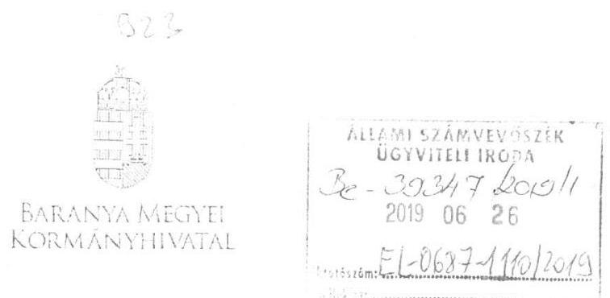

Domokos László elnök úr részére

Állami Számvevőszék
Budapest
Pf. 54.
1364
Iktatószám: BAB/8/000671-1./2019.
Tárgy: Észrevételtétel
jelentéstervezetben foglaltakra
Ügyintéző: Kaufmann Eszter
Elérhetőség: 72/507-064

# Tisztelt Elnök Úr! 

Hivatkozással a 2019. június 6. napján postai úton érkezett EL-0687-1084/2019. számú

 és „A gyermekétkeztetés rendszerének ellenőrzése" tárgyú levelében, valamint a Számvevőszéki jelentéstervezetben foglaltakra, továbbá az Állami Számvevőszékről szóló 2011. évi LXVI. törvény 29. § (2) bekezdésében foglaltak alapján a vizsgálat Baranya Megyei Kormányhivatal (a továbbiakban: Kormányhivatal) Szigetvári Járási Hivatal Népegészségügyi Osztályát (a továbbiakban: Népegészségügyi Osztály) érintő megállapításaira vonatkozóan az alábbi észrevételeket teszem:

Az Állami Számvevőszék (a továbbiakban: ÁSZ) gyermekétkeztetés rendszerére vonatkozó ellenőrzésének egyik lényeges kérdésköre volt a járási hivatalok népegészségügyi feladatot ellátó szervezeti egységei 2014. január 1. - 2016. december 31. napja közötti időszakban tervezett és végrehajtott ellenőrzéseinek vizsgálata, a szabályszerűség és eredményesség tekintetében.

A Számvevőszéki jelentéstervezet a Népegészségügyi Osztály feladatellátását érintően egyetlen negatív megállapítást tartalmaz: a közigazgatási hatósági eljárás és szolgáltatás általános szabályairól szóló 2004. évi CXL. törvény (a továbbiakban: Ket.) 91. § (1) bekezdése és a fővárosi és megyei kormányhivatalokról, valamint a járási (fővárosi kerületi) hivatalokról szóló 66/2015. (III.30.) Korm. rendelet (a továbbiakban: Korm. rendelet) 7. § (2) bekezdése előírásai ellenére az országos ellenőrzési terv alapján a járási hivatal 2014. évben nem készítette el az éves hatósági ellenőrzési tervét.
2014. évben a Népegészségügyi Osztály a Kormányhivatal Szigetvári Járási Hivatal Járási Népegészségügyi Intézeteként látta el feladatait, a Kormányhivatal Népegészségügyi Szakigazgatási Szerve szakmai- és a Kormányhivatal funkcionális irányítása alatt. Ebben az évben még nem alakult ki a 2015. évtől már gyakorlattá vált kormányhivatali éves egységes hatósági ellenőrzési terv készítése, amely a járási hivatalok éves hatósági ellenőrzési terveit is tartalmazza.

Az éves hatósági ellenőrzési tervek 2015. év előtti nem teljes körű elkészítését indokolhatja az a korábbi bizonytalanság is, miszerint az ÁSZ által hivatkozott Ket. rendelkezés szerinti hatóság ellenőrzési terv készítését csak a Korm. rendelet pontosította: a fővárosi és megyei kormányhivatal a szakmai irányító miniszterek által kiadott országos hatósági ellenőrzési tervek alapján készíti el a hatósági ellenőrzési terveit.

Mindazonáltal megállapítható, hogy 2014. évben (és a korábbi években is) a Népegészségügyi Osztály - a formális éves hatósági ellenőrzési terv hiányától függetlenül - szigorúan a szakmai irányító miniszterek által kiadott országos hatósági ellenőrzési tervek alapján, ütemezetten folytatta ellenőrzési tevékenységét, amit a Ket. 91. § (2) bekezdése előírásai szerint elkészült éves ellenőrzési jelentései igazolnak.

Kérem tájékoztatásom szíves tudomásulvételét.

Pécs, 2019. június 10.
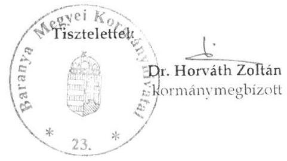

---

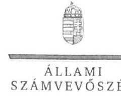

ELNÖK

# Dr. Horváth Zoltán úr

Kormánymegbízott

Baranya Megyei Kormányhivatal

Pécs

## Tisztelt Kormánymegbízott Úr!

„A gyermekétkeztetés rendszerének ellenőrzése” címmel készített számvevőszéki jelentéstervezetre megküldött BAB/8/000671-4/2019. iktatószámú észrevételét köszönettel megkaptam.

Az Állami Számvevőszék észrevételre vonatkozó álláspontjáról a felügyeleti vezető által készített részletes tájékoztatást csatoltan megküldöm.

Tájékoztatom Kormánymegbízott urat, hogy a számvevőszéki jelentésben – az Állami Számvevőszékről szóló 2011. évi LXVI. törvény 29. § (3) bekezdése alapján – a figyelembe nem vett észrevételeket szerepeltetjük az elutasítás indokának feltüntetésével.

Budapest, 2019. július „C”:

Tisztelettel:

Domokos László

Melléklet: Tájékoztatás az észrevétel kezeléséről

1052 BUDAPEST, APÁCZAI CSERE JÁNOS UTCA 10. 1364 Budapest 4. Pf. 54 telefon: 484 9101 fax: 484 9201

---

# Tájékoztatás észrevételek kezeléséről 

„A gyermekétkeztetés rendszerének ellenőrzése" címû jelentéstervezet (a továbbiakban: Jelentéstervezet) megállapításaira a BAB/8/000671-4/2019. iktatószámú levélben megküldött észrevételét áttekintettem. Az észrevétel kezeléséről az alábbi tájékoztatást adom.

Kormánymegbízott úr az észrevételében nem vitatja a Jelentéstervezet 20. oldal 3.2. számú megállapítás (első francia bekezdésében szereplő) ,,a hivatalok a Ket. 91. § (1) bekezdés és a 66/2015. (III. 30.) Korm. rendelet 7. § (2) bekezdés előírásai ellenére az országos terv alapján az éves hatósági ellenőrzési tervet nem készítették el" a Szigetvári Járási Hivatal tekintetében feltárt hiányosságot.

Kormánymegbízott úr 2014. év tekintetében tájékoztatást adott a Baranya Megyei Kormányhivatal Népegészségügyi Osztályának a hatósági ellenőrzési terv készítési gyakorlatára és az ellenőrzési tevékenységére vonatkozóan, melyet tudomásul vettünk.

Mivel az észrevétel nem kapcsolódik a Jelentéstervezet megállapításaihoz, a Jelentéstervezet módosítására nem kerül sor.

Budapest, 2019. július „...."
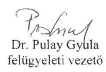

---

.

---

# RÖVIDÍTÉSEK JEGYZÉKE 

${ }^{1}$ Gyvt.
${ }^{2}$ Nktv.
${ }^{3} \mathrm{Kbt} .{ }_{1}$
${ }^{4} \mathrm{Kbt} .{ }_{2}$
${ }^{5}$ Bkr.
${ }^{6}$ Kincstár
${ }^{7}$ ÁSZ tv.
${ }^{8}$ CATI-módszer
${ }^{9}$ 2013. évi CLXV. törvény
${ }^{10}$ Mötv.
${ }^{11}$ 328/2011. (XII. 29.) Korm. rendelet
${ }^{12}$ Számv. tv.
${ }^{13}$ Kincstár
${ }^{14}$ Áht.
${ }^{15}$ Ávr.
${ }^{16}$ Ket.
${ }^{17}$ 66/2015. (III. 30.) Korm. rendelet
${ }^{18}$ 37/2014. EMMI rendelet
1997. évi XXXI. törvény a gyermekek védelméről és a gyámügyi igazgatásról (hatályos: 1997. november 1-től)
2011. évi CXC. törvény a nemzeti köznevelésről
(hatályos: 2012. szeptember 1-től)
2011. évi CVIII. törvény a közbeszerzésekről (hatálytalan: 2015. november 1-től)
2015. évi CXLIII. törvény a közbeszerzésekről (hatályos: 2015. november 1-től)
370/2011. (XII. 31.) Korm. rendelet a költségvetési szervek belső
kontrollrendszeréről és belső ellenőrzéséről (hatályos: 2012. január 1-től)
Magyar Államkincstár
2011. évi LXVI. törvény az Állami Számvevőszékről

Computer Assisted Telephone Interviewing. Számítógéppel támogatott telefonos lekérdezés
2013. évi CLXV. törvény a panaszokról és a közérdekű bejelentésekről
2011. évi CLXXXIX. törvény Magyarország helyi önkormányzatairól (hatályos: 2012. január 1-től)
328/2011. (XII. 29.) Korm. rendelet a személyes gondoskodást nyújtó gyermekjóléti alapellátások és gyermekvédelmi szakellátások térítési díjáról és az igénylésükhöz felhasználható bizonyítékokról (hatályos: 2012. január 13-ától)
2000. évi C. törvény a számvitelről

Magyar Államkincstár
2011. évi CXCV. törvény az államháztartásról
368/2011. (XII. 31.) Korm. rendelet az államháztartásról szóló törvény végrehajtásáról (hatályos: 2012. január 1-től)
2004. évi CXL. törvény a közigazgatási hatósági eljárás és szolgáltatás általános szabályairól (hatályos: 2005. november 1-től)
66/2015. (III. 30.) Korm. rendelet a fővárosi és megyei kormányhivatalokról, valamint a járási (fővárosi kerületi) hivatalokról
37/2014. EMMI rendelet a közétkeztetésre vonatkozó táplálkozás-egészségügyi előírásokról (hatályos: 2015. január 1-től)

---

ÁLLAMI SZÁMVEVŐSZÉK
1052 Budapest, Apáczai Csere János utca 10.
Levélcím: 1364 Budapest 4. Pf. 54
Telefon: +36 14849100 Telefax: +36 14849200
www.asz.hu
