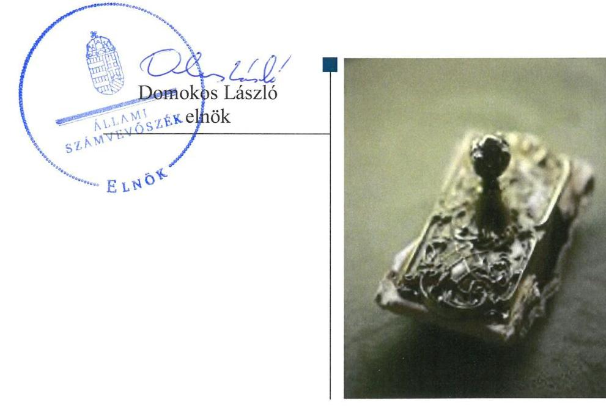
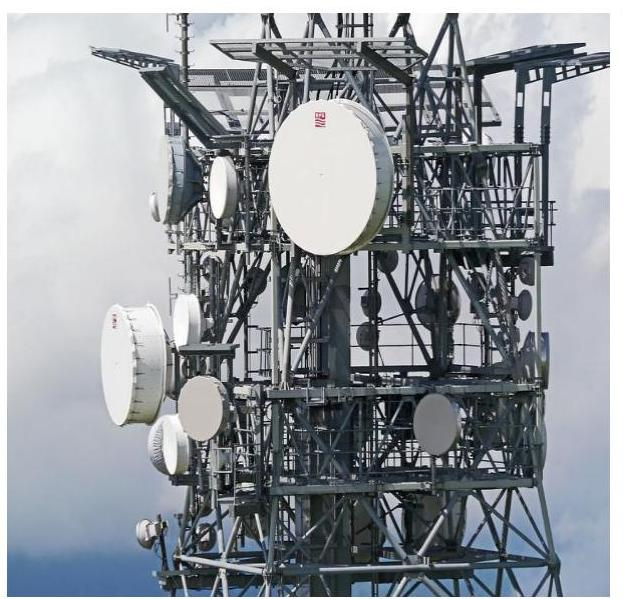
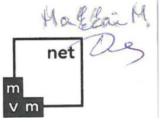
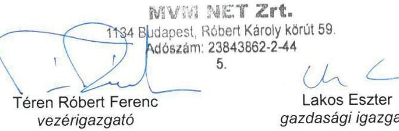
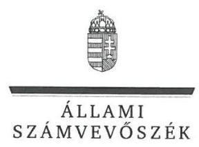
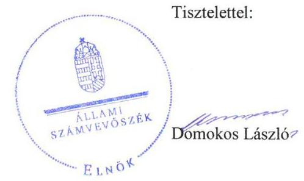

# Jelenetés 

## Az állami tulajdonú gazdasági társaságok ellenőrzése

MVM NET Távközlési Szolgáltató Zártkörűen Múködő Részvénytársaság
2019.

---

# Jelentés 

## Az állami tulajdonú gazdasági társaságok ellenőrzése

MVM NET Távközlési Szolgáltató Zártkörűen Múködő Részvénytársaság
2019. 04. hó 30. nap

---

# AZ ELLENŐRZÉST FELÜGYELTE:

## MAKKAI MÁRIA felügyeleti vezető

## AZ ELLENŐRZÉST VEZETTE ÉS A VÉGREHAJTÁSÁÉRT FELELŐS:

### SALI SÁNDORNÉ ellenőrzésvezető

## A PROGRAM ÖSSZEÁLLÍTÁSÁÉRT FELELŐS:

### TÓTPÁL SZABOLCS osztályvezető

IKTATÓSZÁM: EL-1633-001/2019.

TÉMASZÁM: 2480

ELLENŐRZÉS-AZONOSÍTÓ SZÁM: V082412

Jelentéseink az Országgyűlés számítógépes hálózatán és az Interneta a www.asz.hu címen is olvashatóak.

---

# TARTALOMJEGYZÉK 

■ ÖSSZEGZÉS ..... 5
■ AZ ELLENŐRZÉS CÉLJA ..... 6
■ AZ ELLENŐRZÉS TERÜLETE ..... 7
■ AZ ELLENŐRZÉS HÁTTERE, INDOKOLTSÁGA ..... 8
■ A JELENTÉS LÉNYEGES KÉRDÉSKÖREI ..... 9
■ AZ ELLENŐRZÉS HATÓKÖRE ÉS MÓDSZEREI ..... 10
■ MEGÁLLAPÍTÁSOK ..... 12
■ JAVASLATOK ..... 14
■ MELLÉKLETEK ..... 15
I. sz. melléklet: Fogalomtár ..... 15
■ FÜGGELÉKEK ..... 17
I. sz. függelék a jelentéshez ..... 17
II. sz. függelék: Észrevételek ..... 18
■ RÖVIDÍTÉSEK JEGYZÉKE ..... 25

---

.

---

# ÖSSZEGZÉS 

Az MVM NET Távközlési Szolgáltató Zártkörűen Müködő Részvénytársaság müködése a jogszabályi előírások szerint szabályozott volt. A Társaság gazdálkodása, adatszolgáltatási feladatai ellátása szabályszerű volt. A vagyongazdálkodás nem volt szabályszerű, a mérleg valódiság elve, az elszámoltathatóság nem volt biztosított.

## Az ellenőrzés társadalmi indokoltsága

Az állami tulajdonú gazdálkodó szervezetek a nemzeti vagyon részét képezik. Gazdálkodásuk a közérdeklődés és a média figyelmének középpontjában áll. A közpénzt, közvagyont felhasználó állami tulajdonú gazdálkodó szervezetekkel szemben alapvető társadalmi igény, hogy müködésük, gazdálkodásuk szabályszerű, az általuk szolgáltatott adatok minél megbízhatóbbak legyenek. Az Állami Számvevőszék a közvagyon, a közpénzek szabályos, átlátható és elszámoltatható felhasználásának elősegítése érdekében, stratégiájával összhangban végzi az államháztartáson kívül működő szervezetek ellenőrzését.

Az MVM NET Távközlési Szolgáltató Zártkörűen Működő Részvénytársaság megfelelő működése fontos az állami vagyon védelme szempontjából, emiatt került sor a Társaság ellenőrzésére.

## Főbb megállapítások, következtetések, javaslatok

Az MVM NET Távközlési Szolgáltató Zártkörűen Müködő Részvénytársaság működése szabályozott volt. A gazdálkodás keretében a bevételek és ráfordítások elszámolása szabályszerű volt. A Társaság az általa nyújtott szolgáltatások díjtételeit a jogszabályban és a belső szabályozásban foglaltakkal összhangban lévő önköltségszámítással megalapozta. A Társaság vagyongazdálkodása nem volt szabályszerű, mert a 2015-2017. években az éves beszámoló mérlegtételeit leltárral nem támasztotta alá, valamint a tárgyi eszközök esetében az üzembe helyezést a jogszabály előírása ellenére nem dokumentálta. A mérleg tételeit alátámasztó leltárak hiányában az éves beszámolókban az előírás ellenére nem érvényesült a valódiság elve. A Társaság biztosította az előírásnak megfelelően a közérdekből nyilvános adatok közzétételét.

Az Állami Számvevőszék a jelentésben foglalt megállapítások alapján az MVM NET Távközlési Szolgáltató Zártkörűen Müködő Részvénytársaság vezérigazgatójának hat javaslatot fogalmazott meg.

---

# AZ ELLENŐRZÉS CÉLJA 

AZ ELLENŐRZÉS CÉLJA annak értékelése volt, hogy a gazdasági társaság szabályozottsága, gazdálkodása és vagyongazdálkodási tevékenysége megfelelt-e a jogszabályi és a tulajdonosi előírásoknak; biztosítva volte az ellátott feladatok átláthatósága és elszámoltathatósága érdekében a tevékenység dijának megalapozottsága szabályszerű önköltségszámítással. A vagyonváltozást eredményező döntések esetében a gazdasági társaság szabályszerűen járt-e el.

---

# **AZ ELLENŐRZÉS TERÜLETE**

## **MVM NET Távközlési Szolgáltató Zártkörűen Működő Részvénytársaság**

### **AZ MVM NET TÁVKÖZLÉSI SZOLGÁLTATÓ**

Zártkörűen Működő Részvénytársaságot 2012. évben az MVM Zrt.1 alapította 25 144,4 M Ft jegyzett tőkével, amely – többszöri emelést követően – a 2017. év végére 27 954,4 M Ft-ra változott. A Társaság2 az MVM Csoport3 tagja, részvényeinek 100%-os tulajdonosa az MVM Zrt. volt az ellenőrzött időszakban.

A Társaság az országos lefedettségű átviteli és távközlési hálózat tulajdonlása révén meghatározó szereplője volt a hazai távközlési piacnak. Feladata volt a MAVIR4 ZRt. belső, technológiai célú működését kiszolgáló távközlési hálózatának a biztosítása. E mellett a Társaság hálózatán keresztül stratégiai fontosságú távközlési szolgáltatásokat nyújtott a kormányzat és az állami szervezeteknek, valamint a piaci szereplők részére. Továbbá kimagasló szerepet vállalt a Nemzeti Távközlési Gerinchálózat végpontjainak migrációjában és a járási székhelyek távközlési kapcsolatainak kiépítésében. Az általa működtetett országos optikai gerinchálózat teljes hossza közel 6200 kilométer volt.

A Társaság nem minősült kormányzati szektorba sorolt egyéb szervezetnek, saját vagyonát használta és vagyonkezelésbe nem vett vagyont. Közfeladatot nem látott el, a Számv. tv.5 155. § (2) bekezdése alapján könyvvizsgálatra kötelezett volt. A Társaság tevékenységére ágazati jogszabályként elsősorban az elektronikus hírközlésről szóló 2003. évi C. törvény vonatkozott.

A Társaság a 2015-2016. években nyereségesen gazdálkodott, 2017-ben veszteséget realizált. Az általa foglalkoztatottak létszáma 2017-ben 206 fő volt.

A Társaságot 2015. szeptember 15-éig háromfős, ezt követően ötfős Igazgatóság6 irányította. Az Igazgatóságot a vezérigazgató7 képviselte, személye az ellenőrzött időszakban egy alkalommal változott. A Társaságnál 2017. év végén öttagú felügyelő bizottság működött.

---

# AZ ELLENŐRZÉS HÁTTERE, INDOKOLTSÁGA 

Az Alaptörvény 38. cikke alapján az állam tulajdona a nemzeti vagyon része. A nemzeti vagyon megőrzésének, védelmének és a nemzeti vagyonnal való felelős gazdálkodásnak a követelményeit sarkalatos törvény határozza meg. Az állami tulajdonú gazdasági társaságokra vonatkozó előírások betartásának ellenőrzése kiemelten fontos a vagyon megőrzése, megóvása érdekében. Gazdálkodásuk jellemzően a közérdeklődés és a média figyelmének középpontjában áll, amihez hozzájárul a gazdálkodásuk körébe tartozó - közvetlen vagy közvetett állami tulajdonú, tehát végső soron a nemzeti vagyon részét képező - vagyon nagysága, illetve az általuk ellátott szolgáltatások minősége és hatékonysága. A nyújtott szolgáltatások árképzésének megalapozottsága és a rendszeres elszámoltatás feltételeinek kialakítása az ellenőrzés során nagy hangsúlyt kap.

Az ellenőrzés rámutathat az állami tulajdonú gazdasági társaságok gazdálkodási tevékenységével kapcsolatos jó gyakorlatokra és szabálytalanságokra. Felhívhatja a figyelmet a jogszabályi követelmények teljesítéséhez szükséges feltételek hiányosságaira, hozzájárulhat az államháztartáson kívüli, de (közvetlenül vagy közvetve) állami vagyont használó gazdasági társaságok tevékenységének átláthatóságához. Az ellenőrzés javaslatainak, megállapításainak hasznosítása hozzájárulhat a nemzeti vagyonnal való gazdálkodás átláthatóságának, elszámoltathatóságának javításához.

---

# A JELENTÉS LÉNYEGES KÉRDÉSKÖREI 

1. A társaság müködésének szabályozottsága megfelelt-e az előírásoknak?
2. A társaság gazdálkodása, vagyongazdálkodása, valamint adatszolgáltatási feladatainak ellátása szabályszerü volt-e?

---

# AZ ELLENŐRZÉS HATÓKÖRE ÉS MÓDSZEREI 

## Az ellenőrzés típusa

Megfelelőségi ellenőrzés.

## Az ellenőrzött időszak

Az ellenőrzött időszak a 2015-2017. évek, valamint a 2017. évi beszámoló jóváhagyása és közzététele tekintetében a 2018. június elsejéig tartó időszak.

## Az ellenőrzés tárgya

Az állami tulajdonban (résztulajdonban) lévő gazdasági társaság gazdálkodása, kiemelten vagyongazdálkodási tevékenysége.

## Az ellenőrzött szervezet

MVM NET Távközlési Szolgáltató Zártkörűen Müködő Részvénytársaság

## Az ellenőrzés jogalapja

Az ellenőrzés jogalapját az ÁSZ tv. ${ }^{8}$ 1. § (3) bekezdése és 5. § (3)-(5) bekezdései képezték.

## Az ellenőrzés módszerei

Az ellenőrzést a nemzetközi standardokat irányadónak tekintve az ellenőrzési program ellenőrzési kérdései, az ellenőrzött időszakban hatályos jogszabályok, az ellenőrzés szakmai szabályok és módszertanok figyelembevételével végezte el az ÁSZ ${ }^{9}$.

Az ellenőrzés ideje alatt az ellenőrzött szervezettel történő kapcsolattartást az ÁSZ Szervezeti és Müködési Szabályzatának vonatkozó előírásai alapján biztosította az ÁSZ.

A gazdasági társaságnál rétegzett mintavétel alkalmazásával ellenőrizte az ÁSZ a ráfordításokat és a bevételeket, ezen belül az anyagjellegú ráfordításokat, az egyéb ráfordításokat, a pénzügyi múveletek ráfordításait és a rendkívüli ráfordításokat, illetve az értékesítés nettó árbevételét, az egyéb

---

bevételeket, a pénzügyi műveletek bevételeit, valamint a rendkívüli bevételeket. Véletlen mintavétel történt továbbá a tárgyi eszközök növekedési tételeiből.

Az ellenőrzési kérdések megválaszolásához szükséges bizonyítékok megszerzése a következő ellenőrzési eljárások alkalmazásával történt: megfigyelés, kérdésfeltevés (információkérés), összehasonlítás, valamint elemző eljárás. Az ellenőrzési bizonyítékként felhasználható adatforrások közé tartoznak egyrészt az ellenőrzési programban felsorolt adatforrások, másrészt adatforrás lehet még minden - az ellenőrzés folyamán - feltárt, az ellenőrzés szempontjából információkat tartalmazó dokumentum.

Az ellenőrzést a kérdésekre adott válaszok kiértékelésével, valamint a megjelölt adatforrások felhasználásával, továbbá az adott időszakban hatályos jogszabályok figyelembe vételével folytattuk le.

A 2015. és 2017. évi bevételek és a ráfordítások elszámolásának szabályszerűsége, valamint az értékcsökkenési leírás és a vagyonnyilvántartás szabályszerűsége esetében az ellenőrzés azokra a legnagyobb értékű tételekre - a lényeges sokaságra - terjedt ki, melyek összértéke eléri a teljes sokaság összértékének 50\%-át.

A fenti területek szabályszerűségét a lényeges sokaságból véletlen mintavételi eljárással kiválasztott tételek alapján ellenőriztük. A 2015. és 2017. évi személyi jellegű kifizetések esetében a vezető tisztségviselők részére teljesített kifizetések tételes ellenőrzésére került sor.

A mintavétellel ellenőrzött területek esetében minden egyes tétel vonatkozásában a szabályszerűségre vonatkozó kérdéseket tettünk fel. „Szabályszerúnek" értékeltünk egy ellenőrzött területet, amennyiben 95\%-os bizonyossággal az ellenőrzött sokaságban az átlagos hibaarány legfeljebb 10\%, "nem szabályszerűnek", amennyiben 10\%-nál magasabb arányt képviselt.

---

# 1. A társaság múködésének szabályozottsága megfelelt-e az előírásoknak? 

Összegző megállapítás

A Társaság múködése szabályozott volt. A szabályzatok tartalma a számviteli politika és a pénzkezelési szabályzat kivételével összhangban volt a jogszabályi előírásokkal.

A SZABÁLYOZÁS keretében a Társaság számviteli politikával ${ }^{10}$, leltározási szabályzattal ${ }^{11}$, értékelési szabályzattal ${ }^{12}$, pénzkezelési szabályzattal ${ }^{13}$ rendelkezett. A Társaság a számviteli politika keretében a Számv. tv. 14. § (4) bekezdésének 2015. július 4-étől hatályos módosítása ellenére nem rögzítette azokat a szabályokat, előírásokat, módszereket, amelyekkel meghatározza, hogy mit tekint kivételes nagyságú vagy előfordulású bevételnek, költségnek, ráfordításnak. Ezzel nem tett eleget a Számv. tv. 14. § (11) bekezdése előírásának. A pénzkezelési szabályzat a Számv. tv. 14. § (8) bekezdésében foglalt előírás ellenére nem tartalmazta a készpénzállomány ellenőrzésekor követendő eljárást, az ellenőrzés gyakoriságát, a pénzszállítás feltételeit.

A Társaság a 2015-2017. évek tekintetében a Számv. tv. 161. § (1) bekezdésében előírtak szerint rendelkezett az előírással összhangban lévő számlarenddel ${ }^{14}$. A számlarendben foglaltakat alátámasztó bizonylati rendet a bizonylatok kezelésének szabályzata ${ }^{15}$ a Számv. tv. előírása szerint tartalmazta.

A Társaság a Számv. tv. 14. § (5) bekezdés c) pontjában foglaltak szerint elkészítette az önköltségszámítási szabályzatot ${ }^{16}$, melyre az előírás alapján kötelezett volt. E mellett rendelkezett költség- és eredményszámítási szabályzattal ${ }^{17}$, amely tartalmazta - többek között - a fedezetszámítási ${ }^{18}$ struktúrát, az alkalmazandó kalkulációs módszereket, az elő- és utókalkuláció, a költséghelyek kialakításának, a költségek számításának, csoportosításának elveit.

Az Alapító ${ }^{19}$ a Taktv. ${ }^{20}$ 5. § (3) bekezdésének előírása szerint a vezető tisztségviselők, felügyelőbizottsági tagok, valamint az Mt. ${ }^{21}$ 208. § hatálya alá eső munkavállalók javadalmazásának, a jogviszony megszűnése esetére biztosított juttatások módjának, mértéke elveinek, annak rendszerének kereteit a Társaságra vonatkozóan megalkotta. A javadalmazási szabályzat ${ }_{1,2}{ }^{22}{ }^{23}$ letétbe helyezése a Taktv. 5. § (3) bekezdése előírása ellenére nem történt meg.

---

# 2. A társaság gazdálkodása, vagyongazdálkodása, valamint adatszolgáltatási feladatainak ellátása szabályszerű volt-e? 

Összegző megállapítás

A Társaság gazdálkodási és adatszolgáltatási feladatainak ellátása szabályszerű volt. A vagyongazdálkodás nem volt szabályszerű.

A GAZDÁLKODÁS keretében a bevételek, az anyag- és személyi jellegű ráfordítások, valamint az egyéb, rendkívüli és pénzügyi műveletek ráfordításainak elszámolása - a Számv. tv. előírásaival összhangban - szabályszerű volt. A Társaság az ellenőrzött időszakban a határidőn túli követelés állomány behajtása érdekében a belső szabályozás előírása szerint intézkedett, értékvesztés elszámolására a Számv. tv.-ben foglaltakkal összhangban került sor. A Társaság az által nyújtott szolgáltatások díját az előírásoknak megfelelő önköltségszámítással megalapozta.

A VAGYONGAZDÁLKODÁS nem volt szabályszerű. A tárgyi eszközök állományba vétele nem felelt meg a Számv. tv. 52. (2) bekezdésében foglaltaknak, mivel a Társaság az üzembe helyezést nem dokumentálta. A 2015-2017. években az éves beszámoló mérlegtételeit a Társaság a Számv. tv. 69. § (1) bekezdése, valamint a leltározási szabályzat 4.4.2. pontja ellenére leltárral nem támasztotta alá, mivel a leltárak a tárgyi eszközök esetében mennyiségi adatokat nem, csak értékbeni adatokat tartalmaztak.

A Társaság a mérlegfordulónapra vonatkozóan az ellenőrzött időszak egyik évében sem, de legalább háromévente nem győződött meg a leltárba bekerülő adatok valódiságáról mennyiségi felvétellel, ezzel nem tartotta be a Számv. tv. 69. § (3) bekezdésének előírását. A Számv. tv. 15. § (3) bekezdésében foglalt valódiság elve az ellenőrzött időszakban nem érvényesült. A leltárak hiánya ellenére a könyvvizsgáló a 2015-2017. évi beszámolókat korlátozás nélküli hitelesítő záradékkal látta el.

AZ ADATSZOLGÁLTATÁSI FELADATOK ellátása szabályszerű volt. A Társaság az Alapszabályban és az SZMSZ-ben előírt beszámolási, adatszolgáltatási feladatokat, továbbá üzleti tervkészítési kötelezettségét teljesítette. Az Alapító az éves beszámolókról a Ptk. előírása szerint az $\mathrm{FB}^{24}$ és a könyvvizsgáló írásbeli jelentésének birtokában döntött.

A Taktv.-ben előírt közérdekből nyilvános adatok közzétételének a Társaság eleget tett. A Társaság adatvédelmi és adatbiztonsági szabályzattal ${ }^{25}$ rendelkezett.

---

# JAVASLATOK 

Az ÁSZ tv. 33. § (1) bekezdésében foglaltak értelmében az ellenőrzött szervezet vezetője köteles a jelentésben foglalt megállapításokhoz kapcsolódó intézkedési tervet összeállítani és azt a jelentés kézhezvételétől számított 30 napon belül az ÁSZ részére megküldeni. Amennyiben az ellenőrzött szervezet vezetője nem küldi meg határidőben az intézkedési tervet, vagy továbbra sem elfogadható intézkedési tervet küld, az Állami Számvevőszék elnöke az ÁSZ tv. 33. § (3) bekezdése a) és b) pontjaiban foglaltakat érvényesítheti.

## az MVM NET Távközlési Szolgáltató Zártkörűen Müködő Részvénytársaság vezérigazgatójának

1. Intézkedjen arról, hogy a számviteli politika megfeleljen a jogszabályi előírásoknak.
(1. sz. megállapítás 1. bekezdés 2. mondata alapján)
2. Intézkedjen arról, hogy a pénzkezelési szabályzat megfeleljen a Számv. tv. előírásainak.
(1. sz. megállapítás 1. bekezdés 4. mondata alapján)
3. Intézkedjen a vezető tisztségviselők, felügyelőbizottsági tagok, valamint az Mt. 208. §-ának hatálya alá eső munkavállalók javadalmazása, valamint a jogviszony megszünése esetére biztosított juttatások módjának, mértékének elveiről, annak rendszeréről megalkotott szabályzat letétbe helyezéséről.
(1. sz. megállapítás 4. bekezdés utolsó mondata alapján)
4. Intézkedjen a tárgyi eszközök üzembe helyezésének Számv. tv. előírásának megfelelő dokumentálásáról.
(2. sz. megállapítás 2. bekezdés második mondata alapján)
5. Intézkedjen az éves beszámoló mérlegtételeit alátámasztó leltár jogszabályi előírásnak megfelelő elkészítéséről.
(2. sz. megállapítás 2. bekezdés harmadik mondata alapján)
6. Intézkedjen a Számv. tv. előírásának megfelelően a leltározás végrehajtásáról.
(2. sz. megállapítás 3. bekezdés első mondata alapján)

---

# MELLÉKLETEK 

- I. SZ. MELLÉKLET: FOGALOMTÁR
állami vagyon
gazdasági társaság
nemzeti vagyon
a) Az állam tulajdonában lévő dolog, valamint a dolog módjára hasznosítható természeti erő,
b) az a) pont hatálya alá nem tartozó mindazon vagyon, amely vonatkozásában törvény az állam kizárólagos tulajdonjogát nevesíti,
c) az állam tulajdonában lévő tagsági jogviszonyt megtestesítő értékpapír, illetve az államot megillető egyéb társasági részesedés,
d) az államot megillető olyan immateriális, vagyoni értékkel rendelkező jogosultság, amelyet jogszabály vagyoni értékű jogként nevesít.
e) az állam tulajdonában lévő pénzügyi eszközök.

Forrás: Vtv. ${ }^{26}$ 1. § (2) bekezdése
A gazdasági társaságok üzletszerű közös gazdasági tevékenység folytatására, a tagok vagyoni hozzájárulásával létrehozott, jogi személyiséggel rendelkező vállalkozások, amelyekben a tagok a nyereségből közösen részesednek, és a veszteséget közösen viselik.
Forrás: Ptk. ${ }^{27}$ 3:88. § (1) bekezdése
a) az állam vagy a helyi önkormányzat kizárólagos tulajdonában álló dolgok,
b) az a) pont hatálya alá nem tartozó, állam vagy a helyi önkormányzat tulajdonában lévő dolog,
c) az állam vagy a helyi önkormányzatot tulajdonában lévő pénzügyi eszközök, továbbá az államot vagy a helyi önkormányzatot megillető társasági részesedések,
d) az államot vagy a helyi önkormányzatot megillető bármely vagyoni értékkel rendelkező jogosultság, amelyet jogszabály vagyoni értékű jogként nevesít,
e) Magyarország határa által körbezárt terület feletti légtér,
f) az üvegházhatású gázok kibocsátási egységeinek kereskedelméről szóló törvény szerint kibocsátási egység és légiközlekedési kibocsátási egység, valamint az ENSZ Éghajlat változási Keretegyezménye és annak Kiotói Jegyzőkönyve végrehajtási keretrendszeréről szóló törvény szerinti kiotói egység,
g) állami vagy helyi önkormányzati fenntartású közgyűjtemény (muzeális intézmény, levéltár, közgyűjteményként működő kép- és hangarchívum, valamint könyvtár) saját gyűjteményében nyilvántartott kulturális javak körébe tartozó dolog, kivéve, ha az állami vagy önkormányzati tulajdon jogszerű létrejötte kétséget kizáró módon nem bizonyítható és a dologra nézve más a tulajdonjogát bizonyítja vagy a kulturális javakra vonatkozó jogszabályokban meghatározott eljárás keretében valószínűsíti (g. pont módosult 2013. december 7-től),
h) a régészeti lelet,
i) a nemzeti adatvagyon körébe tartozó állami nyilvántartások fokozottabb védelméről szóló törvény szerinti nemzeti adatvagyon.
Forrás: Nvtv. ${ }^{28}$ 1. § (2)

---

.

---

# FÜGGELÉKEK 

- I. SZ. FÜGGELÉK A JELENTÉSHEZ

Az Állami Számvevőszék az ellenőrzések során feltárt tényekhez kapcsolódó további körülmények tisztázására eszközrendszerrel nem rendelkezik. Amennyiben az ellenőrzésen túlmutatóan indokoltnak látszik az ellenőrzés során feltárt körülmények további vizsgálata, az Állami Számvevőszék törvényi felhatalmazás alapján az ellenőrzés által feltárt körülményeket továbbítja a hatáskörrel rendelkező szervnek a szükséges intézkedések megtétele, eljárások lefolytatása érdekében.
Az MVM NET Távközlési Szolgáltató Zártkörűen Müködő Részvénytársaság a 2015., 2016. és 2017. évben az éves beszámoló mérlegtételeit a Társaság a Számv. tv. 69. § (1) bekezdése, valamint a leltározási szabályzat 4.4.2. pontja ellenére leltárral nem támasztotta alá, mivel a leltárak a tárgyi eszközök esetében mennyiségi adatokat nem, csak értékbeni adatokat tartalmaztak.
A mérleg tételeit alátámasztó leltár hiányában az éves beszámolókban a Számv. tv. 15. § (3) bekezdésében foglalt előirás ellenére nem érvényesült a valódiság elve és nem igazolt, hogy az MVM NET Távközlési Szolgáltató Zártkörüen Müködő Részvénytársaság éves beszámolói megbízható, valós összképet mutatnak.
Az eset konkrét körülményeinek feltárására a Nemzeti Adó- és Vámhivatal rendelkezik hatáskörrel.

---

A jelentéstervezetet a Számvevőszék 15 napos észrevételezésre megküldte az ellenőrzött szervezet vezetőjének az ÁSZ tv. 29. §* (1) bekezdése előírásának megfelelően.

Az MVM NET Távközlési Szolgáltató Zártkörűen Müködő Részvénytársaság vezérigazgatója élt az ÁSZ törvény 29.§ (2) bekezdésében foglalt észrevételezési lehetőséggel, a törvényes határidőn belül észrevételt tett. Az észrevételeket és az arra adott válaszokat a függelék tartalmazza.

[^0]
[^0]:    * 29. § (1) Az Állami Számvevőszék az ellenőrzési megállapításait megküldi az ellenőrzött szervezet vezetőjének vagy az általa megbízott személynek, és annak, akinek személyes felelősségét állapította meg.
    (2) Az ellenőrzött szervezet vezetője és a felelősként megjelölt személy az ellenőrzés megállapításaira tizenöt napon belül írásban észrevételt tehet.
    (3) Az Állami Számvevőszék az észrevételre a beérkezésétől számított harminc napon belül írásban válaszol. A figyelembe nem vett észrevételeket köteles a jelentésben feltüntetni, és megindokolni, hogy azokat miért nem fogadta el.

---

Vezérigazgatóság
Iktatószám nálunk: K-NET-6767/2019
Iktatószám Önöknél:
Úgyintéző: Bányai Bálint

Domokos László
Elnök
Állami Számvevőszék

Budapest
Apáczai Csere János utca 10.
1052

Tárgy: MVM NET Zrt. Számvevőszéki jelentéstervezet

Budapest, 2019. 05. 17.

ÁLLAMI SZÁMVEVŐSZÉK
36-32084/2019/1
Érkezett: 2019. MAI 21
Iktatószám: EL-1210-057/2019
Melléklet:

Tisztelt Elnök Úr!

Köszönettel megkaptuk az Állami Számvevőszék EL-1210-055/2019. iktatószámú levelét,
amellyel megküldték Társaságunk számára a folyamatban lévő Állami Számvevőszéki
vizsgálatra vonatkozó jelentéstervezetet.

Az MVM NET Zrt. (továbbiakban: Társaság, vagy MVM NET Zrt.) jelen levéllel kíván
észrevételt tenni a jelentéstervezetben foglalt megállapításokkal, javaslatokkal kapcsolatban.

A jelentéstervezetben tett javaslatok:

A Társaság vezérigazgatója:

1. Intézkedjen arról, hogy a számviteli politika megfeleljen a jogszabályi előírásoknak
(1. sz. megállapítás, 1. bekezdés, 2. mondata alapján)

ÉSZREVÉTEL: Az MVM Csoport csoportszintű EGYSÉGES SZÁMVITEL-POLITIKAI
ELŐÍRÁSAIRÓL SZÓLÓ SZABÁLYZATA a Számviteli törvény változását követően a
Számviteli törvény 14.§ (11) bekezdésének megfelelően módosításra került. Az MVM
Csoport uralmi szerződése alapján az MVM Csoportba tartozó társaságok számára –
így az MVM NET Zrt. esetében is – az MVM Csoport csoportszintű szabályzó
dokumentumai kötelezően alkalmazandóak a működésük során. A fentiek alapján a
megállapítás során kérjük figyelembe venni, hogy ugyan az MVM NET Zrt. a Számviteli
törvény 14.§ (11) bekezdésének megfelelően nem módosította számviteli politikáját,
annak rendelkezéseit azonban - működése során – maradéktalanul alkalmazta. A

MVM NET TÁVKOZLÉSI SZOLGÁLTATÓ ZRT.
H-1124 Budapest, Robert Karsly Kérül 59. +Levélcím: H-1255 Budapest 15. Pf.: 77
Tel.: +36 (1) 304 2000 +Fax: +36 (1) 202 0891 + www.mvmnet.hu +Cégjegyzékszám: 01-10-047346

1. oldal

19

---

Társaság az éves beszámoló kiegészítő mellékletében, a számviteli politika főbb vonásainak bemutatása résznél szerepelteti, hogy a Társaság müködése során mit tekint kivételes nagyságú, vagy előfordulású bevételnek, ráfordításnak, költségnek. A javaslatnak megfelelően a Társaság a Számviteli törvény előírásainak megfelelően módosítja számviteli politikáját, összhangban az MVM Csoport csoportszintű számviteli politikájával.
2. Intézkedjen arról, hogy a pénzkezelési szabályzat megfeleljen a Számv. tv. előírásainak
(1. sz. megállapítás, 1. bekezdés, 4. mondata alapján)

ÉSZREVÉTEL: Az MVM NET Zrt. megalakulása óta nem tart fenn házipénztárt, tekintettel arra, hogy elszámolásai minden esetben átutalással történnek, készpénzben történő elszámolás nem történik. A fentiek alapján kérjük, a pénzkezelési szabályzatra vonatkozó megállapítás törlését.
3. Intézkedjen a vezető tisztségviselők, felügyelő bizottsági tagok, valamint az Mt. 208. §ának hatálya alá eső munkavállalók javadalmazása, valamint a jogviszony megszűnése esetére biztosított juttatások módjának, mértékének elveiről, annak rendszeréről megalkotott szabályzat letétbe helyezéséről
(1. sz. megállapítás, 4. bekezdés, utolsó mondata alapján)

ÉSZREVÉTEL: A Társaság a jogszabályi előírásnak megfelelően gondoskodik a szabályzat letétbe helyezéséről.
4. Intézkedjen a tárgyi eszközök üzembe helyezésének Számv. tv. előírásának megfelelő dokumentálásáról
(2. sz. megállapítás, 2. bekezdés, második mondata alapján

ÉSZREVÉTEL: A Társaság a tárgyi eszközök üzembe helyezésének dokumentációját minden esetben elkészítette, ugyanakkor a használatba vétel számviteli nyilvántartásokban való rögzítése esetenként nem az üzembe helyezés évében (késedelmesen) történt meg. Kérjük az észrevétel alapján a 2. sz. megállapítás, 2. bekezdés, második mondatának módosítását a következőképpen:

A tárgyi eszközök állományba vétele nem felelt meg a Számv. tv. 52. (2) bekezdésben foglaltaknak, mivel a Társaság a használatba vételt esetenként késedelmesen rögzítette a számviteli nyilvántartásokban.

---

5. Intézkedjen az éves beszámoló mérlegtételeit alátámasztó leltár jogszabályi előírásnak megfelelő elkészítéséről
(2. sz. megállapítás, 2. bekezdés, harmadik mondata alapján)

ÉSZREVÉTEL: Az átadott leltárak, ugyan mennyiséget és mennyiségi egységet valóban nem tartalmaznak, ugyanakkor a Társaság számviteli politikájának 5.3.2.1.2 pontja szerint:
„A tárgyi eszközöket a Számviteli törvényben foglaltaknak megfelelően a Társaság egyedileg értékeli, az egyedi értékelés egyedenkénti nyilvántartásra épül."
A Társaságnál nincs csoportos eszköznyilvántartás, a mérlegtételeket alátámasztó leltárban szereplő egy-egy eszközsor, 1-1 db eszközt jelent.
Ennek megfelelően - összhangban a számviteli politika elöírásaival - nem szükséges a mennyiségek rögzítése, mivel valamennyi esetben egyedi tételeket tartalmaz a leltár. Tekintettel a fenti észrevételre a beszámoló mérlegtételei a tárgyi eszközök tekintetében is leltárral alátámasztottak, ezért kérjük A vonatkozó megállapítás törlését.
6. Intézkedjen a Számv. tv. előírásának megfelelően a leltározás végrehajtásáról
(2. sz. megállapítás, 3. bekezdés, első mondata alapján)

KIEGÉSZÍTÉS: A vizsgált időszak ugyan 2018. évre nem terjedt ki, de a Társaság vezetése a probléma azonosítását követően, az Állami Számvevőszék vizsgálatának megkezdését megelőzően, 2018.08.31-i fordulónappal elrendelte a tárgyi eszközök leltározását.

Tisztelettel:

---

ELNÖK

Ikt.szám: EL-1210-059/2019.

# Téren Róbert Ferenc úr 

vezérigazgató
MVM NET Távközlési Szolgáltató Zártkörűen Müködő Részvénytársaság

## Budapest

## Tisztelt Vezérigazgató Úr!

..Az állami tulajdonú gazdasági társaságok ellenőrzése - MVM NET Távközlési Szolgáltató Zártkörüen Müködő Részvénytársaság" címmel készített számvevőszéki jelentéstervezetre tett észrevételét köszönettel megkaptam.

Az Állami Számvevőszék észrevételre vonatkozó álláspontjáról a felügyeleti vezető által készített részletes tájékoztatást mellékelten megküldőm.

Tájékoztatom Vezérigazgató urat, hogy a számvevőszéki jelentésben - az Állami Számvevőszékről szóló 2011. évi LXVI. törvény 29. § (3) bekezdése alapján - a figyelembe nem vett észrevételt szerepeltetjük, annak indoklásával, hogy azt az Állami Számvevőszék miért nem fogadta el.

Budapest, 2019. 06 hó 0 hnap

Melléklet: Tájékoztatás az észrevétel kezeléséről

---

# Tájékoztatás   az észrevétel kezeléséről 

„Az állami tulajdonú gazdasági társaságok ellenörzése - MVM NET Távközlési Szolgáltató Zártkörüen Müködő Részvénytársaság" címü jelentéstervezetre 2019. május 21 -én érkezett észrevételt áttekintettük, annak kezelésével kapcsolatban a következő tájékoztatást adom.

1. Az 1. számú javaslattal és az azt megalapozó megállapítással kapcsolatban megfogalmazott észrevételre adott válasz
Az MVM csoportszintủ szabályozó dokumentumairól és azoknak a müködés során történő alkalmazásáról szóló tájékoztatást köszönjük, az a jelentéstervezetben foglalt megállapítást nem cáfolja. Az ÁSZ megállapítása az MVM NET Zrt. számviteli politikájának módosításának elmaradására vonatkozik, a hiányosságot az észrevétel megerősíti. Az észrevételt nem fogadjuk el, a jelentéstervezet módosítása nem indokolt.
2. A 2. számú javaslattal és az azt megalapozó megállapítással kapcsolatban megfogalmazott észrevételre adott válasz
Az észrevétel rögzíti, hogy az MVM NET Zrt. megalakulása óta nem tart fenn házipénztárt, ezért kéri a pénzkezelési szabályzatot érintő megállapítás törlését.
Tájékoztatom Vezérigazgató urat, hogy az észrevételben foglalt gyakorlatot a pénzkezelési szabályzat nem tükrözi, az részletesen szabályozza a házipénztárt és meghatározza a pénztárkeretet. Mindezek alapján az ÁSZ megállapítás tényszerű és az Önök által rendelkezése bocsátott dokumentumokon alapul. Az észrevételt nem fogadjuk el a jelentéstervezet módosítása nem indokolt.
3. A 3. számú javaslattal és az azt megalapozó megállapítással kapcsolatban megfogalmazott észrevételre adott válasz
Az észrevétel nem cáfolja a jelentéstervezetben foglalt megállapítást, azt megerősíti és vállalja a megállapítással kapcsolatban az intézkedés megtételét. A jelentéstervezet módosítása nem indokolt.
Tájékoztatom Vezérigazgató urat, hogy az Állami Számvevőszékről szóló 2011. évi LXVI. törvény 33. § (1) bekezdése alapján az ÁSZ által az Ön részére megküldött - végleges jelentés alapján szükséges a jelentésben foglalt megállapításokhoz kapcsolódó intézkedési tervet összeállítania és azt a kézhezvételétől számított harminc napon belül az ÁSZ részére megküldenie.
4. A 4. számú javaslattal és az azt megalapozó megállapítással kapcsolatban megfogalmazott észrevételre adott válasz

---

Az észrevétel szerint a használatba vétel számviteli nyilvántartásokban való rögzítése nem az üzembe helyezés évében, hanem azt követően történt meg. Erre való hivatkozással kéri az ÁSZ megállapítás módosítását.
Az ÁSZ megállapítása a következőt rögzíti: „A tárgyi eszközök állományba vétele nem felelt meg a Számv. tv. 52. (2) bekezdésében foglaltaknak, mivel a Társaság az üzembe helyezést nem dokumentálta. "A megállapítás tényszerủen tartalmazza, hogy az állományba vételt (számviteli nyilvántartásban való rögzítés) nem dokumentálták, azaz nem támasztották alá bizonylattal. A későbbi dátummal készült üzembe helyezési dokumentáció nem lehet bizonylata egy korábbi dátummal történő számviteli elszámolásnak. Ebben az esetben a számviteli elszámolás nem alátámasztott. Mindezek alapján az észrevételt nem fogadjuk el, a jelentéstervezet módosítása nem indokolt.

# 5. A 5. számú javaslattal és az azt megalapozó megállapítással kapcsolatban megfogalmazott észrevételre adott válasz 

Az észrevétel szerint a leltárak valóban nem tartalmaztak mennyiséget és mennyiségi egységet, ez megerősíti az ÁSZ megállapítását. A tárgyi eszközök egyedi értékelésről szóló tájékoztatást köszönjük az a számvitelről szóló 2000. évi C. törvény 16. § (1) bekezdésében foglalt elvi szintű (egyedi értékelés elve) előíráson alapul, nincs hatással a törvény 69. § (1) bekezdésében és az MVM NET Zrt. leltározási szabályzatában foglalt leltár kimutatásra vonatkozó előírásra. Mindezek alapján az észrevételt nem fogadjuk el, a jelentéstervezet módosítása nem indokolt.

## 6. A 6. számú javaslattal és az azt megalapozó megállapítással kapcsolatban megfogalmazott észrevételre adott válasz

A tárgyi eszközök leltározásával összefüggésben az ellenőrzött időszakot követően megtett intézkedésről a tájékoztatást köszönjük, az ÁSZ ellenőrzött időszakra vonatkozó megállapítását ez nem érinti. A jelentéstervezet módosítása nem indokolt.

Budapest, 2019. OG hó07. nap

Makkai Mária
felügyeleti vezető

---

# RÖVIDÍTÉSEK JEGYZÉKE 

${ }^{1}$ MVM Zrt.
${ }^{2}$ Társaság
${ }^{3}$ MVM csoport
${ }^{4}$ MAVIR ZRt.
${ }^{5}$ Számv. tv.
${ }^{6}$ Igazgatóság
${ }^{7}$ vezérigazgató
${ }^{8}$ ÁSZ tv.
${ }^{9}$ ÁSZ
${ }^{10}$ számviteli politika
${ }^{11}$ leltározási szabályzat
${ }^{12}$ értékelési szabályzat
${ }^{13}$ pénzkezelési szabályzat
${ }^{14}$ számlarend
${ }^{15}$ bizonylatok kezelésének szabályzata
${ }^{16}$ önköltségszámítási szabályzat
${ }^{17}$ költség- és eredményszámítási szabályzat
${ }^{18}$ fedezetszámítás
${ }^{19}$ Alapító
${ }^{20}$ Taktv.
${ }^{21} \mathrm{Mt}$.
${ }^{22}$ javadalmazási szabályzat:
${ }^{23}$ javadalmazási szabályzat:
${ }^{24} \mathrm{FB}$

Magyar Villamos Múvek Zártkörúen Müködő Részvénytársaság
MVM NET Távközlési Szolgáltató Zártkörúen Müködő Részvénytársaság
Az MVM Zrt. tulajdonában álló, alapvetően energiaszolgáltatáshoz kapcsolódó társaságok együttműködő csoportja, Magyarország nemzeti villamos társaságcsoportja. A Ptk. 3:49. § szerinti elismert vállalatcsoport, melynek uralkodó tagja, azaz a csoporttagok felett az irányítói jogokat gyakorló szervezet az MVM Zrt.
Magyar Villamosenergia-ipari Átviteli Rendszerirányító Zártkörűen Müködő Részvénytársaság
2000 évi C törvény a számvitelről
MVM NET Távközlési Szolgáltató Zártkörűen Müködő Részvénytársaság Igazgatósága
az MVM NET Távközlési Szolgáltató Zártkörűen Müködő Részvénytársaság vezérigazgatója
2011. évi LXVI. törvény az Állami Számvevőszékről

Állami Számvevőszék
az MVM NET Távközlési Szolgáltató Zártkörűen Müködő Részvénytársaság számviteli politikája (hatályos 2013. december 21-étől)
az MVM NET Távközlési Szolgáltató Zártkörűen Müködő Részvénytársaság leltározási és leltárkészítési szabályzata (hatályos 2012. július 23-ától)
az MVM NET Távközlési Szolgáltató Zártkörűen Müködő Részvénytársaság értékelési szabályzata (hatályos 2013. március 21-étől)
az MVM NET Távközlési Szolgáltató Zártkörűen Müködő Részvénytársaság pénzkezelési szabályzata (hatályos 2012. május 30-ától)
az MVM NET Távközlési Szolgáltató Zártkörűen Müködő Részvénytársaság számlarendje (hatályos 2013. március 21-étől), illetve módosítása az MVM NET Távközlési Szolgáltató Zártkörűen Müködő Részvénytársaság számlarendről szóló szabályzata (hatályos 2017. október 19-étől)
az MVM NET Távközlési Szolgáltató Zártkörűen Müködő Részvénytársaság bizonylatok kezelésének szabályzata (hatályos 2013. február 19-étől)
az MVM NET Távközlési Szolgáltató Zártkörűen Müködő Részvénytársaság önköltségszámítási szabályzata és módosítása (hatályos 2012. június 27-étől, módosítása 2017. október 19-étől)
az MVM NET Távközlési Szolgáltató Zártkörűen Müködő Részvénytársaság költség- és eredményszámítási szabályzata (hatályos 2013. október 21-étől)
a fedezetszámítás a Társaság által végzett árbevételt hozó tevékenységek eredményességének, hatékonyságának megállapítására szolgált
Magyar Villamos Múvek Zártkörűen Müködő Részvénytársaság
a köztulajdonban álló gazdasági társaságok takarékosabb müködéséről szóló 2009. évi CXXII. törvény
a Munka Törvénykönyvéről szóló 2012. I. törvény
az MVM NET Távközlési Szolgáltató Zártkörűen Müködő Részvénytársaság javadalmazási szabályzata (hatályos 2013. november 27-étől)
az MVM NET Távközlési Szolgáltató Zártkörűen Müködő Részvénytársaság javadalmazási szabályzata (hatályos 2016. január 1-jétől)
az MVM NET Távközlési Szolgáltató Zártkörűen Müködő Részvénytársaság felügyelő bizottsága

---

${ }^{25}$ adatvédelmi és adatbiztonsági szabályzat
${ }^{26}$ Vtv.
${ }^{27}$ Ptk.
${ }^{28} \mathrm{Nvtv}$.

---

ÁLLAMI SZÁMVEVŐSZÉK
1052 Budapest, Apáczai Csere János utca 10.
Levélcím: 1364 Budapest 4. Pf. 54
Telefon: +36 14849100 Telefax: +36 14849200
www.asz.hu