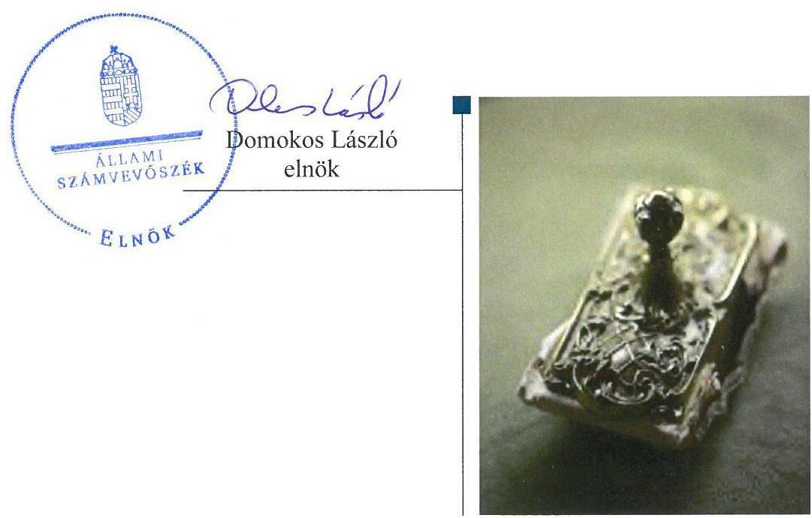
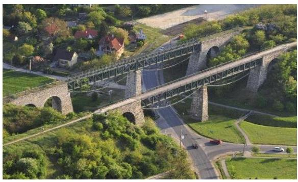
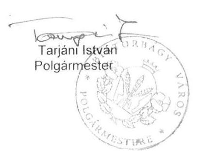
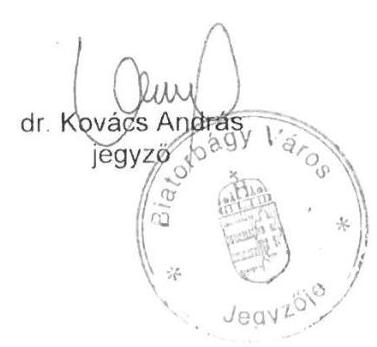
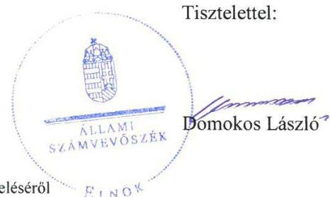
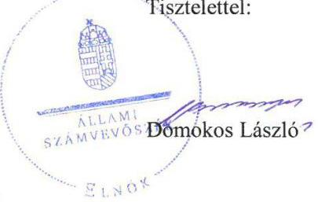

# Jelentés

## Önkormányzatok ellenőrzése-Integritás- és belső kontrollrendszer

**Biatorbágy Város Önkormányzata**

**2019.**

19135 www.asz.hu

---

# Jelenetés 

## Önkormányzatok ellenőrzése-Integritás- és belső kontrollrendszer

Biatorbágy Város Önkormányzata 2019. 10. hó 22. nap

---

# AZ ELLENŐRZÉST FELÜGYELTE:

DR. NAGY IMRE felügyeleti vezető

# AZ ELLENŐRZÉST VEZETTE ÉS A VÉGREHAJTÁSÁÉRT FELELŐS:

DR. DOMOKOS MAGDOLNA ellenőrzésvezető

# A PROGRAM ÖSSZEÁLLÍTÁSÁÉRT FELELŐS:

TÓTPÁL SZABOLCS osztályvezető

---

**IKTATÓSZÁM:** EL-1634-001/2019

**TÉMASZÁM:** 2485

**ELLENŐRZÉS-AZONOSÍTÓ SZÁM:** V-082949

---

Jelentéseink az Országgyűlés számítógépes hálózatán és az Interneta a www.asz.hu címen is olvashatóak.

---

# TARTALOMJEGYZÉK 

■ ÖSSZEGZÉS ..... 5
■ AZ ELLENŐRZÉS CÉLJA ..... 6
■ AZ ELLENŐRZÉS TERÜLETE ..... 7
■ AZ ELLENŐRZÉS HÁTTERE, INDOKOLTSÁGA ..... 8
■ A JELENTÉS LÉNYEGES KÉRDÉSKÖRE ..... 9
■ AZ ELLENŐRZÉS HATÓKÖRE ÉS MÓDSZEREI ..... 10
■ MEGÁLLAPÍTÁSOK ..... 12
■ JAVASLATOK ..... 13
■ MELLÉKLETEK ..... 15
I. sz. melléklet: Értelmező szótár ..... 15
■ FÜGGELÉKEK ..... 17
I. sz. függelék a jelentéshez ..... 17
II. sz. függelék: Észrevételek ..... 18
■ RÖVIDÍTÉSEK JEGYZÉKE ..... 25

---

.

---

# ÖSSZEGZÉS 

Biatorbágy Város Önkormányzatánál a belső kontrollrendszerben feltárt szabálytalanságok miatt nem volt biztositott az átláthatóság, elszámoltathatóság, a közpénzfelhasználás szabályossága és a nemzeti vagyonnal történő felelős gazdálkodás. Az integritási kontrollok kiépitése nem történt meg, ezáltal nem biztositották a korrupcióval szembeni védelem feltételeit.

## Az ellenőrzés társadalmi indokoltsága

Az Állami Számvevőszék alapvető feladata a közpénzekkel, az állami és önkormányzati vagyonnal való gazdálkodás ellenőrzése. Az Alaptörvény szerint az önkormányzatok kötelezettsége a kiegyensúlyozott, átlátható és fenntartható költségvetési gazdálkodás elvének érvényesítése, a nemzeti vagyonnal való rendeltetésszerű és felelős módon való gazdálkodás biztosítása. Az Állami Számvevőszék stratégiájában megfogalmazott célkitűzése az integritás alapú, átlátható és elszámoltatható közpénzfelhasználás elősegítése. Ennek megvalósítása érdekében az Állami Számvevőszék prioritásként kezeli a közpénzzel gazdálkodó szervezetek esetében a belső kontrollrendszer müködésének ellenőrzését.

## Főbb megállapítások, következtetések, javaslatok

A Biatorbágy Város Önkormányzatának gazdálkodási feladatait ellátó Biatorbágy Város Polgármesteri Hivatala a jogszabályi előírások ellenére nem rendelkezett a feladatellátás részletes belső rendjét és módját rögzítő szervezeti és működési szabályzattal, így az átlátható, elszámoltatható működés alapvető feltételei hiányoztak. Biatorbágy Város Polgármesteri Hivatala a belső kontrollrendszerének minőségét értékelő, jogszabály szerinti vezetői nyilatkozattal nem rendelkezett, ezáltal a jegyző nem biztosította a belső kontrollrendszer hiányosságainak saját hatáskörben történő feltárásának lehetőségét és azok kijavítását.

Biatorbágy Város Önkormányzatánál a kötelezően előírt, korrupció elleni védelmet támogató integritási kontrollok kiépítése nem történt meg, nem volt biztosított az integritás alapú közpénzfelhasználás lehetősége, továbbá teljesítménymérésre alkalmas követelmények kialakításának hiányában nem volt biztosított az államháztartás pénzeszközeivel és a nemzeti vagyonnal történő gazdaságos, hatékony és eredményes gazdálkodás mérésének lehetősége.

Az Állami Számvevőszék Biatorbágy Város Polgármesteri Hivatalának jegyzője részére a jogszabály szerint a Polgármesteri Hivatal szervezeti és müködési szabályzatának elkészítése, valamint a belső kontrollrendszer minőségének vezetői nyilatkozatban történő jövőbeni értékelése kapcsán fogalmazott meg javaslatot, melyre az érintettnek 30 napon belül intézkedési tervet kell készítenie.

---

# AZ ELLENŐRZÉS CÉLJA 

Az ellenőrzés célja annak megállapítása volt, hogy Biatorbágy Város Önkormányzatának belső kontrollrendszere biztosította-e a közpénzekkel és a nemzeti vagyonnal történő elszámoltatható, átlátható, szabályszerű, gazdaságos, hatékony és eredményes gazdálkodás feltételeit. Az ellenőrzés keretében értékeljük továbbá, hogy az önkormányzatnál kiépítették és erősítették-e a korrupciós kockázatok kezelését szolgáló integritás kontrollokat és azt, hogy megteremtették-e a teljesítményellenőrzés feltételeit.

---

# **AZ ELLENŐRZÉS TERÜLETE**

## **Biatorbágy Város Önkormányzata**

A Pest megyei Biatorbágy város lakosainak száma a Központi Statisztikai Hivatal közigazgatási helynévkönyve alapján 2017. január 1-jén 13 132 fő volt.

Az Önkormányzat¹ tizenkét tagú képviselő-testületének munkáját négy állandó bizottság segítette. A településen német nemzetiségi önkormányzat működött. A Polgármesteri Hivatalnál² foglalkoztatott köztisztviselők száma a 2017. év végén 43 fő volt.

Az Önkormányzat öt költségvetési szerv (bölcsődei, óvodai nevelési, szociális és közművelődési feladatok), három kizárólagos önkormányzati tulajdonban levő gazdasági társaság (városfejlesztési, sport és média szolgáltatások), továbbá négy társulásban (pl.: közterületfelügyeleti szolgáltatási társulásban) való részvétellel biztosította a település működéséhez szükséges feladatok elvégzését.

A költségvetési intézmények mindegyike önállóan működő, de gazdasági szervezettel nem rendelkező költségvetési szerv, melyeknek gazdálkodási feladatait a Polgármesteri Hivatal látta el.

A polgármester³ a 2010. évi önkormányzati választások óta tölti be tisztségét, a jegyző⁴ 2011. január 18-ai kinevezése óta látja el feladatait a településen.

Az Önkormányzat 2017. évi költségvetési beszámolója szerint 3624,1 millió Ft költségvetési bevételt, 2449,0 millió Ft költségvetési kiadást teljesített, vagyonának értéke 2017. december 31-én 20 765,1 millió Ft volt.

---

# AZ ELLENŐRZÉS HÁTTERE, INDOKOLTSÁGA 

A demokratikus társadalmakban alapvető igény, hogy a közpénzeket, a közvagyont használók tevékenységükről elszámoljanak, ahhoz egyértelmű és érvényesíthető felelősségi szabályok társuljanak. Ennek a jogos igénynek az érvényesítéséhez meg kell teremteni azokat a folyamatokat, rendszereket, amelyek nélkülözhetetlenek az elszámoltatáshoz. Az elszámoltatás eredményes működtetéséhez szükség van a megfelelő információs, kontroll-, értékelési és beszámolási rendszerek kialakítására. A belső kontrollok kiépítettsége hozzájárul az integritási szemlélet kialakításához és érvényesüléséhez. A belső kontrollrendszer kialakítása és működtetése nélkül nem valósítható meg a közpénzek, a közvagyon szabályos, gazdaságos, hatékony és eredményes felhasználása.

A BELSŐ KONTROLLRENDSZER azt a célt szolgálja, hogy az államháztartás szervei működésük és gazdálkodásuk során a tevékenységeket szabályszerűen, gazdaságosan, hatékonyan, eredményesen hajtsák végre, teljesítsék elszámolási kötelezettségeiket, és megvédjék az erőforrásokat a veszteségektől, a károktól, a nem rendeltetésszerű használattól. A belső kontrollrendszer magában foglalja mindazon szabályokat, eljárásokat, gyakorlati módszereket és szervezeti struktúrákat, kockázatkezelési technikákat, kontrolltevékenységeket, amelyek segítséget nyújtanak a szervezetnek céljai eléréséhez.

A megfelelő belső kontrollrendszer jelentősen csökkenti a hibák és szabálytalanságok kockázatát. Az ÁSZ célja, hogy javuljon az ellenőrzött önkormányzatok belső kontrollrendszerének szabályozottsága, működésének megfelelősége, szabályszerűsége, hozzájárulva ezzel az egyensúlyi helyzet fenntarthatóságának biztosításához, biztosítva az önkormányzatnál a közpénzfelhasználás szabályosságát, a közpénzekkel és a nemzeti vagyonnal történő szabályszerű, gazdaságos, hatékony és eredményes gazdálkodást.

AZ ELLENŐRZÉS VÁRHATÓ HASZNOSULÁSA négy szinten valósul meg. A törvényalkotás számára összegzett tapasztalatok állnak rendelkezésre a belső kontrollrendszer önkormányzati területen való kialakításáról, működtetéséről és hatásairól. Az ellenőrzés az ellenőrzött számára visszajelzést ad a belső kontrollrendszer kialakításában és múködésében lévő hiányosságokról, javaslataival hozzájárul azok kiküszöböléséhez. Az ellenőrzés megállapításait és javaslatait más szervezetek is hasznosíthatják a rendezett gazdálkodási keretek kialakításához, a ,,jó gyakorlat" elterjesztésével azok az önkormányzatok is átvehetik a pozitív példákat, ahol nem végez ellenőrzést az ÁSZ.

Az ÁSZ ellenőrzései jelzik a társadalom számára, hogy közpénz nem maradhat ellenőrizetlenül, tevékenysége hozzájárul az értékteremtő rend kialakításához és megőrzéséhez.

---

# A JELENTÉS LÉNYEGES KÉRDÉSKÖRE 

Az önkormányzat belső kontrollrendszerének kialakítása és müködtetése szabályszerű volt-e, az biztositotta-e az önkormányzatnál a közpénzfelhasználás szabályosságát, a nemzeti vagyonnal történő felelős gazdálkodást?

---

# AZ ELLENŐRZÉS HATÓKÖRE ÉS MÓDSZEREI 

## Az ellenőrzés típusa

Megfelelőségi ellenőrzés.

## Az ellenőrzött időszak

2017. év, illetve az éves költségvetési beszámoló Áht. ${ }^{5}$ által megállapított jóváhagyásáig (2018. május 31-éig) tartó időszak.

## Az ellenőrzés tárgya

Biatorbágy Város Önkormányzata és a gazdálkodási feladatokat ellátó Biatorbágy Város Polgármesteri Hivatala belső kontrollrendszerének kialakítása és múködtetése, valamint az integritás kontrollok kiépítettsége, a teljesítményellenőrzés feltételei.

## Az ellenőrzött szervezet

Biatorbágy Város Önkormányzata és Biatorbágy Város Polgármesteri Hivatala.

## Az ellenőrzés jogalapja

Az ellenőrzés jogszabályi alapját az ÁSZ tv6. 1. § (3) bekezdés, 5. § (2) és (6) bekezdései, valamint az Áht. 61. § (2) bekezdésének előírásai képezik.

## Az ellenőrzés módszerei

Az ÁSZ az ellenőrzést az ellenőrzési program szempontjai, az ellenőrzött időszakban hatályos jogszabályok, az ellenőrzés szakmai szabályai, a jelen ellenőrzésre irányadó ÁSZ módszertanok figyelembevételével hajtotta végre.

Az ellenőrzés ideje alatt az ellenőrzött szervezettel történő kapcsolattartást az ÁSZ SZMSZ ${ }^{7}$-ének vonatkozó előírásai alapján biztosította az ÁSZ.

Az ellenőrzési kérdések megválaszolásához szükséges bizonyítékok megszerzése az ellenőrzött által rendelkezésre bocsátott dokumentumokra, adatokra alapozva megfigyelés, valamint elemző eljárás útján történt.

---

Az ellenőrzési bizonyítékként felhasználható adatforrások közé tartoznak az ellenőrzési program részletes szempontjainál felsorolt adatforrások, valamint minden egyéb - az ellenőrzés folyamán feltárt, az ellenőrzés szempontjából információt tartalmazó - dokumentum.

Az önkormányzat belső kontrollrendszerének összesített értékelése az egyes részterületek esetében kapott megfelelőségi arányok számtani átlaga alapján történik és megegyezik a pillérenként (kontroll-területenként) alkalmazott százalékos értékelésekkel, a következő eltérésekkel: a kontrollrendszer egésze esetében a „szabályszerú" értékelésnek a százalékos értéken felül további feltétele, hogy egyik kontrollterület sem kaphat „nem szabályszerű" értékelést.

Amennyiben az önkormányzat múködését és gazdálkodását alapvetően meghatározó dokumentum hiánya miatt, valamely lényeges kérdéskörre vonatkozóan az ÁSZ megállapítást tett, további ellenőrzési tevékenységek az adott kérdéskörrel és az azzal szoros logikai kapcsolatban lévő kérdéskörökkel - ráépülő jelleggel - nem kerültek végrehajtásra.

---

# MEGÁLLAPÍTÁSOK 

## 1. Az önkormányzat belső kontrollrendszerének kialakítása és múködtetése szabályszerű volt-e, az biztosította-e az önkormányzatnál a közpénzfelhasználás szabályosságát, a nemzeti vagyonnal történő felelős gazdálkodást?

Összegző megállapítás

Az Önkormányzatnál a belső kontrollrendszer kialakítása és múködtetése nem volt szabályszerű, az nem biztosította a közpénzfelhasználás szabályosságát, a nemzeti vagyonnal történő felelős gazdálkodást.

AZ ÖNKORMÁNYZAT NEM SZABÁLYSZERŰ KONTROLLKÖRNYEZETBEN működött, mert a jegyző az Áht. 10. § (5) bekezdésében előírtak ellenére nem gondoskodott a Polgármesteri Hivatal szervezetének, feladatai ellátásának részletes belső rendjének és módjának szervezeti és múködési szabályzatban történő megállapításáról.

A MONITORING RENDSZER MÚKÖDTETÉSE NEM VOLT SZABÁLYSZERŰ. A jegyző a Polgármesteri Hivatal belső kontrollrendszerének minőségét értékelő, jogszabály szerinti vezetői nyilatkozatot a Bkr. ${ }^{8}$ 11. § (1) bekezdésének előírása ellenére nem tette meg.

AZ ÖNKORMÁNYZATNÁL A JOGSZABÁLYOK ÁLTAL KÖTELEZŐEN ELŐÍRT INTEGRITÁST TÁMOGATÓ KONTROLLOK KIÉPÍTÉSE NEM TÖRTÉNT MEG. Az Önkormányzatnál nem végeztek kockázatelemzést, ezáltal nem azonosították az integritást veszélyeztető kockázatokat, továbbá nem határozták meg az integritás erősítésére és a korrupció megelőzésére szolgáló értékeket.

AZ ÖNKORMÁNYZATNÁL NEM ALAKÍTOTTAK KI A TELJESÍTMÉNY MÉRÉSÉRE ALKALMAS KÖVETELMÉNYEKET. A szervezeti célok elérését szolgáló feladatok, folyamatok, tevékenységek mérését szolgáló indikátorokat, mérőszámokat, feladat- és teljesítménymutatókat nem képeztek.

---

# JAVASLATOK 

Az ÁSZ tv. 33. § (1) bekezdésében foglaltak értelmében az ellenőrzött szervezet vezetője köteles a jelentésben foglalt megállapításokhoz kapcsolódó intézkedési tervet összeállítani és azt a jelentés kézhezvételétől számított 30 napon belül az ÁSZ részére megküldeni. Amennyiben az ellenőrzött szervezet vezetője nem küldi meg határidőben az intézkedési tervet, vagy továbbra sem elfogadható intézkedési tervet küld, az Állami Számvevőszék elnöke az ÁSZ tv. 33. § (3) bekezdése a) és b) pontjaiban foglaltakat érvényesítheti.

## Biatorbágy Város Polgármesteri Hivatala jegyzőjének

1. Intézkedjen Biatorbágy Város Polgármesteri Hivatala szervezeti és müködési szabályzatának elkészitéséről a jogszabályi előirásnak megfelelően.
(1. sz. megállapítás 1. bekezdése alapján)
2. Intézkedjen, hogy a jövőben jogszabályi előírásnak megfelelően nyilatkozatban értékelje a költségvetési szerv belső kontrollrendszerének minőségét.
(1. sz. megállapítás 2. bekezdés 2. mondata alapján)

---

.

---

# MELLÉKLETEK 

- I. SZ. MELLÉKLET: ÉRTELMEZŐ SZÓTÁR
belső ellenőrzés
belső kontrollrendszer
belső kontrollrendszer területei
információs és kommunikációs rendszer
integrált kockázatkezelési rendszer
integritás
irányító szerv/felügyeleti szerv
kockázat
kontrollkörnyezet
kontrolltevékenységek

Független, tárgyilagos bizonyosságot adó és tanácsadó tevékenység, amelynek célja, hogy az ellenőrzött szervezet működését fejlessze és eredményességét növelje, az ellenőrzött szervezet céljai elérése érdekében rendszerszemléletű megközelítéssel és módszeresen értékeli, illetve fejleszti az ellenőrzött szervezet irányítási és belső kontrollrendszerének hatékonyságát (Forrás: Bkr. 2. § b) pontja)
A belső kontrollrendszer a kockázatok kezelése és tárgyilagos bizonyosság megszerzése érdekében kialakított folyamatrendszer, amely azt a célt szolgálja, hogy a müködés és gazdálkodás során a tevékenységeket szabályszerűen, gazdaságosan, hatékonyan, eredményesen hajtsák végre, az elszámolási kötelezettségeket teljesítsék, megvédjék az erőforrásokat a veszteségektől, károktól és nem rendeltetésszerű használattól (Forrás: Áht. 69. § (1) bekezdése)
A kontrollkörnyezet, az integrált kockázatkezelési rendszer, a kontrolltevékenységek, az információs és kommunikációs rendszer, valamint a nyomon követési (monitoring) rendszer. (Forrás: Bkr. 3. §-a)
A költségvetési szerv vezetője által kialakított és müködtetett olyan rendszer, mely biztosítja, hogy a megfelelő információk a megfelelő időben eljutnak az illetékes szervezethez, szervezeti egységhez, illetve személyhez. (Forrás: Bkr. 9. § (1) bekezdés)

Olyan folyamatalapú kockázatkezelési rendszer, amely a szervezet minden tevékenységére kiterjed, egységes módszertan és eljárások alkalmazásával, a szervezet célkitűzéseinek és értékeinek figyelembevételével biztosítja a szervezet kockázatainak teljes körű azonosítását, azok meghatározott kritériumok szerinti értékelését, valamint a kockázatok kezelésére vonatkozó intézkedési terv elkészítését és az abban foglaltak nyomon követését. (Forrás: Bkr. 2. § m) pontja, 2016. október 1-jétől)

Az integritás az elvek, értékek, cselekvések, módszerek, intézkedések konzisztenciáját jelenti, vagyis olyan magatartásmódot, amely meghatározott értékeknek megfelel. (Forrás: Nemzetgazdasági Minisztérium: Magyarországi államháztartási belső kontroll standardok Útmutató 1.6.1. pontja, 2012. december)
A költségvetési szerv tekintetében az Áht-ban meghatározott irányítási hatáskört gyakorló szerv. (Forrás: Áht. 1. § 9. pontja)
A kockázat annak a valószínűségét jelenti, hogy egy vagy több esemény vagy intézkedés nem kívánt módon befolyásolja a rendszer müködését, céljainak megvalósulását. (Forrás: Javaslatok a korrupciós kockázatok kezelésére Kockázatkezelési és ellenőrzési módszertan 35. oldal, ÁSZ)
A költségvetési szerv vezetője által kialakított olyan elvek, eljárások, belső szabályzatok összessége, amelyben világos a szervezeti struktúra, egyértelműek a felelősségi, hatásköri viszonyok és feladatok, meghatározottak az etikai elvárások a szervezet minden szintjén, átlátható a humánerőforrás-kezelés (Forrás: Bkr. 6. § (1) bekezdés)
A költségvetési szerv vezetője által a szervezeten belül kialakított (kontroll) tevékenységek, melyek biztosítják a kockázatok kezelését, hozzájárulnak a szervezet céljainak eléréséhez (Forrás: Bkr. 8. § (1) bekezdés)

---

| kommunikáció | Az a tevékenység, melynek során információ továbbítása valósul meg. A kommunikációs folyamat résztvevői között tájékoztatás történik, mely során tényeket, ezek magyarázatát közlik. |
| :--: | :--: |
| közös önkormányzati hivatal | A települési képviselő-testület más települési képviselő-testülettel társult képviselő-testületet alakíthat, amely esetén a képviselő-testületek részben vagy egészben egyesítik a költségvetésüket, közös önkormányzati hivatalt tartanak fenn, és intézményeiket közösen múködtetik. (Forrás: Mötv. 56. § (1)-(2) bekezdései) |
| monitoring | A monitoring általánosságban a különböző szintű szervezeti célok megvalósításának folyamatát kíséri figyelemmel, melynek során a releváns eseményekről és tevékenységekről (együtt: folyamatokról) rendszeres jelleggel, strukturált, döntéstámogató információkhoz jutnak a szervezet vezetői. (Forrás: NGM Útmutató a költségvetési szervek monitoring rendszeréhez 2011. november) |
| monitoring rendszer | A költségvetési szerv vezetője köteles kialakítani a szervezet tevékenységének a célok megvalósításának nyomon követését biztosító rendszert, amely az operatív tevékenységek keretében megvalósuló folyamatos és eseti nyomon követésből, valamint az operatív tevékenységektől függetlenül múködő belső ellenőrzésből állhat. (Forrás: Bkr. 10. §) |
| önkormányzati hivatal | A polgármesteri hivatal, a főpolgármesteri hivatal, a megyei önkormányzati hivatal és a közös önkormányzati hivatal. (Forrás: Áht. 1. § 18. pont) |
| társulás | A helyi önkormányzatok képviselő-testületei megállapodhatnak abban, hogy egy vagy több önkormányzati feladat- és hatáskör, valamint a polgármester és a jegyző államigazgatási feladat- és hatáskörének hatékonyabb, célszerűbb ellátására jogi személyiséggel rendelkező társulást hoznak létre. (Forrás: Mötv. 87. §) |

---

# FÜGGELÉKEK 

- I. SZ. FÜGGELÉK A JELENTÉSHEZ

Az Állami Számvevőszék az ellenőrzések során feltárt tényekhez kapcsolódó további körülmények tisztázására eszközrendszerrel nem rendelkezik. Amennyiben az ellenőrzésen túlmutatóan indokoltnak látszik az ellenőrzés során feltárt körülmények további vizsgálata, az Állami Számvevőszék törvényi felhatalmazás alapján az ellenőrzés által feltárt körülményeket továbbítja a hatáskörrel rendelkező szervnek a szükséges intézkedések megtétele, eljárások lefolytatása érdekében.
Az ellenőrzés feltárta, hogy a jegyző az Áht. 10. § (5) bekezdésében előírtak ellenére nem gondoskodott a Biatorbágy Város Polgármesteri Hivatala általi feladatellátás részletes belső rendjének és módjának szervezeti és müködési szabályzatban történő megállapításáról, ezáltal a Polgármesteri Hivatal feladatellátásának keretei, továbbá az ehhez kapcsolódó felelősségi és jogosultsági viszonyok nem tisztázottak, a törvényes müködés nem biztosított.
Az eset körülményeinek felderítésére az önkormányzatok törvényességi felügyeletét ellátó illetékes Kormányhivatal rendelkezik hatáskörrel.

---

A jelentéstervezetet a Számvevőszék 15 napos észrevételezésre megküldte az ellenőrzött szervezetek vezetőinek az ÁSZ tv. 29. §̊ (1) bekezdése előirásának megfelelően.

A jelentéstervezet megállapításaira Biatorbágy Város Önkormányzata polgármestere és Biatorbágy Város Polgármesteri Hivatalának jegyzője a törvényes határidőben írásban észrevételt tettek.
Az ÁSZ tv. 29. § (3) bekezdésével összhangban az ÁSZ a Függelékben feltünteti az ellenőrzés megállapításaival kapcsolatban tett, figyelembe nem vett észrevételeket, és megindokolja, hogy azokat miért nem fogadta el.

[^0]
[^0]:    * 29. § (1) Az Állami Számvevőszék az ellenőrzési megállapításait megküldi az ellenőrzött szervezet vezetőjének vagy az általa megbízott személynek, és annak, akinek személyes felelősségét állapította meg.
    (2) Az ellenőrzött szervezet vezetője és a felelősként megjelölt személy az ellenőrzés megállapításaira tizenöt napon belül írásban észrevételt tehet.
    (3) Az Állami Számvevőszék az észrevételre a beérkezésétől számított harminc napon belül írásban válaszol. A figyelembe nem vett észrevételeket köteles a jelentésben feltüntetni, és megindokolni, hogy azokat miért nem fogadta el.

---

# BiatorbagY 

## VÁros PolgÁrMESTERE És JEGYZŐJE

2031 Biatorbagy, Baross Gábor utca 2/3.
Telefon: 0623 310-174/213 mellék Fax: 0623 310-135
E-mail: polgarmester@biatorbagy.hu www.biatorbagy.hu
Iktatószám: P0-11-6/2019. Úgyintéó: Ceuczor Orsolyá
Fárgy: Válasz az EL-1031-037/2019. iks. szimni jelentéstervezetre

## Állami Számvevőszék Elnöke részére

1052 Budapest
Apáczai Csere János u. 10.

Tisztelt Domokos László Elnök Úr!

## ÁLLAMI SZÁMVEVÓSZÉK   2E-37368/2019/1

Érészett: 2019 JÓN 14
Iktatószám: EL-1031-28/2019
Melléklet:

Hivatkozással EL-1031-037/2019. iktatószámú az "Önkormányzatok ellenőrzése Integritás- és belső kontrollrendszer" címủ számvevőszéki ellenőrzés keretében megküldött Hivatalomnál 2019. május 31. napján iktatott számvevőszéki jelentéstervezetére határidőben az alábbi észevételeket kívánjuk tenni:

- Hiányosságunknak eleget téve a tévedésből lemaradt Biatorbágyi Polgármesteri Hivatalának - az Áht. 10. § (5) bekezdése szerinti - jelenleg hatályos szervezeti és müködési szabályzatát, valamint: a Bkr. 11§ (1) bekezdésében előírt a Polgármesteri Hivatal belső kontrollrendszerének minőségét értékelő, jogszabály szerinti vezetői nyilatkozatot a 2018. évre vonatkozóan utólagosan megküldtük Tisztelt Elnök Úr részére, mely hiányosság - a rövid határidőre, valamint a szolgáltatni kívánt dokumentumok mennyiségére tekintettel tévedésből nem került megküldésre, melyért ezúton is szíves elnézését kérjük;
- Tekintettel arra, hogy az ellenőrzés során a bemutatni és felsorolni kért pénzügyiszámvitel tranzakciókból mintavétel nem történt, így nem látszódott, hogy a helyi utalványrendeleten - a pénzügyi teljesítés előtt - a kötelezően előírt ellenőrzési folyamaton túl egy teljességi ellenőrzés (mely magában foglalja a FEUVE valamennyi elemét is) beépítésre került. A többlet ellenőrzést végző munkatársunknak ez a feladata a - a szintén be nem kért- munkaköri leírásában is rögzítve van;
- A FEUVE keretén belül feltárt hiányosságok azonnal javítva vannak és valamennyi, a Polgámesteri Hivatallal gazdasági szervezete által ellátott intézmény vonatkozásában a típushibák elkerülése végett szakmai tájékoztató anyagok készülnek és a használt rendszeren finomítva letiltásra kerül, hogy továbbra is előforduljanak;
- Mindezek mellett munkatársainak magasan kvalifikáltak, felsőfokú szakirányú végzettséggel és az államháztartásban eltöltött több éves szakmai gyakorlattal rendelkeznek, etikailag és morálisan feddhetetlenek;

---

- Személyi állományunk stabil, esetleges változásánál a minőségi pótlás kiemelt, mindent megelőző szempont;
- Kollégáink motiváltak is, jogszabálynak és a jogszabályi célnak megfelelően a feladatok elöírása és minősitése folyamatos visszacsatoltást biztosítva félévente megtörténik;
- Meggyőződésünk, hogy Biatorbágy Város Önkormányzata müködésének és gazdálkodásának integritása erős, mivel eredményeink konzisztensek (összhangban állnak) a széleskörü és szabályosan müködtetett közfeladatok ellátására irányuló céljainkkal és értékeinkkel;
- Eredményeinket alátámasztják, hogy az Önkormányzat 2010. óta hitelfelvétellel forrásait nem bővítette, intézményhálózatát és ellátott feladatainak körét és minőségét viszont annál inkább. Emellett a szállítói tartozás és kintlévőség állományunknak a minimálisra csökkentését értük el mind összegben, mind pedig időtartamban. Likviditásunk folyamatosan és biztosan stabil, eredményes és gazdálkodásunk biztosított;
- Hatékony és eredményes közfeladat ellátása érdekében alakítottuk ki kontrollkörnyezetünket, az Önkormányzattól megszokott módon, melyben elsődleges - a számviteli törvényben is elöírt - költség-haszon elvének szem előtt tartása az életszerű, gördülékeny és valamennyi ágazati szabályok betartásával történő müködés biztosításával;
- Természetesen minden intézményünk rendelkezik Szervezeti és Müködési Szabályzattal ( és valamennyi - abban hivatkozott dokumentummal ), hiszen annak hiánya lehetetlenné tenné a központi állami támogatás igénybevételét is;
- Szervezeti és Müködési Szabályzatunk a helyi változásokat valamint - az általunk ismert - jogszabályi változásokat is rendre lekövette, mint ahogy ezt az Önök részére az ellenőrzés folyamán meg is küldtük.

Javaslatukhoz kapcsolódóan kérjük segítségüket abban, hogy a jelzett hiányosságokat - jogszabályi hivatkozás megjelölésével - szíveskedjenek konkrétan kifejteni részünkre, hogy az intézkedési tervünket pontosan el tudjuk készíteni és az Önök által megjelölt hibánkat maradéktalanul tudjuk javítani.

Fentiek szerint kérjük Tisztelt Elnök Úr szíves közbenjárását javaslataink végleges jelentés elkészítésében történő figyelembevételére.

Biatorbágy, 2019. június 13.

Tisztelettel:

---

ELNÖK

# Tarjáni István úr 

polgármester
Biatorbágy Város Önkormányzata

## Biatorbágy

## Tisztelt Polgármester Úr!

„Önkormányzatok ellenőrzése - Integritás és belső kontrollrendszer - Biatorbágy Város Önkormányzata" címmel készített számvevőszéki jelentéstervezetre tett, P0-11-6/2019. számú észrevételt tartalmazó, Jegyző úrral együttesen aláirt levelét köszönettel megkaptam.
Az Állami Számvevőszék észrevételre vonatkozó álláspontjáról a felügyeleti vezető által készített részletes tájékoztatást csatoltan megküldöm.
Tájékoztatom Polgármester urat, hogy a számvevőszéki jelentésben - az Állami Számvevőszékről szóló 2011. évi LXVI. törvény 29. § (3) bekezdése alapján - a figyelembe nem vett észrevételeket szerepeltetjük az elutasítás indokának feltüntetésével.

Budapest, 2019. O7 hó 27 nap

Melléklet: Tájékoztatás az észrevételek kezeléséről

---

# Tájékoztatás   az észrevételek kezeléséről 

„Önkormányzatok ellenőrzése - Integritás és belső kontrollrendszer - Biatorbágy Város Önkormányzata" című jelentéstervezetre 2019. június 13-án tett (az Állami Számvevőszékhez 2019. június 14-én érkezett) észrevételt áttekintettük, annak kezelésével kapcsolatban a következő tájékoztatást adom.

## A jelentéstervezetre tett észrevétel:

A 2019. június 13-án kelt (P0-11-6/2019. ikt sz.) észrevételt tartalmazó levél 2. bekezdésében Polgármester úr és Jegyző úr elismerték, hogy Biatorbágy Város Polgármesteri Hivatalának az Áht. 10. § (5) bekezdése szerinti szervezeti és müködési szabályzata, valamint Biatorbágy Város Polgármesteri Hivatalának a Bkr. 11. § (1) bekezdésében előírt belső kontrollrendszerének minőségét értékelő, jogszabály szerinti vezetői nyilatkozata nem került megküldésre az ellenőrzés részére.
Az ÁSZ az ellenőrzési megállapításait az adatszolgáltatás során a részére törvényi határidőben rendelkezésre bocsátott dokumentumokra alapozva fogalmazza meg. Az EL-1031-001/2018. iktatási számú adatbekérő levélben kért adatok kapcsán a 2018. augusztus 31-én kelt, és az EL-1031004/2018. iktatási számú adatbekérő levélben kért adatok kapcsán a 2018. szeptember 20-án kelt teljességi és hitelességi nyilatkozat szerint az ÁSZ részére átadott dokumentumok, adatok megbízhatóak, és a bekért adatokra, dokumentumokra vonatkozóan teljes körű információt tartalmaznak.

Az adatbekérő levelekben megjelölt, bekért dokumentumokra vonatkozóan a teljességi és hitelességi nyilatkozatokban felsorolt dokumentumok között nem szerepel a fentebb említett két dokumentum.

Fentiek alapján az ellenőrzött időszakra vonatkozóan Biatorbágy Város Polgármesteri Hivatala hatályos szervezeti és müködési szabályzatot, valamint Biatorbágy Város Polgármesteri Hivatala belső kontrollrendszerének minőségét értékelő, jogszabály szerinti vezetői nyilatkozatot nem bocsátott az ellenőrzés rendelkezésre, ezért a jelentéstervezet módosítása nem indokolt.

A 2019. június 13-án kelt (P0-11-6/2019. ikt sz.), észrevételt tartalmazó levél 3-12. bekezdések tájékoztatásai nem a jelentéstervezet megállapításaihoz kapcsolódnak, nem észrevételek.

Budapest, 2019. ơt. hó ơ nap
Dr. Nagy Imre
felügyeleti vezető

---

ELNÖK

Ikt.szám: EL-1031-045/2019.

# Dr. Kovács András úr 

jegyzó
Biatorbágy Város Polgármesteri Hivatala
Biatorbágy

## Tisztelt Jegyző Úr!

„Önkormányzatok ellenőrzése - Integritás és belső kontrollrendszer - Biatorbágy Város Önkormányzata" címmel készített számvevőszéki jelentéstervezetre tett, P0-11-6/2019. számú észrevételt tartalmazó, Polgármester úrral együttesen aláirt levelét köszönettel megkaptam.
Az Állami Számvevőszék észrevételre vonatkozó álláspontjáról a felügyeleti vezető által készített részletes tájékoztatást csatoltan megküldöm.
Tájékoztatom Jegyző urat, hogy a számvevőszéki jelentésben - az Állami Számvevőszékről szóló 2011. évi LXVI. törvény 29. § (3) bekezdése alapján - a figyelembe nem vett észrevételeket szerepeltetjük az elutasítás indokának feltüntetésével.

Budapest, 2019. 07 hó 07 nap

Tisztelettel:

Melléklet: Tájékoztatás az észrevételek kezeléséről

---

# Tájékoztatás   az észrevételek kezeléséről 

„Önkormányzatok ellenőrzése - Integritás és belső kontrollrendszer - Biatorbágy Város Önkormányzata" című jelentéstervezetre 2019. június 13-án tett (az Állami Számvevőszékhez 2019. június 14-én érkezett) észrevételt áttekintettük, annak kezelésével kapcsolatban a következő tájékoztatást adom.

## A jelentéstervezetre tett észrevétel:

A 2019. június 13-án kelt (P0-11-6/2019. ikt sz.) észrevételt tartalmazó levél 2. bekezdésében Polgármester úr és Jegyző úr elismerték, hogy Biatorbágy Város Polgármesteri Hivatalának az Áht. 10. § (5) bekezdése szerinti szervezeti és müködési szabályzata, valamint Biatorbágy Város Polgármesteri Hivatalának a Bkr. 11. § (1) bekezdésében előírt belső kontrollrendszerének minőségét értékelő, jogszabály szerinti vezetői nyilatkozata nem került megküldésre az ellenőrzés részére.
Az ÁSZ az ellenőrzési megállapításait az adatszolgáltatás során a részére törvényi határidőben rendelkezésre bocsátott dokumentumokra alapozva fogalmazza meg. Az EL-1031-001/2018. iktatási számú adatbekérő levélben kért adatok kapcsán a 2018. augusztus 31-én kelt, és az EL-1031004/2018. iktatási számú adatbekérő levélben kért adatok kapcsán a 2018. szeptember 20-án kelt teljességi és hitelességi nyilatkozat szerint az ÁSZ részére átadott dokumentumok, adatok megbízhatóak, és a bekért adatokra, dokumentumokra vonatkozóan teljes körű információt tartalmaznak.

Az adatbekérő levelekben megjelölt, bekért dokumentumokra vonatkozóan a teljességi és hitelességi nyilatkozatokban felsorolt dokumentumok között nem szerepel a fentebb említett két dokumentum.

Fentiek alapján az ellenőrzött időszakra vonatkozóan Biatorbágy Város Polgármesteri Hivatala hatályos szervezeti és müködési szabályzatot, valamint Biatorbágy Város Polgármesteri Hivatala belső kontrollrendszerének minőségét értékelő, jogszabály szerinti vezetői nyilatkozatot nem bocsátott az ellenőrzés rendelkezésre, ezért a jelentéstervezet módosítása nem indokolt.

A 2019. június 13-án kelt (P0-11-6/2019. ikt sz.), észrevételt tartalmazó levél 3-12. bekezdések tájékoztatásai nem a jelentéstervezet megállapításaihoz kapcsolódnak, nem észrevételek.

Budapest, 2019. 04. hó 01 nap
Dr. Nagy Imre
felügyeleti vezető

---

# RÖVIDÍTÉSEK JEGYZÉKE 

${ }^{1}$ Önkormányzat
${ }^{2}$ Polgármesteri Hivatal
${ }^{3}$ polgármester
${ }^{4}$ jegyző
${ }^{5}$ Áht.
${ }^{6}$ ÁSZ tv.
${ }^{7}$ ÁSZ SZMSZ
${ }^{8}$ Bkr.

Biatorbágy Város Önkormányzata
Biatorbágy Város Polgármesteri Hivatala
Biatorbágy Város Önkormányzatának polgármestere
Biatorbágy Város Polgármesteri Hivatal jegyzője
2011. évi CXCV. törvény az államháztartásról
2011. évi LXV. törvény az Állami Számvevőszékről
Az Állami Számvevőszék elnökének 2/2018. (XII.28.) ÁSZ utasítása az Állami
Számvevőszék Szervezeti és Működési Szabályzatáról
370/2011. (XII. 31.) Korm. rendelet a költségvetési szervek belső
kontrollrendszeréről és belső ellenőrzéséről

---

# ÁLLAMI SZÁMVEVŐSZÉK 

1052 Budapest, Apáczai Csere János utca 10.
Levélcím: 1364 Budapest 4. Pf. 54
Telefon: +36 14849100 Telefax: +36 14849200
www.asz.hu