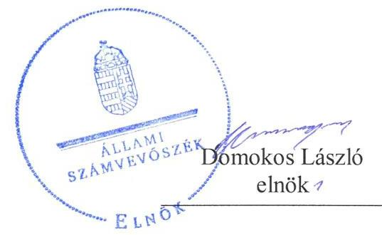
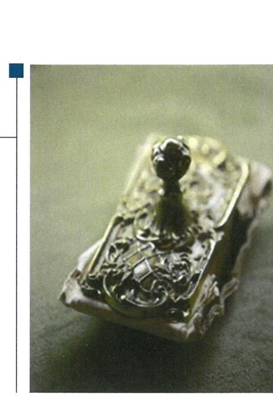
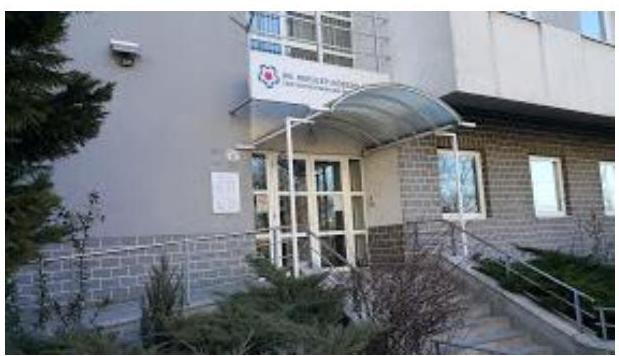

# Jelentés 

## Nemzeti tulajdonú gazdasági társaságok ellenőrzése

XIII. Kerületi Közszolgáltató Zrt. 2019. 10. hó 21. nap

---

# AZ ELLENŐRZÉST FELÜGYELTE:

- KAKAS SÁNDOR felügyeleti vezető
- AZ ELLENŐRZÉST VEZETTE ÉS A VÉGREHAJTÁSÁÉRT FELELŐS:
  - PETRÓ KATALIN ellenőrzésvezető
  - A PROGRAM ÖSSZEÁLLÍTÁSÁÉRT FELELŐS:
    - TÓTPÁL SZABOLCS osztályvezető

**IKTATÓSZÁM:** EL-1638-001/2019

**TÉMASZÁM:** 2478

**ELLENŐRZÉS-AZONOSÍTÓ SZÁM:** V082223

Jelentéseink az Országgyűlés számítógépes hálózatán és az Interneten a www.asz.hu címen is olvashatóak.

---

# TARTALOMJEGYZÉK 

■ ÖSSZEGZÉS ..... 5
■ AZ ELLENŐRZÉS CÉLJA ..... 6
■ AZ ELLENŐRZÉS TERÜLETE ..... 7
■ AZ ELLENŐRZÉS HÁTTERE, INDOKOLTSÁGA ..... 8
■ A JELENTÉS LÉNYEGES KÉRDÉSKÖREI ..... 9
■ AZ ELLENŐRZÉS HATÓKÖRE ÉS MÓDSZEREI ..... 10
■ MEGÁLLAPÍTÁSOK ..... 12
■ JAVASLATOK ..... 14
■ MELLÉKLETEK ..... 15
I. sz. melléklet: Értelmező szótár ..... 15
■ FÜGGELÉKEK ..... 17
I. sz. függelék a jelentéshez ..... 17
II. sz. függelék: Észrevételek ..... 18
■ RÖVIDÍTÉSEK JEGYZÉKE ..... 23

---

.

---

# ÖSSZEGZÉS 

A XIII. Kerületi Közszolgáltató Zrt. felett tulajdonosi jogokat gyakorló Budapest Főváros XIII. Kerületi Önkormányzat tulajdonosi joggyakorlása nem volt szabályszerű. A XIII. Kerületi Közszolgáltató Zrt. számviteli beszámolóit nem támasztotta alá leltárral, ezért nem volt biztosított az átláthatóság és elszámoltathatóság.

## Az ellenőrzés társadalmi indokoltsága

A nemzeti tulajdonú gazdasági társaságok ellenőrzése kiemelten fontos a nemzeti vagyon megőrzése érdekében. Gazdálkodásuk jellemzően a közérdeklődés és a média figyelmének középpontjában áll, amihez hozzájárul a gazdálkodásuk körébe tartozó - a nemzeti vagyon részét képező - vagyon nagysága, illetve az általuk ellátott közszolgáltatások minősége és hatékonysága. Az ellenőrzések feltárhatják, hogy a tulajdonosi felügyelet hozzájárult-e a szabályszerű gazdálkodáshoz és feladatellátáshoz. A megállapítások alapján megfogalmazott számvevőszéki javaslatok hasznosítása elősegítheti a meglévő hibák megszüntetését. A jó gyakorlatok bemutatásával az ÁSZ hozzájárulhat a követendő megoldások megismertetéséhez, terjesztéséhez.

## Főbb megállapítások, következtetések, javaslatok

Budapest Főváros XIII. Kerületi Önkormányzat a tulajdonosi jogait nem szabályszerűen gyakorolta, a Társaság javadalmazással összefüggő szabályzatát nem alkotta meg.

A XIII. Kerületi Közszolgáltató Zrt. vagyongazdálkodása nem volt szabályszerű, a 2015-2017. évi számviteli beszámolók mérlegeit nem támasztotta alá leltárral, ezért az éves beszámolók nem voltak megalapozottak.

Az Állami Számvevőszék a jelentésben foglalt megállapítások alapján Budapest Főváros XIII. Kerületi Önkormányzat polgármesterének és a XIII. Kerületi Közszolgáltató Zrt. vezérigazgatójának egy-egy javaslatot fogalmazott meg. A javaslatokat megalapozó megállapításokra az érintetteknek 30 napon belül intézkedési tervet kell készíteniük.

---

# AZ ELLENŐRZÉS CÉLJA 

AZ ELLENŐRZÉS CÉLJA annak megítélése volt, hogy a tulajdonosi joggyakorló a gazdasági társasága feletti tulajdonosi joggyakorlás kereteit kialakította-e, tulajdonosi jogait megfelelően gyakorolta-e és kötelezettségeit teljesítette-e. Továbbá, a gazdasági társaság biztosította-e a vagyon védelmét a nyilvántartások szabályszerű vezetése, és a mérleg tételeinek leltárral történő alátámasztása útján, valamint szabályszerűen gondoskodott-e a társaság használatában, kezelésében lévő nemzeti vagyon értékének megőrzéséről, gyarapításáról, hasznosításáról.

---

# **AZ ELLENŐRZÉS TERÜLETE**

## **XIII. Kerületi Közszolgáltató Zrt. és a tulajdonosi jogokat gyakorló Budapest Főváros XIII. Kerületi Önkormányzat**

A XIII. Kerületi Közszolgáltató Zrt. kizárólagos önkormányzati tulajdonban álló gazdasági társaság. A Társaságot 1995. július 01-jén alapította a Budapest Főváros XIII. Kerületi Önkormányzat. A Társaság 2012. január 01-től működött XIII. Kerületi Közszolgáltató Zrt. néven.

A Társaság kizárólagos részvényese az Önkormányzat, az egy darab törzsrészvény névértéke 1270 millió Ft. A jegyzett tőke nagysága az ellenőrzött időszakban nem változott.

A Társaság főtevékenysége ingatlankezelés, emellett ellátta a közterületek üzemeltetését, parkolási tevékenységet, valamint kulturális rendezvények szervezését. Az ellátott feladatokat a Budapest Főváros XIII. Kerületi Önkormányzattal kötött Közszolgáltatási szerződés1,22 keretében látta el közfeladatként.

Az Önkormányzat3 a Vagyonrendeletében4 a Társaságot jelölte ki a vagyongazdálkodási feladatok gyakorlására, valamint a tevékenységi köre szerinti közfeladatok ellátására.

A Társaság más gazdasági társaságban mértékadó befolyást gyakorló tulajdonosi részesedéssel nem rendelkezett, vagyonkezelésbe vett vagyona az ellenőrzött időszakban nem volt, vagyonkezelési szerződéssel nem rendelkezett, nem minősült kormányzati szektorba sorolt gazdálkodó szervezetnek.

A 2017. üzleti évben a Társaság 2 288,7 millió Ft értékesítés nettó árbevétel mellett 75,7 millió Ft adózott eredményt ért el, a foglalkoztatottak száma 289 fő volt.

A Társaság vezérigazgatójának személye az ellenőrzött időszak alatt nem változott, tevékenységét 2012. január 1. naptól látta el. A Társaságnál 6 tagú Felügyelő bizottság5 és állandó könyvvizsgáló működött.

Az Önkormányzat kizárólagos tulajdonában állt két gazdasági társaság: a XIII. Kerületi Közszolgáltató Zrt., valamint a XIII. Kerületi Egészségügyi Szolgálat Nkft. Az ellenőrzött időszakban a polgármester és a jegyző személyében nem történt változás.

---

# AZ ELLENŐRZÉS HÁTTERE, INDOKOLTSÁGA 

Az Alaptörvény 38. cikke alapján az állam és a helyi önkormányzatok tulajdona nemzeti vagyon. A nemzeti vagyon megőrzése, megóvása érdekében kiemelten fontos ezen nemzeti tulajdonú gazdasági társaságok ellenőrzése. Gazdálkodásuk jellemzően a közérdeklődés és a médiafigyelmének középpontjában áll, amihez hozzájárul a gazdálkodásuk körébe tartozó vagyon nagysága is.

Az ellenőrzés eredményeként meghatározhatóvá válnak a szervezet vagyongazdálkodást érintő kockázatai, ezzel lehetővé téve a kockázatok csökkentését. A megállapítások alapján megfogalmazott számvevőszéki javaslatok hasznosítása elősegítheti a meglévő hibák megszüntetését. A jó gyakorlatok bemutatásával az ÁSZ hozzájárulhat a követendő megoldások megismertetéséhez, terjesztéséhez.

---

# A JELENTÉS LÉNYEGES KÉRDÉSKÖREI 

1. A gazdasági társaság feletti tulajdonosi joggyakorlás megfelel-e a jogszabályi és belső előírásoknak?
2. A gazdasági társaság vagyongazdálkodási tevékenysége szabályszerű volt-e?

---

# AZ ELLENŐRZÉS HATÓKÖRE ÉS MÓDSZEREI 

## Az ellenőrzés típusa

Megfelelőségi ellenőrzés.

## Az ellenőrzött időszak

A tulajdonosi joggyakorlás vonatkozásában az ellenőrzött időszak 2017. január 1-től az ellenőrzés megkezdésének napjáig terjedt ki az éves beszámolók elfogadása és a tulajdonosi ellenőrzése kivételével, amelyeknél az ellenőrzött időszak 2015. január 1-től az ellenőrzés megkezdésének napjáig - 2018. október 08-ig - tartott.

A Társaság vagyongazdálkodása vonatkozásában az ellenőrzött időszak 2015. - 2017. évek, a 2017. évi beszámoló jóváhagyása tekintetében 2018. június elsejéig tartó időszak volt.

## Az ellenőrzés tárgya

Az önkormányzati tulajdonban lévő gazdasági társaság feletti tulajdonosi joggyakorlás kialakítása és működtetése.

Önkormányzati tulajdonban lévő gazdasági társaság vagyongazdálkodása keretében a társaság használatában, kezelésében lévő nemzeti vagyon, illetve a saját vagyon tekintetében a vagyonnyilvántartások vezetése, leltára. A társaság használatában, vagyonkezelésében lévő nemzeti vagyon tekintetében a vagyon értékének megőrzése, gyarapítása, hasznosítása.

## Az ellenőrzött szervezet

Budapest Főváros XIII. Kerületi Önkormányzat, XIII. Kerületi Közszolgáltató Zrt.

## Az ellenőrzés jogalapja

Az ellenőrzés jogalapját az ÁSZ tv. 1. § (3) bekezdése és 5. § (3)-(5) bekezdései képezték.

---

# Az ellenőrzés módszerei 

Az ÁSZ az ellenőrzést az ellenőrzési program ellenőrzési kérdései, az ellenőrzött időszakban hatályos jogszabályok, az ellenőrzés szakmai szabályok és módszertanok alapján, a nemzetközi standardok figyelembe vételével végezte.

Az ÁSZ az ellenőrzés ideje alatt az ellenőrzött szervezettel történő kapcsolattartást az ÁSZ Szervezeti és Működési Szabályzatának vonatkozó előírásai alapján biztosította.

Az ellenőrzési kérdések megválaszolásához szükséges bizonyítékok megszerzése a következő ellenőrzési eljárások alkalmazásával történt: megfigyelés, információkérés, összehasonlítás, lényeges sokaságból egyszerű véletlen mintavétel, valamint elemző eljárás. Az ellenőrzési bizonyítékként felhasználható adatforrások közé tartoztak az ellenőrzési programban felsorolt adatforrások, továbbá minden - az ellenőrzés folyamán - feltárt, az ellenőrzés szempontjából információkat tartalmazó dokumentum. Az ellenőrzést a kérdésekre adott válaszok kiértékelésével, valamint a megjelölt adatforrások, a csatolt tanúsítványok felhasználásával, továbbá az adott időszakban hatályos jogszabályok figyelembe vételével kellett lefolytatni.

Az ÁSZ a 2017. január 1-től 2018. október 08-ig tartó időszakra ellenőrizte a tulajdonosi joggyakorlás kereteinek kialakítását, a tulajdonosi joggyakorló tevékenységét a felügyelő bizottság és a független könyvvizsgáló működéséhez kapcsolódóan, valamint azt, hogy a tulajdonosi joggyakorló - amennyiben a gazdasági társaság feladatellátásához és vagyonkezeléséhez kapcsolódóan határozott meg követelményeket, elvárásokat - a nemzeti vagyon értékének megőrzése érdekében monitorozta-e azok teljesülését. Az ÁSZ a teljes ellenőrzött időszakra ellenőrizte a tulajdonosi joggyakorló részvételét az éves beszámoló elfogadására vonatkozó döntéshozatalban, valamint amennyiben adott a társaságainak vagyonkezelésbe nemzeti vagyont, akkor azt, hogy az azzal történő gazdálkodást a tulajdonosi joggyakorló ellenőrizte-e.

A gazdasági társaság vagyonhoz kapcsolódó nyilvántartásai vezetésének megfelelősége, a mérleg tételeinek leltárral való alátámasztottsága, valamint a nemzeti vagyon értéke megőrzésének, gyarapításának, hasznosításának szabályszerűsége 2015. és 2017. évek tekintetében került ellenőrzésre. A teljes ellenőrzött időszakot érintően történt meg a lényeges dokumentumok értékelése.

A vagyonnyilvántartások és a leltár szabályszerűsége ellenőrzése mintavétellel történt. Az ellenőrzés azokra a legnagyobb értékű tételekre - a lényeges sokaságra - terjedt ki, melyek összértéke eléri a teljes sokaság összértékének 50%-át. Az ÁSZ a 2015 és a 2017. években a lényeges sokaságot tételesen ellenőrizte.

---

# 1. A gazdasági társaság feletti tulajdonosi joggyakorlás megfelelte a jogszabályi és belső előírásoknak? 

Összegző megállapítás Az Önkormányzat tulajdonosi joggyakorlása nem volt szabályszerű.

A TULAJDONOSI JOGGYAKORLÁS KERETEIT az Önkormányzat nem szabályszerűen alakította ki, a Képviselő-testület a Taktv. ${ }^{6}$ 5. § (3) bekezdés előírása ellenére nem alkotta meg a vezető tisztségviselők, felügyelőbizottsági tagok, az Mt. ${ }^{7}$ 208. §-ának hatálya alá eső munkavállalók javadalmazása, valamint a jogviszony megszűnése esetére biztosított juttatások módjának, mértékének elveiről, annak rendszeréről szóló szabályzatot.

A tulajdonosi jogok gyakorlásának rendjét az Önkormányzat a Társaság Alapító okirat ${ }^{8}$-ában, a Vagyonrendeletben és a Társaság SZMSZ ${ }^{9}$-ében - a Mótv. ${ }^{10}$, az Nvtv. ${ }^{11}$ és a Ptk. ${ }^{12}$ előírásaival összhangban - alakította ki. A Társaság tevékenységével kapcsolatos elvárásokat és követelményeket a Közszolgáltatási szerződés ${ }_{1,2}$ határozta meg.

A számviteli beszámoló elfogadására, az eredmény felosztására vonatkozó döntéshozatalban a tulajdonosi joggyakorló a jogszabályi előírásoknak megfelelően részt vett. A döntéshez a Felügyelő bizottság és a Könyvvizsgáló jelentése rendelkezésre állt.

A Felügyelő bizottság létrehozása megfelelt a Ptk. és a Taktv. előírásainak, ügyrenddel rendelkezett. A könyvvizsgáló megválasztása megfelelt a Ptk. és a Számv. tv. ${ }^{13}$ előírásainak.

## 2. A gazdasági társaság vagyongazdálkodási tevékenysége szabályszerű volt-e?

## Összegző megállapítás A Társaság vagyongazdálkodása nem volt szabályszerű.

## LELTÁRKÉSZÍTÉSI ÉS LELTÁROZÁSI SZABÁLY-

ZATTAL a Társaság a Számv. tv. előírásainak megfelelően rendelkezett az ellenőrzött időszakban.

A MÉRLEG TÉTELEINEK ALÁTÁMASZTÁSÁHOZ a Társaság a Számv. tv. 69. § (1) bekezdésének előírása ellenére 2015-2017. évekre vonatkozóan nem állított össze olyan leltárt, amely tételesen, ellenőrizhető módon tartalmazta volna a mérleg fordulónapján meglévő eszközöket és forrásokat mennyiségben és értékben. A Társaság a 2015-2017. években a jegyzett tőke, tőketartalék és eredménytartalék mérlegsorok leltárát nem készítette el, továbbá 2017-ben a költségek, ráfordítások aktív

---

időbeli elhatárolása mérlegsort nem támasztotta alá leltárral. A könyvvizsgáló az ellenőrzött időszakban az éves beszámolókat hitelesítő záradékkal látta el.

A leltári alátámasztottság hiányában a Társaság 2015-2017. évi beszámolóiban a Számv. tv. 15. § (3) bekezdésben foglalt előírások ellenére nem érvényesült a valódiság elve.

# A VAGYONHOZ KAPCSOLÓDÓ NYILVÁNTARTÁ- 

SAIT a Társaság a jogszabályi előírások szerint vezette. A Társaság a saját tulajdonában lévő vagyont a Számv. tv. előírásai szerint bekerülési értéken szerepeltette nyilvántartásaiban.

---

# JAVASLATOK 

Az ÁSZ tv. 33. § (1) bekezdésében foglaltak értelmében az ellenőrzött szervezet vezetője köteles a jelentésben foglalt megállapításokhoz kapcsolódó intézkedési tervet összeállítani és azt a jelentés kézhezvételétől számított 30 napon belül az ÁSZ részére megküldeni. Amennyiben az ellenőrzött szervezet vezetője
 nem küldi meg határidőben az intézkedési tervet, vagy továbbra sem elfogadható intézkedési tervet küld, az Állami Számvevőszék elnöke az ÁSZ tv. 33. § (3) bekezdése a) és b) pontjaiban foglaltakat érvényesítheti.

## XIII. Kerületi Közszolgáltató Zrt. vezérigazgatójának

1. Intézkedjen a mérlegben kimutatott eszközök és források jogszabályban előírtaknak megfelelő, teljes körű leltárral történő alátámasztásáról.
(2. megállapítás 2. bekezdése alapján)

## Budapest Főváros XIII. Kerületi Önkormányzat polgármesterének

1. Kezdeményezze a Képviselő-testületnél a vezető tisztségviselők, a felügyelő bizottsági tagok, az Mt. 208. §-ának hatálya alá eső munkavállalók javadalmazása, valamint a jogviszony megszünése esetére biztosított juttatások módjának, mértékének elveire, annak rendszerére vonatkozó szabályzat megalkotását a Taktv.-ben előírtaknak megfelelően.
(1. megállapítás 1. bekezdése alapján)

---

# MELLÉKLETEK 

- I. SZ. MELLÉKLET: ÉRTELMEZŐ SZÓTÁR
gazdasági társaság
közszolgáltatás
közfeladat
nemzeti vagyon
nonprofit gazdasági társaság
tulajdonosi jogok gyakorlója

A Ptk. 3:88. § (1) bekezdése szerint „a gazdasági társaságok üzletszerű közös gazdasági tevékenység folytatására, a tagok vagyoni hozzájárulásával létrehozott, jogi személyiséggel rendelkező vállalkozások, amelyekben a tagok a nyereségből közösen részesednek, és a veszteséget közösen viselik".
Az Ebktv. 3. § d) pontja a következőképpen határozza meg a közszolgáltatást: „szerződéskötési kötelezettség alapján a lakosság alapvető szükségleteinek ellátására irányuló szolgáltatás, így különösen a villamos energia-, gáz-, hő-, víz-, szennyvíz- és hulladékkezelési, köztisztasági, postai és távközlési szolgáltatás, továbbá a menetrend alapján közlekedő járművekkel végzett közforgalmú személyszállítás".
Az Áht. 3/A. § (1) bekezdése alapján közfeladat a jogszabályban meghatározott állami vagy önkormányzati feladat.
Nvtv. 1. § (2) bekezdése szerint nemzeti vagyonba tartozik többek között:
„az állam vagy a helyi önkormányzat kizárólagos tulajdonában álló dolgok,
az a) pont hatálya alá nem tartozó, állam vagy a helyi önkormányzat tulajdonában lévő dolog,
az állam vagy a helyi önkormányzat tulajdonában lévő pénzügyi eszközök, továbbá az államot vagy a helyi önkormányzatot megillető társasági részesedések,
az államot vagy a helyi önkormányzatot megillető bármely vagyoni értékkel rendelkező jogosultság, amelyet jogszabály vagyoni értékű jogként nevesít."
Civil tv. 9/F. § (2) bekezdése szerint „az a gazdasági társaság minősül nonprofit gazdasági társaságnak és cégnevében az a gazdasági társaság tüntetheti fel a nonprofit jelleget, amelynek létesítő okirata tartalmazza, hogy a gazdasági társaság tevékenységéből származó nyereség a tagok között nem osztható fel, hanem az a gazdasági társaság vagyonát gyarapítja." (hatályos 2014. március 15-től)
Aki a nemzeti vagyon felett az államot vagy a helyi önkormányzatot megillető tulajdonosi jogok és kötelezettségek összességének gyakorlására jogosult.
Forrás: Nvtv. 3. § (1) 17. pontja

---

.

---

# FÜGGELÉKEK 

- I. SZ. FÜGGELÉK A JELENTÉSHEZ

Az Állami Számvevőszék az ellenőrzések során feltárt tényekhez kapcsolódó további körülmények tisztázására eszközrendszerrel nem rendelkezik. Amennyiben az ellenőrzésen túlmutatóan indokoltnak látszik az ellenőrzés során feltárt körülmények további vizsgálata, az Állami Számvevőszék törvényi felhatalmazás alapján az ellenőrzés által feltárt körülményeket továbbítja a hatáskörrel rendelkező szervnek a szükséges intézkedések megtétele, eljárások lefolytatása érdekében.
A Társaság 2015-2017. években a Számv. tv. 69. § (1) bekezdésének előírása ellenére az éves beszámoló mérlegét leltárral nem támasztotta alá.
A Társaság a 2015-2017. évben a jegyzett tőke, tőketartalék és eredménytartalék mérlegsorok leltárát nem készítette el, továbbá 2017-ben a költségek, ráfordítások aktív időbeli elhatárolása mérlegsort nem támasztotta alá leltárral. A Társaság mérlegfőösszege 2015. december 31-én 2572 millió Ft, 2016. december 31-én 2487 millió Ft és 2017. december 31-én 2400 millió Ft volt. A leltárral nem alátámasztott mérlegsorok értéke 2015-ben 1460 millió Ft, 2016-ban 1542 millió Ft 2017-ben 1553 millió Ft volt. A leltárral nem alátámasztott tőkeelemek aránya minden egyes évben meghaladta a mérlegfőösszeg 50%-át.
A mérleget alátámasztó leltár hiánya miatt sérült a Számv. tv. 15. §. (3) bekezdése szerinti valódiság elve, így nem igazolt, hogy a Társaság 2015-2017. évi beszámolói megbízható és valós összképet mutatnak.
Az eset konkrét körülményeinek felderítésére a Nemzeti Adó- és Vámhivatal rendelkezik hatáskörrel.

---

A jelentéstervezetet a Számvevőszék 15 napos észrevételezésre megküldte az ellenőrzött szervezetek vezetőinek az ÁSZ tv. 29. § (1) bekezdése előírásának megfelelően.

Budapest Főváros XIII. Kerületi Önkormányzat polgármestere és a XIII. Kerületi Közszolgáltató Zrt. vezérigazgatója a jelentéstervezet megállapításaira írásban észrevételt tett.

Az ÁSZ tv. 29. § (3) bekezdésével összhangban az ÁSZ a Függelékben feltünteti az ellenőrzés megállapításaival kapcsolatban tett, figyelembe nem vett észrevételeket, és megindokolja, hogy azokat miért nem fogadta el.

[^0]
[^0]:    * 29. § (1) Az Állami Számvevőszék az ellenőrzési megállapításait megküldi az ellenőrzött szervezet vezetőjének vagy az általa megbízott személynek, és annak, akinek személyes felelősségét állapította meg.
    (2) Az ellenőrzött szervezet vezetője és a felelősként megjelölt személy az ellenőrzés megállapításaira tizenöt napon belül írásban észrevételt tehet.
    (3) Az Állami Számvevőszék az észrevételre a beérkezésétől számított harminc napon belül írásban válaszol. A figyelembe nem vett észrevételeket köteles a jelentésben feltüntetni, és megindokolni, hogy azokat miért nem fogadta el.

---

A „Nemzeti tulajdonú gazdasági társaságok ellenőrzése - XIII. Kerületi Közszolgáltató Zrt." címmel készített számvevőszéki jelentéstervezet megállapításaival kapcsolatban Budapest Főváros XIII. Kerületi Önkormányzat polgármestere által 2019. június 12-én tett (az Állami Számvevőszékhez 2019. június 20-án érkezett), figyelembe nem vett észrevételei és azok indokolása.

# A jelentéstervezet 1. számú összegző megállapítás 1. bekezdéséhez tett észrevétel: 

A polgármester észrevételében jelezte, hogy Budapest Főváros XIII. Kerületi Önkormányzat Képviselőtestülete (a továbbiakban: képviselőtestület) a 71/2011. (V.26.) számú határozatával fogadta el a javadalmazási szabályzatot. A szabályzatot és az azt elfogadó határozatot az adatszolgáltatás során csatolták. A polgármester észrevételében a 2017. augusztus 15. napján kiadott 17132 sz. számvevőszéki jelentésben foglalt megállapításra hivatkozott, amely szerint a képviselőtestület elfogadta a javadalmazási szabályzatot, és az a Taktv. 5. § (3) bekezdésében foglalt tartalmi előírásoknak megfelel.

Az észrevételt nem fogadtuk el. Az Állami Számvevőszék (továbbiakban: ÁSZ) az ellenőrzési megállapításait az adatszolgáltatás során a részére törvényi határidőben rendelkezésre bocsátott dokumentumokra alapozva fogalmazza meg. A 2018. október 1-én kelt teljességi és hitelességi nyilatkozat szerint az ÁSZ részére átadott dokumentumok, adatok megbízhatóak, és a bekért adatokra, dokumentumokra vonatkozóan teljes körű információt tartalmaznak. A teljességi és hitelességi nyilatkozat 3. pontjában megnevezett dokumentum tartalmazta Budapest Főváros XIII. Kerületi Önkormányzat Képviselő-testületének 2011. május 26-ai üléséről készült jegyzőkönyvet. A jegyzőkönyv tartalmazta a Taktv. 5. § (3) bekezdése alapján a köztulajdonban álló gazdasági társaság vezető tisztségviselői, felügyelőbizottsági tagjai, valamint a Munka Törvénykönyvéről szóló 1992. évi XXII. törvény 188. § (1) bekezdése vagy 188/A. § (1) bekezdése hatálya alá eső munkavállalói javadalmazásra, valamint a jogviszony megszűnése esetére biztosított juttatások módjának, mértékének elveire, annak rendszerére vonatkozó szabályzat módosítását az előterjesztés melléklete szerinti tartalommal, az előterjesztett javadalmazási szabályzatot egységes szerkezetben, valamint a szabályzatot elfogadó 71/2011. (V.26.) Ö.K. határozatot.
A teljességi és hitelességi nyilatkozat 1. pontjában felsorolt javadalmazási szabályzat azonban az adatszolgáltatás során a 2011. május 26-ai képviselő-testületi ülésre történő előterjesztés mellékleteként került becsatolásra, keltezést és aláírást nem tartalmazott, így ellenőrzési bizonyítékként nem értékelhető.
Az ÁSZ a 2018. augusztus 10-én kelt EL-0879-004/2018. iktatószámú adatbekérő levél 2. sz. melléklet 1. pontjában a gazdasági társaságra vonatkozóan a vezető tisztségviselők, felügyelő bizottsági tagok, az Mt. 208. §-ának hatálya alá eső munkavállalók javadalmazása, valamint a jogviszony megszűnése esetére biztosított juttatások módjának, mértékének elveiről, annak rendszeréről szóló, 2017. január 1-től az ellenőrzés megkezdésének napjáig hatályos aláírt és hiteles szabályzatot, valamint annak elfogadását tartalmazó dokumentumokat kérte az ellenőrzés rendelkezésére bocsátani.
Az adatbekérő levél tartalmazta, hogy amennyiben valamely dokumentumot az ÁSZ egy korábbi, vagy folyamatban lévő ellenőrzéshez már megküldte, úgy arról lehetőség van nyilatkozatot tenni. A hivatkozott levél tartalmazta továbbá, hogy a „nyilatkozatban feltüntetni szükséges, hogy a korábban megküldött dokumentumok mely ellenőrzés keretében kerültek megküldésre, e dokumentumok hitelesek, jelen ellenőrzés keretében felhasználhatóak, továbbá a jelen ellenőrzés által érintett időszakra is vonatkoznak."
A polgármester észrevételében hivatkozott a 17132. számú, „Az önkormányzatok gazdasági társaságai - Az önkormányzatok többségi tulajdonában lévő gazdasági társaságok gazdálkodásának ellenőrzése - XIII. Kerületi Egészségügyi Szolgálat Közhasznú Nonprofit Kft." című számvevőszéki jelentésre, amely a 2012-2015. évekre, mint ellenőrzött időszakra tartalmazott megállapításokat. A polgármester azonban a korábban megküldött dokumentumok hatályáról, illetve jelen ellenőrzésben való felhasználhatóságáról nyilatkozatot nem tett.
A jelentéstervezetben az ÁSZ megállapítása arra vonatkozik, hogy a Képviselő-testület a Taktv. 5. § (3) bekezdés előírása ellenére nem alkotta meg a vezető tisztségviselők, felügyelőbizottsági tagok, és a Mt. - 2012. július 1-től hatályos - 208. §-ának hatálya alá eső munkavállalók javadalmazása, valamint a jogviszony megszűnése esetére biztosított juttatások módjának, mértékének elveiről, annak rendszeréről szóló szabályzatot. Fentiekre tekintettel polgármester észrevétele a jelentéstervezetben szereplő, a 2015-2017. évekre, mint ellenőrzött időszakra vonatkozó megállapítást nem cáfolja.
Az ÁSZ tv. 29. § (2) bekezdés értelmében az ellenőrzött szervezet vezetője és a felelősként megjelölt személy az ellenőrzés megállapításaira tehet észrevételt. Tekintettel arra, hogy a polgármester levelében az ellenőrzés

---

módszertana vonatkozásában leírtak nem tartalmaztak konkrét megállapításra vonatkozó észrevételt, a jelentéstervezet módosítása nem indokolt. Az ÁSZ tv. 23. § (1) bekezdés alapján az ÁSZ az általa végzett ellenőrzések szakmai szabályait, módszereit maga alakítja ki.
Köszönettel vettük a polgármester tájékoztatását az ellenőrzés javaslatokat megalapozó megállapítással összefüggésben megtett intézkedéséről. A vezetők javadalmazására vonatkozó szabályzat 61/2019. (V.30.) számú képviselőtestületi határozattal történő elfogadása az ellenőrzéssel érintett időszakon (2015-2017 évek) túli, ezért a jelentéstervezetben szereplő, ellenőrzött időszakra vonatkozó megállapítást nem módosítja.
A megtett intézkedésekről - a kiadmányozott jelentés megállapításaira az ÁSZ tv. 33.§ (1) bekezdése alapján összeállított - intézkedési tervben indokolt számot adni.

---

A „Nemzeti tulajdonú gazdasági társaságok ellenőrzése - XIII. Kerületi Közszolgáltató Zrt." címmel készített számvevőszéki jelentéstervezet megállapításaival kapcsolatban a XIII. Kerületi Közszolgáltató Zrt. vezérigazgatója által 2019. június 13-án tett (az Állami Számvevőszékhez 2019. június 18-án érkezett), figyelembe nem vett észrevételei és azok indokolása.

# 1) A jelentéstervezet 2. számú összegző megállapítás 2. bekezdés 1-2. mondatához tett észrevételek: 

Az észrevétel szerint a Társaság által készített leltár a 2015-2017. évekre vonatkozóan tételesen, ellenőrizhető módon tartalmazza a mérleg fordulónapján meglévő eszközöket és forrásokat mennyiségben és értékben. Az észrevétel szerint „egyetlen nem megfelelőnek ítélt tétel miatt a teljes dokumentum hiányát nem lehet megállapítani". A vezérigazgató jelezte, hogy a jegyzett tőke, a tőketartalék, és eredménytartalék mérlegsorok leltárát elkészítette, a leltározás egyeztetéssel történt, ami a könyvvizsgáló által hitelesített tény. A jegyzett tőke és a tőketartalék összege az ellenőrzött időszakban változatlan volt, és a cégnyilvántartás közhiteles adataiból kiolvasható. Az észrevétel szerint az eredménytartalékra vonatkozó alapítói határozatok szintén nyilvánosak, az Igazságügyi Minisztérium Céginformációs és az Elektronikus Cégeljárásban Közreműködő Szolgálat honlapján elérhetők. A vezérigazgató az észrevételében jelezte továbbá, hogy a Társaság 2017-ben a költségek, ráfordítások aktív időbeli elhatárolása mérlegsort leltárral alátámasztotta, azonban az adatszolgáltatás során nem a végleges, hanem egy könyvvizsgálói egyeztetés előtti kimutatás került megküldésre az ÁSZ
 részére.

Az észrevételt nem fogadtuk el. Az ÁSZ az ellenőrzési megállapításait az adatszolgáltatás során a részére törvényi határidőben rendelkezésre bocsátott dokumentumokra alapozva fogalmazza meg. A 2018. augusztus 23-án kelt teljességi és hitelességi nyilatkozat szerint az ÁSZ részére átadott dokumentumok, adatok megbízhatóak, és a bekért adatokra, dokumentumokra vonatkozóan teljes körű információt tartalmaznak. A vezérigazgató az átadott dokumentumok hiánytalanságáért teljes felelősséget vállalt. Az ellenőrzési dokumentumok felülvizsgálata során megállapítást nyert, hogy a Társaság a 2015-2017. évekre vonatkozóan nem bocsátott az ellenőrzés rendelkezésére olyan dokumentumokat, amelyek a jegyzett tőke, a tőketartalék, és az eredménytartalék leltárát, a főkönyvi könyvelés és az analitikus nyilvántartások adatai közötti egyeztetést hitelesen alátámasztotta volna. A Számv. tv. 69. § (1)-(2) bekezdése értelmében a könyvek üzleti év végi zárásához, a beszámoló elkészítéséhez, a mérleg tételeinek alátámasztásához olyan leltárt kell összeállítani és e törvény előírásai szerint megőrizni, amely tételesen, ellenőrizhető módon tartalmazza a mérleg fordulónapján meglévő eszközöket és forrásokat mennyiségben és értékben. Az (1) bekezdés szerinti kötelezettség teljesítése keretében a főkönyvi könyvelés és az analitikus nyilvántartások adatai közötti egyeztetést az üzleti év mérlegfordulónapjára vonatkozóan kell elvégezni. A vezérigazgató az észrevételében a jegyzett tőke, a tőketartalék, és az eredménytartalék leltára tekintetében a közhiteles nyilvántartások adataira és a könyvvizsgáló által elvégzett hitelesítésre hivatkozott. A közhiteles nyilvántartási adatok, valamint az eredménytartalék tekintetében a nyilvános alapítói határozatok a Számv. tv. által előírt - a főkönyvi könyvelés és az analitikus nyilvántartások adatai közötti egyeztetéssel történő - leltározás elvégzését nem pótolják.
Az ellenőrzési dokumentumok alapján megállapítást nyert, hogy a 2018. augusztus 23-án kelt teljességi és hitelességi nyilatkozat 1. pontjában felsorolt 2015-2017. évi leltározási ütemtervek, valamint a 2. pontjában felsorolt leltárkiértékelési jegyzőkönyvek a jegyzett tőke, a tőketartalék és az eredménytartalék leltározására vonatkozóan adatokat és információkat nem tartalmaztak.
A 2017. évi leltározási dokumentumok között megtalálható - a 2018. augusztus 23-án kelt teljességi és hitelességi nyilatkozat 2. pontjában felsorolt - leltározási dokumentum alapján a 2017. évben a költségek, ráfordítások aktív időbeli elhatárolása összege 5489 ezer Ft volt, míg az éves beszámoló mérlegében 6740 ezer Ft volt. A 2017. évi költségek, ráfordítások aktív időbeli elhatárolása mérlegsor leltárral való alátámasztottsága tekintetében A vezérigazgató észrevételében elismerte a mérlegtől való eltérés tényét, ezért a jelentéstervezetben a megállapítás módosítása nem indokolt.
2) A jelentéstervezet 2. sz. összegző megállapítás 3. bekezdéséhez és az I. sz. függelék 4. bekezdéséhez tett észrevétel:

Az észrevételben foglaltak szerint nem helytálló az a következtetés, hogy a beszámoló adatai tekintetében sérül a valódiság elve tekintettel arra, hogy a jegyzett tőke összege egyértelműen, közhiteles cégbírósági nyilvántartásból is

---

megállapítható, hozzáférhető, nyilvános adat. A saját tőkén belül a jegyzett tőke és a tőketartalék összege az ellenőrzött időszakban nem változott. Az észrevétel szerint álláspontja szerint a jegyzett tőke kapcsán nem sérülhetett a valódiság elve, hogy a beszámolók nem mutatnak megbízható és valós összképet. A vezérigazgató észrevételében azt a tájékoztatást adta, hogy a könyvvizsgáló az éves beszámolók egészére vonatkozóan nem tárt fel lényeges hibát, továbbá, hogy a 2017. évi adóhatósági ellenőrzés során negatív megállapítás nem volt.

Az észrevételt nem fogadtuk el. Az ÁSZ az ellenőrzési megállapításait az adatszolgáltatás során a részére törvényi határidőben rendelkezésre bocsátott dokumentumokra alapozva fogalmazza meg. A dokumentumok felülvizsgálata során megállapítást nyert, hogy a Társaság a 2015-2017. évekre vonatkozóan nem bocsátott az ellenőrzés rendelkezésére olyan dokumentumokat, amelyek a jegyzett tőke és a tőketartalék leltárát, a főkönyvi könyvelés és az analitikus nyilvántartások adatai közötti egyeztetést hitelesen, az üzleti év mérlegfordulónapjára vonatkozóan, a Számv. tv. 69. § (1)-(2) bekezdésében előírtak szerint alátámasztotta volna. A közhiteles cégbírósági nyilvántartási adatok a Számv. tv. által előírt - a főkönyvi könyvelés és az analitikus nyilvántartások adatai közötti egyeztetéssel történő - leltározás elvégzését nem pótolják. Fentiekre tekintettel a jelentéstervezetben a megállapítás módosítása nem indokolt. A vezérigazgató által jelzett adóhatósági ellenőrzéssel érintett területek (bizonylati fegyelem, költségek és ráfordítások, árbevétel elszámolása, biztosítási kötelezettséggel kapcsolatos nyilvántartások és adatszolgáltatási kötelezettség teljesítése) vonatkozásában a jelentéstervezet nem tartalmaz megállapítást, ezért az észrevétel figyelembe vétele nem indokolt.
A vezérigazgató észrevételében jelezte továbbá, hogy az ÁSZ elektronikus Adatszolgáltatási Rendszerben a jelentős mennyiségű dokumentum feltöltése során a technikai hibák nem hagyhatók figyelmen kívül. A 2018. augusztus 10-én kelt EL-0879-003/2018. ikt. sz. adatbekérő levélben az ÁSZ tájékoztatta a vezérigazgatót, hogy az ÁSZ tv. 28. § (2) bekezdése alapján a közreműködésre felhívott szervezet az ÁSZ részére - annak kérésére soron kívül, de legkésőbb öt munkanapon belül - az ellenőrzés tervezhetősége, meghatározása, illetve lefolytatása érdekében szükséges adatokat és dokumentumokat rendelkezésre bocsátja, illetve a kapcsolódó tájékoztatást köteles megadni. A határidő letelte után a kért dokumentumok későbbi megküldésére az ÁSZ tv. nem ad lehetőséget.
Az ÁSZ tv. 29. § (2) bekezdés értelmében az ellenőrzött szervezet vezetője és a felelősként megjelölt személy az ellenőrzés megállapításaira tehet észrevételt. Tekintettel arra, hogy a vezérigazgató által az ellenőrzés módszertana vonatkozásában leírtak nem tartalmaztak konkrét megállapításra vonatkozó észrevételt, a jelentéstervezet módosítása nem indokolt. Az ÁSZ tv. 23. § (1) bekezdés alapján az ÁSZ az általa végzett ellenőrzések szakmai szabályait, módszereit maga alakítja ki.

---

# RÖVIDÍTÉSEK JEGYZÉKE 

${ }^{1}$ Társaság
${ }^{2}$ Közszolgáltatási szerződés ${ }_{1,2}$
${ }^{3}$ Önkormányzat
${ }^{4}$ Vagyonrendelet
${ }^{5}$ Felügyelő bizottság
${ }^{6}$ Taktv.
${ }^{7} \mathrm{Mt}$.
${ }^{8}$ Alapító okirat
${ }^{9}$ SZMSZ
${ }^{10}$ Mötv.
${ }^{11}$ Nvtv.
${ }^{12}$ Ptk.
${ }^{13}$ Számv. tv.
XIII. Kerületi Közszolgáltató Zrt.
a Budapest Főváros XIII. Kerületi Önkormányzat és a XIII. Kerületi Közszolgáltató Zrt. között, 2012. január 2. napján és 2015. június 10. kötött közszolgáltatási szerződés
Budapest Főváros XIII. Kerületi Önkormányzat
Budapest Főváros XIII. Kerületi Önkormányzat Képviselő-testületének 28/2012.(VII.3.) önkormányzati rendelete, melyet az ellenőrzött időszakban a Budapest Főváros XIII. Kerületi Önkormányzat Képviselő-testületének 10/2017.(III.14.) önkormányzati rendelete 2017. március 15. nap hatálybalépéssel módosította
XIII. Kerületi Közszolgáltató Zrt. Felügyelő bizottsága
2009. évi CXXII. törvény a köztulajdonban álló gazdasági társaságok takarékosabb működéséről
2012. évi I. törvény a munka törvénykönyvéről
a XIII. Kerületi Közszolgáltató Zrt. Alapító okirata, hatályos: 2013. május 23. naptól

Budapest Főváros XIII. Kerületi Önkormányzat Képviselő-testületének 1/2011.(I.14.) önkormányzati rendelet a Budapest Főváros XIII. kerületi Önkormányzat Képviselő-testületének Szervezeti és Működési Szabályzatáról, valamint módosításai
2011. évi CLXXXIX. törvény Magyarország helyi önkormányzatairól
2011. évi CXCVI. törvény a nemzeti vagyonról
2013. évi V. törvény a Polgári Törvénykönyvről (hatályos: 2014. március 15-étől)
2000. évi C. törvény a számvitelről

---

# ÁLLAMI SZÁMVEVŐSZÉK 

1052 Budapest, Apáczai Csere János utca 10.
Levélcím: 1364 Budapest 4. Pf. 54
Telefon: +36 14849100 Telefax: +36 14849200
www.asz.hu
