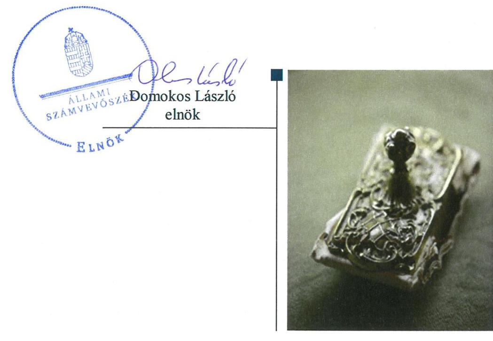
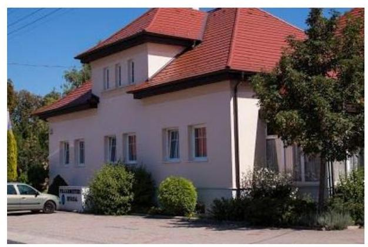
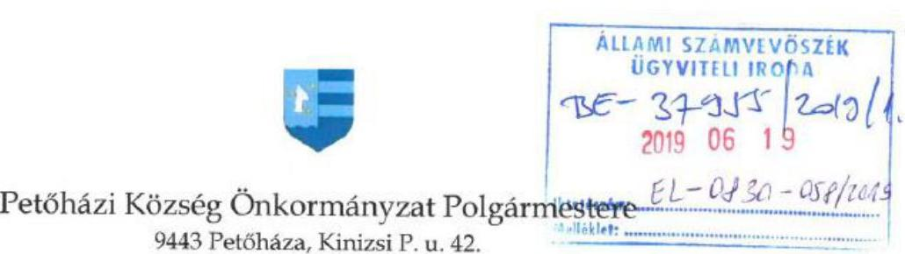
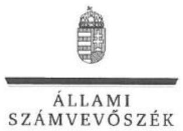
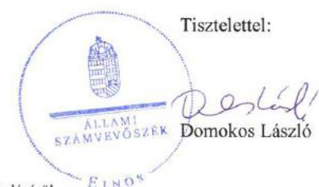
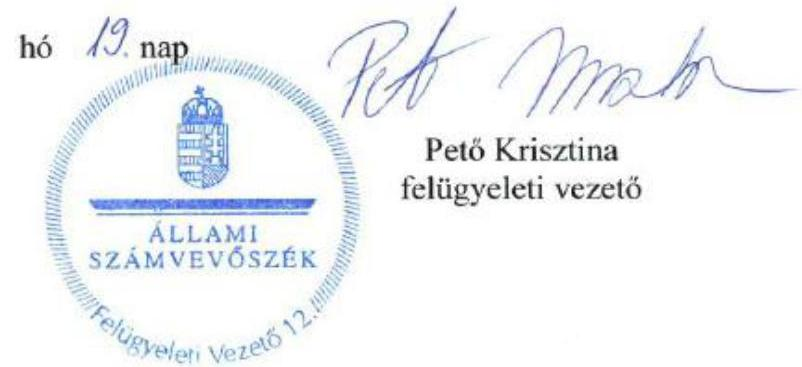

# Jelentés 

## Önkormányzatok ellenőrzése

Integritás- és belső kontrollrendszer, Befektetési tevékenységek ellenőrzése - Petőháza Község Önkormányzata 2019.

---

# Jelentés 

## Önkormányzatok ellenőrzése

Integritás- és belső kontrollrendszer, Befektetési tevékenységek ellenőrzése - Petőháza Község Önkormányzata 2019. 10. hó 18. nap

---

# AZ ELLENŐRZÉST FELÜGYELTE: 

PETŐ KRISZTINA felügyeleti vezető

## AZ ELLENŐRZÉST VEZETTE ÉS A VÉGREHAJTÁSÁÉRT FELELŐS:

DR. NAGY JUDIT ellenőrzésvezető

## A PROGRAM ÖSSZEÁLLÍTÁSÁÉRT FELELŐS:

TÓTPÁL SZABOLCS osztályvezető

IKTATÓSZÁM: EL-1637-001/2019

TÉMASZÁM: 2485

## ELLENŐRZÉS-AZONOSÍTÓ SZÁM: V-082930

Jelentéseink az Országgyúlés számítógépes hálózatán és az Interneten a www.asz.hu címen is olvashatóak.

---

# TARTALOMJEGYZÉK 

■ ÖSSZEGZÉS ..... 5
■ AZ ELLENŐRZÉS CÉLJA ..... 6
■ AZ ELLENŐRZÉS TERÜLETE ..... 7
■ AZ ELLENŐRZÉS HÁTTERE, INDOKOLTSÁGA ..... 8
■ A JELENTÉS LÉNYEGES KÉRDÉSKÖREI ..... 9
■ AZ ELLENŐRZÉS HATÓKÖRE ÉS MÓDSZEREI ..... 10
■ MEGÁLLAPÍTÁSOK ..... 12
■ JAVASLATOK ..... 16
■ MELLÉKLETEK ..... 19
I. sz. melléklet: Értelmező szótár ..... 19
■ FÜGGELÉK: ÉSZREVÉTELEK ..... 21
■ RÖVIDÍTÉSEK JEGYZÉKE ..... 45

---

.

---

# ÖSSZEGZÉS 

2017-ben Petőháza Község Önkormányzata belső kontrollrendszere nem biztositotta a közpénzekkel, a nemzeti vagyonnal történő szabályszerű, átlátható és elszámoltatható gazdálkodást. A 2013-2017. években a belső kontrollrendszer nem támogatta a befektetési tevékenységek szabályszerű végzését. Az Önkormányzat integritási kontrollrendszere nem volt megfelelő 2017-ben.

## Az ellenőrzés társadalmi indokoltsága

Az Állami Számvevőszék alapvető feladata a közpénzekkel, az állami és önkormányzati vagyonnal való gazdálkodás ellenőrzése. Az Alaptörvény szerint az önkormányzatok kötelezettsége a kiegyensúlyozott, átlátható és fenntartható költségvetési gazdálkodás elvének érvényesítése, a nemzeti vagyonnal való rendeltetésszerű és felelős módon való gazdálkodás biztosítása. Az Állami Számvevőszék stratégiájában megfogalmazott célkitűzése az integritás alapú, átlátható és elszámoltatható közpénzfelhasználás elősegítése. Ennek megvalósítása érdekében az Állami Számvevőszék prioritásként kezeli a közpénzzel gazdálkodó szervezetek esetében a belső kontrollrendszer múködésének ellenőrzését.

## Főbb megállapítások, következtetések, javaslatok

Petőháza Község Önkormányzata belső kontrollrendszerének kialakítása és múködtetése nem volt szabályszerű a 2017. évben.

A jegyző nem gondoskodott a vagyonnyilatkozat tétel szabályozásáról, iratkezelési szabályzat, beszerzési szabályzat rendelkezésre állásáról. A Képviselő-testület nem állapította meg az etikai eljárás szabályait, a hivatás etikai alapelvek részletes tartalmát. A jegyző a közérdekú adatok megismerésére irányuló kérelmek intézésének rendjét belső szabályzatban nem határozta meg.

A jegyző nem alakított ki információs és kommunikációs rendszert, nem múködtetett kockázatkezelési rendszert, valamint a belső ellenőrzés múködtetése nem volt szabályszerű, így azok nem biztosították a közpénzfelhasználás szabályosságát és átláthatóságát. A jegyző nem alakította ki a szervezet tevékenységének, a célok megvalósításának nyomon követését biztosító rendszerét.

A 2013-2017. években a belső kontrollrendszer nem biztosította a befektetési tevékenység szabályszerű végzését. A jegyző a 2013. évben a Petőházi Közös Önkormányzati Hivatal eszközök és a források leltárkészítési és leltározási szabályzatának hiányában nem biztosította a vagyonnal való szabályszerű elszámolás kereteit. A belső ellenőrzés ellenőrzéseivel nem támogatta a befektetési tevékenységek szabályszerű végzését.

Az integritás nem érvényesült az azt támogató kontrollok kialakítási hiányosságai miatt. Petőháza Község Önkormányzata a belső kontrollrendszert nem alakította ki, ezért nem volt védett a korrupciós kockázatok ellen. Az Önkormányzatnál széles körú lehetőség van az integritás-tudatos múködés fejlesztésére.

Az Állami Számvevőszék az ellenőrzés megállapításai alapján Petőháza Község Önkormányzata polgármesterének négy javaslatot, a Petőházi Közös Önkormányzati Hivatal jegyzőjének 11 javaslatot fogalmazott meg.

---

# AZ ELLENŐRZÉS CÉLJA 

AZ ELLENŐRZÉS CÉLJA annak megállapítása volt, hogy Petőháza Község Önkormányzata belső kontrollrendszere biztosította-e a közpénzekkel és a nemzeti vagyonnal történő elszámoltatható, átlátható, szabályszerű, gazdaságos, hatékony és eredményes gazdálkodás feltételeit. Az ellenőrzés keretében az Állami Számvevőszék értékelte továbbá, hogy az önkormányzatnál kiépítették és erősítették-e a korrupciós kockázatok kezelését szolgáló integritás kontrollokat és azt, hogy megteremtették-e a teljesítményellenőrzés feltételeit.

Az ellenőrzés további célja annak értékelése volt, hogy a jogszabályi előírásoknak megfelelően alakították-e ki a belső kontrollrendszert, a kontrollkörnyezet biztosította-e a befektetési tevékenységek szabályszerű végzését. Az Állami Számvevőszék értékelte továbbá, hogy az egyes befektetési tevékenységekkel kapcsolatos döntéshozatal és a döntések végrehajtása, valamint az egyes befektetések számviteli elszámolása, nyilvántartása szabályszerű volt-e, és a belső és külső ellenőrzések támogatták-e az egyes befektetési tevékenységek szabályszerű végzését.

---

# AZ ELLENŐRZÉS TERÜLETE 

## Petőháza Község Önkormányzata

A Győr-Moson-Sopron megyében található Petőháza település lakosainak száma 1088 fő volt 2016. január 1-jén a Központi Statisztikai Hivatal Magyarország közigazgatási helynévkönyve alapján. Az Önkormányzat ${ }^{1}$ Képviselő-testülete 7 főből áll. A Képviselő-testület ${ }^{2}$ állandó bizottságként Ügyrendi Bizottságot múködtetett.

Az Önkormányzat a gazdálkodási feladatokat a Petőházi Közös Önkormányzati Hivatalon keresztül látta el 2013. március 1-jétől, amely szervezeti egységekre nem tagolódott, gazdasági szervezettel nem rendelkezett.

A Hivatal³-ban a foglalkoztatott köztisztviselők száma 2017. év végén 11 fő volt.

A Hivatalt Csapod, Fertőendréd, Petőháza községek önkormányzatának képviselő-testületei alapították, 2013. március 1-jével.

Az Önkormányzat és a Hivatal belső ellenőrzési feladatait külső szolgáltató látta el vállalkozói szerződés alapján.

Az Önkormányzat a gazdálkodási feladatokat ellátó Petőháza Közös Önkormányzati Hivatalon felül egy intézménnyel, a Petőházi Kincseskert Óvodával látta el feladatait.

Az Önkormányzat befektetési célú (nem önkormányzati feladatellátást szolgáló) ingatlannal, kulturális javakkal és egyéb érték-tárgyakkal az ellenőrzött időszakban nem rendelkezett. Az Önkormányzat 2017. december 31-én 111,2 millió Ft összegben rendelkezett értékpapírral (állampapírral).

Az Önkormányzat a Magyar Cukor Zrt.-ben mint nem közfeladatot ellátó gazdasági társaságban 54,8 millió Ft befizetésével 1,17\%-os tulajdoni hányaddal rendelkezett az ellenőrzött időszakban.

A polgármester ${ }^{4}$ a 2006. évi önkormányzati választások óta, a jegyző ${ }^{5}$ 2013. március 1-jétől tölti be a tisztségét.

Az Önkormányzat a 2017. évi éves költségvetési beszámolója szerint 338,9 millió Ft költségvetési bevételt ért el, valamint 231,9 millió Ft költségvetési kiadást teljesített. A mérleg szerinti eszközvagyon értéke 2017. december 31-én 1572,5 millió Ft volt, amelyből a befektetett pénzügyi eszközök 61,9 millió Ft-ot, a forgatási célú értékpapírok (állampapírok) 111,2 millió Ft-ot tettek ki. A forrásokon belül a költségvetési évben esedékes kötelezettségállomány 1,3 millió Ft-ot, a költségvetési évet követően esedékes kötelezettségállomány 4,2 millió Ft-ot tett ki, pénzintézettel szembeni kötelezettsége nem volt. Az Önkormányzatnak nem volt adósságot keletkeztető ügylete 2017-ben.

---

# AZ ELLENŐRZÉS HÁTTERE, INDOKOLTSÁGA 

A belső kontrollrendszer kialakítása és működtetése nélkül nem valósítható meg a közpénzek, a közvagyon átlátható, szabályos, gazdaságos, hatékony és eredményes felhasználása. A belső kontrollrendszer azt a célt szolgálja, hogy a költségvetési szervek működésük és gazdálkodásuk során a tevékenységeket szabályszerűen hajtsák végre, teljesítsék elszámolási kötelezettségeiket és megvédjék az erőforrásokat a veszteségektől, a károktól és a nem rendeltetésszerű használattól. A belső kontrollrendszer magában foglalja mindazon elveket, eljárásokat és belső szabályzatokat, melyek biztosítják, hogy a költségvetési szerv valamennyi tevékenysége és célja összhangban legyen a szabályszerűséggel, szabályozottsággal, valamint a gazdaságosság, hatékonyság és eredményesség követelményeivel, az eszközökkel és forrásokkal való gazdálkodásban ne kerüljön sor pazarlásra, visszaélésre, rendeltetésellenes felhasználásra. Megfelelő, pontos és naprakész információk álljanak rendelkezésre a költségvetési szerv működésével kapcsolatosan, és a belső kontrollrendszer harmonizációjára, öszszehangolására vonatkozó jogszabályok végrehajtásra kerüljenek. Az integritás kontrollok kiépítése, erősítése a szervezet korrupciós kockázatainak kezelését szolgálja. A teljesítménykövetelmények meghatározása és működtetése megalapozhatja az önkormányzatoknál a teljesítményellenőrzés lefolytatását.

Az önkormányzati vagyongazdálkodás keretében az önkormányzatok át-menetileg szabad pénzeszközeinek befektetését jogszabály nem tiltja, a befektetések jellege nem korlátozott, a pénzpiaci szolgáltatók közül az önkormányzatok a kínált szolgáltatás és annak költségei alapján, szabadon választhatnak, azonban a veszteséges gazdálkodás kockázatai és következményei az önkormányzatokat terhelik. A szabad pénzeszközök felhasználása során kiemelten fontos a felelős gazdálkodás érvényesülése, amely összhangban kell, hogy legyen, az önkormányzati gazdálkodás alapelveivel. Az ellenőrzéssel feltárásra kerülhetnek azok a kockázatok, amelyek az önkormányzatok gazdálkodásával, ezen belül befektetési tevékenységeivel, kontrollkörnyezetével kapcsolatosak és a befektetési tevékenységek szabályszerű végrehajtását befolyásolják. Az ellenőrzéssel az önkormányzatok befektetési/vagyongazdálkodási döntései értékelhetővé válnak, és megalapozott megállapítás tehető arra vonatkozóan, hogy milyen hatást gyakoroltak az önkormányzat vagyonára a képviselő-testület döntései.

---

# A JELENTÉS LÉNYEGES KÉRDÉSKÖREI 

1. Az önkormányzat belső kontrollrendszerének kialakítása és müködtetése szabályszerű volt-e a 2017. évben?
2. Az önkormányzatnál alakítottak-e ki a szervezeti teljesítmény mérésére alkalmas követelményeket?
3. Az önkormányzatnál a befektetési tevékenységek szabályszerű végzését a belső kontrollrendszer biztositotta-e a 2013-2017. években? Az önkormányzat a 2017. december 31-én meglévő egyes befektetéseivel kapcsolatos döntéshozatala és az egyes befektetések számviteli elszámolása, nyilvántartása szabályszerű volt-e?

---

# AZ ELLENŐRZÉS HATÓKÖRE ÉS MÓDSZEREI 

## Az ellenőrzés típusa

Megfelelőségi és szabályszerűségi ellenőrzés.

## Az ellenőrzött időszak

Az integritás és belső kontrollrendszer ellenőrzött időszaka a 2017. év, illetve az éves költségvetési beszámoló Áht. ${ }^{6}$ által előírt jóváhagyásáig (2018. május 31-ig), tartó időszak volt.

Az egyes befektetési tevékenységek ellenőrzése tekintetében az ellenőrzött időszak 2013. január 1. - 2017. december 31. közötti időszak.

## Az ellenőrzés tárgya

Petőháza Község Önkormányzata és a gazdálkodási feladatokat ellátó Petőházi Közös Önkormányzati Hivatal belső kontrollrendszerének kialakítása és múködtetése, az integritás kontrollok kiépítettsége, a teljesítményellenőrzés feltételeinek rendelkezésre állása volt.

Az egyes befektetési tevékenységek ellenőrzésének tárgya az önkormányzat 2017. december 31-én meglévő, a Számv. tv. ${ }^{7}$ 3. § (6) bekezdés 2. és 3. pontja szerint az értékpapírokban meg-testesülő befektetései, lekötött betétei.

## Az ellenőrzött szervezet

Petőháza Község Önkormányzata

## Az ellenőrzés jogalapja

Az ellenőrzés jogszabályi alapját az ÁSZ tv. ${ }^{8}$ 1. § (3) bekezdés, 5. § (2) és (6) bekezdései, valamint az Áht. 61. § (2) bekezdésének előírásai képezik.

## Az ellenőrzés módszerei

Az ÁSZ ${ }^{9}$ az ellenőrzést az ellenőrzési program szempontjai, az ellenőrzött időszakban hatályos jogszabályok, az ellenőrzés szakmai szabályai, a jelen ellenőrzésre irányadó ÁSZ módszertanok figyelembevételével hajtotta végre. Az ellenőrzési kérdések megválaszolásához szükséges bizonyítékok

---

megszerzése az ellenőrzött által rendelkezésre bocsátott dokumentumokra, adatokra alapozva megfigyelés, szemle (szemrevételezés), kérdésfeltevés (információkérés), mintavételezés, valamint elemző eljárás útján történt. Az ellenőrzési bizonyítékként felhasználható adatforrások közé tartoznak az ellenőrzési program részletes szempontjainál felsorolt adatforrások, valamint minden egyéb - az ellenőrzés folyamán feltárt, az ellenőrzés szempontjából információt tartalmazó - dokumentum.

Az ellenőrzés lefolytatásához az ellenőrzött szervezet tanúsítványok kitöltésével, valamint az ÁSZ által kért dokumentumok megküldésével szolgáltatott adatokat, amelyek valódiságát és teljes körűségét az ellenőrzött szervezet vezetője által tett teljességi és hitelességi nyilatkozat igazolja. A rendelkezésre bocsátott adatok, információk kontrollja az ellenőrzés keretében megtörtént.

Az önkormányzat belső kontrollrendszere egyes pilléreinek kialakítására és működtetésére vonatkozó értékelés:
$\longrightarrow$ „szabályszerű", amennyiben az értékelt területen az elért „igen" válaszok százalékban kifejezett, egész számra kerekített aránya legalább $85 \%$
$\longrightarrow$ „nem szabályszerű", ha nem éri el a 85\%-ot,
Az önkormányzat belső kontrollrendszerének összesített értékelése az egyes részterületek esetében kapott megfelelőségi arányok számtani átlaga alapján történik és megegyezik a pillérenként (kontrollterületenként) alkalmazott százalékos értékelésekkel, a következő eltérésekkel: a kontrollrendszer egésze esetében a „szabályszerű" értékelésnek a százalékos értéken felül további feltétele, hogy egyik kontrollterület sem kaphat „nem szabályszerű" értékelést.

A 2017. évi kiadások teljesítéséhez kapcsolódó pénzgazdálkodási belső kontrollok működésének szabályszerűsége esetében az ellenőrzés azokra a legnagyobb értékű tételekre - a lényeges sokaságra - terjedt ki, melyek összértéke eléri a teljes sokaság összértékének 50\%-át. A 2017. évi kiadások esetében a lényeges sokaságot tételesen ellenőriztük.

Az önkormányzat befektetési tevékenységét a szerződéskötés (és a kapcsolódó döntés-előkészítés. döntéshozatal) kivételével a 2013. január 1. és 2017. december 31. közötti időszak vonatkozásában értékeltük. A szerződéskötést az önkormányzat 2017. december 31-én meglévő értékpapírjai és egyéb befektetései vonatkozásában értékeltük a befektetési döntés előkészítése és a döntéshozatala tekintetében. A 2013. évet megelőzően történt szerződéskötés, illetve döntés-előkészítés tekintetében a mindenkori hatályos jogszabályok szerint történt az értékelés.

Az ÁSZ az ellenőrzés ideje alatt az ellenőrzött szervezettel történő kapcsolattartást az ÁSZ SZMSZ ${ }^{10}$ vonatkozó előírásai alapján biztosította

---

# 1. Az önkormányzat belső kontrollrendszerének kialakítása és múködtetése szabályszerű volt-e a 2017. évben? 

Összegző megállapítás

Az Önkormányzat belső kontrollrendszerének kialakítása és múködtetése nem volt szabályszerű a 2017. évben.

### 1.1. számú megállapítás

A kontrollkörnyezet kialakítása a 2017. évben nem volt szabályszerű.

A jegyző a Vnytv. ${ }^{11}$ 11. § (6) bekezdésében előírt vagyonnyilatkozat átadására, nyilvántartására, a vagyonnyilatkozatban foglalt személyes adatok védelmére vonatkozó további szabályokat szabályzatban nem állapított meg.

A jegyző az Ltv. ${ }^{12}$ 10. § (1) bekezdése c) pontjában előírtak ellenére nem adott ki a Magyar Nemzeti Levéltár és a megyei kormányhivatal egyetértésével iratkezelési szabályzatot.

Az Ávr. ${ }^{13}$ 3. § (2) bekezdés b) pontja ellenére a jegyző belső szabályzatban nem rendezte a beszerzések lebonyolításával kapcsolatos eljárásrendet.

A Kttv. ${ }^{14}$ 231. § (1) bekezdése ellenére a hivatásetikai alapelvek részletes tartalmát, valamint az etikai eljárás szabályait a Képviselő-testület nem állapította meg.

A jegyző az Info tv. ${ }^{15}$ 30. § (6) bekezdésében és Ávr. 13. § (2) h) pontja ellenére a közérdekú adatok megismerésére irányuló kérelmek intézésének rendjét belső szabályzatban nem határozta meg.

Az Info tv. 35. § (3) bekezdésében és Ávr. 13. § (2) bekezdés h) pontjában előírtak ellenére a kötelezően közzéteendő adatok nyilvánosságra hozatalának rendje nem került kialakításra.

A jegyző a Bkr. ${ }^{16}$ 9. § (1)-(2) bekezdésében foglaltak ellenére nem alakított ki olyan rendszereket, melyek biztosítják, hogy a megfelelő információk a megfelelő időben eljussanak az illetékes személyhez; nem alakítottak ki beszámolási rendszereket, így a beszámolási szintek, határidők és módok nem kerültek meghatározásra.

A Bkr. 8. § (4) bekezdés b) pontjában foglaltak ellenére a jegyző a felelősségi körök meghatározásával nem szabályozta a dokumentumokhoz, információkhoz való hozzáférést.

Az Önkormányzat a Bkr. 22. § (1) bekezdés b) pontjában előírtak ellenére nem rendelkezett kockázatelemzéssel alátámasztott stratégiai ellenőrzési tervvel.

A jegyző a Bkr. 10. § ellenére nem alakította ki a szervezet tevékenységének, a célok megvalósításának nyomon követését biztosító rendszerét.

A Képviselő-testület az Mötv. ${ }^{17}$ és az Áht. előírásai szerint megalkotta az önkormányzati SZMSZ ${ }_{1,2}{ }^{18}$-t, kiadta a Hivatal alapító okirat ${ }^{19}$-át. A polgármester irányítói hatáskörével élve jóváhagyta a Hivatali SZMSZ ${ }^{20}$-t

---

|  | amelyben feltüntette a vagyonnyilatkozat tételi kötelezettséget. Az Önkormányzat a Számv. tv. és az Áhsz. ${ }^{21}$ szerint rendelkezett számviteli politikával, amelynek hatálya kiterjedt a Hivatalra is. A jegyző elkészítette az Ávr. előírásai szerint a gazdálkodás részletes rendjét tartalmazó gazdálkodási szabályzat ${ }_{1,2}{ }^{22}$-t. Az Önkormányzatnál és a Hivatalnál az Ávr. 60. § (3) bekezdése szerint nyilvántartást vezettek a gazdálkodási jogköröket gyakorló személyekről és aláírás mintájukról. |
| :--: | :--: |
| 1.2. számú megállapítás | Az integrált kockázatkezelési rendszer nem múködött a 2017. évben |
|  | A Bkr. 7. § (1) bekezdés előírása ellenére a jegyző nem múködtetett a 2017. évben integrált kockázatkezelési rendszert, mert nem mérte fel a Bkr. 7. § (2) bekezdés előírása szerint a költségvetési szerv tevékenységében rejlő és szervezeti célokkal összefüggő kockázatokat, nem határozta meg az egyes kockázatokkal kapcsolatban szükséges intézkedéseket, valamint azok teljesítésének, folyamatos nyomon követésének módját. |
| 1.3. számú megállapítás | A kontrolltevékenységek gyakorlása 2017. évben szabályszerűen történt. |
| 1.4. számú megállapítás | A gazdálkodási jogkörök gyakorlása az Ávr. előírásai szerint történt, a kötelezettségvállalás és a teljesítésigazolás az arra jogosultak által, az összeférhetetlenségi szabályok betartásával szabályszerűen történt.

A kötelezettségvállalásokat az Ávr. és az Áhsz. ${ }_{2}$ előírásai szerint nyilvántartásba vették. |
| 1.5. számú megállapítás | Az információs és kommunikációs rendszer kialakítás hiányában nem múködött a 2017. évben. |
| 1.5. számú megállapítás | A nyomon követési rendszer (monitoring) nem múködött a 2017. évben. |

A jegyző a Bkr. 9. § (1)-(2) bekezdésében foglaltak ellenére nem múködtetett információs és kommunikációs rendszert a 2017. évben.

A nyomon követési rendszer (monitoring) nem múködött a 2017. évben.

A jegyző a Bkr. 10. § előírása ellenére kialakítás hiányában nem múködtette az operatív tevékenységek keretében megvalósuló folyamatos és eseti nyomon követést.

A belső ellenőrzés múködtetése nem volt szabályszerű. A Bkr. 47. § (1) bekezdésben foglalt előírás ellenére a belső ellenőrzési vezető nem vezetett éves bontásban nyilvántartást a belső ellenőrzési jelentésekben tett megállapítások, javaslatok, a vonatkozó intézkedési tervek és azok végrehajtásának nyomon követéséről.

A jegyző a Bkr. 1. melléklete szerinti nyilatkozatában szabályszerűnek értékelte a belső kontrollrendszert, azonban azt a Bkr. 11. § (2a) bekezdés előírása ellenére az éves költségvetési beszámolóval együtt nem küldte meg a polgármesternek. Az ÁSZ ellenőrzés a jegyzői nyilatkozattal ellentétes következtetésre jutott.

Az Önkormányzat integritás elvű múködését nem támogatták a jogszabályban előírt, valamint a nem kötelező, de az integritást erősítő és támogató kontrollok. A Hivatal nem rendelkezett közép-vagy hosszú távú stra-

---

tégiával. Nem végeztek rendszerszerű, valamint korrupciós kockázatelemzést. Nem rendelkeztek iratkezelési, titokvédelmi szabályzattal. Nem szabályozták az ajándékok, meghívások, utaztatás elfogadásának feltételeit, közérdekű bejelentők védelmét, a külső szakértők alkalmazásának feltételeit. A külső panaszok kezelésére és a közérdekű bejelentések kezelésére szabályozást nem készítettek. A működési folyamatok során nem alkalmazták a „négy szem" elvet. Nem működtetették a teljesítményértékelési rendszert.

Az Önkormányzat hosszú távú céljait meghatározták, de azok között nem szerepelt az integritás erősítése.

# 2. Az önkormányzatnál alakítottak-e ki a szervezeti teljesítmény mérésére alkalmas követelményeket? 

## Összegző megállapítás

Az Önkormányzatnál nem alakítottak ki teljesítmény mérésére alkalmas követelményeket.

A szervezeti célok elérését szolgáló feladatok, folyamatok, tevékenységek mérését szolgáló indikátorokat, mérőszámokat, feladat- és teljesítménymutatókat az Önkormányzat nem képzett, így nem biztosította a teljesítménymérés lehetőségét.

## 3. Az önkormányzatnál a befektetési tevékenységek szabályszerű végzését a belső kontrollrendszer biztosította-e a 2013-2017. években? Az önkormányzat a 2017. december 31-én meglévő egyes befektetéseivel kapcsolatos döntéshozatala és az egyes befektetések számviteli elszámolása, nyilvántartása szabályszerű volt-e?

Összegző megállapítás

A befektetési tevékenységek szabályszerű végzését a belső kontrollrendszer nem biztosította a 2013-2017. években. Az Önkormányzat 2017. december 31-én meglévő befektetett eszközeivel kapcsolatos döntéshozatal és 2014-2017. években a számviteli elszámolás, nyilvántartás szabályszerű volt.

A Hivatal az Áht. 10. § (5) bekezdés ellenére 2015. augusztus 31-ig nem rendelkezett szervezeti és múködési szabályzattal.

A Hivatal a Számv. tv. 14. § (5) bekezdés a) pontjában előírt, az eszközök és a források leltárkészítési és leltározási szabályzattal a 2013. évben nem rendelkezett. A Bkr. 7. § (1) bekezdés előírása ellenére a jegyző nem múködtetett 2016. szeptember 30-ig kockázatkezelési, 2016. október 1jétől integrált kockázatkezelési rendszert.

A belső ellenőrzés a 2013-2017. években ellenőrzéseivel nem támogatta a befektetési tevékenységek szabályszerű végzését.

---

A polgármester az Önkormányzat 2017. december 31-én meglévő befektetett pénzügyi eszközeivel kapcsolatos döntéseket a költségvetési rendeletek előírásaiban foglalt felhatalmazás szerint hozta meg.

A jegyző 2014. január 1-jétől az Áhsz. 2 45. § (3) bekezdésben foglaltak szerint a befektetett pénzügyi eszközökről jogszabályban előírt kötelezettsége alátámasztásához a könyvviteli számlák az Áhsz. 2 51. § (1a) bekezdése szerinti alábontásával gondoskodott.

Az Önkormányzat a 2017. december 31-én meglévő befektetett pénzügyi eszközeinek számviteli nyilvántartása és leltározása a 20142017. években szabályszerű volt, azonban a 2013. évben szabályozás hiányában nem felelt meg a Számv. tv. 14. § (5) bekezdés a) pont és az Áhsz. ${ }^{23}$ 8. § (4) bekezdés a) pont előírásainak.

---

# JAVASLATOK 

Az ÁSZ tv. 33. § (1) bekezdésében foglaltak értelmében az ellenőrzött szervezet vezetője köteles a jelentésben foglalt megállapításokhoz kapcsolódó intézkedési tervet összeállítani és azt a jelentés kézhezvételétől számított 30 napon belül az ÁSZ részére megküldeni. Amennyiben az ellenőrzött szervezet vezetője nem küldi meg határidőben az intézkedési tervet, vagy továbbra sem elfogadható intézkedési tervet küld, az Állami Számvevőszék elnöke az ÁSZ tv. 33. § (3) bekezdése a) és b) pontjaiban foglaltakat érvényesítheti.

## Petőháza Község Önkormányzata polgármesterének

1. Kezdeményezze a hivatásetikai alapelvek részletes tartalmának, valamint az etikai eljárás szabályainak megállapítását.
(1.1. sz. megállapítás 4. bekezdése alapján)
2. Gondoskodjon a kockázatelemzéssel alátámasztott stratégiai ellenőrzési terv Képviselő-testület elé terjesztéséről annak jóváhagyása érdekében.
(1.1. sz. megállapítás 9. bekezdése alapján)
3. Intézkedjen olyan nyilvántartás vezetése érdekében, amellyel a belső ellenőrzési jelentésekben tett megállapítások, javaslatok, a vonatkozó intézkedési tervek és azok végrehajtása nyomon követhető.
(1.5. sz. megállapítás 2. bekezdése alapján)
4. Intézkedjen a feltárt hiányosságok és szabálytalanságok tekintetében a munkajogi felelősség tisztázására irányuló eljárás megindításáról, és ennek eredménye ismeretében tegye meg a szükséges intézkedéseket.
(1.1. sz. megállapítás 1. bekezdése, 1.1. sz. megállapítás 2. bekezdése, 1.1. sz. megállapítás 3. bekezdése, 1.1. sz. megállapítás 5. bekezdése, 1.1. sz. megállapítás 6. bekezdése, 1.1. sz. megállapítás 7. bekezdése, 1.1. sz. megállapítás 8. bekezdése, 1.1. sz. megállapítás 9. bekezdése, 1.1. sz. megállapítás 10. bekezdése és 1.5. sz. megállapítás 1. bekezdése, valamint 1.2. sz. megállapítás 1. bekezdése, 3. sz. összegző megállapítás 2. bekezdésének 2. mondata alapján)

---

# Petőházi Közös Önkormányzati Hivatal jegyzőjének 

1. Intézkedjen a vagyonnyilatkozat átadására, nyilvántartására, a vagyonnyilatkozatban foglalt személyes adatok védelmére vonatkozó további szabályok megállapításáról.
(1.1. sz. megállapítás 1. bekezdése alapján)
2. Intézkedjen a jogszabályi előírás szerinti iratkezelési szabályzat kiadása érdekében.
(1.1. sz. megállapítás 2. bekezdése alapján)
3. Intézkedjen a beszerzések lebonyolításával kapcsolatos eljárásrend belső szabályzatban történő rendezéséről.
(1.1. sz. megállapítás 3. bekezdése alapján)
4. Intézkedjen a közérdekü adatok megismerésére irányuló kérelmek intézése rendjének belső szabályzatban történő meghatározásáról.
(1.1. sz. megállapítás 5. bekezdése alapján)
5. Intézkedjen a kötelezően közzéteendő adatok nyilvánosságra hozatala rendjének kialakításáról.
(1.1. sz. megállapítás 6. bekezdése alapján)
6. Intézkedjen a jogszabályi előírás szerinti információs és kommunikációs rendszer kialakításáról.
(1.1. sz. megállapítás 7. bekezdése alapján)
7. Intézkedjen a felelősségi körök meghatározásával a dokumentumokhoz, információkhoz való hozzáférés szabályozásáról.
(1.1. sz. megállapítás 8. bekezdése alapján)
8. Kezdeményezze a belső ellenőrzési vezetőnél a kockázatelemzéssel alátámasztott stratégiai ellenőrzési terv összeállítását.
(1.1. sz. megállapítás 9. bekezdése alapján)
9. Intézkedjen a szervezet tevékenységének, a célok megvalósításának nyomon követését biztosító rendszer kialakításáról és müködtetéséről.
(1.1. sz. megállapítás 10. bekezdése és 1.5. sz. megállapítás 1. bekezdése alapján)

---

10. 

Intézkedjen az integrált kockázatkezelési rendszer müködtetése során a költségvetési szerv tevékenységében rejlő és szervezeti célokkal összefüggő kockázatok felméréséről és megállapításáról, valamint az egyes kockázatokkal kapcsolatban szükséges intézkedések és azok teljesitésének folyamatos nyomon követése módjának meghatározásáról.
(1.2. sz. megállapítás 1. bekezdése, 3. sz. összegző megállapítás 2. bekezdésének 2. mondata alapján)
11. Küldje meg a jövőben a Bkr. előírása szerinti belső kontrollrendszer minőségét értékelő, valós tartalmú vezetői nyilatkozatot a polgármester részére.
(1.5. sz. megállapítás 3. bekezdése alapján)

---

# MELLÉKLETEK 

- I. SZ. MELLÉKLET: ÉRTELMEZŐ SZÓTÁR
belső ellenőrzés
belső kontrollrendszer
belső kontrollrendszer területei
közös önkormányzati hivatal
monitoring
monitoring-rendszer
önkormányzati hivatal
társulás

Független, tárgyilagos bizonyosságot adó és tanácsadó tevékenység, amelynek célja, hogy az ellenőrzött szervezet működését fejlessze és eredményességét növelje, az ellenőrzött szervezet céljai elérése érdekében rendszerszemléletű megközelítéssel és módszeresen értékeli, illetve fejleszti az ellenőrzött szervezet irányítási és belső kontrollrendszerének hatékonyságát. (Forrás: Bkr. 2. § b) pontja)
A belső kontrollrendszer a kockázatok kezelése és tárgyilagos bizonyosság megszerzése érdekében kialakított folyamatrendszer, amely azt a célt szolgálja, hogy a múködés és gazdálkodás során a tevékenységeket szabályszerűen, gazdaságosan, hatékonyan, eredményesen hajtsák végre, az elszámolási kötelezettségeket teljesítsék, megvédjék az erőforrásokat a veszteségektől, károktól és nem rendeltetésszerű használattól. (Forrás: Áht. 69. § (1) bekezdése)
A kontrollkörnyezet, az integrált kockázatkezelési rendszer, a kontrolltevékenységek, az információs és kommunikációs rendszer, valamint a nyomon követési (monitoring) rendszer. (Forrás: Bkr. 3. §-a)
A települési képviselő-testület más települési képviselő-testülettel társult képviselőtestületet alakíthat, amely esetén a képviselő-testületek részben vagy egészben egyesítik a költségvetésüket, közös önkormányzati hivatalt tartanak fenn és intézményeiket közösen müködtetik. (Forrás: Mötv. 56. § (1)-(2) bekezdései)
A monitoring általánosságban a különböző szintű szervezeti célok megvalósításának folyamatát kíséri figyelemmel, melynek során a releváns eseményekről és tevékenységekről (együtt: folyamatokról) rendszeres jelleggel, strukturált, döntéstámogató információkhoz jutnak a szervezet vezetői. (Forrás: NGM Útmutató a költségvetési szervek monitoring rendszeréhez 2011. november)
A költségvetési szerv vezetője köteles kialakítani a szervezet tevékenységének a célok megvalósításának nyomon követését biztosító rendszert, amely az operatív tevékenységek keretében megvalósuló folyamatos és eseti nyomon követésből, valamint az operatív tevékenységektől függetlenül működő belső ellenőrzésből állhat. (Forrás: Bkr. 10. §)
A polgármesteri hivatal, a főpolgármesteri hivatal, a megyei önkormányzati hivatal és a közös önkormányzati hivatal. (Forrás: Áht. 1. § 18. pont)
A helyi önkormányzatok képviselő-testületei megállapodhatnak abban, hogy egy vagy több önkormányzati feladat- és hatáskör, valamint a polgármester és a jegyző államigazgatási feladat- és hatáskörének hatékonyabb, célszerűbb ellátására jogi személyiséggel rendelkező társulást hoznak létre. (Forrás: Mötv. 87. §)

---

.

---

# FÜGGELÉK: ÉSZREVÉTELEK 

A jelentéstervezetet a Számvevőszék 15 napos észrevételezésre megküldte az ellenőrzött szervezet vezetőjének az ÁSZ tv. 29. §* (1) bekezdése előírásának megfelelően.

Petőháza Község Önkormányzatának polgármestere a jelentéstervezet megállapításaira írásban észrevételt tett.
Az ÁSZ tv. 29. § (3) bekezdésével összhangban az ÁSZ a Függelékben feltünteti az ellenőrzés megállapításaival kapcsolatban tett, figyelembe nem vett észrevételeket, és megindokolja, hogy azokat miért nem fogadta el.

[^0]
[^0]:    * 29. § (1) Az Állami Számvevőszék az ellenőrzési megállapításait megküldi az ellenőrzött szervezet vezetőjének vagy az általa megbízott személynek, és annak, akinek személyes felelősségét állapította meg.
    (2) Az ellenőrzött szervezet vezetője és a felelősként megjelölt személy az ellenőrzés megállapításaira tizenöt napon belül írásban észrevételt tehet.
    (3) Az Állami Számvevőszék az észrevételre a beérkezésétől számított harminc napon belül írásban válaszol. A figyelembe nem vett észrevételeket köteles a jelentésben feltüntetni, és megindokolni, hogy azokat miért nem fogadta el.

---

Ikt. szám: 130-8/2019.

Tárgy: észrevétel az EL-0830-053/2019. számú jelentéstervezetre
Hiv. szám: EL-0830-053/2019

Domokos László
Elnök
Állami Számvevőszék
Budapest

# Tisztelt Elnök Úr! 

Az Állami Számvevőszék EL-0830-053/2019. számú ellenőrzési jelentéstervezetre az alábbi észrevételeket teszem.

## I. ÉSZREVÉTEL AZ ÖSSZEGZÉSRE

Nem értek egyet az Állami Számvevőszék jelentéstervezetében foglalt azon megállapításokkal, miszerint 2017-ben Petőháza Község Önkormányzata belső kontrollrendszere nem biztosította a közpénzekkel, a nemzeti vagyonnal történő szabályszerű, átlátható és elszámoltatható gazdálkodást és a 2013 - 2017. években a belső kontrollrendszer nem támogatta a befektetési tevékenységek szabályszerű végzését.

A jelentéstervezet Megállapítások fejezet 3. pontban az Állami Számvevőszék megállapította, hogy „A polgármester az Önkormányzat 2017. december 31-én meglévő befektetett pénzügyi eszközeivel kapcsolatos döntéseket a költségvetési rendeletek előírásaiban foglalt felhatalmazás szerint hozta meg.

A jegyző 2014. január 1-jétől az Áhsz 45.§ (3) bekezdésében foglaltak szerint a befektetett pénzügyi eszközökről jogszabályban előírt kötelezettsége alátámasztásához a könyvviteli számlák az Áhsz 51.§ (1a) bekezdése szerinti alábontásával gondoskodott.

Az Önkormányzat a 2017. december 31-én meglévő befektetett pénzügyi eszközeinek számviteli nyilvántartása és leltározása a 2014 - 2017. években szabályszerű volt,

---

azonban a 2013. évben szabályozás hiányában nem felelt meg a Számtv. 14.§ (3), valamint (5) bekezdésében és az Áhsz 50. §. (1) bekezdése előírásainak."

Hivatal a Számviteli törvény 14.§ (3) bekezdésében valamint (5) bekezdésében előírt számviteli szabályzatokkal rendelkezett. Számviteli politika külön került kiadásra az Önkormányzatra és a Hivatalra, a többi szabályzat esetében pedig egy szabályzat készült és ennek hatálya került kiterjesztésre az Önkormányzatra, a Hivatalra és az Óvodára. Ezen szabályzatok a vizsgálat alatt határidőn belül, 2018. 12. 19 -én feltöltésre kerültek az Állami Számvevőszék rendszerébe, így a feltárt hiányosságot nem fogadom el.

A Hivatal minden időszakban, így a vizsgálat tárgyát képező 2013 - 2017 közötti időszakban is folyamatosan rendelkezett szervezeti és müködési szabályzattal, melyek határidőn belül, feltöltésre kerültek az Állami Számvevőszék rendszerébe.

A belső ellenőrzés által vizsgált témákat kockázatelemzés előzi meg, a 2013 - 2017 közötti időszakban a kockázatelemzések alapján a befektetések nem képeztek olyan mutatókat, amely alapján ezt a területet vizsgálat alá kellett volna vonni.

A kockázatkezelési illetve az integrált kockázatkezelési rendszer a kiadott és határidőn belül az Állami Számvevőszék rendszerébe is feltöltött szabályzatok alapján múködött.

Összegezve: A jelentés tervezetben szereplő megállapítással ellentétben a Hivatal rendelkezett a Számviteli törvény 14.§ (3) bekezdésében valamint (5) bekezdésében előírt számviteli szabályzatokkal és kialakította a kockázatkezelési rendszert is, így nem tartjuk megalapozottnak azt a megállapítást, hogy a befektetési tevékenységek szabályszerű végzését a belső kontrollrendszer nem biztosította, illetve, hogy szabályozás hiányában 2013-as években nem felelt meg a jogszabályi előírásoknak. Megjegyezni kívánjuk továbbá azt is, hogy befektetési tevékenysége kizárólag az Önkormányzatnak volt, amely esetében hiányosságot a jelentéstervezet nem tárt fel.

A mintavétel alapján végzett ellenőrzés hiányosságot nem tárt fel, a hiányzó szabályzatok határidőn belül maradéktalanuk feltöltésre kerültek az Állami Számvevőszék rendszerébe, ezek miatt a jelentéstervezet megállapításaival nem értek egyet.

Az általunk határidőn belül az Állami Számvevőszék rendszerébe becsatolt dokumentumok hiányként való értékelésének okáról kérem tájékoztatni szíveskedjenek.

# II. ÉSZREVÉTEL A FŐBB MEGÁLLAPÍTÁSOK, KÖVETKEZTETÉSEK, JAVASLATOK MEGÁLLAPÍTÁSAIRA 

Nem értek egyet az Állami Számvevőszék jelentéstervezetében foglalt azon megállapítással, miszerint Petőháza Község Önkormányzata belső

---

kontrollrendszerének kialakítása és múködtetése nem volt szabályszerű a 2017. évben.

A vagyonnyilatkozattételi kötelezettség az SZMSZ-ben szabályozott, iratkezelési szabályzat, beszerzési szabályzat rendelkezésre állt. A hivatásetikai alapelvek és az etikai eljárás szabályai az Etikai kódexben szabályozásra kerültek. Az Etikai kódexet a polgármester és a jegyző adta ki, intézkedünk a Képviselő-testület általi jóváhagyás iránt. A közérdekú adatok megismerésére irányuló kérelmek intézésének rendje és a kötelezően közzéteendő adatok nyilvánosságra hozatalának rendje a Közérdekú adatok megismerésére irányuló kérelmek intézésének és a kötelezően közzéteendő adatok nyilvánosságra hozatalának szabályzatában került szabályozásra. Valamennyi szabályzat határidőn belül feltöltésre került az Állami Számvevőszék rendszerébe.

A jegyző kiadta az Információs és Kommunikációs Szabályzatot, és Belső Kontrollrendszer Szabályzatát, amelyek határidőn belül, feltöltésre kerültek az Állami Számvevőszék rendszerébe.

A belső ellenőrzés a vonatkozó jogszabályi előírásoknak megfelelően múködött, ennek dokumentumai ( 2013 - 2017 évek vonatkozásában belső ellenőrzési munkaterv, ennek képviselő-testület általi elfogadása, ellenőri jelentés, ennek képviselő-testület általi elfogadása, intézkedési terv és beszámoló az intézkedési tervek végrehajtásáról, 5. számú tanúsítvány, ami a nyilvántartás adatait tartalmazza 2013 - 2016 között). A becsatolt dokumentumokkal alátámasztottan tudjuk igazolni, hogy a Önkormányzatunknál a belső ellenőrzés szabályszerűen múködik.

A Bkr. 10.§-ának megfelelően, Az ellenőrzési nyomvonal és A belső kontrollrendszer szabályzata kiadásra került és határidőn belül, feltöltésre került az Állami Számvevőszék rendszerébe.

Hivatal a Számviteli törvény 14.§ (3) bekezdésében valamint (5) bekezdésében előírt számviteli szabályzatokkal rendelkezett. Számviteli politika külön került kiadásra az Önkormányzatra és a Hivatalra, a többi szabályzat esetében pedig egy szabályzat készült és ennek hatálya került kiterjesztésre az Önkormányzatra, a Hivatalra és az Óvodára. Ezen szabályzatok a vizsgálat alatt határidőn belül, feltöltésre kerültek az Állami Számvevőszék rendszerébe.

Kérem, szíveskedjenek tájékoztatni, hogy az általunk becsatolt dokumentumok miért nem kerültek elfogadásra.

A fentiek és az alábbiakban kifejtendő észrevételeim alapján nem értek egyet azzal megállapítással, hogy Petőháza község Önkormányzata belső kontrollrendszerét nem alakította ki és ezért nem volt védett a korrupciós kockázatok ellen.

Nem értek egyet a jegyző munkajogi felelősségre vonásának kezdeményezésével. Megítélésem szerint a jegyző és az általa vezetett Hivatal valamennyi köztisztviselője munkáját a jogszabályok maradéktalan betartásával, az Önkormányzat és Hivatal érdekei szem előtt tartásával, a biztonságos gazdálkodás,

---

a közpénzekkel, a nemzeti vagyonnal történő felelős, szabályszerű, átlátható és elszámoltatható gazdálkodás követelményeinek megfelelően végzi.
A bonyolult, gyakran változó jogszabályoknak való megfelelés komoly terhet ró az Önkormányzatokra, Hivatalokra. A központi költségvetés által finanszírozott 7 fővel lehetetlen az ezeknek való megfelelés. A Hivatal múködésének jogszabályoknak való megfelelés érdekében vállalták fel a képviselő-testületek 11 fő köztisztviselő foglalkoztatását. Így lehetőség nyílott egy felsőfokú pénzügyi végzettséggel, államháztartási mérlegképes könyvelői képesítéssel is rendelkező köztisztviselő alkalmazására is, aki segítséget nyújt a gyakran változó külső szabályozórendszer és a kiforratlan informatikai rendszer működtetéséből eredő nehézségekben.

# III. A JELENTÉSTERVEZET „MEGÁLLAPÍTÁSOK" FEJEZETÉRE A KÖVETKEZŐ ÉSZREVÉTELEKET KÍVÁNOM TENNI: 

### 1.1 számú megállapítás

A vagyonnyilatkozat-tételi kötelezettség a Petőházi Közös Önkormányzati Hivatal SZMSZ-ében került szabályozásra, amely határidőn belül, 2018. 06. 25-én és 2018. 07. 09-én feltöltésre került az Állami Számvevőszék rendszerébe. A vagyonnyilatkozatban foglalt személyes adatok védelmére vonatkozó további szabályok megállapítására azonban nem került sor, erről gondoskodunk.

A Magyar Nemzeti Levéltár és a Győr-Moson-Sopron Megyei Levéltár egyetértésével kiadott Iratkezelési szabályzat adatszolgáltatási határidőn belül, 2018. 07.09-én feltöltésre került az Állami Számvevőszék rendszerébe. 2018. szeptember 24-én emailben jelezték, hogy ez a feltöltés sikertelen volt és kérték, hogy e-mailben küldjük meg az Iratkezelési Szabályzatot. E-mailen 2018. szeptember 25-én a Szabályzat megküldésre került.

A beszerzések lebonyolításával kapcsolatos eljárásrendet a Beszerzési Szabályzatban szabályozzuk, ami határidőn belül, 2018. 07. 09-én feltöltésre került az Állami Számvevőszék rendszerébe.

A hivatásetikai alapelvek és az etikai eljárás szabályai az Etikai kódexben szabályozásra kerültek, ami határidőn belül 2018. 07. 09-én feltöltésre került az Állami Számvevőszék rendszerébe. Az Etikai kódexet a polgármester és a jegyző adta ki, intézkedünk a Képviselő-testület általi jóváhagyás iránt.

---

A közérdekú adatok megismerésére irányuló kérelmek intézésének rendje és a kötelezően közzéteendő adatok nyilvánosságra hozatalának rendje a Közérdekú adatok megismerésére irányuló kérelmek intézésének és a kötelezően közzéteendő adatok nyilvánosságra hozatalának szabályzatában került szabályozásra, amely határidőn belül, 2018.07.09-én feltöltésre került az Állami Számvevőszék rendszerébe.

A Bkr. 9.§ (1) - (2) bekezdésében foglaltaknak megfelelően kiadásra került az Információs és Kommunikációs Szabályzat, és Belső Kontrollrendszer Szabályzata, amelyek határidőn belül, 2018. 11. 30-án feltöltésre kerültek az Állami Számvevőszék rendszerébe. A Szabályzatban foglaltak értékelésénél kérem figyelembe venni, hogy kis létszámú hivatalunk esetében nincsenek szervezeti egységek, a jegyző és a konkrét feladatot ellátó köztisztviselő között nincsenek beszámolási szintek. Az információ csere, egyeztetések a munkától függően, naponta több alkalommal is megtörténnek, amiről írásbeli feljegyzés nem készül. Az információk áramlásának hatékonyságát azonban bizonyítja, hogy Hivatalunk az adatszolgáltatási kötelezettségeinek mindig határidőn belül eleget tesz. 2018-ban Önkormányzatunk elnyerte a MÁK-nál a Jó adatszolgáltató önkormányzat címet is, amelynek az egyik kritériuma volt, hogy határidőben és megfelelő minőségben teljesítettük a 2017. év végi beszámolóra és a IV. negyedéves mérlegjelentésre vonatkozó államháztartási adatszolgáltatásokat. Ezt követően egy szakmai, könyvvezetésre vonatkozó teszten történt a pénzügyes kollégák szakmai felkészülésének ellenőrzése.

# 1.2. számú megállapítással kapcsolatos észrevétel: 

A Bkr. 7.§-ának megfelelően kiadásra került az Integrált Kockázatkezelési Szabályzat és határidőn belül 2018. 07. 09-én feltöltésre került az Állami Számvevőszék rendszerébe. A kockázat kezelési rendszer alkalmazásával kerül sor az éves belső ellenőrzési munkaterv meghatározására is.

### 1.4. számú megállapítással kapcsolatos észrevétel:

A Bkr. 9.§ (1) - (2) bekezdésében foglaltaknak megfelelően kiadásra került az Információs és Kommunikációs Szabályzat, és Belső Kontrollrendszer Szabályzata, amelyek határidőn belül, 2018. 11. 30-án feltöltésre kerültek az Állami Számvevőszék rendszerébe.

### 1.5. számú megállapítással kapcsolatos észrevétel:

A Bkr. 10.§-ának megfelelően, Az ellenőrzési nyomvonal és A belső kontrollrendszer szabályzata kiadásra került és határidőn belül, 2018. 07. 09-én feltöltésre került az Állami Számvevőszék rendszerébe.

---

A Bkr. 47. § (1) bekezdésében szabályozott nyilatkozat Állami Számvevőszék részére történő beküldésére nem került sor. Beküldésre kerültek viszont azok a dokumentumok ( 2013 - 2017 évek vonatkozásában belső ellenőrzési munkaterv, ennek képviselő-testület általi elfogadása, ellenőri jelentés, ennek képviselő-testület általi elfogadása, intézkedési terv és beszámoló az intézkedési tervek végrehajtásáról, 5. számú tanúsítvány, ami a nyilvántartás adatait tartalmazza 2013 - 2016 között). A becsatolt dokumentumokkal alátámasztottan tudjuk igazolni, hogy a Önkormányzatunknál a belső ellenőrzés szabályszerűen múködik. Amennyiben lehetőség van rá utólagosan a nyilvántartást megküldjük.

A belső ellenőrzés múködését igazoló fent felsorolt valamennyi irat megküldése után és ezeket nyilvántartó lap megküldésének hiánya miatt nem megalapozott az Állami Számvevőszék azon állítása, hogy a belső ellenőrzés múködtetése nem volt szabályszerű.

Jegyző a Bkr. 1 melléklete szerinti nyilatkozatát minden évben a költségvetési beszámolóval együtt megküldi a polgármesternek. Jegyző a nyilatkozatában foglaltak valóságát továbbra is fenntartja. A nyilatkozat kiadására a Nemzetgazdasági Minisztérium által 2013. októberében kiadott útmutatóban (továbbiakban Útmutató) foglaltakat is figyelembe véve került sor.

A kontrollkörnyezetre vonatkozóan az Útmutatóban foglaltakra is tekintettel a nyilatkozatot az alábbiakkal alapozzuk meg:

- rendelkezésre állt hatályos, egységes szerkezetbe foglalt alapítói okirat,
- rendelkezésre állt hatályos szervezeti és múködési szabályzat,
- a költségvetési szerv szervezeti felépítése írásban rögzített és a szervezet tagjai számára megismerhető volt,
- rendelkezésre álltak a jogszabályok alapján kötelezően elkészítendő szabályzatok, különösen:
- a Számviteli tv. által előírt szabályzatok,
- a Kttv. által előírt szabályzatok,
- a Kbt. által előírt szabályzat,
- iratkezelési szabályzat,
- adatvédelmi szabályzat,
- adatbiztonsági szabályzat,
- a közérdekú adatok megismerésére irányuló igények teljesítésének rendjét rögzítő szabályzat,
- fizikai biztonságra vonatkozó szabályzatok,
- információs és kommunikációs szabályzat,
- belső szabályzatban múködéshez kapcsolódó, pénzügyi kihatással bíró, jogszabályban nem szabályozott kérdések rendezettek voltak, különösen:
- a tervezéssel, gazdálkodással -így különösen a kötelezettségvállalás, ellenjegyzés, teljesítés igazolása, érvényesítés, utalványozás

---

gyakorlásának módjával, eljárási és dokumentációs részletszabályaival, valamint az ezeket végző személyek kijelölésének rendjével-, ellenőrzési adatszolgáltatási és beszámolási feladatok teljesítésével kapcsolatos belső előírások, feltételek,

- beszerzések lebonyolításával kapcsolatos eljárásrend,
- kiküldetések elrendelésével, lebonyolításával, elszámolásával kapcsolatos kérdések,
- az anyag- és eszközgazdálkodás számviteli politikában nem szabályozott kérdései,
- reprezentációs kiadások felosztása, azok teljesítésének szabályai,
- gépjárművek igénybevételének és használatának rendje,
- vezetékes és rádiótelefonok használata,
- közérdekú adatok megismerésére irányuló kérelmek intézésének, továbbá a kötelezően közzéteendő adatok nyilvánosságára hozatalának rendje
- ellenőrzési nyomvonalak kialakításra kerültek,
- rendelkezésre állt belső ellenőrzési kézikönyv,
- a jogszabályi kötelezettségeknek megfelelő munkaköri leírások kialakításra kerültek, írásban rögzítettek és azokat aláírták,
- kialakításra került a jogszabályi kötelezettségeknek megfelelő teljesítményértékelési rendszer,
- biztosított volt, hogy a költségvetési szerv müködésében a szakmai felkészültség, a pártatlanság és elfogulatlanság, az erkölcsi feddhetetlenség értékei érvényre jussanak, valamint a közérdek előtérbe kerüljön az egyéni érdekekkel szemben.

A fenti dokumentumok érintettek általi megismerése és megértése biztosított volt.

# KOCKÁZATKEZELÉSI RENDSZER 

- a jegyző múködtetett kockázatkezelési rendszert,
- megtörtént a költségvetési szerv tevékenységében, gazdálkodásában rejlő kockázatok felmérése, megállapítása,

## KONTROLLTEVÉKENYSÉGEK

- a kontrolltevékenységek részeként minden tevékenységre biztosított volt a folyamatba épített, előzetes, utólagos és vezetői ellenőrzés,
- biztosított volt a folyamatba épített, előzetes, utólagos és vezetői ellenőrzés a pénzügyi döntések dokumentumainak elkészítése vonatkozásában (ideértve a költségvetési tervezés, a kötelezettségvállalások, a szerződések, a kifizetések, a támogatásokkal való elszámolás, a szabálytalanság miatti visszafizetések dokumentumait is)
- biztosított volt a pénzügyi kihatású döntések célszerűségi, gazdaságossági, hatékonysági és eredményességi szempontú megalapozottsága,

---

- biztosított volt a költségvetési gazdálkodás során az előzetes és utólagos pénzügyi ellenőrzés, a pénzügyi döntések szabályszerűségi szempontból történő jóváhagyása, illetve ellenjegyzése,
- biztosított volt a gazdasági események elszámolásának (a hatályos jogszabályoknak megfelelő könyvvezetés és beszámolás) kontrollja,
- biztosított volt a Bkr. 8 § (2) bekezdésének a), c) és d) pontjában felsorolt tevékenységek feladatköri elkülönítése,
- a jegyző biztosította a költségvetési szerv belső szabályzataiban a felelősségi körök meghatározásával legalább az alábbiak szabályozását:
a.) engedélyezési, jóváhagyási és kontrolleljárások,
b.) a dokumentumokhoz és információkhoz való hozzáférés,
c.) beszámolási eljárások

# INFORMÁCIÓS ÉS KOMMUNKÁCIÓS RENDSZER 

- a jegyző kialakított és működtetett olyan rendszereket, amelyek biztosították a megfelelő információk megfelelő időben való eljutását a megfelelő szervezethez, szervezeti egységhez, személyhez,
- a költségvetési szerv eleget tett az Info tv.-ben meghatározott, a közérdekú adatokra vonatkozó tájékoztatási kötelezettségének,
- a jegyző eleget tett az állami és önkormányzati szervek elektronikus információbiztonságáról szóló 2013. évi L. törvényben meghatározott kötelezettségeknek
- a jegyző biztosította az államigazgatási szervek integritásirányítási rendszeréről és az érdekérvényesitők fogadásának rendjéről szóló 50/2013.(II. 25.) Korm. rendelet 10. § - ban foglaltak megvalósítását (amennyiben a költségvetési szerv a jogszabály hatálya alá tartozott,
- a jegyző eleget tett az iratkezelésre vonatkozó jogszabályi kötelezettségeknek,
- az iratkezelés gyakorlata megfelelt az elöírásoknak,(1995. évi LXVI. törvény a köziratokról, a közlevéltárakról és a magánlevéltári anyag védelméről- valamint a közfeladatot ellátó szervek iratkezelésének általános követelményeiről szóló 335/2005. (XII.29.) Korm. rendelet alapján)

## NYOMON KÖVETÉS

- a jegyző kialakította a szervezet tevékenységének, a célok megvalósításának nyomon követését biztosító rendszert,
- a jegyző gondoskodott az operatív tevékenységektől független belső ellenőrzés kialakításáról és megfelelő működtetéséről,
- a jegyző biztosította a belső ellenőrzés szervezeti és funkcionális függetlenségét,
- a jegyző biztosította a belső ellenőrzés múködéséhez szükséges forrásokat.

Jegyzői nyilatkozat alapján, amely határidőn belül, 2018. 07.09-én feltöltésre került az Állami Számvevőszék rendszerébe a teljesítményértékelés a közszolgálati egyéni

---

teljesítményértékelésről szóló 10/2013. (I. 21.) Korm. rendelet, valamint a közszolgálati tisztviselők egyéni teljesítményértékelésről szóló 10/2013. (VI. 30.) KIM rendelet alapján történik a teljesítményértékelés a TÉR rendszer alkalmazásával.

Múködési folyamatainknál a „négyszem elv" alkalmazására törekszünk, hivatali struktúránkból kifolyóan teljes körűen nem tudjuk biztosítani, de a pénztárnál az ellenőrzés, illetve a kötelezettségvállalásnál a pénzügyi ellenjegyzés meglétével biztosított. A gazdálkodási jogkörök kialakításánál: kötelezettségvállalás, pénzügyi ellenjegyzés, teljesítés igazolás, érvényesítés, utalványozás jogkörökkel is a „négyszem elv" alkalmazására törekszünk.

# 2. TELJESÍTMÉNYMÉRÉS 

Önkormányzatnál nem került sor teljesítménymérésére alkalmas követelmények kialakítására. A teljesítményértékelés ajánlott elemeinek bevezetéséről a 10/2013. (I. 21.) Korm. rendelet 9. § (1) bekezdése alapján a hivatali szervezet vezetője dönt. Hivatalunknál ennek bevezetésére a szervezet sajátosságait figyelembe véve nem került sor. Jegyzői nyilatkozat alapján, amely határidőn belül, 2018. 07.09-én feltöltésre került az Állami Számvevőszék rendszerébe a teljesítményértékelés a közszolgálati egyéni teljesítményértékelésről szóló 10/2013. (I. 21.) Korm. rendelet, valamint a közszolgálati tisztviselők egyéni teljesítményértékelésről szóló 10/2013. (VI. 30.) KIM rendelet alapján történik a teljesítményértékelés a TÉR rendszer alkalmazásával.

## 3. BEFEKTETÉSEK

A Hivatal minden időszakban, így a vizsgálat tárgyát képező 2013 - 2017 közötti időszakban is folyamatosan rendelkezett szervezeti és múködési szabályzattal, melyek határidőn belül, 2018. 06. 25-én és 2018. 12. 19-én feltöltésre kerültek az Állami Számvevőszék rendszerébe.

Hivatal a Számviteli törvény 14.§ (3) bekezdésében valamint (5) bekezdésében előírt számviteli szabályzatokkal rendelkezett. Számviteli politika külön került kiadásra az Önkormányzatra és a Hivatalra, a többi szabályzat esetében pedig egy szabályzat hatálya került kiterjesztésre az Önkormányzatra, a Hivatalra és az Óvodára.

A belső ellenőrzés által vizsgált témákat kockázatelemzés előzi meg, a 2013 - 2017 közötti időszakban a kockázatelemzések alapján a befektetések nem képeztek olyan mutatókat, amely alapján ezt a területet vizsgálat alá kellett volna vonni.

A kockázatkezelési illetve az integrált kockázatkezelési rendszer a kiadott és határidőn belül, 2018. 12. 19 -én az Állami Számvevőszék rendszerébe is feltöltött szabályzatok alapján múködött.

---

Összegezve: A jelentés tervezetben szereplő megállapítással ellentétben a Hivatal rendelkezett a Számviteli törvény 14.§ (3) bekezdésében valamint (5) bekezdésében előírt számviteli szabályzatokkal és kialakította a kockázatkezelési rendszert is, így nem tartjuk megalapozottnak azt a megállapítást, hogy a befektetési tevékenységek szabályszerű végzését a belső kontrollrendszer nem biztosította, illetve, hogy szabályozás hiányában 2013-as években nem felelt meg a jogszabályi előírásoknak. Megjegyezni kívánjuk továbbá azt is, hogy befektetési tevékenysége kizárólag az Önkormányzatnak volt, amely esetében hiányosságot a jelentéstervezet nem is tárt fel.

Tisztelt Elnök Úr, a kérem az ellenőrzési jelentés elkészítésénél fenti észrevételeimet figyelembe venni szíveskedjenek!

Petőháza, 2019. június 12.

Tisztelettel:

Piskolti Béla
polgármester

---

# Piskolti Béla úr 

polgármester
Petőháza Község Önkormányzata

## Petőháza

## Tisztelt Polgármester Úr!

Az „Önkormányzatok ellenörzése - Integritás- és belső kontrollrendszer, Befektetési tevékenységek ellenörzése - Petőháza Község Önkormányzata" címmel készített számvevőszéki jelentéstervezetre tett észrevételeit megkaptam.
Az Állami Számvevőszék észrevételekre vonatkozó álláspontjáról a felügyeleti vezető által készített részletes tájékoztatást csatoltan megküldöm.
Tájékoztatom Polgármester urat, hogy a számvevőszéki jelentésben - az Állami Számvevőszékről szóló 2011. évi LXVI. törvény 29. § (3) bekezdése alapján - a figyelembe nem vett észrevételeket szerepeltetjük az elutasítás indokának feltüntetésével.
Budapest, 2019. 07. hó 19. nap

Melléklet: Tájékoztatás az észrevételek kezeléséről

---

# Tájékoztatás az észrevételek kezeléséről 

Az ,,Önkormányzatok ellenörzése - Integritás- és belsö kontrollrendszer. Befektetési tevékenységek ellenörzése - Petöháza Község Önkormányzata" címủ jelentéstervezetre (továbbiakban: jelentéstervezet) a 130-8/2019. iktatószámú, 2019. június 12 -én kelt levelében megküldött észrevételeit áttekintettem. Az észrevételek kezeléséről az alábbi tájékoztatást adom.
Az Állami Számvevőszék (továbbiakban: ÁSZ) a jelentéstervezet összegzését és a föbb megállapítások, következtetések, javaslatok részét a jelentéstervezet Megállapítások címủ fejezete alapján fogalmazza meg. Az előbbiekre tekintettel az áttekinthetőség érdekében jelen tájékoztatás - az észrevétel struktúrájával ellentétben - a Megállapítások címủ fejezetre tett észrevételek kezelésével kezdődik.

## A JELENTÉSTERVEZET MEGÁLLAPÍTÁSOK FEJEZETÉRE TETT ÉSZREVÉTELEK

## 1) Az 1.1. számú megállapítással kapcsolatos észrevétel (A jelentéstervezet 12. oldal 1. bekezdését érintő észrevétel)

Polgármester úr észrevételében jelezte, hogy a vagyonnyilatkozat-tételi kötelezettség a Petőházi Közös Önkormányzati Hivatal Szervezeti és Müködési Szabályzatában kertült szabályozásra, amelyet határidőn belül feltöltöttek az ÁSZ rendszerébe. A vagyonnyilatkozatban foglalt személyes adatok védelmére vonatkozó további szabályok megállapítására azonban nem került sor, erről gondoskodnak.
Az ÁSZ ellenőrzés rendelkezésére bocsátott Petőházi Közös Önkormányzati Hivatal Szervezeti és Müködési Szabályzata 6.3 pontjának 6. bekezdése szerint „A vagyonnyilatkozat átadására, nyilvántartására, a vagyonnyilatkozatban foglalt személyes adatok védelmére vonatkozó további szabályokat az örzésért felelős külön szabályzatban állapitja meg". Az ÁSZ az ellenőrzési megállapításait az adatszolgáltatás során a részére törvényi határidőben rendelkezésre bocsátott dokumentumokra alapozva fogalmazza meg. A teljességi és hitelességi nyilatkozatuk szerint az ÁSZ részére átadott dokumentumok, adatok megbízhatóak, és a bekért adatokra, dokumentumokra vonatkozóan teljes körü információt tartalmaznak. A teljességi és hitelességi nyilatkozat alapján Petőháza Község Önkormányzata (továbbiakban: Önkormányzat) nem bocsátott az ellenőrzés rendelkezésére olyan dokumentumot, amely a vagyonnyilatkozat átadására, nyilvántartására, a vagyonnyilatkozatban foglalt személyes adatok védelmére vonatkozó további szabályokat tartalmazta volna. Az észrevételben foglaltak továbbá megerősitik az ellenőrzés azon megállapítását, miszerint a vagyonnyilatkozatban

---

foglalt személyes adatok védelmére vonatkozó további szabályok megállapítására nem került sor. Az előbbiekre tekintettel az észrevételt nem fogadjuk el, a jelentéstervezet módosítása nem indokolt.
2) Az 1.1. számú megállapítással kapcsolatos észrevétel (A jelentéstervezet 12. oldal 2. bekezdését érintő észrevétel)

Polgármester úr észrevételében jelezte, hogy rendelkeztek a Magyar Nemzeti Levéltár és a Györ-Moson-Sopron Megyei Kormányhivatal egyetértésével kiadott Iratkezelési szabályzattal, amelyet adatszolgáltatási határidőn belül, majd sikertelen feltöltés miatt e-mailben is megküldtek az ÁSZ részére.
Az ÁSZ az ellenőrzési megállapításait az adatszolgáltatás során a részére törvényi határidőben rendelkezésre bocsátott dokumentumokra alapozva fogalmazza meg. A teljességi és hitelességi nyilatkozatuk szerint az ÁSZ részére átadott dokumentumok, adatok megbízhatóak, és a bekért adatokra, dokumentumokra vonatkozóan teljes körü információt tartalmaznak. A teljességi és hitelességi nyilatkozat alapján az Önkormányzat egy olyan iratkezelési szabályzatot küldött meg, amely 2018. január 1-jétől hatályos. Ezúton tájékoztatom, hogy az Önkormányzat részére megküldött ellenőrzési programban foglaltak szerint az integritás és belső kontrollrendszer ellenőrzés tekintetében az ellenőrzött időszak a 2017. év volt. Az ÁSZ részére megküldött iratkezelési szabályzat nem tárgyhoz tartozó, az ellenőrzött időszakon túlmutató dokumentum ezért jelen ellenőrzésnél bizonyítékként nem vehető figyelembe. Az előbbiekre tekintettel az észrevételt nem fogadjuk el, a jelentéstervezet módosítása nem indokolt.
3) Az 1.1. számú megállapítással kapcsolatos észrevétel (A jelentéstervezet 12. oldal 3. bekezdését érintő észrevétel)

Polgármester úr észrevételében jelezte, hogy beszerzések lebonyolításával kapcsolatos eljárásrendet a Beszerzési Szabályzatban szabályozták, amely határidőn belül feltöltöttek az ÁSZ rendszerébe.

Az ÁSZ ellenőrzés rendelkezésére bocsátott Beszerzési Szabályzat címủ dokumentumon a kiadmányozásra jogosult aláirása nem szerepel. Az ÁSZ az ellenőrzési megállapításait hiteles dokumentumokra (ellenőrzési bizonyítékokra) alapozva fogalmazza meg. Az aláírás nélküli Beszerzési Szabályzat címủ dokumentum nem tekinthető hiteles ellenőrzési bizonyítéknak, ezért az észrevételt nem fogadjuk el, a jelentéstervezet módosítása nem indokolt.
4) Az 1.1. számú megállapítással kapcsolatos észrevétel (A jelentéstervezet 12. oldal 4. bekezdését érintő észrevétel)
Polgármester úr észrevételében jelezte, hogy a hivatásetikai alapelvek és az etikai eljárás szabályai az Etikai kódexben szabályozásra kerültek, amelyet határidőn belül feltöltöttek az ÁSZ rendszerébe. Az Etikai kódexet a polgármester és a jegyző adta ki, intézkedni fognak

---

a Képviselő-testület általi jóváhagyásról.
A közszolgálati tisztviselőkről szóló 2011. évi CXCIX. törvény (továbbiakban: Kttv.) 231. § (1) bekezdésében foglaltak szerint a hivatásetikai alapelvek részletes tartalmát, valamint az etikai eljárás szabályait a képviselő-testület állapítja meg. Az ÁSZ az ellenőrzési megállapításait az adatszolgáltatás során a részére törvényi határidőben rendelkezésre bocsátott dokumentumokra alapozva fogalmazza meg. A teljességi és hitelességi nyilatkozatuk szerint az ÁSZ részére átadott dokumentumok, adatok megbízhatóak, és a bekért adatokra, dokumentumokra vonatkozóan teljes körű információt tartalmaznak. A teljességi és hitelességi nyilatkozat alapján az Önkormányzat nem bocsátott az ellenőrzés rendelkezésére olyan dokumentumot, amely a hivatásetikai alapelvek részletes tartalmának, valamint az etikai eljárás szabályainak Képviselő-testület általi megállapítását igazolja. Az ellenőrzés megállapítását, miszerint a hivatásetikai alapelvek részletes tartalmát, valamint az etikai eljárás szabályait a Képviselő-testület nem állapította meg, az észrevételében foglaltak is megerősítik. Az ellenőrzés rendelkezésére bocsátott Etikai kódex az előbbiek miatt nem felel meg a Kttv. 231. § (1) bekezdésében foglaltaknak, ezért az észrevételt nem fogadjuk el, a jelentéstervezet módosítása nem indokolt.

# 5) Az 1.1. számú megállapítással kapcsolatos észrevétel (A jelentéstervezet 12. oldal 5-6. bekezdését érintő észrevétel) 

Polgármester úr észrevételében jelezte, hogy a közérdekủ adatok megismerésére irányuló kérelmek intézésének rendje és a kötelezően közzéteendő adatok nyilvánosságra hozatalának rendje a Közérdekủ adatok megismerésére irányuló kérelmek intézésének és a kötelezően közzéteendő adatok nyilvánosságra hozatalának szabályzatában került szabályozásra, amelyet határidőben feltöltöttek az ÁSZ rendszerébe.
Az ÁSZ ellenőrzés rendelkezésére bocsátott Közérdekủ adatok megismerésére irányuló kérelmek intézésének és a kötelezően közzéteendő adatok nyilvánosságra hozatalának szabályzata címủ dokumentumon a kiadmányozásra jogosult aláírása nem szerepel. Az ÁSZ az ellenőrzési megállapításait hiteles dokumentumokra (ellenőrzési bizonyítékokra) alapozva fogalmazza meg. Az aláírás nélküli Közérdekủ adatok megismerésére irányuló kérelmek intézésének és a kötelezően közzéteendő adatok nyilvánosságra hozatalának szabályzata címủ dokumentum nem tekinthető hiteles ellenőrzési bizonyítéknak, ezért az észrevételt nem fogadjuk el, a jelentéstervezet módosítása nem indokolt.
6) Az 1.1. számú megállapítással kapcsolatos észrevétel (A jelentéstervezet 12. oldal 7-8. bekezdését érintő észrevétel)

Polgármester úr észrevételében jelezte, hogy a jegyző kiadta az Információs és kommunikációs szabályzatot és a Belső kontrollrendszer szabályzatot, amelyeket határidőben feltöltöttek az ÁSZ rendszerébe. Polgármester úr kérte, hogy az értékelésnél az ÁSZ vegye figyelembe, hogy a Petőházi Közös Önkormányzati Hivatalnál (továbbiakban: Hivatal) nincsenek szervezeti egységek, a jegyző és a konkrét feladatot ellátó köztisztviselő között nincsenek

---

beszámolási szintek, az információcsere munkától függően naponta több alkalommal is történhet. A hatékony információáramlást bizonyítja, hogy Hivataluk mindig határidőn belül eleget tesz az adatszolgáltatási kötelezettségeinek, 2018-ban az Önkormányzatuk elérte a Magyar Államkincstárnál a Jó adatszolgáltató önkormányzat címét.
Az ÁSZ az ellenőrzési megállapításait az adatszolgáltatás során a részére törvényi határidőben rendelkezésre bocsátott dokumentumokra alapozva fogalmazza meg. Az ÁSZ az EL-0830-004/2018. iktatószámú adatbekérő levél 2. sz. mellékletének 39. pontjában kérte az információ áramlás rendszere múködtetését igazoló/alátámasztó dokumentumokat. A teljességi és hitelességi nyilatkozatuk szerint az ÁSZ részére átadott dokumentumok, adatok megbízhatóak, és a bekért adatokra, dokumentumokra vonatkozóan teljes körű információt tartalmaznak. A hivatkozott adatbekérő levélhez kapcsolódó teljességi és hitelességi nyilatkozat alapján az Önkormányzat az adatszolgáltatás során Információs és kommunikációs szabályzatot, valamint Belső kontrollrendszer szabályzatot nem bocsátott az ÁSZ ellenőrzés rendelkezésére. A hivatkozott dokumentumokat az EL-0830-004/2018. iktatószámú adatbekérő levélhez kapcsolódó adatszolgáltatásra nyitva álló határidőn belül, az Állami Számvevőszékről szóló 2011. évi LXVI. törvényben (továbbiakban: ÁSZ tv.) foglalt előírások figyelembe vételével volt lehetőségük megküldeni. A feltöltésre ezzel szemben későbbi időpontban, határidőn túl, az EL-0830-044/2018. iktatószámú adatbekérő levélhez kapcsolódó adatszolgáltatás során került sor. Tekintettel arra, hogy az ÁSZ tv.-ben foglalt előírások ellenére a kapcsolódó dokumentumokat nem bocsátották határidőben az ÁSZ ellenőrzés rendelkezésére ezért ezek a dokumentumok nem vehetők figyelembe ellenőrzési bizonyítékként.

Nem bocsátottak továbbá az ÁSZ ellenőrzés rendelkezésére olyan dokumentumot (ellenőrzési bizonyítékot), amely alátámasztja, hogy a költségvetési szervek belső kontrollrendszeréről és belső ellenőrzéséről szóló 370/2011. (XII. 31.) Korm. rendelet (továbbiakban: Bkr.) 9. § (1)-(2) bekezdésében foglaltaknak megfelelően kialakítottak olyan rendszereket, amelyek biztosítják, hogy a megfelelő információk a megfelelő időben eljussanak az illetékes személyhez, illetve olyan dokumentumot, amely azt támasztaná alá, hogy kialakítottak beszámolási rendszereket. Dokumentumokkal (ellenőrzési bizonyítékokkal) alátámasztottan nem igazolt, hogy a Bkr. 8. § (4) bekezdés b) pontjában foglaltaknak megfelelően belső szabályzatban a felelősségi körök meghatározásával a dokumentumokhoz, információkhoz való hozzáférést szabályozták.
Az ÁSZ a jogszabályban, illetve belső szabályzatban foglaltak betartását ellenőrzi az ellenőrzés rendelkezésére bocsátott dokumentumokra alapozva. Megállapításai megtételéhez az előbbieken kívül egyéb körülményeket, valamint más ellenőrző szerv véleményét nem vesz figyelembe.
A fentiekre tekintettel az észrevételt nem fogadjuk el, a jelentéstervezet módosítása nem indokolt.

---

# 7) Az 1.2. számú megállapítással kapcsolatos észrevétel (A jelentéstervezet 13. oldal 2. bekezdését érintő észrevétel) 

Polgármester úr észrevételében jelezte, hogy a Bkr. 7. §-ának megfelelően kiadásra került az Integrált Kockázatkezelési Szabályzat, amelyet feltöltöttek az ÁSZ rendszerébe. A kockázatkezelési rendszer alkalmazásával kerül sor az éves belső ellenőrzési munkaterv meghatározására is.
Az ÁSZ megállapítása az integrált kockázatkezelési rendszer müködtetésére vonatkozott, amelyet a megküldött Integrált Kockázatkezelési Szabályzat önmagában nem támaszt alá. Az Integrált Kockázatkezelési Szabályzat az integrált kockázatkezelési rendszer kialakítását igazolja, azonban jogszabályban előírt müködtetését nem bizonyítja. Az ÁSZ az ellenőrzési megállapításait az adatszolgáltatás során a részére törvényi határidőben rendelkezésre bocsátott dokumentumokra alapozva fogalmazza meg. A teljességi és hitelességi nyilatkozatuk szerint az ÁSZ részére átadott dokumentumok, adatok megbízhatóak, és a bekért adatokra, dokumentumokra vonatkozóan teljes körű információt tartalmaznak. A teljességi és hitelességi nyilatkozat alapján az Önkormányzat az adatszolgáltatás során a költségvetési szerv tevékenységében rejlő és szervezeti célokkal összefüggő kockázatok felméréséről és megállapításáról, valamint az egyes kockázatokkal kapcsolatban szükséges intézkedések, valamint azok teljesítésének folyamatos nyomon követésének módjának meghatározásával kapcsolatos dokumentumot - amely az integrált kockázatkezelési rendszer működtetését igazolja - nem bocsátott az ÁSZ rendelkezésére.
A fentiekre tekintettel az észrevételt nem fogadjuk el, a jelentéstervezet módosítása nem indokolt.

## 8) Az 1.4. számú megállapítással kapcsolatos észrevétel (A jelentéstervezet 13. oldal 5. bekezdését érintő észrevétel)

Polgármester úr észrevételében jelezte, hogy a jegyző kiadta az Információs és kommunikációs szabályzatot és a Belső kontrollrendszer szabályzatot, amelyeket határidőben feltöltöttek az ÁSZ rendszerébe.
Tekintettel arra, hogy jelen tájékoztatás 6. pontjában kifejtettek miatt információs és kommunikációs rendszer nem került kialakításra, 2017. évben a jegyző a Bkr. 9. § (1)-(2) bekezdésében foglaltak ellenére kialakítás hiányában nem működtette az információs és kommunikációs rendszer Az előbbiek alapján az észrevételt nem fogadjuk el, a jelentéstervezet módosítása nem indokolt.

## 9) Az 1.5. számú megállapítással kapcsolatos észrevétel (A jelentéstervezet 13. oldal 6. bekezdését érintő észrevétel)

Polgármester úr észrevételében jelezte, hogy a Bkr. 10. §-ának megfelelően az Ellenőrzési nyomvonal és Belső kontrollrendszer szabályzata kiadásra került, amelyeket határidőben feltöltöttek az ÁSZ rendszerébe.

---

Tekintettel arra, hogy jelen tájékoztatás 18. pontjában kifejtettek miatt nyomon követési (monitoring) rendszer nem került kialakításra, 2017. évben a jegyző a Bkr. 10. § előirása ellenére kialakítás hiányában nem müködtette az operatív tevékenységek keretében megvalósuló folyamatos és eseti nyomon követést. Az előbbiek alapján az észrevételt nem fogadjuk el, a jelentéstervezet módosítása nem indokolt.

# 10) Az 1.5. számú megállapítással kapcsolatos észrevétel (A jelentéstervezet 13. oldal 7. bekezdését érintő észrevétel) 

Polgármester úr észrevételében jelezte, hogy a Bkr. 47. § (1) bekezdésében szabályozott nyilatkozat ÁSZ részére történő beküldésére nem került sor. Beküldésre kerültek azonban azok a dokumentumok (belső ellenőrzési munkaterv, ellenőri jelentés, az előbbiek képviselő-testület általi elfogadásai, intézkedési tervek, valamint tanúsítvány), amelyek igazolják, hogy a belső ellenőrzés szabályszerűen müködik. A nyilvántartást lehetőség szerint utólagosan megküldik.

A Bkr. 47. § (1) bekezdése éves bontásban történő nyilvántartás vezetésének kötelezettségét írja elő, amellyel a belső ellenőrzési jelentésekben tett megállapítások, javaslatok, a vonatkozó intézkedési tervek és azok végrehajtása nyomon követhető. Az észrevételben hivatkozott dokumentumok (belső ellenőrzési munkaterv, ellenőri jelentés, az előbbiek képviselőtestület általi elfogadásai, intézkedési tervek, valamint tanúsítvány) nem tekinthetőek a Bkr. 47. § (1) bekezdésében előírt nyilvántartásnak, mivel a nyilvántartásnak a hivatkozott dokumentumokban foglaltak nyomon követését szükséges biztosítania. Az ÁSZ az ellenőrzési megállapításait az adatszolgáltatás során a részére törvényi határidőben rendelkezésre bocsátott dokumentumokra alapozva fogalmazza meg. A teljességi és hitelességi nyilatkozatuk szerint az ÁSZ részére átadott dokumentumok, adatok megbízhatóak, és a bekért adatokra, dokumentumokra vonatkozóan teljes körű információt tartalmaznak. A teljességi és hitelességi nyilatkozat alapján az Önkormányzat nem bocsátott az ellenőrzés rendelkezésére a Bkr. 47. § (1) bekezdésében előírt nyilvántartást. Az ellenőrzés megállapítását, miszerint a Bkr. 47. § (1) bekezdésében előírt nyilvántartás nem készült az észrevételében foglaltak is megerősítik.

A fentiekre tekintettel az észrevételt nem fogadjuk el, a jelentéstervezet módosítása nem indokolt.

## 11) Az 1.5. számú megállapítással kapcsolatos észrevétel (A jelentéstervezet 13. oldal 8. bekezdését érintő észrevétel)

Polgármester úr észrevételében jelezte, hogy a Bkr. 1. melléklete szerinti nyilatkozatát minden évben a költségvetési beszámolóval együtt megküldi a polgármesternek. A jegyző a nyilatkozatában foglaltakat továbbra is fenntartja. A nyilatkozat kiadása a Nemzetgazdasági Minisztérium által kiadott útmutatóban foglaltak figyelembe vételével történt. Polgármester úr észrevételében részletezte, hogy a kontrollkörnyezetre vonatkozóan a nyilatkozatot a jogszabályok alapján kötelezően elkészített szabályzatok, illetve egyéb dokumentumok kiadása, to-

---

vábbá a belső kontrollrendszerhez kapcsolódóan kialakított folyamatok alapozták meg, mindezeket nevesítve fel is sorolta.
Az ÁSZ az ellenőrzési megállapításait az adatszolgáltatás során a részére törvényi határidőben rendelkezésre bocsátott dokumentumokra alapozva fogalmazza meg. A teljességi és hitelességi nyilatkozatuk szerint az ÁSZ részére átadott dokumentumok, adatok megbízhatóak, és a bekért adatokra, dokumentumokra vonatkozóan teljes körü információt tartalmaznak. A teljességi és hitelességi nyilatkozat alapján az Önkormányzat az adatszolgáltatás során nem bocsátott az ÁSZ rendelkezésére olyan dokumentumot, amely azt bizonyítja, hogy a polgármester részére a Bkr. 1. melléklete szerinti nyilatkozat a költségvetési beszámolóval egyidejűleg megküldésre került.
Az ÁSZ ellenőrzése a jegyzői nyilatkozat tartalmával ellentétes következtetésre jutott, amelyek indoklását jelen tájékoztatás 1-3, 5-9, valamint 13. pontjaiban leírtak támasztanak alá.
A fentiekre tekintettel az észrevételt nem fogadjuk el, a jelentéstervezet módosítása nem indokolt.
12) A jelentéstervezet „Megállapítások" fejezetére tett észrevételek, a jelentéstervezet kockázatkezelési rendszerre, kontrolltevékenységekre, információs és kommunikációs rendszerre, nyomon követésre vonatkozó megállapításaival kapcsolatban megfogalmazott észrevételek
Polgármester úr az észrevételének 7. és 8. oldalán jelezte, hogy a kockázatkezelési rendszert, a kontrolltevékenységeket, az információs és kommunikációs rendszert, valamint a nyomon követést a jogszabályi előírásoknak megfelelően alakították ki és működtették.
Az ÁSZ ellenőrzése a kontrolltevékenységek gyakorlásával kapcsolatos szabálytalanságot nem tárt fel, a jelentéstervezet 13. oldal 1.3. számú megállapításában foglaltak szerint a kontrolltevékenységek gyakorlása 2017. évben szabályszerűen történt. Az integrált kockázatkezelési rendszerhez, az információs és kommunikációs rendszerhez, valamint a nyomon követési rendszerhez kapcsolódó indoklásokat jelen tájékoztatás 18 , valamint 1-11. pontjaiban kifejtettek támasztják alá.

# 13) A teljesítményméréssel kapcsolatos megállapításokra vonatkozó észrevétel (A jelentéstervezet 14. oldal 3. bekezdését érintő észrevétel) 

Polgármester úr észrevételében jelezte, hogy az Önkormányzatnál nem került sor teljesítménymérésre alkalmas követelmények kialakítására. A teljesítményértékelés ajánlott elemeinek bevezetéséről a 10/2013. (I.21.) Korm. rendelet 9. § (1) bekezdése alapján a hivatali szervezet vezetője dönt. A Hivatalnál ennek bevezetésére a szervezet sajátosságait figyelembe véve nem került sor. A teljesítményértékelés a jogszabályoknak megfelelően, TÉR rendszer alkalmazásával történik. Polgármester úr tájékoztatott továbbá, hogy a müködési folyamatoknál, mint például a gazdálkodási jogkörök kialakítása a „négy szem elv" alkalmazására törekednek.

---

Az ÁSZ ellenőrzés rendelkezésére kettő 2018. július 9-én kelt jegyző által aláirt nyilatkozatot bocsátottak. Az egyik nyilatkozat alapján a teljesítményértékelés a jogszabályoknak megfelelően, TÉR rendszer alkalmazásával történik. A másik nyilatkozat azt tartalmazza, hogy „A Petőházi Közös Önkormányzati Hivatalnál teljesítménymérést nem alkalmazunk." Az ÁSZ az ellenőrzési megállapításait az adatszolgáltatás során a részére törvényi határidőben rendelkezésre bocsátott dokumentumokra alapozva fogalmazza meg. A teljességi és hitelességi nyilatkozatuk szerint az ÁSZ részére átadott dokumentumok, adatok megbízhatóak, és a bekért adatokra, dokumentumokra vonatkozóan teljes körű információt tartalmaznak. Az adatszolgáltatás során a jegyző nyilatkozott arról, hogy teljesítménymérés alkalmazására nem kerül sor, továbbá a teljességi és hitelességi nyilatkozat alapján az Önkormányzat az adatszolgáltatás során olyan dokumentumot, amely a szervezeti célok elérését szolgáló feladatok, folyamatok, tevékenységek mérését szolgáló indikátorok, mérőszámok, feladat- és teljesítménymutatók képzését igazolja, nem bocsátott az ÁSZ rendelkezésére. Az ÁSZ megállapítást a szervezeti célok eléréséhez kapcsolódó teljesítménymérés követelményeinek kialakítására vonatkozóan fogalmazott meg, amely nem azonos az észrevételében hivatkozott egyéni teljesítményértékelésekkel.
A gazdálkodási jogkörök gyakorlása során a „négy szem elv" érvényesítéséről adott tájékoztatását köszönjük. A gazdálkodási jogkörök gyakorlása során alkalmazott kontrollokat az ellenőrzés a kontrolltevékenységek gyakorlása és nem a teljesítménymérés keretében értékelte. A gazdálkodási jogkörgyakorlással kapcsolatos megállapítást a jelentéstervezet 13. oldalának 3. bekezdése tartalmazza, amely szerint a gazdálkodási jogkörgyakorlás az államháztartásról szóló törvény végrehajtásáról szóló 368/2011. (XII. 31.) Korm. rendelet előírásai szerint történt.

A fentiekre tekintettel az észrevételt nem fogadjuk el, a jelentéstervezet módosítása nem indokolt.

# 14) A befektetésekkel kapcsolatos megállapításokra vonatkozó észrevétel (A jelentéstervezet 14. oldal 4. bekezdését érintő észrevétel) 

Polgármester úr észrevételében jelezte, hogy a Hivatal minden időszakban, így az ÁSZ ellenőrzéssel érintett 2013-2017 közötti időszakban is folyamatosan rendelkezett szervezeti és müködési szabályzattal, amelyek határidőn belül feltöltésre kerültek az ÁSZ rendszerébe.
Az ÁSZ az ellenőrzési megállapításait az adatszolgáltatás során a részére törvényi határidőben rendelkezésre bocsátott dokumentumokra alapozva fogalmazza meg. A teljességi és hitelességi nyilatkozatuk szerint az ÁSZ részére átadott dokumentumok, adatok megbízhatóak, és a bekért adatokra, dokumentumokra vonatkozóan teljes körű információt tartalmaznak. A teljességi és hitelességi nyilatkozat alapján a 2015. szeptember 1-je előtti időszakra vonatkozóan nem bocsátottak az ellenőrzés rendelkezésére az irányító szerv - amelynek hatáskörébe tartozik az államháztartásról szóló 2011. évi CXCV. törvény (továbbiakban: Áht.) 9. § b) pontja szerint a költségvetési szerv szervezeti és müködési szabályzatának jóváhagyása - által jóváhagyott szervezeti és müködési szabályzatot, vagy a jóváhagyást igazoló dokumentumot.

---

Az ÁSZ ellenőrzés részére benyújtott, 2013. március 28-án kelt Petőházi Közös Önkormányzati Hivatal Szervezeti és Müködési Szabályzata címü dokumentum az irányító szerv jóváhagyását nem tartalmazza, ezért nem tekinthető az Áht. 10. § (5) bekezdésében szabályozott szervezeti és müködési szabályzatnak. Mindezekre tekintettel a jelentéstervezetben foglalt megállapításunkat fenntartjuk, annak módosítása nem indokolt.

# 15) A befektetésekkel kapcsolatos megállapításokra vonatkozó észrevétel (A jelentéstervezet 14. oldal 5. bekezdés 1. mondatát érintő észrevétel) 

Polgármester úr észrevételében jelezte, hogy a számvitelről szóló 2000 . évi C. törvény (továbbiakban: Számv. tv.) 14. § (3) bekezdésében, valamint az (5) bekezdésében elöirt számviteli szabályzatokkal rendelkeztek, amelyeket határidőben feltöltöttek az ÁSZ rendszerébe.
Az ÁSZ az ellenőrzési megállapításait az adatszolgáltatás során a részére törvényi határidőben rendelkezésre bocsátott dokumentumokra alapozva fogalmazza meg. A teljességi és hitelességi nyilatkozatuk szerint az ÁSZ részére átadott dokumentumok, adatok megbízhatóak, és a bekért adatokra, dokumentumokra vonatkozóan teljes körü információt tartalmaznak. A teljességi és hitelességi nyilatkozat alapján a 2013. évre vonatkozóan nem bocsátottak az ellenőrzés rendelkezésére a Hivatalra vonatkozó, a számviteli politika keretében elkészített eszközök és források leltárkészítési és leltározási szabályzatát. Az ÁSZ ellenőrzés részére rendelkezésre bocsátott 2013. január 1-jétől érvényes Leltározási és leltárkészítési szabályzat címü dokumentum hatálya kizárólag az Önkormányzatra terjed ki, a Hivatalra nem.
A Számv. tv. 14. § (3) bekezdésére vonatkozó észrevételét elfogadom, a megállapításból az erre vonatkozó részt töröljük.
A fent leírtak alapján a jelentéstervezetben foglalt eszközök és források leltárkészitési és leltározási szabályzatára vonatkozó megállapításunkat fenntartjuk. A megállapítás az alábbiak szerint pontositjuk:
,, A Hivatal a Számv. tv. 14. § (5) bekezdés a) pontjában elöirt számviteli szabályzattal a 2013. évben nem rendelkezett." Tekintettel arra, hogy a jelentéstervezet 15 . oldal 3. bekezdésének 2. tagmondata, valamint az 5. oldal 6 . bekezdésének 2 . mondata is tartalmazza a szabálytanságot, az összhang megteremtése érdekében a megállapításokat pontosítjuk.

## 16) A befektetésekkel kapcsolatos megállapításokra vonatkozó észrevétel (A jelentéstervezet 14. oldal 5. bekezdés 2. mondatát érintő észrevétel)

Polgármester úr észrevételében jelezte, hogy a belső ellenőrzés által vizsgált témákat kockázatelemzés előzi meg, a 2013-2017 közötti időszakban a kockázatelemzések alapján a befektetések nem képeztek olyan mutatókat, amely alapján ezt a területet vizsgálat alá kellett volna vonni. Továbbá kifejtette, hogy a kockázatkezelési, illetve az integrált kockázatkezelési rendszer a kiadott és határidőn belül az ÁSZ rendszerébe is feltöltött szabályzatok alapján müködött.
Az ÁSZ megállapítása az integrált kockázatkezelési rendszer müködtetésére vonatkozott,

---

amelyet a megküldött szabályzatok (Pl.: Integrált Kockázatkezelési Szabályzat) önmagában nem támaszt alá. A szabályzatok az integrált kockázatkezelési rendszer kialakítását igazolják, azonban jogszabályban előírt működtetését nem bizonyítják. Az ÁSZ az ellenőrzési megállapításait az adatszolgáltatás során a részére törvényi határidőben rendelkezésre bocsátott dokumentumokra alapozva fogalmazza meg. A teljességi és hitelességi nyilatkozatuk szerint az ÁSZ részére átadott dokumentumok, adatok megbízhatóak, és a bekért adatokra, dokumentumokra vonatkozóan teljes körű információt tartalmaznak. A teljességi és hitelességi nyilatkozat alapján az Önkormányzat az adatszolgáltatás során a költségvetési szerv tevékenységében rejlő és szervezeti célokkal összefüggő kockázatok felméréséről és megállapításáról, valamint az egyes kockázatokkal kapcsolatban szükséges intézkedések, valamint azok teljesítésének folyamatos nyomon követésének módjának meghatározásával kapcsolatos dokumentumot amely az integrált kockázatkezelési rendszer működtetését igazolja - nem bocsátott az ÁSZ rendelkezésére.
A fentiekre tekintettel az észrevételt nem fogadjuk el, a jelentéstervezet módosítása nem indokolt.

# A JELENTÉSTERVEZET FÖBB MEGÁLLAPÍTÁSOK, KÖVETKEZTETÉSEK, JAVASLATOK RÉSZÉRE TETT ÉSZREVÉTELEK 

## 17) A jelentéstervezet 5. oldal 3-9. bekezdéseit érintő észrevétel

Polgármester úr észrevételében kifejtette, hogy nem ért egyet az ÁSZ jelentéstervezetében foglalt azon megállapítással miszerint az Önkormányzat belső kontrollrendszerének kialakítása és működtetése nem volt szabályszerű a 2017. évben.
Az ÁSZ a jelentéstervezet főbb megállapítások, következtetések, javaslatok részben szereplő megállapítását az ellenőrzés során feltárt, jelentésben foglalt valamennyi - a szabályszerű, valamint a hibát, hiányosságot, szabálytalanságot is feltáró - megállapítás együttes figyelembevételével fogalmazza meg. A főbb megállapítások, következtetések, javaslatok részben szereplő megállapításokat alátámasztó részletes megállapításokhoz, kapcsolódó indoklásokat jelen tájékoztatás 1-16. pontjaiban kifejtettek tartalmazzák.

## 18) A jelentéstervezet 5. oldal 5. bekezdés 2. mondatát érintő észrevétel

Polgármester úr észrevételében jelezte, hogy a Bkr. 10. §-ának megfelelően az Ellenőrzési nyomvonal és Belső kontrollrendszer szabályzata kiadásra került, amelyeket határidőben feltöltöttek az ÁSZ rendszerébe.
A Bkr. 10. §-ában foglaltak szerint a szervezet tevékenységének, a célok megvalósításának nyomon követését biztosító rendszer az operatív tevékenységek keretében megvalósuló folyamatos és eseti nyomon követésből, valamint az operatív tevékenységektől függetlenül müködő belső ellenőrzésből állhat. Észrevételében hivatkozott ellenőrzési nyomvonal, amely a kontrollkörnyezet része önmagában nem támasztja alá azt, hogy az operatív tevékenységek keretében megvalósuló folyamatos és eseti nyomon követés, valamint az operatív tevékeny-

---

ségektől függetlenül működő belső ellenőrzést biztosították. Nem bocsátottak az ÁSZ ellenőrzés rendelkezésére olyan dokumentumot (ellenőrzési bizonyítékot), amely a szervezet tevékenységének, a célok megvalósitásának nyomon követését biztosító rendszer kialakítását igazolja. Az ÁSZ az ellenőrzési megállapításait az adatszolgáltatás során a részére törvényi határidőben rendelkezésre bocsátott dokumentumokra alapozva fogalmazza meg. Az ÁSZ az EL-0830-004/2018. iktatószámú adatbekérő levél 2. sz. mellékletének 47. pontjában kérte a folyamatos és eseti nyomon követést biztosító operatív monitoring-feladatok meghatározását tartalmazó dokumentumokat, valamint a monitoring-tevékenység eredményeként keletkezett dokumentumokat. A teljességi és hitelességi nyilatkozatuk szerint az ÁSZ részére átadott dokumentumok, adatok megbízhatóak, és a bekért adatokra, dokumentumokra vonatkozóan teljes körű információt tartalmaznak. A hivatkozott adatbekérő levélhez kapcsolódó teljességi és hitelességi nyilatkozat alapján az Önkormányzat az adatszolgáltatás során Belső kontrollrendszer szabályzatot nem bocsátott az ÁSZ ellenőrzés rendelkezésére. A hivatkozott dokumentumot az EL-0830-004/2018. iktatószámú adatbekérő levélhez kapcsolódó adatszolgáltatásra nyitva álló határidőn belül, az ÁSZ tv.-ben foglalt előírások figyelembevételével volt lehetőségük megküldeni. A feltöltésre ezzel szemben későbbi időpontban, határidőn túl, az EL-0830-044/2018. iktatószámú adatbekérő levélhez kapcsolódó adatszolgáltatás során került sor. Tekintettel arra, hogy az ÁSZ tv.-ben foglaltak előírások ellenére a kapcsolódó dokumentumokat nem bocsátották határidőben az ÁSZ ellenőrzés rendelkezésére ezért a dokumentum nem vehető figyelembe ellenőrzési bizonyítékként.
A fentiekre tekintettel az észrevételt nem fogadjuk el, a jelentéstervezet módosítása nem indokolt.

# 19) A jelentéstervezet 5. oldal 8. bekezdéséhez kapcsolódóan adott tájékoztatás 

Polgármester úr jelezte, hogy nem ért egyet a jegyző munkajogi felelősségre vonásának kezdeményezésével, mivel a jegyző és az általa vezetett Hivatal valamennyi köztisztviselője munkáját a jogszabályok maradéktalan betartásával végzi.
Tájékoztatom Polgármester urat, hogy az ÁSZ tv. 29. § (2) bekezdés értelmében az ellenőrzött szervezet vezetője és a felelősként megjelölt személy az ellenőrzés megállapításaira tehet észrevételt. A jelentéstervezet a munkajogi felelősségre vonás kezdeményezésével kapcsolatban következtetést tartalmaz, megállapítást nem, ezért az erre vonatkozó tájékoztatását nem értékeljük.
Tájékoztatom ugyanakkor, hogy az ÁSZ az ÁSZ tv. 30. § (1) bekezdése alapján felelősség tisztázását, érvényesítését nem kezdeményezi, ezért a jelentéstervezet 5. oldalának 8. bekezdése törlésre kerül. A jelentéstervezet ugyanakkor egy, a polgármester részére szóló javaslattal egészül ki. A Magyarország helyi önkormányzatairól szóló 2011. évi CLXXXIX. törvény (Mötv.) 67. § (1) bekezdés f) pontjában foglaltak alapján Polgármester úr gyakorolja a munkáltatói jogokat a jegyző tekintetében. Az Mötv.-ben kapott felhatalmazás alapján Polgármester úr mérlegelési joga a jegyző munkajogi felelősségének tisztázására irányuló eljárás kezdeményezése.

---

# A JELENTÉSTERVEZET ÖSSZEGZÉSÉRE TETT ÉSZREVÉTELEK 

## 20) A jelentéstervezet 5. oldal 1. bekezdését érintő észrevétel

Polgármester úr észrevételében kifejtette, hogy nem ért egyet az ÁSZ jelentéstervezetében foglalt azon következtetésekkel miszerint 2017-ben az Önkormányzat belső kontrollrendszere nem biztosította a közpénzekkel, a nemzeti vagyonnal történő szabályszerű, átlátható és elszámoltatható gazdálkodást és a 2013-2017. években a belső kontrollrendszer nem támogatta a befektetési tevékenységek szabályszerű végzést. Észrevételét a jelentéstervezet több, jogszabályoknak megfelelő, valamint hibát, hiányosságot, szabálytalanságot feltáró megállapítására történő hivatkozással támasztott alá.
Tájékoztatom Polgármester urat, hogy az ÁSZ tv. 29. § (2) bekezdés értelmében az ellenőrzött szervezet vezetője és a felelősként megjelölt személy az ellenőrzés megállapításaira tehet észrevételt. A jelentéstervezet összegzése következtetéseket tartalmaz, megállapításokat nem, ezért az erre vonatkozó tájékoztatását nem értékeljük.
Tájékoztatom ugyanakkor, hogy az ÁSZ a jelentéstervezet összegzését az ellenőrzés során feltárt, jelentésben foglalt valamennyi - a szabályszerű, valamint a hibát, hiányosságot, szabálytalanságot is feltáró - megállapítás együttes figyelembe vételével fogalmazza meg. A jelentéstervezet összegzését alátámasztó részletes megállapításokhoz, kapcsolódó indoklásokat jelen tájékoztatás 18 , valamint 1-16. pontjaiban kifejtettek tartalmazzák.

## 21) A jelentéstervezet 14-15. oldal 3. számú megállapítását érintő észrevétel

Polgármester úr észrevételében megjegyezte, hogy befektetési tevékenysége kizárólag az Önkormányzatnak volt, amely esetében hiányosságot a jelentéstervezet nem tárt fel.
A jelentéstervezet befektetési tevékenységekre vonatkozó 3. számú megállapításában foglaltak helytállóak, mivel a befektetési tevékenységek szabályszerű végzését biztosítani hivatott kontrollrendszert a Hivatal alakítja ki és működteti. Az előbbiek alapján a jelentéstervezet módosítása nem indokolt.

Budapest, 2019.

---

# RÖVIDÍTÉSEK JEGYZÉKE 

${ }^{1}$ Önkormányzat
${ }^{2}$ Képviselő-testület
${ }^{3}$ Hivatal
${ }^{4}$ polgármester
${ }^{5}$ jegyző
${ }^{6}$ Áht.
${ }^{7}$ Számv. tv.
${ }^{8}$ ÁSZ tv.
${ }^{9}$ ÁSZ
${ }^{10}$ ÁSZ SZMSZ
${ }^{11}$ Vnytv.
${ }^{12}$ Ltv.
${ }^{13}$ Ávr.
${ }^{14}$ Kttv.
${ }^{15}$ Info tv.
${ }^{16}$ Bkr.
${ }^{17}$ Mötv.
${ }^{18}$ Önkormányzati SZMSZ1

Önkormányzati SZMSZ2
${ }^{19}$ Alapító okirat
${ }^{20}$ Hivatali SZMSZ
${ }^{21}$ Áhsz. 2
${ }^{22}$ Gazdálkodási szabályzat ${ }_{1}$

Gazdálkodási szabályzat ${ }_{2}$
${ }^{23}$ Áhsz. 1

Petőháza Község Önkormányzata
Petőháza Község Önkormányzatának Képviselő-testülete
Petőházi Közös Önkormányzati Hivatal
Petőháza Község Önkormányzatának Polgármestere
Petőháza Közös Önkormányzati Hivatal Jegyzője
2011. évi CXCV. törvény az államháztartásról (hatályos: 2012. január 1-jétől)
2000. évi C. törvény a számvitelről (hatályos: 2001. január 1-jétől)
2011. évi LXVI. törvény az Állami Számvevőszékről (hatályos: 2011. július 1-jétől)

Állami Számvevőszék
Az Állami Számvevőszék Szervezeti és Működési Szabályzata, 2/2018. (XII. 28.) számú ÁSZ elnöki utasítás
2007. évi CLII. törvény egyes vagyonnyilatkozat-tételi kötelezettségekről (hatályos: 2007. december 7-től)
1995. évi LXVI. törvény a köziratokról, a közlevéltárakról és a magánlevéltári anyag védelméről (hatályos: 1996. január 1-jétől)
368/2011. (XII. 31.) Korm. rendelet az államháztartásról szóló törvény végrehajtásáról 2011. évi CXCIX. törvény a közszolgálati tisztviselőkről (hatályos: 2012.03.01-től) 2011. évi CXII. törvény az információs önrendelkezési jogról és az információszabadságról (hatályos: 2012. január 1-jétől)
370/2011. (XII. 31.) Korm. rendelet a költségvetési szervek belső kontrollrend szeréről és belső ellenőrzéséről
2011. évi CLXXXIX. törvény Magyarország helyi önkormányzatairól (hatályos: 2012. január 1-jétől)
Petőháza Község Önkormányzata Szervezeti és Múködési Szabályzata, jóváhagyta Petőháza Község Önkormányzata Képviselő-testülete 6/2011. (IV. 29.) sz. önkormányzati rendelettel (hatályos: 2011. április 29-től 2014. december 1-jéig)
Petőháza Község Önkormányzata Szervezeti és Múködési Szabályzata, jóváhagyta Petőháza Község Önkormányzata Képviselő-testülete 8/2014. (XII. 2.) sz. önkormányzati rendelettel (hatályos: 2014. december 2-től)
Petőházi Közös Önkormányzati Hivatal alapító okirata, jóváhagyta Petőháza Község Önkormányzata Képviselő-testülete 8/2013. (II. 7.) és 145/2014. (XII. 8.) határozatával (hatályos: 2013. március 1-jétől)
Petőházi Közös Önkormányzati Hivatal Szervezeti és Múködési Szabályzata (hatályos: 2015. szeptember 1-jétől)

4/2013. (I. 11.) Korm. rendelet az államháztartás számviteléről
Petőházi Közös Önkormányzati Hivatal Gazdálkodási Szabályzat a kötelezettségvállalás, pénzügyi ellenjegyzés, teljesítés igazolása, érvényesítés, utalványozás, és adatszolgáltatás rendjéről (hatályos: 2017. január 1-jétől 2017. augusztus 31-ig)
Petőházi Közös Önkormányzati Hivatal Gazdálkodási Szabályzat a kötelezettségvállalás, pénzügyi ellenjegyzés, teljesítés igazolása, érvényesítés, utalványozás, és adatszolgáltatás rendjéről (hatályos: 2017. szeptember 1-jétől)
249/2000. (XII. 24.) Korm. rendelet az államháztartás szervezetei beszámolási és könyvvezetési kötelezettségének sajátosságairól

---

# ÁLLAMI SZÁMVEVŐSZÉK 

1052 Budapest, Apáczai Csere János utca 10.
Levélcím: 1364 Budapest 4. Pf. 54
Telefon: +36 14849100 Telefax: +36 14849200
www.asz.hu