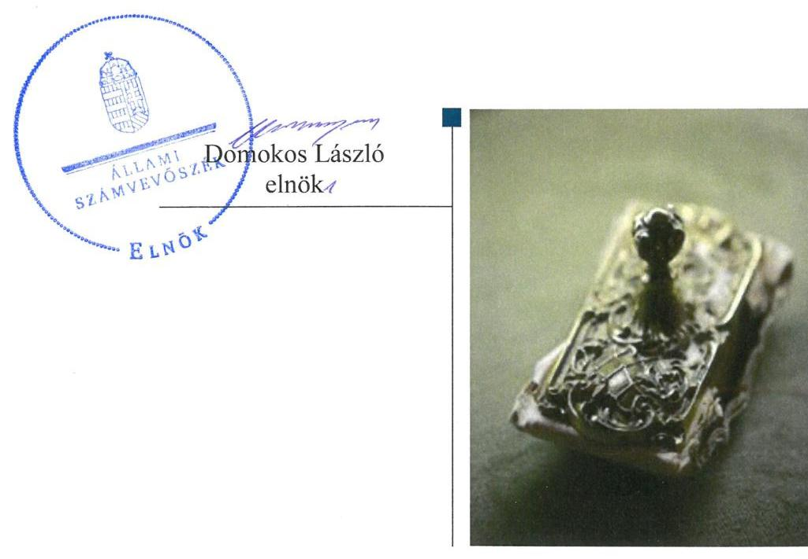
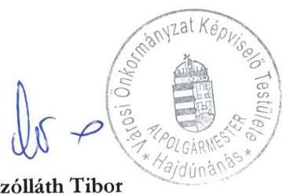
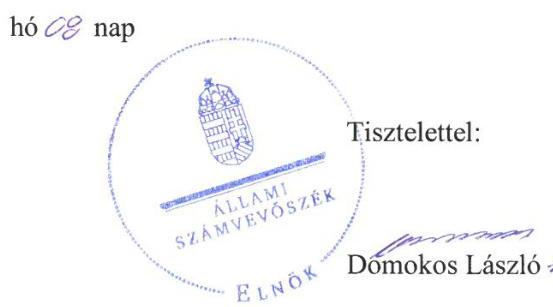
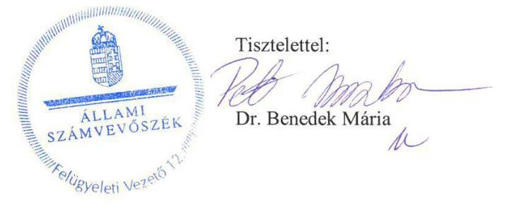

# Jelentés 

## Önkormányzatok ellenőrzése - Integritás- és belső kontrollrendszer

Hajdúnánás Városi Önkormányzat 2019.

---

# Jelentés 

## Önkormányzatok ellenőrzése - Integritás- és belső kontrollrendszer

Hajdúnánás Városi Önkormányzat 2019. 10. hó 22. nap

---

# AZ ELLENŐRZÉST FELÜGYELTE:

DR. BENEDEK MÁRIA felügyeleti vezető

## AZ ELLENŐRZÉST VEZETTE ÉS A VÉGREHAJTÁSÁÉRT FELELŐS:

GÁL MAGDOLNA ellenőrzésvezető

A PROGRAM ÖSSZEÁLLÍTÁSÁÉRT FELELŐS:

TÓTPÁL SZABOLCS osztályvezető

IKTATÓSZÁM: EL-1370-055/2019

TÉMASZÁM: 2485

ELLENŐRZÉS-AZONOSÍTÓ SZÁM: V082957

Jelentéseink az Országgyűlés számítógépes hálózatán és az Interneten a www.asz.hu címen is olvashatóak.

---

# TARTALOMJEGYZÉK 

■ ÖSSZEGZÉS ..... 5
■ AZ ELLENŐRZÉS CÉLJA ..... 6
■ AZ ELLENŐRZÉS TERÜLETE ..... 7
■ AZ ELLENŐRZÉS HÁTTERE, INDOKOLTSÁGA ..... 8
■ A JELENTÉS LÉNYEGES KÉRDÉSKÖREI ..... 9
■ AZ ELLENŐRZÉS HATÓKÖRE ÉS MÓDSZEREI ..... 10
■ MEGÁLLAPÍTÁSOK ..... 12
■ JAVASLATOK ..... 15
■ MELLÉKLETEK ..... 17
I. sz. melléklet: Értelmező szótár ..... 17
■ FÜGGELÉK: ÉSZREVÉTELEK ..... 19
■ RÖVIDÍTÉSEK JEGYZÉKE ..... 27

---

.

---

# ÖSSZEGZÉS 

Hajdúnánás Városi Önkormányzat belső kontrollrendszerének kialakítása és működtetése nem volt szabályszerű, így az nem biztosította a közpénzekkel történő átlátható, elszámoltatható, szabályszerű gazdálkodást és a nemzeti vagyonnal történő felelős gazdálkodást. A korrupciós kockázatok kezelésére alkalmas integritás kontrollokat nem építette ki, az integritás alapú működést nem biztosította.

## Az ellenőrzés társadalmi indokoltsága

Az Állami Számvevőszék alapvető feladata a közpénzekkel, az állami és önkormányzati vagyonnal való gazdálkodás ellenőrzése. Az Alaptörvény szerint az önkormányzatok kötelezettsége a kiegyensúlyozott, átlátható és fenntartható költségvetési gazdálkodás elvének érvényesítése, a nemzeti vagyonnal való rendeltetésszerű és felelős módon való gazdálkodás biztosítása. Az Állami Számvevőszék stratégiájában megfogalmazott célkitűzése az integritás alapú, átlátható és elszámoltatható közpénzfelhasználás elősegítése. Ennek megvalósítása érdekében az Állami Számvevőszék prioritásként kezeli a közpénzzel gazdálkodó szervezetek esetében a belső kontrollrendszer működésének ellenőrzését.

Az Állami Számvevőszék a Hajdúnánás Városi Önkormányzatot, mint tulajdonosi joggyakorlót „Az önkormányzatok gazdasági társaságai - Az önkormányzatok többségi tulajdonában lévő gazdasági társaságok közfeladat ellátását érintő gazdálkodási tevékenysége szabályszerűségének ellenőrzése - Hajdúnánási Építő és Szolgáltató Kft. (15142.)" című ellenőrzés keretében 2015. évben ellenőrizte.

## Főbb megállapítások, következtetések, javaslatok

A Hajdúnánás Városi Önkormányzat belső kontrollrendszerének kialakítása és működtetése nem volt szabályszerű.
A Hajdúnánási Közös Önkormányzati Hivatal jegyzője a kontrollkörnyezetet szabályszerűen alakította ki, a szervezeti keretek a szervezeti és működési szabályzatokban meghatározásra kerültek. A jegyző az integrált kockázatkezelési rendszert nem működtette. A Hajdúnánás Városi Önkormányzat a kontrolltevékenységeket szabályszerűen gyakorolta, a 2017. évi kiadások elszámolása szabályszerű volt. Az információs és kommunikációs folyamatok működtetése nem volt szabályszerű, az adatszolgáltatási kötelezettségek teljesítésének igazolása elmaradt. A jegyző a monitoring rendszert nem alakította ki, a belső ellenőrzést nem szabályszerűen működtette az intézkedési tervek jóváhagyásával és a belső ellenőrzésekről vezetett nyilvántartással kapcsolatos szabálytalanságok miatt. A Hajdúnánási Közös Önkormányzati Hivatal jegyzője a 2017. évre vonatkozóan nem értékelte a Hivatal belső kontrollrendszerének minőségét.

A szervezet integritását támogató kontrollok kiépítése, a korrupciós kockázatok kezelése nem történt meg. Hajdúnánás Városi Önkormányzat a szervezeti teljesítmény mérésére alkalmas követelményeket nem alakította ki, így a teljesítmény mérésének lehetősége nem volt biztosított.

---

# AZ ELLENŐRZÉS CÉLJA 

AZ ELLENŐRZÉS CÉLJA annak megállapítása volt, hogy az önkormányzat belső kontrollrendszere biztosította-e a közpénzekkel és a nemzeti vagyonnal történő elszámoltatható, átlátható, szabályszerű, gazdaságos, hatékony és eredményes gazdálkodás feltételeit. Az ellenőrzés keretében értékeltük továbbá, hogy az önkormányzatnál kiépítették és erősítették-e a korrupciós kockázatok kezelését szolgáló integritás kontrollokat és azt, hogy megteremtették-e a teljesítményellenőrzés feltételeit.

---

# AZ ELLENŐRZÉS TERÜLETE

## Hajdúnánás Városi Önkormányzat

Hajdúnánás város az Észak-Alföldi régióban, Hajdú-Bihar megyében fekszik. Lakossága a 2018. január 1. napján – a Központi Statisztikai Hivatal által kiadott, Magyarország közigazgatási helynévkönyve alapján – 16 828 fő volt.

A képviselő-testület1 – a polgármesterrel2 együtt – 11 tagból állt, munkáját négy bizottság segítette. A Hajdúnánás Városi Önkormányzat négy gazdasági társaságban rendelkezett részesedéssel, öt költségvetési szerv felett gyakorolta az irányítói jogokat.

A Hajdúnánás Városi Önkormányzat gazdálkodási feladatait ellátó, elkülönített gazdasági szervezettel rendelkező Hajdúnánási Közös Önkormányzati Hivatal működése kiterjedt Folyás, Tiszagyulaháza, Újtitkos települések, valamint a Hajdúnánási Roma Nemzetiségi Önkormányzat gazdálkodási feladatainak ellátására is.

A Hajdúnánási Közös Önkormányzati Hivatalban foglalkoztatottak száma a 2017. február 1. napján jóváhagyott létszám szerint 76 fő volt.

A polgármester a 2014. évi önkormányzati választások óta töltötte be tisztségét, a jegyző3 2013. március 1. napjától látta el feladatait.

A Hajdúnánás Városi Önkormányzat a 2017. évben 4 438,4 millió Ft költségvetési bevételt ért el, valamint 3 432,6 millió Ft költségvetési kiadást teljesített. 2017. december 31-én a befektetett eszközvagyon értéke 9 027,3 millió Ft, a mérlegfőösszege 9 733,2 millió Ft volt, a követelésállománya 515,7 millió Ft, a kötelezettségeinek állománya 713,5 millió Ft volt.

---

# AZ ELLENŐRZÉS HÁTTERE, INDOKOLTSÁGA 

Az ÁSZ4 az ÁSZ törvényben kapott felhatalmazással élve ellenőrzi az önkormányzatok gazdálkodását, működését, hogy az ellenőrzések megállapításaival támogassa az ellenőrzött önkormányzatok szabályszerű gazdálkodását, javaslataival elősegítse az Alaptörvényben5 megfogalmazott alapvetések érvényesülését a mindennapi életben az önkormányzatok szintjén. Az önkormányzati rendszerben zajló folyamatok holisztikus elemzései, a kockázatok folyamatos figyelemmel kísérésének módszerével, az így kiválasztott önkormányzatok célzott, hatékony ellenőrzéseivel az ÁSZ betölti a legfőbb gazdasági ellenőrző szerv küldetését. Az egyes ellenőrzések megállapításaival és egy időszak ellenőrzési eredményeinek elemzésével az ÁSZ ráirányíthatja a jogalkotók figyelmét az önkormányzati alrendszerben esetlegesen felmerülő pénzügyi, szabályozási feszültségekre. Az elvégzett nagyszámú ellenőrzés során az ÁSZ „jó gyakorlatokat" is azonosíthat, melyeket tanácsadó funkciója keretében szélesebb körben is megismertethet az érintettekkel, ezáltal is hozzájárulva az önkormányzati alrendszer szabályozott, átlátható, kiegyensúlyozott és fenntartható működéséhez.

A belső kontrollrendszer kialakítása és működtetése nélkül nem valósítható meg a közpénzek, a közvagyon átlátható, szabályos, gazdaságos, hatékony és eredményes felhasználása. A belső kontrollrendszer azt a célt szolgálja, hogy a költségvetési szervek működésük és gazdálkodásuk során a tevékenységeket szabályszerűen hajtsák végre, teljesítsék elszámolási kötelezettségeiket és megvédjék az erőforrásokat a veszteségektől, a károktól és a nem rendeltetésszerű használattól. A belső kontrollrendszer magában foglalja mindazon elveket, eljárásokat és belső szabályzatokat, melyek biztosítják, hogy a költségvetési szerv valamennyi tevékenysége és célja összhangban legyen a szabályszerűséggel, szabályozottsággal, valamint a gazdaságosság, hatékonyság és eredményesség követelményeivel, az eszközökkel és forrásokkal való gazdálkodásban ne kerüljön sor pazarlásra, visszaélésre, rendeltetésellenes felhasználásra. Megfelelő, pontos és naprakész információk álljanak rendelkezésre a költségvetési szerv működésével kapcsolatosan, és a belső kontrollrendszer harmonizációjára, összehangolására vonatkozó jogszabályok végrehajtásra kerüljenek. Az integritás kontrollok kiépítése, erősítése a szervezet korrupciós kockázatainak kezelését szolgálja. A teljesítménykövetelmények meghatározása és működtetése megalapozhatja az önkormányzatoknál a teljesítményellenőrzés lefolytatását.

---

# A JELENTÉS LÉNYEGES KÉRDÉSKÖREI 

1. Az önkormányzat belső kontrollrendszerének kialakítása és működtetése szabályszerű volt-e?
2. Az önkormányzatnál alakítottak-e ki a teljesítmény mérésére alkalmas követelményeket?

---

# AZ ELLENŐRZÉS HATÓKÖRE ÉS MÓDSZEREI 

## Az ellenőrzés típusa

Megfelelőségi ellenőrzés

## Az ellenőrzött időszak

Az ellenőrzött időszak a 2017. év, illetve az éves költségvetési beszámoló Áht.6 által megállapított jóváhagyásáig (2018. május 31-éig) tartó időszak.

## Az ellenőrzés tárgya

Hajdúnánás Városi Önkormányzat és a gazdálkodási feladatokat ellátó Hajdúnánási Közös Önkormányzati Hivatal belső kontrollrendszerének kialakítása és működtetése, valamint az integritás kontrollok kiépítettsége, a teljesítményellenőrzés feltételei.

## Az ellenőrzött szervezet

Hajdúnánás Városi Önkormányzat

## Az ellenőrzés jogalapja

Az ellenőrzés jogszabályi alapját az ÁSZ tv.7 1. § (3) bekezdés, 5. § (2) és (6) bekezdései, valamint az Áht. 61.§ (2) bekezdésének előírásai képezik.

## Az ellenőrzés módszerei

Az ÁSZ az ellenőrzést az ellenőrzési program szempontjai, az ellenőrzött időszakban hatályos jogszabályok, az ellenőrzés szakmai szabályai, a jelen ellenőrzésre irányadó ÁSZ módszertanok figyelembevételével hajtotta végre.

Az ellenőrzés ideje alatt az ellenőrzött szervezettel történő kapcsolattartást az ÁSZ SZMSZ8-ének vonatkozó előírásai alapján biztosította az ÁSZ.

Az ellenőrzési kérdések megválaszolásához szükséges bizonyítékok megszerzése az ellenőrzött által rendelkezésre bocsátott dokumentumokra, adatokra alapozva megfigyelés, mintavételezés, valamint elemző eljárás útján történt. Az ellenőrzési bizonyítékként felhasználható adatfor-

---

rások közé tartoztak az ellenőrzési program részletes szempontjainál felsorolt adatforrások, valamint minden egyéb - az ellenőrzés folyamán feltárt, az ellenőrzés szempontjából információt tartalmazó -dokumentum.

Az ellenőrzés lefolytatásához az ellenőrzött szervezet tanúsítványok kitöltésével, valamint az ÁSZ által kért dokumentumok megküldésével szolgáltatott adatokat, amelyek valódiságát és teljes körűségét az ellenőrzött szervezet vezetője által tett teljességi és hitelességi nyilatkozat igazolta. A rendelkezésre bocsátott adatok, információk kontrollja az ellenőrzés keretében történt.

Az önkormányzat belső kontrollrendszere egyes pilléreinek kialakítására és működtetésére vonatkozó értékelés:
$\longrightarrow$ „szabályszerű", amennyiben az értékelt területen az elért „igen" válaszok százalékban kifejezett, egész számra kerekített aránya legalább 85 %,
$\longrightarrow$ „nem szabályszerű", ha nem éri el a 85%-ot.
Az önkormányzat belső kontrollrendszerének összesített értékelése az egyes részterületek esetében kapott megfelelőségi arányok számtani átlaga alapján történt és megegyezik a pillérenként (kontrollterületenként) alkalmazott százalékos értékelésekkel, a következő eltérésekkel: a kontrollrendszer egésze esetében a „szabályszerű" értékelésnek a százalékos értéken felül további feltétele volt, hogy egyik kontroll terület sem kaphat „nem szabályszerű" értékelést.

A 2017. évi kiadások teljesítéséhez kapcsolódó pénzgazdálkodási belső kontrollok működésének szabályszerűsége esetében az ellenőrzés azokra a legnagyobb értékű tételekre - a lényeges sokaságra - terjedt ki, melyek összértéke eléri a teljes sokaság összértékének 50%-át.

A lényeges sokaságból véletlen mintavételi eljárással kiválasztott tételek kerültek ellenőrzésre.
„Szabályszerűnek" értékeltük az ellenőrzött területet, amennyiben 95%-os bizonyossággal az ellenőrzött sokaságban az átlagos hibaarány legfeljebb 10%, "nem szabályszerűnek", amennyiben 10%-nál magasabb arányt képviselt.

Amennyiben az önkormányzat működését és gazdálkodását alapvetően meghatározó dokumentum hiánya miatt, valamely lényeges kérdéskörre vonatkozóan az ÁSZ megállapítást tett, további ellenőrzési tevékenységek az adott kérdéskörrel és az azzal szoros logikai kapcsolatban lévő kérdéskörökkel - ráépülő jelleggel - nem kerültek végrehajtásra.

---

# 1. Az önkormányzat belső kontrollrendszerének kialakítása és működtetése szabályszerű volt-e? 

Összegző megállapítás

Az Önkormányzat belső kontrollrendszerének kialakítása és működtetése nem volt szabályszerű.

A KONTROLLKÖRNYEZET kialakítása szabályszerű volt. Az Önkormányzat9 rendelkezett a képviselő-testület által rendeletben meghatározott Önkormányzati SZMSZ10-szel és a Hivatal 2017. február 1-től hatályos Hivatali SZMSZ11-szel, készült Gazdasági program12, a Hivatal13 rendelkezett Alapító Okirattal14 és Ellenőrzési nyomvonallal15, aminek hatálya kiterjedt az Önkormányzatra is.

A jegyző meghatározta a Hivatal gazdasági szervezetének gazdálkodással összefüggő Ügyrendjét16. A Hivatal működtetésére az önkormányzatok a megállapodást megkötötték.

A jegyző kialakította az Önkormányzat és a Hivatal számviteli politikáját17, ennek keretében elkészítette a leltározási és leltárkészítési szabályzatot18, az eszközök és források értékelési szabályzatát19, a pénzkezelési szabályzatot20 és az önköltségszámítási szabályzatot21. A jegyző a Hivatal számlarendjét elkészítette.

A polgármester a Számv. tv. 161. § (1) bekezdésében foglaltak ellenére az Önkormányzat számlarendjét nem készítette el.

A jegyző a Számv. tv.22 161. § (2) bekezdés d) pontjában foglaltak ellenére nem készítette el a számlarendben foglaltakat alátámasztó bizonylati rendet.

## AZ INTEGRÁLT KOCKÁZATKEZELÉSI RENDSZERT a Bkr. 7. § (1) bekezdése előírása ellenére a jegyző nem működtette.

A KONTROLTEVÉKENYSÉGEK gyakorlása és a 2017. évi kiadások elszámolása szabályszerű volt. A gazdálkodási
 jogkörök gyakorlóinak aláírásmintáit tartalmazó nyilvántartást naprakészen vezették. Az Ávr. ${ }^{23}$ előírásai szerinti összeférhetetlenségi szabályokat betartották.

## AZ INFORMÁCIÓS ÉS KOMMUNIKÁCIÓS FOLYAMATOK működtetése nem volt szabályszerű, mivel:

- a jegyző a Bkr. 9. § (1) bekezdésében előírtak ellenére nem működtetett olyan információs rendszereket, amelyek biztosították, hogy a megfelelő információk a megfelelő időben eljussanak az illetékes szervezethez, szervezeti egységhez, illetve személyhez;

---

- a jegyző az Info. tv. ${ }^{14}$ 37. § (1) bekezdésében előírtak ellenére az 1. melléklet általános közzétételi lista II/1. pontja szerint a Hivatal szervezeti és működési szabályzatát, az adatvédelmi és adatbiztonsági szabályzatát, a III/1. pontja szerint a 2017. évi költségvetését és a 2017. évi költségvetési beszámolóját nem tette közzé;
- a jegyző nem igazolta az Áht. 108. § (1) bekezdés a)-b) pontjában, az Ávr. 169. § (3) és a 170. § (2) bekezdéseiben előírt, az Önkormányzat és a Hivatal 2017. évre vonatkozó elemi költségvetésével, a 2017. évi költségvetési beszámolójával, az időközi költségvetési jelentéseivel, valamint a negyedéves mérlegjelentésekkel kapcsolatos adatszolgáltatási kötelezettség teljesítését az államháztartás információs rendszerébe.
A jegyző az Ávr.-ben, valamint az Info tv.-ben előírtakkal összhangban elkészítette a Közérdekű adatszolgáltatások rendjét rögzítő szabályzatot ${ }^{25}$ a közérdekű adatok megismerésére irányuló igények teljesítésének rendjéről.

A jegyző az Ávr. előírásai, valamint az Info tv.-ben előírtak alapján a Közérdekű adatok közzétételi kötelezettségének teljesítéséről szóló szabályzatában ${ }^{26}$ megállapította a kötelezően közzéteendő adatok nyilvánosságra hozatalának rendjét.

A MONITORING RENDSZERT a jegyző nem alakította ki, a belső ellenőrzést nem szabályszerűen működtette, mivel:
— a jegyző a Bkr. 45. § (4) bekezdésében előírtak ellenére az intézkedési tervek jóváhagyásáról a belső ellenőrzési vezető véleményének kikérése nélkül döntött;
— a belső ellenőrzési vezető a Bkr. 50. § (1) bekezdésében előírtak ellenére nem vezette az elvégzett belső ellenőrzésekről a nyilvántartást;
— a belső ellenőrzési vezető a Bkr. 47. § (1) bekezdésében előírtak ellenére nem vezetett éves bontásban olyan nyilvántartást, mellyel a belső ellenőrzési jelentésekben tett megállapításokat, javaslatokat, a vonatkozó intézkedési terveket és azok végrehajtását nyomon követte.
A képviselő-testület a 2017. évi belső ellenőrzési tervet szabályszerűen hagyta jóvá. A belső ellenőr a megállapításait, következtetéseit és javaslatait tartalmazó ellenőrzési jelentéseit a Bkr. előírásai szerint készítette el.

A jegyző a Bkr. 11. § (1) bekezdésében előírtak ellenére az 1. melléklet szerinti nyilatkozatban nem értékelte a Hivatal belső kontrollrendszerének minőségét.

Az Önkormányzat a korrupciós kockázatok kezelésére alkalmas integritás kontrollokat nem építette ki. Az Önkormányzat hosszú távú céljai között az integritás erősítése nem került rögzítésre. Nem mérték fel és nem azonosították a korrupciós kockázatokat, az integritás alapú működést nem biztosították.

---

# 2. Az önkormányzatnál alakítottak-e ki a teljesítmény mérésére alkalmas követelményeket? 

Összegző megállapítás Az Önkormányzatnál nem alakítottak ki a teljesítmény mérésére alkalmas követelményeket.

A SZERVEZET CÉLOK elérését szolgáló feladatok, folyamatok, tevékenységek mérését szolgáló indikátorokat, mérőszámokat, feladat- és teljesítménymutatókat az Önkormányzat nem képezett, így nem biztosította a teljesítménymérés lehetőségét.

---

# JAVASLATOK 

Az ÁSZ tv. 33. § (1) bekezdésében foglaltak értelmében az ellenőrzött szervezet vezetője köteles a jelentésben foglalt megállapításokhoz kapcsolódó intézkedési tervet összeállítani és azt a jelentés kézhezvételétől számított 30 napon belül az ÁSZ részére megküldeni. Amennyiben az ellenőrzött szervezet vezetője nem küldi meg határidőben az intézkedési tervet, vagy továbbra sem elfogadható intézkedési tervet küld, az Állami Számvevőszék elnöke az ÁSZ tv. 33. § (3) bekezdése a) és b) pontjaiban foglaltakat érvényesítheti.

## Hajdúnánás Városi Önkormányzat polgármesterének

1. Intézkedjen az Állami Számvevőszék ellenőrzése során feltárt szabálytalanságok tekintetében a munkajogi felelősség tisztázására irányuló eljárás megindításáról, és ennek eredménye ismeretében tegye meg a szükséges intézkedéseket.
(1. pont 8. bekezdés 1. és 3. francia bekezdései, 1. pont 11. bekezdés 1-3. francia bekezdései alapján)
2. Intézkedjen a Számv. tv. előírása szerint az Önkormányzatra vonatkozó számlarend elkészítéséről.
(1. pont 4. bekezdés)

## Hajdúnánási Közös Önkormányzati Hivatal jegyzőjének

1. A szabályszerű információs és kommunikációs rendszer működtetése érdekében:
a) működtessen a Bkr. előírása szerint olyan információs rendszereket, amelyek biztosítják, hogy a megfelelő információk a megfelelő időben eljutnak az illetékes szervezeti egységhez, illetve személyhez;
b) gondoskodjon a jogszabályban előírt adatszolgáltatási kötelezettség teljesítéséről.
(1. pont 8. bekezdés 1. és 3. francia bekezdései alapján)
2. A szabályszerű monitoring rendszer működtetése érdekében:
a) az intézkedési terv jóváhagyásáról a Bkr. előírásának megfelelően a belső ellenőrzési vezető véleményének kikérésével döntsön;
b) gondoskodjon arról, hogy a belső ellenőrzési vezető a Bkr. szerinti nyilvántartásokat vezesse
(1. pont 11. bekezdés 1-3. francia bekezdései alapján)

---

3. A Bkr. előírásának megfelelően nyilatkozatban értékelje a Hivatal belső kontrollrendszerének minőségét.
(1. pont 13. bekezdése alapján)

---

# MELLÉKLETEK 

- I. SZ. MELLÉKLET: ÉRTELMEZŐ SZÓTÁR
belső ellenőrzés
belső kontrollrendszer
belső kontrollrendszer területei
információs és kommunikációs rendszer
integrált kockázatkezelési rendszer
integritás
irányító szerv/felügyeleti szerv
kockázat
kontrollkörnyezet
kontrolltevékenységek
kommunikáció

Független, tárgyilagos bizonyosságot adó és tanácsadó tevékenység, amelynek célja, hogy az ellenőrzött szervezet működését fejlessze és eredményességét növelje, az ellenőrzött szervezet céljai elérése érdekében rendszerszemléletű megközelítéssel és módszeresen értékeli, illetve fejleszti az ellenőrzött szervezet irányítási és belső kontrollrendszerének hatékonyságát. (Forrás: Bkr. 2. § b) pontja)
A belső kontrollrendszer a kockázatok kezelése és tárgyilagos bizonyosság megszerzése érdekében kialakított folyamatrendszer, amely azt a célt szolgálja, hogy a működés és gazdálkodás során a tevékenységeket szabályszerűen, gazdaságosan, hatékonyan, eredményesen hajtsák végre, az elszámolási kötelezettségeket teljesítsék, megvédjék az erőforrásokat a veszteségektől, károktól és nem rendeltetésszerű használattól. (Forrás: Áht. 69. § (1) bekezdése)
A kontrollkörnyezet, az integrált kockázatkezelési rendszer, a kontrolltevékenységek, az információs és kommunikációs rendszer, valamint a nyomon követési (monitoring) rendszer. (Forrás: Bkr. 3. §-a)
A költségvetési szerv vezetője által kialakított és működtetett olyan rendszer, mely biztosítja, hogy a megfelelő információk a megfelelő időben eljutnak az illetékes szervezethez, szervezeti egységhez, illetve személyhez. (Forrás: Bkr. 9. § (1) bekezdés)
Olyan folyamatalapú kockázatkezelési rendszer, amely a szervezet minden tevékenységére kiterjed, egységes módszertan és eljárások alkalmazásával, a szervezet célkitűzéseinek és értékeinek figyelembevételével biztosítja a szervezet kockázatainak teljes körű azonosítását, azok meghatározott kritériumok szerinti értékelését, valamint a kockázatok kezelésére vonatkozó intézkedési terv elkészítését és az abban foglaltak nyomon követését. (Forrás: Bkr. 2. § m) pontja, 2016. október 1-jétől)
Az integritás az elvek, értékek, cselekvések, módszerek, intézkedések konzisztenciáját jelenti, vagyis olyan magatartásmódot, amely meghatározott értékeknek megfelel. (Forrás: Nemzetgazdasági Minisztérium: Magyarországi államháztartási belső kontroll standardok Útmutató 1.6.1. pontja, 2012. december)
A költségvetési szerv tekintetében az Áht-ban meghatározott irányítási hatáskört gyakorló szerv. (Forrás: Áht. 1. § 9. pontja)
A kockázat annak a valószínűségét jelenti, hogy egy vagy több esemény vagy intézkedés nem kívánt módon befolyásolja a rendszer működését, céljainak megvalósulását. (Forrás: Javaslatok a korrupciós kockázatok kezelésére - Kockázatkezelési és ellenőrzési módszertan 35. oldal, ÁSZ)
A költségvetési szerv vezetője által kialakított olyan elvek, eljárások, belső szabályzatok összessége, amelyben világos a szervezeti struktúra, a folyamatok átláthatók, egyértelműek a felelősségi, hatásköri viszonyok és feladatok, meghatározottak, ismertek és elfogadottak az etikai elvárások a szervezet minden szintjén, átlátható a humán-erőforrás-kezelés, biztosított a szervezeti célok és értékek irányában való elkötelezettség fejlesztése és elősegítése. (Forrás: Bkr. 6. § (1) bekezdés)
A költségvetési szerv vezetője által a szervezeten belül kialakított (kontroll) tevékenységek, melyek biztosítják a kockázatok kezelését, hozzájárulnak a szervezet céljainak eléréséhez és erősítik a szervezet integritását. (Forrás: Bkr. 8. § (1) bekezdés)
Az a tevékenység, melynek során információ továbbítása valósul meg. A kommunikációs folyamat résztvevői között tájékoztatás történik, mely során tényeket, ezek magyarázatát közlik.

---

| közös önkormányzati hivatal | A települési képviselő-testület más települési képviselő-testülettel társult képviselőtestületet alakíthat, amely esetén a képviselő-testületek részben vagy egészben egyesítik a költségvetésüket, közös önkormányzati hivatalt tartanak fenn és intézményeiket közösen működtetik. (Forrás: Mötv. ${ }^{27}$ 56. § (1)-(2) bekezdései) |
| :--: | :--: |
| monitoring | A monitoring általánosságban a különböző szintű szervezeti célok megvalósításának folyamatát kíséri figyelemmel, melynek során a releváns eseményekről és tevékenységekről (együtt: folyamatokról) rendszeres jelleggel, strukturált, döntéstámogató információkhoz jutnak a szervezet vezetői. (Forrás: NGM Útmutató a költségvetési szervek monitoring rendszeréhez 2011. november) |
| monitoring-rendszer | A költségvetési szerv vezetője köteles kialakítani a szervezet tevékenységének a célok megvalósításának nyomon követését biztosító rendszert, amely az operatív tevékenységek keretében megvalósuló folyamatos és eseti nyomon követésből, valamint az operatív tevékenységektől függetlenül működő belső ellenőrzésből állhat. (Forrás: Bkr. 10. §) |
| önkormányzati hivatal | A polgármesteri hivatal, a főpolgármesteri hivatal, a megyei önkormányzati hivatal és a közös önkormányzati hivatal. (Forrás: Áht. 1. § 18. pont) |
| társulás | A helyi önkormányzatok képviselő-testületei megállapodhatnak abban, hogy egy vagy több önkormányzati feladat- és hatáskör, valamint a polgármester és a jegyző államigazgatási feladat- és hatáskörének hatékonyabb, célszerűbb ellátására jogi személyiséggel rendelkező társulást hoznak létre. (Forrás: Mötv. 87. §) |

---

# FÜGGELÉK: ÉSZREVÉTELEK 

A jelentéstervezetet a Számvevőszék 15 napos észrevételezésre megküldte az ellenőrzött szervezet vezetőjének az ÁSZ tv. 29. §* (1) bekezdése előírásának megfelelően.

Hajdúnánás Városi Önkormányzat polgármestere a jelentéstervezet megállapításaira írásban észrevételt tett.
Az ÁSZ tv. 29. § (3) bekezdésével összhangban az ÁSZ a Függelékben feltünteti az ellenőrzés megállapításaival kapcsolatban tett, figyelembe nem vett észrevételeket, és megindokolja, hogy azokat miért nem fogadta el.

[^0]
[^0]:    * 29. § (1) Az Állami Számvevőszék az ellenőrzési megállapításait megküldi az ellenőrzött szervezet vezetőjének vagy az általa megbízott személynek, és annak, akinek személyes felelősségét állapította meg.
    (2) Az ellenőrzött szervezet vezetője és a felelősként megjelölt személy az ellenőrzés megállapításaira tizenöt napon belül írásban észrevételt tehet.
    (3) Az Állami Számvevőszék az észrevételre a beérkezésétől számított harminc napon belül írásban válaszol. A figyelembe nem vett észrevételeket köteles a jelentésben feltüntetni, és megindokolni, hogy azokat miért nem fogadta el.

---

Hajdúnánás Városi Önkormányzat Polgármesterétől 4080 Hajdúnánás, Köztársaság tér 1. sz. 52/381-411 52/381-087 szollath@hajdunanas.hu

Iktatószám: HAJ/18012-2/2019.
Tárgy: észrevétel EL-1370-048/2019

Állami Számvevőszék
Domokos László Elnök
részére

BUDAPEST 4.
Pf.: 54
1364

# Tisztelt Elnök Úr! 

Az Állami Számvevőszék által végzett „Önkormányzatok ellenőrzése - Integritás- és belső kontrollrendszer - Hajdúnánás Városi Önkormányzat" című ellenőrzés számvevőszéki jelentéstervezetéhez az alábbi észrevételt tesszük:

1. A megállapítások 1. pont 4. bekezdése alapján: „A polgármester a Számv. tv. 161. § (1) bekezdésében foglaltak ellenére az Önkormányzat számlarendjét nem készítette el".

Az adatszolgáltatás keretében az I.1.4. ponthoz megküldtük a Hajdúnánási Közös Önkormányzati Hivatal 2014. január 1-jétől hatályos számlarendjét, melynek I.1.1. pontja a következő rendelkezést tartalmazza: „A számlarend hatálya kiterjed a Hajdúnánási Közös Önkormányzati Hivatalra, továbbá a Hajdúnánás Városi Önkormányzatra, ...) az államháztartásról szóló törvény végrehajtásáról szóló 368/2011. (XII. 31.) Korm. rendelet 2017. évben hatályos 13. § (3a) bekezdése alapján.
2. A megállapítások 1. pont 8. bekezdés 3. francia bekezdése alapján: „A jegyző nem igazolta az Áht. 108. § (1) bekezdés a)-b) pontjában, az Ávr. 169. § (3) és a 170. § (2) bekezdésében előírt, az Önkormányzat és
 a Hivatal 2017. évre vonatkozó elemi költségvetésével, a 2017. évi költségvetési beszámolójával, az időközi költségvetési jelentéseivel, valamint a negyedéves mérlegjelentésekkel kapcsolatos adatszolgáltatási kötelezettség teljesítését az államháztartás információs rendszerébe."

Az adatszolgáltatás I.1.42. pontjában, mely így került meghatározásra: „az adatszolgáltatási kötelezettség teljesítésének dokumentumai (költségvetési rendelet, elemi költségvetés, éves költségvetési beszámoló megküldésének, javításának dokumentumai, negyedéves adatszolgáltatási kötelezettségek dokumentumai - költségvetési jelentések, időközi mérlegjelentések, adósságot keletkeztető ügyletek),", előírtaknak megfelelően megküldtük a költségvetési rendeletet, az Önkormányzat és a Hivatal a Magyar Államkincstár felé teljesített adatszolgáltatásának, a KGR rendszerből kinyomtatott adatellenőrző kóddal ellátott dokumentumait: elemi költségvetés, negyedéves, havi adatszolgáltatási kötelezettségek dokumentumai: költségvetési jelentések, időközi mérlegjelentések, adósságot keletkeztető ügyletek.

---

Az alábbi észrevételeket Rukóber Lászlóné (Val-Ethik Könyvvizsgáló és Tanácsadó Kft., 1025 Budapest, Pitypang út 1/A 1/4.) belső ellenőrzési vezetővel egyeztetve tesszük (a belső ellenőrzési vezető észrevétele mellékletben):
3. A megállapítások 1. pont 11. bekezdés 1. francia bekezdés szerint monitoring rendszert a jegyző nem alakította ki, a belső ellenőrzést nem szabályszerűen működtette, mivel a jegyző a Bkr. 45. § (4) bekezdésében előírtak ellenére az intézkedési tervek jóváhagyásáról a belső ellenőrzési vezető véleményének kikérése nélkül döntött.

A Bkr. 45. § (4) bekezdésében előírtak szerint a költségvetési szerv vezetője az intézkedési terv jóváhagyásáról az intézkedési terv kézhezvételétől számított 8 napon belül - a belső ellenőrzési vezető véleményének kikérésével - dönt.

A belső ellenőrzés az éves feladat ellátása során folyamatos kapcsolatot tart az Önkormányzat jegyzőjével, valamint a Közgazdasági Iroda vezetőjével. Ennek eredményeképpen a megbeszélések körébe beletartozik az intézkedési tervek jóváhagyásával és végrehajtásával kapcsolatos teendők megvitatása is. A jegyző az intézkedési tervek jóváhagyásáról a belső ellenőrzési vezető véleményének kikérésével döntött.
4. A megállapítások 1. pont 11. bekezdés 2. francia bekezdés szerint a belső ellenőrzési vezető a Bkr. 50.§ (1) bekezdésében előírtak ellenére nem vezette az elvégzett belső ellenőrzésekről a nyilvántartást.

A belső ellenőrzési vezető a Bkr. 50.§ (1) bekezdésében a belső ellenőrzések nyilvántartására vonatkozó nyilvántartást vezette, és vezeti.

A belső ellenőrzésre vonatkozó Kézikönyvben előírtak szerint: „Az ellenőrzési mappa, beleértve az ellenőrzési munkalapokat, általában a belső ellenőrzés birtokában maradnak mind az ellenőrzés végrehajtása során, mind pedig az ellenőrzést követő időszakban. Általános szabályként az ellenőrzési iratokat a belső ellenőrzésnek kell megőriznie. Az ellenőrzési iratokat biztonságos és védett helyen kell tárolni." (Belső ellenőrzési kézikönyv, készült: 2010.; aktualizálva: 2018. december 15. idézet: 64. oldal)
5. A megállapítások 1. pont 11. bekezdés 3. francia bekezdés szerint a belső ellenőrzési vezető a 47. § (1) bekezdésében meghatározott előírtak ellenére nem vezetett éves bontásban olyan nyilvántartást, mellyel a belső ellenőrzési jelentésekben tett megállapításokat, javaslatokat, a vonatkozó intézkedési terveket és azok végrehajtását nyomon követte.

A belső ellenőrzési vezető a Bkr. 47.§ (1) bekezdésében előírtak szerinti nyilvántartást vezette, és vezeti. A nyilvántartás a belső ellenőrzési vezető ellenőrzési mappában rendelkezésre áll. Az Önkormányzati Hivatalban a Bkr. 47.§ (1) mellékletben előírt nyilvántartást a belső ellenőrzéssel azonos formában, és tartalommal a jegyző és a Közgazdasági Iroda vezetője dokumentálja.

Az Állami Számvevőszék által a jelentéstervezetben feltárt hibák és hiányosságok esetén megkezdtük azok javítását.

Hajdúnánás, 2019. június 18.
Tisztelettel:

Szólláth Tibor
polgármester ~

---

# Válasz az ÁSZ Jelentéstervezetre (2019.06.04.) 

A monitoring rendszert a jegyző nem alakította ki, a belső ellenőrzést nem szabályszerűen működtette:

- a Bkr. 45. § (4) bekezdésében előírtak szerint a költségvetési szerv vezetője az intézkedési terv jóváhagyásáról az intézkedési terv kézhezvételétől számított 8 napon belül - a belső ellenőrzési vezető véleményének kikérésével - dönt.

A belső ellenőrzés az éves feladat ellátása során folyamatos kapcsolatot tart az Önkormányzat jegyzőjével, valamint a Közgazdasági Iroda vezetőjével. Ennek eredményeképpen a megbeszélések körébe beletartozik az intézkedési tervek jóváhagyásával és végrehajtásával kapcsolatos teendők megvitatása is. A jegyző az intézkedési tervek jóváhagyásáról a belső ellenőrzési vezető véleményének kikérésével döntött.

- a belső ellenőrzési vezető a Bkr. 50.§ (1) bekezdésében előírtak ellenére nem vezette az elvégzett belső ellenőrzésekről a nyilvántartást;

A belső ellenőrzési vezető a Bkr. 50.§ (1) bekezdésében a belső ellenőrzések nyilvántartására vonatkozó nyilvántartást vezette, és vezeti.

A belső ellenőrzésre vonatkozó Kézikönyvben előírtak szerint: „Az ellenőrzési mappa, beleértve az ellenőrzési munkalapokat, általában a belső ellenőrzés birtokában maradnak mind az ellenőrzés végrehajtása során, mind pedig az ellenőrzést követő időszakban. Általános szabályként az ellenőrzési iratokat a belső ellenőrzésnek kell megőriznie. Az ellenőrzési iratokat biztonságos és védett helyen kell tárolni." (Belső ellenőrzési kézikönyv, készült: 2010.; aktualizálva: 2018. december 15. idézet: 64. oldal)

- a belső ellenőrzési vezető a 47. § (1) bekezdésében meghatározott előírtak ellenére nem vezetett éves bontásban olyan nyilvántartást, mellyel a belső ellenőrzési jelentésekben tett megállapításokat, javaslatokat, a vonatkozó intézkedési terveket és azok végrehajtását nyomon követte.

A belső ellenőrzési vezető a Bkr. 47.§ (1) bekezdésében előírtak szerinti nyilvántartást vezette, és vezeti. A nyilvántartás a belső ellenőrzési vezető ellenőrzési mappában rendelkezésre áll. Az Önkormányzati Hivatalban a Bkr. 47.§ (1) mellékletben előírt nyilvántartást a belső ellenőrzéssel azonos formában, és tartalommal a jegyző és a Közgazdasági Iroda vezetője dokumentálja.

Budapest, 2019. június 09.
Rukóber Lászlóné belső ellenőrzési vezető

Balla Gáborné belső ellenőr

A másolat hiteles
HAJDÚNÁNÁS

---

# Szólláth Tibor Zoltán úr 

polgármester
Hajdúnánás Városi Önkormányzat

## Hajdúnánás

## Tisztelt Polgármester Úr!

Az „Önkormányzatok ellenőrzése - Integritás- és belső kontrollrendszer - Hajdúnánás Városi Önkormányzat" címmel készített számvevőszéki jelentéstervezetben foglalt megállapításokra tett észrevételeit megkaptam.
Tájékoztatom Polgármester urat, hogy a figyelembe nem vett észrevételeket - az Állami Számvevőszékről szóló 2011. évi LXVI. törvény 29. § (3) bekezdése alapján - az Állami Számvevőszék a számvevőszéki jelentésben szerepelteti azok elutasítása indoklásának feltüntetésével.
Az Állami Számvevőszék észrevételekre vonatkozó álláspontjáról a felügyeleti vezető által készített részletes tájékoztatást csatoltan megküldöm.

Budapest, 2019.

Melléklet: Tájékoztatás az észrevételek kezeléséről

---

# Tájékoztatás az észrevételek kezeléséről 

Az „Önkormányzatok ellenőrzése - Integritás- és belső kontrollrendszer - Hajdúnánás Városi Önkormányzat" című számvevőszéki jelentéstervezetben (továbbiakban: jelentéstervezet) foglalt megállapításokra a HAJ/18012-2/2019. iktatószámú levélben megküldött észrevételeit áttekintettem. Az észrevételek kezeléséről az alábbi tájékoztatást adom.

## 1. A jelentéstervezet 12. oldal 1. pont 4. bekezdésében foglalt megállapításhoz tett észrevétele kapcsán:

Polgármester úr észrevételében jelezte, hogy ,,Az adatszolgáltatás keretében az 1.1.4. ponthoz megküldtük a Hajdúnánási Közös Önkormányzati Hivatal 2014. január 1-jétől hatályos számlarendjét, melynek 1.1.1. pontja a következő rendelkezést tartalmazza: „A számlarend hatálya kiterjed a Hajdúnánási Közös Önkormányzati Hivatalra, továbbá a Hajdúnánás Városi Önkormányzatra, ...) az államháztartásról szóló törvény végrehajtásáról szóló 368/2011. (XII. 31.) Korm. rendelet 2017. évben hatályos 13. § (3a) bekezdése alapján."
Az Állami Számvevőszék (továbbiakban: ÁSZ) az adatszolgáltatásra biztosított határidőben rendelkezésére bocsátott dokumentumok felülvizsgálata során megállapította, hogy Hajdúnánás Városi Önkormányzat (továbbiakban: Önkormányzat) által beküldött (a 2019. január 16-án kelt Teljességi és hitelességi nyilatkozatban a 63. sorszámon rögzített) 2014. január 1-jétől hatályos számlarend hatálya kiterjed ugyan az Önkormányzatra, de azt a jegyző kiadmányozta, polgármester úr nem írta alá. A számvitelről szóló 2000. évi C. törvény 3. § (1) bekezdés 1. és 3. pontjából, a 161. § (1) és (4) bekezdésekből és az államháztartásról 2011. évi CXCV. törvény (Áht.) 3. § (3) bekezdés a) pontjából levezethetően az önkormányzat számlarendjének elkészítéséért a polgármester a felelős.
A fentiek alapján az ÁSZ fenntartja a jelentéstervezet 1. pont 4. bekezdésében foglalt számlarendre vonatkozó megállapítását.
2. A jelentéstervezet 13. oldal 1. pont 8. bekezdés harmadik franciabekezdésében foglalt megállapításhoz tett észrevétele kapcsán:

Polgármester úr észrevételében jelezte, hogy ,,az adatszolgáltatás 1.1.42. pontjában ...előírtaknak megfelelően megküldtük a költségvetési rendeletet, a Magyar Államkincstár felé teljesített adatszolgáltatás dokumentumaként a KGR rendszerből kinyomtatott

---

adatellenőrző kóddal ellátott dokumentumait: elemi költségvetés, negyedéves, havi adatszolgáltatási kötelezettségek dokumentumai: költségvetési jelentések, időközi mérlegjelentések, adósságot keletkeztető ügyletek.
Az Önkormányzat által az adatszolgáltatásra biztosított határidőben az ÁSZ rendelkezésére bocsátott dokumentumok felülvizsgálata során megállapította, hogy az Önkormányzat által beküldött - az észrevétel 2. pontjában felsorolt - dokumentumokhoz kapcsolódóan az Áht. 108. § (1) bekezdés a)-b) pontjaiban, valamint az államháztartásról szóló törvény végrehajtásáról szóló 368/2011. (XII. 31.) Korm. rendelet 169. § (3) és 170. § (2) bekezdéseiben előírt adatszolgáltatási kötelezettség teljesítéséhez a Kincstár által üzemeltetett elektronikus adatszolgáltató rendszerbe történő megküldést/feltöltést bizonyító dokumentumot (pld: a rendszerből kinyomtatott naplózást) nem bocsátott az ÁSZ részére. Az EL-1370-005/2018. és EL-1370-006/2018. iktatószámú adatbekérő levelek 2. számú melléklet I.1.42. pontjában leírtak alapján az adatszolgáltatási kötelezettség teljesítésének igazolásához a „megküldés" dokumentumait is bekérte az ÁSZ.
Az előzőekben leírtakra figyelemmel észrevételét nem fogadjuk el, a jelentéstervezetben szereplő megállapítás módosítása nem indokolt. Az ÁSZ fenntartja a jelentéstervezet 1 pont 8. bekezdés 3. franciabekezdésében foglalt megállapítását.

# 3. A jelentéstervezet 13. oldal 1. pont 11. bekezdés 1. franciabekezdésében foglalt megállapításra tett észrevétele kapcsán: 

Polgármester úr észrevételében arról adott tájékoztatást, hogy ,,A Bkr. 45. § (4) bekezdésében előírtak szerint a költségvetési szerv vezetője az intézkedési terv jóváhagyásáról az intézkedési terv kézhezvételétől számított 8 napon belül - a belső ellenőrzési vezető véleményének kikérésével - dönt. A belső ellenőrzés az éves feladat ellátása során folyamatos kapcsolatot tart az Önkormányzat jegyzőjével, valamint a Közgazdasági Iroda vezetőjével. Ennek eredményeképpen a megbeszélések körébe beletartozik az intézkedési tervek jóváhagyásával és végrehajtásával kapcsolatos teendők megvitatása is. A jegyző az intézkedési tervek jóváhagyásáról a belső ellenőrzési vezető véleményének kikérésével döntött.
Az Önkormányzat által az adatszolgáltatásra biztosított határidőben az ÁSZ rendelkezésre bocsátott dokumentumok felülvizsgálata során megállapításra került, hogy az EL-1370-005/2018. és EL-1370-006/2018. iktatószámú adatbekérő levelek 2. számú mellékletei I.1.53 pontjában bekért intézkedési tervekhez kapcsolódóan az Önkormányzat nem bocsátott az ÁSZ rendelkezésére dokumentumokat, amellyel azt igazolja, hogy a jegyző a költségvetési szervek belső kontrollrendszeréről és belső ellenőrzéséről szóló 370/2011. (XII. 31.) Korm. rendelet (Bkr.) 45. §(4) bekezdésében foglalt előírás alapján az intézkedési tervek jóváhagyásáról a belső ellenőrzési vezető véleményének kikérésével döntött. Továbbá az észrevételben leírt, ,,az intézkedési tervek jóváhagyásával és végrehajtásával kapcsolatos teendők megvitatása" tárgyában tett egyeztetések eredményéről sem küldött az ÁSZ részére olyan dokumentumot, amely igazolja a vonatkozó jogszabályi előírás betartását.

---

Az előzőekben leírtakra figyelemmel észrevételét nem fogadjuk el, a jelentéstervezetben szereplő megállapítás módosítása nem indokolt. Az ÁSZ fenntartja a jelentéstervezet 1. pont 11. bekezdés 1. franciabekezdésében foglalt megállapítását.

# 4. A jelentéstervezet 13. oldal 1. pont 11. bekezdés 2-3. franciabekezdéseiben foglalt megállapításokhoz tett észrevétele kapcsán: 

Polgármester úr észrevételében jelezte, hogy ,,A belső ellenőrzési vezető a Bkr. 50.§ (1) bekezdésében a belső ellenőrzések nyilvántartására vonatkozó nyilvántartást vezette, és vezeti. A belső ellenőrzésre vonatkozó Kézikönyvben előírtak szerint: Az ellenőrzési mappa, beleértve az ellenőrzési munkalapokat, általában a belső ellenőrzés birtokában maradnak mind az ellenőrzés végrehajtása során, mind pedig az ellenőrzést követő időszakban. Általános szabályként az ellenőrzési iratokat a belső ellenőrzésnek kell megőriznie. Az ellenőrzési iratokat biztonságos és védett helyen
 kell tárolni." (Belső ellenörzési kézikönyv, készült: 2010.; aktualizálva: 2018. december 15. idézet: 64. oldal.)
A belső ellenörzési vezető a Bkr. 47.§ (1) bekezdésében előírtak szerinti nyilvántartást vezette, és vezeti. A nyilvántartás a belső ellenörzési vezető ellenőrzési mappában rendelkezésre áll. Az Önkormányzati Hivatalban a Bkr. 47.§ (1) mellékletben előírt nyilvántartást a belső ellenőrzéssel azonos formában, és tartalommal a jegyző és a Közgazdasági Iroda vezetője dokumentálja."
Az ÁSZ az ellenőrzési megállapításait az Önkormányzat által az adatszolgáltatásra biztosított határidőben az ÁSZ rendelkezésre bocsátott dokumentumokra alapozva fogalmazza meg. Az ÁSZ 2019. január 4-én kelt EL-1370-005/2018. és EL-1370-006/2018. iktatószámú adatbekérő levelei 2. számú melléklete I.1.55 pontja tartalmazta a „belső ellenőrzési jelentésekben tett megállapításokat, javaslatokat, a vonatkozó intézkedési terveket és azok nyomon követését tartalmazó nyilvántartást éves bontásban" megnevezésű dokumentumok megküldésére vonatkozó felhívást. Az ÁSZ felülvizsgálata során megállapításra került, hogy az adatszolgáltatási rendszerbe „I.1.55. Belső ellenőrzések és intézkedési tervek nyilvántartása 2017.pdf" fájl névvel feltöltött nyilvántartást a jegyző írta alá, így az Önkormányzat dokumentummal nem igazolta, hogy a belső ellenőrzési vezető vezette a Bkr. 47. § (1) és az 50. § (1) bekezdésében előírt nyilvántartásokat.
Az előzőekben leírtakra figyelemmel észrevételeit nem fogadjuk el, a jelentéstervezetben szereplő megállapítások módosítása nem indokolt. Az ÁSZ fenntartja a jelentéstervezet 1. pont 11. bekezdés 2-3. franciabekezdésében tett megállapítását.

Budapest, 2019.

---

# RÖVIDÍTÉSEK JEGYZÉKE 

${ }^{1}$ képviselő-testület
${ }^{2}$ polgármester
${ }^{3}$ jegyző
${ }^{4}$ ÁSZ
${ }^{5}$ Alaptörvény
${ }^{6}$ Áht.
${ }^{7}$ ÁSZ tv.
${ }^{8}$ ÁSZ SZMSZ
${ }^{9}$ Önkormányzat
${ }^{10}$ Önkormányzati SZMSZ
${ }^{11}$ Hivatali SZMSZ
${ }^{12}$ Gazdasági program
${ }^{13}$ Hivatal
${ }^{14}$ Alapító Okirat
${ }^{15}$ Ellenőrzési nyomvonal
${ }^{16}$ Ügyrend
${ }^{17}$ Számviteli politika
${ }^{18}$ Leltározási szabályzat
${ }^{19}$ Eszközök és források értékelési szabályzata
${ }^{20}$ Pénzkezelési szabályzat
${ }^{21}$ Önköltségszámítási szabályzat
${ }^{22}$ Számv. tv.
${ }^{23}$ Ávr.
${ }^{24}$ Info tv.
${ }^{25}$ Közérdekű adatszolgáltatások rendjét rögzítő szabályzat

Hajdúnánás Városi Önkormányzat Képviselő-testülete
Hajdúnánás Városi Önkormányzat polgármestere
a Hajdúnánási Közös Önkormányzati Hivatal jegyzője
Állami Számvevőszék
Magyarország Alaptörvénye
2011. évi CXCV. törvény az államháztartásról
2011. évi LXVI. törvény az Állami Számvevőszékről

Az Állami Számvevőszék elnökének 2/2018. (XII.28.) ÁSZ utasítása az Állami Számvevőszék Szervezeti és Működési Szabályzatáról
Hajdúnánás Városi Önkormányzat
Hajdúnánás Városi Önkormányzat Képviselő-testületének 26/2014. (X.30.) Önkormányzati rendelete Hajdúnánás Városi Önkormányzat Szervezeti és Működési Szabályzatáról, hatályos: 2014. november 1-től
Hajdúnánási Közös Önkormányzati Hivatal Szervezeti és Működési Szabályzata, hatályos: 2017. február 1-től
Hajdúnánás Városi Önkormányzat Gazdasági Programja 2015-2019.
Hajdúnánási Közös Önkormányzati Hivatal
A Hajdúnánási Közös Önkormányzati Hivatal alapító okirata, hatályos: 2016. március 31-től
Hajdúnánás Városi Önkormányzat, Hajdúnánási Közös Önkormányzati Hivatal Az ellenőrzési nyomvonal elkészítésének szabályai, hatályos: 2016. augusztus 1-től
A Hivatal gazdasági szervezetének gazdálkodással összefüggő Ügyrendje, hatályos: 2016. november 1-től
a jegyző által jóváhagyott Hajdúnánási Közös Önkormányzati Hivatal Számviteli politika, hatályos: 2014. január 1-től.
a Hajdúnánási Közös Önkormányzati Hivatal és a Hajdúnánás Városi Önkormányzat Leltározási és leltárkészítési szabályzata, hatályos 2012. február 1-jétől
a Hajdúnánási Közös Önkormányzati Hivatal és a Hajdúnánás Városi Önkormányzat Eszközök és források értékelési szabályzata, hatályos 2012. február 1-jétől
Hajdúnánási Közös Önkormányzati Hivatal Pénzkezelési szabályzat, hatályos 2013. január 1-jétől
A Hajdúnánási Közös Önkormányzati Hivatal és a Hajdúnánás Városi Önkormányzat Önköltségszámítási szabályzata, hatályos 2017. január 1-jétől 2000. évi C. törvény a számvitelről

368/2011. (XII. 31.) Korm. rendelet az államháztartásról szóló törvény végrehajtásáról
2011. évi CXII. törvény az információs önrendelkezési jogról és az információszabadságról
A Hajdúnánási Közös Önkormányzati Hivatal Közérdekű adatszolgáltatások rendjét rögzítő Szabályzata, hatályos: 2013. május 15-től

---

${ }^{26}$ Közérdekű adatok közzétételi kötelezettségének teljesítéséről szóló szabályzat
${ }^{27}$ Mötv.

A Hajdúnánási Közös Önkormányzati Hivatal Szabályzata a közérdekű adatok közzétételi kötelezettségének teljesítéséről, hatályos: 2015. szeptember 1-jétől
2011. évi CLXXXIX. törvény Magyarország helyi önkormányzatairól

---

# ÁLLAMI SZÁMVEVŐSZÉK 

1052 Budapest, Apáczai Csere János utca 10.
Levélcím: 1364 Budapest 4. Pf. 54
Telefon: +36 14849100 Telefax: +36 14849200
www.asz.hu
