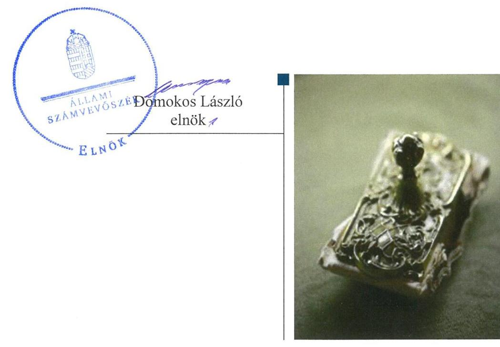

# Jelentés 

## Önkormányzatok ellenőrzése

Integritás- és belső kontrollrendszer, Befektetési tevékenységek ellenőrzése Szigetújfalu Község Önkormányzata 2019.

---

# Jelenetés 

## Önkormányzatok ellenőrzése

Integritás- és belső kontrollrendszer, Befektetési tevékenységek ellenőrzése Szigetújfalu Község Önkormányzata 2019. 10. hó 10. nap

---

# AZ ELLENŐRZÉST FELÜGYELTE:

- VARGA EDIT felügyeleti vezető

- AZ ELLENŐRZÉST VEZETTE ÉS A VÉGREHAJTÁSÁÉRT FELELŐS:
  - RÁCZKEVI KATALIN ellenőrzésvezető (2019. január 14-ig)
  - GÁL MAGDOLNA ellenőrzésvezető (2019. január 15-től)

- A PROGRAM ÖSSZEÁLLÍTÁSÁÉRT FELELŐS:
  - TÓTPÁL SZABOLCS osztályvezető

- IKTATÓSZÁM: EL-1642-001/2019

- Jelentéseink az Országgyűlés számítógépes hálózatán és az Interneten a www.asz.hu címen is olvashatóak.

- TÉMASZÁM: 2485

- ELLENŐRZÉS-AZONOSÍTÓ SZÁM: V082907

---

# TARTALOMJEGYZÉK 

■ ÖSSZEGZÉS ..... 5
■ AZ ELLENŐRZÉS CÉLJA ..... 6
■ AZ ELLENŐRZÉS TERÜLETE ..... 7
■ AZ ELLENŐRZÉS HÁTTERE, INDOKOLTSÁGA ..... 8
■ A JELENTÉS LÉNYEGES KÉRDÉSKÖREI ..... 9
■ AZ ELLENŐRZÉS HATÓKÖRE ÉS MÓDSZEREI ..... 10
■ MEGÁLLAPÍTÁSOK ..... 12
■ JAVASLATOK ..... 15
■ MELLÉKLETEK ..... 19
I. sz. melléklet: Értelmező szótár ..... 19
■ FÜGGELÉKEK ..... 21
I. sz. függelék a jelentéshez ..... 21
II. sz. függelék: Észrevételek ..... 22
■ RÖVIDÍTÉSEK JEGYZÉKE ..... 23

---

.

---

# ÖSSZEGZÉS 

Szigetújfalu Község Önkormányzata belső kontrollrendszerének kialakítása és müködtetése nem volt szabályszerű, ezáltal nem volt biztositott a befektetésekkel, a közpénzekkel, a nemzeti vagyonnal való átlátható és felelős gazdálkodás. Az integritás kontrollokat nem építették ki, így a korrupciós kockázatokkal szemben nem volt védett Szigetújfalu Község Önkormányzata.

## Az ellenőrzés társadalmi indokoltsága

Az Állami Számvevőszék alapvető feladata a közpénzekkel, az állami és önkormányzati vagyonnal való gazdálkodás ellenőrzése. Az Alaptörvény szerint az önkormányzatok kötelezettsége a kiegyensúlyozott, átlátható és fenntartható költségvetési gazdálkodás elvének érvényesítése, a nemzeti vagyonnal való rendeltetésszerű és felelős módon való gazdálkodás biztosítása. Az Állami Számvevőszék stratégiájában megfogalmazott célkitűzése az integritás alapú, átlátható és elszámoltatható közpénzfelhasználás elősegítése. Az önkormányzatok szabad pénzeszközeinek felhasználása során kiemelten fontos a felelős gazdálkodás érvényesülése, amely összhangban kell, hogy legyen az önkormányzati vagyongazdálkodás alapelveivel.

Ennek megvalósítása érdekében az Állami Számvevőszék prioritásként kezeli a közpénzzel gazdálkodó szervezetek esetében a belső kontrollrendszer, valamint a befektetési tevékenység szabályszerű működésének ellenőrzését.

## Főbb megállapítások, következtetések

Szigetújfalu Község Önkormányzata belső kontrollrendszerének kialakítása és működtetése nem volt szabályszerű.
A kontrollkörnyezet kialakítása nem volt szabályszerű a hivatásetikai elvárásokkal, a szervezeti integritást sértő események kezelésével, valamint vagyonnyilatkozat tétellel kapcsolatos szabályozás elmaradása miatt. Az integrált kockázatkezelési rendszer kialakítása elmaradt, a jegyző a szervezet tevékenységében rejlő és a szervezeti célokkal összefüggő kockázatokat nem mérte fel. Szigetújfalu Község Önkormányzata információs és kommunikációs rendszerét a jegyző a 2017. évben nem alakította ki, ezáltal az adatok védelme, az adatok kezelése nem volt biztosított. A jegyző Szigetújfalu Község Önkormányzatának monitoring rendszerét nem alakította ki.

A szervezet integritását támogató kontrollok kialakítása nem történt meg, a korrupciós kockázatokat nem kezelték. Szigetújfalu Község Önkormányzatánál a szervezeti teljesítmény mérésére alkalmas követelményeket nem alakították ki, így a teljesítmény mérésének lehetőségét nem biztosították.

A befektetési tevékenységek szabályszerű végzését a kiépített belső kontrollrendszer nem biztosította a 20132017. években. A befektetésekkel kapcsolatos döntéshozatal, a döntések végrehajtása nem volt szabályszerű. A befektetések szabályszerű számviteli elszámolása és nyilvántartása nem volt biztosított.

Az Állami Számvevőszék a jelentésben foglalt megállapítások alapján a Szigetújfalui Polgármesteri Hivatal jegyzőjének 13, Szigetújfalu Község Önkormányzata polgármesterének három javaslatot fogalmazott meg, amelyekre az érintetteknek 30 napon belül intézkedési tervet kell készíteniük.

---

# AZ ELLENŐRZÉS CÉLJA 

Az ellenőrzés célja annak megállapítása volt, hogy az önkormányzat belső kontrollrendszere biztosította-e a közpénzekkel és a nemzeti vagyonnal történő elszámoltatható, átlátható, szabályszerű, gazdaságos, hatékony és eredményes gazdálkodás feltételeit, a kontrollkörnyezet biztosította-e a befektetési tevékenységek szabályszerű végzését. Az ellenőrzés keretében értékeltük, hogy az önkormányzatnál kiépítették és erősítették-e a korrupciós kockázatok kezelését szolgáló integritás kontrollokat, megteremtették-e a teljesítményellenőrzés feltételeit, továbbá az egyes befektetési tevékenységekkel kapcsolatos döntéshozatal és a döntések végrehajtása, valamint az egyes befektetések számviteli elszámolása, nyilvántartása szabályszerű volt-e, a belső ellenőrzések támogatták-e az egyes befektetési tevékenységek szabályszerű végzését.

---

# AZ ELLENŐRZÉS TERÜLETE

## Szigetújfalu Község Önkormányzata

Szigetújfalu település Pest megyében található, állandó lakosainak száma 2017. január 1-jén 1993 fő volt a Központi Statisztikai Hivatal Magyarország Közigazgatási helynévkönyve adatai alapján.

Az Önkormányzat1 hét tagú képviselő-testületének2 munkáját kettő állandó bizottság segítette. A településen Német Nemzetiségi Önkormányzat működött.

Az Önkormányzat gazdálkodási feladatait a Hivatal3 látta el. A Hivatal önálló gazdasági szervezettel nem rendelkezett.

A polgármester4 2014. október 12-től tölti be tisztségét, a jegyző5 személye az ellenőrzött időszakban nem változott.

Az Önkormányzat a 2017. évi költségvetési beszámolója szerint 506,3 millió Ft költségvetési bevételt ért el, valamint 463,2 millió Ft költségvetési kiadást teljesített, vagyonának értéke 2017. december 31-én 1609,1 millió Ft volt.

Az önkormányzat a 2017. évi mérlegében 0,7 millió Ft tartós részesedést és 17,5 millió Ft forgatási célú értékpapír (befektetési jegy) állományt mutatott ki.

---

# AZ ELLENŐRZÉS HÁTTERE, INDOKOLTSÁGA 

A BELSŐ KONTROLLRENDSZER kialakítása és múködtetése nélkül nem valósítható meg a közpénzek, a közvagyon átlátható, szabályos, gazdaságos, hatékony és eredményes felhasználása. A belső kontrollrendszer azt a célt szolgálja, hogy a költségvetési szervek múködésük és gazdálkodásuk során a tevékenységeket szabályszerűen hajtsák végre, teljesítsék elszámolási kötelezettségeiket és megvédjék az erőforrásokat a veszteségektől, a károktól és a nem rendeltetésszerű használattól.

A belső kontrollrendszer magában foglalja mindazon elveket, eljárásokat és belső szabályzatokat, melyek biztosítják, hogy a költségvetési szerv valamennyi tevékenysége és célja összhangban legyen a szabályszerűséggel, szabályozottsággal, valamint a gazdaságosság, hatékonyság és eredményesség követelményeivel, az eszközökkel és forrásokkal való gazdálkodásban ne kerüljön sor pazarlásra, visszaélésre, rendeltetésellenes felhasználásra. Megfelelő, pontos és naprakész információk álljanak rendelkezésre a költségvetési szerv múködésével kapcsolatosan, és a belső kontrollrendszer harmonizációjára, összehangolására vonatkozó jogszabályok végrehajtásra kerüljenek. Az integritás kontrollok kiépítése, erősítése a szervezet korrupciós kockázatainak kezelését szolgálja. A teljesítménykövetelmények meghatározása és múködtetése megalapozhatja az önkormányzatoknál a teljesítményellenőrzés lefolytatását.

## AZ ÖNKORMÁNYZATI VAGYONGAZDÁLKODÁS ker

etében az önkormányzatok átmenetileg szabad pénzeszközeinek befektetését jogszabály nem tiltja, a befektetések jellege nem korlátozott, a pénzpiaci szolgáltatók közül az önkormányzatok a kínált szolgáltatás és annak költségei alapján szabadon választhatnak, azonban a veszteséges gazdálkodás kockázatai és következményei az önkormányzatokat terhelik. A szabad pénzeszközök felhasználása során kiemelten fontos a felelős gazdálkodás érvényesülése, amely összhangban kell, hogy legyen, az önkormányzati gazdálkodás alapelveivel.

Az ellenőrzéssel feltárásra kerülhetnek azok a kockázatok, amelyek az önkormányzatok gazdálkodásával, ezen belül befektetési tevékenységeivel, kontrollkörnyezetével kapcsolatosak és a befektetési tevékenységek szabályszerű végrehajtását befolyásolják. Az ellenőrzéssel az önkormányzatok befektetési/vagyongazdálkodási döntései értékelhetővé válnak, és megalapozott megállapítás tehető arra vonatkozóan, hogy milyen hatást gyakoroltak az önkormányzat vagyonára a képviselő-testület döntései.

---

# A JELENTÉS LÉNYEGES KÉRDÉSKÖREI 

1. Az Önkormányzat belső kontrollrendszerének kialakítása és müködtetése szabályszerű volt-e a 2017. évben?
2. Az Önkormányzatnál alakítottak-e ki a teljesítmény mérésére alkalmas követelményeket?
3. Az Önkormányzat befektetési tevékenységének szabályszerű végzését a kiépített belső kontrollrendszer biztositotta-e a 20132017. években, a befektetésekkel kapcsolatos döntéshozatal és a döntések végrehajtása, a befektetések számviteli elszámolása, nyilvántartása szabályszerű volt-e?

---

# AZ ELLENŐRZÉS HATÓKÖRE ÉS MÓDSZEREI 

## Az ellenőrzés típusa

Megfelelőségi ellenőrzés.

## Az ellenőrzött időszak

A belső kontrollrendszer ellenőrzésére vonatkozóan a 2017. év, ill. az éves költségvetési beszámoló Áht. ${ }^{6}$ által megállapított jóváhagyásáig (2018. május 31-ig) tartó időszak volt.

Szigetújfalu Község Önkormányzata befektetési tevékenysége vonatkozásában 2013. január 1. - 2017. december 31. közötti időszak, továbbá a 2013. január 1. előtti időszak is, amennyiben a 2017. december 31-én meglévő befektetésekkel kapcsolatos döntéshozatalra a 2013. január 1. előtti időszakban került sor.

## Az ellenőrzés tárgya

Szigetújfalu Község Önkormányzata belső kontrollrendszerének kialakítása és működtetése, valamint az integritási kontrollok kiépítettsége, a teljesítményellenőrzés feltételei.

Szigetújfalu Község Önkormányzata 2017. december 31-én meglévő, a Számv. tv². 3. § (6) bekezdés 2. és 3. pontja szerint az értékpapírokban megtestesülő befektetései, lekötött betétei. Továbbá a 2017. december 31-én meglévő, az Önkormányzat szabad pénzeszközei terhére, adásvételi szerződés keretében megszerzett, a kötelező feladatok ellátását nem szolgáló, az Önkormányzat üzleti vagyonába tartozó ingatlanok; az üzleti vagyon körébe tartozó, befektetési céllal megszerzett, de még használatba nem vett ingatlan beruházások, továbbá az - időkorlátozás nélkül megszerzett - kulturális javak (műtárgyak, műalkotások, stb.), illetve egyéb értéktárgyak (pl. ékszerek, befektetési nemesfém.)

## Az ellenőrzött szervezet

Szigetújfalu Község Önkormányzata

## Az ellenőrzés jogalapja

Az ellenőrzés jogszabályi alapját az ÁSZ tv8. 1. § (3) bekezdés, 5. § (2) és (6) bekezdései, valamint az Áht. 61. § (2) bekezdésének előírásai képezik.

---

# Az ellenőrzés módszerei 

Az ÁSZ ${ }^{9}$ az ellenőrzést az ellenőrzési program szempontjai, az ellenőrzött időszakban hatályos jogszabályok, az ellenőrzés szakmai szabályai, a jelen ellenőrzésre irányadó ÁSZ módszertanok figyelembevételével hajtotta végre.

Az ellenőrzési kérdések megválaszolásához szükséges bizonyítékok megszerzése az ellenőrzött által rendelkezésre bocsátott dokumentumokra, adatokra alapozva megfigyelés, szemle (szemrevételezés), kérdésfeltevés (információkérés), mintavételezés, valamint elemző eljárás útján történt. Az ellenőrzési bizonyítékként felhasználható adatforrások közé tartoztak az ellenőrzési program részletes szempontjainál felsorolt adatforrások, valamint minden egyéb - az ellenőrzés folyamán feltárt, az ellenőrzés szempontjából információt tartalmazó - dokumentum.

Az ellenőrzés lefolytatásához az ellenőrzött szervezet tanúsítványok kitöltésével, valamint az ÁSZ által kért dokumentumok megküldésével szolgáltatott adatokat, amelyek valódiságát és teljes körűségét az ellenőrzött szervezet vezetője által tett teljességi és hitelességi nyilatkozat igazolta. A rendelkezésre bocsátott adatok, információk kontrollja az ellenőrzés keretében történt.

Az önkormányzat belső kontrollrendszere egyes pilléreinek kialakítására és működtetésére vonatkozó értékelés:
$\longrightarrow$ „szabályszerü", amennyiben az értékelt területen az elért „igen" válaszok százalékban kifejezett, egész számra kerekített aránya legalább $85 \%$,
$\longrightarrow$ „nem szabályszerű", ha nem éri el a $85 \%$-ot.
Az önkormányzat belső kontrollrendszerének összesített értékelése az egyes részterületek esetében kapott megfelelőségi arányok számtani átlaga alapján történt és megegyezett a pillérenként (kontroll-területenként) alkalmazott százalékos értékelésekkel, a következő eltérésekkel: a kontrollrendszer egésze esetében a „szabályszerű" értékelésnek a százalékos értéken felül további feltétele, hogy egyik kontrollterület sem kaphat „nem szabályszerű" értékelést.

A kiadások teljesítéséhez kapcsolódó pénzgazdálkodási belső kontrollok működésének szabályszerűsége esetében az ellenőrzés azokra a legnagyobb értékű tételekre - a lényeges sokaságra - terjedt ki, melyek összértéke eléri a teljes sokaság összértékének 50\%-át.

A lényeges sokaságot tételesen ellenőrizte az ÁSZ.
Az ellenőrzés ideje alatt az ellenőrzött szervezettel történő kapcsolattartást az ÁSZ SZMSZ ${ }^{10}$-ének vonatkozó előírásai alapján biztosította az ÁSZ.

---

# 1. Az Önkormányzat belső kontrollrendszerének kialakítása és múködtetése szabályszerű volt-e a 2017. évben? 

Összegző megállapítás

Az Önkormányzat belső kontrollrendszerének kialakítása és múködtetése a 2017. évben nem volt szabályszerű.

A KONTROLLKÖRNYEZET kialakítása nem volt szabályszerű. A képviselő-testület a köztisztviselőkre vonatkozó hivatásetikai alapelvek részletes tartalmát a Kttv ${ }^{11}$. 231. § (1) bekezdés előírása ellenére nem állapította meg. A jegyző nem szabályozta a Bkr ${ }^{12}$. 6. § (4) bekezdésében foglaltak ellenére a szervezeti integritást sértő események kezelésének eljárásrendjét. A vagyonnyilatkozat átadására, nyilvántartására, a vagyonnyilatkozatban foglalt személyes adatok védelmére vonatkozó további szabályokat a jegyző a Vnytv ${ }^{13}$. 11. § (6) bekezdésében foglaltak ellenére szabályzatban nem állapította meg.

## AZ INTEGRÁLT KOCKÁZATKEZELÉSI RENDSZERT a jegyző nem alakította ki:

nem szabályozta az integrált kockázatkezelés eljárásrendjét a Bkr. 6. § (4) bekezdésében előírtak ellenére;
nem mérte fel és nem állapította meg a Hivatal tevékenységében rejlő és szervezeti célokkal összefüggő kockázatokat, valamint nem határozta meg az egyes kockázatokkal kapcsolatban szükséges intézkedéseket, valamint azok teljesítésének folyamatos nyomon követésének módját a Bkr. 7. § (2) bekezdése előírása ellenére.

## AZ INFORMÁCIÓS ÉS KOMMUNIKÁCIÓS RENDSZERT a jegyző nem alakította ki és nem működtette, mert:

az Ltv. ${ }^{14}$ 9. § (4) bekezdésének előírása ellenére a Hivatal iratkezelési szabályzatát nem készítette el;
az Info tv ${ }^{15}$. 24. § (3) bekezdésének 2017. évi hatályos előírása ellenére a Hivatal adatvédelmi és adatbiztonsági szabályzatát nem készítette el.

A MONITORING-RENDSZERT a jegyző a Bkr. 10. §.-ában foglaltak ellenére nem alakította ki, mert:
a Hivatal SZMSZ ${ }^{16}$-ében a Bkr. 15. § (2) bekezdésében foglaltak ellenére a belső ellenőrzést végző szervezet feladatait nem írta elő;
az Áht. 70. § (1) bekezdésében foglaltak ellenére - figyelembe véve az Mötv. ${ }^{17}$ 119. § (4) bekezdésének előírásait - nem gondoskodott a belső ellenőrzés kialakításáról.
A jegyző a Bkr. 1. mellékletét képező nyilatkozatban értékelte a 2017. évre vonatkozóan a Hivatal belső kontrollrendszerének minőségét.

---

AZ INTEGRITÁS kontrollrendszerét az Önkormányzat nem építette ki. Kockázatelemzés hiányában az integritás elvű működést támogató kontrollok nem kerültek kialakításra.

# 2. Az Önkormányzatnál alakítottak-e ki a teljesítmény mérésére alkalmas követelményeket? 

Összegző megállapítás Az Önkormányzatnál nem alakítottak ki a teljesítmény mérésére alkalmas követelményeket.

A szervezet célok elérését szolgáló feladatok, folyamatok, tevékenységek mérését szolgáló indikátorokat, mérőszámokat, feladat- és teljesítménymutatókat nem képeztek, az Önkormányzat a teljesítmény mérésének lehetőségét nem biztosította.

## 3. Az Önkormányzat befektetési tevékenységének szabályszerű végzését a kiépített belső kontrollrendszer biztosította-e a 2013-2017. években, a befektetésekkel kapcsolatos döntéshozatal és a döntések végrehajtása, a befektetések számviteli elszámolása, nyilvántartása szabályszerű volt-e?

Összegző megállapítás Az Önkormányzat befektetési tevékenységének szabályszerű végzését a belső kontrollrendszer nem biztosította a 20132017. években, a befektetésekkel kapcsolatos döntéshozatal és a döntések végrehajtása, a befektetések számviteli elszámolása, nyilvántartása nem volt szabályszerű.
3.1. számú megállapítás Az Önkormányzat belső kontrollrendszere a befektetési tevékenységet nem támogatta.

A BEFEKTETÉSI TEVÉKENYSÉGEK szabályszerű végzését 2013-2017. években a belső kontrollrendszer nem biztosította, mivel:
$\longrightarrow$ az Önkormányzat 2013-2017. évek között az Mötv. 116. § (1) bekezdése ellenére gazdasági programmal, fejlesztési tervvel nem rendelkezett;
$\longrightarrow$ a jegyző nem gondoskodott arról, hogy a 2017. július 1-jétől hatályos leltározási és leltárkészítési szabályzat ${ }^{18}$ a Számv. tv. 69. § (3) bekezdése előírásainak megfelelően tartalmazza az értékpapírok, részesedések leltározásának módját és gyakoriságát.
Az Önkormányzat egyes befektetési tevékenységeinek szabályszerű végzését belső ellenőrzés nem támogatta.

---

### 3.2. számú megállapítás

## A befektetésekkel kapcsolatos döntéshozatal, a befektetések elszámolása és nyilvántartása nem volt szabályszerű. A befektetések leltározását nem végezték el.

A polgármester az átmenetileg szabad pénzeszközök felhasználásáról az Önkormányzati SZMSZ ${ }^{19}$ 69. § (3) bekezdésében előírtak ellenére a Pénzügyi és Ügyrendi Bizottság ${ }^{20}$ elnöke egyetértése nélkül döntött, valamint az Mötv. 68. (4) bekezdését megsértve az egyes befektetésekkel kapcsolatos döntéshozatalról a képviselő-testületet nem tájékoztatta.

A jegyző a befektetések szabályszerű elszámolása és nyilvántartása érdekében nem intézkedett, mert:
— az Önkormányzat 2017. évi költségvetési beszámolójának mérlegében befektetett pénzügyi eszközként kimutatott 655,8 ezer Ft értékű, gazdasági társaságban fennálló tartós részesedés bizonylat nélkül került a számviteli nyilvántartásokba bejegyzésre, amely ellentétes volt a Számv. tv. 165. § (2) bekezdésének előírásával;
— a 655,8 ezer Ft értékben kimutatott, gazdasági társaságban fennálló tartós részesedésről nem vezettek részletező nyilvántartást, mellyel megsértették az Áhsz. ${ }_{2}{ }^{21} 45 . \S$ (3) bekezdésének és 14. melléklete VIII/2-3. pontjának előírását;
— a 2017. évi mérlegben kimutatott 17,5 millió Ft értékű befektetési jegy állomány számviteli nyilvántartásba bejegyzésére a Számv. tv. 165. § (2) bekezdése előírásának ellenére bizonylat nélkül került sor;
— a befektetési jegyekről 2013-2017. években részletező nyilvántartást nem vezettek, amely ellentétes az Áhsz. ${ }_{1}{ }^{22} 9$. számú melléklete 2. d) pontjának, illetve az Áhsz. ${ }_{2} 45$. § (3) bekezdésének és 14. melléklete VIII/1. pontjának előírásával;
— a befektetési jegyek év végi értékelését nem végezték el, ezzel megsértették a Számv. tv. 46. § (3) bekezdésének előírásait, ennek következtében a Számv. tv. 15. § (3) bekezdésében foglalt valódiság elve nem érvényesült.
Az Önkormányzat a 2013-2017. évi mérlegbeszámolóiban a tartós részesedés és a befektetési jegyek mérlegben kimutatott értékét leltárral nem támasztotta alá, amely ellentétes a Számv. tv. 69. § (1) bekezdésében foglalt előírásokkal.

---

# JAVASLATOK 

Az ÁSZ tv. 33. § (1) bekezdésében foglaltak értelmében az ellenőrzött szervezet vezetője köteles a jelentésben foglalt megállapításokhoz kapcsolódó intézkedési tervet összeállítani és azt a jelentés kézhezvételétől számított 30 napon belül az ÁSZ részére megküldeni. Amennyiben az ellenőrzött szervezet vezetője nem küldi meg határidőben az intézkedési tervet, vagy továbbra sem elfogadható intézkedési tervet küld, az Állami Számvevőszék elnöke az ÁSZ tv. 33. § (3) bekezdése a) és b) pontjaiban foglaltakat érvényesítheti.

## Szigetújfalui Polgármesteri Hivatal Jegyzőjének

1. A szabályszerű kontrollkörnyezet kialakítása érdekében gondoskodjon:
a) a szervezeti integritást sértő események kezelésének eljárásrendje szabályozásáról;
(1. sz. megállapítás 1. bekezdés 3. mondata alapján)
b) a vagyonnyilatkozat átadására, nyilvántartására, a vagyonnyilatkozatban foglalt személyes adatok védelmére vonatkozó szabályok szabályzatban való megállapításáról;
(1. sz. megállapítás 1. bekezdés 4. mondata alapján)
c) a jogszabályi előirásnak megfelelő tartalmú eszközök és a források leltárkészittési és leltározási szabályzatának elkészitéséről;
(3.1. sz. megállapítás 1. bekezdés 2. francia bekezdése alapján)
2. Az integrált kockázatkezelési rendszer kialakítása és müködtetése érdekében gondoskodjon:
a) az integrált kockázatkezelés eljárásrendjének szabályozásáról;
(1. sz. megállapítás 2. bekezdés 1. francia bekezdése alapján)
b) a Hivatal tevékenységében rejlő és szervezeti célokkal összefüggő kockázatok felméréséről és megállapításáról, valamint az egyes kockázatokkal kapcsolatban szükséges intézkedések, valamint azok teljesitésének folyamatos nyomon követése módjának meghatározásáról.
(1. sz. megállapítás 2. bekezdés 2. francia bekezdése alapján)
3. A Hivatal információs és kommunikációs rendszer szabályszerű kialakítása érdekében intézkedjen:
a) iratkezelési szabályzat elkészitéséről;
(1. sz. megállapítás 4. bekezdés 1. francia bekezdése alapján)

---

b) adatvédelmi és adatbiztonsági szabályzat elkészitéséről;
(1. sz. megállapítás 4. bekezdés 2. francia bekezdése alapján)
4. A szabályszerű monitoring rendszer kialakítása érdekében intézkedjen:
a) a belső ellenőrzést végző szervezet feladatainak a Hivatal SZMSZében való rögzítéséről;
(1. sz. megállapítás 5. bekezdés 1. francia bekezdése alapján)
b) a belső ellenőrzés kialakításáról.
(1. sz. megállapítás 5. bekezdés 2. francia bekezdése alapján)
5. Az Önkormányzat egyes befektetéseinek szabályszerű elszámolása és nyilvántartása érdekében gondoskodjon:
a) arról, hogy a számviteli (könyvviteli) nyilvántartásokba csak a jogszabályi előírásoknak megfelelően jegyezzenek be adatokat a befektetett pénzügyi eszközök és befektetési jegyek vonatkozásában;
(3.2. sz. megállapítás 2. bekezdés 1. és 3. francia bekezdései alapján)
b) a jogszabály által előírt részletező nyilvántartások vezetéséről a tartós részesedés és befektetési jegyek vonatkozásában;
(3.2. sz. megállapítás 2. bekezdés 2. és 4. francia bekezdései alapján)
c) a befektetési jegyek év végi értékeléséről;
(3.2. sz. megállapítás 2. bekezdés 5. francia bekezdése alapján)
d) a tartós részesedés és befektetési jegyek mérlegben kimutatott értékének leltárral való alátámasztásáról.
(3.2. sz. megállapítás 3. bekezdése alapján)

---

# Szigetújfalu Község Önkormányzata Polgármesterének 

1. Intézkedjen a köztisztviselőkre vonatkozó hivatásetikai alapelvek részletes tartalmának képviselő-testület elé terjesztéséről.
(1. sz. megállapítás 1. bekezdés 2. mondata alapján)
2. Intézkedjen a gazdasági program/fejlesztési terv elkészitéséről.
(3.1. sz. megállapítás 1. bekezdés 1. francia bekezdése alapján)
3. Gondoskodjon az Önkormányzat átmenetileg szabad pénzeszközeinek szabályszerű felhasználásáról és ezzel kapcsolatos tájékoztatási kötelezettségének teljesitéséről.
(3.2. sz. megállapítás 1. bekezdése alapján)

---

.

---

# MELLÉKLETEK 

- I. SZ. MELLÉKLET: ÉRTELMEZŐ SZÓTÁR
befektetési szolgáltatási tevékenység
belső kontrollrendszer
belső kontrollrendszer pillérei, kontrollterületei
betét
betétszerződés
értékpapírszámla
helyi önkormányzat
rendszeres gazdasági tevékenység keretében, pénzügyi eszközre vonatkozóan végzett megbízás felvétele és továbbítása, megbízás végrehajtása az ügyfél javára, sajátszámlás kereskedés, portfólió-kezelés, befektetési tanácsadás, pénzügyi eszköz elhelyezése az eszköz (értékpapír vagy egyéb pénzügyi eszköz) vételére vonatkozó kötelezettségvállalással (jegyzési garanciavállalás), pénzügyi eszköz elhelyezése az eszköz (pénzügyi eszköz) vételére vonatkozó kötelezettségvállalás nélkül, és multilaterális kereskedési rendszer működtetése (Bszt. 5. § (1) bekezdés)
A belső kontrollrendszer a kockázatok kezelése és tárgyilagos bizonyosság megszerzése érdekében kialakított folyamatrendszer, amely azt a célt szolgálja, hogy a müködés és gazdálkodás során a tevékenységeket szabályszerűen, gazdaságosan, hatékonyan, eredményesen hajtsák végre, az elszámolási kötelezettségeket teljesítsék, megvédjék az erőforrásokat a veszteségektől, károktól és nem rendeltetésszerű használattól. (Forrás: Áht. 69. § (1) bekezdése)
A kontrollkörnyezet, az (integrált) kockázatkezelési rendszer, a kontrolltevékenységek, az információs és kommunikációs rendszer, valamint a nyomon követési (monitoring) rendszer. (Forrás: Bkr. 3. §-a)
a Ptk. szerinti betétszerződés vagy a takarékbetétről szóló 1989. évi 2. törvényerejű rendelet szerinti takarékbetét-szerződés alapján fennálló tartozás, ideértve a hitelintézetnél a fizetésiszámla-szerződés alapján fennálló pozitív számlaegyenleget is (Hpt. 6. § (1) bekezdés 8. pont).
betétszerződés alapján a betétes jogosult a bank számára meghatározott pénzösszeget fizetni, a bank köteles a betétes által felajánlott pénzösszeget elfogadni, ugyanakkora pénzösszeget későbbi időpontban visszafizetni, valamint kamatot fizetni (Ptk. 6:390. § (1) bekezdés)
a dematerializált értékpapírról és a hozzá kapcsolódó jogokról az értékpapírtulajdonos javára vezetett nyilvántartás (Tpt. 5. § (1) bekezdés 46. pont)
A helyi önkormányzat jogi személy. Az önkormányzati feladatok ellátását a kép-viselő-testület és szervei biztosítják. A képviselő-testület szervei: a polgármester, a főpolgármester, a megyei közgyűlés elnöke, a képviselő-testület bizottságai, a részönkormányzat testülete, az önkormányzati hivatal, a megyei önkormányzati hivatal, a közös önkormányzati hivatal, a jegyző, továbbá a társulás. A képviselő-testület a feladatkörébe tartozó közszolgáltatások ellátására jogszabályban meghatározottak szerint - költségvetési szervet, a polgári perrendtartásról szóló törvény szerinti gazdálkodó szervezetet (a továbbiakban: gazdálkodó szervezet), nonprofit szervezetet és egyéb szervezetet (a továbbiakban együtt: intézmény) alapíthat, továbbá szerződést köthet természetes és jogi személlyel vagy jogi személyiséggel nem rendelkező szervezettel. A helyi önkormányzat éves költségvetési beszámolója magában foglalja a helyi önkormányzat - nem költségvetési szerveihez tartozó - feladataihoz kapcsolódó bevételeket és kiadásokat. A helyi önkormányzat összevont (konszolidált) költségvetési beszámolóját a helyi önkormányzatra és költségvetési szerveire vonatkozóan külön-külön beérkezett éves költségvetési beszámolók alapján a Kincstár készíti el és küldi meg az önkormányzatnak.

---

információs és kommunikációs rendszer
integritás
kamat
kockázatkezelési rendszer
kontrollkörnyezet
kontrolltevékenységek
költségvetési szerv vezetője (Bkr. alkalmazásában)
ügyfélszámla
üzleti vagyon
(Forrás: Mötv. 41. § (1), (2), (6) bekezdései; Áhsz. 2. § (1) bekezdése, 6. § (1) bekezdés a) és f) pontja, 30. §-a, 37. § (1) és (6) bekezdése)
A költségvetési szerv vezetője által kialakított és múködtetett olyan rendszer, mely biztosítja, hogy a megfelelő információk a megfelelő időben eljutnak az illetékes szervezethez, szervezeti egységhez, illetve személyhez. (Forrás: Bkr. 9. § (1) bekezdés)

Az integritás elvek, értékek, cselekvések, módszerek, intézkedések konzisztenciáját jelenti: olyan magatartásmódot, amely meghatározott értékeknek felel meg. Az integritás a közszféra esetében a társadalom által elvárt nyilvánossági, átláthatósági, illetve jogi/etikai normáknak történő megfelelést jelenti.
(Forrás: a http://integritas.asz.hu honlapon közzétett „A 2012. évi integritás felmérés eredményeinek összefoglalója" című dokumentum 3. oldal 1. bekezdése)
az adós által a kölcsönnyújtónak (betételhelyezőnek) az elfogadott betét vagy az igénybe vett kölcsön használatáért, kockázatáért fizetendő, a betét- vagy kölcsönösszeg százalékában meghatározott, időarányosan térítendő (elszámolandó) pénzösszeg vagy egyéb hozadék (Hpt. 6. § (1) bekezdés 52. pont)
Olyan irányítási eszközök és módszerek összessége, melynek elemei a szervezeti célok elérését veszélyeztető tényezők (kockázatok) azonosítása, elemzése, csoportosítása, nyomon követése, valamint szükség esetén a kockázati kitettség mérséklése. (Forrás: Bkr. 2. § m) pontja)
A költségvetési szerv vezetője által kialakított olyan elvek, eljárások, belső szabályzatok összessége, amelyben világos a szervezeti struktúra, egyértelműek a felelősségi, hatásköri viszonyok és feladatok, meghatározottak az etikai elvárások a szervezet minden szintjén, átlátható a humánerőforrás-kezelés. (Forrás: Bkr. 6. § (1) bekezdés)
A költségvetési szerv vezetője által a szervezeten belül kialakított (kontroll) tevékenységek, melyek biztosítják a kockázatok kezelését, hozzájárulnak a szervezet céljainak eléréséhez. (Forrás: Bkr. 8. § (1) bekezdés)
Helyi önkormányzat esetén a jegyző, főjegyző, társulás esetén a társulási megállapodásban meghatározott önkormányzat jegyzője. (Forrás: Bkr. 2. § n) pont nb) alpont)
az ügyfél pénzeszközeinek nyilvántartására szolgáló, befektetési vállalkozás, hitelintézet, árutőzsdei szolgáltató, befektetési alapkezelő által vezetett számla (Tpt. 5. § (1) bekezdés 130. pont)
a nemzeti vagyon azon része, amely nem tartozik az önkormányzati vagyon esetén a törzsvagyonba (Nvtv. 3. § (1) bekezdés 18. pontja)

---

# FÜGGELÉKEK 

- I. SZ. FÜGGELÉK A JELENTÉSHEZ

Az Állami Számvevőszék az ellenőrzések során feltárt tényekhez kapcsolódó további körülmények tisztázására eszközrendszerrel nem rendelkezik. Amennyiben az ellenőrzésen túlmutatóan indokoltnak látszik az ellenőrzés során feltárt körülmények további vizsgálata, az Állami Számvevőszék törvényi felhatalmazás alapján az ellenőrzés által feltárt körülményeket továbbítja a hatáskörrel rendelkező szervnek a szükséges intézkedések megtétele, eljárások lefolytatása érdekében.

1. Az Önkormányzat 2017. évi költségvetési beszámolójának mérlegében befektetett pénzügyi eszközként kimutatott 655,8 ezer Ft értékủ gazdasági társaságban fennálló tartós részesedés, valamint 17500 ezer Ft értékủ befektetési jegy állomány számviteli nyilvántartásba bejegyzésére a Számv. tv. 165. § (2) bekezdése előírásának ellenére bizonylat nélkül került sor.
2. Továbbá a 2013-2017. évek között a gazdasági társaságban fennálló tartós részesedés és a befektetési jegyek mérlegben kimutatott értékét leltárral nem támasztotta alá, ezzel az Önkormányzat megsértette a Számv. tv. 69. § (1) bekezdésében előírtakat.
A feltárt szabálytalanságok miatt nem igazolt, hogy az Önkormányzat 2013-2017. évi beszámolói megbízható, valós összképet mutatnak.
Az eset konkrét körülményeinek feltárására a Magyar Államkincstár rendelkezik hatáskörrel.

---

A jelentéstervezetet a Számvevőszék 15 napos észrevételezésre megküldte az ellenőrzött szervezetek vezetőinek az ÁSZ tv. 29. §* (1) bekezdése előirásának megfelelően.

Az ÁSZ a jelentéstervezetet észrevételezésre megküldte Szigetújfalu Község Önkormányzatának polgármestere részére.
Szigetújfalu Község Önkormányzatának polgármestere az ÁSZ tv. 29. § (2) bekezdésében foglalt észrevételezési jogával nem élt, a jelentéstervezet megállapításaira a törvényes határidőn belül észrevételt nem tett.

[^0]
[^0]:    * 29. § (1) Az Állami Számvevőszék az ellenőrzési megállapításait megküldi az ellenőrzött szervezet vezetőjének vagy az általa megbízott személynek, és annak, akinek személyes felelősségét állapította meg.
    (2) Az ellenőrzött szervezet vezetője és a felelősként megjelölt személy az ellenőrzés megállapításaira tizenöt napon belül írásban észrevételt tehet.
    (3) Az Állami Számvevőszék az észrevételre a beérkezésétől számított harminc napon belül írásban válaszol. A figyelembe nem vett észrevételeket köteles a jelentésben feltüntetni, és megindokolni, hogy azokat miért nem fogadta el.

---

# RÖVIDÍTÉSEK JEGYZÉKE 

${ }^{1}$ Önkormányzat
${ }^{2}$ képviselő-testület
${ }^{3}$ Hivatal
${ }^{4}$ polgármester
${ }^{5}$ jegyző
${ }^{6}$ Áht.
${ }^{7}$ Számv. tv.
${ }^{8}$ ÁSZ tv.
${ }^{9}$ ÁSZ
${ }^{10}$ ÁSZ SZMSZ
${ }^{11}$ Kttv.
${ }^{12}$ Bkr.
${ }^{13}$ Vnytv.
${ }^{14}$ Ltv.
${ }^{15}$ Info tv.
${ }^{16}$ Hivatal SZMSZ
${ }^{17}$ Mötv.
${ }^{18}$ Leltározási és leltárkészítési szabályzat
${ }^{19}$ Önkormányzati SZMSZ
${ }^{20}$ Pénzügyi és Ügyrendi Bizottság
${ }^{21}$ Áhsz. 2
${ }^{22}$ Áhsz. 1

Szigetújfalu Község Önkormányzata
Szigetújfalu Község Önkormányzatának képviselő-testülete
Szigetújfalui Polgármesteri Hivatal
Szigetújfalu Község Önkormányzatának polgármestere
Szigetújfalui Polgármesteri Hivatal jegyzője
2011. évi CXCV. törvény az államháztartásról
2000. évi C. törvény a számvitelről
2011. évi LXV. törvény az Állami Számvevőszékről

Állami Számvevőszék
Az Állami Számvevőszék elnökének 2/2018. (XII.28.) ÁSZ utasítása az Állami
Számvevőszék Szervezeti és Müködési Szabályzatáról
2011. évi CXCIX. törvény a közszolgálati tisztviselőkről
370/2011. (XII. 31.) Korm. rendelet a költségvetési szervek belső
kontrollrendszeréről és belső ellenőrzéséről
2007. évi CLII. törvény az egyes vagyonnyilatkozat-tételi kötelezettségről
1995. évi LXVI. törvény a köziratokról, a közlevéltárakról és a magánlevéltári anyag védelméről (hatályos: 1996. január 1-től)
2011. évi CXII. törvény az információs önrendelkezési jogról és az információszabadságról
Szigetújfalui Polgármesteri Hivatal Szervezeti és Müködési Szabályzata (hatályos: 2016. március 30-tól):
2011. évi CLXXXIX. tv. Magyarország helyi önkormányzatairól

Szigetújfalui Polgármesteri Hivatal Leltározási és leltárkészítési szabályzata (hatályos: 2017. július 1-jétől)
Szigetújfalu Község Önkormányzat Képviselő-testületének 15/2011 (X. 26) önkormányzati rendelete (hatályos: 2011. október 27-től)
Szigetújfalu Község Önkormányzata képviselő-testületének Pénzügyi és Ügyrendi Bizottsága
4/2013. (I. 11.) Korm. rendelet - az államháztartás számviteléről (hatályos: 2014. január 1-jétől)
249/2000. (XII. 24.) Korm. rendelet - az államháztartás szervezetei beszámolási és könyvvezetési kötelezettségének sajátosságairól (hatályos: 2013. december 31-ig)

---

# ÁLLAMI SZÁMVEVŐSZÉK 

1052 Budapest, Apáczai Csere János utca 10.
Levélcím: 1364 Budapest 4. Pf. 54
Telefon: +36 14849100 Telefax: +36 14849200
www.asz.hu