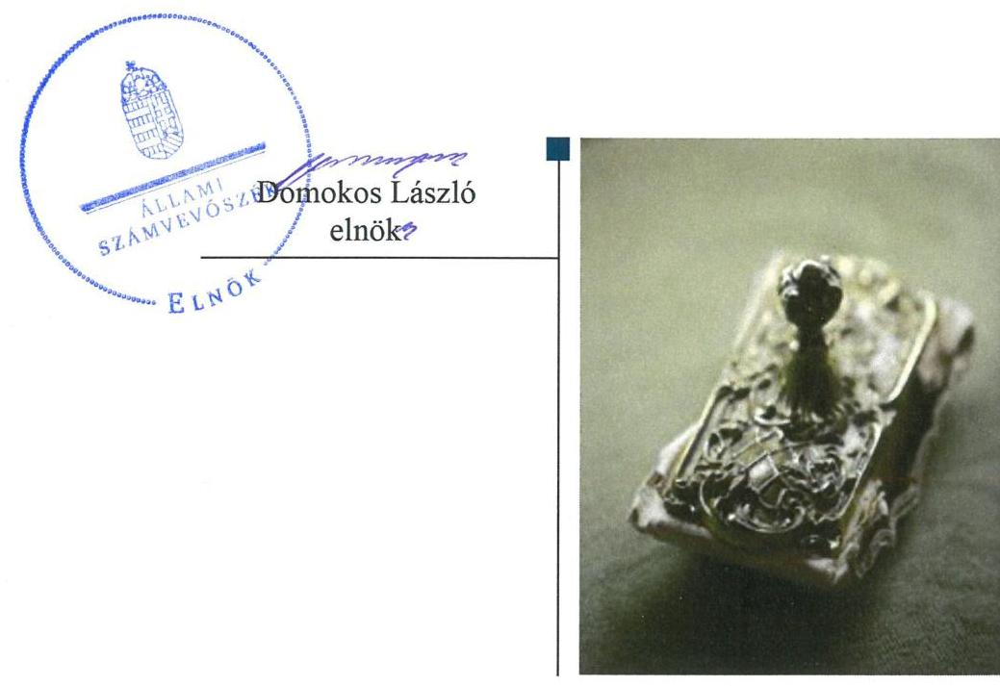
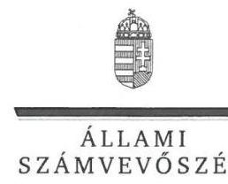
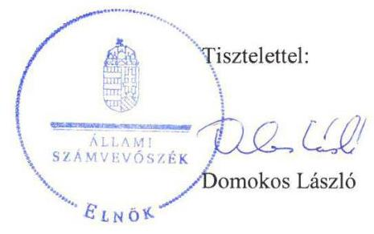
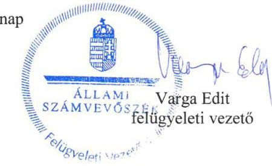

# Jelentés

## Önkormányzatok ellenőrzése

Integritás- és belső kontrollrendszer, Befektetési tevékenységek ellenőrzése - Nyárlőrinc Községi Önkormányzat 2019.

---

# Jelentés

## Önkormányzatok ellenőrzése

Integritás- és belső kontrollrendszer, Befektetési tevékenységek ellenőrzése - Nyárlőrinc Községi Önkormányzat 2019. 10. hó 18. nap

---

# AZ ELLENŐRZÉST FELÜGYELTE:

- VARGA EDIT felügyeleti vezető
- AZ ELLENŐRZÉST VEZETTE ÉS A VÉGREHAJTÁSÁÉRT FELELŐS:
  - BÁLINT KÁLMÁN KADOCSA ellenőrzésvezető
  - A PROGRAM ÖSSZEÁLLÍTÁSÁÉRT FELELŐS:
    - TÓTPÁL SZABOLCS osztályvezető

**IKTATÓSZÁM:** EL-1672-001/2019.

**TÉMASZÁM:** 2485

**ELLENŐRZÉS-AZONOSÍTÓ SZÁM:** V082934

Jelentéseink az Országgyűlés számítógépes hálózatán és az Interneten a www.asz.hu címen is olvashatóak.

---

# TARTALOMJEGYZÉK

■ ÖSSZEGZÉS ..... 5
■ AZ ELLENŐRZÉS CÉLJA ..... 6
■ AZ ELLENŐRZÉS TERÜLETE ..... 7
■ AZ ELLENŐRZÉS HÁTTERE, INDOKOLTSÁGA ..... 8
■ A JELENTÉS LÉNYEGES KÉRDÉSKÖREI ..... 9
■ AZ ELLENŐRZÉS HATÓKÖRE ÉS MÓDSZEREI ..... 10
■ MEGÁLLAPÍTÁSOK ..... 12
■ JAVASLATOK ..... 16
■ MELLÉKLETEK ..... 19
I. sz. melléklet: Értelmező szótár ..... 19
■ FÜGGELÉKEK ..... 21
I. sz. függelék a jelentéshez ..... 21
II. sz. függelék: Észrevételek ..... 23
■ RÖVIDÍTÉSEK JEGYZÉKE ..... 27

---

.

---

# ÖSSZEGZÉS

Nyárlőrinc Községi Önkormányzat belső kontrollrendszerének kialakítása és működtetése nem volt szabályszerű, így nem volt biztosított a közpénzekkel, a nemzeti vagyonnal való átlátható és felelős gazdálkodás, a befektetési tevékenység szabályszerű végzése. Az integritás kontrollokat nem építették ki, így a korrupciós veszélyekkel szemben nem volt védett Nyárlőrinc Községi Önkormányzata.

## Az ellenőrzés társadalmi indokoltsága

Az Állami Számvevőszék Alaptörvényből adódó feladata a központi költségvetés végrehajtásának, az államháztartás gazdálkodásának, az államháztartásból származó források felhasználásának, a nemzeti vagyon kezelésének ellenőrzése. Az Állami Számvevőszék általános hatáskörrel - az Állami Számvevőszékről szóló 2011. évi LXVI. törvény felhatalmazása alapján - végzi a közpénzekkel és az állami és önkormányzati vagyonnal való felelős gazdálkodás ellenőrzését, különös tekintettel arra, hogy az Önkormányzatok a jogszabályi előírások szerint működtették-e és alakították ki az integritás és belső kontroll rendszerüket. Az Állami Számvevőszék stratégiájában fogalmazta meg, hogy támogatja az integritás alapú, átlátható és elszámoltatható közpénzfelhasználás megteremtését.

## Főbb megállapítások, következtetések

Nyárlőrinc Községi Önkormányzat belső kontrollrendszerének kialakítása és működtetése nem volt szabályszerű a 2017. évben, így a belső kontrollrendszer nem teremtette meg a szabályszerű közpénzfelhasználás feltételeit. A kiépített kontrollrendszer nem biztosította a befektetési tevékenység szabályszerű végzését sem a 2013 - 2017 években.

Nyárlőrinc Községi Önkormányzatnak a kontrollkörnyezete nem volt szabályszerű, mert a jegyző nem készítette el teljes körűen a gazdálkodásra vonatkozó szabályzatokat. Az egyes forgóeszközök leltárral történő alátámasztásának hiányában Nyárlőrinc Községi Önkormányzat beszámolója a vagyonáról nem nyújtott megbízható és valós képet. A jegyző nem alakította ki és nem működtette az integrált kockázatkezelési rendszert, nem mérte fel a tevékenységében rejlő és a szervezeti célokkal összefüggő kockázatokat. A kontrolltevékenységeket nem szabályszerűen gyakorolták a teljesítésigazolás elmaradása miatt. A jegyző nem alakította ki az információs és kommunikációs rendszert. A monitoring rendszer kialakítása és működtetése szabályszerű volt.

Nyárlőrinc Községi Önkormányzatnál az integritással összefüggő kontrollokat nem építették ki, továbbá a szervezeti teljesítmény mérésére alkalmas követelményeket sem alakították ki.

---

# AZ ELLENŐRZÉS CÉLJA

AZ ELLENŐRZÉS CÉLJA annak megállapítása volt, hogy az önkormányzat belső kontrollrendszere biztosította-e a közpénzekkel és a nemzeti vagyonnal történő elszámoltatható, átlátható, szabályszerű, gazdaságos, hatékony és eredményes gazdálkodás feltételeit. Az ellenőrzés keretében értékeltük továbbá, hogy az önkormányzatnál kiépítették és erősítették-e a korrupciós kockázatok kezelését szolgáló integritás kontrollokat és azt, hogy megteremtették-e a teljesítményellenőrzés feltételeit. Az ellenőrzés további célja annak értékelése volt, hogy a jogszabályi előírásoknak megfelelően alakították-e ki a belső kontrollrendszert, a kontrollkörnyezet biztosította-e a befektetési tevékenységek szabályszerű végzését. Az Állami Számvevőszék értékelte továbbá, hogy az egyes befektetési tevékenységekkel kapcsolatos döntéshozatal és a döntések végrehajtása, valamint az egyes befektetések számviteli elszámolása, nyilvántartása szabályszerű volt-e, és a belső és külső ellenőrzések támogatták-e az egyes befektetési tevékenységek szabályszerű végzését.

---

# AZ ELLENŐRZÉS TERÜLETE

## Nyárlőrinc Községi Önkormányzat

Nyárlőrinc község az Dél-Alföldi régióban, Bács-Kiskun megyében található. Lakossága 2017. január 1-jén - a Központi Statisztikai Hivatal által kiadott, Magyarország közigazgatási helynévkönyve alapján - 2309 fő volt.

Az Önkormányzat ${ }^{1}$ Képviselő-testülete ${ }^{2}$ - a polgármesterrel ${ }^{3}$ együtt - hét tagból állt, munkáját három állandó bizottság (Pénzügyi Bizottság, Egészségügyi és Szociális Bizottság, Ügyrendi Bizottság) segítette. Az Önkormányzat működésével kapcsolatos feladatok ellátásáról a Hivatal ${ }^{4}$ gondoskodott, ahol a foglalkoztatottak száma 2017. év végén 14 fő volt, ebből 8 fő köztisztviselő.

A polgármester a 2014. évi önkormányzati választások óta töltötte be tisztségét, a jegyző ${ }^{5}$ 1990. óta látta el feladatait.

Nyárlőrinc Községi Önkormányzat befektetési célú (nem önkormányzati feladatellátást szolgáló) ingatlannal, kulturális javakkal és egyéb értéktárgyakkal az ellenőrzött időszakban nem rendelkezett. Nyárlőrinc Községi Önkormányzat 2017. december 31-én 224,3 M Ft értékben rendelkezett OTP tőkegarantált pénzpiaci befektetési jeggyel, amely az értékpapírok között került kimutatásra. Befektetett pénzügyi eszközzel nem rendelkezett.

---

# AZ ELLENŐRZÉS HÁTTERE, INDOKOLTSÁGA

A BELSŐ KONTROLLRENDSZER kialakítása és működtetése nélkül nem valósítható meg a közpénzek, a közvagyon átlátható, szabályos, gazdaságos, hatékony és eredményes felhasználása. A belső kontrollrendszer azt a célt szolgálja, hogy a költségvetési szervek működésük és gazdálkodásuk során a tevékenységeket szabályszerűen hajtsák végre, teljesítsék elszámolási kötelezettségeiket és megvédjék az erőforrásokat a veszteségektől, a károktól és a nem rendeltetésszerű használattól. A belső kontrollrendszer magában foglalja mindazon elveket, eljárásokat és belső szabályzatokat, melyek biztosítják, hogy a költségvetési szerv valamennyi tevékenysége és célja összhangban legyen a szabályszerűséggel, szabályozottsággal, valamint a gazdaságosság, hatékonyság és eredményesség követelményeivel, az eszközökkel és forrásokkal való gazdálkodásban ne kerüljön sor pazarlásra, visszaélésre, rendeltetésellenes felhasználásra. Megfelelő, pontos és naprakész információk álljanak rendelkezésre a költségvetési szerv működésével kapcsolatosan, és a belső kontrollrendszer harmonizációjára, összehangolására vonatkozó jogszabályok végrehajtásra kerüljenek. Az integritás kontrollok kiépítése, erősítése a szervezet korrupciós kockázatainak kezelését szolgálja. A teljesítménykövetelmények meghatározása és működtetése megalapozhatja az önkormányzatoknál a teljesítményellenőrzés lefolytatását.

AZ ÖNKORMÁNYZATI VAGYONGAZDÁLKODÁS keretében az önkormányzatok átmenetileg szabad pénzeszközeinek befektetését jogszabály nem tiltja, a befektetések jellege nem korlátozott, a pénzpiaci szolgáltatók közül az önkormányzatok a kínált szolgáltatás és annak költségei alapján, szabadon választhatnak, azonban a veszteséges gazdálkodás kockázatai és következményei az önkormányzatokat terhelik. A szabad pénzeszközök felhasználása során kiemelten fontos a felelős gazdálkodás érvényesülése, amely összhangban kell, hogy legyen, az önkormányzati gazdálkodás alapelveivel. Az ellenőrzéssel feltárásra kerülhetnek azok a kockázatok, amelyek az önkormányzatok gazdálkodásával, ezen belül befektetési tevékenységeivel, kontrollkörnyezetével kapcsolatosak és a befektetési tevékenységek szabályszerű végrehajtását befolyásolják. Az ellenőrzéssel az önkormányzatok befektetési/vagyongazdálkodási döntései értékelhetővé válnak, és megalapozott megállapítás tehető arra vonatkozóan, hogy milyen hatást gyakoroltak az önkormányzat vagyonára a képviselőtestület döntései.

---

# A JELENTÉS LÉNYEGES KÉRDÉSKÖREI

1.  Az Önkormányzat belső kontrollrendszerének kialakítása és működtetése szabályszerű volt-e a 2017. évben?
2.  Az Önkormányzatnál alakítottak-e ki a teljesítmény mérésére alkalmas követelményeket?
3.  Az Önkormányzat befektetési tevékenységének szabályszerű végzését a kiépített belső kontrollrendszer biztosította-e a 2013-2017. években, a befektetésekkel kapcsolatos döntéshozatal és a döntések végrehajtása, a befektetések számviteli elszámolása, nyilvántartása szabályszerű volt-e?

---

# AZ ELLENŐRZÉS HATÓKÖRE ÉS MÓDSZEREI

## Az ellenőrzés típusa

Megfelelőségi és szabályszerűségi ellenőrzés.

## Az ellenőrzött időszak

A belső kontrollrendszer ellenőrzött időszaka a 2017. év, illetve az éves költségvetési beszámoló Áht. ${ }^{6}$ által megállapított jóváhagyásáig, 2018. május 31-éig tartó időszak volt.

Az egyes befektetési tevékenységek ellenőrzése tekintetében az ellenőrzött időszak 2013. január 1. - 2017. december 31. közötti időszak.

## Az ellenőrzés tárgya

Az önkormányzat és a gazdálkodási feladatokat ellátó hivatala belső kontrollrendszerének kialakítása és működtetése, valamint az integritás kontrollok kiépítettsége, a teljesítményellenőrzés feltételei voltak.

Az egyes befektetési tevékenységek ellenőrzésének tárgya az önkormányzat 2017. december 31-én meglévő, a Számv. tv ${ }^{7}$. 3. § (6) bekezdés 2. és 3. pontja szerint az értékpapírokban megtestesülő befektetései, lekötött betétei. Továbbá a 2017. december 31-én meglévő, az önkormányzat szabad pénzeszközei terhére, adásvételi szerződés keretében megszerzett, a kötelező feladatok ellátását nem szolgáló, az önkormányzat üzleti vagyonába tartozó, az ellenőrzött időszakban (2013-2017.) megszerzett ingatlanok; az üzleti vagyon körébe tartozó, befektetési céllal megszerzett, de még használatba nem vett ingatlan beruházások, továbbá az - időkorlátozás nélkül megszerzett - kulturális javak (műtárgyak, műalkotások, stb.), illetve egyéb értéktárgyak (pl. ékszerek, befektetési nemesfém).

## Az ellenőrzött szervezet

Nyárlőrinc Községi Önkormányzat

## Az ellenőrzés jogalapja

Az ellenőrzés jogszabályi alapját az ÁSZ tv. ${ }^{8}$ 1. § (3) bekezdés, 5. § (2) és (6) bekezdései, valamint az Áht. 61. § (2) bekezdésének előírásai képezik.

---

# Az ellenőrzés módszerei

Az ÁSZ ${ }^{9}$ az ellenőrzést az ellenőrzési program szempontjai, az ellenőrzött időszakban hatályos jogszabályok, az ellenőrzés szakmai szabályai, a jelen ellenőrzésre irányadó ÁSZ módszertanok figyelembevételével végezte.

Az ellenőrzés ideje alatt az ÁSZ az önkormányzattal a kapcsolattartást az ÁSZ SZMSZ ${ }^{10}$-ének vonatkozó előírásai alapján biztosította.

Az ellenőrzési kérdések megválaszolásához szükséges bizonyítékok megszerzése az ellenőrzött által rendelkezésre bocsátott dokumentumokra, adatokra alapozva megfigyelés, szemle (szemrevételezés), kérdésfeltevés (információkérés), mintavételezés, valamint elemző eljárás útján történt.

Az ellenőrzési bizonyítékként felhasználható adatforrások közé tartoztak az ellenőrzési program részletes szempontjainál felsorolt adatforrások, valamint minden egyéb - az ellenőrzés folyamán feltárt, az ellenőrzés szempontjából információt tartalmazó - dokumentum.

Az ellenőrzés lefolytatásához az ellenőrzött szervezet tanúsítványok kitöltésével, valamint az ÁSZ által kért dokumentumok megküldésével szolgáltatott adatokat, amelyek valódiságát és teljes körűségét az ellenőrzött szervezet vezetője által tett teljességi és hitelességi nyilatkozat igazolta. A rendelkezésre bocsátott adatok, információk kontrollja az ellenőrzés keretében történt.

Az önkormányzat belső kontrollrendszere egyes pilléreinek kialakítására és működtetésére vonatkozó értékelés:
$\longrightarrow$ „szabályszerű", amennyiben az értékelt területen az elért „igen" válaszok százalékban kifejezett, egész számra kerekített aránya legalább $85 \%$,
$\longrightarrow$ „nem szabályszerű", ha nem éri el a $85 \%$-ot.
Az önkormányzat belső kontrollrendszerének összesített értékelése az egyes részterületek esetében kapott megfelelőségi arányok számtani átlaga alapján történt és megegyezett a pillérenként (kontrollterületenként) alkalmazott százalékos értékelésekkel, a következő eltérésekkel: a kontrollrendszer egésze esetében a „szabályszerű" értékelésnek a százalékos értéken felül további feltétele volt, hogy egyik kontrollterület sem kaphatott „nem szabályszerű" értékelést.

A 2017. évi kiadások teljesítéséhez kapcsolódó pénzgazdálkodási belső kontrollok működésének szabályszerűsége esetében az ellenőrzés azokra a legnagyobb értékű tételekre - a lényeges sokaságra - terjedt ki, melyek összértéke eléri a teljes sokaság összértékének 50\%-át. A 2017. évi kiadások esetében a lényeges sokaságot tételesen ellenőrizte az ÁSZ.

Az önkormányzatok befektetési tevékenységét a szerződéskötés (és a kapcsolódó döntés-előkészítés, döntéshozatal) kivételével a 2013. január 1. és 2017. december 31. közötti időszak vonatkozásában értékelte az ÁSZ. A szerződéskötést az önkormányzat 2017. december 31-én meglévő értékpapírjai és egyéb befektetései vonatkozásában kellett értékelni a befektetési döntés előkészítése és döntéshozatala tekintetében.

---

# 1. Az Önkormányzat belső kontrollrendszerének kialakítása és működtetése szabályszerű volt-e a 2017. évben?

Összegző megállapítás

Az Önkormányzat belső kontrollrendszerének kialakítása és működtetése nem volt szabályszerű a 2017. évben.

A KONTROLLKÖRNYEZET kialakítása nem volt szabályszerű, mert:

-   a jegyző nem biztosította a
 szabályszerű gazdálkodás feltételeit, mert az Önkormányzatra vonatkozóan nem került sor a beszerzések lebonyolításával kapcsolatos eljárásrendjének, az anyag- és eszközgazdálkodás számviteli politikában nem szabályozott kérdéseinek, valamint a reprezentációs kiadások felosztásának, azok teljesítés és elszámolás szabályainak kialakítására az Ávr. ${ }^{11}$ 13. § (2) bekezdés b) d) e) pontjaiban valamint az Ávr. 13.§ (3a) bekezdés a) pontjában foglaltak ellenére;
- a Hivatal SZMSZ-ében ${ }^{12}$ nem rögzítették a vagyonnyilatkozat-tételi kötelezettséggel járó munkaköröket, megsértve ezzel a Vnytv. ${ }^{13} 4 . \S$ a) pontjának előírását.

A Hivatal rendelkezett hatályos alapító okirattal. Az Önkormányzat a vagyonnal történő gazdálkodás rendjét vagyonrendeletben ${ }^{14}$ szabályozta.

## AZ INTEGRÁLT KOCKÁZATKEZELÉSI RENDSZERT a jegyző nem alakította ki a Bkr. ${ }^{15}$ 7. § (1) bekezdés előírása ellenére, mert nem mérte fel a Bkr. 7. § (2) bekezdés előírása ellenére a Hivatal tevékenységében rejlő és szervezeti célokkal összefüggő kockázatokat valamint nem határozta meg az egyes kockázatokkal kapcsolatban szükséges intézkedéseket, valamint azok teljesítésének nyomon követési módját.

A KONTROLLTEVÉKENYSÉGEK gyakorlásának módját, eljárásrendjét 2017. január 1. és 2017. szeptember 3. között a jegyző az Önkormányzat és a Hivatal vonatkozásában nem szabályozta, mert az Ávr. 13. § (2) bekezdés a) pontjának előírása ellenére nem rendezte belső szabályzatban a kötelezettségvállalás, teljesítés igazolás, érvényesítés, utalványozás gyakorlásának módjával, eljárási és dokumentációs részletszabályaival, valamint az ezeket végző személyek kijelölésének rendjével kapcsolatos belső előírásokat, feltételeket. A kontrolltevékenységekre vonatkozó szabályozási kötelezettségének 2017. szeptember 3-át követően eleget tett.

Az Önkormányzat, valamint a Hivatal vonatkozásában a kontrolltevékenységek gyakorlása nem volt szabályszerű, mert a teljesítés igazolásra nem a kötelezettségvállaló vagy az általa írásban kijelölt személy által került sor az Ávr. 57. § (4) bekezdés előírása ellenére.

---

# AZ INFORMÁCIÓS ÉS KOMMUNIKÁCIÓS RENDSZERT a jegyző nem alakította ki, megsértve ezzel a Bkr. 3. § (d) pontjában foglaltakat. A jegyző belső szabályzatban nem állapította meg a kötelezően közzéteendő adatok közzétételére vonatkozó részletszabályokat az Info. tv. ${ }^{16}$ 35. § (3) bekezdésében foglaltak ellenére.

Az Önkormányzat nem tett eleget a jogszabályokban előírt adatszolgáltatási kötelezettségének, mert a jegyző nem gondoskodott:
$\longrightarrow$ az Áhsz. ${ }^{17}$ 32. § (4) bekezdésében előírt határidőn belül a 2017. évi költségvetési beszámoló és az azt alátámasztó főkönyvi kivonat feltöltéséről, valamint az Ávr. 33 § (2) bekezdés előírása szerint az elemi költségvetésről szóló adatszolgáltatás teljesítéséről a Kincstár ${ }^{18}$ által működtetett elektronikus adatszolgáltató rendszerbe;
$\longrightarrow$ a 2017. évben az Ávr. 169. § (3) bekezdésben, a 170. § (2) bekezdésben előírt időközi költségvetési jelentés, valamint az időközi mérlegjelentés a Kincstár által működtetett elektronikus adatszolgáltató rendszerbe határidőben történő feltöltéséről.

A MONITORING RENDSZER kialakítása és működtetése szabályszerű volt, azonban a belső ellenőrzési vezető nem vezette a Bkr. 50. § (1) bekezdésében előírtak ellenére az elvégzett belső ellenőrzések nyilvántartását.

A jegyző Bkr. 11. § (1) bekezdése alapján az 1. melléklet szerinti nyilatkozatban értékelte a belső kontrollrendszer minőségét, azonban az ÁSZ ellenőrzési megállapításai a jegyző nyilatkozatát nem támasztották alá.

AZ INTEGRITÁS kontrollokat az Önkormányzat nem építette ki, így a működés során az integritás szemlélet nem érvényesült.

# 2. Az Önkormányzatnál alakítottak-e ki a teljesítmény mérésére alkalmas követelményeket? 

## Összegző megállapítás

Az Önkormányzatnál nem alakítottak ki a teljesítmény mérésére alkalmas követelményeket.

A szervezeti célok elérését szolgáló feladatok, folyamatok, tevékenységek mérését szolgáló indikátorokat, mérőszámokat, feladat- és teljesítménymutatókat nem képeztek, az Önkormányzat a teljesítmény mérésének lehetőségét nem biztosította.

---

# 3. Az Önkormányzat befektetési tevékenységének szabályszerű végzését a kiépített belső kontrollrendszer biztosította-e a 20132017. években, a befektetésekkel kapcsolatos döntéshozatal és a döntések végrehajtása, a befektetések számviteli elszámolása, nyilvántartása szabályszerű volt-e? 

Összegző megállapítás

A befektetési tevékenységek szabályszerű végzését a kiépített kontrollrendszer nem biztosította a 2013-2017. években. A befektetésekkel kapcsolatos döntéshozatal és az értékpapírokról vezetett számviteli nyilvántartás nem volt szabályszerű.
3.1. számú megállapítás

A belső kontrollrendszer nem biztosította a 2013-2017. években a befektetési tevékenységek szabályszerű végzését.

A befektetési tevékenységek szabályszerű végzését a belső kontrollrendszer nem biztosította, mert:
az Önkormányzat a 2013. - 2016. években a Mötv. ${ }^{19}$ 53. § (1) b) bekezdésben előírtak ellenére nem rendelkezett az SZMSZ ${ }^{20}$-ben a képviselő-testület átruházott hatásköreinek felsorolásáról;
a jegyző nem készített az Önkormányzat vonatkozásában 2013. január 1. és 2013. december 31. közötti időszakban a számviteli politika keretében kötelezően elkészítendő eszközök és források leltározási és leltárkészítési szabályzatot és értékelési szabályzatot, továbbá a pénzkezelési szabályzatot megsértve ezzel a Számv.tv. 14. § (5) bekezdésének a) b) d) pontjaiban foglaltakat;
a jegyző a Bkr. 7. § (2) bekezdés előírása ellenére nem mérte fel és nem állapította meg 2013. január 1. - 2016. szeptember 30-ig a Hivatal tevékenységében, gazdálkodásában rejlő-, 2016. október 1-től a Hivatal tevékenységében rejlő és szervezeti célokkal összefüggő kockázatokat és nem határozta meg az egyes kockázatokkal kapcsolatban szükséges intézkedéseket, valamint azok teljesítésének folyamatos nyomon követésének módját.
3.2. számú megállapítás

A befektetésekkel kapcsolatos számviteli nyilvántartások vezetése nem volt szabályszerű.

A BEFEKTETÉSEKRŐL SZÓLÓ DÖNTÉSEKET a 2013 - 2017. években a Képviselő-testület, vagy az általa 2017-ben felhatalmazott polgármester helyett a jegyző hozta meg, megsértve ezzel a Mötv. 107. § -ában leírtakat.

A jegyző a Bkr. 8. § (2) bekezdés b) pontjában foglaltak ellenére nem gondoskodott 2013. január 01. - 2016. szeptember 30. között a kontrolltevékenységek részeként minden tevékenységre vonatkozóan a folyamatba épített előzetes, utólagos és vezetői ellenőrzésről, 2016. október 1től a kockázatok csökkentésére irányuló kontrollok kiépítéséről az egyes befektetésekkel kapcsolatos döntések célszerűségi, gazdaságossági, hatékonysági és eredményességi szempontú megalapozottsága vonatkozásában.

---

A jegyző a 2013. - 2017. években a Számv. tv. 14. § (8) bekezdése ellenére nem rendelkezett a pénzkezelési szabályzatban a bankszámla és az értékpapír számla közötti pénzforgalom lebonyolítási rendjéről.

A SZÁMVITELI ELSZÁMOLÁS nem volt szabályszerű, mert a jegyző a forgóeszközök között nyilvántartott értékpapírok esetében 2013. december 31-ig nem gondoskodott az Áhsz. ${ }^{21}$ 49. § 1. bekezdése valamint a 9. sz. melléklet 2. d) pontja szerinti, 2014. január 01-től az Áhsz. 45. § (3) bekezdésében és az Áhsz. 14. számú melléklet VIII.1. rész a)-j) pontjaiban foglaltaknak megfelelő analitikus nyilvántartás vezetéséről, vagy könyvviteli számlák alábontásáról.

A jegyző a 2013. - 2017. években az értékpapírok mérlegsort tételesen, ellenőrizhető módon tartalmazó leltárral nem támasztotta alá a Számv. tv. 69. § (1) bekezdésében, valamint az Áhsz 2. 22. § (1) bekezdésében foglaltak ellenére.

---

# JAVASLATOK 

Az ÁSZ tv. 33. § (1) bekezdésében foglaltak értelmében az ellenőrzött szervezet vezetője köteles a jelentésben foglalt megállapításokhoz kapcsolódó intézkedési tervet összeállítani és azt a jelentés kézhezvételétől számított 30 napon belül az ÁSZ részére megküldeni. Amennyiben az ellenőrzött szervezet vezetője nem küldi meg határidőben az intézkedési tervet, vagy továbbra sem elfogadható intézkedési tervet küld, az Állami Számvevőszék elnöke az ÁSZ tv. 33. § (3) bekezdése a) és b) pontjaiban foglaltakat érvényesítheti.

## Nyárlőrinci Polgármesteri Hivatal jegyzőjének

1.  Az Önkormányzat szabályszerű kontrollkörnyezetének kialakítása érdekében gondoskodjon:
a) a beszerzések lebonyolításával kapcsolatos eljárásrend, az anyagés eszközgazdálkodás számviteli politikában nem szabályozott kérdései, valamint a reprezentációs kiadások felosztását, azok teljesítésének és elszámolásának szabályai belső szabályzatban történő rendezéséről;
(1. sz. megállapítás 1. bekezdés 1. francia bekezdése alapján)
b) a jogszabályi előírásoknak megfelelő tartalmú pénzkezelési szabályzat elkészítéséről.
(3.2. sz. megállapítás 3. bekezdése alapján)
2.  A Hivatal szabályszerű kontrollkörnyezetének kialakítása érdekében gondoskodjon a vagyonnyilatkozat-tételi kötelezettséggel járó munkaköröknek a Hivatal szervezeti és működési szabályzatában való rögzítéséről.
(1. sz. megállapítás 1. bekezdés 2. francia bekezdése alapján)
3.  A szabályszerű integrált kockázatkezelési rendszer kialakítása és működtetése érdekében mérje fel és állapítsa meg a Hivatal tevékenységében rejlő és szervezeti célokkal összefüggő kockázatokat, valamint határozza meg az egyes kockázatokkal kapcsolatban szükséges intézkedéseket, valamint azok teljesítésének folyamatos nyomon követési módját.
(1. sz. megállapítás 3. bekezdése és a 3.1. sz. megállapítás 1. bekezdés 3. francia bekezdése alapján)
4.  A kontrolltevékenységek szabályszerű működtetése érdekében intézkedjen a teljesítésigazolás szabályszerű gyakorlásáról.
(1. sz. megállapítás 5. bekezdése alapján)

---

5.  A szabályszerű információs és kommunikációs rendszer kialakítása és működtetése érdekében gondoskodjon:
a) a kötelezően közzéteendő adatok közzétételi kötelezettségének teljesítési szabályait tartalmazó belső szabályzat elkészítéséről;
(1. sz. megállapítás 6. bekezdés 2. mondata alapján)
b) a jogszabályban előírt határidőnek megfelelően az éves költségvetési beszámoló és az azt alátámasztó főkönyvi kivonat feltöltéséről, valamint az elemi költségvetésről szóló adatszolgáltatás teljesítéséről a Kincstár által működtetett elektronikus adatszolgáltató rendszerbe;
(1. sz. megállapítás 7. bekezdés 1. francia bekezdése alapján)
c) az időközi költségvetési jelentés, valamint az időközi mérlegjelentés Kincstár által működtetett elektronikus adatszolgáltató rendszerbe történő feltöltéséről a jogszabályban előírt határidőnek megfelelően.
(1. sz. megállapítás 7. bekezdés 2. francia bekezdése alapján)
6.  Intézkedjen az elvégzett belső ellenőrzésekről szóló, jogszabálynak megfelelő nyilvántartás vezetéséről.
(1. sz. megállapítás 8. bekezdése alapján)
7.  A kontrolltevékenységek szabályszerű kialakítása érdekében gondoskodjon a befektetési tevékenységekhez kapcsolódóan a kockázatok csökkentésére irányuló kontrollok kiépítése során a döntések célszerűségi, gazdaságossági, hatékonysági és eredményességi szempontú megalapozottságáról.
(3.2. sz. megállapítás 2. bekezdése alapján)
8.  A szabályszerű számviteli elszámolás biztosítása érdekében gondoskodjon a forgóeszközök között kimutatott értékpapírok esetén a megfelelő analitikus nyilvántartások vezetéséről.
(3.2. sz. megállapítás 4. bekezdése alapján)
9.  A jogszabályi előírásoknak megfelelően gondoskodjon az értékpapírok mérlegsor leltárral történő alátámasztásáról.
(3.2. sz. megállapítás 5. bekezdése alapján)

---

# Nyárlőrinc Községi Önkormányzat polgármesterének 

1.  A befektetési tevékenységekhez kapcsolódó szabályszerű döntéshozatal biztosítása érdekében gondoskodjon a tulajdonost megillető jogok szabályszerű gyakorlásáról.
(3.2. sz. megállapítás 1. bekezdése alapján)

---

# MELLÉKLETEK 

- I. SZ. MELLÉKLET: ÉRTELMEZŐ SZÓTÁR
belső ellenőrzés
belső kontrollrendszer
belső kontrollrendszer területei
információs és kommunikációs rendszer
integrált kockázatkezelési rendszer
integritás
irányító szerv/felügyeleti szerv
kockázat
kontrollkörnyezet
kontrolltevékenységek
kommunikáció

Független, tárgyilagos bizonyosságot adó és tanácsadó tevékenység, amelynek célja, hogy az ellenőrzött szervezet működését fejlessze és eredményességét növelje, az ellenőrzött szervezet céljai elérése érdekében rendszerszemléletű megközelítéssel és módszeresen értékeli, illetve fejleszti az ellenőrzött szervezet irányítási és belső kontrollrendszerének hatékonyságát. (Forrás: Bkr. 2. § b) pontja)
A belső kontrollrendszer a kockázatok kezelése és tárgyilagos bizonyosság megszerzése érdekében kialakított folyamatrendszer, amely azt a célt szolgálja, hogy a működés és gazdálkodás során a tevékenységeket szabályszerűen, gazdaságosan, hatékonyan, eredményesen hajtsák végre, az elszámolási kötelezettségeket teljesítsék, megvédjék az erőforrásokat a veszteségektől, károktól és nem rendeltetésszerű használattól. (Forrás: Áht. 69. § (1) bekezdése)
A kontrollkörnyezet, az integrált kockázatkezelési rendszer, a kontrolltevékenységek, az információs és kommunikációs rendszer, valamint a nyomon követési (monitoring) rendszer. (Forrás: Bkr. 3. §-a)
A költségvetési szerv vezetője által kialakított és működtetett olyan rendszer, mely biztosítja, hogy a megfelelő információk a megfelelő időben eljutnak az illetékes szervezethez, szervezeti egységhez, illetve személyhez. (Forrás: Bkr. 9. § (1) bekezdés)
Olyan folyamatalapú kockázatkezelési rendszer, amely a szervezet minden tevékenységére kiterjed, egységes módszertan és eljárások alkalmazásával, a szervezet célkitűzéseinek és értékeinek figyelembevételével biztosítja a szervezet kockázatainak teljes körű azonosítását, azok meghatározott kritériumok szerinti értékelését, valamint a kockázatok kezelésére vonatkozó intézkedési terv elkészítését és az abban foglaltak nyomon követését. (Forrás: Bkr. 2. § m) pontja, 2016. október 1-jétől)
Az integritás az elvek, értékek, cselekvések, módszerek, intézkedések konzisztenciáját jelenti, vagyis olyan magatartásmódot, amely meghatározott értékeknek megfelel. (Forrás: Nemzetgazdasági Minisztérium: Magyarországi államháztartási belső kontroll standardok Útmutató 1.6.1. pontja, 2012. december)
A költségvetési szerv tekintetében az Áht-ban meghatározott irányítási hatáskört gyakorló szerv. (Forrás: Áht. 1. § 9. pontja)
A kockázat annak a valószínűségét jelenti, hogy egy vagy több esemény vagy intézkedés nem kívánt módon befolyásolja a rendszer működését, céljainak megvalósulását. (Forrás: Javaslatok a korrupciós kockázatok kezelésére - Kockázatkezelési és ellenőrzési módszertan 35. oldal, ÁSZ)
A költségvetési szerv vezetője által kialakított olyan elvek, eljárások, belső szabályzatok összessége, amelyben világos a szervezeti struktúra, a folyamatok átláthatók, egyértelműek a felelősségi, hatásköri viszonyok és feladatok, meghatározottak, ismertek és elfogadottak az etikai elvárások a szervezet minden szintjén, átlátható a humán-erőforrás-kezelés, biztosított a szervezeti célok és értékek irányában való elkötelezettség fejlesztése és elősegítése. (Forrás: Bkr. 6. § (1) bekezdés)
A költségvetési szerv vezetője által a szervezeten belül kialakított (kontroll) tevékenységek, melyek biztosítják a kockázatok kezelését, hozzájárulnak a szervezet céljainak eléréséhez és erősítik a szervezet integritását. (Forrás: Bkr. 8. § (1) bekezdés)
Az a tevékenység, melynek során információ továbbítása valósul meg. A kommunikációs folyamat résztvevői között tájékoztatás történik, mely során tényeket, ezek magyarázatát közlik.

---

| közös önkormányzati hivatal | A települési képviselő-testület más települési képviselő-testülettel társult képviselőtestületet alakíthat, amely esetén a képviselő-testületek részben vagy egészben egyesítik a költségvetésüket, közös önkormányzati hivatalt tartanak fenn és intézményeiket közösen működtetik. (Forrás: Mötv. 56. § (1)-(2) bekezdései) |
| :--: | :--: |
| monitoring | A monitoring általánosságban a különböző szintű szervezeti célok megvalósításának folyamatát kíséri figyelemmel, melynek során a releváns eseményekről és tevékenységekről (együtt: folyamatokról) rendszeres jelleggel, strukturált, döntéstámogató információkhoz jutnak a szervezet vezetői. (Forrás: NGM Útmutató a költségvetési szervek monitoring rendszeréhez 2011. november) |
| monitoring-rendszer | A költségvetési szerv vezetője köteles kialakítani a szervezet tevékenységének a célok megvalósításának nyomon követését biztosító rendszert, amely az operatív tevékenységek keretében megvalósuló folyamatos és eseti nyomon követésből, valamint az operatív tevékenységektől függetlenül működő belső ellenőrzésből állhat. (Forrás: Bkr. 10. §) |
| önkormányzati hivatal | A polgármesteri hivatal, a főpolgármesteri hivatal, a megyei önkormányzati hivatal és a közös önkormányzati hivatal. (Forrás: Áht. 1. § 18. pont) |

---

# FÜGGELÉKEK 

- I. SZ. FÜGGELÉK A JELENTÉSHEZ

Az Állami Számvevőszék az ellenőrzések során feltárt tényekhez kapcsolódó további körülmények tisztázására eszközrendszerrel nem rendelkezik. Amennyiben az ellenőrzésen túlmutatóan indokoltnak látszik az ellenőrzés során feltárt körülmények további vizsgálata, az Állami Számvevőszék törvényi felhatalmazás alapján az ellenőrzés által feltárt körülményeket továbbítja a hatáskörrel rendelkező szervnek a szükséges intézkedések megtétele, eljárások lefolytatása érdekében.
I.

Nyárlőrinci Polgármesteri Hivatalánál a 2017. évben a Vnytv. 4. § a) pontjában foglaltak ellenére Nyárlőrinci Polgármesteri Hivatal szervezeti és működési szabályzata nem tartalmazta a vagyonyilatkozattételi kötelezettséget a Vnytv. 3. § (1) bekezdésében meghatározott közszolgálatban álló személyek esetében.
Az eset konkrét körülményeinek felderítésére a kormányhivatal rendelkezik hatáskörrel.
II.

1. A 2017. évre vonatkozóan az Ávr. 13. § (2) bekezdés a) pontjában foglaltak ellenére belső szabályzatban nem rendezték Nyárlőrinc Községi Önkormányzat és Nyárlőrinci Polgármesteri Hivatal esetén a kötelezettségvállalás, ellenjegyzés, teljesítésigazolása, érvényesítés, utalványozás gyakorlásának módjával, eljárási és dokumentációs részletszabályaival, valamint az ezeket végző személyek kijelölésének rendjével kapcsolatos belső előírásokat, feltételeket.
2. A 2017. szeptember 3-ig teljesített egyéb dologi kiadások kifizetésére teljesítésigazolás nélkül került sor az Ávr. 57. § (1) bekezdésének előírása ellenére.
Nem igazolt, hogy a kifizetéseket valós teljesítések előzték meg és azok Nyárlőrinc Községi Önkormányzat feladatellátását szolgálták, így nem zárható ki annak lehetősége, hogy a szabálytalan kifizetések vagyoni hátrányt okozhattak.
III.
3. 2017. december 31-én Nyárlőrinc Községi Önkormányzat 224339 ezer forint összértékben rendelkezett értékpapírral. A Számv. tv. 69.§ (1) bekezdés előírása ellenére a 2013-2017. években a nemzeti vagyonba tartozó fogóeszközök között kimutatott a forgatási célú hitelviszonyt megtestesítő értékpapírok mérlegsor tételeinek alátámasztásához nem állítottak össze olyan leltárt, amely az eszközöket tételesen, ellenőrizhető módon tartalmazza.
4. Az Áhsz. 2 45. § (3) bekezdésében foglaltak ellenére a nemzeti vagyonba tartozó fogóeszközök között kimutatott a forgatási célú hitelviszonyt megtestesítő

---

értékpapírok esetén az Áhsz. 14. melléklet VIII. fejezet 1. pontjában meghatározott kötelező minimum tartalmi követelmények szerinti részletező nyilvántartást nem vezették.

Az értékpapír leltár és az értékpapír nyilvántartás vezetésének hiánya miatt nem igazolt, hogy Nyárlőrinc Községi Önkormányzat beszámolója megbízható valós összképet mutat Nyárlőrinc Községi Önkormányzat vagyonáról.
Az eset konkrét körülményeinek felderítésére a Magyar Államkincstár rendelkezik hatáskörrel.
IV.

Nyárlőrinc Községi Önkormányzat 2017. évi beszámolójában kimutatott 224339 ezer Ft összegű értékpapír vételével kapcsolatos döntéseket nem a képviselő testület hozta meg annak ellenére, hogy a döntés meghozatalára vonatkozó hatáskört nem ruházta át. Ezzel megsértették a Mötv. 41. § (4) bekezdésében és a 107. §-ban foglaltakat, ezért nem zárható ki annak lehetősége, hogy Nyárlőrinc Község Önkormányzatnál az átruházott hatáskör nélkül megkötött értékpapír szerződés miatt vagyoni hátrány keletkezett.
A II. 1-2. pontban és a IV. pontban részletezett esetek konkrét körülményeinek felderítésére az ügyészség rendelkezik hatáskörrel.

---

A jelentéstervezetet a Számvevőszék 15 napos észrevételezésre megküldte az ellenőrzött szervezetek vezetőinek az ÁSZ tv. 29. §* (1) bekezdése előírásának megfelelően.

Az ÁSZ a jelentéstervezetet észrevételezésre megküldte Nyárlőrinc Községi Önkormányzat polgármestere, valamint a Nyárlőrinci Polgármesteri Hivatal jegyzője részére.
Nyárlőrinc Községi Önkormányzat polgármestere, valamint a Nyárlőrinci Polgármesteri Hivatal jegyzője az ÁSZ tv. 29. § (2) bekezdésében foglalt észrevételezési jogával élt. Nyárlőrinc Községi Önkormányzat polgármestere írásban jelezte, hogy a jelentéstervezet megállapításaival egyetért, míg a Nyárlőrinci Polgármesteri Hivatal jegyzője a jelentéstervezet megállapításaira észrevételt tett.
A Nyárlőrinci Polgármesteri Hivatal jegyzője észrevételét és az arra adott választ a függelék tartalmazza.

[^0]
[^0]:    * 29. § (1) Az Állami Számvevőszék az ellenőrzési megállapításait megküldi az ellenőrzött szervezet vezetőjének vagy az általa megbízott személynek, és annak, akinek személyes felelősségét állapította meg.
    (2) Az ellenőrzött szervezet vezetője és a felelősként megjelölt személy az ellenőrzés megállapításaira tizenöt napon belül írásban észrevételt tehet.
    (3) Az Állami Számvevőszék az észrevételre a beérkezésétől számított harminc napon belül írásban válaszol. A figyelembe nem vett észrevételeket köteles a jelentésben feltüntetni, és megindokolni, hogy azokat miért nem fogadta el.

---

# Nyárlőrinc Községi Önkormányzat Jegyzője

6032 Nyárlőrinc, Dózsa Gy. u. 34. (76/589-019, t. 76/589-008) j. j. jgy. 2019.08.12.

A/280-4/2019.szám

Tárgy: Nyárlőrinc Község Önkormányzata
címmel készített számvevőszéki
jelentéstervezet
Hiv.sz: EL-0836-056/2019.

Állami Számvevőszék
Domokos László Elnök

1052 Budapest
Apáczai Csere János u. 10.

Állami Számvevőszék
2019. 07. 11
EL-0836-030/2019
torrente

Tisztelt Elnök Úr!

Az Állami Számvevőszék megállapításait tartalmazó "Nyárlőrinc Önkormányzata"
címmel készített jelentéstervezetében foglaltakkal egyetértek.

A jelentésben foglalt megállapításokhoz kapcsolódó intézkedési tervet az Állami
Számvevőszék részére határidőre megküldöm.

Tisztelettel szeretném megjegyezni, hogy az 1. sz. megállapítás 7. bekezdés 1.-2.
francia bekezdésben az éves költségvetési beszámoló, az azt alátámasztó főkönyvi
kivonat és az elemi költségvetés, valamint az időközi költségvetési jelentés és
időközi mérlegjelentés a kincstár által működtetett elektronikus rendszerben
határidőre feltöltésre került.

Nyárlőrinc, 2019. július 9.

Tisztelettel:

[Signature]

Kihayczó J. J. J. J.

---

# Zayzon Jenőné úrhölgy 

jegyző
Nyárlőrinci Polgármesteri Hivatal

## Nyárlőrinc

## Tisztelt Jegyző Úrhölgy!

Az „Önkormányzatok ellenőrzése - Integritás- és belső kontrollrendszer - Befektetési tevékenységek ellenőrzése - Nyárlőrinc Községi Önkormányzat" címmel készített számvevőszéki jelentéstervezetre tett észrevételét köszönettel megkaptam.
Az Állami Számvevőszék észrevételre vonatkozó álláspontjáról a felügyeleti vezető által készített részletes tájékoztatást csatoltan megküldöm.
Tájékoztatom Jegyző Úrhölgyet, hogy a számvevőszéki jelentésben - az Állami Számvevőszékről szóló 2011. évi LXVI. törvény 29. § (3) bekezdése alapján - a figyelembe nem vett észrevételeket szerepeltetjük, annak indoklásával, hogy azokat az Állami Számvevőszék miért nem fogadta el.

Budapest, 2019. 07 . hó 34. nap

Melléklet: Tájékoztatás az észrevételek kezeléséről

---

# Tájékoztatás az észrevételek kezeléséről 

Az „Önkormányzatok ellenőrzése - Integritás- és belső kontrollrendszer - Befektetési tevékenységek ellenőrzése - Nyárlőrinc Községi Önkormányzat" című jelentéstervezetre a 2019. július 09 -én kelt, A/280-4/2019. számú levelében tett észrevételét áttekintettük, annak kezeléséről az alábbi tájékoztatást adom.

## 1. Az 1. sz. megállapítás 7. bekezdés 1-2. francia bekezdésre tett észrevétele kapcsán

Észrevételében jelezte, hogy a jelentéstervezet 1. sz. megállapítás 7. bekezdés 1-2. francia bekezdésben az éves költségvetési beszámoló, az azt alátámasztó főkönyvi kivonat és az elemi költségvetés, valamint az időközi költségvetési jelentés és időközi mérlegjelentés kincstár által működtetett elektronikus rendszerbe határidőben való feltöltésére, a jelentéstervezetben foglaltakkal ellentétben sor került.
EL-0836-004/2018. iktatószámú, 2018. június 27 -én kelt adatbekérő levelünk 2. számú melléklete 44. sorában kértük be az ,,adatszolgáltatási kötelezettség teljesítésének dokumentumai (költségvetési rendelet, elemi költségvetés, éves költségvetési beszámoló megküldésének, javításának, dokumentumai, negyedéves adatszolgáltatási kötelezettség dokumentumai - költségvetési jelentések, időközi mérlegjelentések, adósságot keletkeztető ügyletek)" dokumentumokat. A vonatkozó adatszolgáltatás során az adatszolgáltatási kötelezettséggel érintett dokumentumok (költségvetési rendelet, elemi költségvetés, éves költségvetési beszámoló, időközi költségvetési jelentés) megküldésére sor került, azonban az adatszolgáltatási kötelezettség teljesítését (a Kincstár által működtetett elektronikus rendszerbe való feltöltés) igazoló dokumentumok megküldése nem történt meg. Ennek tényét támasztják alá a Nyárlőrinc Községi Önkormányzat polgármestere, valamint a Nyárlőrinci Polgármesteri Hivatal jegyzője 2018. július 9-én kelt teljességi és hitelességi nyilatkozatai is, amelyekben az adatszolgáltatási kötelezettség teljesítését illetően ÁSZ részére átadott dokumentumról nyilatkozat kiállítására nem került sor az ellenőrzött részéről.
Mindezek alapján az észrevételt nem fogadjuk el, az Állami Számvevőszék megállapítása helytálló, a jelentéstervezet módosítása nem indokolt.

Budapest, 2019.

---

# RÖVIDÍTÉSEK JEGYZÉKE 

${ }^{1}$ Önkormányzat
${ }^{2}$ Képviselő-testület
${ }^{3}$ Polgármester
${ }^{4}$ Hivatal
${ }^{5}$ Jegyző
${ }^{6}$ Áht.
${ }^{7}$ Számv. tv.
${ }^{8}$ ÁSZ. tv.
${ }^{9}$ ÁSZ
${ }^{10}$ ÁSZ SZMSZ
${ }^{11}$ Ávr.
${ }^{12}$ Hivatali SZMSZ
${ }^{13}$ Vnytv.
${ }^{14}$ vagyonrendelet
${ }^{15}$ Bkr.
${ }^{16}$ Info. tv.
${ }^{17}$ Áhsz $_{2}$
${ }^{18}$ Kincstár
${ }^{19}$ Mötv.
${ }^{20}$ SZMSZ
${ }^{21}$ Áhsz $_{1}$

Nyárlőrinc Községi Önkormányzat
Nyárlőrinc Községi Önkormányzat képviselő-testülete
Nyárlőrinc Községi Önkormányzat polgármestere
Nyárlőrinci Polgármesteri Hivatal
Nyárlőrinci Polgármesteri Hivatal jegyzője
2011. évi CXCV. törvény az államháztartásról
2000. évi C. törvény a számvitelről
2011. évi LXVI. törvény az Állami Számvevőszékről

Állami Számvevőszék
Az Állami Számvevőszék elnökének 2/2018. (XII.28.) ÁSZ utasítása az Állami Számvevőszék Szervezeti és Működési Szabályzatáról
368/2011. (XII. 31.) Korm. rendelet az államháztartásról szóló törvény végrehajtásáról
Nyárlőrinc Községi Önkormányzat Szervezeti és Működési Szabályzatának 5. számú függeléke: Nyárlőrinc Község Polgármesteri Hivatala Szervezeti és Működési Szabályzata és Ügyrendje (hatályos: 2016.12.15-től)
2007. évi CLII. törvény egyes vagyonnyilatkozat-tételi kötelezettségekről Nyárlőrinc község Önkormányzata képviselő- testületének 6/2013 (VIII. 22.) önkormányzati rendelete az önkormányzat vagyonáról és a vagyongazdálkodásról
370/2011. (XII. 31.) Korm. rendelet - a költségvetési szervek belső kontrollrendszeréről és belső ellenőrzéséről
2011. évi CXII. törvény - az információs önrendelkezési jogról és az információszabadságról
4/2013. (I. 11.) Korm. rendelet az államháztartás számviteléről
Magyar Államkincstár
2011. évi CLXXXIX. törvény - Magyarország helyi önkormányzatairól

Nyárlőrinc Községi Önkormányzat -Képviselő-testületének 9/2017. (XI.9.) önk. rendelete a Szervezeti és Működési Szabályzatról szóló 10/2014 (X.27.) és a 20/2013 (XII. 30.) önkormányzati rendelet módosításáról. (hatályos: 2016.12.15-től)
249/2000 (XII. 24.) Korm. rendelet - az államháztartás szervezetei beszámolási és könyvvezetési kötelezettségének sajátosságairól

---

# ÁLLAMI SZÁMVEVŐSZÉK 

1052
 Budapest, Apáczai Csere János utca 10.
Levélcím: 1364 Budapest 4. Pf. 54
Telefon: +36 1 4849 100 Telefax: +36 1 4849 200
www.asz.hu
