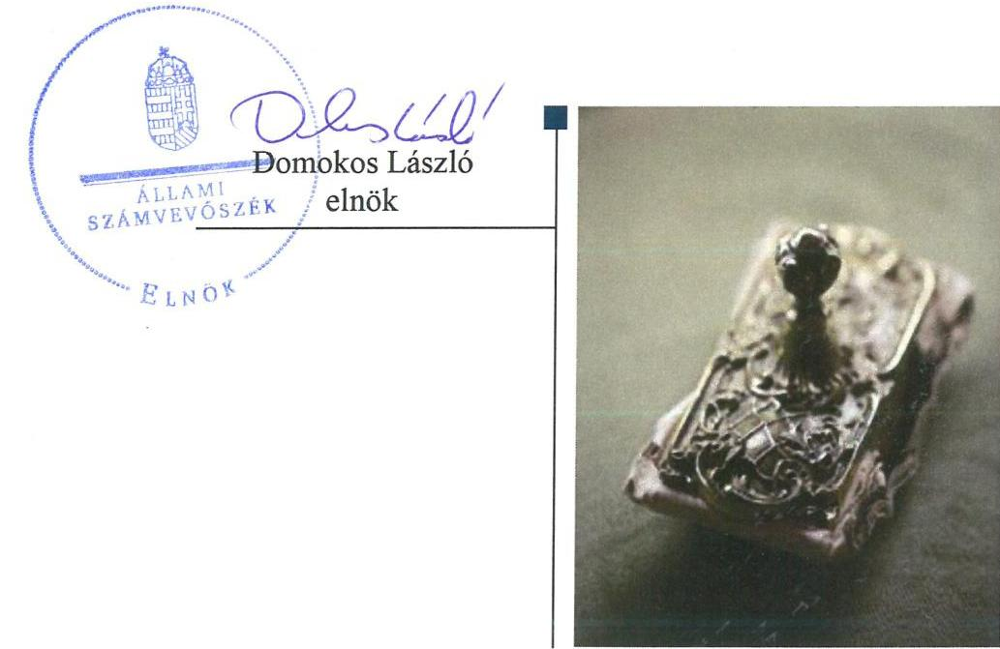
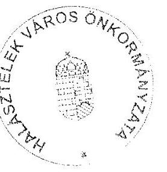
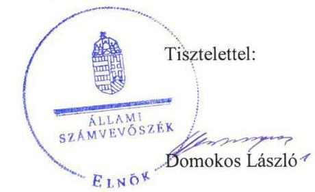
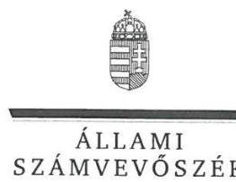
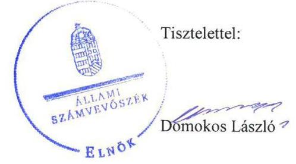

# Jelentés 

## Önkormányzatok ellenőrzése - Integritás- és belső kontrollrendszer

Halásztelek Város Önkormányzata 2019. 10. hó 29. nap

---

# AZ ELLENŐRZÉST FELÜGYELTE:

- VARGA EDIT felügyeleti vezető
- AZ ELLENŐRZÉST VEZETTE ÉS A VÉGREHAJTÁSÁÉRT FELELŐS:
  - DR. DOMOKOS MAGDOLNA ellenőrzésvezető
- A PROGRAM ÖSSZEÁLLÍTÁSÁÉRT FELELŐS:
  - TÓTPÁL SZABOLCS osztályvezető

**IKTATÓSZÁM:** EL-1955-001/2019.

**TÉMASZÁM:** 2485

**ELLENŐRZÉS-AZONOSÍTÓ SZÁM:** V082946

Jelentéseink az Országgyűlés számítógépes hálózatán és az Interneten a www.asz.hu címen is olvashatóak.

---

# TARTALOMJEGYZÉK 

■ ÖSSZEGZÉS ..... 5
■ AZ ELLENŐRZÉS CÉLJA ..... 6
■ AZ ELLENŐRZÉS TERÜLETE ..... 7
■ AZ ELLENŐRZÉS HÁTTERE, INDOKOLTSÁGA ..... 8
■ A JELENTÉS LÉNYEGES KÉRDÉSKÖREI ..... 9
■ AZ ELLENŐRZÉS HATÓKÖRE ÉS MÓDSZEREI ..... 10
■ MEGÁLLAPÍTÁSOK ..... 12
■ JAVASLATOK ..... 13
■ MELLÉKLETEK ..... 15
I. sz. melléklet: Értelmező szótár ..... 15
■ FÜGGELÉK: ÉSZREVÉTELEK ..... 17
■ RÖVIDÍTÉSEK JEGYZÉKE ..... 25

---

.

---

# ÖSSZEGZÉS 

Halásztelek Város Önkormányzata belső kontrollrendszerének kialakítása nem volt szabályszerű, így nem volt biztosított a közpénzekkel, a nemzeti vagyonnal történő felelős gazdálkodás és a korrupcióval szembeni védelem.

## Az ellenőrzés társadalmi indokoltsága

Az Állami Számvevőszék alapvető feladata a közpénzekkel, az állami és önkormányzati vagyonnal való gazdálkodás ellenőrzése. Az Alaptörvény szerint az önkormányzatok kötelezettsége a kiegyensúlyozott, átlátható és fenntartható költségvetési gazdálkodás elvének érvényesítése, a nemzeti vagyonnal való rendeltetésszerű és felelős módon való gazdálkodás biztosítása. Az Állami Számvevőszék stratégiájában megfogalmazott célkitűzése az integritás alapú, átlátható és elszámoltatható közpénzfelhasználás elősegítése. Ennek megvalósítása érdekében az Állami Számvevőszék prioritásként kezeli a közpénzzel gazdálkodó szervezetek esetében a belső kontrollrendszer működésének ellenőrzését.

## Főbb megállapítások, következtetések, javaslatok

A Halásztelek Város Önkormányzatának gazdálkodási feladatait ellátó Halásztelki Polgármesteri Hivatal a jogszabályi előírások ellenére nem rendelkezett a képviselő-testület által jóváhagyott, a feladatellátás részletes belső rendjét és módját rögzítő szervezeti és működési szabályzattal, így az átlátható, elszámoltatható működés alapvető feltételei hiányoztak, nem volt biztosított az integritás alapú közpénzfelhasználás.

Halásztelek Város Önkormányzatánál a teljesítménymérésre alkalmas követelmények kialakításának hiányában nem volt biztosított az államháztartás pénzeszközeivel és a nemzeti vagyonnal történő gazdaságos, hatékony és eredményes gazdálkodás mérésének lehetősége.

Az Állami Számvevőszék Halásztelek Város Önkormányzata polgármesterének a szabályszerű kontrollkörnyezet kialakítása érdekében egy javaslatot fogalmazott meg, amelyre az érintettnek 30 napon belül intézkedési tervet kell készítenie.

---

# AZ ELLENŐRZÉS CÉLJA 

Az ellenőrzés célja annak megállapítása volt, hogy az önkormányzat belső kontrollrendszere biztosította-e a közpénzekkel és a nemzeti vagyonnal történő elszámoltatható, átlátható, szabályszerű, gazdaságos, hatékony és eredményes gazdálkodás feltételeit. Az ellenőrzés keretében értékeltük továbbá, hogy az önkormányzatnál kiépítették és erősítették-e a korrupciós kockázatok kezelését szolgáló integritás kontrollokat és azt, hogy megteremtették-e a teljesítményellenőrzés feltételeit.

---

# **AZ ELLENŐRZÉS TERÜLETE**

## **Halásztelek Város Önkormányzata**

A Pest megyei Halásztelek város lakosainak száma a Központi Statisztikai Hivatal közigazgatási helynévkönyve alapján 2017. január 1-jén 10 131 fő volt.

Az Önkormányzat1 kilenc tagból álló képviselő-testületének munkáját négy állandó bizottság segítette. A településen bolgár nemzetiségi kisebbségi önkormányzat működött.

Az Önkormányzat három költségvetési szerv és egy kizárólagos önkormányzati tulajdonban levő gazdasági társaság alapításával biztosította a feladatok ellátását. A költségvetési szervek bölcsődei, óvodai nevelési, szociális és gyermekvédelmi, valamint könyvtári és közművelődési feladatokat láttak el, gazdasági szervezettel nem rendelkeztek.

A polgármester2 a 2008. év óta tölti be tisztségét, a jegyző3 személye nem változott az ellenőrzött időszakban, feladatait a 2001. június 27-i kinevezése óta látta el a településen.

Az Önkormányzat a 2017. évi zárszámadási rendelet alapján a 2017. évben 1363,2 millió Ft költségvetési bevételt, 2008,6 millió Ft költségvetési kiadást teljesített, könyvviteli mérleg szerinti vagyona 8334,8 millió Ft volt.

---

# AZ ELLENŐRZÉS HÁTTERE, INDOKOLTSÁGA 

Az ÁSZ ${ }^{4}$ az ÁSZ törvényben ${ }^{5}$ kapott felhatalmazással élve ellenőrzi az önkormányzatok gazdálkodását, működését, hogy az ellenőrzések megállapításaival támogassa az ellenőrzött önkormányzatok szabályszerű gazdálkodását, javaslataival elősegítse az Alaptörvényben ${ }^{6}$ megfogalmazott alapvetések érvényesülését a mindennapi életben az önkormányzatok szintjén. Az önkormányzati rendszerben zajló folyamatok holisztikus elemzései, a kockázatok folyamatos figyelemmel kísérésének módszerével, az így kiválasztott önkormányzatok célzott, hatékony ellenőrzéseivel az ÁSZ betölti a legfőbb gazdasági ellenőrző szerv küldetését. Az egyes ellenőrzések megállapításaival és egy időszak ellenőrzési eredményeinek elemzésével az ÁSZ ráirányíthatja a jogalkotók figyelmét az önkormányzati alrendszerben esetlegesen felmerülő pénzügyi, szabályozási feszültségekre. Az elvégzett nagyszámú ellenőrzés során az ÁSZ „jó gyakorlatokat" is azonosíthat, melyeket tanácsadó funkciója keretében szélesebb körben is megismertethet az érintettekkel, ezáltal is hozzájárulva az önkormányzati alrendszer szabályozott, átlátható, kiegyensúlyozott és fenntartható működéséhez.

A belső kontrollrendszer kialakítása és működtetése nélkül nem valósítható meg a közpénzek, a közvagyon átlátható, szabályos, gazdaságos, hatékony és eredményes felhasználása. A belső kontrollrendszer azt a célt szolgálja, hogy a költségvetési szervek működésük és gazdálkodásuk során a tevékenységeket szabályszerűen hajtsák végre, teljesítsék elszámolási kötelezettségeiket és megvédjék az erőforrásokat a veszteségektől, a károktól és a nem rendeltetésszerű használattól. A belső kontrollrendszer magában foglalja mindazon elveket, eljárásokat és belső szabályzatokat, melyek biztosítják, hogy a költségvetési szerv valamennyi tevékenysége és célja összhangban legyen a szabályszerűséggel, szabályozottsággal, valamint a gazdaságosság, hatékonyság és eredményesség követelményeivel, az eszközökkel és forrásokkal való gazdálkodásban ne kerüljön sor pazarlásra, visszaélésre, rendeltetésellenes felhasználásra. Megfelelő, pontos és naprakész információk álljanak rendelkezésre a költségvetési szerv működésével kapcsolatosan, és a belső kontrollrendszer harmonizációjára, összehangolására vonatkozó jogszabályok végrehajtásra kerüljenek. Az integritás kontrollok kiépítése, erősítése a szervezet korrupciós kockázatainak kezelését szolgálja. A teljesítménykövetelmények meghatározása és működtetése megalapozhatja az önkormányzatoknál a teljesítményellenőrzés lefolytatását.

---

# A JELENTÉS LÉNYEGES KÉRDÉSKÖREI 

1. Az önkormányzat belső kontrollrendszerének kialakítása és működtetése szabályszerű volt-e, az biztosította-e az önkormányzatnál a közpénzfelhasználás szabályosságát, a nemzeti vagyonnal történő felelős gazdálkodást?
2. Az önkormányzat kiépítette és erősítette-e az integritás kontrollrendszerét?
3. Az önkormányzatnál alakítottak-e ki a teljesítmény mérésére alkalmas követelményeket?

---

# AZ ELLENŐRZÉS HATÓKÖRE ÉS MÓDSZEREI 

## Az ellenőrzés típusa

Megfelelőségi ellenőrzés.

## Az ellenőrzött időszak

2017. év, illetve az éves költségvetési beszámoló Áht. ${ }^{7}$ által megállapított jóváhagyásáig (2018. május 31-éig) tartó időszak.

## Az ellenőrzés tárgya

Halásztelek Város Önkormányzata és a gazdálkodási feladatokat ellátó Halásztelki Polgármesteri Hivatal belső kontrollrendszerének kialakítása és működtetése, valamint az integritás kontrollok kiépítettsége, a teljesítményellenőrzés feltételei.

## Az ellenőrzött szervezet

Halásztelek Város Önkormányzata és a Halásztelki Polgármesteri Hivatal.

## Az ellenőrzés jogalapja

Az ellenőrzés jogszabályi alapját az ÁSZ tv. 1. § (3) bekezdés, 5. § (2) és (6) bekezdései, valamint az Áht. 61. § (2) bekezdésének előírásai képezik.

## Az ellenőrzés módszerei

Az ÁSZ ${ }^{9}$ az ellenőrzést az ellenőrzési program szempontjai, az ellenőrzött időszakban hatályos jogszabályok, az ellenőrzés szakmai szabályai, a jelen ellenőrzésre irányadó ÁSZ módszertanok figyelembevételével hajtotta végre.

Az ellenőrzés ideje alatt az ellenőrzött szervezettel történő kapcsolattartást az ÁSZ SZMSZ ${ }^{10}$-ének vonatkozó előírásai alapján biztosította az ÁSZ.

Az ellenőrzési kérdések megválaszolásához szükséges bizonyítékok megszerzése az ellenőrzött által rendelkezésre bocsátott dokumentumokra, adatokra alapozva megfigyelés, valamint elemző eljárás útján történt.

---

Az ellenőrzési bizonyítékként felhasználható adatforrások közé tartoztak az ellenőrzési program részletes szempontjainál felsorolt adatforrások, valamint minden egyéb - az ellenőrzés folyamán feltárt, az ellenőrzés szempontjából információt tartalmazó - dokumentum.

Amennyiben az önkormányzat működését és gazdálkodását alapvetően meghatározó dokumentum hiánya miatt, valamely lényeges kérdéskörre vonatkozóan az ÁSZ megállapítást tett, további ellenőrzési tevékenységek az adott kérdéskörrel és az azzal szoros logikai kapcsolatban lévő kérdéskörökkel - ráépülő jelleggel - nem kerültek végrehajtásra.

---

# MEGÁLLAPÍTÁSOK 

## 1. Az önkormányzat belső kontrollrendszerének kialakítása és működtetése szabályszerű volt-e, az biztosította-e az önkormányzatnál a közpénzfelhasználás szabályosságát, a nemzeti vagyonnal történő felelős gazdálkodást?

Összegző megállapítás Az Önkormányzatnál a belső kontrollrendszer kialakítása és működtetése nem volt szabályszerű, az nem biztosította a közpénzfelhasználás szabályosságát, a nemzeti vagyonnal történő felelős gazdálkodást.

A BELSŐ KONTROLLRENDSZER kialakítása nem volt szabályszerű, mert a Polgármesteri Hivatal ${ }^{11}$ az Áht. 10. § (5) bekezdésében foglaltak ellenére nem rendelkezett a Képviselő-testület által az Áht. 9. § b) pontja alapján jóváhagyott, szervezetét, feladatai ellátásának belső rendjét és módját megállapító szervezeti és működési szabályzattal.

A jegyző a 8 kr. ${ }^{12}$ 11. § (1) bekezdésében előírtak alapján a 8 kr. 1. számú melléklete szerinti nyilatkozatban szabályszerűnek értékelte a belső kontrollrendszer működését, azonban az ÁSZ ellenőrzési megállapításai a jegyző nyilatkozatát nem támasztották alá.

## 2. Az önkormányzat kiépítette és erősítette-e az integritás kontrollrendszerét?

## Összegző megállapítás Az Önkormányzatnál nem azonosították a korrupció elleni védelmet biztosító kontrollokat.

A Polgármesteri Hivatal szervezeti és működési szabályzatának hiánya miatt az alapvető felelősségi szabályok nem kerültek kialakításra.

## 3. Az önkormányzatnál alakítottak-e ki a teljesítmény mérésére alkalmas követelményeket?

## Összegző megállapítás Az Önkormányzatnál nem alakítottak ki a teljesítmény mérésére alkalmas követelményeket.

A szervezeti célok elérését szolgáló feladatok, folyamatok, tevékenységek mérését szolgáló indikátorokat, mérőszámokat, feladat- és teljesítménymutatókat nem képeztek, ezáltal az Önkormányzat a teljesítmény mérésének feltételeit, az államháztartás pénzeszközeivel és a nemzeti vagyonnal történő gazdaságos, hatékony és eredményes gazdálkodás mérésének lehetőségét nem biztosította.

---

# JAVASLATOK 

Az ÁSZ tv. 33. § (1) bekezdésében foglaltak értelmében az ellenőrzött szervezet vezetője köteles a jelentésben foglalt megállapításokhoz kapcsolódó intézkedési tervet összeállítani és azt a jelentés kézhezvételétől számított 30 napon belül az ÁSZ részére megküldeni. Amennyiben az ellenőrzött szervezet vezetője nem küldi meg határidőben az intézkedési tervet, vagy továbbra sem elfogadható intézkedési tervet küld, az Állami Számvevőszék elnöke az ÁSZ tv. 33. § (3) bekezdése a) és b) pontjaiban foglaltakat érvényesítheti.

## Halásztelek Város Önkormányzata polgármesterének

1. Az Önkormányzat szabályszerű kontrollkörnyezete kialakítása érdekében gondoskodjon a Hivatal jogszabályi előírásoknak megfelelő tartalmú szervezeti és működési szabályzatának Képviselő-testület elé terjesztéséről.
(1. sz. megállapítás 1. bekezdése alapján)

---

.

---

# MELLÉKLETEK 

- I. SZ. MELLÉKLET: ÉRTELMEZŐ SZÓTÁR
belső ellenőrzés
belső kontrollrendszer
belső kontrollrendszer területei
információs és kommunikációs rendszer
integrált kockázatkezelési rendszer
integritás
irányító szerv/felügyeleti szerv
kockázat
kontrollkörnyezet
kontrolltevékenységek

Független, tárgyilagos bizonyosságot adó és tanácsadó tevékenység, amelynek célja, hogy az ellenőrzött szervezet működését fejlessze és eredményességét növelje, az ellenőrzött szervezet céljai elérése érdekében rendszerszemléletű megközelítéssel és módszeresen értékeli, illetve fejleszti az ellenőrzött szervezet irányítási és belső kontrollrendszerének hatékonyságát (Forrás: Bkr. 2. § b) pontja)
A belső kontrollrendszer a kockázatok kezelése és tárgyilagos bizonyosság megszerzése érdekében kialakított folyamatrendszer, amely azt a célt szolgálja, hogy a működés és gazdálkodás során a tevékenységeket szabályszerűen, gazdaságosan, hatékonyan, eredményesen hajtsák végre, az elszámolási kötelezettségeket teljesítsék, megvédjék az erőforrásokat a veszteségektől, károktól és nem rendeltetésszerű használattól (Forrás: Áht. 69. § (1) bekezdése)
A kontrollkörnyezet, az integrált kockázatkezelési rendszer, a kontrolltevékenységek, az információs és kommunikációs rendszer, valamint a nyomon követési (monitoring) rendszer. (Forrás: Bkr. 3. §-a)
A költségvetési szerv vezetője által kialakított és működtetett olyan rendszer, mely biztosítja, hogy a megfelelő információk a megfelelő időben eljutnak az illetékes szervezethez, szervezeti egységhez, illetve személyhez. (Forrás: Bkr. 9. § (1) bekezdés)

Olyan folyamatalapú kockázatkezelési rendszer, amely a szervezet minden tevékenységére kiterjed, egységes módszertan és eljárások alkalmazásával, a szervezet célkitűzéseinek és értékeinek figyelembevételével biztosítja a szervezet
 kockázatainak teljes körű azonosítását, azok meghatározott kritériumok szerinti értékelését, valamint a kockázatok kezelésére vonatkozó intézkedési terv elkészítését és az abban foglaltak nyomon követését. (Forrás: Bkr. 2. § m) pontja, 2016. október 1-jétől)

Az integritás az elvek, értékek, cselekvések, módszerek, intézkedések konzisztenciáját jelenti, vagyis olyan magatartásmódot, amely meghatározott értékeknek megfelel. (Forrás: Nemzetgazdasági Minisztérium: Magyarországi államháztartási belső kontroll standardok Útmutató 1.6.1. pontja, 2012. december)
A költségvetési szerv tekintetében az Áht-ban meghatározott irányítási hatáskört gyakorló szerv. (Forrás: Áht. 1. § 9. pontja)
A kockázat annak a valószínűségét jelenti, hogy egy vagy több esemény vagy intézkedés nem kívánt módon befolyásolja a rendszer működését, céljainak megvalósulását. (Forrás: Javaslatok a korrupciós kockázatok kezelésére Kockázatkezelési és ellenőrzési módszertan 35. oldal, ÁSZ)
A költségvetési szerv vezetője által kialakított olyan elvek, eljárások, belső szabályzatok összessége, amelyben világos a szervezeti struktúra, egyértelműek a felelősségi, hatásköri viszonyok és feladatok, meghatározottak az etikai elvárások a szervezet minden szintjén, átlátható a humánerőforrás-kezelés (Forrás: Bkr. 6. § (1) bekezdés)
A költségvetési szerv vezetője által a szervezeten belül kialakított (kontroll) tevékenységek, melyek biztosítják a kockázatok kezelését, hozzájárulnak a szervezet céljainak eléréséhez (Forrás: Bkr. 8. § (1) bekezdés)

---

| kommunikáció | Az a tevékenység, melynek során információ továbbítása valósul meg. A kommunikációs folyamat résztvevői között tájékoztatás történik, mely során tényeket, ezek magyarázatát közlik. |
| :--: | :--: |
| monitoring | A monitoring általánosságban a különböző szintű szervezeti célok megvalósításának folyamatát kíséri figyelemmel, melynek során a releváns eseményekről és tevékenységekről (együtt: folyamatokról) rendszeres jelleggel, strukturált, döntéstámogató információkhoz jutnak a szervezet vezetői. (Forrás: NGM Útmutató a költségvetési szervek monitoring rendszeréhez 2011. november) |
| monitoring rendszer | A költségvetési szerv vezetője köteles kialakítani a szervezet tevékenységének a célok megvalósításának nyomon követését biztosító rendszert, amely az operatív tevékenységek keretében megvalósuló folyamatos és eseti nyomon követésből, valamint az operatív tevékenységektől függetlenül működő belső ellenőrzésből állhat. (Forrás: Bkr. 10. §) |
| önkormányzati hivatal | A polgármesteri hivatal, a főpolgármesteri hivatal, a megyei önkormányzati hivatal és a közös önkormányzati hivatal. (Forrás: Áht. 1. § 18. pont) |

---

# FÜGGELÉK: ÉSZREVÉTELEK 

A jelentéstervezetet a Számvevőszék 15 napos észrevételezésre megküldte az ellenőrzött szervezetek vezetőinek az ÁSZ tv. 29. § (1) bekezdése előírásának megfelelően.

Az ÁSZ a jelentéstervezetet észrevételezésre megküldte Halásztelek Város Önkormányzata polgármestere és a Halásztelki Polgármesteri Hivatal jegyzője részére.
Halásztelek Város Önkormányzata polgármestere és a Halásztelki Polgármesteri Hivatal jegyzője az ÁSZ tv. 29. § (2) bekezdésében foglalt észrevételezési jogukkal éltek, a jelentéstervezet megállapításaira a törvényes határidőn belül észrevételt tettek.
Halásztelek Város Önkormányzata polgármesterének és a Halásztelki Polgármesteri Hivatal jegyzőjének észrevételeit és az azokra adott választ a függelék tartalmazza.

[^0]
[^0]:    * 29. § (1) Az Állami Számvevőszék az ellenőrzési megállapításait megküldi az ellenőrzött szervezet vezetőjének vagy az általa megbízott személynek, és annak, akinek személyes felelősségét állapította meg.
    (2) Az ellenőrzött szervezet vezetője és a felelősként megjelölt személy az ellenőrzés megállapításaira tizenöt napon belül írásban észrevételt tehet.
    (3) Az Állami Számvevőszék az észrevételre a beérkezésétől számított harminc napon belül írásban válaszol. A figyelembe nem vett észrevételeket köteles a jelentésben feltüntetni, és megindokolni, hogy azokat miért nem fogadta el.

---

# HALÁSZTELEK VÁROS ÖNKORMÁNYZAT ÁLLAMI SZÁMVEVŐSZÉK 

2314 HALÁSZTELEK, Kastily park 1. Tel./Fax: 0624517 -270 E-mail: jogy@halasztelek.hu Honlap: www.halasztelek.hu

Tárgy: Észrevételezés

## Állami Számvevőszék

1052 Budapest, Apáczai Csere János u. 10.
1364 Budapest 4. Pf. 54.

Hivatkozási iktatószám: EL-1028-041/2019.

Domokos László Elnök Úr részére

Iktatószám: PH/427-5/2019

Tisztelt Elnök úr!

Halásztelek Város Önkormányzathoz 2019. július 11. napján érkezett, az Önkormányzatok ellenőrzése - Integritás- és belső kontrollrendszer - Halásztelek Város Önkormányzata" című számvevőszéki jelentéstervezetre az alábbi észrevételezéssel élünk.

A Megállapítások 1. és 2. pontjára - ami szerint az Önkormányzatnál a belső kontrollrendszer kialakítása és működtetése nem volt szabályszerű, nem azonosították a korrupció elleni védelmet biztosító kontrollokat, mert nem rendelkezett a Polgármesteri Hivatal a Képviselő-testület által jóváhagyott Szervezeti és Működési Szabályzattal -, észrevételezzük, hogy a Halásztelki Polgármesteri Hivatal a teljes időszakban rendelkezett az Áht. 9.§ b) pontja alapján jóváhagyott szervezetének, belső feladatainak, és működésének rendjét megállapító Szervezeti és Működési Szabályzattal.

A Képviselő-testület a Polgármesteri Hivatal Szervezeti és Működési Szabályzatát 2013. április 30. napján a 47/2013. (IV.30.) számú Kt. határozatával hagyta jóvá, a szabályzat felülvizsgálata a jogszabály változásokra figyelemmel megtörtént, a Képviselő-testület elé való terjesztésére azonban később, 2019. február 13. napján került sor, melyet a Képviselő-testület a 15/2019. (II.13.) számú határozattal hagyott jóvá.

---

# Függelék: Észrevételek

Technikai okok miatt a még nem hatályos Szervezeti és Működési Szabályzat került az ÁSZ ellenőrzést támogató Elektronikus Adatszolgáltatási Rendszerébe feltöltésre.

Igazolásul, a Képviselő-testületi határozattal jóváhagyott Szervezeti és Működési Szabályzatok hiteles másolata előzetesen már megküldésre került.

Kérnénk észrevételezésünk szíves elfogadását.

Halásztelek, 2019. július 22.

Tisztelettel:

Szentgyörgyi József
Polgármester

Raloghné dr. Nagy Edit
Címzetes főjegyző

---

# Szentgyörgyi József úr 

polgármester
Halásztelek Város Önkormányzata

## Halásztelek

## Tisztelt Polgármester Úr!

Az „Önkormányzatok ellenőrzése - Integritás- és belső kontrollrendszer - Halásztelek Város Önkormányzata" címmel készített számvevőszéki jelentéstervezetre tett észrevételét köszönettel megkaptam.
Az Állami Számvevőszék észrevételre vonatkozó álláspontjáról a felügyeleti vezető által készített részletes tájékoztatást csatoltan megküldöm.
Tájékoztatom Polgármester urat, hogy a számvevőszéki jelentésben - az Állami Számvevőszékről szóló 2011. évi LXVI. törvény 29. § (3) bekezdése alapján - a figyelembe nem vett észrevételeket szerepeltetjük, annak indoklásával, hogy azokat az Állami Számvevőszék miért nem fogadta el.

Budapest, 2019. 06. 26.

Melléklet: Tájékoztatás az észrevételek kezeléséről

---

# Tájékoztatás az észrevételek kezeléséről 

Az ,,Önkormányzatok ellenőrzése - Integritás- és belső kontrollrendszer - Halásztelek Város Önkormányzata" című jelentéstervezetre a 2019. július 22-én kelt, PH/427-5/2019 iktatószámú levelében tett észrevételét áttekintettük, annak kezeléséről az alábbi tájékoztatást adom.

## 1. A Megállapítások 1. és 2. pontjára tett észrevétele kapcsán

Észrevételében jelezte, hogy ,, a Halásztelki Polgármesteri Hivatal a teljes ellenőrzött időszakban rendelkezett az Áht. 9. § b) pontja alapján jóváhagyott szervezetének, belső feladatainak, és működésének rendjét megállapító Szervezeti és Működési Szabályzattal. ... Technikai okok miatt a még nem hatályos Szervezeti és Működési Szabályzat került az ÁSZ ellenőrzést támogató Elektronikus Adatszolgáltatási Rendszerébe feltöltésre ... a Képviselő-testületi határozattal jóváhagyott Szervezeti és Működési Szabályzatok hiteles másolata előzetesen már megküldésre került."
Az államháztartásról szóló 2011. évi CXCV. törvény 9. § b) pontjában foglaltak szerint, ha törvény eltérően nem rendelkezik, a költségvetési szerv irányítását - többek között - a költségvetési szerv szervezeti és működési szabályzata jóváhagyásának hatásköre jelenti.
Az EL-1028-001/2018. iktatószámú, 2018. augusztus 15-én kelt levelünkben foglaltak szerint adatot kértünk be tárgyi ellenőrzés vonatkozásában. Az adatszolgáltatás megtörtént, amelyről 2018. október 11-én kelt teljességi és hitelességi nyilatkozat kiállítására került sor.
A teljességi és hitelességi nyilatkozatban foglaltak szerint a Halásztelki Polgármesteri Hivatal (továbbiakban: Hivatal) 2017. évre vonatkozó szervezeti és működési szabályzat átadására sor került, azonban annak jóváhagyását tartalmazó képviselő-testületi határozat Állami Számvevőszék (továbbiakban: ÁSZ) részére való megküldése nem történt meg. Meg kívánom jegyezni, hogy az észrevétel szerint 2013. évben jóváhagyott hivatali szervezeti és működési szabályzat és az azt jóváhagyó képviselő-testületi határozat nem került megküldésre az ellenőrzés részére a teljességi és hiteleségi nyilatkozatban foglaltak szerint azzal, hogy azok nem az ellenőrzési időszakra vonatkoztak, figyelemmel a 2017. évre vonatkozó hivatali szervezeti és működési szabályzatban rögzített 2017. január 1-jei hatálybalépésre. Megjegyzem továbbá, hogy az észrevételben hivatkozott, a Képviselő-testület által 2019. február 13-án jóváhagyott hivatali szervezeti és működési szabályzat az ellenőrzés időszakán kívüli, ezért az ellenőrzés megállapításait nem érinti.
Az ÁSZ megállapításait az Állami Számvevőszékről szóló 2011. évi LXVI. törvény 28. § (2) bekezdésének megfelelően az adatbekérés során, határidőben rendelkezésére bocsátott dokumentumokra alapozza.
Az ÁSZ megállapításait megerősítve, észrevételében elismerte, hogy nem a hatályos - képviselőtestületi határozattal jóváhagyott - 2017. évre vonatkozó hivatali szervezeti és működési szabályzatot bocsátották az ellenőrzés rendelkezésére, mindezek alapján az észrevételt nem fogadjuk el, az Állami Számvevőszék megállapítása helytálló, a jelentéstervezet módosítása nem indokolt.
Budapest, 2019. 08. 16.

Varga Edit
felügyeleti vezető

---

ELNÖK

Ikt.szám: EL-1028-052/2019.

# Baloghné dr. Nagy Edit úrhölgy 

jegyző
Halásztelki Polgármesteri Hivatal

## Halásztelek

## Tisztelt Jegyző Úrhölgy!

Az „Önkormányzatok ellenőrzése - Integritás- és belső kontrollrendszer - Halásztelek Város Önkormányzata" címmel készített számvevőszéki jelentéstervezetre tett észrevételét köszönettel megkaptam.
Az Állami Számvevőszék észrevételre vonatkozó álláspontjáról a felügyeleti vezető által készített részletes tájékoztatást csatoltan megküldöm.
Tájékoztatom Jegyző úrhölgyet, hogy a számvevőszéki jelentésben - az Állami Számvevőszékről szóló 2011. évi LXVI. törvény 29. § (3) bekezdése alapján - a figyelembe nem vett észrevételeket szerepeltetjük, annak indoklásával, hogy azokat az Állami Számvevőszék miért nem fogadta el.

Budapest, 2019. 06. 26.

Melléklet: Tájékoztatás az észrevételek kezeléséről

---

# Tájékoztatás az észrevételek kezeléséről 

Az „Önkormányzatok ellenőrzése - Integritás- és belső kontrollrendszer - Halásztelek Város Önkormányzata" című jelentéstervezetre a 2019. július 22-én kelt, PH/427-5/2019 iktatószámú levelében tett észrevételét áttekintettük, annak kezeléséről az alábbi tájékoztatást adom.

## 1. A Megállapítások 1. és 2. pontjára tett észrevétele kapcsán

Észrevételében jelezte, hogy ,, a Halásztelki Polgármesteri Hivatal a teljes ellenőrzött időszakban rendelkezett az Áht. 9. § b) pontja alapján jóváhagyott szervezetének, belső feladatainak, és működésének rendjét megállapító Szervezeti és Működési Szabályzattal. ... Technikai okok miatt a még nem hatályos Szervezeti és Működési Szabályzat került az ÁSZ ellenőrzést támogató Elektronikus Adatszolgáltatási Rendszerébe feltöltésre ... a Képviselő-testületi határozattal jóváhagyott Szervezeti és Működési Szabályzatok hiteles másolata előzetesen már megküldésre került."
Az államháztartásról szóló 2011. évi CXCV. törvény 9. § b) pontjában foglaltak szerint, ha törvény eltérően nem rendelkezik, a költségvetési szerv irányítását - többek között - a költségvetési szerv szervezeti és működési szabályzata jóváhagyásának hatásköre jelenti.
Az EL-1028-001/2018. iktatószámú, 2018. augusztus 15-én kelt levelünkben foglaltak szerint adatot kértünk be tárgyi ellenőrzés vonatkozásában. Az adatszolgáltatás megtörtént, amelyről 2018. október 11-én kelt teljességi és hitelességi nyilatkozat kiállítására került sor.
A teljességi és hitelességi nyilatkozatban foglaltak szerint a Halásztelki Polgármesteri Hivatal (továbbiakban: Hivatal) 2017. évre vonatkozó szervezeti és működési szabályzat átadására sor került, azonban annak jóváhagyását tartalmazó képviselő-testületi határozat Állami Számvevőszék (továbbiakban: ÁSZ) részére való megküldése nem történt meg. Meg kívánom jegyezni, hogy az észrevétel szerint 2013. évben jóváhagyott hivatali szervezeti és működési szabályzat és az azt jóváhagyó képviselő-testületi határozat nem került megküldésre az ellenőrzés részére a teljességi és hiteleségi nyilatkozatban foglaltak szerint azzal, hogy azok nem az ellenőrzési időszakra vonatkoztak, figyelemmel a 2017. évre vonatkozó hivatali szervezeti és működési szabályzatban rögzített 2017. január 1-jei hatálybalépésre. Megjegyzem továbbá, hogy az észrevételben hivatkozott, a Képviselő-testület által 2019. február 13-án jóváhagyott hivatali szervezeti és működési szabályzat az ellenőrzés időszakán kívüli, ezért az ellenőrzés megállapításait nem érinti.
Az ÁSZ megállapításait az Állami Számvevőszékről szóló 2011. évi LXVI. törvény 28. § (2) bekezdésének megfelelően az

 adatbekérés során, határidőben rendelkezésére bocsátott dokumentumokra alapozza.
Az ÁSZ megállapításait megerősítve, észrevételében elismerte, hogy nem a hatályos - képviselőtestületi határozattal jóváhagyott - 2017. évre vonatkozó hivatali szervezeti és működési szabályzatot bocsátották az ellenőrzés rendelkezésére, mindezek alapján az észrevételt nem fogadjuk el, az Állami Számvevőszék megállapítása helytálló, a jelentéstervezet módosítása nem indokolt.
Budapest, 2019. 08. hó 6. nap

Varga Edit
felügyeleti vezető

---

.

---

# RÖVIDÍTÉSEK JEGYZÉKE 

${ }^{1}$ önkormányzat
${ }^{2}$ polgármester
${ }^{3}$ jegyző
${ }^{4}$ ÁSZ
${ }^{5}$ ÁSZ törvény
${ }^{6}$ Alaptörvény
${ }^{7}$ Áht.
${ }^{8}$ ÁSZ tv.
${ }^{9}$ ÁSZ
${ }^{10}$ ÁSZ SZMSZ
${ }^{11}$ Polgármesteri Hivatal
${ }^{12}$ Bkr.

Halásztelek Város Önkormányzata
Halásztelek Város Önkormányzatának polgármestere
Halásztelki Polgármesteri Hivatal jegyzője
Állami Számvevőszék
2011. évi LXVI. törvény az Állami Számvevőszékről
Magyarország Alaptörvénye (2011. április 25.)
2011. évi CXCV. törvény az államháztartásról
2011. évi LXVI. törvény az Állami Számvevőszékről
Állami Számvevőszék
Az Állami Számvevőszék elnökének 2/2018. (XII.28.) ÁSZ utasítása az Állami
Számvevőszék Szervezeti és Működési Szabályzatáról
Halásztelki Polgármesteri Hivatal
370/2011. (XII.31.) Korm. rendelet a költségvetési szervek belső
kontrollrendszeréről és belső ellenőrzéséről

---

# ÁLLAMI SZÁMVEVŐSZÉK 

1052 Budapest, Apáczai Csere János utca 10.
Levélcím: 1364 Budapest 4. Pf. 54
Telefon: +36 14849100 Telefax: +36 14849200
www.asz.hu
