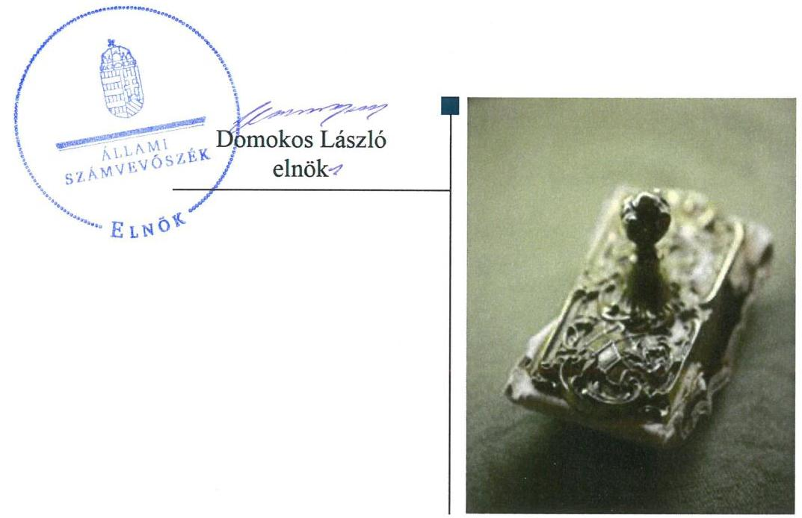
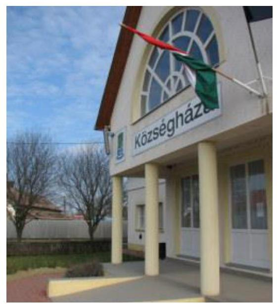
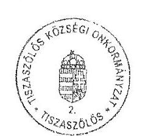
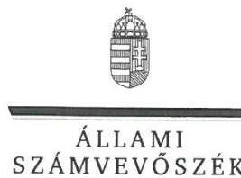
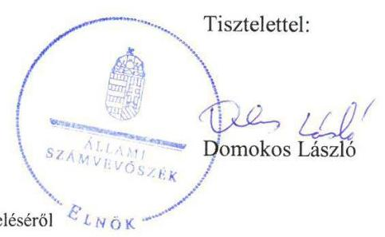

# Jelentés 

## Önkormányzatok ellenőrzése Integritás- és belső kontrollrendszer

Tiszaszőlős Községi Önkormányzat 2019.

---

# Jelentés 

## Önkormányzatok ellenőrzése Integritás- és belső kontrollrendszer

Tiszaszőlős Községi Önkormányzat 2019. (1) hó 22. nap

---

# AZ ELLENŐRZÉST FELÜGYELTE:

- VARGA EDIT felügyeleti vezető
- AZ ELLENŐRZÉST VEZETTE ÉS A VÉGREHAJTÁSÁÉRT FELELŐS:
  - TERLECZKYNÉ DR. EISELE EDIT ellenőrzésvezető
- A PROGRAM ÖSSZEÁLLÍTÁSÁÉRT FELELŐS:
  - TÓTPÁL SZABOLCS osztályvezető

**IKTATÓSZÁM:** EL-1675-001/2019.

**TÉMASZÁM:** 2485

**ELLENŐRZÉS-AZONOSÍTÓ SZÁM:** V082931

Jelentéseink az Országgyűlés számítógépes hálózatán és az Interneten a www.asz.hu címen is olvashatóak.

---

# TARTALOMJEGYZÉK 

- ÖSSZEGZÉS ..... 5
- AZ ELLENŐRZÉS CÉLJA ..... 6
- AZ ELLENŐRZÉS TERÜLETE ..... 7
- AZ ELLENŐRZÉS HÁTTERE, INDOKOLTSÁGA ..... 8
- A JELENTÉS LÉNYEGES KÉRDÉSKÖRE ..... 9
- AZ ELLENŐRZÉS HATÓKÖRE ÉS MÓDSZEREI ..... 10
- MEGÁLLAPÍTÁSOK ..... 12
- JAVASLATOK ..... 13
- MELLÉKLETEK ..... 15
I. sz. melléklet: Értelmező szótár ..... 15
- FÜGGELÉKEK ..... 17
I. sz. függelék a jelentéshez ..... 17
II. sz. függelék: Észrevételek ..... 18
- RÖVIDÍTÉSEK JEGYZÉKE ..... 25

---

.

---

# ÖSSZEGZÉS 

Tiszaszőlős Községi Önkormányzat belső kontrollrendszerének kialakítása nem volt szabályszerű, így nem volt biztosított a közpénzekkel, a nemzeti vagyonnal történő felelős gazdálkodás.

## Az ellenőrzés társadalmi indokoltsága

Az Állami Számvevőszék alapvető feladata a közpénzekkel, az állami és az önkormányzati vagyonnal való gazdálkodás ellenőrzése. Az Alaptörvény szerint az önkormányzatok kötelezettsége a kiegyensúlyozott, átlátható és fenntartható költségvetési gazdálkodás elvének érvényesítése, a nemzeti vagyonnal való rendeltetésszerű és felelős módon való gazdálkodás biztosítása. Az Állami Számvevőszék stratégiájában megfogalmazott célkitűzése az integritás alapú, átlátható és elszámoltatható közpénzfelhasználás elősegítése. Ennek megvalósítása érdekében az Állami Számvevőszék prioritásként kezeli a közpénzzel gazdálkodó szervezetek esetében a belső kontrollrendszer működésének ellenőrzését.

Tiszaszőlős Községi Önkormányzatnál az Állami Számvevőszék korábban nem folytatott ellenőrzést.

## Főbb megállapítások, következtetések

Tiszaszőlős Községi Önkormányzat belső kontrollrendszerének kialakítása és működtetése nem volt szabályszerű.
A jogszabályi előírás ellenére a Tiszaszőlősi Közös Önkormányzati Hivatal nem rendelkezett a feladatokat, a hatásköri és felelősségi viszonyokat meghatározó szervezeti és működési szabályzattal. Így nem volt biztosított az elszámoltatható működés alapvető feltétele, a szabályos közpénzfelhasználás, a nemzeti vagyonnal történő felelős gazdálkodás.

---

# AZ ELLENŐRZÉS CÉLJA 

AZ ELLENŐRZÉS CÉLJA annak megállapítása volt, hogy az önkormányzat belső kontrollrendszere biztosította-e a közpénzekkel és a nemzeti vagyonnal történő elszámoltatható, átlátható, szabályszerű, gazdaságos, hatékony és eredményes gazdálkodás feltételeit. Az ellenőrzés keretében értékeltük továbbá, hogy az önkormányzatnál kiépítették és erősítették-e a korrupciós kockázatok kezelését szolgáló integritás kontrollokat és azt, hogy megteremtették-e a teljesítményellenőrzés feltételeit.

---

# AZ ELLENŐRZÉS TERÜLETE 

## Tiszaszőlős Községi Önkormányzat

TISZASZŐLŐS község Jász-Nagykun-Szolnok megyében található, állandó lakosainak száma a Központi Statisztikai Hivatal Magyarország közigazgatási helynévkönyve alapján 2017. január 1-én 1618 fő volt.

Az Önkormányzat ${ }^{1}$ Képviselő-testülete ${ }^{2} 7$ főből állt, munkáját egy állandó bizottság - a Pénzügyi, Ügyrendi, Szociális és Kulturális Bizottság - segítette.

A gazdálkodási feladatokat a Tiszaszőlősi Közös Önkormányzati Hivatal látta el, amelyet Tiszaszőlős és Tiszaderzs Községi Önkormányzatok Képviselő-testületei hoztak létre. A Hivatal ${ }^{3}$ fenntartásáról az Mötv. 4. alapján megállapodásban rendelkezett a két érintett önkormányzat. A Hivatal szervezeti egységekre nem tagolódott, elkülönített gazdasági szervezettel nem rendelkezett. Az Önkormányzat a Hivatalon kívül kettő költségvetési intézményt tartott fenn. Az Önkormányzatnak nem volt többségi tulajdoni részesedése gazdasági társaságban.

Az ellenőrzött időszakban a polgármester és a jegyző személye nem változott.

---

# AZ ELLENŐRZÉS HÁTTERE, INDOKOLTSÁGA 

Az ÁSZ ${ }^{5}$ az ÁSZ törvényben ${ }^{6}$ kapott felhatalmazással élve ellenőrzi az önkormányzatok gazdálkodását, működését, hogy az ellenőrzések megállapításaival támogassa az ellenőrzött önkormányzatok szabályszerű gazdálkodását, javaslataival elősegítse az Alaptörvényben ${ }^{7}$ megfogalmazott alapelvek érvényesülését a mindennapi életben az önkormányzatok szintjén. Az önkormányzati rendszerben zajló folyamatok holisztikus elemzései, a kockázatok folyamatos figyelemmel kísérésének módszerével, az így kiválasztott önkormányzatok célzott, hatékony ellenőrzéseivel az ÁSZ betölti a legfőbb gazdasági ellenőrző szerv küldetését. Az egyes ellenőrzések megállapításaival és egy időszak ellenőrzési eredményeinek elemzésével az ÁSZ ráirányíthatja a jogalkotók figyelmét az önkormányzati alrendszerben esetlegesen felmerülő pénzügyi, szabályozási feszültségekre. Az elvégzett nagyszámú ellenőrzés során az ÁSZ „jó gyakorlatokat" is azonosíthat, melyeket tanácsadó funkciója keretében szélesebb körben is megismertethet az érintettekkel, ezáltal is hozzájárulva az önkormányzati alrendszer szabályozott, átlátható, kiegyensúlyozott és fenntartható működéséhez.

A belső kontrollrendszer kialakítása és működtetése nélkül nem valósítható meg a közpénzek, a közvagyon átlátható, szabályos, gazdaságos, hatékony és eredményes felhasználása. A belső kontrollrendszer azt a célt szolgálja, hogy a költségvetési szervek működésük és gazdálkodásuk során a tevékenységeket szabályszerűen hajtsák végre, teljesítsék elszámolási kötelezettségeiket és megvédjék az erőforrásokat a veszteségektől, a károktól és a nem rendeltetésszerű használattól. A belső kontrollrendszer magában foglalja mindazon elveket, eljárásokat és belső szabályzatokat, melyek biztosítják, hogy a költségvetési szerv valamennyi tevékenysége és célja összhangban legyen a szabályszerűséggel, szabályozottsággal, valamint a gazdaságosság, hatékonyság és eredményesség követelményeivel, az eszközökkel és forrásokkal való gazdálkodásban ne kerüljön sor pazarlásra, visszaélésre, rendeltetésellenes felhasználásra. Megfelelő, pontos és naprakész információk álljanak rendelkezésre a költségvetési szerv működésével kapcsolatosan, és a belső kontrollrendszer harmonizációjára, összehangolására vonatkozó jogszabályok végrehajtásra kerüljenek. Az integritás kontrollok kiépítése, erősítése a szervezet korrupciós kockázatainak kezelését szolgálja. A teljesítménykövetelmények meghatározása és működtetése megalapozhatja az önkormányzatoknál a teljesítményellenőrzés lefolytatását.

---

# A JELENTÉS LÉNYEGES KÉRDÉSKÖRE 

Az Önkormányzat belső kontrollrendszerének kialakítása és működtetése szabályszerű volt-e?

---

# AZ ELLENŐRZÉS HATÓKÖRE ÉS MÓDSZEREI 

## Az ellenőrzés típusa

Megfelelőségi ellenőrzés.

## Az ellenőrzött időszak

Az ellenőrzött időszak a 2017. év, illetve az éves költségvetési beszámoló Áht. ${ }^{8}$ által megállapított jóváhagyásáig (2018. május 31-éig) tartó időszak.

## Az ellenőrzés tárgya

Az önkormányzat és a gazdálkodási feladatokat ellátó hivatal a belső kontrollrendszerének kialakítása és működtetése, valamint az integritás kontrollok kiépítettsége, a teljesítményellenőrzés feltételei.

## Az ellenőrzött szervezet

Tiszaszőlős Községi Önkormányzat
Tiszaszőlősi Közös Önkormányzati Hivatal

## Az ellenőrzés jogalapja

Az ellenőrzés jogszabályi alapját az ÁSZ tv. 1. § (3) bekezdés, 5. § (2) és (6) bekezdései, valamint az Áht. 61. § (2) bekezdésének előírásai képezik.

## Az ellenőrzés módszerei

Az ÁSZ az ellenőrzést az ellenőrzési program szempontjai, az ellenőrzött időszakban hatályos jogszabályok, az ellenőrzés szakmai szabályai, a jelen ellenőrzésre irányadó ÁSZ módszertanok figyelembevételével hajtotta végre.

Az ellenőrzési kérdések megválaszolásához szükséges bizonyítékok megszerzése az ellenőrzöttek által rendelkezésre bocsátott dokumentumokra, adatokra alapozva megfigyelés, kérdésfeltevés (információkérés), valamint elemző eljárással történt. Az ellenőrzési bizonyítékként felhasználható adatforrások közé tartoztak egyrészt az ellenőrzési programban felsorolt adatforrások, másrészt az ellenőrzés szempontjából releváns információt tartalmazó dokumentumok.

---

Amennyiben az önkormányzat működését és gazdálkodását alapvetően meghatározó dokumentum hiánya miatt valamely lényeges kérdéskörre vonatkozóan az ÁSZ megállapítást tett, további ellenőrzési tevékenységek az adott kérdéskörrel és az azzal szoros logikai kapcsolatban lévő kérdéskörökkel - ráépülő jelleggel - nem kerültek végrehajtásra.

Az ellenőrzés ideje alatt az ellenőrzött szervezettel történő kapcsolattartást az ÁSZ SZMSZ ${ }^{8}$-ének vonatkozó előírásai alapján biztosítottuk.

---

# MEGÁLLAPÍTÁSOK 

## Az Önkormányzat belső kontrollrendszerének kialakítása és működtetése szabályszerű volt-e?

Összegző megállapítás Az Önkormányzat belső kontrollrendszerének kialakítása és működtetése nem volt szabályszerű.

A BELSŐ KONTROLLRENDSZER kialakítása és működtetése nem felelt meg a jogszabályi előírásoknak, mivel a Hivatal nem rendelkezett a szervezetét, feladatai ellátásának részletes belső rendjét és módját megállapító szervezeti és működési szabályzattal az Áht. 10. § (5) bekezdésében foglaltak ellenére.

A szervezeti és működési szabályzat hiányának következtében nem volt biztosított az Önkormányzat átlátható, elszámoltatható működése.

A belső kontrollrendszer minőségét 2017. évre vonatkozóan a jegyző a Bkr. ${ }^{10}$ 1. sz. melléklete szerinti nyilatkozatban értékelte.

---

# JAVASLATOK 

Az ÁSZ tv. 33. § (1) bekezdésében foglaltak értelmében az ellenőrzött szervezet vezetője köteles a jelentésben foglalt megállapításokhoz kapcsolódó intézkedési tervet összeállítani és azt a jelentés kézhezvételétől számított 30 napon belül az ÁSZ részére megküldeni. Amennyiben az ellenőrzött szervezet vezetője nem küldi meg határidőben az intézkedési tervet, vagy továbbra sem elfogadható intézkedési tervet küld, az Állami Számvevőszék elnöke az ÁSZ tv. 33. § (3) bekezdése a) és b) pontjaiban foglaltakat érvényesítheti.

## Tiszaszőlősi Közös Önkormányzati Hivatal Jegyzőjének

1. A Hivatal szabályszerű kontrollkörnyezetének kialakítása érdekében gondoskodjon a Hivatal szervezeti és működési szabályzatának elkészítéséről.
(1. sz. megállapítás 1. bekezdése alapján)

## Tiszaszőlős Községi Önkormányzat Polgármesterének

1. Gondoskodjon a Hivatal szervezeti és működési szabályzatának Képviselő-testület elé terjesztéséről.
(1. sz. megállapítás 1. bekezdése alapján)

---

.

---

# MELLÉKLETEK 

- I. SZ. MELLÉKLET: ÉRTELMEZŐ SZÓTÁR
belső kontrollrendszer
helyi önkormányzat
közös önkormányzati hivatal

A belső kontrollrendszer a kockázatok kezelése és tárgyilagos bizonyosság megszerzése érdekében kialakított folyamatrendszer, amely azt a célt szolgálja, hogy a működés és gazdálkodás során a tevékenységeket szabályszerűen, gazdaságosan, hatékonyan, eredményesen hajtsák végre, az elszámolási kötelezettségeket teljesítsék, megvédjék az erőforrásokat a veszteségektől, károktól és nem rendeltetésszerű használattól. (Forrás: Áht. 69. § (1) bekezdése)
A helyi önkormányzat jogi személy. Az önkormányzati feladatok ellátását a képviselő-testület és szervei biztosítják. A képviselő-testület szervei: a polgármester, a főpolgármester, a megyei közgyűlés elnöke, a képviselő-testület bizottságai, a részönkormányzat testülete, az önkormányzati hivatal, a megyei önkormányzati hivatal, a közös önkormányzati hivatal, a jegyző, továbbá a társulás. A képviselő-testület a feladatkörébe tartozó közszolgáltatások ellátására - jogszabályban meghatározottak szerint - költségvetési szervet, a polgári perrendtartásról szóló törvény szerinti gazdálkodó szervezetet (a továbbiakban: gazdálkodó szervezet), nonprofit szervezetet és egyéb szervezetet (a továbbiakban együtt: intézmény) alapíthat, továbbá szerződést köthet természetes és jogi személlyel vagy jogi személyiséggel nem rendelkező szervezettel. A helyi önkormányzat éves költségvetési beszámolója magában foglalja a helyi önkormányzat - nem költségvetési szerveihez tartozó feladataihoz kapcsolódó bevételeket és kiadásokat. A helyi önkormányzat összevont (konszolidált) költségvetési beszámolóját a helyi önkormányzatra és költségvetési szerveire vonatkozóan külön-külön beérkezett éves költségvetési beszámolók alapján a Kincstár készíti el és küldi meg az önkormányzatnak. (Forrás: Mötv. 41. § (1), (2), (6) bekezdései; Áhsz. ${ }^{11}$ 2. § (1) bekezdése, 6. § (1) bekezdés a) és f) pontja, 30. §-a, 37. § (1) és (6) bekezdése)
A települési képviselő-testület más települési képviselő-testülettel társult képviselő-testületet alakíthat, amely esetén a képviselő-testületek részben vagy egészben egyesítik a költségvetésüket, közös önkormányzati hivatalt tartanak fenn és intézményeiket közösen működtetik. (Forrás: Mötv. 56. § (1)-(2) bekezdései)

---

.

---

# FÜGGELÉKEK 

- I. SZ. FÜGGELÉK A JELENTÉSHEZ

Az Állami Számvevőszék az ellenőrzések során feltárt tényekhez kapcsolódó további körülmények tisztázására eszközrendszerrel nem rendelkezik. Amennyiben az ellenőrzésen túlmutatóan indokoltnak látszik az ellenőrzés során feltárt körülmények további vizsgálata, az Állami Számvevőszék törvényi felhatalmazás alapján az ellenőrzés által feltárt körülményeket továbbítja a hatáskörrel rendelkező szervnek a szükséges intézkedések megtétele, eljárások lefolytatása érdekében.
I.

Az ellenőrzés feltárta, hogy a Tiszaszőlősi Közös Önkormányzati Hivatal (a továbbiakban: Hivatal) az államháztartásról szóló 2011. évi CXCV. törvény 10. § (5) bekezdésében előírtak ellenére nem rendelkezett a működés és a feladatellátás részletes belső rendjét és módját, a felelősségi viszonyokat rögzítő szervezeti és működési szabályzattal. A feladatokat, felelősségi szabályokat rögzítő szervezeti és működési szabályzat hiánya miatt a Hivatal átlátható, elszámoltatható működésének alapvető feltételei hiányoztak.
A Hivatal működése során feltárt szabálytalanság hatással lehet Tiszaderzs Község
 Önkormányzata gazdálkodási feladatainak ellátására is.
Az eset konkrét körülményeinek felderítésére a kormányhivatal rendelkezik hatáskörrel.

---

A jelentéstervezetet a Számvevőszék 15 napos észrevételezésre megküldte az ellenőrzött szervezetek vezetőinek az ÁSZ tv. 29. § (1) bekezdése előírásának megfelelően.

Az ÁSZ a jelentéstervezetet észrevételezésre megküldte Tiszaszólós Községi Önkormányzat polgármestere, valamint a Tiszaszólősi Közös Önkormányzati Hivatal vezetője részére.
Tiszaszólós Községi Önkormányzat polgármestere az ÁSZ tv. 29. § (2) bekezdésében foglalt észrevételezési jogával élt, a jelentéstervezet megállapításaira észrevételt tett.
Tiszaszólós Községi Önkormányzat polgármestere észrevételét és az arra adott választ a függelék tartalmazza.

[^0]
[^0]:    * 29. § (1) Az Állami Számvevőszék az ellenőrzési megállapításait megküldi az ellenőrzött szervezet vezetőjének vagy az általa megbízott személynek, és annak, akinek személyes felelősségét állapította meg.
    (2) Az ellenőrzött szervezet vezetője és a felelősként megjelölt személy az ellenőrzés megállapításaira tizenöt napon belül írásban észrevételt tehet.
    (3) Az Állami Számvevőszék az észrevételre a beérkezésétől számított harminc napon belül írásban válaszol. A figyelembe nem vett észrevételeket köteles a jelentésben feltüntetni, és megindokolni, hogy azokat miért nem fogadta el.

---

# Tiszaszólós Községi Önkormányzat   Polgármestere   5244 Tiszaszólós, Fő út 21.   Tel./fax: 59/511-408; e-mail: hivatal@tiszaszolos.hu 

Ikt.sz.: 394-5/2019.
Tárgy: „Önkormányzatok ellenőrzése-Integritás- és belső kontrollrendszer Tiszaszólós Községi Önkormányzat „ címú számvevőszéki jelentés-tervezetre észrevétel.
Hiv.sz.: EL-0833-048/2019.

Állami Számvevőszék
Budapest 4.
Pf. 54 .
1364

Tisztelt Cím!

Tiszaszólós Községi Önkormányzat 2019. június 5. napján vette át az Állami Számvevőszék fenti tárgyban készített EL-0833-048/2019. iktatószám alatt megküldött számvevőszéki jelentés tervezetét. A jelentés tervezetét továbbítottam a jegyzőhöz, aki 2019. április hónap végétől kórházi kezelés alatt áll, és jelenleg is táppénzes állományban van.

Tekintettel arra, hogy az ellenőrzés megállapításaira az Állami Számvevőszékről szóló 2011. évi LXVI. törvény 29. § (2) bekezdése szerint 15 napon belül észrevételt tehetek, így természetesen élek a jogszabályban számomra biztosított lehetőséggel.

Észrevételeim a következők.
1./ A jelentés-tervezet nem nyilvános, nem végleges. A Jász-Nagykun-Szolnok Megyei Kormányhivatal 2019. június 18. napján kelt JN24 00381-2/2019. iktatószámú levelében 2019. június 20-i határidővel jelentést kér a nem nyilvános, nem végleges ÁSZ jelentéssel kapcsolatban, mivel azt Önök 2019. június 4-i dátummal megküldték részükre. Kifogásolom, mivel az észrevétel beérkezését követően lezárt jegyzőkönyv tartalmáról lehetne nyilvánosságot biztosítani, intézkedési tervet készíteni és azt végrehajtani. A Jász-Nagykun-Szolnok Megyei Kormányhivatal által írt levelet mellékelten megküldöm Önöknek 1 másolati példányban.
2./ A Tiszaszólősi Közös Önkormányzati Hivatal rendelkezik érvényes és hatályos szervezeti és működési szabályzattal (ügyrenddel), melyet 2018. június 21. kelt teljességi és hitelességi nyilatkozat szerint a Jegyző Asszony töltötte fel az Állami Számvevőszék elektronikus felületére, a tanúsítványban 2. sorszám alatt Tiszaszólősi Közös Önkormányzati Hivatal SZMSZ 10 oldal terjedelmű pdf. dokumentumként került feltöltésre. A dokumentumok feltöltéséről szóló visszaigazolások a jegyzői hivatali gép

---

levelező rendszerébe vissza is érkeztek, szükség szerint megküldjük Önöknek. Dokumentum hiányáról nem értesítettek bennünket a feltöltés óta eltelt időszakban.
3./ A Tiszaszólősi Közös Önkormányzati Hivatal alapító okiratait, szabályzatait 2017. évben belső ellenőrzés keretében is vizsgálták, dokumentumhiányt nem jelzett a függetlenített belső ellenőr. Amennyiben a Tiszaszólősi Közös Önkormányzati Hivatal szervezeti és működési szabályzatának belső tartalma az ellenőrzés megítélése szerint nem felel meg valamely jogszabályi előírásnak, azt a jelentésben foglalt megállapítások és a jogszabályi előírások szerint intézkedési terv készítését követően természetesen elkészítjük, módosítjuk. Dokumentumhiány nem áll fenn.

Kérem észrevételem tudomásul vételét és rögzítését.

Köszönettel:
Tiszaszólós, 2019. június 19.

---

# Kerekes András úr 

polgármester
Tiszaszólós Községi Önkormányzat

Tiszaszólós

## Tisztelt Polgármester Úr!

Az ,,Önkormányzatok ellenőrzése - Integritás- és belső kontrollrendszer - Tiszaszólós Községi Önkormányzat" címmel készített számvevőszéki jelentéstervezetre tett észrevételét köszönettel megkaptam.
Az Állami Számvevőszék észrevételre vonatkozó álláspontjáról a felügyeleti vezető által készített részletes tájékoztatást csatoltan megküldöm.
Tájékoztatom Polgármester urat, hogy a számvevőszéki jelentésben - az Állami Számvevőszékről szóló 2011. évi LXVI. törvény 29. § (3) bekezdése alapján - a figyelembe nem vett észrevételeket szerepeltetjük, annak indoklásával, hogy azokat az Állami Számvevőszék miért nem fogadta el.

Budapest, 2019. 07. 23.

Melléklet: Tájékoztatás az észrevételek kezeléséről

---

# Tájékoztatás az észrevételek kezeléséről 

Az ,,Önkormányzatok ellenőrzése - Integritás- és belső kontrollrendszer - Tiszaszólós Községi Önkormányzat" címû jelentéstervezetre a 2019. június 19-én kelt, 394-5/2019. iktatószámú levelében tett észrevételét áttekintettük, annak kezeléséről az alábbi tájékoztatást adom.

## 1. Az 1. számú észrevétele kapcsán

Az Állami Számvevőszék az ellenőrzések során feltárt tényekhez kapcsolódó további körülmények tisztázására eszközrendszerrel nem rendelkezik. Amennyiben az ellenőrzésen túlmutatóan indokoltnak látszik az ellenőrzés során feltárt körülmények további vizsgálata, az Állami Számvevőszék törvényi felhatalmazás alapján az ellenőrzés által feltárt körülményeket továbbítja a hatáskörrel rendelkező szervnek a szükséges intézkedések megtétele, eljárások lefolytatása érdekében.
A jelentéstervezet függelékében megjelölt szabálytalanság konkrét körülményeinek felderítésére, illetve intézkedés megtételére Magyarország helyi önkormányzatairól szóló 2011. évi CLXXXIX. törvény 132. § (1) bekezdése alapján a Kormányhivatal jogosult. Mindezek alapján a jelentéstervezet megküldésre került az illetékes, Jász-Nagykun-Szolnok Megyei Kormányhivatal számára.
A végleges jelentés nyilvánosságra hozataláról az Állami Számvevőszékről szóló 2011. évi LXVI. törvény 32. § (3) bekezdése alapján az Állami Számvevőszék gondoskodik.

Észrevétele a jelentéstervezet megállapításait nem cáfolta, így az észrevételében foglaltak alapján a jelentéstervezet módosítása nem indokolt.

## 2. A jelentéstervezet 1. sz. megállapítás 1. bekezdés 1. mondatára tett észrevétele kapcsán

A jelentéstervezet hivatkozott megállapítása a Tiszaszólősi Közös Önkormányzati Hivatal (továbbiakban: Közös Hivatal) szervezeti és működési szabályzatának hiányát rögzíti: „... a Hivatal nem rendelkezett a szervezetét, feladatai ellátásának részletes belső rendjét és módját megállapító szervezeti és működési szabályzattal az Áht. 10. § (5) bekezdésében foglaltak ellenére. "

Észrevételében jelezte, hogy a Közös Hivatal rendelkezik ügyrenddel.
Az államháztartásról szóló 2011. évi CXCV. törvény (továbbiakban: Áht.) 10. § (5) bekezdése rögzíti, hogy ,,a költségvetési szerv szervezetét, feladatai ellátásának részletes belső rendjét és módját szervezeti és működési szabályzat állapítja meg". Az Áht. 10. § (5) bekezdése továbbá azt is rögzíti, hogy ,, A szervezeti egységekre vonatkozó szabályokat a költségvetési szerv szervezeti és működési szabályzatában vagy a szervezeti egységek ügyrendjében, (...) kell meghatározni. " A jogszabály alapján a költségvetési szerv szervezeti és működési szabályzata elkészítésére vonatkozó kötelezettség valamennyi költségvetési szervre vonatkozó kötelezettség, míg az

---

ügyrendkészítési kötelezettség - a költségvetési szerv döntésétől függően, a gazdasági feladatokat ellátó szervezeti egység kivételével - vagylagos a szervezeti egységekre vonatkozóan, az abban szabályozandó kérdések az szervezeti és működési szabályzat is tartalmazhatja.
Mindezek alapján az észrevételt nem fogadjuk el, az Állami Számvevőszék megállapítása helytálló, a jelentéstervezet módosítása nem indokolt.

# 3. A jelentéstervezet 1. sz. megállapítás 1. bekezdés 1. mondatára tett észrevétele kapcsán 

A költségvetési szervek belső kontrollrendszeréről és belső ellenőrzéséről szóló 370/2011. (XII.31.) Korm. rendelet (továbbiakban: Bkr.) 2. § b) pontja alapján a „belső ellenőrzés: független, tárgyilagos bizonyosságot adó és tanácsadó tevékenység, amelynek célja, hogy az ellenőrzött szervezet működését fejlessze és eredményességét növelje, az ellenőrzött szervezet céljai elérése érdekében rendszerszemléletű megközelítéssel és módszeresen értékeli, illetve fejleszti az ellenőrzött szervezet irányítási és belső kontrollrendszerének hatékonyságát."
A Bkr. 5. § (2) bekezdése alapján a belső kontrollrendszer fejlesztése során figyelembe kell venni az államháztartási külső ellenőrzést, kormányzati szintű ellenőrzést végző szervek és a belső ellenőrzési tevékenységet végzők által megfogalmazott ajánlásokat és javaslatokat. Az államháztartásról szóló 2011. évi CXCV. törvény 61. § (2) bekezdése alapján az államháztartás külső ellenőrzésével kapcsolatos feladatokat az Állami Számvevőszék látja el.
A belső ellenőrzés a belső kontrollrendszeren belül, a monitoring rendszer részeként a közpénzügyi ellenőrzés hármas védelmi vonalából az első védelmi vonalat képviseli, kiemelt feladata tevékenységén keresztül elősegíteni a belső kontrollrendszer minőségének és hatékonyságának javítását, ezáltal biztosítani a feladatellátás, működés szabályszerűségét.
Észrevétele a jelentéstervezet megállapításait nem cáfolta, így az észrevételében foglaltak alapján a jelentéstervezet módosítása nem indokolt.

Budapest, 2019. 07. 23.

Varga Edit
felügyeleti vezető

---

.

---

# RÖVIDÍTÉSEK JEGYZÉKE 

${ }^{1}$ Önkormányzat
${ }^{2}$ Képviselő-testület
${ }^{3}$ Hivatal
${ }^{4}$ Mötv.
${ }^{5}$ ÁSZ
${ }^{6}$ ÁSZ törvény
${ }^{7}$ Alaptörvény
${ }^{8}$ Áht.
${ }^{9}$ ÁSZ SZMSZ
${ }^{10}$ Bkr.
${ }^{11}$ Áhsz.

Tiszaszólós Községi Önkormányzat
Tiszaszólós Községi Önkormányzat Képviselő-testülete
Tiszaszólősi Közös Önkormányzati Hivatal
2011. évi CLXXXIX. törvény Magyarország helyi önkormányzatairól

Állami Számvevőszék
2011. évi LXVI törvény az Állami Számvevőszékről

Magyarország Alaptörvénye (2011. április 25.)
2011. évi CXCV. törvény az államháztartásról

Az Állami Számvevőszék elnökének 4/2017. (XII.29.) ÁSZ utasítása az Állami
Számvevőszék Szervezeti és Működési Szabályzatáról
370/2011. (XII. 31.) Korm. rendelet a költségvetési szervek belső
kontrollrendszeréről és belső ellenőrzéséről
4/2013. (I. 11.) Korm. rendelet az államháztartás számviteléről
(hatályos: 2014. január 1-jétől)

---

# ÁLLAMI SZÁMVEVŐSZÉK 

1052 Budapest, Apáczai Csere János utca 10.
Levélcím: 1364 Budapest 4. Pf. 54
Telefon: +36 14849100 Telefax: +36 14849200
www.asz.hu
