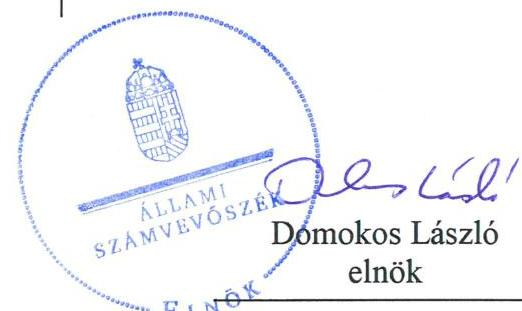
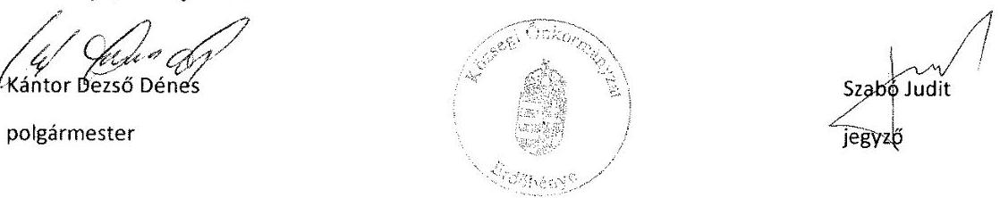
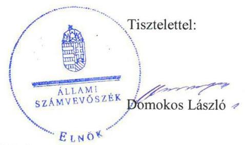
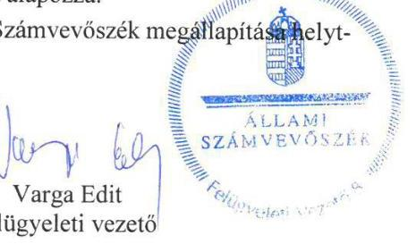
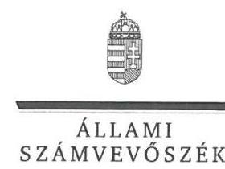
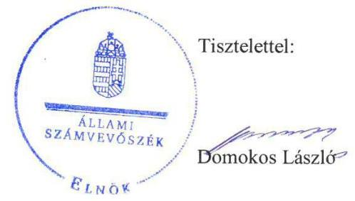
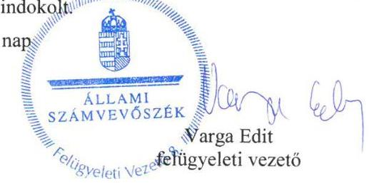

ÁLLAMI
SZÁMVEVŐSZÉK

# Jelentés 

## Önkormányzatok integritás- és belső kontrollrendszere

Az önkormányzatok belső kontrollrendszere kialakításának és múködtetésének ellenőrzése, Adósságrendezési eljárás ellenőrzése Erdőbénye Község Önkormányzata 2019.

19145
www.asz.hu

---

# Jelentés 

## Önkormányzatok integritás- és belső kontrollrendszere

Az önkormányzatok belső kontrollrendszere kialakításának és múködtetésének ellenőrzése, Adósságrendezési eljárás ellenőrzése Erdőbénye Község Önkormányzata
2019. 10. hó 25. nap

---

# AZ ELLENŐRZÉST FELÜGYELTE:

- VARGA EDIT felügyeleti vezető
- AZ ELLENŐRZÉST VEZETTE ÉS A VÉGREHAJTÁSÁÉRT FELELŐS:
  - BAJNAI ZSUZSANNA ellenőrzésvezető
  - A PROGRAM ÖSSZEÁLLÍTÁSÁÉRT FELELŐS:
    - TÓTPÁL SZABOLCS osztályvezető

**IKTATÓSZÁM:** EL-0358-012/2019.

**TÉMASZÁM:** 2444

**ELLENŐRZÉS-AZONOSÍTÓ SZÁM:** V078927, V082944

Jelentéseink az Országgyűlés számítógépes hálózatán és az Interneta a www.asz.hu címen is olvashatóak.

---

# TARTALOMJEGYZÉK 

■ ÖSSZEGZÉS ..... 5
■ AZ ELLENŐRZÉS CÉLJA ..... 6
■ AZ ELLENŐRZÉS TERÜLETE ..... 7
■ AZ ELLENŐRZÉS HÁTTERE, INDOKOLTSÁGA ..... 8
■ A JELENTÉS LÉNYEGES KÉRDÉSKÖREI ..... 9
■ AZ ELLENŐRZÉS HATÓKÖRE ÉS MÓDSZEREI ..... 10
■ MEGÁLLAPÍTÁSOK ..... 12
■ JAVASLATOK ..... 14
■ MELLÉKLETEK ..... 17
I. sz. melléklet: Értelmező szótár ..... 17
■ FÜGGELÉKEK ..... 19
I. sz. függelék a jelentéshez ..... 19
II. sz. függelék: Észrevételek ..... 21
■ RÖVIDÍTÉSEK JEGYZÉKE ..... 31

---

.

---

# ÖSSZEGZÉS 

Erdőbénye Község Önkormányzata belső kontrollrendszerének kialakítása és müködtetése, az adósságrendezési eljárás folyamata és végrehajtása nem volt szabályszerű, nem biztosították a közpénzfelhasználás szabályosságát és a nemzeti vagyonnal történő felelős gazdálkodást. A korrupciós veszélyek megelőzésére szolgáló integritás kontrollokat nem építették ki.

## Az ellenőrzés társadalmi indokoltsága

Az Állami Számvevőszék alapvető feladata a közpénzekkel, az állami és önkormányzati vagyonnal való gazdálkodás ellenőrzése. Az Alaptörvény szerint az önkormányzatok kötelezettsége a kiegyensúlyozott, átlátható és fenntartható költségvetési gazdálkodás elvének érvényesítése, a nemzeti vagyonnal való rendeltetésszerű és felelős módon történő gazdálkodás biztosítása. Az Állami Számvevőszék stratégiájában megfogalmazott célkitűzése az integritás alapú, átlátható és elszámoltatható közpénzfelhasználás elősegítése. Ennek megvalósítása érdekében az Állami Számvevőszék prioritásként kezeli az önkormányzatok gazdálkodásának ellenőrzését.

Erdőbénye Község Önkormányzatát az Állami Számvevőszék korábban nem ellenőrizte, kiválasztására pénzügyi helyzetével kapcsolatos kockázatokra tekintettel került sor.

## Főbb megállapítások, következtetések, javaslatok

Erdőbénye Község Önkormányzata belső kontrollrendszerének kialakítása és múködtetése nem volt szabályszerű. A kontrollkörnyezetnek, a múködés és a gazdálkodás kereteinek kialakítása nem volt szabályszerű, mert a gazdálkodási feladatokat ellátó Bodrogkisfaludi Közös Önkormányzati Hivatal nem rendelkezett szervezeti és múködési szabályzattal. Az integrált kockázatkezelési rendszert nem alakították ki, mivel nem gondoskodtak a szervezeti integritást sértő események kezelésének és az integrált kockázatkezelés eljárásrendjének szabályozásáról, továbbá nem mérték fel a szervezeti célokkal összefüggő kockázatokat. A gazdálkodási folyamatokhoz kapcsolódó kontrolltevékenységek szabálytalan gyakorlása miatt nem érvényesült a közpénzfelhasználás során a felelős gazdálkodás. Az információs és kommunikációs rendszer, a monitoring rendszer, illetve a belső ellenőrzés nem került kialakításra. Az integritás elvű működéshez szükséges kontrollok kiépítése elmaradt.

Erdőbénye Község Önkormányzatánál a jegyző az adósságrendezési eljárás szabályszerű végrehajtását nem biztosította.

A belső kontrollrendszer kialakítása és múködtetése során tapasztalt hiányosságok magukban hordozzák az újbóli eladósodás kockázatát.

Az Állami Számvevőszék a jelentésben foglalt megállapítások alapján Bodrogkisfaludi Közös Önkormányzati Hivatal jegyzője részére tizenegy, Erdőbénye Község Önkormányzata polgármestere részére két javaslatot fogalmazott meg. A javaslatokat megalapozó megállapításokra az érintetteknek 30 napon belül intézkedési tervet kell készíteniük.

---

# AZ ELLENŐRZÉS CÉLJA 

Az ellenőrzés célja annak értékelése volt, hogy az adósságrendezési eljárás megindítása, lefolytatása szabályszerű volt-e, az önkormányzat gazdálkodása az adósságrendezési eljárás alatt megfelelt-e a jogszabályi előírásoknak, a lefolytatott eljárás elérte-e a törvényben kitűzött célokat.

Az ellenőrzés célja továbbá annak megállapítása volt, hogy szabályszerűen történt-e az önkormányzat belső kontrollrendszerének kialakítása és működtetése, az biz-tosította-e az önkormányzatnál a közpénzfelhasználás szabályosságát, a közpénzekkel és a nemzeti vagyonnal történő szabályszerű és felelős gazdálkodást, a beszámolási és adatszolgáltatási kötelezettségek szabályszerű teljesítését. Az ellenőrzés keretében értékelte az ÁSZ ${ }^{1}$ az önkormányzat korrupciós kockázatainak kezelését szolgáló integritás kontrollok kiépítettségét és az integritás szemlélet érvényesülését.

---

# **AZ ELLENŐRZÉS TERÜLETE**

## **Erdőbénye Község Önkormányzata**

Erdőbénye Borsod-Abaúj-Zemplén megyében található, állandó lakosainak száma 2016. január 1-jén 1075 fő volt a Központi Statisztikai Hivatal Magyarország közigazgatási helynévkönyve adatai alapján.

Az Önkormányzat2 hét tagú képviselő-testületének3 munkáját három állandó bizottság segítette. A településen Roma Nemzetiségi Önkormányzat4 működött.

Az Önkormányzat gazdálkodási feladatainak ellátásáról 2012. december 31-ig a Hivatal5, 2013. január 1-től a Közös Hivatal6 gondoskodott.

A Közös Hivatal önálló szervezeti egységekre nem tagolódott, gazdasági szervezettel nem rendelkezett. A Közös Hivatalban foglalkoztatott köztisztviselők száma 2016. év végén hat fő volt.

A polgármester7 a 2006. évi önkormányzati választások óta tölti be tisztségét. A jegyző személyében változás történt az ellenőrzött időszakban, a jegyző8 2012. december 31-ig, a jegyző9 2013. január 1-től látta el feladatát.

Az Önkormányzat a 2016. évi költségvetési beszámolója szerint 287,6 millió Ft költségvetési bevételt ért el, valamint 253,9 millió Ft költségvetési kiadást teljesített, vagyonának értéke 2016. december 31-én 1274,9 millió Ft volt.

2012. november 15. és 2013. május 31. között adósságrendezés folyt az Önkormányzatnál, amelynek során a hitelezők 79,3 millió Ft összegben nyújtottak be követelést.

---

# AZ ELLENŐRZÉS HÁTTERE, INDOKOLTSÁGA 

A DEMOKRATIKUS TÁRSADALMAKBAN alapvető igény, hogy a közpénzeket, a közvagyont használók tevékenységükről elszámoljanak, ahhoz egyértelmű és érvényesíthető felelősségi szabályok társuljanak. Ennek a jogos igénynek az érvényesítéséhez meg kell teremteni azokat a folyamatokat, rendszereket, amelyek nélkülözhetetlenek az elszámoltatáshoz. Az elszámoltatás eredményes működtetéséhez szükség van a megfelelő információs, kontroll-, értékelési és beszámolási rendszerek kialakítására. A belső kontrollok kiépítettsége hozzájárul az integritási szemlélet kialakításához és érvényesüléséhez. A belső kontrollrendszer kialakítása és működtetése nélkül nem valósítható meg a közpénzek, a közvagyon szabályos, gazdaságos, hatékony és eredményes felhasználása.

A BELSŐ KONTROLLRENDSZER azt a célt szolgálja, hogy az államháztartás szervei működésük és gazdálkodásuk során a tevékenységeket szabályszerűen, gazdaságosan, hatékonyan, eredményesen hajtsák végre, teljesítsék elszámolási kötelezettségeiket, és megvédjék az erőforrásokat a veszteségektől, a károktól, a nem rendeltetésszerű használattól. A belső kontrollrendszer magában foglalja mindazon szabályokat, eljárásokat, gyakorlati módszereket és szervezeti struktúrákat, kockázatkezelési technikákat, kontrolltevékenységeket, amelyek segítséget nyújtanak a szervezetnek céljai eléréséhez.

A megfelelő belső kontrollrendszer jelentősen csökkenti a hibák és szabálytalanságok kockázatát. Az ÁSZ célja, hogy javuljon az ellenőrzött önkormányzatok belső kontrollrendszerének szabályozottsága, működésének megfelelősége, szabályszerűsége, hozzájárulva ezzel a pénzügyi egyensúlyi helyzet fenntarthatóságának biztosításához, biztosítva az önkormányzatnál a közpénzfelhasználás szabályosságát, a közpénzekkel és a nemzeti vagyonnal történő szabályszerű, gazdaságos, hatékony és eredményes gazdálkodást.

AZ ELLENŐRZÉS VÁRHATÓ HASZNOSULÁSA több szinten valósul meg. A törvényalkotás számára összegzett tapasztalatok állnak rendelkezésre a belső kontrollrendszer önkormányzati területen való kialakításáról, működtetéséről és hatásairól, az adósságrendezési eljárásról szóló törvény alkalmazásáról, a kitűzött célok megvalósulásáról. Az ellenőrzés az ellenőrzött számára visszajelzést ad az előírásoknak való megfelelés hiányosságairól, javaslataival hozzájárul azok kiküszöböléséhez. Az ellenőrzés megállapításait és javaslatait más szervezetek is hasznosíthatják a rendezett gazdálkodási keretek kialakításához. A ,jó gyakorlat" elterjesztésével azok az önkormányzatok is átvehetik a pozitív példákat, ahol nem végez ellenőrzést az ÁSZ.

Az ÁSZ ellenőrzései jelzik a társadalom számára, hogy közpénz nem maradhat ellenőrizetlenül, tevékenysége hozzájárul az értékteremtő rend kialakításához és megőrzéséhez.

---

# A JELENTÉS LÉNYEGES KÉRDÉSKÖREI 

1. Az Önkormányzat belső kontrollrendszerének kialakítása és müködtetése szabályszerű volt-e a 2016. évben?
2. Az adósságrendezési eljárás folyamata és végrehajtása szabályszerű volt-e?

---

# AZ ELLENŐRZÉS HATÓKÖRE ÉS MÓDSZEREI 

## Az ellenőrzés típusa

Megfelelőségi ellenőrzés.

## Az ellenőrzött időszak

Az ellenőrzött időszak a belső kontrollrendszer esetében a 2016. év, az adósságrendezési eljárás esetében 2011. január 1. - 2014. december 31. közötti időszak volt.

## Az ellenőrzés tárgya

A helyi önkormányzatnak, mint éves költségvetési beszámoló készítésére kötelezett szervezetnek és a gazdálkodási feladatait ellátó közös önkormányzati hivatalának belső kontrollrendszere, valamint az integritás szemlélet érvényesülése.

A Har. tv. ${ }^{10}$ által szabályozott adósságrendezési eljárás.
Az ellenőrzés kiterjedt minden olyan körülményre és adatra, amely az ÁSZ jogszabályban meghatározott feladatainak teljesítéséhez, valamint a program végrehajtása folyamán felmerült újabb összefüggések feltárásához szükséges volt.

## Az ellenőrzött szervezet

Erdőbénye Község Önkormányzata és a gazdálkodási feladatait ellátó Bodrogkisfaludi Közös Önkormányzati Hivatal.

## Az ellenőrzés jogalapja

Az ÁSZ tv. ${ }^{11}$ 5. § (2) bekezdése alapján az államháztartás gazdálkodásának ellenőrzése keretében az ÁSZ ellenőrzi a helyi önkormányzatok gazdálkodását, valamint az ÁSZ tv. 5. § (6) bekezdése alapján ellenőrzése során értékeli az államháztartás számviteli rendjének betartását és a belső kontrollrendszer múködését.

## Az ellenőrzés módszerei

Az ÁSZ az ellenőrzést az ellenőrzési program szempontjai, az ellenőrzött időszakban hatályos jogszabályok, az ellenőrzés szakmai szabályai, az egyes

---

ellenőrzési típusokhoz kapcsolódó ÁSZ módszertanok figyelembevételével végezte.

Az ellenőrzés ideje alatt az ÁSZ az Önkormányzattal a kapcsolattartást az ÁSZ SZMSZ ${ }^{12}$-ének vonatkozó előírásai alapján biztosította.

Az ellenőrzési kérdések megválaszolásához szükséges bizonyítékok megszerzése az Önkormányzat által rendelkezésre bocsátott dokumentumokra, adatokra alapozva megfigyelés, szemle (szemrevételezés), valamint elemző eljárás keretében történt.

Az ellenőrzési bizonyítékként felhasználható adatforrások közé tartoztak egyrészt az ellenőrzési program részletes szempontjainál felsorolt adatforrások, másrészt minden - az ellenőrzés folyamán feltárt, az ellenőrzés szempontjából információt tartalmazó - dokumentum.

Az Önkormányzat belső kontrollrendszere jogszabályi előírások szerinti kialakításának és működtetésének szabályszerűségét az erre irányuló ellenőrzési kérdésekre adott válaszok összesítése alapján, pillérenként (kontrollkörnyezet, kockázatkezelési rendszer, kontrolltevékenységek, információs és kommunikációs rendszer, monitoring rendszer) és összesítetten is értékelte az ÁSZ. Az önkormányzat belső kontrollrendszere egyes pilléreinek kialakítása és működtetése „szabályszerü", amennyiben az értékelt területen az elért igen válaszok százalékban kifejezett, egész számra kerekített aránya, meghaladja a $85 \%$-ot, ha nem haladja meg, akkor a minősítés „nem szabályszerű" lesz. Az önkormányzat belső kontrollrendszerének öszszesített értékelése megegyezik a pillérenként (kontrollterületenként) alkalmazott százalékos értékelésekkel. A kontrollrendszer egésze esetében a „szabályszerű" értékelésnek a százalékos értéken felül további feltétele, hogy egyik kontrollterület sem kaphat „nem szabályszerű" értékelést. Az összesített értékelés a százalékos értéktől függetlenül „nem szabályszerű", ha az ellenőrzött kontrollterületek közül több mint egynek „nem szabályszerű" az értékelése.

A kiadások teljesítéséhez kapcsolódó kontrolltevékenység gyakorlása, működtetésének szabályszerűsége esetében az ellenőrzés azokra a legnagyobb értékű tételekre - a lényeges sokaságra - terjedt ki, melyek összértéke eléri a teljes sokaság összértékének 50\%-át.

A lényeges sokaság tételes ellenőrzésére került sor.
„Szabályszerű" egy ellenőrzött terület, amennyiben 95\%-os bizonyossággal az ellenőrzött sokaságban az átlagos hibaarány legfeljebb 10\%, "nem szabályszerű", amennyiben 10\%-nál magasabb.

A közszféra integritás alapú kultúrájának kialakítása, megerősítése és működése szorosan összefügg a belső kontrollrendszer működésével, ezért az ellenőrzés kiterjedt annak értékelésére is, hogy a belső kontrollrendszer kialakítása és működtetése hogyan hatott az integritás szemlélet érvényesülésére.

Az adósságrendezési eljárás vonatkozásában amennyiben az önkormányzat működését és gazdálkodását alapvetően meghatározó dokumentum hiánya miatt, valamely lényeges kérdéskörre vonatkozóan az ÁSZ megállapítást tett, további ellenőrzési tevékenységek az adott kérdéskörrel és az azzal szoros logikai kapcsolatban lévő kérdéskörökkel - ráépülő jelleggel - nem kerültek végrehajtásra.

---

# 1. Az Önkormányzat belső kontrollrendszerének kialakítása és múködtetése szabályszerű volt-e a 2016. évben? 

Összegző megállapítás

A belső kontrollrendszer kialakítása és múködtetése a 2016. évben nem volt szabályszerű.

A KONTROLLKÖRNYEZET kialakítása nem volt szabályszerű, mert a Közös Hivatal nem rendelkezett a szervezetét, feladatai ellátásának részletes belső rendjét és módját megállapító szervezeti és múködési szabályzattal az Áht. ${ }^{13} 10 . \S$ (5) bekezdésében foglaltak ellenére, mivel a jegyző ${ }_{2}$ által elkészített Közös Hivatali SZMSZ-t ${ }^{14}$ az irányító szerv az Áht. 9. § b) pontjában foglalt hatáskörében nem hagyta jóvá.

A jegyző ${ }_{2}$ nem rögzítette az Önkormányzat Számviteli politikájában ${ }^{15}$ a Számv. tv. ${ }^{16}$ 14. § (4) bekezdésében foglaltak ellenére azokat a gazdálkodóra jellemző szabályokat, előírásokat, módszereket, amelyekkel meghatározza, hogy mit tekint a számviteli elszámolás szempontjából kivételes nagyságú vagy előfordulású bevételnek, költségnek, ráfordításnak.

A jegyző ${ }_{2}$ nem rendezte belső szabályzatban az Ávr. ${ }^{17}$ 13. § (2) bekezdés a) pontjában előírtak ellenére az Önkormányzatra vonatkozóan a kötelezettségvállalás, ellenjegyzés, teljesítés igazolása, érvényesítés, utalványozás gyakorlásának módjával, eljárási és dokumentációs részletszabályaival, valamint az ezeket végző személyek kijelölésének rendjével kapcsolatos feladatokat.

KOCKÁZATKEZELÉSI RENDSZERT 2016. szeptember 30ig, illetve az integrált kockázatkezelési rendszert 2016. október 1-jétől a jegyző ${ }_{2}$ nem alakított ki a Bkr. ${ }^{18}$ 3. § b) pontjában foglaltak ellenére a Közös Hivatalnál, mert nem szabályozta 2016. szeptember 30-ig a szabálytalanságok kezelésének, 2016. október 1-jétől a szervezeti integritást sértő események kezelésének és az integrált kockázatkezelésnek az eljárásrendjét a Bkr. 6. § (4) bekezdésében előírtak ellenére. Továbbá a jegyző ${ }_{2}$ nem mérte fel és nem állapította meg a Bkr. 7. § (2) bekezdésében foglaltak ellenére 2016. szeptember 30-ig a Közös Hivatal tevékenységében, gazdálkodásában rejlő kockázatokat, 2016. október 1-jétől a Közös Hivatal tevékenységében rejlő és szervezeti célokkal összefüggő kockázatokat.

A KONTROLLTEVÉKENYSÉGEK gyakorlása nem felelt meg a jogszabályi előírásoknak. Az önkormányzati kiadási előirányzatok terhére teljesített kifizetések nem szabályszerűen történtek, mivel azokra nem vállaltak írásban kötelezettséget az Áht. 37. § (1) bekezdésében foglaltak ellenére, továbbá a polgármester a teljesítésigazolást nem végezte el az Ávr. 57. § (1) bekezdésének előírása ellenére.

AZ INFORMÁCIÓS ÉS KOMMUNIKÁCIÓS RENDSZER kialakítása nem volt szabályszerű, mert a jegyző ${ }_{2}$ nem adott ki a

---

Közös Hivatalra vonatkozó iratkezelési szabályzatot az Ltv. ${ }^{19}$ 10. § (1) bekezdés c) pontjában foglaltak ellenére. A polgármester nem készítette el az Önkormányzat, a jegyző ${ }_{2}$ a Közös Hivatal adatvédelmi és adatbiztonsági szabályzatát az Info tv. ${ }^{20}$ 24. § (3) bekezdésének előírása ellenére.

A MONITORING RENDSZERT a jegyző ${ }_{2}$ nem alakította ki a Bkr. 10. § előírása ellenére. A jegyző ${ }_{2}$ nem gondoskodott az Áht. 70. § (1) bekezdésében foglaltak ellenére a belső ellenőrzés kialakításáról, továbbá nem alakította ki a Közös Hivatalnál a Bkr. 10. § előírása szerinti operatív tevékenységek keretében megvalósuló folyamatos és eseti nyomon követést. A jegyző ${ }_{2}$ az Áht. 6/C. § (2) bekezdés b) pontjában és az Együttműködési Megállapodás ${ }^{21} 9$. pontjában foglaltak ellenére nem gondoskodott a Roma Nemzetiségi Önkormányzat belső ellenőrzéséről sem.

A belső kontrollrendszer minőségét a jegyző ${ }_{2}$ nem értékelte a Bkr. 11. § (1) bekezdése ellenére a Közös Hivatalra vonatkozóan.

AZ INTEGRITÁS nem érvényesült az Önkormányzatnál az előírt kontrollok és a kockázatkezelés kialakításának hiánya miatt.

# 2. Az adósságrendezési eljárás folyamata és végrehajtása szabályszerű volt-e? 

Összegző megállapítás

Az adósságrendezési eljárás folyamata, végrehajtása nem volt szabályszerű.

AZ ADÓSSÁGRENDEZÉSI ELJÁRÁS folyamata és végrehajtása nem volt szabályszerű, mert a jegyző ${ }_{1,2}$ :
— az Önkormányzat vonatkozásában nem rendezte belső szabályzatban az Ámr. ${ }^{22}$ 20. § (3) bekezdés a) pontjában, az Ávr. 13. § (2) bekezdés a) pontjában előírtak ellenére a kötelezettségvállalás, ellenjegyzés, teljesítés igazolása, érvényesítés, utalványozás gyakorlásának módjával, eljárási és dokumentációs részletszabályaival, valamint az ezeket végző személyek kijelölésének rendjével kapcsolatos feladatokat 2011. január 1. és 2014. december 31. között;
— az Önkormányzat vonatkozásában a Htv. ${ }^{23}$ 140. § (1) bekezdés f) pontja szerinti feladatkörében eljárva nem gondoskodott az Ámr. 80. § (3) bekezdésében, az Ávr. 60. § (3) bekezdésében foglaltak ellenére a kötelezettségvállalásra, pénzügyi ellenjegyzésre, teljesítés igazolására, érvényesítésre, utalványozásra jogosult személyekről és aláírás-mintájukról naprakész nyilvántartás vezetéséről 2011. január 1. és 2014. december 31. között;
— a Htv. 140. § (1) bekezdés h) pontja szerinti feladatkörében eljárva a jegyző ${ }_{1}$ nem készíttetett a beszámoló elkészítését megelőzően a könyvviteli zárlat során főkönyvi kivonatot a 2011. évben az Áhsz. ${ }^{24}$ 50. § (1) bekezdésében, valamint a jegyző ${ }_{2}$ a 2014. évben az Áhsz. ${ }^{25}$ 5. § (1) bekezdésében foglaltak ellenére, így az érintett évek éves költségvetési beszámolói nem voltak alátámasztottak, ezáltal sérült a Számv. tv. 15. § (3) bekezdésében foglalt valódiság elve.

---

# JAVASLATOK 

Az ÁSZ tv. 33. § (1) bekezdésében foglaltak értelmében az ellenőrzött szervezet vezetője köteles a jelentésben foglalt megállapításokhoz kapcsolódó intézkedési tervet összeállítani és azt a jelentés kézhezvételétől számított 30 napon belül az ÁSZ részére megküldeni. Amennyiben az ellenőrzött szervezet vezetője nem küldi meg határidőben az intézkedési tervet, vagy továbbra sem elfogadható intézkedési tervet küld, az Állami Számvevőszék elnöke az ÁSZ tv. 33. § (3) bekezdése a) és b) pontjaiban foglaltakat érvényesítheti.

## Bodrogkisfaludi Közös Önkormányzati Hivatal jegyzőjének

1. Az Önkormányzat szabályszerű kontrollkörnyezetének kialakítása érdekében gondoskodjon:
a) a Közös Hivatal feladatai ellátásának részletes belső rendjének és módjának szervezeti és müködési szabályzatában történő megállapításáról;
(1. sz. megállapítás 1. bekezdése alapján)
b) az Önkormányzat jogszabályi előirásoknak megfelelő tartalmú számviteli politikájának kialakításáról;
(1. sz. megállapítás 2. bekezdése alapján)
c) az Ávr. előírásainak megfelelően a tervezéssel, gazdálkodással kapcsolatos belső előírások, feltételek belső szabályzatban történő rendezéséről.
(1. sz. megállapítás 3. bekezdése alapján)
2. Az Önkormányzat szabályszerű kockázatkezelési rendszerének kialakítása és müködtetése érdekében gondoskodjon:
a) szervezeti integritást sértő események kezelésének, valamint az integrált kockázatkezelés eljárásrendjének szabályozásáról a Közös Hivatal tekintetében;
(1. sz. megállapítás 4. bekezdés 1. mondata alapján)
b) a Közös Hivatal tevékenységében rejlő és szervezeti célokkal öszszefüggő kockázatok felméréséről és megállapításáról.
(1. sz. megállapítás 4. bekezdés 2. mondata alapján)

---

3. Az információs és kommunikációs rendszer szabályszerű kialakítása és müködtetése érdekében gondoskodjon a Közös Hivatal:
a) iratkezelési szabályzatának a Magyar Nemzeti Levéltárral és a megyei kormányhivatallal egyetértésben történő kiadásáról;
(1. sz. megállapítás 6. bekezdés 1. mondata alapján)
b) adatvédelmi és adatbiztonsági szabályzatának megalkotásáról.
(1. sz. megállapítás 6. bekezdés 2. mondata alapján)
4. Intézkedjen a Közös Hivatalnál a monitoring rendszer kialakítására és müködtetésére.
(1. sz. megállapítás 7. bekezdés 1. mondata alapján)
5. Intézkedjen a Közös Hivatalnál a jogszabályi előírásoknak megfelelő belső ellenőrzés kialakítására és müködtetésére.
(1. sz. megállapítás 7. bekezdés 2. mondata alapján)
6. Gondoskodjon a Roma Nemzetiségi Önkormányzat jogszabályoknak megfelelő belső ellenőrzésének kialakításáról és müködtetéséről.
(1. sz. megállapítás 7. bekezdése 3. mondata alapján)
7. Gondoskodjon a Közös Hivatalra vonatkozó belső kontrollrendszer minősége jogszabályi előírásnak megfelelő értékeléséről.
(1. sz. megállapítás 8. bekezdése alapján)

# Erdőbénye Község Önkormányzata polgármesterének 

1. A jogszabályi előírásoknak megfelelően gondoskodjon a kötelezettségvállalási és a teljesítés igazolási jogkörök gyakorlásáról.
(1.sz. megállapítás 5. bekezdés alapján)
2. Gondoskodjon az Önkormányzat adatvédelmi és adatbiztonsági szabályzatának megalkotásáról.
(1. sz. megállapítás 7. bekezdés 2. mondata alapján)

---

.

---

# MELLÉKLETEK 

- I. SZ. MELLÉKLET: ÉRTELMEZŐ SZÓTÁR
adósságrendezés
adósságrendezési eljárás
belső ellenőrzés
belső kontrollrendszer
belső kontrollrendszer pillérei, kontrollterületei
helyi önkormányzat

Az adósságrendezési eljárás azon szakasza, amely a bíróság adósságrendezést megindító végzésének Cégközlönyben való közzétételével (10. § (1) bekezdés) kezdődik és az adósságrendezési eljárás befejezését elrendelő bírósági végzés Cégközlönyben való közzétételének napjáig tart. Amennyiben a felek egyezséget kötnek, az adósságrendezés befejeződik, ellenkező esetben a vagyon bíróság általi felosztására kerül sor.
(Forrás: Har. tv. 2.§ b) pontja és 32. § (6) bekezdése)
A helyi önkormányzat székhelye szerint illetékes törvényszék (2011. XII. 31.ig a fővárosi, megyei bíróságok) hatáskörébe tartozó nemperes eljárás, amely a helyi önkormányzatok fizetőképességének helyreállítására irányul. Adósságrendezési eljáráson az az eljárási rend értendő, amely a megindításra irányuló kérelem bírósághoz érkezésével kezdődik, és az eljárás jogerős befejezéséig tart. (Forrás: Har. tv. 3. § (1) bekezdése
Független, tárgyilagos bizonyosságot adó és tanácsadó tevékenység, amelynek célja, hogy az ellenőrzött szervezet működését fejlessze és eredményességét növelje, az ellenőrzött szervezet céljai elérése érdekében rendszerszemléletű megközelítéssel és módszeresen értékeli, illetve fejleszti az ellenőrzött szervezet irányítási és belső kontrollrendszerének hatékonyságát. (Forrás: Bkr. 2. § b) pontja)
A belső kontrollrendszer a kockázatok kezelése és tárgyilagos bizonyosság megszerzése érdekében kialakított folyamatrendszer, amely azt a célt szolgálja, hogy a múködés és gazdálkodás során a tevékenységeket szabályszerűen, gazdaságosan, hatékonyan, eredményesen hajtsák végre, az elszámolási kötelezettségeket teljesítsék, megvédjék az erőforrásokat a veszteségektől, károktól és nem rendeltetésszerű használattól. (Forrás: Áht. 69. § (1) bekezdése)
A kontrollkörnyezet, az (integrált) kockázatkezelési rendszer, a kontrolltevékenységek, az információs és kommunikációs rendszer, valamint a nyomon követési (monitoring) rendszer. (Forrás: Bkr. 3. §-a)
A helyi önkormányzat jogi személy. Az önkormányzati feladatok ellátását a képviselő-testület és szervei biztosítják. A képviselő-testület szervei: a polgármester, a főpolgármester, a megyei közgyűlés elnöke, a képviselő-testület bizottságai, a részönkormányzat testülete, az önkormányzati hivatal, a megyei önkormányzati hivatal, a közös önkormányzati hivatal, a jegyző, továbbá a társulás. A képviselő-testület a feladatkörébe tartozó közszolgáltatások ellátására - jogszabályban meghatározottak szerint - költségvetési szervet, a polgári perrendtartásról szóló törvény szerinti gazdálkodó szervezetet (a továbbiakban: gazdálkodó szervezet), nonprofit szervezetet és egyéb szervezetet (a továbbiakban együtt: intézmény) alapíthat, továbbá szerződést köthet természetes és jogi személlyel vagy jogi személyiséggel nem rendelkező szervezettel. A helyi önkormányzat éves költségvetési beszámolója magában foglalja a helyi önkormányzat - nem költségvetési szerveihez tartozó - feladataihoz kapcsolódó bevételeket és kiadásokat. A helyi önkormányzat összevont (konszolidált) költségvetési beszámolóját a helyi önkormányzatra és költségvetési szerveire vonatkozóan külön-külön beérkezett éves költségvetési beszámolók alapján a Kincstár készíti el és küldi meg az önkormányzatnak.

---

információs és kommunikációs rendszer
integrált kockázatkezelési rendszer
integritás
kockázatkezelési rendszer
kontrollkörnyezet
kontrolltevékenységek
költségvetési szerv vezetője (Bkr. alkalmazásában)
közös önkormányzati hivatal
monitoring rendszer
(Forrás: Mötv. 41. § (1), (2), (6) bekezdései; Áhsz. 2. § (1) bekezdése, 6. § (1) bekezdés a) és f) pontja, 30. §-a, 37. § (1) és (6) bekezdése)
A költségvetési szerv vezetője által kialakított és müködtetett olyan rendszer, mely biztosítja, hogy a megfelelő információk a megfelelő időben eljutnak az illetékes szervezethez, szervezeti egységhez, illetve személyhez. (Forrás: Bkr. 9. § (1) bekezdés)
olyan folyamatalapú kockázatkezelési rendszer, amely a szervezet minden tevékenységére kiterjed, egységes módszertan és eljárások alkalmazásával, a szervezet célkitűzéseinek és értékeinek figyelembevételével biztosítja a szervezet kockázatainak teljes körű azonosítását, azok meghatározott kritériumok szerinti értékelését, valamint a kockázatok kezelésére vonatkozó intézkedési terv elkészítését és az abban foglaltak nyomon követését (Forrás: Bkr. 2. § m) pontja 2016. október 1-jétől)

Az integritás elvek, értékek, cselekvések, módszerek, intézkedések konzisztenciáját jelenti: olyan magatartásmódot, amely meghatározott értékeknek felel meg. Az integritás a közszféra esetében a társadalom által elvárt nyilvánossági, átláthatósági, illetve jogi/etikai normáknak történő megfelelést jelenti.
(Forrás: a http://integritas.asz.hu honlapon közzétett „A 2012. évi integritás felmérés eredményeinek összefoglalója" című dokumentum 3. oldal 1. bekezdése)
Olyan irányítási eszközök és módszerek összessége, melynek elemei a szervezeti célok elérését veszélyeztető tényezők (kockázatok) azonosítása, elemzése, csoportosítása, nyomon követése, valamint szükség esetén a kockázati kitettség mérséklése. (Forrás: Bkr. 2. § m) pontja 2016. szeptember 30-ig)
A költségvetési szerv vezetője által kialakított olyan elvek, eljárások, belső szabályzatok összessége, amelyben világos a szervezeti struktúra, egyértelműek a felelősségi, hatásköri viszonyok és feladatok, meghatározottak az etikai elvárások a szervezet minden szintjén, átlátható a humánerőforrás-kezelés. (Forrás: Bkr. 6. § (1) bekezdés)
A költségvetési szerv vezetője által a szervezeten belül kialakított (kontroll) tevékenységek, melyek biztosítják a kockázatok kezelését, hozzájárulnak a szervezet céljainak eléréséhez. (Forrás: Bkr. 8. § (1) bekezdés)
Helyi önkormányzat esetén a jegyző, főjegyző, társulás esetén a társulási megállapodásban meghatározott önkormányzat jegyzője. (Forrás: Bkr. 2. § n) pont nb) alpont)
települési képviselő-testület más települési képviselő-testülettel társult kép-viselő-testületet alakíthat, amely esetén a képviselő-testületek részben vagy egészben egyesítik a költségvetésüket, közös önkormányzati hivatalt tartanak fenn, és intézményeiket közösen működtetik. (Forrás: Mötv. 56. § (1)-(2) bekezdései)
nyomon követési rendszer (monitoring) a szervezet tevékenységének, a célok megvalósításának nyomon követését biztosító rendszer, mely az operatív tevékenységek keretében megvalósuló folyamatos és eseti nyomon követésből, valamint az operatív tevékenységektől függetlenül működő belső ellenőrzésből áll (Forrás: Bkr. 10. §-a)

---

# FÜGGELÉKEK 

- I. SZ. FÜGGELÉK A JELENTÉSHEZ

Az Állami Számvevőszék az ellenőrzések során feltárt tényekhez kapcsolódó további körülmények tisztázására eszközrendszerrel nem rendelkezik. Amennyiben az ellenőrzésen túlmutatóan indokoltnak látszik az ellenőrzés során feltárt tények, összefüggések további vizsgálata, az Állami Számvevőszék törvényi felhatalmazás alapján az ellenőrzés során feltárt tényeket, körülményeket továbbítja a hatáskörrel rendelkező szervnek a szükséges intézkedések megtétele, eljárások lefolytatása érdekében.
I.

Az Önkormányzat éves költségvetési beszámolói alátámasztásához nem készült záró fökönyvi kivonat az Áhsz. 1 50. § (1) bekezdésében foglaltak ellenére a 2011. évi-, az Áhsz. 2 5. § (1) bekezdésében előírtak ellenére a 2014. évi beszámolóhoz.

A fökönyvi kivonatok hiányában az Önkormányzat beszámolójában kimutatott adatok pontossága, hitelessége nem igazolt.
A fökönyvi kivonatok hiánya miatt a 2011. és a 2014. években az Önkormányzat vagyoni helyzete nem volt áttekinthető.
Az eset konkrét körülményeinek feltárására az ügyészség rendelkezik hatáskörrel.
II.

Az Állami Számvevőszék törvényi felhatalmazás alapján az alábbi, ellenőrzés során feltárt tényeket, körülményeket már továbbította a hatáskörrel rendelkező szerveknek a szükséges intézkedések megtétele, eljárások lefolytatása érdekében:

1. Az Önkormányzatnál nem alakították ki az Áht. 70. § (1) bekezdésének előirása ellenére a Közös Hivatal belső ellenőrzését és az Áht. 6/C. § (2) bekezdés b) pontja szerinti feladatokat is figyelembe véve a Roma Nemzetiségi Önkormányzatnál a 2016. évben.
A belső ellenőrzés hiányában nem volt biztositott a jogszabályoknak megfelelő müködés.
A feltárt hiányosságok kockázatot jelentenek Erdőbénye és Bodrogkisfalud községeken túl Szegilong település gazdálkodási feladatainak ellátására.
2. Az Önkormányzat 2016. évi dologi és felhalmozási kiadásai vonatkozásában az Áht. 37. § (1) bekezdésében foglalt előirások ellenére nem rendelkezett kötelezettségvállalással mindösszesen 3566500 Ft kiadásra vonatkozóan.

---

3. A 2016. évben a kiadások összegéből 2277500 Ft esetében nem rendelkezett az Ávr. 57. § (1) bekezdése ellenére teljesítésigazolással, 1289000 Ft esetében a teljesítésigazolás nem felelt meg az Ávr. 57. § (1) bekezdésében foglaltaknak, mert a teljesítésigazoló ellenőrizhető okmányok hiányában nem ellenőrizte a kiadások teljesítésének jogosságát, összegszerüségét, valamint az ellenszolgáltatás teljesitését.
A szabálytalan kifizetések miatt nem igazolt, hogy a kiadások valóban az Önkormányzat érdekében merültek fel, illetve annak feladatellátását szolgálták, így nem zárható ki annak lehetősége, hogy azok vagyoni hátrányt okozhattak az Önkormányzatnak.
III.

Az Állami Számvevőszék a szabálytalanságok ismétlődésére tekintettel az ellenőrzés során feltárt tényeket, körülményeket továbbítja a kormányhivatal részére.

---

A jelentéstervezetet a Számvevőszék 15 napos észrevételezésre megküldte az ellenőrzött szervezetek vezetőinek az ÁSZ tv. 29. §* (1) bekezdése előírásának megfelelően.

Az ÁSZ a jelentéstervezetet észrevételezésre megküldte Erdőbénye Község Önkormányzata polgármestere és a Bodrogkisfaludi Közös Önkormányzati Hivatal jegyzője részére.
Erdőbénye Község Önkormányzata polgármestere és a Bodrogkisfaludi Közös Önkormányzati Hivatal jegyzője az ÁSZ tv. 29. § (2) bekezdésében foglalt észrevételezési jogukkal éltek, a jelentéstervezet megállapításaira a törvényes határidőn belül észrevételt tettek.
Erdőbénye Község Önkormányzata polgármesterének és a Bodrogkisfaludi Közös Önkormányzati Hivatal jegyzőjének a jelentéstervezet megállapításaira tett észrevételeit és az azokra adott választ a függelék tartalmazza.

[^0]
[^0]:    * 29. § (1) Az Állami Számvevőszék az ellenőrzési megállapításait megküldi az ellenőrzött szervezet vezetőjének vagy az általa megbízott személynek, és annak, akinek személyes felelősségét állapította meg.
    (2) Az ellenőrzött szervezet vezetője és a felelősként megjelölt személy az ellenőrzés megállapításaira tizenöt napon belül írásban észrevételt tehet.
    (3) Az Állami Számvevőszék az észrevételre a beérkezésétől számított harminc napon belül írásban válaszol. A figyelembe nem vett észrevételeket köteles a jelentésben feltüntetni, és megindokolni, hogy azokat miért nem fogadta el.

---

# Erdőbénye Község Önkormányzata 

3932. Erdőbénye, Kossuth u. 31. ÁLLAMI SZÁMVLYÖSZÉK Tel/Fax: 0647/336-003
Tel./Fax: 0647/336-003
20190723
E-mail: polghiv@erdobenye.hu, 0647/336-003/2019

Szám: Eb/825/2019
Hiv.szám: EL-0646-072/2019
Tárgy: ellenőrzéssel kapcsolatos észrevétel

## Állami Számvevőszék

Varga Edit felügyelei vezető

## Bajnai Zsuzsanna ellenőrzést vezető

Budapest, Apáczai Csere János u. 10.

## Tisztelt Cím!

Az állami Számvevőszék által készített Erdőbénye Község Önkormányzata címmel készített számvevőszéki jelentéstervezethez az alábbi észrevételt kívánom tenni:
I. - 2011. és 2014. évben is készült december 31. nappal főkönyvi kivonat, hisz abból készült a beszámoló, 2011-ben a TATIGAZ, 2014-ben a DOKK programot használta az önkormányzat. A bekért dokumentumok között nem szerepelt a 2011. évi záró főkönyvi kivonat és a 2014. évi záró főkönyvi kivonat, az adósságrendezés elindítására és befejezésére vonatkoztak a bekért dokumentumok. Az adósságrendezés 2012-ben indult el, és 2013-ban fejeződött be, ezen évekre vonatkozó záró főkönyvi kivonatot be is küldtük a bekért dokumentumok között.

- Az adósságrendezési eljárás folyamatában a csatolt pénzgazdálkodással kapcsolatos kötelezettségvállalás, utalványozás, érvényesíts és ellenjegyzési hatásköri rend volt alkalmazva.
- Erdőbénye Roma Nemzetiségi Önkormányzat megszűnt 2018. szeptember 02-án.
II. - Az Önkormányzat 2016 évi dologi és felhalmozási kiadásai vonatkozásában 3.556.500. Forint kiadásra vonatkozóan rendelkezett kötelezettségvállalással és teljesítés igazolással, ugyanis az S/93/1 számú, és S/90/5 számú utalványrendeleteken a teljesítést igazoló és a kötelezettségvállaló a polgármester aláírása szerepel. A pénzügyi ellenjegyző pedig a jegyző, az aláírása szintén szerepel az utalványrendeleten.
- Továbbá Erdőbénye Község Önkormányzatának Hatósági Szerződése van a Borsod-AbaújZemplén Megyei Kormányhivatal Tokaji Járási Hivatal Munkaügyi Kirendeltségével START Mezőgazdasági programra, melyben szerepel az állatállomány gyarapítása, melynek a kiadását finanszírozták. 24/2016 számú kötelezettségvállalás START Varroda Mintaprogramban az Önkormányzat kötelezettséget vállalt készlet beszerzésre, szabvány vásárlásra, melynek eleget is tettünk, és ezen kiadás is támogatásra került (félkész termék vásárlása).

---

- Adásvételi szerződés is a rendelkezésünkre áll, melyet Erdőbénye Község Önkormányzat részéről mint megrendelő és kötelezettséget vállaló Kántor Dezső Dénes polgármester, a szállító a „Pro-Team" Rehabilitációs Közhasznú Nonprofit Kft., képviseli Kerekes András ügyvezető. A fenti kiadásokra a kötelezettségvállalás tehát meg volt a fedezet. A Foglalkoztatási Osztály leigazolta, és a támogatást megküldte utófinanszirozás keretében az Önkormányzat részére. Kötelezettségvállalás száma 34/2016. A hatósági szerződésekben foglaltaknak így tett eleget az Önkormányzat, tehát a kiadást megfinanszírozták a hatósági szerződés alapján.

Levelünkhöz mellékeljük a 2011. évi záró főkönyvi kivonatot, a 2014. évi záró főkönyvi kivonatot, az Erdőbényei Roma Nemzetiségi Önkormányzat megszűnéséről a törzskönyvi kivonat másolatát, valamint a Bodrogkisfaludi Közös Önkormányzati Hivatal Szervezeti és múködési szabályzatának másolatát.

Az adósságrendezési eljárás során Önkormányzatunknál kirendelt pénzügyi gondnok utasításai szerint jártunk el.

Kérem a fentiek alapján legyenek szívesek a jelentéstervezetüket átgondolni.

Erdőbénye, 2019. július 17.

---

ELNÖK

Ikt.szám: EL-0646-084/2019.

# Kántor Dezső Dénes úr 

polgármester
Erdőbénye Község Önkormányzata

## Erdőbénye

## Tisztelt Polgármester Úr!

Az „Önkormányzatok integritás- és belső kontrollrendszere - Az önkormányzatok belső kontrollrendszere kialakításának és müködtetésének ellenörzése. Adósságrendezési eljárás ellenörzése - Erdőbénye Község Önkormányzata" címmel készített számvevőszéki jelentéstervezetre tett észrevételét köszönettel megkaptam.
Az Állami Számvevőszék észrevételre vonatkozó álláspontjáról a felügyeleti vezető által készített részletes tájékoztatást csatoltan megküldőm.
Tájékoztatom Polgármester urat, hogy a számvevőszéki jelentésben - az Állami Számvevőszékről szóló 2011. évi LXVI. törvény 29. § (3) bekezdése alapján - a figyelembe nem vett észrevételeket szerepeltetjük, annak indoklásával, hogy azokat az Állami Számvevőszék miért nem fogadta el.

Budapest, 2019. 06 hó 11 nap

Melléklet: Tájékoztatás az észrevételek kezeléséről

---

# Tájékoztatás az észrevételek kezeléséről 

Az „Önkormányzatok integritás- és belsö kontrollrendszere - Az önkormányzatok belsö kontrollrendszere kialakításának és müködtetésének ellenörzése, Adósságrendezési eljárás ellenörzése - Erdöbénye Község Önkormányzata" címủ jelentéstervezetre a 2019. július 17-én kelt, $\mathrm{Eb} / 825 / 2019$ számú levelében tett észrevételét áttekintettük, annak kezeléséről az alábbi tájékoztatást adom.

## 1. Az észrevétele I. pontja 1. francia bekezdése kapcsán

Észrevételében jelezte, hogy „2011. és 2014. évben is készült december 31. nappal fökönyvi kivonat, hisz abból készült a beszámoló ... A bekért dokumentumok között nem szerepelt a 2011. évi záró fökönyvi kivonat és a 2014. évi záró fökönyvi kivonat ...".
Az EL-0646-031/2018. iktatószámú, 2018. július 02-án kelt levél 3. számú mellékletében tájékoztatást adtunk az Önök részére, hogy az Önkormányzatok ellenőrzése - Önkormányzati adósságrendezési modul esetén „Az ellenörzött időszak 2010. január 1. és 2017. június 30. közötti idöszakon belül, az adósságrendezési eljárást megelőző egy teljes év január 1-jétl, az adósságrendezési eljárással érintett év (évek) és az adósságrendezési eljárás lezártát követő beszámolóval lezárt egy teljes év december 31-éig (amennyiben az egy teljes év nem telt le, akkor legkésőbb 2017. június 30 -áig) tart.". Mindezt tartalmazta az EL-1077-021/2019. iktatószámú, 2019. március 11-én kelt kiértesítő levél mellékleteként megküldött EL-0806-001/2018. iktatószámú ellenőrzési program is. A fentiek alapján Erdőbénye Község Önkormányzata esetén az ellenőrzött időszak - a 2012. és 2013. évek között lefolytatott adósságrendezési eljárásra tekintettel 2011. január 1. - 2014. december 31. közötti időszak volt.

Fent hivatkozott EL-0646-031/2018. iktatószámú, 2018. július 02-án kelt levél 3. számú melléklete 1. pontja „Alap dokumentumok", 1.3. alpontja tartalmazta az „Év végi beszámolót alátámasztó - könyvelési rendszerböl elöállitott - teljes (záró) fökönyvi kivonat" dokumentumra vonatkozó adatbekérést, amelynek teljesítéseként a 2011. január 1. - 2014. december 31. közötti időszak, mint ellenőrzési időszakra tekintettel a 2011-2014. évi záró főkönyvi kivonatok ÁSZ részére való megküldése vált szükségessé.
A beérkezett dokumentumok áttekintését követően megállapítható, hogy a 2011. és 2014. évi fökönyvi kivonat nem került megküldésre az ÁSZ részére, amelyet az ellenőrzés rendelkezésére bocsátott, 2018. szeptember 27-én kiállított teljességi és hitelességi nyilatkozata is alátámaszt. Mindezek alapján az észrevételt nem fogadjuk el, az Állami Számvevőszék megállapítása helytálló, a jelentéstervezet módosítása nem indokolt.

## 2. Az észrevétele I. pontja 2. francia bekezdése kapcsán

Észrevételében jelezte, hogy „Az adósságrendezési eljárás folyamatában a csatolt pénzgazdálkodással kapcsolatos kötelezettségvállalás, utalványozás, érvényesités és ellenjegyzési hatásköri rend volt alkalmazva."
Az Állami Számvevőszékről szóló 2011. évi LXVI. törvény 28. § (2) bekezdésének megfelelően „A közremüködésre felhivott szervezet az Állami Számvevőszék részére - annak kérésére soron kivül, de legkésőbb öt munkanapon belül - az ellenőrzés tervezhetősége, meghatározása, illetve lefolytatása érdekében szükséges adatokat és dokumentumokat rendelkezésre bocsátja, illetve a kapcsolódó tájékoztatást köteles megadni."

---

Az Állami Számvevőszék a megállapításait az ÁSZ tv. 28. § (2) bekezdésének megfelelően, az adatbekérés során, határidőben megküldött dokumentumokra alapozza.
Az EL-0646-031/2018. iktatószámú, 2018. július 02-án kelt levél 3. számú melléklete 1. pontja „Alap dokumentumok", 1.2. alpontja alapján teljesített adatszolgáltatás során Erdőbénye Község Önkormányzata vonatkozásában nem került megküldésre az ÁSZ részére az államháztartás müködési rendjéről szóló 292/2009. (XII. 19.) Korm. rendelet 20. § (3) bekezdés a) pontjában, valamint az államháztartásról szóló törvény végrehajtásáról szóló 368/2011. (XII. 31.) Korm. rendelet 13. § (2) bekezdés a) pontjában előírtaknak megfelelő, a kötelezettségvállalás, ellenjegyzés, teljesítés igazolása, érvényesítés, utalványozás gyakorlásának módjával, eljárási és dokumentációs részletszabályaival, valamint az ezeket végző személyek kijelölésének rendjével kapcsolatos feladatokat rendező belső szabályzat a 2011. január 1. és 2014. december 31. közötti időszak vonatkozásában.
Mindezek alapján az észrevételt nem fogadjuk el, az Állami Számvevőszék megállapítása helytálló, a jelentéstervezet módosítása nem indokolt.

# 3. Az észrevétele I. pontja 3. francia bekezdése kapcsán 

Észrevétele a jelentéstervezet megállapításait nem cáfolta, így az észrevételében foglaltak alapján a jelentéstervezet módosítása nem indokolt.

## 4. Az észrevétele II. pontja 1. francia bekezdése kapcsán

Az EL-0646-042/2019. iktatószámú, 2018. július 20-án kelt levél 3. számú melléklete tartalmazta az ellenőrzésre kiválasztott mintatételek jegyzékét, amelynek megfelelően megküldésre kerültek az S/93/1 számú, illetve S/90/5 számú kiadási utalványok. A megküldött dokumentumok ismételt áttekintését követően megállapítható, hogy a megküldött kiadási utalványok a kötelezettségvállaló aláírását nem tartalmazzák.
Mindezek alapján az észrevételt nem fogadjuk el, az Állami Számvevőszék megállapítása helytálló, a jelentéstervezet módosítása nem indokolt.

## 5. Az észrevétele II. pontja 2-3. francia bekezdése kapcsán

Az EL-0646-042/2019. iktatószámú, 2018. július 20-án kelt levél 3. számú melléklete tartalmazta az ellenőrzésre kiválasztott mintatételek jegyzékét, amelyek között nem szerepelt sem a 24/2016., sem pedig a 34/2016. számú kötelezettségvállalás.
Az Állami Számvevőszékről szóló 2011. évi LXVI. törvény 28. § (2) bekezdésének megfelelően „A közremüködésre felhívott szervezet az Állami Számvevőszék részére - annak kérésére soron kivül, de legkésőbb öt munkanapon belül - az ellenőrzés tervezhetősége, meghatározása, illetve lefolytatása érdekében szükséges adatokat és dokumentumokat rendelkezésre bocsátja, illetve a kapcsolódó tájékoztatást köteles megadni."
Az Állami Számvevőszék a megállapításait az ÁSZ tv. 28. § (2) bekezdésének megfelelően, az adatbekérés során, határidőben megküldött dokumentumokra alapozza.
Mindezek alapján az észrevételt nem fogadjuk el, az Állami Számvevőszék megállapítás helytálló, a jelentéstervezet módosítása nem indokolt.
Budapest, 2019. (s. 3. hó 4. nap

---

ELNÖK

Ikt.szám: EL-0646-085/2019.

# Szabó Judit úrhölgy 

jegyzö
Bodrogkisfaludi Közös Önkormányzati Hivatal

## Bodrogkisfalud

## Tisztelt Jegyző Úrhölgy!

Az „Önkormányzatok integritás- és belső kontrollrendszere - Az önkormányzatok belső kontrollrendszere kialakításának és müködtetésének ellenörzése. Adósságrendezési eljárás ellenörzése - Erdőbénye Község Önkormányzata" címmel készített számvevőszéki jelentéstervezetre tett észrevételét köszönettel megkaptam.
Az Állami Számvevőszék észrevételre vonatkozó álláspontjáról a felügyeleti vezető által készített részletes tájékoztatást csatoltan megküldöm.
Tájékoztatom Jegyző úrhölgyet, hogy a számvevőszéki jelentésben - az Állami Számvevőszékről szóló 2011. évi LXVI. törvény 29. § (3) bekezdése alapján - a figyelembe nem vett észrevételeket szerepeltetjük, annak indoklásával, hogy azokat az Állami Számvevőszék miért nem fogadta el.

Budapest, 2019. 08 hó 11 nap

Melléklet: Tájékoztatás az észrevételek kezeléséről

---

# Tájékoztatás az észrevételek kezeléséről 

Az „Önkormányzatok integritás- és belső kontrollrendszere - Az önkormányzatok belső kontrollrendszere kialakításának és müködtetésének ellenörzése, Adósságrendezési eljárás ellenörzése - Erdőbénye Község Önkormányzata" címủ jelentéstervezetre a 2019. július 17-én kelt, Eb/825/2019 számú levelében tett észrevételét áttekintettük, annak kezeléséről az alábbi tájékoztatást adom.

## 1. Az észrevétele I. pontja 1. francia bekezdése kapcsán

Észrevételében jelezte, hogy „2011. és 2014. évben is készült december 31. nappal fökönyvi kivonat, hisz abból készült a beszámoló ... A bekért dokumentumok között nem szerepelt a 2011. évi záró fökönyvi kivonat és a 2014. évi záró fökönyvi kivonat ...".
Az EL-0646-031/2018. iktatószámú, 2018. július 02-án kelt levél 3. számú mellékletében tájékoztatást adtunk az Önök részére, hogy az Önkormányzatok ellenőrzése - Önkormányzati adósságrendezési modul esetén „Az ellenőrzött időszak 2010. január 1. és 2017. június 30. közötti idöszakon belül, az adósságrendezési eljárást megelőző egy teljes év január 1-jétl, az adósságrendezési eljárással érintett év (évek) és az adósságrendezési eljárás lezártát követő beszámolóval lezárt egy teljes év december 31-éig (amennyiben az egy teljes év nem telt le, akkor legkésőbb 2017. június 30 -áigi tart.". A fentiek alapján Erdőbénye Község Önkormányzata esetén az ellenőrzött időszak - a 2012. és 2013. évek között lefolytatott adósságrendezési eljárásra tekintettel - 2011. január 1. - 2014. december 31. közötti időszak volt.

Fent hivatkozott EL-0646-031/2018. iktatószámú, 2018. július 02-án kelt levél 3. számú melléklete 1. pontja „Alap dokumentumok", 1.3. alpontja tartalmazta az „Év végi beszámolót alátámasztó - könyvelési rendszerből előállitott - teljes (záró) fökönyvi kivonat" dokumentumra vonatkozó adatbekérést, amelynek teljesítéseként a 2011. január 1. - 2014. december 31. közötti időszak, mint ellenőrzési időszakra tekintettel a 2011-2014. évi záró fökönyvi kivonatok ÁSZ részére való megküldése vált szükségessé.
A beérkezett dokumentumok áttekintését követően megállapítható, hogy a 2011. és 2014. évi fökönyvi kivonat nem került megküldésre az ÁSZ részére, amelyet az ellenőrzés rendelkezésére bocsátott, 2018. szeptember 27-én kiállított teljességi és hitelességi nyilatkozata is alátámaszt.
Mindezek alapján az észrevételt nem fogadjuk el, az Állami Számvevőszék megállapítása helytálló, a jelentéstervezet módosítása nem indokolt.

## 2. Az észrevétele I. pontja 2. francia bekezdése kapcsán

Észrevételében jelezte, hogy ,,Az adósságrendezési eljárás folyamatában a csatolt pénzgazdálkodással kapcsolatos kötelezettségvállalás, utalványozás, érvényesités és ellenjegyzési hatásköri rend volt alkalmazva. "
Az Állami Számvevőszékről szóló 2011. évi LXVI. törvény 28. § (2) bekezdésének megfelelően „A közremüködésre felhívott szervezet az Állami Számvevőszék részére - annak kérésére soron kívül, de legkésőbb öt munkanapon belül - az ellenőrzés tervezhetősége, meghatározása, illetve lefolytatása érdekében szükséges adatokat és dokumentumokat rendelkezésre bocsátja, illetve a kapcsolódó tájékoztatást köteles megadni. "
Az Állami Számvevőszék a megállapításait az ÁSZ tv. 28. § (2) bekezdésének megfelelően, az adatbekérés során, határidőben megküldött dokumentumokra alapozza.

---

Az EL-0646-031/2018. iktatószámú, 2018. július 02-án kelt levél 3. számú melléklete 1. pontja „Alap dokumentumok", 1.2. alpontja alapján teljesített adatszolgáltatás során Erdőbénye Község Önkormányzata vonatkozásában nem került megküldésre az ÁSZ részére az államháztartás múködési rendjéről szóló 292/2009. (XII. 19.) Korm. rendelet 20. § (3) bekezdés a) pontjában, valamint az államháztartásról szóló törvény végrehajtásáról szóló 368/2011. (XII. 31.) Korm. rendelet 13. § (2) bekezdés a) pontjában előirtaknak megfelelő, a kötelezettségvállalás, ellenjegyzés, teljesítés igazolása, érvényesítés, utalványozás gyakorlásának módjával, eljárási és dokumentációs részletszabályaival, valamint az ezeket végző személyek kijelölésének rendjével kapcsolatos feladatokat rendező belső szabályzat a 2011. január 1. és 2014. december 31. közötti időszak vonatkozásában.
Mindezek alapján az észrevételt nem fogadjuk el, az Állami Számvevőszék megállapítása helytálló, a jelentéstervezet módosítása nem indokolt.

# 3. Az észrevétele I. pontja 3. francia bekezdése kapcsán 

Észrevétele a jelentéstervezet megállapításait nem cáfolta, így az észrevételében foglaltak alapján a jelentéstervezet módosítása nem indokolt.

## 4. Az észrevétele II. pontja 1. francia bekezdése kapcsán

Az EL-0646-042/2019. iktatószámú, 2018. július 20-án kelt levél 3. számú melléklete tartalmazta az ellenőrzésre kiválasztott mintatételek jegyzékét, amelynek megfelelően megküldésre kerültek az S/93/1 számú, illetve S/90/5 számú kiadási utalványok. A megküldött dokumentumok ismételt áttekintését követően megállapítható, hogy a megküldött kiadási utalványok a kötelezettségvállaló aláírását nem tartalmazzák.
Mindezek alapján az észrevételt nem fogadjuk el, az Állami Számvevőszék megállapítása helytálló, a jelentéstervezet módosítása nem indokolt.

## 5. Az észrevétele II. pontja 2-3. francia bekezdése kapcsán

Az EL-0646-042/2019. iktatószámú, 2018. július 20-án kelt levél 3. számú melléklete tartalmazta az ellenőrzésre kiválasztott mintatételek jegyzékét, amelyek között nem szerepelt sem a 24/2016., sem pedig a 34/2016. számú kötelezettségvállalás.
Az Állami Számvevőszékről szóló 2011. évi LXVI. törvény 28. § (2) bekezdésének megfelelően „A közremüködésre felhívott szervezet az Állami Számvevőszék részére - annak kérésére soron kivül, de legkésőbb öt munkanapon belül - az ellenőrzés tervezhetősége, meghatározása, illetve lefolytatása érdekében szükséges adatokat és dokumentumokat rendelkezésre bocsátja, illetve a kapcsolódó tájékoztatást köteles megadni. "
Az Állami Számvevőszék a megállapításait az ÁSZ tv. 28. § (2) bekezdésének megfelelően, az adatbekérés során, határidőben megküldött dokumentumokra alapozza.
Mindezek alapján az észrevételt nem fogadjuk el, az Állami Számvevőszék megállapítása helytálló, a jelentéstervezet módosítása nem indokolt.
Budapest, 2019.

---

.

---

# RÖVIDÍTÉSEK JEGYZÉKE 

${ }^{1}$ ÁSZ
${ }^{2}$ Önkormányzat
${ }^{3}$ képviselő-testület
${ }^{4}$ Roma Nemzetiségi Önkormányzat
${ }^{5}$ Hivatal
${ }^{6}$ Közös Hivatal
${ }^{7}$ polgármester
${ }^{8}$ jegyző ${ }_{1}$
${ }^{9}$ jegyző ${ }_{2}$
${ }^{10}$ Har. tv.
${ }^{11}$ ÁSZ tv.
${ }^{12}$ ÁSZ SZMSZ
${ }^{13}$ Áht.
${ }^{14}$ Közös Hivatali SZMSZ
${ }^{15}$ Számviteli politika
${ }^{16}$ Számv. tv.
${ }^{17}$ Ávr.
${ }^{18}$ Bkr.
${ }^{19}$ Ltv.
${ }^{20}$ Info.tv 24. § (3) bekezdése
${ }^{21}$ Együttműködési Megállapodás
${ }^{22}$ Ámr.
${ }^{23} \mathrm{Htv}$.
${ }^{24}$ Áhsz. 1
${ }^{25}$ Áhsz. 2

Állami Számvevőszék
Erdőbénye Község Önkormányzata
Erdőbénye Község Önkormányzatának képviselő-testülete
Erdőbényei Roma Nemzetiségi Önkormányzat
Erdőbénye Községi Polgármesteri Hivatal (2011. január 1. - 2012. december 31.)
Bodrogkisfaludi Közös Önkormányzati Hivatal (2013. január 1-től)
Erdőbénye Község Önkormányzatának polgármestere
Erdőbénye Község Polgármesteri Hivatal vezetője 2012. december 31-ig
Bodrogkisfaludi Közös Önkormányzati Hivatal vezetője 2013. január 1-jétől
1996. évi XXV. törvény a helyi önkormányzatok adósságrendezési eljárásáról (hatályos: 1996. június 11-től)
2011. évi LXV. törvény az Állami Számvevőszékről (hatályos: 2011. július 1-jétől) Az Állami Számvevőszék elnökének 4/2017. (XII.29.) ÁSZ utasítása az Állami Számvevőszék Szervezeti és Múködési Szabályzatáról (hatályos: 2018. január 1-jétől)
2011. évi CXCV. törvény az államháztartásról (hatályos: 2012. január 1-jétől) Bodrogkisfaludi Közös Önkormányzati Hivatal Szervezeti és Múködési Szabályzata Erdőbénye Község Önkormányzata Számviteli Politika (hatályos: 2014. január 1-jétől)
2000. évi C törvény a számvitelről (hatályos: 2001. január 1-től)

368/2011. (XII. 31.) Kormányrendelet az államháztartásról szóló törvény végrehajtásáról (hatályos: 2012. január 1-jétől)
370/2011. (XII. 31.) Korm. rendelet a költségvetési szervek belső kontrollrendszeréről és belső ellenőrzéséről (hatályos: 2012. január 1-jétől) 1995. évi LXVI. törvény a köziratokról, a közlevéltárakról és a magánlevéltári anyag védelméről (hatályos: 1996. január 1-től)
2011. évi CXII. törvény az az információs önrendelkezési jogról és az információszabadságról (hatályos: 2011. július 27-től 2018. augusztus 24-ig) Együttműködési Megállapodás Erdőbénye Község Önkormányzata valamint az Erdőbényei Roma Nemzetiségi Önkormányzat között (hatályos: 2015. április 28-tól)
292/2009. (XII. 19.) Korm. rendelet az államháztartás múködési rendjéről (hatályos: 2011. december 31-ig)
1991. évi XX. törvény a helyi önkormányzatok és szerveik, a köztársasági megbízottak, valamint egyes centrális alárendeltségű szervek feladat- és hatásköreiről (hatályos: 1991. július 23.)
249/2000. (XII. 24.) Korm. rendelet az államháztartás szervezetei beszámolási és könyvvezetési kötelezettségének sajátosságairól (hatálytalan: 2014. január 1-jétől) 4/2013. (I. 11.) Korm. rendelet az államháztartás számviteléről (hatályos: 2014. január 1-jétől)

---

# ÁLLAMI SZÁMVEVŐSZÉK 

1052 Budapest, Apáczai Csere János utca 10.
Levélcím: 1364 Budapest 4. Pf. 54
Telefon: +36 14849100 Telefax: +36 14849200
www.asz.hu