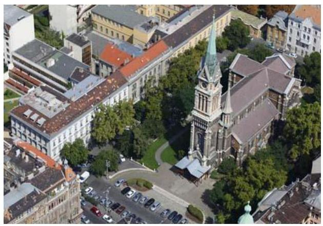
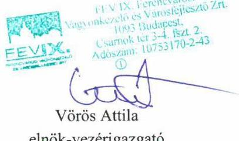
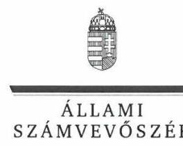
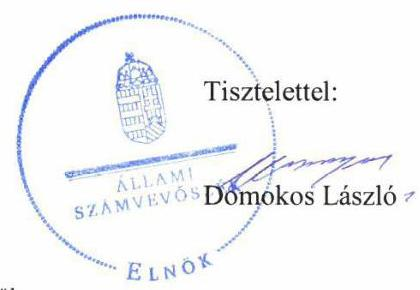
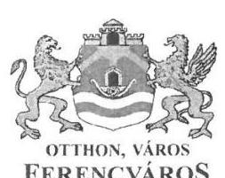
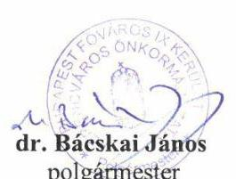
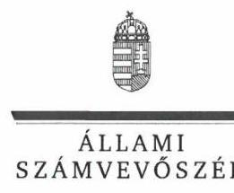

# Jelentés 

## Nemzeti tulajdonú gazdasági társaságok ellenőrzése

FEV IX. Ferencvárosi Vagyonkezelő és Városfejlesztő Zártkörűen Működő Részvénytársaság
2019.

---

# Jelentés 

## Nemzeti tulajdonú gazdasági társaságok ellenőrzése

FEV IX. Ferencvárosi Vagyonkezelő és Városfejlesztő Zártkörűen Működő Részvénytársaság
2019. 10. hó 21. nap

---

# AZ ELLENŐRZÉST FELÜGYELTE:

DR. HORVÁTH MARGIT felügyeleti vezető

DR. PULAY GYULA ZOLTÁN felügyeleti vezető

AZ ELLENŐRZÉST VEZETTE ÉS A VÉGREHAJTÁSÁÉRT FELELŐS:

ÓDOR ZOLTÁN TAMÁS ellenőrzésvezető

A PROGRAM ÖSSZEÁLLÍTÁSÁÉRT FELELŐS:

TÓTPÁL SZABOLCS osztályvezető

IKTATÓSZÁM: EL-2125-001/2019.

TÉMASZÁM: 2478

TÉMASZÁM: 2478

Jelentéseink az Országgyűlés számítógépes hálózatán és az Interneten a www.asz.hu címen is olvashatóak.

---

# TARTALOMJEGYZÉK 

■ ÖSSZEGZÉS ..... 5
■ AZ ELLENŐRZÉS CÉLJA ..... 6
■ AZ ELLENŐRZÉS TERÜLETE ..... 7
■ AZ ELLENŐRZÉS HÁTTERE, INDOKOLTSÁGA ..... 8
■ A JELENTÉS LÉNYEGES KÉRDÉSKÖREI ..... 9
■ AZ ELLENŐRZÉS HATÓKÖRE ÉS MÓDSZEREI ..... 10
■ MEGÁLLAPÍTÁSOK ..... 12
■ JAVASLATOK ..... 14
■ MELLÉKLETEK ..... 17
I. sz. melléklet: Értelmező szótár ..... 17
■ FÜGGELÉKEK ..... 19
I. sz. függelék a jelentéshez ..... 19
II. sz. függelék: Észrevételek ..... 20
■ RÖVIDÍTÉSEK JEGYZÉKE ..... 41

---

.

---

# ÖSSZEGZÉS 

Budapest Főváros IX. Kerület Ferencváros Önkormányzatának a FEV IX. Ferencvárosi Vagyonkezelő és Városfejlesztő Zártkörűen Müködő Részvénytársaság feletti tulajdonosi joggyakorlása nem volt szabályszerű.
A FEV IX. Ferencvárosi Vagyonkezelő és Városfejlesztő Zártkörűen Müködő Részvénytársaság vagyongazdálkodása nem volt szabályszerű. Számviteli beszámolóit 2015-2017. években nem támasztotta alá leltárral, beszámolója nem volt megalapozott, megsértette a valódiság elvét, müködésének elszámoltathatósága, átláthatósága, a nemzeti vagyon megóvása nem volt biztositott.

## Az ellenőrzés társadalmi indokoltsága

Az Állami Számvevőszék kiemelt célja, hogy a helyi önkormányzatok gazdálkodásában rejlő pénzügyi kockázatok feltárásával, az államháztartáson kívülre nyújtott költségvetési támogatások és ingyenes vagyonjuttatások, valamint az államháztartáson kívül múködő feladat-ellátó rendszerek ellenőrzéseivel hozzájáruljon ahhoz, hogy a közpénzeket az államháztartáson kívül múködő szervezetek is átlátható, rendezett módon használják fel.

Magyarországon az önkormányzatok kötelező és önként vállalt feladataik vonatkozásában is egyre szélesebb körben alkalmazzák a költségvetésen kívüli feladatellátást, ezáltal - a nonprofit szervezetek mellett - az önkormányzati tulajdonú gazdasági társaságok is kiemelt fontosságú szerephez jutottak.

Az önkormányzati többségi tulajdonban álló gazdaságok ellenőrzése kiemelt jelentőségű, mivel müködésük hatással van a tulajdonos önkormányzat gazdálkodására.

Budapest IX. kerületében 2015-2017 között a FEV IX. Ferencvárosi Vagyonkezelő és Városfejlesztő Zártkörűen Müködő Részvénytársaság közszolgáltatási feladatokat látott el, Budapest Főváros IX. Kerület Ferencváros Önkormányzatával kötött megállapodás keretében.

Az Állami Számvevőszék által folytatott ellenőrzés azért is indokolt, mert tevékenységén keresztül a kerület lakosságának széles köre kerülhet kapcsolatba a Társasággal és az általa nyújtott szolgáltatásokkal.

## Főbb megállapítások, következtetések, javaslatok

A Budapest Főváros IX. Kerület Ferencváros Önkormányzata, tulajdonosi joggyakorlása nem volt szabályszerű, mert a jogszabályi előírás ellenére a Képviselő-testület nem alkotta meg a Társaság javadalmazással összefüggő szabályzatát, valamint nem hagyta jóvá a Társaság éves beszámolóit.

A FEV IX. Ferencvárosi Vagyonkezelő és Városfejlesztő Zártkörűen Müködő Részvénytársaság vagyonnal való gazdálkodás szabályozása, valamint vagyonnyilvántartása a jogszabályi és a belső előírások szerint történt.

Ugyanakkor a Társaság vagyongazdálkodási tevékenysége nem volt szabályszerű, 2015-2017. években egyszerűsített éves beszámolóját nem támasztotta alá a Számv. tv. előírásainak megfelelő leltárral, ezért az éves beszámolói nem voltak megalapozottak.

Az Állami Számvevőszék Budapest Főváros IX. Kerület Ferencváros Önkormányzata polgármesterének 3 db, a FEV IX. Ferencvárosi Vagyonkezelő és Városfejlesztő Zártkörűen Müködő Részvénytársaság elnök-vezérigazgatójának 3 db javaslatot fogalmazott meg.

---

# AZ ELLENŐRZÉS CÉLJA 

Az ellenőrzés célja annak megállapítása volt, hogy a tulajdonosi joggyakorló a gazdasági társaságai feletti tulajdonosi joggyakorlás kereteit kialakította-e, tulajdonosi jogait megfelelően gyakorolta-e és kötelezettségeit teljesítettee, továbbá annak megállapítása, hogy a gazdasági társaság biztosította-e a vagyon védelmét a nyilvántartások szabályszerű vezetése és a mérleg tételeinek leltárral történő alátámasztása útján, valamint szabályszerűen gon-doskodott-e a társaság használatában, kezelésében lévő nemzeti vagyon értékének megőrzéséről, gyarapításáról, hasznosításáról.

---

# **A Z ELLENŐRZÉS TERÜLETE**

## **Budapest Főváros IX. Kerület Ferencváros Önkormányzata és a kizárólagos tulajdonában levő FEV IX. Ferencvárosi Vagyonkezelő és Városfejlesztő Zártkörűen Működő Részvénytársaság**

Budapest Főváros IX. Kerület Ferencváros Önkormányzata által 1992-ben alapított SEM IX. Városfejlesztő Rt.1 jogutódja a FEV IX. Ferencvárosi Vagyonkezelő és Városfejlesztő Zártkörűen Működő Részvénytársaság, amely 2010. október 6-tól az Önkormányzat2 kizárólagos tulajdonában állt. 2012. április 5-én a Társaságba3 beolvadt a Ferencvárosi Vagyonkezelő Korlátolt Felelősségű Társaság, valamint 2015. szeptember 8-án a Ferencvárosi Parkolási Korlátolt Felelősségű Társaság.

A Társaság jegyzett tőkéje 2015. január 1-én 558,1 M Ft volt, amely az ellenőrzött időszak végéig nem változott.

A Társaság fő tevékenysége parkolással kapcsolatos közszolgáltatási feladatok ellátása volt. Tevékenységét a Mötv.4, továbbá a Budapest Főváros közigazgatási területén a járművel várakozás rendjének egységes kialakításáról szóló 30/2010 (VI.04.) Fővárosi Közgyűlés Rendelete szabályozta. Az Önkormányzattal kötött Közszolgáltatási szerződések1-25 keretében a Társaság további közfeladata volt az Önkormányzat tulajdonában lévő bérlakás állomány kezelése. Megbízási szerződések alapján a Társaság városfejlesztési tanácsadás, önálló ingatlanfejlesztés, épület felújítás és beruházás valamint közbeszerzések lebonyolítását végezte.

A Társaság az ellenőrzött időszakban saját vagyonával gazdálkodott, vagyonkezelt vagyonnal nem rendelkezett, koncessziós szerződést nem kötött. A Társaságnak három gazdasági társaságban volt tulajdoni részesedése.

A Társaság 2015. évben 0,2 M Ft adózott eredményt, 2017. évben 0,6 M Ft adózott eredményt realizált. A tőkehelyzete rendezett volt a saját tőke nagysága a 2015. évi 900,2 M Ft-ról 2017. évre 898,0 M Ft-ra változott.

A Társaság az ellenőrzött években nem tartozott a kormányzati szektorba sorolt egyéb szervezetek közé.

A Társaság a Számv. tv.6 előírása alapján könyvvizsgálatra kötelezett volt.

A Társaság elnök-vezérigazgatójának7 személye az ellenőrzött időszakban nem változott, tisztségét 2014. november 10-től látta el, a polgármester8 személye az ellenőrzött időszak alatt nem változott.

A Társaság által foglalkoztatottak száma 2015. évben 56 fő volt, 2017. évben 69 főre nőtt.

---

# AZ ELLENŐRZÉS HÁTTERE, INDOKOLTSÁGA 

Az Alaptörvény ${ }^{9} 38$. cikke alapján az állam és a helyi önkormányzatok tulajdona nemzeti vagyon.

A nemzeti tulajdonú gazdasági társaságok ellenőrzése kiemelten fontos a nemzeti vagyon megőrzése érdekében. Gazdálkodásuk jellemzően a közérdeklődés és a média figyelmének középpontjában áll, amihez hozzájárul a gazdálkodásuk körébe tartozó - a nemzeti vagyon részét képező - vagyon nagysága, illetve az általuk ellátott közszolgáltatások minősége és hatékonysága. Ellenőrzéseink feltárhatják, hogy a tulajdonosi felügyelet hozzájárult-e a szabályszerű gazdálkodáshoz és feladatellátáshoz.

Az ellenőrzés eredményeként meghatározhatóvá válnak a szervezet vagyongazdálkodást érintő kockázatai, ezzel lehetővé téve a kockázatok csökkentését. A megállapítások alapján megfogalmazott számvevőszéki javaslatok hasznosítása elősegítheti a meglévő hibák megszüntetését. A jó gyakorlatok bemutatásával az ÁSZ ${ }^{10}$ hozzájárulhat a követendő megoldások megismertetéséhez, terjesztéséhez.

---

# A JELENTÉS LÉNYEGES KÉRDÉSKÖREI 

1. A gazdasági társaság feletti tulajdonosi joggyakorlás megfelel-t-e a jogszabályi és belső előírásoknak?
2. A Társaság vagyongazdálkodási tevékenysége szabályszerüvol-e?

---

# AZ ELLENŐRZÉS HATÓKÖRE ÉS MÓDSZEREI 

## Az ellenőrzés típusa

Megfelelőségi ellenőrzés.

## Az ellenőrzött időszak

A tulajdonosi joggyakorlás vonatkozásában az ellenőrzött időszak 2017. január 1-től az ellenőrzés megkezdésének napjáig, 2018. október 16-ig terjedt ki az éves beszámolók elfogadása és tulajdonosi ellenőrzése kivételével, amelyeknél az ellenőrzött időszak 2015. január 1-től az ellenőrzés megkezdésének napjáig tartott.

A Társaság vagyongazdálkodása vonatkozásában az ellenőrzött időszak 2015 - 2017. évek, a 2017. évi beszámoló jóváhagyása tekintetében 2018. június elsejéig tartó időszak.

## Az ellenőrzés tárgya

Az önkormányzati tulajdonban lévő gazdasági társaság feletti tulajdonosi joggyakorlás kialakítása és múködtetése.
Önkormányzati tulajdonban lévő gazdasági társaság, vagyongazdálkodása, saját vagyona tekintetében a vagyonnyilvántartások vezetése, leltára.

## Az ellenőrzött szervezet

Budapest Főváros IX. Kerület Ferencváros Önkormányzata és a
FEV IX. Ferencvárosi Vagyonkezelő és Városfejlesztő Zártkörűen Működő Részvénytársaság

## Az ellenőrzés jogalapja

Az ellenőrzés jogalapját az ÁSZ tv. ${ }^{11}$ 1. § (3) bekezdése és 5. § (3)-(5) bekezdései képezték.

## Az ellenőrzés módszerei

Az ellenőrzést az ellenőrzési program ellenőrzési kérdései, az ellenőrzött időszakban hatályos jogszabályok, az ellenőrzés szakmai szabályok és módszertanok alapján, a nemzetközi standardok figyelembe vételével végeztük.

---

Az ellenőrzés ideje alatt az ellenőrzött szervezettel történő kapcsolattartást az ÁSZ Szervezeti és Működési Szabályzatának vonatkozó előírásai alapján biztosítottuk.
2017. január 1-től 〜2018. október 16-ig, az ellenőrzés megkezdésének napjáig tartó időszakra ellenőriztük a tulajdonosi joggyakorlás kereteinek kialakítását, a tulajdonosi joggyakorló tevékenységét a felügyelő bizottság és a független könyvvizsgáló működéséhez kapcsolódóan, valamint azt, hogy a tulajdonosi joggyakorló - amennyiben a gazdasági társaság feladatellátásához és vagyonkezeléséhez kapcsolódóan határozott meg követelményeket, elvárásokat - a nemzeti vagyon értékének megőrzése érdekében monitorozta-e azok teljesülését. A teljes ellenőrzött időszakra ellenőriztük a tulajdonosi joggyakorló részvételét az éves beszámoló elfogadására vonatkozó döntéshozatalban.

Az ellenőrzési kérdések megválaszolásához szükséges bizonyítékok megszerzése a Társaság vagyongazdálkodása vonatkozásában a következő ellenőrzési eljárások alkalmazásával történt: megfigyelés, információkérés, összehasonlítás, elemző eljárás. Az ellenőrzési bizonyítékként felhasználható adatforrások közé tartoznak az ellenőrzési programban felsorolt adatforrások, továbbá minden - az ellenőrzés folyamán - feltárt, az ellenőrzés szempontjából információkat tartalmazó dokumentum. Az ellenőrzést a kérdésekre adott válaszok kiértékelésével, valamint a megjelölt adatforrások, a csatolt tanúsítványok felhasználásával, továbbá az adott időszakban hatályos jogszabályok figyelembe vételével folytattuk le.

A vagyonnyilvántartások és a leltár szabályszerűsége esetében az ellenőrzés azokra a legnagyobb értékű tételekre - a lényeges sokaságra - terjedt ki, melyek összértéke eléri a teljes sokaság összértékének 50\%-át. A 2015. évben a lényeges sokaságból véletlen mintavételi eljárással kiválasztott tételek kerültek ellenőrzésre. A 2017. évben a lényeges sokaságot tételesen ellenőriztük. „Szabályszerűnek" értékeltünk egy ellenőrzött területet, amennyiben 95\%-os bizonyossággal az ellenőrzött sokaságban az átlagos hibaarány legfeljebb 10\%, "nem szabályszerűnek", amennyiben 10\%nál magasabb arányt képviselt.

---

# 1. A gazdasági társaság feletti tulajdonosi joggyakorlás megfelelte a jogszabályi és belső előírásoknak? 

Összegző megállapítás Az Önkormányzat tulajdonosi joggyakorlása nem volt szabályszerű.

AZ ÖNKORMÁNYZAT Képviselő-testülete a Társaság legfőbb szerveként a Taktv. ${ }^{12}$ 5. § (3) bekezdésének előírása ellenére nem alkotta meg a vezető tisztségviselők, a felügyelőbizottsági tagok, az Mt. ${ }^{13}$ 208. §ának hatálya alá eső munkavállalók javadalmazásáról, valamint a jogviszony megszűnése esetére biztosított juttatások módjának, mértékének elveiről, annak rendszeréről szóló szabályzatot, valamint a Ptk. ${ }^{14}$ 3:109. § (2) bekezdésében foglaltak ellenére a Társaságnak a 2015. és a 2017. évekre vonatkozóan nem volt jóváhagyott éves beszámolója.

## 2. A Társaság vagyongazdálkodási tevékenysége szabályszerű volt-e?

## Összegző megállapítás

A Társaság vagyongazdálkodási tevékenysége nem volt szabályszerű, így nem volt biztosított a vagyon megóvása.

A VAGYONNYILVÁNTARTÁS a Társaságnál a saját vagyon tekintetében szabályszerű volt, követte a Számv. tv.-ben, valamint a Számlarendjében ${ }_{1,2}{ }^{15}$ előírt szabályokat.

A Társaság a tárgyi eszközök üzembe helyezését bizonylatokkal alátámasztotta, az eszközök besorolása, bekerülési értékének meghatározása, valamint az értékcsökkenés elszámolása a Számv. tv. és a Számviteli Politikájának ${ }^{16}$ előírásait követve, szabályszerűen történt. A Társaság Selejtezési szabályzata ${ }_{1-2}{ }^{17}$ a selejtezési eljárás lefolytatását szabályozta, a selejtezett vagyon kivezetési kötelezettségét előírta.

A VAGYONGAZDÁLKODÁS a Társaságnál a 2015 - 2017. években nem volt szabályszerű.

Leltározás tekintetében a Társaság Leltározási szabályzata ${ }_{1,2}{ }^{18}$ tartalmazta a leltározás eljárásrendjét, feladatait, hatásköröket, a leltározás módját és gyakoriságát.

A Társaság 2015 - 2017. évekre vonatkozóan a Számv. tv. 69. § (1) bekezdésével ellentétben nem készített leltárt, amely tételesen és ellenőrizhető módon tartalmazta a mérleg fordulónapján meglévő eszközeit és forrásait, mennyiségben és értékben. A Társaság 2015 - 2017. években folyamatos mennyiségi nyilvántartást nem vezetett, a Számv. tv. 69. § (4) bekezdés és a Leltározási szabályzat ${ }_{1,2} 6.2 .2,7.1 .2$ és 7.3 pontjaiban előírt

---

mérleg fordulónapra vonatkozó mennyiségi felvétellel történő leltározást áruk esetében nem végezte el.

A Társaság az egyszerűsített éves beszámolóiban a mérleg tételei leltárral való alátámasztásának elmulasztásával megsértette a Számv. tv. 15. § (3) bekezdésében leírt valódiság elvét, ezért a Társaság elszámoltathatósága és a nemzeti vagyon megóvása nem volt biztosított.

---

# JAVASLATOK 

Az ÁSZ tv. 33. § (1) bekezdésében foglaltak értelmében az ellenőrzött szervezet vezetője köteles a jelentésben foglalt megállapításokhoz kapcsolódó intézkedési tervet összeállítani és azt a jelentés kézhezvételétől számított 30 napon belül az ÁSZ részére megküldeni. Amennyiben az ellenőrzött szervezet vezetője nem küldi meg határidőben az intézkedési tervet, vagy továbbra sem elfogadható intézkedési tervet küld, az Állami Számvevőszék elnöke az ÁSZ tv. 33. § (3) bekezdése a) és b) pontjaiban foglaltakat érvényesítheti.

Javaslataink célja a FEV IX. Ferencvárosi Vagyonkezelő és Városfejlesztő Zártkörűen Müködő Részvénytársaság gazdálkodása szabályszerűségének és gyakorlatának javítása annak érdekében, hogy a szabályozási környezet és az alkalmazott gyakorlat megfelelően tudja támogatni az átlátható müködést.

## FEV IX. Ferencvárosi Vagyonkezelő és Városfejlesztő Zártkörűen Müködő Részvénytársaság vezérigazgatójának

1. Intézkedjen annak érdekében, hogy a Társaság éves beszámolója kerüljön beterjesztésre a jóváhagyásra jogosult Képviselő-testülethez, mint legfőbb szervhez.
(1. sz. megállapítás 1. bekezdés utolsó tagmondata alapján)
2. Intézkedjen az éves beszámoló mérlegtételeinek a Számv. tv.-ben előírtaknak megfelelő leltárral történő alátámasztásáról.
(2. sz. megállapítás 5. bekezdés 1. mondata és 6. bekezdése alapján)
3. Intézkedjen az eszközök (áruk) mennyiségi felvétellel történő leltározásáról a Számv. tv.-ben elöírtaknak megfelelően.
(2. sz. megállapítás 5. bekezdés 2. mondata alapján)

---

# Javaslataink célja a tulajdonosi joggyakorló Budapest Főváros IX. Kerület Ferencváros Önkormányzata szabályszerű müködésének elősegítése, továbbá a tulajdonosi joggyakorlás kontrolljainak erősítése. 

## Budapest Főváros IX. Kerület Ferencváros Önkormányzata polgármesterének

1. Kezdeményezze, hogy a Képviselő-testület, mint legfőbb szerv a Társaság vezető tisztségviselői, a felügyelő bizottsági tagok, az Mt. 208. §ának hatálya alá eső munkavállalók javadalmazása, valamint a jogviszony megszünése esetére biztosított juttatások módjának, mértékének elveire, annak rendszerére vonatkozó szabályzatot a Taktv.-ben elöirtaknak megfelelően megalkossa.
(1. sz. megállapítás 1. bekezdése alapján)
2. Kezdeményezze, hogy a Képviselő-testület, mint legfőbb szerv jóváhagyás céljából tárgyalja meg a Társaság éves beszámolóját a Ptk. előírásainak megfelelően.
(1. sz. megállapítás 1. bekezdés utolsó tagmondata alapján)
3. Kezdeményezze a Társaságnál a leltárral és a leltározással kapcsolatban feltárt szabálytalanságok tekintetében a felelősség tisztázását és szükség szerint intézkedjen a felelősség érvényesítéséről.
(2. sz. megállapítás 5. bekezdése alapján)

---

.

---

# MELLÉKLETEK 

- I. SZ. MELLÉKLET: ÉRTELMEZŐ SZÓTÁR
gazdasági társaság
koncessziós szerződés
közszolgáltatás
közfeladat
nemzeti vagyon
nemzeti vagyon hasznosítása
nemzeti vagyon használója
vagyonkezelő

Ptk. 3:88. § (1) bekezdése szerint „a gazdasági társaságok üzletszerű közös gazdasági tevékenység folytatására, a tagok vagyoni hozzájárulásával létrehozott, jogi személyiséggel rendelkező vállalkozások, amelyekben a tagok a nyereségből közösen részesednek, és a veszteséget közösen viselik".
Az 1991. évi XVI. tv. alapján a kizárólagos állami, önkormányzati vagy önkormányzati társulási tulajdon hatékony működtetésének, valamint a kizárólagosan az állam vagy az önkormányzat hatáskörébe utalt tevékenységek gyakorlásának egyik lehetséges útja mindezek koncessziós szerződés alapján való átengedése.
Az Ebktv. ${ }^{19}$ 3. § d) pontja a következőképpen határozza meg a közszolgáltatást: „szerződéskötési kötelezettség alapján a lakosság alapvető szükségleteinek ellátására irányuló szolgáltatás, így különösen a villamos energia-, gáz-, hő-, víz-, szennyvíz- és hulladékkezelési, köztisztasági, postai és távközlési szolgáltatás, továbbá a menetrend alapján közlekedő járművekkel végzett közforgalmú személyszállítás".
Az Áht ${ }^{20}$. 3/A. § (1) bekezdése alapján közfeladat a jogszabályban meghatározott állami vagy önkormányzati feladat.
Nvtv ${ }^{21}$. 1. § (2) bekezdése szerint nemzeti vagyonba tartozik többek között:
„az állam vagy a helyi önkormányzat kizárólagos tulajdonában álló dolgok, az a) pont hatálya alá nem tartozó, állam vagy a helyi önkormányzat tulajdonában lévő dolog, az állam vagy a helyi önkormányzat tulajdonában lévő pénzügyi eszközök, továbbá az államot vagy a helyi önkormányzatot megillető társasági részesedések,az államot vagy a helyi önkormányzatot megillető bármely vagyoni értékkel rendelkező jogosultság, amelyet jogszabály vagyoni értékű jogként nevesít.
A tulajdonosi joggyakorló vagy a nemzeti vagyon használója által a nemzeti vagyon birtoklásának, használatának, hasznok szedése jogának bármely - a tulajdonjog átruházását nem eredményező - jogcímen történő átengedése, ide nem értve a vagyonkezelésbe adást, valamint a haszonélvezeti jog alapítását.
Forrás: Nvtv. 3. § (1) bekezdés 4. pont
Azon természetes személy, jogi személy vagy jogi személyiséggel nem rendelkező szervezet, aki vagy amely állami vagyon tekintetében törvény vagy szerződés alapján, a helyi önkormányzat vagyona tekintetében törvény, a helyi önkormányzat rendelete vagy szerződés alapján bármely jogcímen nemzeti vagyont birtokol, használ, szedi annak hasznait, kivéve a tulajdonosi joggyakorló.
Forrás: Nvtv. 3. § (1) bekezdés 11. pont
Aki a nemzeti vagyon felett az államot vagy a helyi önkormányzatot megillető tulajdonosi jogok és kötelezettségek összességének gyakorlására jogosult. (Forrás: Nvtv. 3. § (1) bekezdés 17. pontja)
az állam tulajdonában álló nemzeti vagyon tekintetében:
aa) költségvetési szerv,
ab) helyi önkormányzat, nemzetiségi önkormányzat, valamint ezek társulásai,
ac) az ab) alpontban felsoroltak fenntartása vagy irányítása alá tartozó intézmény,
ad) köztestület,
ae) az állam, az aa)-ac) alpontban meghatározott személyek együtt vagy külön-külön 100\%os tulajdonában álló gazdálkodó szervezet,
af) az ae) alpont szerinti gazdálkodó szervezet 100\%-os tulajdonában álló gazdálkodó szervezet,
ag) a törvény által kijelölt egyedileg meghatározott jogi személy.
b) a helyi önkormányzat tulajdonában álló nemzeti vagyon tekintetében:

---

ba) nemzetiségi önkormányzat, helyi vagy nemzetiségi önkormányzati társulás, valamint ezek fenntartása vagy irányítása alá tartozó intézmény,
bb) költségvetési szerv,
bc) köztestület,
bd) az állam, a helyi önkormányzat, a ba) alpontban meghatározott személyek együtt vagy külön-külön 100\%-os tulajdonában álló gazdálkodó szervezet,
be) a bd) alpont szerinti gazdálkodó szervezet 100\%-os tulajdonában álló gazdálkodó szervezet.
Forrás: Nvtv. 3. § (1) bekezdés 19. pont
vagyonkezelői jog
A vagyonkezelő köteles a vagyontárgy állagának megóvásáról, jó karbantartásáról, működtetéséről gondoskodni, jogszabályban és szerződésben előírt más kötelezettségét teljesíteni, valamint a vagyontárgyat jogszabályban vagy szerződésben meghatározott célnak megfelelően használni. A vagyonkezelő - a központi költségvetési szervek és a kizárólag közfeladatot ellátó nem központi költségvetési szerv vagyonkezelők kivételével - köteles díjat fizetni, jogszabályban és szerződésben előírt más kötelezettségét teljesíteni, valamint a vagyontárgyat jogszabályban vagy szerződésben meghatározott célnak megfelelően használni. Amennyiben a vagyonkezelő ezen kötelezettségeinek nem tesz eleget, a tulajdonosi joggyakorló jogosult a szerződést azonnali hatállyal felmondani.
Forrás: Vtv². 27. § (2), (2a
vagyongazdálkodás
A nemzeti vagyongazdálkodás feladata a nemzeti vagyon rendeltetésének megfelelő, az állam, az önkormányzat mindenkori teherbíró képességéhez igazodó, elsődlegesen a közfeladatok ellátásához és a mindenkori társadalmi szükségletek kielégítéséhez szükséges, egységes elveken alapuló, átlátható, hatékony és költségtakarékos működtetése, értékének megőrzése, állagának védelme, értéknövelő használata, hasznosítása, gyarapítása, továbbá az állam vagy a helyi önkormányzat feladatának ellátása szempontjából feleslegessé váló vagyontárgyak elidegenítése. (Forrás: Nvtv. 7. § (2) bekezdése).

---

# FÜGGELÉKEK 

- I. SZ. FÜGGELÉK A JELENTÉSHEZ

Az Állami Számvevőszék az ellenőrzések során feltárt tényekhez kapcsolódó további körülmények tisztázására eszközrendszerrel nem rendelkezik. Amennyiben az ellenőrzésen túlmutatóan indokoltnak látszik az ellenőrzés során feltárt körülmények további vizsgálata, az Állami Számvevőszék törvényi felhatalmazás alapján az ellenőrzés által feltárt körülményeket továbbítja a hatáskörrel rendelkező szervnek a szükséges intézkedések megtétele, eljárások lefolytatása érdekében.

Az Állami Számvevőszék megállapította, hogy az Önkormányzat Képviselő-testülete a Társaság legfőbb szerveként a Taktv. 5. § (3) bekezdésének előirása ellenére, az ellenőrzött időszakban nem alkotta meg a vezető tisztségviselők, a felügyelőbizottsági tagok, az Mt. 208. §-ának hatálya alá eső munkavállalók javadalmazásáról, valamint a jogviszony megszünése esetére biztosított juttatások módjának, mértékének elveiről, annak rendszeréről szóló szabályzatot. A szabályzatot az elfogadásától számított harminc napon belül a cégiratok közé letétbe kell helyezni.
Az eset konkrét körülményeinek felderítésére a Cégbíróság rendelkezik hatáskörrel.

---

A jelentéstervezetet a Számvevőszék 15 napos észrevételezésre megküldte az ellenőrzött szervezet vezetőjének az ÁSZ tv. 29. §" (1) bekezdése elöírásának megfelelően.
Az elfogadott észrevételek alapján a Számvevőszék módosította a jelentést.

A függelék tartalmazza az ellenőrzött észrevételeit, illetve az el nem fogadott észrevételek elutasításának indoklását.

[^0]
[^0]:    * 29. § (1) Az Állami Számvevőszék az ellenőrzési megállapításait megküldi az ellenőrzött szervezet vezetőjének vagy az általa megbízott személynek, és annak, akinek személyes felelősségét állapította meg.
    (2) Az ellenőrzött szervezet vezetője és a felelősként megjelölt személy az ellenőrzés megállapításaira tizenöt napon belül írásban észrevételt tehet.
    (3) Az Állami Számvevőszék az észrevételre a beérkezésétől számított harminc napon belül írásban válaszol. A figyelembe nem vett észrevételeket köteles a jelentésben feltüntetni, és megindokolni, hogy azokat miért nem fogadta el.

---

# Domokos László úr részére 

Állami Számvevőszék
Levelezési cím: 1364 Budapest, 4. Pf. 54.
Székhely: 1052 Budapest, Apáczai Csere János u. 10.

ÁLLAMI SZÁMVEVÔSZÉK
BE-37300/20/311
Erkezett: 2019 Jón 19.
Iktatószám:EL-1975-264606
Moldólat:

Tárgy: Észrevételek az EL-0875-059/2019 iktatószámú, 2019. június 6-án érkezett jelentéstervezetre

Budapest, 2019. június 19.

---

# Domokos László úr részére 

Állami Számvevőszék
1364 Budapest 4., Pf. 54.
Ikt.sz.: FEV IX./ 18 -2./ 2019.
Ügyintéző: Horta Gábor gazdasági igazgató

Tisztelt Elnök Úr!

Hivatkozva az EL-0875-059/2019 iktatószámú, 2019. június 6.-án érkezett jelentéstervezetre, mellékelten küldjük az észrevételeinket a megállapításoknak megfelelő sorrendben.
1.a) Tájékoztatjuk, hogy az Önkormányzat Képviselő-testülete 52/2010. (III.03.) sz. Határozatával már 2010-ben elfogadta, az ún. Javadalmazási szabályzatot, a Taktv. 5.§ (3) bekezdésének megfelelően (1. sz. melléklet). Egyébként az adatbekérés nem nevesítette a beküldendő adatok között ezt a szabályzatot.
1.b) Az Önök megállapításával ellentétben az Önkormányzat minden esztendőben jóváhagyta a FEV IX. Zrt. éves beszámolóját a Ptk. 3:109. § (2) bekezdésében foglaltaknak megfelelően.
((2) A gazdasági társaság legfőbb szervének feladata a társaság alapvető üzleti és személyi kérdéseiben való döntéshozatal. A legfőbb szerv hatáskörébe tartozik a számviteli törvény szerinti beszámoló (a továbbiakban: beszámoló) jóváhagyása és a nyereség felosztásáról való döntés.)

Az Állami Számvevőszék Elektronikus Adatbekérési Rendszerébe (ABR) a

- 2015. évi Beszámoló ab4afc95f8c3e90b54d5ce72ec9b3374,
- a 2016. évi Beszámoló 1947fbc2a450ef0e5b70b1627f338193,
- és a 2017. évi Beszámoló f50ea95679cd8f693f538feb0392b5a1

QR kóddal 2018. augusztus 21.- én feltöltésre került, melyeket az ABR-ben 2019. augusztus 22 -én véglegesítettünk. Ezekben az anyagokban is szerepeltek azok a dokumentumok, határozatok melyek azt bizonyítják, hogy a tulajdonosi jogokat gyakorló Képviselő-testület megtárgyalta a beszámolókat és a hivatkozott törvényben előírt módon a szükséges döntéseket meghozta. (Az erről szóló határozatokat ismét mellékeljük.) Amennyiben ennek ellenére a jelentéstervezetben ezzel kapcsolatban megfogalmazott általános megállapításukat továbbra is fenntartják, kérjük részletesebben legyenek szívesek indokolni álláspontjukat.

Fentiek alapján kérjük, hogy vizsgálják felül és módosítsák azon összegző megállapításukat, mely szerint az Önkormányzat tulajdonosi joggyakorlása nem volt megfelelő.

---

2.) A Társaság vagyongazdálkodásával kapcsolatos elmarasztaló megállapításukhoz megjegyezzük, hogy a FEV IX. Zrt. minden esztendőben elkészítette leltárát, mely tételesen és ellenőrizhető módon tartalmazta a mérleg fordulónapján meglévő eszközeit és forrásait, mennyiségben és értékben (Számv. tv. 69. § (1) bekezdés). Amennyiben megállapításuk amiatt született, hogy a készlet leltárokat nem küldtük be, akkor az azzal magyarázható, hogy az EL-0875003/2018. iktató számú adatbekérő 2. számú melléklete 2. pontjában a „Mérleg tételeit alátámasztó leltár (2015., 2016. és 2017. év)" bekérése szerepelt, azonban megtévesztő volt, hogy a 2. számú melléklet 5. pontjában részletezték a beküldendő adatállományt és ez már nem terjedt ki a készlet adatokra. Természetesen, ha hiánypótlásként ezt jelezték volna felénk készséggel beküldjük ezeket az adatokat is, most levelünkhöz pótlólag csatoljuk ezeket a készlet/áru leltárakat is (5-7. sz. melléklet), valamint a 2015. évi tárgyi eszköz leltár kiegészítést a mennyiségi darabszámokkal.

Dokumentumokkal bizonyítható, hogy a törvényi előírásoknak megfelelően minden évben a beszámolót vagyonmérleggel alátámasztottuk, amely tételesen és ellenőrizhető módon tartalmazta a mérleg fordulónapján a társaság meglévő eszközeit és forrásait, mennyiségben és értékben, és a könyvvizsgáló is ennek ismeretében írta meg az adott évi jelentését. Az éves beszámolókat a Felügyelő Bizottság is ez alapján fogadta el és a tulajdonosi elfogadást követően határidőre eleget tettünk közzétételi kötelezettségünknek is (melyek az Elektronikus Beszámoló Portálon évekre visszamenőleg elérhetőek).

Fentiek alapján kérjük, vizsgálják felül és módosítsák azon összegző megállapításukat, miszerint a Társaság vagyongazdálkodási tevékenysége nem volt szabályszerű, így nem volt biztosított a vagyon megóvása.

Összegzésként kérjük, hogy a levelünkben bemutatott, megállapításaikat alapjaiban és érdemben korrigáló észrevételeinket, dokumentumainkat legyenek szívesek figyelembe venni a végleges jelentés összeállításánál. Természetesen amennyiben ehhez további információra lenne szükségük, készséggel állunk - ahogy az eddigiekben is rendelkezésükre.

Budapest, 2019. június 19.
Tisztelettel,

Vörös Attila
elnök-vezérigazgató

# Mellékletek: 

1. „Javadalmazási szabályzat" - előterjesztés és elfogadó Határozat
2. 2015. évi elfogadott beszámoló és jóváhagyott üzleti terv
3. 2016. évi elfogadott beszámoló és jóváhagyott üzleti terv
4. 2017. évi elfogadott beszámoló és jóváhagyott üzleti terv
5. 2015. évi készlet leltár és mennyiségi tárgyi eszköz leltár
6. 2016. évi készlet leltár
7. 2017. évi készlet leltár

H-1093 Budapest, Csarnok tér 3-4. fsz. 2.
Tel.: +36 (1) 210-9258 +36 (1) 210-9259 Fax: +36 (1) 210-5185
E-mail: titkarsag@fevis.hu Web: www.fevis.hu

---

ELNÖK

Ikt.szám: EL-0875-065/2019.

# Vörös Attila úr 

vezérigazgató
FEV IX. Ferencvárosi Vagyonkezelő és Városfejlesztő Zártkörüen Müködő Részvénytársaság

## Budapest

## Tisztelt Vezérigazgató Úr!

Köszönettel vettem a „Nemzeti tulajdonú gazdasági társaságok ellenőrzése - FEV IX. Ferencvárosi Vagyonkezelő és Városfejlesztő Zártkörüen Müködő Részvénytársaság" címmel készített számvevőszéki jelentéstervezetre megküldött észrevételét.
Az Állami Számvevőszék észrevételre vonatkozó álláspontját a felügyeleti vezető által készített részletes tájékoztatás tartalmazza, amelyet levelemhez mellékeltem.
Tájékoztatom Vezérigazgató urat, hogy az Állami Számvevőszék a figyelembe nem vett észrevételeket az Állami Számvevőszékről szóló 2011. évi LXVI. törvény 29. § (3) bekezdésében előírtak szerint köteles a jelentésében feltüntetni és megindokolni, hogy azokat miért nem fogadta el.

Budapest, 2019. a ? hó 70 nap

Melléklet: Tájékoztatás az észrevételek kezeléséről

---

# Tájékoztatás az észrevételek kezeléséről 

Megköszönöm Vezérigazgató úrnak a „Nemzeti tulajdonú gazdasági társaságok ellenörzése FEV IX. Ferencvárosi Vagyonkezelö és Városfejlesztő Zártkörüen Müködő Részvénytársaság" címmel készített jelentéstervezetre tett észrevételét. Az észrevétel kezeléséről az alábbi tájékoztatást adom.

## 1. számú észrevétel:

## 1. a) számú észrevétel:

„Tájékoztatjuk, hogy az Önkormányzat Képviselő-testülete 52/2010. (III. 03.) sz. Határozatával már 2010-ben elfogadta, az ún. Javadalmazási szabályzatot, a Taktv. 5.§ (3) bekezdésének megfelelően (1. sz. melléklet). Egyébként az adatbekérés nem nevesítette a beküldendő adatok között ezt a szabályzatot."

## Az észrevételre az alábbi választ adom:

Az észrevételt tudomásul veszem, azonban a leírtak alapján a jelentéstervezet 1. sz. megállapítás 1. bekezdés 1. mondat 1. tagmondatában foglaltakat, valamint Budapest Főváros IX. Kerület Ferencváros Önkormányzata (Önkormányzat) polgármesterének címzett 1. sz. javaslatot nem módosítom.
Az Állami Számvevőszék (ÁSZ) az ellenőrzést az tulajdonosi joggyakorlás tekintetében az EL-0552-001/2018. iktatószámú ellenőrzési program, az ellenőrzött időszakban hatályos jogszabályok, az ellenőrzés szakmai szabályok és módszertanok figyelembe vételével végezte. Az ÁSZ ellenőrzéshez az EL-0875-004/2018. iktatószámú, 2018. augusztus 10-én kelt adatbekérő levél 2. számú melléklete 1. pontjában az Önkormányzattól kérte a 2017. január 1-től hatályos javadalmazási szabályzatot, a szabályzat elfogadását tartalmazó jegyzőkönyveket jelenléti ívvel, határozatot, hiteles (a kiadmányozás rendjének megfelelő) formában.
Az adatbekérő levélben jelezte az ÁSZ, hogy az Állami Számvevőszékről szóló 2011. évi LXVI. törvény (ÁSZ tv.) 28. § (1)-(2) bekezdésében foglaltak alapján a bekért dokumentumokat, továbbá az adatszolgáltatásról szóló teljességi és hitelességi nyilatkozatot soron kívül, de legkésőbb öt munkanapon belül szükséges rendelkezésre bocsátani, továbbá, hogy a dokumentumok adatszolgáltatási rendszerünkbe való feltöltésére később nem lesz lehetőség. E dokumentumok hívták fel a figyelmet továbbá arra, a rendelkezésre bocsátott dokumentumok alapján tesz az ÁSZ megállapítást, vonja le a következtetéseit.

A rendelkezésre álló határidőben az Önkormányzat, mint az adatszolgáltatással érintett, ellenőrzött szervezet a kért dokumentumokat nem bocsátotta az ellenőrzés rendelkezésére, teljességi és hitelességi nyilatkozatot nem adott.
Az észrevételben hivatkozott megállapítást nem a FEV IX. Ferencvárosi Vagyonkezelő és Városfejlesztő Zártkörűen Müködő Részvénytársaságnak (Táraság), hanem a tulajdonosi joggyakorló Önkormányzatnak tette meg az ÁSZ. Tekintettel arra, hogy az Önkormányzat az egyik

---

ellenőrzött szervezet, így az ÁSZ tv. 29. § (2) bekezdés szerint az Önkormányzat polgármesterének joga a tulajdonosi joggyakorlót érintő megállapításokkal és a javaslatokkal - mivel abban a polgármester a felelősként megjelölt személy - kapcsolatban észrevételt tenni.
Minderre tekintettel a jelentéstervezet 1. sz. megállapítás 1. bekezdés 1. mondat 1. tagmondatában foglaltakat, továbbá a polgármesternek címzett 1. sz. javaslat továbbra is helytálló, azt nem módosítom.

# 1. b) számú észrevétel: 

„Az Önök megállapításával ellentétben az Önkormányzat minden esztendőben jóváhagyta a FEV IX. Zrt. éves beszámolóját a Ptk. 3:109. § (2) bekezdésében foglaltaknak megfelelően.
((2) A gazdasági társaság legföbb szervének feladata a társaság alapvető üzleti és személyi kérdéseiben való döntéshozatal. A legföbb szerv hatáskörébe tartozik a számviteli törvény szerinti beszámoló (a továbbiakban: beszámoló) jóváhagyása és a nyereség felosztásáról való döntés.)
Az Állami Számvevőszék Elektronikus Adatbekérési Rendszerébe (ABR) a

- 2015. évi Beszámoló ab4afc95f8c3e90b54d5ce72ec9b3374,
- a 2016. évi Beszámoló 1947fbc2a450ef0e5b70b1627f338193,
- és a 2017. évi Beszámoló i'50ea95679cd8f693f538feb0392b5al

QR kóddal 2018. augusztus 21.- én feltöltésre került, melyeket az ABR-ben2019. augusztus 22én véglegesítettünk. Ezekben az anyagokban is szerepeltek azok a dokumentumok, határozatok melyek azt bizonyítják, hogy a tulajdonosi jogokat gyakorló Képviselő-testület megtárgyalta a beszámolókat és a hivatkozott törvényben elöirt módon a szükséges döntéseket meghozta. (Az erről szóló határozatokat ismét mellékeljük.) Amennyiben ennek ellenére a jelentéstervezetben ezzel kapcsolatban megfogalmazott általános megállapításukat továbbra is fenntartják, kérjük részletesebben legyenek szívesek indokolni álláspontjukat."

## Az észrevételre az alábbi választ adom:

Az észrevételt tudomásul veszem, a leírtak alapján a jelentéstervezet 1. sz. megállapítás 1. bekezdés 1. mondat 2. tagmondatában foglaltakat pontosítom, a Társaság vezérigazgatójának címzett 1. sz. javaslatot, továbbá az Önkormányzat polgármesterének címzett 2. sz. javaslatot nem módosítom.
Az ÁSZ az ellenőrzést a tulajdonosi joggyakorlás tekintetében az EL-0552-001/2018., a Társaság vagyongazdálkodása tekintetében az EL-0552-004/2018. iktatószámú ellenőrzési program, valamint az ellenőrzött időszakban hatályos jogszabályok, az ellenőrzés szakmai szabályok és módszertanok figyelembe vételével végezte. Az ÁSZ ellenőrzéshez az EL-0875-004/2018. iktatószámú, 2018. augusztus 10 -én kelt adatbekérő levél 2. számú melléklete 2. pontjában az Önkormányzattól kérte a 2015. január 1-től az ellenőrzés megkezdésének időpontjáig hatályos számviteli beszámolókat jóváhagyó döntéseket hiteles (a kiadmányozás rendjének megfelelő) formában.

---

Az ÁSZ az ellenőrzéshez a Társaságtól az EL-0875-003/2018. iktatószámú, 2018. augusztus 10én kelt adatbekérő levél 2. sz. mellékletének 3. pontjában kérte az ellenőrzött időszak számviteli törvény szerinti beszámolóit (2015., 2016., 2017. évi beszámolók) hiteles (a kiadmányozás rendjének megfelelő) formában.
Az adatbekérő levelekben jelezte az ÁSZ, hogy az ÁSZ tv. 28. § (1)-(2) bekezdésében foglaltak alapján a bekért dokumentumokat, továbbá az adatszolgáltatásról szóló teljességi és hitelességi nyilatkozatot soron kívül, de legkésőbb öt munkanapon belül szükséges rendelkezésre bocsátani, továbbá, hogy a dokumentumok adatszolgáltatási rendszerünkbe való feltöltésére később nem lesz lehetőség. E dokumentumok hívták fel a figyelmet továbbá arra, a rendelkezésre bocsátott dokumentumok alapján tesz az ÁSZ megállapítást, vonja le a következtetéseit.
Az ellenőrzött szervezettől beszerzett adatok hitelességét és a dokumentumok meglétét az ellenőrzött által kiállított teljességi és hitelességi nyilatkozat garantálja. Az ellenőrzött szervezet az adatbekérés valamennyi fázisában köteles teljességi és hitelességi nyilatkozatot adni. A teljességi és hitelességi nyilatkozat hiányát az ÁSZ úgy tekinti, mintha az ellenőrzött szervezet nem adott volna adatokat és dokumentumokat, az ellenőrzést nem lefolytathatónak ítéli meg. A teljességi és hitelességi nyilatkozat elengedhetetlenül szükséges ahhoz, hogy az adatszolgáltatás az ÁSZ ellenőrzés szempontjából hitelesnek minősíthető és ezt követően megfelelően értékelhető legyen.
A rendelkezésre álló határidőben az Önkormányzat a számviteli beszámolókról szóló döntéseket hiteles (a kiadmányozás rendjének megfelelő) formában nem bocsátotta az ellenőrzés rendelkezésére, teljességi és hitelességi nyilatkozatot nem adott.
A Társaság által átadott számviteli beszámolók az adatbekérő levélben foglaltaknak megfeleltek, ellenben a beszámolókhoz csatolt önkormányzati döntések a 2015. és a 2017. évi beszámoló esetében nem a bekért - hiteles (a kiadmányozás rendjének megfelelő) - formában kerültek átadásra. A 2016. évi beszámolóhoz csatolt dokumentumok hiteles formában tartalmazták az Önkormányzat 2016. évi beszámolóját elfogadó határozatát.
Erre tekintettel a jelentéstervezet megállapítását az alábbiak szerint pontosítom.
Jelentéstervezet 1. számú megállapítás 1. bekezdés:
„Az Önkormányzat Képviselő-testülete a Társaság legfőbb szerveként a Taktv. 5. § (3) bekezdésének elöírása ellenére nem alkotta meg a vezető tisztségviselők, a felügyelőbizottsági tagok, az Mt. 208. §-ának hatálya alá eső munkavállalók javadalmazásáról, valamint a jogviszony megszünése esetére biztosított juttatások módjának, mértékének elveiről, annak rendszeréről szóló szabályzatot, valamint a Ptk. 3:109. § (2) bekezdésében foglaltak ellenére a Társaságnak a 2015. és a 2017. évekre vonatkozóan nem volt jóváhagyott éves beszámolója."

# 1. számú észrevétel utolsó része: 

„Fentiek alapján kérjük, hogy vizsgálják felül és módosítsák azon összegző megállapításukat, mely szerint az Önkormányzat tulajdonosi joggyakorlása nem volt megfelelő."

---

# Az észrevételre az alábbi választ adom: 

Az észrevételt tudomásul veszem, azonban a leírtak alapján a jelentéstervezet Összegzés rész 1. bekezdésében, a Főbb megállapítások, következtetések, javaslatok rész 1. bekezdésében, az 1. számú megállapítás összegző megállapításában foglaltakat nem módosítom.
Az ellenőrzés számára bekért javadalmazási szabályzat, és a számviteli beszámolókat jóváhagyó önkormányzati döntés megléte az ellenőrzési program szerint alapfeltétele a tulajdonosi joggyakorlás minősitésének. E dokumentumokat az Önkormányzat nem bocsátotta az ellenőrzés rendelkezésére, így ezek hiánya miatt a tulajdonosi joggyakorlás nem megfelelő minősítést kapott.
Továbbá az észrevételben hivatkozott megállapítást nem a Táraságnak, hanem a tulajdonosi joggyakorló Önkormányzatnak tette meg az ÁSZ. Tekintettel arra, hogy az Önkormányzat az egyik ellenőrzött szervezet, így az ÁSZ tv. 29. § (2) bekezdés szerint az Önkormányzat polgármesterének joga a tulajdonosi joggyakorlót érintő megállapításokkal és a javaslatokkal - mivel abban a polgármester a felelősként megjelölt személy - kapcsolatban észrevételt tenni.
Ellenőrzési dokumentumként csak az ÁSZ felhívására az ÁSZ tv. 28. § (2) bekezdésében meghatározott adatszolgáltatási időszakon belül megküldött és a teljességi és hitelességi nyilatkozatban szereplő dokumentumok vehetők figyelembe, így az észrevétellel megküldött dokumentum a jelentés megállapításai felülvizsgálata során nem vehető figyelembe.
Erre tekintettel a jelentéstervezet Összegzés rész 1. bekezdésében, a Főbb megállapítások, következtetések, javaslatok rész 1. bekezdésében, az 1. számú megállapítás összegző megállapításában foglaltak továbbra is helytállók.

## 2. számú észrevétel:

„A Társaság vagyongazdálkodásával kapcsolatos elmarasztaló megállapításukhoz megjegyezzük, hogy a FEV IX. Zrt. minden esztendöben elkészítette leltárát, mely tételesen és ellenörizhető módon tartalmazta a mérleg fordulónapján meglévő eszközeit és forrásait, mennyiségben és értékben (Számv. tv. 69. § (1) bekezdés). Amennyiben megállapításuk amiatt született, hogy a készlet leltárokat nem küldtük be, akkor az azzal magyarázható, hogy az EL-0875003/2018. iktató számú adatbekérő 2. számú melléklete 2. pontjában a „Mérleg tételeit alátámasztó leltár (2015., 2016. és 2017. év)" bekérése szerepelt, azonban megtévesztő volt, hogy a 2. számú melléklet 5. pontjában részletezték a beküldendő adatállományt és ez már nem terjedt ki a készlet adatokra. Természetesen, ha hiánypótlásként ezt jelezték volna felénk készséggel beküldjük ezeket az adatokat is, most levelünkhöz pótlólag csatoljuk ezeket a készlet/áru leltárakat is (5-7. sz. melléklet), valamint a 2015. évi tárgyi eszköz leltár kiegészitést a mennyiségi darabszámokkal.
Dokumentumokkal bizonyitható, hogy a törvényi előirásoknak megfelelően minden évben a beszámolót vagyonmérleggel alátámasztottuk, amely tételesen és ellenőrizhető módon tartalmazta a mérleg fordulónapján a társaság meglévő

---

eszközeit és forrásait, mennyiségben és értékben, és a könyvvizsgáló is ennek ismeretében irta meg az adott évi jelentését. Az éves beszámolókat a Felügyelő Bizottság is ez alapján fogadta el és a tulajdonosi elfogadást követően határidőre eleget tettünk közzétételi kötelezettségünknek is (melyek az Elektronikus Beszámoló Portálon évekre visszamenőleg elérhetőek).
Fentiek alapján kérjük, vizsgálják felül és módosítsák azon összegző megállapításukat, miszerint a Társaság vagyongazdálkodási tevékenysége nem volt szabályszerü, igy nem volt biztositott a vagyon megóvása."

# Az észrevételre az alábbi választ adom: 

Az észrevételt tudomásul veszem, azonban a leírtak alapján a jelentéstervezet Összegzés rész 2. bekezdésében, a Főbb megállapítások, következtetések, javaslatok rész 3. bekezdésében, a 2. számú megállapítás 5-6. bekezdéseiben foglaltakat, továbbá a Társaság vezérigazgatójának címzett 2-3. számú javaslatait nem módosítom.
Az ÁSZ a Társaságtól az EL-0875-003/2018. iktatószámú adatbekérő levél 2. számú melléklet 2. pontjában kérte az ellenőrzött időszak mérleg tételeit alátámasztó leltárakat, majd az EL-0875010/2018. iktatószámú adatbekérő levél 2. számú melléklet 20. pontjában a leltározáshoz kapcsolódó dokumentumokat.
Mindkét adatbekérő levélben jelezte az ÁSZ, hogy az ÁSZ tv. 28. § (1)-(2) bekezdésében foglaltak alapján a bekért dokumentumokat, továbbá az adatszolgáltatásról szóló teljességi és hitelességi nyilatkozatot soron kívül, de legkésőbb öt munkanapon belül szükséges rendelkezésre bocsátani, továbbá, hogy a dokumentumok adatszolgáltatási rendszerünkbe való feltöltésére később nem lesz lehetőség. E dokumentumok hívták fel a Társaság figyelmét továbbá arra, a rendelkezésre bocsátott dokumentumok alapján tesz az ÁSZ megállapítást, vonja le a következtetéseit.
A Táraság a rendelkezésre álló határidőben a dokumentumokat az ellenőrzés számára átadta, az átadott dokumentumokról teljességi és hitelességi nyilatkozatot tett. Az EL-0875-003/2018. és EL-0875-010/2018. iktatószámú adatbekérő levelekben kért adatok kapcsán tett teljességi és hitelességi nyilatkozatokban Vezérigazgató úr többek között az átadott dokumentumok teljes körüségéről, hiánytalanságáról nyilatkozott.
Az ellenőrzés rendelkezésére bocsátott dokumentumokat ismételten áttekintettük. Megállapítottuk, hogy a Társaság a 2015. évben a beruházások, felújítások, a tartós részesedés kapcsolt vállalkozásban, az áruk, a követelések, bankbetétek, aktív időbeli elhatárolások, a kötelezettségek, a passzív időbeli elhatárolások mérlegsorait leltárral nem támasztotta alá. A 2016. évben a Társaság a befektetett pénzügyi eszközök, a készletek, a követelések, a pénzeszközökön belül a bankbetétek, a kötelezettségek, az aktív és passzív időbeli elhatárolások mérlegsorait leltárral nem támasztotta alá. A 2017. évben a Társaság a beruházások, a befektetett pénzügyi eszközök, a készletek, a követelések, a pénzeszközökön belül a bankbetétek, a kötelezettségek, az aktív és passzív időbeli elhatárolások mérlegsorokat leltárral nem támasztotta alá. Továbbá a Társaság

---

az ellenőrzött években a készletek (áruk) mérlegsoron lévő készletek leltározását nem dokumentálta.
Ellenőrzési dokumentumként csak az ÁSZ felhívására az ÁSZ tv. 28. § (2) bekezdésében meghatározott adatszolgáltatási időszakon belül megküldött és a teljességi és hitelességi nyilatkozatban szereplő dokumentumok vehetők figyelembe, így az észrevétellel megküldött dokumentum a jelentés megállapításai felülvizsgálata során nem vehető figyelembe.
A leltár hiánya miatt a beszámolóban a valódiság számviteli alapelve nem érvényesült, ez által a Társaság elszámoltathatósága, a nemzeti vagyon megóvása sem volt biztosított.
Mindezekre tekintettel a jelentéstervezet Összegzés rész 2. bekezdésében, a Főbb megállapítások, következtetések, javaslatok rész 3. bekezdésében, a 2. számú megállapítás 5-6. bekezdéseiben tett megállapítás és a Vezérigazgató úrnak címzett 2-3. számú javaslat helytálló.

Tájékoztatom Vezérigazgató urat, hogy az észrevételhez 1-7. számú mellékletként csatolt dokumentumok tartalmát a jelen felügyeleti vezetői tájékoztatásban nem értékeltem.

Budapest, 2019. 07 hó" 18 "nap

Dr. Horváth Margit felügyeleti vezető

---

BUDAPEST FÖVÁROS IX. KERÜLET/ FERENCVÁROS ÖNKORMÁNYZATÁ

1092 Budapest, Bakáts tér 14. I. emelet 24. telefon: 06-1 210-6506 $\cdot$ fax: 06-1 210-6901 e-mail: polgarmester@ferencvaros.hu $\cdot$ www.ferencvaros.hu

Domokos László elnök részére

Állami Számvevőszék

Budapest
Apáczai Csere János utca 10. 1052

Ügyiratszám: Kp/18740-1/2019/1
Tárgy: jelentéstervezet észrevételezése

| ÁLLAMI SZÁMVEVÖSZÉK |
| :--: |
| JE-39081/2019/1 |
| Érkszelt: 2019 JON 25 |
| hatatészém: 22-075-0671640 |
| V. 2019. 2019. |

# Tisztelt Elnök Úr! 

Hivatkozva az EL-0875-058/2019. iktatószámú, Budapest Főváros IX. kerület Ferencváros Önkormányzatához (a továbbiakban: Önkormányzat) 2019. június 7. napján érkezett jelentéstervezetre, észrevételeimet az alábbiakban foglalom össze:

Az Önkormányzat tulajdonában álló FEV IX. Zrt. ÁSZ vizsgálata jelentéstervezetének összegző megállapítása szerint a vizsgált időszakban az Önkormányzat részéről nem volt szabályszerű a FEV IX. Zrt. feletti tulajdonosi joggyakorlás, két okból kifolyólag:

1) egyrészt a Képviselő-testület nem alkotta meg a köztulajdonban álló gazdasági társaságok takarékosabb müködéséről szóló 2009. évi CXXII. törvény szerinti javadalmazási szabályzatot,
2) másrészt a Képviselő-testület a Ptk. rendelkezései ellenére nem hagyta jóvá a FEV IX. Zrt. éves beszámolóit.

Önkormányzatunk álláspontja szerint az 1) szerinti mulasztás - mely szerint a Képviselő-testület nem alkotta meg a köztulajdonban álló gazdasági társaságok takarékosabb müködéséről szóló 2009. évi CXXII. törvény szerinti javadalmazási szabályzatot - nem következett be; a Képviselő-testület a köztulajdonban álló gazdasági társaságok takarékosabb müködéséről szóló 2009. évi CXXII. törvény szerint szükséges döntést - határidőben - meghozta.

A köztulajdonban álló gazdasági társaságok takarékosabb müködéséről szóló 2009. évi CXXII. törvény 2010. január 1-jén lépett hatályba. A törvény alapján köztulajdonban álló gazdasági társaságnak minősül - egyebek mellett - az a gazdasági társaság, amelyben a helyi önkormányzat többségi ( $50 \%$-t meghaladó) befolyással rendelkezik. Így 2010. január 1-jétől e törvény hatálya alá tartozott a SEM IX. Zrt. is, amelyben az Önkormányzat többségi részesedéssel bírt.

A köztulajdonban álló gazdasági társaságok takarékosabb müködéséről szóló 2009. évi CXXII. törvény 5.§ (3) bekezdése értelmében „A köztulajdonban álló gazdasági társaság legfőbb szerve e törvény és más jogszabályok keretei között köteles szabályzatot alkotni a

---

vezető tisztségviselők, felügyelőbizottsági tagok, valamint az Mt. 208. §-ának hatálya alá eső munkavállalók javadalmazása, valamint a jogviszony megszünése esetére biztosított juttatások módjának, mértékének elveiről, annak rendszeréről. A szabályzatot az elfogadásától számított harminc napon belül a cégiratok közé letétbe kell helyezni."

A törvény alapján a javadalmazási szabályzat megalkotása a legfőbb szerv feladat- és hatásköre. A SEM IX. Zrt.-nek az Önkormányzat többségi, de nem 100\%-os mértékben volt a tulajdonosa. Míg a 100\%-os önkormányzati tulajdonban álló gazdasági társaságok esetében a legfőbb szerv jogait az egyedüli tulajdonos, azaz az Önkormányzat Képviselő-testülete gyakorolja, addig a SEM IX. Zrt. mint többségi önkormányzati tulajdonban álló gazdasági társaság esetében a szabályzat megalkotása a legfőbb szerv - részvénytársaság esetén a közgyűlés - feladat- és hatásköre volt. Ennek megfelelően döntött úgy Budapest Főváros IX. kerület Ferencváros Önkormányzatának Képviselő-testülete a 2010. március 3-i ülésén a 44/2010. számú, „Szabályzatok az önkormányzati tulajdonú gazdasági társaságok vezető tisztségviselőinek, felügyelő bizottsági tagjainak javadalmazásáról és jogviszonyuk megszűnésekor járó juttatásokról" tárgyú előterjesztést megtárgyalva, hogy az általa javasolt szabályzat megalkotását indítványozza a társaság közgyűlésének:

# 52/2010. (III.03.) sz. határozat 

Budapest, Főváros IX. kerület Ferencváros Önkormányzatának Képviselő-testülete a köztulajdonban álló gazdasági társaságok takarékosabb müködéséről szóló 2009. évi CXXII. törvény 5. § (3) bekezdésében kapott felhatalmazás alapján elfogadásra javasolja a SEM IX. Városfejlesztő Zártkörüen Müködő Részvénytársaság közgyülésének az Zrt. vezető tisztségviselőinek, felügyelő bizottsági tagjainak javadalmazása, és jogviszonya megszünése esetére biztosított juttatások módjának, mértékének fơbb elveiről és rendszeréről szóló szabályzatot.
Határidő: 30 nap a szabályzat cégiratok közé történő elhelyezésére
Felelős: dr. Gegesy Ferenc polgármester
(23 igen, egyhangú)
Megállapítható tehát, hogy az Önkormányzat Képviselő-testülete meghozta a szükséges döntést a köztulajdonban álló gazdasági társaságok takarékosabb müködéséről szóló 2009. évi CXXII. törvény által előirt, a vezető tisztségviselők, felügyelőbizottsági tagok, valamint az Mt. 208. §-ának hatálya alá eső munkavállalók javadalmazása, valamint a jogviszony megszünése esetére biztosított juttatások módjának, mértékének elveiről, annak rendszeréről szóló szabályzat megalkotása érdekében.

Önkormányzatunk álláspontja szerint a 2) szerinti mulasztás - mely szerint a vizsgált időszakban (2015. január 1-jétől 2018. október 16-ig) a tulajdonosi joggyakorlás nem volt szabályszerű azon okból kifolyólag, hogy az Önkormányzat Képviselő-testülete mint tulajdonosi joggyakorló nem hagyta jóvá a FEV IX. Zrt. éves beszámolóit - sem következett be, a Képviselő-testület ugyanis minden évben - határidőben - elfogadta a FEV IX. Zrt. éves beszámolóit.

Az ÁSZ jelentéstervezetében hivatkozott Ptk. 3:109.§ (2) bekezdés értelmében ,,A gazdasági társaság legfőbb szervének feladata a társaság alapvető üzleti és személyi kérdéseiben való döntéshozatal. A legfőbb szerv hatáskörébe tartozik a számviteli törvény szerinti beszámoló (a továbbiakban: beszámoló) jóváhagyása és a nyereség felosztásáról való döntés."

---

Budapest Főváros IX. kerület Ferencváros Önkormányzatának Képviselő-testülete a 2015. május 21-i ülésén tárgyalta a 127/2015. számú, „Önkormányzati tulajdonú gazdasági társaságok 2014. évi beszámolója, 2015. évi üzleti terve, javaslat egyes társaságok könyvvizsgálóinak megválasztására, díjazásuk megállapítására" tárgyú előterjesztést. Az előterjesztés 8. számú mellékletét képezte a FEV IX. Zrt. 2014. évi beszámolója. A Képviselő-testület a napirendi pontot megtárgyalta, és - egyebek mellett - az alábbi határozatot hozta:

# 182/2015. (V.21.) sz. határozat 

Budapest Fôváros IX. Kerület Ferencváros Önkormányzatának Képviselő-testülete úgy dönt, hogy
a./ A FEV IX. Ferencvárosi Vagyonkezelő és Városfejlesztő Zrt. a 127/2015. számú előterjesztés 8. számú mellékletét képező 2014. évi éves beszámolóját elfogadja, és tudomásul veszi, hogy a mérleg szerinti eredmény 1.007 e Ft-os nyereséget mutat, a társaság ezt az összeget helyezze eredménytartalékba.
b./ Felhatalmazza a vezérigazgatót a 2014. évi éves beszámoló aláírására és annak a Fôvárosi Törvényszék Cégbírósághoz történő benyújtására és közzétételére.
c./ A FEV IX. Ferencvárosi Vagyonkezelő és Városfejlesztő Zrt. a 127/2015. számú előterjesztés 9. számú mellékletét képező 2015. évi üzleti tervét jóváhagyja.
d./ Megválasztja a GABOL Audit Kft.-t (Eng. szám: MKVK-004062), természetes személy képviselőjeként Oláh Gábor (Eng. szám: MKVK-000081) könyvvizsgáló urat a FEV IX. Ferencvárosi Vagyonkezelő és Városfejlesztő Zrt. könyvvizsgálói feladatainak ellátására három éves időtartamra, 2015. június 1-től 2018. május 31-ig, 160 eFt + ÁFA / hó díjazással. A személyi változást a Társaság Alapszabályán át kell vezetni.
Határidő: 2015. május 31., illetve az Alapszabály módosítás esetében 2015. június 30.
Felelős: dr. Bácskai János polgármester, illetve Vörös Attila vezérigazgató
(11 igen, 4 nem, 2 tartózkodás)
Megállapítható tehát, hogy az Önkormányzat Képviselő-testülete mint tulajdonosi joggyakorló - a Ptk. rendelkezéseinek megfelelően - jóváhagyta a FEV IX. Zrt. 2014. évi éves beszámolóját, és rendelkezett a nyereség felosztásáról (jelen esetben eredménytartalékba helyezéséről) is.

Budapest Főváros IX. kerület Ferencváros Önkormányzatának Képviselő-testülete a 2016. május 19-i ülésén tárgyalta a 114/2016. számú, „Önkormányzati tulajdonú gazdasági társaságok 2015. évi beszámolója, 2016. évi üzleti terve, javaslat a FESZOFE Nonprofit Kft. könyvvizsgálójának megválasztására, díjazásának megállapítására, javaslat Alapító Okirat módosításra" tárgyú előterjesztést. Az előterjesztés I/C. számú mellékletét képezte a FEV IX. Zrt. 2015. évi beszámolója. A Képviselő-testület a napirendi pontot megtárgyalta, és egyebek mellett - az alábbi határozatot hozta:

## 181/2016. (V.19.) sz. határozat

Budapest Fôváros IX. Kerület Ferencváros Önkormányzatának Képviselő-testülete úgy dönt, hogy
a./ a FEV IX. Ferencvárosi Vagyonkezelő és Városfejlesztő Zrt. 114/2016. számú előterjesztés I/C. számú mellékletét képező 2015. évi éves beszámolóját elfogadja, és tudomásul veszi, hogy a mérleg szerinti eredmény 155 eFt-os nyereséget mutat, melyet eredménytartalékba helyez.
b./ felhatalmazza a vezérigazgatót a 2015. évi éves beszámoló aláírására és annak a Cégbíróságon történő benyújtására és közzétételére.

---

c./ a FEV IX. Ferencvárosi Vagyonkezelő és Városfejlesztő Zrt. 114/2016. számú előterjesztés 1/C. számú mellékletét képező 2016. évi üzleti tervét jóváhagyja.
d./ a FEV IX. Ferencvárosi Vagyonkezelő és Városfejlesztő Zrt. Igazgatóság elnökének tiszteletdiját 210 eFt/hó összegben, az Igazgatóság tagjainak tiszteletdiját 150 eFt/hó összegben, a Felügyelő Bizottság elnökének tiszteletdiját 165 eFt/hó összegben, a Felügyelő Bizottság tagjainak tiszteletdiját 115 eFt/hó összegben határozza meg 2016. június 1-jétől. Határidő: 2016. május 31.
Felelős: III.a. és II.c. pont tekintetében: dr. Bácskai János polgármester
II.b. és II.d. pont tekintetében Vörös Attila elnök-vezérigazgató
(14 igen, 0 nem, 2 tartózkodás)
Megállapítható tehát, hogy az Önkormányzat Képviselő-testülete mint tulajdonosi joggyakorló - a Ptk. rendelkezéseinek megfelelően - jóváhagyta a FEV IX. Zrt. 2015. évi éves beszámolóját, és rendelkezett a nyereség felosztásáról (jelen esetben eredménytartalékba helyezéséről) is.

Budapest Főváros IX. kerület Ferencváros Önkormányzatának Képviselő-testülete a 2017. május 25 -i ülésén tárgyalta a 121/2017. számú, „Önkormányzati gazdasági társaságok 2016. évi beszámolója és 2017. évi üzleti terve" tárgyú előterjesztést. Az előterjesztés 1/C számú mellékletét képezte a FEV IX. Zrt. 2016. évi beszámolója. A Képviselő-testület a napirendi pontot megtárgyalta, és - egyebek mellett - az alábbi határozatot hozta:

# 154/2017. (V.25.) sz. határozat 

Budapest Főváros IX. Kerület Ferencváros Önkormányzatának Képviselő-testülete úgy dönt, hogy
a./ a FEV IX. Ferencvárosi Vagyonkezelő és Városfejlesztő Zrt. a 121/2017. számú előterjesztés 1/C számú mellékletét képező 2016. évi éves beszámolóját elfogadja, és tudomásul veszi, hogy az adózott eredmény 204 eFt-os nyereséget mutat, a társaság ezt az összeget helyezze eredménytartalékba.
b./ felhatalmazza a vezérigazgatót a 2016. évi éves beszámoló aláírására és annak a Cégbíróságon történő benyújtására és közzétételére.
c./ a FEV IX. Ferencvárosi Vagyonkezelő és Városfejlesztő Zrt. a 121/2017. számú előterjesztés 1/C számú mellékletét képező 2017. évi üzleti tervét jóváhagyja.
d./ a vezérigazgató urat - tekintettel a 2016. évben végzett tevékenységéért - 2 havi alapbérének megfelelő összegü, bruttó 1.940.000,- Ft jutalomban részesíti.
e./ a FEV IX. Ferencvárosi Vagyonkezelő és Városfejlesztő Zrt. Felügyelő Bizottság Ügyrendjének módositását jóváhagyja, és az egységes szerkezetbe foglalt Ügyrendet elfogadja.
Határidő: 2017. május 31.
Felelős: III.a. és III.c. III.d. tekintetében: dr. Bácskai János polgármester
III.b. pont tekintetében Vörös Attila elnök-vezérigazgató
III.e. pont tekintetében Vörös Attila elnök-vezérigazgató és dr. Bácskai János polgármester
(12 igen, 1 nem, 4 tartózkodás)
Megállapítható tehát, hogy az Önkormányzat Képviselő-testülete mint tulajdonosi joggyakorló - a Ptk. rendelkezéseinek megfelelően - jóváhagyta a FEV IX. Zrt. 2016. évi éves beszámolóját, és rendelkezett a nyereség felosztásáról (jelen esetben eredménytartalékba helyezéséről) is.

---

Budapest Főváros IX. kerület Ferencváros Önkormányzatának Képviselő-testülete a 2018. május 24-i ülésén tárgyalta a 101/2018. számú, „Önkormányzati gazdasági társaságok 2017. évi beszámolója és 2018. évi üzleti terve és könyvvizsgálóinak megválasztása" tárgyú előterjesztést. Az előterjesztés mellékletét képezte a FEV IX. Zrt. 2017. évi beszámolója. A Képviselő-testület a napirendi pontot megtárgyalta, és - egyebek mellett - az alábbi határozatot hozta:

179/2018. (V.24.) sz. határozat
Budapest Föváros IX. Kerület Ferencváros Önkormányzatának Képviselö-testülete úgy dönt, hogy
a./ A FEV IX. Ferencvárosi Vagyonkezelö és Városfejlesztő Zrt. 2017. évi éves beszámolóját elfogadja, és tudomásul veszi, hogy az adózott eredmény 590 E Ft-os nyereséget mutat, a társaság ezt az összeget helyezze eredménytartalékba.
b./ Felhatalmazza a vezérigazgatót a 2017. évi éves beszámoló aláirására és annak a Cégbíróságon történő benyújtására és közzétételére.
c./ A FEV IX. Ferencvárosi Vagyonkezelö és Városfejlesztő Zrt. 2018. évi üzleti tervét jóváhagyja.
d./ Megválasztja a GABOL Audit Kft.-t (Eng. szám: MKVK-004062), természetes személy képviselőjeként Oláh Gábor (Eng. szám: MKVK-000081) könyvvizsgáló urat a FEV IX. Ferencvárosi Vagyonkezelő és Városfejlesztő Zrt. könyvvizsgálói feladatainak ellátására kettő éves időtartamra, 2018. június 1-tól 2020. május 31-ig, 180 eFt + ÁFA / hó összegü díjazással. A személyi változást a Társaság Alapszabályán át kell vezetni.
Határidő: 2018. május 31.
Felelős: dr. Bácskai János polgármester, illetve Vörös Attila vezérigazgató
(8 igen, 2 nem, 3 tartózkodás)
Megállapítható tehát, hogy az Önkormányzat Képviselő-testülete mint tulajdonosi joggyakorló - a Ptk. rendelkezéseinek megfelelően - jóváhagyta a FEV IX. Zrt. 2017. évi éves beszámolóját, és rendelkezett a nyereség felosztásáról (jelen esetben eredménytartalékba helyezéséről) is.

Fentiek alapján megállapítható, hogy Budapest Főváros IX. kerület Ferencváros Önkormányzatának Képviselö-testülete mint tulajdonosi joggyakorló - a Ptk. rendelkezéseinek megfelelően - a 2015-2018. közötti időszakban minden évben jóváhagyta a FEV IX. Zrt. előző évi éves beszámolóját, és minden alkalommal rendelkezett a nyereség felosztásáról (eredménytartalékba helyezéséről) is.

Jelen észrevételeink alapján kérem, szíveskedjenek felülvizsgálni és módosítani azon összegző megállapításukat, mely szerint a vizsgált időszakban az Önkormányzat részéről nem volt szabályszerű a FEV IX. Zrt. feletti tulajdonosi joggyakorlás.

Budapest, 2019. június 19.

---

ELNÖK

Ikt.szám: EL-0875-068/2019.

Dr. Bácskai János úr
polgármester
Budapest Főváros IX. Kerület Ferencváros Önkormányzata

# Budapest 

## Tisztelt Polgármester Úr!

Köszönettel vettem a „Nemzeti tulajdonú gazdasági társaságok ellenőrzése - FEV IX. Ferencvárosi Vagyonkezelő és Városfejlesztő Zártkörüen Müködő Részvénytársaság" címmel készített számvevőszéki jelentéstervezetre megküldött észrevételét.
Az Állami Számvevőszék észrevételre vonatkozó álláspontját a felügyeleti vezető által készített részletes tájékoztatás tartalmazza, amelyet levelemhez mellékeltem.
Tájékoztatom Polgármester urat, hogy az Állami Számvevőszék a figyelembe nem vett észrevételeket az Állami Számvevőszékről szóló 2011. évi LXVI. törvény 29. § (3) bekezdésében előírtak szerint köteles a jelentésében feltüntetni és megindokolni, hogy azokat miért nem fogadta el.

Budapest, 2019. o? hó 11 nap

Melléklet: Tájékoztatás az észrevételek kezeléséről

---

# Tájékoztatás az észrevételek kezeléséről 

Megköszönöm Polgármester úrnak a „Nemzeti tulajdonú gazdasági társaságok ellenörzése FEV IX. Ferencvárosi Vagyonkezelö és Városfejlesztő Zártkörüen Müködő Részvénytársaság" címmel készített jelentéstervezetre tett észrevételét. Az észrevétel kezeléséről az alábbi tájékoztatást adom.
Polgármester úr észrevétele első részében (1. sz. észrevétel) kifejtett álláspontja szerint mulasztás - mely szerint a Képviselő-testület nem alkotta meg a köztulajdonban álló gazdasági társaságok takarékosabb müködéséről szóló 2009. évi CXXII. törvény szerinti javadalmazási szabályzatot - nem következett be. A Képviselő-testület a köztulajdonban álló gazdasági társaságok takarékosabb müködéséről szóló 2009. évi CXXII. törvény szerint a javadalmazási szabályzattal kapcsolatos szükséges döntést határidőben meghozta. Álláspontja alátámasztásaként az észrevétel további részeiben kifejtette, hogy a fenti törvény alapján a Budapest Főváros IX. Kerület Ferencváros Önkormányzata (Önkormányzat) 52/2010. (III. 3.) sz. határozatával a javadalmazási szabályzat elfogadását javasolta a társaság legfőbb szerve számára.

## Az 1. számú észrevételre az alábbi választ adom:

Az észrevételt tudomásul veszem, azonban a leírtak alapján a jelentéstervezet 1. sz. megállapítás 1. bekezdés 1. mondat 1. tagmondatában foglaltakat, valamint az Önkormányzat polgármesterének címzett 1. sz. javaslatot nem módosítom.
Az Állami Számvevőszék (ÁSZ) az ellenőrzést a tulajdonosi joggyakorlás tekintetében az EL-0552-001/2018. iktatószámú ellenőrzési program, az ellenőrzött időszakban hatályos jogszabályok, az ellenőrzés szakmai szabályok és módszertanok figyelembe vételével végezte. Az ÁSZ ellenőrzéshez az EL-0875-004/2018. iktatószámú, 2018. augusztus 10 -én kelt adatbekérő levél 2. számú melléklete 1. pontjában az Önkormányzattól kérte a 2017. január 1-től hatályos javadalmazási szabályzatot, a szabályzat elfogadását tartalmazó jegyzőkönyveket jelenléti ívvel, határozatot, hiteles (a kiadmányozás rendjének megfelelő) formában.
Az adatbekérő levélben jelezte az ÁSZ, hogy az Állami Számvevőszékről szóló 2011. évi LXVI. törvény (ÁSZ tv.) 28. § (1)-(2) bekezdésében foglaltak alapján a bekért dokumentumokat, továbbá az adatszolgáltatásról szóló teljességi és hitelességi nyilatkozatot soron kívül, de legkésőbb öt munkanapon belül szükséges rendelkezésre bocsátani, továbbá, hogy a dokumentumok adatszolgáltatási rendszerünkbe való feltöltésére később nem lesz lehetőség. E dokumentumok hívták fel a figyelmet továbbá arra, a rendelkezésre bocsátott dokumentumok alapján tesz az ÁSZ megállapítást, vonja le a következtetéseit.

A rendelkezésre álló határidőben az Önkormányzat, mint az adatszolgáltatással érintett, ellenőrzött szervezet a kért dokumentumokat nem bocsátotta az ellenőrzés rendelkezésére, teljességi és hitelességi nyilatkozatot nem adott.
Minderre tekintettel a jelentéstervezet 1. sz. megállapítás 1. bekezdés 1. mondat 1. tagmondatában foglaltakat, továbbá a polgármesternek címzett 1. sz. javaslat továbbra is helytálló, azt nem módosítom.

---

Polgármester úr az észrevétele második részében (2. sz. észrevétel) kifejtett álláspontja szerint a vizsgált időszakban az Önkormányzat Képviselő-testülete, mint tulajdonosi joggyakorló minden évben, határidőben elfogadta a FEV IX. Ferencvárosi Vagyonkezelő és Városfejlesztő Zártkörűen Müködő Részvénytársaság (Társaság) éves beszámolóit. Álláspontja alátámasztásaként az észrevétel további részeiben bemutatta azokat a határozatokat, amelyek a Társaság 20142017. évi beszámolónak jóváhagyásához kapcsolódnak.

# A 2. számú észrevételre az alábbi választ adom: 

Az észrevételt tudomásul veszem, a jelentéstervezet 1. sz. megállapítás 1. bekezdés 1. mondat 2. tagmondatában foglaltakat pontosítom, az Önkormányzat polgármesterének címzett 2. sz. javaslatot nem módosítom.
Az ÁSZ az ellenőrzést a tulajdonosi joggyakorlás tekintetében az EL-0552-001/2018. iktatószámú ellenőrzési program, valamint az ellenőrzött időszakban hatályos jogszabályok, az ellenőrzés szakmai szabályok és módszertanok figyelembe vételével végezte.
Az ÁSZ ellenőrzéshez az EL-0875-004/2018. iktatószámú, 2018. augusztus 10-én kelt adatbekérő levél 2. számú melléklete 2. pontjában az Önkormányzattól kérte a 2015. január 1-től az ellenőrzés megkezdésének időpontjáig hatályos számviteli beszámolókat jóváhagyó döntéseket hiteles (a kiadmányozás rendjének megfelelő) formában.
Az ÁSZ az ellenőrzéshez a Társaságtól az EL-0875-003/2018. iktatószámú, 2018. augusztus 10én kelt adatbekérő levél 2. sz. mellékletének 3. pontjában kérte az ellenőrzött időszak számviteli törvény szerinti beszámolóit (2015., 2016., 2017. évi beszámolók) hiteles (a kiadmányozás rendjének megfelelő) formában.
Az adatbekérő levelekben jelezte az ÁSZ, hogy az Állami Számvevőszékről szóló 2011. évi LXVI. törvény (ÁSZ tv.) 28. § (1)-(2) bekezdésében foglaltak alapján a bekért dokumentumokat, továbbá az adatszolgáltatásról szóló teljességi és hitelességi nyilatkozatot soron kívül, de legkésőbb öt munkanapon belül szükséges rendelkezésre bocsátani, továbbá, hogy a dokumentumok adatszolgáltatási rendszerünkbe való feltöltésére később nem lesz lehetőség. E dokumentumok hívták fel a figyelmet továbbá arra, a rendelkezésre bocsátott dokumentumok alapján tesz az ÁSZ megállapítást, vonja le a következtetéseit.
Az ellenőrzött szervezettől beszerzett adatok hitelességét és a dokumentumok meglétét az ellenőrzött által kiállított teljességi és hitelességi nyilatkozat garantálja. Az ellenőrzött szervezet az adatbekérés valamennyi fázisában köteles teljességi és hitelességi nyilatkozatot adni. A teljességi és hitelességi nyilatkozat hiányát az ÁSZ úgy tekinti, mintha az ellenőrzött szervezet nem adott volna adatokat és dokumentumokat. A teljességi és hitelességi nyilatkozat elengedhetetlenül szükséges ahhoz, hogy az adatszolgáltatás az ÁSZ ellenőrzés szempontjából hitelesnek minősíthető és ezt követően megfelelően értékelhető legyen.
A rendelkezésre álló határidőben az Önkormányzat a számviteli beszámolókról szóló döntéseket hiteles (a kiadmányozás rendjének megfelelő) formában nem bocsátotta az ellenőrzés rendelkezésére, teljességi és hitelességi nyilatkozatot nem adott.

---

A Társaság által átadott számviteli beszámolók az adatbekérő levélben foglaltaknak megfeleltek. A Társaság a számviteli beszámolók mellé csatolta továbbá a beszámolók elfogadásával kapcsolatos önkormányzati döntéseket. Az önkormányzati döntések azonban a 2015. és a 2017. évi beszámoló esetében nem hiteles (a kiadmányozás rendjének megfelelő) formában kerültek átadásra. A 2016. évi beszámolóhoz csatolt dokumentumok hiteles formában tartalmazták az Önkormányzat 2016. évi beszámolóját elfogadó határozatát. Erre tekintettel a jelentéstervezet megállapítását az alábbiak szerint pontosítom.
Jelentéstervezet 1. számú megállapítás 1. bekezdés:
„Az Önkormányzat Képviselő-testülete a Társaság legfőbb szerveként a Taktv. 5. § (3) bekezdésének előirása ellenére nem alkotta meg a vezető tisztségviselők, a felügyelőbizottsági tagok, az Mt. 208. §-ának hatálya alá eső munkavállalók javadalmazásáról, valamint a jogviszony megszünése esetére biztositott juttatások módjának, mértékének elveiről, annak rendszeréről szóló szabályzatot, valamint a Ptk. 3:109. § (2) bekezdésében foglaltak ellenére a Társaságnak a 2015. és a 2017. évekre vonatkozóan nem volt jóváhagyott éves beszámolója."
A jelentéstervezetben az Önkormányzat polgármesterének címzett 2. sz. javaslat továbbra is helytálló, azt nem módosítom.

Polgármester úr észrevételének utolsó részében (3. sz. észrevétel) kérte felülvizsgálni és módosítani azon összegző megállapítást, amely szerint a vizsgált időszakban az Önkormányzat részéről nem volt szabályszerű a Társaság feletti tulajdonosi joggyakorlás.

# A 3. számú észrevéteire az alábbi választ adom: 

A Társaság feletti tulajdonosi joggyakorlás minősítése a javadalmazási szabályzat, valamint az ellenőrzött időszakban az éves beszámolók elfogadásáról szóló döntések minősítésén alapult. E dokumentumok ellenőrzés számára történő átadásának elmaradása miatt a tulajdonosi joggyakorlás minősítése továbbra is helytálló, azt a jelentéstervezetben - összegzés 1. bekezdés, Főbb megállapítások, következtetések, javaslatok rész 1. bekezdés, 1. sz. megállapítás összegző megállapítás - nem módosítom.

Budapest, 2019. 04. hó" 12 ."nap

Dr. Horváth Margit
felügyeleti vezető

---

.

---

# RÖVIDÍTÉSEK JEGYZÉKE 

${ }^{1}$ Rt.
${ }^{2}$ Önkormányzat
${ }^{3}$ Társaság
${ }^{4}$ Mötv.
${ }^{5}$ Közszolgáltatási szerződés ${ }_{1}$

Közszolgáltatási szerződés ${ }_{2}$
${ }^{6}$ Számv. tv.
${ }^{7}$ elnök-vezérigazgató
${ }^{8}$ polgármester
${ }^{9}$ Alaptörvény
${ }^{10}$ ÁSZ
${ }^{11}$ ÁSZ tv.
${ }^{12}$ Taktv.
${ }^{13} \mathrm{Mt}$.
${ }^{14} \mathrm{Ptk}$.
${ }^{15}$ Számlarend ${ }_{1}$

Számlarend ${ }_{2}$
${ }^{16}$ Számviteli Politika ${ }_{1}$

Számviteli Politika ${ }_{2}$
${ }^{17}$ Selejtezési szabályzat ${ }_{1}$

Selejtezési szabályzat ${ }_{2}$
${ }^{18}$ Leltározási szabályzat ${ }_{1}$

Leltározási szabályzat ${ }_{2}$
${ }^{19}$ Ebktv.
${ }^{20}$ Áht
${ }^{21}$ Nvtv
${ }^{22} \mathrm{Vtv}$.

Részvénytársaság
Budapest Főváros IX. Kerület Ferencváros Önkormányzata
FEV IX. Ferencvárosi Vagyonkezelő és Városfejlesztő Zártkörűen Működő Részvénytársaság
2011. évi CLXXXIX. törvény Magyarország helyi önkormányzatairól

Az Önkormányzat és a Társaság között 2016. október 28-án aláírt közszolgáltatási szerződés
A Közszolgáltatási szerződés 2016. október 28-án aláírt módosítása
2000. évi C. törvény a számvitelről

FEV IX. Ferencvárosi Vagyonkezelő és Városfejlesztő Zártkörűen Működő Részvénytársaság elnök-vezérigazgatója
Budapest Főváros IX. Kerület Ferencváros Polgármestere
Magyarország Alaptörvénye
Állami Számvevőszék
2011. évi LXVI. törvény az Állami Számvevőszékről (hatályos 2011. július 1-től)
2009. évi CXXII. törvény a köztulajdonban álló gazdasági társaságok takarékosabb müködéséről (hatályos: 2009. december 4-től)
2012. évi I. törvény a munka törvénykönyvéről (hatályos: 2012. július 1-jétől)
2013. évi V. törvény a Polgári Törvénykönyvről (hatályos 2014. március 15-től)

FEV IX. Ferencvárosi Vagyonkezelő és Városfejlesztő Zrt SZÁMLAREND, SZÁMLATÜKÖR (hatályos 2013.01.02.)
FEV IX. Ferencvárosi Vagyonkezelő és Városfejlesztő Zrt SZÁMLAREND, BIZONYLATI REND (hatályos 2017.03.31.)
FEV IX. Ferencvárosi Vagyonkezelő és Városfejlesztő Zrt Számviteli Politika (hatályos 2013.01.02.)
FEV IX. Ferencvárosi Vagyonkezelő és Városfejlesztő Zrt Számviteli Politika 2015 (hatályos 2017.03.31.)
FEV IX. Ferencvárosi Vagyonkezelő és Városfejlesztő Zártkörűen Működő Részvénytársaság Selejtezési Szabályzata (hatályos 2012 szeptember 30.)
FEV IX. Ferencvárosi Vagyonkezelő és Városfejlesztő Zártkörűen Működő Részvénytársaság Selejtezési Szabályzata (hatályos 2017 szeptember 01.)
FEV IX. Ferencvárosi Vagyonkezelő és Városfejlesztő Zártkörűen Működő Részvénytársaság Leltározási Szabályzata (hatályos: 2012. szeptember 30.)
FEV IX. Ferencvárosi Vagyonkezelő és Városfejlesztő Zártkörűen Működő Részvénytársaság Leltározási szabályzata (hatályos: 2017. szeptember 01.)
Egyenlő bánásmódról és az esélyegyenlőség előmozdításáról szóló 2003. évi CXXV. törvény
2011. évi CXCV. törvény az államháztartásról (hatályos: 2011. december 31-től)
2011. évi CXCVI. törvény a nemzeti vagyonról (hatályos 2011. december 31-től)
2007. évi CVI. törvény az állami vagyonról (hatályos: 2007. szeptember 25-től)

---

# ÁLLAMI SZÁMVEVŐSZÉK 

1052 Budapest, Apáczai Csere János utca 10.
Levélcím: 1364 Budapest 4. Pf. 54
Telefon: +36 14849100 Telefax: +36 14849200
www.asz.hu