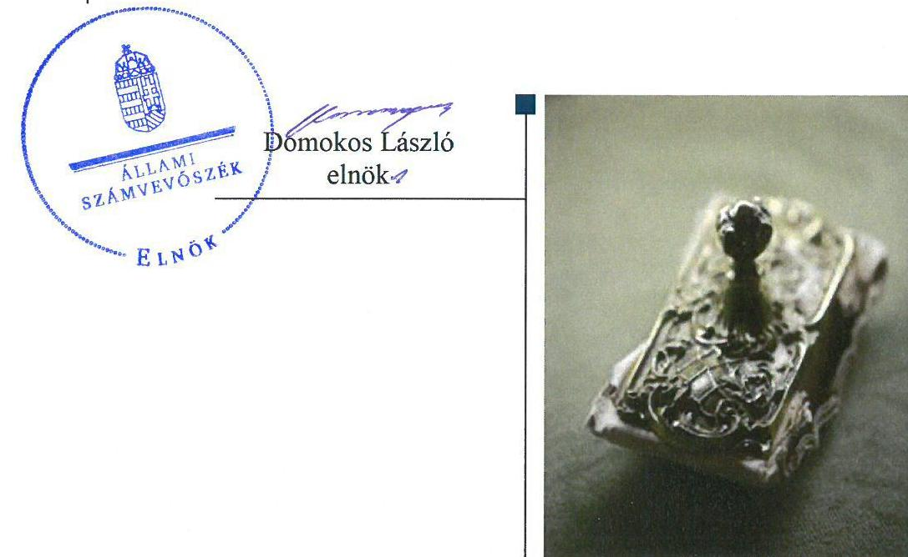

# Jelenetés 

## Nem állami humánszolgáltatók ellenőrzése

A humánszolgáltatást nyújtó államháztartáson kívüli szociális intézmények, szolgáltatók fenntartói központi költségvetésből kapott támogatásai felhasználásának ellenőrzése Aranykereszt Ápoló Otthon Közhasznú Nonprofit Kft.
2019.

---

# Jelentés 

## Nem állami humánszolgáltatók ellenőrzése

A humánszolgáltatást nyújtó államháztartáson kívüli szociális intézmények, szolgáltatók fenntartói központi költségvetésből kapott támogatásai felhasználásának ellenőrzése Aranykereszt Ápoló Otthon Közhasznú Nonprofit Kft.
2019. 8. hó 20. nap

---

# AZ ELLENŐRZÉST FELÜGYELTE: 

KAKAS SÁNDOR felügyeleti vezető

## AZ ELLENŐRZÉST VEZETTE ÉS A VÉGREHAJTÁSÁÉRT FELELŐS:

DR. TÓTH VIKTÓRIA ellenőrzésvezető

## A PROGRAM ÖSSZEÁLLÍTÁSÁÉRT FELELŐS:

TÓTPÁL SZABOLCS osztályvezető

IKTATÓSZÁM: EL-1663-001/2019.
TÉMASZÁM: 2491
ELLENŐRZÉS-AZONOSÍTÓ SZÁM: V083522

---

# TARTALOMJEGYZÉK 

■ ÖSSZEGZÉS ..... 5
■ AZ ELLENŐRZÉS CÉLJA ..... 6
■ AZ ELLENŐRZÉS TERÜLETE ..... 7
■ AZ ELLENŐRZÉS HÁTTERE, INDOKOLTSÁGA ..... 8
■ A JELENTÉS LÉNYEGES KÉRDÉSKÖRE ..... 9
■ AZ ELLENŐRZÉS HATÓKÖRE ÉS MÓDSZEREI ..... 10
■ MEGÁLLAPÍTÁSOK ..... 12
■ MELLÉKLETEK ..... 13
I. sz. melléklet: Értelmező szótár ..... 13
■ FÜGGELÉKEK ..... 15
I. sz. függelék a jelentéshez ..... 15
II. sz. függelék: Észrevételek ..... 16
■ RÖVIDÍTÉSEK JEGYZÉKE ..... 19

---

.

---

# ÖSSZEGZÉS 

Az Aranykereszt Ápoló Otthon Közhasznú Nonprofit Kft. szociális közfeladatot ellátó intézménye müködtetésére igénybevett közpénzekkel való gazdálkodása nem volt elszámoltatható és átlátható.

## Az ellenőrzés társadalmi indokoltsága

Az Állami Számvevőszék stratégiájában hangsúlyos szerepet szán annak, hogy szilárd szakmai alapon álló, értékteremtő ellenőrzéseivel előmozdítsa a közpénzügyek átláthatóságát, rendezettségét és javaslataival a közpénzek és a közvagyon szabályos, gazdaságos, hatékony és eredményes felhasználását segítse. Az ÁSZ a stratégiájában célul tűzte ki, hogy az államháztartáson kívülre nyújtott költségvetési támogatások ellenőrzésével hozzájárul ahhoz, hogy a közpénzeket az államháztartáson kívüli szervezetek is átlátható módon használják fel a közfeladatok szerződésben vállalt ellátása érdekében. Tekintettel az elmúlt években a szociális területet érintő finanszírozási változásokra, a társadalom fokozott érdeklődéssel figyeli a szociális feladatokra fordított források felhasználását. Fontos a közvélemény biztosítása arról, hogy a közpénz államháztartáson kívüli felhasználása ezen a területen sem marad ellenőrizetlenül.

## Főbb megállapítások, következtetések

A szociális humánszolgáltatási közfeladatot ellátó intézményt fenntartó Aranykereszt Ápoló Otthon Közhasznú Nonprofit Kft. a 2015-2017. években nem rendelkezett a jogszabályban előírt számviteli politikával és az annak keretében elkészítendő szabályzatokkal, ezáltal nem alakította ki a szabályszerű működés és gazdálkodás kereteit, nem teremtette meg a közfeladathoz biztosított költségvetési támogatások átlátható, elszámoltatható igénybevételének, felhasználásának feltételeit.

Számviteli szabályozás hiányában nem volt igazolt, hogy a költségvetési támogatásokat intézményfenntartóként az intézménye működtetésére fordította.

Jogszabályban előírt beszámoló készítési kötelezettségének nem tett eleget, ezzel nem biztosította az átláthatóságot és az elszámoltathatóságot a fenntartott szociális intézménye működtetésére igénybe vett közpénzekre vonatkozóan.

---

# AZ ELLENŐRZÉS CÉLJA 

AZ ELLENŐRZÉS CÉLJA annak értékelése volt, hogy az Aranykereszt Ápoló Otthon Közhasznú Nonprofit Korlátolt felelősségű társaság, mint nem állami, nem önkormányzati szociális intézményfenntartó központi költségvetésből kapott támogatásainak felhasználása szabályszerű volt-e, a támogatások igénylése, évközi módosítása és év végi elszámolása megfelelt-e a jogszabályi előírásoknak.

---

# **AZ ELLENŐRZÉS TERÜLETE**

## **Aranykereszt Ápoló Otthon Közhasznú Nonprofit Kft., mint intézményfenntartó**

Az Aranykereszt Ápoló Otthon Közhasznú Nonprofit Kft.-t a céginformáció adatai alapján 2008-ban alapították. Főtevékenysége idősek, fogyatékos személyek bentlakásos ellátása, a budapesti székhelyű Margaréta Idősek és Pszichiátriai Betegek Otthonát működtette. Két, önálló cégjegyzésre jogosult ügyvezetőjének személye az ellenőrzött időszakban nem változott.

A Fenntartó1 főtevékenysége ellátására a 2015. évben 115,8 millió Ft, a 2016. évben 111,6 millió Ft és a 2017. évben 136,2 millió Ft támogatást kapott a központi költségvetésből.

---

# AZ ELLENŐRZÉS HÁTTERE, INDOKOLTSÁGA 

A szociális feladatokat ellátó nem állami intézményfenntartók részére közfeladataik ellátására évente jelentős összegű pénzügyi támogatást biztosítottak a mindenkori költségvetési törvények a bennük megfogalmazott feltételek mellett. A felhasználható állami támogatások a Kvtv.-ekben (a 2014. évi C. törvény Magyarország 2015. évi központi költségvetéséről, 2015. évi C. törvény Magyarország 2016. évi központi költségvetéséről, 2016. évi XC. törvény Magyarország 2017. évi központi költségvetéséről) a 2015-2017. években a szociális ágazatra vonatkozóan 273 Mrd Ft előirányzatot határoztak meg. Módosították a szociális igazgatásról és szociális ellátásokról szóló 1993. évi III. törvényt, amely többek között - 2012. január 1-jei hatállyal megfogalmazta a finanszírozási rendszerbe történő befogadással összefüggő szabályokat.

Az ÁSZ ${ }^{2}$ stratégiájában foglaltak alapján is indokolt az ellenőrzés, amely a társadalom számára jelzi, hogy a közpénz államháztartáson kívüli felhasználása sem maradhat ellenőrizetlenül. Az államháztartáson kívülre nyújtott költségvetési támogatások ellenőrzésével az ÁSZ hozzájárul ahhoz, hogy a közpénzeket a nem állami humán fenntartók átlátható módon használják fel a közfeladatok ellátására kötött szerződésekben vállalt kötelezettségek teljesítése érdekében. Az ellenőrzés javaslataival hozzájárulhat az említett rendszerek szabályszerű támogatás felhasználásához, javíthatja a társadalmi-gazdasági döntések megalapozottságát, amely a „jól irányított állam" működéséhez járul hozzá.

---

# A JELENTÉS LÉNYEGES KÉRDÉSKÖRE 

1.- A szociális humánszolgáltató közfeladatot ellátó fenntartó megteremtette-e a költségvetési támogatások átlátható, elszámoltatható igénybevételének, felhasználásának feltételeit, a költségvetési támogatásokat szabályszerűen fordította-e intézménye müködtetésére, a közpénzekre vonatkozó gazdálkodásával a nyilvánosság előtt elszámolt-e?

---

# AZ ELLENŐRZÉS HATÓKÖRE ÉS MÓDSZEREI 

## Az ellenőrzés típusa

Megfelelőségi ellenőrzés.

## Az ellenőrzött időszak

A 2015. január 1-je és 2017. december 31-e közötti időszak.

## Az ellenőrzés tárgya

Az ellenőrzés a szociális humánszolgáltatási közfeladatokat ellátó államháztartáson kívüli fenntartók, humánszolgáltatási közfeladatai ellátásához a költségvetési törvényekben biztosított központi költségvetési támogatások igénylése, évközi módosítása és év végi elszámolása fenntartói feladatainak ellátása, illetve e központi költségvetésből kapott támogatásaik humánszolgáltatási közfeladatokra való fenntartó általi felhasználása szabályszerűségének értékelésére terjed ki.

## Az ellenőrzött szervezet

Aranykereszt Ápoló Otthon Közhasznú Nonprofit Korlátolt felelősségű társaság, mint intézményfenntartó

## Az ellenőrzés jogalapja

Az ellenőrzés jogszabályi alapját az ÁSZ tv. ${ }^{3}$ 1. § (3) bekezdésében, valamintaz 5. § (3) bekezdésében foglalt előírások adják.

## Az ellenőrzés módszerei

Az ellenőrzést az ellenőrzési program szempontjai, kérdései, az ellenőrzött időszakban hatályos jogszabályok, a nemzetközi standardokat irányadónak tekintve, az ellenőrzés szakmai szabályok és módszertanok figyelembe vételével végezte az ÁSZ.

Az ellenőrzés ideje alatt az ellenőrzött szervezettel történő kapcsolattartást az ÁSZ SZMSZ²-ének vonatkozó előírásai alapján biztosította az ÁSZ.

Az ellenőrzési kérdések megválaszolásához szükséges bizonyítékok megszerzése az ellenőrzött által rendelkezésre bocsátott

---

dokumentumokra, adatokra alapozva megfigyelés, szemle (szemrevételezés), kérdésfeltevés (információkérés), valamint elemző eljárással történt.

Az ellenőrzési bizonyítékként felhasználható adatforrások közé tartoznak egyrészt az ellenőrzési program részletes szempontjainál felsorolt adatforrások, másrészt minden - az ellenőrzés folyamán feltárt, az ellenőrzés szempontjából információt tartalmazó - dokumentum.

Az ellenőrzés lefolytatásához az ellenőrzött szervezet az ÁSZ által kért dokumentumok elektronikus úton való megküldésével szolgáltatott adatokat, információkat.

Az ellenőrzést a szociális humánszolgáltatások esetében a központi költségvetési támogatások igénylésével, módosításával, felhasználásával, elszámolásával kapcsolatos feladatokat ellátó államháztartáson kívüli fenntartónál végeztük.

Az ellenőrzés nem terjedt ki a szociális humánszolgáltatások központi költségvetési támogatásai igénylése, módosítása, elszámolása valódiságának, megalapozottságának, helyességének - sem a fenntartónál, sem a székhely intézményeinél való - értékelésére (mivel ennek felülvizsgálata, ellenőrzése a finanszírozó jogszabályban előírt feladata, határozatai kiadása előtt). Továbbá nem terjedt ki az ellenőrzés e források, intézmények általi szabályszerű felhasználásának értékelésére.

---

# MEGÁLLAPÍTÁSOK 

## 1. A szociális humánszolgáltató közfeladatot ellátó fenntartó megteremtette-e a költségvetési támogatások átlátható, elszámoltatható igénybevételének, felhasználásának feltételeit, a költségvetési támogatásokat szabályszerűen fordította-e intézménye müködtetésére, a közpénzekre vonatkozó gazdálkodásával a nyilvánosság előtt elszámolt-e?

Összegző megállapítás

A Fenntartó nem alakította ki a költségvetési támogatások átlátható, elszámoltatható igénybevételének, felhasználásának feltételeit, ezáltal a szociális közfeladatokra kapott közpénz felhasználása nem volt elszámoltatható. A Fenntartó nem igazolta, hogy a közfeladat ellátására igénybevett költségvetési támogatásokat intézménye müködtetésére fordította.

A Fenntartó múködésének szabályozottsága, ennek keretében a fenntartó gazdálkodására vonatkozó számviteli szabályozás nem felelt meg a jogszabályi előírásoknak, mivel a Fenntartó a 2015-2017. években nem rendelkezett a Számv. tv. ${ }^{5}$ 14. § (3) bekezdésében, valamint (5) bekezdés a), b), d) pontjaiban előírt számviteli politikával, és az annak keretében elkészítendő eszközök és források leltározási és leltárkészítési szabályzatával, eszközök és források értékelési szabályzatával és pénzkezelési szabályzattal.

Számviteli szabályozás hiányában nem volt igazolt, hogy a Fenntartó a költségvetési támogatásokat a szociális intézménye müködtetésére fordította.

A Fenntartó a Számv. tv. 4. § (1) bekezdésében előírt beszámoló készítési kötelezettségének a 2015-2017. évek vonatkozásában nem tett eleget.

---

# MELLÉKLETEK 

- I. SZ. MELLÉKLET: ÉRTELMEZŐ SZÓTÁR
humánszolgáltatás
kültségvetési támogatás
nem állami, nem
önkormányzati
(államháztartáson kívüli)
intézmény fenntartó

Külön törvényben meghatározott szociális, gyermekjóléti, gyermekvédelmi, közoktatási, felsőoktatási, kulturális közfeladatok (2014. évi Kvtv. 34. § (1), (4) bekezdés, 1. számú melléklet XX/20/2. alcím, 19. alcím, 2015. évi Kvtv. 43. § (1), (4) bekezdés, 1. számú melléklet XX/20/2/3. jogcím csoport, 19. alcím, 2016. évi Kvtv. 41. § (1), (4) bekezdés, 1. számú melléklet XX/20/2/3. jogcím csoport, 19. alcím.
A társadalombiztosítás pénzügyi alapjai kivételével az államháztartás központi alrendszeréből ellenérték nélkül, pénzben nyújtott támogatások (Áht. 6 1. § 14. pont). A költségvetési törvényekben (2013. évi CCXXX. törvény 33-34. §, 2014. évi C. törvény 42-43. §, 2015. évi C. törvény 40-41. §) megállapított támogatás. Például a 2015. évi C. törvény 40-41. § szerint többek között: Az Országgyűlés a szociális, gyermekjóléti, gyermekvédelmi közfeladatot ellátó intézményt, szolgáltatást fenntartó egyházi jogi személy, civil szervezet, közalapítvány, országos nemzetiségi önkormányzat, települési vagy területi nemzetiségi önkormányzat, gazdasági társaság, és a humánszolgáltatást alaptevékenységként végző, az Szja tv. hatálya alá tartozó egyéni vállalkozó (a továbbiakban együtt: nem állami szociális fenntartó) részére támogatást állapít meg a következők szerint: a támogatás a nem állami szociális fenntartót a települési önkormányzatok 2. melléklet III. pont 3. alpont c)-k) pontjában és III. pont 5. alpont a) pontjában meghatározott támogatásaival azonos jogcímeken, összegben és feltételek mellett illeti meg.
A szociális, gyermekjóléti és gyermekvédelmi közfeladatokat /humánszolgáltatásokat ellátó intézményt fenntartó egyházi jogi személy, társadalmi szervezet, alapítvány, közalapítvány, civil szervezet, országos nemzetiségi önkormányzat, nonprofit gazdasági társaság, gazdasági társaság és a humánszolgáltatást alaptevékenységként végző, Szja tv. hatálya alá tartozó egyéni vállalkozó. (2013. évi Kvtv. 35. § (1), (3) bekezdés, 2014. évi Kvtv. 33. §, 34. § (1), (4) bekezdés, 2015. évi Kvtv. 42. §, 43. § (1), (4) bekezdés, 2016. évi Kvtv. 40. §, 41. § (1), (4) bekezdés, 2017. évi Kvtv. 41. § (1), (4))

---

.

---

# FÜGGELÉKEK 

- I. SZ. FÜGGELÉK A JELENTÉSHEZ

Az Állami Számvevőszék az ellenőrzések során feltárt tényekhez kapcsolódó további körülmények tisztázására eszközrendszerrel nem rendelkezik. Amennyiben az ellenőrzésen túlmutatóan indokoltnak látszik az ellenőrzés során feltárt körülmények további vizsgálata, az Állami Számvevőszék törvényi felhatalmazás alapján az ellenőrzés által feltárt körülményeket továbbítja a hatáskörrel rendelkező szervnek a szükséges intézkedések megtétele, eljárások lefolytatása érdekében.
I. Az Aranykereszt Ápoló Otthon Közhasznú Nonprofit Kft. a Számv. tv. 4. § (1) bekezdése ellenére 2015-2017. években nem tett eleget beszámolókészítési kötelezettségének, így a költségvetésből származó pénzeszközökkel kapcsolatban sem teljesítette az előírt számadási, elszámolási kötelezettségét.
Az eset konkrét körülményeinek további felderítésére az ügyészség rendelkezik hatáskörrel.
II. Az Aranykereszt Ápoló Otthon Közhasznú Nonprofit Kft., mint intézményfenntartó a 2015-2017. években nem rendelkezett a Számv. tv. 14. § (3) bekezdésében, valamint (5) bekezdés a), b), d) pontjaiban előírt számviteli politikával, és az annak keretében elkészítendő eszközök és források leltárkészítési és leltározási szabályzatával, eszközök és források értékelési szabályzatával, pénzkezelési szabályzattal. Számviteli szabályozás hiányában nem volt igazolt, hogy a Fenntartó a költségvetési támogatásokat a szociális intézménye müködtetésére fordította, nem zárható ki, hogy a költségvetésből származó pénzeszközöket a jóváhagyott céltól eltérően használta fel. A szociális közfeladat ellátásához az Aranykereszt Ápoló Otthon Közhasznú Nonprofit Kft. a 2015. évben 115,8 millió Ft, a 2016. évben 111,6 millió Ft és a 2017. évben 136,2 millió Ft támogatást kapott a központi költségvetésből.
Az eset konkrét körülményeinek további felderítésére a Magyar Államkincstár valamint az ügyészség rendelkezik hatáskörrel.

---

A jelentéstervezetet a Számvevőszék 15 napos észrevételezésre megküldte az ellenőrzött szervezet vezetőjének az ÁSZ tv. 29. §* (1) bekezdése előírásának megfelelően.

Az Aranykereszt Ápoló Otthon Közhasznú Nonprofit Kft. ügyvezetője a jelentéstervezet megállapításaira írásban észrevételt tett.
Az ÁSZ tv. 29. § (3) bekezdésével összhangban az ÁSZ a Függelékben feltünteti az ellenőrzés megállapításaival kapcsolatban tett, figyelembe nem vett észrevételeket, és megindokolja, hogy azokat miért nem fogadta el.

[^0]
[^0]:    * 29. § (1) Az Állami Számvevőszék az ellenőrzési megállapításait megküldi az ellenőrzött szervezet vezetőjének vagy az általa megbízott személynek, és annak, akinek személyes felelősségét állapította meg.
    (2) Az ellenőrzött szervezet vezetője és a felelősként megjelölt személy az ellenőrzés megállapításaira tizenöt napon belül írásban észrevételt tehet.
    (3) Az Állami Számvevőszék az észrevételre a beérkezésétől számított harminc napon belül írásban válaszol. A figyelembe nem vett észrevételeket köteles a jelentésben feltüntetni, és megindokolni, hogy azokat miért nem fogadta el.

---

A „Nem állami humánszolgáltatók ellenőrzése - A humánszolgáltatást nyújtó államháztartáson kívüli szociális intézmények, szolgáltatók fenntartói központi költségvetésből kapott támogatásai felhasználásának ellenőrzése Aranykereszt Ápoló Otthon Közhasznú Nonprofit Kft." címmel készített számvevőszéki jelentéstervezet megállapításaival kapcsolatban az Aranykereszt Ápoló Otthon Közhasznú Nonprofit Kft. ügyvezetője által 2019. június 18 -án kelt levélben tett, figyelembe nem vett észrevételek és azok indokolása.

# A jelentéstervezet Főbb megállapítások, következtetések részének 1-2. bekezdésére, valamint 1. megállapítás 1-2. bekezdésére tett észrevétel: 

Az ügyvezető észrevételében vitatta a jelentéstervezet azon megállapítását, hogy a Fenntartó 20152017. években nem rendelkezett a jogszabályban előírt számviteli politikával és az annak keretében elkészítendő szabályzatokkal. Továbbá vitatta a jelentéstervezet azon megállapítását, hogy a számviteli szabályozás hiányában nem volt igazolt, hogy a költségvetési támogatásokat intézményfenntartóként az intézménye müködtetésére fordította.
Az ügyvezető a fentiek alátámasztására előadta, hogy az ellenőrzés adatszolgáltatási fázisában, 2018. október 15-én kelt e-mailben adatszolgáltatási határidő hosszabbítási kérelmet terjesztett elő az ÁSZ felé és ugyanezen napon postára adta a kért szabályzatokat, de határidő hosszabbítási kérelmét nem fogadták el és a benyújtott dokumentumokat visszaküldték a részére. Az ügyvezető hivatkozott továbbá a Nemzeti Rehabilitációs és Szociális Hivatal hatósági ellenőrzéséről készített 2015. április 10i és a Budapest Főváros Kormányhivatala 2017. évi átfogó ellenőrzéséről készített 2017. június 30-i ellenőrzési jegyzőkönyvekre, amelyek azt állapították meg, hogy rendelkeztek számviteli szabályzattal és pénzkezelési szabályzattal.
Az ÁSZ EL-1124-001/2018. iktatószámú adatbekérő levelében kérte a 2015. január 1. - 2017. december 31. közötti ellenőrzött időszak tekintetében a Fenntartó számviteli politikájának, eszközök és források leltározási és leltárkészítési szabályzatának, eszközök és források értékelési szabályzatának, pénzkezelési szabályzatának (továbbiakban: számviteli politika és kapcsolódó szabályzatok) - az ÁSZ tv. 28. § (2) bekezdésében foglaltakkal összhangban - 5 munkanapon belül történő átadását. Az EL-1124-001/2018. iktatószámú adatbekérő levél a kapcsolódó tértivevény alapján 2018. szeptember 14én került átvételre, így az adatszolgáltatásra nyitva álló határidő 2018. szeptember 21-én lejárt.
Az ügyvezető észrevételében maga is elismerte, hogy a számviteli politika és kapcsolódó szabályzatok az adatszolgáltatásra nyitva álló határidőn belül nem kerültek átadásra, helyette a kapcsolódó adatszolgáltatási határidőn túl 2018. október 15-én kívántak adatszolgáltatási határidő hosszabbítási kérelmet benyújtani és egyidejűleg a dokumentumokat pótlólag postai úton megküldeni, amely határidő hosszabbítási kérelmet az ÁSZ elutasította.
Az ügyvezető által hivatkozott Nemzeti Rehabilitációs és Szociális Hivatal és Budapest Főváros Kormányhivatala által lefolytatott ellenőrzések jegyzőkönyveiben foglalt megállapítások az ÁSZ jelen ellenőrzésének megállapításait nem érintik, mivel az ÁSZ ellenőrzésének alanya a Fenntartó volt, miközben a hivatkozott ellenőrzések az általa fenntartott intézményre, a Margaréta Idősek és Pszichiátriai Betegek Otthonára vonatkozóan állapították meg a számviteli szabályzat és pénzkezelési szabályzat rendelkezésre állását.
Az ÁSZ az adatszolgáltatás során megküldött dokumentumokra alapozva teszi meg ellenőrzési megállapításait. Az észrevétel is megerősítette a 2015-2017. időszakra vonatkozó számviteli politikát és kapcsolódó szabályzatokat nem bocsátották az ÁSZ rendelkezésére az adatszolgáltatásra nyitva álló határidőn belül. Mindezekre tekintettel észrevételét nem fogadjuk el, a jelentéstervezet módosítása nem indokolt.

---

.

---

# RÖVIDÍTÉSEK JEGYZÉKE 

${ }^{1}$ Fenntartó
${ }^{2}$ ÁSZ
${ }^{3}$ ÁSZ tv.
${ }^{4}$ ÁSZ SZMSZ
${ }^{5}$ Számv. tv.
${ }^{6}$ Áht.

Aranykereszt Ápoló Otthon Közhasznú Nonprofit Kft.
Állami Számvevőszék
az Állami Számvevőszékről szóló 2011. évi LXVI. törvény
Állami Számvevőszék Szervezeti és Müködési Szabályzata
a számvitelről szóló 2000. évi C. törvény.
az államháztartásról szóló 2011. évi CXCV. törvény(hatályos 2011. december 31-től)

---

ÁLLAMI SZÁMVEVŐSZÉK
1052 Budapest, Apáczai Csere János utca 10.
Levélcím: 1364 Budapest 4. Pf. 54
Telefon: +36 14849100 Telefax: +36 14849200
www.asz.hu