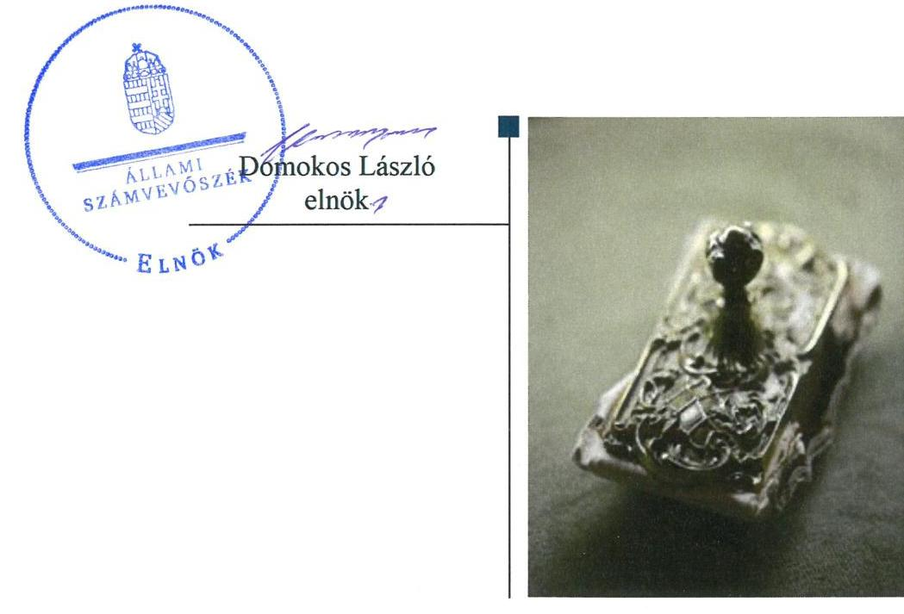
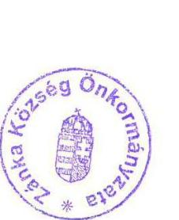
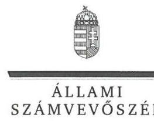
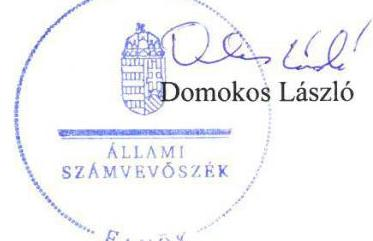
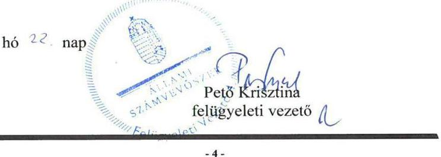

# Jelentés 

## Önkormányzatok ellenőrzése

Integritás- és belső kontrollrendszer, Befektetési tevékenységek ellenőrzése - Zánka Község Önkormányzata 2019.

---

# Jelentés 

## Önkormányzatok ellenőrzése

Integritás- és belső kontrollrendszer, Befektetési tevékenységek ellenőrzése - Zánka Község Önkormányzata
2019. 10. hó 16. nap

---

# AZ ELLENŐRZÉST FELÜGYELTE: 

PETŐ KRISZTINA felügyeleti vezető

## AZ ELLENŐRZÉST VEZETTE ÉS A VÉGREHAJTÁSÁÉRT FELELŐS:

DR. NAGY JUDIT ellenőrzésvezető

## A PROGRAM ÖSSZEÁLLÍTÁSÁÉRT FELELŐS:

TÓTPÁL SZABOLCS osztályvezető

IKTATÓSZÁM: EL-1666-001/2019

TÉMASZÁM: 2485

## ELLENŐRZÉS-AZONOSÍTÓ SZÁM: V-082929

Jelentéseink az Országgyúlés számítógépes hálózatán és az Interneten a www.asz.hu címen is olvashatóak.

---

# TARTALOMJEGYZÉK 

■ ÖSSZEGZÉS ..... 5
■ AZ ELLENŐRZÉS CÉLJA ..... 6
■ AZ ELLENŐRZÉS TERÜLETE ..... 7
■ AZ ELLENŐRZÉS HÁTTERE, INDOKOLTSÁGA ..... 8
■ A JELENTÉS LÉNYEGES KÉRDÉSKÖREI ..... 9
■ AZ ELLENŐRZÉS HATÓKÖRE ÉS MÓDSZEREI ..... 10
■ MEGÁLLAPÍTÁSOK ..... 12
■ JAVASLATOK ..... 17
■ MELLÉKLETEK ..... 21
I. sz. melléklet: Értelmező szótár ..... 21
■ FÜGGELÉKEK ..... 23
I. sz. függelék a jelentéshez ..... 23
II. sz. függelék: Észrevételek ..... 24
■ RÖVIDÍTÉSEK JEGYZÉKE ..... 33

---

.

---

# ÖSSZEGZÉS 

Zánka Község Önkormányzatánál kialakított belső kontrollrendszer nem biztositotta a közpénzekkel, a nemzeti vagyonnal történő szabályszerű, átlátható és elszámoltatható gazdálkodást és a befektetési tevékenység szabályszerű végzését. Az integritás alapú müködés nem volt biztositott.

## Az ellenőrzés társadalmi indokoltsága

Az Állami Számvevőszék alapvető feladata a közpénzekkel, az állami és önkormányzati vagyonnal való gazdálkodás ellenőrzése. Az Alaptörvény szerint az önkormányzatok kötelezettsége a kiegyensúlyozott, átlátható és fenntartható költségvetési gazdálkodás elvének érvényesítése, a nemzeti vagyonnal való rendeltetésszerű és felelős módon való gazdálkodás biztosítása. Az Állami Számvevőszék stratégiájában megfogalmazott célkitűzése az integritás alapú, átlátható és elszámoltatható közpénzfelhasználás elősegítése. Ennek megvalósítása érdekében az Állami Számvevőszék prioritásként kezeli a közpénzzel gazdálkodó szervezetek esetében a belső kontrollrendszer múködésének ellenőrzését.

## Főbb megállapítások, következtetések, javaslatok

Zánka Község Önkormányzata belső kontrollrendszerének kialakítása, működtetése nem volt szabályszerű, így nem volt biztosított a közpénzekkel, a nemzeti vagyonnal történő szabályszerű, átlátható és elszámoltatható gazdálkodás.

A jegyző nem alakította ki a Zánkai Közös Önkormányzati Hivatal gazdálkodásának kereteit, nem rendezte a kötelezettségvállalást, ellenjegyzést, teljesítés igazolást, érvényesítést, utalványozást végző személyek kijelölésének rendjét. Nem állapította meg a vagyonnyilatkozat tételhez kapcsolódó további szabályokat és nem készített ellenőrzési nyomvonalat. Nem állt rendelkezésre a beszerzések lebonyolításával kapcsolatos eljárásrend, valamint adatvédelmi és adatbiztonsági szabályzat. Zánka Község Önkormányzata nem rendelkezett a hivatásetikai alapelvek részletes tartalmát és az etikai eljárás szabályait rögzítő dokumentummal.

A 2013-2017. években a kiépített kontrollrendszer nem biztosította a befektetési tevékenység szabályszerű végzését. Nem álltak rendelkezésre számviteli szabályzatok 2015. szeptember 30-ig. Az egyes befektetések részletező nyilvántartásának nem a jogszabályi előírások szerinti vezetése, valamint a leltári alátámasztottság hiányában Zánka Község Önkormányzata beszámolója a vagyonáról nem nyújtott megbízható és valós képet.

A jegyző kockázatkezelési rendszert nem alakított ki, nem mérte fel és nem állapította meg az Önkormányzat tevékenységében rejlő kockázatokat. A jegyző nem alakított ki továbbá olyan rendszereket, amelyek biztosították volna, hogy az információk megfelelő időben eljussanak az illetékesekhez, valamint nem határozta meg a beszámolási szinteket, határidőket és módokat.

Az integritás elve nem érvényesült az azt támogató kontrollok kialakításának hiányosságai miatt. Zánka Község Önkormányzata nem alakított ki olyan kontrollokat, amelyek védelmet nyújtottak volna az esetleges korrupciós kockázatokkal szemben. Az Önkormányzatnál széles körű lehetőség van az integritás-tudatos múködés fejlesztésére.

Az Állami Számvevőszék a jegyző munkajogi felelősségre vonását kezdeményezte volna, azonban a jegyző személyének 2018-ban történt változása miatt ez ellehetetlenült.

Az Állami Számvevőszék az ellenőrzés megállapításai alapján Zánka Község Önkormányzata polgármesterének négy javaslatot, a Zánkai Közös Önkormányzati Hivatal jegyzőjének 22 javaslatot fogalmazott meg.

---

# AZ ELLENŐRZÉS CÉLJA 

AZ ELLENŐRZÉS CÉLJA annak megállapítása volt, hogy Zánka Község Önkormányzata belső kontrollrendszere biztosította-e a közpénzekkel és a nemzeti vagyonnal történő elszámoltatható, átlátható, szabályszerű, gazdaságos, hatékony és eredményes gazdálkodás feltételeit. Az ellenőrzés keretében az Állami Számvevőszék értékelte továbbá, hogy az önkormányzatnál kiépítették és erősítették-e a korrupciós kockázatok kezelését szolgáló integritás kontrollokat és azt, hogy megteremtették-e a teljesítményellenőrzés feltételeit.

Az ellenőrzés további célja annak értékelése volt, hogy a jogszabályi előírásoknak megfelelően alakították-e ki a belső kontrollrendszert, a kontrollkörnyezet biztosította-e a befektetési tevékenységek szabályszerű végzését. Az Állami Számvevőszék értékelte továbbá, hogy az egyes befektetési tevékenységekkel kapcsolatos döntéshozatal és a döntések végrehajtása, valamint az egyes befektetések számviteli elszámolása, nyilvántartása szabályszerű volt-e, és a belső és külső ellenőrzések támogatták-e az egyes befektetési tevékenységek szabályszerű végzését.

---

# AZ ELLENŐRZÉS TERÜLETE 

## Zánka Község Önkormányzata

A Veszprém megyében található Zánka település lakóinak száma 780 fő volt a Központi Statisztikai Hivatal Magyarország közigazgatási helynévkönyve alapján 2018. január 1-jén. Az Önkormányzat ${ }^{1}$ hét tagú képviselő-testületének munkáját kettő állandó bizottság segítette. A településen Zánkai Német Nemzetiségi Önkormányzat múködött.

Az Önkormányzat a gazdálkodási feladatokat Zánkai Közös Önkormányzati Hivatalon keresztül látta el, amely szervezeti egységekre nem tagolódott, gazdasági szervezettel nem rendelkezett. A Hivatal²-ban a foglalkoztatott köztisztviselők száma 2017. év végén 19 fő volt.

A Hivatal 2013. január 1-jétől múködik, Balatoncsicsó, Balatonszepezd, Monoszló, Öbudavár, Szentantalfa, Szentjakabfa, Tagyon, Zánka Községek Önkormányzatának Képviselő-testületei hozták létre Zánka székhellyel.

A belső ellenőrzési feladatokat 20 kistérségi önkormányzat által létrehozott Társulás ${ }^{3}$ látta el.

A polgármester ${ }^{4}$ az 1998. évi önkormányzati választások óta tölti be tisztségét, a jegyző ${ }^{5}$ személye az ellenőrzött időszakban nem változott.

Az éves költségvetési beszámoló alapján az Önkormányzat a 2017. évben 407,5 millió Ft költségvetési bevételt ért el, valamint 279,1 millió Ft költségvetési kiadást teljesített. A mérleg szerinti eszközvagyon értéke 2017. december 31-én 1867,6 millió Ft volt. Az önkormányzat 9,8 millió Ft részesedéssel, valamint 303,3 millió Ft értékpapír-befektetéssel rendelkezett 2017. december 31-én.

A forrásokon belül a költségvetési évben esedékes kötelezettség állomány 9,0 millió Ft-ot, a költségvetési évet követően esedékes kötelezettség állomány 5,1 millió Ft-ot tett ki.

---

# AZ ELLENŐRZÉS HÁTTERE, INDOKOLTSÁGA 

A belső kontrollrendszer kialakítása és működtetése nélkül nem valósítható meg a közpénzek, a közvagyon átlátható, szabályos, gazdaságos, hatékony és eredményes felhasználása. A belső kontrollrendszer azt a célt szolgálja, hogy a költségvetési szervek működésük és gazdálkodásuk során a tevékenységeket szabályszerűen hajtsák végre, teljesítsék elszámolási kötelezettségeiket és megvédjék az erőforrásokat a veszteségektől, a károktól és a nem rendeltetésszerű használattól. A belső kontrollrendszer magában foglalja mindazon elveket, eljárásokat és belső szabályzatokat, melyek biztosítják, hogy a költségvetési szerv valamennyi tevékenysége és célja összhangban legyen a szabályszerűséggel, szabályozottsággal, valamint a gazdaságosság, hatékonyság és eredményesség követelményeivel, az eszközökkel és forrásokkal való gazdálkodásban ne kerüljön sor pazarlásra, visszaélésre, rendeltetésellenes felhasználásra. Megfelelő, pontos és naprakész információk álljanak rendelkezésre a költségvetési szerv működésével kapcsolatosan, és a belső kontrollrendszer harmonizációjára, öszszehangolására vonatkozó jogszabályok végrehajtásra kerüljenek. Az integritás kontrollok kiépítése, erősítése a szervezet korrupciós kockázatainak kezelését szolgálja. A teljesítménykövetelmények meghatározása és működtetése megalapozhatja az önkormányzatoknál a teljesítményellenőrzés lefolytatását.

Az önkormányzati vagyongazdálkodás keretében az önkormányzatok átmenetileg szabad pénzeszközeinek befektetését jogszabály nem tiltja, a befektetések jellege nem korlátozott, a pénzpiaci szolgáltatók közül az önkormányzatok a kínált szolgáltatás és annak költségei alapján, szabadon választhatnak, azonban a veszteséges gazdálkodás kockázatai és következményei az önkormányzatokat terhelik. A szabad pénzeszközök felhasználása során kiemelten fontos a felelős gazdálkodás érvényesülése, amely összhangban kell, hogy legyen, az önkormányzati gazdálkodás alapelveivel. Az ellenőrzéssel feltárásra kerülhetnek azok a kockázatok, amelyek az önkormányzatok gazdálkodásával, ezen belül befektetési tevékenységeivel, kontrollkörnyezetével kapcsolatosak és a befektetési tevékenységek szabályszerű végrehajtását befolyásolják. Az ellenőrzéssel az önkormányzatok befektetési/vagyongazdálkodási döntései értékelhetővé válnak, és megalapozott megállapítás tehető arra vonatkozóan, hogy milyen hatást gyakoroltak az önkormányzat vagyonára a képviselő-testület döntései.

---

# A JELENTÉS LÉNYEGES KÉRDÉSKÖREI 

1. Az önkormányzat belső kontrollrendszerének kialakítása és müködtetése szabályszerű volt-e a 2017. évben?
2. Az önkormányzatnál alakítottak-e ki a szervezeti teljesítmény mérésére alkalmas követelményeket?
3. Az önkormányzatnál a befektetési tevékenységek szabályszerű végzését a belső kontrollrendszer biztositotta-e a 2013-2017. években? Az önkormányzat a 2017. december 31-én meglévő egyes befektetéseivel kapcsolatos döntéshozatala és az egyes befektetések számviteli elszámolása, nyilvántartása szabályszerű volt-e?

---

# AZ ELLENŐRZÉS HATÓKÖRE ÉS MÓDSZEREI 

## Az ellenőrzés típusa

Megfelelőségi és szabályszerűségi ellenőrzés.

## Az ellenőrzött időszak

Az integritás és belső kontrollrendszer ellenőrzött időszaka a 2017. év, illetve az éves költségvetési beszámoló Áht. ${ }^{6}$ által előírt jóváhagyásáig (2018. május 31-ig) tartó időszak volt.

Az egyes befektetési tevékenységek ellenőrzése tekintetében az ellenőrzött időszak 2013. január 1. - 2017. december 31. közötti időszak.

## Az ellenőrzés tárgya

Zánka Község Önkormányzata és a gazdálkodási feladatokat ellátó Zánkai Közös Önkormányzati Hivatal belső kontrollrendszerének kialakítása és múködtetése, valamint az integritás kontrollok kiépítettsége, a teljesítményellenőrzés feltételeinek rendelkezésre állása volt.

Az egyes befektetési tevékenységek ellenőrzésének tárgya az önkormányzat 2017. december 31-én meglévő, a Számv. tv. ${ }^{7}$ 3. § (6) bekezdés 2. és 3. pontja szerint az értékpapírokban megtestesülő befektetései, lekötött betétei.

## Az ellenőrzött szervezet

Zánka Község Önkormányzata és Zánkai Közös Önkormányzati Hivatal.

## Az ellenőrzés jogalapja

Az ellenőrzés jogszabályi alapját az ÁSZ tv. ${ }^{8}$ 1. § (3) bekezdése, az 5. § (2) és (6) bekezdései, valamint az Áht. 61. § (2) bekezdésének előírásai képezik.

## Az ellenőrzés módszerei

Az ÁSZ ${ }^{9}$ az ellenőrzést az ellenőrzési program szempontjai, az ellenőrzött időszakban hatályos jogszabályok, az ellenőrzés szakmai szabályai, a jelen ellenőrzésre irányadó ÁSZ módszertanok figyelembevételével hajtotta végre. Az ellenőrzési kérdések megválaszolásához szükséges bizonyítékok

---

megszerzése az ellenőrzött által rendelkezésre bocsátott dokumentumokra, adatokra alapozva megfigyelés, szemle (szemrevételezés), kérdésfeltevés (információkérés), mintavételezés, valamint elemző eljárás útján történt. Az ellenőrzési bizonyítékként felhasználható adatforrások közé tartoznak az ellenőrzési program részletes szempontjainál felsorolt adatforrások, valamint minden egyéb - az ellenőrzés folyamán feltárt, az ellenőrzés szempontjából információt tartalmazó - dokumentum.

Az ellenőrzés lefolytatásához az ellenőrzött szervezet tanúsítványok kitöltésével, valamint az ÁSZ által kért dokumentumok megküldésével szolgáltatott adatokat, amelyek valódiságát és teljes körűségét az ellenőrzött szervezet vezetője által tett teljességi és hitelességi nyilatkozat igazolja. A rendelkezésre bocsátott adatok, információk kontrollja az ellenőrzés keretében megtörtént.

Az önkormányzat belső kontrollrendszere egyes pilléreinek kialakítására és működtetésére vonatkozó értékelés:
$\longrightarrow$ „szabályszerű", amennyiben az értékelt területen az elért „igen" válaszok százalékban kifejezett, egész számra kerekített aránya legalább $85 \%$,
$\longrightarrow$ „nem szabályszerű", ha nem éri el a $85 \%$-ot,
Az önkormányzat belső kontrollrendszerének összesített értékelése az egyes részterületek esetében kapott megfelelőségi arányok számtani átlaga alapján történik és megegyezik a pillérenként (kontrollterületenként) alkalmazott százalékos értékelésekkel, a következő eltérésekkel: a kontrollrendszer egésze esetében a „szabályszerű" értékelésnek a százalékos értéken felül további feltétele, hogy egyik kontrollterület sem kaphat „nem szabályszerű" értékelést.

A 2017. évi kiadások teljesítéséhez kapcsolódó pénzgazdálkodási belső kontrollok működésének szabályszerűsége esetében az ellenőrzés azokra a legnagyobb értékű tételekre - a lényeges sokaságra - terjedt ki, melyek összértéke eléri a teljes sokaság összértékének 50\%-át. A 2017. évi kiadások esetében lényeges sokaságból véletlen mintavételi eljárással kiválasztott tételek kerültek ellenőrzésre.
„Szabályszerűnek" értékeltünk egy ellenőrzött területet, amennyiben 95\%-os bizonyossággal az ellenőrzött sokaságban az átlagos hibaarány legfeljebb 10\%, „nem szabályszerűnek", amennyiben 10\%-nál magasabb arányt képviselt.

Az önkormányzat befektetési tevékenységét a 2013. január 1. és 2017. december 31. közötti időszak vonatkozásában értékeltük.

Az ÁSZ az ellenőrzés ideje alatt az ellenőrzött szervezettel történő kapcsolattartást az ÁSZ SZMSZ ${ }^{10}$ vonatkozó előírásai alapján biztosította.

---

# 1. Az önkormányzat belső kontrollrendszerének kialakítása és múködtetése szabályszerű volt-e a 2017. évben? 

Összegző megállapítás

Az Önkormányzat belső kontrollrendszerének kialakítása és múködtetése nem volt szabályszerű a 2017. évben.

### 1.1. számú megállapítás

A kontrollkörnyezet kialakítása a 2017. évben nem volt szabályszerű.

A jegyző a Vnytv. ${ }^{11}$ 4. § a) pont előírása ellenére a Hivatali SZMSZ ${ }_{1.2}{ }^{12}$-ben nem tüntette fel a vagyonnyilatkozat-tételi kötelezettséget. A jegyző a Vnytv. 11. § (6) bekezdésében előírt vagyonnyilatkozat átadására, nyilvántartására, a vagyonnyilatkozatban foglalt személyes adatok védelmére vonatkozó további szabályokat szabályzatban nem állapított meg.

Az Önkormányzat rendelkezett a Számv. tv. és az Áhsz. ${ }^{13}$ előírásai szerint számviteli szabályzatokkal. A Számv. tv. 161. § (1) és (4) bekezdései, az Áhsz. 51. § (2) bekezdése ellenére a polgármester nem gondoskodott az Önkormányzat, valamint a jegyző a Hivatal számlarendjének elkészítéséről.

A jegyző elkészítette az Ávr. ${ }^{14}$ előírásai szerint az Önkormányzat gazdálkodás részletes rendjét tartalmazó gazdálkodási szabályzat ${ }_{1-3}{ }^{15}$-ot. A Hivatal kiadásaira vonatkozóan a jegyző az Ávr. 13. § (2) bekezdés a) pontja ellenére belső szabályzatban nem rendezte a kötelezettségvállalást, ellenjegyzést, teljesítés igazolást, érvényesítést, utalványozást végző személyek kijelölésének rendjével kapcsolatos belső előírásokat, feltételeket.

A polgármester a Kttv. ${ }^{16}$ 75. § (1) bekezdés d) pontjában, valamint a 226. § (2) bekezdése a) és b) pontjaiban foglaltakat megsértette, mert nem gondoskodott munkaköri leírásról a jegyző részére.

A jegyző a Bkr. ${ }^{17}$ 3. § b) pontjában foglaltak ellenére 2017. december 31-ig nem alakított ki - a szervezet minden szintjén érvényesülő - integrált kockázatkezelési rendszert. A jegyző nem szabályozta a Bkr. 6. § (4) bekezdésében előírt szervezeti integritást sértő események kezelésének eljárásrendjét, valamint az integrált kockázatkezelési rendszer eljárásrendjét.

A jegyző az Info tv. ${ }^{18}$ 24. § (3) bekezdésében rögzítettek ellenére nem készítette el az adatvédelmi és adatbiztonsági szabályzatot.

A jegyző az Ltv. ${ }^{19}$ 10. § (1) bekezdése c) pontjában előírtak ellenére nem adott ki a Magyar Nemzeti Levéltár és a megyei kormányhivatal egyetértésével iratkezelési szabályzatot.

Az Ávr. 13. § (2) bekezdés b) pontja ellenére a jegyző belső szabályzatban nem rendezte a beszerzések lebonyolításával kapcsolatos eljárásrendet.

---

A Kttv. 231. § (1) bekezdésében foglaltak ellenére a hivatásetikai alapelvek részletes tartalmát, valamint az etikai eljárás szabályait a Képviselőtestület ${ }^{20}$ nem állapította meg.

A Hivatal a Bkr. 6. § (3) bekezdésében előírtak ellenére ellenőrzési nyomvonallal nem rendelkezett.

A Bkr. 8. § (4) bekezdés b) pontjában foglaltak ellenére a jegyző nem szabályozta a dokumentumokhoz, információkhoz való hozzáférést.

A jegyző a Bkr. 9. § (1)-(2) bekezdésében foglaltak ellenére nem alakított ki olyan rendszereket, melyek biztosítják, hogy a megfelelő információk a megfelelő időben eljutnak az illetékes szervezethez, szervezeti egységhez, illetve személyhez; nem alakítottak ki beszámolási rendszereket, így a beszámolási szintek, határidők és módok nem kerültek meghatározásra.

Az Önkormányzat a Bkr. 22. § (1) bekezdés b) pontjában előírtak ellenére nem rendelkezett kockázatelemzéssel alátámasztott stratégiai ellenőrzési tervvel.

A jegyző a Bkr. 10. § ellenére nem alakította ki a szervezet tevékenységének, a célok megvalósításának nyomon követését biztosító rendszerét.

A Képviselő-testület az Mötv. ${ }^{21}$ és az Áht. előírásai szerint megalkotta az Önkormányzati SZMSZ ${ }_{1,2}{ }^{22}$-t és a Hivatali SZMSZ ${ }_{1,2}$-t. Az Önkormányzat az Mötv. előírásai szerint elkészítette gazdasági programját ${ }^{23}$, illetve a vagyongazdálkodási rendeletben ${ }^{24}$ az önkormányzati vagyonnal történő gazdálkodás szabályait.

Az Önkormányzatnál az Ávr. 60. § (3) bekezdése szerint nyilvántartást vezettek a gazdálkodási jogköröket gyakorló személyekről és aláírás mintájukról.

# 1.2. számú megállapítás 

Az integrált kockázatkezelési rendszer nem múködött a 2017. évben

A Bkr. 7. § (1) bekezdés előírása ellenére a jegyző nem működtetett a 2017. évben integrált kockázatkezelési rendszert, mert nem mérte fel a Bkr. 7. § (2) bekezdés előírása szerint a költségvetési szerv tevékenységében rejlő és szervezeti célokkal összefüggő kockázatokat, nem határozta meg az egyes kockázatokkal kapcsolatban szükséges intézkedéseket, valamint azok teljesítésének, folyamatos nyomon követésének módját.

### 1.3. számú megállapítás

A kontrolltevékenységek gyakorlása nem volt szabályszerű 2017ben.

A gazdálkodási jogkörök gyakorlása az Ávr. 57. § (1) bekezdése előírásai alapján nem volt szabályszerű, mert a teljesítésigazolást az Ávr. 57. § (4) bekezdése előírásai ellenére nem az arra jogosult írta alá.

A kötelezettségvállalások nyilvántartása nem az Áhsz. 14. melléklet II. rész 4. b) és h) pontjai előírásai szerint történt, mert nem tartalmazta a kötelezettségvállalás iktató vagy érkeztető számát, valamint a könyvviteli számlák megnevezését.

---

# 1.4. számú megállapítás 

Az információs és kommunikációs rendszer múködtetése nem volt szabályszerű 2017. évben.

Az Ávr. 169. § (3) bekezdésében foglaltak ellenére az első negyedévet követően nem havonta töltötte fel a Kincstár által működtetett elektronikus adatszolgáltató rendszerbe az Önkormányzat időközi költségvetési jelentését, hanem negyedévente.

Az Önkormányzat az Ávr. 5. mellékletének 2. pontjában meghatározottak ellenére a Gst. ${ }^{25}$ 3. § (1) bekezdése szerinti, az adósságot keletkeztető ügyletei állományára vonatkozó adatszolgáltatási kötelezettségének nem tett eleget.

## A nyomon követési rendszer (monitoring) nem múködött a 2017. évben.

A jegyző a Bkr. 10. § előírása ellenére kialakítás hiányában nem működtette a szervezet tevékenységének, a célok megvalósításának nyomon követését biztosító rendszert.

A belső ellenőrzés működtetése nem volt szabályszerű. Az Önkormányzat a Bkr. 47. § (1) bekezdésében foglalt előírás ellenére nem vezetett éves bontásban nyilvántartást a belső ellenőrzési jelentésekben tett megállapítások, javaslatok, a vonatkozó intézkedési tervek és azok végrehajtásának nyomon követéséről.

A jegyző a Bkr. 1. melléklete szerinti nyilatkozatában szabályszerűnek értékelte az Önkormányzat belső kontrollrendszerét, azonban azt a Bkr. 11. § (2a) bekezdés előírása ellenére az éves költségvetési beszámolóval együtt nem küldte meg a polgármesternek. Az ÁSZ ellenőrzés a jegyzői nyilatkozattal ellentétes következtetésre jutott.

Az Önkormányzat integritás elvű működését nem támogatták a jogszabályokban előírt, valamint a nem kötelező, de az integritást erősítő és támogató kontrollok. Nem végeztek rendszerszerű, valamint korrupciós kockázatelemzést, nem kezelték a sajátosságokat tükröző és a szervezeti célokhoz kapcsolódó kockázatokat. Nem rendelkeztek adatvédelmi, iratkezelési, titokvédelmi szabályzattal. Nem szabályozták az etikai elvárásokat, az ajándékok, meghívások, utaztatás elfogadásának feltételeit. A külső panaszok kezelésére és a közérdekú bejelentések kezelésére szabályozást nem készítettek. A múködési folyamatok során nem alkalmazták a „négy szem" elvet. Nem múködtették a teljesítményértékelési rendszert.

Az Önkormányzat hosszú távú céljait meghatározták, de azok között nem szerepelt az integritás erősítése.

---

# 2. Az önkormányzatnál alakítottak-e ki a szervezeti teljesítmény mérésére alkalmas követelményeket? 

Összegző megállapítás Az Önkormányzatnál nem alakítottak ki a szervezeti teljesítmény mérésére alkalmas követelményeket.

A szervezeti célok elérését szolgáló feladatok, folyamatok, tevékenységek mérését szolgáló indikátorokat, mérőszámokat, feladat- és teljesítménymutatókat az Önkormányzat nem képzett, így nem biztosította a teljesítménymérés lehetőségét.

## 3. Az önkormányzatnál a befektetési tevékenységek szabályszerű végzését a belső kontrollrendszer biztosította-e a 2013-2017. években? Az önkormányzat a 2017. december 31-én meglévő egyes befektetéseivel kapcsolatos döntéshozatala és az egyes befektetések számviteli elszámolása, nyilvántartása szabályszerű volt-e?

## Összegző megállapítás

Az Önkormányzatnál a befektetési tevékenység végzése nem szabályszerűen történt a 2013-2017. években.

### 3.1. számú megállapítás

A befektetési tevékenységek szabályszerű végzését a belső kontrollrendszer nem biztosította a 2013-2017. években.

A Képviselő-testület 2014. október 25-ig, az Mötv. 53. § (1) bekezdés a) pontja ellenére működésének szabályait szervezeti és működési szabályzatban nem határozta meg.

A Hivatal 2015. augusztus 31-ig, az Áht. 9. § (1) bekezdés b) pontja ellenére nem rendelkezett a Képviselő-testület által jóváhagyott SZMSZ-szel.

Az Önkormányzat nem rendelkezett az Mötv. 116. (1) bekezdése ellenére a Képviselő-testület által elfogadott gazdasági programmal, fejlesztési tervvel 2015. április 2-ig.

Az Önkormányzat 2015. szeptember 30-ig nem rendelkezett a Számv. tv. 14. § (3), valamint (5) bekezdésében előírt számviteli szabályzatokkal.

A Bkr. 7. § (1) bekezdés előírása ellenére a jegyző nem működtetett 2016. szeptember 30-ig kockázatkezelési, 2016. október 1-jétől integrált kockázatkezelési rendszert.

Az Önkormányzat nem rendelkezett a 2013. évre vonatkozó éves ellenőrzési tervvel, az Mötv. 119. § (5) bekezdése ellenére.

A belső ellenőrzés a 2013-2017. években ellenőrzéseivel nem támogatta a befektetési tevékenységek szabályszerű végzését.

---

# 3.2. számú megállapítás 

Az Önkormányzat 2017. december 31-én meglévő befektetett eszközeivel kapcsolatos döntéshozatal szabályszerű volt, azonban az egyes befektetések számviteli elszámolása, nyilvántartása nem volt szabályszerű.

A polgármester az Önkormányzat 2017. december 31-én meglévő befektetett pénzügyi eszközeivel kapcsolatos döntéseket a költségvetési rendeletek előírásaiban foglalt felhatalmazás szerint hozta meg.

A jegyző 2014. január 1-jétől az Áhsz. 45. § (3) bekezdésben foglaltak ellenére a befektetett eszközökről jogszabályban előírt adatszolgáltatási kötelezettsége alátámasztásához sem a könyvviteli számlák az Áhsz. 51. § (1a) bekezdése szerinti alábontásával, sem az Áhsz. 14. melléklet VIII. fejezet 2. pontjában meghatározott kötelező minimum tartalmi követelmények szerinti részletező nyilvántartást vezetésével nem gondoskodott.

A befektetett pénzügyi eszközök értékelése a Számv. tv. 47. § (1) bekezdésének és az Eszközök és források értékelési szabály-zata ${ }_{1,2}{ }^{26}$ 4.2.3. pontjának előírásai ellenére nem a bekerülési értéken történt a 2017. évben.

A jegyző a Számv. tv. 69. § (1) bekezdésének és 2013-2014. években szabályozás hiányában, 2015-2017. években a Leltárkészítési és leltározási szabályzat ${ }^{27}$ 5.1. A/III. pontja előírása ellenére a befektetett pénzügyi eszközök mérlegtételeinek alátámasztásához nem állított össze olyan leltárt, amely tételesen, ellenőrizhető módon tartalmazza a mérleg fordulónapján meglévő eszközöket és forrásokat mennyiségben és értékben.

---

# JAVASLATOK 

Az ÁSZ tv. 33. § (1) bekezdésében foglaltak értelmében az ellenőrzött szervezet vezetője köteles a jelentésben foglalt megállapításokhoz kapcsolódó intézkedési tervet összeállítani és azt a jelentés kézhezvételétől számított 30 napon belül az ÁSZ részére megküldeni. Amennyiben az ellenőrzött szervezet vezetője nem küldi meg határidőben az intézkedési tervet, vagy továbbra sem elfogadható intézkedési tervet küld, az Állami Számvevőszék elnöke az ÁSZ tv. 33. § (3) bekezdése a) és b) pontjaiban foglaltakat érvényesítheti.

## Zánka Község Önkormányzata polgármesterének

1. Intézkedjen a jogszabály szerinti számlarend elkészitéséről.
(1.1. sz. megállapítás 2. bekezdésének 2. mondata alapján)
2. Rögzítse a jegyző feladatait és a munkakör betöltésével kapcsolatos követelményeket munkaköri leírásban.
(1.1. sz. megállapítás 4. bekezdése alapján)
3. Kezdeményezze a hivatásetikai alapelvek részletes tartalmának, valamint az etikai eljárás szabályainak megállapítását.
(1.1. sz. megállapítás 9. bekezdése alapján)
4. Intézkedjen a stratégiai ellenőrzési terv Képviselő-testület elé terjesztéséről annak jóváhagyása érdekében.
(1.1. sz. megállapítás 13. bekezdése alapján)

## Zánkai Közös Önkormányzati Hivatal jegyzőjének

1. Kezdeményezze a hivatali SZMSZ módosítását a vagyonnyilatkozat tételre kötelezett személyek feltüntetése érdekében, valamint intézkedjen a vagyonnyilatkozat átadására, nyilvántartására, a vagyonnyilatkozatban foglalt személyes adatok védelmére vonatkozó további szabályok megállapításáról.
(1.1. sz. megállapítás 1. bekezdése alapján)

---

2. Intézkedjen a jogszabályi előírás szerinti számlarend elkészítéséről.
(1.1. sz. megállapítás 2. bekezdésének 2. mondata alapján)
3. Intézkedjen a gazdálkodási jogkörgyakorlók kijelölésének rendjével kapcsolatos belső előírások, feltételek belső szabályzatban történő rendezéséről.
(1.1. sz. megállapítás 3. bekezdésének 2. mondata alapján)
4. Intézkedjen az integrált kockázatkezelési rendszer kialakításáról.
(1.1. sz. megállapítás 5. bekezdésének 1. mondata alapján)
5. Intézkedjen az integrált kockázatkezelés eljárásrendjének, valamint a szervezeti integritást sértő események kezelésének eljárásrendjének szabályozása érdekében.
(1.1. sz. megállapítás 5. bekezdésének 2. mondata alapján)
6. Intézkedjen a jogszabályi előírás szerinti adatvédelmi és adatbiztonsági szabályzat elkészitéséről.
(1.1. sz. megállapítás 6. bekezdése alapján)
7. Intézkedjen a jogszabályi előírás szerinti iratkezelési szabályzat kiadása érdekében.
(1.1. sz. megállapítás 7. bekezdése alapján)
8. Intézkedjen a beszerzések lebonyolításával kapcsolatos eljárásrend belső szabályzatban történő rendezéséről.
(1.1. sz. megállapítás 8. bekezdése alapján)
9. Intézkedjen a jogszabályi előírás szerinti ellenőrzési nyomvonal elkészitése érdekében.
(1.1. sz. megállapítás 10. bekezdése alapján)
10. Intézkedjen a felelősségi körök meghatározásával a dokumentumokhoz, információkhoz való hozzáférés szabályozásáról.
(1.1. sz. megállapítás 11. bekezdése alapján)

---

11. Intézkedjen a jogszabályi előírás szerinti információs és kommunikációs rendszer kialakításáról.
(1.1. sz. megállapítás 12. bekezdése alapján)
12. Kezdeményezze a belső ellenőrzési vezetőnél a kockázatelemzéssel alátámasztott stratégiai ellenőrzési terv összeállítását.
(1.1. sz. megállapítás 13. bekezdése alapján)
13. Intézkedjen a szervezet tevékenységének, a célok megvalósításának nyomon követését biztositó rendszer kialakításáról és müködtetéséről.
(1.1. sz. megállapítás 14. bekezdése, 1.5. sz. megállapítás 1. bekezdése alapján)
14. Intézkedjen az integrált kockázatkezelési rendszer müködtetése során a költségvetési szerv tevékenységében rejlő és szervezeti célokkal öszszefüggő kockázatok felméréséről és megállapításáról, valamint az egyes kockázatokkal kapcsolatban szükséges intézkedések és azok teljesítésének folyamatos nyomon követése módjának meghatározásáról.
(1.2. sz. megállapítás 1. bekezdése, 3.1. sz. megállapítás 5. bekezdése alapján)
15. Intézkedjen a jogszabály szerinti teljesítésigazolás jogszabályban előirtak szerinti teljesítéséről.
(1.3. sz. megállapítás 1. bekezdése alapján)
16. Intézkedjen a kötelezettségvállalások nyilvántartásának jogszabály szerinti vezetéséről.
(1.3. sz. megállapítás 2. bekezdése alapján)
17. Intézkedjen a jogszabályban elöírt adatszolgáltatási kötelezettség teljesítése érdekében.
(1.4. sz. megállapítás 1-2. bekezdése alapján)
18. Kezdeményezze a belső ellenőrzési vezetőnél a Bkr. szerinti nyilvántartás vezetését.
(1.5. sz. megállapítás 2. bekezdésének 2. mondata alapján)

---

19. 

Intézkedjen a jövőben a Bkr. 1. melléklete szerinti, valós tartalmú nyilatkozat irányító szerv vezetőjének történő megküldéséről a jogszabályban elöirtak figyelembevételével.
(1.5. sz. megállapítás 3. bekezdése alapján)
20. Intézkedjen a befektetett eszközök tekintetében a jogszabályban meghatározott nyilvántartás vezetéséről.
(3.2. sz. megállapítás 2. bekezdése alapján)
21. Intézkedjen a befektetett pénzügyi eszközök jogszabályban és belső szabályzatban meghatározott értékeléséről.
(3.2. sz. megállapítás 3. bekezdése alapján)
22. Intézkedjen a mérleg tételeinek alátámasztásához a jogszabály szerinti leltár összeállításáról.
(3.2. sz. megállapítás 4. bekezdése alapján)

---

# MELLÉKLETEK 

- I. SZ. MELLÉKLET: ÉRTELMEZŐ SZÓTÁR
belső ellenőrzés
belső kontrollrendszer
belső kontrollrendszer területei
közös önkormányzati hivatal
monitoring
monitoring-rendszer
önkormányzati hivatal
társulás

Független, tárgyilagos bizonyosságot adó és tanácsadó tevékenység, amelynek célja, hogy az ellenőrzött szervezet működését fejlessze és eredményességét növelje, az ellenőrzött szervezet céljai elérése érdekében rendszerszemléletű megközelítéssel és módszeresen értékeli, illetve fejleszti az ellenőrzött szervezet irányítási és belső kontrollrendszerének hatékonyságát. (Forrás: Bkr. 2. § b) pontja)
A belső kontrollrendszer a kockázatok kezelése és tárgyilagos bizonyosság megszerzése érdekében kialakított folyamatrendszer, amely azt a célt szolgálja, hogy a müködés és gazdálkodás során a tevékenységeket szabályszerűen, gazdaságosan, hatékonyan, eredményesen hajtsák végre, az elszámolási kötelezettségeket teljesítsék, megvédjék az erőforrásokat a veszteségektől, károktól és nem rendeltetésszerű használattól. (Forrás: Áht. 69. § (1) bekezdése)
A kontrollkörnyezet, az integrált kockázatkezelési rendszer, a kontrolltevékenységek, az információs és kommunikációs rendszer, valamint a nyomon követési (monitoring) rendszer. (Forrás: Bkr. 3. §)
A települési képviselő-testület más települési képviselő-testülettel társult képviselőtestületet alakíthat, amely esetén a képviselő-testületek részben vagy egészben egyesítik a költségvetésüket, közös önkormányzati hivatalt tartanak fenn és intézményeiket közösen müködtetik. (Forrás: Mötv. 56. § (1)-(2) bekezdései)
A monitoring általánosságban a különböző szintű szervezeti célok megvalósításának folyamatát kíséri figyelemmel, melynek során a releváns eseményekről és tevékenységekről (együtt: folyamatokról) rendszeres jelleggel, strukturált, döntéstámogató információkhoz jutnak a szervezet vezetői. (Forrás: NGM Útmutató a költségvetési szervek monitoring rendszeréhez 2011. november)
A költségvetési szerv vezetője köteles kialakítani a szervezet tevékenységének a célok megvalósításának nyomon követését biztosító rendszert, amely az operatív tevékenységek keretében megvalósuló folyamatos és eseti nyomon követésből, valamint az operatív tevékenységektől függetlenül működő belső ellenőrzésből állhat. (Forrás: Bkr. 10. §)
A polgármesteri hivatal, a főpolgármesteri hivatal, a megyei önkormányzati hivatal és a közös önkormányzati hivatal. (Forrás: Áht. 1. § 18. pont)
A helyi önkormányzatok képviselő-testületei megállapodhatnak abban, hogy egy vagy több önkormányzati feladat- és hatáskör, valamint a polgármester és a jegyző államigazgatási feladat- és hatáskörének hatékonyabb, célszerűbb ellátására jogi személyiséggel rendelkező társulást hoznak létre. (Forrás: Mötv. 87. §)

---

.

---

# FÜGGELÉKEK 

- I. SZ. FÜGGELÉK A JELENTÉSHEZ

Az Állami Számvevőszék az ellenőrzések során feltárt tényekhez kapcsolódó további körülmények tisztázására eszközrendszerrel nem rendelkezik. Amennyiben az ellenőrzésen túlmutatóan indokoltnak látszik az ellenőrzés során feltárt körülmények további vizsgálata, az Állami Számvevőszék törvényi felhatalmazás alapján az ellenőrzés által feltárt körülményeket továbbítja a hatáskörrel rendelkező szervnek a szükséges intézkedések megtétele, eljárások lefolytatása érdekében.
I. Az ellenőrzés megállapította, hogy a Zánkai Közös Önkormányzati Hivatalnál (továbbiakban: Hivatal) az egyes vagyonnyilatkozattételi kötelezettségekről szóló 2007. évi CLII. törvény (továbbiakban: Vnytv.) 4. § a.) pontjában foglaltak ellenére a Hivatal képviselő-testületi határozattal elfogadott szervezeti és müködési szabályzatában a jegyző nem tüntette fel a vagyonnyilatkozat-tételi kötelezettséget a Vnytv. 3. § (1) bekezdésében meghatározott közszolgálatban álló személyek esetében. A Képviselő-testület határozatával olyan szervezeti és müködési szabályzatot hagyott jóvá, amely nem felel meg a törvényi előírásoknak. Így nem teremtették meg a közélet tisztaságának, a korrupció megelőzésének biztositásához szükséges szabályozást. Az eset konkrét körülményeinek felderítésére a Kormányhivatal rendelkezik hatáskörrel.
II. Az ellenőrzés feltárta, hogy Zánka Község Önkormányzatánál a dologi kiadások vonatkozásában 132.530.673 Ft értékben, valamint külső személyi juttatások tárgyában 337.079 Ft értékben a törvénnyel ellentétes teljesítésigazolással történt a kifizetés. Az Ávr. 57. § (4) bekezdése ellenére a teljesités igazolását nem az arra jogosult végezte el. Ezért nem igazolt, hogy a kiadások valóban az Önkormányzat érdekében merültek fel, annak feladatellátását szolgálták, valamint hogy a kifizetésekhez valós teljesitések kapcsolódtak. Nem zárható ki, hogy a szabálytalan kifizetések az ellenőrzött szervezetnél vagyoni hátrányt okoztak. Az eset konkrét körülményeinek felderitésére az ügyészség rendelkezik hatáskörrel.
III. A jegyző a Számv. tv. 69. § (1) bekezdés előirása ellenére a 2013-2017. évi éves beszámolók vonatkozásában a befektetett pénzügyi eszközök mérlegsor tételeinek alátámasztásához nem állított össze leltárt, mely az eszközöket tételesen, ellenőrizhető módon tartalmazta. A leltári alátámasztottság hiányában az Önkormányzat beszámolóiban a Számv. tv. 15. § (3) bekezdésében foglalt előirás ellenére nem érvényesült a valódiság elve és nem igazolt, hogy az Önkormányzat beszámolói megbizható és valós összképet mutatnak az önkormányzat vagyonáról. Az eset konkrét körülményeinek felderitésére a Magyar Államkincstár rendelkezik hatáskörrel.

---

A jelentéstervezetet a Számvevőszék 15 napos észrevételezésre megküldte az ellenőrzött szervezet vezetőjének az ÁSZ tv. 29. §* (1) bekezdése előírásának megfelelően.

Zánka Község Önkormányzatának polgármestere a jelentéstervezet megállapításaira írásban észrevételt tett.
Az ÁSZ tv. 29. § (3) bekezdésével összhangban az ÁSZ a Függelékben feltünteti az ellenőrzés megállapításaival kapcsolatban tett, figyelembe nem vett észrevételeket, és megindokolja, hogy azokat miért nem fogadta el.

[^0]
[^0]:    * 29. § (1) Az Állami Számvevőszék az ellenőrzési megállapításait megküldi az ellenőrzött szervezet vezetőjének vagy az általa megbízott személynek, és annak, akinek személyes felelősségét állapította meg.
    (2) Az ellenőrzött szervezet vezetője és a felelősként megjelölt személy az ellenőrzés megállapításaira tizenöt napon belül írásban észrevételt tehet.
    (3) Az Állami Számvevőszék az észrevételre a beérkezésétől számított harminc napon belül írásban válaszol. A figyelembe nem vett észrevételeket köteles a jelentésben feltüntetni, és megindokolni, hogy azokat miért nem fogadta el.

---

Zánka Község Önkormányzata
8251 Zánka, Iskola utca 11. Telefon: 87/468-000
E-mail: zankaph@t-online.hu

Ügyiratszám: ZAN/803-3/2019
Elérhetőség: 06-87/468-000

Tárgy: Észrevételek a Zánka Község Önkormányzata integritás és belső kontrollrendszer, befektetési tevékenységek ellenőrzése 2019. jelentéstervezettel kapcsolatban

Hivatkozási szám: EL-829-052/2019

Állami Számvevőszék

Budapest
Apáczai Csere János utca 10.
1052

Tisztelt Állami Számvevőszék!

Zánka Község Önkormányzata integritás és belső kontrollrendszer, befektetési tevékenységek ellenőrzése 2019. jelentéstervezettel kapcsolatban az alábbi észrevételeket tesszük. Közös hivatalunk 8 település feladatait látja el, ahol 8 önkormányzat, 3 nemzetiségi önkormányzat, 2 intézményirányító társulás, 1 iskola, 2 óvoda, bölcsőde, strandok, hivatal irányítását végző polgármesterek együttes szervezete müködik.

A közelmúltban a jegyzői és aljegyzői tisztségben személyi változások történtek.

Valamennyi döntésünket testületi határozattal, a teljes nyilvánosság biztosításával (Zánka TV, Zánkai Hírmondó) hoztuk meg.

Adatszolgáltatási kötelezettségünk teljesítése rendszeres, jó volt, az adatszolgáltatások időbeni, kiváló minőségben történő teljesítése miatt több évben, például 2017. évben is vissza nem térítendő központi költségvetési támogatásban részesültünk.

Gazdálkodásunk eredményeképpen két alkalommal sikeresen pályáztunk az adósságkonszolidációban részt nem vett Önkormányzatok pályázatában.

Adóssága, hitelfelvétele az Önkormányzatnak az eltelt 25 évben nem volt, ingatlanvagyonunkat megőriztük, telekértékesítésünk csak az állandó letelepedéseket támogatta. Fentiekkel kapcsolatban valamennyi évben költségvetési rendeletünkben határoztunk.

---

# Zánka Község Ö n k o r m án y z a t a 

8251 Zánka, Iskola utca 11. Telefon: 87/468-000
E-mail: zankaph@t-online.hu

A belső ellenőrzés szabályosságával kapcsolatban az alábbi észrevételeket tesszük:
Az ellenőrzés előkészítése során a bekért dokumentumok alapján nem kellett megküldeni Bkr. 50. § (1) bekezdésének megfelelő ellenőrzések nyilvántartását. Természetesen a vizsgálatban szereplő összes évre vonatkozóan rendelkezünk a Bkr. 50. §-ban meghatározott adattartalommal nyilvántartással, amelyek az aktuális év éves összefoglaló beszámoló 1. mellékletét is képezik. A Bkr. 47. § (1) bekezdésében előírt nyilvántartás csatolása nem történt meg. Az első - júniusi- adatbekérés 2017. évre vonatkozott, azonban az adott évben elvégzett ellenőrzés nem tartalmazott intézkedést igénylő megállapítást, ezért erről nem készült dokumentum.

Az Önkormányzat minden évben rendelkezett éves ellenőrzési tervvel. A képviselő-testület a 370/2011. (XII.31.) Kormányrendeletben meghatározott határidőig (dec.31.) elfogadta azt, majd a Balatonfüredi Többcélú Társulás Társulási Tanácsa összevontan is határozott a következő évben ellátandó belső ellenőri feladatokról.
(A harmadik adatbekérés 16. pontjában kérték az éves ellenőrzési terveket 2013.-2017. évre vonatkozóan. Mivel az ellenőrzés témája a befektetésekre irányult, nem volt egyértelmű, hogy az adott témával kapcsolatos ellenőrzési jelentéseket, terveket kell csatolni vagy témától függetlenül mindent. A megállapításban 2013. év szerepel, de a többi év esetében sem történt dokumentum becsatolás a fentiekben leírtak miatt.)

A Bkr. IV. fejezetének 28. pontja fogalmazza meg a társulásokra vonatkozóan különös szabályokat. A Bkr. 56. § (2) bekezdésében foglaltak szerint az éves ellenőrzési tervek összeállítása a belső ellenőri feladatok és rendelkezésre álló kapacitások összehangolásának érdekében az érintett helyi önkormányzatok jegyzői írásos véleményének figyelembevételével történik.
1.3 sz. megállapítással és a függelékben foglaltakkal kapcsolatban az alábbi észrevételt tesszük:
A dologi kiadások és a külső személyi juttatások esetében a teljesítést a polgármester (kötelezettségvállaló) minden esetben igazolta. A bizonylatra, bejövő számlára minden esetben rákerült az alábbi bélyegzőlenyomat, melyen a teljesítésigazolás megtörtént. A kötelezettségvállalást szintén a polgármester írta alá. A pénzügyi ellenjegyzést az arra kijelölt pénzügyi ügyintéző végezte el a számlán. A kötelezettségvállalás nyilvántartásba vételét is itt igazolta az arra kijelölt ügyintéző. A fenti igazolások alapján engedélyezte a polgármester a kifizetést.

---

# Zánka Község Önkormányzata 

8251 Zánka, Iskola utca 11. Telefon: 87/468-000
E-mail: zankaph@t-online.hu

A számlarenddel kapcsolatos megállapítás vonatkozásában megjegyezzük, hogy a számlatükör a 2017. január 1-től Zánkán első körben élesben bevezetett ASP rendszerből, valamint az EPER program használatával szintén egyértelműen elérhető volt.

Fentiek alapján kérjük az összegző megállapítások módosítását. Képviselő-testületünk, intézményvezetőik határozatai, vezetői döntései felelősek, jogszabálykövetőek. A végleges megállapításokat követően természetesen a szükséges intézkedési terv alapján az abban meghatározottakat pótoljuk, a hiányosságokat korrigáljuk. (Ezek egy része egyébként már az ellenőrzést megelőzően, illetve folyamatában megtörtént.)

Kérem észrevételeink figyelembe vételét!

Zánka, 2019. június 17.
Tisztelettel:

Filep Miklós
polgármester

---

ELNÖK

# Filep Miklós úr 

polgármester
Zánka Község Önkormányzata

## Zánka

## Tisztelt Polgármester Úr!

Az „Önkormányzatok ellenőrzése - Integritás- és belső kontrollrendszer, Befektetési tevékenységek ellenőrzése - Zánka Község Önkormányzata" címmel készített számvevőszéki jelentéstervezetre tett észrevételeit megkaptam.
Az Állami Számvevőszék észrevételekre vonatkozó álláspontjáról a felügyeleti vezető által készített részletes tájékoztatást csatoltan megküldőm.
Tájékoztatom Polgármester urat, hogy a számvevőszéki jelentésben - az Állami Számvevőszékről szóló 2011. évi LXVI. törvény 29. § (3) bekezdése alapján - a figyelembe nem vett észrevételeket szerepeltetjük az elutasítás indokának feltüntetésével.

Budapest, 2019. 04 hó 22 nap

Tisztelettel:

Melléklet: Tájékoztatás az észrevételek kezeléséről

---

# Tájékoztatás az észrevételek kezeléséről 

Az „Önkormányzatok ellenörzése - Integritás- és belső kontrollrendszer, Befektetési tevékenységek ellenörzése - Zánka Község Önkormányzata" címủ jelentéstervezetre (továbbiakban: jelentéstervezet) a ZAN/803-3/2019. iktatószámú, 2019. június 17 -én kelt levelében megküldött észrevételeit áttekintettem. Az észrevételek kezeléséről az alábbi tájékoztatást adom.

Polgármester úr az észrevételt tartalmazó levél első oldalán adott tájékoztatását az Állami Számvevőszék (továbbiakban: ÁSZ) nem tekinti észrevételnek, mivel az nem kapcsolódik ellenőrzési megállapításhoz.

## 1. A jelentéstervezet 1.5. számú megállapítás 2. bekezdésének 2. megállapítására tett észrevétel

Polgármester úr észrevételében jelezte, hogy a költségvetési szervek belső kontrollrendszeréről és belső ellenőrzésről szóló 370/2011. (XII. 31.) Korm. rendelet (továbbiakban: Bkr.) 50. §-a szerinti, az ellenőrzésekre vonatkozó nyilvántartással rendelkeznek. Véleménye szerint az Állami Számvevőszék (továbbiakban: ÁSZ) által bekért dokumentum listában a Bkr. 50. § szerinti nyilvántartás nem szerepelt. Jelezte továbbá, hogy a Bkr. 47. § (1) bekezdésében előírt nyilvántartás csatolása nem történt meg, nem került megküldésre az ÁSZ ellenőrzés részére, mert 2017. évre vonatkozóan elvégzett ellenőrzés nem tartalmazott intézkedést igénylő megállapítást.
Észrevételét a Bkr. 47. § (1) bekezdésében előírt nyilvántartás tekintetében nem fogadom el. A Bkr. 47. § (1) bekezdése nem tartalmaz olyan előírást, hogy a hivatkozott nyilvántartást a tárgyévre vonatkozóan elvégzett ellenőrzések tekintetében szükséges vezetni. A Bkr. 47. § (1) bekezdése szerinti nyilvántartásban a tárgyévi belső ellenőrzési jelentésekben tett megállapításokat, javaslatokat, vonatkozó intézkedési terveket és azok végrehajtását kell nyomon követni éves bontásban. A Zánka Község Önkormányzata (továbbiakban: Önkormányzat) az ÁSZ ellenőrzés részére egy 2018. évben elkészített belső ellenőrzési jelentést adott át, amely az ellenőrzött évet (2017. év) követően készült el, így jelen ellenőrzés során ellenőrzési bizonyítékként nem vehető figyelembe. Az Önkormányzat az adatszolgáltatás időszakában olyan nyilvántartást, belső ellenőrzési jelentést nem bocsátott az ÁSZ ellenőrzés rendelkezésére, amely alapján megállapítható (bizonyítható), hogy a 2017-ben készült belső ellenőrzési jelentés nem tartalmazott intézkedést igénylő megállapítást, továbbá tárgyévet megelőző évről nem volt végre nem hajtott intézkedése, amelynek következő évre történő átvezetéséről a nyilvántartásban gondoskodni kellett volna.
A fent leírtak alapján megalapozott az ÁSZ azon megállapítása, hogy az Önkormányzat a Bkr.

---

47. § (1) bekezdésében foglalt előírás ellenére nem vezetett éves bontásban nyilvántartást a belső ellenőrzési jelentésekben tett megállapítások, javaslatok, a vonatkozó intézkedési tervek és azok végrehajtásának nyomon követéséről.
Észrevételét, amely az Bkr. 50. §-ban meghatározott nyilvántartásra vonatkozott elfogadom, a jelentéstervezetben az erre vonatkozó megállapítást töröljük.

# 2. A jelentéstervezet 3.1. számú megállapítás 6. és 7. bekezdésére tett észrevétel 

Polgármester úr észrevételében jelezte, hogy az Önkormányzat minden évben rendelkezett éves ellenőrzési tervvel, amelyeket az ÁSZ a harmadik adatbekérés 16. pontjában kért be. Észrevételként leírja, hogy a megállapítás csak a 2013. évre vonatkozik annak ellenére, hogy a többi év esetében sem történt meg a dokumentumok becsatolása.
A befektetési tevékenység ellenőrzése kapcsán az EL-1332-001/2018. ikt. számú adatbekérő levél 3.16. pontjában bekért dokumentumokhoz az Önkormányzat a 2014-2017. évekre vonatkozó éves ellenőrzési terveket elfogadó határozatokat csatolták be annak igazolására, hogy a 20142017. évekre vonatkozó éves ellenőrzési terveket a képviselő-testület milyen tartalommal fogadta el. A 2013. évre vonatkozóan azonban nem adtak át az ellenőrzés részére olyan dokumentumot, amely igazolta volna, hogy az Önkormányzat 2013. évre rendelkezett éves belső ellenőrzési tervvel.
A fentiekre tekintettel észrevételét nem fogadom el, a jelentéstervezet módosítása nem indokolt.

## 3. A jelentéstervezet 1.3. számú megállapítás 1. bekezdésére és a Függelék II. pontjára tett észrevétel

Polgármester úr észrevételében jelezte, hogy a dologi kiadások és a külső személyi juttatások esetében a teljesítést a polgármester (kötelezettségvállaló) minden esetben igazolta, a bizonylatra, bejövő számlára minden esetben rákerült a bélyegzőlenyomat, amelyen a teljesítésigazolás megtörtént. Véleménye szerint a kötelezettségvállalást szintén a polgármester írta alá, továbbá a pénzügyi ellenjegyzést az arra kijelölt pénzügyi ügyintéző végezte el a számlán. Továbbá a kötelezettségvállalás nyilvántartásba vételét is itt igazolta az arra kijelölt ügyintéző, majd a fenti igazolások alapján engedélyezte a polgármester a kifizetést.
A kötelezettségvállalással, pénzügyi ellenjegyzéssel, kötelezettségvállalás nyilvántartásba vételével kapcsolatos tájékoztatását az ÁSZ nem tekinti észrevételnek, mert a jelentéstervezet ezen tevékenységekkel kapcsolatosan megállapítást sem tartalmaz.
Az ÁSZ az ellenőrzési megállapításait az adatszolgáltatás során a részére rendelkezésre bocsátott dokumentumokra alapozva fogalmazza meg, így az átadott dokumentumok (mintatételek) ismételt felülvizsgálatát követően a következőket állapítottam meg.
Az Önkormányzatnál az államháztartásról szóló törvény végrehajtásáról szóló 368/2011.

---

(XII. 31.) Korm. rendelet 60. § (3) bekezdése szerint nyilvántartást vezettek a gazdálkodási jogköröket gyakorló személyekről és aláírás mintájukról a gazdálkodási szabályzatuk mellékletében. A beküldött mintatételeken található teljesítésigazoló aláírása nem egyezett meg a nyilvántartásban megtalálható aláírásokkal, így a teljesítésigazolásokat nem az arra jogosult írta alá. Mindezek alapján nem igazolt, hogy a kiadások valóban az Önkormányzat érdekében merültek fel, annak feladatellátását szolgálták, valamint hogy a kifizetésekhez valós teljesítések kapcsolódtak.
A fentiekre tekintettel az észrevételt nem fogadom el, a jelentéstervezet módosítása nem indokolt.

# 4. A jelentéstervezet 1.1. számú megállapítás 2. bekezdésének 2. megállapítására tett észrevétel 

Polgármester úr megjegyezte, hogy a számlarenddel kapcsolatos megállapítás vonatkozásában a számlatükör a 2017. január 1-jétől Zánkán első körben élesben bevezetett ASP rendszerből, valamint az EPER program használatával szintén egyértelműen elérhető volt.
A számvitelről szóló 2000. évi C. törvény (továbbiakban: Számv. tv.) 161. § (1) bekezdése előírja, hogy a kettős könyvvitelt vezető gazdálkodó az egységes számlakeret előírásainak figyelembevételével olyan számlarendet köteles készíteni, amely szerinti könyvvezetés a törvényben előírt beszámoló készítését maradéktalanul biztosítja. Ezúton tájékoztatom Polgármester urat, hogy a számlarendnek az alkalmazásra kijelölt számla számjelén és megnevezésén túl a következőket kell tartalmaznia:

- a számla tartalmát, ha az a számla megnevezéséből egyértelműen nem következik, továbbá a számla értéke növekedésének, csökkenésének jogcímeit, a számlát érintő gazdasági eseményeket, azok más számlákkal való kapcsolatát;
- a fökönyvi számla és az analitikus nyilvántartás kapcsolatát;
- a számlarendben foglaltakat alátámasztó bizonylati rendet.

Polgármester úr által leírt észrevétel - miszerint 2017. január 1-jétől Zánkán első körben élesben bevezetett ASP rendszerből, valamint az EPER program használatával szintén elérhető volt a számlarend - nem fogadható el, mivel a számlarend készítési kötelezettség alól a Számv. tv. az informatikai rendszerek használata esetén nem ad mentességet az Önkormányzatnak.
Az előbbiekre tekintettel az észrevételt nem fogadom el, a jelentéstervezet módosítása nem indokolt.

Budapest, 2019.

---

.

---

# RÖVIDÍTÉSEK JEGYZÉKE 

${ }^{1}$ Önkormányzat
${ }^{2}$ Hivatal
${ }^{3}$ Társulás
${ }^{4}$ polgármester
${ }^{5}$ jegyző
${ }^{6}$ Áht.
${ }^{7}$ Számv. tv.
${ }^{8}$ ÁSZ tv.
${ }^{9}$ ÁSZ
${ }^{10}$ ÁSZ SZMSZ
${ }^{11}$ Vnytv.
${ }^{12}$ Hivatali SZMSZ ${ }_{1}$

Hivatali SZMSZ ${ }_{2}$
${ }^{13}$ Áhsz.
${ }^{14}$ Ávr.
${ }^{15}$ Gazdálkodási szabályzat ${ }_{1}$

Gazdálkodási Szabályzat ${ }_{2}$

Gazdálkodási Szabályzat ${ }_{3}$
${ }^{16}$ Kttv.
${ }^{17}$ Bkr.
${ }^{18}$ Info tv.
${ }^{19}$ Ltv.
${ }^{20}$ Képviselő-testület
${ }^{21}$ Mötv.

Zánka Község Önkormányzata
Zánkai Közös Önkormányzati Hivatal
Balatonfüredi Többcélú Társulás
Zánka Község Önkormányzatának Polgármestere
Zánkai Közös Önkormányzati Hivatal Jegyzője
2011. évi CXCV. törvény az államháztartásról (hatályos: 2012. január 1-jétől)
2000. évi C. törvény a számvitelről (hatályos: 2001. január 1-jétől)
2011. évi LXVI. törvény az Állami Számvevőszékről (hatályos: 2011. július 1-jétől)
Állami Számvevőszék
Az Állami Számvevőszék Szervezeti és Működési Szabályzata, 2/2018. (XII. 28.) számú ÁSZ elnöki utasítás
2007. évi CLII. törvény egyes vagyonnyilatkozat-tételi kötelezettségekről (hatályos: 2007. december 7-től)
Zánkai Közös Önkormányzati Hivatal Szervezeti és Múködési Szabályzata, jóváhagyta Zánka Község Önkormányzata Képviselő-testülete 118/2015. (VII. 27.) határozatával (hatályos: 2015. szeptember 1-jétől 2017. március 9-ig)

Zánkai Közös Önkormányzati Hivatal Szervezeti és Múködési Szabályzata, jóváhagyta Zánka Község Önkormányzata Képviselő-testülete 58/2017. (III. 9.) határozatával (hatályos: 2017. március 10-től)
4/2013. (I. 11.) Korm. rendelet az államháztartás számviteléről 368/2011. (XII. 31.) Korm. rendelet az államháztartásról szóló törvény végrehajtásáról
Gazdálkodási Szabályzat a kötelezettségvállalás, pénzügyi ellenjegyzés, teljesítés igazolása, érvényesítés, utalványozás, és adatszolgáltatás rendjéről (hatályos: 2016. október 1-jétől 2017. május 31-ig)
Gazdálkodási Szabályzat a kötelezettségvállalás, pénzügyi ellenjegyzés, teljesítés igazolása, érvényesítés, utalványozás, és adatszolgáltatás rendjéről (hatályos: 2017. június 1-jétől 2017. szeptember 30-ig)
Gazdálkodási Szabályzat a kötelezettségvállalás, pénzügyi ellenjegyzés, teljesítés igazolása, érvényesítés, utalványozás, és adatszolgáltatás rendjéről (hatályos: 2017. október 1-jétől)
2011. évi CXCIX. törvény a közszolgálati tisztviselőkről (hatályos: 2012. március 1-jétől)
370/2011. (XII. 31.) Korm. rendelet a költségvetési szervek belső kontrollrendszeréről és belső ellenőrzéséről
2011. évi CXII. törvény az információs önrendelkezési jogról és az információszabadságról (hatályos: 2012. január 1-jétől 2018. július 26-ig) 1995. évi LXVI. törvény a köziratokról, a közlevéltárakról és a magánlevéltári anyag védelméről (hatályos: 1996. január 1-jétől)
Zánka Község Önkormányzatának Képviselő-testülete
2011. évi CLXXXIX. törvény Magyarország helyi önkormányzatairól (hatályos: 2012. január 1-jétől)

---

${ }^{22}$ Önkormányzati SZMSZ1

Önkormányzati SZMSZ2
${ }^{23}$ Gazdasági program
${ }^{24}$ Vagyongazdálkodási rendelet
${ }^{25}$ Gst.
${ }^{26}$ Eszközök és források értékelési szabályzata ${ }_{1}$

Eszközök és források értékelési szabályzata ${ }_{2}$
${ }^{27}$ Leltárkészítési és leltározási szabályzat

Zánka Község Önkormányzata Szervezeti és Müködési Szabályzata, elfogadta Zánka Község Önkormányzata Képviselő-testülete 18/2014. (X. 26.) sz. önkormányzati rendelettel (hatályos: 2014. október 26-tól 2015. február 19-ig)

Zánka Község Önkormányzata Szervezeti és Müködési Szabályzata, elfogadta Zánka Község Önkormányzata Képviselő-testülete 1/2015. (II. 12.) sz. önkormányzati rendelettel (hatályos: 2015. február 20-tól)
Zánka Község Önkormányzata Képviselő-testületének gazdasági programja 2015-2019., jóváhagyta Zánka Község Önkormányzatának Képviselő-testülete 50/2015. (IV. 2.) önkormányzati határozatával
Zánka Község Önkormányzata Képviselő-testülete 5/2003. (IV. 15.) számú önkormányzati rendelete az önkormányzat vagyonáról
2011. évi CXCIV. törvény Magyarország gazdasági stabilitásáról (hatályos: 2012. január 1-jétől)
Egységes eszközök és források értékelésének szabályzata, Zánka Község Önkormányzata (hatályos: 2015. október 1-jétől)
Egységes eszközök és források értékelésének szabályzata, Zánka Község Önkormányzata (hatályos: 2017. június 1-jétől)
Zánka Község Önkormányzata eszközök és források leltározási és leltárkészítési szabályzata (hatályos: 2015. október 1-jétől)

---

# ÁLLAMI SZÁMVEVŐSZÉK 

1052 Budapest, Apáczai Csere János utca 10.
Levélcím: 1364 Budapest 4. Pf. 54
Telefon: +36 14849100 Telefax: +36 14849200
www.asz.hu