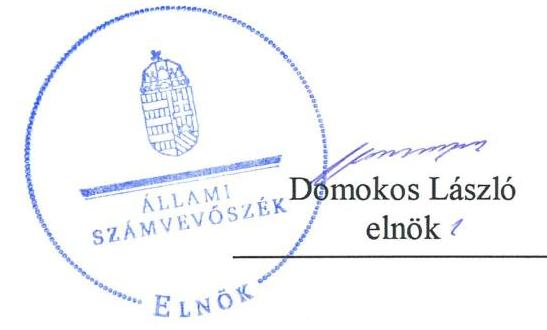
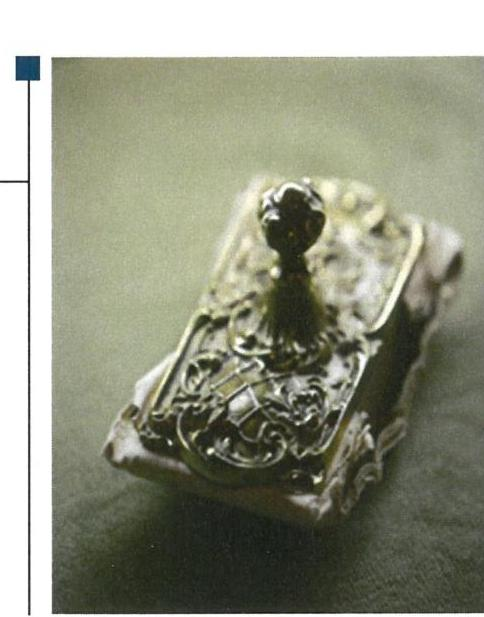

# Jelentés 

## Nemzeti tulajdonú gazdasági társaságok ellenőrzése

Városinfo 18 Nonprofit Korlátolt Felelősségű Társaság „végelszámolás alatt"
2019. 10. hó 24. nap

---

# AZ ELLENŐRZÉST FELÜGYELTE:

DR. HORVÁTH MARGIT felügyeleti vezető

DR. PULAY GYULA felügyeleti vezető

# AZ ELLENŐRZÉST VEZETTE ÉS A VÉGREHAJTÁSÁÉRT FELELŐS:

SIPOSNÉ DŐCZI KLÁRA ellenőrzésvezető

# A PROGRAM ÖSSZEÁLLÍTÁSÁÉRT FELELŐS:

TÓTPÁL SZABOLCS osztályvezető

---

**IKTATÓSZÁM:** EL-1665-001/2019

**TÉMASZÁM:** 2478

**ELLENŐRZÉS-AZONOSÍTÓ SZÁM:** V082227

---

Jelentéseink az Országgyűlés számítógépes hálózatán és az Interneten a www.asz.hu címen is olvashatóak.

---

# TARTALOMJEGYZÉK 

- ÖSSZEGZÉS ..... 5
- AZ ELLENŐRZÉS CÉLJA ..... 6
- AZ ELLENŐRZÉS TERÜLETE ..... 7
- AZ ELLENŐRZÉS HÁTTERE, INDOKOLTSÁGA ..... 8
- A JELENTÉS LÉNYEGES KÉRDÉSKÖREI ..... 9
- AZ ELLENŐRZÉS HATÓKÖRE ÉS MÓDSZEREI ..... 10
- MEGÁLLAPÍTÁSOK ..... 12
- MELLÉKLETEK ..... 15
I. sz. melléklet: Értelmező szótár ..... 15
- FÜGGELÉK: ÉSZREVÉTELEK ..... 17
- RÖVIDÍTÉSEK JEGYZÉKE ..... 19

---

.

---

# ÖSSZEGZÉS 

Budapest Főváros XVIII. kerület Pestszentlőrinc-Pestszentimre Önkormányzata tulajdonosi joggyakorlása szabályszerű volt. A Városinfo 18 Nonprofit Korlátolt Felelősségű Társaság „végelszámolás alatt" vagyongazdálkodása nem volt szabályszerű, az elszámoltathatóságot nem biztosította.

## Az ellenőrzés társadalmi indokoltsága

Az Állami Számvevőszék kiemelt célja, hogy ellenőrzéseivel hozzájáruljon ahhoz, hogy a közpénzeket, illetve az ingyenesen juttatott közvagyont az államháztartáson kívül működő szervezetek is átlátható, rendezett módon használják fel.

Az állam és a helyi önkormányzatok tulajdona nemzeti vagyon, melynek megőrzése érdekében fontos a nemzeti tulajdonú gazdasági társaságok ellenőrzése. Ellenőrzésüket további társadalmi elvárás is indokolja, részben a gazdálkodásuk körébe tartozó vagyon nagysága, részben az általuk ellátott közszolgáltatások, sajátos feladatellátások, mivel tevékenységükön keresztül a lakosság széles köre kerül kapcsolatba a társaságokkal.

Az Állami Számvevőszék céljaival és a társadalmi igénnyel összhangban, a gazdasági társaság szerepe miatt került sor a Városinfo 18 Nonprofit Korlátolt Felelősségű Társaság „végelszámolás alatt" vagyongazdálkodásának, illetve Budapest Főváros XVIII. kerület Pestszentlőrinc-Pestszentimre Önkormányzata tulajdonosi joggyakorlásának ellenőrzésére.

## Főbb megállapítások, következtetések

Budapest Főváros XVIII. kerület Pestszentlőrinc-Pestszentimre Önkormányzata a tulajdonosi joggyakorlás kereteit a törvényi előírásoknak megfelelően alakította ki, a tulajdonosi jogait a jogszabályi és a belső előírásoknak megfelelően gyakorolta.

A Városinfo 18 Nonprofit Korlátolt Felelősségű Társaság „végelszámolás alatt" vagyongazdálkodása nem volt szabályszerű. A Társaság az ellenőrzött időszakban a számviteli beszámolók mérlegtételeit leltárakkal nem támasztotta alá, a Társaság számviteli beszámolóiban a valódiság elve nem érvényesült, emiatt a Társaság elszámoltathatósága, a nemzeti vagyon megőrzése nem volt biztosított.

Az Állami Számvevőszék a jelentéstervezetben az érintetteknek javaslatot nem fogalmazott meg.

---

# AZ ELLENŐRZÉS CÉLJA 

AZ ELLENŐRZÉS CÉLJA annak megállapítása volt, hogy a tulajdonosi joggyakorló a gazdasági társaságai feletti tulajdonosi joggyakorlás kereteit kialakította-e, tulajdonosi jogait megfelelően gyakorolta-e és kötelezettségeit teljesítette-e. Az ellenőrzés célja volt továbbá annak megállapítása, hogy a gazdasági társaság biztosította-e a vagyon védelmét a nyilvántartások szabályszerű vezetése és a mérleg tételeinek leltárral történő alátámasztása útján, valamint szabályszerűen gondoskodott-e a társaság használatában, kezelésében lévő nemzeti vagyon értékének megőrzéséről, gyarapításáról, hasznosításáról.

---

# AZ ELLENŐRZÉS TERÜLETE 

## Városinfo 18 Nonprofit Korlátolt Felelősségű Társaság „végelszámolás alatt" és a tulajdonosi jogokat gyakorló Budapest Főváros XVIII. kerület Pestszentlőrinc-Pestszentimre Önkormányzata

A Városinfo 18 Nonprofit Korlátolt Felelősségű Társaság „végelszámolás alatt" 100%-os tulajdonosa Budapest Főváros XVIII. kerület Pestszentlőrinc-Pestszentimre Önkormányzata volt. A Városinfo 18 Nonprofit Kft.-t¹ az Önkormányzat² 2015. július 1-én 49 M Ft jegyzett tőkével alapította. A Társaság³ fő tevékenysége a film-, video-, televízióműsor-gyártás volt. Az Önkormányzat a Mötv. ${ }^{4} 10 . \S$ (2) bekezdése szerinti önként vállalt feladat ellátására Szolgáltatási szerződést ${ }^{5}$ kötött a Társasággal. A Szolgáltatási szerződésben az Önkormányzat a kerületi városinformációs tevékenységek koordinálásával és szervezésével, közzététellel, közreműködéssel kapcsolatos feladatokat határozott meg a Társaság részére, mely a tevékenységét saját eszközeivel végezte az Önkormányzat által Használati szerződésben ${ }^{6}$ térítésmentes használatba adott ingatlanban. A feladatellátás biztosításához az Alapító ${ }^{7}$ a Társaság jegyzett tőkéjét 2016-ban 71 M Ft-ra, 2017-ben 161 M Ft-ra emelte.

A Társaság más gazdasági társaságban nem rendelkezett tulajdoni részesedéssel, az ellenőrzött időszakban nem tartozott a kormányzati szektorba sorolt egyéb szervezetek közé, az Önkormányzattól a tevékenysége végzéséhez vagyonkezelésbe nem kapott nemzeti vagyont.

A Társaság ügyvezetője a megalakulástól 2018. június 1-ig töltötte be tisztségét, ezt követően a Végelszámoló ${ }^{8}$ látta el az ügyvezetői feladatokat. A Társaság a megalakulástól háromtagú felügyelőbizottsággal és választott könyvvizsgálóval rendelkezett. A Társaságnál az átlagos statisztikai létszám 2015-ben 3 fő, 2016-ban 5 fő, 2017-ben 7 fő volt.

A Társaságnak a mérlegfőösszege és a bevételei ${ }^{9}$ is növekedtek az ellenőrzött időszakban, ugyanakkor az alapítási évet leszámítva veszteségesen működött, a 2017. évet 64 M Ft negatív adózott eredménnyel zárta. A veszteséges működés miatt az Önkormányzat 2018. május 29-én a Társaság jogutód nélkül megszüntetéséről döntött és június elsejével kezdeményezte a Társaság végelszámolással történő megszüntetését. A végelszámolás lezárásáról, a Társaság vagyontárgyainak önkormányzati tulajdonba vételéről 2018. szeptember 13-án hozott határozatot az Önkormányzat, a Cégbíróság pedig 2019. május 8-i hatállyal törölte a Társaságot a Cégnyilvántartásból.

A Polgármester ${ }^{10}$ és a Jegyző ${ }^{11}$ személye nem változott az ellenőrzött időszakban. A Polgármester 2010. óta tölti be tisztségét, a Jegyző 2015. január 1-jétől vezeti a polgármesteri hivatalt.

---

# AZ ELLENŐRZÉS HÁTTERE, INDOKOLTSÁGA 

Az Alaptörvény 38. cikke alapján az állam és a helyi önkormányzatok tulajdona nemzeti vagyon. A nemzeti vagyon megőrzése, megóvása érdekében kiemelten fontos ezen nemzeti tulajdonú gazdasági társaságok ellenőrzése. Gazdálkodásuk jellemzően a közérdeklődés és a médiafigyelmének középpontjában áll, amihez hozzájárul a gazdálkodásuk körébe tartozó - a nemzeti vagyon részét képező - vagyon nagysága, illetve az általuk ellátott közszolgáltatások minősége és hatékonysága.

Ellenőrzéseink feltárhatják, hogy a tulajdonosi felügyelet hozzájárult-e a szabályszerű gazdálkodáshoz és feladatellátáshoz.

Az ellenőrzés eredményeként meghatározhatóvá válnak a szervezet vagyongazdálkodást érintő kockázatai, ezzel lehetővé téve a kockázatok csökkentését.

A megállapítások alapján megfogalmazott számvevő-széki javaslatok hasznosítása elősegítheti a meglévő hibák megszüntetését. A jó gyakorlatok bemutatásával az ÁSZ hozzájárulhat a követendő megoldások megismertetéséhez, terjesztéséhez.

---

# A JELENTÉS LÉNYEGES KÉRDÉSKÖREI 

1. A tulajdonosi jogok gyakorlása szabályszerű volt-e?
2. A gazdasági társaság vagyongazdálkodási tevékenysége szabályszerű volt-e?

---

# AZ ELLENŐRZÉS HATÓKÖRE ÉS MÓDSZEREI 

## Az ellenőrzés típusa

Megfelelőségi ellenőrzés.

## Az ellenőrzött időszak

A tulajdonosi joggyakorlás tekintetében az ellenőrzött időszak 2017. január 1-től az ellenőrzés megkezdésének napjáig - 2018. október 15. - terjedt ki az éves beszámoló elfogadása kivételével, amelynél az ellenőrzött időszak 2015. január 1-től az ellenőrzés megkezdésének napjáig tartott.

A gazdasági társaság vagyongazdálkodása vonatkozásában az ellenőrzött időszak a 2015-2017 évek, a 2017. évi beszámoló jóváhagyása tekintetében a 2018. június elsejéig tartó időszak. Az ellenőrzést 2018. október 15-én kezdtük meg.

## Az ellenőrzés tárgya

Az önkormányzatnál a 100%-os tulajdonában lévő gazdasági társaság feletti tulajdonosi joggyakorlás kialakítása és működtetése. A Társaság vagyongazdálkodása keretében a társaság használatában lévő nemzeti vagyon, illetve a saját vagyon tekintetében a vagyonnyilvántartások vezetése, leltár.

## Az ellenőrzött szervezet

Városinfo 18 Nonprofit Korlátolt Felelősségű Társaság „végelszámolás alatt" és Budapest Főváros XVIII. kerület Pestszentlőrinc-Pestszentimre Önkormányzata

## Az ellenőrzés jogalapja

Az ellenőrzés jogalapját az ÁSZ tv ${ }^{12}$. 1. § (3) bekezdése, 5. § (4) bekezdése képezi.

---

# Az ellenőrzés módszerei 

Az ellenőrzést az ellenőrzési program ellenőrzési kérdései, az ellenőrzött időszakban hatályos jogszabályok, az ellenőrzés szakmai szabályok és módszertanok alapján, a nemzetközi standardok figyelembe vételével végeztük.

Az ellenőrzés ideje alatt az ellenőrzött szervezettel történő kapcsolattartást az ÁSZ Szervezeti és Működési Szabályzatának vonatkozó előírásai alapján biztosítottuk.

Az ellenőrzési kérdések megválaszolásához szükséges bizonyítékok megszerzése a következő ellenőrzési eljárások alkalmazásával történt: megfigyelés, információkérés, összehasonlítás, elemző eljárás. Az ellenőrzési bizonyítékként felhasználható adatforrások közé tartoztak az ellenőrzési programban felsorolt adatforrások, továbbá minden - az ellenőrzés folyamán - feltárt, az ellenőrzés szempontjából információkat tartalmazó dokumentum.

Az ellenőrzést a kérdésekre adott válaszok kiértékelésével, valamint a megjelölt adatforrások, a tanúsítványok felhasználásával, továbbá az adott időszakban hatályos jogszabályok figyelembe vételével folytattuk le.

A 2017. január 1-től az ellenőrzés megkezdésének napjáig ellenőriztük a tulajdonosi joggyakorlás kereteinek kialakítását, a tulajdonosi joggyakorló tevékenységét a felügyelőbizottság működéséhez kapcsolódóan, valamint azt, hogy a tulajdonosi joggyakorló - amennyiben a gazdasági társaság feladatellátásához kapcsolódóan határozott meg követelményeket, elvárásokat - a nemzeti vagyon értékének megőrzése érdekében monitorozta-e azok teljesülését. A 2015. január 1-től az ellenőrzés megkezdésének napjáig ellenőriztük a tulajdonosi joggyakorló részvételét az éves beszámoló elfogadására vonatkozó döntéshozatalban.

A gazdasági társaság vagyonhoz kapcsolódó nyilvántartásai vezetésének megfelelősége, valamint a nemzeti vagyon értéke megőrzésének, gyarapításának, hasznosításának szabályszerűsége 2015. és 2017. évek tekintetében került ellenőrzésre. A teljes ellenőrzött időszakot, 2015-2017 éveket érintően történt meg a lényeges dokumentumok és a mérleg tételeinek leltárral való alátámasztottságának az értékelése.

A vagyonnyilvántartások és a leltár szabályszerűsége esetében az ellenőrzés azokra a legnagyobb értékű tételekre - lényeges sokaságra - terjedt ki, melyek összértéke elérte a teljes sokaság összértékének 50%-át. A 2015. és 2017. évek esetében a lényeges sokaságot tételesen ellenőriztük.

---

# 1. A tulajdonosi jogok gyakorlása szabályszerű volt-e? 

## Összegző megállapítás

A tulajdonosi jogok gyakorlása szabályszerű volt.

A TULAJDONOSI JOGGYAKORLÁS KERETEIT az Önkormányzat mint a Társaság alapítója a jogszabályi és a belső előírásoknak megfelelően - a Mötv. és a Ptk. ${ }^{13}$ vonatkozó előírásai valamint az önkormányzati SZMSZ ${ }^{14}$ és a Vagyonrendelet ${ }^{15}$ szerint - a Társaság Alapító okiratában ${ }^{16}$ határozta meg. A Társaság feladat ellátásához kapcsolódó, a műsorkészítésre vonatkozó tulajdonosi követelményeket és az éves beszámolási kötelezettséget a Szolgáltatási szerződésben kerültek meghatározásra.

Az Alapító a Taktv. ${ }^{17}$ 5.§ (3) bekezdésében foglalt előírásoktól eltérően nem rendelkezett szabályzatban a vezető tisztségviselők, a felügyelőbizottsági tagok, valamint az Mt. ${ }^{18}$ 208. § hatálya alá tartozó munkavállalók javadalmazásának, valamint jogviszonyuk megszűnése esetére biztosított juttatások módjának, mértékének elveiről, annak rendszeréről.

A TULAJDONOSI JOGOKAT az Alapító a Ptk., a Számv. tv. és a Taktv. vonatkozó előírásainak, és az SZMSZ, a Vagyonrendelet, valamint az Alapító okirat szabályozásának eleget téve gyakorolta.

Az Alapító a Ptk. és a Taktv. előírásainak megfelelően jelölte ki a felügyelőbizottság tagjait valamint döntött a könyvvizsgáló megbízásáról.

Az Alapító a felügyelőbizottság jelentését és a könyvvizsgáló írásos véleményét figyelembe véve, a Ptk., és a Számv. tv., valamint az Alapító okirat előírásai szerinti határozatokban döntött a Társaság egyszerűsített éves beszámolóinak elfogadásáról. Az Alapító a Ptk. előírásainak megfelelően, a 2017. évi egyszerűsített éves beszámoló elfogadásával egyidejűleg döntött a Társaság jogutód nélküli megszüntetéséről, mert a Társaság saját tőkéje veszteség folytán a törzstőke fele alá csökkent, ezért intézkedési kötelezettsége keletkezett.

Az Alapító nem élt az Áht. ${ }^{19}$-ban számára biztosított lehetőséggel, az ellenőrzött időszakban a Társaságnál ellenőrzést nem végzett. A Társaság feladatellátásának ellenőrzéseként az Alapító rendszeresen megtárgyalta és elfogadta a társaság működését bemutató szakmai beszámolókat.

---

# 2. A gazdasági társaság vagyongazdálkodási tevékenysége szabályszerű volt-e? 

## Összegző megállapítás A Társaság vagyongazdálkodása nem volt szabályszerű.

A Társaság rendelkezett a Számv. tv. előírásainak megfelelő Leltárkészítési
 és leltározási szabályzattal ${ }^{20}$. A szabályzat tartalmazta a leltározásra és leltárkészítésre vonatkozó általános szabályokat, számviteli előírásokat.

A vagyonnyilvántartás tekintetében a Társaság megsértette a Számv. tv. 169. § (2) és (4) bekezdéseiben foglalt előírásokat, mert nem biztosította a nyilvántartás ellenőrizhetőségét.

A Társaság a Számv. tv. 69. § (1) bekezdése előírása ellenére a mérleg tételeinek alátámasztásához a 2015-2017. években nem készített leltárt, amely tételesen, ellenőrizhető módon tartalmazta a mérleg fordulónapján meglévő eszközeit és forrásait mennyiségben és értékben. Ezzel a Társaság megsértette a Számv. tv. 15. § (3) bekezdésében előírt valódiság elvét, amely szerint a könyvvitelben rögzített és a beszámolóban szereplő tételeknek a valóságban is megtalálhatóknak, bizonyíthatóknak, kívülállók által is megállapíthatóknak kell lenniük.

A Társaság vagyongazdálkodása a vagyon nyilvántartása és a leltárak tekintetében nem volt szabályszerű.

---

.

---

# MELLÉKLETEK 

- I. SZ. MELLÉKLET: ÉRTELMEZŐ SZÓTÁR
gazdasági társaság
közfeladat
nemzeti vagyon
tulajdonosi jogok gyakorlója
nemzeti vagyon hasznosítása
nemzeti vagyon használója

A gazdasági társaságok üzletszerű közös gazdasági tevékenység folytatására, a tagok vagyoni hozzájárulásával létrehozott, jogi személyiséggel rendelkező vállalkozások, amelyekben a tagok a nyereségből közösen részesednek, és a veszteséget közösen viselik. Forrás: Ptk. 3:88. § (1) bekezdése
Az Áht. 3/A. § (1) bekezdése alapján közfeladat a jogszabályban meghatározott állami vagy önkormányzati feladat.
Nvtv. ${ }^{21}$ 1. § (2) bekezdése szerint nemzeti vagyonba tartozik többek között: „az állam vagy a helyi önkormányzat kizárólagos tulajdonában álló dolgok, az a) pont hatálya alá nem tartozó, állam vagy a helyi önkormányzat tulajdonában lévő dolog,
az állam vagy a helyi önkormányzat tulajdonában lévő pénzügyi eszközök, továbbá az államot vagy a helyi önkormányzatot megillető társasági részesedések,
az államot vagy a helyi önkormányzatot megillető bármely vagyoni értékkel rendelkező jogosultság, amelyet jogszabály vagyoni értékű jogként nevesít." Aki a nemzeti vagyon felett az államot vagy a helyi önkormányzatot megillető tulajdonosi jogok és kötelezettségek összességének gyakorlására jogosult. Forrás: Nvtv. 3. § (1) 17. pontja
A tulajdonosi joggyakorló vagy a nemzeti vagyon használója által a nemzeti vagyon birtoklásának, használatának, hasznok szedése jogának bármely - a tulajdonjog átruházását nem eredményező - jogcímen történő átengedése, ide nem értve a vagyonkezelésbe adást, valamint a haszonélvezeti jog alapítását. Forrás: Nvtv. 3. § (1) bekezdés 4. pont
Azon természetes személy, jogi személy vagy jogi személyiséggel nem rendelkező szervezet, aki vagy amely állami vagyon tekintetében törvény vagy szerződés alapján, a helyi önkormányzat vagyona tekintetében törvény, a helyi önkormányzat rendelete vagy szerződés alapján bármely jogcímen nemzeti vagyont birtokol, használ, szedi annak hasznait, kivéve a tulajdonosi joggyakorló. Forrás: Nvtv. 3. § (1) bekezdés 11. pont

---

.

---

# FÜGGELÉK: ÉSZREVÉTELEK 

A jelentéstervezetet a Számvevőszék 15 napos észrevételezésre megküldte az ellenőrzött szervezetek vezetőinek az ÁSZ tv. 29. § (1) bekezdése előírásának megfelelően.

Az ellenőrzött szervezetek vezetői nem tettek észrevételt a Számvevőszék 15 napos észrevételezésre megküldött jelentéstervezetével kapcsolatban.

[^0]
[^0]:    * 29. § (1) Az Állami Számvevőszék az ellenőrzési megállapításait megküldi az ellenőrzött szervezet vezetőjének vagy az általa megbízott személynek, és annak, akinek személyes felelősségét állapította meg.
    (2) Az ellenőrzött szervezet vezetője és a felelősként megjelölt személy az ellenőrzés megállapításaira tizenöt napon belül írásban észrevételt tehet.
    (3) Az Állami Számvevőszék az észrevételre a beérkezésétől számított harminc napon belül írásban válaszol. A figyelembe nem vett észrevételeket köteles a jelentésben feltüntetni, és megindokolni, hogy azokat miért nem fogadta el.

---

.

---

# RÖVIDÍTÉSEK JEGYZÉKE 

${ }^{1}$ Városinfo 18 Nonprofit Kft.
${ }^{2}$ Önkormányzat
${ }^{3}$ Társaság
${ }^{4}$ Mötv.
${ }^{5}$ Szolgáltatási szerződés
${ }^{6}$ Használati szerződés
${ }^{7}$ Alapító
${ }^{8}$ Végelszámoló
${ }^{9}$ bevételei
${ }^{10}$ Polgármester
${ }^{11}$ Jegyző
${ }^{12}$ ÁSZ tv.
${ }^{13}$ Ptk.
${ }^{14}$ SZMSZ
${ }^{15}$ Vagyonrendelet
${ }^{16}$ Alapító okirat
${ }^{17}$ Taktv.
${ }^{18} \mathrm{Mt}$.
${ }^{19}$ Áht.
${ }^{20}$ Leltárkészítési és leltározási szabályzat
${ }^{21}$ Nvtv.

Városinfo 18 Nonprofit Korlátolt Felelősségű Társaság
Budapest Főváros XVIII. kerület Pestszentlőrinc-Pestszentimre Önkormányzata Városinfo 18 Nonprofit Korlátolt Felelősségű Társaság „végelszámolás alatt" 2011. évi CLXXXIX. törvény Magyarország helyi önkormányzatairól (hatályos: 2012. január 1-től)

Budapest XVIII. kerület Pestszentlőrinc-Pestszentimre Önkormányzata és a Városinfó 18 Nonprofit Korlátolt Felelősségű Társaság között 2015.07.15-én létrejött, városinformációs tevékenységek ellátására irányuló szolgáltatási szerződés és annak módosításai
Budapest Főváros XVIII. kerület Pestszentlőrinc-Pestszentimre Önkormányzata a Városinfó 18 Nonprofit Korlátolt Felelősségű Társaság között 2015. július 15-én létrejött szerződés
Budapest Főváros XVIII. kerület Pestszentlőrinc-Pestszentimre Önkormányzata Városinfo 18 Nonprofit Korlátolt Felelősségű Társaság „végelszámolás alatt" végelszámolója
A Városinfo 18 Nonprofit Korlátolt Felelősségű Társaság 2015-2017 évi egyszerűsített éves beszámolóiban szereplő eredménykategóriák (értékesítés nettó árbevétele, egyéb bevételek, pénzügyi műveletek bevételi) összegezve
Budapest Főváros XVIII. kerület Pestszentlőrinc-Pestszentimre Önkormányzata polgármestere
Budapest Főváros XVIII. kerület Pestszentlőrinc-Pestszentimre Önkormányzata jegyzője
2011. évi LXVI. törvény az Állami Számvevőszékről (hatályos: 2011. július 1-től) 2013. évi V. törvény a Polgári Törvénykönyvről szóló (hatályos 2014. március 15-től)
Budapest XVIII. kerület Pestszentlőrinc-Pestszentimre Önkormányzat Képviselőtestületének 42/2011. (XII.20.) önkormányzati rendelete a Képviselő-testület Szervezeti és Működési Szabályzatáról és módosításai (hatályos: 2012.01.01-től)
Budapest XVIII. kerület Pestszentlőrinc-Pestszentimre Önkormányzat Képviselőtestületének 15/2013. (V.31.) önkormányzati rendelete az Önkormányzat vagyonáról, a vagyontárgyak feletti tulajdonosi jogok gyakorlásáról és módosításai (hatályos: 2013.06.15-től)
Városinfo 18 Nonprofit Korlátolt Felelősségű Társaság Alapító okirata és módosításai
2009. évi CXXII. törvény a köztulajdonban álló gazdasági társaságok takarékosabb működéséről (hatályos: 2009. december 4-től)
2012. évi I. törvény a munka törvénykönyvéről (hatályos: 2012. július 1-jétől) 2011. évi CXCV. törvény az államháztartásról (hatályos: 2011. december 31-től) Városinfo 18 Nonprofit Korlátolt Felelősségű Társaság Leltárkészítési és leltározási szabályzata (hatályos 2015. július 15-től)
2011. évi CXCVI. törvény a nemzeti vagyonról (hatályos: 2011. december 31-től)

---

# ÁLLAMI SZÁMVEVŐSZÉK 

1052 Budapest, Apáczai Csere János utca 10.
Levélcím: 1364 Budapest 4. Pf. 54
Telefon: +36 14849100 Telefax: +36 14849200
www.asz.hu
