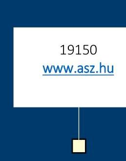
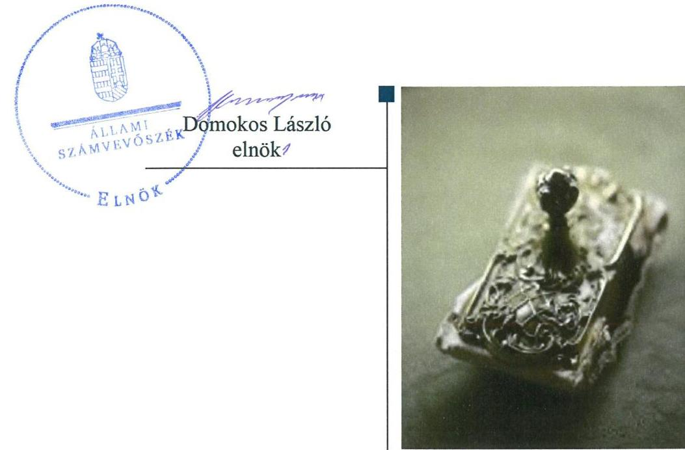
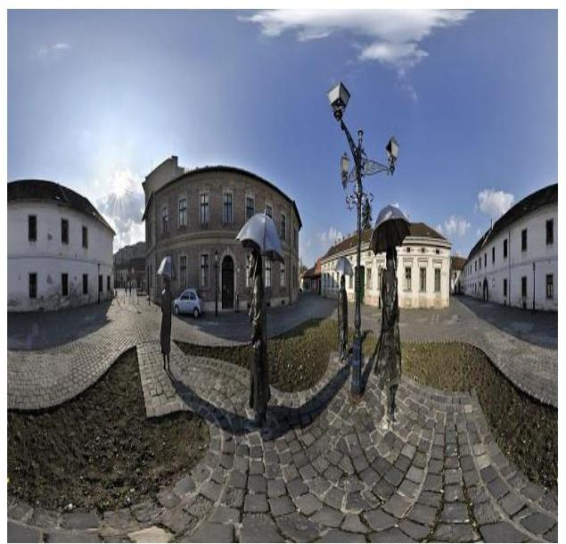

# Jelentés 

## Nemzeti tulajdonú gazdasági társaságok ellenőrzése

Óbudai Vagyonkezelő Nonprofit Zártkörűen Működő Részvénytársaság 2019.

---

# Jelentés 

## Nemzeti tulajdonú gazdasági társaságok ellenőrzése

Óbudai Vagyonkezelő Nonprofit Zártkörűen Működő Részvénytársaság 2019. 10 . hó 21 . nap

---

# AZ ELLENŐRZÉST FELÜGYELTE:

DR HORVÁTH MARGIT felügyeleti vezető

## AZ ELLENŐRZÉST VEZETTE ÉS A VÉGREHAJTÁSÁÉRT FELELŐS:

SIPOSNÉ DÓCZI KLÁRA ellenőrzésvezető

## A PROGRAM ÖSSZEÁLLÍTÁSÁÉRT FELELŐS:

TÓTPÁL SZABOLCS osztályvezető

IKTATÓSZÁM: EL-1670-001/2019

TÉMASZÁM: 2478

ELLENŐRZÉS-AZONOSÍTÓ SZÁM: V082214 ÉS V082253

Jelentéseink az Országgyűlés számítógépes hálózatán és az Interneta a www.asz.hu címen is olvashatóak.

---

# TARTALOMJEGYZÉK 

■ ÖSSZEGZÉS ..... 5
■ AZ ELLENŐRZÉS CÉLJA ..... 6
■ AZ ELLENŐRZÉS TERÜLETE ..... 7
■ AZ ELLENŐRZÉS HÁTTERE, INDOKOLTSÁGA ..... 8
■ A JELENTÉS LÉNYEGES KÉRDÉSKÖREI ..... 9
■ AZ ELLENŐRZÉS HATÓKÖRE ÉS MÓDSZEREI ..... 10
■ MEGÁLLAPÍTÁSOK ..... 13
■ JAVASLATOK ..... 15
■ MELLÉKLETEK ..... 17
I. sz. melléklet: Értelmező szótár ..... 17
■ FÜGGELÉK: ÉSZREVÉTELEK ..... 19
■ RÖVIDÍTÉSEK JEGYZÉKE ..... 21

---

.

---

# ÖSSZEGZÉS 

Budapest Főváros III. kerület, Óbuda-Békásmegyer Önkormányzat tulajdonosi joggyakorlása szabályszerű volt. Az Óbudai Vagyonkezelő Nonprofit Zártkörüen Müködő Részvénytársaság a nemzeti vagyon védelmét és megőrzését szabályszerű vagyongazdálkodással biztositotta. A kormányzati szektor hiányára kiható elszámolások összhangban voltak a jogszabályi előirásokkal.

## Az ellenőrzés társadalmi indokoltsága

Az Állami Számvevőszék kiemelt célja, hogy ellenőrzéseivel hozzájáruljon ahhoz, hogy a közpénzeket, illetve az ingyenesen juttatott közvagyont az államháztartáson kívül múködő szervezetek is átlátható, rendezett módon használják fel.

Az állam és a helyi önkormányzatok tulajdona nemzeti vagyon, melynek megőrzése érdekében kiemelten fontos a nemzeti tulajdonú gazdasági társaságok ellenőrzése. Ellenőrzésüket további társadalmi elvárás is indokolja. Részben a gazdálkodásuk körébe tartozó vagyon nagysága, részben az általuk ellátott közszolgáltatások, sajátos feladatellátások, mivel tevékenységükön keresztül a lakosság széles köre kerül kapcsolatba a társaságokkal.

Az Állami Számvevőszék céljaival és a társadalmi igénnyel összhangban, a gazdasági társaságok kiemelt fontosságú szerepe miatt került sor az Óbudai Vagyonkezelő Nonprofit Zártkörűen Működő Részvénytársaság vagyongazdálkodásának, a kormányzati szektor hiányára kiható elszámolásainak, illetve az Budapest Főváros III. kerület, Óbuda-Békásmegyer Önkormányzat tulajdonosi joggyakorlásának ellenőrzésére.

## Főbb megállapítások, következtetések, javaslatok

Budapest Főváros III. kerület, Óbuda-Békásmegyer Önkormányzat a tulajdonosi joggyakorlás kereteit a jogszabályi előírásoknak megfelelően alakította ki, tulajdonosi jogait a törvényi és a belső előírások szerint gyakorolta.

Az Óbudai Vagyonkezelő Nonprofit Zártkörűen Működő Részvénytársaság vagyonához kapcsolódó nyilvántartásait a jogszabályi és a saját szabályzataiban meghatározott előírások szerint vezette. A Társaságnál az eszközöket és a forrásokat szabályszerű leltározással vették számba, a számviteli beszámolók mérlegtételei a törvényi és a belső előírásoknak megfelelő leltárakkal alátámasztottak voltak, vagyongazdálkodása szabályszerű volt. A Társaság a nemzeti vagyon üzemeltetése során a számára meghatározott követelmények szerint járt el. A Társaságnál az ellenőrzött időszakban a kormányzati szektor hiányára befolyással bíró bevételek és ráfordítások elszámolása megfelelt a jogszabályi előírásoknak, viszont az előírt adatszolgáltatási kötelezettségét nem teljesítette.

Az Állami Számvevőszék a jelentésbe foglalt megállapítások alapján az Óbudai Vagyonkezelő Nonprofit Zártkörűen Múködő Részvénytársaság vezérigazgatójának egy javaslatot fogalmazott meg. A javaslatot megalapozó megállapításra az érintettnek 30 napon belül intézkedési tervet kell készítenie.

---

# AZ ELLENŐRZÉS CÉLJA 

AZ ELLENŐRZÉS CÉLJA annak megállapítása volt, hogy a tulajdonosi joggyakorló a gazdasági társaságai feletti tulajdonosi joggyakorlás kereteit kialakította-e, tulajdonosi jogait megfelelően gyakorolta-e és kötelezettségeit teljesítette-e. Az ellenőrzés célja volt továbbá annak megállapítása, hogy a gazdasági társaság biztosította-e a vagyon védelmét a nyilvántartások szabályszerű vezetése és a mérleg tételeinek leltárral történő alátámasztása útján, valamint szabályszerűen gondoskodott-e a társaság használatában, kezelésében lévő nemzeti vagyon értékének megőrzéséről, gyarapításáról, hasznosításáról, továbbá gazdálkodásának a kormányzati szektor hiányára és az államadósságra befolyással bíró elemei a jogszabályi előírásoknak megfeleltek-e és az adatszolgáltatási kötelezettségének eleget tett-e.

---

# **A2 ELLENŐRZÉS TERÜLETE**

## **Óbudai Vagyonkezelő Nonprofit Zártkörűen Működő Részvénytársaság és a tulajdonosi jogokat gyakorló Budapest Főváros III. kerület, Óbuda-Békásmegyer Önkormányzat**

Az Óbudai Vagyonkezelő Nonprofit Zártkörűen Működő Részvénytársaságot a Budapest Főváros III. kerület, Óbuda-Békásmegyer Önkormányzat 2011. május 26-án alapította a "CELER" Épületfenntartó és Szolgáltató Kft^{1}. általános jogutódaként. A Tulajdonos^{2} alapítástól kezdődően 100%-ban tulajdonolja a Társaság részvényeit. A Társaság jegyzett tőkéje az ellenőrzött időszakban megegyezett az alapításkori összeggel, 100 M Ft^{3} volt.

A Társaság^{4} fő tevékenysége közfeladat ellátás keretében az ellenőrzött időszakban évente megújított Közszolgáltatási szerződés^{1,3} alapján az önkormányzati tulajdonú ingatlanok – lakóépületek, üzlethelyiségek, piacok – üzemeltetése, karbantartása és bérbeadása volt. A Társaság az önkormányzati tulajdonú ingatlanok bérbeadását a 9/2015 (II. 16.) önkormányzati rendelet^{6} alapján végezte. További, a Társaság által végzett közfeladat volt az önkormányzati tulajdonú ingatlanvagyonnal kapcsolatos műszaki, szakértői, nyilvántartási feladatok ellátása valamint a településfejlesztési stratégia mentén megvalósuló beruházások előkészítésében való részvétel. A Társaság a közfeladat ellátásán túl vállalkozási tevékenység keretében társasházi közös képviselet ellátását és nem önkormányzati tulajdonú ingatlanok üzemeltetését végezte. A Társaság a tevékenységét saját vagyonával látta el, vagyonkezelésbe, valamint üzemeltetésre átvett vagyonnal nem rendelkezett. A Társaság 2017 májusától közhasznú társaságként működött.

A Társaság egyes pénzügyi adatait az 1. táblázat szemlélteti.

A Társaság az ellenőrzött időszakban – 2016-ban – értékesítette az Óbudai Parkolási Kft.^{7}-ben 2012-óta fennállt 100%-os üzletrészét. A Társaság 2017. június 15-től tartozott a kormányzati szektorba sorolt egyéb szervezetek^{8} közé.

A Társaságnak nem volt az államadósságra befolyással bíró kötelezettségvállalása az ellenőrzött időszakban.

A Társaságot az ellenőrzött időszakban három tagú Igazgatóság^{9} vezette, 2014. november 4-től változatlan összetételben. Az Igazgatóság tagja a vezérigazgató^{10}, kinek személyében az ellenőrzött időszakban nem volt változás. A három tagú felügyelőbizottság^{11} 2014. november 4-től változatlan összetétellel működött az ellenőrzött időszakban. A Társaság könyvvizsgálója^{12} 2011. augusztus 1-óta nem változott.

A polgármester személyében az ellenőrzött időszakban nem volt változás.

1. táblázat

|  A TÁRSASÁG EGYES PÉNZÜGYI ADATAI (M FT) |  |  |   |
| --- | --- | --- | --- |
|   | 2015. | 2016. | 2017.  |
|  értékesítés |  |  |   |
|  nettó árbevétele | 400 | 462 | 693  |
|  adózott eredmény összes eszköz saját tőke | 2 | 4 | 3  |
|   | 515 | 485 | 504  |
|   | 230 | 235 | 237  |

*Forrás: A Társaság 2015-2017 évi számviteli beszámolói*

---

# AZ ELLENŐRZÉS HÁTTERE, INDOKOLTSÁGA 

Az Alaptörvény 38. cikke alapján az állam és a helyi önkormányzatok tulajdona nemzeti vagyon. A nemzeti vagyon megőrzése, megóvása érdekében kiemelten fontos ezen nemzeti tulajdonú gazdasági társaságok ellenőrzése. Gazdálkodásuk jellemzően a közérdeklődés és a média figyelmének középpontjában áll, amihez hozzájárul a gazdálkodásuk körébe tartozó - a nemzeti vagyon részét képező - vagyon nagysága, illetve az általuk ellátott közszolgáltatások minősége és hatékonysága.

Ellenőrzéseink feltárhatják, hogy a tulajdonosi felügyelet hozzájárult-e a szabályszerű gazdálkodáshoz és feladatellátáshoz.

Az ellenőrzés eredményeként meghatározhatóvá válnak a szervezet vagyongazdálkodást érintő kockázatai, ezzel lehetővé téve a kockázatok csökkentését.

A megállapítások alapján megfogalmazott számvevőszéki javaslatok hasznosítása elősegítheti a meglévő hibák megszüntetését. A jó gyakorlatok bemutatásával az ÁSZ hozzájárulhat a követendő megoldások megismertetéséhez, terjesztéséhez.

---

# A JELENTÉS LÉNYEGES KÉRDÉSKÖREI 

1. A tulajdonosi jogok gyakorlása szabályszerű volt-e?
2. A gazdasági társaság vagyongazdálkodási tevékenysége szabályszerű volt-e?
3. A gazdasági társaság kormányzati szektor hiányára befolyással bíró elemei megfeleltek-e a jogszabályi előírásoknak, adatszolgáltatási kötelezettségének eleget tett-e?

---

# AZ ELLENŐRZÉS HATÓKÖRE ÉS MÓDSZEREI 

## Az ellenőrzés típusa

Megfelelőségi ellenőrzés.

## Az ellenőrzött időszak

A tulajdonosi joggyakorlás tekintetében az ellenőrzött időszak 2017. január 1-től az ellenőrzés megkezdésének napjáig, 2018. október 5-ig terjedt ki az éves beszámoló elfogadása kivételével, amelynél az ellenőrzött időszak 2015. január 1-től az ellenőrzés megkezdésének napjáig tartott.

A gazdasági társaság vagyongazdálkodása vonatkozásában az ellenőrzött időszak 2015-2017, a 2017. évi beszámoló jóváhagyása tekintetében a 2018. június elsejéig tartó időszak. A vagyongazdálkodás ellenőrzése 2018. október 5-én kezdődött.

A kormányzati szektorba tartozó gazdálkodás és adatszolgáltatás tekintetében 2017. június 15 -től a 2017. év, a beszámoló jóváhagyása és közzététele tekintetében 2018. június elsejéig tartó, az adatszolgáltatás teljesítése tekintetében 2018. június 29 -ig tartó időszak. A kormányzati szektorba tartozó gazdálkodás és adatszolgáltatás ellenőrzése 2019. március 8án kezdődött.

## Az ellenőrzés tárgya

Az önkormányzat tulajdonosi joggyakorlása, a 100\%-os tulajdonában lévő gazdasági társaság feletti tulajdonosi joggyakorlás kialakítása és múködtetése. A Társaság vagyongazdálkodása keretében a társaság által üzemeltetett nemzeti vagyon, illetve a saját vagyon tekintetében a vagyonnyilvántartások vezetése, leltára. Valamint a társaság gazdálkodásának a kormányzati szektor hiányára és az államadósságra befolyással bíró elemei és a jogszabályi előírásoknak megfelelő adatszolgáltatási kötelezettségének teljesítése.

## Az ellenőrzött szervezet

Az Óbudai Vagyonkezelő Nonprofit Zártkörűen Működő Részvénytársaság és Budapest Főváros III. kerület, Óbuda-Békásmegyer Önkormányzat

---

# Az ellenőrzés jogalapja 

Az ellenőrzés jogalapját az ÁSZ tv ${ }^{13}$. 1. § (3) bekezdése, 5. § (4) bekezdése képezi.

## Az ellenőrzés módszerei

Az ellenőrzést az ellenőrzési program ellenőrzési kérdései, az ellenőrzött időszakban hatályos jogszabályok, az ellenőrzés szakmai szabályok és módszertanok alapján, a nemzetközi standardok figyelembe vételével végeztük.

Az ellenőrzés ideje alatt az ellenőrzött szervezettel történő kapcsolattartást az ÁSZ ${ }^{14}$ Szervezeti és Múködési Szabályzatának vonatkozó előírásai alapján biztosítottuk.

Az ellenőrzési kérdések megválaszolásához szükséges bizonyítékok megszerzése a következő ellenőrzési eljárások alkalmazásával történt: megfigyelés, információkérés, összehasonlítás, elemző eljárás. Az ellenőrzési bizonyítékként felhasználható adatforrások közé tartoztak az ellenőrzési programban felsorolt adatforrások, továbbá minden - az ellenőrzés folyamán - feltárt, az ellenőrzés szempontjából információkat tartalmazó dokumentum.

Az ellenőrzést a kérdésekre adott válaszok kiértékelésével, valamint a megjelölt adatforrások, a tanúsítványok felhasználásával, továbbá az adott időszakban hatályos jogszabályok figyelembe vételével folytattuk le.

A 2017. január 1-től az ellenőrzés megkezdésének napjáig ellenőriztük a tulajdonosi joggyakorlás kereteinek kialakítását, a tulajdonosi joggyakorló tevékenységét a felügyelőbizottság és a független könyvvizsgáló múködéséhez kapcsolódóan.

A 2015. január 1-től az ellenőrzés megkezdésének napjáig ellenőriztük a tulajdonosi joggyakorló részvételét az éves beszámoló elfogadására vonatkozó döntéshozatalban.

A gazdasági társaság vagyonhoz kapcsolódó nyilvántartásai vezetésének megfelelősége, valamint a nemzeti vagyon értéke megőrzésének, gyarapításának, hasznosításának szabályszerűsége 2015. és 2017. évek tekintetében került ellenőrzésre. A teljes ellenőrzött időszakot érintően, 20152017 éveket érintően történt meg a lényeges dokumentumok, kiemelten a mérleg tételeinek leltárral való alátámasztottságának értékelése.

A vagyonnyilvántartások és a leltár szabályszerűségét mintavétellel ellenőriztük. Az ellenőrzés azokra a legnagyobb értékű tételekre - a lényeges sokaságra - terjedt ki, melyek összértéke elérte a teljes sokaság összértékének 50\%-át. A 2015. és a 2017. évben a lényeges sokaságot tételesen ellenőriztük.

A kormányzati szektorba sorolt gazdasági társaság gazdálkodásának a kormányzati szektor hiányára befolyással bíró gazdasági eseményei elszámolásának megfelelősége 2017. év tekintetében került ellenőrzésre, a kormányzati szektorba sorolt gazdasági társaság adatszolgáltatási kötelezettségére vonatkozó jogszabályi előírások betartását az e területre vonatkozó

---

teljes ellenőrzött időszakra, 2017. július 15-től 2018. június 29-ig értékeltük.

A kormányzati szektorba sorolt szervezet 2017. évi, a kormányzati szektor hiányát befolyásoló ráfordításai és bevételei elszámolásának szabályszerűsége, valamint az értékcsökkenési leírás szabályszerűsége esetében az ellenőrzés azokra a legnagyobb értékű tételekre - a lényeges sokaságra - terjedt ki, melyek összértéke elérte a teljes sokaság összértékének 50\%át. A ráfordítások elszámolásának szabályszerűségét a lényeges sokaságból véletlen mintavételi eljárással kiválasztott tételek alapján ellenőriztük. A bevételek és az értékcsökkenési leírás esetében tételes ellenőrzésre került sor. A mintavétellel ellenőrzött területek esetében minden egyes tétel vonatkozásában a szabályszerűségre vonatkozó kérdéseket tettünk fel. „Szabályszerűnek" értékeltünk egy ellenőrzött területet, amennyiben 95\%os bizonyossággal az ellenőrzött sokaságban az átlagos hibaarány legfeljebb 10\%, "nem szabályszerűnek", amennyiben 10\%-nál magasabb arányt képviselt.

---

# 1. A tulajdonosi jogok gyakorlása szabályszerű volt-e? 

## Összegző megállapítás

A tulajdonosi joggyakorlás szabályszerű volt.

A TULAJDONOSI JOGGYAKORLÁS KERETEIT az Önkormányzat ${ }^{15}$ Képviselő-testülete ${ }^{16}$, mint a Társaság alapítója és legfőbb szerve a jogszabályi és a belső előírásoknak megfelelően - az Mötv ${ }^{17}$, a Ptk. ${ }^{18}$ és az Ectv. ${ }^{19}$ vonatkozó előírásai valamint az SZMSZ ${ }^{20}$, a Vagyonrendelet ${ }^{21}$ és a Gt. rendelet ${ }^{22}$ szerint - az Alapszabály ${ }_{1-2}{ }^{23}$-ben alakította ki. A Társaság gazdálkodásával és múködésével kapcsolatos tulajdonosi követelmények az Alapszabály ${ }_{1-2}$-ben kerültek meghatározásra, a tulajdonosi jogok körében hatáskör átruházás nem volt.

Az Alapító ${ }^{24}$ a Taktv. ${ }^{25}$-ben foglalt előírások szerint szabályzat ${ }_{1-2}{ }^{26}$-ban rendelkezett a vezető tisztségviselők, a felügyelőbizottsági tagok, valamint az Mt. ${ }^{27}$ 208. § hatálya alá tartozó munkavállalók javadalmazásának, valamint jogviszonyuk megszűnése esetére biztosított juttatások módjának, mértékének elveiről, annak rendszeréről.

A TULAJDONOSI JOGOKAT az Alapító a Ptk., a Számv. tv. ${ }^{28}$ a Taktv. és az Ectv. vonatkozó előírásainak, és az SZMSZ, a Vagyonrendelet valamint az Alapszabály ${ }_{1-2}$ szabályozásának eleget téve gyakorolta.

Az Alapító a Ptk. és a Taktv. előírásainak megfelelően jelölte ki a felügyelőbizottság tagjait, fogadta el annak ügyrendjét ${ }^{29}$ választotta ki a könyvvizsgálót.

Az Alapító a felügyelőbizottság jelentését és a könyvvizsgáló írásos véleményét figyelembe véve, a Ptk., a Számv. tv., és az Ectv. valamint az Alapszabály ${ }_{1-2}$ előírásai szerint határozatokban döntött az ellenőrzött időszakban a Társaság éves beszámolóinak, valamint a közhasznúsági melléklet ${ }^{30}$ nek az elfogadásáról, az adózott eredmény eredménytartalékba helyezéséről.

Az Alapító nem élt az Áht. ${ }^{31}$-ban számára biztosított lehetőséggel, a Társaságnál az ellenőrzött időszakban nem hajtott végre ellenőrzést. A felügyelőbizottság ügyrendjének megfelelően megtárgyalta és elfogadta a Társaság üzleti tervét, valamint értékelte annak időarányos teljesítését.

## 2. A gazdasági társaság vagyongazdálkodási tevékenysége szabályszerű volt-e?

## Összegző megállapítás

A Társaság vagyongazdálkodása szabályszerű volt.
Az ellenőrzött időszakban a Társaságnál a vagyonnyilvántartások vezetése és a számviteli beszámolók mérlegtételeit alátámasztó leltárak összeállítása szabályszerű volt.

A Társaság a vagyonához kapcsolódó nyilvántartásait a Számv. tv. és a Számviteli rend ${ }^{32}$ vonatkozó előírásainak megfelelően vezette.

---

A Társaság rendelkezett a Számv. tv. előírásainak megfelelő Eszközök és források leltárkészítési és leltározási szabályzatával ${ }^{33}$. A szabályzat tartalmazta a leltározásra és a leltárkészítésre vonatkozó általános szabályokat, számviteli előírásokat.

A Társaság az ellenőrzött időszakban a Számv. tv-ben, valamint a belső szabályzatában foglaltaknak megfelelően eleget tett leltározási kötelezettségének, valamint elvégezte az üzleti év mérlegfordulónapjára vonatkozóan a főkönyvi könyvelés és az analitikus nyilvántartások adatai közötti egyeztetést. A Társaság 2015 - 2017. évi éves beszámolóinak alátámasztására összeállított leltárak a Számv. tv. előírásai szerint tételesen és ellenőrizhető módon tartalmazták a Társaságnak a mérlegfordulónapján meglévő eszközeit és forrásait mennyiségben és értékben.

A Társaság vagyongazdálkodása a vagyon nyilvántartások és a leltár tekintetében szabályszerű volt.

A Társaság az Önkormányzattal kötött Közszolgáltatási szerződés1-3 alapján üzemeltetett önkormányzati ingatlanokhoz kapcsolódóan a Vagyonrendeletben meghatározottak szerint elvégezte a pályáztatás és árverés lebonyolítási feladatait, végrehajtotta a Bérbeadási rendelet ${ }^{34}$-ben előírt önkormányzati vagyon bérbeadásával kapcsolatos teendőket.

# 3. A gazdasági társaság kormányzati szektor hiányára befolyással bíró elemei megfeleltek-e a jogszabályi előírásoknak, adatszolgáltatási kötelezettségének eleget tett-e? 

Összegző megállapítás

A Társaságnak a kormányzati szektor hiányára befolyással bíró elemei megfeleltek a jogszabályi előírásoknak, viszont adatszolgáltatási kötelezettségét nem teljesítette.

A Társaságnál az ellenőrzött időszakban a kormányzati szektor hiányára befolyással bíró bevételek és ráfordítások elszámolása megfelelt a Számv. tv. előírásainak.

Ugyanakkor a Társaság az Áht. 107. § (1) bekezdésében és az Ávr. ${ }^{35} 5$. melléklete 23. sorában előírt adatszolgáltatási kötelezettségének az ellenőrzött időszakban nem tett eleget.

---

# JAVASLATOK 

Az ÁSZ tv. 33. § (1) bekezdésében foglaltak értelmében az ellenőrzött szervezet vezetője köteles a jelentésben foglalt megállapításokhoz kapcsolódó intézkedési tervet összeállítani és azt a jelentés kézhezvételétől számított 30 napon belül az ÁSZ részére megküldeni. Amennyiben az ellenőrzött szervezet vezetője nem küldi meg határidőben az intézkedési tervet, vagy továbbra sem elfogadható intézkedési tervet küld, az Állami Számvevőszék elnöke az ÁSZ tv. 33. § (3) bekezdése a) és b) pontjaiban foglaltakat érvényesítheti.

Javaslatunk célja az Óbudai Vagyonkezelő Nonprofit Zártkörűen Müködő Részvénytársaság gazdálkodása szabályszerűségének és gyakorlatának javítása annak érdekében, hogy a szabályozási környezet és az alkalmazott gyakorlat megfelelően tudja támogatni az átlátható müködést.

## Óbudai Vagyonkezelő Nonprofit Zártkörűen Müködő Részvénytársaság vezérigazgatójának

1. Intézkedjen az Áht. és az Ávr. elöírásai szerinti adatszolgáltatási kötelezettség teljesítése érdekében.
(3. sz. megállapítás 2. bekezdése alapján)

---

.

---

# MELLÉKLETEK 

- I. SZ. MELLÉKLET: ÉRTELMEZŐ SZÓTÁR
gazdasági társaság
A gazdasági társaságok üzletszerű közös gazdasági tevékenység folytatására, a tagok vagyoni hozzájárulásával létrehozott, jogi személyiséggel rendelkező vállalkozások, amelyekben a tagok a nyereségből közösen részesednek, és a veszteséget közösen viselik. Forrás: Ptk. 3:88. § (1) bekezdése
nonprofit gazdasági társaság
Ctv. ${ }^{36}$ 9/F. § (2) bekezdése szerint „az a gazdasági társaság minősül nonprofit gazdasági társaságnak és cégnevében az a gazdasági társaság tüntetheti fel a nonprofit jelleget, amelynek létesítő okirata tartalmazza, hogy a gazdasági társaság tevékenységéből származó nyereség a tagok között nem osztható fel, hanem az a gazdasági társaság vagyonát gyarapítja." (hatályos 2014. március 15-től)
közfeladat Az Áht. 3/A. § (1) bekezdése alapján közfeladat a jogszabályban meghatározott állami vagy önkormányzati feladat.
nemzeti vagyon
Nvtv. ${ }^{37}$ 1. § (2) bekezdése szerint nemzeti vagyonba tartozik többek között: „az állam vagy a helyi önkormányzat kizárólagos tulajdonában álló dolgok, az a) pont hatálya alá nem tartozó, állam vagy a helyi önkormányzat tulajdonában lévő dolog,
az állam vagy a helyi önkormányzat tulajdonában lévő pénzügyi eszközök, továbbá az államot vagy a helyi önkormányzatot megillető társasági részesedések, az államot vagy a helyi önkormányzatot megillető bármely vagyoni értékkel rendelkező jogosultság, amelyet jogszabály vagyoni értékű jogként nevesít."
tulajdonosi jogok gyakorlója
Aki a nemzeti vagyon felett az államot vagy a helyi önkormányzatot megillető tulajdonosi jogok és kötelezettségek összességének gyakorlására jogosult. Forrás: Nvtv. 3. § (1) 17. pontja
nemzeti vagyon hasznosítása A tulajdonosi joggyakorló vagy a nemzeti vagyon használója által a nemzeti vagyon birtoklásának, használatának, hasznok szedése jogának bármely - a tulajdonjog átruházását nem eredményező - jogcímen történő átengedése, ide nem értve a vagyonkezelésbe adást, valamint a haszonélvezeti jog alapítását. Forrás: Nvtv. 3. § (1) bekezdés 4. pont
nemzeti vagyon használója Azon természetes személy, jogi személy vagy jogi személyiséggel nem rendelkező szervezet, aki vagy amely állami vagyon tekintetében törvény vagy szerződés alapján, a helyi önkormányzat vagyona tekintetében törvény, a helyi önkormányzat rendelete vagy szerződés alapján bármely jogcímen nemzeti vagyont birtokol, használ, szedi annak hasznait, kivéve a tulajdonosi joggyakorló. Forrás: Nvtv. 3. § (1) bekezdés 11. pont

---

.

---

# FÜGGELÉK: ÉSZREVÉTELEK 

A jelentéstervezetet a Számvevőszék 15 napos észrevételezésre megküldte az ellenőrzött szervezet vezetőjének az ÁSZ tv. 29. §* (1) bekezdése előírásának megfelelően.

Az ellenőrzött szervezetek vezetői nem tettek észrevételt a Számvevőszék 15 napos észrevételezésre megküldött jelentéstervezetével kapcsolatban.

[^0]
[^0]:    * 29. § (1) Az Állami Számvevőszék az ellenőrzési megállapításait megküldi az ellenőrzött szervezet vezetőjének vagy az általa megbízott személynek, és annak, akinek személyes felelősségét állapította meg.
    (2) Az ellenőrzött szervezet vezetője és a felelősként megjelölt személy az ellenőrzés megállapításaira tizenöt napon belül írásban észrevételt tehet.
    (3) Az Állami Számvevőszék az észrevételre a beérkezésétől számított harminc napon belül írásban válaszol. A figyelembe nem vett észrevételeket köteles a jelentésben feltüntetni, és megindokolni, hogy azokat miért nem fogadta el.

---

.

---

# RÖVIDÍTÉSEK JEGYZÉKE 

${ }^{1}$ „CELER" Épületfenntartó és Szolgáltató Kft. „CELER" Épületfenntartó és Szolgáltató Korlátolt Felelősségű Társaság
${ }^{2}$ Tulajdonos
${ }^{3} \mathrm{M} \mathrm{Ft}$
${ }^{4}$ Társaság
${ }^{5}$ Közszolgáltatási szerződés1-3
${ }^{6}$ 9/2015 (II. 16.) önkormányzati rendelet
${ }^{7}$ Óbudai Parkolási Kft.
${ }^{8}$ kormányzati szektorba sorolt
egyéb szervezet
${ }^{9}$ Igazgatóság
${ }^{10}$ Vezérigazgató
${ }^{11}$ felügyelőbizottság
${ }^{12}$ Könyvvizsgáló
${ }^{13}$ ÁSZ tv.
${ }^{14}$ ÁSZ
${ }^{15}$ Önkormányzat
${ }^{16}$ Képviselő-testület
${ }^{17}$ Mötv.
${ }^{18}$ Ptk.
${ }^{19}$ Ectv.
${ }^{20}$ SZMSZ
${ }^{21}$ Vagyonrendelet

Budapest Főváros III. kerület, Óbuda-Békásmegyer Önkormányzat millió forint
Óbudai Vagyonkezelő Nonprofit Zártkörűen Működő Részvénytársaság

1. Az Óbudai Vagyonkezelő Nonprofit Zártkörűen Múködő Részvénytársaság és a Budapest Főváros III. kerület, Óbuda-Békásmegyer Önkormányzat között létrejött 2017. évi Közszolgáltatási Szerződés,
2. Az Óbudai Vagyonkezelő Nonprofit Zártkörűen Múködő Részvénytársaság és a Budapest Főváros III. kerület, Óbuda-Békásmegyer Önkormányzat között létrejött 2018. évi Közszolgáltatási Szerződés,
3. Az Óbudai Vagyonkezelő Nonprofit Zártkörűen Múködő Részvénytársaság és a Budapest Főváros III. kerület, Óbuda-Békásmegyer Önkormányzat között létrejött 2018. évi Közszolgáltatási Szerződés módosítása,
Budapest Főváros III. Kerület, Óbuda-Békásmegyer Önkormányzat Képviselőtestületének 9/2015 (II. 16.) önkormányzati rendelete az önkormányzat tulajdonában álló egyes vagyontárgyak bérbeadásáról
Óbudai Parkolási Korlátolt Felelősségű Társaság
a Nemzetgazdasági miniszteri közleménye a Hivatalos értesítő 2017/28. (2017. június 15.) számában jelent meg
Óbudai Vagyonkezelő Nonprofit Zártkörűen Múködő Részvénytársaság igazgatósága
Óbudai Vagyonkezelő Nonprofit Zártkörűen Múködő Részvénytársaság Társaság vezérigazgatója
Óbudai Vagyonkezelő Nonprofit Zártkörűen Múködő Részvénytársaság Társaság felügyelőbizottsága
Óbudai Vagyonkezelő Nonprofit Zártkörűen Múködő Részvénytársaság független könyvvizsgálója
2011. évi LXVI. törvény az Állami Számvevőszékről (hatályos: 2011. július 1-től) Állami Számvevőszék
Budapest Főváros III. Kerület, Óbuda-Békásmegyer Önkormányzat
Budapest Főváros III. Kerület, Óbuda-Békásmegyer Önkormányzat Képviselőtestülete
2011. évi CLXXXIX. törvény Magyarország helyi önkormányzatairól (hatályos: 2012. január 1-től)
2013. évi V. törvény a Polgári Törvénykönyvről (hatályos: 2014. március 15-től)
2011. évi CLXXV. törvény az egyesülési jogról, a közhasznú jogállásról, valamint a civil szervezetek múködéséről és támogatásáról (hatályos: 2011. december 22-től)
Budapest Főváros III. Kerület, Óbuda-Békásmegyer Önkormányzat Képviselőtestületének 22/2013. (III. 29.) önkormányzati rendelete az Önkormányzat Szervezeti és Múködési Szabályzatáról
Budapest Főváros III. Kerület, Óbuda-Békásmegyer Önkormányzat Képviselőtestületének 17/2014. (VI. 2.) önkormányzati rendelete az Önkormányzat vagyonáról és a vagyontárgyak feletti tulajdonosi jogok gyakorlásáról

---

${ }^{22}$ Gt. rendelet
${ }^{23}$ Alapszabály $_{1-2}$
${ }^{24}$ Alapító
${ }^{25}$ Taktv.
${ }^{26}$ Javadalmazási Szabályzat ${ }_{1-2}$
${ }^{27} \mathrm{Mt}$.
${ }^{28}$ Számv. tv.
${ }^{29}$ felügyelőbizottság ügyrendje
${ }^{30}$ közhasznúsági melléklet
${ }^{31}$ Áht.
${ }^{32}$ Számviteli rend
${ }^{33}$ Eszközök és források leltározási szabályzata
${ }^{34}$ Bérbeadási rendelet
${ }^{35}$ Ávr.
${ }^{36} \mathrm{Ctv}$.
${ }^{37} \mathrm{Nvtv}$.

Budapest Főváros III. Kerület, Óbuda-Békásmegyer Önkormányzat, 44/2015. (IX. 11.) számú rendelete (egységes szerkezetbe foglalva 2015. szeptember 11.) az önkormányzat tulajdonában lévő gazdasági társaságok költségvetésével, beszámolásával, pénzellátásával összefüggő nyilvántartási és adatszolgáltatási kötelezettségeiről

1. Az Óbudai Vagyonkezelő Nonprofit Zártkörűen Működő Részvénytársaság Alapszabálya, kelt: 2015. május 14.
2. Az Óbudai Vagyonkezelő Nonprofit Zártkörűen Múködő Részvénytársaság. Alapszabálya, kelt: 2017. április 27.
Budapest Főváros III. Kerület, Óbuda-Békásmegyer Önkormányzat Képviselőtestülete
2009. évi CXXII. törvény a köztulajdonban álló gazdasági társaságok takarékosabb müködéséről (hatályos: 2009. december 4-től)
235/ÖK/2012. (IV. 25.) határozattal elfogadott, az Óbudai Vagyonkezelő Nonprofit Zártkörűen Múködő Részvénytársaság Javadalmazási Szabályzata, melyet az Önkormányzat a 862/2017. (XII. 15.) határozattal módosított
2012. évi I. törvény a munka törvénykönyvéről (hatályos: 2012. július 1-től)
2000. évi C törvény a számvitelről (hatályos: 2001. január 1-től)
az Óbudai Vagyonkezelő Nonprofit Zártkörűen Múködő Részvénytársaság felügyelőbizottságának ügyrendje, elfogadva a Tulajdonos 41/2017.(1. 26.) határozatával
az Óbudai Vagyonkezelő Nonprofit Zártkörűen Múködő Részvénytársaság 2017. évi éves beszámoló adataival egyező, a 350/2011. (XII. 30.) Korm. rendelet a civil szervezetek gazdálkodása, az adománygyűjtés és a közhasznúság egyes kérdéseiről mellékletében meghatározott szerkezetű adatszolgáltatása
2011. évi CXCV. törvény az államháztartásról (hatályos: 2011. december 31-től) az Óbudai Vagyonkezelő Nonprofit Zártkörűen Múködő Részvénytársaság Számviteli rend (hatályos: 2015. január 1-től és módosításai 2016. január 1-től, 2017. január 1-től)
az Óbudai Vagyonkezelő Nonprofit Zártkörűen Múködő Részvénytársaság Az eszközök és források leltárkészítési szabályzata (hatályos: 2015. január 1-től)
Budapest Főváros III. Kerület, Óbuda-Békásmegyer Önkormányzat Képviselőtestületének 9/2015. (II. 16.) önkormányzati rendelete az önkormányzat tulajdonában álló egyes vagyontárgyak bérbeadásáról (hatályos: 2015. március 1-től)
368/2011. (XII. 31) Korm. rendelet az államháztartásról szóló törvény végrehajtásáról
2006. évi V. törvény a cégnyilvánosságról, a bírósági cégeljárásról és a végelszámolásról (hatályos: 2006. július 1-től)
2011. évi CXCVI. törvény a nemzeti vagyonról (hatályos 2011. december 31-től)

---

# ÁLLAMI SZÁMVEVŐSZÉK 

1052 Budapest, Apáczai Csere János utca 10.
Levélcím: 1364 Budapest 4. Pf. 54
Telefon: +36 14849100 Telefax: +36 14849200
www.asz.hu