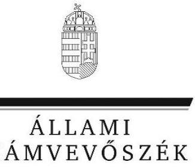
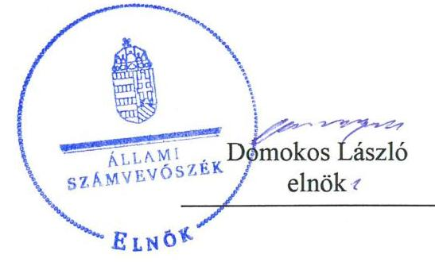
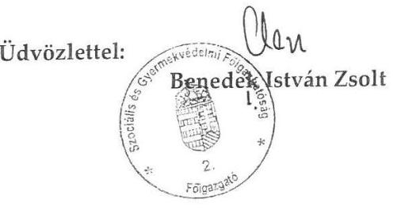
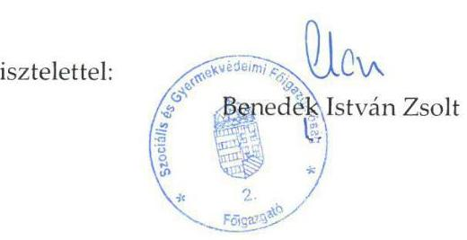
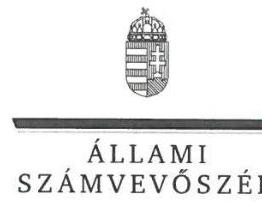
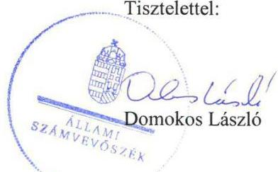

# Jelentés

## Központi költségvetési szervek ellenőrzése

Szociális és Gyermekvédelmi Főigazgatóság 2019.

19151 www.asz.hu

---

# Jelentés

## Központi költségvetési szervek ellenőrzése

Szociális és Gyermekvédelmi
Főigazgatóság
2019. 08. hó 13. nap

---

# AZ ELLENŐRZÉST FELÜGYELTE:

- **HOLMAN MAGDOLNA** felügyeleti vezető
- **AZ ELLENŐRZÉST VEZETTE ÉS A VÉGREHAJTÁSÁÉRT FELELŐS:**
  - GÖRGÉNYI GÁBOR ellenőrzésvezető
  - A PROGRAM ÖSSZEÁLLÍTÁSÁÉRT FELELŐS:
    - TÓTPÁL SZABOLCS osztályvezető

**IKTATÓSZÁM:** EL-1667-001/2019.

**TÉMASZÁM:** 2450

**ELLENŐRZÉS-AZONOSÍTÓ SZÁM:** V079138

Jelentéseink az Országgyűlés számítógépes hálózatán és az Interneten a www.asz.hu címen is olvashatóak.

---

# TARTALOMJEGYZÉK

■ ÖSSZEGZÉS ..... 5
■ AZ ELLENŐRZÉS CÉLJA ..... 6
■ AZ ELLENŐRZÉS TERÜLETE ..... 7
■ AZ ELLENŐRZÉS HÁTTERE, INDOKOLTSÁGA ..... 9
■ A JELENTÉS LÉNYEGES KÉRDÉSKÖREI ..... 10
■ AZ ELLENŐRZÉS HATÓKÖRE ÉS MÓDSZEREI ..... 11
■ MEGÁLLAPÍTÁSOK ..... 14
■ JAVASLATOK ..... 19
■ MELLÉKLETEK ..... 23
I. sz. melléklet: Értelmező szótár ..... 23
■ FÜGGELÉKEK ..... 27
I. sz. függelék a jelentéshez ..... 27
II. sz. függelék: Észrevételek ..... 30
■ RÖVIDÍTÉSEK JEGYZÉKE ..... 47

---

.

---

# ÖSSZEGZÉS

A Szociális és Gyermekvédelmi Főigazgatóság belső kontrollrendszerének kialakítása és működtetése, valamint a pénzügyi és vagyongazdálkodása nem volt szabályszerű, ezáltal a 2015-2017. években nem volt biztosított a felelős gazdálkodás, az átlátható és elszámoltatható közpénzfelhasználás és a vagyon értékének megőrzése.

## Az ellenőrzés társadalmi indokoltsága

A központi alrendszer részét képező intézmények alapvető rendeltetése a közfeladatok ellátásának biztosítása. A közpénzek felhasználásában meghatározó, központi alrendszerbe tartozó intézmények pénzügyi és vagyongazdálkodási tevékenységük és/vagy feladatellátásuk súlya miatt jelentős hatást gyakorolhatnak a költségvetés egyensúlyának fenntartására. Hatással vannak továbbá az állami vagyonnal való gazdálkodás minőségére, a kormányzati (szak)politikák végrehajtására, illetve közfeladat ellátásuk vonatkozásában az állampolgárok életminőségére, jogaik és kötelezettségeik gyakorlására. Indokolt ezért, hogy az Állami Számvevőszék ezen intézmények pénzügyi és vagyongazdálkodását, az esetleges átalakulások szabályszerűségét rendszeresen ellenőrizze.

## Főbb megállapítások, következtetések, javaslatok

A Szociális és Gyermekvédelmi Főigazgatóság belső kontrollrendszerének kialakítása és működtetése nem volt szabályszerű. A kontrollkörnyezet kialakítása a belső szabályozottság hiányosságai miatt, az integrált kockázatkezelési rendszer pedig a működtetés elmaradása miatt nem volt szabályszerű. A belső kontrollrendszer keretében a kontrolltevékenységek gyakorlása sem volt szabályszerű a kötelezettségvállalás és a teljesítés igazolás elmaradása miatt. A főigazgató nem gondoskodott belső ellenőrzés szabályszerű működtetéséről. A feltárt hiányosságok miatt a belső kontrollrendszer nem biztosította az átlátható és elszámoltatható közpénzfelhasználást.

A pénzügyi gazdálkodás nem volt szabályszerű, mert a kiadások teljesítéséhez kapcsolódó gazdasági esemény elszámolása a számviteli törvény előírásai ellenére bizonylat nélkül történt, illetve a számviteli nyilvántartásokba történő bejegyzést szabályszerűen kiállított bizonylat nem támasztotta alá. A közbeszerzési törvény előírásait megsértve nemzeti értékhatárt elérő szolgáltatás megrendelése vonatkozásában elmaradt a közbeszerzési eljárás lefolytatása.

A vagyongazdálkodás nem volt szabályszerű, mert a számviteli törvény előírásai ellenére a Szociális és Gyermekvédelmi Főigazgatóság a mérleg tételeinek alátámasztásához nem állított össze olyan leltárt, amely tételesen, ellenőrizhető módon tartalmazza a mérleg fordulónapján meglévő eszközöket és forrásokat mennyiségben és értékben, emiatt a 2015-2017. évi számviteli beszámolók nem mutattak megbízható és valós képet a gazdálkodásáról.

Az állami vagyon változását eredményező döntések végrehajtása nem volt szabályszerű, mert a számviteli törvény előírásai ellenére a vagyonváltozásokhoz kapcsolódó gazdasági események elszámolása megalapozó bizonylat nélkül történt, illetve a számviteli nyilvántartásokba történő bejegyzést szabályszerűen kiállított bizonylat nem támasztotta alá. A Szociális és Gyermekvédelmi Főigazgatóság a vagyonkezelői jog megszűnése során az eszközök változására ható gazdasági eseményekről nem a valóságnak megfelelő nyilvántartást vezetett.

Az Állami Számvevőszék az EMMI miniszter részére egy javaslatot fogalmazott meg, valamint a Szociális és Gyermekvédelmi Főigazgatóság főigazgatójának 17 javaslatot fogalmazott meg.

---

# AZ ELLENŐRZÉS CÉLJA

AZ ELLENŐRZÉS CÉLJA annak megítélése volt, hogy az ellenőrzött intézményre vonatkozó irányító szervi feladatellátás a jogszabályi előírások betartásával történt-e; az intézménynél a belső kontrollrendszer kialakítása és működtetése szabályszerű volt-e, biztosította-e az átlátható, szabályszerű, gazdaságos, hatékony és eredményes gazdálkodás feltételeit; az intézmény pénzügyi és vagyongazdálkodása megfelelt-e a jogszabályi előírásoknak és belső szabályzatainak. Az ellenőrzés keretében az ÁSZ ${ }^{1}$ értékelte az intézmény korrupciós kockázatainak kezelését szolgáló integritás kontrollok kiépítettségét és az integritás szemlélet érvényesülését. Az ÁSZ értékelte, hogy a központi költségvetési szervnél megteremtették-e a teljesítményellenőrzés feltételeit.

---

# Az ELLENŐRZÉS TERÜLETE

## Szociális és Gyermekvédelmi Főigazgatóság

Az SZGYF ${ }^{2}$ megalapítására 2012. december 10-én került sor a 316/2012. (XI. 13.) Korm. rendelet ${ }^{3}$ alapján a korábban megyei önkormányzati fenntartásban működő szociális és gyermekvédelmi intézmények fenntartói és módszertani feladatainak ellátására. Az SZGYF költségvetési szerv, amely központi szervből, valamint fővárosi és megyei kirendeltségekből áll.

Az SZGYF irányító szerve 2015. január 1. és 2017. december 31. között az EMMI ${ }^{4}$ volt. Az SZGYF önálló jogi személy, előirányzatai fölött teljes jogkörrel bíró költségvetési szerv, amely rendelkezett gazdasági szervezettel. Az SZGYF az ellenőrzött időszakban vállalkozási tevékenységet nem végzett, az Áht. ${ }^{5}$ szerinti átalakításra, átszervezésre nem került sor.

Az SZGYF az intézményfenntartó tevékenységét a 2011. évi CLIV. törvény ${ }^{6}$ alapján átvett szociális és gyermekvédelmi intézményekkel, valamint a szociális és gyermekvédelmi tevékenységet végző alapítványokkal, közalapítványokkal, gazdasági társaságokkal kapcsolatban végezte. Ellátta az országos szociális, illetve gyermekjóléti, gyermekvédelmi módszertani feladatokat és az országos gyermekvédelmi szakértői bizottság működtetésével összefüggő feladatokat.

A fenntartói feladatokat az SZGYF központi szerve 2015. január 1-én 12 költségvetési intézmény, míg 2017. december 31-én 6 költségvetési intézmény tekintetében közvetlenül látta el. A többi intézmény fenntartói feladatait a fővárosi, illetve megyei kirendeltségek látták el, 2015. január 1-én összesen 165 költségvetési intézmény, 2017. december 31-én pedig 106 költségvetési intézmény vonatkozásában.

Az SZGYF módszertani feladatai keretében a szociális, gyermekjóléti és gyermekvédelmi intézmények által szolgáltatott, az ellátórendszerrel kapcsolatos adatok összesítését, elemzését, ezek alapján az országos ellátórendszer fejlesztésére történő javaslattételt, a szükséges források tervezésében való részvételt, módszertani útmutatók, ajánlások összeállítását, kutatások szervezését, lefolytatását végezte. A 221/2015. (VIII. 7.) Korm. rendelet ${ }^{7}$ alapján 2015. szeptember 1-től az országos szociális, illetve gyermekjóléti, gyermekvédelmi módszertani feladatok az NRSZH ${ }^{8}$-hoz kerültek.

A 253/2016. (VIII. 24.) Korm. rendelet ${ }^{9}$ alapján 2016. szeptember 1-től az SZGYF-hez kerültek a megszűnő Türr István Képző és Kutatóintézet egyes társadalmi felzárkózás képzési, szervezési és területi módszertani feladatai.

Az NRSZH megszűnésével a módszertani feladatok 2017. január 1-től újból átkerültek az SZGYF-hez, illetve a 379/2016. (XII. 2.) Korm. rendelet alapján az SZGYF feladatai kiegészültek a rehabilitációs hatósági és szolgáltató tevékenységet segítő szakmai irányítói feladatok ellátásával. Ezen túlmenően az SZGYF többek között vezette a személyes gondoskodást nyújtó szervezetekben szakmai tevékenységet végző szakképzett személyek működési nyilvántartását és működtette a Szociális Ágazati Portált.

---

A Türr István Képző és Kutatóintézet, valamint az NRSZH általános jogutódja az EMMI, illetve a kormányhivatalok lettek, így az átvett feladatok tekintetében az SZGYF-nek beszámoló készítési kötelezettsége nem volt.

Az SZGYF tulajdonosi joggyakorlói feladatát a 316/2012. (XI. 13.) Korm. rendelet határozta meg, amely szerint a főigazgató látta el az átvett vagyon és az integrált intézményi vagyon tekintetében a vagyonkezelői feladatokat. A 2012. évi CXCII. törvény ${ }^{10}$, valamint a 258/2011. (XII. 7.) Korm. rendelet ${ }^{11}$ előírásai alapján az SZGYF több mint 1600 állami tulajdonban lévő ingatlan vagyonkezelését látta el 2017 végén.

Az SZGYF által készített beszámoló szerint az SZGYF teljesített összes bevétele a 2015. december 31-ei 24 122,7 M Ft-ról 2017. év végére 97 387,1 M Ft-ra emelkedett, a teljesített összes kiadása a 2015. december 31-ei 22 307,0 M Ft-ról 2017-re 9,8%-kal, 20 116,1 M Ft-ra csökkent. A bevételek jelentős növekedését elsősorban az uniós projektekre kapott előlegek okozták, amelyek felhasználása az ellenőrzött időszakban nem történt meg, így a bevételek növekedését a kiadási előirányzatok teljesítése nem követte.

Az SZGYF-et a főigazgató ${ }^{12}$ vezette, aki felett az irányító szervet vezető miniszter gyakorolta a kinevezési és munkáltatói jogokat. A főigazgató személyében az ellenőrzött időszakban nem történt változás. A gazdasági vezető személyében ugyanakkor 2015-ben kétszer is történt változás. A fővárosi és megyei kirendeltségek élén az igazgatók álltak, akik felett az egyéb munkáltatói jogokat a főigazgató gyakorolta. Az igazgatókat, a főigazgató javaslatára az irányító szervet vezető miniszter nevezte ki.

Az SZGYF alkalmazásában álló személyek foglalkoztatása kormányzati szolgálati jogviszonyban, munkavállaló jogviszonyban, illetve megbízási jogviszonyban történt. Az átlagos statisztikai állományi létszám a 2015. évi 1163 főről 2017. évre 1678 főre, 43,1%-kal emelkedett. A munkáltatói jogokat a főigazgató gyakorolta.

---

# AZ ELLENŐRZÉS HÁTTERE, INDOKOLTSÁGA

Az államháztartás központi alrendszerének közpénz felhasználása, az intézmények által ellátott közfeladatok sokrétűsége, valamint a feladatellátásához rendelt vagyon nagyságrendje indokolja, hogy az ÁSZ ellenőrzéseket folytasson a pénzügyi és vagyongazdálkodás területén.

Az államháztartás központi alrendszerébe tartozó szervezet vagyona a nemzeti vagyon része és az Alaptörvény ${ }^{13}$ is rögzíti, hogy a vagyonnal való gazdálkodás célja a közérdek szolgálata. Az ÁSZ ellenőrzi az éves költségvetési törvény végrehajtását, az ellenőrzés során feltárt kockázatok és a terület folyamatos kockázatelemzésével beazonosított kockázatok kezelése érdekében ráépülő ellenőrzésekkel ellenőrzi a költségvetési szervek gazdálkodását, működését, hogy az ellenőrzések megállapításaival támogassa az ellenőrzött szervezetek szabályszerű gazdálkodását, javaslataival elősegítse az Alaptörvényben megfogalmazott alapvetések érvényesülését a mindennapi életben a szervezetek szintjén.

A belső kontrollrendszer kialakítása és működtetése nélkül nem valósítható meg a közpénzek, a közvagyon átlátható, szabályos, gazdaságos, hatékony és eredményes felhasználása. A belső kontrollrendszer azt a célt szolgálja, hogy a költségvetési szervek működésük és gazdálkodásuk során a tevékenységeket szabályszerűen hajtsák végre, teljesítsék elszámolási kötelezettségeiket és megvédjék az erőforrásokat a veszteségektől, a károktól és a nem rendeltetésszerű használattól. A belső kontrollrendszer magában foglalja mindazon elveket, eljárásokat és belső szabályzatokat, melyek biztosítják, hogy a költségvetési szerv valamennyi tevékenysége és célja összhangban legyen a szabályszerűséggel, szabályozottsággal, valamint a gazdaságosság, hatékonyság és eredményesség követelményeivel, az eszközökkel és forrásokkal való gazdálkodásban ne kerüljön sor pazarlásra, visszaélésre, rendeltetésellenes felhasználásra. Megfelelő, pontos és naprakész információk álljanak rendelkezésre a költségvetési szerv működésével kapcsolatosan, és a belső kontrollrendszer harmonizációjára, összehangolására vonatkozó jogszabályok végrehajtásra kerüljenek. Az integritás kontrollok kiépítése, erősítése a szervezet korrupciós kockázatainak kezelését szolgálja. A teljesítménykövetelmények meghatározása és működtetése megalapozhatja a központi költségvetési szervnél a teljesítményellenőrzés lefolytatását.

Az elvégzett ellenőrzések során az ÁSZ „jó gyakorlatokat" is azonosíthat, melyeket tanácsadó funkciója keretében szélesebb körben is megismertethet az érintettekkel, ezáltal is hozzájárulva a költségvetési rendszer szabályozott, átlátható, kiegyensúlyozott és fenntartható működéséhez.

Az ellenőrzés a szervezet kockázatértékelése alapján, az egyedi és lényeges jellemzők figyelembevételével történt.

---

# A JELENTÉS LÉNYEGES KÉRDÉSKÖREI

1.     - Az irányító szerv SZGYF-re vonatkozó feladatellátása szabályszerű volt-e?
2.     - Az SZGYF belső kontrollrendszerének kialakítása és működtetése biztosította-e a közpénzekkel és a nemzeti vagyonnal történő szabályszerű gazdálkodást?
3.     - Az SZGYF pénzügyi gazdálkodása szabályszerű volt-e?
4.     - Az SZGYF vagyongazdálkodása szabályszerű volt-e?

---

# AZ ELLENŐRZÉS HATÓKÖRE ÉS MÓDSZEREI

## Az ellenőrzés
 típusa

Megfelelőségi ellenőrzés.

## Az ellenőrzött időszak

Az irányító szervi feladatellátás és az SZGYF pénzügyi gazdálkodása esetében a 2015-2016. évek, az SZGYF belső kontrollrendszere, valamint a vagyongazdálkodás tekintetében a 2015-2017. évek és az éves költségvetési beszámoló jóváhagyásáig tartó időszak (2018. június 30.), továbbá az integritás kontrollok vonatkozásában a 2017. év.

## Az ellenőrzés tárgya

Az SZGYF-re vonatkozó 2015-2016. évi irányító szervi feladatok ellátása. Az SZGYF 2015-2017. évi belső kontrollrendszerének kialakítása és működtetése, valamint a 2015-2016. évi pénzügyi és vagyongazdálkodása. A 2017. évre vonatkozóan az SZGYF-nél az integritás kontrollok kiépítettsége, az integritás szemlélet érvényesülése, valamint a teljesítményellenőrzés feltételeinek rendelkezésre állása.

A vagyongazdálkodás ellenőrzésének keretében az ÁSZ ellenőrizte a vagyongazdálkodás feltételeinek kialakítását, annak szabályszerűségét, az elszámoltathatóság biztosítását a szabályozás szintjén. A vagyonváltozást eredményező döntéseket, a vagyonban bekövetkezett változások végrehajtását, nyilvántartásba vételének, elszámolásának szabályszerűségét. Az SZGYF könyveiben, mérlegében az állami vagyon kimutatásának szabályszerűségét, ennek keretében az állami vagyonnal történő rendelkezést, a vagyonmozgásokat, a vagyon nyilvántartásba vételét, értékelését és a mérleg alátámasztás szabályszerűségét.

Az ellenőrzés kiterjedt minden olyan körülményre és adatra, amely az ÁSZ jogszabályban meghatározott feladatainak teljesítéséhez, valamint a program végrehajtása folyamán felmerült újabb összefüggések feltárásához szükséges volt.

## Az ellenőrzött szervezet

Az SZGYF, valamint az irányító szervi feladatokat ellátó EMMI.

---

# Az ellenőrzés jogalapja 

Az ellenőrzés jogszabályi alapját az ÁSZ tv. 1. § (3) bekezdés, 5. § (2)-(4) és (6) bekezdései, valamint az Áht. 61. § (2) bekezdésének előírásai képezték.

## Az ellenőrzés módszerei

Az ellenőrzésre a szakmai program szempontjai, az ellenőrzött időszakban hatályos jogszabályok, az ellenőrzés szakmai szabályai, a jelen ellenőrzésre irányadó ÁSZ módszertanok figyelembevételével került sor.

Az ellenőrzés ideje alatt az ellenőrzött szervezetekkel a kapcsolattartást az ÁSZ SZMSZ ${ }^{14}$-ének vonatkozó előírásai alapján biztosította az ÁSZ.

Az ellenőrzési kérdések megválaszolásához szükséges bizonyítékok megszerzése az ellenőrzött szervezetek által rendelkezésre bocsátott dokumentumokra, adatokra alapozva megfigyelés, szemle (szemrevételezés), kérdésfeltevés (információkérés), mintavételezés, valamint elemző eljárás útján történt. Az ellenőrzési bizonyítékként felhasználható adatforrások közé tartoztak egyrészt a szakmai program részletes szempontjainál felsorolt adatforrások, másrészt minden egyéb - az ellenőrzés folyamán feltárt, az ellenőrzés szempontjából információt tartalmazó - dokumentum.

Az ellenőrzés lefolytatásához az ellenőrzött szervezetek a tanúsítványok kitöltésével, valamint az ÁSZ által kért dokumentumok megküldésével szolgáltattak adatokat, amelyek valódiságát és teljes körűségét az ellenőrzött szervezet vezetője által tett teljességi és hitelességi nyilatkozat igazolta. Az így rendelkezésre bocsátott adatok, információk kontrollja az ellenőrzés keretében történt.

A központi költségvetési szerv belső kontrollrendszere egyes pilléreinek kialakítására és működtetésére vonatkozó értékelés:
$\longrightarrow$ „szabályszerű", amennyiben az értékelt területen az elért „igen" válaszok százalékban kifejezett, egész számra kerekített aránya legalább $85 \%$,
$\longrightarrow$ „nem szabályszerű", ha nem érte el a 85\%-ot,
A központi költségvetési szerv belső kontrollrendszerének összesített értékelése az egyes részterületek esetében kapott megfelelőségi arányok számtani átlaga alapján történt és megegyezett a pillérenként (kontrollterületenként) alkalmazott százalékos értékelésekkel, a következő eltérésekkel: a kontrollrendszer egésze esetében a „szabályszerű" értékelésnek a százalékos értéken felül további feltétele volt, hogy egyik kontrollterület sem kaphatott „nem szabályszerű" értékelést.

Az ÁSZ statisztikai módszereken alapuló mintavételt alkalmazott.
A kiadások és a bevételek ellenőrzésére a 2015-2016. évek vonatkozásában került sor. A kiadások (felhalmozási kiadások, dologi kiadások) és bevételek (értékesítésből és bérbeadásból származó bevételek) esetében az ellenőrzés azokra a legnagyobb értékű tételekre - a lényeges sokaságra terjedt ki, melyek összértéke eléri a teljes sokaság összértékének 50\%-át.

---

A 2015-2016. évi kiadások és a 2015-2016. évi bevételek elszámolásának szabályszerűségét a lényeges sokaságból véletlen mintavételi eljárással kiválasztott tételek alapján ellenőriztük.

A 2017. évi beruházások, felújítások végrehajtásának, a feladatellátást szolgáló állami vagyontárgyak felhasználásának és év végi értékelésének, valamint a pénzmozgáshoz nem kapcsolódó vagyonváltozások közül az állami vagyon átadása és azok nyilvántartásban való rögzítése, továbbá a vagyontárgyak átvétele és nyilvántartásba vétele szabályszerűségét a teljes sokaságból véletlen mintavétellel kiválasztott tételek alapján ellenőriztük.

A vagyontárgyak értékesítéséből származó 2017. évi bevételek esetében a lényeges sokaságot tételesen ellenőriztük.

A 2017. évi pénzmozgáshoz nem kapcsolódó vagyonváltozások közül az állami vagyon tulajdonjogának térítésmentes átadás miatti átruházása, nyilvántartásból való kivezetése szabályszerűségének esetében tételes ellenőrzésre került sor.

A 2015. és 2016. évek vonatkozásában a vagyonértékének megőrzését, gyarapítását szolgáló vagyongazdálkodás feltételeinek kialakítása szabályszerűségét véletlen mintavételi eljárással kiválasztott tételek alapján ellenőriztük.

A mintavétellel ellenőrzött területek esetében minden egyes tétel vonatkozásában a felhasználás, elszámolás és értékelés szabályszerűségére vonatkozó kérdéseket tettünk fel. Szabályszerűnek értékeltünk egy ellenőrzött területet, amennyiben 95\%-os bizonyossággal az ellenőrzött sokaságban az átlagos hibaarány legfeljebb 10\%, nem szabályszerűnek, amennyiben 10\%-nál magasabb arányt képviselt.

Abban az esetben, ha az ellenőrzött sokaság tekintetében a 10\%-os hibaarányhoz való viszony megítélésének megbízhatósága nem érte el a 95\%-ot, annak elérése érdekében értékelésünket további szempontokkal egészítettük ki, és figyelembe vettük a feltárt hibák értékét.

Az ellenőrzés ideje alatt az ellenőrzött szervezettel történő kapcsolattartást az ÁSZ SZMSZ-ének vonatkozó előírásai alapján biztosítottuk.

---

# 1. Az irányító szerv SZGYF-re vonatkozó feladatellátása szabályszerű volt-e? 

Összegző megállapítás

Az irányító szerv SZGYF-re vonatkozó feladatellátása a munkáltatói jogkörgyakorlás hiányosságai miatt nem volt szabályszerű a 2015-2016. években.

Az EMMI szabályszerűen gyakorolta alapítói jogait, az SZGYF rendelkezett az Ávr ${ }^{15}$-ben előírt tartalmú alapító okirattal. ${ }^{16}$ Az egyéb irányítási, felügyeleti és ellenőrzési jogkörök gyakorlása szabályszerű volt. Az SZGYF SZMSZ ${ }^{17}$ -ét a miniszter EMMI utasításban adta ki. Az EMMI az Áht.-ban, illetve az Ávr.-ben előírtak szerint kiadta a tervezés során alkalmazandó általános és kötelezően érvényesítendő tervezési követelményeket, jóváhagyta az SZGYF elemi költségvetését és előirányzat-maradványát, továbbá az Áhsz. ${ }^{18}$ előírásai szerint az SZGYF költségvetési beszámolóját. Az irányító szerv a főigazgatót az éves feladatellátásról minden évben beszámoltatta.

Az EMMI a munkáltatói jogokat nem a 10/2013. (I. 21.) Korm. rendelet ${ }^{19}$ 6. § (1) és (2) bekezdéseiben, valamint 7. § (1) és (2) bekezdéseiben foglaltak szerint gyakorolta, mert nem határozta meg a főigazgató egyéni teljesítmény követelményeit, illetve a teljesítménykövetelmény végrehajtásának elvárt eredményét, elvárt határidejét, elvárt mérőpontját, indikátorait.

## 2. Az SZGYF belső kontrollrendszerének kialakítása és működtetése biztosította-e a közpénzekkel és a nemzeti vagyonnal történő szabályszerű gazdálkodást?

Összegző megállapítás

Az SZGYF belső kontrollrendszerének kialakítása és működtetése nem biztosította a közpénzekkel és a nemzeti vagyonnal történő szabályszerű gazdálkodást.

A KONTROLLKÖRNYEZET kialakítása nem volt szabályszerű. Az Áht. 10. § (5) bekezdésében foglaltak ellenére 2015. június 19-ig az SZGYF szervezetét, feladatai ellátásának részletes belső rendjét és módját SZMSZ nem állapította meg, mert az alapító okirat 11.1. pontjában foglaltak ellenére elmaradt az SZMSZ elkészítése, és a miniszteri jóváhagyásra történő előterjesztése. A gazdasági szervezet működésének részletes szabályait a gazdálkodási feladatokat ellátó szervezeti egységek ügyrendjei tartalmazták. A gazdálkodás részletes rendjét a Gazdálkodási szabályzat ${ }^{20}$ és a Kötelezettségvállalási szabályzat ${ }^{21}$ 1-5 határozta meg.

Az SZGYF Számv. tv. ${ }^{22}$ 2015. július 4-én hatályba lépett módosítását követően a Számv. tv. 14. § (4) bekezdésében foglaltak ellenére nem rögzí-

---

tette írásban a Számviteli politika ${ }_{2-3}{ }^{23}$ keretében azokat a gazdálkodóra jellemző szabályokat, előírásokat, módszereket, amelyekkel meghatározza, hogy mit tekint a számviteli elszámolás, az értékelés szempontjából kivételes nagyságú vagy előfordulású bevételnek, költségnek, ráfordításnak.

A Számlarend ${ }_{1-2}{ }^{24}$ az Áhsz. 51. § (3) bekezdésében foglaltak ellenére nem tartalmazta a részletező (analitikus) nyilvántartásoknak a kapcsolódó könyvviteli számlákkal való egyeztetését, annak dokumentálását, valamint az összesítő bizonylat (feladás) formai követelményeit.

Az Áhsz. 50. § (2) bekezdés b) és c) pontjában foglaltak ellenére az Értékelési szabályzat ${ }_{1}{ }^{25}$-ban az SZGYF nem rögzítette a kis összegű követelések dokumentálásának szabályait, valamint az Értékelési szabályzat ${ }_{1-2}$-ban az egyszerűsített értékelési eljárás alá vont követelések besorolásának elveit, dokumentálásának szabályait.

A Pénzkezelési szabályzat ${ }_{2}{ }^{26}$ a Számv. tv. 14. § (8) bekezdésében foglaltak ellenére 2017-ben nem rendelkezett a pénzszállítás feltételeiről. A Leltározási szabályzat ${ }_{1-2}{ }^{27}$ a Számv. tv. és az Áhsz. előírásai szerint készült.

A KOCKÁZATKEZELÉSI RENDSZER működtetése nem volt szabályszerű, mert a főigazgató 2016. október 1-től 2017. november 3-ig a Bkr. ${ }^{28}$ 7. § (1) bekezdésének előírása ellenére integrált kockázatkezelési rendszert nem működtetett. Az integrált kockázatkezelési rendszer koordinálásának felelősét az SZGYF főigazgatója a Bkr. 7.§. (4) bekezdésében előírtak ellenére 2016. október 1-től 2017. július 16-ig nem jelölte ki.

Az integrált kockázatkezelési rendszer működtetése 2017. november 3-tól a Kockázatkezelési Szabályzat ${ }_{3}$ alapján a Bkr. előírásai szerint valósult meg. Az integrált kockázatkezelési rendszer az SZGYF minden tevékenységére kiterjedt. A felmerülő kockázatokkal kapcsolatban egységes módszertan és eljárás került meghatározásra.

A KONTROLLTEVÉKENYSÉGEK gyakorlása nem volt szabályszerű. Az SZGYF a kötelezettségvállalásra, pénzügyi ellenjegyzésre, teljesítés igazolására, érvényesítésre, utalványozásra jogosult személyekről és aláírás-mintájukról az Ávr. 60. § (3) bekezdése szerinti nyilvántartást nem vezetett, mert a pénzügyi jogkörök gyakorlására felhatalmazással rendelkező személyek nyilvántartása ${ }^{29}$:

- nem a belső szabályzatban foglaltak szerint készült, mert a Kötelezettségvállalási szabályzat ${ }_{1}$ 8. Függelékében, illetve a Kötelezettségvállalási szabályzat ${ }_{2-5}$ 6. § (4) bekezdésében foglaltak ellenére nem tartalmazta a jogosult személyek aláírás-mintáját, továbbá
- nem volt naprakész, mert nem tartalmazta a Kötelezettségvállalási szabályzat ${ }_{1-5}$ szerinti felhatalmazással rendelkező összes személyt.
A kiadások teljesítéséhez kapcsolódó kontrolltevékenységek gyakorlása nem volt szabályszerű:
- A kiadások teljesítésére az Ávr. 52. § (1) bekezdés a) pontjában foglaltak ellenére az SZGYF vezetője vagy az általa írásban felhatalmazott személy kötelezettségvállalása nélkül került sor.
- A kiadás összege túllépte az Ávr. 52. § (1) bekezdés alapján a kötelezettségvállalásra adott felhatalmazásban megjelölt összeget.
- Az Ávr. 56. § (1) bekezdésében foglaltak ellenére a kötelezettségvállalást nem vették nyilvántartásba.

---

$\longrightarrow$ Az Ávr. 57. § (1), (3)-(4) bekezdés előírásait megsértve elmaradt a teljesítés igazolása, mert azt nem végezték el, vagy a teljesítést nem az arra jogosult, kijelöléssel rendelkező személy írta alá.

AZ INFORMÁCIÓS ÉS KOMMUNIKÁCIÓS folyamatok működtetése szabályszerű volt. Az SZGYF eleget tett az Info tv. ${ }^{30}$ 1. melléklet szerinti közzétételi kötelezettségének.

A NYOMON KÖVETÉSI RENDSZER kialakítása szabályszerű volt, mely az operatív tevékenységek keretében megvalósuló folyamatos és eseti nyomon követésből állt. A monitoring tevékenység végrehajtását az SZMSZ, az ügyrendek és a munkaköri leírások mellett, a Monitoring szabályzat ${ }^{31}$ és az Ellenőrzési nyomvonal ${ }_{1-2}{ }^{32}$-ak támogatták.

A BELSŐ ELLENŐRZÉS működtetése nem volt szabályszerű. A főigazgató az éves ellenőrzési terveket a Bkr. 32. § (2) bekezdés szerinti határidőre nem küldte meg az EMMI belső ellenőrzési vezetője részére.

A Bkr. 39. § (1)-(2) bekezdéseiben foglaltak ellenére az elvégzett belső ellenőrzések alapján nem minden esetben készült ellenőrzési jelentés. A Bkr. 28. § c) pontja és a 45. § (1)-(3) bekezdéseiben foglaltak ellenére az ellenőrzés megállapításai, és javaslatai alapján nem minden esetben készült intézkedési terv.

Az elvégzett belső ellenőrzésekről vezetett 2015-2016. évi nyilvántartásokat nem a Bkr. 50. § (2) bekezdés
 d), e) pontjában előírt tartalommal vezették, mert nem tartalmazták az ellenőrzés lezárásának időpontját és az ellenőrzés lefolytatásában részt vett vizsgálatvezető nevét.

A BELSŐ KONTROLLRENDSZER MINŐSÉGÉT a Bkr. szerint nyilatkozatban értékelte a főigazgató, azonban a Bkr. 11. § (2) bekezdése ellenére a nyilatkozatot az éves költségvetési beszámolóval egyidejűleg nem küldte meg az irányító szervnek. A főigazgató nyilatkozataiban foglaltakat nem igazolták vissza az ÁSZ által az SZGYF belső kontrollrendszerének 2015-2017. évi működéséről tett megállapítások.

AZ INTEGRITÁS KONTROLLRENDSZER nem kötelezően előírt, lágy kontrolljai kiépítettségének szintje a 2017. évben nem támogatta az SZGYF integritás elvű működését. A jogszabályok által nem kötelezően előírt, egyéb integritást erősítő kontrollokat az SZGYF csak alacsony szinten működtette.

# 3. Az SZGYF pénzügyi gazdálkodása szabályszerű volt-e? 

Összegző megállapítás

Az SZGYF pénzügyi gazdálkodása a 2015-2016. években nem volt szabályszerű.

A KIADÁSI ELŐIRÁNYZATOK 2015-2016. évi felhasználása nem volt szabályszerű:
a kiadások teljesítéséhez kapcsolódó gazdálkodási jogkörök kontrolltevékenységének hiányosságai miatt (lásd. 2. pont).

---

- Az Ávr. 50. § (1) bekezdés a) pontjában foglaltak ellenére a megkötött szerződések nem tartalmazták a szakmai, műszaki teljesítés mennyiségi és minőségi jellemzőinek meghatározását, határidejét.
- A Számv. tv. 165. § (1)-(2) bekezdésében foglaltak ellenére a gazdasági esemény elszámolása bizonylat nélkül történt.
- A Kbt. ${ }^{33}$ 4. § (1) bekezdés előírásait megsértve nemzeti értékhatárt elérő szolgáltatás megrendelése vonatkozásában elmaradt a közbeszerzési eljárás lefolytatása.

AZ ELŐIRÁNYZAT-MARADVÁNY 2015-2016. évi megállapítása nem volt szabályszerű. Az SZGYF az Áhsz. 39. § (3) bekezdésében foglaltak ellenére a kötelezettségvállalással terhelt maradvány alátámasztásához nem vezetett az Áhsz. 14. melléklet II. 4. a), e), f), g) pontjaiban előírt tartalmú részletező nyilvántartást, mert a kötelezettségvállalások nyilvántartása nem tartalmazta a kötelezettségvállalás sorszámát; a pénzügyi teljesítési határidőket, a teljesítések dátumát, összegét; valamint a kötelezettségvállalás módosulásait és az azokat tanúsító dokumentum megnevezését, iktatószámát, keltét.

# 4. Az SZGYF vagyongazdálkodása szabályszerű volt-e? 

## Összegző megállapítás Az SZGYF vagyongazdálkodása nem volt szabályszerű.

A MÉRLEG TÉTELEINEK alátámasztásához a Számv. tv. 69. § (1) bekezdésében és az Áhsz. 22. § (1) bekezdésében foglaltak ellenére az SZGYF nem állított össze olyan leltárt, amely tételesen, ellenőrizhető módon tartalmazza a mérleg fordulónapján meglévő eszközöket és forrásokat mennyiségben és értékben. Az Áhsz. 5. § (1) bekezdésében foglaltak ellenére az elkészített költségvetési beszámolók nem voltak leltárral alátámasztva, így a Számv. tv. 15. § (3) bekezdése szerinti valódiság elve nem érvényesült.

AZ ÁLLAMI VAGYON VÁLTOZÁSÁT eredményező döntések 2017. évi végrehajtása nem volt szabályszerű:
— a Számv. tv. 165. § (1)-(2) bekezdésében foglaltak ellenére a vagyonváltozásokhoz kapcsolódó gazdasági események elszámolásához nem állítottak ki bizonylatot, és bizonylat nélkül rögzítették a könyvelési adatot.
— a Számv. tv. 165. § (2) bekezdésében foglaltak ellenére a vagyonváltozások számviteli nyilvántartásokba történő bejegyzését a Számv. tv. 166. § (2) bekezdése szerinti, szabályszerűen kiállított bizonylat nem támasztotta alá.
— a Számv. tv. 165. § (3) bekezdésének b) pontjában foglaltak ellenére a vagyonkezelői jog megszüntetésével kapcsolatos adatokat az SZGYF a nyilvántartásában a tárgynegyedévet követő hó végéig nem rögzítette.
— az Áhsz. 45. § (1) bekezdés előírásai ellenére a vagyonkezelői jog megszűnése során az SZGYF az eszközök változására ható gazdasági eseményekről nem a valóságnak megfelelő nyilvántartást vezetett,

---

mert a vagyonkezelői jog megszűnésének számviteli nyilvántartásból történő kivezetését nem a 38/2013. (IX. 19.) NGM rendelet 1. melléklet III. fejezet Csökkenések rész „L) Vagyonkezelői jog átruházása" pontjában foglaltak szerint, hanem az „F) Térítés nélküli átadás elszámolása" pontban foglaltak szerint könyvelték.

---

# JAVASLATOK 

Az ÁSZ tv. 33. § (1) bekezdésében foglaltak értelmében az ellenőrzött szervezet vezetője köteles a jelentésben foglalt megállapításokhoz kapcsolódó intézkedési tervet összeállítani és azt a jelentés kézhezvételétől számított 30 napon belül az ÁSZ részére megküldeni. Amennyiben az ellenőrzött szervezet vezetője nem küldi meg határidőben az intézkedési tervet, vagy továbbra sem elfogadható intézkedési tervet küld, az Állami Számvevőszék elnöke az ÁSZ tv. 33. § (3) bekezdés a) és b) pontjaiban foglaltakat érvényesítheti.

## A Szociális és Gyermekvédelmi Főigazgatóság főigazgatójának

1. Intézkedjen a Számv. tv. előírásainak megfelelő számviteli politika elkészítésére.
(2. sz. megállapítás 2. bekezdése alapján)
2. Intézkedjen az Áhsz. előírásainak megfelelő számlarend elkészítésére.
(2. sz. megállapítás 3. bekezdése alapján)
3. Intézkedjen az Áhsz. előírásainak megfelelő eszközök és források értékelésének szabályzata elkészítésére.
(2. sz. megállapítás 4. bekezdése alapján)
4. Intézkedjen a Számv. tv. előírásainak megfelelő pénzkezelési szabályzat elkészítésére.
(2. sz. megállapítás 5. bekezdés 1. mondata alapján)
5. Intézkedjen a gazdálkodási jogkör gyakorlására kijelölt személyek és aláírás-mintájuk Ávr. szerinti naprakész nyilvántartására.
(2. sz. megállapítás 8. bekezdése alapján)
6. Intézkedjen a kötelezettségvállalások Ávr. előírásának megfelelő nyilvántartásba vételére.
(2. sz. megállapítás 9. bekezdése 3. francia bekezdése alapján)
7. Intézkedjen, hogy a kötelezettségvállalás és a teljesítésigazolás feleljen meg a jogszabályi előírásoknak.
(2. sz. megállapítás 9. bekezdése 1-2. és 4. francia bekezdése alapján)

---

8. Intézkedjen az éves ellenőrzési terv fejezet irányító szerv részére történő megküldése során a Bkr. előírásainak betartására.
(2. sz. megállapítás 12. bekezdése alapján)
9. Intézkedjen, hogy a belső ellenőrzés működése feleljen meg a Bkr. előírásainak.
(2. sz. megállapítás 12-14. bekezdése alapján)
10. Gondoskodjon a költségvetési szerv belső kontrollrendszerének minőségét értékelő nyilatkozat irányító szerv részére történő megküldése tekintetében a Bkr. előírásának betartásáról.
(2. sz. megállapítás 15. bekezdése alapján)
11. Intézkedjen, hogy a visszterhes szerződések tartalmazzák az Ávr.-ben előírtak szerint a szakmai, műszaki teljesítés mennyiségi és minőségi jellemzőinek meghatározását, határidejét.
(3. sz. megállapítás 1. bekezdés 2. francia bekezdése alapján)
12. Intézkedjen, hogy a Számv. tv. előírásainak megfelelően számviteli (könyvviteli) nyilvántartásokba csak szabályszerűen kiállított bizonylat alapján jegyezzenek be adatokat.
(3. sz. megállapítás 1. bekezdés 3. francia bekezdése és a 4. sz. megállapítás 2. bekezdés 1. és 2. francia bekezdése alapján)
13. Intézkedjen a nemzeti értékhatárt elérő szolgáltatás megrendelése esetén a Kbt. előírásainak megfelelő közbeszerzési eljárás lefolytatására.
(3. sz. megállapítás 1. bekezdés 4. francia bekezdése alapján)
14. Intézkedjen a kötelezettségvállalások Áhsz. előírásainak megfelelő tartalmú nyilvántartására.
(3. sz. megállapítás 2. bekezdése alapján)
15. Intézkedjen a mérleg tételeinek alátámasztásához a Számv. tv. által előírt leltár összeállítására.
(4. sz. megállapítás 1. bekezdése alapján)
16. Intézkedjen a gazdasági műveletek, események bizonylatainak adatai a könyvviteli nyilvántartásban történő rögzítése tekintetében a Számv. tv.-ben előírtak betartására.
(4. sz. megállapítás 2. bekezdés 3. francia bekezdés alapján)

---

17. Intézkedjen a gazdasági események jogszabály által előírt elszámolására.
(4. sz. megállapítás 2. bekezdés 4. francia bekezdés alapján)

# Az emberi erőforrások miniszterének 

1. Intézkedjen az SZGYF főigazgatója részére a 10/2013. (I.21.) Korm. rendelet előírásának megfelelő egyéni teljesítménykövetelmények meghatározására.
(1. sz. megállapítás 2. bekezdése alapján)

---

.

---

# MELLÉKLETEK 

- I. SZ. MELLÉKLET: ÉRTELMEZŐ SZÓTÁR
állami vagyon
állami vagyon használója
állami vagyon használója
állami vagyon hasznosítása
belső ellenőrzés
belső kontrollrendszer
belső kontrollrendszer területei

Állami vagyonnak minősül:
a) az állam tulajdonában lévő dolog, valamint a dolog módjára hasznosítható természeti erő,
b) az a) pont hatálya alá nem tartozó mindazon vagyon, amely vonatkozásában törvény az állam kizárólagos tulajdonjogát nevesíti,
c) az állam tulajdonában lévő tagsági jogviszonyt megtestesítő értékpapír, illetve az államot megillető egyéb társasági részesedés,
d) az államot megillető olyan immateriális, vagyoni értékkel rendelkező jogosultság, amelyet jogszabály vagyoni értékű jogként nevesít. (Forrás: Vtv. ${ }^{34} 1 . \S$ (2) bekezdése)
Az a természetes vagy jogi személy, jogi személyiséggel nem rendelkező szervezet, aki, vagy amely törvény vagy szerződés alapján, bármely jogcímen (bérlet, haszonbérlet, használat stb.) állami vagyont birtokol, használ, szedi annak hasznait, hasznosít, ide nem értve a haszonélvezőt, a vagyonkezelőt és a tulajdonosi jogok gyakorlóját. (Forrás: Vtvr. ${ }^{35} 1 . \S$ (7) bekezdés a) pontja)
Az állami vagyont az MNV Zrt. maga kezeli, vagy szerződés - így különösen bérlet, haszonbérlet, megbízás - alapján központi költségvetési szervnek, természetes vagy jogi személynek, vagy jogi személyiséggel nem rendelkező gazdálkodó szervezetnek hasznosításra átengedi.
(Forrás: Vtv. 23. § (1) bekezdése, hatályos 2012. január 1-jétől)
Az állami vagyonnal a tulajdonosi joggyakorló maga gazdálkodik, vagy szerződés - így különösen bérlet, haszonbérlet, megbízás - alapján hasznosításra átengedi, illetőleg vagyonkezelésbe, haszonélvezetbe adja. (Forrás: Vtv. 23. § (1) bekezdése, hatályos 2013. június 28 -ától)
Az állami vagyont az MNV Zrt. maga kezeli, vagy szerződés - így különösen bérlet, haszonbérlet, megbízás - alapján központi költségvetési szervnek, természetes vagy jogi személynek, vagy jogi személyiséggel nem rendelkező gazdálkodó szervezetnek hasznosításra átengedi." Az állami vagyonra vonatkozóan az MNV Zrt. kizárólag az Nvtv. ${ }^{36}$-ben meghatározott személyekkel köthet vagyonkezelési szerződést. (Forrás: Vtv. 27. § (1) bekezdése, hatályos 2012. január 1-jétől)
Független, tárgyilagos bizonyosságot adó és tanácsadó tevékenység, amelynek célja, hogy az ellenőrzött szervezet működését fejlessze és eredményességét növelje, az ellenőrzött szervezet céljai elérése érdekében rendszerszemléletű megközelítéssel és módszeresen értékeli, illetve fejleszti az ellenőrzött szervezet irányítási és belső kontrollrendszerének hatékonyságát. (Forrás: Bkr. 2. § b) pontja)
A belső kontrollrendszer a kockázatok kezelése és tárgyilagos bizonyosság megszerzése érdekében kialakított folyamatrendszer, amely azt a célt szolgálja, hogy a működés és gazdálkodás során a tevékenységeket szabályszerűen, gazdaságosan, hatékonyan, eredményesen hajtsák végre, az elszámolási kötelezettségeket teljesítsék, megvédjék az erőforrásokat a veszteségektől, károktól és nem rendeltetésszerű használattól. (Forrás: Áht. 69. § (1) bekezdése)
A kontrollkörnyezet, a kockázatkezelési rendszer, a kontrolltevékenységek, az információs és kommunikációs rendszer, valamint a nyomon követési (monitoring) rendszer. (Forrás: Bkr. 3. §-a)

---

információs és kommunikációs rendszer
integritás
integrált kockázatkezelési rendszer
irányító szerv/felügyeleti szerv
kockázat
kockázatkezelési rendszer
kontrollkörnyezet
kontrolltevékenységek
közfeladat
maradvány
nyomon követési rendszer (monitoring)

A költségvetési szerv vezetője által kialakított és működtetett olyan rendszer, mely biztosítja, hogy a megfelelő információk a megfelelő időben eljutnak az illetékes szervezethez, szervezeti egységhez, illetve személyhez. (Forrás: Bkr. 9. § (1) bekezdés)
Az integritás - egyik gyakran használt jelentése szerint - az elvek, értékek, cselekvések, módszerek, intézkedések konzisztenciáját jelenti, vagyis olyan magatartásmódot, amely meghatározott értékeknek megfelel. Integritás-irányítási rendszer bevezetése a szervezetben a szervezethez rendelt közfeladatok integritás szempontú ellátását, az érték alapú működéssel (integritással) összefüggő szervezeti követelmények következetes érvényesítését jelenti. (Forrás: Nemzetgazdasági Minisztérium: Államháztartási Belső Kontroll Standardok és Gyakorlati Útmutató 1.6. Etikai értékek és integritás 46. oldal, 2017. szeptember)
Olyan folyamatalapú kockázatkezelési rendszer, amely a szervezet minden tevékenységére kiterjed, egységes módszertan és eljárások alkalmazásával, a szervezet célkitűzéseinek és értékeinek figyelembevételével biztosítja a szervezet kockázatainak teljes körű azonosítását, azok meghatározott kritériumok szerinti értékelését, valamint a kockázatok kezelésére vonatkozó intézkedési terv elkészítését és az abban foglaltak nyomon követését. (Forrás: Bkr. 2. § m) pontja, 2016. október 1-jétől)
A költségvetési szerv tekintetében az Áht.-ban meghatározott irányítási hatáskört gyakorló szerv. (Forrás: Áht. 1. § 9. pontja)
A kockázat annak a valószínűségét jelenti, hogy egy vagy több esemény vagy intézkedés nem kívánt módon befolyásolja a rendszer működését, céljainak megvalósulását. (Forrás: Javaslatok a korrupciós kockázatok kezelésére - Kockázatkezelési és ellenőrzési módszertan 35. oldal, ÁSZ)
Olyan irányítási eszközök és módszerek összessége, melynek elemei a szervezeti célok elérését veszélyeztető tényezők (kockázatok) azonosítása, elemzése, csoportosítása, nyomon követése, valamint szükség esetén a kockázati kitettség mérséklése.(Forrás: Bkr. 2. § m) pontja)
A költségvetési szerv vezetője által
 kialakított olyan elvek, eljárások, belső szabályzatok összessége, amelyben világos a szervezeti struktúra, a folyamatok átláthatók, egyértelműek a felelősségi, hatásköri viszonyok és feladatok, meghatározottak, ismertek és elfogadottak az etikai elvárások a szervezet minden szintjén, átlátható a humán-erőforrás-kezelés. (Forrás: Bkr. 6. § (1) bekezdés)
A költségvetési szerv vezetője által a szervezeten belül kialakított (kontroll) tevékenységek, melyek biztosítják a kockázatok kezelését, hozzájárulnak a szervezet céljainak eléréséhez és erősítik a szervezet integritását. (Forrás: Bkr. 8. § (1) bekezdés)
Jogszabályban meghatározott állami vagy önkormányzati feladat, amit az arra kötelezett közérdekből, a jogszabályban meghatározott követelményeknek és feltételeknek megfelelve végez, ideértve a lakosság közszolgáltatásokkal való ellátását, továbbá az állam nemzetközi szerződésekben vállalt kötelezettségeiből adódó közérdekű feladatokat, valamint e feladatok ellátásakor szükséges infrastruktúra biztosítását is. (Forrás: Nvtv. 3. § (1) bekezdés 7. pontja)
A költségvetési év során a bevételek és kiadások különbözete, amely az alaptevékenység bevételei és kiadásai tekintetében a költségvetési maradvány, a vállalkozási tevékenység bevételei és kiadásai tekintetében a vállalkozási maradvány. (Forrás: Áht. 1. § 17. pont)
A költségvetési szerv vezetője köteles kialakítani a szervezet tevékenységének a célok megvalósításának nyomon követését biztosító rendszert, amely az operatív tevékenységek keretében megvalósuló folyamatos és eseti nyomon követésből, valamint az operatív tevékenységektől függetlenül működő belső ellenőrzésből áll. (Forrás: Bkr. 10. §)

---

vagyongazdálkodás

A nemzeti vagyongazdálkodás feladata a nemzeti vagyon rendeltetésének megfelelő, az állam, az önkormányzat mindenkori teherbíró képességéhez igazodó, elsődlegesen a közfeladatok ellátásához és a mindenkori társadalmi szükségletek kielégítéséhez szükséges, egységes elveken alapuló, átlátható, hatékony és költségtakarékos működtetése, értékének megőrzése, állagának védelme, értéknövelő használata, hasznosítása, gyarapítása, továbbá az állam vagy a helyi önkormányzat feladatának ellátása szempontjából feleslegessé váló vagyontárgyak elidegenítése. (Forrás: Nvtv. 7. § (2) bekezdése)

---

.

---

# FÜGGELÉKEK 

## I. SZ. FÜGGELÉK A JELENTÉSHEZ

Az Állami Számvevőszék az ellenőrzések során feltárt tényekhez kapcsolódó további körülmények tisztázására eszközrendszerrel nem rendelkezik. Amennyiben az ellenőrzésen túlmutatóan indokoltnak látszik az ellenőrzés során feltárt körülmények további vizsgálata, az Állami Számvevőszék törvényi felhatalmazás alapján az ellenőrzés által feltárt körülményeket továbbítja a hatáskörrel rendelkező szervnek a szükséges intézkedések megtétele, eljárások lefolytatása érdekében.
$I / 1$.

Az SZGYF a 2015-2017. évekre vonatkozóan a Számv. tv. 69. § (1) bekezdésében és az Áhsz. 22. § (1) bekezdésében foglaltak ellenére a mérleg tételeinek alátámasztásához nem állított össze olyan leltárt, amely tételesen, ellenőrizhető módon tartalmazza a mérleg fordulónapján meglévő eszközöket és forrásokat mennyiségben és értékben:

- Az SZGYF 2015. évi költségvetési beszámoló mérleg tételeinek alátámasztásához nem állított össze leltárt.
- A SZGYF nem tett eleget a Számv. tv. 69. § (2) és (4) bekezdése előírásának, mivel a követelések, valamint a költségek, ráfordítások aktív időbeli elhatárolása 2016. évi leltárait (egyeztetéssel) nem készítették el. Az SZGYF 2016. évi leltárában az ingatlanok és kapcsolódó vagyoni értékű jogok feltüntetett záró értéke nem egyezett meg a 2016. évi költségvetési beszámoló mérlegének 05. sorában levő ingatlanok és kapcsolódó vagyoni értékű jogok záró értékével, az eltérés 344,7 millió Ft volt. Az eltérés rendezésére az ellenőrzött időszakot követően intézkedés történt, de annak eredménye nem ismert.
- Az SZGYF a 2017. évi költségvetési beszámoló mérlegében a Kincstárnál vezetett forintszámlák számlánkénti egyenlegét, valamint a passzív időbeli elhatárolásokat tételes leltár nem támasztotta alá.

Szabályszerű leltárak hiányában az SZGYF költségvetési beszámolójának összeállítása során nem érvényesült a valódiság elve, így nem igazolt, hogy a 2015-2017. évi költségvetési beszámoló megbízható, valós összképet mutatott.
$I / 2$.

Az Áhsz. 45. § (1) bekezdés előírásai ellenére a vagyonkezelői jog megszűnése során az SZGYF az eszközök változására ható gazdasági eseményekről nem a valóságnak megfelelő nyilvántartást vezetett 2017-ben. A vagyonkezelői jog számviteli nyilvántartásból történő kivezetése összesen 387,0 M Ft bekerülési értékű, 267,6 M Ft nettó értékű vagyonelem (ingatlanok és kapcsolódó tárgyi eszközök) esetében nem volt szabályszerű. A vagyonkezelői jog megszűnésének számviteli nyilvántartásból történő kivezetését nem a 38/2013. (IX. 19.) NGM rendelet 1. melléklet III. fejezet Csökkenések rész „L) Vagyonkezelői jog átruházása" pontjában foglaltak szerint, hanem az „F) Térítés nélküli átadás elszámolása" pontban foglaltak szerint könyvelték.

A vagyonkezelői jog megszűnésének számviteli nyilvántartásból történő kivezetésének könyvelési hibája miatt nem igazolt, hogy az SZGYF költségvetési beszámolója a 2017. évben megbízható és valós összképet mutatott.
$I / 3$.

Az SZGYF megsértette a Számv. tv. 15. § (2) bekezdésében foglalt teljesség elvét azáltal, hogy a 2017. évi leltárban szereplő két lakáskölcsönből származó követelésre 18,1 M Ft értékvesztést, illetve tíz további követelésre (EFOP-projekthez kapcsolódó igénybe vett szolgáltatásokra adott előlegek) összesen 13,6 M Ft értékvesztést tartalmazott, azonban a 2017. évi költségvetési beszámoló a tárgyidőszakra nem tartalmazott elszámolt értékvesztést. A követeléseket könyvviteli mérleg és a beszámoló tartalmazta.

---

A leltárban szereplő adatok beszámolóban szereplő adatoktól való eltérése miatt nem igazolt, hogy az SZGYF költségvetési beszámolója a 2017. évben megbízható és valós összképet mutatott.

Az I/1-3. pont szerinti eset összes körülményeinek felderítésére a Nemzeti Adó- és Vámhivatal rendelkezik hatáskörrel.
II/1.

A 2015-2017. évi kiadások teljesítésére összesen 388,6 M Ft összegben az Ávr. 52. § (1) bekezdésében foglaltak ellenére az SZGYF vezetője vagy az általa írásban felhatalmazott személy kötelezettségvállalása nélkül került sor, illetve a kiadás összege összesen 53,1 M Ft kifizetés esetén túllépte az Ávr. 52. § (1) bekezdés alapján a kötelezettségvállalásra adott felhatalmazásban megjelölt összeget.
A 2015-2017. évi kiadási előirányzatok felhasználása során összesen 812,6 M Ft kifizetés esetén az Ávr. 57. § (1), (3)(4) bekezdés előírásait megsértve elmaradt a teljesítés igazolása, mert azt nem végezték el, vagy a teljesítést nem az arra jogosult, kijelöléssel rendelkező személy írta alá.

A gazdálkodási jogkörök gyakorlására vonatkozó jogszabályi előírások megsértése miatt nem igazolt, hogy a kifizetések az SZGYF feladatellátását szolgálták, illetve, hogy azok valós teljesítésekhez kapcsolódtak, ezért felvetődik, hogy az SZGYF-nél vagyoni hátrány keletkezett.
II/2.

A Számv. tv. 165. § (1)-(2) bekezdésében foglaltak ellenére a vagyonváltozásokhoz kapcsolódó gazdasági események elszámolása megalapozó bizonylat nélkül történt, illetve a Számv. tv. 165. § (2) bekezdésében foglaltak ellenére a vagyonváltozások számviteli nyilvántartásokba történő bejegyzését a Számv. tv. 166. § (2) bekezdése szerinti, szabályszerűen kiállított bizonylat nem támasztotta alá:

- Az SZGYF a feladatellátásához szükséges állami vagyontárgyak használatához kapcsolódóan az eszközállomány növekedését a mérlegben szereplő eszközök esetében 1070,6 M Ft értékben, az idegen eszközök esetében 3,7 M Ft értékben szabályszerű bizonylattal nem támasztotta alá, mert a gazdasági események elszámolásának alátámasztásához készített dokumentumok nem voltak hitelesítve, vagy nem állt rendelkezésre a nyilvántartásba vételt megalapozó bizonylat.
- A vagyonnövekedéhez kapcsolódóan az eszközök (vagyonkezelésbe vett ingatlanok) bekerülési értékét 22 esetben nem támasztotta alá szabályszerű bizonylat. A 22-ből 20 ingatlan bekerülési értéke összesen 2222,9 M Ft volt, a további 2 ingatlan esetében a bekerülési érték szabályszerű bizonylat hiányában nem volt megállapítható. A 22-ből 7 vagyonkezelt ingatlan az SZGYF 2017. évi leltárában sem szerepelt.
- Az SZGYF a vagyoncsökkenés számviteli nyilvántartásban történő rögzítését 11 vagyonkezelt ingatlan esetében 325,7 M Ft értékben szabályszerű bizonylattal nem támasztotta alá, mert az eszközállomány csökkenését alátámasztó bizonylatok nem voltak hitelesítve.
- A vagyoncsökkenéshez kapcsolódóan 5 vagyonelem (SZT-113828, SZT-113828, SZT-38595., SZT-38595., SZT38598 vagyonkezelési szerződések szerinti ingatlanok) esetében az eszközök valós értéke nem volt megállapítható, mert azokat az SZGYF az eszköz értéket megalapozó bizonylat hiányában vette nyilvántartásba. Ezt követően a vagyoncsökkenés számviteli nyilvántartásban történő rögzítését az SZGYF nem támasztotta alá bizonylattal, illetve a vagyoncsökkenést a vagyonkezelési jog megszűnése ellenére a számviteli nyilvántartásból nem vezették ki.

Szabályszerű bizonylat hiányában nem igazolt, hogy a vagyonelemekben történő változás valós, megtörtént gazdasági eseményhez kapcsolódótt, ezért felvetődik, hogy az SZGYF-nél vagyoni hátrány keletkezett.
II/3.

---

Az SZGYF a 2016-2017. években nem gondoskodott a követelések esetében az Áhsz. 45. § (3) bekezdésében előírt, a könyvviteli számlákhoz kapcsolódó részletező nyilvántartások vezetéséről az Áhsz. 14. melléklet III. 4. pontjában foglalt minimum tartalommal. Ennek következtében a behajthatatlannak könyvelt követeléseknél a behajthatatlanság ténye és mértéke az Áhsz. 43. § (2) bekezdésének előírása ellenére nem volt bizonyított. Az SZGYF behajthatatlan követelésként 2016-ban 15,7 M Ft-ot, 2017-ben 28,1 M Ft-ot számolt el.

A behajthatatlan követelések bizonyítottsága hiányában nem zárható ki, hogy az SZGYF-nél vagyoni hátrány keletkezett.

A II/1-3. pont szerinti eset összes körülményeinek felderítésére az ügyészség rendelkezik hatáskörrel.
III/1.

Az SZGYF a Kbt. 4. § (1) bekezdés előírásait megsértve közbeszerzési eljárás lefolytatása nélkül kötött szerződést egy gazdasági társasággal nemzeti értékhatár feletti szolgáltatás megrendelésére 9996723 Ft + ÁFA összegben. A megkötött szerződésben, illetve az elvégzett munkálatokról szóló teljesítés igazolásában épületek megerősítését érintő, karbantartási jellegű munkák szerepeltek, amelyek a Kbt. 8. § (4) bekezdése alapján szolgáltatás megrendelésnek minősülnek.

Közbeszerzési eljárás és valós versenyeztetés hiányában nem igazolt a közpénzek hatékony, felelős és átlátható felhasználása, ezért felvetődik, hogy az SZGYF-nél vagyoni hátrány keletkezett.

Az eset összes körülményeinek felderítésére a közbeszerzési eljárás elmulasztása vonatkozásában az Állami Számvevőszék jelzéssel élt a Közbeszerzési Hatóságnál. Az eset vagyoni hátrányt érintő összes körülményeinek felderítésére pedig az ügyészség rendelkezik hatáskörrel.

---

A jelentéstervezetet a Számvevőszék 15 napos észrevételezésre megküldte az ellenőrzött szervezetek vezetőinek az ÁSZ tv. 29. § (1) bekezdése előírása szerint.

Az Emberi Erőforrások Minisztériumának minisztere nem kívánt észrevételt tenni. A Szociális és Gyermekvédelmi Főigazgatóság főigazgatója a jelentéstervezet megállapításaira írásban észrevételt tett.
Az ÁSZ tv. 29. § (3) bekezdésével összhangban az ÁSZ a Függelékben feltünteti az ellenőrzés megállapításaival kapcsolatban tett, figyelembe nem vett észrevételeket, és megindokolja, hogy azokat miért nem fogadta el.

[^0]
[^0]:    * 29. § (1) Az Állami Számvevőszék az ellenőrzési megállapításait megküldi az ellenőrzött szervezet vezetőjének vagy az általa megbízott személynek, és annak, akinek személyes felelősségét állapította meg.
    (2) Az ellenőrzött szervezet vezetője és a felelősként megjelölt személy az ellenőrzés megállapításaira tizenöt napon belül írásban észrevételt tehet.
    (3) Az Állami Számvevőszék az észrevételre a beérkezésétől számított harminc napon belül írásban válaszol. A figyelembe nem vett észrevételeket köteles a jelentésben feltüntetni, és megindokolni, hogy azokat miért nem fogadta el.

---

# SZOCIÁLIS ÉS GYERMEKVÉDELMI FŐIGAZGATÓSÁG FŐIGAZGATÓ   1132 Budapest, Visegrádi u. 49.   Telefon: +36-1-769-1704, e-mail cím: foigazgato@szgyf.gov.hu 

Iktatószám: SZGYF-IKT-3009-ㅇ/2019
Tárgy: Észrevétel jelentéstervezetre

Ügyintéző: Polgár Mónika
Telefon: +36-70-399-9873

Hivatkozási szám: ELL-1132-093/2019
Mell: 1 db Észrevétel
1 db CD
5 db dokumentum

## Domokos László úr

elnök

## Állami Számvevőszék

Budapest
Apáczai Csere János utca 10.
1052

## Tisztelt Elnök Úr!

Az Állami Számvevőszék (Továbbiakban: ÁSZ) a 2019. június 3. napján érkezett iratában megküldte „A központi költségvetési szervek ellenőrzése - Szociális és Gyermekvédelmi Főigazgatóság" című számvevőszéki jelentéstervezetét.

Az Állami Számvevőszékről szóló 2011. évi LXVI. törvény 29. § (2) bekezdése alapján az ellenőrzés megállapításaira az ellenőrzött szervezet vezetője tizenöt napon belül írásban észrevételt tehet. A jelentéstervezetet megküldő levélben foglaltaknak megfelelően, mint a Szociális és Gyermekvédelmi Főigazgatóság Főigazgatója a
 jelentéstervezetben foglaltakra, határidőben a mellékelt levélben foglalt észrevételeket teszem.

Budapest, 2019. június „.. ${ }^{18} \ldots$ "

---

# SZOCIÁLIS ÉS GYERMEKVÉDELMI FŐIGAZGATÓSÁG FŐIGAZGATÓ   1132 Budapest, Visegrádi u. 49.   Telefon: +36-1-769-1704, e-mail cím: foigazgato@szgyf.gov.hu 

## ÉSZREVÉTEL

Tárgy: Észrevétel „A Központi költségvetési szervek ellenőrzése - Szociális és Gyermekvédelmi Főigazgatóság" című számvevőszéki jelentéstervezetre

Az Állami Számvevőszék - központi költségvetési szervek ellenőrzése - a Szociális és Gyermekvédelmi Főigazgatóság vonatkozásában megküldött jelentéstervezetére a következő észrevételeket teszem:
2. sz. összegző megállapítás III. Kontrolltevékenységek pont 1. bekezdése, jelentéstervezet 15. oldal: „Az SZGYF a kötelezettségvállalásra, pénzügyi ellenjegyzésre, teljesítés igazolásra, érvényesítésre, utalványozásra jogosult személyekről és aláírás-mintájukról az Ávr. 60. § (3) bekezdése szerinti nyilvántartást nem vezetett, mert a pénzügyi jogkörök gyakorlására felhatalmazással rendelkező személyek nyilvántartása nem a belső szabályzatban foglaltak szerint készült, mert a Kötelezettségvállalási szabályzat 8. függelékében, illetve a Kötelezettségvállalási szabályzat 2-3. 6. § (4) bekezdésében foglaltak ellenére nem tartalmazta a jogosult személyek aláírás-mintáját.”

A Szociális és Gyermekvédelmi Főigazgatóság (Továbbiakban: SZGYF) a gazdálkodási jogosultságok nyilvántartását a számára az EcoSTAT programban, egyedi igények alapján kifejlesztett „Felhatalmazás nyilvántartó” modulban vezeti. Az igények megfogalmazásakor külön figyelmet fordított az ellenőrzések megkönnyítésére, ezért bármely ellenőrzést végző szervezet munkatársai amennyiben igénylik - saját hozzáférést kaphatnak a modulhoz.
Ezek a hozzáférések betekintési lehetőséget nyújtanak az ellenőrzést végzők számára a nyilvántartásba, megtekinthetőek a felhatalmazó levelek, az aláírás minták, bizonyos szűrések végezhetőek, illetve szükség esetén Excel és CSV formátumú táblázatok készíthetőek. Az intézményi és Kirendeltségi változásokat a Kirendeltségeken az ezzel a munkakörrel megbízott kollégák tartják naprakészen, a Központ jóváhagyása és ellenőrzése mellett.
2. sz. összegző megállapítás III. Kontrolltevékenységek pont 3. bekezdése, jelentéstervezet 15. oldal: „A kiadások teljesítésére az Ávr. 52. § (1) bekezdés a) pontjában foglaltak ellenére az SZGYF vezetője vagy az általa írásban felhatalmazott személy kötelezettségvállalása nélkül került sor.”

Tekintettel arra, hogy konkrét tétel nem került meghatározásra, nehézségbe ütközött a beazonosítás a nagy mennyiségű mintából. Általánosságban elmondható, hogy az SZGYF-nél a kötelezettségvállalás bizonylatát minden esetben az SZGYF Főigazgatója, vagy az általa arra írásban felhatalmazott személy írja alá.
2. sz. összegző megállapítás III. Kontrolltevékenységek pont 4. bekezdése, jelentéstervezet 15. oldal: „A kiadás összege túllépte az Ávr. 52. § (1) bekezdése alapján a kötelezettségvállalásra adott felhatalmazásban megjelölt összeget.”
Tekintettel arra, hogy konkrét tétel nem került meghatározásra, nehézségbe ütközött a beazonosítás. Megállapításra annak konkretizálása után lehetséges érdemi észrevételt tenni, ezért kérjük az érintett tételek pontosítását!
2. sz. összegző megállapítás III. Kontrolltevékenységek pont 5. bekezdése, jelentéstervezet 15. oldal: „Az Ávr. 56. § (1) bekezdésében foglaltak ellenére a kötelezettségvállalást nem vették nyilvántartásba.”

Tekintettel arra, hogy konkrét tétel nem került meghatározásra, nehézségbe ütközött a beazonosítás, de általánosságban elmondható, hogy a kötelezettségvállalások aláírást követően minden esetben rögzítésre, nyilvántartásba vételre kerülnek a CT EcoSTAT rendszerben.
2. sz. összegző megállapítás III. Kontrolltevékenységek pont 6. bekezdése, jelentéstervezet 16. oldal: „Az Ávr. 57. § (1), (3-4) bekezdés előírásait megsértve elmaradt a teljesítés igazolása, mert azt nem végezték el, vagy a teljesítést nem az arra jogosult, kijelöléssel rendelkező személy írta alá.”

Tekintettel arra, hogy konkrét tétel nem került meghatározásra, nehézségbe ütközött a beazonosítás, de általánosságban elmondható, hogy a kifizetések engedélyezésére minden esetben csak teljesítés igazolás után kerül sor az SZGYF-nél.
2. sz. összegző megállapítás III. Kontrolltevékenységek pont 12. bekezdése, jelentéstervezet 16. oldal: „A belső ellenőrzés működtetése nem volt szabályszerű. A főigazgató az éves ellenőrzési terveket a Bkr. 32. § (2) bekezdés szerinti határidőre nem küldte meg az EMMI belső ellenőrzési vezetője részére.”

A Bkr. 31. § (1) bekezdése alapján a belső ellenőrzési vezető elkészítette a SZGYF és az irányítása alá tartozó költségvetési szervek kockázatelemzéssel alátámasztott éves ellenőrzési tervét. Az éves ellenőrzési terv a Bkr. 32. § (1) bekezdése alapján minden év november 15-ig jóváhagyásra került, a Bkr. 32. § (2) bekezdése szerinti megküldés a fejezetet irányító szerv belső ellenőrzési vezetője részére, a fejezetet irányító szerv

kérésére az ellenőrzés részére átadott, valamint az észrevétel mellékleteként csatolt dokumentum alapján került megküldésre.
2. sz. összegző megállapítás III. Kontrolltevékenységek pont 13. bekezdése, jelentéstervezet 16. oldal: „A Bkr. 39. § (1)-(2) bekezdéseiben foglaltak ellenére az elvégzett belső ellenőrzések alapján nem minden esetben készült ellenőrzési jelentés. A Bkr. 28. § c) pontja és a 45. § (1)-(3) bekezdéseiben foglaltak ellenére az ellenőrzés megállapításai és javaslatai alapján nem minden esetben készült intézkedési terv.”

Az SZGYF Belső Ellenőrzési Főosztálya a költségvetési szervek belső kontrollrendszeréről és belső ellenőrzéséről szóló 370/2011. (XII.31.) Kormányrendelet 15. § (4),(6) bekezdése, a Szociális és Gyermekvédelmi Főigazgatóság Belső Ellenőrzési Kézikönyvében meghatározott szabályozásnak megfelelően kockázatelemzéssel alátámasztott éves ellenőrzési terv alapján folytat vizsgálatokat, valamint középirányítói jogkörben soron kívüli ellenőrzéseket végez az irányítása, fenntartása alatt álló intézményeket érintően. Az elvégzett belső ellenőrzésekről minden esetben készül/készült ellenőrzési jelentés, valamint az abban foglalt megállapítások és javaslatok alapján az érintettek elkészítették az intézkedési terveket.
2. sz. összegző megállapítás III. Kontrolltevékenységek pont 14. bekezdése, jelentéstervezet 16. oldal: „Az elvégzett belső ellenőrzésekről vezetett 2015-2016. évi nyilvántartásokat nem a Bkr. 50. § (2) bekezdés d), e) pontjában előírt tartalommal vezették, mert nem tartalmazták az ellenőrzés lezárásának időpontját és az ellenőrzés lefolytatásában részt vett vizsgálatvezető nevét.”

Az elvégzett belső ellenőrzésekről vezetett nyilvántartás tartalmazta a fenti adatokat, más megfogalmazásban. Az ellenőrzés lezárásának időpontja a nyilvántartásban a „végleges jelentés kiküldése” oszlopban, az ellenőrzés lefolytatásában részt vett vizsgálatvezető neve, a „belső ellenőrök” oszlopban szerepelt a nyilvántartásban.
3. sz. összegző megállapítás I. Kiadási előirányzatok pont 1. bekezdése, jelentéstervezet 16. oldal: „A kiadási előirányzatok 2015-2016. évi felhasználása nem volt szabályszerű, a kiadások teljesítéséhez kapcsolódó gazdálkodási jogkörök kontrolltevékenységének hiányosságai miatt.”

Tekintettel arra, hogy konkrét tétel nem került meghatározásra, nehézségbe ütközött a beazonosítás, de általánosságban elmondható, hogy az aláirók minden esetben rendelkeztek meghatalmazással.
3. sz. összegző megállapítás I. Kiadási előirányzatok pont 2. bekezdése, jelentéstervezet 17. oldal: „Az Ávr. 50. § (1) bekezdés a) pontjában foglaltak ellenére a megkötött szerződések nem tartalmazták a szakmai, műszaki teljesítés mennyiségi és minőségi jellemzőinek meghatározását, határidejét.”

Tekintettel arra, hogy konkrét tétel nem került meghatározásra, nehézségbe ütközött a beazonosítás.
3. sz. összegző megállapítás I. Kiadási előirányzatok pont 3. bekezdése, jelentéstervezet 17. oldal: „A Számv. tv. 165. § (1)-(2) bekezdésében foglaltak ellenére a gazdasági esemény elszámolása bizonylat nélkül történt.”

Tekintettel arra, hogy konkrét tétel nem került meghatározásra, nehézségbe ütközött a beazonosítás, de általánosságban elmondható, hogy a gazdasági események elszámolása az SZGYF-nél minden esetben bizonylatok alapján történik.

A jelentéstervezet I. sz. függelék a jelentéstervezethez II/2. pont, 28. oldal: „A Számv. tv. 165. § (1)-(2) bekezdésében foglaltak ellenére a 2016. évi kiadási előirányzatok felhasználásánál egy 13,8 M Ft összegű kifizetés elszámolása bizonylat nélkül történt.”

A megállapítás nem helytálló, ugyanis a kifizetés a 2016/503595 nyilvántartási számú számla alapján történt, az SZGYF Zala Megyei Kirendeltségét érintette. A számla másolata és az alátámasztó dokumentumok az adatbekérésnek megfelelő formátumban az ÁSZ részére megküldött adatszolgáltatásban szerepelt. A kifizetés dokumentumait jelen levelünkhöz mellékelve újból megküldjük.
3. sz. összegző megállapítás I. Kiadási előirányzatok pont 4. bekezdése, jelentéstervezet 17. oldal: „A Kbt. ${ }^{33}$ 4. § (1) bekezdés előírásait megsértve nemzeti értékhatárt elérő szolgáltatás megrendelése vonatkozásában elmaradt a közbeszerzési eljárás lefolytatása.”

Tekintettel arra, hogy konkrét tétel nem került meghatározásra, nehézségbe ütközött a beazonosítás, de általánosságban elmondható, hogy a nemzeti értékhatárt elérő szolgáltatások megrendelése vonatkozásában az SZGYF-nél minden esetben közbeszerzési eljárás lefolytatására kerül sor.

A jelentéstervezet I. sz. függelék a jelentéstervezethez II/4. pont, 29. oldal: „Az SZGYF a Kbt. 4. § (1) bekezdés előírásait megsértve közbeszerzési eljárás lefolytatása nélkül kötött szerződést egy gazdasági társasággal nemzeti értékhatár feletti szolgáltatás megrendelésére 9.996.723 Ft + Áfa összegben. A megkötött szerződésben, illetve az elvégzett munkálatokról szóló teljesítés igazolásában épületek megerősítését érintő, karbantartási jellegű munkák szerepeltek, amelyek a Kbt. 8. § (4) bekezdése alapján szolgáltatás megrendelésnek minősülnek.”

A 3. sz. összegző megállapítás I. Kiadási előirányzatok pont 4. bekezdése, jelentéstervezet 17. oldal és a jelentéstervezet I. sz. függelék a jelentéstervezethez II/4.

pont, 29. oldal megállapításai nem helytállóak. Az SZGYF Heves Megyei Kirendeltség igazgatójának a Közbeszerzési Hatóság részére HMK-249-1/2019 és HMK-249-4/2019 iktatószámon megküldött tájékoztatása alapján a jelzett szerződésben foglalt tevékenységet a szerződő felek nem szolgáltatásként értelmezték és kezelték. Tekintettel a Kbt. 8. § 3. a) pontjában, valamint 1. sz. mellékletében foglaltakra az épületasztalos munkák, a fából vagy egyéb anyagból készült nyílászáró keretek és az azok beszereléséhez kapcsolódó munkák építési beruházásnak minősülnek. A Közbeszerzési Hatóság tájékoztatta az SZGYF Heves Megyei Kirendeltségét, hogy az ügyben a Közbeszerzési Hatóság Elnöke a Közbeszerzési Döntőbizottság eljárását nem kezdeményezi. Az erről szóló dokumentumokat jelen levelünkhöz csatoltan megküldjük az ÁSZ részére.
4. sz. összegző megállapítás I. Mérleg tételei pont, jelentéstervezet 17. oldal: „A mérleg tételeinek alátámasztásához a Számv. tv. 69. § (1) bekezdésében és az Áhsz. 22. $\S$ (1) bekezdésében foglaltak ellenére az SZGYF nem állított össze olyan leltárt, amely tételesen, ellenőrizhető módon tartalmazza a mérleg fordulónapján meglévő eszközöket és forrásokat mennyiségben és értékben. Az Áhsz. 5. § (1) bekezdésében foglaltak ellenére az elkészített költségvetési beszámolók nem voltak leltárral alátámasztva, így a Számv. tv. 15. § 83) bekezdése szerinti valódiság elve nem érvényesült.”

A jelentéstervezet I. sz. függelék a jelentéstervezethez I/1. pont 1. bekezdés, 27. oldal: „Az SZGYF 2015. évi költségvetési beszámoló mérleg tételeinek alátámasztásához nem állított össze leltárt.”

A 2015. évi költségvetési beszámolóhoz a leltár elkészítésre került, de az ÁSZ felé megküldött adatszolgáltatásból kimaradt. Tekintettel arra, hogy az ÁSZ által történt adatbekérés beszámoló készítés időtartamára esett, a létszámstop okán az SZGYF a gazdasági területen nagyon alacsony létszámmal rendelkezett. Jelen levelünkhöz mellékelve pótlólag megküldjük.

A jelentéstervezet I. sz. függelék a jelentéstervezethez I/1. pont 3. bekezdés, 27. oldal: „Az SZGYF a 2017. évi költségvetési beszámoló mérlegében a Kincstárnál vezetett forintszámlák számlánkénti egyenlegét, valamint a passzív időbeli elhatárolásokat tételes leltár nem támasztotta alá.”

A 2017. évi költségvetési beszámolóhoz a leltár elkészítésre került, de az ÁSZ felé megküldött adatszolgáltatásból a Kincstárnál vezetett forintszámlák számlánkénti egyenlegének, valamint a passzív időbeli elhatárolásoknak az alátámasztása kimaradt. Tekintettel arra, hogy az ÁSZ által történt adatbekérés beszámoló készítés időtartamára esett, a létszámstop okán az SZGYF a gazdasági területen nagyon alacsony létszámmal rendelkezett. Jelen levelünkhöz mellékelve pótlólag megküldjük

a Kincstárnál vezetett forintszámlák számlánkénti egyenlegéről, továbbá a passzív időbeli elhatárolásokról a tételes leltárt.

A jelentéstervezet I. sz függelék a jelentéstervezethez I/3. pont 1. bekezdés, 27. oldal: „Az SZGYF megsértette a Számv. tv. 15. § (2) bekezdésében foglalt teljesség elvét azáltal, hogy a 2017. évi leltárban szereplő két lakáskölcsönből származó követelésre 18,1 M
 Ft értékvesztést, valamint 10 további követelésre (EFOP projekthez kapcsolódó igénybe vett szolgáltatásokra adott előlegek) összesen 13,6 M Ft értékvesztést tartalmazott, azonban a 2017. évi költségvetési beszámoló a tárgyidőszakra nem tartalmazott elszámolt értékvesztést. A követeléseket könyvviteli mérleg és beszámoló tartalmazta.
2017. évben a lakáskölcsön követelést a 3517-es főkönyvi számon tartotta az SZGYF nyilván. A 2017. évi leltárban viszont tévedésből a 3517 főkönyvi számla helyett a 35821-es költségvetési évben esedékes követelések működési bevételre értékvesztése nevű főkönyvi szám került feltüntetésre.
Az SZGYF-nél 2017-ben nem került sor értékvesztés elszámolására. Az ezt alátámasztó főkönyvi kivonatot jelen levelünkhöz csatoltan megküldjük, melyből megállapítható, hogy a 35821 Költségvetési évben esedékes követelések működési bevételre értékvesztése és annak visszaírása főkönyvi számla nyitó és záró állományának értéke megegyezik.

Az év közben történt helyesbítő könyvelések során a szervezeti egységkódok nem lettek figyelembe véve, ezért a tételek egyik része a kirendeltségeknél, másik része a központ szervezeti egységkódján szerepel. A kirendeltségek egy része a saját szervezeti egységkódjára könyvelt értékvesztés összegét szerepeltette a beszámolót alátámasztó leltárban, a Központ azonban nem, mivel SZGYF összesen ezen a főkönyvi számon nem került kimutatásra semmilyen összeg. Tehát a beszámolóban ezért nem szerepel értékvesztés.
4. sz. összegző megállapítás II. Az állami vagyon változása pont 1. bekezdés, jelentéstervezet 17. oldal: „a Számv. tv. 165. § (1)-(2) bekezdésében foglaltak ellenére a vagyonváltozásokhoz kapcsolódó gazdasági események elszámolásához nem állítottak ki bizonylatot, és bizonylat nélkül rögzítették a könyvelési adatot."

A jelentéstervezet I. sz. függelék a jelentéstervezethez II/3. pont, 1. bekezdés, 28. oldal: „Az SZGYF feladatellátásához szükséges állami vagyontárgyak használatához kapcsolódóan az eszközállomány növekedését a mérlegben szereplő eszközök esetében 1070,6 M Ft értékben, az idegen eszközök esetében 3,7 M Ft értékben szabályszerű bizonylattal nem támasztotta alá, mert a gazdasági események elszámolásának alátámasztásához készített dokumentumok nem voltak hitelesítve, vagy nem állt rendelkezésre a nyilvántartásba vételt megalapozó bizonylat."

---

Tekintettel arra, hogy konkrét tétel nem került meghatározásra, nehézségbe ütközött a beazonosítás, de általánosságban elmondható, hogy a gazdasági események elszámolása az SZGYF-nél minden esetben bizonylatok alapján történik. A kifizetést alátámasztó dokumentumok a vizsgált gazdasági eseményekre vonatkozóan is rendben voltak, 4 esetben a bevételezés eredményeként a CT EcoSTAT program által generált állománynövekedési bizonylat nem került a bevételezés időpontjában kinyomtatásra és aláírásra.
4. sz. összegző megállapítás II. Az állami vagyon változása pont 2. bekezdés, jelentéstervezet 17. oldal: „a Számv. tv. 165. § (2) bekezdésében foglaltak ellenére a vagyonváltozások számviteli nyilvántartásokba történő bejegyzését a Számv. tv. 166. § (2) bekezdése szerinti, szabályszerűen kiállított bizonylat nem támasztotta alá."

A jelentéstervezet I. sz. függelék a jelentéstervezethez II/3. pont, 2. bekezdés, 28. oldal: „A vagyonnövekedéshez kapcsolódóan az eszközök (vagyonkezelésbe vett ingatlanok) bekerülési értékét 22 esetben nem támasztotta alá szabályszerű bizonylat. A 22-ből 20 ingatlan bekerülési értéke összesen 2222,9 M Ft volt, a további két ingatlan esetében a bekerülési érték szabályszerű bizonylat hiányában nem volt megállapítható. A 22-ből 7 vagyonkezelt ingatlan az SZGYF 2017. évi leltárában sem szerepelt."

Tekintettel arra, hogy konkrét tétel nem került meghatározásra, nehézségbe ütközött a beazonosítás, de általánosságban elmondható, hogy a vagyonváltozások számviteli nyilvántartásokba történő bejegyzése az SZGYF-nél minden esetben bizonylatok alapján történik.
A hivatkozott 7 vagyonkezelt ingatlan azért nem szerepelt az SZGYF 2017. évi leltárában, mert az MNV Zrt. a számviteli rendezésről szóló nyilatkozatokat csak 2018 októberében bocsátotta az SZGYF rendelkezésére. A MNV Zrt. által rendelkezésre bocsátott számviteli nyilvántartás rendezéséről szóló nyilatkozatokat jelen levelünkhöz csatoltan megküldjük.

A jelentéstervezet I. sz. függelék a jelentéstervezethez II/3. pont, 3. bekezdés, 28. oldal:
„Az SZGYF a vagyoncsökkenés számviteli nyilvántartásban történő rögzítését 11 vagyonkezelt ingatlan esetében 325,7 M Ft értékben szabályszerű bizonylattal nem támasztotta alá, mert az eszközállomány csökkenését alátámasztó bizonylatok nem voltak hitelesítve."

A vagyonkezelt ingatlanok esetében az aláírt megállapodások, illetve az MNV Zrt. nyilatkozata alapján került sor a kivezetésekre, melyről a CT EcoSTAT programból az állomány csökkenés bizonylata nem minden esetben került kinyomtatásra. Ez pótlásra került, az erről szóló bizonylatokat aláírva jelen levelünkhöz csatolva megküldjük.

---

4. sz. összegző megállapítás II. Az állami vagyon változása pont 3. bekezdés, jelentéstervezet 17. oldal: „a Számv. tv. 165. § (3) bekezdésének b) pontjában foglaltak ellenére a vagyonkezelői jog megszüntetésével kapcsolatos adatokat az SZGYF a nyilvántartásában a tárgynegyedévet követő hó végéig nem rögzítette."

Tekintettel arra, hogy az SZGYF a vagyonkezelői jog megszűnésével kapcsolatos adatokat akkor rögzíti a könyveibe, amikor az ahhoz szükséges dokumentumokat az MNV Zrt-től megkapja, nincs ráhatása a nyilvántartásban történő rögzítés időpontjára.
4. sz. összegző megállapítás II. Az állami vagyon változása pont 4. bekezdés, jelentéstervezet 17. oldal: „az Áhsz. 45. § (1) bekezdés előírásai ellenére a vagyonkezelői jog megszűnése során az SZGYF az eszközök változására ható gazdasági eseményekről nem a valóságnak megfelelő nyilvántartást vezetett, mert a vagyonkezelői jog megszűnésének számviteli nyilvántartásból történő kivezetését nem a 38/2013. (IX. 19.) NGM rendelet 1. melléklet III. fejezet Csökkenések rész „L) Vagyonkezelői jog átruházása" pontjában foglaltak szerint, hanem az „F) Térítés nélküli átadás elszámolása" pontban foglaltak szerint könyvelték."

A jelentéstervezet I. sz. függelék a jelentéstervezethez I/2. pont, 27. oldal: „Az Áhsz. 45. § (1) bekezdés előírásai ellenére a vagyonkezelői jog megszűnése során az SZGYF az eszközök változására ható gazdasági eseményekről nem a valóságnak megfelelő nyilvántartást vezetett 2017-ben. A vagyonkezelői jog számviteli nyilvántartásból történő kivezetése összesen 542,4 M Ft bekerülési értékű, 267,6 M Ft nettó értékű vagyonelem (ingatlanok és kapcsolódó tárgyi eszközök) esetében nem volt szabályszerű. A vagyonkezelői jog megszűnésének számviteli nyilvántartásból történő kivezetését nem a 38/2013. (IX. 19.) NGM rendelet 1. melléklet III. fejezet Csökkenések rész „L) Vagyonkezelői jog átruházása" pontjában foglaltak szerint, hanem az „F) Térítés nélküli átadás elszámolása" pontban foglaltak szerint könyvelték.

Tekintettel arra, hogy konkrét tétel nem került meghatározásra, nehézségbe ütközött a beazonosítás, de általánosságban elmondható, hogy a vagyonkezelői jog számviteli nyilvántartásból történő kivezetése az SZGYF-nél a 38/2013. (IX. 19.) NGM rendelet 1. melléklet III. fejezet Csökkenések rész „L) Vagyonkezelői jog átruházása" pontjában foglaltak szerint történik. 2017-ben 4 tétel esetében, összesen bruttó 81,4 M Ft értékben a 38/2013. (IX. 19.) NGM rendelet 1. melléklet III. fejezet Csökkenések rész „F) Térítés nélküli átadás elszámolása" pontban foglaltak szerint történt.

A jelentéstervezet I. sz. függelék a jelentéstervezethez II/4. pont, 29. oldal: „Az SZGYF a 2016-2017. években nem gondoskodott a követelések esetében az Áhsz. 45. § (3) bekezdésében előírt, a könyvviteli számlákhoz kapcsolódó részletező nyilvántartások vezetéséről az Áhsz. 14. melléklet III. 4. pontjában foglalt minimum tartalommal. Ennek következtében a behajthatlanként könyvelt követeléseknél a

---

behajthatatlanság ténye és mértéke az Áhsz. 43. § (2) bekezdésének előírása ellenére nem volt bizonyított. Az SZGYF behajthatatlan követelésként 2016-ban 15,7 M Ft-ot, 2017-ben 28,1 M Ft-ot számolt el."

Az SZGYF a CT EcoSTAT programban tartja nyilván a követeléseit. Az Áhsz. 14. melléklet III. 4. pontjában foglalt minimum tartalom előírásainak megfelelő nyilvántartásról egyetlen adatbázis lekérdezésére nincs mód, külön menüpontokból van lehetőség az adatok kinyerésére. A 2016-ban behajthatatlan követelésként elszámolt 15,7 M Ft, valamint a 2017-ben elszámolt 28,1 M Ft jogosságát alátámasztó dokumentumokat jelen levelünkhöz csatoltan megküldjük.

Kérem, szíveskedjenek észrevételeinket a végleges Jelentés elkészítése során figyelembe venni.

Budapest, 2019. június „,.."

---

ELNÖK

Ikt. szám: EL-1132-101/2019.

# Benedek István Zsolt 

főigazgató

Szociális és Gyermekvédelmi Főigazgatóság

## Budapest

## Tisztelt Főigazgató úr!

A „Központi költségvetési szervek ellenőrzése - Szociális és Gyermekvédelmi Főigazgatóság" címmel készített számvevőszéki jelentéstervezetre tett észrevételét megkaptam.
Az Állami Számvevőszék észrevételekre vonatkozó álláspontjáról a felügyeleti vezető által készített részletes tájékoztatást csatoltan megküldöm.
Tájékoztatom Főigazgató urat, hogy a számvevőszéki jelentésben - az Állami Számvevőszékről szóló 2011. évi LXVI. törvény 29. § (3) bekezdése alapján - a figyelembe nem vett észrevételeket szerepeltetjük az elutasítás indokának feltüntetésével.

Budapest, 2019. 07. hó 22. nap

Tisztelettel:

Melléklet: Tájékoztatás az észrevételek kezeléséről

---

# Tájékoztatás az észrevételek kezeléséről 

Az „Központi költségvetési szervek ellenőrzése - Szociális és Gyermekvédelmi Főigazgatóság" című jelentéstervezetre (továbbiakban: jelentéstervezet) a 2019. június 18 -án kelt levélben megküldött észrevételeit áttekintettem. Az észrevételek kezeléséről az alábbi tájékoztatást adom.

Az Állami Számvevőszék (továbbiakban: ÁSZ) az ellenőrzési megállapításait az ellenőrzött szervezet közreműködési kötelezettsége keretében, az ellenőrzött szervezet által Teljességi és hitelességi nyilatkozattal alátámasztott dokumentumokra alapozva fogalmazta meg. Főigazgató úr által aláírt Teljességi és hitelességi nyilatkozatban foglaltak szerint az átadott dokumentumok, adatok megbízhatóak, az ÁSZ által bekért adatokra, dokumentumokra vonatkozóan teljes körű információt tartalmaznak. Főigazgató úr az átadott dokumentumok, adatok hitelességéért, valódiságáért, hiánytalanságáért teljes felelősséget vállalt. Így a 15 napos észrevételezés keretében megküldött adatok az észrevételre adott válasznál nem kerültek figyelembevételre.

1) A 2. számú összegzö megállapítás 8. bekezdés 2. mondatához és 1. francia bekezdéséhez tett észrevételt nem fogadtuk el.
Az államháztartásról szóló törvény végrehajtásáról szóló 368/2011. (XII. 31.) Korm. rendelet (Ávr.) ellenőrzött időszakban hatályban lévő 60. § (3) bekezdése szerint a kötelezettséget vállaló szerv a kötelezettségvállalásra, pénzügyi ellenjegyzésre, teljesítés igazolására, érvényesítésre, utalványozásra jogosult személyekről és aláírás-mintájukról a belső szabályzatában foglaltak szerint naprakész nyilvántartást vezet. A Szociális és Gyermekvédelmi Főigazgatóság (továbbiakban: SZGYF) ellenőrzött időszakban hatályban lévő Kötelezettségvállalási szabályzatai előírták a Főigazgatóság számára a kötelezettségvállalásra, pénzügyi ellenjegyzésre, teljesítés igazolására, érvényesítésre, utalványozásra jogosult személyekről és aláírás-mintájukról naprakész nyilvántartást vezetését. Pl. a Kötelezettségvállalási szabályzat 6. § (4) bekezdése szerint „A Főigazgatóság Költségvetési Főosztálya a Főosztály Úgyrendjének előírásai szerint a Központ és a Kirendeltségek vonatkozásában naprakész nyilvántartást vezet a kötelezettségvállalásra, pénzügyi ellenjegyzésre, teljesítés igazolására, érvényesítésre, utalványozásra jogosult személyekről és aláírás-mintájukról."
Főigazgató úr észrevételében az aláírás-mintáról vezetett, Ávr. 60. § (3) bekezdése szerinti naprakész nyilvántartás hiányát nem cáfolta. Az aláírás-minták megtekinthetősége, a gazdálkodási jogosultságok nyilvántartása nem azonos az Ávr. és a belső szabályzat szerinti aláírás-mintákról vezetett nyilvántartással. Az észrevételében hivatkozott felhatalmazások,

---

azok nyilvántartása az aláírás-minta nyilvántartásának az alapját képezik, de azt nem helyettesíti.
2) A 2. sz. összegző megállapításhoz tartozó 9. bekezdés 1-2-3-4. francia bekezdéseire, valamint a 3. sz. összegző megállapításhoz tartozó 1. bekezdés 1-4. francia bekezdéseiben foglalt megállapításokra tett észrevételét nem fogadtuk el.
A jelentéstervezet „Az ellenőrzés módszerei" című fejezete tartalmazza, hogy „az ellenőrzés lefolytatásához az ellenőrzött szervezetek a tanúsítványok kitöltésével, valamint az ÁSZ által kért dokumentumok megküldésével szolgáltattak adatokat, amelyek valódiságát és teljes körűségét az ellenőrzött szervezet vezetője által tett teljességi és hitelességi nyilatkozat igazolta". Az ellenőrzési kérdések megválaszolásához az ÁSZ statisztikai módszereken alapuló mintavételt is alkalmazott. A mintavétellel ellenőrzött területeken szabályszerűnek értékeltünk egy ellenőrzött területet, amennyiben 95%-os bizonyossággal az ellenőrzött sokaságban az átlagos hibaarány legfeljebb 10% volt, nem szabályszerűnek amennyiben az 10%-nál magasabb arányt képviselt.

Az ÁSZ a mintavétellel ellenőrzött területek esetében az ellenőrzés rendelkezésére álló dokumentumok alapján, statisztikai módszerek figyelembevételével
 és „Az ellenőrzés módszerei" című fejezetben részletezett szempontok szerint elvégzett kiértékelés eredményeként tette meg a jelentéstervezetben rögzített megállapításait, vonta le a következtetéseket.
3) A 2. sz. összegző megállapítás 12. bekezdéséhez tett észrevételt nem fogadtuk el.

A Bkr. 32. § (2) bekezdésében rögzített november 15-ei határidő nem az ellenőrzési terv költségvetési szerv vezetője általi jóváhagyásának időpontját határozza meg, hanem a jóváhagyott éves ellenőrzési terv költségvetési szerv vezetője által a fejezetet irányító szerv belső ellenőrzési vezetője részére történő megküldését. Az ellenőrzés megállapította, hogy a Bkr. 32. § (2) bekezdésében meghatározott határidő (november 15-e) ellenére - az SZGYF a 2015. évi, 2016. évi és a 2017. évi ellenőrzési tervet a jogszabály által előírt határidőben nem küldte meg az irányító szerv részére. Főigazgató úr észrevételében is megerősítette, hogy a jogszabály által előírt határidőig az ellenőrzési tervek jóváhagyása történt meg, nem a jogszabály által előírt, fejezetet irányító szerv belső ellenőrzési vezetője részére történő megküldés.
4) A 2. sz. összegző megállapítás 13. bekezdéséhez tett észrevételt nem fogadtuk el.

A Bkr. 39. § (1) bekezdés rendelkezése alapján a belső ellenőr a megállapításait, következtetéseit és javaslatait tartalmazó ellenőrzési jelentést, vagy több kapcsolódó témájú ellenőrzési jelentés alapján összefoglaló ellenőrzési jelentést készít. Az ellenőrzés rendelkezésére bocsátott dokumentumok alapján megállapítható, hogy a 2016. évi belső ellenőrzési tervben szereplő a "BVOP hatálya alá tartozó beszerzések" és a "Kötelezettségvállalások és azok nyilvántartásba vétele" című ellenőrzések a kirendeltségek

---

esetében is elvégzésre kerültek, azonban ellenőrzési jelentés csak a Központ vonatkozásában készült, valamint nem készült ellenőrzési jelentés az ellenőrzési tervben szereplő, elvégzett "Közérdekű és közérdekből nyilvános adatok közzététele" című ellenőrzésről.
Az ellenőrzési dokumentumok alapján 2016-ban a belső ellenőrzések javaslatai alapján a Bkr. 45. § (3) bekezdése szerinti határidőn belül az ellenőrzött szervek, szervezeti egységek vezetői nem készítettek intézkedési tervet.
A 2017. évre vonatkozóan az ellenőrzött által elkészített 2. sz. tanúsítvány szerint 2017-ben a Központ vonatkozásában 10 belső ellenőrzést végeztek el, ebből 4 szerepelt a 2017. évi belső ellenőrzési tervben, 6 soron kívüli ellenőrzés volt. Az ÁSZ rendelkezésére bocsátott dokumentumok alapján azonban csak 3 ellenőrzési jelentés és 2 intézkedési terv készült a 10 ellenőrzéshez.

# 5) A 2. sz. összegző megállapítás 14. bekezdéséhez tett észrevételt nem fogadtuk el. 

A 2015-2016. évi belső ellenőrzésekről készített nyilvántartások az észrevételében jelzett „belső ellenőrök" oszlopot nem tartalmazták. A Bkr. 50. § (1) bekezdés e) pontjában foglaltak szerint a nyilvántartás kötelező tartalmi eleme az ellenőrzés lefolytatásában részt vett vizsgálatvezető, a belső ellenőr és a szakértő neve. Az ellenőrzésekről készített nyilvántartás csak „Ellenőr(ök)" címszó alatt tartalmaz adatot, amelyből nem állapítható meg, hogy az adott személy vizsgálatvezetőként vett-e részt az ellenőrzésben. A 2015-2016. évi belső ellenőrzésekről készített nyilvántartások az észrevételben hivatkozott „Végleges jelentés kiküldése" oszlopot tartalmazták, továbbá a 2016. évben a végleges jelentés kiküldésének dátumaként az „e-mail kiküldés" dátuma került feltüntetésre. A végleges jelentés kiküldésének dátuma nem feleltethető meg a Bkr. 50. § (1) bekezdés d) pontjában előírt „ellenőrzés lezárása időpontjának".
6) A 4. sz. összegző megállapítás 1. bekezdéséhez tett észrevételt nem fogadtuk el.

A számvitelről szóló 2000. évi C. törvény (Számv. tv.) 69. § (1) bekezdésében és az államháztartás számviteléről szóló 4/2013. (I. 11.) Korm. rendelet (Áhsz.) 22. § (1) bekezdésében előírtak alapján a leltárakat az éves költségvetési beszámoló elkészítéséhez, a mérleg tételeinek alátámasztásához kell összeállítani. Ezen kötelezettség teljesítését a gazdasági terület észrevételében hivatkozott létszáma nem befolyásolja.
7) A 4. sz. összegző megállapítás 2. bekezdés 1-2. francia bekezdéseihez tett észrevételt nem fogadtuk el.
A Számv. tv. 165. § (2) bekezdés értelmében a számviteli nyilvántartásokba csak szabályszerűen kiállított bizonylat alapján szabad adatokat bejegyezni. Főigazgató úr észrevételében is megerősítette a vagyonváltozásokhoz kapcsolódó gazdasági események elszámolását alátámasztó bizonylatok hiányosságát, ezért a jelentéstervezet módosítása nem indokolt.

---

8) A 4. sz. összegző megállapítás 2. bekezdés 3. francia bekezdéséhez tett észrevételt nem fogadtuk el.
A Számv. tv. 165. § (3) bekezdés b) pontja szerint az egyéb gazdasági műveletek, események bizonylatainak adatait a gazdasági műveletek, események megtörténte után, legalább negyedévenként, legkésőbb a tárgynegyedévet követő hó végéig kell a könyvekben rögzíteni. A vagyonkezelői jog megszüntetésével kapcsolatos adatok a jogszabály által előírt határidőben nem kerültek rögzítésre a nyilvántartásban, melyet észrevételében is elismert. A Számv. tv. által előírt, a könyvviteli nyilvántartásokban történő rögzítés kötelezettsége, a Számv. tv. hatálya alá tartozó minden gazdasági szereplőre kötelező érvényű.
9) A 4. sz. összegző megállapítás 2. bekezdés 4. francia bekezdéséhez tett észrevételt nem fogadtuk el.
A 2017. évben az eszközök - vagyonkezelői jog átruházása miatti - számviteli nyilvántartásból történő kivezetése nem a 38/2013. (IX. 19.) NGM rendelet 1. mellékletében foglalt rendelkezések szerint történt, melyet Főigazgató úr is megerősített az észrevételében. Ezért a megállapítás módosítása nem indokolt.
10) A jelentéstervezet I. sz. Függelékéhez tett észrevételek
a) A jelentéstervezet I. sz. Függelék I/1. pontjához a leltár hiányára tett észrevételét nem fogadtuk el. Az ellenőrzés megállapította, hogy az SZGYF nem állított össze a Számviteli tv. 69. §-a szerinti olyan leltárt, amely tételesen, ellenőrizhető módon tartalmazza a mérleg fordulónapján meglévő eszközöket és forrásokat mennyiségben és értékben. Az Áhsz. 5. § (1) bekezdésében foglaltak ellenére az elkészített költségvetési beszámolók nem voltak leltárral alátámasztva.
b) A jelentéstervezet I. sz. Függelék I/2. pontjához tett észrevételét a számviteli nyilvántartás tekintetében nem fogadtuk el. A 2017. évben az eszközök vagyonkezelői jog átruházása miatti - számviteli nyilvántartásból történő kivezetése nem a 38/2013. (IX. 19.) NGM rendelet 1. mellékletében foglalt rendelkezések szerint történt, melyet Főigazgató úr is elismert az észrevételeben. A számvevőszéki jelentés összeállításakor az ellenőrzési dokumentumok alapján a szabálytalan nyilvántartásba vétellel érintett ingatlanok és kapcsolódó tárgyi eszközök bekerülési érték összegére vonatkozó észrevételét elfogadjuk, azt a számvevőszéki jelentés készítésénél figyelembe vesszük.
c) Az I. sz. Függelék I/3. pontjához tett észrevételét nem fogadtuk el. Az észrevétel szerint a követelésekre elszámolt értékvesztés tekintetében a költségvetési beszámoló és a leltár közötti eltérés oka adminisztrációs hiba volt. Tekintettel arra, hogy az észrevétel a jelentéstervezetben foglaltakat nem cáfolja, a jelentéstervezet módosítása nem indokolt.
d) Az I. sz. Függelék II/2. pontjához tett észrevételét elfogadtuk, azt a számvevőszéki jelentés összeállításakor figyelembe vesszük.

---

e) Az I. sz. Függelék II/3. pont 1-3. bekezdéseihez tett észrevételeit nem fogadtuk el. Az észrevétele szerint az eszközök állománynövekedésének elszámolását alátámasztó bizonylatok nem minden esetben kerültek kinyomtatásra és aláírásra. Az észrevétel továbbá rögzíti, hogy hét vagyonkezelt ingatlan esetében a számviteli rendezésről szóló nyilatkozatok csak 2018. októberben álltak az SZGYF rendelkezésére, ezért nem szerepeltek a SZGYF 2017. évi leltárában. Az észrevételben foglaltak a jelentéstervezet függelékében szereplő megállapítást megerősítik, amely szerint a vagyonnövekedéshez kapcsolódóan az eszközök bekerülési értékét nem támasztotta alá szabályszerű bizonylat, továbbá szabályszerű bizonylatok hiányában az eszközök mérlegértéke nem volt megállapítható. A Számv. tv. 165. § (2) bekezdés értelmében a számviteli nyilvántartásokba csak szabályszerűen kiállított bizonylat alapján szabad adatokat bejegyezni. A szabályszerű bizonylattal szembeni követelményeket a Számv. tv. meghatározza. Főigazgató úr levelében elismerte továbbá a vagyoncsökkenés számviteli nyilvántartásban történő rögzítését alátámasztó bizonylatok hiányát, amely a jelentéstervezet függelékében foglaltakat megerősítik.
f) Az I. sz. Függelék II/4. pontjához tett észrevételt nem fogadtuk el. Főigazgató úr észrevételében a jelentéstervezetben foglaltakat megerősítette, amely szerint a követelések esetében az Áhsz. 45. § (3) bekezdésében előírt, a könyvviteli számlákhoz kapcsolódó részletező nyilvántartások vezetését, valamint az Áhsz. 43. § (2) bekezdés előírásai ellenére a behajthatatlan követelések elszámolásának tényét és mértékét az SZGYF dokumentumokkal nem támasztotta alá. Az ellenőrzés nem irányult a nyilvántartó program ellenőrzésére, és „egyetlen adatbázis" bekérésére.
g) Az észrevételben az I. sz. Függelék II/4. pontjaként megjelölt, de tartalmilag az I. sz. Függelék III/1. pontjához tett észrevételét nem fogadtuk el. Az ellenőrzési dokumentumok alapján a 2015. november 30-án kelt HMK-790-6/2015. nyt. számú vállalkozási szerződés és a hozzá tartozó számla tárgya a Vámosgyőrki Idősek Otthona A és B jelű épületek CLASP rendszer megerősítésének karbantartási munkái voltak. A 9996723 Ft összeget az SZGYF nem építési beruházásként, hanem a dologi kiadások között az 533400013 sz. főkönyvi számlán, a K33 rovaton számolta el. A függelék tényként rögzíti, hogy a feltárt esethez kapcsolódóan a Közbeszerzési Hatóságot kerestük meg, ezért annak módosítása nem indokolt.
Ezen túlmenően tájékoztatom Főigazgató urat, hogy az ÁSZ tv. 29. § (2) bekezdésben foglaltak értelmében az ellenőrzött szervezet vezetője és a felelősként megjelölt személy az ellenőrzés megállapításaira tizenöt napon belül tehet észrevételt, további észrevétel megtételére az ÁSZ tv. alapján nincs lehetőség.
Budapest, 2019. 07. hó 22. nap
Holman Magdolna felügyeleti vezető

---

# RÖVIDÍTÉSEK JEGYZÉKE 

${ }^{1}$ ÁSZ
${ }^{2}$ SZGYF
${ }^{3}$ 316/2012. (XI.13.) Korm. rendelet
${ }^{4}$ EMMI
${ }^{5}$ Áht.
${ }^{6}$ 2011. évi CLIV. törvény
${ }^{7}$ 221/2015. (VIII. 7.) Korm. rendelet
${ }^{8}$ NRSZH
${ }^{9}$ 253/2016. (VIII. 24.) Korm. rendelet
${ }^{10}$ 2012. évi CXCII. törvény
${ }^{11}$ 258/2011. (XII.7.) Korm. rendelet
${ }^{12}$ főigazgató
${ }^{13}$ Alaptörvény
${ }^{14}$ ÁSZ SZMSZ
${ }^{15}$ Ávr.
${ }^{16}$ alapító okirat
${ }^{17}$ SZMSZ
${ }^{18}$ Áhsz.

Állami Számvevőszék
Szociális és Gyermekvédelmi Főigazgatóság
A Szociális és Gyermekvédelmi Főigazgatóságról szóló 316/2012. (XI.13.) Korm. rendelet (hatályos: 2012. november 16-tól)
Emberi Erőforrások Minisztériuma
az államháztartásról szóló 2011. évi CXCV. törvény
(hatályos: 2011. december 31-jétől)
A megyei önkormányzatok konszolidációjáról, a megyei önkormányzati intézmények és a Fővárosi Önkormányzat egyes egészségügyi intézményeinek átvételéről szóló 2011. évi CLIV. törvény (hatályos: 2011. november 26-tól) 221/2015. (VIII. 7.) Korm. rendelet az egyes szociális, gyermekvédelmi és gyermekjóléti tárgyú kormányrendeletek módosításáról (hatályos: 2015. szeptember 1- 2016.január 1.)
Nemzeti Rehabilitációs és Szociális Hivatal
253/2016. (VIII. 24.) Korm. rendelet egyes kormányrendeleteknek a Türr István Képző és Kutató Intézet megszűnésével összefüggő módosításáról (hatályos: 2016. szeptember 1- 2016. szeptember 2.)
Egyes szakosított szociális és gyermekvédelmi szakellátási intézmények állami átvételéről és egyes törvények módosításáról szóló 2012. évi CXCII. törvény (hatályos: 2012. december 8-tól)
A megyei intézményfenntartó központokról, valamint a megyei önkormányzatok konszolidációjával, a megyei önkormányzati intézmények és a Fővárosi Önkormányzat egészségügyi intézményeinek átvételével összefüggő egyes kormányrendeletek módosításáról szóló 258/2011. (XII. 7.) Korm. rendelet (hatályos: 2011. december 8-tól)
a Szociális és Gyermekvédelmi Főigazgatóság főigazgatója
Magyarország Alaptörvénye (hatályos: 2012. január 1-jétől)
Az Állami Számvevőszék elnökének 22/2018. (XII. 28.) ÁSZ utasítása az Állami Számvevőszék Szervezeti és Működési Szabályzatáról (hatályos: 2019. január 1-jétől)
368/2011. (XII.31.) Korm. rendelet az államháztartásról szóló törvény végrehajtásáról (hatályos: 2012. január 1-jétől)
26718-1/2013. számú alapító okirat, a 4144-8/2014/JSZOC számú kiegészítéssel (hatályos: 2015. június 7-ig);
24897/2015/JSZOC számú alapító okirat (hatályos: 2015. június 8-tól);
47951-1/2015/JSZOC számú alapító okirat (hatályos: 2015. október 29-től); 44067-2/2016/ICIV számú alapító okirat (hatályos: 2016. szeptember 1-től); 63208-1/2016/JSZOC számú alapító okirat (hatályos: 2017. január 1-től) 26/2015. (VI. 19.) EMMI utasítás a Szociális
 és Gyermekvédelmi Főigazgatóság Szervezeti és Működési Szabályzatáról (hatályos: 2015. június 20-tól); 52/2015. (XI. 12.) EMMI utasítás a Szociális és Gyermekvédelmi Főigazgatóság Szervezeti és Működési Szabályzatáról szóló 26/2015. (VI. 19.) EMMI utasítás módosításáról (hatályos: 2015. november 13-tól);
4/2013. (I.11.) Korm. rendelet az államháztartás számviteléről
(hatályos: 2014. január 1-jétől)

---

10/2013. (I. 21.) Korm. rendelet
${ }^{20}$ Gazdálkodási szabályzat
${ }^{21}$ Kötelezettségvállalási szabályzat ${ }_{1}$

Kötelezettségvállalási szabályzat ${ }_{2}$

Kötelezettségvállalási szabályzat ${ }_{3}$

Kötelezettségvállalási szabályzat ${ }_{4}$

Kötelezettségvállalási szabályzat ${ }_{5}$

22 Számv. tv.
${ }^{23}$ Számviteli Politika ${ }_{1}$

Számviteli Politika ${ }_{2}$

Számviteli Politika ${ }_{3}$
${ }^{24}$ Számlarend ${ }_{1}$

Számlarend ${ }_{2}$
${ }^{25}$ Értékelési szabályzat ${ }_{1}$

Értékelési szabályzat ${ }_{2}$
${ }^{26}$ Pénzkezelési szabályzat ${ }_{1}$

Pénzkezelési szabályzat ${ }_{2}$
${ }^{27}$ Leltározási szabályzat ${ }_{1}$

10/2013. (I. 21.) Korm. rendelet a közszolgálati egyéni teljesítményértékelésről (hatályos: 2013. július 1-jétől)
A Szociális és Gyermekvédelmi Főigazgatóság GAZDÁLKODÁSI SZABÁLYZATA (hatályos: 2013. szeptember 2-től)
a Szociális és Gyermekvédelmi Főigazgatóság Főigazgatójának 7/2013. (I.24.) SZGYF utasítása a kötelezettségvállalás, pénzügyi ellenjegyzés, teljesítés igazolása, érvényesítés és utalványozás rendjének szabályzatáról (hatályos: 2013. január 25-től)
a Szociális és Gyermekvédelmi Főigazgatóság 15/2015. (XII.14.) SZGYF szabályzata a kötelezettségvállalás, pénzügyi ellenjegyzés, teljesítés igazolása, érvényesítés és utalványozás rendjéről (hatályos: a belső honlapon történő közzétételt követő naptól)
a Szociális és Gyermekvédelmi Főigazgatóság Főigazgatójának 3/2016. (I.28.) SZGYF szabályzata a kötelezettségvállalás, pénzügyi ellenjegyzés, teljesítés igazolása, érvényesítés és utalványozás rendjéről (hatályos: a belső honlapon történő közzétételt követő naptól)
a Szociális és Gyermekvédelmi Főigazgatóság Főigazgatójának 12/2016. (V.12.) SZGYF szabályzata a kötelezettségvállalás, pénzügyi ellenjegyzés, teljesítés igazolása, érvényesítés és utalványozás rendjéről (hatályos: a belső honlapon történő közzétételt követő naptól)
a Szociális és Gyermekvédelmi Főigazgatóság Főigazgatójának 14/2017. (VIII.23.) SZGYF szabályzata a kötelezettségvállalás, pénzügyi ellenjegyzés, teljesítés igazolása, érvényesítés és utalványozás rendjéről (hatályos: a belső honlapon történő közzétételt követő naptól)
2000. évi C. törvény a számvitelről (hatályos: 2001. január 1-jétől)
a Szociális és Gyermekvédelmi Főigazgatóság Főigazgatójának 11/2013. (II.26.) SZGYF utasítása a Szociális és Gyermekvédelmi Főigazgatóság számviteli politikájáról (hatályos: 2015. szeptember 24-ig)
a Szociális és Gyermekvédelmi Főigazgatóság 1/2015. (IX.24.) SZGYF szabályzata a Szociális és Gyermekvédelmi Főigazgatóság számviteli politikájáról (hatályos: 2015. szeptember 25-től)
a Szociális és Gyermekvédelmi Főigazgatóság 11/2017. (V.3.) SZGYF szabályzata a Szociális és Gyermekvédelmi Főigazgatóság számviteli politikájáról (hatályos: 2017. május 4-től)
Szociális és Gyermekvédelmi Főigazgatóság 37/2013. (XII.30.) utasítása Számlarend (hatályos: 2013. december 30-tól)
a Szociális és Gyermekvédelmi Főigazgatóság 9/2015. (XI.9.) SZGYF szabályzata a számlarendről (hatályos: 2015. november 9-től)
a Szociális és Gyermekvédelmi Főigazgatóság Főigazgatójának 39/2013. (XII.30.) számú utasítása Az eszközök és források értékelési szabályzatáról (hatályos: 2015. szeptember 24-ig)
a Szociális és Gyermekvédelmi Főigazgatóság 2/2015. (IX.24.) SZGYF szabályzata az eszközök és források értékelési rendjéről (hatályos: 2015. szeptember 25-től)
a Szociális és Gyermekvédelmi Főigazgatóság Főigazgatójának 10/2013. (XII.30.) számú utasítása a Pénzkezelési Szabályzat kiadásáról (hatályos: 2015. szeptember 24-ig)
a Szociális és Gyermekvédelmi Főigazgatóság 5/2015. (IX.24.) SZGYF szabályzata a pénzkezelés rendjéről (hatályos: 2015. szeptember 25-től)
a Szociális és Gyermekvédelmi Főigazgatóság Főigazgatójának 2/2013. számú utasítása Az eszközök és források leltározásának és leltárkészítésének szabályozásáról (hatályos: 2015. szeptember 24-ig)

---

| Leltározási szabályzat ${ }^{2}$ | a Szociális és Gyermekvédelmi Főigazgatóság 3/2015. (IX.24.) SZGYF szabályzata az eszközök és források leltározásának és leltárkészítésének rendjéről (hatályos: 2015. szeptember 25-től) |
| :--: | :--: |
| ${ }^{28} \mathrm{Bkr}$. | 370/2011. (XII. 31.) Korm. rendelet a költségvetési szervek belső kontrollrendszeréről és belső ellenőrzéséről (hatályos: 2012. január 1-jétől) |
| ${ }^{29}$ nyilvántartás | a pénzügyi jogkörök gyakorlására felhatalmazással rendelkező személyek „2013-2014-ben kibocsátott, 2018-09-30-án még aktív felhatalmazások" című nyilvántartása |
| ${ }^{30}$ Info tv. | az információs önrendelkezési jogról és az információszabadságról szóló 2011. évi CXII. törvény (hatályos: 2011. július 27-étől) |
| ${ }^{31}$ Monitoring szabályzat | A Szociális és Gyermekvédelmi Főigazgatóság 13/2015. (XII.11.) SzGyF szabályzata a Szociális és Gyermekvédelmi Főigazgatóság monitoring tevékenységéről (hatályos: a belső honlapon történő közzétételt követő naptól) |
| ${ }^{32}$ Ellenőrzési nyomvonal ${ }_{1}$ | A Szociális és Gyermekvédelmi Főigazgatóság 20/2016. (VII.8.) SzGyF szabályzata a Szociális és Gyermekvédelmi Főigazgatóság ellenőrzési nyomvonaláról (hatályos: 2016. július 8-tól) |
| Ellenőrzési nyomvonal ${ }_{2}$ | A Szociális és Gyermekvédelmi Főigazgatóság 28/2017. (X.18.) SzGyF szabályzata a Szociális és Gyermekvédelmi Főigazgatóság ellenőrzési nyomvonaláról (hatályos: 2017. október 18-tól) |
| ${ }^{33} \mathrm{Kbt}$. | a közbeszerzésekről szóló 2015. évi CXLIII. törvény (hatályos: 2015. november 1-jétől) |
| ${ }^{34} \mathrm{Vtv}$. | az állami vagyonról szóló 2007. évi CVI. törvény (hatályos: 2007. szeptember 25-étől) |
| ${ }^{35}$ Vtvr. | 254/2007. (X. 4.) Korm. rendelet az állami vagyonnal való gazdálkodásról (hatályos: 2007. október 4-től) |
| ${ }^{36}$ Nvtv. | a nemzeti vagyonról szóló 2011. évi CXCVI. törvény (hatályos: 2012. január 1-jétől) |

---

# ÁLLAMI SZÁMVEVŐSZÉK 

1052 Budapest, Apáczai Csere János utca 10.
Levélcím: 1364 Budapest 4. Pf. 54
Telefon: +36 14849100 Telefax: +36 14849200
www.asz.hu
