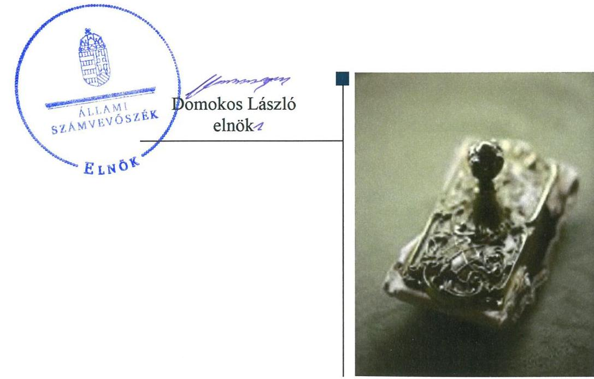
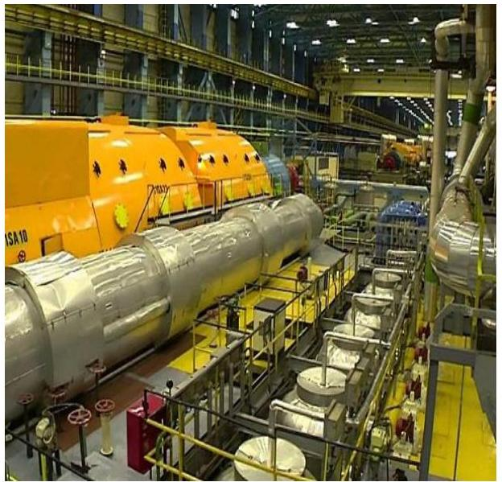
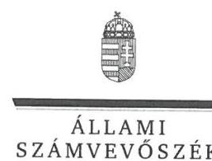
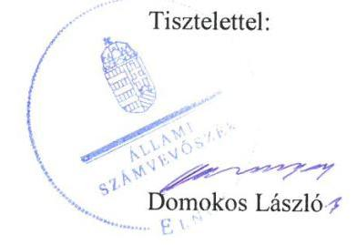

# Jellentés 

## Az állami tulajdonú gazdasági társaságok ellenőrzése

MVM GTER Gázturbinás Erőmű Zártkörűen Működő Részvénytársaság 2019. 08. hó 27. nap

---

# AZ ELLENŐRZÉST FELÜGYELTE:

## MAKKAI MÁRIA felügyeleti vezető

## AZ ELLENŐRZÉST VEZETTE ÉS A VÉGREHAJTÁSÁÉRT FELELŐS:

### SALI SÁNDORNÉ ellenőrzésvezető

## A PROGRAM ÖSSZEÁLLÍTÁSÁÉRT FELELŐS:

### TÓTPÁL SZABOLCS osztályvezető

IKTATÓSZÁM: EL-1669-001/2019.

TÉMASZÁM: 2480

ELLENŐRZÉS-AZONOSÍTÓ SZÁM: V082413

Jelentéseink az Országgyűlés számítógépes hálózatán és az Interneten a www.asz.hu címen is olvashatóak.

---

# TARTALOMJEGYZÉK 

■ ÖSSZEGZÉS ..... 5
■ AZ ELLENŐRZÉS CÉLJA ..... 6
■ AZ ELLENŐRZÉS TERÜLETE ..... 7
■ AZ ELLENŐRZÉS HÁTTERE, INDOKOLTSÁGA ..... 8
■ A JELENTÉS LÉNYEGES KÉRDÉSKÖREI ..... 9
■ AZ ELLENŐRZÉS HATÓKÖRE ÉS MÓDSZEREI ..... 10
■ MEGÁLLAPÍTÁSOK ..... 12
■ JAVASLATOK ..... 14
■ MELLÉKLETEK ..... 15
I. sz. melléklet: Fogalomtár ..... 15
■ FÜGGELÉKEK ..... 17
I. sz. függelék a jelentéshez ..... 17
II. sz. függelék: Észrevételek ..... 18
■ RÖVIDÍTÉSEK JEGYZÉKE ..... 27

---

.

---

# ÖSSZEGZÉS 

Az MVM GTER Gázturbinás Erőmű Zártkörűen Működő Részvénytársaság működésének szabályozottsága a jogszabályi előírásokkal nem volt összhangban. A Társaság gazdálkodása, vagyongazdálkodása nem volt szabályszerű. Az elszámoltathatóság és a vagyon védelme nem volt biztosított.

## Az ellenőrzés társadalmi indokoltsága

Az állami tulajdonú gazdálkodó szervezetek a nemzeti vagyon részét képezik. Gazdálkodásuk a közérdeklődés és a média figyelmének középpontjában áll. A közpénzt, közvagyont felhasználó állami tulajdonú gazdálkodó szervezetekkel szemben alapvető társadalmi igény, hogy működésük, gazdálkodásuk szabályszerű, az általuk szolgáltatott adatok minél megbízhatóbbak legyenek. Az Állami Számvevőszék a közvagyon, a közpénzek szabályos, átlátható és elszámoltatható felhasználásának elősegítése érdekében, stratégiájával összhangban végzi az államháztartáson kívül működő szervezetek ellenőrzését.

Az MVM GTER Gázturbinás Erőmű Zártkörűen Működő Részvénytársaság megfelelő működése fontos az állami vagyon védelme szempontjából, emiatt került sor a Társaság ellenőrzésére.

## Főbb megállapítások, következtetések, javaslatok

Az MVM GTER Gázturbinás Erőmű Zártkörűen Működő Részvénytársaság szabályozottsága - a számlarend hiánya miatt - nem támogatta a jogszabályi előírásoknak megfelelő működést. A gazdálkodás keretében a bevételek és a ráfordítások elszámolása nem volt szabályszerű a szabályozás hiányosságával összefüggésben. A Társaságnál emiatt a könyvvezetés nem alapozta meg a számviteli törvényben előírt beszámoló készítését. Továbbá a Társaság az általa nyújtott szolgáltatások díjtételeit a számviteli törvényben, továbbá a költség- és eredményszámítási szabályzatban foglaltakkal összhangban lévő önköltségszámítással nem alapozta meg.

A Társaság vagyongazdálkodása nem volt szabályszerű. A tárgyi eszközök esetében az üzembe helyezés dokumentálása a jogszabály előírása ellenére elmaradt. A Társaság az ellenőrzött időszakban a törvényi előírás ellenére az éves beszámoló mérlegtételeit - az eszközöket és forrásokat mennyiségben és értékben tartalmazó - leltárral nem támasztotta alá, továbbá a tárgyi eszközök esetében a leltárba bekerülő adatok valódiságáról mennyiségi felvétellel nem győződött meg. A mérleg tételeit alátámasztó leltárak hiánya miatt a vagyon védelmének elve nem érvényesült. A Társaságnál az adatszolgáltatási feladatok ellátása szabályszerű volt. A Társaság biztosította az előírásnak megfelelően a közérdekből nyilvános adatok közzétételét.

Az Állami Számvevőszék a jelentésben foglalt megállapítások alapján az MVM GTER Gázturbinás Erőmű Zártkörűen Működő Részvénytársaság vezérigazgatójának hat javaslatot fogalmazott meg.

---

# AZ ELLENŐRZÉS CÉLJA 

AZ ELLENŐRZÉS CÉLJA annak értékelése volt, hogy a gazdasági társaság szabályozottsága, gazdálkodása és vagyongazdálkodási tevékenysége megfelelt-e a jogszabályi és a tulajdonosi előírásoknak; biztosítva volt-e az ellátott feladatok átláthatósága és elszámoltathatósága érdekében a tevékenység díjának megalapozottsága szabályszerű önköltségszámítással. A vagyonváltozást eredményező döntések esetében a gazdasági társaság szabályszerűen járt-e el.

---

# **AZ ELLENŐRZÉS TERÜLETE**

## **MVM GTER Gázturbinás Erőmű Zártkörűen Működő Részvénytársaság**

**AZ MVM GTER GÁZTURBINÁS ERŐMŰ** Zártkörűen Működő Részvénytársaság jogelődjét 1999-ben 10,0 M Ft jegyzett tőkével az MVM Zrt.1 alapította. A Társaság az MVM Csoport2 tagja, részvényeinek 100%-os tulajdonosa az MVM Zrt. volt az ellenőrzött időszakban.

A Társaság fő tevékenysége villamosenergia-termelés, alapvető feladata a tulajdonában lévő tartalék erőmű (Bakonyi Gázturbinás Erőmű), valamint az MVM Zrt. tulajdonát képező további három erőmű (Litér, Sajószöged, Lőrinci erőművek) üzemeltetése volt. Ez a négy erőmű képezte a hazai villamos energia rendszer gyorsindítású tartalékát, amely váratlan üzemzavari helyzetben a villamos energia zavartalan ellátását biztosította. A Társaság az általa megtermelt villamos energiát az MVM Partner Zrt.3 felé értékesítette.

A Társaság nem minősült kormányzati szektorba sorolt egyéb szervezetnek, saját vagyonát használta, vagyonkezelésbe nem vett vagyont, tulajdonosi részesedése más gazdasági társaságban nem volt. Közfeladatot nem látott el, a Számv. tv.4 155. § (2) bekezdése alapján könyvvizsgálatra kötelezett volt.

A Társaság az ellenőrzött időszak minden évében nyereségesen gazdálkodott, az általa foglalkoztatottak létszáma 2017-ben 147 fő volt. A 2017. évi éves beszámoló szerint a Társaság nettó árbevételének 95,3%-a villamosenergia-termelési tevékenységből származott. A Társaság5 jegyzett tőkéje a 2017. év végén 201,0 M Ft volt.

A Társaságnál Igazgatóság választására nem került sor, az Igazgatóság jogait a vezérigazgató6 gyakorolta, személye az ellenőrzött időszakban egy alkalommal változott. A Társaságnál 2017. év végén négytagú felügyelő bizottság működött.

---

# AZ ELLENŐRZÉS HÁTTERE, INDOKOLTSÁGA 

Az Alaptörvény 38. cikke alapján az állam tulajdona a nemzeti vagyon része. A nemzeti vagyon megőrzésének, védelmének és a nemzeti vagyonnal való felelős gazdálkodásnak a követelményeit sarkalatos törvény határozza meg. Az állami tulajdonú gazdasági társaságokra vonatkozó előírások betartásának ellenőrzése kiemelten fontos a vagyon megőrzése, megóvása érdekében. Gazdálkodásuk jellemzően a közérdeklődés és a média figyelmének középpontjában áll, amihez hozzájárul a gazdálkodásuk körébe tartozó - közvetlen vagy közvetett állami tulajdonú, tehát végső soron a nemzeti vagyon részét képező - vagyon nagysága, illetve az általuk ellátott feladatok minősége és hatékonysága. A nyújtott szolgáltatások árképzésének megalapozottsága és a rendszeres elszámoltatás feltételeinek kialakítása az ellenőrzés során nagy hangsúlyt kap.

Az ellenőrzés rámutathat az állami tulajdonú gazdasági társaságok gazdálkodási tevékenységével kapcsolatos jó gyakorlatokra és szabálytalanságokra. Felhívhatja a figyelmet a jogszabályi követelmények teljesítéséhez szükséges feltételek hiányosságaira, hozzájárulhat az államháztartáson kívüli, de (közvetlenül vagy közvetve) állami vagyont használó gazdasági társaságok tevékenységének átláthatóságához. Az ellenőrzés javaslatainak, megállapításainak hasznosítása hozzájárulhat a nemzeti vagyonnal való gazdálkodás átláthatóságának, elszámoltathatóságának javításához.

---

# A JELENTÉS LÉNYEGES KÉRDÉSKÖREI 

1. A társaság működésének szabályozottsága megfelelt-e az előírásoknak?
2. A társaság gazdálkodása, vagyongazdálkodása, valamint adatszolgáltatási feladatainak ellátása szabályszerű volt-e?

---

# AZ ELLENŐRZÉS HATÓKÖRE ÉS MÓDSZEREI 

## Az ellenőrzés típusa

Megfelelőségi ellenőrzés.

## Az ellenőrzött időszak

Az ellenőrzött időszak a 2015-2017. évek, valamint a 2017. évi beszámoló jóváhagyása és közzététele tekintetében a 2018. június elsejéig tartó időszak.

## Az ellenőrzés tárgya

Az állami tulajdonban (résztulajdonban) lévő gazdasági társaság gazdálkodása, kiemelten vagyongazdálkodási tevékenysége.

## Az ellenőrzött szervezet

MVM GTER Gázturbinás Erőmű Zártkörűen Működő Részvénytársaság

## Az ellenőrzés jogalapja

Az ellenőrzés jogalapját az ÁSZ tv. ${ }^{7}$ 1. § (3) bekezdése és 5. § (3)-(5) bekezdései képezték.

## Az ellenőrzés módszerei

Az ellenőrzést a nemzetközi standardokat irányadónak tekintve az ellenőrzési program ellenőrzési kérdései, az ellenőrzött időszakban hatályos jogszabályok, az ellenőrzés szakmai szabályok és módszertanok figyelembevételével végezte el az ÁSZ ${ }^{8}$.

Az ellenőrzés ideje alatt az ellenőrzött szervezettel történő kapcsolattartást az ÁSZ Szervezeti és Működési Szabályzatának vonatkozó előírásai alapján biztosította az ÁSZ.

Az ellenőrzési kérdések megválaszolásához szükséges bizonyítékok megszerzése a következő ellenőrzési eljárások alkalmazásával történt: megfigyelés, kérdésfeltevés (információkérés), összehasonlítás, valamint elemző eljárás. Az ellenőrzési bizonyítékként felhasználható adatforrások közé tartoznak egyrészt az ellenőrzési programban felsorolt adatforrások,

---

másrészt adatforrás lehet még minden - az ellenőrzés folyamán - feltárt, az ellenőrzés szempontjából információkat tartalmazó dokumentum.

Az ellenőrzést a kérdésekre adott válaszok kiértékelésével, valamint a megjelölt adatforrások felhasználásával, továbbá az adott időszakban hatályos jogszabályok figyelembe vételével folytattuk le.

A 2015. és 2017. évi bevételek és a ráfordítások elszámolásának szabályszerűsége, valamint az értékcsökkenési leírás és a vagyonnyilvántartás szabályszerűsége esetében az ellenőrzés azokra a legnagyobb értékű tételekre - a lényeges sokaságra - terjedt ki, melyek összértéke eléri a teljes sokaság összértékének 50\%-át. A 2015. és 2017. évi ráfordítások és a 2017. évi bevételek esetében a szabályszerűséget a lényeges sokaságból véletlen mintavételi eljárással kiválasztott tételek alapján ellenőriztük. A 2015. évi bevételek és a 2015. és 2017. évi értékcsökkenési leírás és a vagyonnyilvántartás esetében a lényeges sokaságot tételesen ellenőriztük. A 2015. és 2017. évi személyi jellegű kifizetések esetében a vezető tisztségviselők részére teljesített kifizetések tételes ellenőrzésére került sor. A mintavétellel ellenőrzött területek esetében minden egyes tétel vonatkozásában a szabályszerűségre vonatkozó kérdéseket tettünk fel. „Szabályszerűnek" értékeltünk egy ellenőrzött területet, amennyiben 95\%-os bizonyossággal az ellenőrzött sokaságban az átlagos hibaarány legfeljebb 10\%, "nem szabályszerűnek", amennyiben 10\%-nál magasabb arányt képviselt.

---

# 1. A társaság működésének szabályozottsága megfelelt-e az előírásoknak? 

Összegző megállapítás

A Társaság működésének szabályozottsága a jogszabályi előírásokkal nem volt összhangban.

A SZABÁLYOZÁS keretében a Társaság számviteli politikával ${ }^{9}$, leltározási és leltárkészítési szabályzattal ${ }^{10}$, értékelési szabályzattal ${ }^{11}$, pénzkezelési szabályzattal ${ }^{12}$, valamint önköltségszámítás rendjére vonatkozó szabályzattal rendelkezett, azok tartalma a Számv. tv. előírásaival összhangban volt. A Társaság a Vet. ${ }^{13}$ 105. § (2) bekezdésében foglaltak szerinti szétválasztási szabályokról a számviteli politikában, valamint a költség- és eredményszámítási szabályzatban ${ }^{14}$ rendelkezett.

A Társaság a 2015-2017. évek tekintetében a Számv. tv. 161. § (1) bekezdésében előírtak ellenére számlarendet nem készített.

A Társaságra vonatkozóan a Taktv. ${ }^{15}$ 5. § (3) bekezdésének előírása szerint a vezető tisztségviselők, felügyelőbizottsági tagok, valamint az Mt. ${ }^{16}$ 208. § hatálya alá eső munkavállalók javadalmazásának, a jogviszony megszűnése esetére biztosított juttatások módjának, mértéke elveinek, annak rendszerének kereteit az Alapító ${ }^{17}$ kialakította. A 2013. május 8-ától hatályos javadalmazási szabályzat ${ }^{18}$-et a Taktv. előírása szerint a Társaság letétbe helyezte. A 2016. április 1-jétől hatályos javadalmazási szabályzat ${ }^{19}$ letétbe helyezése a Taktv. 5. § (3) bekezdése előírása ellenére nem történt meg.

## 2. A társaság gazdálkodása, vagyongazdálkodása, valamint adatszolgáltatási feladatainak ellátása szabályszerű volt-e?

Összegző megállapítás

A Társaság gazdálkodása, vagyongazdálkodása nem volt szabályszerű. Az adatszolgáltatási feladatainak a Társaság szabályszerűen eleget tett.

A GAZDÁLKODÁS keretében a bevételek és a ráfordítások elszámolása nem volt szabályszerű. A Társaságnál a Számv. tv. 161. § (1) bekezdésében foglaltak ellenére a könyvvezetés - a számlarend hiányában - nem alapozta meg a Számv. tv.-ben előírt beszámoló készítését.

A Társaság nem tett eleget a Számv. tv. 14. § (7) bekezdésében, továbbá a költség- és eredményszámítási szabályzatban foglaltaknak, mert az általa előállított termékek, végzett szolgáltatások önköltségét utókalkuláció módszerével nem állapította meg.

---

A VAGYONGAZDÁLKODÁS nem volt szabályszerű. A Társaságnál a tárgyi eszközök állományba vétele, nyilvántartása nem felelt meg a Számv. tv. 52. (2) bekezdésében foglaltaknak, mivel az üzembe helyezést nem dokumentálták. A Társaság a 2015-2017. években az éves beszámoló mérlegtételeit - a Számv. tv. 69. § (1) bekezdésében és a leltározási és leltárkészítési szabályzat 5.3.2 pontjában foglaltak ellenére - leltárral nem támasztotta alá. A 2015. évben nem volt leltár, a 2016-2017. évi leltárak a tárgyi eszközöknél mennyiségi adatokat nem, csak értékbeni adatokat tartalmaztak.

A
 Társaság a 2015-2017. években a mérleg fordulónapra vonatkozóan nem győződött meg a leltárba bekerülő adatok valódiságáról mennyiségi felvétellel, ezzel nem tartotta be a Számv. tv. 69. § (3) bekezdésének előírását. Mindezek miatt a Számv. tv. 15. § (3) bekezdésében foglalt valódiság elve az ellenőrzött időszakban nem érvényesült.

AZ ADATSZOLGÁLTATÁSI FELADATOK ellátása szabályszerű volt. A Társaság az Alapszabályban előírt beszámolási, adatszolgáltatási feladatokat, továbbá a Tervezési szabályzatban ${ }^{20}$ előírt üzleti tervkészítési kötelezettségét teljesítette. A Taktv.-ben előírt közérdekből nyilvános adatok közzétételének a Társaság eleget tett.

---

# JAVASLATOK 

Az ÁSZ tv. 33. § (1) bekezdésében foglaltak értelmében az ellenőrzött szervezet vezetője köteles a jelentésben foglalt megállapításokhoz kapcsolódó intézkedési tervet összeállítani és azt a jelentés kézhezvételétől számított 30 napon belül az ÁSZ részére megküldeni. Amennyiben az ellenőrzött szervezet vezetője nem küldi meg határidőben az intézkedési tervet, vagy továbbra sem elfogadható intézkedési tervet küld, az Állami Számvevőszék elnöke az ÁSZ tv. 33. § (3) bekezdése a) és b) pontjaiban foglaltakat érvényesítheti.

## az MVM GTER Gázturbinás Erőmű Zártkörűen Működő Részvénytársaság vezérigazgatójának

1. Intézkedjen a Számv. tv. előírásának megfelelő számlarend elkészítéséről.
(1. sz. megállapítás 2. bekezdése alapján)
2. Intézkedjen a vezető tisztségviselők, felügyelőbizottsági tagok, valamint az Mt. 208. §-ának hatálya alá eső munkavállalók javadalmazása, valamint a jogviszony megszünése esetére biztosított juttatások módjának, mértékének elveiről, annak rendszeréről megalkotott szabályzat letétbe helyezéséről.
(1. sz. megállapítás 3. bekezdés utolsó mondata alapján)
3. Intézkedjen a jogszabályi előírásnak megfelelően a Társaság által előállított termékek, végzett szolgáltatások önköltségének utókalkuláció módszerével történő megállapítására.
(2. sz. megállapítás 2. bekezdése alapján)
4. Intézkedjen a tárgyi eszközök üzembe helyezésének Számv. tv. előírásának megfelelő dokumentálásáról.
(2. sz. megállapítás 3. bekezdés második mondata alapján)
5. Intézkedjen az éves beszámoló mérlegtételeit alátámasztó leltár jogszabályi előírásnak megfelelő elkészítéséről.
(2. sz. megállapítás 3. bekezdés harmadik mondata alapján)
6. Intézkedjen a Számv. tv. előírásának megfelelően a leltározás végrehajtásáról.
(2. sz. megállapítás 4. bekezdés első mondata alapján)

---

# MELLÉKLETEK 

- I. SZ. MELLÉKLET: FOGALOMTÁR
állami vagyon
gazdasági társaság
nemzeti vagyon
a) Az állam tulajdonában lévő dolog, valamint a dolog módjára hasznosítható természeti erő,
b) az a) pont hatálya alá nem tartozó mindazon vagyon, amely vonatkozásában törvény az állam kizárólagos tulajdonjogát nevesíti,
c) az állam tulajdonában lévő tagsági jogviszonyt megtestesítő értékpapír, illetve az államot megillető egyéb társasági részesedés,
d) az államot megillető olyan immateriális, vagyoni értékkel rendelkező jogosultság, amelyet jogszabály vagyoni értékű jogként nevesít.
e) az állam tulajdonában lévő pénzügyi eszközök.

Forrás: Vtv. ${ }^{21}$ 1. § (2) bekezdése
A gazdasági társaságok üzletszerű közös gazdasági tevékenység folytatására, a tagok vagyoni hozzájárulásával létrehozott, jogi személyiséggel rendelkező vállalkozások, amelyekben a tagok a nyereségből közösen részesednek, és a veszteséget közösen viselik.
Forrás: Ptk. ${ }^{22}$ 3:88. § (1) bekezdése
a) az állam vagy a helyi önkormányzat kizárólagos tulajdonában álló dolgok,
b) az a) pont hatálya alá nem tartozó, állam vagy a helyi önkormányzat tulajdonában lévő dolog,
c) az állam vagy a helyi önkormányzat tulajdonában lévő pénzügyi eszközök, továbbá az államot vagy a helyi önkormányzatot megillető társasági részesedések,
d) az államot vagy a helyi önkormányzatot megillető bármely vagyoni értékkel rendelkező jogosultság, amelyet jogszabály vagyoni értékű jogként nevesít,
e) Magyarország határa által körbezárt terület feletti légtér,
f) az üvegházhatású gázok kibocsátási egységeinek kereskedelméről szóló törvény szerint kibocsátási egység és légiközlekedési kibocsátási egység, valamint az ENSZ Éghajlatváltozási Keretegyezménye és annak Kiotói Jegyzőkönyve végrehajtási keretrendszeréről szóló törvény szerinti kiotói egység,
g) állami vagy helyi önkormányzati fenntartású közgyűjtemény (muzeális intézmény, levéltár, közgyűjteményként működő kép- és hangarchívum, valamint könyvtár) saját gyűjteményében nyilvántartott kulturális javak körébe tartozó dolog, kivéve, ha az állami vagy önkormányzati tulajdon jogszerű létrejötte kétséget kizáró módon nem bizonyítható és a dologra nézve más a tulajdonjogát bizonyítja vagy a kulturális javakra vonatkozó jogszabályokban meghatározott eljárás keretében valószínűsíti (g. pont módosult 2013. december 7-től),
h) a régészeti lelet,
i) a nemzeti adatvagyon körébe tartozó állami nyilvántartások fokozottabb védelméről szóló törvény szerinti nemzeti adatvagyon.
Forrás: Nvtv. ${ }^{23}$ 1. § (2)

---

.

---

# FÜGGELÉKEK 

- I. SZ. FÜGGELÉK A JELENTÉSHEZ

Az Állami Számvevőszék az ellenőrzések során feltárt tényekhez kapcsolódó további körülmények tisztázására eszközrendszerrel nem rendelkezik. Amennyiben az ellenőrzésen túlmutatóan indokoltnak látszik az ellenőrzés során feltárt körülmények további vizsgálata, az Állami Számvevőszék törvényi felhatalmazás alapján az ellenőrzés által feltárt körülményeket továbbítja a hatáskörrel rendelkező szervnek a szükséges intézkedések megtétele, eljárások lefolytatása érdekében.
Az MVM GTER Gázturbinás Erőmű Zártkörűen Működő Részvénytársaság a Számv. tv. 69. § (1) bekezdésében előírtak ellenére a 2015., 2016., 2017. évi éves beszámolók mérlegtételeit - az eszközöket és forrásokat mennyiségben és értékben tartalmazó - leltárral nem támasztotta alá.
Az eset konkrét körülményeinek feltárására a Nemzeti Adó- és Vámhivatal rendelkezik hatáskörrel.

---

A jelentéstervezetet a Számvevőszék 15 napos észrevételezésre megküldte az ellenőrzött szervezet vezetőjének az ÁSZ tv. 29. §* (1) bekezdése előírásának megfelelően.

Az MVM GTER Gázturbinás Erőmű Zártkörűen Működő Részvénytársaság vezérigazgatója élt az ÁSZ törvény 29.§ (2) bekezdésében foglalt észrevételezési lehetőséggel, a törvényes határidőn belül észrevételt tett. Az észrevételeket és az arra adott válaszokat a függelék tartalmazza.

[^0]
[^0]:    * 29. § (1) Az Állami Számvevőszék az ellenőrzési megállapításait megküldi az ellenőrzött szervezet vezetőjének vagy az általa megbízott személynek, és annak, akinek személyes felelősségét állapította meg.
    (2) Az ellenőrzött szervezet vezetője és a felelősként megjelölt személy az ellenőrzés megállapításaira tizenöt napon belül írásban észrevételt tehet.
    (3) Az Állami Számvevőszék az észrevételre a beérkezésétől számított harminc napon belül írásban válaszol. A figyelembe nem vett észrevételeket köteles a jelentésben feltüntetni, és megindokolni, hogy azokat miért nem fogadta el.

---

# Domokos László 

Elnök
Állami Számvevőszék

Budapest
Apáczai Csere János utca 10. 1052

## Vezérigazgatóság

Iktatószám nálunk: VIG-138-1/2019.
Iktatószám Önöknél: EL-1211-048/2019.
EL-1211-046/2019.
Budaörs, 2019.06.19.

Tárgy: MVM GTER Zrt. számvevőszéki jelentéstervezet - észrevételek

Tisztelt Elnök Úr!
2019. június 5-én kaptuk kézhez az MVM GTER Zrt.-nél folytatott, „Az állami tulajdonú gazdasági társaságok ellenőrzése - MVM GTER Gázturbinás Erőmű Zártkörűen Működő Részvénytársaság" témában készített számvevőszéki jelentéstervezetet. Élve a jogszabály adta lehetőséggel, a megállapításokkal, javaslatokkal kapcsolatos észrevételeinket az alábbiakban adjuk meg.
Az MVM GTER Zrt. az MVM Csoport tagjaként, a jogszabályok által meghatározott keretek között, a Társaság Alapszabályában szereplő Uralmi Klauzulában foglaltaknak megfelelően, a csoportszintű irányítási rendszer és a szabályzatok alapul vételével működik és gazdálkodik. Az MVM Csoport csoportszintű szabályzatai az Elismert Vállalatcsoportba tartozó társaságok számára kötelezően alkalmazandóak.
A jelentéstervezetben tett megállapításokkal és javaslatokkal kapcsolatos észrevételek:

1. számú összegző megállapítás: A Társaság működésének szabályozottsága a jogszabályi előírásokkal nem volt összhangban.

A megállapítást a T. Állami Számvevőszék elsősorban a számlarend hiányára alapozza, amellyel nem értünk egyet. A Társaság a 2015-2017. évi beszámolóinak összeállításához, az ezt megalapozó könyvelések, kontírozások elvégzéséhez a CsSz-32 számú Az MVM Csoport számlarendjéről szóló csoportszintű szabályzatot alkalmazta, melynek alkalmazását a szabályzat tárgyi és személyi hatályában foglaltak írják elő kötelező érvénynyel azon társaságokra, amelyek ügyviteli feladataikat az Ügyviteli Szolgáltató Központon (a vizsgált időszakban MVM KONTÓ Zrt., jogutódja a Nemzeti Üzleti Szolgáltató Zrt.) keresztül látják el. A vonatkozó csoportszintű szabályzatokat az Állami Számvevőszék részére megküldött dokumentáció tartalmazta.
A szabályzat 2.2 Személyi hatály alapján a „szabályzat hatálya kiterjed az MVM Zrt.-re mint uralkodó tagra, és az MVM Csoport elismert vállalatcsoportba tartozó ellenőrzött társaságaira."

---

Tekintettel arra, hogy az MVM GTER Zrt. ügyviteli feladatait az Ügyviteli Szolgáltató Központ látta el a vizsgált időszakban és látja el a mai napig is, ezért a Társaság a csoportszintű szabályzatban rögzített számlarendet köteles alkalmazni.

Fenti indokok alapján kérjük a csoportszintű számlarend alkalmazásának elfogadását, az 1. számú megállapítás 2. bekezdésének módosítását és az 1. sz. javaslat törlését.

Az 1. számú megállapítás 3. bekezdése tartalmazza a 2016. április 1-jétől hatályos Javadalmazási szabályzat letétbe helyezésének elmulasztását, mely adminisztrációs hibából adódóan valóban nem történt meg. Időközben a pótlólagos letétbe helyezésről Társaságunk gondoskodott.

Fentiekre tekintettel az 1. számú összegző megállapítást aránytalanul súlyos megfogalmazásnak tartjuk és kérjük ennek felülvizsgálatát.

# 2. számú összegző megállapítás: A Társaság gazdálkodása, vagyongazdálkodása nem volt szabályszerű. 

A megállapítás 1. bekezdése kapcsán a számlarend hiányára vonatkozó megállapítás felülvizsgálatát és módosítását kérjük az előző pontban tett észrevételeink, indokaink alapján.

A 2. számú megállapítás 2. bekezdése tekintetében Társaságunk a tevékenységek szétválasztására vonatkozó számviteli politikai előírások mentén, az egyes tevékenységek árának meghatározása céljából - amely biztosítja az egyes tevékenységek keresztfinanszírozástól való mentességét, illetve az egyes tevékenységeknek a VET rendelkezéseivel összhangban történő szétválasztásának a megállapítását - az éves beszámoló készítésekor tevékenységi mérleget és eredménykimutatást készít. Ez szembe állítja az egyes tevékenységeknek az egy egységre jutó tényleges árbevételét az egy egységre jutó tényleges összköltséggel. Mivel ez megfelel a költség- és eredményszámítási szabályzatban előírt utókalkulációra vonatkozó metodikának, így Társaságunk ezt tekinti az egyes tevékenységekre vonatkozó utókalkulációnak, melyet a kiegészítő mellékletében közzé is tesz.

A 2. számú megállapítás 3. bekezdésében foglaltakkal kapcsolatban jelezzük, hogy az üzembe helyezések időpontját Társaságunk az aktiválási nyilatkozatokon rögzíti. Az egyes üzembe helyezésekhez tartozó műszaki teljesítésigazolásokkal alátámasztott szállítói teljesítések számláit az aktiválási nyilatkozat beazonosítható módon tartalmazza. Az aktiválási nyilatkozat egyik fő formai és tartalmi eleme az üzembe helyezés pontos dátuma, ezt a bizonylatot az a felelős személy írja alá, aki hitelt érdemlően igazolni tudja az eszköz rendeltetésszerű használatba vételének az időpontját. Ezen dokumentumok a vizsgálati anyagokban csatolásra kerültek,

---

melyekkel - megítélésünk szerint - Társaságunk hitelt érdemlően dokumentálja a Számviteli törvényben előírtaknak megfelelően az üzembe helyezés megtörténtét, a tényleges üzembe vételnek az időpontját.

A 2. számú megállapítás 3. bekezdésében szerepel a mérlegtételek alátámasztására vonatkozó megállapítás. Társaságunk 2015. évben nem készített leltárt, azonban az elkövetkező évekre, 2016. és 2017. évekre az éves beszámolót mérleg leltárral támasztotta alá, melyek az Állami Számvevőszék részére leadott anyagok között szerepeltek. Ebből adódóan a megállapítások vagyongazdálkodásra vonatkozó második mondatával, azaz azzal, hogy „A Társaság a 2015-2017. éveken az éves beszámoló mérlegtételeit - a Számv. tv. 69. § (1) bekezdésében és a leltározási és leltárkészítési szabályzat 5.3.2 pontjában foglaltak ellenére - leltárral nem támasztotta alá", nem értünk egyet.

A tárgyi eszközök leltározását a Számviteli törvény előírásai alapján 3 évente, mennyiségi és értékbeni felvétellel végezzük. Erre legutóbb 2017. május 31-i fordulónappal került sor. Ezt az Állami Számvevőszék részére leadott anyagokkal igazoltuk.

A leltározás mennyiségi adatainál a Társaság Számviteli Politikájának 5.3.2 pontján belül a tárgyi eszközök értékelésének kiegészítő szabályaira vonatkozó rész (1) bekezdésében foglaltak értelmében: „A tárgyi eszközöket a Számviteli törvény előírásainak megfelelően egyedileg értékeljük, az egyedi értékelést egyedi nyilvántartásra építjük." Így az SAP rendszerben vezetett nyilvántartásainkban egy-egy eszközsor egy-egy tárgyi eszközt jelent, tehát az eszközleltár egyedi tételeket tartalmaz, ezáltal a mennyiségek rögzítése nem szükséges.

Tekintettel a Társaság gazdálkodására, és a vagyongazdálkodásra vonatkozó fenti észrevételekre, az utókalkuláció,
 az üzembe helyezések dokumentáltsága biztosított, a beszámoló mérlegtételei (2016-2017. évek vonatkozásában) és a tárgyi eszközök tekintetében is leltárral alátámasztottak, kérjük a vonatkozó megállapítások módosítását, és a 3., 4., 5. és 6. számú javaslatok törlését.

Amennyiben a fenti indoklással kapcsolatosan kérdés merül fel, azok megválaszolásában állunk szíves rendelkezésre.

Tisztelettel:

Tompa Ferenc
vezérigazgató

Rudolfné Széki Margit
törzskari igazgató

---

# Tompa Ferenc 

vezérigazgató
MVM GTER Gázturbinás Erőmű Zártkörűen Működő Részvénytársaság

## Budaörs

## Tisztelt Vezérigazgató Úr!

„Az állami tulajdonú gazdasági társaságok ellenőrzése - MVM GTER Gázturbinás Erőmű Zártkörűen Működő Részvénytársaság "címmel készített számvevőszéki jelentéstervezetre tett észrevételét köszönettel megkaptam.

Az Állami Számvevőszék észrevételre vonatkozó álláspontjáról a felügyeleti vezető által készített részletes tájékoztatást mellékelten megküldöm.

Tájékoztatom Vezérigazgató urat, hogy a számvevőszéki jelentésben - az Állami Számvevőszékről szóló 2011. évi LXVI. törvény 29. § (3) bekezdése alapján - a figyelembe nem vett észrevételt szerepeltetjük, annak indoklásával, hogy azt az Állami Számvevőszék miért nem fogadta el.

Budapest, 2019. 07. hó 10. nap

Melléklet: Tájékoztatás az észrevétel kezeléséről

---

# Tájékoztatás   az észrevétel kezeléséről 

„Az állami tulajdonú gazdasági társaságok ellenőrzése - MVM GTER Gázturbinás Erőmű Zártkörűen Működő Részvénytársaság"című jelentéstervezetre 2019. június 21-én érkezett észrevételt áttekintettük, annak kezelésével kapcsolatban a következő tájékoztatást adom.

1. A jelentéstervezet 1. pontja összegző megállapításával és az azt alátámasztó megállapításokkal kapcsolatban tett észrevételekre adott válasz
A) Az észrevételben tájékoztatás szerepel arról, hogy az MVM GTER Gázturbinás Erőmű Zártkörűen Működő Részvénytársaságra (továbbiakban: Társaság) kötelezően vonatkoznak a CsSz-32 számú, „Az MVM Csoport számlarendjéről szóló szabályzata" című számlarendek. Ez alapján a számlarend hiányára vonatkozó megállapítás és a kapcsolódó 1. számú javaslat törlését, valamint a szabályozottság jogszabályi előírásokkal való összhangjának hiányára vonatkozó összegző megállapítás felülvizsgálatát kéri a Társaság.
A számvitelről szóló 2000. C. törvény (Számv. tv.) 161. § (4) bekezdése szerint a számlarend összeállításáért, annak folyamatos karbantartásáért, a naprakész könyvvezetés helyességéért a gazdálkodó képviseletére jogosult személy a felelős. Az észrevételben hivatkozott csoportszintű számlarendek nem tartalmazzák a Társaság képviseletére jogosult személy kiadmányozását.
A csoportszintű szabályzatok 2.2. pontja előírja, hogy a szabályzat hatálya alá tartozó társaságok a rájuk vonatkozó esetekben és mértékben kötelesek betartani a szabályzat előírásait, amennyiben azok nem ütköznek a társaság működési engedélyében vagy a vonatkozó jogszabályokban foglaltakkal. Tartalmazza továbbá, hogy a társaságok által kialakított belső szabályzatok, eljárásrendek, belső utasítások nem állhatnak ellentétben a csoport szintű szabályzat előírásaival, annak tartalmát, hatályát, hatáskörét nem szűkíthetik, illetve csorbíthatják.
A fentiek alapján a Társaságnak a Számv. tv. 161. § (1) bekezdésében előírt számlarenddel rendelkeznie kell, amelyet a csoportszintű számlarendek előírásainak betartásával kell elkészítenie. Mindezek alapján az észrevételt nem fogadjuk el, a jelentéstervezet módosítása nem indokolt.
B) Az észrevételben a Társaság megerősíti, hogy a jelentéstervezetnek a javadalmazási szabályzat letétbe helyezése elmulasztására vonatkozó megállapítása helytálló. Az észrevétel alapján a jelentéstervezet módosítása nem szükséges.

---

# 2. A jelentéstervezet 2. pontja összegző megállapításával és az azt alátámasztó megállapításokkal kapcsolatban tett észrevételekre adott válasz 

A) Az észrevételben a számlarend hiányára vonatkozó megállapítás felülvizsgálata alapján a bevételek és ráfordítások nem szabályszerű elszámolására tett megállapítás felülvizsgálatát és módosítását kérte a Társaság.
A számlarend hiányával összefüggésben tett észrevételre az 1. pontban adott válasz alapján a jelentéstervezet 2. pontja 1. bekezdésének módosítása nem indokolt.
B) Az észrevételben a Társaság tájékoztatást ad arról, hogy az éves beszámolóval egyidejűleg a tevékenységi mérleget és tevékenységi eredménykimutatást elkészítik, amely szembe állítja az egyes tevékenységnek az egy egységre jutó tényleges ábevételét az egy egységre jutó tényleges összköltséggel. A Társaság ezt tekinti az egyes tevékenységekre vonatkozó utókalkulációnak.
A Számv. tv. 14. § (7) bekezdése szerint a vállalkozónak a saját előállítású termékek, a végzett szolgáltatások önköltségét az önköltségszámítás rendjére vonatkozó belső szabályzat szerinti utókalkuláció módszerével kell megállapítani. A Társaság éves beszámolóinak részét képező tevékenységi mérleg és tevékenységi eredménykimutatás két tevékenység mérleg és eredménykimutatás adatait tartalmazza, ezek a termelői tevékenység és az egyéb tevékenység. A tevékenységi mérleg, illetve a tevékenységi eredménykimutatás a saját előállítású termékek, a végzett szolgáltatások önköltségének utókalkuláció módszerével történő megállapítását nem tartalmazza, az egy egységre vonatkozó kalkulációt nem mutatja be. Erre vonatkozó adatot a beszámoló más része sem tartalmaz. A Társaság utókalkuláció megállapítását tartalmazó további dokumentumokat nem bocsátott az ellenőrzés rendelkezésére. Ezek alapján az észrevételt nem fogadjuk el, a jelentéstervezet módosítása nem indokolt.
C) A Társaság kifogásolja a jelentéstervezetnek azt a megállapítását, miszerint a tárgyi eszközök állományba vétele, nyilvántartása nem felelt meg a Számv. tv. előírásának, mert az üzembe helyezést nem dokumentálták. Tájékoztatást adnak arról, hogy az üzembe helyezések időpontját az aktiválási bizonylaton rögzítik, a műszaki teljesítésigazolásokkal alátámasztott szállítói teljesítések számláit az aktiválási nyilatkozat beazonosítható módon tartalmazza.
A tárgyi eszközök állományba vétele, nyilvántartása ellenőrzése során az ÁSZ megállapította, hogy az üzembe helyezés dokumentálása nem volt szabályszerű, aktiválási nyilatkozat nem állt minden esetben rendelkezésre. Ezért a jelentéstervezet megállapítása helytálló, annak módosítása nem szükséges.
D) Az észrevétel a mérleg leltárral való alátámasztásának hiányára, illetve a mennyiségi felvétellel történő leltározás elmaradására vonatkozó megállapításokat kifogásolja.
A Számv. tv. 69. § (1) bekezdése szerint a könyvek üzleti év végi zárásához, a beszámoló elkészítéséhez, a mérleg tételeinek alátámasztásához olyan leltárt kell összeállítani, amely tételesen, ellenőrizhető módon tartalmazza a vállalkozónak a mérleg fordulónapján meglévő eszközeit és forrásait mennyiségben és értékben. A Társaság megerősíti a jelentéstervezetnek azt a megállapítását, hogy 2015-ben nem készített a mérleget alátámasztó leltárt, továbbá azt, hogy a 2016-2017. évi leltárak a mennyiségi adatokat nem tartalmazták.

---

A Társaság a 2017. évi mennyiségi felvétellel történő leltározás során készített leltárt, leltárösszesítőt nem bocsátotta az Állami Számvevőszék rendelkezésére, ezért a mennyiségi felvétellel történő leltározás elvégzéséről az ellenőrzés nem tudott meggyőződni. Mindezek alapján a jelentéstervezet módosítása nem indokolt.

Budapest, 2019. 06. hó 16. nap

Makkai Mária
felügyeleti vezető

---

.

---

# RÖVIDÍTÉSEK JEGYZÉKE 

${ }^{1}$ MVM Zrt.
${ }^{2}$ MVM csoport
${ }^{3}$ MVM Partner Zrt.
${ }^{4}$ Számv. tv.
${ }^{5}$ Társaság
${ }^{6}$ vezérigazgató
${ }^{7}$ ÁSZ tv.
${ }^{8}$ ÁSZ
${ }^{9}$ számviteli politika
${ }^{10}$ leltározási és leltárkészítési szabályzat
${ }^{11}$ értékelési szabályzat
${ }^{12}$ pénzkezelési szabályzat
${ }^{13}$ Vet.
${ }^{14}$ költség- és eredményszámítási szabályzat
${ }^{15}$ Taktv.
${ }^{16} \mathrm{Mt}$.
${ }^{17}$ Alapító
${ }^{18}$ javadalmazási szabályzat:
${ }^{19}$ javadalmazási szabályzat:
${ }^{20}$ Tervezési szabályzat
${ }^{21}$ Vtv.
${ }^{22}$ Ptk.
${ }^{23}$ Nvtv.

Magyar Villamos Művek Zártkörűen Működő Részvénytársaság
Az MVM Zrt. tulajdonában álló, alapvetően energiaszolgáltatáshoz kapcsolódó társaságok együttműködő csoportja, Magyarország nemzeti villamos társaságcsoportja. A Ptk. 3:49. § szerinti elismert vállalatcsoport, melynek uralkodó tagja, azaz a csoporttagok felett az irányítói jogokat gyakorló szervezet az MVM Zrt.
MVM Partner Energiakereskedelmi Zrt, az MVM csoport villamos energia kereskedelmi engedéllyel rendelkező kereskedelmi társasága
2000. évi C. törvény a számvitelről
MVM GTER Gázturbinás Erőmű Zártkörűen Működő Részvénytársaság
az MVM GTER Gázturbinás Erőmű Zártkörűen Működő Részvénytársaság vezérigazgatója
2011. évi LXVI. törvény az Állami Számvevőszékről

Állami Számvevőszék
az MVM GTER Gázturbinás Erőmű Zártkörűen Működő Részvénytársaság számviteli politikája és módosításai (hatályos: 2008. november 21-étől, illetve módosításai 2015. február 25-étől és 2017. január 18-ától)
az MVM GTER Gázturbinás Erőmű Zártkörűen Működő Részvénytársaság leltározási és az MVM GTER Gázturbinás Erőmű Zártkörűen Működő Részvénytársaság leltározási és leltárkészítési szabályzata és módosítása (hatályos: 2013. november 14-étől, illetve módosítása 2015. március 17-étől)
az MVM GTER Gázturbinás Erőmű Zártkörűen Működő Részvénytársaság értékelési szabályzata (hatályos: 2012. április 15-étől)
az MVM GTER Gázturbinás Erőmű Zártkörűen Működő Részvénytársaság pénzkezelési szabályzata és módosítása (hatályos: 2011. október 21-étől, illetve módosítása 2015. február 25-étől)
a villamos energiáról szóló 2007. évi LXXXVI. törvény
az MVM GTER Gázturbinás Erőmű Zártkörűen Működő Részvénytársaság önköltségszámítás rendjére vonatkozó szabályozása, elnevezése költség- és eredményszámítási szabályzat és módosításai (hatályos: 2013. június 6-ától, illetve módosításai 2015. február 25-étől és 2016. február 9-étől)
a köztulajdonban álló gazdasági társaságok takarékosabb működéséről szóló 2009. évi CXXII. törvény (hatályos: 2009. december 4-étől)
a Munka Törvénykönyvéről szóló 2012. évi I. törvény
Magyar Villamos Művek Zártkörűen Működő Részvénytársaság
az MVM GTER Gázturbinás Erőmű Zártkörűen Működő Részvénytársaság javadalmazási szabályzata (hatályos: 2013. május 8-ától)
az MVM GTER Gázturbinás Erőmű Zártkörűen Működő Részvénytársaság javadalmazási szabályzata (hatályos: 2016. április 1-jétől)
az MVM Csoport Tervezési szabályzata (hatályos 2014. január 16-ától), az MVM Csoport Kontrolling Beszámolási, Tervezési és Várható Készítési Szabályzata és módosításai (hatályos: 2015. november 19-étől, módosításai 2016. december 29-étől és december 2-ától)
az állami vagyonról szóló 2007. évi CVI. törvény
a Polgári Törvénykönyvről szóló 2013. évi V. törvény
a nemzeti vagyonról szóló 2011. évi CXCVI. törvény

---

ÁLLAMI SZÁMVEVŐSZÉK
1052 Budapest, Apáczai Csere János utca 10.
Levélcím: 1364 Budapest 4. Pf. 54
Telefon: +36 14849100 Telefax: +36 14849200
www.asz.hu
