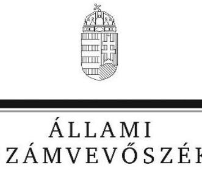
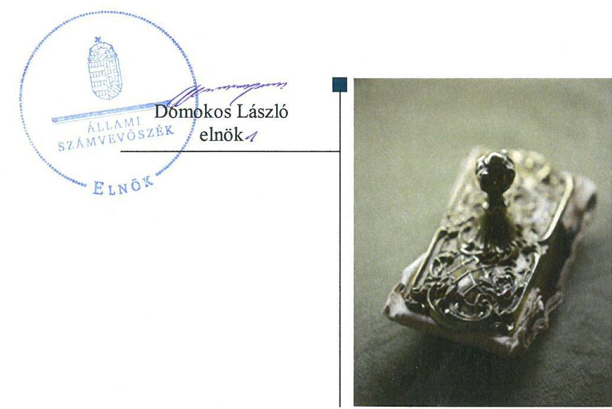
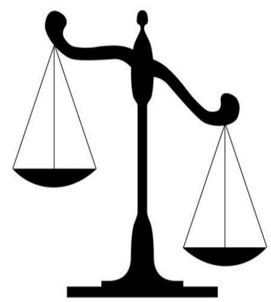
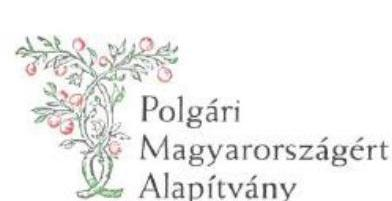
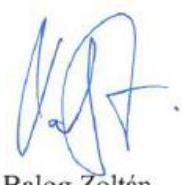
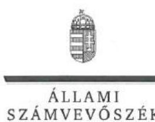
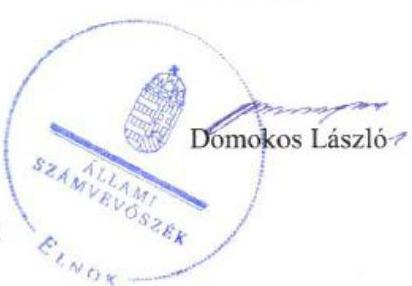

# Jelentés

**A költségvetési támogatásban részesülő pártalapítványok 2016–2017. évi gazdálkodása törvényességének ellenőrzése**

Szövetség a Polgári Magyarországért Alapítvány 2019.

19153 www.asz.hu

---

# Jelentés 

## A költségvetési támogatásban részesülő pártalapítványok 2016-2017. évi gazdálkodása törvényességének ellenőrzése

Szövetség a Polgári Magyarországért Alapítvány
2019. 12. hó 18. nap

---

# AZ ELLENŐRZÉST FELÜGYELTE:

DR. NAGY IMRE felügyeleti vezető

# AZ ELLENŐRZÉST VEZETTE ÉS A VÉGREHAJTÁSÁÉRT FELELŐS:

DR. GYŐRI GABRIELLA ellenőrzésvezető

# A PROGRAM ÖSSZEÁLLÍTÁSÁÉRT FELELŐS:

TÓTPÁL SZABOLCS osztályvezető

IKTATÓSZÁM: EL-1673-001/2019

TÉMASZÁM: 2497

# ELLENŐRZÉS-AZONOSÍTÓ SZÁM: V084101

Jelentéseink az Országgyűlés számítógépes hálózatán és az Interneta a www.asz.hu címen is olvashatóak.

---

# TARTALOMJEGYZÉK 

■ ÖSSZEGZÉS ..... 5
■ AZ ELLENŐRZÉS CÉLJA ..... 6
■ AZ ELLENŐRZÉS TERÜLETE ..... 7
■ AZ ELLENŐRZÉS HÁTTERE, INDOKOLTSÁGA ..... 8
■ A JELENTÉS LÉNYEGES KÉRDÉSKÖREI ..... 9
■ AZ ELLENŐRZÉS HATÓKÖRE ÉS MÓDSZEREI ..... 10
■ MEGÁLLAPÍTÁSOK ..... 12
■ MELLÉKLETEK ..... 15
I. sz. melléklet: Értelmező szótár ..... 15
■ FÜGGELÉK: ÉSZREVÉTELEK ..... 17
■ RÖVIDÍTÉSEK JEGYZÉKE ..... 23

---

.

---

# ÖSSZEGZÉS 

A Szövetség a Polgári Magyarországért Alapítvány a szabályszerű müködés és gazdálkodás feltételeit megteremtette. A könyvvezetés és a gazdálkodás során a 2016-2017. években a jogszabályi előírásokat betartotta. A 2016-2017. évi tevékenységéről szóló jelentéseket, valamint a számviteli beszámolókat a jogszabályi előírások szerint tette közzé.

## Az ellenőrzés társadalmi indokoltsága

A politikai kultúra fejlesztése érdekében tudományos, ismeretterjesztő, kutatási, oktatási tevékenység folytatása céljából a pártok költségvetési támogatásra jogosult alapítványt hozhatnak létre. Jogszabályi előírások alapján a pártalapítványok gazdálkodása törvényességének ellenőrzésére az Állami Számvevőszék jogosult, ezért kétévente ellenőrzi a költségvetésből támogatásban részesülő pártalapítványoknak a gazdálkodását.

Az Állami Számvevőszék stratégiájában megfogalmazta, hogy az államháztartáson kívülre nyújtott költségvetési támogatások és az ingyenes vagyonjuttatás ellenőrzésével hozzájárul ahhoz, hogy a közpénzeket a civil szervezetek is átlátható módon használják fel. A pártalapítványok gazdálkodása szabályszerűségének bemutatásával az ellenőrzés értékteremtő módon járul hozzá az Állami Számvevőszék stratégiai céljainak megvalósításához, a nyilvánosság megfelelő tájékoztatásához.

## Főbb megállapítások

A Szövetség a Polgári Magyarországért Alapítvány alapító okirata és a gazdálkodásra vonatkozó belső szabályozás a jogszabályi előírásokkal összhangban volt, ami megteremtette a közpénzekkel való átlátható és ellenőrizhető gazdálkodás alapjait.

A támogatásokat a Szövetség a Polgári Magyarországért Alapítvány szabályszerűen fogadta el és számolta el. A 2016-2017. évi ráfordítások elszámolása szabályszerű volt.

A Szövetség a Polgári Magyarországért Alapítvány a 2016-2017. évi tevékenységéről szóló jelentéseket a jogszabályi előírások alapján állította össze. A Szövetség a Polgári Magyarországért Alapítvány az éves jelentések, illetve a számviteli beszámolók közzétételével kapcsolatos kötelezettségét a jogszabályi előírásokkal összhangban teljesítette.

---

# AZ ELLENŐRZÉS CÉLJA 

Az ellenőrzés célja annak megállapítása volt, hogy a pártalapítvány törvényesen gazdálkodott-e, az éves számviteli beszámolók és a tevékenységéről szóló éves jelentések a jogszabályi előírásoknak megfeleltek-e, a könyvvezetés és gazdálkodás során a vonatkozó jogszabályi rendelkezéseket, belső előírásokat betartották-e.

---

# AZ ELLENŐRZÉS TERÜLETE 

## Szövetség a Polgári Magyarországért Alapítvány

Az ellenőrzés a Párt tv. ${ }^{1}$ alapján a politikai kultúra fejlesztése érdekében tudományos, ismeretterjesztő, kutatási, oktatási tevékenység folytatása céljából, a Ptk. ${ }_{1,2}{ }^{2}$ szerinti létesítő/alapító okiraton alapuló bírósági nyilvántartásba vétellel létrejött Szövetség a Polgári Magyarországért Alapítvány gazdálkodására terjedt ki. A pártalapítványok törvényes gazdálkodásának (könyvvezetése, beszámolása, jelentéstétele) szabályait alapvetően a Pártalapítványi tv. ${ }^{3}$-en túl a Számv. tv. ${ }^{4}$ és annak a végrehajtási rendelete a Számviteli vhr. ${ }_{1,2}{ }^{5}$ határozták meg.

A Szövetség a Polgári Magyarországért Alapítványt 2003ban hozta létre határozatlan időre a Fidesz-Magyar Polgári Szövetség, 0,6 M Ft induló vagyonnal.

A Pártalapítvány ${ }^{6}$ alapító okirat ${ }_{1-3}{ }^{7}$ szerinti célja: a politikai kultúra fejlesztése a nemzeti elkötelezettség és a kereszténydemokrata eszmekör jegyében. Ehhez kapcsolódóan célja az ország határain belül, illetve a határon túli magyarság lakta területeken tudományos, kutatási tevékenység szervezése, majd részben ezen kutatások eredményeinek felhasználásával oktatási, ismeretterjesztő tevékenység végzése.

A Pártalapítvány az ellenőrzött időszakban évente 529,7 M Ft költségvetési támogatásban részesült, tevékenységét felügyelőbizottság és választott könyvvizsgáló ellenőrizte.

A Pártalapítvány az ellenőrzött időszakban gazdasági-vállalkozási tevékenységet nem végzett. A Pártalapítványnál az ellenőrzött időszakban külső ellenőrzés lefolytatására nem került sor.

---

# AZ ELLENŐRZÉS HÁTTERE, INDOKOLTSÁGA 

Társadalmi elvárás a közpénzek értékelvű, rendeltetésszerű felhasználása, a közpénzekből nyújtott támogatások átláthatóságának megteremtése, amelyhez az ÁSZ ${ }^{8}$ az államháztartásból nyújtott támogatások ellenőrzésével kíván hozzájárulni. A Párt tv. 9/A § (1) bekezdése alapján a politikai kultúra fejlesztése érekében tudományos, ismeretterjesztő, kutatási, oktatási tevékenység folytatása céljából létrehozott pártalapítványok gazdálkodása törvényességének ellenőrzése - Pártalapítványi tv. 4. § (2) bekezdése értelmében - az ÁSZ feladata. E törvény 4. § (4) bekezdése alapján az ÁSZ kétévente - kötelező jelleggel - ellenőrzi azoknak a pártalapítványoknak a gazdálkodását, amelyek költségvetési támogatásban részesültek.

Az ÁSZ, mint az Országgyűlés ellenőrző szerve a pártalapítványok gazdálkodása törvényességének/szabályszerűségének értékelésével hozzájárul ahhoz, hogy a társadalom objektív képet alkothasson a pártalapítványok működéséről. Az ellenőrzés eredményeinek célzott felhasználói a nyilvánosság, a jogalkotó, továbbá a pártalapítványok esetén azok alapítója és szervei. A jelentésben foglalt megállapítások, következtések és javaslatok alapján a törvényalkotók konkrét lépéseket tehetnek a pártalapítványokra vonatkozó szabályozások megváltoztatása, átláthatóbbá, ellenőrizhetőbbé tétele irányába. Az ellenőrzött szervezetek szintjén a hiányosságok, szabálytalanságok feltárása, az ennek kapcsán megfogalmazott megállapítások elősegíthetik a pártalapítványok szabályszerű gazdálkodását.

---

# A JELENTÉS LÉNYEGES KÉRDÉSKÖREI 

1. A Szövetség a Polgári Magyarországért Alapítvány gazdálkodásának törvényessége biztositott volt-e?
2. A Szövetség a Polgári Magyarországért Alapítvány könyvvezetése és gazdálkodása során a vonatkozó jogszabályi rendelkezéseket és belső előírásokat betartották-e?
3. A Szövetség a Polgári Magyarországért Alapítvány tevékenységéről szóló éves jelentések, az éves számviteli beszámolók a jogszabályi előírásoknak megfeleltek-e?

---

# AZ ELLENŐRZÉS HATÓKÖRE ÉS MÓDSZEREI 

## Az ellenőrzés típusa

Szabályszerűségi ellenőrzés.

## Az ellenőrzött időszak

2016. január 1 - 2017. december 31.

## Az ellenőrzés tárgya

Az ellenőrzés tárgyát képezte a pártalapítvány gazdálkodása, a könyavezetés szabályozása és gyakorlata szabályszerűsége, az éves számviteli beszámolókra és az alapítvány tevékenységéről szóló éves jelentésekre vonatkozó kötelezettség teljesítése.

Az ellenőrzés kiterjedt minden olyan körülményre és adatra, amely az ÁSZ jogszabályban meghatározott feladatainak teljesítéséhez, valamint a program végrehajtása folyamán felmerült újabb összefüggések feltárásához szükséges.

## Az ellenőrzött szervezet

Szövetség a Polgári Magyarországért Alapítvány

## Az ellenőrzés jogalapja

Az ÁSZ tv. ${ }^{9}$ 1. § (3) bekezdése, 5. § (3) bekezdése, a Pártalapítványi tv. 4. § (2) és (4) bekezdései.

## Az ellenőrzés módszerei

Az ellenőrzést az ÁSZ az Ellenőrzési program szempontjai, az ellenőrzött időszakban hatályos jogszabályok, a jelen ellenőrzésre irányadó ÁSZ módszertan figyelembe vételével végezte.

Az ellenőrzés ideje alatt az ellenőrzött szervezettel történő kapcsolattartás az ÁSZ SZMSZ ${ }^{10}$-ének vonatkozó előírásai alapján történt.

Az ellenőrzési kérdések megválaszolásához szükséges bizonyítékok megszerzése az ellenőrzött által rendelkezésre bocsátott dokumentu-

---

mokra, adatokra alapozva megfigyelés, szemle (szemrevételezés), kérdésfeltevés (információkérés), mintavételezés, valamint elemző eljárás útján történt. A mintavételezés rétegzett mintavételi eljárással történt.

Az ellenőrzési bizonyítékként felhasználható adatforrások közé tartoztak egyrészt az Ellenőrzési program részletes szempontjainál felsorolt adatforrások, másrészt minden egyéb - az ellenőrzés folyamán - feltárt, az ellenőrzés szempontjából információt tartalmazó dokumentum.

Az ellenőrzés lefolytatásához az ellenőrzött a tanúsítványok elektronikus kitöltésével, valamint az ÁSZ által kért dokumentumok elektronikus megküldésével szolgáltatott adatokat. Az így rendelkezésre bocsátott adatok, információk, a tanúsítványok adatai valódiságának kontrollja az ellenőrzés keretében történt.

Mintavétellel ellenőriztük a pártalapítvány tevékenységének költségei, ráfordításai felhasználása, kifizetése és elszámolása; a pártalapítvány által nyújtott támogatásokra fordított összegek felhasználása továbbá a beszámolók mérlegtételeinek besorolása, év végi értékelése, azok leltárral való alátámasztottsága szabályszerűségét.

A mintavétellel ellenőrzött területek esetében minden egyes tétel vonatkozásában a szabályszerűségre vonatkozó kérdéseket tettünk fel. „Szabályszerúnek" értékeltünk egy ellenőrzött területet, amennyiben 95\%-os bizonyossággal az ellenőrzött sokaságban az átlagos hibaarány legfeljebb 10\%, „nem szabályszerúnek", amennyiben 10\%-nál magasabb arányt képviselt.

---

# 1. A Szövetség a Polgári Magyarországért Alapítvány gazdálkodásának törvényessége biztosított volt-e? 

Összegző megállapítás

A Pártalapítvány a szabályszerű gazdálkodás feltételeit kialakította.
1.1. számú megállapítás

A Pártalapítvány gazdálkodása szervezeti kereteinek kialakítása szabályszerű volt.

Az alapító okirat ${ }_{1-3}$ a Ptk. ${ }_{1-2}$ előírásaival összhangban tartalmazta a Pártalapítvány célját és főtevékenységét, a részére teljesítendő vagyoni hozzájárulásokat, a vagyon kezelésének szabályait, az alapítványi szervek hatáskörét és eljárási szabályait.

A Kuratórium ${ }^{11}$ múködésének szabályait az $\mathrm{SZMSZ}_{1-5}{ }^{12}$ tartalmazta, a Kuratórium munkáját munkaszervezet segítette.
1.2. számú megállapítás

A Pártalapítvány gazdálkodására vonatkozó belső szabályozás elkészítése során érvényesültek a Számv. tv. előírásai.

A Pártalapítvány az ellenőrzött időszakban rendelkezett a Számv. tv.-vel összhangban elkészített hatályos számlarend ${ }_{1,2}$-vel ${ }^{13}$, számviteli politika $1,2^{-}$ vel $^{14}$, leltárkészítési és leltározási szabályzattal ${ }^{15}$, pénzkezelési szabály-zat ${ }_{1,2}$-vel ${ }^{16}$. Az eszközök és források értékelésére vonatkozó szabályokat a Pártalapítvány a számviteli politika $1,2^{-}$ben rögzítette.

## 2. A Szövetség a Polgári Magyarországért Alapítvány könyvvezetése és gazdálkodása során a vonatkozó jogszabályi rendelkezéseket és belső előírásokat betartották-e?

Összegző megállapítás

A Pártalapítvány könyvvezetése és gazdálkodása során a vonatkozó jogszabályi rendelkezéseket és belső előírásokat betartották.
2.1. számú megállapítás

A Pártalapítvány az ellenőrzött időszakban a támogatások elfogadása, azok számviteli elszámolása során betartotta a jogszabályi előírásokat.

A Pártalapítvány a támogatások elfogadásának szabályait az alapító okirat ${ }_{1-}$ 3-ban rögzítette. A kapott támogatások számviteli elszámolása és nyilvántartása összhangban volt a számviteli politika $1,2_{1}$ a számlarend ${ }_{1,2}$ és a Számviteli vhr. ${ }_{1,2}$ rendelkezéseivel. A támogatások elfogadása során érvényesültek a Pártalapítványi tv. előírásai.

---

# 2.2. számú megállapítás 

A Pártalapítvány ráfordításainak elszámolása 2016-2017-ben szabályszerű volt.

A 2016-2017. évi ráfordítások elszámolása során érvényesültek a Számv. tv., a Számviteli vhr. 1,2 , a számviteli politika ${ }_{1,2}$ és a számlarend ${ }_{1,2}$ előírásai.

A Pártalapítvány által az ellenőrzött időszakban nyújtott támogatások kifizetését a számviteli nyilvántartásokban a Számv. tv. előírásaival összhangban rögzítették.

A Pártalapítvány - a Párt tv. rendelkezéseit betartva - az alapító párt részére vagyoni hozzájárulást nem nyújtott.

## 3. A Szövetség a Polgári Magyarországért Alapítvány tevékenységéről szóló éves jelentések, az éves számviteli beszámolók a jogszabályi előírásoknak megfeleltek-e?

Összegző megállapítás

A Pártalapítvány a 2016-2017. évi tevékenységéről szóló éves jelentések és éves számviteli beszámolók közzétételével kapcsolatos kötelezettségét a jogszabályi előírásokkal összhangban teljesítette.

A Pártalapítvány a tevékenységéről szóló éves jelentéseket a 2016-2017. évekre vonatkozóan a Pártalapítványi tv. előírásainak megfelelő szerkezetben állította össze és azok közzététele során érvényesültek a Számviteli vhr. 1,2 előírásai.

A Pártalapítvány 2016-2017. éveket érintően a Számviteli vhr. 1,2 rendelkezéseivel összhangban egyszerűsített éves beszámolót készített. A Pártalapítvány a leltározást - a leltárkészítési és leltározási szabályzat 10. és 10.6. pontjában, a Számv. tv. 69. § (3) bekezdésében foglaltak alapján, a saját tőke elemeinek 2016. évi leltározása kivételével - elvégezte. Az analitikus nyilvántartások és a főkönyvi könyvelés adatai a Számv. tv.-ben foglaltak alapján alátámasztották a beszámolóban foglalt adatokat. A Kuratórium a számviteli beszámolókat az $\mathrm{FB}^{17}$ vélemény ismeretében jóváhagyta, azok közzétételére a Számv. tv. szerinti határidőben került sor.

---

.

---

# MELLÉKLETEK 

- I. SZ. MELLÉKLET: ÉRTELMEZŐ SZÓTÁR
alapítvány
gazdálkodó tevékenység
gazdasági-vállalkozási tevékenység
költségvetésből juttatott/nyújtott forrás/támogatás
pártalapítvány

Az alapítvány az alapító által az alapító okiratban meghatározott tartós cél folyamatos megvalósítására létrehozott jogi személy. Az alapító az alapító okiratban meghatározza az alapítványnak juttatott vagyont és az alapítvány szervezetét. Alapítvány nem alapítható gazdasági-vállalkozási tevékenység folytatására. Az alapítvány az alapítványi cél megvalósításával közvetlenül összefüggő gazdasági tevékenység végzésére jogosult. Alapítvány nem lehet korlátlan felelősségű tagja más jogalanynak, nem létesíthet alapítványt és nem csatlakozhat alapítványhoz. (Forrás: Ptk. 3:378. §, 3:379. § (1) - (3) bekezdés)
azon tevékenységek összessége, amelyek a civil szervezet vagyoni, pénzügyi, jövedelmi helyzetére kiható gazdasági eseményt eredményeznek. (Forrás: Ectv. 2. § 10. pont.)
A jövedelem- és vagyonszerzésre irányuló vagy azt eredményező, üzletszerűen végzett gazdasági tevékenység, kivéve az adomány (ajándék) elfogadását, a létesítő okiratban meghatározott cél szerinti tevékenységet (ideértve a közhasznú tevékenységet is), - 2015. november 28-tól - a pénzeszközök betétbe, értékpapírba, társasági részesedésbe történő elhelyezését és az ingatlan megszerzését, használatának átengedését és átruházását. (Forrás: Ectv. 2. § 11. pont.)
a pártalapítványoknak a Párt tv. 9/A. § (1) bekezdése és a Pártalapítványi tv. 1. § előírásainak értelmében, az éves költségvetési törvények szerint - jellemzően az 1. számú melléklet 1. Országgyűlés fejezet 9. Pártalapítványok támogatás címen - az állami költségvetésből juttatott forrás/támogatás. az államháztartás központi alrendszeréből - a Tb alap kivételével - ellenérték nélkül, pénzben nyújtott költségvetési támogatás (Forrás: Áht. 1. § 14. pont)
a politikai kultúra fejlesztése érdekében, tudományos, ismeretterjesztő, kutatási és oktatási tevékenység folytatása céljából pártok által létrehozott, külön jogszabályban - a Pártalapítványi tv. 1. § és 3. § (1) bekezdésében- meghatározott, jogi személynek minősülő egyéb szervezet (Forrás: Párt tv. 9/A. § (1) bekezdés, Pártalapítványi tv. 1. §, Számv. tv. 3. § (1) bekezdése 4. pont, Számviteli vhr. 2. § (1) bekezdés k) pont, 4. § (1) bekezdés)

---

.

---

# FÜGGELÉK: ÉSZREVÉTELEK 

A jelentéstervezetet a Számvevőszék 15 napos észrevételezésre megküldte az ellenőrzött szervezet vezetőjének az ÁSZ tv. 29. §* (1) bekezdése előírásának megfelelően.

A Szövetség a Polgári Magyarországért Alapítvány kuratóriumának elnöke élt az ÁSZ tv. 29. § (2) bekezdésében foglalt észrevételezési jogával, a törvényes határidőn belül észrevételt tett.
A függelék tartalmazza az ellenőrzött észrevételeit, illetve az el nem fogadott észrevételek elutasításának indoklását.

[^0]
[^0]:    * 29. § (1) Az Állami Számvevőszék az ellenőrzési megállapításait megküldi az ellenőrzött szervezet vezetőjének vagy az általa megbízott személynek, és annak, akinek személyes felelősségét állapította meg.
    (2) Az ellenőrzött szervezet vezetője és a felelősként megjelölt személy az ellenőrzés megállapításaira tizenöt napon belül írásban észrevételt tehet.
    (3) Az Állami Számvevőszék az észrevételre a beérkezésétől számított harminc napon belül írásban válaszol. A figyelembe nem vett észrevételeket köteles a jelentésben feltüntetni, és megindokolni, hogy azokat miért nem fogadta el.

---

# 882 

Domokos László elnök úr részére

Állami Számvevőszék

Tisztelt Elnök Úr!

A Szövetség a Polgári Magyarországért Alapítvány (Alapítvány) 2019. június 18-án vette kézhez az Állami Számvevőszék „A költségvetési támogatásban részesülő pártalapítványok 2016-2017. évi gazdálkodása törvényességének ellenőrzése - Szövetség a Polgári Magyarországért Alapítvány" című számvevőszéki jelentéstervezetet, melyre az alábbi észrevételeket tesszük:

1. A jelentéstervezet 1.2. számú megállapítás nem vastagított része hivatkozik rá, hogy a „Pártalapitvány az ellenőrzött idöszakban rendelkezett a Számv. tv.-vel összhangban elkészitett hatályos számlarend ${ }_{1,2}$-vel ${ }^{13}$, számviteli politika ${ }_{1,2}$-vel ${ }^{14}$, leltárkészitési leltározási szabályzattal ${ }^{15}$, pénzkezelési szabályzat ${ }_{1,2}$-vel ${ }^{16}$." A ${ }^{15}$ felső indexhez tartozó leltárkészítési és leltározási szabályzat, valamint ${ }^{16}$ felső indexhez tartozó pénzkezelési szabályzat ${ }_{2}$ esetében a jelentéstervezet „RÖVIDITÉSEK JEGYZÉKE" részben Önök által nem került rögzítésre, hogy azok 2017. szeptember 17-én hatályát vesztették, ugyanis a 2017. szeptember 18-tól hatályba lépő számviteli politika ${ }_{2}$-be kerültek a leltárkészítés és leltározás, valamint a pénzkezelés szabályai beépítésre. (Az adatbekérések során ezt a tény jeleztük is Önöknek). Mindezek miatt kérjük a jelentéstervezet ennek megfelelő pontositását.
2. A jelentéstervezet 3. pontjához kapcsolódó megállapítás nem vastagított része tartalmazza, hogy „A Pártalapitvány a leltározást - a leltárkészitési és leltározási szabályzat 10. és 10.6. pontjában, a Számv. tv. 69. § (3) bekezdésében foglaltak alapján, a saját töke elemeinek 2016. évi leltározása kivételével - elvégezte. Az analitikus nyilvántartások és a fökönyvi könyvelés adatai a Számv.tv.-ben foglaltak alapján alátámasztották a beszámolóban foglalt adatokat." A megállapítást nem fogadjuk el, azaz „A Pártalapítvány a leltározást - a leltárkészitési és leltározási szabályzat 10. és 10.6. pontjában, a Számv. tv. 69. § (3) bekezdésében foglaltak alapján, a saját töke elemeinek 2016. évi leltározása kivételével - elvégezte.", részt mert a hivatkozott leltározási szabályzat 10.6. pontja így rendelkezik: „Induló töke -Mérleg-fordulónap cégkivonat, cégmásolat", amely egyértelműen az induló töke vonatkozásában írja elő a rendelkezésre állás dokumentálását, azonban az Alapítvány fennállása, bejegyzése óta ez nem változott, ahogy azt az Önök részére megküldött Alapitó Okirat is tartalmazza. Az Alapítvány leltározási szabályzata 2017. szeptember 18-án módosításra került, ahol a korábbi szabályzat 10.6. pontjában jelzett kitétel már nem szerepel. A Számv. tv. 69. § (3) bekezdésében foglaltakat pedig egyáltalán nem

---

# Polgári   Magyarországért   Alapítvány 

sértettük meg, ugyanis a leltározás során mind a mennyiségi, mind az értékbeli egyeztetéseket dokumentáltan elvégeztük, így annak szerepeltetése a megállapításban eleve nem helytálló.
3. A jelentéstervezet szintén 3. pontjához kapcsolódó megállapítás nem vastagított része azt tartalmazza, hogy ,, A Kuratórium a számviteli beszámolókat az $F B^{17}$ vélemény ismeretében jóváhagyta, azok közzétételére a Számv. tv. szerinti határidőben került sor. " A leírtakkal egyetértünk, de kérjük, hogy a szöveget egészítsék ki azzal, hogy az Alapítvány számvitel beszámolóját könyvvizsgálattal is alátámasztotta (egyébként ez nem jogszabályi előírás, hanem szabályos müködésünk alátámasztása érdekében végeztetjük el minden évben), melyet a Kuratórium szintén külön pontban elfogadott, ahogy ezt a korábban megküldött jegyzőkönyvek is tartalmazzák. Ezért kérjük a megállapítás ezzel történő kiegészítését.

Budapest, 2019. július 1.

Tisztelettel:

1013 Budapest, Pauler utca 11. - 1253 Budapest, Pf.: 80. - Telefon: (06 1) 3914880 - Fax: (06 1) 3914889
E-mail: alapitvany@szpma.hu - www.szpma.hu - Adatkezelési nyilvántartási azonosító: 02678-0001

---

ELNÖK

# Balog Zoltán 

Kuratórium elnöke
Szövetség a Polgári Magyarországért Alapítvány

## Budapest

## Tisztelt Elnök Úr!

„A költségvetési támogatásban részesülő pártalapitványok 2016-2017. évi gazdálkodása törvénességének ellenörzése - Szövetség a Polgári Magyarországért Alapitvány" címmel készített számvevőszéki jelentéstervezetre tett, 2019. július 1-jén kelt észrevételét köszönettel megkaptam.
Az Állami Számvevőszék észrevételre vonatkozó álláspontjáról a felügyeleti vezető által készített részletes tájékoztatást csatoltan megküldöm.
Tájékoztatom Elnök urat, hogy a számvevőszéki jelentésben - az Állami Számvevőszékről szóló 2011. évi LXVI. törvény 29. § (3) bekezdése alapján - a figyelembe nem vett észrevételeket szerepeltetjük az elutasítás indokának feltüntetésével.

Budapest, 2019. $\quad$ 7 hó 7 nap

Tisztelettel:

Melléklet: Tájékoztatás az észrevételek kezeléséről

---

# Tájékoztatás   az észrevételek kezeléséről 

„A költségvetési támogatásban részesülő pártalapitványok 2016-2017. évi gazdálkodása törvényességének ellenörzése - Szövetség a Polgári Magyarországért Alapitvány" címü jelentéstervezetre 2019. július 1-jén tett (az Állami Számvevőszékhez 2019. július 5-én érkezett) észrevételt áttekintettük, annak kezelésével kapcsolatban a következő tájékoztatást adom.

## 1. A jelentéstervezet 1.2. számú megállapítására tett észrevétel

Elnök úr észrevételében jelezte, hogy a jelentéstervezet 1.2. számú megállapítása hivatkozik arra, hogy a „Pártalapitvány az ellenőrzött időszakban rendelkezett a Számv. tv.-vel összhangban elkészitett hatályos számlarend 1,2-vel ${ }^{13}$, számviteli politika 1,2-vel ${ }^{14}$, leltárkészitési leltározási szabályzattal ${ }^{15}$, pénzkezelési szabályzat1,2-vel ${ }^{16}$. " A ${ }^{15}$ felső indexhez tartozó leltárkészitési és leltározási szabályzat, valamint ${ }^{16}$ felső indexhez tartozó pénzkezelési szabályzat2 esetében a jelentéstervezet „RÖVIDÍTÉSEK JEGYZÉKE" részben nem került rögzítésre, hogy azok 2017. szeptember 17-én hatályát vesztették, ugyanis a 2017. szeptember 18-tól hatályba lépő számviteli politika2-be kerültek a leltárkészítés és leltározás, valamint a pénzkezelés szabályai beépítésre.
Az ellenőrzés részére megküldött dokumentumok áttekintése alapján megállapítottuk, hogy az Alapítvány Leltárkészítési és leltározási szabályzata a Kuratórium a 4/2011. (I.24.) számú határozat c) pontjával került elfogadásra, amely 2011. január 31. napjától volt hatályos. Az Alapítvány 2011. január 31. napjától hatályos Leltározási Szabályzata 2017. szeptember 17-ig volt hatályos, mivel a 21/2017.(IX.18.) számú kuratóriumi határozat k) pontja által elfogadott - a 2017. szeptember 18-tól hatályos Számviteli politika C pontja tartalmazza a Leltárkészitési és leltározási szabályzatot. A 2017. február 17-tól hatályos Pénzkezelési szabályzat 2017. szeptember 17-ig volt hatályos, mivel a 21/2017. (IX.18.) számú kuratóriumi határozat k) pontja által elfogadott - a 2017. szeptember 18-tól hatályos Számviteli politika D pontja tartalmazza a Pénzkezelési szabályzatot.
A fentiek alapján az észrevételét elfogadom, a jelentéstervezetben a „RÖVIDÍTÉSEK JEGYZÉKE" részt pontositjuk.

## 2. A jelentéstervezet 3. számú megállapítás 2. bekezdés 2. mondatára tett észrevétel

Elnök úr észrevételében jelezte, hogy a Pártalapítvány a leltározást - a leltárkészitési és leltározási szabályzat 10. és 10.6. pontjában, a számvitelről szóló 2000 . évi C törvény (továbbiakban: Számv. tv.) 69. § (3) bekezdésében foglaltak alapján, a saját tőke elemeinek 2016. évi leltározása kivételével elvégezte. ", résszel nem ért egyet, mert a hivatkozott leltározási szabályzat 10.6. pontja így rendelkezik: „Induló tőke - Mérleg-fordulónap cégkivonat, cégmásolat", amely egyértelműen az induló tőke vonatkozásában írja elő a rendelkezésre állás dokumentálását, azonban az Alapítvány fennállása, bejegyzése óta ez nem változott, ahogy azt az Önök részére megküldött Alapító Okirat is tartalmazza. Észrevételében jelezte, hogy az Alapítvány leltározási szabályzata 2017. szeptember 18-án módosításra került, ahol a korábbi szabályzat 10.6. pontjában jelzett kitétel már nem szerepel.

---

Az ellenőrzés részére megküldött dokumentumok áttekintése alapján megállapítottuk, hogy a 2017. szeptember 17-ig hatályos Leltárkészítési és leltározási szabályzat 10. pontjában a kézi leltárakról rendelkeztek, amelyben szabályozták, hogy a leltárakat minden egyes fökönyvi számlára össze kell állítani. A szabályzat 10.6. „Induló tőke" (saját tőke elemei közé tartozó jegyzett tőke) esetében leltárnak a mérleg-fordulónapi cégkivonatot, cégmásolatot tekintették. Ez azonban nem felelt meg a számvitelről szóló 2000 . évi C. törvény (továbbiakban: Számv. tv.) 69. § (3) bekezdésében foglaltaknak.
A Számv.tv. 69. § (3) bekezdése szerint „ha a vállalkozó a számviteli alapelveknek megfelelő folyamatos mennyiségi nyilvántartást vezet, a leltárba bekerülő adatok valódiságáról - a leltár összeállitását megelőzően - leltározással köteles meggyőződni, és azt az eszközök és a források leltárkészitési és leltározási szabályzatában meghatározott idöszakonként, de legalább háromévente mennyiségi felvétellel, illetve minden üzleti év mérlegfordulónapjára vonatkozóan a csak értékben kimutatott eszközöknél és kötelezettségeknél, valamint az idegen helyen tárolt - letétbe helyezett, portfolió-kezelésben, vagyonkezelésben lévő értékpapiroknál és egyéb, a pénzeszközök közé nem tartozó - eszközöknél, továbbá a dematerializált értékpapiroknál egyeztetéssel kell elvégeznie."

A hivatkozott jogszabályi rendelkezés az egyeztetést kötelezően előirja; a cégkivonat, cégmásolat önmagában a Számv. tv-ben foglalt egyeztetés elvégzését nem pótolja. A leltározáshoz beküldött dokumentumok között sem található olyan dokumentum, amely alátámasztaná, hogy a leltározást elvégezték a saját tőke elemeire vonatkozóan. Mindezek miatt a 2016. évben a saját tőke elemeinek leltározása nem volt szabályszerű.

A fentiekre tekintettel észrevételét nem fogadom el, a jelentéstervezet módosítása nem indokolt.

# 3. A jelentéstervezet 3. számú megállapítás 2. bekezdés 4. mondatára tett észrevétel 

Elnök úr a jelentéstervezet 3. számú megállapítás 2. bekezdés 4. mondatában leírtakkal egyetértett, de kérte, hogy a szöveg egészüljön ki azzal, hogy az Alapítvány számviteli beszámolóját könyvvizsgálattal is alátámasztotta. Az észrevételéhez kapcsolódóan tájékoztatom, hogy az Állami Számvevőszék az ellenőrzési tevékenységét ellenőrzési program alapján végzi. Az ellenőrzési program alapján az alapítvány tevékenységéről szóló éves jelentés esetében azt kellett ellenőrizni, hogy azt az alapítvány a jogszabályok előírásainak megfelelően készítette-e el, és hogy az éves jelentés tartalmazta-e a jogszabályban előírt kimutatásokat. Az ellenőrzési programban a könyvvizsgálatra vonatkozóan ellenőrzési szempontok nem szerepelnek.
Az ellenőrzési programnak megfelelően a jelentéstervezet a könyvvizsgálóra vonatkozó megállapításokat nem tartalmaz, ezért a 3. pontban tett észrevétel kapcsán a jelentéstervezet kiegészítése nem indokolt.

Budapest, 2019. 03 hó 24 .nap

Dr. Nagy Imre
felügyeleti vezető

---

# RÖVIDÍTÉSEK JEGYZÉKE 

${ }^{1}$ Párt tv.
${ }^{2}$ Ptk. 1

Ptk. 2
${ }^{3}$ Pártalapítványi tv.
${ }^{4}$ Számv. tv.
${ }^{5}$ Számviteli vhr. 1

Számviteli vhr. 2
${ }^{6}$ Pártalapítvány
${ }^{7}$ alapító okirat ${ }_{1}$
alapító okirat ${ }_{2}$
alapító okirat ${ }_{3}$
${ }^{8}$ ÁSZ
${ }^{9}$ ÁSZ tv.
${ }^{10}$ ÁSZ SZMSZ
${ }^{11}$ Kuratórium
${ }^{12}$ SZMSZ ${ }_{1}$

SZMSZ2
SZMSZ3
SZMSZ4
SZMSZ5
${ }^{13}$ számlarend ${ }_{1}$
számlarend ${ }_{2}$
${ }^{14}$ számviteli politika ${ }_{1}$
a pártok működéséről és gazdálkodásáról szóló 1989. évi XXXIII. törvény (hatályos: 1989. október 30-tól)
a Polgári Törvénykönyvről szóló 1959. évi IV. törvény (hatálytalan: 2014. március 15-től)
a Polgári Törvénykönyvről szóló 2013. évi V. törvény (hatályos: 2014. március 15-től)
a pártok müködését segítő tudományos, ismeretterjesztő, kutatási, oktatási tevékenységet végző alapítványokról szóló 2003. évi XLVII. törvény (hatályos: 2003. július 1-jétől)
a számvitelről szóló 2000. évi C. törvény (hatályos: 2001. január 1-jétől)
a számviteli törvény szerinti egyes egyéb szervezetek beszámoló készítési és könyvvezetési kötelezettségének sajátosságairól szóló 224/2000. (XII.19) Korm. rendelet (hatályos: 2001. január 1-jétől 2016. december 31-ig)
a számviteli törvény szerinti egyes egyéb szervezetek beszámoló készítési és könyvvezetési kötelezettségének sajátosságairól szóló 479/2016. (XII. 28.) Korm. rendelet (hatályos: 2017. január 1-jétől)
Szövetség a Polgári Magyarországért Alapítvány
Szövetség a Polgári Magyarországért Alapítvány 2013. október 16-án kelt egységes szerkezetú alapító okirata
Szövetség a Polgári Magyarországért Alapítvány 2016. december 12-én kelt egységes szerkezetú alapító okirata
Szövetség a Polgári Magyarországért Alapítvány 2017. február 21-én kelt egységes szerkezetú alapító okirata
Állami Számvevőszék
az Állami Számvevőszékről szóló 2011. évi LXVI. törvény (hatályos: 2011. július 1-jétől)
Állami Számvevőszék Szervezeti és Működési Szabályzata
Szövetség a Polgári Magyarországért Alapítvány Kuratóriuma
Szövetség a Polgári Magyarországért Alapítvány Szervezeti és Müködési Szabályzata (hatályos: 2015. március 23-tól 2016. február 28-ig)
Szövetség a Polgári Magyarországért Alapítvány Szervezeti és Müködési Szabályzata (hatályos: 2016. február 29-től 2016. május 22-ig)
Szövetség a Polgári Magyarországért Alapítvány Szervezeti és Müködési Szabályzata (hatályos: 2016. május 23-tól 2016. szeptember 14-ig)
Szövetség a Polgári Magyarországért Alapítvány Szervezeti és Müködési Szabályzata (hatályos: 2016. szeptember 15-től 2017. február 16-ig)
Szövetség a Polgári Magyarországért Alapítvány Szervezeti és Müködési Szabályzata (hatályos: 2017. február 17-től)
Szövetség a Polgári Magyarországért Alapítvány Számalrend és Számlatükör (hatályos: 2016. január 1-jétől 2017. szeptember 17-ig)
Szövetség a Polgári Magyarországért Alapítvány Számalrend és Számlatükör (hatályos: 2017. szeptember 18-tól)
Szövetség a Polgári Magyarországért Alapítvány Számviteli Politika (hatályos: 2016. január 1-jétől 2017. szeptember 17-ig)

---

számviteli politika
${ }^{15}$ leltárkészítési és leltározási szabályzat
${ }^{16}$ pénzkezelési szabályzat
pénzkezelési szabályzat ${ }_{2}$
${ }^{17} \mathrm{FB}$

Szövetség a Polgári Magyarországért Alapítvány Számviteli Politika (hatályos: 2017. szeptember 18-tól)
Szövetség a Polgári Magyarországért Alapítvány Leltárkészítési és Leltározási Szabályzat (hatályos: 2011. január 31-től 2017. szeptember 17-ig)
Szövetség a Polgári Magyarországért Alapítvány Pénzkezelési Szabályzat (hatályos: 2014. október 1-jétől 2017. február 16-ig)
Szövetség a Polgári Magyarországért Alapítvány Pénzkezelési Szabályzat (hatályos: 2017. február 17-től 2017. szeptember 17-ig)
Szövetség a Polgári Magyarországért Alapítvány Felügyelő Bizottsága

---

# ÁLLAMI SZÁMVEVŐSZÉK 

1052 Budapest, Apáczai Csere János utca 10.
Levélcím: 1364 Budapest 4. Pf. 54
Telefon: +36 14849100 Telefax: +36 14849200
www.asz.hu