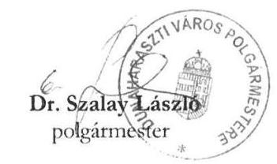
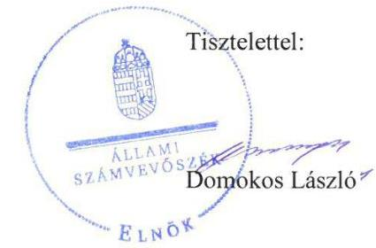

# Jelentés 

## Önkormányzatok ellenőrzése -   Integritás- és belső kontrollrendszer

Dunaharaszti Város Önkormányzata 2019. 10. hó 22. nap

---

# AZ ELLENŐRZÉST FELÜGYELTE:

DR. NAGY IMRE felügyeleti vezető

# AZ ELLENŐRZÉST VEZETTE ÉS A VÉGREHAJTÁSÁÉRT FELELŐS:

DR. DOMOKOS MAGDOLNA ellenőrzésvezető

# A PROGRAM ÖSSZEÁLLÍTÁSÁÉRT FELELŐS:

TÓTPÁL SZABOLCS osztályvezető

---

**IKTATÓSZÁM:** EL-1674-001/2019

**TÉMASZÁM:** 2485

**ELLENŐRZÉS-AZONOSÍTÓ SZÁM:** V-082948

---

Jelentéseink az Országgyűlés számítógépes hálózatán és az Interneten a www.asz.hu címen is olvashatóak.

---

# TARTALOMJEGYZÉK 

■ ÖSSZEGZÉS ..... 5
■ AZ ELLENŐRZÉS CÉLJA ..... 6
■ AZ ELLENŐRZÉS TERÜLETE ..... 7
■ AZ ELLENŐRZÉS HÁTTERE, INDOKOLTSÁGA ..... 8
■ A JELENTÉS LÉNYEGES KÉRDÉSKÖREI ..... 9
■ AZ ELLENŐRZÉS HATÓKÖRE ÉS MÓDSZEREI ..... 10
■ MEGÁLLAPÍTÁSOK ..... 12
■ JAVASLATOK ..... 14
■ MELLÉKLETEK ..... 15
I. sz. melléklet: Értelmező szótár ..... 15
■ FÜGGELÉK: ÉSZREVÉTELEK ..... 17
■ RÖVIDÍTÉSEK JEGYZÉKE ..... 25

---

.

---

# ÖSSZEGZÉS 

Dunaharaszti Város Önkormányzatánál a belső kontrollrendszer nem volt szabályszerű, ezáltal nem volt biztosított az átláthatóság, elszámoltathatóság, a közpénzfelhasználás szabályossága és a nemzeti vagyonnal történő felelős gazdálkodás. Az integritási kontrollok kiépítettsége és működtetése nem támogatta az integritás elvű működést.

## Az ellenőrzés társadalmi indokoltsága

Az Állami Számvevőszék alapvető feladata a közpénzekkel, az állami és önkormányzati vagyonnal való gazdálkodás ellenőrzése. Az Alaptörvény szerint az önkormányzatok kötelezettsége a kiegyensúlyozott, átlátható és fenntartható költségvetési gazdálkodás elvének érvényesítése, a nemzeti vagyonnal való rendeltetésszerű és felelős módon való gazdálkodás biztosítása. Az Állami Számvevőszék stratégiájában megfogalmazott célkitűzése az integritás alapú, átlátható és elszámoltatható közpénzfelhasználás elősegítése. Ennek megvalósítása érdekében az Állami Számvevőszék prioritásként kezeli a közpénzzel gazdálkodó szervezetek esetében a belső kontrollrendszer működésének ellenőrzését.

## Főbb megállapítások, következtetések, javaslatok

Dunaharaszti Város Önkormányzatánál a monitoring rendszer kialakítása nem volt szabályszerű, mivel a Dunaharaszti Polgármesteri Hivatal nem rendelkezett a jogszabály szerinti, a belső kontrollrendszerének minőségét értékelő, vezetői nyilatkozattal.

Dunaharaszti Város Önkormányzatánál adatvédelmi és adatbiztonsági szabályzat hiányában az információs és kommunikációs rendszer kialakítása nem volt szabályszerű, nem voltak biztosítottak az adatok jogosulatlan hozzáféréstől, változtatásától való védelmének szabályai.

Dunaharaszti Város Önkormányzata szabályszerű kontrollkörnyezetben működött, a kontrolltevékenységeket szabályszerűen végezték, az integrált kockázatkezelési rendszer kialakítása és működtetése szabályszerű volt.

Dunaharaszti Város Önkormányzatánál a korrupció elleni védelemre szolgáló integritási kontrollok kiépítése és működtetése nem megfelelően történt, így nem volt biztosított az integritás alapú közpénzfelhasználás lehetősége.

Dunaharaszti Város Önkormányzatánál nem volt biztosított az államháztartás pénzeszközeivel és a nemzeti vagyonnal történő gazdaságos, hatékony és eredményes gazdálkodás mérésének lehetősége.

Az Állami Számvevőszék a Dunaharaszti Polgármesteri Hivatal jegyzője részére az adatvédelmi és adatbiztonsági szabályzat elkészítése, valamint a jövőre nézve a belső kontrollrendszer minőségéről szóló nyilatkozat jogszabály szerinti elkészítése kapcsán fogalmazott meg javaslatot, melyre az érintettnek 30 napon belül intézkedési tervet kell készítenie.

---

# AZ ELLENŐRZÉS CÉLJA 

Az ellenőrzés célja annak megállapítása volt, hogy Dunaharaszti Város Önkormányzatának belső kontrollrendszere biztosította-e a közpénzekkel és a nemzeti vagyonnal történő elszámoltatható, átlátható, szabályszerű, gazdaságos, hatékony és eredményes gazdálkodás feltételeit. Az ellenőrzés keretében értékeljük továbbá, hogy az önkormányzatnál kiépítették és erősítették-e a korrupciós kockázatok kezelését szolgáló integritás kontrollokat és azt, hogy megteremtették-e a teljesítményellenőrzés feltételeit.

---

# **AZ ELLENŐRZÉS TERÜLETE**

## **Dunaharaszti Város Önkormányzata**

Dunaharaszti város Pest megyében, a Duna mellett elhelyezkedő település, kistérségi központ, állandó lakosainak száma a Központi Statisztikai Hivatal közigazgatási helynévkönyve alapján 2017. január 1-jén 21 469 fő volt.

Dunaharaszti Város Önkormányzatánál a tizenegy tagból álló képviselő-testület munkáját öt állandó bizottság segítette. A településen német, roma és bolgár nemzetiségi kisebbségi önkormányzat működött. Az Önkormányzat1 működtetésével, gazdálkodásával kapcsolatos feladatokat önálló jogi személyiséggel és gazdasági szervezettel rendelkező költségvetési szervként a Polgármesteri Hivatal2 látta el.

A Polgármester3 a 2002. évi választások óta tölti be a tisztségét, a jegyző4 2017. november 20. óta látja el feladatát.

Az Önkormányzat a települési feladatok ellátását 2017. év végén nyolc költségvetési szerv működtetésével biztosította. A költségvetési szervek közművelődési és szociális feladatokat, valamint bölcsődei- és óvodai nevelési feladatokat láttak el. Gazdálkodási feladataikat a Polgármesteri Hivatal végezte.

Az Önkormányzat 2017. évi költségvetési beszámolója szerint 5 286,9 millió Ft költségvetési bevételt, 3 290,3 millió Ft költségvetési kiadást teljesített, könyvviteli mérleg szerinti vagyona 22 603,1 millió Ft volt.

---

# AZ ELLENŐRZÉS HÁTTERE, INDOKOLTSÁGA 

A demokratikus társadalmakban alapvető igény, hogy a közpénzeket, a közvagyont használók tevékenységükről elszámoljanak, ahhoz egyértelmű és érvényesíthető felelősségi szabályok társuljanak. Ennek a jogos igénynek az érvényesítéséhez meg kell teremteni azokat a folyamatokat, rendszereket, amelyek nélkülözhetetlenek az elszámoltatáshoz. Az elszámoltatás eredményes működtetéséhez szükség van a megfelelő információs, kontroll-, értékelési és beszámolási rendszerek kialakítására. A belső kontrollok kiépítettsége hozzájárul az integritási szemlélet kialakításához és érvényesüléséhez. A belső kontrollrendszer kialakítása és működtetése nélkül nem valósítható meg a közpénzek, a közvagyon szabályos, gazdaságos, hatékony és eredményes felhasználása.

A BELSŐ KONTROLLRENDSZER azt a célt szolgálja, hogy az államháztartás szervei működésük és gazdálkodásuk során a tevékenységeket szabályszerűen, gazdaságosan, hatékonyan, eredményesen hajtsák végre, teljesítsék elszámolási kötelezettségeiket, és megvédjék az erőforrásokat a veszteségektől, a károktól, a nem rendeltetésszerű használattól. A belső kontrollrendszer magában foglalja mindazon szabályokat, eljárásokat, gyakorlati módszereket és szervezeti struktúrákat, kockázatkezelési technikákat, kontrolltevékenységeket, amelyek segítséget nyújtanak a szervezetnek céljai eléréséhez.

A megfelelő belső kontrollrendszer jelentősen csökkenti a hibák és szabálytalanságok kockázatát. Az ÁSZ célja, hogy javuljon az ellenőrzött önkormányzatok belső kontrollrendszerének szabályozottsága, működésének megfelelősége, szabályszerűsége, hozzájárulva ezzel az egyensúlyi helyzet fenntarthatóságának biztosításához, biztosítva az önkormányzatnál a közpénzfelhasználás szabályosságát, a közpénzekkel és a nemzeti vagyonnal történő szabályszerű, gazdaságos, hatékony és eredményes gazdálkodást.

AZ ELLENŐRZÉS VÁRHATÓ HASZNOSULÁSA négy szinten valósul meg. A törvényalkotás számára összegzett tapasztalatok állnak rendelkezésre a belső kontrollrendszer önkormányzati területen való kialakításáról, működtetéséről és hatásairól. Az ellenőrzés az ellenőrzött számára visszajelzést ad a belső kontrollrendszer kialakításában és működésében lévő hiányosságokról, javaslataival hozzájárul azok kiküszöböléséhez. Az ellenőrzés megállapításait és javaslatait más szervezetek is hasznosíthatják a rendezett gazdálkodási keretek kialakításához, a ,,jó gyakorlat" elterjesztésével azok az önkormányzatok is átvehetik a pozitív példákat, ahol nem végez ellenőrzést az ÁSZ.

Az ÁSZ ellenőrzései jelzik a társadalom számára, hogy közpénz nem maradhat ellenőrizetlenül, tevékenysége hozzájárul az értékteremtő rend kialakításához és megőrzéséhez.

---

# A JELENTÉS LÉNYEGES KÉRDÉSKÖREI 

1. Az önkormányzat belső kontrollrendszerének kialakítása és működtetése szabályszerű volt-e, az biztosította-e az önkormányzatnál a közpénzfelhasználás szabályosságát, a nemzeti vagyonnal történő felelős gazdálkodást?
2. Az önkormányzatnál alakítottak-e ki a teljesítmény mérésére alkalmas követelményeket?

---

# AZ ELLENŐRZÉS HATÓKÖRE ÉS MÓDSZEREI 

## Az ellenőrzés típusa

Megfelelőségi ellenőrzés.

## Az ellenőrzött időszak

2017. év, illetve az éves költségvetési beszámoló Áht. ${ }^{5}$ által megállapított jóváhagyásáig (2018. május 31-éig) tartó időszak.

## Az ellenőrzés tárgya

Dunaharaszti Város Önkormányzata belső kontrollrendszerének kialakítása és működtetése, valamint az integritás kontrollok kiépítettsége, a teljesítményellenőrzés feltételei.

## Az ellenőrzött szervezet

Dunaharaszti Város Önkormányzata.

## Az ellenőrzés jogalapja

Az ellenőrzés jogszabályi alapját az ÁSZ tv. 6. § (3) bekezdés, 5. § (2) és (6) bekezdései, valamint az Áht. 61. § (2) bekezdésének előírásai képezik.

## Az ellenőrzés módszerei

Az ÁSZ az ellenőrzést az ellenőrzési program szempontjai, az ellenőrzött időszakban hatályos jogszabályok, az ellenőrzés szakmai szabályai, a jelen ellenőrzésre irányadó ÁSZ módszertanok figyelembevételével hajtotta végre.

Az ellenőrzés ideje alatt az ellenőrzött szervezettel történő kapcsolattartást az ÁSZ SZMSZ ${ }^{7}$-ének vonatkozó előírásai alapján biztosította az ÁSZ.

Az ellenőrzési kérdések megválaszolásához szükséges bizonyítékok megszerzése az ellenőrzött által rendelkezésre bocsátott dokumentumokra, adatokra alapozva megfigyelés, valamint elemző eljárás útján történt.

Az ellenőrzési bizonyítékként felhasználható adatforrások közé tartoznak az ellenőrzési program részletes szempontjainál felsorolt adatforrások,

---

valamint minden egyéb - az ellenőrzés folyamán feltárt, az ellenőrzés szempontjából információt tartalmazó - dokumentum.

A 2017. évi kiadások teljesítéséhez kapcsolódó pénzgazdálkodási belső kontrollok működésének szabályszerűsége esetében az ellenőrzés azokra a legnagyobb értékű tételekre - a lényeges sokaságra - terjedt ki, melyek összértéke eléri a teljes sokaság összértékének 50%-át. A 2017. évi kiadások esetében a lényeges sokaságot tételesen ellenőriztük.

Az önkormányzat belső kontrollrendszerének összesített értékelése az egyes részterületek esetében kapott megfelelőségi arányok számtani átlaga alapján történik és megegyezik a pillérenként (kontroll-területenként) alkalmazott százalékos értékelésekkel, a következő eltérésekkel: a kontrollrendszer egésze esetében a „szabályszerű" értékelésnek a százalékos értéken felül további feltétele, hogy egyik kontrollterület sem kaphat „nem szabályszerű" értékelést.

Amennyiben az önkormányzat működését és gazdálkodását alapvetően meghatározó dokumentum hiánya miatt, valamely lényeges kérdéskörre vonatkozóan az ÁSZ megállapítást tett, további ellenőrzési tevékenységek az adott kérdéskörrel és az azzal szoros logikai kapcsolatban lévő kérdéskörökkel - ráépülő jelleggel - nem kerültek végrehajtásra.

---

# MEGÁLLAPÍTÁSOK 

## 1. Az önkormányzat belső kontrollrendszerének kialakítása és működtetése szabályszerű volt-e, az biztosította-e az önkormányzatnál a közpénzfelhasználás szabályosságát, a nemzeti vagyonnal történő felelős gazdálkodást?

Összegző megállapítás

Az Önkormányzatnál a szabályos közpénzfelhasználás, a nemzeti vagyonnal történő felelős gazdálkodás biztosítására szolgáló belső kontrollrendszer kialakítása és működtetése nem volt szabályszerű.

AZ ÖNKORMÁNYZAT SZABÁLYSZERŰ KONTROLLKÖRNYEZETBEN működött. Az Önkormányzat a Mötv., a Polgármesteri Hivatal az Áht. előírása alapján rendelkezett SZMSZ-szel. Az Önkormányzat rendelkezett az Áht.-ben és az Ávr.-ben előírt, a gazdálkodás és a jogkörgyakorlás részletes rendjét meghatározó szabályozással, a Számv. tv. és az Áhsz. előírásai alapján számviteli politikával, számlarenddel, továbbá a Htv. előírása szerinti vagyonrendelettel és a Mötv.-ben előírtak szerinti gazdasági programmal.

AZ INTEGRÁLT KOCKÁZATKEZELÉSI RENDSZER MŰKÖDTETÉSE SZABÁLYSZERŰ volt. A jegyző a Bkr. szerint kialakította az integrált kockázatkezelési rendszerrel kapcsolatos belső szabályozást, felmérte és megállapította a Polgármesteri Hivatal tevékenységében rejlő és a szervezeti célokkal összefüggő kockázatokat.

A KONTROLLTEVÉKENYSÉGEK MŰKÖDTETÉSE SZABÁLYSZERŰ VOLT. Az Önkormányzatnál vezették az Ávr. előírása alapján a gazdálkodási jogkörgyakorlásra jogosult személyek aláírás-mintáit tartalmazó nyilvántartást, a működési és felhalmozási kiadások esetében az Áht.-ben és az Ávr.-ben előírt kötelezettségvállalás és teljesítésigazolás szabályszerű volt.

AZ INFORMÁCIÓS ÉS KOMMUNIKÁCIÓS RENDSZER KIALAKÍTÁSA NEM VOLT SZABÁLYSZERŰ, mert a jegyző nem készítette el az adatvédelmi és adatbiztonsági szabályzatot az Info tv. 24. § (3) bekezdésének előírása ellenére.

A MONITORING RENDSZER MŰKÖDTETÉSE NEM VOLT SZABÁLYSZERŰ. A Polgármesteri Hivatal nem rendelkezett a jogszabály szerinti, a belső kontrollrendszerének minőségét értékelő vezetői nyilatkozattal, mert azt a 2017. november 20-i hatállyal kinevezett jegyző a Bkr. 11. § (4) bekezdésének előírása ellenére jogosulatlanul a

---

teljes 2017. évre, a vezetői időszakát megelőző hónapokra is kiterjedően tette meg.

# AZ INTEGRITÁS KONTROLLOK KIÉPÍTETTSÉGE ÉS MŰKÖDTETÉSE NEM TÁMOGATTA az Önkormányzat integritás elvű működését, az adatvédelmi és adatbiztonsági szabályozás nem volt biztosított. Az Önkormányzat szervezeti céljai között nem szerepelt az integritás erősítése. 

## 2. Az önkormányzatnál alakítottak-e ki a teljesítmény mérésére alkalmas követelményeket?

Összegző megállapítás Az Önkormányzatnál nem alakítottak ki a teljesítmény mérésére alkalmas követelményeket.

A szervezeti célok elérését szolgáló feladatok, folyamatok, tevékenységek mérését szolgáló indikátorokat, mérőszámokat, feladat- és teljesítménymutatókat nem képeztek, ezáltal az Önkormányzat a teljesítmény mérésének feltételeit, az államháztartás pénzeszközeivel és a nemzeti vagyonnal történő gazdaságos, hatékony
 és eredményes gazdálkodás mérésének lehetőségét nem biztosította.

---

# JAVASLATOK 

Az ÁSZ tv. 33. § (1) bekezdésében foglaltak értelmében az ellenőrzött szervezet vezetője köteles a jelentésben foglalt megállapításokhoz kapcsolódó intézkedési tervet összeállítani és azt a jelentés kézhezvételétől számított 30 napon belül az ÁSZ részére megküldeni. Amennyiben az ellenőrzött szervezet vezetője nem küldi meg határidőben az intézkedési tervet, vagy továbbra sem elfogadható intézkedési tervet küld, az Állami Számvevőszék elnöke az ÁSZ tv. 33. § (3) bekezdése a) és b) pontjaiban foglaltakat érvényesítheti.

## Dunaharaszti Polgármesteri Hivatal jegyzőjének

1. Intézkedjen az adatvédelmi és adatbiztonsági szabályzat elkészítéséről a jogszabályi előírásnak megfelelően.
(1. sz. megállapítás 4. bekezdése alapján)
2. Intézkedjen a jövőben a jogszabályi előírás szerinti nyilatkozatban a költségvetési szerv belső kontrollrendszere minőségének értékeléséről.
(1. sz. megállapítás 5. bekezdés 2. mondata alapján)

---

# MELLÉKLETEK 

- I. SZ. MELLÉKLET: ÉRTELMEZŐ SZÓTÁR
belső ellenőrzés
belső kontrollrendszer
belső kontrollrendszer területei
információs és kommunikációs rendszer
integrált kockázatkezelési rendszer
integritás
irányító szerv/felügyeleti szerv
kockázat
kontrollkörnyezet
kontrolltevékenységek

Független, tárgyilagos bizonyosságot adó és tanácsadó tevékenység, amelynek célja, hogy az ellenőrzött szervezet működését fejlessze és eredményességét növelje, az ellenőrzött szervezet céljai elérése érdekében rendszerszemléletű megközelítéssel és módszeresen értékeli, illetve fejleszti az ellenőrzött szervezet irányítási és belső kontrollrendszerének hatékonyságát (Forrás: Bkr. 2. § b) pontja)
A belső kontrollrendszer a kockázatok kezelése és tárgyilagos bizonyosság megszerzése érdekében kialakított folyamatrendszer, amely azt a célt szolgálja, hogy a működés és gazdálkodás során a tevékenységeket szabályszerűen, gazdaságosan, hatékonyan, eredményesen hajtsák végre, az elszámolási kötelezettségeket teljesítsék, megvédjék az erőforrásokat a veszteségektől, károktól és nem rendeltetésszerű használattól (Forrás: Áht. 69. § (1) bekezdése)
A kontrollkörnyezet, az integrált kockázatkezelési rendszer, a kontrolltevékenységek, az információs és kommunikációs rendszer, valamint a nyomon követési (monitoring) rendszer. (Forrás: Bkr. 3. §-a)
A költségvetési szerv vezetője által kialakított és működtetett olyan rendszer, mely biztosítja, hogy a megfelelő információk a megfelelő időben eljutnak az illetékes szervezethez, szervezeti egységhez, illetve személyhez. (Forrás: Bkr. 9. § (1) bekezdés)

Olyan folyamatalapú kockázatkezelési rendszer, amely a szervezet minden tevékenységére kiterjed, egységes módszertan és eljárások alkalmazásával, a szervezet célkitűzéseinek és értékeinek figyelembevételével biztosítja a szervezet kockázatainak teljes körű azonosítását, azok meghatározott kritériumok szerinti értékelését, valamint a kockázatok kezelésére vonatkozó intézkedési terv elkészítését és az abban foglaltak nyomon követését. (Forrás: Bkr. 2. § m) pontja, 2016. október 1-jétől)

Az integritás az elvek, értékek, cselekvések, módszerek, intézkedések konzisztenciáját jelenti, vagyis olyan magatartásmódot, amely meghatározott értékeknek megfelel. (Forrás: Nemzetgazdasági Minisztérium: Magyarországi államháztartási belső kontroll standardok Útmutató 1.6.1. pontja, 2012. december)
A költségvetési szerv tekintetében az Áht-ban meghatározott irányítási hatáskört gyakorló szerv. (Forrás: Áht. 1. § 9. pontja)
A kockázat annak a valószínűségét jelenti, hogy egy vagy több esemény vagy intézkedés nem kívánt módon befolyásolja a rendszer működését, céljainak megvalósulását. (Forrás: Javaslatok a korrupciós kockázatok kezelésére Kockázatkezelési és ellenőrzési módszertan 35. oldal, ÁSZ)
A költségvetési szerv vezetője által kialakított olyan elvek, eljárások, belső szabályzatok összessége, amelyben világos a szervezeti struktúra, egyértelműek a felelősségi, hatásköri viszonyok és feladatok, meghatározottak az etikai elvárások a szervezet minden szintjén, átlátható a humánerőforrás-kezelés (Forrás: Bkr. 6. § (1) bekezdés)
A költségvetési szerv vezetője által a szervezeten belül kialakított (kontroll) tevékenységek, melyek biztosítják a kockázatok kezelését, hozzájárulnak a szervezet céljainak eléréséhez (Forrás: Bkr. 8. § (1) bekezdés)

---

| kommunikáció | Az a tevékenység, melynek során információ továbbítása valósul meg. A kommunikációs folyamat résztvevői között tájékoztatás történik, mely során tényeket, ezek magyarázatát közlik. |
| :--: | :--: |
| közös önkormányzati hivatal | A települési képviselő-testület más települési képviselő-testülettel társult képviselő-testületet alakíthat, amely esetén a képviselő-testületek részben vagy egészben egyesítik a költségvetésüket, közös önkormányzati hivatalt tartanak fenn, és intézményeiket közösen működtetik. (Forrás: Mötv. 56. § (1)-(2) bekezdései) |
| monitoring | A monitoring általánosságban a különböző szintű szervezeti célok megvalósításának folyamatát kíséri figyelemmel, melynek során a releváns eseményekről és tevékenységekről (együtt: folyamatokról) rendszeres jelleggel, strukturált, döntéstámogató információkhoz jutnak a szervezet vezetői. (Forrás: NGM Útmutató a költségvetési szervek monitoring rendszeréhez 2011. november) |
| monitoring rendszer | A költségvetési szerv vezetője köteles kialakítani a szervezet tevékenységének a célok megvalósításának nyomon követését biztosító rendszert, amely az operatív tevékenységek keretében megvalósuló folyamatos és eseti nyomon követésből, valamint az operatív tevékenységektől függetlenül működő belső ellenőrzésből állhat. (Forrás: Bkr. 10. §) |
| önkormányzati hivatal | A polgármesteri hivatal, a főpolgármesteri hivatal, a megyei önkormányzati hivatal és a közös önkormányzati hivatal. (Forrás: Áht. 1. § 18. pont) |
| társulás | A helyi önkormányzatok képviselő-testületei megállapodhatnak abban, hogy egy vagy több önkormányzati feladat- és hatáskör, valamint a polgármester és a jegyző államigazgatási feladat- és hatáskörének hatékonyabb, célszerűbb ellátására jogi személyiséggel rendelkező társulást hoznak létre. (Forrás: Mötv. 87. §) |

---

# FÜGGELÉK: ÉSZREVÉTELEK 

A jelentéstervezetet a Számvevőszék 15 napos észrevételezésre megküldte az ellenőrzött szervezet vezetőjének az ÁSZ tv. 29. §* (1) bekezdése előírásának megfelelően.

Dunaharaszti Város Önkormányzatának polgármestere a jelentéstervezet megállapításaira észrevételt tett.
Az ÁSZ tv. 29. § (3) bekezdésével összhangban az ÁSZ a Függelékben feltünteti az ellenőrzés megállapításaival kapcsolatban tett, figyelembe nem vett észrevételeket, és megindokolja, hogy azokat miért nem fogadta el.

[^0]
[^0]:    * 29. § (1) Az Állami Számvevőszék az ellenőrzési megállapításait megküldi az ellenőrzött szervezet vezetőjének vagy az általa megbízott személynek, és annak, akinek személyes felelősségét állapította meg.
    (2) Az ellenőrzött szervezet vezetője és a felelősként megjelölt személy az ellenőrzés megállapításaira tizenöt napon belül írásban észrevételt tehet.
    (3) Az Állami Számvevőszék az észrevételre a beérkezésétől számított harminc napon belül írásban válaszol. A figyelembe nem vett észrevételeket köteles a jelentésben feltüntetni, és megindokolni, hogy azokat miért nem fogadta el.

---

# Dunaharaszti Város POLGÁRMESTERE 

252330 Dunaharaszti, Fő út 152.
06-24/504-450 06-24/370-457
@ urkarsag@dunaharaszti.hu

Állami Számvevőszék
1364 Budapest
Apáczai Csere János utca 10.
Domokos László, elnök
részére

Tárgy: EL-1030 jelentéstervezetre észrevétel
Ügyintéző: Döme Zsófia
Ügyiratszám: 6260-2/2019
Tel.szám: 24/504-426

Tisztelt Elnök Úr!
Hivatkozással a fenti iktatószámú, „Önkormányzatok ellenőrzése - integritás - és belső kontrollrendszer - Dunaharaszti Város Önkormányzata" tárgyában készült számvevőszéki jelentéstervezetre előzetesen szeretném megköszönni az Állami Számvevőszék munkatársai által elvégzett munkát, mellyel hozzájárultak Önkormányzatunknál is a jó jobb gyakorlat elsajátításához.

Észrevételeinket az alábbiakban foglaljuk össze:

## 1.Megállapítás:

A főbb megállapítások, észrevételek, javaslatok, ill. a jelentés részletes megállapításai 1. pont rögzíti, hogy „Dunaharaszti Város Önkormányzatnál a monitoring rendszer kialakítása nem volt szabályszerű, mivel a Dunaharaszti Polgármesteri Hivatal nem rendelkezett jogszabály szerinti, a belső kontrollrendszerének minőségét értékelő, vezetői nyilatkozattal."
$\rightarrow$ Észrevétel:
A megfogalmazás nem helytálló, tekintettel arra, hogy a vezetői nyilatkozattal rendelkezünk, azt az ellenőrzés rendelkezésére bocsátottuk.

## 2. Megállapítás:

A 2. pont megállapításai között szerepel, hogy a szervezeti célok elérését szolgáló feladatok, folyamatok, tevékenységek mérését szolgáló indikátorokat, mérőszámokat, feladat- és teljesítménymutatókat nem képeztek, ezáltal az Önkormányzat a teljesítmény mérésének feltételeit, az államháztartás pénzeszközeivel és a nemzeti vagyonnal történő gazdaságos, hatékony és eredményes gazdálkodás mérésének lehetőségét nem biztosította.
$\rightarrow$ Észrevétel:
A megállapítást elfogadni nem tudjuk tekintettel arra, hogy az Önkormányzat rendelkezett ún. monitoring stratégiával (mely tartalmazza a teljesítmény mérésének szempontjait és mérési módszereit, 2.46. ponthoz feltöltésre került), továbbá évenként elkészítésre és a

---

vezetőség részére megküldésre került az ún. monitoring jelentés (2.45. ponthoz feltöltésre került), mely a monitoring stratégia alapján az Önkormányzat pénzügyi, teljesítmény és egyéb mutatóinak mérését tartalmazza. A monitoring jelentés tartalmát a Képviselő-testülettel rendszeresen ismertettük.

# 3. Megállapítás: 

Az 1. pont 4. bekezdésében rögzítésre került, hogy a jegyző nem készítette el az adatvédelmi és adatbiztonsági szabályzatot.
$\rightarrow$ Észrevétel:
A megállapítást elfogadni nem tudjuk, tekintettel arra, hogy a második körös adatbekérés kapcsán a 2.29. ponthoz feltöltésre került az ún. adatkezelési szabályzat, melynek tartalma az adatvédelmi és adatbiztonsági szabályzat, továbbá az informatikai biztonsági szabályzat. Az adatvédelmi és adatbiztonsági szabályzatban rögzítésre kerültek az adatvédelmi feladat- és hatáskörök, az adatkezelők, a nyilvántartások, a belső adatvédelmi felelős kijelölése stb. Az informatikai biztonsági szabályzatban rögzítésre kerültek az információk minősítésére, e-ügyintézésre, informatikai biztonsági protokollra vonatkozó szabályok. Kérjük a feltöltött anyagok áttekintését, és a megállapítás ennek megfelelő módosítását, korrigálását.

Kérem a T. Elnök urat, az észrevételeinket vizsgálják meg és mérlegeljék, továbbá amennyiben azokat elfogadják, úgy a jelentés-tervezetet ennek megfelelően módosítani szíveskedjenek.

Utolsó sorban kérjük megjeleníteni a főbb megállapítások, észrevételek, javaslatok fejezetben, hogy az Önkormányzat belső kontrollrendszerét jelentő kontrollkörnyezet, integrált kockázatelemzés, kontrolltevékenységek kialakítása és működtetése megfelelő és szabályszerű volt, ill. amennyiben észrevételeinket elfogadják, úgy az információs és kommunikációs rendszer kialakítása, továbbá a monitoring rendszer működtetése megfelelő volt.

Dunaharaszti, 2019. június 20.

---

# Dr. Szalay László András úr 

polgármester
Dunaharaszti Város Önkormányzata

## Dunaharaszti

## Tisztelt Polgármester Úr!

Az „Önkormányzatok ellenőrzése - Integritás és belső kontrollrendszer - Dunaharaszti Város Önkormányzata" címmel készített számvevőszéki jelentéstervezetre tett, 6260-2/2019. számú észrevételét köszönettel megkaptam.
Az Állami Számvevőszék észrevételre vonatkozó álláspontjáról a felügyeleti vezető által készített részletes tájékoztatást csatoltan megküldöm.
Tájékoztatom Polgármester urat, hogy a számvevőszéki jelentésben - az Állami Számvevőszékről szóló 2011. évi LXVI. törvény 29. § (3) bekezdése alapján - a figyelembe nem vett észrevételeket szerepeltetjük az elutasítás indokának feltüntetésével.

Budapest, 2019. 02 hó 70 nap

Melléklet: Tájékoztatás az észrevételek kezeléséről

---

# Tájékoztatás   az észrevételek kezeléséről 

Az „Önkormányzatok ellenőrzése - Integritás és belső kontrollrendszer - Dunaharaszti Város Önkormányzata" című jelentéstervezetre 2019. június 20-án tett (az Állami Számvevőszékhez postai úton 2019. június 26-án érkezett) észrevételt áttekintettük, annak kezelésével kapcsolatban a következő tájékoztatást adom.

1. A jelentéstervezet Főbb megállapítások, következtetések, javaslatok részének 1. bekezdésére, valamint a részletes megállapítások 1. megállapítás 5. bekezdésére tett észrevétel (2. számú javaslat) kapcsán:

Polgármester úr észrevételében vitatta a jelentéstervezet Főbb megállapítások, következtetések, javaslatok részének 1. bekezdés, valamint a részletes megállapítások 1. megállapítás 5. bekezdés (2. számú javaslat) azon megállapítását, hogy Dunaharaszti Város Önkormányzatnál a monitoring rendszer kialakítása nem volt szabályszerű, mivel a Dunaharaszti Polgármesteri Hivatal nem rendelkezett jogszabály szerinti, a belső kontrollrendszerének minőségét értékelő, vezetői nyilatkozattal.

A polgármester úr által leírtak szerint a megfogalmazás nem helytálló, tekintettel arra, hogy álláspontja szerint a vezetői nyilatkozattal rendelkeztek, azt az ellenőrzés rendelkezésére bocsátották.

Dunaharaszti Polgármesteri Hivatalnál 2017. november 20-án a jegyző személyében változás történt, a távozó jegyző nem tett eleget a költségvetési szervek belső kontrollrendszeréről és belső ellenőrzéséről szóló 370/2011. (XII. 31.) Korm. rendelet (továbbiakban: Bkr.) 11. § (4) bekezdés előírásának, mert a Bkr. 1. melléklet szerinti nyilatkozatot a távozásáig eltelt időszak vonatkozásában nem tette meg. A 2017. november 20-án hivatalba lépett jegyző sem a Bkr-nek megfelelően tette meg vezetői nyilatkozatát, hiszen a vezetői időszakát megelőző hónapok vonatkozásában is ő nyilatkozott. A Bkr. 11. § (4) bekezdés a következőkről rendelkezik:
„Ha a költségvetési szervnél év közben változás történik a szerv vezetője személyében, vagy a költségvetési szerv átalakul, megszűnik, a távozó vezető, illetve az átalakuló, megszűnő
 költségvetési szerv vezetője köteles az 1. mellékletet az addig eltelt időszak vonatkozásában kitölteni, és az új vezetőnek, illetve a jogutód költségvetési szerv vezetőjének átadni, aki azt saját nyilatkozatához mellékeli.

---

Az EL-1030-001/2018. iktatási számú adatbekérő levélben kért adatok kapcsán, a teljességi és hitelességi nyilatkozat szerint az ÁSZ részére átadott dokumentumok, adatok megbízhatóak, és a bekért adatokra, dokumentumokra vonatkozóan teljes körű információt tartalmaznak.
Az adatbekérő levelekben megjelölt, bekért dokumentumokra vonatkozóan a távozó jegyző Bkr. 1. számú melléklete szerinti nyilatkozata a teljességi és hitelességi nyilatkozatokban felsorolt dokumentumok között nem szerepel.
Az ÁSZ az ellenőrzési megállapításait az adatszolgáltatás során a részére rendelkezésre bocsátott dokumentumokra alapozva fogalmazza meg.
Fentiek alapján az ellenőrzött időszakra vonatkozóan Dunaharaszti Város Önkormányzata belső kontrollrendszerének minőségét értékelő vezetői nyilatkozatot a jogszabályi előírásoknak megfelelően a távozó jegyző nem bocsátotta az ellenőrzés rendelkezésére. Dokumentum az adatszolgáltatás alkalmával az ÁSZ tv-ben rögzített 5 munkanapos adatszolgáltatási határidőben nem került megküldésre az ÁSZ részére, ezért a jelentéstervezet módosítása nem indokolt.

# 2. A jelentéstervezet 2. megállapítás 1. bekezdésére tett észrevétel kapcsán: 

Polgármester úr észrevételében vitatta a jelentéstervezet 2. megállapítás 1. bekezdés azon megállapítását, hogy az Önkormányzatnál a szervezeti célok elérését szolgáló feladatok, folyamatok, tevékenységek mérését szolgáló indikátorokat, mérőszámokat, feladat- és teljesítménymutatókat nem képeztek, ezáltal az Önkormányzat a teljesítmény mérésének feltételeit, az államháztartás pénzeszközeivel és a nemzeti vagyonnal történő gazdaságos, hatékony és eredményes gazdálkodás mérésének lehetőségét nem biztosította.
Polgármester úr által leírtak szerint az Önkormányzat rendelkezett ún. monitoring stratégiával, mely tartalmazta a teljesítmény mérésének szempontjait, továbbá évenként elkészítésre és a vezetőség részére megküldésre került az ún. monitoring jelentés, mely a monitoring stratégia alapján az Önkormányzat pénzügyi, teljesítmény és egyéb mutatóinak mérését tartalmazza. Az észrevételben leírtak szerint a monitoring jelentés tartalmát a Képviselő-testülettel rendszeresen ismertették.
Az Önkormányzat a 2015-2019. évekre szóló Gazdasági programját megküldte az Állami Számvevőszék részére, a 2018. október 11-én kelt Teljességi hitelességi nyilatkozatban, annak 3. pontjában is szerepel. A Gazdasági programban megfogalmazott specifikus és általános célok tekintetében viszont a Monitoring stratégiában a pénzügyi gazdálkodáshoz kapcsolódó mutatók és azok számítási módja nem fedik le valamennyi, a szervezet céljaihoz kapcsolódó feladatot, tevékenységet, azokhoz kapcsolódó további mutatószámokat nem definiáltak, a meghatározott mutatószámokhoz továbbá nem kerültek kialakításra a mutatók értékeléséhez szükséges kritériumok, követelmények, elvárások. Az önkormányzati „Monitoring Stratégia" szerint:
„szervezeti teljesítmény (célok megvalósításának) monitoringja a stratégia célok teljesüléséhez kapcsolható mérhető mutatószámokban kifejezett output értékeket követi nyomon és értékeli."

---

A meghatározott célokhoz azonban teljesítmény követelmények, teljesítmény mutatók, teljesítmény mérésének szempontjai a pénzügyi gazdálkodás területét érintő „pénzügyi", "teljesítmény" és „egyéb" mutatókon túl nem került definiálásra, meghatározásra.

A Monitoring stratégiában meghatározott mutatószámok számítása megtörtént, azonban azok értékelését nem végezték el - az értékeléshez követelmény, kritérium nem állt rendelkezésre, kockázatjelzésre, eltérések okainak felderítésére, megszüntetésére vonatkozó intézkedések megtételére nem került sor.

A Monitoring jelentésben értékelt követelmények nem az Önkormányzat által meghatározott teljesítmények mérésének a kritériumai, azok a jogszabályi előírások által elvárt követelmények. Ennek okán a „Monitoring jelentés" kontrollkörnyezet kialakítására és működtetésére, integrált kockázatkezelés, kontrolltevékenységek, információ és kommunikációs tevékenység és a monitoring rendszer szabályozásának és végrehajtásának értékelése nem tekinthető az Önkormányzat által kitűzött célok teljesítményértékelésének.

A fentebb leírtak alapján az Önkormányzat nem alakította ki a teljesítmény mérésére alkalmas követelményeket. A szervezeti célok elérését szolgáló feladatok, folyamatok, tevékenységek mérését szolgáló indikátorokat, mérőszámokat, feladat- és teljesítménymutatókat nem képeztek, ezáltal az Önkormányzat a teljesítmény mérésének feltételeit, az államháztartás pénzeszközeivel és a nemzeti vagyonnal történő gazdaságos, hatékony és eredményes gazdálkodás mérésének lehetőségét nem biztosította, ezért a jelentéstervezet módosítása nem indokolt.

# 3. A jelentéstervezet 1. megállapítás 4. bekezdésére tett észrevétel (1. számú javaslat) kapcsán: 

Polgármester úr észrevételében vitatta a jelentéstervezet 1. megállapítás 4. bekezdés (1. számú javaslat) azon megállapítását, hogy a jegyző nem készítette el az adatvédelmi és adatbiztonsági szabályzatot.

Polgármester úr a fentiek alátámasztására észrevételében leírta, hogy a második körös adatbekérés kapcsán a 2.29. ponthoz feltöltésre került az ún. adatkezelési szabályzat, melynek tartalma az adatvédelmi és adatbiztonsági szabályzat, továbbá az informatikai biztonsági szabályzat. Az adatvédelmi és adatbiztonsági szabályzatban rögzítésre kerültek az adatvédelmi feladat- és hatáskörök, az adatkezelők, a nyilvántartások, a belső adatvédelmi felelős kijelölése stb. Az informatikai biztonsági szabályzatban rögzítésre kerültek az információk minősítésére, e-ügyintézésre, informatikai biztonsági protokollra vonatkozó szabályok.

Az ÁSZ az ellenőrzési megállapításait az adatszolgáltatás során a részére törvényi határidőben rendelkezésre bocsátott dokumentumokra alapozva fogalmazza meg. Az EL-1030-003/2018. iktatási számú adatbekérő levélben kért adatok kapcsán a teljességi és hitelességi nyilatkozat szerint az ÁSZ részére átadott dokumentumok, adatok megbízhatóak, és a bekért adatokra, dokumentumokra vonatkozóan teljes körű információt tartalmaznak.

---

Az ÁSZ 2018. szeptember 20-án kelt, EL-1030-003/2018. adatszolgáltatásra felhívó levelének 2.29 pontjában bekért Adatvédelmi és adatbiztonsági szabályzat című dokumentumra az Önkormányzat által feltöltött, és a Teljességi és Hitelességi Nyilatkozat 58. pontjában átadásra jelentett dokumentum, azaz az Adatkezelési-szabályzat nem felel meg az adatbekérésben szereplő kritériumoknak. Az EL-1030-003/2018. iktatási számú Adatbekérő levél 2. számú mellékletében szereplő kritérium szerint az ellenőrzött időszakban hatályos, illetve az ellenőrzött időszakra vonatkozó dokumentumokat elektronikusan, az aláírt és hiteles dokumentumokat pdf formátumban szkennelve kérte az ÁSZ az ellenőrzést támogató Elektronikus Adatszolgáltatási Rendszerbe feltölteni.

Az ÁSZ ellenőrzés rendelkezésére bocsátott Adatkezelési-szabályzat című dokumentumon a kiadmányozásra jogosult aláírása nem szerepel. Mivel a 2018. október 11-én kelt teljességi és hitelességi nyilatkozat 58. pontjában megnevezett, Adatkezelési-szabályzat aláírást nem tartalmazott, így ellenőrzési bizonyítékként nem értékelhető. Az ÁSZ az ellenőrzési megállapításait hiteles ellenőrzési bizonyítékokra alapozva fogalmazza meg. Az aláírás nélküli Adatkezelési-szabályzat című dokumentum nem tekinthető hiteles ellenőrzési bizonyítéknak, ezért az észrevételt nem fogadjuk el, a jelentéstervezet módosítása nem indokolt.

Budapest, 2019. 04. hó 10. nap

Dr. Nagy Imre
felügyeleti vezető

---

# RÖVIDÍTÉSEK JEGYZÉKE 

${ }^{1}$ Önkormányzat
${ }^{2}$ Polgármesteri Hivatal
${ }^{3}$ Polgármester
${ }^{4}$ Jegyző
${ }^{5}$ Áht.
${ }^{6}$ ÁSZ tv.
${ }^{7}$ ÁSZ SZMSZ
${ }^{8}$ Mötv.
${ }^{9}$ SZMSZ.
${ }^{10}$ Ávr.
${ }^{11}$ Számv. tv.
${ }^{12}$ Áhsz.
${ }^{13}$ Htv.
${ }^{14}$ Info. tv.
${ }^{15} \mathrm{Bkr}$.

Dunaharaszti Város Önkormányzata
Dunaharaszti Polgármesteri Hivatal
Dunaharaszti Város Önkormányzat polgármestere
Dunaharaszti Polgármesteri Hivatalának jegyzője
2011. évi CXCV. törvény az államháztartásról
2011. évi LXV. törvény az Állami Számvevőszékről
Az Állami Számvevőszék elnökének 2/2018. (XII.28.) ÁSZ utasítása az Állami Számvevőszék Szervezeti és Működési Szabályzatáról
2011. évi CLXXXIX. törvény Magyarország helyi önkormányzatairól Szervezeti és Működési Szabályzat
368/2011. (XII. 31.) Korm. rendelet az államháztartásról szóló törvény végrehajtásáról
2000. évi C. törvény a számvitelről
4/2013. (I. 11.) Korm. rendelet az államháztartás számviteléről
1991. évi XX. törvény a helyi önkormányzatok és szerveik, a köztársasági megbízottak, valamint egyes centrális alárendeltségű szervek feladat- és hatásköreiről
2011. évi CXII. törvény az az információs önrendelkezési jogról és az információszabadságról
370/2011. (XII. 31.) Korm. rendelet a költségvetési szervek belső kontrollrendszeréről és belső ellenőrzéséről

---

# ÁLLAMI SZÁMVEVŐSZÉK 

1052 Budapest, Apáczai Csere János utca 10.
Levélcím: 1364 Budapest 4. Pf. 54
Telefon: +36 1 4849100 Telefax: +36 1 4849200
www.asz.hu
