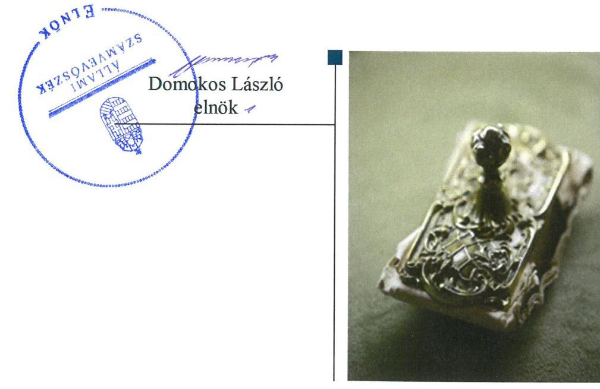
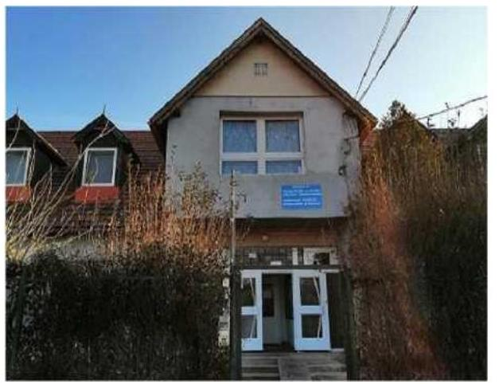

# Jelentés 

## Nem állami humánszolgáltatók ellenőrzése

A humánszolgáltatást nyújtó államháztartáson kívüli szociális intézmények, szolgáltatók fenntartói központi költségvetésből kapott támogatásai felhasználásának ellenőrzése Szociális és Rehabilitációs Alapítvány 2019.

19155
www.asz.hu

---

# Jelentés 

## Nem állami humánszolgáltatók ellenőrzése

A humánszolgáltatást nyújtó államháztartáson kívüli szociális intézmények, szolgáltatók fenntartói központi költségvetésből kapott támogatásai felhasználásának ellenőrzése Szociális és Rehabilitációs Alapítvány
2019. 08. hó 29. nap

---

# AZ ELLENŐRZÉST FELÜGYELTE:

- KAKAS SÁNDOR felügyeleti vezető
- AZ ELLENŐRZÉST VEZETTE ÉS A VÉGREHAJTÁSÁÉRT FELELŐS:
- MOLNÁR ZSUZSANNA ellenőrzésvezető
- A PROGRAM ÖSSZEÁLLÍTÁSÁÉRT FELELŐS:
- TÓTPÁL SZABOLCS osztályvezető

**IKTATÓSZÁM:** EL-1696-001/2019.

**TÉMASZÁM:** 2448

**ELLENŐRZÉS-AZONOSÍTÓ SZÁM:** V083514

Jelentéseink az Országgyűlés számítógépes hálózatán és az Interneta a www.asz.hu címen is olvashatóak.

---

# TARTALOMJEGYZÉK 

■ ÖSSZEGZÉS ..... 5
■ AZ ELLENŐRZÉS CÉLJA ..... 6
■ AZ ELLENŐRZÉS TERÜLETE ..... 7
■ AZ ELLENŐRZÉS HÁTTERE, INDOKOLTSÁGA ..... 8
■ A JELENTÉS LÉNYEGES KÉRDÉSKÖREI ..... 9
■ AZ ELLENŐRZÉS HATÓKÖRE ÉS MÓDSZEREI ..... 10
■ MEGÁLLAPÍTÁSOK ..... 12
■ JAVASLATOK ..... 14
■ MELLÉKLETEK ..... 15
I. sz. melléklet: Értelmező szótár ..... 15
■ FÜGGELÉKEK ..... 17
I. sz. függelék a jelentéshez ..... 17
II. sz. függelék: Észrevételek ..... 18
■ RÖVIDÍTÉSEK JEGYZÉKE ..... 19

---

.

---

# ÖSSZEGZÉS 

A Szociális és Rehabilitációs Alapítvány intézményei müködési kereteit a jogszabályi előírások szerint kialakította, megteremtette az intézmények müködtetésének feltételeit. Nem biztositotta azonban a költségvetési támogatások cél szerinti felhasználásának átláthatóságát. A közszolgáltatás igénybevétele feltételeinek átláthatóságát megteremtette.

## Az ellenőrzés társadalmi indokoltsága

Az Állami Számvevőszék stratégiájában célul tűzte ki, hogy az államháztartáson kívülre nyújtott költségvetési támogatások ellenőrzésével hozzájáruljon ahhoz, hogy a közpénzeket az államháztartáson kívüli szervezetek is átlátható módon használják fel a közfeladatok szerződésben vállalt ellátása érdekében. Tekintettel az elmúlt években a szociális területet érintő finanszírozási változásokra a társadalom fokozott érdeklődéssel figyeli a szociális feladatokra fordított források felhasználását. Fontos a közvéleményt biztosítani arról, hogy a közpénz államháztartáson kívüli felhasználása ezen a területen sem marad ellenőrizetlenül. Az ellenőrzés eredményeképpen a nyilvánosság és a szolgáltatást igénybe vevők megfelelő tájékoztatást kaphatnak az államháztartáson kívüli közfeladatot ellátók működéséről.

A Szociális és Rehabilitációs Alapítványnál végzett ellenőrzést további társadalmi elvárás is indokolta tevékenységéből adódóan, mivel szociális közfeladat ellátására több mint 430 millió Ft központi költségvetési támogatásban részesült az Alapítvány az ellenőrzött időszakban.

## Főbb megállapítások, következtetések, javaslatok

A Szociális és Rehabilitációs Alapítvány belső szabályozásának a jogszabályi előírások szerinti kialakításával megteremtette a közfeladat ellátás szabályszerű működési és gazdálkodási környezetét.

A közfeladat ellátására igénybevett támogatások számviteli rendben történő kezelése, valamint 2015. november 28. és 2017. december 31. között a támogatások felhasználásának nyilvántartása nem a jogszabályi előírások szerint történt, ezáltal a támogatások cél szerinti felhasználása nem volt átlátható.

A humánszolgáltatást végző intézmények működési kereteit szabályszerűen kialakította. Az intézményi térítési díjak meghatározásával biztosította a közszolgáltatás igénybevétele feltételeinek átláthatóságát.

A számviteli beszámolójára vonatkozó közzétételi kötelezettségének eleget tett. Gyermekvédelmi szolgáltató tevékenységet ellátó intézményei vonatkozásában nem látta el ellenőrzési, értékelési feladatait.

Az Állami Számvevőszék a jelentésben foglalt megállapítások alapján a Szociális és Rehabilitációs Alapítvány kuratóriumi elnökének kettő javaslatot fogalmazott meg. A javaslatokat megalapozó megállapításokra az érintettnek 30 napon belül intézkedési tervet kell készítenie.

---

# AZ ELLENŐRZÉS CÉLJA

**AZ ELLENŐRZÉS CÉLJA** annak értékelése, hogy a Szociális és Rehabilitációs Alapítvány központi költségvetésből kapott támogatásainak felhasználása szabályszerű volt-e, a támogatások igénylése, évközi módosítása és év végi elszámolása megfelelte-e a jogszabályi előírásoknak.

---

# AZ ELLENŐRZÉS TERÜLETE 

## Szociális és Rehabilitációs Alapítvány, mint intézményfenntartó

A Szociális és Rehabilitációs Alapítványt két magánszemély alapította 1999-ben azzal a céllal, hogy hogy segítséget nyújtsanak a hajlékkal nem rendelkezőknek. A Fenntartó ${ }^{1}$ székhelye Budapesten van.

A Fenntartó közhasznú jogállású szervezet volt, alaptevékenységén kívül vállalkozási tevékenységet az ellenőrzött időszakban nem folytatott.

Ügyvezető szerve a három főből álló kuratórium volt. A Fenntartó képviseletét a kuratórium elnöke látta el, akinek személyében nem történt változás az ellenőrzött időszakban.

A Fenntartó szociális közfeladatait önálló jogi személyiséggel nem rendelkező, országos ellátási területtel rendelkező intézményei révén látta el. A családok átmeneti gondozási feladatait Budapesten és Csömörön múködő intézményeiben végezte, a hajléktalan személyek rehabilitációs ellátását pedig budapesti intézményében.

A Fenntartó összes bevétele 2015-ben 191,2 M Ft, 2016-ban 193,8 M Ft volt, amely 2017-ben 232,8 M Ft-ra emelkedett. A költségvetési támogatás 2015-ben (137,5 M Ft) összes bevételhez viszonyított aránya 71,9 \% volt, a 2016-ban (143,9 M Ft), 74,3 \% volt, ami 2017-re - 157,4 M Ft-os támogatási összeggel - 67,6 \%-ra csökkent.

---

# AZ ELLENŐRZÉS HÁTTERE, INDOKOLTSÁGA 

A szociális feladatokat ellátó nem állami intézményfenntartók részére közfeladataik ellátására évente jelentős összegű pénzügyi támogatást biztosítottak a mindenkori költségvetési törvények a bennük megfogalmazott feltételek mellett. A felhasználható állami támogatások a Kvtv.-ekben (a 2014. évi C. törvény Magyarország 2015. évi központi költségvetéséről, 2015. évi C. törvény Magyarország 2016. évi központi költségvetéséről, 2016. évi XC. törvény Magyarország 2017. évi központi költségvetéséről) a 2015-2017. években a szociális ágazatra vonatkozóan 273 Mrd Ft előirányzatot határoztak meg. Módosították a szociális igazgatásról és szociális ellátásokról szóló 1993. évi III. törvényt, amely - többek között - 2012. január 1-jei hatállyal megfogalmazta a finanszírozási rendszerbe történő befogadással összefüggő szabályokat.

Az ÁSZ ${ }^{2}$ stratégiájában foglaltak alapján is indokolt az ellenőrzés, amely a társadalom számára jelzi, hogy a közpénz államháztartáson kívüli felhasználása sem maradhat ellenőrizetlenül. Az államháztartáson kívülre nyújtott költségvetési támogatások ellenőrzésével az ÁSZ hozzájárul ahhoz, hogy a közpénzeket a nem állami humán fenntartók átlátható módon használják fel a közfeladatok ellátására kötött szerződésekben vállalt kötelezettségek teljesítése érdekében. Az ellenőrzés javaslataival hozzájárulhat az említett rendszerek szabályszerű támogatás felhasználásához, javíthatja a társa-dalmi-gazdasági döntések megalapozottságát, amely a „jól irányított állam" működéséhez járul hozzá.

A holisztikus megközelítés jegyében az ellenőrzés keretében egyedi kockázatelemzés alapján kiválasztott fenntartóknál és intézményeiknél értékeljük az államháztartáson kívüli szociális tevékenységhez kapcsolódó támogatások felhasználásának megfelelőségét.

---

# A JELENTÉS LÉNYEGES KÉRDÉSKÖREI 

1.     - A Fenntartó szabályszerű müködési - és gazdálkodási környezet kialakításával megteremtette-e a költségvetési támogatások átlátható, elszámoltatható igénybevételének, felhasználásának feltételeit?
2.     - A Fenntartó az átvállalt szociális humánszolgáltatási közfeladathoz biztositott költségvetési támogatásokat szabályszerüen fordította-e a humánszolgáltató intézményei müködtetésére?
3.     - A Fenntartó a szociális humánszolgáltató intézményei müködtetéséhez felhasznált közpénzekre vonatkozó gazdálkodásával a nyilvánosság előtt elszámolt-e, ennek megalapozása érdekében ellenőrzési, értékelési és a külső ellenőrzésekkel kapcsolatos intézkedési feladatait szabályszerüen látta-e el?

---

# AZ ELLENŐRZÉS HATÓKÖRE ÉS MÓDSZEREI 

## Az ellenőrzés típusa

Megfelelőségi ellenőrzés.

## Az ellenőrzött időszak

A 2015. január 1-je és 2017. december 31-e közötti időszak. A helyszíni szemle tekintetében 2018. január 1-jétől az utolsó helyszíni szemle időpontjáig (2019. február 20-ig) tartó időszak.

## Az ellenőrzés tárgya

Az ellenőrzés a szociális humánszolgáltatási közfeladatokat ellátó államháztartáson kívüli fenntartók, humánszolgáltatási közfeladatai ellátásához a költségvetési törvényekben biztosított központi költségvetési támogatások igénylése, évközi módosítása és év végi elszámolása fenntartói feladatainak ellátása, illetve e központi költségvetésből kapott támogatásaik humánszolgáltatási közfeladatokra való fenntartó általi felhasználása szabályszerűségének értékelésére terjedt ki.

## Az ellenőrzött szervezet

A Szociális és Rehabilitációs Alapítvány, mint intézményfenntartó.

## Az ellenőrzés jogalapja

Az ellenőrzés jogszabályi alapját az ÁSZ tv. ${ }^{3}$ 1. § (3) bekezdésében, az 5. § (3) bekezdésében foglalt előírások adták.

## Az ellenőrzés módszerei

Az ellenőrzést az ellenőrzési program szempontjai, kérdései, az ellenőrzött időszakban hatályos jogszabályok alapján, a nemzetközi standardokat irányadónak tekintve, az ellenőrzés szakmai szabályok és módszertanok figyelembe vételével végezte az ÁSZ. A közpénzekkel való felelős gazdálkodás segítésére irányuló javaslatok kidolgozásakor a hatályos jogszabályok voltak az irányadóak.

Az ellenőrzés ideje alatt az ellenőrzött szervezettel történő kapcsolattartást az ÁSZ SZMSZ ${ }^{4}$-ének vonatkozó előírásai alapján biztosította az ÁSZ.

---

Az ellenőrzési kérdések megválaszolásához szükséges bizonyítékok megszerzése az ellenőrzött által rendelkezésre bocsátott dokumentumokra, adatokra alapozva megfigyelés, szemle (szemrevételezés), kérdésfeltevés (információkérés), valamint elemző eljárással történt. Az ellenőrzési bizonyítékként felhasználható adatforrások közé tartoztak egyrészt az ellenőrzési program részletes szempontjainál felsorolt adatforrások, másrészt minden - az ellenőrzés folyamán feltárt, az ellenőrzés szempontjából információt tartalmazó - dokumentum.

Az ellenőrzés lefolytatásához az ellenőrzött szervezet a kitöltött tanúsítványok, valamint az ÁSZ által kért dokumentumok elektronikus úton való megküldésével szolgáltatott adatokat, információkat. Az így rendelkezésre bocsátott adatok, információk és a tanúsítványok adatai valódiságának kontrollja az ellenőrzés keretében történt.

Az ellenőrzést alapvetően a szociális humánszolgáltatások esetében a központi költségvetési támogatások igénylésével, módosításával, felhasználásával, elszámolásával kapcsolatos feladatokat ellátó államháztartáson kívüli fenntartónál végezte az ÁSZ. A fenntartott intézményeknél helyszíni szemle keretében győződött meg a tényleges feladatellátásról (verifikáció).

A szociális humánszolgáltatások központi költségvetési támogatásai igénylésével, módosításával, elszámolásával kapcsolatos, államháztartáson kívüli fenntartó jogszabályokban előírt feladatai betartását, továbbá a központi költségvetési támogatások szabályszerű kezelését, nyilvántartását ellenőrizte az ÁSZ a fenntartónál, az ott rendelkezésre álló határozatok, nyilvántartások, beszámolók és egyéb dokumentumok alapján. Az ellenőrzés nem terjedt ki a szociális humánszolgáltatások központi költségvetési támogatásai igénylése, módosítása, elszámolása valódiságának, megalapozottságának, helyességének - sem a fenntartónál, sem a székhely intézményeinél való - értékelésére (mivel ennek felülvizsgálata, ellenőrzése a finanszírozó jogszabályban előírt feladata, határozatai kiadása előtt).

---

# MEGÁLLAPÍTÁSOK 

## 1. A Fenntartó szabályszerű múködési - és gazdálkodási környezet kialakításával megteremtette-e a költségvetési támogatások átlátható, elszámoltatható igénybevételének, felhasználásának feltételeit?

Összegző megállapítás A Fenntartó kialakította a szabályszerű múködési és gazdálkodási környezetet.

A Fenntartó rendelkezett Alapító okirattal ${ }^{5}$ és SZMSZ-szel ${ }^{6}$, melyek a Ptk.ban ${ }^{7}$ előírtak szerint tartalmazták szervezeti felépítését, múködési rendjét, a felelősségi és hatásköröket, azok gyakorlásának módját, valamint közhasznú és alapcél szerinti tevékenységeit.

A Fenntartó közfeladatait a Gyvt. ${ }^{8}$ előírása szerinti ellátási szerződések alapján végezte.

Rendelkezett a Számv.tv.-ben ${ }^{9}$ előírtak alapján számviteli politikával ${ }^{10}$ és az annak keretében elkészítendő leltározási szabályzattal ${ }^{11}$, értékelési szabályzattal ${ }^{12}$ és pénzkezelési szabályzattal ${ }^{13}$.

A Kincstár ${ }^{14}$ felé a költségvetési támogatások iránti igény benyújtását, 2017-ben a támogatási igény évközi változásának érvényesítését, valamint a támogatásokkal való elszámolását az Atr.-ben ${ }^{15}$ előírtak szerint végezte a Fenntartó.

## 2. A Fenntartó az átvállalt szociális humánszolgáltatási közfeladathoz biztosított költségvetési támogatásokat szabályszerűen fordította-e a humánszolgáltató intézményei müködtetésére?

Összegző megállapítás A Fenntartó a szociális humánszolgáltatási közfeladat ellátására biztosított költségvetési támogatásokat nem szabályszerűen fordította humánszolgáltató intézményei müködtetésére. Intézményei múködési kereteit a jogszabályi előírások szerint kialakította.
2015. november 28. és 2017. december 31. között - a Civil. tv. ${ }^{16}$ 20. § (4) bekezdésében foglaltak ellenére - nem vezetett az alapcél szerinti tevékenysége költségei, ráfordításai ellentételezésére kapott támogatásokról olyan elkülönített számviteli nyilvántartást, melynek alapján támogatásonként megállapítható és ellenőrizhető a kapott támogatás felhasználása.

A Fenntartó a saját és az egyes szolgáltatók gazdálkodását számviteli rendjében - az Atr. 16. § (1) bekezdésében foglaltak ellenére - nem kezelte feladatonként elkülönítve.

---

A Fenntartó a - a Gyvt. előírása szerint - döntött a gyermekvédelmi szolgáltató tevékenységet ellátó intézményei alapító okiratáról ${ }_{1,2}{ }^{17}$. A Szoc. tv. ${ }^{18}$ előírása alapján gondoskodott szociális intézménye SZMSZének ${ }_{3}{ }^{19}$, szakmai programjának ${ }_{3}{ }^{20}$ és házirendjének ${ }_{3}{ }^{21}$ elkészítéséről, a Gyvt. előírása szerint pedig gyermekvédelmi intézményei SZMSZ-ének ${ }_{1,2}$, szakmai programjának ${ }_{1,2}$ és házirendjének ${ }_{1,2}$ jóváhagyásáról.

Az intézmények SZMSZ-ei megfeleltek az 1/2000. (I. 7.) SzCsM rendelet ${ }^{22}$ által előírt tartalmi előírásoknak. A Fenntartó meghatározta - a Szoc. tv. és a Gyvt. előírása szerinti - intézményi térítési díjakat.

Intézményei a müködéséhez szükséges személyi és tárgyi feltételek teljesítését igazoló a - a Szoc. tv., a Gyvt. és az 1/2000. (I.7.) SzCsM rendelet előírása szerinti - szolgáltatói nyilvántartásba bejegyzésre kerültek.

# 3. A Fenntartó a szociális humánszolgáltató intézményei müködtetéséhez felhasznált közpénzekre vonatkozó gazdálkodásával a nyilvánosság előtt elszámolt-e, ennek megalapozása érdekében ellenőrzési, értékelési és a külső ellenőrzésekkel kapcsolatos intézkedési feladatait szabályszerűen látta-e el? 

Összegző megállapítás

A Fenntartó eleget tett beszámolójára vonatkozó közzétételi kötelezettségének. Ellenőrzési és értékelési feladatait nem látta el szabályszerűen, külső ellenőrzésekkel kapcsolatos intézkedési kötelezettségét teljesítette.

A Fenntartó - a Gyvt. 104. § (1) bekezdés e) pontjában előírtak ellenére nem ellenőrizte és nem értékelte a gyermekvédelmi szolgáltató tevékenységet ellátó intézményeinél a szakmai munka eredményességét, a szakmai program végrehajtását, valamint 2017-ben két gyermekvédelmi szolgáltató tevékenységet ellátó intézményénél a gazdálkodás szabályszerűségét és hatékonyságát.

A Fenntartó a 2015-2017. évek egyszerűsített éves beszámolójára és közhasznúsági mellékletére vonatkozó, Civil tv. előírása szerinti letétbe helyezési és közzétételi kötelezettségének eleget tett.

A Fenntartó eleget tett az illetékes kormányhivatalok ${ }^{23}$ által intézményeinél végzett ellenőrzésekhez kapcsolódó intézkedési kötelezettségének.

---

# JAVASLATOK 

Az ÁSZ tv. 33. § (1) bekezdésében foglaltak értelmében az ellenőrzött szervezet vezetője köteles a jelentésben foglalt megállapításokhoz kapcsolódó intézkedési tervet összeállítani és azt a jelentés kézhezvételétől számított 30 napon belül az ÁSZ részére megküldeni. Amennyiben az ellenőrzött szervezet vezetője nem küldi meg határidőben az intézkedési tervet, vagy továbbra sem elfogadható intézkedési tervet küld, az Állami Számvevőszék elnöke az ÁSZ tv. 33. § (3) bekezdése a) és b) pontjaiban foglaltakat érvényesítheti.

## Szociális és Rehabilitációs Alapítvány kuratóriuma elnökének

1. Gondoskodjon a kapott támogatások felhasználására vonatkozóan a jogszabályi előírás szerinti elkülönített számviteli nyilvántartás vezetéséről, valamint az egyes szolgáltatók gazdálkodásának a számviteli rendben történő feladatonkénti elkülönített kezeléséről.
(2. sz. megállapítás 1. és 2. bekezdése alapján)
2. Gondoskodjon a gyermekvédelmi szolgáltató tevékenységet ellátó intézményeinél a szakmai munka eredményességének, a szakmai program végrehajtásának, valamint a gazdálkodás szabályszerűségének és hatékonyságának ellenőrzéséről és értékeléséről.
(3. sz. megállapítás 1. bekezdése alapján)

---

# MELLÉKLETEK 

- I. SZ. MELLÉKLET: ÉRTELMEZŐ SZÓTÁR
költségvetési támogatás
nem állami, nem önkormányzati (államháztartáson kívüli) intézmény fenntartó
a társadalombiztosítás pénzügyi alapjai kivételével az államháztartás központi alrendszeréből ellenérték nélkül, pénzben nyújtott támogatások (Áht. 1. § 14. pont)
A költségvetési törvényekben (2013. évi CCXXX. törvény 33-34. §, 2014. évi C. törvény 42-43. §, 2015. évi C. törvény 40-41. §) megállapított támogatás. Például a 2015. évi C. törvény 40-41. § szerint többek között: Az Országgyűlés a szociális, gyermekjóléti, gyermekvédelmi közfeladatot ellátó intézményt, szolgáltatást fenntartó egyházi jogi személy, civil szervezet, közalapítvány, országos nemzetiségi önkormányzat, települési vagy területi nemzetiségi önkormányzat, gazdasági társaság, és a humánszolgáltatást alaptevékenységként végző, az Szja tv. hatálya alá tartozó egyéni vállalkozó (a továbbiakban együtt: nem állami szociális fenntartó) részére támogatást állapít meg a következők szerint: a támogatás a nem állami szociális fenntartót a települési önkormányzatok 2. melléklet III. pont 3. alpont c)-k) pontjában és III. pont 5. alpont a) pontjában meghatározott támogatásaival azonos jogcímeken, összegben és feltételek mellett illeti meg.
A szociális, gyermekjóléti és gyermekvédelmi közfeladatokat /humánszolgáltatásokat ellátó intézményt fenntartó egyházi jogi személy, társadalmi szervezet, alapítvány, közalapítvány, civil szervezet, országos nemzetiségi önkormányzat, nonprofit gazdasági társaság, gazdasági társaság és a humánszolgáltatást alaptevékenységként végző, Szja tv. hatálya alá tartozó egyéni vállalkozó. (2013. évi Kvtv. 35. § (1), (3) bekezdés, 2014. évi Kvtv. 33. §, 34. § (1), (4) bekezdés, 2015. évi Kvtv. 42. §, 43. § (1), (4) bekezdés, 2016. évi Kvtv. 40. §, 41. § (1), (4) bekezdés, 2017. évi Kvtv. 41. § (1), (4))

---

.

---

# FÜGGELÉKEK 

- I. SZ. FÜGGELÉK A JELENTÉSHEZ

Az Állami Számvevőszék az ellenőrzések során feltárt tényekhez kapcsolódó további körülmények tisztázására eszközrendszerrel nem rendelkezik. Amennyiben az ellenőrzésen túlmutatóan indokoltnak látszik az ellenőrzés során feltárt körülmények további vizsgálata, az Állami Számvevőszék törvényi felhatalmazás alapján az ellenőrzés által feltárt körülményeket továbbítja a hatáskörrel rendelkező szervnek a szükséges intézkedések megtétele, eljárások lefolytatása érdekében.

A Fenntartó 2015. november 28. és 2017. december 31. között nem vezetett a kapott támogatásokról olyan elkülönített számviteli nyilvántartást, melynek alapján támogatásonként megállapítható és ellenőrizhető lett volna a kapott támogatás felhasználása. Ezzel megsértette a Civil.tv. 20. § (4) bekezdésében foglaltakat.
A Fenntartó a saját és az egyes szolgáltatók gazdálkodását számviteli rendjében nem kezelte feladatonként elkülönítve. Ezzel megsértette az Atr. 16. § (1) bekezdésében foglaltakat.
A Fenntartó által szociális közfeladat ellátásra igénybevett költségvetési támogatások összege 2015-ben 137,5 M Ft, 2016-ban 143,9 M Ft, 2017-ben pedig 157,4 M Ft volt.
A közfeladat ellátásra kapott támogatásokkal való gazdálkodás számviteli rendben történő nem jogszabályi előírások szerinti kezelése, valamint a támogatás felhasználás nem szabályszerű nyilvántartása miatt nem volt igazolt a közpénzek támogatási cél szerinti felhasználása.
Az eset konkrét körülményeinek felderítése a Magyar Államkincstár hatásköre.

---

A jelentéstervezetet a Számvevőszék 15 napos észrevételezésre megküldte az ellenőrzött szervezet vezetőjének az ÁSZ tv. 29. §* (1) bekezdése előírásának megfelelően.

A Szociális és Rehabilitációs Alapítvány kuratóriumi elnöke nem tett észrevételt.

[^0]
[^0]:    * 29. § (1) Az Állami Számvevőszék az ellenőrzési megállapításait megküldi az ellenőrzött szervezet vezetőjének vagy az általa megbízott személynek, és annak, akinek személyes felelősségét állapította meg.
    (2) Az ellenőrzött szervezet vezetője és a felelősként megjelölt személy az ellenőrzés megállapításaira tizenöt napon belül írásban észrevételt tehet.
    (3) Az Állami Számvevőszék az észrevételre a beérkezésétől számított harminc napon belül írásban válaszol. A figyelembe nem vett észrevételeket köteles a jelentésben feltüntetni, és megindokolni, hogy azokat miért nem fogadta el.

---

# RÖVIDÍTÉSEK JEGYZÉKE 

${ }^{1}$ Fenntartó
${ }^{2}$ ÁSZ
${ }^{3}$ ÁSZ tv.
${ }^{4}$ ÁSZ SZMSZ
${ }^{5}$ alapító okirat
${ }^{6} \mathrm{SZMSZ}_{1-3}$

## ${ }^{7}$ Ptk.

${ }^{8}$ Gyvt.
${ }^{9}$ Számv.tv.
${ }^{10}$ számviteli politika
${ }^{11}$ leltározási szabályzat
${ }^{12}$ értékelési szabályzat
${ }^{13}$ pénzkezelési szabályzat
${ }^{14}$ Kincstár
${ }^{15}$ Atr.
${ }^{16}$ Civil tv.
${ }^{17}$ intézményi alapító okirat ${ }_{1-2}$
${ }^{18}$ Szoc.tv.
${ }^{19}$ intézményi SZMSZ ${ }_{1-3}$
${ }^{20}$ szakmai program ${ }_{1-3}$

Szociális és Rehabilitációs Alapítvány
Állami Számvevőszék
2011. évi LXVI. törvény az Állami Számvevőszékről (hatályos: 2011. július 1-jétől)

Állami Számvevőszék Szervezeti és Működési Szabályzata
Szociális és Rehabilitációs Alapítvány - Egységes Szerkezetű Alapító Okirat (hatályos: 2014. május 28-tól)
1: Szociális és Rehabilitációs Alapítvány Szervezeti- és működési szabályzata (hatályos: 2014. május 10-től 2016. június 20-ig)
2: Szociális és Rehabilitációs Alapítvány Szervezeti- és működési szabályzata (hatályos: 2016. június 21-től 2017. július 1-ig)
3: Szociális és Rehabilitációs Alapítvány Szervezeti- és működési szabályzata (hatályos: 2017. július 2-tól)
2013. évi V. törvény a Polgári Törvénykönyvről (hatályos: 2014. március 15-től)
1997. évi XXXI. törvény a gyermekek védelméről és a gyámügyi igazgatásról (hatályos: 1997. szeptember 1-jétől)
2000. évi C. törvény a számvitelről (hatályos: 2001. január 1-jétől)

Szociális és Rehabilitációs Alapítvány Számviteli szabályok (hatályos: 2014. július 1-jétől)
Szociális és Rehabilitációs Alapítvány Leltározási szabályzat (hatályos: 2014. július 1-jétől)
Szociális és Rehabilitációs Alapítvány Értékelési szabályzat (hatályos: 2014. július 1-jétől)
Szociális és Rehabilitációs Alapítvány Pénzkezelési szabályzat (hatályos: 2014. július 1-jétől)
Magyar Államkincstár
489/2013. (XII. 18.) Korm. rendelet az egyházi és nem állami fenntartású szociális, gyermekjóléti és gyermekvédelmi szolgáltatók, intézmények és hálózatok állami támogatásáról (hatályos: 2014. január 1-től)
Az egyesülési jogról, a közhasznú jogállásról, valamint a civil szervezetek müködéséről és támogatásáról szóló 2011. évi CLXXV. törvény (hatályos: 2011. december 22-től
1: Alapító Okirat - Családok Átmeneti Otthonai (Budapest)
2: Alapító Okirat - Csömöri Családok Átmeneti Otthonai (Csömör)
A szociális igazgatásról és szociális ellátásokról szóló 1993. évi III. törvény (hatályos: 1993. február 26-tól)
1: Szociális és Rehabilitációs Alapítvány Családok Átmeneti Otthonai Szervezeti és Müködési Szabályzatai (Budapest)
2: Szociális és Rehabilitációs Alapítvány Csömöri Családok Átmeneti Otthonai Szervezeti és Müködési Szabályzatai (Csömör)
3: Hajléktalan Férfiak Rehabilitációs Intézménye Szervezeti és Müködési Szabályzatai (Budapest)
1: Szivárvány Családok Átmeneti Otthona (Budapest) szakmai program
2: Családok Átmeneti Otthona (Csömör) szakmai program
3: Hajléktalan Férfiak Rehabilitációs Intézete (Budapest) szakmai program

---

${ }^{21}$ házirend ${ }_{3-3}$
${ }^{22} 1 / 2000$. SzCsM rendelet
${ }^{23}$ illetékes kormányhivatalok

1: Szivárvány Családok Átmeneti Otthona (Budapest) Házirend
2: Családok Átmeneti Otthona (Csömör) Házirend
3: Hajléktalan Férfiak Rehabilitációs Intézménye Házirend
1/2000. (I. 7.) SzCsM rendelet - a személyes gondoskodást nyújtó szociális intézmények szakmai feladatairól és múködésük feltételeiről (hatályos: 2000. január 22-től)
Budapest Főváros Kormányhivatala és a Pest Megyei Kormányhivatal

---

ÁLLAMI SZÁMVEVŐSZÉK
1052 Budapest, Apáczai Csere János utca 10.
Levélcím: 1364 Budapest 4. Pf. 54
Telefon: +36 14849100 Telefax: +36 14849200
www.asz.hu