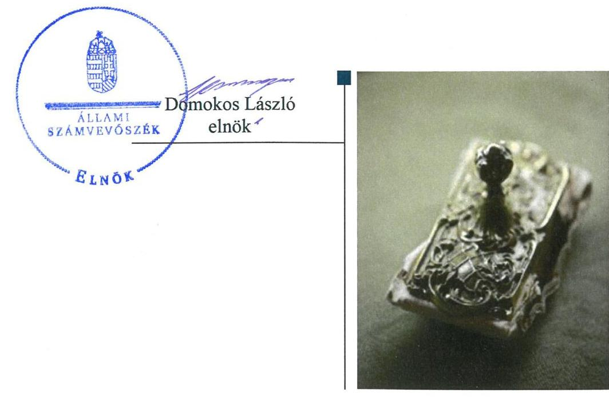

# Jelentés 

## Utóellenőrzések

A központi alrendszer egyes intézményei pénzügyi és vagyongazdálkodás ellenőrzése - Magyar Gyula Kertészeti Szakgimnázium és Szakközépiskola
2019. 08. hó 09. nap

---

|  J | AZ ELLENŐRZÉST FELÜGYELTE:  |
| --- | --- |
|   | CZÉGÉNY GYULA felügyeleti vezető  |
|   | AZ ELLENŐRZÉST VEZETTE ÉS A VÉGREHAJTÁSÁÉRT FELELŐS:  |
|   | SALAMIN VIKTOR ellenőrzésvezető  |
|   | A PROGRAM ÖSSZEÁLLÍTÁSÁÉRT FELELŐS:  |
|   | TÓTPÁL SZABOLCS osztályvezető  |
|   | A TÉMÁHOZ KAPCSOLÓDÓ KORÁBBI SZÁMVEVŐSZÉKI JELENTÉSEK:  |
|   | - címe: Jelentés - A központi alrendszer egyes intézményei pénzügyi és vagyongazdálkodásának ellenőrzése ellenőrzéséről - Magyar Gyula Kertészeti Szakképző Iskola  |
|  Jelentéseink az Országgyúlés számítógépes hálózatán és az Interneten a www.asz.hu címen is olvashatóak. | - sorszáma: 17096  |
|   | IKTATÓSZÁM: EL-1697-001/2019.  |
|   | TÉMASZÁM: 2460  |
|   | ELLENŐRZÉS-AZONOSÍTÓ SZÁM: V080460  |

---

# TARTALOMJEGYZÉK 

■ ÖSSZEGZÉS ..... 5
■ AZ ELLENŐRZÉS CÉLJA ..... 6
■ AZ ELLENŐRZÉS TERÜLETE ..... 7
■ AZ ELLENŐRZÉS HÁTTERE, INDOKOLTSÁGA ..... 8
■ A JELENTÉS LÉNYEGES KÉRDÉSKÖRE ..... 9
■ ELLENŐRZÉS HATÓKÖRE ÉS MÓDSZEREI ..... 10
■ MEGÁLLAPÍTÁSOK ..... 12
■ MELLÉKLETEK ..... 15
I. sz. melléklet: Magyar Gyula Kertészeti Szakgimnázium és Szakközépiskola intézkedési terve végrehajtásának értékelése ..... 15
■ FÜGGELÉK: ÉSZREVÉTELEK ..... 19
■ RÖVIDÍTÉSEK JEGYZÉKE ..... 21

---

.

---

# ÖSSZEGZÉS 

Az Állami Számvevőszék a Magyar Gyula Kertészeti Szakgimnázium és Szakközépiskola utóellenőrzése során megállapította, hogy a Magyar Gyula Kertészeti Szakgimnázium és Szakközépiskola az intézkedési tervekben vállalt feladatokat maradéktalanul végrehajtotta, ennek eredményeképpen a szabályozottság, a pénzügyi gazdálkodás szabályszerűsége, a belső kontrollrendszer működése javult, a vagyongazdálkodás területén a kockázatok csökkentek.

## Az ellenőrzés társadalmi indokoltsága

Az Állami Számvevőszék stratégiájában célul tűzte ki a számvevőszéki munka hasznosulásának javítását. Ezzel összhangban ellenőrzi, hogy az ellenőrzött szervezetek megvalósították-e a korábbi ellenőrzései által feltárt hibák, hiányosságok és szabálytalanságok megszüntetése céljából elkészített intézkedési tervekben foglaltakat. A rendszeres utóellenőrzések hozzájárulnak a szükséges intézkedések tényleges végrehajtásához, ezáltal a közpénzügyek rendezettségének javulásához.

## Főbb megállapítások, következtetések

A Magyar Gyula Kertészeti Szakgimnázium és Szakközépiskola vezette az intézkedési tervekben meghatározott feladatok végrehajtásáról a jogszabály által előírt nyilvántartást. Az erről szóló beszámolót az irányító szerv részére a jogszabály előírása szerint megküldte.

Az Állami Számvevőszék részére megküldött intézkedési tervben meghatározott nyolc feladatot a Magyar Gyula Kertészeti Szakgimnázium és Szakközépiskola határidőben végrehajtotta.

A Magyar Gyula Kertészeti Szakgimnázium és Szakközépiskola a szabályozottság javítása érdekében a jogszabály előírása szerint elfogadta Szervezeti és Működési Szabályzatát. A Magyar Gyula Kertészeti Szakgimnázium és Szakközépiskola a belső kontroll szerinti elszámoltathatóság javítása érdekében gondoskodott a jogszabály által előírt nyilvántartás megfelelő tartalommal történő vezetéséről. A pénzügyi gazdálkodás szabályszerűségének javítása érdekében a Magyar Gyula Kertészeti Szakgimnázium és Szakközépiskola gondoskodott a tévesen kiszámlázott bérleti díj javításáról, az elmaradt bevétel beszedéséről. A vagyongazdálkodás területén a kockázatok csökkentek, az Intézmény gondoskodott a visszterhes szerződések és a nemzeti vagyon hasznosítására vonatkozó szerződések esetében a szervezet képviselője átláthatósági nyilatkozatának bekéréséről.

---

# AZ ELLENŐRZÉS CÉLJA 

Az ellenőrzés célja annak értékelése volt, hogy a számvevőszéki jelentésben ${ }^{1}$ foglalt javaslatot megalapozó megállapításokkal összhangban készített intézkedési tervben meghatározott feladatokat az ellenőrzött szervezet végrehajtotta-e.

---

# AZ ELLENŐRZÉS TERÜLETE 

## Magyar Gyula Kertészeti Szakgimnázium és Szakközépiskola

A Magyar Gyula Kertészeti Szakgimnázium és Szakközépiskola az Nktv. ${ }^{2}$ alapján létrejött köznevelési intézmény, amelynek közfeladata szakmai középfokú oktatás nyújtása. Az alapellenőrzésben érintett ellenőrzött időszakban a mezőgazdasági szakmacsoportba tartozó szakképzést és szakközépiskolai, szakgimnáziumi ágazati képzést (kertészet, parképítés) folytatott. Az Intézmény³ 2013. augusztus 1-től önállóan működő és gazdálkodó költségvetési szerv volt országos működési körrel. Az alapítói, fenntartói és irányítói jogokat 2010-től a Vidékfejlesztési Minisztérium, 2014-től a Földművelésügyi Minisztérium, illetve 2018-tól az Agrárminisztérium gyakorolta. Az igazgató és a gazdasági vezető személye az ellenőrzéssel érintett időszakban többször változott.

Az ÁSZ ${ }^{4}$ a 2017. évben ellenőrizte az Intézmény pénzügyi és vagyongazdálkodását a 2013. augusztus 1. és 2015. december 31. közötti időszakra vonatkozóan. Az ellenőrzés célja annak értékelése volt, hogy az ellenőrzött intézményre vonatkozó irányító szervi feladatellátás a jogszabályi előírások betartásával történt-e; az intézménynél a belső kontrollrendszer kialakítása és működtetése szabályszerű volt-e; kialakították-e az erőforrásokkal való szabályszerű, gazdaságos, hatékony és eredményes gazdálkodás követelményeit; szabályszerű volt-e a beszámolási és adatszolgáltatási kötelezettségek teljesítése; az intézmény pénzügyi és vagyongazdálkodása megfelelt-e a jogszabályi előírásoknak és belső szabályzatainak. Az erről készített 17096. számú számvevőszéki jelentését az ÁSZ 2017. június 28-án hozta nyilvánosságra.

Az utóellenőrzés a számvevőszéki jelentésben megfogalmazott intézkedést igénylő megállapításokra és javaslatokra készített intézkedési terv ${ }^{5}$ ben foglalt feladatok végrehajtásának ellenőrzésére, értékelésére irányult.

---

# AZ ELLENŐRZÉS HÁTTERE, INDOKOLTSÁGA 

Az ÁSZ tv. ${ }^{6}$ 33. § (1) bekezdése értelmében a számvevőszéki jelentések intézkedést igénylő megállapításaihoz és javaslataihoz kapcsolódóan az ellenőrzött szervezetek vezetője intézkedési tervet köteles összeállítani, és az Állami Számvevőszék részére megküldeni.

Az ÁSZ által befogadott intézkedési tervben foglaltak megvalósítását - az ÁSZ tv. 33. § (7) bekezdésében foglaltak alapján - az Állami Számvevőszék utóellenőrzés keretében ellenőrizheti. Az utóellenőrzések keretében - az intézkedések értékelése során - az Állami Számvevőszék figyelembe veszi az ellenőrzött szervezetek működési feltételeiben, valamint a jogszabályi előírásokban bekövetkezett változásokat.

Az utóellenőrzés során az ÁSZ értékeli, hogy az érintett számvevőszéki jelentésben foglalt megállapításokkal és javaslatokkal összhangban, az ellenőrzött szervezet által készített intézkedési tervben meghatározott feladatokat a feladatra kijelöltek végrehajtották-e.

Az intézkedések végrehajtásával az adott terület szabályszerű működése vonatkozásában a kockázatok csökkenhetnek, azonban hosszabb távon az intézkedési tervben foglaltak végrehajtásával önmagában nem szűnnek meg, csak akkor, ha beépülnek az ellenőrzött szervezet működésébe, azokat folyamatosan karbantartják, figyelembe véve, illetve kezelve a változásokat. Emellett az intézkedések végrehajtásáig újabb kockázatok merülhetnek fel a szabályszerű működés vonatkozásában, amelyek kezelése szintén kiemelten fontos az ellenőrzött szervezet számára.

Az ellenőrzött szervezet vezetője által készített intézkedési tervekben foglalt feladatok hiányos, illetve késedelmes végrehajtása, vagy annak elmaradása a szabályszerűség és a felelős vezetői magatartás vonatkozásában kockázatot hordoz, ami azt mutatja, hogy az ellenőrzések során feltárt hibák, hiányosságok és szabálytalanságok kezelése nem kapott kellő hangsúlyt. Az utóellenőrzés során is fennálló szabálytalanságok esetén a közpénz, közvagyon veszélyeztetettségi kockázat valószínűsített hatásának értékelése további intézkedéseket vonhat maga után.

Az ellenőrzött szervezet szintjén az utóellenőrzés feltárja, hogy a szervezet az intézkedések végrehajtásával hasznosította-e a korábbi ellenőrzési jelentésben a hiányosságok megszüntetése, illetve a kockázatok kezelése érdekében megfogalmazott javaslatokat, illetve az intézkedések végrehajtása elmaradásának következtében továbbra is fennálló szabálytalanság esetén értékeli a közpénzek, közvagyon veszélyeztetettségét.

Az ÁSZ szintjén az utóellenőrzés visszacsatolást ad az ellenőrzési jelentések hasznosulásáról, az intézkedések elmaradásának, vagy részleges megvalósulásának a közpénzek, közvagyon veszélyeztetettségére gyakorolt valószínűsített hatásának értékelése, további intézkedéseket vonhat maga után.

---

# A JELENTÉS LÉNYEGES KÉRDÉSKÖRE 

Az ellenőrzött szervezet az intézkedési tervben foglaltakat az előírt határidőben végrehajtotta-e?

---

# ELLENŐRZÉS HATÓKÖRE ÉS MÓDSZEREI 

## Az ellenőrzés típusa

Megfelelőségi ellenőrzés.

## Az ellenőrzött időszak

Az utóellenőrzés alapját képező számvevőszéki jelentés közzétételének napjától az ellenőrzésről szóló kiértesítő levél keltének napjáig, azaz 2017. június 28-tól 2018. október 5-ig tartó időszak.

## Az ellenőrzés tárgya

A számvevőszéki jelentésben foglalt megállapításokkal és javaslatokkal összhangban az Intézmény által készített Intézkedési tervben foglaltak végrehajtásának ellenőrzése.

## Az ellenőrzött szervezet

Magyar Gyula Kertészeti Szakgimnázium és Szakközépiskola

## Az ellenőrzés jogalapja

Az ellenőrzés jogszabályi alapját az ÁSZ tv. 33. § (7) bekezdésének előírásai képezték.

## Az ellenőrzés módszerei

Az ellenőrzést az ellenőrzött időszakban hatályos jogszabályok, az ellenőrzés szakmai szabályai, a jelen ellenőrzésre irányadó ÁSZ módszertanok, az ellenőrzési programban foglalt értékelési szempontok szerint végeztük.

Az ellenőrzés ideje alatt az ellenőrzött szervezettel történő kapcsolattartást az ÁSZ SZMSZ²-ének vonatkozó előírásai alapján biztosítottuk.

Az utóellenőrzés megállapításait az ÁSZ rendelkezésére álló, valamint az ÁSZ adatbekérése szerint az ellenőrzött szervezet által rendelkezésre bocsátott dokumentumok alapozták meg.

Az ellenőrzési bizonyítékként felhasználható adatforrások közé tartoztak egyrészt az ellenőrzési program részletes szempontjainál felsorolt adatforrások, másrészt minden - az ellenőrzés folyamán feltárt, az ellenőrzés szempontjából információt tartalmazó - dokumentum.

---

Az intézkedési tervben előírt feladatokat azok végrehajthatósága, illetve végrehajtása szempontjából az alábbiak szerint értékeltük:
$\longrightarrow$ „határidőben végrehajtott" a feladat, ha a teljesítés dokumentáltan, az intézkedési tervben előírt határidőben és tartalommal megtörtént;
$\longrightarrow$ „határidőn túl végrehajtott" a feladat, ha annak teljesítése az intézkedési tervben meghatározott módon, de az előírt határidőn túl történt meg;
$\longrightarrow$ „részben végrehajtott" a feladat, ha végrehajtása teljes körűen az intézkedési tervben előírt módon nem történt meg;
$\longrightarrow$ „nem végrehajtott" a feladat, ha a végrehajtás nem történt meg, vagy amennyiben a teljesítést nem dokumentálták;
$\longrightarrow$ „okafogyottá vált" a feladat, ha végrehajtására - meghatározott esemény bekövetkezése, továbbá külső körülmény, a működést érintő feltétel változása miatt - már nincs szükség, illetve lehetőség, és egyértelműen megállapítható, hogy az intézkedést szükségessé tevő körülmény a jövőben nem fordulhat elő;
$\longrightarrow$ „nem időszerű" az a feladat, amelynek ellenőrzési időszakon belüli végrehajtására azért nem került (kerülhetett) sor, mert az intézkedés alapjául szolgáló esemény nem következett be, de annak jövőbeni előfordulása lehetséges, a végrehajtása nem volt esedékes, vagy a végrehajtás határideje még nem járt le.
Az ellenőrzés lefolytatásához az ellenőrzött szervezet a tanúsítványok elektronikus kitöltésével, valamint az ÁSZ által kért dokumentumok elektronikus megküldésével szolgáltatott adatokat, amelyek valódiságát és teljes körűségét az ellenőrzött szervezet vezetője által tett teljességi és hitelességi nyilatkozat igazolja. Az így rendelkezésre bocsátott adatok, információk kontrollja az ellenőrzés keretében megtörtént.

---

# MEGÁLLAPÍTÁSOK 

## Az ellenőrzött szervezet az intézkedési tervben foglaltakat az előírt határidőben végrehajtotta-e?

Összegző megállapítás

Az Intézmény vezetője a külső ellenőrzésekről beszámolt az irányító szervnek. Az Intézmény az intézkedési tervében meghatározott feladatokat végrehajtotta.
1.1. számú megállapítás

Az Intézmény vezetője a külső ellenőrzésekről szóló nyilvántartást vezette, arról a jogszabályi előírás szerint beszámolt az irányító szervnek.

Az Intézmény intézkedési tervében meghatározott feladatok végrehajtásáról a Bkr. ${ }^{8}$ 14. § (1) bekezdésében előírt nyilvántartást a Bkr. 47. § (2) bekezdése szerinti tartalommal vezette.

Az Intézmény a Bkr. 14. § (2) bekezdésében rögzített kötelezettségének eleget tett, a tárgyévet követő január 31-ig beszámolt a fejezetet irányító szervnek a külső ellenőrzések javaslatai alapján készült intézkedési tervek végrehajtásáról.
1.2. számú megállapítás

Az Intézmény az intézkedési tervében meghatározott nyolc feladatot határidőben végrehajtotta.

Az ÁSZ a 17096. számú jelentésében az Intézmény igazgatója részére hat javaslatot fogalmazott meg. A hiányosságok és szabálytalanságok megszüntetésére az Intézmény által készített intézkedési tervben meghatározott nyolc - ÁSZ által beazonosított, önmagában értékelhető - feladatot, a végrehajtás határidejét, a felelősöket és a feladatok végrehajtásának értékelését az I. számú melléklet mutatja be.

A SZABÁLYOZOTTSÁG javítása érdekében az Intézmény igazgatója gondoskodott az
 Intézmény Szervezeti és Működési Szabályzatának elfogadásáról a nevelőtestület, az iskolaszék, továbbá az iskolai diákönkormányzat véleményének kikérését követően. (1).

A BELSŐ KONTROLLRENDSZER javítása érdekében a belső ellenőr megtette javaslatait a belső kontrollrendszer szabályszerűségének, gazdaságosságának, hatékonyságának és eredményességének növelése, javítása érdekében, továbbá kiegészítette a belső ellenőrzésekről vezetett nyilvántartást a Bkr. 50. § (2) bekezdése a), b) és e) pontjaiban meghatározott tartalommal (2,3).

## A PÉNZÜGYI GAZDÁLKODÁS SZABÁLYSZERŰSÉGÉNEK javítása érdekében az Intézmény gondoskodott arról, hogy az egy esetben tévesen - alacsonyabb összegben - kiszámlázott bérleti díj utólag javításra, a különbözet befizetésre kerüljön (8).

---

A VAGYONGAZDÁLKODÁS javítása érdekében az Intézmény gondoskodott a vagyonkezelésbe vett vagyonhoz kapcsolódó számviteli bizonylat pótlásáról, valamint beszerezte a vagyonkezelt vagyon tulajdonosának nyilatkozatát arra vonatkozóan, hogy az eszközök csak az Intézmény könyvviteli nyilvántartásaiban szerepelnek (6,7). A vagyongazdálkodás területén a kockázatok további csökkenéséhez hozzájárult továbbá, hogy az Intézmény gondoskodott a visszterhes szerződések, valamint a nemzeti vagyon hasznosítására vonatkozó szerződések esetén a szervezet képviselőjének átláthatóságra vonatkozó nyilatkozatainak bekéréséről (4,5).

---

.

---

# MELLÉKLETEK

■ I. SZ. MELLÉKLET: MAGYAR GYULA KERTÉSZETI SZAKGIMNÁZIUM ÉS SZAKKÖZÉPISKOLA INTÉZKEDÉSI TERVE VÉGREHAJTÁSÁNAK ÉRTÉKELÉSE

|  5 | Az intézkedési tervben rögzített feladat | Az intézkedési tervben meghatározott határidő | Az intézkedési tervben meghatározott felelős | A feladat végrehajtása  |
| --- | --- | --- | --- | --- |
|  1. | Az intézmény Szervezeti és Működési Szabályzatának elfogadása a nevelőtestület, az iskolaszék, továbbá az iskolai diákönkormányzat véleményének kikérésével, melyhez a fenntartó egyetértése szükséges. | 2017. augusztus 31. | Hajnal Sándor igazgató | Az Intézmény a Szervezeti és Működési Szabályzatát a nevelőtestület, az iskolaszék, továbbá az iskolai diákönkormányzat véleményének kikérésével elfogadta.  |
|  2. | A belső kontrollrendszer szabályszerűségének, gazdaságosságának, hatékonyságának és eredményességének növelése, javítása érdekében javaslatok megfogalmazása. | 2017. augusztus 31. | Kovács Zoltánné belső ellenőr | A belső ellenőr megtette javaslatait a belső kontrollrendszer szabályszerűségének, gazdaságosságának, hatékonyságának és eredményességének növelése, javítása érdekében.  |
|  3. | A belső ellenőrzési vezető az elvégzett belső ellenőrzésekről vezetett nyilvántartásába köteles felvezetni az ellenőrzés azonosítóját, az ellenőrzött szerv, illetve szervezeti egységek megnevezését, valamint az ellenőrzés lefolytatásában részt vett vizsgálatvezető, a belső ellenőr és a szakértő nevét. | 2017. augusztus 31. | Kovács Zoltánné belső ellenőr | A belső ellenőr kiegészítette a belső ellenőrzésekről vezetett nyilvántartást 2015. és 2016. évekre vonatkozóan az intézkedési tervben meghatározott tartalommal.  |
|  4. | A 2014.02.07-től hatályba lépett 23/2014. (II.6.) Korm. rendelet alapján a központi költségvetési kiadási előirányzatok terhére jogi személlyel, jogi személyiséggel nem rendelkező szervezettel kötött visszterhes szerződés esetén a szervezet képviselőjének nyilatkozatát be kell kérni arra vonatkozóan, hogy átlátható szervezetnek minősül. Fentiek értelmében a hatályba lépéstől jelenleg is folyamatban lévő szerződésekhez be kell kérni az átláthatósági nyilatkozatokat. | 2017. augusztus 31. | Hajnal Sándor igazgató, Pető Lászlóné gazdasági vezető | Az Intézmény a visszterhes szerződések teljes körére bekérte az átláthatósági nyilatkozatokat.  |

---

|  E
S
Z
A | Az intézkedési tervben rögzített feladat | Az intézkedési tervben meghatározott határidő | Az intézkedési tervben meghatározott felelős | A feladat végrehajtása  |
| --- | --- | --- | --- | --- |
|  5. | A nemzeti vagyon hasznosítására vonatkozó szerződés csak természetes személlyel vagy átlátható szervezettel köthető. A hasznosításra irányuló szerződés határozatlan vagy legfeljebb 15 éves határozott időre köthető, amely időszak egy alkalommal legfeljebb 5 évvel meghosszabbítható abban az esetben, ha a hasznosításra jogosult valamennyi kötelezettségét szerződésszerűen, késedelem nélkül teljesítette. Ez a korlátozás nem vonatkozik az állammal, költségvetési szervvel, önkormányzattal vagy önkormányzati társulással kötött szerződésre. Nemzeti vagyon hasznosítására vonatkozó szerződés kizárólag olyan természetes vagy átlátható szervezettel köthető, amely az átengedett nemzeti vagyon hasznosítására vonatkozó szerződésben vállalja, hogy
a) a hasznosításra vonatkozó szerződésben előírt beszámolási, nyilvántartási, adatszolgáltatási kötelezettségeket teljesíti,
b) az átengedett nemzeti vagyont a szerződési előírásoknak és a tulajdonosi rendelkezéseknek, valamint a meghatározott hasznosítási célnak megfelelően használja,
c) a hasznosításban - a hasznosítóval közvetlen vagy közvetett módon jogviszonyban álló harmadik félként - kizárólag természetes személyek vagy átlátható szervezetek vesznek részt.
A 2016. szeptember 1-től kötött jogi személlyel, jogi személyiséggel nem rendelkező szervezettel kötött visszterhes szerződéseinkhez be kell kérni a szervezet képviselőjének nyilatkozatát arra vonatkozóan, hogy átlátható szervezetnek minősül. | 2017. augusztus 31. | Hajnal Sándor igazgató, Pető Lászlóné gazdasági vezető | Az Intézmény nemzeti vagyon hasznosítására vonatkozó szerződések teljes körére bekérte az átláthatósági nyilatkozatokat.  |
|  6. | Az intézmény kérje meg a tulajdonosi állásfoglalást, hogy a 2014-es beszámoló mérlegében szerepeltetett vagyonkezelésbe vett eszközök csak az intézmény vagyonában szerepelnek, mivel a tulajdonos azt kivezette könyveiből. | 2017. augusztus 31. | Hajnal Sándor igazgató, Pető Lászlóné gazdasági vezető | A tulajdonos elkészítette és 2017. augusztus 17-én e-mailben megküldte állásfoglalását az ellenőrzött szervezet vezetője részére.  |

---

|  E
S
Z
A | Az intézkedési tervben rögzített feladat | Az intézkedési tervben meghatározott határidő | Az intézkedési tervben meghatározott felelős | A feladat végrehajtása  |
| --- | --- | --- | --- | --- |
|  7. | A vagyonkezelésbe vett eszközök könyvvitel rögzítése során nem készült számviteli bizonylat, mivel 2014.06. hó 25-én a KLIK által készített digitális adathordozón szereplő adatok alapján került rögzítésre a könyvelésben. A számviteli bizonylatot utólagosan pótolni szükséges. (A felelősség tisztázásának kérdésében megtett vizsgálatom eredményeképpen úgy ítélem meg, hogy a tényleges állapot létrehozására tett könyvelési intézkedéssel egyetértettem, a vagyon kezelési szerződés aláírásának elhúzódása nem ráható fel az intézmény hibájának. A digitális adathordozón szereplő adatokat a felek elfogadták, azonban a számviteli bizonylat hiányára felhívtam a gazdasági vezető figyelmét az ilyen eset jövőbeni elkerülése érdekében. Egyben felszólítottam a bizonylat pótlására.) | 2017. augusztus 31. | Hajnal Sándor igazgató, Pető Lászlóné gazdasági vezető | A számviteli bizonylat kiállításra került 2017. július 20-án. A vagyonkezelésbe vett eszközök a tulajdonos vagyonkimutatása alapján a 2014. évben a tulajdonosnál vagyonkezelésbe adott eszközként szerepeltek.  |
|  8. | A 2013-as évben egy bérbeadásból származó kiszámlázott bevétel és a bérleti szerződésben meghatározott összeg behajtása. A belső vizsgálat alapján kiderült, hogy a pénztáros rosszul számlázta ki a bérleti díjat. Az akkori megbízott gazdasági vezető nem ellenőrizte a számlázást pénztárellenőrként. Felelősségre vonása nem lehetséges, mivel időközben nyugdíjba vonult a pénztáros és a megbízott gazdasági vezető is távozott az intézményből. A bérlőt levélben értesítettük, hogy tévesen lett kiszámlázva a bérleti díj. A bérlő az összeget az iskola bankszámlájára utalta 2017.06.20-án. | 2017. augusztus 31. | Hajnal Sándor igazgató, Pető Lászlóné gazdasági vezető | Az Intézmény 2017. június 8-án értesítette a bérlőt levélben, hogy tévesen - 5000 Fttal alacsonyabb összegben - került kiszámlázásra a bérleti díj. A bérlő a különbözetet 2017. június 20-án átutalta az iskola bankszámlájára.  |

---

.

---

# FÜGGELÉK: ÉSZREVÉTELEK 

A jelentéstervezetet a Számvevőszék 15 napos észrevételezésre megküldte az ellenőrzött szervezet vezetőjének az ÁSZ tv. 29. § (1) bekezdése előírásának megfelelően.

Amennyiben az ÁSZ tv. 29. § (2) bekezdésében foglaltak alapján az ellenőrzés megállapításaira a jogszabályban előírt határidőig írásban észrevételt tesz, akkor az észrevételét és az ÁSZ arra adott válaszát ebben a fejezetben szerepeltetjük. Amennyiben nem él az észrevételezési jogával, akkor az erre történő utalást jelenítjük meg.

A Magyar Gyula Kertészeti Szakgimnázium és Szakközépiskola igazgatója nem élt az ÁSZ tv. 29. § (2) bekezdésében foglalt észrevételezési jogával, a jelentéstervezetre nem tett észrevételt.

[^0]
[^0]:    * 29. § (1) Az Állami Számvevőszék az ellenőrzési megállapításait megküldi az ellenőrzött szervezet vezetőjének vagy az általa megbízott személynek, és annak, akinek személyes felelősségét állapította meg.
    (2) Az ellenőrzött szervezet vezetője és a felelősként megjelölt személy az ellenőrzés megállapításaira tizenöt napon belül írásban észrevételt tehet.
    (3) Az Állami Számvevőszék az észrevételre a beérkezésétől számított harminc napon belül írásban válaszol. A figyelembe nem vett észrevételeket köteles a jelentésben feltüntetni, és megindokolni, hogy azokat miért nem fogadta el.

---

.

---

# RÖVIDÍTÉSEK JEGYZÉKE 

${ }^{1}$ számvevőszéki jelentés
${ }^{2}$ Nktv.
${ }^{3}$ Intézmény
${ }^{4}$ ÁSZ
${ }^{5}$ intézkedési terv
${ }^{6}$ ÁSZ tv.
${ }^{7}$ ÁSZ SZMSZ
${ }^{8}$ Bkr.

Az Állami Számvevőszék 17096. számú, 2017. június 28-án közzétett, „A központi alrendszer egyes intézményei pénzügyi és vagyongazdálkodásának ellenőrzése Magyar Gyula Kertészeti Szakképző Iskola" című ellenőrzési jelentése
2011. évi CXC. törvény a nemzeti köznevelésről (hatályos: 2012. szeptember 1-jétől)

Magyar Gyula Kertészeti Szakgimnázium és Szakközépiskola
Állami Számvevőszék
Magyar Gyula Kertészeti Szakképző Iskola intézkedési terve (iktatószám: V 1250-106/2016.)
2011. évi LXVI. törvény az Állami Számvevőszékről (hatályos: 2011. július 1-jétől)

Az Állami Számvevőszék Szervezeti és Működési Szabályzata
370/2011. (XII. 31.) Korm. rendelet a költségvetési szervek belső kontrollrendszeréről és belső ellenőrzéséről (hatályos: 2012. január 1-jétől)

---

ÁLLAMI SZÁMVEVŐSZÉK
1052 Budapest, Apáczai Csere János utca 10.
Levélcím: 1364 Budapest 4. Pf. 54
Telefon: +36 14849100 Telefax: +36 14849200
www.asz.hu
