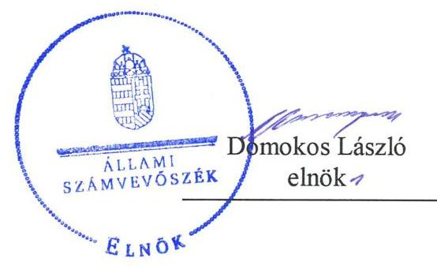
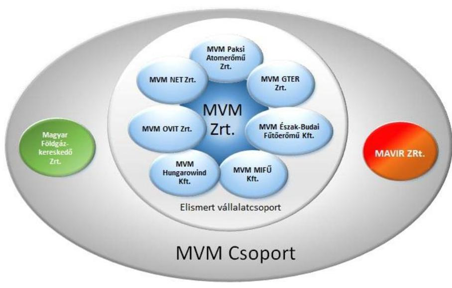
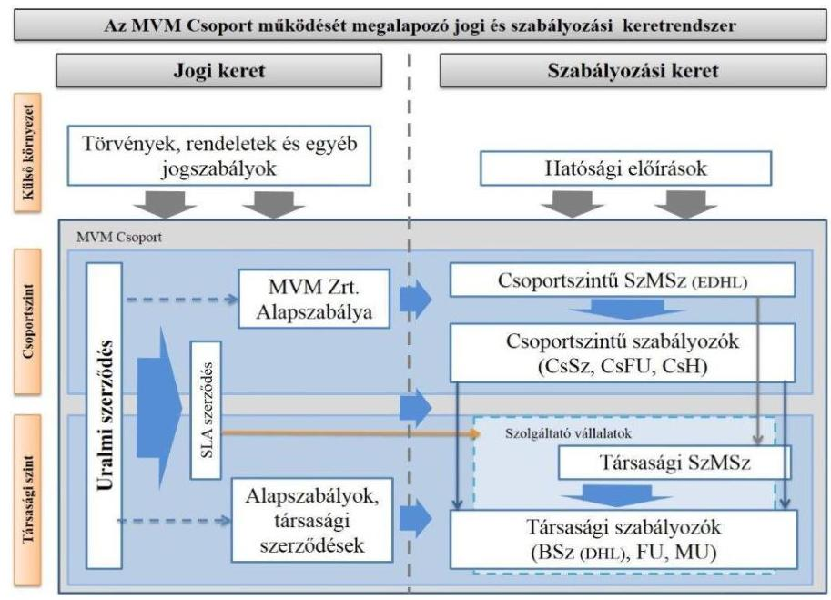
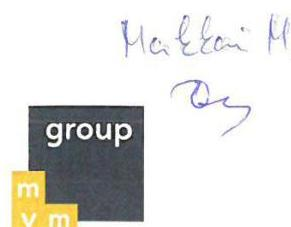
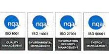
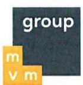
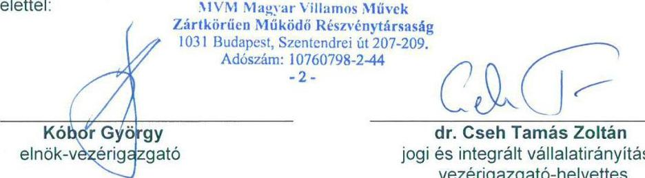
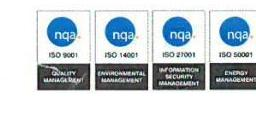
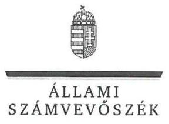
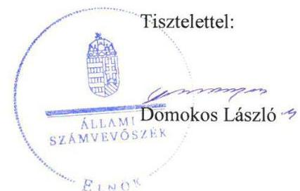

ÁLLAMI
SZÁMVEVŐSZÉK

# Jelentés

## Az MVM Magyar Villamos Művek Zártkörűen Működő Részvénytársaság ellenőrzése

2019.

19157
www.asz.hu

---

# Jelentés 

## Az MVM Magyar Villamos Művek Zártkörűen Működő Részvénytársaság ellenőrzése

2019. 08. hó 21. nap

---

# AZ ELLENŐRZÉST FELÜGYELTE:

## MAKKAI MÁRIA felügyeleti vezető

## AZ ELLENŐRZÉST VEZETTE ÉS A VÉGREHAJTÁSÁÉRT FELELŐS:

### SALI SÁNDORNÉ ellenőrzésvezető

## A PROGRAM ÖSSZEÁLLÍTÁSÁÉRT FELELŐS:

### TÓTPÁL SZABOLCS osztályvezető

IKTATÓSZÁM: EL-1700-001/2019.

TÉMASZÁM: 2489

ELLENŐRZÉS-AZONOSÍTÓ SZÁM: V0833

Jelentéseink az Országgyűlés számítógépes hálózatán és az Interneten a www.asz.hu címen is olvashatóak.

---

# TARTALOMJEGYZÉK 

■ ÖSSZEGZÉS ..... 5
■ AZ ELLENŐRZÉS CÉLJA ..... 6
■ AZ ELLENŐRZÉS TERÜLETE ..... 7
■ AZ ELLENŐRZÉS HÁTTERE, INDOKOLTSÁGA ..... 9
■ A JELENTÉS LÉNYEGES KÉRDÉSKÖREI ..... 10
■ AZ ELLENŐRZÉS HATÓKÖRE ÉS MÓDSZEREI ..... 11
■ MEGÁLLAPÍTÁSOK ..... 13
■ MELLÉKLETEK ..... 17
I. sz. melléklet: Értelmező szótár ..... 17
■ FÜGGELÉK: ÉSZREVÉTELEK ..... 21
■ RÖVIDÍTÉSEK JEGYZÉKE ..... 27

---

.

---

# ÖSSZEGZÉS 

Az MVM Magyar Villamos Művek Zártkörűen Működő Részvénytársaság stratégiai irányító tevékenységét a többségi tulajdonában lévő társaságai felett az előírásokkal összhangban látta el. Az MVM Zrt. a tulajdonosi joggyakorlói tevékenységét az ellenőrzéssel érintett társaságok felett szabályszerűen gyakorolta. A vagyongazdálkodás csoportszintű koordinálásának megvalósításához hozzájárult a központosított pénzgazdálkodási, finanszírozási tevékenység belső előírásokkal összhangban történő ellátása. Az MVM Zrt. közzétételi és adatszolgáltatási kötelezettségét teljesítette.

## Az ellenőrzés társadalmi indokoltsága

Az európai energiaunió keretstratégiájában meghatározott célkitűzések elérése a tagállamok közös erőfeszítését igényli.

A folyamatot az Állami Számvevőszék egyrészt az energiaunió hazai vonatkozásainak, az elért eredményeknek folyamatos nyomon követésével, másrészt az energiaszektort érintő ellenőrzéseivel támogathatja.

Az MVM Magyar Villamos Művek Zártkörűen Működő Részvénytársaság és az MVM Csoport ${ }^{1}$ az energiaunió keretstratégiájában foglalt célkitűzések hazai megvalósításában kulcsfontosságú szerepet játszik. Az MVM Magyar Villamos Művek Zártkörűen Működő Részvénytársaság vezette társaságcsoport működése lefedi a villamosenergia-termelés, villamosenergia-átviteli rendszerirányítás, villamosenergia-kereskedelem, földgáz-tárolás, földgáz-kereskedelem, műszaki szolgáltatások és az infokommunikáció területeit. Az MVM Magyar Villamos Művek Zártkörűen Működő Részvénytársaság, mint holdingközpont alapvetően stratégiai irányító, ellenőrző tevékenységet lát el a tulajdonában álló gazdasági társaságok fölött. Ebbe a tevékenységi körbe tartozik a stratégiai tervezés és döntéshozatal, a társaságcsoport tagjainak felügyelete, valamint a holding központosított pénzgazdálkodási, finanszírozási és vagyongazdálkodási tevékenysége. Az MVM Zrt.-ben lévő állami részesedés a nemzeti vagyon részét képezi és nemzetgazdasági szempontból kiemelt jelentőségű nemzeti vagyon. Az MVM Magyar Villamos Művek Zártkörűen Működő Részvénytársaság és az MVM Csoport által ellátott közszolgáltatások az energiabiztonság fenntartása miatt a közérdeklődés középpontjában állnak.

## Főbb megállapítások, következtetések

Az MVM Magyar Villamos Művek Zártkörűen Működő Részvénytársaság stratégiai irányító tevékenységét az Alapszabályban, valamint a Csoportszintű stratégiákban foglaltak szerint, a Nemzeti Energiastratégia 2030, a Nemzeti Reformprogram ${ }_{1-3}$, valamint az Európa Unió Energia Stratégia 2030 előírásaival összhangban látta el.

Az MVM Zrt. a tulajdonosi jogait az ellenőrzésre kiválasztott társaságok felett szabályszerűen gyakorolta. Az ellenőrzésre kiválasztott társaságok pénzügyi kockázatai kezelésére a kockázatkezelési rendszert kialakította. A javadalmazás szabályozásáról a jogszabály és a belső szabályozók szerint gondoskodott. Az MVM Zrt. a tulajdonosi joggyakorlás kereteinek kialakítása során a MAVIR ZRt. szervezeti és döntéshozatali függetlenségét az előírásnak megfelelően biztosította.

Az MVM Zrt. a vagyongazdálkodás csoportszintű koordinálását szabályszerűen végezte. A részesedésvagyon nyilvántartásáról a kiválasztott társaságok tekintetében a belső előírásnak megfelelően gondoskodott. Az MVM Zrt. a központosított pénzgazdálkodási, finanszírozási tevékenységét, a cash-pool rendszer kialakításával és működtetésével kapcsolatos feladatait a belső szabályozó eszközökkel összhangban látta el.

Az MVM Zrt. a közzétételi és adatszolgáltatási kötelezettségét szabályszerűen teljesítette.

---

# AZ ELLENŐRZÉS CÉLJA 

AZ ELLENŐRZÉS CÉLJA annak megállapítása volt, hogy az MVM Zrt. szabályszerűen látta-e el a stratégiai irányító, ellenőrző, központosított pénzgazdálkodási és vagyongazdálkodási tevékenységét a gazdasági társaságai felett, valamint a közzétételi, adatszolgáltatási kötelezettségét teljesítette-e.

---

# AZ ELLENŐRZÉS TERÜLETE

## Az MVM Magyar Villamos Művek Zártkörűen Működő Részvénytársaság

Az MVM Magyar Villamos Művek Zártkörűen Működő Részvénytársaság 1991-ben a Magyar Villamos Művek Tröszt átalakításával jött létre. Az MVM Zrt.2 jegyzett tőkéje a 2017. év végén 308 401,2 M Ft volt.

Az MVM Zrt. részvényeit a Magyar Állam mellett kisebbségi tulajdonosként három települési önkormányzat, hét természetes és három jogi személy birtokolta 2015. január 1-jétől 2015. június 29-éig. Ezt követően a kisebbségi tulajdonosok részvényei az MVM Zrt. birtokába kerültek. Az MVM Zrt. egyszemélyes részvénytársasággá vált, a tulajdonosi jogokat a Magyar Állam nevében az MNV Zrt.3 gyakorolta. Az MVM Zrt. ügyvezetését az ellenőrzött időszakban az Igazgatóság4 látta el, továbbá az MVM Zrt.-nél FB5 működött.

A Gt.6-ben szabályozott jogi keretek alapján 2007. június 1-jén az MVM Zrt. és leányvállalatai elismert vállalatcsoporttá alakultak. Az elismert vállalatcsoport uralkodó tagja az MVM Zrt. volt. Az ellenőrzött időszakban az elismert vállalatcsoport egységes üzletpolitikán alapuló együttműködése a Ptk.7 3:49-62. § előírásain alapult. A MAVIR ZRt. a VET8 100-105/A §-aiban, a Magyar Földgázkereskedő Zrt. a GET9 120-121/I §-aiban meghatározott, szervezeti függetlenségüket előíró szétválasztási szabályok miatt nem tartoztak az elismert vállalatcsoport tagjai közé.

Az MVM Csoport társaságaiból az ÁSZ által ellenőrzésre kiválasztott kilenc társaságot az 1. ábra szemlélteti.

1. ábra

*Forrás: ÁSZ szerkesztés*

---

Az MVM Csoport társaságainak fő tevékenységi körébe az ellenőrzött időszakban átviteli rendszerirányítás, villamosenergia-termelés és kereskedés, földgáz-kereskedelem és tárolás, részvétel a régió villamosenergia-piacán, valamint távközlési szolgáltatások nyújtása tartozott.

Az ellenőrzött időszakban az MVM Csoport működésének jogi és szabályozási keretrendszerét a 2. ábra szemlélteti.
2. ábra

Forrás: Az MVM CSOPORT Szervezeti és Működési Szabályzata (2017. november 1.)
Az MVM Csoport a 2006. évben cash-pool rendszert vezetett be, amely alapján a tagvállalatok a csoportszinten elérhető pozitív cash-pool egyenleget szabadon felhasználhatták, azaz a tagvállalatok finanszírozhatták egymást szabad forrásaik terhére. Az ellenőrzött időszakban az MVM Észak-Budai Fűtőerőmű Kft. és az MVM MIFŰ Kft. nem volt tagja a cash-pool rendszernek.

Az ÁSZ Magyarország területén végez ellenőrzéseket. A folyamatban lévő hatósági eljárással érintett ügyekre az ÁSZ ellenőrzése nem terjedt ki.

---

# AZ ELLENŐRZÉS HÁTTERE, INDOKOLTSÁGA 

Az MVM Zrt. vezette holding működése lefedi a villamosenergia-termelés, villamosenergia-átviteli rendszerirányítás, villamosenergia-kereskedelem, földgáz-tárolás, földgáz-kereskedelem, műszaki szolgáltatások és az infokommunikáció területeit. Az MVM Zrt., mint holdingközpont alapvetően stratégiai irányító, ellenőrző tevékenységet lát el a tulajdonában álló gazdasági társaságok fölött. Ebbe a tevékenységi körbe tartozik a stratégiai tervezés és döntéshozatal, a társaság-csoport tagjainak felügyelete, valamint a holding központosított pénzgazdálkodási, vagyongazdálkodási tevékenysége. Az MVM Zrt-ben lévő állami részesedés a nemzeti vagyon részét képezi és nemzetgazdasági szempontból kiemelt jelentőségű nemzeti vagyon. Az MVM Zrt. és az MVM Csoport az ellátott közszolgáltatások, az energiabiztonság fenntartása miatt a közérdeklődés középpontjában állnak.

---

# A JELENTÉS LÉNYEGES KÉRDÉSKÖREI 

1.     - Az MVM Zrt. az előírásoknak megfelelően látta-e el a stratégiai irányító tevékenységét a többségi tulajdonában lévő társaságai felett?
2.     - Az MVM Zrt. szabályszerűen látta-e el a tulajdonosi joggyakorlói tevékenységét a kiválasztott társaságok felett?
3.     - Az MVM Zrt. a vagyongazdálkodás csoportszintű koordinálását, valamint a központosított pénzgazdálkodási, finanszírozási tevékenységét az előírásoknak megfelelően látta-e el a kiválasztott társaságok vonatkozásában?
4.     - Az MVM Zrt. eleget tett-e a közzétételi és adatszolgáltatási kötelezettségének?

---

# AZ ELLENŐRZÉS HATÓKÖRE ÉS MÓDSZEREI 

## Az ellenőrzés típusa

Megfelelőségi ellenőrzés.

## Az ellenőrzött időszak

A 2015-2017. évekre terjedt ki.

## Az ellenőrzés tárgya

Az ellenőrzés tárgya kiterjedt az MVM Magyar Villamos Művek Zártkörűen Működő Részvénytársaság stratégiai irányító, ellenőrző valamint központosított pénzgazdálkodási és vagyongazdálkodási tevékenységének szabályszerűségére, valamint a közzétételi és adatszolgáltatási kötelezettségének teljesítésére.

## Az ellenőrzött szervezet

MVM Magyar Villamos Művek Zártkörűen Működő Részvénytársaság

## Az ellenőrzés jogalapja

Az ÁSZ tv. ${ }^{10}$ 1. § (3) bekezdése, 5. § (3)-(5) bekezdése.

## Az ellenőrzés módszerei

A kockázatalapú mintavétel során kiválasztott kilenc társaság

- MAVIR ZRt.
- Magyar Földgázkereskedő Zrt.
- MVM OVIT Zrt.
- MVM Paksi Atomerőmű Zrt.
- MVM Észak-Budai Fűtőerőmű Kft.
- MVM GTER Zrt.
- MVM MIFŰ Kft.
- MVM Hungarowind Kft.
- MVM NET Zrt.

Az ellenőrzést az ellenőrzési program szempontjai, az ellenőrzött időszakban hatályos jogszabályok, az ellenőrzés szakmai szabályai, a jelen ellenőrzésre irányadó ÁSZ módszertanok figyelembevételével végeztük.

Az ellenőrzési kérdések megválaszolásához szükséges bizonyítékok megszerzése az ellenőrzött által rendelkezésre bocsátott dokumentumokra, adatokra alapozva megfigyelés, szemle (szemrevételezés), kérdésfeltevés (információkérés), kockázatalapú mintavételezés, valamint elemző eljárás útján történt.

Az MVM Csoportot az MVM Zrt. és a számviteli konszolidációs körébe tartozó leányvállalatai alkották. Az ellenőrzési program 2-4. fókuszkérdése - a 2.4. alkérdés kivételével - a kockázatalapú mintavétel során kiválasztott kilenc társaság ${ }^{11}$ vonatkozásában került ellenőrzésre. A 2.4. alkérdés tekintetében az ellenőrzésre kiválasztott társaság a MAVIR ZRt. volt.

---

Az ellenőrzési bizonyítékként felhasználható adatforrások közé tartoztak az ellenőrzési program elkészítéséhez előzetesen bekért dokumentumok, az ellenőrzési programban felsorolt adatforrások, továbbá minden az ellenőrzés folyamán - feltárt, az ellenőrzés szempontjából információkat tartalmazó dokumentum. Az ellenőrzést a kérdésekre adott válaszok kiértékelésével, valamint a megjelölt adatforrások, a csatolt tanúsítványok felhasználásával, továbbá az adott időszakban hatályos jogszabályok figyelembe vételével kellett lefolytatni.

Az ellenőrzés ideje alatt az ellenőrzött szervezettel történő kapcsolattartást az ÁSZ SZMSZ ${ }^{12}$-ének vonatkozó előírásai alapján biztosítottuk.

---

# 1. Az MVM Zrt. az előírásoknak megfelelően látta-e el a stratégiai irányító tevékenységét a többségi tulajdonában lévő társaságai felett? 

Összegző megállapítás

Az MVM Zrt. stratégiai irányító tevékenységét a többségi tulajdonában lévő társaságai felett az előírásokkal összhangban látta el.

AZ MVM ZRT. STRATÉGIAI TERVEZÉSE az MVM Csoportra vonatkozóan a Nemzeti Energiastratégia 2030 ${ }^{13}$, a Nemzeti Reformprogram ${ }_{1-3}{ }^{14}$, valamint az Európa Unió Energia Stratégia 2030 ${ }^{15}$ előírásaival összhangban volt.

Az Alapszabályban foglaltak alapján az Igazgatóság megalkotta a 2015. év vonatkozásában az MVM Csoport stratégia menedzsment szabályzat ${ }^{16}$ előírása szerint a Csoportszintű stratégia ${ }_{1}{ }^{17}$-t. Továbbá a 2016-2017. évek vonatkozásában az MVM Csoport csoportszintű stratégiaalkotás, lebontás és megvalósulás követés szabályzat ${ }^{18}$ előírása szerint Csoportszintű stratégia ${ }_{2}{ }^{19}$-t.

Az MVM Zrt. az uralmi szerződésekben ${ }^{20}$ és uralmi klauzulákban ${ }^{21}$ megfogalmazott egységes üzleti koncepciónak megfelelően a Csoportszintű stratégia ${ }_{1,2}$-ben meghatározta - többek között - a biztonságos energiaellátással, a termelő képesség növelésével, a hitelképesség fenntartásával és a humán erőforrás folyamatos biztosításával kapcsolatos célokat. Az MVM Zrt. a Csoportszintű stratégia ${ }_{1,2}$-ben a célok teljesülését mérő mutatókat, mutatószámokat meghatározta, annak összhangja a Nemzeti Energiastratégia 2030, a Nemzeti Reformprogram ${ }_{1-3}$, valamint az Európa Unió Energia Stratégia 2030 előírásaival biztosított volt. Az MVM Zrt. a mutatószámok teljesülését elemzések készítésével, vezetői értekezletek keretében monitorozta az SZMSZ ${ }^{22}$-ben foglalt előírások szerint. Az MVM Zrt. a stratégiai célok megvalósulásának nyomonkövetését elvégezte, az éves stratégiai beszámolókban az eredményeket az Igazgatóság részére bemutatta.

---

# 2. Az MVM Zrt. szabályszerűen látta-e el a tulajdonosi joggyakorlói tevékenységét a kiválasztott társaságok felett? 

Összegző megállapítás

Az MVM Zrt. a tulajdonosi joggyakorlói tevékenységét szabályszerűen látta el.

A TULAJDONOSI JOGGYAKORLÁS kereteit az MVM Zrt. az Alapszabályban, az uralmi szerződésekben és uralmi klauzulákban, valamint a Társaságok ${ }^{23}$ létesítő okirataiban
 a Ptk. előírásaival összhangban alakította ki. A csoportszintű szabályozók ${ }^{24}$ az Alapszabály előírása szerint rögzítették a feladatok, felelősségek, hatáskörök egyértelmű elhatárolását. Az MVM Zrt. az ellenőrzött időszakban egységes ügyviteli, számviteli rendszert - SAP - működtetett.

Az MVM Zrt. a Taktv. ${ }^{25}$, az Alapszabály és az SZMSZ előírásai szerint gondoskodott a Társaságoknál a javadalmazás szabályozásáról. A Társaságok ellenőrzött időszakra vonatkozó javadalmazási szabályzatai a Taktv. 5. § (3) bekezdése szerint tartalmazták a vezető tisztségviselők, felügyelőbizottsági tagok, valamint az Mt. ${ }^{26}$ 208. §-ának hatálya alá eső munkavállalók javadalmazása, valamint a jogviszony megszűnése esetére biztosított juttatások módjának, mértékének elveit, meghatározták annak rendszerét.

Az MVM Zrt. - a saját üzleti tervével összhangban - a Tervezési folyamatutasítás ${ }_{1-3}{ }^{27}$ ban határozta meg a Társaságok részére a csoportszintű egységes tervezési irányelveket, valamint az üzleti tervhez kapcsolódó feladatokat, határidőket. Az Igazgatóság az ellenőrzött időszakban a Társaságok üzleti terveinek megtárgyalásán túl - a jóváhagyást megelőzően - felülvizsgálatot végzett. Az MVM Zrt. a 2015-2017. években a csoportszintű konszolidált üzleti terveket elkészítette, azokat az Igazgatóság jóváhagyta.

Az MVM Zrt. a Ptk. előírása szerint döntött a Társaságok Számv. tv. ${ }^{28}$ szerinti éves beszámolóinak jóváhagyásáról és az eredmény felosztásáról, illetve eredménytartalékba helyezéséről.

A KONTROLLING beszámolási folyamatutasítás ${ }_{1-2}{ }^{29}$-ben az MVM Zrt. meghatározta a kontrolling adatszolgáltatás tartalmát, határidejét és felelősét.

A KOCKÁZATOK KEZELÉSÉNEK keretrendszerét az MVM Zrt. az ellenőrzött időszakban az SZMSZ előírása szerint a Partner és pénzügyi kockázatkezelési szabályzatban ${ }^{30}$, valamint az Integrált vállalati kockázatkezelési szabályzatban ${ }^{31}$ alakította ki.

A BELSŐ AUDITOT az MVM Zrt. az ellenőrzött időszakban kialakította és működtette. Az Igazgatóság az Alapszabály előírása szerint elfogadta a Belső audit szabályzat ${ }_{1-3}{ }^{32}$-ot, amely meghatározta a CSBA ${ }^{33}$ működésének szabályait. Az MVM Zrt. az SZMSZ előírásával összhangban kidolgozta a csoportszintű éves audit terveket, melyeket az FB jóváhagyott. Az MVM Zrt. az éves ellenőrzési tervekben meghatározott ellenőrzéseket elvégezte. Az ellenőrzési jelentésekben megfogalmazott javaslatokra intézkedtek. Az MVM Zrt. az intézkedési tervben foglaltak végrehajtását nyomon követte.

---

A MAVIR ZRT. szervezeti és döntéshozatali függetlenségét a részesedések feletti tulajdonosi joggyakorlás rendjének kialakítása során az MVM Zrt. biztosította. Az MVM Zrt. a tulajdonosi joggyakorlás kereteit a MAVIR ZRt. alapszabályában ${ }^{34}$ meghatározta. A VET előírásával összhangban lévő Megfelelési program ${ }^{35}$ tartalmazta azokat a feltételeket, amelyek biztosították a megkülönböztetés-mentes, független működést. A MAVIR ZRt. felügyelőbizottsága a VET előírása szerint döntött az operatív irányítást ellátó személyek munkaviszonyának létesítéséről, a megfelelési ellenőr kinevezéséről és megbízatásának megszüntetéséről. A MAVIR ZRt.-nél az ellenőrzött időszakban a VET előírása szerint biztosított volt a független döntéshozatal.

# 3. Az MVM Zrt. a vagyongazdálkodás csoportszintű koordinálását, valamint a központosított pénzgazdálkodási, finanszírozási tevékenységét az előírásoknak megfelelően látta-e el a kiválasztott társaságok vonatkozásában? 

Összegző megállapítás

Az MVM Zrt. a vagyongazdálkodás csoportszintű koordinálását, valamint a központosított pénzgazdálkodási, finanszírozási tevékenységét az előírásnak megfelelően végezte.

### 3.1. számú megállapítás

Az MVM Zrt. a vagyongazdálkodás csoportszintű koordinálását az előírásokkal összhangban végezte.

A RÉSZESEDÉSVAGYON nyilvántartásáról az MVM Zrt. az ellenőrzött időszakban a kiválasztott társaságok tekintetében a belső előírásnak megfelelően gondoskodott.

Az Alapszabály előírása szerint az Igazgatóság elfogadta az MVM Csoport Vagyongazdálkodási szabályzatát ${ }^{36}$. A Vagyongazdálkodási szabályzat hatálya a VET előírásaival összhangban a szervezeti és döntéshozatali függetlenség biztosítása érdekében a MAVIR ZRt.-re nem terjedt ki. Az MVM Zrt. a Vagyongazdálkodási szabályzat előírása szerint kialakította az MVM Csoport ingatlanvagyonának és részesedéseinek nyilvántartására vonatkozó információs rendszert, továbbá intézkedett a vagyon nyilvántartásához kapcsolódó adatszolgáltatás egységes kereteinek kialakításáról. Az MVM Zrt. az ellenőrzött időszakban az Alapszabály, valamint a Vagyongazdálkodási szabályzat előírásával összhangban határozta meg az MVM Csoport részére a vagyonváltozást eredményező döntési hatásköröket, biztosítva ezzel a tulajdonosi érdekek érvényesítését.

Az Igazgatóság a Ptk., valamint a Vagyongazdálkodási szabályzat előírása szerint az FB részére negyedévente elkészítette jelentését az ügyvezetésről, a társaság vagyoni helyzetéről és üzletpolitikájáról.

Az MVM Zrt. a Társaságok saját tőke és jegyzett tőke arányára vonatkozó előírások betartását ellenőrizte, intézkedési kötelezettsége nem keletkezett.

Az MVM Zrt. az ellenőrzött időszakban a Csoportszintű stratégia ${ }_{1,2}$-vel összhangban gondoskodott a vagyon bővítését eredményező beruházási döntések koordinálásáról.

---

# 3.2. számú megállapítás 

Az MVM Zrt. a központosított pénzgazdálkodási, finanszírozási tevékenységét az előírások szerint látta el.

AZ MVM CSOPORT LIKVIDITÁSA biztosításának szabályozására vonatkozó kereteket az MVM Zrt. az ellenőrzött időszakban az uralmi szerződésekben, az SZMSZ-ben, valamint a csoportszintű szabályozókban kialakította. Az MVM Zrt. a csoportszintű szabályozók előírása szerint az MVM csoport pénzszükségleteit társasági és csoportszinten felmérte, az SZMSZ előírása alapján a treasury beszámolókat elkészítette.

A tulajdonosi joggyakorló ${ }^{37}$ az MVM Csoporton belüli pénzkölcsön nyújtására vonatkozó finanszírozási kérelmeket a jogszabályi előírások szerint alapítói határozatokban jóváhagyta, az Igazgatóság a szerződések megkötésére vonatkozó részletes feltételeket meghatározta.

Az MVM Zrt. az ellenőrzött időszakban az MVM Csoport minden cashpool tagsággal bíró társasága részére rövid lejáratú hitelkeretet biztosított a cash-pool keret terhére. Egyedi hitelkerettel a Társaságok nem rendelkeztek. A cash-pool rendszer kialakításával és működtetésével kapcsolatos feladatait az MVM Zrt. az ellenőrzött időszakban a belső szabályozó eszközökkel összhangban látta el. Az MVM Csoport cash-pool tagjai külső felekkel nem kötöttek finanszírozási szerződést, illetve nem nyújtottak kölcsönt.

## 4. Az MVM Zrt. eleget tett-e a közzétételi és adatszolgáltatási kötelezettségének?

Összegző megállapítás

Az MVM Zrt. eleget tett a közzétételi és adatszolgáltatási kötelezettségének.

KÖZZÉTÉTELI KÖTELEZETTSÉGÉNEK az MVM Zrt. az ellenőrzött időszakban a Számv. tv. szerinti éves beszámolók, valamint a Taktv.-ben előírt adatok tekintetében eleget tett.

Az MNV Zrt. felé történő adatszolgáltatási kötelezettségének az MVM Zrt. eleget tett. Az MVM Csoport gazdálkodásának alakulásáról szóló tájékoztatást negyedévente, a kontrolling adatszolgáltatást havonta teljesítette.

---

# MELLÉKLETEK 

- I. SZ. MELLÉKLET: ÉRTELMEZŐ SZÓTÁR
állami vagyon
anyavállalat
átviteli engedélyes
cash-pool rendszer
elismert vállalatcsoport
uralmi szerződés
gazdasági társaság
a) Az állam tulajdonában lévő dolog, valamint a dolog módjára hasznosítható természeti erő,
b) az a) pont hatálya alá nem tartozó mindazon vagyon, amely vonatkozásában törvény az állam kizárólagos tulajdonjogát nevesíti,
c) az állam tulajdonában lévő tagsági jogviszonyt megtestesítő értékpapír, illetve az államot megillető egyéb társasági részesedés,
d) az államot megillető olyan immateriális, vagyoni értékkel rendelkező jogosultság, amelyet jogszabály vagyoni értékű jogként nevesít.
e) az állam tulajdonában lévő pénzügyi eszközök
Forrás: Vtv. ${ }^{38}$ 1. § (2) bekezdése
Az a vállalkozó, amely egy másik vállalkozónál (a továbbiakban: leányvállalat) közvetlenül vagy leányvállalatán keresztül közvetetten meghatározó befolyást képes gyakorolni, mert az alábbi feltételek közül legalább eggyel rendelkezik:
a) a tulajdonosok (a részvényesek) szavazatának többségével (50 százalékot meghaladóval) tulajdoni hányada alapján egyedül rendelkezik, vagy
b) más tulajdonosokkal (részvényesekkel) kötött megállapodás alapján a szavazatok többségét egyedül birtokolja, vagy
c) a társaság tulajdonosaként (részvényesként) jogosult arra, hogy a vezető tisztségviselők vagy a felügyelő bizottság tagjai többségét megválassza vagy visszahívja, vagy
d) a tulajdonosokkal (a részvényesekkel) kötött szerződés (vagy a létesítő okirat rendelkezése) alapján - függetlenül a tulajdoni hányadtól, a szavazati aránytól, a megválasztási és visszahívási jogtól - döntő irányítást, ellenőrzést gyakorol.
Forrás: Számv. tv. 3. § (2) 1. pont
A villamos energiáról szóló 2007. évi LXXXVI. törvény 14-23. § szerinti átviteli rendszerirányításra vonatkozó működési engedély birtokosa)
csoportos számlavezetés, "Kiskincstári" rendszer, amely kisebb vállalkozások, önkormányzatok készpénzkezelését optimalizálja. Célja a felesleges pénzmozgások kiszűrése, és a valós finanszírozási igény kimutatása.
Forrás: bankhitel.hu
Az összevont, konszolidált éves beszámoló készítésére kötelezett, legalább egy uralkodó tag és legalább három, az uralkodó tag által ellenőrzött tag által kötött uralmi szerződésben meghatározott, egységes üzletpolitikán alapuló együttműködés.
Forrás: Ptk. ${ }^{39}$ 3:49. §
Az uralmi szerződés határozza meg a vállalatcsoport egészének egységes üzletpolitikáját.
Forrás: Ptk. 3:50. §
A gazdasági társaságok üzletszerű közös gazdasági tevékenység folytatására, a tagok vagyoni hozzájárulásával létrehozott, jogi személyiséggel rendelkező vállalkozások, amelyekben a tagok a nyereségből közösen részesednek, és a veszteséget közösen viselik.
Forrás: Ptk. 3:88. § (1) bekezdése

---

kapcsolt vállalkozás
közös vezetésű vállalkozás
közszolgáltatás
leányvállalat
meghatározó befolyás
nemzeti vagyon

Az anyavállalat és a leányvállalat és a közös vezetésű vállalkozások (fölérendelt anyavállalat esetében a minősítést a fölérendelt anyavállalat szempontjából kell elvégezni)
Forrás: Számv. tv. 3. § (2) 7. pont
Az a gazdasági társaság, ahol egyrészt az anyavállalat (az anyavállalat konszolidálásba bevont leányvállalata), másrészt egy (vagy több) másik vállalkozás az 1. pont szerinti jogosultságokkal paritásos alapon - legalább 33 százalékos szavazati aránynyal - rendelkezik. A közös vezetésű vállalkozást a tulajdonostársak közösen irányítják.
Forrás: Számv. tv. 3. § (2) 3. pont
Az Ebktv. ${ }^{40}$ 3. § d) pontja a következőképpen határozza meg a közszolgáltatást: „szerződéskötési kötelezettség alapján a lakosság alapvető szükségleteinek ellátására irányuló szolgáltatás, így különösen a villamos energia-, gáz-, hő-, víz-, szenny-víz- és hulladékkezelési, köztisztasági, postai és távközlési szolgáltatás, továbbá a menetrend alapján közlekedő járművekkel végzett közforgalmú személyszállítás".
Az a gazdasági társaság, amelyre az anyavállalat meghatározó befolyást képes gyakorolni.
Forrás: Számv. tv. 3. § (2) 2. pont
A befolyással rendelkező akkor rendelkezik egy jogi személyben meghatározó befolyással, ha annak tagja vagy részvényese, és
a) jogosult e jogi személy vezető tisztségviselői vagy felügyelőbizottsága tagjai többségének megválasztására, illetve visszahívására; vagy
b) a jogi személy más tagjai, illetve részvényesei a befolyással rendelkezővel kötött megállapodás alapján a befolyással rendelkezővel azonos tartalommal szavaznak, vagy a befolyással rendelkezőn keresztül gyakorolják szavazati jogukat, feltéve, hogy együtt a szavazatok több mint felével rendelkeznek.
Forrás: Ptk. 8:2. § (2) bekezdés
A minősített befolyásszerző az ellenőrzött társaságban a szavazatok legalább hetvenöt százalékával rendelkezik. (Ptk. 3:324. §)
a) az állam vagy a helyi önkormányzat kizárólagos tulajdonában álló dolgok,
b) az a) pont hatálya alá nem tartozó, állam vagy a helyi önkormányzat tulajdonában lévő dolog,
c) az állam vagy a helyi önkormányzat tulajdonában lévő pénzügyi eszközök, továbbá az államot vagy a helyi önkormányzatot megillető társasági részesedések,
d) az államot vagy a helyi önkormányzatot megillető bármely vagyoni értékkel rendelkező jogosultság, amelyet jogszabály vagyoni értékű jogként nevesít,
e) Magyarország határa által körbezárt terület feletti légtér,
f) az üvegházhatású gázok kibocsátási egységeinek kereskedelméről szóló törvény szerint kibocsátási egység és légiközlekedési kibocsátási egység, valamint az ENSZ Éghajlat változásis Keretegyezménye és annak Kiotói Jegyzőkönyve végrehajtási keretrendszeréről szóló törvény szerinti kiotói egység,
g) állami vagy helyi önkormányzati fenntartású közgyűjtemény (muzeális intézmény, levéltár, közgyűjteményként működő kép- és hangarchívum, valamint könyvtár) saját gyűjteményében nyilvántartott kulturális javak körébe tartozó dolog, kivéve, ha az állami vagy önkormányzati tulajdon jogszerű létrejötte kétséget kizáró módon nem bizonyítható és a dologra nézve más a tulajdonjogát bizonyítja vagy a kulturális javakra vonatkozó jogszabályokban meghatározott eljárás keretében valószínűsíti (g. pont módosult 2013. december 7-től),
h) a régészeti lelet,

---

i) a nemzeti adatvagyon körébe tartozó állami nyilvántartások fokozottabb védelméről szóló törvény szerinti nemzeti adatvagyon.
Forrás: Nvtv. ${ }^{41} 1 . \S(2)$
többségi befolyást biztosító részesedés

Többségi befolyás az olyan kapcsolat, amelynek révén természetes személy vagy jogi személy (befolyással rendelkező) egy jogi személyben a szavazatok több mint
 felével vagy meghatározó befolyással rendelkezik.
Forrás: Ptk. 8:2. § (1)

---

.

---

# FÜGGELÉK: ÉSZREVÉTELEK 

A jelentéstervezetet a Számvevőszék 15 napos észrevételezésre megküldte az ellenőrzött szervezet vezetőjének az ÁSZ tv. 29. § (1) bekezdése előírásának megfelelően.

Az MVM Magyar Villamos Művek Zártkörűen Működő Részvénytársaság elnök-vezérigazgatója élt az ÁSZ törvény 29.§ (2) bekezdésében foglalt észrevételezési lehetőséggel, a törvényes határidőn belül észrevételt tett. Az észrevételeket és az arra adott válaszokat a függelék tartalmazza.

[^0]
[^0]:    * 29. § (1) Az Állami Számvevőszék az ellenőrzési megállapításait megküldi az ellenőrzött szervezet vezetőjének vagy az általa megbízott személynek, és annak, akinek személyes felelősségét állapította meg.
    (2) Az ellenőrzött szervezet vezetője és a felelősként megjelölt személy az ellenőrzés megállapításaira tizenöt napon belül írásban észrevételt tehet.
    (3) Az Állami Számvevőszék az észrevételre a beérkezésétől számított harminc napon belül írásban válaszol. A figyelembe nem vett észrevételeket köteles a jelentésben feltüntetni, és megindokolni, hogy azokat miért nem fogadta el.

---

Elnök-vezérigazgató
Iktatószám nálunk: EVIG-260-1/2019.
Iktatószám Önöknél: EL-1015-056/2019.

Domokos László
elnök
Állami Számvevőszék

Budapest,
Apáczai Csere János utca 10.
1052

Budapest, 2019. 06. 20.

ÁLLAMI SZÁMVEVŐSZÉK
DE-39053/2019/
Érkszelt: 2019. JÚNIUS 23.
Iktatószám: EL-1015-054/2019
térfőleltet:

Tárgy: Észrevételek „A Magyar Villamos Művek Zrt. ellenőrzése" című számvevőszéki jelentéstervezethez

Tisztelt Elnök Úr!

Az Állami Számvevőszék (a továbbiakban: ÁSZ) a 2019. június 3-án kelt, az MVM Zrt.-nél
2019. június 6-án érkeztetett, EL-1015-056/2019. iktatószámú levelével megküldte az MVM
Zrt. elnök-vezérigazgatója részére „A Magyar Villamos Művek Zrt. ellenőrzése" címmel
készített számvevőszéki jelentéstervezetet (a továbbiakban: jelentéstervezet).

Megköszönve a jelentéstervezet véleményezésének lehetőségét, a kézhezvételtől számított
15 napon belül az ellenőrzés megállapításaival kapcsolatosan a következő észrevételeket,
megjegyzéseket szeretnénk tenni és kérjük azoknak a végleges jelentés szövegében történő
lehetőség szerinti figyelembe vételét:

1. A jelentéstervezet 5. oldalán (Az ellenőrzés társadalmi indokoltsága) - és 9. oldalán (Az
ellenőrzés háttere, indokoltsága) is - a következő mondat szerepel:
„A Magyar Villamos Művek Zártkörűen Működő Részvénytársaság vezette
társaságcsoport működése lefedi a villamosenergia-termelés, villamosenergia-átviteli
rendszerirányítás, villamosenergia-kereskedelem, földgáz-infrastruktúra, földgáz-
kereskedelem, műszaki szolgáltatások és az infokommunikáció területeit."

A mondat pontosítása szükséges, tekintettel arra, hogy a holding működése a
földgázinfrastruktúrának csak egy részét (tárolás) fedi le.

Ezen túlmenően a „gazdasági szervezet" helyett – a jelentéstervezet mellékletében is
definiált - „gazdasági társaság" megnevezés használatát javasoljuk.

2. A jelentéstervezet 14. oldalán (2. pont) az alábbi mondat szerepel:
„Az MVM Zrt. az ellenőrzött időszakban egységes ügyviteli, számviteli rendszert – SAP
– alakított ki."

Szeretnénk megjegyezni, hogy az SAP rendszer kialakítására nem a vizsgált időszakban
(2015-2017), hanem azt megelőzően került sor, de annak működtetése folyamatos volt.

MVM MAGYAR VILLAMOS MŰVEK ZÁRTKÖRÜEN MŰKÖDŐ RÉSZVÉNYTÁRSASÁG
H-1031 Budapest, Szentendrei út 207-208 • Levélcím: H-1255 Budapest, 15. Pf.: 77. • Tel.: +36 (1) 304 2000
Fax: +36 (1) 202 1246 • www.mvm.hu • mumgimum.hu • Cégjegyzékszám: 01-10-041828 (Fővárosi bíróság mint Cégbíróság)

1. oldal

22

---

3. A jelentéstervezet **16. oldalán** (MVM Csoport likviditása) szereplő következő mondat alábbiak szerinti pontosítását javasoljuk:

   Az MVM Csoport cash-pool tagjai külső felekkel nem kötöttek finanszírozási szerződést, illetve nem nyújtottak kölcsönt, a kiadásaikat saját bevételeikből, MVM Csoporton belüli pénzkölcsönből és a cash-pool hitelkeret terhére finanszírozták.

4. A jelentéstervezet **21. oldalán** (a Rövidítések Jegyzékében) szerepel az **"MVM Csoport"** meghatározás, amelynek pontosítását javasoljuk a következők szerint:

   Az MVM Zrt. és a számviteli konszolidációs körébe tartozó társaságok. Az MVM Zrt. konszolidációs körébe – az összevont éves beszámoló szerint – az ellenőrzött időszakban az MVM Zrt., továbbá a 2015. évben 35 leányvállalat, és 11 társultként kezelt vállalkozás és 13 egyéb részesedési viszonyú vállalkozás, a 2016. évben 40 leányvállalat, és 10 társultként kezelt vállalkozás és 12 egyéb részesedési viszonyú vállalkozás, a 2017. évben 41 leányvállalat, és 11 közös vezetésű vállalkozás, 13 társultként kezelt vállalkozás és 16 egyéb részesedési viszonyú vállalkozás tartozott. Társultként kezelt vállalkozás: az MVM Zrt. konszolidációs körébe tartozó közös vezetésű, társult és a társult vállalat leányvállalata, jelentős tulajdonosi részesedési viszonyú vállalkozás és egyéb részesedési viszonyú vállalkozás, társultként kezelt leányvállalat és társultként kezelt közös vezetésű vállalkozás.

   (A teljeskörűen bevont közös vezetésű vállalkozásokat és egyéb részesedési viszonyú vállalkozásokat félrevezető társultként kezelt vállalkozásnak hívni, mivel ezeket a számviteli törvény szerint nem így kell kezelni.)

5. A jelentéstervezetben az MVM Zrt. neve több helyen helytelenül szerepel, helyesen: MVM Zrt. vagy MVM Magyar Villamos Művek Zártkörűen Működő Részvénytársaság. (Helytelen hivatkozás található pl. a címben, az Összegzésben, az ellenőrzés céljának, az ellenőrzés területének, a rövidítések jegyzékének szövegében.).

6. A jelentéstervezetben a MAVIR ZRt. neve több helyen is pontatlanul szerepel, helyesen: MAVIR Zrt. vagy MAVIR Magyar Villamosenergia-ipari Átviteli Rendszerirányító Zártkörűen Működő Részvénytársaság. (Pontatlan hivatkozás található pl. az ellenőrzés területének, az ellenőrzés módszereinek, a tulajdonosi joggyakorlásnak, a rövidítések jegyzékének szövegében.)

Bármely további kérdés esetén állunk szíves rendelkezésükre.

Tisztelettel:

MVM Magyar Villamos Művek Zártkörűen Működő Részvénytársaság
1031 Budapest, Szentendrei út 207-209.
Adószám: 10760798-2-44

- 2 -

Kóbor György
elnök-vezérigazgató

dr. Cseh Tamás Zoltán
jogi és integrált vállalatirányítási
vezérigazgató-helyettes

MVM MAGYAR VILLAMOS MŰVEK ZÁRTKÖRÜEN MŰKÖDŐ RÉSZVÉNYTÁRSASÁG
H-1031 Budapest, Szentendrei út 207-209. +Levélcím: H-1255 Budapest, 15. Pf.: 77. +Tel.: +36 (1) 304 2300
Fax: +36 (1) 202 1246 - www.mvm.hu - mom@mvm.hu - Cégjegyzékszám: 01-10-041828 (Fővárosi bíróság mint Cégbíróság)

---

ELNÖK

Ikt.szám: EL-1015-058/2019.

# Kóbor György 

elnök-vezérigazgató
MVM Magyar Villamos Művek Zártkörűen Működő Részvénytársaság

## Budapest

## Tisztelt Elnök-vezérigazgató Úr!

„A Magyar Villamos Művek Zrt. ellenőrzése" címmel készített számvevőszéki jelentéstervezetre tett észrevételét köszönettel megkaptam.
Az Állami Számvevőszék észrevételre vonatkozó álláspontjáról a felügyeleti vezető által készített részletes tájékoztatást mellékelten megküldöm.
Tájékoztatom Elnök-vezérigazgató urat, hogy a számvevőszéki jelentésben - az Állami Számvevőszékről szóló 2011. évi LXVI. törvény 29. § (3) bekezdése alapján - a figyelembe nem vett észrevételt szerepeltetjük, annak indoklásával, hogy azt az Állami Számvevőszék miért nem fogadta el.
Budapest, 2019. 07. 25. nap

Melléklet: Tájékoztatás az észrevétel kezeléséről

---

# Tájékoztatás   az észrevétel kezeléséről 

„A Magyar Villamos Művek Zrt. ellenőrzése" című jelentéstervezetre 2019. június 25-én érkezett észrevételt áttekintettük, annak kezelésével kapcsolatban a következő tájékoztatást adom.

1. Az észrevétel 1. pontja tájékoztat arról, hogy az MVM Zrt. vezette társaságcsoport a földgázinfrastruktúra egy részét, a földgáz-tárolás területét fedi le, ezért kéri a jelentéstervezet vonatkozó részének pontosítását. Az észrevételt elfogadjuk, a dokumentumok ismételt áttekintése után a jelentéstervezet 5. és 9. oldalán leírtakat pontosítottuk. A jelentéstervezet 9. oldalán a „gazdasági szervezetek" helyett az észrevétel a jelentéstervezet mellékletében definiált gazdasági társaság megnevezés használatát javasolja. Az észrevételt elfogadjuk, a jelentéstervezet szövegét módosítottuk.
2. Az észrevétel 2. pontjában leírtak rögzítik, hogy az MVM Zrt. által működtetett egységes ügyviteli, számviteli rendszer az ellenőrzött időszakot megelőzően került kialakításra. Az észrevételt elfogadjuk. A beküldött dokumentumok - a 2015. január 1. napjától alkalmazott, egységes szerkezetbe foglalt Szolgáltatási Keretszerződés és módosításai alapján a jelentéstervezet 2. számú megállapítás első bekezdésének utolsó mondatát módosítottuk: „Az MVM Zrt. az ellenőrzött időszakban egységes ügyviteli, számviteli rendszert - SAP-rendszert működtetett."
3. Az MVM Zrt. észrevételének 3. pontjában a jelentéstervezet 3.2. számú megállapításának pontosítását javasolta arra vonatkozóan, hogy az MVM Csoport cash-pool tagjai kiadásaikat az MVM Csoporton belüli pénzkölcsönből is finanszírozhatták. Az észrevételt részben fogadjuk el, mert a Társaság által benyújtott dokumentumok szerint az ellenőrzött időszakban az MVM Zrt. többségi tulajdonában lévő társaságok nem nyújtottak kölcsönt. Az egyértelműség érdekében a jelentéstervezetet az alábbiak szerint módosítottuk: „Az MVM Csoport cash-pool tagjai külső felekkel nem kötöttek finanszírozási szerződést, illetve nem nyújtottak kölcsönt."
4. Az észrevétel 4. pontja a jelentéstervezet „Rövidítések jegyzéke"-ben az MVM Csoport meghatározásának pontosítását javasolja. Az észrevételt részben fogadjuk el, az MVM Zrt. 2015-2017. évi konszolidált éves beszámolói alapján pontosítottuk a jelentéstervezetet.
5. Az észrevétel 5. és 6. pontjában az MVM Zrt. és a MAVIR Zrt. cégnevek szerepeltetésére vonatkozóan írt észrevételt elfogadjuk, a jelentéstervezetet módosítottuk.

Budapest, 2019. 07. 25. nap

Makkai Mária
felügyeleti vezető

---

.

---

# RÖVIDÍTÉSEK JEGYZÉKE 

${ }^{1}$ MVM Csoport
${ }^{2}$ MVM Zrt.
${ }^{3}$ MNV Zrt.
${ }^{4}$ Igazgatóság
${ }^{5} \mathrm{FB}$
${ }^{6} \mathrm{Gt}$.
${ }^{7}$ Ptk.
${ }^{8}$ VET
${ }^{9}$ GET
${ }^{10}$ ÁSZ tv.
${ }^{11}$ 9 db társaság
${ }^{12}$ ÁSZ SZMSZ
${ }^{13}$ Nemzeti Energiastratégia 2030
${ }^{14}$ Nemzeti Reformprogram
${ }^{15}$ Európai Unió Energiastratégia 2030
${ }^{16}$ MVM Csoport Stratégiai Menedzsment Szabályzata
${ }^{17}$ Csoportszintű stratégia:
${ }^{18}$ MVM Csoport csoportszintű stratégiaalkotás, lebontás és megvalósulás követés szabályzata
${ }^{19}$ Csoportszintű stratégia:

Az MVM Zrt. és a számviteli konszolidációs körébe tartozó társaságok. Az MVM Zrt. konszolidációs körébe - az összevont éves beszámoló szerint - az ellenőrzött időszakban az MVM Zrt., továbbá a 2015. évben 38 leányvállalat, 1 közös vezetésű, 7 társult és 13 egyéb részesedési viszonyú vállalkozás, a 2016. évben 40 leányvállalat, 10 társultként kezelt vállalkozás és 12 egyéb részesedési viszonyú vállalkozás, a 2017. évben 41 leányvállalat, 11 közös vezetésű vállalkozás, 13 társultként kezelt vállalkozás és 16 egyéb részesedési viszonyú vállalkozás tartozott.
MVM Magyar Villamos Művek Zártkörűen Működő Részvénytársaság
Magyar Nemzeti Vagyonkezelő Zártkörűen Működő Részvénytársaság
MVM Magyar Villamos Művek Zártkörűen Működő Részvénytársaság Igazgatósága
MVM Magyar Villamos Művek Zártkörűen Működő Részvénytársaság
Felügyelőbizottsága
a gazdasági társaságokról szóló 2006. évi IV. törvény
(hatálytalan: 2014. március 15-étől)
a Polgári Törvénykönyvről szóló 2013. évi V. tv.
a villamos energiáról szóló 2007. évi LXXXVI. törvény
a földgázellátásról szóló 2008. évi XL. törvény
az Állami Számvevőszékről szóló 2011. évi LXVI. törvény
MVM Paksi Atomerőmű Zrt., MVM Észak-Budai Fűtőmű Kft., MVM GTER Zrt., MVM MIFÜ Kft., MVM Hungarowind Kft., MVM OVIT Zrt., Magyar Földgázkereskedő Zrt., MVM NET Zrt., MAVIR Zrt.
Állami Számvevőszék Szervezeti és Működési Szabályzata
a 77/2011. (X. 14.) OGY határozattal elfogadott Nemzeti Energiastratégia 2030
A Nemzeti Reform Program azokat a Magyar Kormány által végrehajtott legfontosabb intézkedéseket mutatja be minden évben, amelyek hozzájárulnak az Európa 2020 stratégia keretében kitűzött növekedési és foglalkoztatási célkitűzések eléréséhez.
1 Magyarország 2015. évi Nemzeti Reform Programja (2015. április)
2 Magyarország 2016. évi Nemzeti Reform Programja (2016. április)
3 Magyarország 2017. évi Nemzeti Reform Programja (2017. április)
A Bizottság 2014. január 22-én nyújtotta be a 2030-ig szóló éghajlat- és energiapolitikai keretet. A benyújtott közlemény a 2020-2030-as időszakra vonatkozik. A közlemény tulajdonképpen egy vitaindító dokumentum arról, hogy a 2020-ig szóló jelenlegi keret lezárását követően az Unió milyen irányvonalakat kövessen az éghajlat- és energiapolitika alakításában. Az Európai Tanács 2014. október 23-án megállapodott a 2030-ig tartó időszakra vonatkozó éghajlat- és energiapolitikai keretről.
a 94/2007. (XI. 28.) számú Igazgatósági határozattal elfogadott Csz-04-02 számú, az MVM Csoport stratégiai menedzsment szabályzata (hatályos: 2007. november 28-ától) a 73/2013. (IX. 13) számú közgyűlési határozattal jóváhagyott, az MVM Csoport 2013-2016 időszakra szóló csoportszintű stratégiai célrendszere
(hatályos: 2013. szeptember 13-ától 2016. május 17-éig)
a 203/2015. (XI. 04.) számú Igazgatósági határozattal elfogadott Csz-04-02 számú, az MVM Csoport csoportszintű stratégiaalkotás, lebontás és megvalósulás követés szabályzata (hatályos: 2015. november 19-étől)
a 333/2016. (V. 18.) számú alapítói határozattal jóváhagyott MVM Csoport stratégia 2016-2020 (hatályos: 2016. május 18-ától)

---

${ }^{20}$ uralmi szerződés
${ }^{21}$ uralmi klauzula
${ }^{22}$ SZMSZ
${ }^{23}$ Társaságok
${ }^{24}$ csoportszintű szabályozók

Az egyes,

 elismert vállalatcsoportba tartozó társaságokkal - a Ptk. 3:49.-3:50. §-ai szerint - az egységes üzletpolitika megvalósítása érdekében kötött megállapodás, melynek célja, hogy az így létrehozott elismert vállalatcsoportban csoportszintű irányítási eszközök segítségével biztosítsa a vállalatcsoport csoportszintű gazdasági érdekeinek, az energiabiztonság és az energiaellátás biztonságához fűződő nemzetgazdasági érdekek hatékony érvényre juttatását. Az uralmi szerződéssel azonos megítélés alá esik, az uralkodó tag egyedüli részvételével működő ellenőrzött társaságok létesítő okirataiban - a Ptk. 3:54. § alapján - az uralmi jogviszonyt szabályozó rendelkezés, uralmi klauzula. (Forrás: Az MVM Csoport Szervezeti és Működési Szabályzata, 2017. november 1.)
Uralmi záradék, kikötés: az MVM Zrt. egyszemélyes tulajdonában álló társaságok esetében az ellenőrzött tagok létesítő okirata tartalmazza az uralmi klauzulát. az MVM Zrt. szervezeti és működési szabályzata és módosításai
az EL-0726-001/2018. iktatószámú ellenőrzési program Útmutató/A. 2. pontjában meghatározott, kockázatelemzéssel kiválasztott társaságok (MVM Paksi Atomerőmű Zrt., MVM Észak-Budai Fűtőmű Kft., MVM GTER Zrt., MVM MIFŰ Kft., MVM Hungarowind Kft., MVM OVIT Zrt., Magyar Földgázkereskedő Zrt., MVM NET Zrt., MAVIR ZRt.) (A tulajdonosi joggyakorlói tevékenység szabályszerűségének értékelése a MAVIR ZRt. kivételével történt)
A csoportszintű szabályzatok, a csoportszintű folyamatutasítások és a csoportszintű határozatok összefoglaló elnevezése. (CsSZMSZ: az MVM csoportba tartozó társaságok alapvető szervezeti és működési szabályait, valamint az irányítási rendszer alapelveit meghatározó, a csoportszintű szabályozói hierarchia legmagasabb szintjén elhelyezkedő csoportszintű szabályzat, mely biztosítja az uralkodó tag szervezeti és működési szabályzatában rögzített hatáskörök csoportszinten történő érvényre juttatását és a csoportszintű szabályozók közötti összhang megteremtését. EDHL: Egységes Döntési Hatásköri Lista: olyan speciális Döntési Hatásköri Lista, amely az uralkodó tagra, és a Társaságokra vonatkozó hatásköröket magas szinten, egységesen, táblázatos formában szabályozza. CsSz: Csoportszintű szabályzat: az MVM Zrt. Igazgatósága által az összehangolt és egységes csoportszintű cselekvés és irányítás biztosítása érdekében elfogadott, az MVM Csoport működését meghatározó fő folyamatok mentén a szakterületek működését egységes keretszabályozásként kötelezően meghatározó dokumentum. DHL: Döntési Hatásköri Lista: az uralkodó tagra és a Társaságokra vonatkozóan a döntési hatásköröket, jogosultságokat, felelősségeket tételesen felsoroló, azokat egységes elvek mentén szabályozó táblázatos formában készült dokumentumok. CsH: Csoportszintű határozat: a csoportszintű szabályzatokban és csoportszintű folyamatutasításokban meghatározott folyamatok részét nem képező egyedi ügyekben - eseti jelleggel - az MVM Zrt. Igazgatósága, vagy az Igazgatóságtól származtatott hatáskörben az MVM Zrt. vezérigazgatója által kiadott csoportszintű szabályozó dokumentum. CsFU: Csoportszintű folyamatutasítás: az MVM Zrt. vezérigazgatója által az összehangolt és egységes csoportszintű cselekvés és irányítás biztosítása érdekében elfogadott, a csoportszintű szabályzatokban meghatározott működési folyamatok egymást követő tevékenységeit, lépéseit kötelezően rögzítő, azt folyamatmodellel leíró csoportszintű szabályozó dokumentum. Szabályozza a társaságok és az uralkodó tag közötti kapcsolatot, illetve a társaságok uralkodó tag felé irányuló kötelezettségeit, ennek megfelelően egyértelműen rögzíti az uralkodó tag és a társaságok közötti feladat- és felelősség elhatárolást.)
2009. évi CXXII. törvény a köztulajdonban álló gazdasági társaságok takarékosabb működéséről
2012. évi I. törvény a munka törvénykönyvéről az MVM Csoport tervezési folyamata (hatályos 2011. március 1-jétől) az MVM Csoport tervezési és várható készítés című folyamatutasítása (hatályos 2015. november 19-étől)

---

${ }^{28}$ Számv. tv.
${ }^{29}$ Kontrolling beszámolási folyamatutasítás1-2
${ }^{30}$ Partner és pénzügyi kockázatkezelési szabályzat
${ }^{31}$ Integrált vállalati kockázatkezelési szabályzat
${ }^{32}$ Belső audit szabályzat
${ }^{33}$ CSBA
${ }^{34}$ MAVIR ZRt. alapszabálya
${ }^{35}$ Megfelelési program
${ }^{36}$ Vagyongazdálkodási szabályzat
${ }^{37}$ tulajdonosi joggyakorló
${ }^{38} \mathrm{Vtv}$.
${ }^{39}$ Ptk.
${ }^{40}$ Ebktv.
${ }^{41} \mathrm{Nvtv}$.
az MVM Csoport tervezési és várható készítés című folyamatutasítása (hatályos: 2017. december 2-ától)
a számvitelről szóló 2000. évi C. törvény (hatályos: 2001. január 1-jétől)
Kontrolling beszámolási folyamatutasítás1: Az MVM Csoport kontrolling beszámolási folyamata címú folyamatutasítása (hatályos: 2015. november 19-étől) Kontrolling beszámolás folyamatutasítás2: Az MVM Csoport kontrolling beszámolási folyamata címú folyamatutasítása (hatályos: 2017. december 2-ától)
az MVM Csoport partner és pénzügyi kockázatkezelési szabályzata és módosítása (hatályos: 2014. augusztus 23-ától, módosítása 2015. november 19-étől)
az MVM Csoport integrált vállalati kockázatkezelési szabályzata és módosításai (hatályos: 2014. január 8-ától, módosításai 2015. november 19-étől, illetve 2016. június 11-étől)
az MVM Csoport belső audit szabályzata és módosításai (hatályos: 2014. július 15-étől, a módosításai 2015. november 19-étől és 2017. szeptember 14-étől)
Csoportszintű Belső Audit Osztály
a MAVIR Magyar Villamosenergia-ipari Átviteli Rendszerirányító Zártkörűen Működő Részvénytársaság Alapszabálya és módosítása (hatályos: 2014. november 13-ától)
Megfelelési program ${ }_{1}$ - MAVIR ZRt. Megfelelési program (hatályos: 2012. augusztus 27-étől)
Megfelelési program ${ }_{2}$ - MAVIR ZRt. Megfelelési program (hatályos: 2015. december 21-étől)
az MVM Zrt. Igazgatósága 273/2013. (X. 25.) számú, valamint az MVM Zrt. Közgyűlése 82/2013. (X. 25.) határozatával jóváhagyott CsSz-16 számú az MVM Csoport vagyongazdálkodási szabályzata (hatályos 2013. november 28-ától 2015. november 18-ig), valamint módosításai: az MVM Zrt. Igazgatósága 203/2015.(XI. 04.) számú határozatával jóváhagyott CsSz-16 számú az MVM Csoport vagyongazdálkodási szabályzata (hatályos 2016. július 19-éig), az MVM Zrt. Igazgatósága 113/2016. (V. 25.) számú határozatával jóváhagyott CsSz-16 számú az MVM Csoport vagyongazdálkodási szabályzata (hatályos 2017. november 16-áig) és az MVM Zrt. Igazgatósága 203/2015. (XI. 04.) számú határozatával jóváhagyott CsSz-16 számú az MVM Csoport vagyongazdálkodási szabályzata (hatályos 2017. november 17-étől)
Magyar Nemzeti Vagyonkezelő Zrt.
az állami vagyonról szóló 2007. évi CVI. törvény
a Polgári Törvénykönyvről szóló 2013. évi V. törvény
egyenlő bánásmódról és az esélyegyenlőség előmozdításáról szóló 2003. évi CXXV. törvény
a nemzeti vagyonról szóló 2011. évi CXCVI. törvény

---

ÁLLAMI SZÁMVEVŐSZÉK
1052 Budapest, Apáczai Csere János utca 10.
Levélcím: 1364 Budapest 4. Pf. 54
Telefon: +36 14849100 Telefax: +36 14849200
www.asz.hu
