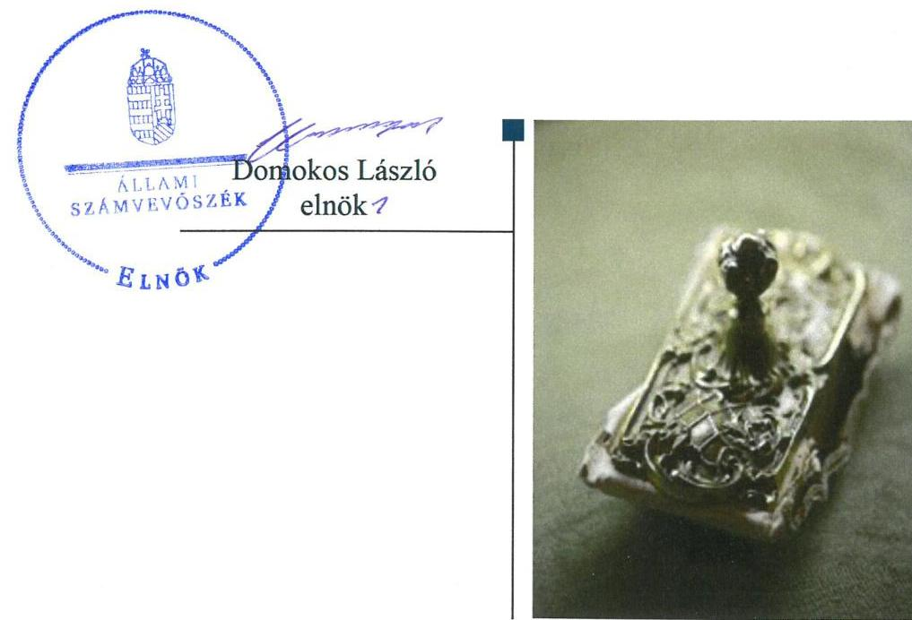
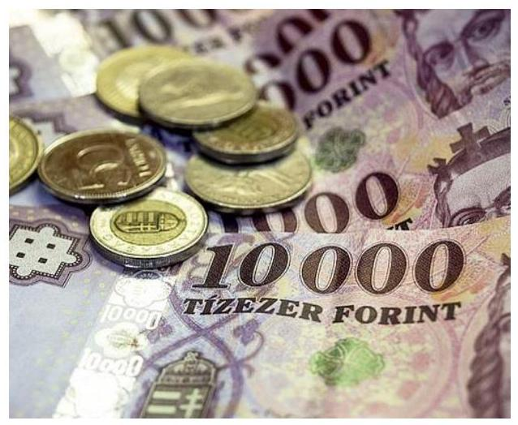
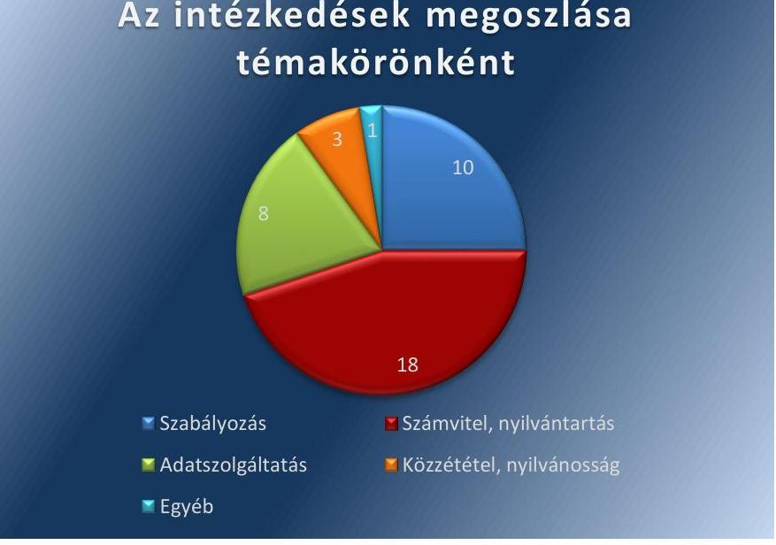
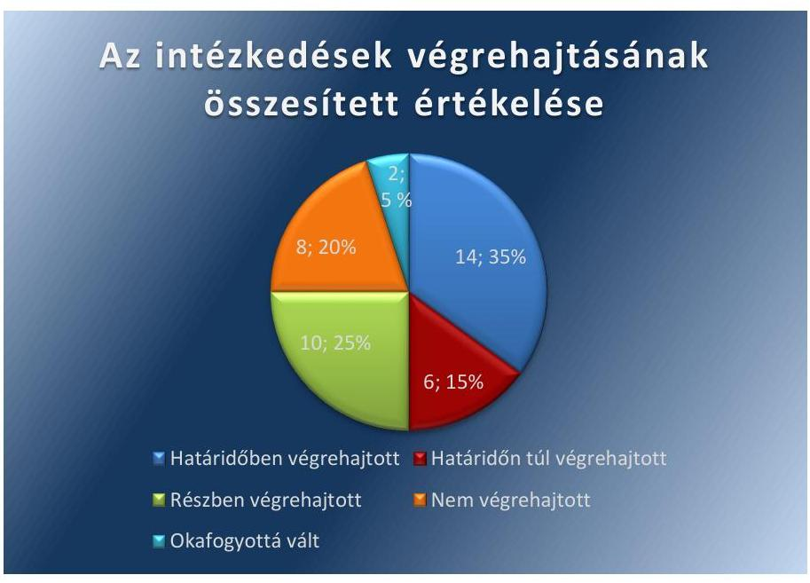
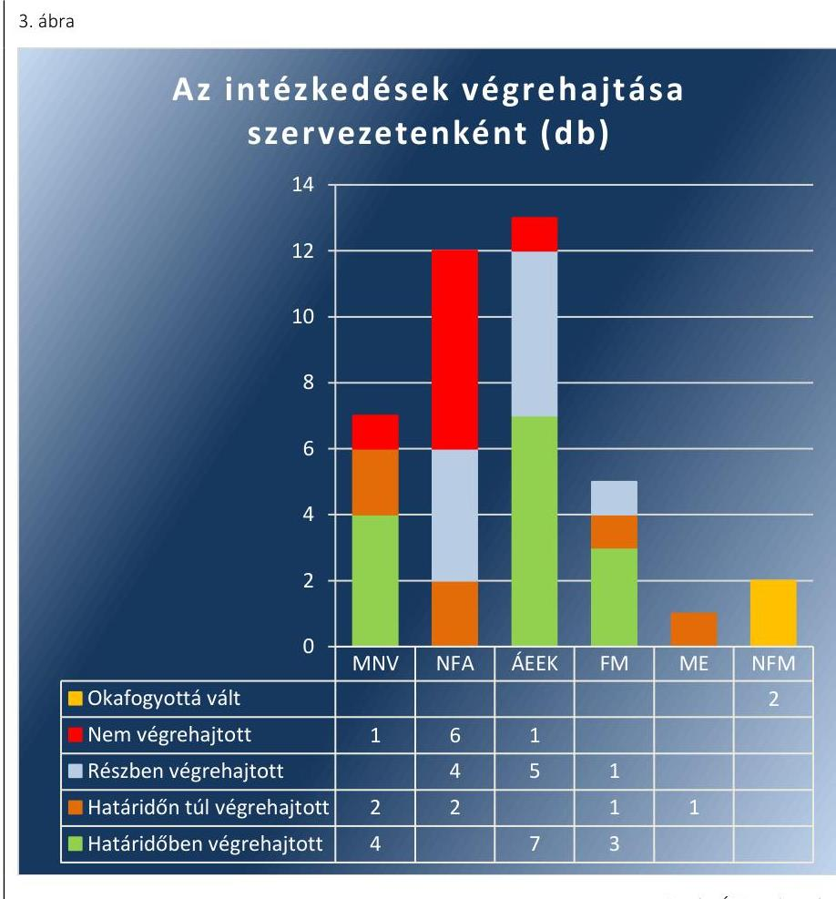

# Jelentés 

## Az állami vagyon feletti tulajdonosi joggyakorlással kapcsolatos tevékenységek ellenőrzése

2019.

---

# Jelenctés 

## Az állami vagyon feletti tulajdonosi joggyakorlással kapcsolatos tevékenységek ellenőrzése

2019. 08. hó 15. nap

---

|  AZ ELLENŐRZÉST FELÜGYELTE: | |
| --- | --- |
|  MAKKAI MÁRIA felügyeleti vezető | |
|  AZ ELLENŐRZÉST VEZETTE ÉS A VÉGREHAJTÁSÁÉRT FELELŐS: | |
|  JANIK JÓZSEF ellenőrzésvezető | |
|  A PROGRAM ÖSSZEÁLLÍTÁSÁÉRT FELELŐS: | |
|  TÓTPÁL SZABOLCS osztályvezető | |
|  A TÉMÁHOZ KAPCSOLÓDÓ KORÁBBI SZÁMVEVŐSZÉKI JELENTÉSEK: | |
|   címe: | |
|   sorszáma: | |
|   címe: | |
|   sorszáma: | |

Jelentéseink az Országgyűlés számítógépes hálózatán és az Interneten a www.asz.hu címen is olvashatóak.

Az állami vagyon feletti tulajdonosi joggyakorlással kapcsolatos tevékenységek ellenőrzése 18203

Az állami vagyon feletti tulajdonosi joggyakorlással kapcsolatos tevékenységek ellenőrzése 17123

IKTATÓSZÁM: EL-1699-001/2019

TÉMASZÁM: 2501

ELLENŐRZÉS-AZONOSÍTÓ SZÁM: V0845

---

# TARTALOMJEGYZÉK 

■ ÖSSZEGZÉS ..... 5
■ AZ ELLENŐRZÉS CÉLJA ..... 6
■ AZ ELLENŐRZÉS TERÜLETE ..... 7
■ AZ ELLENŐRZÉS HÁTTERE, INDOKOLTSÁGA ..... 9
■ A JELENTÉS LÉNYEGES KÉRDÉSKÖREI ..... 10
■ AZ ELLENŐRZÉS HATÓKÖRE ÉS MÓDSZEREI ..... 11
■ MEGÁLLAPÍTÁSOK ..... 14
■ MELLÉKLETEK ..... 21
I. sz. melléklet: Értelmező szótár ..... 21
II/A. sz. melléklet: Az intézkedési terv végrehajtásának értékelése - Magyar Nemzeti Vagyonkezelő Zrt. ..... 23
II/B. sz. melléklet: Az intézkedési terv végrehajtásának értékelése - Nemzeti Földalapkezelő Szervezet ..... 25
II/C. sz. melléklet: Az intézkedési terv végrehajtásának értékelése - Állami Egészségügyi Ellátó Központ ..... 28
II/D. sz. melléklet: Az intézkedési terv végrehajtásának értékelése - Földművelésügyi Minisztérium ..... 31
II/E. sz. melléklet: Az intézkedési terv végrehajtásának értékelése - Nemzeti Fejlesztési Minisztérium; Miniszterelnökség ..... 32
■ FÜGGELÉK: ÉSZREVÉTELEK ..... 33
■ RÖVIDÍTÉSEK JEGYZÉKE ..... 43

---

.

---

# ÖSSZEGZÉS 

A Magyar Nemzeti Vagyonkezelő Zrt. a szabályszerű tulajdonosi joggyakorlást biztosító kontrollokat kialakította, a 100\%-os állami tulajdonú gazdasági társaságok szabályszerű müködését támogatta. Feladatellátásával hozzájárult az állami vagyon rendeltetésének megfelelő, értékmegőrző és értéknövelő hasznosításához.
Az állami vagyon feletti tulajdonosi joggyakorlás 2015-re vonatkozó ellenőrzésének megállapításai alapján készített intézkedési tervekben meghatározott feladatok végrehajtása eredményeként a müködés szabályozottsága és az adatszolgáltatás terén csökkentek a kockázatok. A részben, vagy egyáltalán nem végrehajtott feladatok következtében az állami vagyonnal való átlátható és elszámoltatható gazdálkodás biztositását veszélyeztető legtöbb hiányosság a Nemzeti Földalapkezelő Szervezetnél maradt fenn.

## Az ellenőrzés társadalmi indokoltsága

Az Állami Számvevőszék a közvagyonnal való felelős gazdálkodás elősegítése érdekében, törvényi kötelezettségének is eleget téve minden évben ellenőrzi az állami vagyon feletti tulajdonosi joggyakorlással kapcsolatos tevékenységeket. Az ellenőrzéssel hozzájárul az állami vagyon feletti kontrollok, a felelős, szabályszerű vagyongazdálkodás erősítéséhez, az állami vagyon megóvását, a közjó érdekében való hasznosítását célzó feladatellátás javításához, valamint az annak jövőbeli fejlesztését célzó döntések megalapozott előkészítéséhez. Ezzel támogatja a jó kormányzás gyakorlatát, és objektív képet szolgáltat társadalom részére a közvagyonnal való felelős gazdálkodás megvalósulásáról.

A számvevőszéki munka hasznosulásának javítását is szolgáló utóellenőrzés az ellenőrzések eredményeként feltárt hibák, hiányosságok kijavítását célzó intézkedések tényleges megvalósításának értékelésével szolgálja a közvagyonnal való gazdálkodás átláthatóságának, elszámoltathatóságának erősítését.

## Főbb megállapítások, következtetések

Az állami vagyon feletti tulajdonosi jogok gyakorlásának szabályszerűségét a Magyar Nemzeti Vagyonkezelő Zrt.-nél kialakított kontrollok biztosították. A szervezeti és müködési keretek kialakítása, a belső szabályozások rendszere szabályszerű volt. Az integrált kockázatkezelési rendszert, valamint az információs és kommunikációs folyamatokat a jogszabályi előírásokkal összhangban alakították ki és működtették. Szabályszerűen meghatározták a szervezet tevékenységének, a célok megvalósulásának nyomon követésével kapcsolatos feladatokat, felelősségeket.

A 100\%-os állami tulajdonú gazdasági társaságok alapítása, létrehozása során tett tulajdonosi intézkedések a szabályszerű működési kereteket biztosították, a gazdasági társaságok feladatellátását a Magyar Nemzeti Vagyonkezelő Zrt. a jogszabályokkal összhangban, tervszerűen végrehajtott tulajdonosi ellenőrzésekkel követte nyomon. Az éves beszámolókról való döntéshozatal, az eredmény felosztása szabályszerűen történt.

Az állami vagyon feletti tulajdonosi joggyakorlással kapcsolatos tevékenységek 2015-re vonatkozó ellenőrzéséről készült számvevőszéki jelentés alapján készített intézkedési tervekben meghatározott feladatokat az érintett szervezetek - a Nemzeti Földalapkezelő Szervezet kivételével - többségében elvégezték. Ezek a belső szabályozások, az adatszolgáltatás és a közzététel, nyilvánosság terén eredményezték a tulajdonosi joggyakorlással kapcsolatos tevékenységek szabályszerűségének javulását. Jelentősebb hiányosságok maradtak fenn a vagyon nyilvántartását, az azzal való elszámolást érintően. Az intézkedések jelentős része végrehajtásának részbeni, illetve teljes elmaradása a Nemzeti Földalapkezelő Szervezetnél veszélyeztette a vagyon nyilvántartásának megbízhatóságát, teljes körűségét, az állami vagyon feletti tulajdonosi joggyakorlás átláthatóságát és elszámoltathatóságát.

---

# AZ ELLENŐRZÉS CÉLJA 

Az ellenőrzés célja annak megítélése volt, hogy az államot megillető tulajdonosi jogok és kötelezettségek összességének tulajdonosi joggyakorlójaként a Magyar Nemzeti Vagyonkezelő Zrt. tulajdonosi joggyakorlása megfelelt-e a vonatkozó jogszabályok előírásainak.

Az ellenőrzés további célja annak értékelése volt, hogy az állami vagyon feletti tulajdonosi joggyakorlásra vonatkozó számvevőszéki jelentésben foglalt megállapításokkal összhangban készített intézkedési tervben meghatározott feladatokat az ellenőrzött szervezetek végrehajtották-e.

---

# AZ ELLENŐRZÉS TERÜLETE 

## Az állami vagyon feletti tulajdonosi joggyakorlással kapcsolatos tevékenységek

A közvagyon meghatározó részét kitevő állami vagyonnal való felelős, átlátható és elszámoltatható gazdálkodás követelményét az Alaptörvény rögzíti.

A 2011. december 31-től hatályba lépett Nvtv. ${ }^{1}$ többek között meghatározza a nemzeti vagyon rendeltetését, kategóriáit és a vagyongazdálkodás keretszabályait.

Az állam tulajdonában álló vagyon feletti tulajdonosi joggyakorlás módját, a vagyon védelmének, hasznosításának, kezelésének, nyilvántartásának általánosan érvényes szabályait a Vtv. ${ }^{2}$ állapítja meg. A törvény szerint a tulajdonosi joggyakorlás feladata az állami vagyon rendeltetésének megfelelő, hatékony, költségtakarékos, értékmegőrző, értéknövelő felhasználásának, hasznosításának biztosítása, valamint gyarapítása.

A Vtv. az államot megillető tulajdonosi jogok és kötelezettségek összességének tulajdonosi joggyakorlójaként - törvény vagy miniszteri rendelet eltérő rendelkezése hiányában - az MNV Zrt.-t ${ }^{3}$ nevesíti.

AZ MNV ZRT. a Magyar Állam által alapított egyszemélyes gazdasági társaság, amely felett a tulajdonosi jogokat az állami vagyon felügyeletéért felelős miniszter gyakorolja. Múködésére a Vtv. eltérő rendelkezései hiányában a Ptk. ${ }^{4}$ szabályait kell alkalmazni. Ügyvezetését legfeljebb 7 tagból álló Igazgatóság látja el, múködésének, valamint az állami vagyonnal való gazdálkodásának ellenőrzését öt tagból álló Felügyelő Bizottság végzi. Az MNV Zrt. jogszabályokban nevesített, az állami vagyonnal kapcsolatos feladatai állami feladatnak minősülnek.

A Vtv. rendelkezései szerint az MNV Zrt. felelős az állami vagyon nyilvántartásáért, a tulajdonosi joggyakorlása alá tartozó állami vagyon hasznosításáért, az állami vagyont vele szerződéses jogviszony alapján használó szervezetek, személyek állami vagyonnal való gazdálkodásának rendszeres ellenőrzéséért.

Az MNV Zrt. tulajdonosi joggyakorlása alá 2017-ben összesen 131 gazdasági társaság tartozott. Ezek vagyona a 2016-os beszámolók mérlegfőösszegei alapján összesen mintegy 1978 Mrd Ft-ot tett ki.

AZ UTÓELLENŐRZÉS az állami vagyon feletti tulajdonosi joggyakorlással kapcsolatos tevékenységek 2015-re vonatkozó ellenőrzéséről készült, 2017. július 27-én nyilvánosságra hozott, 17123 számú jelentés javaslatainak és megállapításainak hasznosulását értékelte, az MNV Zrt., mint a legjelentősebb vagyoni kör feletti tulajdonosi joggyakorló mellett öt további szervezetre kiterjedően.

Az NFA ${ }^{5}$ a Nemzeti Földalapba tartozó állami földvagyon feletti tulajdonosi jogokat gyakorolta a Magyar Állam nevében, az agrárpolitikáért felelős miniszter irányításával.

---

Az $\mathrm{FM}^{6}$ miniszter gyakorolta a tulajdonosi jogokat az állami tulajdonban levő erdőgazdálkodási tevékenységet folytató gazdasági társaságok felett, valamint más, mezőgazdasági tevékenységet folytató gazdasági társaságok állami tulajdonú részesedése tekintetében. A 2018-as választásokat követő kormány átalakítás során a minisztérium neve Agrárminisztériumra változott.

Az $\mathrm{NFM}^{7}$ miniszter a koncessziós autópályák, valamint gazdasági társasági részesedések felett gyakorolta a tulajdonosi jogokat. A 2018-as választásokat követő kormány átalakítás során a minisztérium megszűnt, a miniszter állami vagyon felügyeletével kapcsolatos feladatait a nemzeti vagyon kezeléséért felelős tárca nélküli miniszter vette át.

Az $\mathrm{ME}^{8}$ miniszter az állami vagyon feletti tulajdonosi jogokat a Vtv. rendelkezései, valamint az MNV Zrt.-vel kötött megbízási szerződések alapján gyakorolta egyes gazdasági társaságok tekintetében.

Az ÁEEK ${ }^{9}$ gyakorolta a tulajdonosi jogokat az állami tulajdonú egészségügyi intézmények állami egészségügyi feladatellátást szolgáló teljes vagyona tekintetében.

---

# AZ ELLENŐRZÉS HÁTTERE, INDOKOLTSÁGA 

A Vtv. 3. § (4) bekezdése szerint az állami vagyon feletti tulajdonosi joggyakorlással kapcsolatos tevékenységeket az Állami Számvevőszék évente ellenőrzi.

Az ellenőrzéssel az ÁSZ ${ }^{10}$ hozzájárul az állami vagyon feletti kontrollok, a felelős, szabályszerű vagyongazdálkodás erősítéséhez, az állami vagyon megóvását, a közjó érdekében való hasznosítását célzó feladatellátás javításához. Az ellenőrzés eredményeként az ÁSZ véleményt formál arról, hogy a Magyar Állam tulajdonosi jogait gyakorló szervezet működése összhangban volt-e az állami vagyonra vonatkozó jogszabályok rendelkezéseivel. A megállapítások alapján megfogalmazott számvevőszéki javaslatok hasznosítása elősegítheti a meglévő hibák megszüntetését. A jó gyakorlatok bemutatásával az ÁSZ hozzájárulhat a követendő megoldások megismertetéséhez, terjesztéséhez.

---

# A JELENTÉS LÉNYEGES KÉRDÉSKÖREI 

1. Az MNV Zrt.-nél kialakított kontrollok biztositották-e a szabályszerű tulajdonosi joggyakorlást?
2. Az MNV Zrt. szabályszerű feladatellátással támogatta-e a tulajdonosi joggyakorlása alá tartozó gazdasági társaságok müködését?
3. Az ellenőrzött szervezetek az ÁSZ 17123. számú jelentése alapján hozott intézkedési tervekben foglaltakat az elöirt határidőben végrehajtották-e?

---

# AZ ELLENŐRZÉS HATÓKÖRE ÉS MÓDSZEREI 

## Az ellenőrzés típusa

Szabályszerűségi ellenőrzés.

## Az ellenőrzött időszak

Az állami vagyon feletti tulajdonosi joggyakorlás vonatkozásában: a 2017. év.

Az utóellenőrzés vonatkozásában: az utóellenőrzés alapját képező ÁSZ jelentés közzétételének napjától (2017. július 27.) az ellenőrzésről szóló kiértesítő levél keltének napjáig (2019. január 18.) tartó időszak.

## Az ellenőrzés tárgya

Az ellenőrzés tárgya az állami vagyon feletti tulajdonosi joggyakorlással kapcsolatos 2017. évi feladatellátás, továbbá az ÁSZ 17123. számú jelentéséhez kapcsolódó intézkedési tervek végrehajtása volt.

Az ellenőrzés kiterjedt minden olyan körülményre és adatra, amely az ÁSZ jogszabályban meghatározott feladatainak teljesítéséhez, valamint az ellenőrzési program végrehajtása folyamán felmerült újabb összefüggések feltárásához szükséges volt.

## Az ellenőrzött szervezet

A Magyar Nemzeti Vagyonkezelő Zrt., továbbá, kizárólag az utóellenőrzés vonatkozásában a Nemzeti Földalapkezelő Szervezet, az Állami Egészségügyi Ellátó Központ, a Miniszterelnökség, az Agrárminisztérium és a Nemzeti vagyon kezeléséért felelős tárca nélküli miniszter.

## Az ellenőrzés jogalapja

Az ellenőrzés jogszabályi alapját az ÁSZ tv. ${ }^{11}$ S. § (4) bekezdés a) pontjában és 33. § (7) bekezdésében, illetve a Vtv. 3. § (4) bekezdésében foglalt előírások képezték.

---

# Az ellenőrzés módszerei 

Az ellenőrzés végrehajtására az ellenőrzött időszakban hatályos jogszabályok, az ellenőrzés szakmai szabályai, valamint a jelen ellenőrzésre irányadó ÁSZ módszertanok alapján, az ellenőrzési programban foglalt értékelési szempontok szerint került sor.

Az ellenőrzés ideje alatt az ellenőrzött szervezettel történő kapcsolattartás biztosítása az ÁSZ SZMSZ ${ }^{12}$ vonatkozó előírásai alapján történt.

Az ellenőrzés lefolytatásához az ellenőrzött szervezetek tanúsítványok kitöltésével, valamint az ÁSZ által kért dokumentumok megküldésével szolgáltattak adatokat, információkat.

Az ellenőrzési kérdések megválaszolása az ellenőrzöttek által rendelkezésre bocsátott dokumentumokra, adatokra alapozva megfigyelés, szemle (szemrevételezés), valamint elemző eljárás alkalmazásával történt. Az ellenőrzési bizonyítékként felhasználható adatforrások közé tartoztak az ellenőrzési program részletes szempontjainál felsorolt adatforrások, valamint az ellenőrzés folyamán feltárt, az ellenőrzés szempontjából információt tartalmazó dokumentumok is.

Az 2. lényeges kérdéskör megválaszolása érdekében az MNV Zrt. tulajdonosi joggyakorlása alá tartozó gazdasági társaságok múködésével kapcsolatos feladatellátása (létesítő okiratok kiadása, felügyelő bizottsági tagok és a könyvvizsgálók kijelölése, a Tak. tv. ${ }^{13}$ 5.§ (3) bekezdése szerinti szabályzat megalkotása, tulajdonosi ellenőrzések végrehajtása, beszámolók elfogadása, eredmény felosztása, veszteség rendezése) szabályszerűségének ellenőrzése mintavétellel történt.

A mintavétellel ellenőrzött területek esetében minden egyes tétel vonatkozásában a feladatellátás szabályszerűségére vonatkozó kérdések értékelése történt. Szabályszerűnek értékelt az ellenőrzés egy ellenőrzött területet, amennyiben 95\%-os bizonyossággal az ellenőrzött sokaságban az átlagos hibaarány legfeljebb 10\%, nem szabályszerűnek, amennyiben 10\%nál magasabb arányt képviselt.

Az utóellenőrzés során az intézkedési tervekben előírt feladatokat azok végrehajthatósága, illetve végrehajtása szempontjából az alábbiak szerint értékelte az ÁSZ:
„határidőben végrehajtott" a feladat, ha a teljesítés dokumentáltan, az intézkedési tervben előírt határidőben és tartalommal megtörtént;
„határidőn túl végrehajtott" a feladat, ha annak teljesítése az intézkedési tervben meghatározott módon, de az abban előírt határidőn túl történt meg;
„részben végrehajtott" a feladat, ha annak végrehajtása nem teljes körűen az intézkedési tervben előírt módon történt meg;
„nem végrehajtott" a feladat, ha a végrehajtás nem történt meg, dokumentumokkal nem igazolt annak teljesítése;
„okafogyottá vált" a feladat, ha végrehajtására - meghatározott esemény bekövetkezése, továbbá külső körülmény, a működést érintő feltétel változása miatt - már nincs szükség, illetve lehetőség, és egyértelműen megállapítható, hogy az intézkedést szükségessé tevő körülmény a jövőben nem fordulhat elő;

---

$\longrightarrow$„nem időszerű" az a feladat, amelynek ellenőrzési időszakon belüli végrehajtására azért nem került (kerülhetett) sor, mert az intézkedés alapjául szolgáló esemény nem következett be, de annak jövőbeni előfordulása lehetséges, a végrehajtása nem volt esedékes, vagy a végrehajtás határideje még nem járt le.

---

# 1. Az MNV Zrt.-nél kialakított kontrollok biztosították-e a szabályszerű tulajdonosi joggyakorlást? 

Összegző megállapítás

Az MNV Zrt.-nél kialakított kontrollok biztosították a szabályszerű tulajdonosi joggyakorlást.

### 1.1. számú megállapítás

Az MNV Zrt. tulajdonosi joggyakorlással kapcsolatos feladatellátásának kontrollkörnyezete szabályszerű volt.

A SZERVEZETI ÉS MŰKÖDÉSI KERETEKET a tulajdonosi joggyakorlás vonatkozásában szabályszerűen alakították ki.

Az MNV Zrt. rendelkezett jóváhagyott, a tevékenységét, felépítését és működési rendjét tartalmazó SZMSZ-szel ${ }^{14}$. Az MNV Zrt. Igazgatósága testületi müködésének kereteit Ügyrendben ${ }^{15}$ határozta meg.

Az MNV Zrt. vezérigazgatója a Vtv. és a Bkr. ${ }^{16}$ előírásai szerint utasításban szabályozta a szervezeti egységek feladatkörét, a feladatellátás folyamatát, a tulajdonosi joggyakorlással összefüggő ellenőrzési, adatszolgáltatási és beszámolási feladatok teljesítésének rendjét, az állami tulajdonú társaságok vagyongazdálkodási követelményeit, valamint a Vhr.-ben ${ }^{17}$ foglaltakkal összhangban a vagyonnyilvántartás tartalmát, módját és formáját.

A BELSŐ SZABÁLYZATOK a tulajdonosi joggyakorlással kapcsolatos feladatellátást a jogszabályi előírásokkal összhangban szabályozták. A számviteli szabályzatok (számviteli politika, eszközök és források értékelési szabályzata, számlarend, leltározási szabályzat) a Számv.tv. ${ }^{18}$ előírásai szerint készültek. Az MNV Zrt. vezérigazgatója a Kbt. ${ }^{19}$ és a Vtv. irányadó rendelkezései szerint meghatározta a közbeszerzések, egyéb beszerzések és a jogi szolgáltatások igénybevételének szabályait, továbbá a Ltv.ben ${ }^{20}$ foglaltak alapján szabályozta az iratkezelés rendjét.
1.2. számú megállapítás

Az MNV Zrt.-nél a tulajdonosi joggyakorlással kapcsolatos feladatellátás integrált kockázatkezelési rendszerének kialakítása és müködtetése szabályszerű volt.

AZ INTEGRÁLT KOCKÁZATKELÉSI RENDSZER KIALAKÍTÁSA a tulajdonosi joggyakorlás feladatellátása vonatkozásában szabályszerű volt. A Belső kontroll kézikönyv²1 a Bkr. előírásaival összhangban tartalmazta az integrált kockázatkezelési rendszer müködtetéséhez a szervezet tevékenységében rejlő és a szervezeti célokkal összefüggő kockázatok felmérésének, megállapításának módját, a feltárt kockázatokkal kapcsolatban szükséges intézkedések meghozatalára, illetve az ezen intézkedések teljesítésének folyamatos nyomon követésére vonatkozó rendelkezéseket.

---

Az MNV Zrt. vezérigazgatója a Bkr.-ben foglaltaknak megfelelően kijelölte az integrált kockázatkezelési rendszer koordinálásáért felelős személyt.

AZ INTEGRÁLT KOCKÁZATKELÉSI RENDSZER MÜKÖDTETÉSE során a Bkr. előírásai szerint szakterületenként felmérték és értékelték a szervezeti célokkal összefüggő kockázatokat, és ezek alapján meghatározták az egyes kockázatokkal kapcsolatos intézkedéseket.
1.3. számú megállapítás

Az MNV Zrt.-nél az információs és kommunikációs folyamatok kialakítása és múködtetése szabályszerű volt.

AZ INFORMÁCIÓS ÉS KOMMUNIKÁCIÓS RENDSZERT a tulajdonosi joggyakorlással kapcsolatos feladatok vonatkozásában a Bkr. előírásainak megfelelően alakították ki és múködtették a szervezeten belül és kívül egyaránt. Biztosították az Info.tv. ${ }^{22}$ előírásaival összhangban az adatok biztonságának, védelmének érvényre jutását.

A közérdekú adatok megismerésére irányuló igények teljesítésének rendjét az MNV Zrt. vezérigazgatója közzétételi szabályzatban ${ }^{23}$ határozta meg.

Az MNV Zrt. honlapján közzétette a Számv.tv. szerinti saját, illetve a rábízott vagyonról szóló 2016. évi költségvetési beszámolóit.
1.4. számú megállapítás

Az MNV Zrt.-nél a tulajdonosi feladatellátáshoz kapcsolódó célok megvalósításának nyomon követését biztosító rendszer kialakítása szabályszerű volt.

A SZERVEZET TEVÉKENYSÉGÉNEK, A CÉLOK MEGVALÓSULÁSÁNAK NYOMON KÖVETÉSÉT biztosító rendszert a tulajdonosi joggyakorlással kapcsolatos feladatellátás tekintetében az MNV Zrt.-nél kialakították. A 2017. évi vagyonkezelési terv tartalmazta a rábízott vagyonnal kapcsolatos szervezeti célokat, amelyek nyomon követését biztosító előírásokat részben a Belső kontroll kézikönyv, részben a Társasági monitoring szabályzat ${ }^{24}$ rögzítette. Utóbbi szabályozásban meghatározták a feladatok megvalósulását mérő indikátorokat is.

Kialakították a Bkr. rendelkezéseivel összhangban a belső ellenőrzést, valamint a Vtv. szerinti tulajdonosi ellenőrzés rendszerét, amelyek keretszabályait az SZMSZ-ben határozták meg. A jogszabályi előírásokkal összhangban szabályozták a tulajdonosi ellenőrzési és az MNV Zrt. vezetői ellenőrzése körébe tartozó feladatokhoz kapcsolódó eljárásrendeket, valamint az MNV Zrt. Felügyelő Bizottsága ellenőrzési tevékenységét.

---

# 2. Az MNV Zrt. szabályszerű feladatellátással támogatta-e a tulajdonosi joggyakorlása alá tartozó gazdasági társaságok múködését? 

Összegző megállapítás

2.1. számú megállapítás
2.2. számú megállapítás

A MNV Zrt. a tulajdonosi joggyakorlása alá tartozó gazdasági társaságok múködését szabályszerű feladatellátással támogatta.

Az MNV Zrt. a 2017. évben alapított és a 2017. évben jogszabály alapján tulajdonosi joggyakorlása alá helyezett, 100\%-ban állami tulajdonú gazdasági társaságai szabályszerű múködésének feltételeit biztosította.

A GAZDASÁGI TÁRSASÁGOK ALAPÍTÁSA, az alapító okiratok kiadása során az MNV Zrt. a Vtv. előírásai szerint járt el. A gazdasági társaságok alapító okirataiban szabályszerűen rögzítették az MNV Zrt., mint alapító számára fenntartott tulajdonosi jogokat, a kizárólagos hatáskörébe tartozó ügyek körét.

A felügyelő bizottság létrehozását az MNV Zrt. a jogszabályi előírásokkal összhangban a társaságok alapító okirataiban elrendelte, tagjait kijelölte.

A könyvvizsgáló kijelölése minden olyan esetben megtörtént, amelyben a kötelező könyvvizsgálat Számv. tv.-ben rögzített feltételei fennálltak.

A MNV Zrt. minden társaság esetében, amely felett a tulajdonosi jogokat és kötelezettségeket közvetlenül gyakorolta, a Tak. tv. előírásaival összhangban gondoskodott a vezető tisztségviselők, felügyelőbizottsági tagok, és vezető állású munkavállalók javadalmazása, valamint a jogviszony megszűnése esetére biztosított juttatások módjára és mértékére vonatkozó szabályzat megalkotásáról és jóváhagyásáról.

Az MNV Zrt. a 100\%-ban állami tulajdonú gazdasági társaságoknál a tulajdonosi ellenőrzést a jogszabályoknak és belső szabályozásának megfelelően végrehajtotta.

A TULAJDONOSI ELLENŐRZÉSI RENDSZERT az MNV Zrt. a 100\%-ban állami tulajdonú gazdasági társaságoknál a Vtv. és az Nvtv. előírásainak megfelelően kialakította, múködtetésének szabályait a Tulajdonosi ellenőrzési szabályzatban ${ }^{25}$ rögzítette. A tulajdonosi ellenőrzések céljait a Vhr. előírásaival összhangban határozták meg.

Az MNV Zrt. a Vhr. előírásait betartva elkészítette a stratégiai ellenőrzési és az éves ellenőrzési tervét, valamint a tulajdonosi ellenőrzési jelentést az ellenőrzési tapasztalatokról, az azok nyomán tett intézkedésekről.

A tulajdonosi ellenőrzésekről az MNV Zrt. minden esetben szabályszerűen jelentést készített.

---

# 2.3. számú megállapítás 

Az MNV Zrt. a 100\%-ban állami tulajdonú gazdasági társaságok éves beszámolóira vonatkozó döntéshozatal során szabályszerűen járt el.

A GAZDASÁGI TÁRSASÁGOK BESZÁMOLÓINAK elfogadásáról az MNV Zrt., mint a társaságok legfőbb szervének hatáskörét gyakorló egyedüli tag, illetve az általa a Vtv. előírásai alapján tagsági jogok gyakorlásával meghatalmazottak a jogszabályi rendelkezésekkel összhangban hoztak tulajdonosi döntést.

AZ EREDMÉNYFELOSZTÁS során a tulajdonosi joggyakorlók a Ptk. előírásának megfelelően alapítói határozatokban rendelkeztek a nyereség felhasználásáról.

## 3. Az ellenőrzött szervezetek az ÁSZ 17123. számú jelentése alapján hozott intézkedési tervekben foglaltakat az előírt határidőben végrehajtották-e?

Összegző megállapítás

Az ellenőrzött szervezetek az ÁSZ 17123. számú jelentése alapján hozott intézkedési tervekben foglaltak 35\%-át határidőben, 15\%-át határidőn túl, 25\%-át részben hajtották végre. A meghatározott intézkedések 20\%-át nem hajtották végre, és 5\%-uk okafogyottá vált.

Az ellenőrzött szervezetek az ÁSZ állami vagyon feletti tulajdonosi joggyakorlás 2015-re vonatkozó ellenőrzéséről készült jelentésében foglalt 17 javaslatra intézkedési terveikben összesen 40 intézkedést határoztak meg.

Az intézkedések csaknem fele számviteli, nyilvántartási hiányosságok kijavítására vonatkozott, témakörönkénti megoszlásukat az 1. ábra mutatja. 1. ábra

## Az intézkedések megoszlása témakörönként

---

Az ellenőrzött szervezetek az intézkedési tervekben rögzített intézkedések közül összesen 8-at nem hajtottak végre, ezek közül hat a számvitel és nyilvántartás, kettő a szabályozás területét érintette. Az intézkedések végrehajtásának összesített értékeléséről a 2. ábra ad áttekintést.
2. ábra

Forrás: ÁSZ szerkesztés
Az MNV Zrt., az ÁEEK és az FM az intézkedési terveikben meghatározott intézkedések többségét végrehajtotta, az NFM tervezett intézkedései pedig okafogyottá váltak.

Az MNV Zrt. a szabályozás, illetve adatszolgáltatás területét érintő intézkedéseket végrehajtotta, az egy végre nem hajtott intézkedés következtében az állami vagyon naprakész nyilvántartásával kapcsolatban maradtak fenn hiányosságok.

Az ÁEEK a vállalt intézkedések többségét végrehajtotta, ezek eredményeként csökkentek a kockázatok az adatszolgáltatás és a számvitel, nyilvántartás vonatkozásában, azonban továbbra is maradtak fenn hiányosságok a vagyon nyilvántartása és a közzététel, nyilvánosság terén.

Az FM intézkedései az adatszolgáltatás és a közzététel, nyilvánosság területein járultak hozzá a tulajdonosi joggyakorlás szabályszerűségének javításához, nem végrehajtott intézkedése nem volt.

A ME intézkedésének eredményeként a szabályozási hiányosság megszűnt.

Az NFA az intézkedések többségét nem, vagy csak részben hajtotta végre. Ennek következtében fennmaradtak a kockázatok az állami vagyon nyilvántartása, az azzal való elszámolás, valamint a szabályozottság terén.

Az egyes ellenőrzött szervezetek intézkedési terveiben meghatározott intézkedéseket és azok végrehajtását részletesen a 2/A.-2/E. számú mellékletek mutatják be, az intézkedések végrehajtásáról szervezetenként a 3. ábra ad áttekintést.

---

*Forrás: ÁSZ szerkesztés*

---

.

---

# MELLÉKLETEK 

- I. SZ. MELLÉKLET: ÉRTELMEZŐ SZÓTÁR
állami vagyon Állami vagyonnak minősül:
a) az állam tulajdonában lévő dolog, valamint dolog módjára hasznosítható természeti erő;
b) az a) pont alá nem tartozó mindazon vagyon, amely vonatkozásában törvény az állam kizárólagos tulajdonjogát nevesíti;
c) az állam tulajdonában lévő tagsági jogviszonyt megtestesítő értékpapír, illetve az államot megillető egyéb társasági részesedés;
d) az államot megillető olyan immateriális, vagyoni értékkel rendelkező jogosultság, amelyet jogszabály vagyoni értékű jogként nevesít;
e) az állam tulajdonában lévő pénzügyi eszközök.
(Forrás: Vtv. 1. § (2) bekezdés)
belső kontrollrendszer A kockázatok kezelése és tárgyilagos bizonyosság megszerzése érdekében kialakított folyamatrendszer, amely azt a célt szolgálja, hogy:
a) a működés és gazdálkodás során a tevékenységeket szabályszerűen, gazdaságosan, hatékonyan, eredményesen hajtsák végre,
b) az elszámolási kötelezettségeket teljesítsék, és
c) megvédjék az erőforrásokat a veszteségektől, károktól és nem rendeltetésszerű használattól.
(Forrás: az államháztartásról szóló 2011. évi CXCV. törvény 69. § (1) bekezdés)
információ és kommunikáció

Olyan rendszer, amely biztosítja, hogy a megfelelő információk a megfelelő időben eljutnak az illetékes szervezethez, szervezeti egységhez, illetve személyhez, továbbá, hogy a beszámolási rendszerek hatékonyak, megbízhatóak, pontosak és összehasonlíthatóak legyenek, a beszámolási szintek, határidők és módok világosan meg legyenek határozva. (Forrás: Bkr. 9. § (1)-(2) bekezdés)
integrált kockázatkezelés Olyan rendszer, amely biztosítja a szervezet tevékenységében rejlő és a szervezeti célokkal összefüggő kockázatok felmérését és megállapítását, valamint az egyes kockázatokkal kapcsolatban szükséges intézkedések meghatározását, és azok teljesítésének folyamatos nyomon követését.
(Forrás: Bkr. 7. § (1)-(2) bekezdés)
kontrollkörnyezet A szervezet működésének azok az elemei, amelyek biztosítják
a) a világos szervezeti struktúrát, a folyamatok átláthatóságát,
b) az egyértelmú felelősségi, hatásköri viszonyokat és feladatokat,
c) az etikai elvárások meghatározottságát, ismertségét és elfogadottságát a szervezet minden szintjén,
d) az átlátható a humánerőforrás-kezelést,
e) a szervezeti célok és értékek irányában való elkötelezettség fejlesztését és elősegítését.
(Forrás: Bkr. 6. § (1) bekezdés)

---

nemzeti vagyon

A nemzeti vagyonba tartozik:

- az állam vagy a helyi önkormányzat tulajdonában, vagy kizárólagos tulajdonában álló dolgok,
- az állam vagy a helyi önkormányzat tulajdonában lévő pénzügyi eszközök, továbbá az államot vagy a helyi önkormányzatot megillető társasági részesedések, illetve vagyoni értékkel rendelkező jogosultságok,
- a Magyarország határa által körbezárt terület feletti légtér,
- az üvegházhatású gázok kibocsátási egységeinek kereskedelméről szóló törvény szerinti kibocsátási egység és légiközlekedési kibocsátási egység, valamint az ENSZ Éghajlat-változási Keretegyezménye és annak Kiotói Jegyzőkönyve végrehajtási keretrendszeréről szóló törvény szerinti kiotói egység,
- állami vagy helyi önkormányzati fenntartású közgyűjtemény (muzeális intézmény, levéltár, közgyűjteményként működő kép- és hangarchívum, valamint könyvtár) saját gyűjteményében nyilvántartott kulturális javak körébe tartozó dolog, kivéve, ha az más tulajdonában áll,
- a régészeti lelet,
- a nemzeti adatvagyon körébe tartozó állami nyilvántartások fokozottabb védelméről szóló törvény szerinti nemzeti adatvagyon.
(Forrás: Nvtv. 1. § (2) bekezdés)
nyomon követési tevékenység (monitoring)
tulajdonosi ellenőrzés
tulajdonosi joggyakorló
vagyonkezelői jog

A szervezet tevékenységének, a célok megvalósításának nyomon követését biztosító rendszer, amely az operatív tevékenységek keretében megvalósuló folyamatos és eseti nyomon követésből, valamint az operatív tevékenységektől függetlenül működő belső ellenőrzésből áll.
(Forrás: Bkr. 10. §)
A tulajdonosi ellenőrzés célja az állami vagyonnal való gazdálkodás vizsgálata, ennek keretében a rendeltetésellenes, jogszerűtlen, szerződésellenes, vagy a tulajdonos érdekeit sértő, illetve a központi költségvetést hátrányosan érintő vagyongazdálkodási intézkedések feltárása és a jogszerű állapot helyreállítása, továbbá a vagyonnyilvántartás hitelességének, teljességének és helyességének biztosítása.
(Forrás: Vhr. 20. §. (2) bekezdés)
A nemzeti vagyon felett az államot vagy a helyi önkormányzatot megillető tulajdonosi jogok és kötelezettségek összességének gyakorlására jogosult személy.
(Forrás: Nvtv. 3. § (1) bekezdés 17. pont)
A vagyonkezelői jog az állami vagyon hasznosítására a tulajdonosi joggyakorlóval kötött vagyonkezelési szerződéssel jön létre, jogosultja a vagyonkezelő. A vagyonkezelőt megilletik a tulajdonos jogai, terhelik a tulajdonos kötelezettségei azzal, hogy a vagyont nem idegenítheti el, biztosítékul nem adhatja, azon osztott tulajdont nem létesíthet, továbbá a jogszabályban meghatározott kivétellel a vagyont nem terhelheti meg, a vagyonkezelői jogot harmadik személyre nem ruházhatja át, és polgári jogi igényt megalapító, eldöntő tulajdonosi hozzájárulást a vagyonra vonatkozóan hatósági és bírósági eljárásban sem adhat.
(Forrás: Nvtv. 11.§ (1) és (8) bekezdés)

---

# Mellékletek

II/A. 52. MELLÉKLET: AZ INTÉZKEDÉSI TERV VÉGREHAJTÁSÁNAK ÉRTÉKELÉSE - MAGYAR NEMZETI VAGYONKEZELŐ ZRT.

|  Sorszám | Az intézkedési tervben meghatározott feladat (az intézkedési terv szerinti sorszámmal) | Határidő | Felelős | A feladat végrehajtása  |
| --- | --- | --- | --- | --- |
|  Határidőben végrehajtott feladatok |  |  |  |   |
|  1. | 1.2. Javaslattétel a Nemzeti Fejlesztési Minisztérium felé a nemzeti vagyon nyilvántartására vonatkozó jogszabályok módosítására, ideértve különösen az MNV Zrt. ellenőrzési feladatainak meghatározására és ezzel párhuzamosan az adatszolgáltatás megfelelőségéért, helytállóságáért és valóságtartalmáért az adatszolgáltatásra kötelezett felelősségének újraszabályozására. | 2017.10.31. | ingó és ingatlanvagyonért felelős főigazgató | A Vtv. és a Vhr. módosítási javaslatait az MNV Igazgatósága 2017. szeptember 20-án megtárgyalta, és döntött a módosítási javaslat nemzeti fejlesztési miniszter részére való megküldéséről. A módosítási javaslatok tartalmazták az MNV ellenőrzési feladatainak meghatározását, és az adatszolgáltatásra kötelezettek felelősségének újraszabályozását az adatszolgáltatás megfelelőségének javítása érdekében.  |
|  2. | 1.3. A vagyonnyilvántartási feladatok ellátásához szükséges szervezeti struktúra, rendelkezésére álló erőforrások és technikai lehetőségek áttekintése és annak alapján a szükséges javaslatok megtétele. | 2017.11.30. | ingó és ingatlanvagyonért felelős főigazgató | Az ingó és ingatlanvagyonért felelős főigazgató elkészítette a vagyonnyilvántartási feladatokkal kapcsolatos szervezeti struktúra, a rendelkezésére álló erőforrások és technikai lehetőségek áttekintését és a szervezeti átalakítási javaslatokat tartalmazó feljegyzést, amelyet az MNV Zrt. vezérigazgatója 2017. november 21-én megismert és támogatott.  |
|  3. | 3. A Leltározási szabályzat módosítása a Számv. tv. 69. § (3) bekezdésében foglaltaknak megfelelően az MNV Zrt. Saját és Rábízott vagyonának Leltározási szabályzatáról kiadott 16/2016. vez. ig. utasítás 2016. június 1-i hatálybalépésével megtörtént. | az intézkedési terv kiadását megelőzően teljesült | gazdasági
főigazgató | 2016. június 1-től hatályba lépett "Az MNV Zrt. Saját és Rábízott vagyonának Leltározási szabályzata" című, 16/2016. vez. ig. utasítás. amely a Számv. tv. előírásaival összhangban tartalmazta, hogy a mennyiségi felvétellel történő leltározást legalább háromévente kell elvégezni az ingatlanok vonatkozásában. Így az ÁSZ megállapításában rögzített szabálytalanság kijavításra került.  |
|  4. | 4. A Vtv. elektronikus árverési rendszerrel kapcsolatos feladatokra vonatkozó kiegészítését követően az MNV Zrt. SZMSZ 158/2016. (IV.06.) IG határozattal kiadott módosításakor az elektronikus árverési rendszerrel kapcsolatos feladatok beépítésre kerültek az SZMSZ-be. | az intézkedési terv kiadását megelőzően teljesült | - | A 158/2016. (IV.06.) IG., valamint a 360/2017. (VI.21.) IG. határozattal kiadott SZMSZ tartalmazta az elektronikus árverési rendszerrel kapcsolatos feladatokat (19. § (15) bekezdés b) pont).  |

---

|  Sorszám | Az intézkedési tervben meghatározott feladat (az intézkedési terv szerinti sorszámmal) | Határidő | Felelős | A feladat végrehajtása  |
| --- | --- | --- | --- | --- |
|  Határidőn túl végrehajtott feladatok |  |  |  |   |
|  5. | 1.1 A vagyonkezelők vagyonnyilvántartással kapcsolatos és egyéb jogszabályon, illetve szerződésen alapuló adatszolgáltatási kötelezettségeit ismertető és számviteli kitekintést is tartalmazó tájékoztató levél összeállítása és kiküldése. | 2017.09.30. | ingó és ingatlanvagyonért felelős főigazgató | A vagyonkezelőknek címzett, iktatott leveleket keltezésük alapján a vállalt határidőn túl (2017. októberben) készítették el. Ezek tartalmazták a vagyonkataszteri és számviteli adatszolgáltatásra vonatkozó információkat, kötelezettségeket, határidőket.  |
|  6. | 1.4. A jelenleg több szabályzatban foglalt, a Kincstári Vagyonkataszteri jelentést érintő szabályok felülvizsgálatának megkezdése, belső koherencia és technikai háttér vonatkozásában is, továbbá javaslattétel egy egységes MNV Zrt. vezérigazgatói utasítás kialakítására. | 2018.09.15. | ingó és ingatlanvagyonért felelős főigazgató | A helyzetfelérést is tartalmazó előterjesztést a vállalt határidőn túl, 2018. októberben készítették el. Az előterjesztés célja a vagyonnyilvántartási témájú szabályzatok felülvizsgálata, egységesítése, valamint a vagyonkezelt vagyont érintő egyes feladatok hatékonyabb ellátása, és az Országleltár felé a közvetlen adatáramlási kapcsolat elvi alapjainak megteremtése érdekében az Állami Vagyonnyilvántartási Kft.-vel külön megállapodás megkötése. Ennek kapcsán elkészítették az "MNV Zrt. tulajdonosi joggyakorlásába tartozó vagyont érintő Vagyonnyilvántartási Szabályzatáról, különös tekintettel a vagyonkezeléssel összefüggő adatszolgáltatásokra" című utasítás tervezetét is.  |
|  Nem végrehajtott feladat |  |  |  |   |
|  7. | 2. Az MNV Zrt. rábízott vagyonához kapcsolódó gazdasági események SAP rendszerben történő naprakész rögzítése, ezáltal az Áht. és az Ávr. által előírt adatszolgáltatás jogszabályi határidőre történő teljesítése feltételeinek megteremtése. | 2017.12.31. | gazdasági főigazgató, pénzügyi, számviteli és követeléskezelési igazgató | A rábízott vagyonhoz kapcsolódó gazdasági események SAP rendszerben történő naprakész rögzítése nem nyomon követhető, nem történt meg.  |

---

|  Sorszám | Az intézkedési tervben meghatározott feladat (az intézkedési terv szerinti sorszámmal) | Határidő | Felalós | A feladat végrehajtása  |
| --- | --- | --- | --- | --- |
|  Határidőn túl végrehajtott feladatok |  |  |  |   |
|  1. | 1/4.a) A kontirlapot kijavítjuk a vegyes bizonylatnak, azaz a könyvelésnek megfelelően 37milló Ft-ra a 2016. évet érintően, ezért utólagos intézkedést már nem igényel. | 2017.01.05. | gazdasági igazgató | A főkönyvi számla és a bizonylat egyezősége érdekében szükséges számviteli kiigazítást a rögzített határidőn túl, 2017. április 30-án végezték el.  |
|  2. | 1/6. A 11/2011.(II.22.) Korm. rendelet 3. § (2) bekezdés c) pontja) szerinti Országos Erdőállomány Adattár szerinti erdészeti területazonosító, valamint a 4. § ha) és hb) pontja) szerinti erdőgazdálkodói adatoknak a Nemzeti Élelmiszerlánc Biztonsági Hivatal által szolgáltatott adatállománnyal való összevetését követően az @-vatar vagyonnyilvántartási rendszerbe migrálása informatikai fejlesztés útján. | 2017.12.31. | tulajdonosi ellenőrzési és elszámoltatási igazgató, vagyonnyilvántartási igazgató | Az erdőnek minősülő földrészletekre vonatkozó, a Nemzeti Földalap vagyonnyilvántartásának szabályairól szóló jogszabály szerinti adatok áttöltése a nyilvántartó rendszerbe a vállalt határidőt követően, 2018. februárjában történt meg. Az adatok vagyonnyilvántartási rendszerbe migrálásához az informatikai fejlesztést elvégezték.  |
|  Részben végrehajtott feladatok |  |  |  |   |
|  3. | 1/1.a) Az államháztartáson belüli szervezetekkel kötött szerződéseket érintően a 2016. évben lekönyveljük a 2016. évre a tételeket, a földhivatali bejegyző határozat kiadását követően. | 2017.01.05. | gazdasági igazgató | A 2016. IV. negyedévet érintő tételek lekönyvelése történt meg, így a vállalt intézkedést a teljes 2016. év helyett 2016. IV. negyedévre vonatkozóan hajtották végre.  |
|  4. | 1/1.b), 3.b), 4.b) Az @-vatar és FORRÁS SQL interfész kapcsolatának kifejlesztésével biztosítjuk az automatikus feladások megteremtését. | 2018.12.31. | tulajdonosi ellenőrzési és elszámoltatási igazgató | Mivel az intézkedési terv 1/1.b), 3.b) és 4.b) sorszámú intézkedései tartalmilag azonosak, ezek értékelése egy intézkedésként, összevontan történt. Az információtechnológiai fejlesztést, a fejlesztővel való egyeztetéseket elvégezték. A vállalt feladat szerinti automatikus feladások tényleges megvalósulása nem követhető nyomon.  |
|  5. | 1/5.a) 2016. évtől egyeztető ellenőrzések elvégzése. A tulajdonjog változás ingatlannyilvántartásba történő bejegyzésének folyamatos ellenőrzése a beérkezett földhivatali határozatok alapján. | 2017.01.05-től folyamatos, a földhivatali bejegyző határozatok megküldését követően | vagyonnyilvántartási igazgató, gazdasági igazgató | A tulajdonjog változások ingatlannyilvántartásba történő bejegyzésének folyamatos ellenőrzése helyett két konkrét, egyedi esetben hajtották végre a feladatot.  |

---

|  Sorszám | Az intézkedési tervben meghatározott feladat (az intézkedési terv szerinti sorszámmal) | Határidő | Felelős | A feladat végrehajtása  |
| --- | --- | --- | --- | --- |
|  Részben végrehajtott feladatok |  |  |  |   |
|  6. | 2/2.a) A vagyonkezelő jog ingatlannyilvántartásba történő bejegyzését folyamatosan ellenőrizzük a beérkezett földhivatali határozatok alapján. | 2017.01.05-től folyamatos, a földhivatali bejegyző határozatok megküldését követően | vagyonnyilvántartási igazgató | A vagyonkezelői jog ingatlannyilvántartásba való bejegyzésének földhivatali határozatok alapján történő folyamatos ellenőrzése helyett egyedi esetekben (5 db földrészlet vagyonkezelői jogának nyilvántartásba vétele vonatkozásában) végezték el a feladatot.  |
|  Nem végrehajtott feladatok |  |  |  |   |
|  7. | 1/2. Az államháztartáson kívüli szervezetekkel kötött szerződéseket érintően 2017. 01. 05-től folyamatos egyeztető ellenőrzés mellett kerülnek be a vagyonkezelt eszközök a nyilvántartásba. | 2017.01.05-től folyamatos | vagyonnyilvántartási igazgató, gazdasági igazgató | Az egyeztető ellenőrzések folyamatos végrehajtását és a nyilvántartásba vételek ezek alapján történő elvégzését nem végezték el.  |
|  8. | 1/3.a) A vagyonkezelési szerződések megszűnésével érintett eszközök könyv szerinti értékét 2016. évben átvezetjük a 0-ból az 1-es számlaosztályba a 2016. évre. | 2017.01.05. | gazdasági igazgató | A vagyonkezelési szerződések megszűnésével érintett eszközök könyv szerinti értékének a 0-ból az 1-es számlaosztályba való átvezetését nem végezték el.  |
|  9. | 1/5.b) A tulajdonjog változás ellenőrző egyeztetése a Budapest Főváros Kormányhivatal Földmérési, Távérzékelési és Földhivatali Főosztályától kért, december 31-ei fordulónapra történő adatszolgáltatás alapján. | 2017.01.05-től folyamatos, a földhivatali bejegyző határozatok megküldését követően | vagyonnyilvántartási igazgató, gazdasági igazgató | A tulajdonjog változás Budapest Főváros Kormányhivatal Földmérési, Távérzékelési és Földhivatali Főosztályától kért, december 31-ei fordulónapra történő adatszolgáltatás alapján vállalt ellenőrző egyeztetését nem végezték el.  |

---

|  Sorszám | Az intézkedési tervben meghatározott feladat (az intézkedési terv szerinti sorszámmal) | Határidő | Felelős | A feladat végrehajtása  |
| --- | --- | --- | --- | --- |
|  10. | 2/1. Az NFA minden szükséges esetben megkérte a felügyeleti szerv egyetértését (2016. 02. 15-vel) a vagyonkezelői szerződések megkötését megelőzően, ezért utólagos intézkedést nem igényel, de a feladat továbbra is folyamatos. | folyamatos | vagyongazdálkodási igazgató, jogi igazgató | Az NFA 2016.02.15-ét megelőzően egy ügyletre vonatkozóan kérte meg a felügyeleti szerv egyetértését a vagyonkezelői szerződés megkötését megelőzően. A 2016.02.15-ét követő ügyletek esetében a vagyonkezelői szerződések megkötését megelőzően az egyetértést nem kérték meg.  |
|  11. | 2/2.b) A vagyonkezelő jog ingatlannyilvántartásba történő bejegyzését a Budapest Főváros Kormányhivatal Földmérési, Távérzékelési és Földhivatali Főosztályától kért évenkénti, december 31-ei fordulónapra történő adatszolgáltatással összevetjük. | a földhivatali bejegyző határozatok megküldését követően, 2017.01.05-től folyamatos | vagyonnyilvántartási igazgató | Az adatok vállalt feladat szerinti összevetését nem végezték el.  |
|  12. | 2/3. A vagyonkezelési szerződésekben nem szabályozott kérdésekben a mindenkor hatályos magyar jog szabályai az irányadóak, mely kitételt az NFA vonatkozó szerződéseiben beépítjük. A vizsgált időszakban létrejött vagyonkezelési szerződések beazonosítását követően a szerződésekhez csatolni szükséges egy kiegészítő nyilatkozatot. Ebben rögzítjük, hogy a használó az NFA vagyonnyilvántartási szabályzatát megismerte, és azt magára nézve kötelező érvényűnek ismerte el. | 2017.12.31. | vagyongazdálkodási igazgató, jogi igazgató | A feladatban megjelölt kitétel szerződésekbe való beépítését, az ÁSZ megállapításában megjelölt időszakkal (2015. január 1. - október 5.) érintett vagyonkezelési szerződések beazonosítását, és a beazonosítást követően a szerződések kiegészítő nyilatkozattal való ellátását nem végezték el.  |

---

# Mellékletek

II/C. SZ. MELLÉKLET: AZ INTÉZKEDÉSI TERV VÉGREHAJTÁSÁNAK ÉRTÉKELÉSE - ÁLLAMI EGÉSZSÉGÜGYI ELLÁTÓ KÖZPONT

|  Sorszám | Az intézkedési tervben meghatározott feladat (az intézkedési terv szerinti sorszámmal) | Határidő | Felelős | A feladat végrehajtása  |
| --- | --- | --- | --- | --- |
|  Határidőben végrehajtott feladatok |  |  |  |   |
|  1. | 1.a) A rábízott vagyonról készített 2016. évi éves beszámolójának készítése során az ÁEEK figyelembe vette a Számviteli törvény, valamint az ÁEEK értékelési szabályzatának előírásait, a kényszertörlés alatt álló, valamint negatív saját tőkéjű társaságokban lévő részesedéseire értékvesztést számolt el. | az intézkedési terv kiadását megelőzően teljesült | Számviteli
Osztályvezető | A főkönyvi kivonat és az ÁEEK tulajdonosi joggyakorlásába tartozó gazdasági társaságok 2016.12.31-i állapot szerinti kimutatása alapján a tartós részesedések értékvesztését elszámolták.  |
|  2. | 1.c) Az államháztartáson belüli szervezeteknek vagyonkezelésbe adott tárgyi eszközök bruttó értéke és az elszámolt értékcsökkenése a 2016. évben tételesen átvezetésre került a nullás számlaosztály befektetett eszközei közé. | az intézkedési terv kiadását megelőzően teljesült | Számviteli
Osztályvezető | A 0. főkönyvi számlára könyvelésre kerültek az államháztartáson belül vagyonkezelésbe adott tárgyi eszközök és értékcsökkenések a 2016. évre vonatkozóan.  |
|  3. | 1.e) A vagyonkezelők az adatszolgáltatási kötelezettségük határidejére vonatkozóan értesítő levélben kerültek ismételten tájékoztatásra adatszolgáltatási kötelezettségükről, melynek eredményeként teljesítették a Vhr. 14. § (1) bekezdésben foglaltakat. | az intézkedési terv kiadását megelőzően teljesült | Gazdálkodásért
Felelős Igazgató | Az ÁEEK a vagyonkezelőket az adatszolgáltatási kötelezettségük határidejére vonatkozóan 2017. I. félévében levélben értesítette.  |
|  4. | 2.a) Az ÁEEK a rábízott állami vagyonra vonatkozó negyedéves időközi mérlegjelentéseit az államháztartásról szóló törvény végrehajtásáról szóló 368/2011. (XII. 31.) Korm. rendelet 170. § (7) bekezdés előírásait betartva készíti el. Az ellenőrzési jelentésben a múltra vonatkozó, határidőn túl végrehajtott feladatra tett megállapítás került rögzítésre, így a kizárólag a jövőre mutató feladat/intézkedés állapítható meg. | 2017.09.01-től
folyamatos,
a tárgynegyedévet
követő 45 nap | Számviteli
Osztályvezető | A negyedéves mérlegjelentésekre vonatkozó kincstári adatszolgáltatást határidőre végrehajtották.  |
|  5. | 5.a) Az MNV Zrt. részére készített adatszolgáltatások alapjául szolgáló nyilvántartások összehangolásra, valamint aktualizálásra kerültek, így az MNV Zrt. részére megküldésre kerülő, az Országleltár adatszolgáltatás alapját képező adatbázisok teljes körűen megegyeznek a mérlegsorok valamint az analitikus nyilvántartások adataival a 2016. évre vonatkozó adatszolgáltatás tekintetében. | az intézkedési terv kiadását megelőzően teljesült | Számviteli
Osztályvezető | A feladat végrehajtása az adatszolgáltatásra vonatkozó levél, a 2016. IV. negyedévi mérlegjelentés, az ingatlanok analitikája, a tartós részesedések analitikus (értékvesztést is tartalmazó) nyilvántartása, a kezelt vagyon (ingatlanok, gépek, berendezések, beruházások, vagyonkezelésbe adott ingatlanok) analitikája, valamint a 2016. évi beszámoló alapján megtörtént.  |
|  6. | 4.b) A vagyonkezelők részére a 2017. évtől adatbekérő levél kerül megküldésre, amelyben a szerződésben rögzített adatszolgáltatási kötelezettségükre hívja fel a tulajdonosi joggyakorló a figyelmet. | az intézkedési terv kiadását megelőzően teljesült | Vagyonnyilvántartási
Osztályvezető | A vagyonkezelők részére az ÁEEK az adatszolgáltatás teljesítésére vonatkozó leveleket 2017. I. félévében megküldte.  |

---

|  Sorszám | Az intézkedési teriben meghatározott feladat (az intézkedési terv szerinti sorszámmal) | Határidő | Felelős | A feladat végrehajtása  |
| --- | --- | --- | --- | --- |
|  Határidőben végrehajtott feladatok |  |  |  |   |
|  7. | 6. Az Állami Számvevőszék által a 2015. évi gazdálkodási évre vonatkozóan feltárt szabálytalanságok tekintetében a felelősség tisztázására vizsgálat lefolytatása, amelynek keretében megállapításra kerülhet a felelősök köre, valamint a felelősségre vonás érvényesítésének pontos módja. | 2018.03.31. | Gazdasági főigazgatóhelyettes | A Gazdasági Főigazgatóság a vizsgálatot lefolytatta, annak eredményeit az ÁEEK főigazgatója részére 2018.03.20-i dátummal készített feljegyzésében foglalta össze. Megállapítása szerint az érintettek a vizsgálat idején már nem tartoztak az ÁEEK munkavállalói állományába, így felelősségre vonásukra nem volt lehetőség.  |
|  Részben végrehajtott feladatok |  |  |  |   |
|  8. | 1.d) Az államháztartáson kívüli vagyonkezelők részére vagyonkezelésbe adott ingatlanok átadáskor az államháztartás számviteléről szóló 4/2013. (I. 11.) Korm. rendelet 11. § (11) bekezdése előírásainak megfelelően a koncesszióba, vagyonkezelésbe adott eszközök között kerülnek nyilvántartásba vételre. | az intézkedési terv kiadását megelőzően teljesült | Számviteli
Osztályvezető | A feladatot a 2016. év vonatkozásában a főkönyvi kivonat és a kapcsolódó analitika alapján végrehajtották. A 2016. évet követő időszakra vonatkozóan a feladat végrehajtása nem nyomon követhető, nem történt meg.  |
|  9. | 1.f) A CT-EcoSTAT Integrált Gazdasági és Gazdálkodási Rendszer fejlesztése keretében kialakításra kerül egy olyan nyilvántartási rendszer, amely a vagyonérték adatok mellett lehetőséget biztosít a nyilvántartásban szereplő állami vagyon elsődleges rendeltetése szerinti közfeladat megjelölésének rögzítésére. | 2018.06.30. | Gazdálkodásért
Felelős Igazgató | Az ÁEEK vagyonnyilvántartásában elvégezték az állami vagyon elsődleges rendeltetése szerinti közfeladat megjelölésének rögzítését. Ennek a CT-EcoStat Rendszerben történt kifejlesztése azonban nem történt meg.  |
|  10. | 2.b) Az ÁEEK az Info tv. előírásait betartva szerepelteti honlapján az éves beszámolóit. | az intézkedési terv kiadását megelőzően teljesült | Számviteli
Osztályvezető | Az ÁEEK a 2015-2016. évi beszámolók közzétételi kötelezettségének eleget tett, azonban a 2017. évi beszámolót az Info tv. 1. melléklet III. 1. pontja előírásával szemben a honlapon nem tették közzé.  |
|  11. | 3.a) A 2016. július 01-től alkalmazott vagyonkezelési szerződés-minta tartalmazza az ÁEEK, mint tulajdonosi joggyakorló Vagyon-nyilvántartási szabályzatának megismerésére vonatkozó vagyonkezelői nyilatkozatot, mely alapján valamennyi vagyonkezelési szerződés újrakötésre kerül. | 2018.03.31. | Vagyongazdálkodási Főosztályvezető, Jogi és Igazgatási Főosztályvezető | A vagyonkezelési szerződés minta a vállaltak szerint tartalmazta az ÁEEK vagyonnyilvántartási szabályzatának megismerésére vonatkozó vagyonkezelői nyilatkozatot. A vagyonkezelési szerződések feladatban rögzített újrakötését nem végezték el.  |

---

|  Sorszám | Az intézkedési tervben meghatározott feladat (az intézkedési terv szerinti sorszámmal) | Határidő | Felelős | A feladat végrehajtása  |
| --- | --- | --- | --- | --- |
|  12. | 4.a) A Vagyonkezelők részére rendszeres adatszolgáltatási kötelezettség a vagyonkezelési szerződésekben, valamint a Vagyonnyil-vántartási szabályzatban rögzítésre kerül. A jelenleg hatályos vagyonkezelési szerződések 3.13. pontja tartalmazza, hogy „a vagyonkezelő köteles a vagyonkezelésbe kapott vagyonról adatokat szolgáltatni az ÁEEK részére a hatályos jogszabályokban szabályozott, valamint az ÁEEK által kért tartalommal és módon". Ennek értelmében az ÁEEK évente kéri a vagyonkezelőktől az éves záró adatokat alátámasztó, a vagyonkezelésbe adott eszközökről készített leltárt, a követő év május 31-i határidővel. | követő év 05. 31. | Vagyongazdálkodási Főosztályvezető, Jogi és Igazgatási Főosztályvezető | A vagyonkezelési szerződés minta, illetve a hatályos vagyonnyilvántartási szabályzat a vállaltak szerint tartalmazta a vagyonkezelői adatszolgáltatási kötelezettséget. Az éves záró adatokat alátámasztó, a vagyonkezelésbe adott eszközökről készített leltár feladat szerinti bekérése a vagyonkezelőktől nem volt nyomon követhető, nem történt meg.  |
|  13. | 1.b) Az ÁEEK a vagyonkezelésbe adás dátumával kivezeti könyveiből az államháztartáson belüli szervezetek részére vagyonkezelésbe adott tárgyi eszközök bruttó értékét és az elszámolt értékcsökkenést. | 2018.01.01-től folyamatos, a vagyonkezelési szerződés vagy szerződésmódosítás kézhezvételétől számított 30 napon belül | Számviteli
Osztályvezető | Az államháztartáson belüli szervezetek részére vagyonkezelésbe adott tárgyi eszközök bruttó értékének és az elszámolt értékcsökkenésnek a könyvekből a vagyonkezelésbe adás dátumával történő, a feladatban rögzítettek szerinti kivezetését nem végezték el.  |

---

|  Sorszám | Az intézkedési tervben meghatározott feladat (az intézkedési terv szerinti sorszámmal) | Határidő | Felelős | A feladat végrehajtása  |
| --- | --- | --- | --- | --- |
|  **Határidőben végrehajtott feladatok** |  |  |  |   |
|  1. | I./1. Az FM írásban megkeresi az MNV Zrt.-t a Vhr. 13. §-a szerinti, az FM-re rábízott vagyon december 31-i tárgyévi állományával kapcsolatos adatszolgáltatásról szóló megkeresés megküldésének időpontjára, valamint az adatszolgáltatás formai követelményeire és az adatszolgáltatás során megküldendő adatok struktúrájára vonatkozó tájékoztatás céljából. | tárgyévet követő év május 31. | Intézményfelügyeleti és Perképviseleti Főosztály vezetője | A minisztérium az éves adatszolgáltatással kapcsolatban írt információkérő levelét 2018. május 30-án megküldte meg az MNV Zrt.-nek.  |
|  2. | I./2. Az MNV Zrt.-től érkező, az adatszolgáltatással kapcsolatos megkeresés átvételét követően az FM intézkedik az adatszolgáltatás során megküldendő adatok összegyűjtése iránt. | az MNV Zrt. megkeresése beérkezését követően azonnal | Intézményfelügyeleti és Perképviseleti Főosztály vezetője | Az Intézményfelügyeleti és Perképviseleti Főosztály Vagyongazdálkodási Osztály főosztályvezetője (mint kijelölt felelős) az adatszolgáltatás ügyintézésre történt átvételét követően haladéktalanul intézkedett az adatok összegyűjtésére.  |
|  3. | II./1. Az FM valamennyi szervezeti egysége az általa kezelt adatok körében a közérdekű adatok megismeréséhez való jog érvényesülését biztosítja. | folyamatos | FM valamennyi szervezeti egységének vezetője | A közérdekű adatok megismeréséhez való jog érvényesülése érdekében az agrárminiszter 2019. január 16-án kelt utasításával kiadta a közérdekű adatok megismerésére irányuló kérelmek intézésének, a kötelezően közzéteendő adatok nyilvánosságra hozatalának rendjéről szóló szabályzatot.  |
|  **Határidőn túl végrehajtott feladat** |  |  |  |   |
|  4. | I./3. Az FM intézkedik az adatszolgáltatás során kért adatoknak az MNV Zrt. által előírt formában történő megküldése iránt. | tárgyévet követő év június 30. | Intézményfelügyeleti és Perképviseleti Főosztály vezetője | A 2017. december 31-i állapotra vonatkozó adatszolgáltatást a vállalt határidőn túl, 2018. július 16-án teljesítették.  |
|  **Részben végrehajtott feladat** |  |  |  |   |
|  5. | II./2. A II./1. pontban rögzített feladat teljesítése érdekében az FM az Info. tv. által előírt adatokat a honlapján közzéteszi. | Az adatot kezelő szervezeti egység által megjelölt határidő, ill. 3 munkanap | Sajtóiroda vezetője | A közzétételi kötelezettségnek részben tettek eleget, mert nem tették közzé az Info tv. 1. mell. II. 2. pontja ellenére a szervezet feladatáról, tevékenységéről szóló tájékoztatót magyar és angol nyelven a változásokat követően azonnal (a honlap archívumában a 2012-ben közzétett, elavult adatokat tartalmazó dokumentumok voltak elérhetőek), továbbá az Info tv. 1. mell. II. 13. pontja ellenére a közérdekű adatok megismerésére irányuló igények intézésének rendjét.  |

---

# Nemzeti Fejlesztési Minisztérium

|  Sorszám | Az intézkedési tervben meghatározott feladat (az intézkedési terv szerinti sorszámmal) | Határidő | Felelős | A feladat végrehajtása  |
| --- | --- | --- | --- | --- |
|  Okafogyottá vált feladatok |  |  |  |   |
|  1. | 1. Az állami vagyonnal való gazdálkodásról szóló 254/2007. (X. 4.) Korm. rendelet 14. § (3) bekezdésének megfelelően az NFM elkészíti a vagyon-nyilvántartási szabályzatot. A szabályzat elkészítése folyamatban van. | 2017.10.31. | Közmű- és Pénzügyi Szolgáltatási Ágazat Szabályozási és Koordinációs Ügyekért Felelős Helyettes Államtitkárság, Társasági Portfólió Főosztály és Intézményfelügyeleti és Számviteli Főosztály | Az NFM a 2018. áprilisi országgyűlési választásokat követő kormány átalakítás során megszűnt, feladatai több felelős között kerültek felosztásra.  |
|  2. | 2. A részesedések nyilvántartásának a hiányzó adatokkal történő kiegészítése. | 2017.10.31. | Közmű- és Pénzügyi Szolgáltatási Ágazat Szabályozási és Koordinációs Ügyekért Felelős Helyettes Államtitkárság, Társasági Portfólió Főosztály és Intézményfelügyeleti és Számviteli Főosztály | Az NFM a 2018. áprilisi országgyűlési választásokat követő kormány átalakítás során megszűnt, feladatai több felelős között kerültek felosztásra.  |

## Miniszterelnökség

## Határidőn túl végrehajtott feladat

1. 2. Az elkészített vagyonnyilvántartási szabályzat egyedi utasítás formájában történő kiadása.

2017.10.31. területért felelős vezető

A vagyonnyilvántartási szabályzat kiadására a vállalt határidőt követően került sor.

---

# FÜGGELÉK: ÉSZREVÉTELEK 

A jelentéstervezetet a Számvevőszék 15 napos észrevételezésre megküldte az ellenőrzött szervezetek vezetőinek az ÁSZ tv. 29. §* (1) bekezdése előírásának megfelelően.

Az ÁSZ a jelentéstervezetet észrevételezésre megküldte a Magyar Nemzeti Vagyonkezelő Zrt. vezérigazgatójának, a Nemzeti Földalapkezelő Szervezet elnökének, a Miniszterelnökséget vezető miniszternek, az agrárminiszternek, a nemzeti vagyon kezeléséért felelős tárca nélküli miniszternek és az Állami Egészségügyi Ellátó Központ föigazgatójának.
A Miniszterelnökséget vezető miniszter észrevételezési jogával nem élt. Az agrárminiszter nemleges észrevételt tett. A Magyar Nemzeti Vagyonkezelő Zrt. vezérigazgatója, a Nemzeti Földügyi Központ elnöke, a nemzeti vagyon kezeléséért felelős tárca nélküli miniszter, valamint az Állami Egészségügyi Ellátó Központ föigazgatója által tett és az ÁSZ által el nem fogadott észrevételeket, valamint az el nem fogadás indoklását a függelék tartalmazza.

[^0]
[^0]:    * 29. § (1) Az Állami Számvevőszék az ellenőrzési megállapításait megküldi az ellenőrzött szervezet vezetőjének vagy az általa megbízott személynek, és annak, akinek személyes felelősségét állapította meg.
    (2) Az ellenőrzött szervezet vezetője és a felelősként megjelölt személy az ellenőrzés megállapításaira tizenöt napon belül írásban észrevételt tehet.
    (3) Az Állami Számvevőszék az észrevételre a beérkezésétől számított harminc napon belül írásban válaszol. A figyelembe nem vett észrevételeket köteles a jelentésben feltüntetni, és megindokolni, hogy azokat miért nem fogadta el.

---

# Magyar Nemzeti Vagyonkezelő Zrt. 

Észrevétel (jelentéstervezet 24. oldal 7. pontjával kapcsolatban)
Az észrevétel a jelentéstervezetben végre nem hajtott feladatként szerepeltetett, a rábízott vagyonhoz kapcsolódó gazdasági események SAP rendszerben történő naprakész rögzítésének elmaradására és ezáltal az adatszolgáltatási kötelezettség jogszabályi határidőn túli teljesítésére vonatkozik. Az MNV Zrt. az észrevétel szerint az adatszolgáltatási kötelezettségének a Magyar Államkincstár KGR K11 rendszerének hiányosságai miatt nem tett eleget határidőben, az MNV Zrt. rábízott vagyonához kapcsolódó gazdasági eseményeket az SAP rendszerben a jogszabályi előírások szerint rögzítette.

## Az észrevétel el nem fogadásának indoklása:

Az MNV Zrt. az intézkedési tervében a rábízott vagyonhoz kapcsolódó gazdasági események SAP rendszerben történő naprakész rögzítését, ezáltal az Áht. és Ávr. által előírt adatszolgáltatás jogszabályi határidőre történő teljesítése feltételeinek megteremtését tervezte. Az MNV Zrt. a rábízott vagyonhoz kapcsolódó gazdasági események SAP rendszerben történő naprakész rögzítése - azaz az intézkedésben tervezett feladat - alátámasztásához nem bocsátott dokumentumokat az Állami Számvevőszék rendelkezésére. Az Áht. és az Ávr. szerinti adatszolgáltatás teljesítésének igazolására megküldött dokumentumok (Magyar Államkincstárnak teljesített adatszolgáltatás státusztörténetei) alapján az ellenőrzés megállapította, hogy az Áht. és az Ávr. által előírt adatszolgáltatás több alkalommal késedelmesen teljesült. Ezt a megállapítást az észrevételben leírtak is megerősítik. Mindezek alapján a jelentéstervezet módosítása nem indokolt.

## Nemzeti Földalapkezelő Szervezet (jogutód: Nemzeti Földügyi Központ)

Észrevétel (jelentéstervezet összegzésével és főbb megállapítások, következtetések fejezetével kapcsolatban)
Az összegzésre, főbb megállapításokra tett észrevétel szerint az intézkedési tervben előírtak teljesítése megtörtént, egyik feladatnál sem helytálló a „nem végrehajtott" megállapítás, ezért kérik a jelentéstervezet módosítását.

## Az észrevétel el nem fogadásának indoklása:

Az Állami Számvevőszék az ellenőrzés során megállapította, hogy az intézkedési tervben tervezett feladatok közül 6 nem került végrehajtásra, 4 feladatot részben és 2 feladatot határidőn túl hajtottak végre. Ezt megerősítik az NFA észrevételeire a következőkben adott válaszok. Ezért a jelentéstervezet összegző és főbb megállapításainak módosítása nem indokolt.

## Észrevétel (jelentéstervezet II/B. számú melléklet 1. pontjával kapcsolatban)

Az észrevételben az NFA a megállapítást elfogadja.

## Észrevétel (jelentéstervezet II/B. számú melléklet 2. pontjával kapcsolatban)

Az észrevétel szerint a feladat részteljesítése 2017. 12. 31-ig megtörtént, melyet az ellenőrzés rendelkezésére bocsátott dokumentum alátámasztott. A szervezet kéri a 2. pontban szereplő - az erdőnek minősülő földrészletekre vonatkozó adatok nyilvántartó rendszerbe történő áttöltésével összefüggő - megállapítás kiegészítését a határidőben végrehajtott részteljesítéssel.

## Az észrevétel el nem fogadásának indoklása:

A jelentéstervezet megállapítása tartalmazza, hogy az adatok vagyonnyilvántartási rendszerbe migrálásához az informatikai fejlesztést elvégezték. Az észrevételben hivatkozott „1.6 Megrendelés Erdővel való érintettség nyilvántartása" dokumentum a vagyonnyilvántartó rendszer továbbfejlesztésére vonatkozó ajánlat elfogadására vonatkozik. Az ajánlat elfogadása a feladat elvégzését és annak idejét nem igazolja. A fentiekre tekintettel a jelentéstervezet módosítása nem indokolt.

## Észrevétel (jelentéstervezet II/B. számú melléklet 3. pontjával kapcsolatban)

Az államháztartáson belüli szervezetekkel kötött szerződések 2016. évi könyvelésére vonatkozó, részben végrehajtottnak minősített feladattal kapcsolatban tett észrevétel szerint a könyvelés minden negyedévben megtörtént, a 2016. IV. negyedévben került sor a teljes 2016. év felülvizsgálatára és egyeztetésére, ezért került sor könyvelésre a IV. negyedévben. Az észrevételben hivatkoznak az ellenőrzés számára átadott kapcsolódó dokumentumra. Az észrevétel szerint a feladat végrehajtása bizonylatokkal alátámasztva a teljes 2016. évre vonatkozóan megtörtént, kérik a feladatot végrehajtottnak tekinteni.

---

# Az észrevétel el nem fogadásának indoklása: 

Az észrevételben hivatkozott, az adatbekérés során az Állami Számvevőszék rendelkezésére bocsátott „GI_3tan_3sor3a igazoló dokumentum" a 2016. IV. negyedévi vegyes könyvelési bizonylatot tartalmazza. Ezt az észrevétel is megerősíti, az észrevételben csak erre a dokumentumra történik hivatkozás. A megküldött dokumentum alapján az NFA a feladatot a 2016. IV. negyedévben végrehajtotta, a dokumentum a 2016. év egészére vonatkozóan a feladat teljesítését nem igazolja. Mindezek alapján a jelentéstervezet módosítása nem indokolt.

## Észrevétel (jelentéstervezet II/B. számú melléklet 4. pontjával kapcsolatban)

Az észrevétel az @vatar és FORRÁS SQL interfész kapcsolatának kifejlesztésével biztosítani tervezett automatikus feladások megteremtéséhez kapcsolódó feladatra vonatkozik. Az észrevétel szerint az @vatar szakrendszerből történő feladás összesítő FORRÁS rendszerbeli lekérése biztosítja a nyomon követését a feladat megvalósulásának. Az észrevétel szerint a megrendelésben 90501 db földrészlet lekérése valósult meg a BFKH rendszerből 2017 decemberben, mely alapján aktualizálásra került az NFA nyilvántartása. Ezt követően 2018 januárban újabb 97124 db földrészlet lekérdezése, feldolgozása történt meg. Az észrevételben hivatkoznak az ellenőrzés számára átadott kapcsolódó dokumentumokra. Az észrevétel szerint a vizsgálat ideje alatt kifogás nem volt, hogy az automatikus feladások tényleges megvalósulása nem követhető nyomon, a feladat végrehajtása bizonylatokkal alátámasztva megtörtént, az NFA kéri a feladatot végrehajtottnak tekinteni.

## Az észrevétel el nem fogadásának indoklása:

Az Állami Számvevőszék az EL-1428-002/2018. iktatószámú adatbekérő levélben az ellenőrzött időszakra vonatkozóan a 17123. számú jelentés utóellenőrzése vonatkozásában bekérte az ellenőrzési megállapításokhoz kapcsolódó intézkedési tervben meghatározott feladatok végrehajtását alátámasztó, valamint azok teljesülésének eredményét bemutató dokumentumokat, adatbázisokat. Az NFA az adatszolgáltatás keretében megküldött Teljességi és hitelességi nyilatkozatban arról nyilatkozott, hogy az adatbekérő levélben kért adatok kapcsán az Állami Számvevőszék részére átadott dokumentumok a bekért adatokra, dokumentumokra vonatkozóan teljes körű információt tartalmaznak.
Az adatbekérés keretében megküldött és az észrevételben hivatkozott dokumentumok a fejlesztés megrendelését és a fejlesztéshez szükséges műszaki specifikációt, valamint @vatar vagyonnyilvántartási rendszer képkivágásait (jogcímlista, negyedéves összesített lista első oldala, negyedéves tételes lista első oldala) tartalmazzák. A dokumentumok a fejlesztés elvégzését nem igazolják, az automatikus feladások tényleges megvalósulása nem nyomon követhető. Mindezek alapján a jelentéstervezet módosítása nem indokolt.

## Észrevétel (jelentéstervezet II/B. számú melléklet 5. pontjával kapcsolatban)

Az észrevétel a tulajdonjog változás ingatlan-nyilvántartásba történő bejegyzésének folyamatos ellenőrzésére tervezett intézkedésre vonatkozik. Az észrevétel szerint a feladat végrehajtását a szervezet két mintatétel dokumentumainak megküldésével igazolta, tekintettel az érintett adatok terjedelmére. A megrendelésekből látható, hogy tömeges adatszolgáltatás alapján történtek az ingatlanegyeztetések. Az észrevételben hivatkoznak az ellenőrzés számára átadott kapcsolódó dokumentumokra. Az észrevétel szerint a vizsgálat alatt kifogás nem volt, hogy a megküldött 2 db dokumentum nem igazolja a feladat teljesítését, további dokumentumok nem kerültek bekérésre, a feladat végrehajtása bizonylatokkal alátámasztva megtörtént, az NFA kéri a feladatot végrehajtottnak tekinteni.

## Az észrevétel el nem fogadásának indoklása:

Az Állami Számvevőszék az EL-1428-002/2018. iktatószámú adatbekérő levélben az ellenőrzött időszakra vonatkozóan a 17123. számú jelentés utóellenőrzése vonatkozásában bekérte az ellenőrzési megállapításokhoz kapcsolódó intézkedési tervben meghatározott feladatok végrehajtását alátámasztó, valamint azok teljesülésének eredményét bemutató dokumentumokat, adatbázisokat. Az NFA az adatszolgáltatás keretében megküldött Teljességi és hitelességi nyilatkozatban arról nyilatkozott, hogy az adatbekérő levélben kért adatok kapcsán az Állami Számvevőszék részére átadott dokumentumok a bekért adatokra, dokumentumokra vonatkozóan teljes körű információt tartalmaznak.
Az NFA az adatbekérés keretében két darab 2016. évi földhivatali törlést tartalmazó bejegyzéshez az @vatar vagyonnyilvántartási rendszerben történt rögzítés képkivágását küldte meg. A rendelkezésre bocsátott dokumentumok alapján az NFA a feladatot két esetben elvégezte, a tulajdonjog változások ingatlan-nyilvántartásba történő bejegyzése folyamatos ellenőrzését nem végezte el. A fentiek alapján a jelentéstervezet módosítása nem indokolt.

---

# Észrevétel (jelentéstervezet II/B. számú melléklet 6. pontjával kapcsolatban) 

Az észrevétel a vagyonkezelői jog ingatlan-nyilvántartásba történő bejegyzésének folyamatos ellenőrzésére vonatkozó feladathoz kapcsolódik. Az észrevétel szerint az intézkedés teljes körű végrehajtásának bemutatására 5 db mintatételt választott ki a szervezet, tekintettel az érintett ingatlanállomány volumenére. Az észrevételben hivatkoznak az ellenőrzés számára átadott kapcsolódó dokumentumokra. Az észrevétel szerint a vizsgálat alatt kifogás nem volt, hogy a megküldött 5 db minta dokumentumai nem igazolják a feladat teljesítését, további dokumentumok nem kerültek bekérésre. Az észrevétel szerint a feladat végrehajtása bizonylatokkal alátámasztva megtörtént, az NFA kéri a feladatot végrehajtottnak tekinteni.

## Az észrevétel el nem fogadásának indoklása:

Az Állami Számvevőszék az EL-1428-002/2018. iktatószámú adatbekérő levélben az ellenőrzött időszakra vonatkozóan a 17123. számú jelentés utóellenőrzése vonatkozásában bekérte az ellenőrzési megállapításokhoz kapcsolódó intézkedési tervben meghatározott feladatok végrehajtását alátámasztó, valamint azok teljesülésének eredményét bemutató dokumentumokat, adatbázisokat. Az NFA az adatszolgáltatás keretében megküldött Teljességi és hitelességi nyilatkozatban arról nyilatkozott, hogy az adatbekérő levélben kért adatok kapcsán az Állami Számvevőszék részére átadott dokumentumok a bekért adatokra, dokumentumokra vonatkozóan teljes körű információt tartalmaznak.
Az NFA az adatbekérés keretében 5 db ingatlan tekintetében küldte meg a feladat végrehajtását alátámasztó dokumentumokat. A rendelkezésre álló dokumentumok a feladat elvégzését öt konkrét esetben igazolták, a folyamatos ellenőrzés elvégzését nem támasztották alá. Mindezek alapján a jelentéstervezet módosítása nem indokolt.

## Észrevétel (jelentéstervezet II/B. számú melléklet 7. pontjával kapcsolatban)

Az észrevétel a vagyonkezelt eszközök folyamatos egyeztető ellenőrzés melletti nyilvántartásba kerülésével összefüggő, 2017. január 5-étől elvégzendő feladathoz kapcsolódik. Az észrevétel szerint a feladat elvégzésének igazolására mintatételek alapján került sor. Az észrevételben hivatkoznak az ellenőrzés számára átadott kapcsolódó dokumentumokra. Az észrevétel szerint a vizsgálat alatt kifogás nem volt, hogy a megküldött dokumentumok nem igazolják a feladat teljesítését, további dokumentumok nem kerültek bekérésre. Az észrevétel szerint a feladat végrehajtása bizonylatokkal alátámasztva megtörtént, az NFA kéri a feladatot végrehajtottnak tekinteni.

## Az észrevétel el nem fogadásának indoklása:

Az Állami Számvevőszék az EL-1428-002/2018. iktatószámú adatbekérő levélben az ellenőrzött időszakra vonatkozóan a 17123. számú jelentés utóellenőrzése vonatkozásában bekérte az ellenőrzési megállapításokhoz kapcsolódó intézkedési tervben meghatározott feladatok végrehajtását alátámasztó, valamint azok teljesülésének eredményét bemutató dokumentumokat, adatbázisokat. Az NFA az adatszolgáltatás keretében megküldött Teljességi és hitelességi nyilatkozatban arról nyilatkozott, hogy az adatbekérő levélben kért adatok kapcsán az Állami Számvevőszék részére átadott dokumentumok a bekért adatokra, dokumentumokra vonatkozóan teljes körű információt tartalmaznak.
Az NFA által az adatbekérés keretében megküldött dokumentumok példaszerű adatokat (@vatar vagyonnyilvántartási rendszer képkivágások) tartalmaznak. A dokumentumok nem igazolják a folyamatos egyeztető ellenőrzések elvégzését, továbbá az ez alapján történő vagyonnyilvántartásba vételt. Mindezek alapján a jelentéstervezet módosítása nem indokolt.

## Észrevétel (jelentéstervezet II/B. számú melléklet 8. pontjával kapcsolatban)

Az észrevétel a vagyonkezelési szerződések megszűnésével érintett eszközök könyv szerinti értékének 0. számlaosztályból 1. számlaosztályba történő átvezetésével összefüggő feladatra vonatkozik. Az észrevétel szerint a 2015. és 2016. év során nem volt csökkenés a vagyonkezelt területek állományában, hanem növekedés történt minden negyedévben. Ezért két mintatételen a növekedést mutatták be, 1. számlaosztályból a 0 . számlaosztályba történő könyvelést. Az észrevételben hivatkoznak az ellenőrzés számára átadott kapcsolódó dokumentumokra. Az észrevétel szerint a vizsgálat alatt kifogás nem volt, hogy a megküldött dokumentumok nem igazolják a feladat teljesítését, további dokumentumok nem kerültek bekérésre, kérik a feladat irrelevánsnak tekintését.

## Az észrevétel el nem fogadásának indoklása:

Az Állami Számvevőszék az EL-1428-002/2018. iktatószámú adatbekérő levélben az ellenőrzött időszakra vonatkozóan a 17123. számú jelentés utóellenőrzése vonatkozásában bekérte az ellenőrzési megállapításokhoz kapcsolódó intézkedési tervben meghatározott feladatok végrehajtását alátámasztó, valamint azok teljesülésének eredményét

---

bemutató dokumentumokat, adatbázisokat. Az NFA az adatszolgáltatás keretében megküldött Teljességi és hitelességi nyilatkozatban arról nyilatkozott, hogy az adatbekérő levélben kért adatok kapcsán az Állami Számvevőszék részére átadott dokumentumok a bekért adatokra, dokumentumokra vonatkozóan teljes körű információt tartalmaznak.
Az észrevételben hivatkozott, valamint az NFA által az adatbekérés során megküldött dokumentumok a vagyonkezelési szerződések megszűnésével érintett eszközök könyv szerinti értékének a 0 . számlaosztályból az 1. számlaosztályba történő átvezetésének elvégzését nem igazolják, továbbá nem igazolják az átvezetés elvégzésének irreveláns voltát sem. Emiatt a jelentéstervezet megállapításának módosítása nem indokolt.

# Észrevétel (jelentéstervezet II/B. számú melléklet 9. pontjával kapcsolatban) 

Az észrevétel a Budapest Főváros Kormányhivatala Földmérési, Távérzékelési és Földhivatali Főosztályától kért, december 31-ei fordulónapra történő adatszolgáltatás alapján a tulajdonjog változás ellenőrző egyeztetésének elvégzésével kapcsolatos feladatra vonatkozik. Az észrevétel szerint a feladat végrehajtásának bemutatására mintatételeken keresztül került sor az állomány nagyságára való tekintettel, a megrendelésekből látható volt a tömeges adatszolgáltatás alapján történő adategyeztetés. Az észrevételben hivatkoznak az ellenőrzés számára átadott kapcsolódó dokumentumokra. Az észrevétel szerint a vizsgálat alatt kifogás nem volt, hogy a megküldött dokumentumok nem igazolják a feladat teljesítését, további dokumentumok nem kerültek bekérésre. Az észrevétel szerint a feladat végrehajtása bizonylatokkal alátámasztva megtörtént, az NFA kéri a feladatot végrehajtottnak tekinteni.

## Az észrevétel el nem fogadásának indoklása:

Az Állami Számvevőszék az EL-1428-002/2018. iktatószámú adatbekérő levélben az ellenőrzött időszakra vonatkozóan a 17123. számú jelentés utóellenőrzése vonatkozásában bekérte az ellenőrzési megállapításokhoz kapcsolódó intézkedési tervben meghatározott feladatok végrehajtását alátámasztó, valamint azok teljesülésének eredményét bemutató dokumentumokat, adatbázisokat. Az NFA az adatszolgáltatás keretében megküldött Teljességi és hitelességi nyilatkozatban arról nyilatkozott, hogy az adatbekérő levélben kért adatok kapcsán az Állami Számvevőszék részére átadott dokumentumok a bekért adatokra, dokumentumokra vonatkozóan teljes körű információt tartalmaznak.
A megküldött és az észrevételben hivatkozott dokumentumok azt igazolják, hogy Budapest Főváros Kormányhivatala Földmérési, Távérzékelési és Földhivatali Főosztályától az NFA az adatokat megrendelte, továbbá, hogy egy esetben az @vatar vagyonnyilvántartási rendszer és Budapest Főváros Kormányhivatala Földmérési, Távérzékelési és Földhivatali Főosztály adatai megegyeznek. Az adatok egyezősége önmagában nem igazolja az ellenőrzés elvégzését, ezért a dokumentumok az ellenőrzés elvégzését nem támasztják alá. Mindezek alapján a jelentéstervezet módosítása nem indokolt.

## Észrevétel (jelentéstervezet II/B. számú melléklet 10. pontjával kapcsolatban)

Az észrevétel arra a feladatra vonatkozik, amely szerint az NFA-nak minden szükséges esetben meg kell kérnie a felügyeleti szerv egyetértését a vagyonkezelési szerződések megkötését megelőzően. Az észrevétel szerint az NFA valamennyi költségvetési szervvel kötött vagyonkezelési szerződés megkötése előtt megkérte az Nfatv. 20. § (3) bekezdése szerinti egyetértő nyilatkozatot, illetve valamennyi, az Agrárminisztérium (korábban Földművelésügyi Minisztérium) irányítása alá tartozó társaság esetén megkérte a minisztérium alapítói határozatát a 8/2014. FM utasítás alapján, továbbá a szerződések megkötését megelőzően megkérésre kerültek az Nfatv. 23. § (2) bekezdése szerinti miniszteri egyetértő nyilatkozatok. Az ellenőrzés során a mintatételek dokumentumait átadták, a 2019. januári felülvizsgálat alapján egy gazdasági társaság esetében került ismételten csatolásra az intézkedést alátámasztó teljes dokumentáció. Az észrevétel szerint a vizsgálat alatt kifogás nem volt, hogy a megküldött minta dokumentumok nem igazolják a feladat teljesítését, további dokumentumok nem kerültek bekérésre. Az észrevétel szerint a feladat végrehajtása a vizsgált mintatételek esetében bizonylatokkal alátámasztva megtörtént, az NFA kéri a feladatot végrehajtottnak tekinteni.

## Az észrevétel el nem fogadásának indoklása:

Az Állami Számvevőszék az EL-1428-002/2018. iktatószámú adatbekérő levélben az ellenőrzött időszakra vonatkozóan a 17123. számú jelentés utóellenőrzése vonatkozásában bekérte az ellenőrzési megállapításokhoz kapcsolódó intézkedési tervben meghatározott feladatok végrehajtását alátámasztó, valamint azok teljesülésének eredményét bemutató dokumentumokat, adatbázisokat. Az NFA az adatszolgáltatás keretében megküldött Teljességi és hitelességi nyilatkozatban arról nyilatkozott, hogy az adatbekérő levélben kért adatok kapcsán az Állami Számvevőszék

---

részére átadott dokumentumok a bekért adatokra, dokumentumokra vonatkozóan teljes körű információt tartalmaznak.
Az NFA által megküldött dokumentum alapján egy erdőgazdálkodási társasággal történő vagyonkezelési szerződés megkötéséhez a felügyeleti szerv engedélye rendelkezésre állt. Mindez azonban nem igazolja, hogy a feladat - az intézkedési tervben foglaltak szerint - minden szükséges esetben, folyamatosan végrehajtásra került. Emiatt a jelentéstervezet módosítása nem indokolt.

# Észrevétel (jelentéstervezet II/B. számú melléklet 11. pontjával kapcsolatban) 

Az észrevétel a Budapest Főváros Kormányhivatala Földmérési, Távérzékelési és Földhivatali Főosztálytól kért, december 31-ei fordulónapra történő adatszolgáltatásnak a vagyonkezelői jog ingatlan nyilvántartásba történő bejegyzésével való összevetésére irányuló feladatra vonatkozik. Az észrevételben hivatkoznak az ellenőrzés számára átadott kapcsolódó dokumentumokra. Az észrevétel szerint a vizsgálat alatt kifogás nem volt, hogy a megküldött dokumentumok nem igazolják a feladat teljesítését, további dokumentumok nem kerültek bekérésre. Az észrevétel szerint a feladat végrehajtása bizonylatokkal alátámasztva megtörtént, az NFA kéri a feladatot végrehajtottnak tekinteni.

## Az észrevétel el nem fogadásának indoklása:

Az Állami Számvevőszék az EL-1428-002/2018. iktatószámú adatbekérő levélben az ellenőrzött időszakra vonatkozóan a 17123. számú jelentés utóellenőrzése vonatkozásában bekérte az ellenőrzési megállapításokhoz kapcsolódó intézkedési tervben meghatározott feladatok végrehajtását alátámasztó, valamint azok teljesülésének eredményét bemutató dokumentumokat, adatbázisokat. Az NFA az adatszolgáltatás keretében megküldött Teljességi és hitelességi nyilatkozatban arról nyilatkozott, hogy az adatbekérő levélben kért adatok kapcsán az Állami Számvevőszék részére átadott dokumentumok a bekért adatokra, dokumentumokra vonatkozóan teljes körű információt tartalmaznak.
Az ÁSZ rendelkezésére bocsátott és az észrevételben hivatkozott dokumentumok az adatok egyezőségét dokumentálják 5 ingatlan esetében. Az adatok egyezősége nem igazolja az adatok összevetésének elvégzését. A dokumentumok az adatok összevetésének elvégzését nem támasztják alá, ezért a jelentéstervezet módosítása nem indokolt.

## Észrevétel (jelentéstervezet II/B. számú melléklet 12. pontjával kapcsolatban)

Az észrevétel a vagyonkezelési szerződések szabályszerűségével, az NFA vagyonnyilvántartási szabályzatának megismerését tartalmazó nyilatkozat vagyonkezelési szerződésekhez történő csatolásával összefüggő feladathoz kapcsolódik. Az észrevétel szerint a vizsgált időszakban létrejött vagyonkezelési szerződések beazonosítását a szervezet elvégezte, a vagyonkezelési szerződéshez csatolni szükséges kiegészítő nyilatkozatokat elkészítette. A nyilatkozatok 2019. január 29. napján megküldésre kerültek az érintett 27 db vagyonkezelő részére. 25 vagyonkezelő visszaküldte az aláírt nyilatkozatot, amelyek a szerződéstárban a vagyonkezelési szerződésekhez csatolásra kerültek. Az észrevételben hivatkoznak az ellenőrzés számára átadott kapcsolódó dokumentumokra, az NFA kéri a feladatot végrehajtottnak tekinteni.

## Az észrevétel el nem fogadásának indoklása:

Az Állami Számvevőszék az EL-1428-002/2018. iktatószámú adatbekérő levélben az ellenőrzött időszakra vonatkozóan a 17123. számú jelentés utóellenőrzése vonatkozásában bekérte az ellenőrzési megállapításokhoz kapcsolódó intézkedési tervben meghatározott feladatok végrehajtását alátámasztó, valamint azok teljesülésének eredményét bemutató dokumentumokat, adatbázisokat. Az NFA az adatszolgáltatás keretében megküldött Teljességi és hitelességi nyilatkozatban arról nyilatkozott, hogy az adatbekérő levélben kért adatok kapcsán az Állami Számvevőszék részére átadott dokumentumok a bekért adatokra, dokumentumokra vonatkozóan teljes körű információt tartalmaznak.
Az ellenőrzés rendelkezésére bocsátott nyilatkozat minta és megkereső levélminta önmagában nem igazolja azt, hogy a vagyonkezelési szerződések beazonosítása, továbbá az aláírt kiegészítő nyilatkozatok vagyonkezelési szerződésekhez történő csatolása megtörtént. Mindezek alapján a jelentéstervezet módosítása nem indokolt.

---

# Állami Egészségügyi Ellátó Központ 

## Észrevétel (jelentéstervezet II/C. számú melléklet 8. pontjával kapcsolatban)

Az Állami Egészségügyi Ellátó Központ (továbbiakban: ÁEEK) észrevétele az államháztartáson kívüli vagyonkezelők részére kezelésbe adott ingatlanok átadásakor a koncesszióba, vagyonkezelésbe adott eszközök között történő nyilvántartásba vétellel összefüggő feladathoz kapcsolódik. Az észrevétel szerint a 2016. évet követően nem történt olyan esemény, amelynél az államháztartás számviteléről szóló 4/2013. (I. 11.) Korm. rendelet 11. § (11) bekezdésében foglaltakat alkalmazni kellett volna, vagyis nem lépett hatályba olyan vagyonkezelési szerződés, amely államháztartáson kívüli vagyonkezelők részére történő vagyonkezelésbe adást tartalmazott. A 2016. év vonatkozásában végrehajtott feladat során tett intézkedések a 2016. évet követően is nyomon követhetőek a főkönyvi és analitikus nyilvántartásban. Az ÁEEK kéri a vállalt intézkedést a határidőben végrehajtott feladatok közé sorolni.

## Az észrevétel el nem fogadásának indoklása:

Az ÁEEK a 2016. évet követő időszakra vonatkozóan az államháztartáson kívüli vagyonkezelők részére kezelésbe adott ingatlanok nyilvántartását és a főkönyvi kivonatot nem küldte meg az adatbekérés során. Az ellenőrzés nem tudott meggyőződni a feladat 2016. évet követő teljesüléséről. Ezért a jelentéstervezet megállapításának módosítása nem indokolt.

## Észrevétel (jelentéstervezet II/C. számú melléklet 9. pontjával kapcsolatban)

Az észrevételben az állami vagyon elsődleges rendeltetése szerinti közfeladat vagyon-nyilvántartásban történő szerepeltetésére vonatkozó feladat határidőben végrehajtottnak minősítését, a CT-EcoSTAT rendszer fejlesztésének elmaradására vonatkozó megállapítás törlését kérik. Az észrevétel szerint az ellenőrzés során az Állami Számvevőszék megállapítása arra vonatkozott, hogy nem került szerepeltetésre az állami vagyon elsődleges rendeltetése szerinti közfeladat megnevezése. Az ÁEEK Tulajdonosi joggyakorló vállalása a közfeladat szerepeltetése volt, ennek kiegészítéseként vállalta, hogy az analitikus nyilvántartási rendszerére fejlesztést kezdeményez. A fejlesztés egyedi, különleges voltára tekintettel előzetes egyeztetések alapján az ÁEEK nem kérte a fejlesztést, mert az a költségvetését indokolatlanul terhelné, ezért az ÁEEK az elsődleges közfeladat rögzítését továbbra is fejlesztés megrendelése és eredménye nélkül végzi, mint ahogy az utóellenőrzés megállapításai alapján 2017. évben el is végezte.

## Az észrevétel el nem fogadásának indoklása:

Az ÁEEK az intézkedési tervben a CT-EcoSTAT Integrált Gazdasági és Gazdálkodási Rendszer olyan fejlesztését tervezte, amely lehetőséget biztosít a nyilvántartásban szereplő állami vagyon elsődleges rendeltetése szerinti közfeladat megjelölésének rögzítésére. Az észrevétel megerősíti, hogy az ÁEEK ezt a feladatot nem hajtotta végre. A fentiek alapján a jelentéstervezet megállapítása helytálló, annak módosítása nem indokolt.

## Észrevétel (jelentéstervezet II/C. számú melléklet 10. pontjával kapcsolatban)

Az észrevételben az ÁEEK kifogással él az ÁSZ azon megállapításával kapcsolatban, hogy az ÁEEK a 2017. évi beszámolót az Info tv. 1. melléklet III. 1. pontja előírásával szemben a honlapon nem tette közzé, kéri a feladat határidőben végrehajtottnak minősítését. Az észrevétel szerint az Állami Számvevőszék által küldött EL-1428-003/2018. iktatószámú ellenőrzésről értesítő levél 2. számú melléklete (Dokumentumok jegyzéke) szerint a 17123. számú ÁSZ jelentés utóellenőrzése vonatkozásában szükséges az ellenőrzés keretében biztosítani a dokumentumokat, a 2017. év vonatkozásában. A hivatkozott értesítő levélben az ellenőrzött időszak a 2017. január 1-től 2017. december 31-ig tartó időszak. A 2017. évi tulajdonosi joggyakorlásra vonatkozó éves beszámoló elkészítésre határideje 2018. június 30. volt, amely kívül esett az értesítő levélben jelzett időszakon.

## Az észrevétel el nem fogadásának indoklása:

Az Állami Számvevőszék az EL-1428-003/2018. iktatószámú adatbekérő levelében, annak 2. számú mellékletében (Dokumentumok jegyzéke) az ellenőrzött időszakban hatályos, az ellenőrzött időszakra vonatkozóan a 17123. számú jelentés utóellenőrzése vonatkozásában kért be dokumentumokat. Az adatbekérő levél 2. számú mellékletének (Dokumentumok jegyzéke) első bekezdése tartalmazza az ellenőrzött időszak meghatározását az utóellenőrzés vonatkozásában: az utóellenőrzés alapját képező ÁSZ jelentés közzétételének napjától a kiértesítő levél keltének napjáig tartó

---

időszak. Az ÁEEK a megküldött dokumentumok alapján a 2017. évi beszámolót nem tette közzé. Mindezek alapján a jelentéstervezet módosítása nem indokolt.

# Észrevétel (jelentéstervezet II/C. számú melléklet 11. pontjával kapcsolatban) 

Az észrevétel a vagyonkezelési szerződések feladatban rögzített újrakötésének el nem végzésére vonatkozó megállapítást kifogásolja, az ÁEEK kéri a feladat határidőben végrehajtottnak, vagy részben végrehajtottnak minősítését. Az észrevétel szerint az állami vagyonról szóló 2007. évi CVI. törvény 2017. december végi módosítását követően elkészült - a jogszabályváltozással összhangban - az ÁEEK fenntartásában lévő intézményekkel megkötendő új, egységes szerkezetbe foglalt vagyonkezelési szerződésminta, amelynek alapján 2018. évben az ÁEEK fenntartói joggyakorlásába tartozó intézményekkel korábban kötött vagyonkezelési szerződés újrakötése, a szerződések aktualizálása megtörtént. Két intézménynél - az ÁEEK-en kívül álló okból - nem volt lehetőség az ellenőrzött időszakban a vagyonkezelési szerződések újrakötésére, de ezen érintett kórházaknál is az aláírása - határidőn túl végrehajtott feladatként - megtörtént.

## Az észrevétel el nem fogadásának indoklása:

A megküldött dokumentumok alapján megállapítható, hogy a vagyonkezelési szerződés-minta tartalmazza az ÁEEK vagyonnyilvántartási szabályzatának megismerésére vonatkozó vagyonkezelői nyilatkozatot. Egy intézmény esetében az ÁEEK megküldte az újrakötött vagyonkezelési szerződést. A dokumentumok nem támasztják alá, hogy a vagyonkezelési szerződések újrakötése valamennyi esetben megtörtént. Mindezek alapján a jelentéstervezet módosítása nem indokolt

## Észrevétel (jelentéstervezet II/C. számú melléklet 12. pontjával kapcsolatban)

Az észrevétel a vagyonkezelésbe adott eszközökről készített leltárnak a vagyonkezelőktől - meghatározott időpontig - történő bekérése nem teljesülésére vonatkozó megállapítást kifogásolja, kéri a feladat határidőben végrehajtottnak minősítését. Az észrevétel szerint a 17123. számú jelentéshez az ÁEEK a megküldött intézkedési terv módosításban azt vállalta, hogy a Vagyonkezelők rendszeres adatszolgáltatási kötelezettsége a vagyonkezelési szerződésekben, valamint a Vagyonnyilvántartási szabályzatban rögzítésre kerül. Az utóellenőrzéshez megküldött vagyonkezelési szerződésminta 4.10. pontja, valamint az utóellenőrzéshez megküldött 34/2017. számú főigazgatói utasítás Vagyonnyilvántartási szabályzat 4. pontja rendelkezik a vagyonkezelők adatszolgáltatási kötelezettségről, amelyben az ÁEEK, mint tulajdonosi joggyakorló a vagyonkezelők részére előírja az éves adatszolgáltatási kötelezettséget.

## Az észrevétel el nem fogadásának indoklása:

Az ÁEEK az elfogadott intézkedési tervben vállalta, hogy a rendszeres adatszolgáltatási kötelezettség a vagyonkezelési szerződésekben, valamint a Vagyonnyilvántartási szabályzatban rögzítésre kerül. A megküldött dokumentumok alapján a szerződésminta, valamint a Vagyonnyilvántartási szabályzat tartalmazta a vagyonkezelők adatszolgáltatási kötelezettségét. Ugyanakkor a leltár megküldését ténylegesen kérő dokumentumot, illetve ezt tartalmazó vagyonkezelési szerződés(eke)t az ÁEEK nem bocsátott az ellenőrzés rendelkezésére. Mindezek alapján a jelentéstervezet módosítása nem indokolt.

## Észrevétel (jelentéstervezet II/C. számú melléklet 13. pontjával kapcsolatban)

Az észrevétel az ÁEEK intézkedési terv azon - a jelentéstervezetben a nem végrehajtott feladatok között szereplő feladatára vonatkozik, miszerint az ÁEEK a vagyonkezelésbe adás dátumával kivezeti könyveiből az államháztartáson belüli szervezetek részére vagyonkezelésbe adott tárgyi eszközök bruttó értékét és az elszámolt értékcsökkenést. Az észrevétel szerint az Állami Számvevőszék által küldött EL-1428-003/2018. iktatószámú ellenőrzésről értesítő levél 2. számú melléklete (Dokumentumok jegyzéke) szerint a 17123. számú ÁSZ jelentés utóellenőrzése vonatkozásában szükséges az ellenőrzés keretében biztosítani a dokumentumokat, a 2017. év vonatkozásában. A hivatkozott értesítő levélben az ellenőrzött időszak a 2017. január 1-től 2017. december 31-ig tartó időszak. A 17123. számú jelentéshez az ÁEEK részéről megküldött intézkedési terv módosításában a vállalt intézkedést 2018. január 1-től vállalta.
Az ÁEEK az észrevételhez mellékelte a „6.1. Bizonylatok naplója mozgásnemenként" című dokumentumot, amely a 2018. január 1-jétől az államháztartáson belüli szervezetek részére vagyonkezelésbe adott tárgyi eszközök bruttó értéke és elszámolt értékcsökkenése nyilvántartásokból történő kivezetését, és nullás számlaosztályban történő szerepeltetését tartalmazza.

---

# Az észrevétel el nem fogadásának indoklása: 

Az ÁSZ ellenőrzési megállapításai az Állami Számvevőszékről szóló 2011. évi LXVI. törvénynek megfelelően minden esetben az ellenőrzés során bekért és az arra nyitva álló határidőn belül rendelkezésre bocsátott dokumentumokon alapulnak.
Az Állami Számvevőszék az EL-1428-003/2018. iktatószámú adatbekérő levele 2. számú mellékletében (Dokumentumok jegyzéke) az ellenőrzött időszakban hatályos, az ellenőrzött időszakra vonatkozóan a 17123. számú jelentés utóellenőrzése vonatkozásában kért be dokumentumokat. Az adatbekérő levél 2. számú melléklete (Dokumentumok jegyzéke) első bekezdése tartalmazza az ellenőrzött időszak meghatározását az utóellenőrzés vonatkozásában: az utóellenőrzés alapját képező ÁSZ jelentés közzétételének napjától a kiértesítő levél keltének napjáig tartó időszak. Az Állami Számvevőszék az adatbekérés során az ellenőrzési megállapításaihoz kapcsolódó intézkedési tervben meghatározott feladatok végrehajtását alátámasztó, valamint azok teljesülésének eredményét bemutató dokumentumokat, adatbázisokat kérte. Az ÁEEK adatszolgáltatása nem tartalmazta az észrevételben hivatkozott, illetve azzal együtt megküldött dokumentumot. Mindezek alapján az ÁSZ megállapítása helytálló, a jelentéstervezet módosítása nem indokolt.

## Nemzeti vagyon kezeléséért felelős tárca nélküli miniszter

Észrevétel (jelentéstervezet 24. oldal 7. pontjával kapcsolatban)
Az észrevétel a jelentéstervezetben az MNV Zrt. végre nem hajtott feladataként szerepeltetett, a rábízott vagyonhoz kapcsolódó gazdasági események SAP rendszerben történő naprakész rögzítésének elmaradására és ezáltal az adatszolgáltatási kötelezettség jogszabályi határidőn túli teljesítésére vonatkozik. Az észrevétel szerint az MNV Zrt, az Áht. és Ávr. által előírt adatszolgáltatás jogszabályi határidőre történő teljesítésének valóban nem tudott minden esetben teljes körűen eleget tenni, azonban ennek oka nem az SAP rendszerben történő naprakész rögzítés hiányára, hanem arra vezethető vissza, hogy a kincstári KGR K11 rendszer nem tudta fogadni az MNV Zrt. adatszolgáltatásait. A szükséges rendszermódosítások a Magyar Államkincstár 2018 elején hajtotta végre.

## Az észrevétel el nem fogadásának indoklása:

Az MNV Zrt. az intézkedési tervében a rábízott vagyonhoz kapcsolódó gazdasági események SAP rendszerben történő naprakész rögzítését, ezáltal az Áht. és Ávr. által előírt adatszolgáltatás jogszabályi határidőre történő teljesítése feltételeinek megteremtését tervezte. Az MNV Zrt. a rábízott vagyonhoz kapcsolódó gazdasági események SAP rendszerben történő naprakész rögzítése - azaz az intézkedésben tervezett feladat - alátámasztásához nem bocsátott dokumentumokat az Állami Számvevőszék rendelkezésére. Az Áht. és az Ávr. szerinti adatszolgáltatás teljesítésének igazolására megküldött dokumentumok (Magyar Államkincstárnak teljesített adatszolgáltatás státusztörténetei) alapján az ellenőrzés megállapította, hogy az Áht. és az Ávr. által előírt adatszolgáltatás több alkalommal késedelmesen teljesült. Ezt a megállapítást az észrevételben leírtak is megerősítik. Mindezek alapján a jelentéstervezet módosítása nem indokolt.

---

.

---

# RÖVIDÍTÉSEK JEGYZÉKE 

${ }^{1}$ Nvtv.
${ }^{2}$ Vtv.
${ }^{3}$ MNV Zt.
${ }^{4}$ Ptk.
${ }^{5}$ NFA
${ }^{6}$ FM
${ }^{7}$ NFM
${ }^{8}$ ME
${ }^{9}$ ÁEEK
${ }^{10}$ ÁSZ
${ }^{11}$ ÁSZ tv.
${ }^{12}$ ÁSZ SZMSZ
${ }^{13}$ Tak. tv.
${ }^{14}$ SZMSZ
${ }^{15}$ Igazgatóság Ügyrendje
${ }^{16}$ Bkr.
${ }^{17}$ Vhr.
${ }^{18}$ Számv.tv.
${ }^{19}$ Kbt.
${ }^{20}$ Ltv.
${ }^{21}$ Belső kontroll kézikönyv
${ }^{22}$ Info.tv
${ }^{23}$ közzétételi szabályzat
${ }^{24}$ Társasági monitoring szabályzat
${ }^{25}$ Tulajdonosi ellenőrzési szabályzat
a nemzeti vagyonról szóló 2011. évi CXCVI. törvény az állami vagyonról szóló 2007. évi CVI. törvény
Magyar Nemzeti Vagyonkezelő Zárt körűen működő részvénytársaság
a Polgári Törvénykönyvről szóló 2013. évi V. törvény
Nemzeti Földalapkezelő Szervezet
Földművelésügyi Minisztérium (2018. május 18-tól Agrárminisztérium)
Nemzeti Fejlesztési Minisztérium (2018. május 17-ig)
Miniszterelnökség
Állami Egészségügyi Ellátó Központ
Állami Számvevőszék
az Állami Számvevőszékről szóló 2011. évi LXVI. törvény
az Állami Számvevőszék Szervezeti és Működési Szabályzata
2009. évi CXXII. törvény a köztulajdonban álló gazdasági társaságok takarékosabb müködéséről
az MNV Zrt. Szervezeti és Müködési Szabályzata - elfogadva a 158/2016. (IV.06.) IG határozattal, hatályos: 2016. április 15-től 2017. július 1-ig, illetve a 360/2017. (VI.21.) IG határozattal, hatályos: 2017. július 1-től
az MNV Zrt. Igazgatóságának a 306/2010. (XII.20.) IG., a 160/2011. (IV.18.) IG és a 835/2016. (XII.21.) IG. határozattal módosított 1/2010. (VI.24.) IG határozattal elfogadott Ügyrendje
a költségvetési szervek belső kontrolrendszerről és belső ellenőrzéséről szóló 370/2011. (XII.31.) Korm. rendelet
254/2007. (X.4.) Korm. rendelet az állami vagyonnal való gazdálkodásról
2000. évi C. törvény a számvitelről
2015. évi CXLIII. törvény a közbeszerzésekről
2015. évi LXVI. törvény a köziratokról, a közlevéltárakról, és a magánlevéltári anyag védelméről
a 631/2016. (XII.21.) Vig. sz. határozattal kiadott, „Belső kontroll kézikönyv" című 63/2016. sz. MNV Zrt. vezérigazgatói utasítás (hatályos: 2016. december 24-től)
az információs önrendelkezési jogról és az információszabadságról szóló 2011. CXII. törvény
az 504/2016. (X.15.) Vig. sz. határozattal kiadott 52/2016. vezérigazgató utasítás a közérdekú adatok szolgáltatásáról és közzétételének rendjéről (hatályos: 2016.10.15-től 2017.11.18-ig), és az 562/2017. (XI.15.) Vig. sz. határozattal kiadott 30/2017. vezérigazgató utasítás az MNV Zrt. közérdekú adatai szolgáltatásának, valamint közzétételének rendjéről (hatályos: 2017.11.18-tól)
a 355/2016. (VIII.1.) Vig. sz. határozattal kiadott 34/2016. vezérigazgatói utasítás az MNV Zrt. Társasági monitoring szabályzatáról (hatályos: 2016. 08.01-től)
az 528/2016. (IX.21.) IG. sz. határozattal elfogadott, az MNV Zrt. Tulajdonosi ellenőrzési szabályzatát tartalmazó 46/2016. vezérigazgatói utasítás (hatályos: 2016.09.21-től)

---

ÁLLAMI SZÁMVEVŐSZÉK
1052 Budapest, Apáczai Csere János utca 10.
Levélcím: 1364 Budapest 4. Pf. 54
Telefon: +36 14849100 Telefax: +36 14849200
www.asz.hu